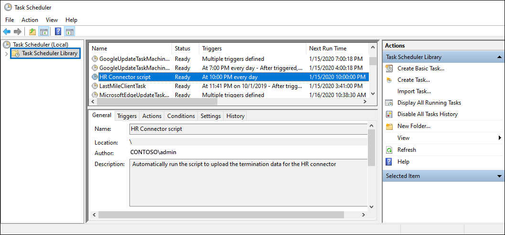

# <a name="set-up-a-connector-to-import-hr-data-in-us-government"></a>Einrichten eines Connectors zum Importieren von Personaldaten in us Government

Sie können einen Datenconnector im Microsoft 365 Compliance Center einrichten, um Personaldaten (Hr)-Daten in Ihre US Government-Organisation zu importieren. Personalbezogene Daten umfassen das Datum, an dem ein Mitarbeiter seinen Kündigungstermin und das Datum des letzten Arbeitstags des Mitarbeiters übermittelt hat. Diese Personaldaten können dann von Microsoft-Informationsschutzlösungen wie der [Insider-Risikomanagementlösung](insider-risk-management.md)verwendet werden, um Ihre Organisation vor böswilligen Aktivitäten oder Datendiebstahl in Ihrer Organisation zu schützen. Das Einrichten eines Personalabteilungsconnector besteht darin, eine App in Azure Active Directory zu erstellen, die für die Authentifizierung per Connector verwendet wird, das Erstellen einer CSV-Zuordnungsdateien, die Ihre Personaldaten enthält, das Erstellen eines Datenconnector im Compliance Center und das Anschließende Ausführen eines Skripts (auf geplanter Basis), das die Personaldaten in der CSV-Datei in die Microsoft-Cloud einschnappt. Anschließend wird der Datenconnector vom Insider-Risikomanagementtool verwendet, um auf die Personaldaten zu zugreifen, die in Ihre organisation Microsoft 365 US Government importiert wurden.

## <a name="before-you-begin"></a>Bevor Sie beginnen

- Dem Benutzer, der den Personalconnector in Schritt 3 erstellt, muss die Rolle Postfachimportexport in der Exchange Online. Standardmäßig ist diese Rolle keiner Rollengruppe in Exchange Online zugewiesen. Sie können die Rolle Postfachimportexport zur Rollengruppe Organisationsverwaltung in der Exchange Online. Sie können auch eine neue Rollengruppe erstellen, die Rolle Postfachimportexport zuweisen und dann die entsprechenden Benutzer als Mitglieder hinzufügen. Weitere Informationen finden Sie in den Abschnitten [Erstellen](/Exchange/permissions-exo/role-groups#create-role-groups) von Rollengruppen oder [Ändern](/Exchange/permissions-exo/role-groups#modify-role-groups) von Rollengruppen im Artikel "Verwalten von Rollengruppen in Exchange Online".

- Sie müssen bestimmen, wie Sie die Daten (regelmäßig) aus dem Personalsystem Ihrer Organisation abrufen oder exportieren und der in Schritt 2 beschriebenen CSV-Datei hinzufügen. Das Skript, das Sie in Schritt 4 ausführen, hochgeladen die Personaldaten in der CSV-Datei in die Microsoft Cloud.

- Mit dem Beispielskript, das Sie in Schritt 4 ausführen, werden Personaldaten in die Microsoft-Cloud hochgeladen, sodass sie von anderen Microsoft-Tools, z. B. der Insider-Risikomanagementlösung, verwendet werden können. Dieses Beispielskript wird in keinem Standardsupportprogramm oder -dienst von Microsoft unterstützt. Das Beispielskript wird wie besehen ohne jegliche Gewährleistung zur Verfügung gestellt. Microsoft schließt ferner alle konkludenten Gewährleistungen, einschließlich, aber nicht beschränkt auf konkludente Gewährleistungen der Marktgängigkeit oder Eignung für einen bestimmten Zweck aus. Das gesamte Risiko, das mit der Verwendung oder Leistung des Beispielskripts und der Dokumentation einhergeht, liegt bei Ihnen. In keinem Fall sind Microsoft, seine Autoren oder an der Erstellung, Produktion oder Übermittlung der Skripts beteiligte Personen für Schäden jeglicher Art (einschließlich und ohne Einschränkung Schäden durch Verlust entgangener Gewinne, Geschäftsunterbrechungen, Verlust von Geschäftsinformationen oder andere geldliche Verluste) haftbar, die aus der Nutzung bzw. Unfähigkeit zur Nutzung der Beispielskripts oder Dokumentation entstehen, auch wenn Microsoft auf die Möglichkeit solcher Schäden hingewiesen wurde.

## <a name="step-1-create-an-app-in-azure-active-directory"></a>Schritt 1: Erstellen einer App in Azure Active Directory

Der erste Schritt besteht im Erstellen und Registrieren einer neuen App in Azure Active Directory (Azure AD). Die App entspricht dem hr-Connector, den Sie in Schritt 3 erstellen. Durch das Erstellen dieser App kann Azure AD den Personalconnector authentifizieren, wenn er ausgeführt wird und versucht, auf Ihre Organisation zu zugreifen. Diese App wird auch verwendet, um das Skript zu authentifizieren, das Sie in Schritt 4 ausführen, um Ihre Personaldaten in die Microsoft Cloud hochzuladen. Achten Sie beim Erstellen dieser Azure AD-App darauf, die folgenden Informationen zu speichern. Diese Werte werden in späteren Schritten verwendet.

- Azure AD-Anwendungs-ID (auch als *App-ID oder* *Client-ID bezeichnet)*

- Geheimer Azure AD-Anwendungsgeheimnis (auch als Geheimer *Clientgeheimnis bezeichnet)*

- Mandanten-ID (auch *Verzeichnis-ID genannt)*

Schrittweise Anweisungen zum Erstellen einer App in Azure AD finden Sie unter Registrieren einer Anwendung bei [der Microsoft Identity Platform](/azure/active-directory/develop/quickstart-register-app).

## <a name="step-2-prepare-a-csv-file-with-your-hr-data"></a>Schritt 2: Vorbereiten einer CSV-Datei mit Ihren Personaldaten

Im nächsten Schritt erstellen Sie eine CSV-Datei, die Informationen zu Mitarbeitern enthält, die Ihre Organisation verlassen haben. Wie im Abschnitt Before You Begin erläutert, müssen Sie bestimmen, wie diese CSV-Datei aus dem Personalsystem Ihrer Organisation generiert wird. Das folgende Beispiel zeigt eine abgeschlossene CSV-Datei (geöffnet im Notizblock), die die drei erforderlichen Parameter (Spalten) enthält. Es ist viel einfacher, die CSV-Datei in einem Microsoft Excel.

```text
EmailAddress,TerminationDate,LastWorkingDate
sarad@contoso.com,2019-04-23T15:18:02.4675041+05:30,2019-04-29T15:18:02.4675041+05:30
pilarp@contoso.com,2019-04-24T09:15:49Z,2019-04-29T15:18:02.7117540
```

In der ersten Zeile oder Kopfzeile der CSV-Datei sind die erforderlichen Spaltennamen aufgeführt. Der name, der in den einzelnen Spaltenkopfzeilen verwendet wird, liegt bei Ihnen (die Namen im vorherigen Beispiel sind Vorschläge). Beim Erstellen des Personalconnector in  Schritt 3 müssen jedoch dieselben Spaltennamen angegeben werden, die Sie in der CSV-Datei verwenden. Fügen Sie keine Leerzeichen in die Spaltennamen ein.

In der folgenden Tabelle werden die einzelnen Spalten in der CSV-Datei beschrieben:

| Spaltenname | Beschreibung |
|:-----|:-----|
| **EmailAddress** <br/> |Gibt die E-Mail-Adresse des gekündigten Mitarbeiters an.|
| **TerminationDate** <br/> |Gibt das Datum an, an dem die Beschäftigung der Person in Ihrer Organisation offiziell beendet wurde. Dies kann z. B. das Datum sein, an dem der Mitarbeiter seine Benachrichtigung zum Verlassen Ihrer Organisation gegeben hat. Dieses Datum kann sich vom Datum des letzten Arbeitstags der Person unterscheiden. Verwenden Sie das folgende Datumsformat: , bei dem es sich um das Datums- und Uhrzeitformat `yyyy-mm-ddThh:mm:ss.nnnnnn+|-hh:mm` [iso 8601 handelt.](https://www.iso.org/iso-8601-date-and-time-format.html)|
|**LastWorkingDate**|Gibt den letzten Arbeitstag für den gekündigten Mitarbeiter an. Verwenden Sie das folgende Datumsformat: , bei dem es sich um das Datums- und Uhrzeitformat `yyyy-mm-ddThh:mm:ss.nnnnnn+|-hh:mm` [iso 8601 handelt.](https://www.iso.org/iso-8601-date-and-time-format.html)|
|||

Nachdem Sie die CSV-Datei mit den erforderlichen Personaldaten erstellt haben, speichern Sie sie auf demselben System wie das Skript, das Sie in Schritt 4 ausführen. Implementieren Sie unbedingt eine Updatestrategie, damit die CSV-Datei immer die aktuellen Informationen enthält. Dadurch wird sichergestellt, dass unabhängig davon, was Sie das Skript ausführen, die aktuellen Mitarbeiterentkündigungsdaten in die Microsoft Cloud hochgeladen werden.

## <a name="step-3-create-the-hr-connector"></a>Schritt 3: Erstellen des Hr-Connectors

Der nächste Schritt besteht im Erstellen eines Personalconnector im Microsoft 365 Compliance Center. Nachdem Sie das Skript in Schritt 4 ausgeführt haben, übergibt der von Ihnen erstellte Hr-Connector die Hr-Daten aus der CSV-Datei Microsoft 365 Organisation. Kopieren Sie in diesem Schritt unbedingt die Auftrags-ID, die beim Erstellen des Connectors generiert wird. Sie verwenden die Auftrags-ID, wenn Sie das Skript ausführen.

1. Wechseln Sie [https://compliance.microsoft.com](https://compliance.microsoft.com) zu,  und klicken Sie dann im linken Navigations navi auf Datenconnectors.

2. Klicken Sie **auf der Seite Datenconnectors** unter **HR** auf **Anzeigen**.

3. Klicken Sie **auf der** Seite Personalwesen auf **Connector hinzufügen.**

4. Gehen Sie auf der Seite **Authentifizierungsanmeldeinformationen** wie folgt vor, und klicken Sie dann auf **Weiter**:

   1. Geben Sie die Azure AD-Anwendungs-ID für die Azure-App ein, die Sie in Schritt 1 erstellt haben, oder fügen Sie sie ein.

   1. Geben Sie einen Namen für den Hr-Connector ein.

5. Geben Sie **auf** der Seite Dateizuordnung die Namen der drei Spaltenkopfzeilen (auch Parameter *genannt)* aus der CSV-Datei ein, die Sie in Schritt 2 in jedem der entsprechenden Felder erstellt haben. Bei den Namen wird die Zwischenschreibung nicht beachtet. Wie bereits erläutert, müssen die Namen, die Sie in diese Felder eingeben, mit den Parameternamen in der CSV-Datei übereinstimmen. Der folgende Screenshot zeigt beispielsweise die Parameternamen aus dem Beispiel in der BEISPIEL-CSV-Datei in Schritt 2.

   

6. Überprüfen Sie **auf** der Seite Überprüfen Ihre Einstellungen, und klicken Sie dann auf **Fertig** stellen, um den Connector zu erstellen.

   Es wird eine Statusseite angezeigt, die bestätigt, dass der Connector erstellt wurde. Diese Seite enthält zwei wichtige Dinge, die Sie zum Ausführen des Beispielskripts zum Hochladen Ihrer Personaldaten im nächsten Schritt ausführen müssen.

   

   1. **Auftrags-ID.** Sie benötigen diese Auftrags-ID, um das Skript im nächsten Schritt auszuführen. Sie können es von dieser Seite oder von der Flyoutseite des Connectors kopieren.
   
   1. **Link zum Beispielskript.** Klicken Sie **auf den Link** hier, um zur GitHub zu wechseln, um auf das Beispielskript zu zugreifen (der Link öffnet ein neues Fenster). Lassen Sie dieses Fenster geöffnet, damit Sie das Skript in Schritt 4 kopieren können. Alternativ können Sie das Ziel mit einem Lesezeichen versehen oder die URL kopieren, damit Sie in Schritt 4 erneut darauf zugreifen können. Dieser Link ist auch auf der Flyoutseite des Connectors verfügbar.

7. Klicken Sie auf **Fertig**.

   Der neue Connector wird in der Liste auf der Registerkarte **Connectors** angezeigt. 

8. Klicken Sie auf den Hr-Connector, den Sie gerade erstellt haben, um die Flyoutseite mit Eigenschaften und anderen Informationen zum Connector angezeigt zu werden.

   

   Wenn Sie dies noch nicht getan haben, können Sie die Werte für die **Azure App-ID** und **die Connector-Auftrags-ID kopieren.** Sie benötigen diese, um das Skript im nächsten Schritt auszuführen. Sie können das Skript auch von der Flyoutseite herunterladen (oder es über den Link im nächsten Schritt herunterladen.)

   Sie können auch auf **Bearbeiten klicken,** um die Azure App-ID oder die Spaltenkopfnamen zu ändern, die Sie auf der Seite **Dateizuordnung definiert** haben.

## <a name="step-4-run-the-sample-script-to-upload-your-hr-data"></a>Schritt 4: Ausführen des Beispielskripts zum Hochladen Ihrer Personaldaten

Der letzte Schritt beim Einrichten eines Personalconnector besteht in der Ausführung eines Beispielskripts, das die Personaldaten in der CSV-Datei (die Sie in Schritt 2 erstellt haben) in die Microsoft-Cloud hochzuladen. Insbesondere lädt das Skript die Daten in den Hr-Connector hoch. Nachdem Sie das Skript ausgeführt haben, importiert der in Schritt 3 erstellte Hr-Connector die Personaldaten in Ihre Microsoft 365-Organisation, auf die sie von anderen Compliancetools wie der Insider-Risikomanagementlösung zugegriffen werden kann. Nachdem Sie das Skript ausgeführt haben, sollten Sie eine Aufgabe so planen, dass sie täglich automatisch ausgeführt wird, damit die aktuellen Mitarbeiterbeendigungsdaten in die Microsoft Cloud hochgeladen werden. Weitere [Informationen finden Sie unter Schedule the script to run automatically](#optional-step-6-schedule-the-script-to-run-automatically).

1. Wechseln Sie zu Fenster, das Sie im vorherigen Schritt geöffnet haben, um mit dem Beispielskript auf GitHub website zu zugreifen. Öffnen Sie alternativ die Mit Lesezeichen versehene Website, oder verwenden Sie die url, die Sie kopiert haben.

2. Klicken Sie auf **die Schaltfläche Raw,** um das Skript in der Textansicht anzeigen zu können.

3. Kopieren Sie alle Zeilen im Beispielskript, und speichern Sie sie dann in einer Textdatei.

4. Ändern Sie bei Bedarf das Beispielskript für Ihre Organisation.

5. Speichern Sie die Textdatei als Windows PowerShell Skriptdatei mithilfe eines Dateinamensuffixs von ; z. B. `.ps1` `HRConnector.ps1` .

6. Öffnen Sie eine Eingabeaufforderung auf dem lokalen Computer, und wechseln Sie zu dem Verzeichnis, in dem Sie das Skript gespeichert haben.

7. Führen Sie den folgenden Befehl aus, um die #A0 in der #A1 in die #A1 hochzuladen. Zum Beispiel:

    ```powershell
    .\HRConnector.ps1 -tenantId <tenantId> -appId <appId>  -appSecret <appSecret>  -jobId <jobId>  -csvFilePath '<csvFilePath>'
    ```

   In der folgenden Tabelle werden die Parameter beschrieben, die mit diesem Skript verwendet werden müssen, und deren erforderliche Werte. Die Informationen, die Sie in den vorherigen Schritten erhalten haben, werden in den Werten für diese Parameter verwendet.

   | Parameter | Beschreibung |
   |:-----|:-----|:-----|
   |`tenantId`|Die ID für Microsoft 365 Organisation, die Sie in Schritt 1 erhalten haben. Sie können die Mandanten-ID für Ihre Organisation auch auf dem **Blatt Übersicht im** Azure AD Admin Center abrufen. Dies wird verwendet, um Ihre Organisation zu identifizieren.|
   |`appId` |Die Azure AD-Anwendungs-ID für die App, die Sie in Azure AD in Schritt 1 erstellt haben. Dies wird von Azure AD für die Authentifizierung verwendet, wenn das Skript versucht, auf Ihre Microsoft 365 zu greifen. |
   |`appSecret`|Der geheime Azure AD-Anwendungsgeheimnis für die App, die Sie in Azure AD in Schritt 1 erstellt haben. Dies wird auch für die Authentifizierung verwendet.|
   |`jobId`|Die Auftrags-ID für den hr-Connector, den Sie in Schritt 3 erstellt haben. Dies wird verwendet, um die hr-Daten, die in die Microsoft-Cloud hochgeladen werden, dem Hr-Connector zuzuordnen.|
   |`csvFilePath`|Der Dateipfad für die CSV-Datei (gespeichert auf demselben System wie das Skript), das Sie in Schritt 2 erstellt haben. Versuchen Sie, Leerzeichen im Dateipfad zu vermeiden. verwenden Sie andernfalls einfache Anführungszeichen.|
   |||
   
   Hier ist ein Beispiel für die Syntax für das #A0 mit tatsächlichen Werten für jeden Parameter:

   ```powershell
    .\HRConnector.ps1 -tenantId d5723623-11cf-4e2e-b5a5-01d1506273g9 -appId 29ee526e-f9a7-4e98-a682-67f41bfd643e -appSecret MNubVGbcQDkGCnn -jobId b8be4a7d-e338-43eb-a69e-c513cd458eba -csvFilePath 'C:\Users\contosoadmin\Desktop\Data\employee_termination_data.csv'
    ```

   Wenn der Upload erfolgreich war, zeigt das Skript die Hochladen **Meldung Erfolgreich** an.

   > [!NOTE]
   > Wenn Sie Probleme beim Ausführen des vorherigen Befehls aufgrund von Ausführungsrichtlinien haben, finden Sie unter [Informationen](/powershell/module/microsoft.powershell.core/about/about_execution_policies) zu Ausführungsrichtlinien und [Set-ExecutionPolicy](/powershell/module/microsoft.powershell.security/set-executionpolicy) Anleitungen zum Festlegen von Ausführungsrichtlinien.

## <a name="step-5-monitor-the-hr-connector"></a>Schritt 5: Überwachen des Hr-Connectors

Nachdem Sie den Hr-Connector erstellt und das Skript ausgeführt haben, um Ihre Personaldaten hochzuladen, können Sie den Connector und den Uploadstatus im compliance center Microsoft 365 anzeigen. Wenn Sie planen, dass das Skript regelmäßig automatisch ausgeführt wird, können Sie auch den aktuellen Status nach dem letzten Ausführen des Skripts anzeigen.

1. Wechseln Sie [https://compliance.microsoft.com](https://compliance.microsoft.com) zu, und klicken Sie **im** linken Navigations navi auf Datenconnectors.

2. Klicken Sie auf **die** Registerkarte Connectors, und wählen Sie dann den Hr-Connector aus, um die Flyoutseite anzeigen zu können. Diese Seite enthält die Eigenschaften und Informationen zum Connector.

   

3. Klicken **Sie unter Fortschritt** auf den Link **Protokoll** herunterladen, um das Statusprotokoll für den Connector zu öffnen (oder zu speichern). Dieses Protokoll enthält Informationen zu jedem Ausführen und Hochladen der Daten aus der CSV-Datei in die Microsoft Cloud. 

   

   Das `RecordsSaved` Feld gibt die Anzahl der Zeilen in der hochgeladenen CSV-Datei an. Wenn die CSV-Datei beispielsweise vier Zeilen enthält, ist der Wert der Felder 4, wenn das Skript alle Zeilen in der `RecordsSaved` CSV-Datei erfolgreich hochgeladen hat.

Wenn Sie das Skript in Schritt 4 nicht ausgeführt haben, wird unter Letzter Import ein Link zum Herunterladen des **Skripts angezeigt.** Sie können das Skript herunterladen und dann die Schritte in Schritt 4 ausführen, um es auszuführen.

## <a name="optional-step-6-schedule-the-script-to-run-automatically"></a>(Optional) Schritt 6: Planen der automatischen Ausführung des Skripts

Um sicherzustellen, dass tools wie der Insider Risk Management-Lösung die neuesten Personaldaten aus Ihrer Organisation zur Verfügung stehen, wird empfohlen, das Skript regelmäßig automatisch auszuführen, z. B. einmal am Tag. Dies erfordert auch, dass Sie die Personaldaten in der CSV-Datei nach einem ähnlichen (wenn nicht demselben) Zeitplan aktualisieren, sodass sie die neuesten Informationen zu Mitarbeitern enthält, die Ihre Organisation verlassen. Das Ziel ist es, die aktuellen Personaldaten hochzuladen, damit der Personalconnector sie der Insider-Risikomanagementlösung zur Verfügung stellen kann.

Sie können die TaskPlaner-App in Windows, um das Skript täglich automatisch auszuführen.

1. Klicken Sie auf dem lokalen Computer auf Windows **Schaltfläche Start,** und geben Sie **task scheduler ein.**

2. Klicken Sie auf **die TaskPlaner-App,** um sie zu öffnen.

3. Klicken Sie **im Abschnitt** Aktionen auf **Aufgabe erstellen.**

4. Geben Sie **auf** der Registerkarte Allgemein einen beschreibenden Namen für den geplanten Vorgang ein. Beispiel: **HR Connector Script**. Sie können auch eine optionale Beschreibung hinzufügen.

5. Gehen **Sie unter Sicherheitsoptionen** wie folgt vor:

   1. Bestimmen Sie, ob das Skript nur ausgeführt werden soll, wenn Sie am Computer angemeldet sind, oder führen Sie es aus, wenn Sie angemeldet sind oder nicht.
   
   1. Stellen Sie sicher, dass das **Kontrollkästchen Ausführen** mit den höchsten Rechten aktiviert ist.

6. Wählen Sie **die Registerkarte Trigger aus,** klicken Sie auf **Neu**, und gehen Sie dann wie folgt vor:

   1. Wählen **Einstellungen** die Option **Täglich** aus, und wählen Sie dann Datum und Uhrzeit aus, um das Skript zum ersten Mal auszuführen. Das Skript wird jeden Tag zur angegebenen Zeit ausgeführt.
   
   1. Stellen **Sie unter Erweiterte Einstellungen** sicher, dass das Kontrollkästchen Aktiviert aktiviert ist. 
   
   1. Klicken Sie auf **OK**.

7. Wählen Sie die **Registerkarte** Aktionen aus, klicken **Sie auf Neu**, und gehen Sie dann wie folgt vor:

   

   1. Stellen Sie in der **Dropdownliste** Aktion sicher, dass **Programm starten** ausgewählt ist.

   1. Klicken Sie **im Feld Programm/Skript** auf **Durchsuchen,** und wechseln Sie zum folgenden Speicherort, und wählen Sie ihn aus, damit der Pfad im Feld angezeigt wird: `C:\Windows\System32\WindowsPowerShell\v1.0\powershell.exe` .

   1. Fügen Sie im Feld Argumente **hinzufügen (optional)** denselben Skriptbefehl ein, den Sie in Schritt 4 ausgeführt haben. Beispiel: `.\HRConnector.ps1 -tenantId "d5723623-11cf-4e2e-b5a5-01d1506273g9" -appId "c12823b7-b55a-4989-faba-02de41bb97c3" -appSecret "MNubVGbcQDkGCnn"  -jobId "e081f4f4-3831-48d6-7bb3-fcfab1581458" -csvFilePath "C:\Users\contosoadmin\Desktop\Data\employee_termination_data.csv"`

   1. Fügen Sie **im Feld Start in (optional)** den Ordnerspeicherort des Skripts ein, das Sie in Schritt 4 ausgeführt haben. Beispiel: `C:\Users\contosoadmin\Desktop\Scripts`.

   1. Klicken **Sie auf Ok,** um die Einstellungen für die neue Aktion zu speichern.

8. Klicken Sie **im Fenster Aufgabe** erstellen auf **Ok,** um den geplanten Vorgang zu speichern. Möglicherweise werden Sie aufgefordert, Ihre Benutzerkontoanmeldeinformationen ein eingeben.

   Der neue Vorgang wird in der Taskplanerbibliothek angezeigt.

   

   Das letzte Mal, bei dem das Skript ausgeführt wurde, und das nächste Mal, wenn es ausgeführt werden soll, wird angezeigt. Sie können auf die Aufgabe doppelklicken, um sie zu bearbeiten.

   Sie können auch überprüfen, wie lange das Skript zuletzt auf der Flyoutseite des entsprechenden Hr-Connectors im Compliance Center ausgeführt wurde.