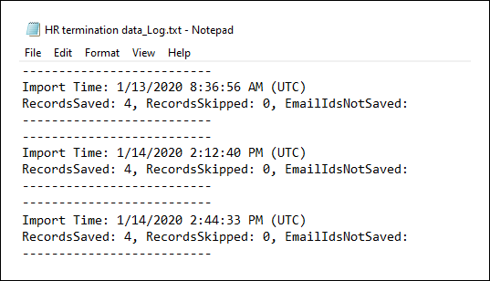

# <a name="set-up-a-connector-to-import-hr-data-in-us-government"></a><span data-ttu-id="30053-104">Einrichten eines Connectors zum Importieren von Personaldaten in us Government</span><span class="sxs-lookup"><span data-stu-id="30053-104">Set up a connector to import HR data in US Government</span></span>

<span data-ttu-id="30053-105">Sie können einen Datenconnector im Microsoft 365 Compliance Center einrichten, um Personaldaten (Hr)-Daten in Ihre US Government-Organisation zu importieren.</span><span class="sxs-lookup"><span data-stu-id="30053-105">You can set up a data connector in the Microsoft 365 compliance center to import human resources (HR) data to your US Government organization.</span></span> <span data-ttu-id="30053-106">Personalbezogene Daten umfassen das Datum, an dem ein Mitarbeiter seinen Kündigungstermin und das Datum des letzten Arbeitstags des Mitarbeiters übermittelt hat.</span><span class="sxs-lookup"><span data-stu-id="30053-106">HR-related data includes the date an employee submitted their resignation and date of the employee's last day.</span></span> <span data-ttu-id="30053-107">Diese Personaldaten können dann von Microsoft-Informationsschutzlösungen wie der [Insider-Risikomanagementlösung](insider-risk-management.md)verwendet werden, um Ihre Organisation vor böswilligen Aktivitäten oder Datendiebstahl in Ihrer Organisation zu schützen.</span><span class="sxs-lookup"><span data-stu-id="30053-107">This HR data can then be used by Microsoft information protection solutions, such as the [insider risk management solution](insider-risk-management.md), to help protect your organization from malicious activity or data theft inside your organization.</span></span> <span data-ttu-id="30053-108">Das Einrichten eines Personalabteilungsconnector besteht darin, eine App in Azure Active Directory zu erstellen, die für die Authentifizierung per Connector verwendet wird, das Erstellen einer CSV-Zuordnungsdateien, die Ihre Personaldaten enthält, das Erstellen eines Datenconnector im Compliance Center und das Anschließende Ausführen eines Skripts (auf geplanter Basis), das die Personaldaten in der CSV-Datei in die Microsoft-Cloud einschnappt.</span><span class="sxs-lookup"><span data-stu-id="30053-108">Setting up an HR connector consists of creating an app in Azure Active Directory that's used for authentication by connector, creating a CSV mapping files that contains your HR data, creating a data connector in the compliance center, and then running a script (on a scheduled basis) that ingests the HR data in the CSV file to the Microsoft cloud.</span></span> <span data-ttu-id="30053-109">Anschließend wird der Datenconnector vom Insider-Risikomanagementtool verwendet, um auf die Personaldaten zu zugreifen, die in Ihre organisation Microsoft 365 US Government importiert wurden.</span><span class="sxs-lookup"><span data-stu-id="30053-109">Then the data connector is used by the insider risk management tool to access the HR data that was imported to your Microsoft 365 US Government organization.</span></span>

## <a name="before-you-begin"></a><span data-ttu-id="30053-110">Bevor Sie beginnen</span><span class="sxs-lookup"><span data-stu-id="30053-110">Before you begin</span></span>

- <span data-ttu-id="30053-111">Dem Benutzer, der den Personalconnector in Schritt 3 erstellt, muss die Rolle Postfachimportexport in der Exchange Online.</span><span class="sxs-lookup"><span data-stu-id="30053-111">The user who creates the HR connector in Step 3 must be assigned the Mailbox Import Export role in Exchange Online.</span></span> <span data-ttu-id="30053-112">Standardmäßig ist diese Rolle keiner Rollengruppe in Exchange Online zugewiesen.</span><span class="sxs-lookup"><span data-stu-id="30053-112">By default, this role isn't assigned to any role group in Exchange Online.</span></span> <span data-ttu-id="30053-113">Sie können die Rolle Postfachimportexport zur Rollengruppe Organisationsverwaltung in der Exchange Online.</span><span class="sxs-lookup"><span data-stu-id="30053-113">You can add the Mailbox Import Export role to the Organization Management role group in Exchange Online.</span></span> <span data-ttu-id="30053-114">Sie können auch eine neue Rollengruppe erstellen, die Rolle Postfachimportexport zuweisen und dann die entsprechenden Benutzer als Mitglieder hinzufügen.</span><span class="sxs-lookup"><span data-stu-id="30053-114">Or you can create a new role group, assign the Mailbox Import Export role, and then add the appropriate users as members.</span></span> <span data-ttu-id="30053-115">Weitere Informationen finden Sie in den Abschnitten [Erstellen](/Exchange/permissions-exo/role-groups#create-role-groups) von Rollengruppen oder [Ändern](/Exchange/permissions-exo/role-groups#modify-role-groups) von Rollengruppen im Artikel "Verwalten von Rollengruppen in Exchange Online".</span><span class="sxs-lookup"><span data-stu-id="30053-115">For more information, see the [Create role groups](/Exchange/permissions-exo/role-groups#create-role-groups) or [Modify role groups](/Exchange/permissions-exo/role-groups#modify-role-groups) sections in the article "Manage role groups in Exchange Online".</span></span>

- <span data-ttu-id="30053-116">Sie müssen bestimmen, wie Sie die Daten (regelmäßig) aus dem Personalsystem Ihrer Organisation abrufen oder exportieren und der in Schritt 2 beschriebenen CSV-Datei hinzufügen.</span><span class="sxs-lookup"><span data-stu-id="30053-116">You'll need to determine how to retrieve or export the data from your organization's HR system (on a regular basis) and add it to the CSV file that's described in Step 2.</span></span> <span data-ttu-id="30053-117">Das Skript, das Sie in Schritt 4 ausführen, hochgeladen die Personaldaten in der CSV-Datei in die Microsoft Cloud.</span><span class="sxs-lookup"><span data-stu-id="30053-117">The script that you run in Step 4 will upload the HR data in the CSV file to the Microsoft cloud.</span></span>

- <span data-ttu-id="30053-118">Mit dem Beispielskript, das Sie in Schritt 4 ausführen, werden Personaldaten in die Microsoft-Cloud hochgeladen, sodass sie von anderen Microsoft-Tools, z. B. der Insider-Risikomanagementlösung, verwendet werden können.</span><span class="sxs-lookup"><span data-stu-id="30053-118">The sample script that you run in Step 4 will upload HR data to the Microsoft cloud so that it can be used by other Microsoft tools, such as the insider risk management solution.</span></span> <span data-ttu-id="30053-119">Dieses Beispielskript wird in keinem Standardsupportprogramm oder -dienst von Microsoft unterstützt.</span><span class="sxs-lookup"><span data-stu-id="30053-119">This sample script isn't supported under any Microsoft standard support program or service.</span></span> <span data-ttu-id="30053-120">Das Beispielskript wird wie besehen ohne jegliche Gewährleistung zur Verfügung gestellt.</span><span class="sxs-lookup"><span data-stu-id="30053-120">The sample script is provided AS IS without warranty of any kind.</span></span> <span data-ttu-id="30053-121">Microsoft schließt ferner alle konkludenten Gewährleistungen, einschließlich, aber nicht beschränkt auf konkludente Gewährleistungen der Marktgängigkeit oder Eignung für einen bestimmten Zweck aus.</span><span class="sxs-lookup"><span data-stu-id="30053-121">Microsoft further disclaims all implied warranties including, without limitation, any implied warranties of merchantability or of fitness for a particular purpose.</span></span> <span data-ttu-id="30053-122">Das gesamte Risiko, das mit der Verwendung oder Leistung des Beispielskripts und der Dokumentation einhergeht, liegt bei Ihnen.</span><span class="sxs-lookup"><span data-stu-id="30053-122">The entire risk arising out of the use or performance of the sample script and documentation remains with you.</span></span> <span data-ttu-id="30053-123">In keinem Fall sind Microsoft, seine Autoren oder an der Erstellung, Produktion oder Übermittlung der Skripts beteiligte Personen für Schäden jeglicher Art (einschließlich und ohne Einschränkung Schäden durch Verlust entgangener Gewinne, Geschäftsunterbrechungen, Verlust von Geschäftsinformationen oder andere geldliche Verluste) haftbar, die aus der Nutzung bzw. Unfähigkeit zur Nutzung der Beispielskripts oder Dokumentation entstehen, auch wenn Microsoft auf die Möglichkeit solcher Schäden hingewiesen wurde.</span><span class="sxs-lookup"><span data-stu-id="30053-123">In no event shall Microsoft, its authors, or anyone else involved in the creation, production, or delivery of the scripts be liable for any damages whatsoever (including, without limitation, damages for loss of business profits, business interruption, loss of business information, or other pecuniary loss) arising out of the use of or inability to use the sample scripts or documentation, even if Microsoft has been advised of the possibility of such damages.</span></span>

## <a name="step-1-create-an-app-in-azure-active-directory"></a><span data-ttu-id="30053-124">Schritt 1: Erstellen einer App in Azure Active Directory</span><span class="sxs-lookup"><span data-stu-id="30053-124">Step 1: Create an app in Azure Active Directory</span></span>

<span data-ttu-id="30053-125">Der erste Schritt besteht im Erstellen und Registrieren einer neuen App in Azure Active Directory (Azure AD).</span><span class="sxs-lookup"><span data-stu-id="30053-125">The first step is to create and register a new app in Azure Active Directory (Azure AD).</span></span> <span data-ttu-id="30053-126">Die App entspricht dem hr-Connector, den Sie in Schritt 3 erstellen.</span><span class="sxs-lookup"><span data-stu-id="30053-126">The app will correspond to the HR connector that you create in Step 3.</span></span> <span data-ttu-id="30053-127">Durch das Erstellen dieser App kann Azure AD den Personalconnector authentifizieren, wenn er ausgeführt wird und versucht, auf Ihre Organisation zu zugreifen.</span><span class="sxs-lookup"><span data-stu-id="30053-127">Creating this app will allow Azure AD to authenticate the HR connector when it runs and attempts to access your organization.</span></span> <span data-ttu-id="30053-128">Diese App wird auch verwendet, um das Skript zu authentifizieren, das Sie in Schritt 4 ausführen, um Ihre Personaldaten in die Microsoft Cloud hochzuladen.</span><span class="sxs-lookup"><span data-stu-id="30053-128">This app will also be used to authenticate the script that you run in Step 4 to upload your HR data to the Microsoft cloud.</span></span> <span data-ttu-id="30053-129">Achten Sie beim Erstellen dieser Azure AD-App darauf, die folgenden Informationen zu speichern.</span><span class="sxs-lookup"><span data-stu-id="30053-129">During the creation of this Azure AD app, be sure to save the following information.</span></span> <span data-ttu-id="30053-130">Diese Werte werden in späteren Schritten verwendet.</span><span class="sxs-lookup"><span data-stu-id="30053-130">These values will be used in later steps.</span></span>

- <span data-ttu-id="30053-131">Azure AD-Anwendungs-ID (auch als *App-ID oder* *Client-ID bezeichnet)*</span><span class="sxs-lookup"><span data-stu-id="30053-131">Azure AD application ID (also called the *app Id* or *client Id*)</span></span>

- <span data-ttu-id="30053-132">Geheimer Azure AD-Anwendungsgeheimnis (auch als Geheimer *Clientgeheimnis bezeichnet)*</span><span class="sxs-lookup"><span data-stu-id="30053-132">Azure AD application secret (also called the *client secret*)</span></span>

- <span data-ttu-id="30053-133">Mandanten-ID (auch *Verzeichnis-ID genannt)*</span><span class="sxs-lookup"><span data-stu-id="30053-133">Tenant Id (also called the *directory Id*)</span></span>

<span data-ttu-id="30053-134">Schrittweise Anweisungen zum Erstellen einer App in Azure AD finden Sie unter Registrieren einer Anwendung bei [der Microsoft Identity Platform](/azure/active-directory/develop/quickstart-register-app).</span><span class="sxs-lookup"><span data-stu-id="30053-134">For step-by-step instructions for creating an app in Azure AD, see [Register an application with the Microsoft identity platform](/azure/active-directory/develop/quickstart-register-app).</span></span>

## <a name="step-2-prepare-a-csv-file-with-your-hr-data"></a><span data-ttu-id="30053-135">Schritt 2: Vorbereiten einer CSV-Datei mit Ihren Personaldaten</span><span class="sxs-lookup"><span data-stu-id="30053-135">Step 2: Prepare a CSV file with your HR data</span></span>

<span data-ttu-id="30053-136">Im nächsten Schritt erstellen Sie eine CSV-Datei, die Informationen zu Mitarbeitern enthält, die Ihre Organisation verlassen haben.</span><span class="sxs-lookup"><span data-stu-id="30053-136">The next step is to create a CSV file that contains information about employees who have left your organization.</span></span> <span data-ttu-id="30053-137">Wie im Abschnitt Before You Begin erläutert, müssen Sie bestimmen, wie diese CSV-Datei aus dem Personalsystem Ihrer Organisation generiert wird.</span><span class="sxs-lookup"><span data-stu-id="30053-137">As explained in the Before You Begin section, you'll need to determine how to generate this CSV file from your organization's HR system.</span></span> <span data-ttu-id="30053-138">Das folgende Beispiel zeigt eine abgeschlossene CSV-Datei (geöffnet im Notizblock), die die drei erforderlichen Parameter (Spalten) enthält.</span><span class="sxs-lookup"><span data-stu-id="30053-138">The following example shows a completed CSV file (opened in Note Pad) that contains the three required parameters (columns).</span></span> <span data-ttu-id="30053-139">Es ist viel einfacher, die CSV-Datei in einem Microsoft Excel.</span><span class="sxs-lookup"><span data-stu-id="30053-139">It's much easier to edit the CSV file in Microsoft Excel.</span></span>

```text
EmailAddress,TerminationDate,LastWorkingDate
sarad@contoso.com,2019-04-23T15:18:02.4675041+05:30,2019-04-29T15:18:02.4675041+05:30
pilarp@contoso.com,2019-04-24T09:15:49Z,2019-04-29T15:18:02.7117540
```

<span data-ttu-id="30053-140">In der ersten Zeile oder Kopfzeile der CSV-Datei sind die erforderlichen Spaltennamen aufgeführt.</span><span class="sxs-lookup"><span data-stu-id="30053-140">The first row, or header row, of the CSV file lists the required column names.</span></span> <span data-ttu-id="30053-141">Der name, der in den einzelnen Spaltenkopfzeilen verwendet wird, liegt bei Ihnen (die Namen im vorherigen Beispiel sind Vorschläge).</span><span class="sxs-lookup"><span data-stu-id="30053-141">The name used in each column header is up to you (the ones in the previous example are suggestions).</span></span> <span data-ttu-id="30053-142">Beim Erstellen des Personalconnector in  Schritt 3 müssen jedoch dieselben Spaltennamen angegeben werden, die Sie in der CSV-Datei verwenden.</span><span class="sxs-lookup"><span data-stu-id="30053-142">However, the same column names you use in the CSV file *must* be specified when you create the HR connector in Step 3.</span></span> <span data-ttu-id="30053-143">Fügen Sie keine Leerzeichen in die Spaltennamen ein.</span><span class="sxs-lookup"><span data-stu-id="30053-143">Do not include spaces in the column names.</span></span>

<span data-ttu-id="30053-144">In der folgenden Tabelle werden die einzelnen Spalten in der CSV-Datei beschrieben:</span><span class="sxs-lookup"><span data-stu-id="30053-144">The following table describes each column in the CSV file:</span></span>

| <span data-ttu-id="30053-145">Spaltenname</span><span class="sxs-lookup"><span data-stu-id="30053-145">Column name</span></span> | <span data-ttu-id="30053-146">Beschreibung</span><span class="sxs-lookup"><span data-stu-id="30053-146">Description</span></span> |
|:-----|:-----|
| <span data-ttu-id="30053-147">**EmailAddress**</span><span class="sxs-lookup"><span data-stu-id="30053-147">**EmailAddress**</span></span> <br/> |<span data-ttu-id="30053-148">Gibt die E-Mail-Adresse des gekündigten Mitarbeiters an.</span><span class="sxs-lookup"><span data-stu-id="30053-148">Specifies the email address of the terminated employee.</span></span>|
| <span data-ttu-id="30053-149">**TerminationDate**</span><span class="sxs-lookup"><span data-stu-id="30053-149">**TerminationDate**</span></span> <br/> |<span data-ttu-id="30053-150">Gibt das Datum an, an dem die Beschäftigung der Person in Ihrer Organisation offiziell beendet wurde.</span><span class="sxs-lookup"><span data-stu-id="30053-150">Specifies the date the person's employment was officially terminated in your organization.</span></span> <span data-ttu-id="30053-151">Dies kann z. B. das Datum sein, an dem der Mitarbeiter seine Benachrichtigung zum Verlassen Ihrer Organisation gegeben hat.</span><span class="sxs-lookup"><span data-stu-id="30053-151">For example, this may be the date when the employee gave their notice about leaving your organization.</span></span> <span data-ttu-id="30053-152">Dieses Datum kann sich vom Datum des letzten Arbeitstags der Person unterscheiden.</span><span class="sxs-lookup"><span data-stu-id="30053-152">This date may be the different than the date of the person's last day of work.</span></span> <span data-ttu-id="30053-153">Verwenden Sie das folgende Datumsformat: , bei dem es sich um das Datums- und Uhrzeitformat `yyyy-mm-ddThh:mm:ss.nnnnnn+|-hh:mm` [iso 8601 handelt.](https://www.iso.org/iso-8601-date-and-time-format.html)</span><span class="sxs-lookup"><span data-stu-id="30053-153">Use the following date format: `yyyy-mm-ddThh:mm:ss.nnnnnn+|-hh:mm`, which is the [ISO 8601 date and time format](https://www.iso.org/iso-8601-date-and-time-format.html).</span></span>|
|<span data-ttu-id="30053-154">**LastWorkingDate**</span><span class="sxs-lookup"><span data-stu-id="30053-154">**LastWorkingDate**</span></span>|<span data-ttu-id="30053-155">Gibt den letzten Arbeitstag für den gekündigten Mitarbeiter an.</span><span class="sxs-lookup"><span data-stu-id="30053-155">Specifies the last day of work for the terminated employee.</span></span> <span data-ttu-id="30053-156">Verwenden Sie das folgende Datumsformat: , bei dem es sich um das Datums- und Uhrzeitformat `yyyy-mm-ddThh:mm:ss.nnnnnn+|-hh:mm` [iso 8601 handelt.](https://www.iso.org/iso-8601-date-and-time-format.html)</span><span class="sxs-lookup"><span data-stu-id="30053-156">Use the following date format: `yyyy-mm-ddThh:mm:ss.nnnnnn+|-hh:mm`, which is the [ISO 8601 date and time format](https://www.iso.org/iso-8601-date-and-time-format.html).</span></span>|
|||

<span data-ttu-id="30053-157">Nachdem Sie die CSV-Datei mit den erforderlichen Personaldaten erstellt haben, speichern Sie sie auf demselben System wie das Skript, das Sie in Schritt 4 ausführen.</span><span class="sxs-lookup"><span data-stu-id="30053-157">After you create the CSV file with the required HR data, store it on the same system as the script that you run in Step 4.</span></span> <span data-ttu-id="30053-158">Implementieren Sie unbedingt eine Updatestrategie, damit die CSV-Datei immer die aktuellen Informationen enthält.</span><span class="sxs-lookup"><span data-stu-id="30053-158">Be sure to implement an update strategy so the CSV file always contains the most current information.</span></span> <span data-ttu-id="30053-159">Dadurch wird sichergestellt, dass unabhängig davon, was Sie das Skript ausführen, die aktuellen Mitarbeiterentkündigungsdaten in die Microsoft Cloud hochgeladen werden.</span><span class="sxs-lookup"><span data-stu-id="30053-159">Doing so ensures that that whatever you run the script, the most current employee termination data is uploaded to the Microsoft cloud.</span></span>

## <a name="step-3-create-the-hr-connector"></a><span data-ttu-id="30053-160">Schritt 3: Erstellen des Hr-Connectors</span><span class="sxs-lookup"><span data-stu-id="30053-160">Step 3: Create the HR connector</span></span>

<span data-ttu-id="30053-161">Der nächste Schritt besteht im Erstellen eines Personalconnector im Microsoft 365 Compliance Center.</span><span class="sxs-lookup"><span data-stu-id="30053-161">The next step is to create an HR connector in the Microsoft 365 compliance center.</span></span> <span data-ttu-id="30053-162">Nachdem Sie das Skript in Schritt 4 ausgeführt haben, übergibt der von Ihnen erstellte Hr-Connector die Hr-Daten aus der CSV-Datei Microsoft 365 Organisation.</span><span class="sxs-lookup"><span data-stu-id="30053-162">After you run the script in Step 4, the HR connector that you create will ingest the HR data from the CSV file to your Microsoft 365 organization.</span></span> <span data-ttu-id="30053-163">Kopieren Sie in diesem Schritt unbedingt die Auftrags-ID, die beim Erstellen des Connectors generiert wird.</span><span class="sxs-lookup"><span data-stu-id="30053-163">In this step, be sure to copy the job ID that's generated when you create the connector.</span></span> <span data-ttu-id="30053-164">Sie verwenden die Auftrags-ID, wenn Sie das Skript ausführen.</span><span class="sxs-lookup"><span data-stu-id="30053-164">You'll use the job ID when you run the script.</span></span>

1. <span data-ttu-id="30053-165">Wechseln Sie [https://compliance.microsoft.com](https://compliance.microsoft.com) zu,  und klicken Sie dann im linken Navigations navi auf Datenconnectors.</span><span class="sxs-lookup"><span data-stu-id="30053-165">Go to [https://compliance.microsoft.com](https://compliance.microsoft.com) and then click **Data connectors** in the left nav.</span></span>

2. <span data-ttu-id="30053-166">Klicken Sie **auf der Seite Datenconnectors** unter **HR** auf **Anzeigen**.</span><span class="sxs-lookup"><span data-stu-id="30053-166">On the **Data connectors** page under **HR**, click **View**.</span></span>

3. <span data-ttu-id="30053-167">Klicken Sie **auf der** Seite Personalwesen auf **Connector hinzufügen.**</span><span class="sxs-lookup"><span data-stu-id="30053-167">On the **HR** page, click **Add connector**.</span></span>

4. <span data-ttu-id="30053-168">Gehen Sie auf der Seite **Authentifizierungsanmeldeinformationen** wie folgt vor, und klicken Sie dann auf **Weiter**:</span><span class="sxs-lookup"><span data-stu-id="30053-168">On the **Authentication credentials** page, do the following and then click **Next**:</span></span>

   1. <span data-ttu-id="30053-169">Geben Sie die Azure AD-Anwendungs-ID für die Azure-App ein, die Sie in Schritt 1 erstellt haben, oder fügen Sie sie ein.</span><span class="sxs-lookup"><span data-stu-id="30053-169">Type or paste the Azure AD application ID for the Azure app that you created in Step 1.</span></span>

   1. <span data-ttu-id="30053-170">Geben Sie einen Namen für den Hr-Connector ein.</span><span class="sxs-lookup"><span data-stu-id="30053-170">Type a name for the HR connector.</span></span>

5. <span data-ttu-id="30053-171">Geben Sie **auf** der Seite Dateizuordnung die Namen der drei Spaltenkopfzeilen (auch Parameter *genannt)* aus der CSV-Datei ein, die Sie in Schritt 2 in jedem der entsprechenden Felder erstellt haben.</span><span class="sxs-lookup"><span data-stu-id="30053-171">On the **File mapping** page, type the names of the three column headers (also called *parameters*) from the CSV file that you created in Step 2 in each of the appropriate boxes.</span></span> <span data-ttu-id="30053-172">Bei den Namen wird die Zwischenschreibung nicht beachtet.</span><span class="sxs-lookup"><span data-stu-id="30053-172">The names are not case-sensitive.</span></span> <span data-ttu-id="30053-173">Wie bereits erläutert, müssen die Namen, die Sie in diese Felder eingeben, mit den Parameternamen in der CSV-Datei übereinstimmen.</span><span class="sxs-lookup"><span data-stu-id="30053-173">As previously explained, the names that you type in these boxes must match the parameter names in your CSV file.</span></span> <span data-ttu-id="30053-174">Der folgende Screenshot zeigt beispielsweise die Parameternamen aus dem Beispiel in der BEISPIEL-CSV-Datei in Schritt 2.</span><span class="sxs-lookup"><span data-stu-id="30053-174">For example, the following screenshot shows the parameter names from the example in sample CSV file shown in Step 2.</span></span>

   

6. <span data-ttu-id="30053-176">Überprüfen Sie **auf** der Seite Überprüfen Ihre Einstellungen, und klicken Sie dann auf **Fertig** stellen, um den Connector zu erstellen.</span><span class="sxs-lookup"><span data-stu-id="30053-176">On the **Review** page, review your settings and then click **Finish** to create the connector.</span></span>

   <span data-ttu-id="30053-177">Es wird eine Statusseite angezeigt, die bestätigt, dass der Connector erstellt wurde.</span><span class="sxs-lookup"><span data-stu-id="30053-177">A status page is displayed that confirms the connector was created.</span></span> <span data-ttu-id="30053-178">Diese Seite enthält zwei wichtige Dinge, die Sie zum Ausführen des Beispielskripts zum Hochladen Ihrer Personaldaten im nächsten Schritt ausführen müssen.</span><span class="sxs-lookup"><span data-stu-id="30053-178">This page contains two important things that you need to complete the next step to run the sample script to upload your HR data.</span></span>

   

   1. <span data-ttu-id="30053-180">**Auftrags-ID.**</span><span class="sxs-lookup"><span data-stu-id="30053-180">**Job ID.**</span></span> <span data-ttu-id="30053-181">Sie benötigen diese Auftrags-ID, um das Skript im nächsten Schritt auszuführen.</span><span class="sxs-lookup"><span data-stu-id="30053-181">You'll need this job ID to run the script in the next step.</span></span> <span data-ttu-id="30053-182">Sie können es von dieser Seite oder von der Flyoutseite des Connectors kopieren.</span><span class="sxs-lookup"><span data-stu-id="30053-182">You can copy it from this page or from the connector flyout page.</span></span>
   
   1. <span data-ttu-id="30053-183">**Link zum Beispielskript.**</span><span class="sxs-lookup"><span data-stu-id="30053-183">**Link to sample script.**</span></span> <span data-ttu-id="30053-184">Klicken Sie **auf den Link** hier, um zur GitHub zu wechseln, um auf das Beispielskript zu zugreifen (der Link öffnet ein neues Fenster).</span><span class="sxs-lookup"><span data-stu-id="30053-184">Click the **here** link to go to the GitHub site to access the sample script (the link opens a new window).</span></span> <span data-ttu-id="30053-185">Lassen Sie dieses Fenster geöffnet, damit Sie das Skript in Schritt 4 kopieren können.</span><span class="sxs-lookup"><span data-stu-id="30053-185">Keep this window open so that you can copy the script in Step 4.</span></span> <span data-ttu-id="30053-186">Alternativ können Sie das Ziel mit einem Lesezeichen versehen oder die URL kopieren, damit Sie in Schritt 4 erneut darauf zugreifen können.</span><span class="sxs-lookup"><span data-stu-id="30053-186">Alternatively, you can bookmark the destination or copy the URL so you can access it again in Step 4.</span></span> <span data-ttu-id="30053-187">Dieser Link ist auch auf der Flyoutseite des Connectors verfügbar.</span><span class="sxs-lookup"><span data-stu-id="30053-187">This link is also available on the connector flyout page.</span></span>

7. <span data-ttu-id="30053-188">Klicken Sie auf **Fertig**.</span><span class="sxs-lookup"><span data-stu-id="30053-188">Click **Done**.</span></span>

   <span data-ttu-id="30053-189">Der neue Connector wird in der Liste auf der Registerkarte **Connectors** angezeigt.</span><span class="sxs-lookup"><span data-stu-id="30053-189">The new connector is displayed in the list on the **Connectors** tab.</span></span> 

8. <span data-ttu-id="30053-190">Klicken Sie auf den Hr-Connector, den Sie gerade erstellt haben, um die Flyoutseite mit Eigenschaften und anderen Informationen zum Connector angezeigt zu werden.</span><span class="sxs-lookup"><span data-stu-id="30053-190">Click the HR connector that you just created to display the flyout page, which contains properties and other information about the connector.</span></span>

   

   <span data-ttu-id="30053-192">Wenn Sie dies noch nicht getan haben, können Sie die Werte für die **Azure App-ID** und **die Connector-Auftrags-ID kopieren.**</span><span class="sxs-lookup"><span data-stu-id="30053-192">If you haven't already done so, you can copy the values for the **Azure App ID** and **Connector job ID**.</span></span> <span data-ttu-id="30053-193">Sie benötigen diese, um das Skript im nächsten Schritt auszuführen.</span><span class="sxs-lookup"><span data-stu-id="30053-193">You'll need these to run the script in the next step.</span></span> <span data-ttu-id="30053-194">Sie können das Skript auch von der Flyoutseite herunterladen (oder es über den Link im nächsten Schritt herunterladen.)</span><span class="sxs-lookup"><span data-stu-id="30053-194">You can also download the script from the flyout page (or download it using the link in the next step.)</span></span>

   <span data-ttu-id="30053-195">Sie können auch auf **Bearbeiten klicken,** um die Azure App-ID oder die Spaltenkopfnamen zu ändern, die Sie auf der Seite **Dateizuordnung definiert** haben.</span><span class="sxs-lookup"><span data-stu-id="30053-195">You can also click **Edit** to change the Azure App ID or the column header names that you defined on the **File mapping** page.</span></span>

## <a name="step-4-run-the-sample-script-to-upload-your-hr-data"></a><span data-ttu-id="30053-196">Schritt 4: Ausführen des Beispielskripts zum Hochladen Ihrer Personaldaten</span><span class="sxs-lookup"><span data-stu-id="30053-196">Step 4: Run the sample script to upload your HR data</span></span>

<span data-ttu-id="30053-197">Der letzte Schritt beim Einrichten eines Personalconnector besteht in der Ausführung eines Beispielskripts, das die Personaldaten in der CSV-Datei (die Sie in Schritt 2 erstellt haben) in die Microsoft-Cloud hochzuladen.</span><span class="sxs-lookup"><span data-stu-id="30053-197">The last step in setting up an HR connector is to run a sample script that will upload the HR data in the CSV file (that you created in Step 2) to the Microsoft cloud.</span></span> <span data-ttu-id="30053-198">Insbesondere lädt das Skript die Daten in den Hr-Connector hoch.</span><span class="sxs-lookup"><span data-stu-id="30053-198">Specifically, the script uploads the data to the HR connector.</span></span> <span data-ttu-id="30053-199">Nachdem Sie das Skript ausgeführt haben, importiert der in Schritt 3 erstellte Hr-Connector die Personaldaten in Ihre Microsoft 365-Organisation, auf die sie von anderen Compliancetools wie der Insider-Risikomanagementlösung zugegriffen werden kann.</span><span class="sxs-lookup"><span data-stu-id="30053-199">After you run the script, the HR connector that you created in Step 3 imports the HR data to your Microsoft 365 organization where it can accessed by other compliance tools, such as the Insider risk management solution.</span></span> <span data-ttu-id="30053-200">Nachdem Sie das Skript ausgeführt haben, sollten Sie eine Aufgabe so planen, dass sie täglich automatisch ausgeführt wird, damit die aktuellen Mitarbeiterbeendigungsdaten in die Microsoft Cloud hochgeladen werden.</span><span class="sxs-lookup"><span data-stu-id="30053-200">After you run the script, consider scheduling a task to run it automatically on a daily basis so the most current employee termination data is uploaded to the Microsoft cloud.</span></span> <span data-ttu-id="30053-201">Weitere [Informationen finden Sie unter Schedule the script to run automatically](#optional-step-6-schedule-the-script-to-run-automatically).</span><span class="sxs-lookup"><span data-stu-id="30053-201">See [Schedule the script to run automatically](#optional-step-6-schedule-the-script-to-run-automatically).</span></span>

1. <span data-ttu-id="30053-202">Wechseln Sie zu Fenster, das Sie im vorherigen Schritt geöffnet haben, um mit dem Beispielskript auf GitHub website zu zugreifen.</span><span class="sxs-lookup"><span data-stu-id="30053-202">Go to window that you left open from the previous step to access the GitHub site with the sample script.</span></span> <span data-ttu-id="30053-203">Öffnen Sie alternativ die Mit Lesezeichen versehene Website, oder verwenden Sie die url, die Sie kopiert haben.</span><span class="sxs-lookup"><span data-stu-id="30053-203">Alternatively, open the bookmarked site or use the URL that you copied.</span></span>

2. <span data-ttu-id="30053-204">Klicken Sie auf **die Schaltfläche Raw,** um das Skript in der Textansicht anzeigen zu können.</span><span class="sxs-lookup"><span data-stu-id="30053-204">Click the **Raw** button to display the script in text view.</span></span>

3. <span data-ttu-id="30053-205">Kopieren Sie alle Zeilen im Beispielskript, und speichern Sie sie dann in einer Textdatei.</span><span class="sxs-lookup"><span data-stu-id="30053-205">Copy all the lines in the sample script and then save them to a text file.</span></span>

4. <span data-ttu-id="30053-206">Ändern Sie bei Bedarf das Beispielskript für Ihre Organisation.</span><span class="sxs-lookup"><span data-stu-id="30053-206">Modify the sample script for your organization, if necessary.</span></span>

5. <span data-ttu-id="30053-207">Speichern Sie die Textdatei als Windows PowerShell Skriptdatei mithilfe eines Dateinamensuffixs von ; z. B. `.ps1` `HRConnector.ps1` .</span><span class="sxs-lookup"><span data-stu-id="30053-207">Save the text file as a Windows PowerShell script file by using a filename suffix of `.ps1`; for example, `HRConnector.ps1`.</span></span>

6. <span data-ttu-id="30053-208">Öffnen Sie eine Eingabeaufforderung auf dem lokalen Computer, und wechseln Sie zu dem Verzeichnis, in dem Sie das Skript gespeichert haben.</span><span class="sxs-lookup"><span data-stu-id="30053-208">Open a Command Prompt on your local computer, and go to the directory where you saved the script.</span></span>

7. <span data-ttu-id="30053-209">Führen Sie den folgenden Befehl aus, um die #A0 in der #A1 in die #A1 hochzuladen. Zum Beispiel:</span><span class="sxs-lookup"><span data-stu-id="30053-209">Run the following command to upload the HR data in the CSV file to the Microsoft cloud; for example:</span></span>

    ```powershell
    .\HRConnector.ps1 -tenantId <tenantId> -appId <appId>  -appSecret <appSecret>  -jobId <jobId>  -csvFilePath '<csvFilePath>'
    ```

   <span data-ttu-id="30053-210">In der folgenden Tabelle werden die Parameter beschrieben, die mit diesem Skript verwendet werden müssen, und deren erforderliche Werte.</span><span class="sxs-lookup"><span data-stu-id="30053-210">The following table describes the parameters to use with this script and their required values.</span></span> <span data-ttu-id="30053-211">Die Informationen, die Sie in den vorherigen Schritten erhalten haben, werden in den Werten für diese Parameter verwendet.</span><span class="sxs-lookup"><span data-stu-id="30053-211">The information you obtained in the previous steps is used in the values for these parameters.</span></span>

   | <span data-ttu-id="30053-212">Parameter</span><span class="sxs-lookup"><span data-stu-id="30053-212">Parameter</span></span> | <span data-ttu-id="30053-213">Beschreibung</span><span class="sxs-lookup"><span data-stu-id="30053-213">Description</span></span> |
   |:-----|:-----|:-----|
   |`tenantId`|<span data-ttu-id="30053-214">Die ID für Microsoft 365 Organisation, die Sie in Schritt 1 erhalten haben.</span><span class="sxs-lookup"><span data-stu-id="30053-214">The Id for your Microsoft 365 organization that you obtained in Step 1.</span></span> <span data-ttu-id="30053-215">Sie können die Mandanten-ID für Ihre Organisation auch auf dem **Blatt Übersicht im** Azure AD Admin Center abrufen.</span><span class="sxs-lookup"><span data-stu-id="30053-215">You can also obtain the tenant Id for your organization on the **Overview** blade in the Azure AD admin center.</span></span> <span data-ttu-id="30053-216">Dies wird verwendet, um Ihre Organisation zu identifizieren.</span><span class="sxs-lookup"><span data-stu-id="30053-216">This is used to identify your organization.</span></span>|
   |`appId` |<span data-ttu-id="30053-217">Die Azure AD-Anwendungs-ID für die App, die Sie in Azure AD in Schritt 1 erstellt haben.</span><span class="sxs-lookup"><span data-stu-id="30053-217">The Azure AD application Id for the app that you created in Azure AD in Step 1.</span></span> <span data-ttu-id="30053-218">Dies wird von Azure AD für die Authentifizierung verwendet, wenn das Skript versucht, auf Ihre Microsoft 365 zu greifen.</span><span class="sxs-lookup"><span data-stu-id="30053-218">This is used by Azure AD for authentication when the script attempts to accesses your Microsoft 365 organization.</span></span> |
   |`appSecret`|<span data-ttu-id="30053-219">Der geheime Azure AD-Anwendungsgeheimnis für die App, die Sie in Azure AD in Schritt 1 erstellt haben.</span><span class="sxs-lookup"><span data-stu-id="30053-219">The Azure AD application secret for the app that you created in Azure AD in Step 1.</span></span> <span data-ttu-id="30053-220">Dies wird auch für die Authentifizierung verwendet.</span><span class="sxs-lookup"><span data-stu-id="30053-220">This also used for authentication.</span></span>|
   |`jobId`|<span data-ttu-id="30053-221">Die Auftrags-ID für den hr-Connector, den Sie in Schritt 3 erstellt haben.</span><span class="sxs-lookup"><span data-stu-id="30053-221">The job ID for the HR connector that you created in Step 3.</span></span> <span data-ttu-id="30053-222">Dies wird verwendet, um die hr-Daten, die in die Microsoft-Cloud hochgeladen werden, dem Hr-Connector zuzuordnen.</span><span class="sxs-lookup"><span data-stu-id="30053-222">This is used to associate the HR data that is uploaded to the Microsoft cloud with the HR connector.</span></span>|
   |`csvFilePath`|<span data-ttu-id="30053-223">Der Dateipfad für die CSV-Datei (gespeichert auf demselben System wie das Skript), das Sie in Schritt 2 erstellt haben.</span><span class="sxs-lookup"><span data-stu-id="30053-223">The file path for the CSV file (stored on the same system as the script) that you created in Step 2.</span></span> <span data-ttu-id="30053-224">Versuchen Sie, Leerzeichen im Dateipfad zu vermeiden. verwenden Sie andernfalls einfache Anführungszeichen.</span><span class="sxs-lookup"><span data-stu-id="30053-224">Try to avoid spaces in the file path; otherwise use single quotation marks.</span></span>|
   |||
   
   <span data-ttu-id="30053-225">Hier ist ein Beispiel für die Syntax für das #A0 mit tatsächlichen Werten für jeden Parameter:</span><span class="sxs-lookup"><span data-stu-id="30053-225">Here's an example of the syntax for the HR connector script using actual values for each parameter:</span></span>

   ```powershell
    .\HRConnector.ps1 -tenantId d5723623-11cf-4e2e-b5a5-01d1506273g9 -appId 29ee526e-f9a7-4e98-a682-67f41bfd643e -appSecret MNubVGbcQDkGCnn -jobId b8be4a7d-e338-43eb-a69e-c513cd458eba -csvFilePath 'C:\Users\contosoadmin\Desktop\Data\employee_termination_data.csv'
    ```

   <span data-ttu-id="30053-226">Wenn der Upload erfolgreich war, zeigt das Skript die Hochladen **Meldung Erfolgreich** an.</span><span class="sxs-lookup"><span data-stu-id="30053-226">If the upload is successful, the script displays the **Upload Successful** message.</span></span>

   > [!NOTE]
   > <span data-ttu-id="30053-227">Wenn Sie Probleme beim Ausführen des vorherigen Befehls aufgrund von Ausführungsrichtlinien haben, finden Sie unter [Informationen](/powershell/module/microsoft.powershell.core/about/about_execution_policies) zu Ausführungsrichtlinien und [Set-ExecutionPolicy](/powershell/module/microsoft.powershell.security/set-executionpolicy) Anleitungen zum Festlegen von Ausführungsrichtlinien.</span><span class="sxs-lookup"><span data-stu-id="30053-227">If you have problems running the previous command because of execution policies, see [About Execution Policies](/powershell/module/microsoft.powershell.core/about/about_execution_policies) and [Set-ExecutionPolicy](/powershell/module/microsoft.powershell.security/set-executionpolicy) for guidance about setting execution policies.</span></span>

## <a name="step-5-monitor-the-hr-connector"></a><span data-ttu-id="30053-228">Schritt 5: Überwachen des Hr-Connectors</span><span class="sxs-lookup"><span data-stu-id="30053-228">Step 5: Monitor the HR connector</span></span>

<span data-ttu-id="30053-229">Nachdem Sie den Hr-Connector erstellt und das Skript ausgeführt haben, um Ihre Personaldaten hochzuladen, können Sie den Connector und den Uploadstatus im compliance center Microsoft 365 anzeigen.</span><span class="sxs-lookup"><span data-stu-id="30053-229">After you create the HR connector and run the script to upload your HR data, you can view the connector and upload status in the Microsoft 365 compliance center.</span></span> <span data-ttu-id="30053-230">Wenn Sie planen, dass das Skript regelmäßig automatisch ausgeführt wird, können Sie auch den aktuellen Status nach dem letzten Ausführen des Skripts anzeigen.</span><span class="sxs-lookup"><span data-stu-id="30053-230">If you schedule the script to run automatically on a regular basis, you can also view the current status after the last time the script ran.</span></span>

1. <span data-ttu-id="30053-231">Wechseln Sie [https://compliance.microsoft.com](https://compliance.microsoft.com) zu, und klicken Sie **im** linken Navigations navi auf Datenconnectors.</span><span class="sxs-lookup"><span data-stu-id="30053-231">Go to [https://compliance.microsoft.com](https://compliance.microsoft.com) and click **Data connectors** in the left nav.</span></span>

2. <span data-ttu-id="30053-232">Klicken Sie auf **die** Registerkarte Connectors, und wählen Sie dann den Hr-Connector aus, um die Flyoutseite anzeigen zu können.</span><span class="sxs-lookup"><span data-stu-id="30053-232">Click the **Connectors** tab and then select the HR connector to display the flyout page.</span></span> <span data-ttu-id="30053-233">Diese Seite enthält die Eigenschaften und Informationen zum Connector.</span><span class="sxs-lookup"><span data-stu-id="30053-233">This page contains the properties and information about the connector.</span></span>

   

3. <span data-ttu-id="30053-235">Klicken **Sie unter Fortschritt** auf den Link **Protokoll** herunterladen, um das Statusprotokoll für den Connector zu öffnen (oder zu speichern).</span><span class="sxs-lookup"><span data-stu-id="30053-235">Under **Progress**, click the **Download log** link to open (or save) the status log for the connector.</span></span> <span data-ttu-id="30053-236">Dieses Protokoll enthält Informationen zu jedem Ausführen und Hochladen der Daten aus der CSV-Datei in die Microsoft Cloud.</span><span class="sxs-lookup"><span data-stu-id="30053-236">This log contains information about each time the script runs and uploads the data from the CSV file to the Microsoft cloud.</span></span> 

   

   <span data-ttu-id="30053-238">Das `RecordsSaved` Feld gibt die Anzahl der Zeilen in der hochgeladenen CSV-Datei an.</span><span class="sxs-lookup"><span data-stu-id="30053-238">The `RecordsSaved` field indicates the number of rows in the CSV file that uploaded.</span></span> <span data-ttu-id="30053-239">Wenn die CSV-Datei beispielsweise vier Zeilen enthält, ist der Wert der Felder 4, wenn das Skript alle Zeilen in der `RecordsSaved` CSV-Datei erfolgreich hochgeladen hat.</span><span class="sxs-lookup"><span data-stu-id="30053-239">For example, if the CSV file contains four rows, then the value of the `RecordsSaved` fields is 4, if the script successfully uploaded all the rows in the CSV file.</span></span>

<span data-ttu-id="30053-240">Wenn Sie das Skript in Schritt 4 nicht ausgeführt haben, wird unter Letzter Import ein Link zum Herunterladen des **Skripts angezeigt.**</span><span class="sxs-lookup"><span data-stu-id="30053-240">If you've haven't run the script in Step 4, a link to download the script is displayed under **Last import**.</span></span> <span data-ttu-id="30053-241">Sie können das Skript herunterladen und dann die Schritte in Schritt 4 ausführen, um es auszuführen.</span><span class="sxs-lookup"><span data-stu-id="30053-241">You can download the script and then follow the steps in Step 4 to run it.</span></span>

## <a name="optional-step-6-schedule-the-script-to-run-automatically"></a><span data-ttu-id="30053-242">(Optional) Schritt 6: Planen der automatischen Ausführung des Skripts</span><span class="sxs-lookup"><span data-stu-id="30053-242">(Optional) Step 6: Schedule the script to run automatically</span></span>

<span data-ttu-id="30053-243">Um sicherzustellen, dass tools wie der Insider Risk Management-Lösung die neuesten Personaldaten aus Ihrer Organisation zur Verfügung stehen, wird empfohlen, das Skript regelmäßig automatisch auszuführen, z. B. einmal am Tag.</span><span class="sxs-lookup"><span data-stu-id="30053-243">To make sure the latest HR data from your organization is available to tools like the insider risk management solution, we recommend that you schedule the script to run automatically on a recurring basis, such as once a day.</span></span> <span data-ttu-id="30053-244">Dies erfordert auch, dass Sie die Personaldaten in der CSV-Datei nach einem ähnlichen (wenn nicht demselben) Zeitplan aktualisieren, sodass sie die neuesten Informationen zu Mitarbeitern enthält, die Ihre Organisation verlassen.</span><span class="sxs-lookup"><span data-stu-id="30053-244">This also requires that you update the HR data in the CSV file on a similar (if not the same) schedule so that it contains the latest information about employees who leave your organization.</span></span> <span data-ttu-id="30053-245">Das Ziel ist es, die aktuellen Personaldaten hochzuladen, damit der Personalconnector sie der Insider-Risikomanagementlösung zur Verfügung stellen kann.</span><span class="sxs-lookup"><span data-stu-id="30053-245">The goal is to upload the most current HR data so that the HR connector can make it available to the insider risk management solution.</span></span>

<span data-ttu-id="30053-246">Sie können die TaskPlaner-App in Windows, um das Skript täglich automatisch auszuführen.</span><span class="sxs-lookup"><span data-stu-id="30053-246">You can user the Task Scheduler app in Windows to automatically run the script every day.</span></span>

1. <span data-ttu-id="30053-247">Klicken Sie auf dem lokalen Computer auf Windows **Schaltfläche Start,** und geben Sie **task scheduler ein.**</span><span class="sxs-lookup"><span data-stu-id="30053-247">On your local computer, click the Windows **Start** button and then type **Task Scheduler**.</span></span>

2. <span data-ttu-id="30053-248">Klicken Sie auf **die TaskPlaner-App,** um sie zu öffnen.</span><span class="sxs-lookup"><span data-stu-id="30053-248">Click the **Task Scheduler** app to open it.</span></span>

3. <span data-ttu-id="30053-249">Klicken Sie **im Abschnitt** Aktionen auf **Aufgabe erstellen.**</span><span class="sxs-lookup"><span data-stu-id="30053-249">In the **Actions** section, click **Create Task**.</span></span>

4. <span data-ttu-id="30053-250">Geben Sie **auf** der Registerkarte Allgemein einen beschreibenden Namen für den geplanten Vorgang ein. Beispiel: **HR Connector Script**.</span><span class="sxs-lookup"><span data-stu-id="30053-250">On the **General** tab, type a descriptive name for the scheduled task; for example, **HR Connector Script**.</span></span> <span data-ttu-id="30053-251">Sie können auch eine optionale Beschreibung hinzufügen.</span><span class="sxs-lookup"><span data-stu-id="30053-251">You can also add an optional description.</span></span>

5. <span data-ttu-id="30053-252">Gehen **Sie unter Sicherheitsoptionen** wie folgt vor:</span><span class="sxs-lookup"><span data-stu-id="30053-252">Under **Security options**, do the following:</span></span>

   1. <span data-ttu-id="30053-253">Bestimmen Sie, ob das Skript nur ausgeführt werden soll, wenn Sie am Computer angemeldet sind, oder führen Sie es aus, wenn Sie angemeldet sind oder nicht.</span><span class="sxs-lookup"><span data-stu-id="30053-253">Determine whether to run the script only when you're logged on to the computer or run it when you're logged on or not.</span></span>
   
   1. <span data-ttu-id="30053-254">Stellen Sie sicher, dass das **Kontrollkästchen Ausführen** mit den höchsten Rechten aktiviert ist.</span><span class="sxs-lookup"><span data-stu-id="30053-254">Make sure that the **Run with the highest privileges** checkbox is selected.</span></span>

6. <span data-ttu-id="30053-255">Wählen Sie **die Registerkarte Trigger aus,** klicken Sie auf **Neu**, und gehen Sie dann wie folgt vor:</span><span class="sxs-lookup"><span data-stu-id="30053-255">Select the **Triggers** tab, click **New**, and then do the following things:</span></span>

   1. <span data-ttu-id="30053-256">Wählen **Einstellungen** die Option **Täglich** aus, und wählen Sie dann Datum und Uhrzeit aus, um das Skript zum ersten Mal auszuführen.</span><span class="sxs-lookup"><span data-stu-id="30053-256">Under **Settings**, select the **Daily** option, and then choose a date and time to run the script for the first time.</span></span> <span data-ttu-id="30053-257">Das Skript wird jeden Tag zur angegebenen Zeit ausgeführt.</span><span class="sxs-lookup"><span data-stu-id="30053-257">The script will every day at the same specified time.</span></span>
   
   1. <span data-ttu-id="30053-258">Stellen **Sie unter Erweiterte Einstellungen** sicher, dass das Kontrollkästchen Aktiviert aktiviert ist. </span><span class="sxs-lookup"><span data-stu-id="30053-258">Under **Advanced settings**, make sure the **Enabled** checkbox is selected.</span></span>
   
   1. <span data-ttu-id="30053-259">Klicken Sie auf **OK**.</span><span class="sxs-lookup"><span data-stu-id="30053-259">Click **Ok**.</span></span>

7. <span data-ttu-id="30053-260">Wählen Sie die **Registerkarte** Aktionen aus, klicken **Sie auf Neu**, und gehen Sie dann wie folgt vor:</span><span class="sxs-lookup"><span data-stu-id="30053-260">Select the **Actions** tab, click **New**, and then do the following things:</span></span>

   

   1. <span data-ttu-id="30053-262">Stellen Sie in der **Dropdownliste** Aktion sicher, dass **Programm starten** ausgewählt ist.</span><span class="sxs-lookup"><span data-stu-id="30053-262">In the **Action** dropdown list, make sure that **Start a program** is selected.</span></span>

   1. <span data-ttu-id="30053-263">Klicken Sie **im Feld Programm/Skript** auf **Durchsuchen,** und wechseln Sie zum folgenden Speicherort, und wählen Sie ihn aus, damit der Pfad im Feld angezeigt wird: `C:\Windows\System32\WindowsPowerShell\v1.0\powershell.exe` .</span><span class="sxs-lookup"><span data-stu-id="30053-263">In the **Program/script** box, click **Browse**, and go to the following location and select it so the path is displayed in the box: `C:\Windows\System32\WindowsPowerShell\v1.0\powershell.exe`.</span></span>

   1. <span data-ttu-id="30053-264">Fügen Sie im Feld Argumente **hinzufügen (optional)** denselben Skriptbefehl ein, den Sie in Schritt 4 ausgeführt haben.</span><span class="sxs-lookup"><span data-stu-id="30053-264">In the **Add arguments (optional)** box, paste the same script command that you ran in Step 4.</span></span> <span data-ttu-id="30053-265">Beispiel: `.\HRConnector.ps1 -tenantId "d5723623-11cf-4e2e-b5a5-01d1506273g9" -appId "c12823b7-b55a-4989-faba-02de41bb97c3" -appSecret "MNubVGbcQDkGCnn"  -jobId "e081f4f4-3831-48d6-7bb3-fcfab1581458" -csvFilePath "C:\Users\contosoadmin\Desktop\Data\employee_termination_data.csv"`</span><span class="sxs-lookup"><span data-stu-id="30053-265">For example, `.\HRConnector.ps1 -tenantId "d5723623-11cf-4e2e-b5a5-01d1506273g9" -appId "c12823b7-b55a-4989-faba-02de41bb97c3" -appSecret "MNubVGbcQDkGCnn"  -jobId "e081f4f4-3831-48d6-7bb3-fcfab1581458" -csvFilePath "C:\Users\contosoadmin\Desktop\Data\employee_termination_data.csv"`</span></span>

   1. <span data-ttu-id="30053-266">Fügen Sie **im Feld Start in (optional)** den Ordnerspeicherort des Skripts ein, das Sie in Schritt 4 ausgeführt haben.</span><span class="sxs-lookup"><span data-stu-id="30053-266">In the **Start in (optional)** box, paste the folder location of the script that you ran in Step 4.</span></span> <span data-ttu-id="30053-267">Beispiel: `C:\Users\contosoadmin\Desktop\Scripts`.</span><span class="sxs-lookup"><span data-stu-id="30053-267">For example, `C:\Users\contosoadmin\Desktop\Scripts`.</span></span>

   1. <span data-ttu-id="30053-268">Klicken **Sie auf Ok,** um die Einstellungen für die neue Aktion zu speichern.</span><span class="sxs-lookup"><span data-stu-id="30053-268">Click **Ok** to save the settings for the new action.</span></span>

8. <span data-ttu-id="30053-269">Klicken Sie **im Fenster Aufgabe** erstellen auf **Ok,** um den geplanten Vorgang zu speichern.</span><span class="sxs-lookup"><span data-stu-id="30053-269">In the **Create Task** window, click **Ok** to save the scheduled task.</span></span> <span data-ttu-id="30053-270">Möglicherweise werden Sie aufgefordert, Ihre Benutzerkontoanmeldeinformationen ein eingeben.</span><span class="sxs-lookup"><span data-stu-id="30053-270">You might be prompted to enter your user account credentials.</span></span>

   <span data-ttu-id="30053-271">Der neue Vorgang wird in der Taskplanerbibliothek angezeigt.</span><span class="sxs-lookup"><span data-stu-id="30053-271">The new task is displayed in the Task Scheduler Library.</span></span>

   

   <span data-ttu-id="30053-273">Das letzte Mal, bei dem das Skript ausgeführt wurde, und das nächste Mal, wenn es ausgeführt werden soll, wird angezeigt.</span><span class="sxs-lookup"><span data-stu-id="30053-273">The last time the script ran and the next time it's scheduled to run is displayed.</span></span> <span data-ttu-id="30053-274">Sie können auf die Aufgabe doppelklicken, um sie zu bearbeiten.</span><span class="sxs-lookup"><span data-stu-id="30053-274">You can double-click the task to edit it.</span></span>

   <span data-ttu-id="30053-275">Sie können auch überprüfen, wie lange das Skript zuletzt auf der Flyoutseite des entsprechenden Hr-Connectors im Compliance Center ausgeführt wurde.</span><span class="sxs-lookup"><span data-stu-id="30053-275">You can also verify the last time the script ran on the flyout page of the corresponding HR connector in the compliance center.</span></span>