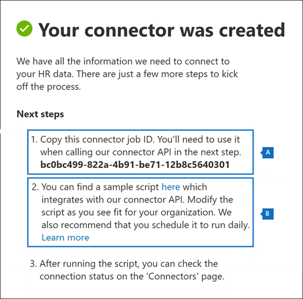

# <a name="set-up-a-connector-to-import-hr-data"></a>Einrichten eines Connectors zum Importieren von Personaldaten

Sie können einen Daten Konnektor im Microsoft 365 Compliance Center einrichten, um Personaldaten (HR) im Zusammenhang mit Ereignissen wie dem Rücktritt eines Benutzers oder einer Änderung der Auftragsstufe eines Benutzers zu importieren. Die HR-Daten können dann von der [Insider Risk Management-Lösung](insider-risk-management.md) verwendet werden, um Risikoindikatoren zu generieren, die Sie bei der Identifizierung möglicher böswilliger Aktivitäten oder von Datendiebstahl durch Benutzer innerhalb Ihrer Organisation unterstützen können.

Einrichten eines Connectors für HR-Daten, die von Insider Risiko-Verwaltungsrichtlinien zum Generieren von Risikoindikatoren verwendet werden können, besteht darin, eine CSV-Datei zu erstellen, die die HR-Daten enthält. Erstellen einer APP in Azure Active Directory, die für die Authentifizierung verwendet wird, Erstellen eines HR-Daten-Konnektors im Microsoft 365 Compliance Center und anschließendes Ausführen eines Skripts (geplant), das die HR-Daten in CSV-Dateien in die Microsoft-Cloud einnimmt, damit Sie für Insider verfügbar ist Risikomanagementlösung.

## <a name="before-you-begin"></a>Bevor Sie beginnen

- Bestimmen Sie, welche HR-Szenarien und Daten in Microsoft 365 importiert werden sollen. Auf diese Weise können Sie bestimmen, wie viele CSV-Dateien und HR-Konnektoren Sie erstellen und wie Sie die CSV-Dateien generieren und strukturieren müssen. Die von Ihnen importierten HR-Daten werden durch die Richtlinien für das Insider Risikomanagement bestimmt, die Sie implementieren möchten. Weitere Informationen finden Sie unter Schritt 1.

- Legen Sie fest, wie die Daten aus dem HR-System Ihrer Organisation (und regelmäßig) abgerufen oder exportiert und den CSV-Dateien hinzugefügt werden, die Sie in Schritt 1 erstellt haben. Mit dem in Schritt 4 ausgeführten Skript werden die HR-Daten in die CSV-Dateien in die Microsoft-Cloud hochgeladen.

- Ihre Organisation muss einwilligen, dass der Office 365-Import Dienst auf Daten in Ihrer Organisation zugreifen kann. Um dieser Anforderung zuzustimmen, gehen Sie zu [dieser Seite](https://login.microsoftonline.com/common/oauth2/authorize?client_id=570d0bec-d001-4c4e-985e-3ab17fdc3073&response_type=code&redirect_uri=https://portal.azure.com/&nonce=1234&prompt=admin_consent), melden Sie sich mit den Anmeldeinformationen eines globalen Administrators von Microsoft 365 an, und nehmen Sie dann die Anforderung an. Sie müssen diesen Schritt ausführen, bevor Sie den HR-Connector in Schritt 3 erfolgreich erstellen können.

- Dem Benutzer, der den HR-Connector in Schritt 3 erstellt, muss in Exchange Online die Rolle "Post Fach Import Export" zugewiesen sein. Standardmäßig ist diese Rolle keiner Rollengruppe in Exchange Online zugewiesen. Sie können die Rolle "Post Fach Import exportieren" der Rollengruppe "Organisationsverwaltung" in Exchange Online hinzufügen. Sie können auch eine neue Rollengruppe erstellen, die Rolle "Post Fach Import Export" zuweisen und dann die entsprechenden Benutzer als Mitglieder hinzufügen. Weitere Informationen finden Sie im Abschnitt [Erstellen](https://docs.microsoft.com/Exchange/permissions-exo/role-groups#create-role-groups) von Rollengruppen oder [Ändern von Rollengruppen](https://docs.microsoft.com/Exchange/permissions-exo/role-groups#modify-role-groups) im Artikel "Verwalten von Rollengruppen in Exchange Online".

- Das in Schritt 4 ausgeführte Beispielskript lädt Ihre HR-Daten in die Microsoft-Cloud hoch, damit Sie von der Insider Risikomanagement-Lösung verwendet werden kann. Dieses Beispielskript wird unter keinem Microsoft Standard Support Programm oder-Dienst unterstützt. Das Beispielskript wird ohne jegliche Gewährleistung bereitgestellt. Microsoft schließt ferner alle konkludenten Gewährleistungen, einschließlich, aber nicht beschränkt auf konkludente Gewährleistungen der Handelsüblichkeit oder Eignung für einen bestimmten Zweck aus. Das gesamte Risiko, das aus der Verwendung oder der Leistung des Beispielskripts und der Dokumentation erwachsen, bleibt bei Ihnen. In keinem Fall sind Microsoft, seine Autoren oder an der Erstellung, Produktion oder Übermittlung der Skripts beteiligte Personen für Schäden jeglicher Art (einschließlich und ohne Einschränkung Schäden durch Verlust entgangener Gewinne, Geschäftsunterbrechungen, Verlust von Geschäftsinformationen oder andere geldliche Verluste) haftbar, die aus der Nutzung bzw. Unfähigkeit zur Nutzung der Beispielskripts oder Dokumentation entstehen, auch wenn Microsoft auf die Möglichkeit solcher Schäden hingewiesen wurde.

## <a name="step-1-prepare-a-csv-file-with-your-hr-data"></a>Schritt 1: Vorbereiten einer CSV-Datei mit ihren HR-Daten

Der erste Schritt besteht darin, eine CSV-Datei zu erstellen, die die HR-Daten enthält, die der Connector in Microsoft 365 importieren wird. Diese Daten werden von der Insider Risiko Lösung verwendet, um potenzielle Risikoindikatoren zu generieren. Daten für die folgenden HR-Szenarien können in Microsoft 365 importiert werden:

- Rücktritt von Mitarbeitern. Informationen zu Benutzern, die Ihre Organisation verlassen haben.

- Änderungen auf Auftragsebene. Informationen zu Änderungen auf Auftragsebene für Benutzer, wie beispielsweise Aktionen und demotions.

- Leistungsbewertungen. Informationen zur Benutzerleistung.

- Pläne zur Leistungsverbesserung. Informationen zu Leistungs Verbesserungsplänen für Benutzer.

Der Typ der zu importierenden HR-Daten hängt von der Richtlinie für das Insider Risikomanagement und der entsprechenden Richtlinienvorlage ab, die Sie implementieren möchten. In der folgenden Tabelle wird gezeigt, welcher HR-Datentyp für jede Richtlinienvorlage erforderlich ist:

| **Richtlinienvorlage**| **HR-Datentyp**|
|:-----------------------------------------------|:---------------------------------------------------------------------|
| Datendiebstahl durch Benutzer                   | Mitarbeiter Rücktritte                                                 |
| Allgemeine Datenlecks                              | Nicht zutreffend                                                        |
| Datenverluste nach Prioritäts Benutzern                    | Nicht zutreffend                                                        |
| Datenverluste durch verärgerte Benutzer                 | Änderungen auf Auftragsebene, Leistungsbewertungen, Pläne zur Leistungsverbesserung |
| Allgemeine Sicherheitsrichtlinienverletzungen              | Nicht zutreffend                                                        |
| Sicherheitsrichtlinienverletzungen durch Benutzer, die abgemeldet werden   | Mitarbeiter Rücktritte                                                 |
| Sicherheitsrichtlinienverletzungen nach Prioritäts Benutzern    | Nicht zutreffend                                                        |
| Sicherheitsrichtlinienverletzungen durch verärgerte Benutzer | Änderungen auf Auftragsebene, Leistungsbewertungen, Pläne zur Leistungsverbesserung |
| Anstößige Sprache in E-Mails                     | Nicht zutreffend                                                        |

Weitere Informationen zu Richtlinienvorlagen für das Insider Risikomanagement finden Sie unter [Insider Risk Management Policies](insider-risk-management-policies.md#policy-templates).

Für jedes HR-Szenario müssen Sie die entsprechenden HR-Daten in einer oder mehreren CSV-Dateien bereitstellen. Die Anzahl der CSV-Dateien, die für die Implementierung von Insider Risikomanagement verwendet werden sollen, wird weiter unten in diesem Abschnitt erläutert.

Nachdem Sie die CSV-Datei mit den erforderlichen HR-Daten erstellt haben, speichern Sie Sie auf dem lokalen Computer, auf dem Sie das Skript ausführen, in Schritt 4. Sie sollten auch eine Updatestrategie implementieren, um sicherzustellen, dass die CSV-Datei immer die aktuellsten Informationen enthält, sodass die aktuellsten HR-Daten in die Microsoft-Cloud hochgeladen und für die Insider-Risikomanagementlösung zugänglich sind, unabhängig davon, was auch immer Sie das Skript ausführen.

> [!IMPORTANT]
> Die in den folgenden Abschnitten beschriebenen Spaltennamen sind keine erforderlichen Parameter, sondern nur Beispiele. Sie können einen beliebigen Spaltennamen in ihren CSV-Dateien verwenden. Die Spaltennamen, die Sie in einer CSV-Datei verwenden, *müssen* jedoch dem Datentyp zugeordnet werden, wenn Sie den HR-Konnektor in Schritt 3 erstellen. Beachten Sie außerdem, dass die CSV-Beispieldateien in den folgenden Abschnitten in der Notepad-Ansicht angezeigt werden. Es ist viel einfacher, CSV-Dateien in Microsoft Excel anzuzeigen und zu bearbeiten.

In den folgenden Abschnitten werden die erforderlichen CSV-Daten für jedes HR-Szenario beschrieben.

### <a name="csv-file-for-employee-resignation-data"></a>CSV-Datei für Mitarbeiter Rücktritts Daten

Im folgenden finden Sie ein Beispiel für eine CSV-Datei für die Rücktritts Daten von Mitarbeitern.

```text
EmailAddress,ResignationDate,LastWorkingDate
sarad@contoso.com,2019-04-23T15:18:02.4675041+05:30,2019-04-29T15:18:02.4675041+05:30
pilarp@contoso.com,2019-04-24T09:15:49Z,2019-04-29T15:18:02.7117540
```

In der folgenden Tabelle werden die einzelnen Spalten in der CSV-Datei für die Mitarbeiter Rücktritts Daten beschrieben.

| **Spalte**  |  **Beschreibung**|
|:------------|:----------------|
|**EmailAddress**| Gibt die e-Mail-Adresse (UPN) des terminierten Benutzers an.|
| **ResignationDate** | Gibt das Datum an, an dem die Arbeit des Benutzers in Ihrer Organisation offiziell gekündigt wurde. Dies kann beispielsweise das Datum sein, an dem der Benutzer seinen Hinweis zum Verlassen ihrer Organisation gegeben hat. Dieses Datum kann unterschiedlich sein als das Datum des letzten Arbeitstags des Benutzers. Verwenden Sie das folgende Datumsformat: `yyyy-mm-ddThh:mm:ss.nnnnnn+|-hh:mm` , also das [ISO 8601-Format für Datum und Uhrzeit](https://www.iso.org/iso-8601-date-and-time-format.html).|
| **LastWorkingDate** | Gibt den letzten Tag der Arbeit für den terminierten Benutzer an. Verwenden Sie das folgende Datumsformat: `yyyy-mm-ddThh:mm:ss.nnnnnn+|-hh:mm` , also das [ISO 8601-Format für Datum und Uhrzeit](https://www.iso.org/iso-8601-date-and-time-format.html).|
|||

### <a name="csv-file-for-job-level-changes-data"></a>CSV-Datei für geänderte Daten auf Auftragsebene

Im folgenden finden Sie ein Beispiel für eine CSV-Datei für geänderte Daten auf Auftragsebene.

```text
EmailAddress,EffectiveDate,OldLevel,NewLevel
sarad@contoso.com,2019-04-23T15:18:02.4675041+05:30,Level 61 – Sr. Manager,Level 60- Manager
pillar@contoso.com,2019-04-23T15:18:02.4675041+05:30,Level 62 – Director,Level 60- Sr. Manager
```

In der folgenden Tabelle werden die einzelnen Spalten in der CSV-Datei für Änderungen der Daten auf Auftragsebene beschrieben.

| **Spalte**|**Beschreibung**|
|:--------- |:------------- |
| **EmailAddress**  | Gibt die e-Mail-Adresse des Benutzers (UPN) an.|
| **EffectiveDate** | Gibt das Datum an, an dem die Auftragsstufe des Benutzers offiziell geändert wurde. Verwenden Sie das folgende Datumsformat: `yyyy-mm-ddThh:mm:ss.nnnnnn+|-hh:mm` , also das [ISO 8601-Format für Datum und Uhrzeit](https://www.iso.org/iso-8601-date-and-time-format.html).|
| **Bemerkungen**| Gibt die Hinweise an, die von Evaluator zur Änderung der Auftragsebene bereitgestellt wurden. Sie können einen Grenzwert von 200 Zeichen eingeben. Dieser Parameter ist optional. Sie müssen es nicht in die CSV-Datei einschließen.|
| **OldLevel**| Gibt die Auftragsebene des Benutzers vor der Änderung an. Hierbei handelt es sich um einen frei Text Parameter, der eine hierarchische Taxonomie für Ihre Organisation enthalten kann. Dieser Parameter ist optional. Sie müssen es nicht in die CSV-Datei einschließen.|
| **Ebene**| Gibt die Auftragsebene des Benutzers an, nachdem er geändert wurde. Hierbei handelt es sich um einen frei Text Parameter, der eine hierarchische Taxonomie für Ihre Organisation enthalten kann. Dieser Parameter ist optional. Sie müssen es nicht in die CSV-Datei einschließen.|
|||

### <a name="csv-file-for-performance-review-data"></a>CSV-Datei für Leistungs Überprüfungsdaten

Im folgenden finden Sie ein Beispiel für eine CSV-Datei für Leistungsdaten.

```text
EmailAddress,EffectiveDate,Remarks,Rating
sarad@contoso.com,2019-04-23T15:18:02.4675041+05:30,Met expectations but bad attitude,2-Below expectation
pillar@contoso.com,2019-04-23T15:18:02.4675041+05:30, Multiple conflicts with the team
```

In der folgenden Tabelle werden die einzelnen Spalten in der CSV-Datei für Leistungs Überprüfungsdaten beschrieben.

| **Spalte**|**Beschreibung**|
|:----------|:--------------|
| **EmailAddress**  | Gibt die e-Mail-Adresse des Benutzers (UPN) an.|
| **EffectiveDate** | Gibt das Datum an, an dem der Benutzer offiziell über das Ergebnis seiner Leistungsüberprüfung informiert wurde. Dies kann das Datum sein, an dem der Leistungsüberprüfungszyklus beendet wurde. Verwenden Sie das folgende Datumsformat: `yyyy-mm-ddThh:mm:ss.nnnnnn+|-hh:mm` , also das [ISO 8601-Format für Datum und Uhrzeit](https://www.iso.org/iso-8601-date-and-time-format.html).|
| **Bemerkungen**| Gibt alle Hinweise an, die der Evaluator dem Benutzer für die Leistungsüberprüfung zur Verfügung gestellt hat. Hierbei handelt es sich um einen Text Parameter mit einem Grenzwert von 200 Zeichen. Dieser Parameter ist optional. Sie müssen es nicht in die CSV-Datei einschließen.|
| **Rating**| Gibt die für die Leistungsüberprüfung angegebene Bewertung an. Dies ist ein Text Parameter und kann beliebigen Freiformtext enthalten, den Ihre Organisation verwendet, um die Auswertung zu erkennen. Beispiel: "3 met Erwartungen" oder "2 unterdurchschnittlich". Hierbei handelt es sich um einen Text Parameter mit einem Grenzwert von 25 Zeichen. Dieser Parameter ist optional. Sie müssen es nicht in die CSV-Datei einschließen.|
|||

### <a name="csv-file-for-performance-improvement-plan-data"></a>CSV-Datei für Daten zur Leistungs Verbesserungs Planung

Im folgenden finden Sie ein Beispiel für eine CSV-Datei für die Daten für die Leistungsverbesserungsplan Daten.

```text
EmailAddress,EffectiveDate,ImprovementRemarks,PerformanceRating
sarad@contoso.com,2019-04-23T15:18:02.4675041+05:30,Met expectation but bad attitude,2-Below expectation
pillar@contoso.com,2019-04-23T15:18:02.4675041+05:30, Multiple conflicts with the team
```

In der folgenden Tabelle werden die einzelnen Spalten in der CSV-Datei für Leistungs Überprüfungsdaten beschrieben.

| **Spalte**| **Beschreibung**|
|:----------|:---------------|
| **EmailAddress**  | Gibt die e-Mail-Adresse des Benutzers (UPN) an.|
| **EffectiveDate** | Gibt das Datum an, an dem der Benutzer offiziell über seinen Leistungsverbesserungsplan informiert wurde. Sie müssen das folgende Datumsformat verwenden: `yyyy-mm-ddThh:mm:ss.nnnnnn+|-hh:mm` , das ist das [ISO 8601-Format für Datum und Uhrzeit](https://www.iso.org/iso-8601-date-and-time-format.html).|
| **Bemerkungen**| Gibt alle Hinweise an, die der Evaluator zum Leistungsverbesserungsplan bereitgestellt hat. Hierbei handelt es sich um einen Text Parameter mit einem Grenzwert von 200 Zeichen. Dieser Parameter ist optional. Sie müssen es nicht in die CSV-Datei einschließen. |
| **Rating**| Gibt eine Bewertung oder andere Informationen im Zusammenhang mit der Leistungsüberprüfung an. Plan zur Leistungsverbesserung. Dies ist ein Text Parameter und kann beliebigen Freiformtext enthalten, den Ihre Organisation verwendet, um die Auswertung zu erkennen. Beispiel: "3 met Erwartungen" oder "2 unterdurchschnittlich". Hierbei handelt es sich um einen Text Parameter mit einer Grenze von 25 Zeichen. Dieser Parameter ist optional. Sie müssen es nicht in die CSV-Datei einschließen.|
|||

### <a name="determining-how-many-csv-files-to-use-for-hr-data"></a>Bestimmen, wie viele CSV-Dateien für HR-Daten verwendet werden sollen

In Schritt 3 können Sie auswählen, ob für jeden HR-Datentyp separate Connectors erstellt werden sollen, oder Sie können auswählen, dass für alle Datentypen einzelne Connectors erstellt werden sollen. Sie können separate CSV-Dateien verwenden, die Daten für ein HR-Szenario enthalten (wie die Beispiele der in den vorherigen Abschnitten beschriebenen CSV-Dateien). Alternativ können Sie eine einzelne CSV-Datei verwenden, die Daten für zwei oder mehr Personal Szenarien enthält. Im folgenden finden Sie einige Richtlinien, mit denen Sie bestimmen können, wie viele CSV-Dateien für HR-Daten verwendet werden sollen.

- Wenn die Richtlinie für die Verwaltung von Insider Risiken, die Sie implementieren möchten, mehrere HR-Datentypen erfordert, sollten Sie eine einzelne CSV-Datei verwenden, die alle erforderlichen Datentypen enthält.

- Die Methode zum Generieren oder sammeln der HR-Daten kann die Anzahl der CSV-Dateien bestimmen. Wenn sich beispielsweise die verschiedenen Typen von HR-Daten, die zum Konfigurieren eines HR-Connectors verwendet werden, in einem einzelnen HR-System in Ihrer Organisation befinden, können Sie die Daten möglicherweise in eine einzelne CSV-Datei exportieren. Wenn Daten jedoch auf verschiedene HR-Systeme verteilt werden, ist es möglicherweise einfacher, Daten in unterschiedliche CSV-Dateien zu exportieren. Beispielsweise können sich Mitarbeiter Rücktritts Daten in einem anderen HR-System als Auftrags-oder Leistungs Überprüfungsdaten befinden. In diesem Fall ist es möglicherweise einfacher, separate CSV-Dateien zu haben, anstatt die Daten manuell in einer einzigen CSV-Datei kombinieren zu müssen. Wie Sie also Daten aus ihren HR-Systemen abrufen oder exportieren, hängt möglicherweise davon ab, wie viele CSV-Dateien Sie benötigen.

- In der Regel wird die Anzahl der zu erstellenden HF-Konnektoren durch die Datentypen in einer CSV-Datei bestimmt. Wenn beispielsweise eine CSV-Datei alle Datentypen enthält, die zur Unterstützung der Implementierung von Insider Risk Management erforderlich sind, benötigen Sie nur einen HF-Connector. Wenn Sie jedoch über zwei separate CSV-Dateien verfügen, die jeweils einen einzelnen Datentyp enthalten, müssen Sie zwei HR-Connectors erstellen. Eine Ausnahme: Wenn Sie einer CSV-Datei eine **HRScenario** -Spalte hinzufügen (siehe nächster Abschnitt), können Sie einen einzelnen HF-Konnektor konfigurieren, der verschiedene CSV-Dateien verarbeiten kann.

### <a name="configuring-a-single-csv-file-for-multiple-hr-data-types"></a>Konfigurieren einer einzelnen CSV-Datei für mehrere HR-Datentypen

Sie können mehrere HR-Datentypen zu einer einzelnen CSV-Datei hinzufügen. Dies ist hilfreich, wenn die von Ihnen implementierte Insider Risiko-Management Lösung mehrere HR-Datentypen erfordert oder wenn sich die Datentypen in einem einzelnen HR-System in Ihrer Organisation befinden. Wenn Sie weniger CSV-Dateien haben, können Sie immer weniger HR-Connectors zum Erstellen und verwalten haben.

Hier sind die Anforderungen für die Konfiguration einer CSV-Datei mit mehreren Datentypen:

- Sie müssen die erforderlichen Spalten (und optional, wenn Sie Sie verwenden) für jeden Datentyp und den entsprechenden Spaltennamen in der Kopfzeile hinzufügen. Wenn ein Datentyp nicht einer Spalte entspricht, können Sie den Wert leer lassen.

- Um eine CSV-Datei mit mehreren Typen von HR-Daten zu verwenden, muss der HR-Connector wissen, welche Zeilen in der CSV-Datei welche Typen von HR-Daten enthalten. Dies wird erreicht, indem der CSV-Datei eine zusätzliche **HRScenario** -Spalte hinzugefügt wird. Die Werte in dieser Spalte kennzeichnen den Typ von HR-Daten in jeder Zeile. Werte, die den vier HR-Szenarien entsprechen, können beispielsweise der \` Rücktritt \` , die \` Änderung auf Auftragsebene \` , die \` Leistungsüberprüfung \` und der \` Leistungsverbesserungsplan sein \` .

- Wenn Sie mehrere CSV-Dateien haben, die eine HRScenario * *-Spalte enthalten, müssen Sie sicherstellen, dass jede Datei denselben Spaltennamen und dieselben Werte verwendet, die die spezifischen HR-Szenarien identifizieren.

Das folgende Beispiel zeigt eine CSV-Datei, die die **HRScenario** -Spalte enthält. Die Werte in der Spalte HRScenario identifizieren den Typ der Daten in der entsprechenden Zeile.

```text
HRScenario,EmailAddress,ResignationDate,LastWorkingDate,EffectiveDate,Remarks,Rating,OldLevel,NewLevel
Resignation,sarad@contoso.com,2019-04-23T15:18:02.4675041+05:30,2019-04-29T15:18:02.4675041+05:30,,,,
Resignation,pilarp@contoso.com,2019-04-24T09:15:49Z,2019-04-29T15:18:02.7117540,,,,
Job level change,sarad@contoso.com,2019-04-23T15:18:02.4675041+05:30,,,,,Level 61 Sr. Manager, Level 60 Manager
Job level change,pillarp@contoso.com,2019-04-23T15:18:02.4675041+05:30,,,,,Level 62 Director,Level 60 Sr Manager
Performance review,sarad@contoso.com,,,2019-04-23T15:18:02.4675041+05:30,Met expectation but bad attitude,2 Below expectations,,
Performance review,pillarp@contoso.com,,,2019-04-23T15:18:02.4675041+05:30, Multiple conflicts with the team,,
Performance improvement plan,sarad@contoso.com,,,2019-04-23T15:18:02.4675041+05:30,Met expectations but bad attitude,2 Below expectations,,
Performance improvement plan,pillarp@contoso.com,,,2019-04-23T15:18:02.4675041+05:30,Multiple conflicts with the team,,
```

> [!NOTE]
> Sie können einen beliebigen Namen für die Spalte verwenden, die den HR-Datentyp identifiziert, da Sie den Namen der Spalte in der CSV-Datei als Spalte zuordnen, mit der der HR-Datentyp angegeben wird, wenn Sie den Connector in Schritt 3 einrichten. Sie können auch die für die Datentypspalte verwendeten Werte zuordnen, wenn Sie den Connector einrichten.

### <a name="adding-the-hrscenario-column-to-a-csv-file-that-contains-a-single-data-type"></a>Hinzufügen der HRScenario-Spalte zu einer CSV-Datei, die einen einzelnen Datentyp enthält

Je nach HR-Systemen Ihrer Organisation und wie Sie HR-Daten in CSV-Dateien exportieren, müssen Sie möglicherweise mehrere CSV-Dateien erstellen, die einen einzigen HR-Datentyp enthalten. In diesem Fall können Sie weiterhin einen einzelnen HF-Connector erstellen, um Daten aus unterschiedlichen CSV-Dateien zu importieren. Hierzu müssen Sie lediglich eine HRScenario-Spalte zur CSV-Datei hinzufügen und den HR-Datentyp angeben. Anschließend können Sie das Skript für jede CSV-Datei ausführen, verwenden jedoch dieselbe Auftrags-ID für den Connector. Siehe [Schritt 4](#step-4-run-the-sample-script-to-upload-your-hr-data).

## <a name="step-2-create-an-app-in-azure-active-directory"></a>Schritt 2: Erstellen einer APP in Azure Active Directory

Der nächste Schritt besteht darin, eine neue app in Azure Active Directory (Azure AD) zu erstellen und zu registrieren. Die APP entspricht dem HR-Konnektor, den Sie in Schritt 3 erstellen. Durch das Erstellen dieser APP kann Azure AD den HR-Konnektor bei der Ausführung authentifizieren und versucht, auf Ihre Organisation zuzugreifen. Diese APP wird auch verwendet, um das Skript zu authentifizieren, das Sie in Schritt 4 ausführen, um Ihre HR-Daten in die Microsoft-Cloud hochzuladen. Achten Sie beim Erstellen dieser Azure AD-App darauf, die folgenden Informationen zu speichern. Diese Werte werden in Schritt 3 und Schritt 4 verwendet.

- Azure AD Anwendungs-ID (auch als *App-ID* oder *Client-ID*bezeichnet)

- Geheime Azure AD Anwendung (auch als *geheimer Client Schlüssel*bezeichnet)

- Mandanten-ID (auch als *Verzeichnis-ID*bezeichnet)

Eine Schritt-für-Schritt-Anleitung zum Erstellen einer APP in Azure AD finden Sie unter [Registrieren einer Anwendung mit der Microsoft Identity-Plattform](https://docs.microsoft.com/azure/active-directory/develop/quickstart-register-app).

## <a name="step-3-create-the-hr-connector"></a>Schritt 3: Erstellen des HR-Connectors

Im nächsten Schritt erstellen Sie einen HR-Connector im Microsoft 365 Compliance Center. Nachdem Sie das Skript in Schritt 4 ausgeführt haben, wird der von Ihnen erstellte HR-Konnektor die HR-Daten aus der CSV-Datei in Ihre Microsoft 365-Organisation aufnehmen. Stellen Sie vor dem Erstellen eines Connectors sicher, dass Sie über eine Liste der HR-Szenarien und die entsprechenden CSV-Spaltennamen für jede Stelle verfügen. Sie müssen die für jedes Szenario erforderlichen Daten den tatsächlichen Spaltennamen in der CSV-Datei zuordnen, wenn Sie den Connector konfigurieren. Alternativ können Sie beim Konfigurieren des Connectors eine CSV-Beispieldatei hochladen, und der Assistent hilft Ihnen dabei, den Namen der Spalten den erforderlichen Datentypen zuzuordnen.

Nachdem Sie diesen Schritt ausgeführt haben, müssen Sie unbedingt die Auftrags-ID kopieren, die beim Erstellen des Connectors generiert wird. Sie verwenden die Auftrags-ID, wenn Sie das Skript ausführen.

1. Wechseln Sie zu, [https://compliance.microsoft.com](https://compliance.microsoft.com/) und klicken Sie dann im linken Navigationsbereich auf **Datenverbindungen** .

2. Klicken Sie auf der Seite **Daten Konnektoren** unter **HR**auf **Ansicht**.

3. Klicken Sie auf der Seite **HR Custom** auf **Connector hinzufügen**.

4. Führen Sie auf der Seite **Verbindung einrichten** die folgenden Schritte aus, und klicken Sie dann auf **weiter**:

   a. Geben Sie die Azure AD Anwendungs-ID für die Azure-App ein, die Sie in Schritt 2 erstellt haben, oder fügen Sie Sie ein.

   b. Geben Sie einen Namen für den HR-Konnektor ein.

5. Wählen Sie auf der Seite HR-Szenarien mindestens ein HR-Szenario aus, für das Sie Daten importieren möchten, und klicken Sie dann auf **weiter**.

6. Wählen Sie auf der Seite Datei Zuordnungsmethode eine der folgenden Optionen aus, und klicken Sie dann auf **weiter**.

   - **Laden Sie eine Beispieldatei hoch**. Wenn Sie diese Option auswählen, klicken Sie auf **Beispieldatei hochladen** , um die in Schritt 1 vorbereitete CSV-Datei hochzuladen. Mit dieser Option können Sie schnell Spaltennamen in der CSV-Datei aus einer Dropdownliste auswählen, um Sie den Datentypen für die zuvor ausgewählten HR-Szenarien zuzuordnen.

   ODER

   - **Geben Sie die Zuordnungsdetails manuell**an. Wenn Sie diese Option auswählen, müssen Sie den Namen der Spalten in der CSV-Datei eingeben, um Sie den Datentypen für die zuvor ausgewählten HR-Szenarien zuzuordnen.

7. Führen Sie auf der Seite Datei Zuordnungsdetails einen der folgenden Schritte aus, je nachdem, ob Sie eine CSV-Beispieldatei hochgeladen haben und ob Sie den Connector für ein einzelnes HR-Szenario oder für mehrere Szenarien konfigurieren. Wenn Sie eine Beispieldatei hochgeladen haben, müssen Sie die Spaltennamen nicht eingeben. Sie wählen Sie aus einer Dropdownliste aus.

    - Wenn Sie im vorherigen Schritt ein einzelnes HR-Szenario ausgewählt haben, geben Sie die Spaltenüberschrift Namen (auch *Parameter*genannt) aus der CSV-Datei, die Sie in Schritt 1 erstellt haben, in jedem der entsprechenden Felder ein. Bei den von Ihnen eingegebenen Spaltennamen wird die Groß-/Kleinschreibung nicht beachtet, aber stellen Sie sicher, dass Sie Leerzeichen enthalten, wenn die Spaltennamen in der CSV-Datei Leerzeichen enthalten. Wie bereits erläutert, müssen die in diesen Feldern eingegebenen Namen mit den Parameternamen in der CSV-Datei übereinstimmen. Der folgende Screenshot zeigt beispielsweise die Parameternamen aus der CSV-Beispieldatei für das in Schritt 1 gezeigte Personal Rücktritts-HR-Szenario.

    - Wenn Sie in Schritt weiter oben mehrere Datentypen ausgewählt haben, müssen Sie den Bezeichner-Spaltennamen eingeben, um den HR-Datentyp in der CSV-Datei zu identifizieren. Geben Sie nach Eingabe des Bezeichner-Spaltennamens den Wert ein, der diesen HR-Datentyp identifiziert, und geben Sie die Namen der Spaltenüberschrift für ausgewählte Datentypen aus den CSV-Dateien ein, die Sie in Schritt 1 in jedem der entsprechenden Felder für jeden ausgewählten Datentyp erstellt haben. Wie bereits erläutert, müssen die Namen, die Sie in diese Felder eingeben, mit den Spaltennamen in der CSV-Datei übereinstimmen.

8. Überprüfen Sie die Einstellungen auf der Seite **überprüfen** , und klicken Sie dann auf **Fertig stellen** , um den Connector zu erstellen.

   Eine Statusseite wird angezeigt, die bestätigt, dass der Connector erstellt wurde. Diese Seite enthält zwei wichtige Dinge, die Sie für den nächsten Schritt zum Ausführen des Beispielskripts zum Hochladen Ihrer HR-Daten benötigen.

   

   a. **Auftrags-ID.** Sie benötigen diese Auftrags-ID, um das Skript im nächsten Schritt auszuführen. Sie können es von dieser Seite oder von der Flyout-Seite des Konnektors kopieren.

   b. **Link zum Beispielskript.** Klicken Sie auf den Link **hier** , um zur GitHub-Website zu wechseln, um auf das Beispielskript zuzugreifen (der Link öffnet ein neues Fenster). Lassen Sie dieses Fenster geöffnet, damit Sie das Skript in Schritt 4 kopieren können. Alternativ können Sie das Ziel bookmarken oder die URL kopieren, damit Sie beim Ausführen des Skripts erneut darauf zugreifen können. Dieser Link steht auch auf der Seite "Connector-Flyout" zur Verfügung.

9. Klicken Sie auf **Fertig**.

   Der neue Connector wird in der Liste auf der Registerkarte **Connectors** angezeigt.

10. Klicken Sie auf den soeben erstellten HR-Konnektor, um die Flyout-Seite anzuzeigen, die Eigenschaften und andere Informationen zum Connector enthält.

   

Wenn Sie dies nicht bereits getan haben, können Sie die Werte für die **Azure-APP-ID** und die **Connector-Auftrags-ID**kopieren. Sie benötigen diese, um das Skript im nächsten Schritt auszuführen. Sie können das Skript auch über die Flyout-Seite herunterladen (oder es über den Link im nächsten Schritt herunterladen).

Sie können auch auf **Bearbeiten** klicken, um die Azure-APP-ID oder die Namen der Spaltenüberschrift zu ändern, die Sie auf der Seite **Dateizuordnung** definiert haben.

## <a name="step-4-run-the-sample-script-to-upload-your-hr-data"></a>Schritt 4: Ausführen des Beispielskripts zum Hochladen Ihrer HR-Daten

Der letzte Schritt beim Einrichten eines HR-Konnektors besteht darin, ein Beispielskript auszuführen, mit dem die HR-Daten in der CSV-Datei (die Sie in Schritt 1 erstellt haben) in die Microsoft-Cloud hochgeladen werden. Das Skript lädt die Daten insbesondere in den HR-Konnektor hoch. Nachdem Sie das Skript ausgeführt haben, importiert der in Schritt 3 erstellte HR-Konnektor die HR-Daten in Ihre Microsoft 365-Organisation, in der der Zugriff über andere Compliance-Tools wie die Insider Risiko-Management Lösung möglich ist. Nachdem Sie das Skript ausgeführt haben, sollten Sie eine Aufgabe so planen, dass Sie täglich automatisch ausgeführt wird, damit die aktuellsten Mitarbeiter Terminierungsdaten in die Microsoft-Cloud hochgeladen werden. Siehe [Planen des automatischen Ausführens des Skripts](#optional-step-6-schedule-the-script-to-run-automatically).

1. Wechseln Sie zu Fenster, das Sie im vorherigen Schritt geöffnet haben, um mit dem Beispielskript auf die GitHub-Website zuzugreifen. Alternativ können Sie die mit einer Lesezeichen versehene Website öffnen oder die URL verwenden, die Sie kopiert haben.

2. Klicken Sie auf die Schaltfläche **RAW** , um das Skript in der Textansicht anzuzeigen.

3. Kopieren Sie alle Zeilen im Beispielskript, und speichern Sie Sie in einer Textdatei.

4. Ändern Sie bei Bedarf das Beispielskript für Ihre Organisation.

5. Speichern Sie die Textdatei als Windows PowerShell Skriptdatei unter Verwendung des Suffixes filename `.ps1` ; beispielsweise `HRConnector.ps1` .

6. Öffnen Sie eine Eingabeaufforderung auf dem lokalen Computer, und wechseln Sie zu dem Verzeichnis, in dem Sie das Skript gespeichert haben.

7. Führen Sie den folgenden Befehl aus, um die HR-Daten in der CSV-Datei in die Microsoft-Cloud hochzuladen. Zum Beispiel:

    ```powershell
    .\HRConnector.ps1 -tenantId <tenantId> -appId <appId>  -appSecret <appSecret>  -jobId <jobId>  -csvFilePath '<csvFilePath>'
    ```

   In der folgenden Tabelle werden die Parameter beschrieben, die mit diesem Skript verwendet werden sollen, sowie die erforderlichen Werte. Die Informationen, die Sie in den vorherigen Schritten erhalten haben, werden in den Werten für diese Parameter verwendet.

   |**Parameter**|**Beschreibung**
   |:-----|:-----|:-----|
   |`tenantId`|Dies ist die ID für Ihre Microsoft 365-Organisation, die Sie in Schritt 2 erhalten haben. Sie können die Mandanten-ID für Ihre Organisation auch auf dem Blatt " **Übersicht** " im Azure AD Admin Center abrufen. Dies wird verwendet, um Ihre Organisation zu identifizieren.|
   |`appId` |Dies ist die Azure AD Anwendungs-ID für die APP, die Sie in Schritt 2 in Azure AD erstellt haben. Dies wird von Azure AD für die Authentifizierung verwendet, wenn das Skript versucht, auf Ihre Microsoft 365-Organisation zuzugreifen. | 
   |`appSecret`|Dies ist der Azure AD geheime Anwendungsschlüssel für die APP, die Sie in Schritt 2 in Azure AD erstellt haben. Dies wird auch für die Authentifizierung verwendet.|
   |`jobId`|Dies ist die Auftrags-ID für den HR-Konnektor, den Sie in Schritt 3 erstellt haben. Dies wird verwendet, um die HR-Daten, die in die Microsoft-Cloud hochgeladen werden, mit dem HR-Connector zuzuordnen.|
   |`csvFilePath`|Dies ist der Dateipfad für die CSV-Datei (gespeichert auf dem gleichen System wie das Skript), die Sie in Schritt 1 erstellt haben. Versuchen Sie, Leerzeichen im Dateipfad zu vermeiden; Verwenden Sie andernfalls einfache Anführungszeichen.|
   |||

   Im folgenden finden Sie ein Beispiel für die Syntax für das HR-Connector-Skript mit Istwerten für jeden Parameter:

   ```powershell
    .\HRConnector.ps1 -tenantId d5723623-11cf-4e2e-b5a5-01d1506273g9 -appId 29ee526e-f9a7-4e98-a682-67f41bfd643e -appSecret MNubVGbcQDkGCnn -jobId b8be4a7d-e338-43eb-a69e-c513cd458eba -csvFilePath 'C:\Users\contosoadmin\Desktop\Data\employee_termination_data.csv'
    ```

   Wenn der Upload erfolgreich war, zeigt das Skript die **erfolgreiche Nachricht hochladen** an.

   > [!NOTE]
   > Wenn beim Ausführen des vorherigen Befehls aufgrund von Ausführungsrichtlinien Probleme aufgetreten sind, finden Sie unter [Informationen zu Ausführungs](https://docs.microsoft.com/powershell/module/microsoft.powershell.core/about/about_execution_policies) Richtlinien und zum [Festlegen von ExecutionPolicy](https://docs.microsoft.com/powershell/module/microsoft.powershell.security/set-executionpolicy) Anleitungen zum Festlegen von Ausführungsrichtlinien.

## <a name="step-5-monitor-the-hr-connector"></a>Schritt 5: Überwachen des HR-Connectors

Nachdem Sie den HR-Connector erstellt und das Skript zum Hochladen Ihrer HR-Daten ausgeführt haben, können Sie den Connector-und den Uploadstatus im Microsoft 365 Compliance Center anzeigen. Wenn Sie planen, dass das Skriptregel mäßig automatisch ausgeführt wird, können Sie auch den aktuellen Status nach der letzten Ausführung des Skripts anzeigen.

1. Wechseln Sie zu, [https://compliance.microsoft.com](https://compliance.microsoft.com) und klicken Sie im linken Navigationsbereich auf **Daten-Konnektoren** .

2. Klicken Sie auf die Registerkarte **Connectors** , und wählen Sie dann den HF-Konnektor aus, um die Flyout-Seite anzuzeigen, die die Eigenschaften und Informationen zum Connector enthält.

   

3. Klicken Sie unter **Status**auf den Link **Download Protokoll** , um das Statusprotokoll für den Connector zu öffnen (oder zu speichern). Dieses Protokoll enthält Informationen über jedes Mal, wenn das Skript ausgeführt wird, und lädt die Daten aus der CSV-Datei in die Microsoft-Cloud hoch. 

   

   Das `RecordsSaved` Feld gibt die Anzahl der Zeilen in der CSV-Datei an, die hochgeladen wurden. Wenn die CSV-Datei beispielsweise vier Zeilen enthält, lautet der Wert der `RecordsSaved` Felder 4, wenn das Skript alle Zeilen in der CSV-Datei erfolgreich hochgeladen hat.

Wenn Sie das Skript nicht in Schritt 4 ausgeführt haben, wird unter **Letzter Import**ein Link zum Herunterladen des Skripts angezeigt. Sie können das Skript herunterladen und dann die Schritte zum Ausführen des Skripts befolgen.

## <a name="optional-step-6-schedule-the-script-to-run-automatically"></a>Optional Schritt 6: Planen des automatischen Ausführens des Skripts

Um sicherzustellen, dass die neuesten HR-Daten aus Ihrer Organisation für Tools wie die Insider Risk Management-Lösung zur Verfügung stehen, wird empfohlen, das Skript automatisch regelmäßig zu planen, beispielsweise einmal täglich. Dies erfordert auch, dass Sie die HR-Daten in der CSV-Datei in einem ähnlichen (falls nicht identischen) Zeitplan aktualisieren, sodass Sie die neuesten Informationen zu Mitarbeitern enthält, die Ihre Organisation verlassen. Das Ziel besteht darin, die aktuellsten HR-Daten hochzuladen, sodass der HR-Connector diese für die Insider Risk Management-Lösung zur Verfügung stellen kann.

Sie können die Task Planer-app in Windows so ausführen, dass das Skript jeden Tag automatisch ausgeführt wird.

1. Klicken Sie auf dem lokalen Computer auf die Schaltfläche Windows- **Start** , und geben Sie dann **Aufgabenplaner**ein.

2. Klicken Sie auf die **Task Planer** -APP, um Sie zu öffnen.

3. Klicken Sie im Abschnitt **Aktionen** auf **Aufgabe erstellen**.

4. Geben Sie auf der Registerkarte **Allgemein** einen beschreibenden Namen für den geplanten Vorgang ein. Beispiel: **HR-Connector-Skript**. Sie können auch eine optionale Beschreibung hinzufügen.

5. Führen Sie unter **Sicherheitsoptionen**die folgenden Aktionen aus:

   a. Bestimmen Sie, ob das Skript nur ausgeführt werden soll, wenn Sie am Computer angemeldet sind oder es ausführen, wenn Sie angemeldet sind oder nicht.

   b. Stellen Sie sicher, dass das Kontrollkästchen **mit den höchsten Rechten ausführen** aktiviert ist.

6. Wählen Sie die Registerkarte **Auslöser** aus, klicken Sie auf **neu**, und führen Sie dann die folgenden Schritte aus:

   a. Wählen Sie unter **Einstellungen**die Option **täglich** aus, und klicken Sie dann auf Datum und Uhrzeit, um das Skript zum ersten Mal auszuführen. Das Skript wird jeden Tag zur gleichen angegebenen Zeit.

   b. Stellen Sie unter **Erweiterte Einstellungen**sicher, dass das Kontrollkästchen **aktiviert** ausgewählt ist.

   c. Klicken Sie auf **OK**.

7. Wählen Sie die Registerkarte **Aktionen** aus, klicken Sie auf **neu**, und führen Sie dann die folgenden Schritte aus:

   

   a. Stellen Sie in der Dropdownliste **Aktion** sicher, dass **Programm starten** ausgewählt ist.

   b. Klicken Sie im Feld **Programm/Skript** auf **Durchsuchen**, und wechseln Sie zum folgenden Speicherort, und wählen Sie ihn aus, damit der Pfad im Feld angezeigt wird: `C:\Windows\System32\WindowsPowerShell\v1.0\powershell.exe` .

   c. Fügen Sie im Feld **Argumente hinzufügen (optional)** den gleichen Skriptbefehl ein, den Sie in Schritt 4 ausgeführt haben. Beispiel: `.\HRConnector.ps1 -tenantId "d5723623-11cf-4e2e-b5a5-01d1506273g9" -appId "c12823b7-b55a-4989-faba-02de41bb97c3" -appSecret "MNubVGbcQDkGCnn"  -jobId "e081f4f4-3831-48d6-7bb3-fcfab1581458" -csvFilePath "C:\Users\contosoadmin\Desktop\Data\employee_termination_data.csv"`

   d. Fügen Sie im Feld **Start in (optional)** den Ordnerspeicherort des Skripts ein, das Sie in Schritt 4 ausgeführt haben. Beispiel: `C:\Users\contosoadmin\Desktop\Scripts`.

   e. Klicken Sie auf **OK** , um die Einstellungen für die neue Aktion zu speichern.

8. Klicken Sie im Fenster **Aufgaben erstellen** auf **OK** , um den geplanten Vorgang zu speichern. Möglicherweise werden Sie aufgefordert, Ihre Anmeldeinformationen für das Benutzerkonto einzugeben.

   Die neue Aufgabe wird in der Aufgabenplanungsbibliothek angezeigt.

   

   Die Uhrzeit, zu der das Skript zuletzt ausgeführt wurde, wird angezeigt, wenn das nächste Mal geplant wird. Sie können auf den Vorgang doppelklicken, um ihn zu bearbeiten.

   Sie können auch überprüfen, wann das Skript zuletzt auf der Flyout-Seite des entsprechenden HR-Konnektors im Compliance Center ausgeführt wurde.

## <a name="existing-hr-connectors"></a>Vorhandene HR-Konnektoren

Am 20. Juli 2020 haben wir zusätzliche Szenarien veröffentlicht, die von HR-Konnektoren unterstützt werden. Dies sind die HR-Szenarien, die zuvor in diesem Artikel beschrieben wurden. Jeder vor diesem Datum erstellte HR-Connector unterstützt nur das Szenario für die Resignierung von Mitarbeitern. Wenn Sie vor dem 20. Juli 2020 einen HR-Connector erstellt haben, haben wir ihn so migriert, dass er Ihre HR-Daten weiter in die Microsoft-Cloud migriert. Sie müssen nichts Unternehmen, um diese Funktionalität beizubehalten. Sie können den Connector ohne Unterbrechung weiter verwenden.

Wenn Sie zusätzliche HR-Szenarien implementieren möchten, erstellen Sie einen neuen HR-Connector, und konfigurieren Sie ihn für die zusätzlichen HR-Szenarien, die veröffentlicht wurden. Sie müssen auch eine oder mehrere neue CSV-Dateien erstellen, die die Daten enthalten, um die zusätzlichen HR-Szenarien zu unterstützen. Nachdem Sie einen neuen HR-Connector erstellt haben, führen Sie das Skript mit der Auftrags-ID des neuen Connectors und der CSV-Datei (en) mit den Daten für Ihre zusätzlichen HR-Szenarien aus.
