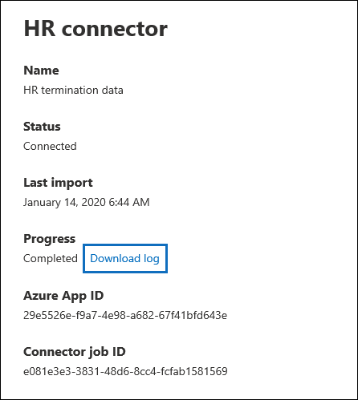

# <a name="set-up-a-connector-to-import-hr-data"></a>Einrichten eines Connectors zum Importieren von Personaldaten

Sie können einen Datenconnector im Microsoft 365 Compliance Center einrichten, um Personaldaten im Zusammenhang mit Ereignissen wie z. B. der Kündigung eines Benutzers oder einer Änderung der Auftragsebene eines Benutzers zu importieren. Die Personaldaten können dann von [](insider-risk-management.md) der Insider-Risikomanagement-Lösung verwendet werden, um Risikoindikatoren zu generieren, mit deren Hilfe Sie mögliche böswillige Aktivitäten oder Datendiebstahl durch Benutzer in Ihrer Organisation identitätsieren können.

Das Einrichten eines Connectors für Hr-Daten, mit dem Insiderrisikomanagementrichtlinien Risikoindikatoren generieren können, besteht darin, eine CSV-Datei zu erstellen, die die Personaldaten enthält, das Erstellen einer App in Azure Active Directory, die für die Authentifizierung verwendet wird, das Erstellen eines Hr-Datenconnector im Microsoft 365 Compliance Center und anschließendes Ausführen eines Skripts (geplant), das die Personaldaten in CSV-Dateien in der Microsoft Cloud einsaugt, sodass es für die Lösung für das Insiderrisikomanagement verfügbar ist.

## <a name="before-you-begin"></a>Bevor Sie beginnen

- Bestimmen Sie, welche Hr-Szenarien und Daten in die Microsoft 365. Dadurch können Sie bestimmen, wie viele CSV-Dateien und Hr-Connectors Sie erstellen müssen, und wie Sie die CSV-Dateien generieren und strukturieren. Die von Ihnen importierten Personaldaten werden durch die Insider-Risikomanagementrichtlinien bestimmt, die Sie implementieren möchten. Weitere Informationen finden Sie unter Schritt 1.

- Bestimmen Sie, wie Die Daten aus dem Personalsystem Ihrer Organisation (und regelmäßig) abgerufen oder exportiert werden, und fügen Sie sie den in Schritt 1 erstellten CSV-Dateien hinzu. Mit dem Skript, das Sie in Schritt 4 ausführen, werden die Personaldaten in den CSV-Dateien in die Microsoft Cloud hochgeladen.

- Dem Benutzer, der den Personalconnector in Schritt 3 erstellt, muss die Rolle Postfachimportexport in der Exchange Online. Standardmäßig ist diese Rolle keiner Rollengruppe in Exchange Online zugewiesen. Sie können die Rolle Postfachimportexport zur Rollengruppe Organisationsverwaltung in der Exchange Online. Sie können auch eine neue Rollengruppe erstellen, die Rolle Postfachimportexport zuweisen und dann die entsprechenden Benutzer als Mitglieder hinzufügen. Weitere Informationen finden Sie in den Abschnitten [Erstellen](/Exchange/permissions-exo/role-groups#create-role-groups) von Rollengruppen oder [Ändern](/Exchange/permissions-exo/role-groups#modify-role-groups) von Rollengruppen im Artikel "Verwalten von Rollengruppen in Exchange Online".

- Das Beispielskript, das Sie in Schritt 4 ausführen, laden Ihre Personaldaten in die Microsoft-Cloud hoch, sodass sie von der Lösung für insider risk management verwendet werden können. Dieses Beispielskript wird in keinem Standardsupportprogramm oder -dienst von Microsoft unterstützt. Das Beispielskript wird wie besehen ohne jegliche Gewährleistung zur Verfügung gestellt. Microsoft schließt ferner alle konkludenten Gewährleistungen, einschließlich, aber nicht beschränkt auf konkludente Gewährleistungen der Marktgängigkeit oder Eignung für einen bestimmten Zweck aus. Das gesamte Risiko, das mit der Verwendung oder Leistung des Beispielskripts und der Dokumentation einhergeht, liegt bei Ihnen. In keinem Fall sind Microsoft, seine Autoren oder an der Erstellung, Produktion oder Übermittlung der Skripts beteiligte Personen für Schäden jeglicher Art (einschließlich und ohne Einschränkung Schäden durch Verlust entgangener Gewinne, Geschäftsunterbrechungen, Verlust von Geschäftsinformationen oder andere geldliche Verluste) haftbar, die aus der Nutzung bzw. Unfähigkeit zur Nutzung der Beispielskripts oder Dokumentation entstehen, auch wenn Microsoft auf die Möglichkeit solcher Schäden hingewiesen wurde.

## <a name="step-1-prepare-a-csv-file-with-your-hr-data"></a>Schritt 1: Vorbereiten einer CSV-Datei mit Ihren Personaldaten

Der erste Schritt besteht im Erstellen einer CSV-Datei, die die Hr-Daten enthält, die der Connector in das Microsoft 365. Diese Daten werden von der Insider-Risikolösung verwendet, um potenzielle Risikoindikatoren zu generieren. Daten für die folgenden Personalwesenszenarien können in die folgenden Microsoft 365:

- Mitarbeiter-Kündigung. Informationen zu Benutzern, die Ihre Organisation verlassen haben.

- Änderungen auf Auftragsebene. Informationen zu Änderungen auf Auftragsebene für Benutzer, z. B. Werbeaktionen und Herabgestufte.

- Leistungsüberprüfungen. Informationen zur Benutzerleistung.

- Leistungsverbesserungspläne. Informationen zu Leistungsverbesserungsplänen für Benutzer.

Die Art der zu importierende Personaldaten hängt von der Insider-Risikomanagementrichtlinie und der entsprechenden Richtlinienvorlage ab, die Sie implementieren möchten. Die folgende Tabelle zeigt, welcher Hr-Datentyp für jede Richtlinienvorlage erforderlich ist:

|  Richtlinienvorlage |  Hr-Datentyp |
|:-----------------------------------------------|:---------------------------------------------------------------------|
| Datendiebstahl durch ausgehende Benutzer                   | Mitarbeiterkündigungen                                                 |
| Allgemeine Datenlecks                              | Nicht zutreffend                                                        |
| Datenlecks nach Prioritätsbenutzern                    | Nicht zutreffend                                                        |
| Datenlecks durch unzufriedene Benutzer                 | Änderungen auf Auftragsebene, Leistungsüberprüfungen, Leistungsverbesserungspläne |
| Verstöße gegen allgemeine Sicherheitsrichtlinien              | Nicht zutreffend                                                        |
| Sicherheitsrichtlinienverletzungen durch ausscheidende Benutzer   | Mitarbeiterkündigungen                                                 |
| Sicherheitsrichtlinienverletzungen durch Prioritätsbenutzer    | Nicht zutreffend                                                        |
| Sicherheitsrichtlinienverletzungen durch verärgerte Benutzer | Änderungen auf Auftragsebene, Leistungsüberprüfungen, Leistungsverbesserungspläne |
| Anstößige Sprache in E-Mails                     | Nicht zutreffend                                                        |

Weitere Informationen zu Richtlinienvorlagen für insider risk management finden Sie unter [Insider risk management policies](insider-risk-management-policies.md#policy-templates).

Für jedes Hr-Szenario müssen Sie die entsprechenden Personaldaten in einer oder mehreren CSV-Dateien bereitstellen. Die Anzahl der CSV-Dateien, die für Ihre Implementierung des Insiderrisikomanagements verwendet werden, wird weiter weiter später in diesem Abschnitt erläutert.

Nachdem Sie die CSV-Datei mit den erforderlichen Personaldaten erstellt haben, speichern Sie sie auf dem lokalen Computer, auf dem Sie das Skript in Schritt 4 ausführen. Sie sollten auch eine Updatestrategie implementieren, um sicherzustellen, dass die CSV-Datei immer die aktuellen Informationen enthält, damit unabhängig davon, was Sie das Skript ausführen, die aktuellen Personaldaten in die Microsoft-Cloud hochgeladen werden und auf die Insider-Risikomanagementlösung zugegriffen werden kann.

> [!IMPORTANT]
> Die in den folgenden Abschnitten beschriebenen Spaltennamen sind keine erforderlichen Parameter, sondern nur Beispiele. Sie können einen beliebigen Spaltennamen in Ihren CSV-Dateien verwenden. Die Spaltennamen, die Sie in  einer CSV-Datei verwenden, müssen jedoch dem Datentyp zugeordnet werden, wenn Sie den Hr-Connector in Schritt 3 erstellen. Beachten Sie außerdem, dass die BEISPIEL-CSV-Dateien in den folgenden Abschnitten in der Editoransicht angezeigt werden. Es ist viel einfacher, CSV-Dateien in einem Microsoft Excel.

In den folgenden Abschnitten werden die erforderlichen CSV-Daten für jedes Hr-Szenario beschrieben.

### <a name="csv-file-for-employee-resignation-data"></a>CSV-Datei für Mitarbeiter-Kündigungsdaten

Im Folgenden finden Sie ein Beispiel für eine CSV-Datei für Mitarbeiterkündigungsdaten.

```text
EmailAddress,ResignationDate,LastWorkingDate
sarad@contoso.com,2019-04-23T15:18:02.4675041+05:30,2019-04-29T15:18:02.4675041+05:30
pilarp@contoso.com,2019-04-24T09:15:49Z,2019-04-29T15:18:02.7117540
```

In der folgenden Tabelle werden die einzelnen Spalten in der CSV-Datei für Mitarbeiterkündigungsdaten beschrieben.

|  Spalte   |   Beschreibung |
|:------------|:----------------|
|**EmailAddress**| Gibt die E-Mail-Adresse (UPN) des beendeten Benutzers an.|
| **"ResignationDate"** | Gibt das Datum an, an dem die Beschäftigung des Benutzers in Ihrer Organisation offiziell beendet wurde. Dies kann z. B. das Datum sein, an dem der Benutzer seine Benachrichtigung zum Verlassen Ihrer Organisation gegeben hat. Dieses Datum kann sich vom Datum des letzten Arbeitstags der Person unterscheiden. Verwenden Sie das folgende Datumsformat: , bei dem es sich um das Datums- und Uhrzeitformat `yyyy-mm-ddThh:mm:ss.nnnnnn+|-hh:mm` [iso 8601 handelt.](https://www.iso.org/iso-8601-date-and-time-format.html)|
| **LastWorkingDate** | Gibt den letzten Arbeitstag für den beendeten Benutzer an. Verwenden Sie das folgende Datumsformat: , bei dem es sich um das Datums- und Uhrzeitformat `yyyy-mm-ddThh:mm:ss.nnnnnn+|-hh:mm` [iso 8601 handelt.](https://www.iso.org/iso-8601-date-and-time-format.html)|
|||

### <a name="csv-file-for-job-level-changes-data"></a>CSV-Datei für Auftragsebene ändert Daten

Im Folgenden finden Sie ein Beispiel für eine CSV-Datei, in der Daten auf Auftragsebene geändert werden.

```text
EmailAddress,EffectiveDate,OldLevel,NewLevel
sarad@contoso.com,2019-04-23T15:18:02.4675041+05:30,Level 61 – Sr. Manager,Level 60- Manager
pillar@contoso.com,2019-04-23T15:18:02.4675041+05:30,Level 62 – Director,Level 60- Sr. Manager
```

In der folgenden Tabelle werden die einzelnen Spalten in der CSV-Datei für Auftragsänderungen beschrieben.

|  Spalte | Beschreibung |
|:--------- |:------------- |
| **EmailAddress**  | Gibt die E-Mail-Adresse des Benutzers (UPN) an.|
| **EffectiveDate** | Gibt das Datum an, an dem die Auftragsebene des Benutzers offiziell geändert wurde. Verwenden Sie das folgende Datumsformat: , bei dem es sich um das Datums- und Uhrzeitformat `yyyy-mm-ddThh:mm:ss.nnnnnn+|-hh:mm` [iso 8601 handelt.](https://www.iso.org/iso-8601-date-and-time-format.html)|
| **Bemerkungen**| Gibt die Anmerkungen an, die der Gutachter zur Änderung der Auftragsebene bereitgestellt hat. Sie können einen Grenzwert von 200 Zeichen eingeben. Dieser Parameter ist optional. Sie müssen sie nicht in die CSV-Datei einm nen.|
| **OldLevel**| Gibt die Auftragsebene des Benutzers an, bevor sie geändert wurde. Dies ist ein Freitextparameter und kann hierarchische Taxonomie für Ihre Organisation enthalten. Dieser Parameter ist optional. Sie müssen sie nicht in die CSV-Datei einm nen.|
| **NewLevel**| Gibt die Auftragsebene des Benutzers an, nachdem sie geändert wurde. Dies ist ein Freitextparameter und kann hierarchische Taxonomie für Ihre Organisation enthalten. Dieser Parameter ist optional. Sie müssen sie nicht in die CSV-Datei einm nen.|
|||

### <a name="csv-file-for-performance-review-data"></a>CSV-Datei für Leistungsüberprüfungsdaten

Hier ist ein Beispiel für eine CSV-Datei für Leistungsdaten.

```text
EmailAddress,EffectiveDate,Remarks,Rating
sarad@contoso.com,2019-04-23T15:18:02.4675041+05:30,Met expectations but bad attitude,2-Below expectation
pillar@contoso.com,2019-04-23T15:18:02.4675041+05:30, Multiple conflicts with the team
```

In der folgenden Tabelle werden die einzelnen Spalten in der CSV-Datei für Leistungsüberprüfungsdaten beschrieben.

|  Spalte | Beschreibung |
|:----------|:--------------|
| **EmailAddress**  | Gibt die E-Mail-Adresse des Benutzers (UPN) an.|
| **EffectiveDate** | Gibt das Datum an, an dem der Benutzer offiziell über das Ergebnis seiner Leistungsüberprüfung informiert wurde. Dies kann das Datum sein, an dem der Leistungsüberprüfungszyklus beendet wurde. Verwenden Sie das folgende Datumsformat: , bei dem es sich um das Datums- und Uhrzeitformat `yyyy-mm-ddThh:mm:ss.nnnnnn+|-hh:mm` [iso 8601 handelt.](https://www.iso.org/iso-8601-date-and-time-format.html)|
| **Bemerkungen**| Gibt alle Anmerkungen an, die der Bewerter dem Benutzer für die Leistungsüberprüfung zur Verfügung gestellt hat. Dies ist ein Textparameter mit einem Grenzwert von 200 Zeichen. Dieser Parameter ist optional. Sie müssen sie nicht in die CSV-Datei einm nen.|
| **Bewertung**| Gibt die Bewertung an, die für die Leistungsüberprüfung bereitgestellt wird. Dies ist ein Textparameter und kann beliebigen Freiformtext enthalten, den Ihre Organisation verwendet, um die Auswertung zu erkennen. Beispiel: "3 Erfüllte Erwartungen" oder "2 Unterdurchschnittlich". Dies ist ein Textparameter mit einem Grenzwert von 25 Zeichen. Dieser Parameter ist optional. Sie müssen sie nicht in die CSV-Datei einm nen.|
|||

### <a name="csv-file-for-performance-improvement-plan-data"></a>CSV-Datei für Daten zum Leistungsverbesserungsplan

Im Folgenden finden Sie ein Beispiel für eine CSV-Datei für die Daten für die Daten des Leistungsverbesserungsplans.

```text
EmailAddress,EffectiveDate,ImprovementRemarks,PerformanceRating
sarad@contoso.com,2019-04-23T15:18:02.4675041+05:30,Met expectation but bad attitude,2-Below expectation
pillar@contoso.com,2019-04-23T15:18:02.4675041+05:30, Multiple conflicts with the team
```

In der folgenden Tabelle werden die einzelnen Spalten in der CSV-Datei für Leistungsüberprüfungsdaten beschrieben.

|  Spalte |  Beschreibung |
|:----------|:---------------|
| **EmailAddress**  | Gibt die E-Mail-Adresse des Benutzers (UPN) an.|
| **EffectiveDate** | Gibt das Datum an, an dem der Benutzer offiziell über seinen Leistungsverbesserungsplan informiert wurde. Sie müssen das folgende Datumsformat verwenden: , bei dem es sich um das Datums- und Uhrzeitformat `yyyy-mm-ddThh:mm:ss.nnnnnn+|-hh:mm` [iso 8601 handelt.](https://www.iso.org/iso-8601-date-and-time-format.html)|
| **Bemerkungen**| Gibt alle Anmerkungen an, die Evaluator zum Leistungsverbesserungsplan bereitgestellt hat. Dies ist ein Textparameter mit einem Grenzwert von 200 Zeichen. Dieser Parameter ist optional. Sie müssen sie nicht in die CSV-Datei einm nen. |
| **Bewertung**| Gibt eine Bewertung oder andere Informationen im Zusammenhang mit der Leistungsüberprüfung an. Leistungsverbesserungsplan. Dies ist ein Textparameter und kann beliebigen Freiformtext enthalten, den Ihre Organisation zum Erkennen der Auswertung verwendet. Beispiel: "3 Erfüllte Erwartungen" oder "2 Unterdurchschnittlich". Dies ist ein Textparameter mit einer Beschränkung von 25 Zeichen. Dieser Parameter ist optional. Sie müssen sie nicht in die CSV-Datei einm nen.|
|||

### <a name="determining-how-many-csv-files-to-use-for-hr-data"></a>Bestimmen, wie viele CSV-Dateien für Personaldaten verwendet werden

In Schritt 3 können Sie für jeden Hr-Datentyp separate Connectors erstellen oder einen einzelnen Connector für alle Datentypen erstellen. Sie können separate CSV-Dateien verwenden, die Daten für ein Hr-Szenario enthalten (wie die Beispiele der in den vorherigen Abschnitten beschriebenen CSV-Dateien). Alternativ können Sie eine einzelne CSV-Datei verwenden, die Daten für zwei oder mehr Personalszenarien enthält. Im Folgenden finden Sie einige Richtlinien, mit deren Hilfe Sie bestimmen können, wie viele CSV-Dateien für Personaldaten verwendet werden sollen.

- Wenn die Insider-Risikomanagementrichtlinie, die Sie implementieren möchten, mehrere Hr-Datentypen erfordert, sollten Sie eine einzelne CSV-Datei verwenden, die alle erforderlichen Datentypen enthält.

- Die Methode zum Generieren oder Sammeln der Personaldaten kann die Anzahl der CSV-Dateien bestimmen. Wenn sich beispielsweise die verschiedenen Typen von Hr-Daten, die zum Konfigurieren eines Personalconnector verwendet werden, in einem einzelnen Personalwesensystem in Ihrer Organisation befinden, können Sie die Daten möglicherweise in eine einzelne CSV-Datei exportieren. Wenn Daten jedoch auf verschiedene Hr-Systeme verteilt werden, ist es möglicherweise einfacher, Daten in verschiedene CSV-Dateien zu exportieren. Mitarbeiterrücktrittsdaten können sich beispielsweise in einem anderen Personalsystem befinden als Auftrags- oder Leistungsüberprüfungsdaten. In diesem Fall ist es möglicherweise einfacher, separate CSV-Dateien zu verwenden, anstatt die Daten manuell in einer einzigen CSV-Datei zu kombinieren. Die Art und Weise, wie Sie Daten aus Ihren Personalsystemen abrufen oder exportieren, bestimmt möglicherweise, wie viele CSV-Dateien Sie benötigen.

- In der Regel wird die Anzahl der hr-Connectors, die Sie erstellen müssen, von den Datentypen in einer CSV-Datei bestimmt. Wenn z. B. eine CSV-Datei alle Datentypen enthält, die zur Unterstützung Ihrer Implementierung des Insiderrisikomanagements erforderlich sind, benötigen Sie nur einen Personalconnector. Wenn Sie jedoch über zwei separate CSV-Dateien verfügen, die jeweils einen einzelnen Datentyp enthalten, müssen Sie zwei Hr-Connectors erstellen. Eine Ausnahme ist, dass Sie einen einzelnen HR-Connector konfigurieren können, der unterschiedliche CSV-Dateien verarbeiten kann, wenn Sie einer CSV-Datei eine **HRScenario-Spalte** hinzufügen (siehe den nächsten Abschnitt).

### <a name="configuring-a-single-csv-file-for-multiple-hr-data-types"></a>Konfigurieren einer einzelnen CSV-Datei für mehrere Hr-Datentypen

Sie können einer einzelnen CSV-Datei mehrere Hr-Datentypen hinzufügen. Dies ist hilfreich, wenn die von Ihnen implementierene Insider-Risikomanagementlösung mehrere Hr-Datentypen erfordert oder wenn sich die Datentypen in einem einzelnen Personalwesensystem in Ihrer Organisation befinden. Wenn Sie immer weniger CSV-Dateien haben, können Sie weniger Personalconnectors erstellen und verwalten.

Hier sind die Anforderungen für das Konfigurieren einer CSV-Datei mit mehreren Datentypen:

- Sie müssen die erforderlichen Spalten (und optional, wenn Sie sie verwenden) für jeden Datentyp und den entsprechenden Spaltennamen in der Kopfzeile hinzufügen. Wenn ein Datentyp einer Spalte nicht entspricht, können Sie den Wert leer lassen.

- Um eine CSV-Datei mit mehreren Arten von Hr-Daten zu verwenden, muss der Hr-Connector wissen, welche Zeilen in der CSV-Datei welchen Typ hr-Daten enthalten. Dazu wird der CSV-Datei eine zusätzliche **HRScenario-Spalte** hinzugefügt. Die Werte in dieser Spalte geben den Typ der Personaldaten in jeder Zeile an. Beispielsweise können Werte, die den vier Personalszenarien entsprechen, "Kündigung", "Änderung auf Auftragsebene", \` \` \` \` \` "Leistungsüberprüfung" und \` \` "Leistungsverbesserungsplan" \` sein.

- Wenn Sie über mehrere CSV-Dateien verfügen, die eine HRScenario**-Spalte enthalten, müssen Sie sicherstellen, dass jede Datei denselben Spaltennamen und dieselben Werte verwendet, die die spezifischen Hr-Szenarien identifizieren.

Das folgende Beispiel zeigt eine CSV-Datei, die die **Spalte HRScenario** enthält. Die Werte in der Spalte HRScenario identifizieren den Datentyp in der entsprechenden Zeile.

```text
HRScenario,EmailAddress,ResignationDate,LastWorkingDate,EffectiveDate,Remarks,Rating,OldLevel,NewLevel
Resignation,sarad@contoso.com,2019-04-23T15:18:02.4675041+05:30,2019-04-29T15:18:02.4675041+05:30,,,,
Resignation,pilarp@contoso.com,2019-04-24T09:15:49Z,2019-04-29T15:18:02.7117540,,,,
Job level change,sarad@contoso.com,2019-04-23T15:18:02.4675041+05:30,,,,,Level 61 Sr. Manager, Level 60 Manager
Job level change,pillarp@contoso.com,2019-04-23T15:18:02.4675041+05:30,,,,,Level 62 Director,Level 60 Sr Manager
Performance review,sarad@contoso.com,,,2019-04-23T15:18:02.4675041+05:30,Met expectation but bad attitude,2 Below expectations,,
Performance review,pillarp@contoso.com,,,2019-04-23T15:18:02.4675041+05:30, Multiple conflicts with the team,,
Performance improvement plan,sarad@contoso.com,,,2019-04-23T15:18:02.4675041+05:30,Met expectations but bad attitude,2 Below expectations,,
Performance improvement plan,pillarp@contoso.com,,,2019-04-23T15:18:02.4675041+05:30,Multiple conflicts with the team,,
```

> [!NOTE]
> Sie können einen beliebigen Namen für die Spalte verwenden, die den Hr-Datentyp identifiziert, da Sie den Namen der Spalte in Ihrer CSV-Datei als Spalte zuordnungen, die den Personaldatentyp identifiziert, wenn Sie den Connector in Schritt 3 einrichten. Sie ordnen auch die Werte zu, die für die Datentypspalte verwendet werden, wenn Sie den Connector einrichten.

### <a name="adding-the-hrscenario-column-to-a-csv-file-that-contains-a-single-data-type"></a>Hinzufügen der HRScenario-Spalte zu einer CSV-Datei, die einen einzelnen Datentyp enthält

Basierend auf den Personalsystemen Ihrer Organisation und dem Export von Personaldaten in eine CSV-Datei müssen Sie möglicherweise mehrere CSV-Dateien erstellen, die einen einzelnen Hr-Datentyp enthalten. In diesem Fall können Sie weiterhin einen einzelnen Hr-Connector erstellen, um Daten aus verschiedenen CSV-Dateien zu importieren. Dazu müssen Sie der CSV-Datei lediglich eine HRScenario-Spalte hinzufügen und den Hr-Datentyp angeben. Anschließend können Sie das Skript für jede CSV-Datei ausführen, jedoch dieselbe Auftrags-ID für den Connector verwenden. Weitere [Informationen finden Sie unter Schritt 4](#step-4-run-the-sample-script-to-upload-your-hr-data).

## <a name="step-2-create-an-app-in-azure-active-directory"></a>Schritt 2: Erstellen einer App in Azure Active Directory

Im nächsten Schritt erstellen und registrieren Sie eine neue App in Azure Active Directory (Azure AD). Die App entspricht dem hr-Connector, den Sie in Schritt 3 erstellen. Durch das Erstellen dieser App kann Azure AD den Personalconnector authentifizieren, wenn er ausgeführt wird und versucht, auf Ihre Organisation zu zugreifen. Diese App wird auch verwendet, um das Skript zu authentifizieren, das Sie in Schritt 4 ausführen, um Ihre Personaldaten in die Microsoft Cloud hochzuladen. Achten Sie beim Erstellen dieser Azure AD-App darauf, die folgenden Informationen zu speichern. Diese Werte werden in Schritt 3 und Schritt 4 verwendet.

- Azure AD-Anwendungs-ID (auch als *App-ID oder* *Client-ID bezeichnet)*

- Geheimer Azure AD-Anwendungsgeheimnis (auch als Geheimer *Clientgeheimnis bezeichnet)*

- Mandanten-ID (auch *Verzeichnis-ID genannt)*

Schrittweise Anweisungen zum Erstellen einer App in Azure AD finden Sie unter Registrieren einer Anwendung bei [der Microsoft Identity Platform](/azure/active-directory/develop/quickstart-register-app).

## <a name="step-3-create-the-hr-connector"></a>Schritt 3: Erstellen des Hr-Connectors

Der nächste Schritt besteht im Erstellen eines Personalconnector im Microsoft 365 Compliance Center. Nachdem Sie das Skript in Schritt 4 ausgeführt haben, übergibt der von Ihnen erstellte Hr-Connector die Hr-Daten aus der CSV-Datei Microsoft 365 Organisation. Stellen Sie vor dem Erstellen eines Connectors sicher, dass Sie über eine Liste der Hr-Szenarien und die entsprechenden CSV-Spaltennamen für jedes Connector verfügen. Sie müssen die für jedes Szenario erforderlichen Daten den tatsächlichen Spaltennamen in Ihrer CSV-Datei zuordnungen, wenn Sie den Connector konfigurieren. Alternativ können Sie beim Konfigurieren des Connectors eine CSV-Beispieldatei hochladen, und der Assistent hilft Ihnen, den Namen der Spalten den erforderlichen Datentypen zu zuordnungen.

Nachdem Sie diesen Schritt abgeschlossen haben, müssen Sie die Auftrags-ID kopieren, die beim Erstellen des Connectors generiert wird. Sie verwenden die Auftrags-ID, wenn Sie das Skript ausführen.

1. Wechseln Sie [https://compliance.microsoft.com](https://compliance.microsoft.com/) zu,  und klicken Sie dann im linken Navigations navi auf Datenconnectors.

2. Klicken Sie **auf der Seite Datenconnectors** unter **HR** auf **Anzeigen**.

3. Klicken Sie **auf der Seite** Benutzerdefinierter Personalwesen auf Connector **hinzufügen.**

4. Gehen Sie **auf der Seite Verbindung einrichten** wie folgt vor, und klicken Sie dann auf **Weiter**:

   1. Geben Sie die Azure AD-Anwendungs-ID für die Azure-App ein, die Sie in Schritt 2 erstellt haben, oder fügen Sie sie ein.

   1. Geben Sie einen Namen für den Hr-Connector ein.

5. Wählen Sie auf der Seite Personalwesenszenarien ein oder mehrere Personalszenarien aus, für die Sie Daten importieren möchten, und klicken Sie dann auf **Weiter**.

6. Wählen Sie auf der Seite Dateizuordnungsmethode eine der folgenden Optionen aus, und klicken Sie dann auf **Weiter**.

   - **Hochladen eine Beispieldatei .** Wenn Sie diese Option auswählen, klicken Sie **Hochladen Beispieldatei,** um die in Schritt 1 vorbereitete CSV-Datei hochzuladen. Mit dieser Option können Sie schnell Spaltennamen in Ihrer CSV-Datei aus einer Dropdownliste auswählen, um sie den Datentypen für die zuvor ausgewählten Personalwesenszenarien zu zuordnungen.

   ODER

   - **Geben Sie die Zuordnungsdetails manuell an.** Wenn Sie diese Option auswählen, müssen Sie den Namen der Spalten in der CSV-Datei eingeben, um sie den Datentypen für die zuvor ausgewählten Personalwesenszenarien zu zuordnungen.

7. Gehen Sie auf der Seite Dateizuordnungsdetails wie folgt vor, je nachdem, ob Sie eine CSV-Beispieldatei hochgeladen haben und ob Sie den Connector für ein einzelnes Personalwesenszenario oder für mehrere Szenarien konfigurieren. Wenn Sie eine Beispieldatei hochgeladen haben, müssen Sie die Spaltennamen nicht eingeben. Sie wählen sie aus einer Dropdownliste aus.

    - Wenn Sie im vorherigen Schritt ein einzelnes Hr-Szenario ausgewählt haben, geben Sie die Spaltenkopfnamen (auch Parameter *genannt)* aus der IN Schritt 1 erstellten CSV-Datei in jedes der entsprechenden Felder ein. Bei den von Ihnen angegebenen Spaltennamen wird die Zwischenschreibung nicht beachtet, es müssen jedoch Leerzeichen hinzugefügt werden, wenn die Spaltennamen in der CSV-Datei Leerzeichen enthalten. Wie bereits erläutert, müssen die Namen, die Sie in diese Felder eingeben, mit den Parameternamen in Der CSV-Datei übereinstimmen. Der folgende Screenshot zeigt z. B. die Parameternamen aus der BEISPIEL-CSV-Datei für das Personalszenario für Mitarbeiterabtritt, das in Schritt 1 gezeigt wird.

    - Wenn Sie in Schritt oben mehrere Datentypen ausgewählt haben, müssen Sie den Namen der Bezeichnerspalte eingeben, der den Hr-Datentyp in Ihrer CSV-Datei identifiziert. Geben Sie nach der Eingabe des Bezeichnerspaltennamens den Wert ein, der diesen Hr-Datentyp identifiziert, und geben Sie die Spaltenkopfnamen für ausgewählte Datentypen aus den IN Schritt 1 erstellten CSV-Dateien in jedes der entsprechenden Felder für jeden ausgewählten Datentyp ein. Wie bereits erläutert, müssen die Namen, die Sie in diese Felder eingeben, mit den Spaltennamen in der CSV-Datei übereinstimmen.

8. Überprüfen Sie **auf** der Seite Überprüfen Ihre Einstellungen, und klicken Sie dann auf **Fertig** stellen, um den Connector zu erstellen.

   Es wird eine Statusseite angezeigt, die bestätigt, dass der Connector erstellt wurde. Diese Seite enthält zwei wichtige Dinge, die Sie zum Ausführen des Beispielskripts zum Hochladen Ihrer Personaldaten im nächsten Schritt ausführen müssen.

   

   1. **Auftrags-ID.** Sie benötigen diese Auftrags-ID, um das Skript im nächsten Schritt auszuführen. Sie können es von dieser Seite oder von der Flyoutseite des Connectors kopieren.

   1. **Link zum Beispielskript.** Klicken Sie **auf den Link** hier, um zur GitHub zu wechseln, um auf das Beispielskript zu zugreifen (der Link öffnet ein neues Fenster). Lassen Sie dieses Fenster geöffnet, damit Sie das Skript in Schritt 4 kopieren können. Alternativ können Sie das Ziel mit einem Lesezeichen versehen oder die URL kopieren, damit Sie beim Ausführen des Skripts erneut darauf zugreifen können. Dieser Link ist auch auf der Flyoutseite des Connectors verfügbar.

9. Klicken Sie auf **Fertig**.

   Der neue Connector wird in der Liste auf der Registerkarte **Connectors** angezeigt.

10. Klicken Sie auf den Hr-Connector, den Sie gerade erstellt haben, um die Flyoutseite mit Eigenschaften und anderen Informationen zum Connector angezeigt zu werden.

   

Wenn Sie dies noch nicht getan haben, können Sie die Werte für die **Azure App-ID** und **die Connector-Auftrags-ID kopieren.** Sie benötigen diese, um das Skript im nächsten Schritt auszuführen. Sie können das Skript auch von der Flyoutseite herunterladen (oder es über den Link im nächsten Schritt herunterladen.)

Sie können auch auf **Bearbeiten klicken,** um die Azure App-ID oder die Spaltenkopfnamen zu ändern, die Sie auf der Seite **Dateizuordnung definiert** haben.

## <a name="step-4-run-the-sample-script-to-upload-your-hr-data"></a>Schritt 4: Ausführen des Beispielskripts zum Hochladen Ihrer Personaldaten

Der letzte Schritt beim Einrichten eines Personalconnector besteht in der Ausführung eines Beispielskripts, das die Personaldaten in der CSV-Datei (die Sie in Schritt 1 erstellt haben) in die Microsoft-Cloud hochzuladen. Insbesondere lädt das Skript die Daten in den Hr-Connector hoch. Nachdem Sie das Skript ausgeführt haben, importiert der in Schritt 3 erstellte Hr-Connector die Personaldaten in Ihre Microsoft 365-Organisation, auf die sie von anderen Compliancetools wie der Insider-Risikomanagementlösung zugegriffen werden kann. Nachdem Sie das Skript ausgeführt haben, sollten Sie eine Aufgabe so planen, dass sie täglich automatisch ausgeführt wird, damit die aktuellen Mitarbeiterbeendigungsdaten in die Microsoft Cloud hochgeladen werden. Weitere [Informationen finden Sie unter Schedule the script to run automatically](#optional-step-6-schedule-the-script-to-run-automatically).

1. Wechseln Sie zu Fenster, das Sie im vorherigen Schritt geöffnet haben, um mit dem Beispielskript auf GitHub website zu zugreifen. Öffnen Sie alternativ die Mit Lesezeichen versehene Website, oder verwenden Sie die url, die Sie kopiert haben.

2. Klicken Sie auf **die Schaltfläche Raw,** um das Skript in der Textansicht anzeigen zu können.

3. Kopieren Sie alle Zeilen im Beispielskript, und speichern Sie sie dann in einer Textdatei.

4. Ändern Sie bei Bedarf das Beispielskript für Ihre Organisation.

5. Speichern Sie die Textdatei als Windows PowerShell Skriptdatei mithilfe eines Dateinamensuffixs von ; z. B. `.ps1` `HRConnector.ps1` .

6. Öffnen Sie eine Eingabeaufforderung auf dem lokalen Computer, und wechseln Sie zu dem Verzeichnis, in dem Sie das Skript gespeichert haben.

7. Führen Sie den folgenden Befehl aus, um die #A0 in der #A1 in die #A1 hochzuladen. Zum Beispiel:

    ```powershell
    .\HRConnector.ps1 -tenantId <tenantId> -appId <appId>  -appSecret <appSecret>  -jobId <jobId>  -csvFilePath '<csvFilePath>'
    ```

   In der folgenden Tabelle werden die Parameter beschrieben, die mit diesem Skript verwendet werden müssen, und deren erforderliche Werte. Die Informationen, die Sie in den vorherigen Schritten erhalten haben, werden in den Werten für diese Parameter verwendet.

   | Parameter | Beschreibung |
   |:-----|:-----|:-----|
   |`tenantId`|Dies ist die ID für Microsoft 365, die Sie in Schritt 2 erhalten haben. Sie können die Mandanten-ID für Ihre Organisation auch auf dem **Blatt Übersicht im** Azure AD Admin Center abrufen. Dies wird verwendet, um Ihre Organisation zu identifizieren.|
   |`appId` |Dies ist die Azure AD-Anwendungs-ID für die App, die Sie in Azure AD in Schritt 2 erstellt haben. Dies wird von Azure AD für die Authentifizierung verwendet, wenn das Skript versucht, auf Ihre Microsoft 365 zu greifen. | 
   |`appSecret`|Dies ist der geheime Azure AD-Anwendungsgeheimnis für die App, die Sie in Azure AD in Schritt 2 erstellt haben. Dies wird auch für die Authentifizierung verwendet.|
   |`jobId`|Dies ist die Auftrags-ID für den Hr-Connector, den Sie in Schritt 3 erstellt haben. Dies wird verwendet, um die hr-Daten, die in die Microsoft-Cloud hochgeladen werden, dem Hr-Connector zuzuordnen.|
   |`csvFilePath`|Dies ist der Dateipfad für die CSV-Datei (gespeichert auf demselben System wie das Skript), den Sie in Schritt 1 erstellt haben. Versuchen Sie, Leerzeichen im Dateipfad zu vermeiden. verwenden Sie andernfalls einfache Anführungszeichen.|
   |||

   Hier ist ein Beispiel für die Syntax für das #A0 mit tatsächlichen Werten für jeden Parameter:

   ```powershell
    .\HRConnector.ps1 -tenantId d5723623-11cf-4e2e-b5a5-01d1506273g9 -appId 29ee526e-f9a7-4e98-a682-67f41bfd643e -appSecret MNubVGbcQDkGCnn -jobId b8be4a7d-e338-43eb-a69e-c513cd458eba -csvFilePath 'C:\Users\contosoadmin\Desktop\Data\employee_termination_data.csv'
    ```

   Wenn der Upload erfolgreich war, zeigt das Skript die Hochladen **Meldung Erfolgreich** an.

   > [!NOTE]
   > Wenn Sie Probleme beim Ausführen des vorherigen Befehls aufgrund von Ausführungsrichtlinien haben, finden Sie unter [Informationen](/powershell/module/microsoft.powershell.core/about/about_execution_policies) zu Ausführungsrichtlinien und [Set-ExecutionPolicy](/powershell/module/microsoft.powershell.security/set-executionpolicy) Anleitungen zum Festlegen von Ausführungsrichtlinien.

## <a name="step-5-monitor-the-hr-connector"></a>Schritt 5: Überwachen des Hr-Connectors

Nachdem Sie den Hr-Connector erstellt und das Skript ausgeführt haben, um Ihre Personaldaten hochzuladen, können Sie den Connector und den Uploadstatus im compliance center Microsoft 365 anzeigen. Wenn Sie planen, dass das Skript regelmäßig automatisch ausgeführt wird, können Sie auch den aktuellen Status nach dem letzten Ausführen des Skripts anzeigen.

1. Wechseln Sie [https://compliance.microsoft.com](https://compliance.microsoft.com) zu, und klicken Sie **im** linken Navigations navi auf Datenconnectors.

2. Klicken Sie auf **die** Registerkarte Connectors, und wählen Sie dann den Hr-Connector aus, um die Flyoutseite anzeigen zu können. Diese Seite enthält die Eigenschaften und Informationen zum Connector.

   

3. Klicken **Sie unter Fortschritt** auf den Link **Protokoll** herunterladen, um das Statusprotokoll für den Connector zu öffnen (oder zu speichern). Dieses Protokoll enthält Informationen zu jedem Ausführen und Hochladen der Daten aus der CSV-Datei in die Microsoft Cloud. 

   

   Das `RecordsSaved` Feld gibt die Anzahl der Zeilen in der hochgeladenen CSV-Datei an. Wenn die CSV-Datei beispielsweise vier Zeilen enthält, ist der Wert der Felder 4, wenn das Skript alle Zeilen in der `RecordsSaved` CSV-Datei erfolgreich hochgeladen hat.

Wenn Sie das Skript in Schritt 4 nicht ausgeführt haben, wird unter Letzter Import ein Link zum Herunterladen des **Skripts angezeigt.** Sie können das Skript herunterladen und dann die Schritte zum Ausführen des Skripts ausführen.

## <a name="optional-step-6-schedule-the-script-to-run-automatically"></a>(Optional) Schritt 6: Planen der automatischen Ausführung des Skripts

Um sicherzustellen, dass tools wie der Insider Risk Management-Lösung die neuesten Personaldaten aus Ihrer Organisation zur Verfügung stehen, wird empfohlen, das Skript regelmäßig automatisch auszuführen, z. B. einmal am Tag. Dies erfordert auch, dass Sie die Personaldaten in der CSV-Datei nach einem ähnlichen (wenn nicht demselben) Zeitplan aktualisieren, sodass sie die neuesten Informationen zu Mitarbeitern enthält, die Ihre Organisation verlassen. Das Ziel ist es, die aktuellen Personaldaten hochzuladen, damit der Personalconnector sie der Insider-Risikomanagementlösung zur Verfügung stellen kann.

Sie können die TaskPlaner-App in Windows, um das Skript täglich automatisch auszuführen.

1. Klicken Sie auf dem lokalen Computer auf Windows **Schaltfläche Start,** und geben Sie **task scheduler ein.**

2. Klicken Sie auf **die TaskPlaner-App,** um sie zu öffnen.

3. Klicken Sie **im Abschnitt** Aktionen auf **Aufgabe erstellen.**

4. Geben Sie **auf** der Registerkarte Allgemein einen beschreibenden Namen für den geplanten Vorgang ein. Beispiel: **HR Connector Script**. Sie können auch eine optionale Beschreibung hinzufügen.

5. Gehen **Sie unter Sicherheitsoptionen** wie folgt vor:

   1. Bestimmen Sie, ob das Skript nur ausgeführt werden soll, wenn Sie am Computer angemeldet sind, oder führen Sie es aus, wenn Sie angemeldet sind oder nicht.

   1. Stellen Sie sicher, dass das **Kontrollkästchen Ausführen** mit den höchsten Rechten aktiviert ist.

6. Wählen Sie **die Registerkarte Trigger aus,** klicken Sie auf **Neu**, und gehen Sie dann wie folgt vor:

   1. Wählen **Einstellungen** die Option **Täglich** aus, und wählen Sie dann Datum und Uhrzeit aus, um das Skript zum ersten Mal auszuführen. Das Skript wird jeden Tag zur angegebenen Zeit ausgeführt.

   1. Stellen **Sie unter Erweiterte Einstellungen** sicher, dass das Kontrollkästchen Aktiviert aktiviert ist. 

   1. Klicken Sie auf **OK**.

7. Wählen Sie die **Registerkarte** Aktionen aus, klicken **Sie auf Neu**, und gehen Sie dann wie folgt vor:

   

   1. Stellen Sie in der **Dropdownliste** Aktion sicher, dass **Programm starten** ausgewählt ist.

   1. Klicken Sie **im Feld Programm/Skript** auf **Durchsuchen,** und wechseln Sie zum folgenden Speicherort, und wählen Sie ihn aus, damit der Pfad im Feld angezeigt wird: `C:\Windows\System32\WindowsPowerShell\v1.0\powershell.exe` .

   1. Fügen Sie im Feld Argumente **hinzufügen (optional)** denselben Skriptbefehl ein, den Sie in Schritt 4 ausgeführt haben. Beispiel: `.\HRConnector.ps1 -tenantId "d5723623-11cf-4e2e-b5a5-01d1506273g9" -appId "c12823b7-b55a-4989-faba-02de41bb97c3" -appSecret "MNubVGbcQDkGCnn"  -jobId "e081f4f4-3831-48d6-7bb3-fcfab1581458" -csvFilePath "C:\Users\contosoadmin\Desktop\Data\employee_termination_data.csv"`

   1. Fügen Sie **im Feld Start in (optional)** den Ordnerspeicherort des Skripts ein, das Sie in Schritt 4 ausgeführt haben. Beispiel: `C:\Users\contosoadmin\Desktop\Scripts`.

   1. Klicken **Sie auf Ok,** um die Einstellungen für die neue Aktion zu speichern.

8. Klicken Sie **im Fenster Aufgabe** erstellen auf **Ok,** um den geplanten Vorgang zu speichern. Möglicherweise werden Sie aufgefordert, Ihre Benutzerkontoanmeldeinformationen ein eingeben.

   Der neue Vorgang wird in der Taskplanerbibliothek angezeigt.

   

   Das letzte Mal, bei dem das Skript ausgeführt wurde, und das nächste Mal, wenn es ausgeführt werden soll, wird angezeigt. Sie können auf die Aufgabe doppelklicken, um sie zu bearbeiten.

   Sie können auch überprüfen, wie lange das Skript zuletzt auf der Flyoutseite des entsprechenden Hr-Connectors im Compliance Center ausgeführt wurde.

## <a name="existing-hr-connectors"></a>Vorhandene Personalabteilungsconnectors

Am 20. Juli 2020 haben wir zusätzliche Szenarien veröffentlicht, die von Personalconnectors unterstützt werden. Dies sind die hr-Szenarien, die zuvor in diesem Artikel beschrieben wurden. Jeder vor diesem Datum erstellte Personalconnector unterstützt nur das Szenario "Mitarbeiter-Kündigung". Wenn Sie vor dem 20. Juli 2020 einen Personalconnector erstellt haben, haben wir ihn migriert, damit er weiterhin Ihre Personaldaten in die Microsoft Cloud migriert. Sie müssen nichts tun, um diese Funktionalität zu erhalten. Sie können den Connector weiterhin ohne Unterbrechungen verwenden.

Wenn Sie zusätzliche Personalszenarien implementieren möchten, erstellen Sie einen neuen Personalconnector, und konfigurieren Sie ihn für die zusätzlichen Hr-Szenarien, die veröffentlicht wurden. Sie müssen auch eine oder mehrere neue CSV-Dateien erstellen, die die Daten enthalten, um die zusätzlichen Personalszenarien zu unterstützen. Nachdem Sie einen neuen Hr-Connector erstellt haben, führen Sie das Skript mit der Auftrags-ID des neuen Connectors und der CSV-Datei mit den Daten für Ihre zusätzlichen Personalwesenszenarien aus.