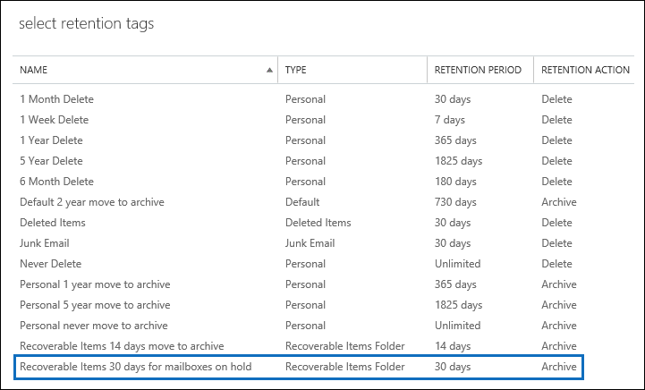
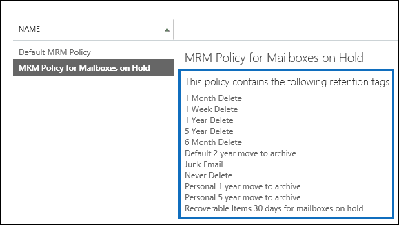

# <a name="increase-the-recoverable-items-quota-for-mailboxes-on-hold"></a><span data-ttu-id="515e5-103">Erhöhen des Kontingents für wiederherstellbare Elemente für aufzubewahrende Postfächer</span><span class="sxs-lookup"><span data-stu-id="515e5-103">Increase the Recoverable Items quota for mailboxes on hold</span></span>

<span data-ttu-id="515e5-104">Die standardmäßige Aufbewahrungsrichtlinie, die benannte Standard-MRM-Richtlinie, die automatisch auf neue Postfächer in Exchange Online angewendet wird, enthält ein Aufbewahrungs-Tag mit dem Namen "refundable Items 14 Tage" in Archiv verschieben.</span><span class="sxs-lookup"><span data-stu-id="515e5-104">The default retention policy—named Default MRM Policy—that is automatically applied to new mailboxes in Exchange Online contains a retention tag named Recoverable Items 14 days move to archive.</span></span> <span data-ttu-id="515e5-105">Mit diesem Aufbewahrungs werden Elemente aus dem Ordner "refundable Items" im primären Postfach des Benutzers in den Ordner "refundable Items" im Archivpostfach des Benutzers verschoben, nachdem der Aufbewahrungszeitraum von 14 Tagen für ein Element abgelaufen ist.</span><span class="sxs-lookup"><span data-stu-id="515e5-105">This retention tag moves items from the Recoverable Items folder in the user's primary mailbox to the Recoverable Items folder in the user's archive mailbox after the 14-day retention period expires for an item.</span></span> <span data-ttu-id="515e5-106">Damit dies geschieht, muss das Archivpostfach des Benutzers aktiviert sein.</span><span class="sxs-lookup"><span data-stu-id="515e5-106">For this to happen, the user's archive mailbox must be enabled.</span></span> <span data-ttu-id="515e5-107">Wenn das Archivpostfach nicht aktiviert ist, wird keine Aktion ausgeführt, was bedeutet, dass Elemente im Ordner "refundable Items" für ein aufbewahrtes Postfach nicht nach Ablauf der 14-tägigen Aufbewahrungsdauer in das Archivpostfach verschoben werden.</span><span class="sxs-lookup"><span data-stu-id="515e5-107">If the archive mailbox isn't enabled, no action is taken, which means that items in the Recoverable Items folder for a mailbox on hold aren't moved to the archive mailbox after the 14-day retention period expires.</span></span> <span data-ttu-id="515e5-108">Da nichts aus einem aufbewahrten Postfach gelöscht wird, kann es sein, dass das Speicherkontingent für den Ordner "Wiederherstellbare Elemente" möglicherweise überschritten wird, insbesondere, wenn das Archivpostfach des Benutzers nicht aktiviert ist.</span><span class="sxs-lookup"><span data-stu-id="515e5-108">Because nothing is deleted from a mailbox on hold, it's possible that the storage quota for the Recoverable Items folder might be exceeded, especially if the user's archive mailbox isn't enabled.</span></span> 
  
<span data-ttu-id="515e5-109">Um die Wahrscheinlichkeit zu verringern, diesen Grenzwert zu überschreiten, wird das Speicherkontingent für den Ordner "refundable Items" automatisch von 30 GB auf 100 GB erhöht, wenn ein Haltebereich in einem Postfach in Exchange Online abgelegt wird.</span><span class="sxs-lookup"><span data-stu-id="515e5-109">To help reduce the chance of exceeding this limit, the storage quota for the Recoverable Items folder is automatically increased from 30 GB to 100 GB when a hold is placed on a mailbox in Exchange Online.</span></span> <span data-ttu-id="515e5-110">Wenn das Archivpostfach aktiviert ist, wird das Speicherkontingent für den Ordner "refundable Items" im Archivpostfach ebenfalls von 30 GB auf 100 GB erhöht.</span><span class="sxs-lookup"><span data-stu-id="515e5-110">If the archive mailbox is enabled, the storage quota for the Recoverable Items folder in the archive mailbox is also increased from 30 GB to 100 GB.</span></span> <span data-ttu-id="515e5-111">Wenn das Feature für die automatische Erweiterung der Archivierung in Exchange Online aktiviert ist, ist das Speicherkontingent für den Ordner "Wiederherstellbare Elemente" im Archiv des Benutzers unbeschränkt.</span><span class="sxs-lookup"><span data-stu-id="515e5-111">If the auto-expanding archiving feature in Exchange Online is enabled, the storage quota for the Recoverable Items folder in the user's archive will be unlimited.</span></span>
  
 <span data-ttu-id="515e5-112">In der folgenden Tabelle ist das Speicherkontingent für den Ordner "refundable Items" zusammengefasst.</span><span class="sxs-lookup"><span data-stu-id="515e5-112">The following table summarizes the storage quota for the Recoverable Items folder.</span></span> 
  
|<span data-ttu-id="515e5-113">**Speicherort des Ordners "refundable Items"**</span><span class="sxs-lookup"><span data-stu-id="515e5-113">**Location of Recoverable Items folder**</span></span>|<span data-ttu-id="515e5-114">**Nicht in der Warteschleife gehaltene Postfächer**</span><span class="sxs-lookup"><span data-stu-id="515e5-114">**Mailboxes not on hold**</span></span>|<span data-ttu-id="515e5-115">**Aufbewahrung von Postfächern**</span><span class="sxs-lookup"><span data-stu-id="515e5-115">**Mailboxes on hold**</span></span>|
|:-----|:-----|:-----|
|<span data-ttu-id="515e5-116">Primäres Postfach</span><span class="sxs-lookup"><span data-stu-id="515e5-116">Primary mailbox</span></span>  <br/> |<span data-ttu-id="515e5-117">30 GB</span><span class="sxs-lookup"><span data-stu-id="515e5-117">30 GB</span></span>  <br/> |<span data-ttu-id="515e5-118">100 GB</span><span class="sxs-lookup"><span data-stu-id="515e5-118">100 GB</span></span>  <br/> |
|<span data-ttu-id="515e5-119">Archivpostfach<sup>\*</sup></span><span class="sxs-lookup"><span data-stu-id="515e5-119">Archive mailbox<sup>\*</sup></span></span> <br/> |<span data-ttu-id="515e5-120">Unbegrenzt</span><span class="sxs-lookup"><span data-stu-id="515e5-120">Unlimited</span></span>  <br/> |<span data-ttu-id="515e5-121">Unbegrenzt</span><span class="sxs-lookup"><span data-stu-id="515e5-121">Unlimited</span></span>  <br/> |
|<span data-ttu-id="515e5-122">**Gesamtes Speicherkontingent für den Ordner "refundable Items"**</span><span class="sxs-lookup"><span data-stu-id="515e5-122">**Total storage quota for the Recoverable Items folder**</span></span> <br/> |<span data-ttu-id="515e5-123">Unbegrenzt</span><span class="sxs-lookup"><span data-stu-id="515e5-123">Unlimited</span></span>  <br/> |<span data-ttu-id="515e5-124">Unbegrenzt</span><span class="sxs-lookup"><span data-stu-id="515e5-124">Unlimited</span></span>  <br/> |
   
> [!NOTE]
> <span data-ttu-id="515e5-125"><sup>\*</sup>Das anfängliche Speicherkontingent für das Archivpostfach beträgt 100 GB für Benutzer mit einer Lizenz für Exchange Online (Plan 2).</span><span class="sxs-lookup"><span data-stu-id="515e5-125"><sup>\*</sup> The initial storage quota for the archive mailbox is 100 GB for users with an Exchange Online (Plan 2) license.</span></span> <span data-ttu-id="515e5-126">Wenn die automatisch expandierende Archivierung für Postfächer aktiviert ist, wird das Speicherkontingent für das Archivpostfach und den Ordner "Wiederherstellbare Elemente" jedoch auf 110 GB erhöht.</span><span class="sxs-lookup"><span data-stu-id="515e5-126">However, when auto-expanding archiving is turned on for mailboxes on hold, the storage quota for both the archive mailbox and the Recoverable Items folder is increased to 110 GB.</span></span> <span data-ttu-id="515e5-127">Wenn erforderlich, wird zusätzlicher Archivspeicherplatz zur Verfügung gestellt, was zu einer unbegrenzten Menge Archivspeicher führt.</span><span class="sxs-lookup"><span data-stu-id="515e5-127">Additional archive storage space will be provisioned when necessary which results in an unlimited amount of archive storage.</span></span> <span data-ttu-id="515e5-128">Weitere Informationen zur automatischen Erweiterung der Archivierung finden Sie unter [Overview of Unlimited Archiving in Office 365](unlimited-archiving.md).</span><span class="sxs-lookup"><span data-stu-id="515e5-128">For more information about auto-expanding archiving, see [Overview of unlimited archiving in Office 365](unlimited-archiving.md).</span></span> 
  
<span data-ttu-id="515e5-129">Wenn das Speicherkontingent für den Ordner "refundable Items" im primären Postfach eines aufbewahrten Postfachs nahe am Erreichen des Grenzwerts liegt, können Sie die folgenden Schritte ausführen:</span><span class="sxs-lookup"><span data-stu-id="515e5-129">When the storage quota for the Recoverable Items folder in the primary mailbox of a mailbox on hold is close to reaching its limit, you can do the following things:</span></span>
  
- <span data-ttu-id="515e5-130">**Aktivieren des Archivpostfachs und Aktivieren der automatisch wachsenden Archivierung** – Sie können eine unbegrenzte Speicherkapazität für den Ordner "Wiederherstellbare Elemente" einfach aktivieren, indem Sie das Archivpostfach aktivieren und dann das Feature für die automatische Erweiterung der Archivierung in Exchange Online aktivieren.</span><span class="sxs-lookup"><span data-stu-id="515e5-130">**Enable the archive mailbox and turn on auto-expanding archiving** - You can enable an unlimited storage capacity for the Recoverable Items folder simply by enabling the archive mailbox and then turning on the auto-expanding archiving feature in Exchange Online.</span></span> <span data-ttu-id="515e5-131">Dies führt zu 110 GB für den Ordner "refundable Items" im primären Postfach und eine unbegrenzte Menge an Speicherkapazität für den Ordner "refundable Items" im Archiv des Benutzers.</span><span class="sxs-lookup"><span data-stu-id="515e5-131">This results in 110 GB for the Recoverable Items folder in the primary mailbox and an unlimited amount of storage capacity for the Recoverable Items folder in the user's archive.</span></span> <span data-ttu-id="515e5-132">Weitere Informationen finden Sie unter Vorgehensweise: [Aktivieren von archivpostfächern im Security & Compliance Center](enable-archive-mailboxes.md) und [Aktivieren der unbegrenzten Archivierung in Office 365](enable-unlimited-archiving.md).</span><span class="sxs-lookup"><span data-stu-id="515e5-132">See how: [Enable archive mailboxes in the Security & Compliance Center](enable-archive-mailboxes.md) and [Enable unlimited archiving in Office 365](enable-unlimited-archiving.md).</span></span>
    
    > [!NOTE]
    > <span data-ttu-id="515e5-133">Nachdem Sie das Archiv für ein Postfach aktiviert haben, das das Speicherkontingent für den Ordner "Wiederherstellbare Elemente" überschreitet, müssen Sie möglicherweise den Assistenten für verwaltete Ordner ausführen, um den Assistenten manuell zum Verarbeiten des Postfachs auszulösen, sodass abgelaufene Elemente im Ordner "Wiederherstellbare Elemente" im Archivpostfach verschoben werden.</span><span class="sxs-lookup"><span data-stu-id="515e5-133">After you enable the archive for a mailbox that's close to exceeding the storage quota for the Recoverable Items folder, you might want to run the Managed Folder Assistant to manually trigger the assistant to process the mailbox so that expired items are moved the Recoverable Items folder in the archive mailbox.</span></span> <span data-ttu-id="515e5-134">Anweisungen finden Sie in [Schritt 4](#optional-step-4-run-the-managed-folder-assistant-to-apply-the-new-retention-settings) .</span><span class="sxs-lookup"><span data-stu-id="515e5-134">See [Step 4](#optional-step-4-run-the-managed-folder-assistant-to-apply-the-new-retention-settings) for instructions.</span></span> <span data-ttu-id="515e5-135">Beachten Sie, dass andere Elemente im Postfach des Benutzers möglicherweise in das neue Archivpostfach verschoben werden.</span><span class="sxs-lookup"><span data-stu-id="515e5-135">Note that other items in the user's mailbox might be moved to the new archive mailbox.</span></span> <span data-ttu-id="515e5-136">Sie sollten dem Benutzer mitteilen, dass dies möglicherweise geschieht, nachdem Sie das Archivpostfach aktiviert haben.</span><span class="sxs-lookup"><span data-stu-id="515e5-136">Consider telling the user that this may happen after you enable the archive mailbox.</span></span> 
  
- <span data-ttu-id="515e5-137">**Erstellen einer benutzerdefinierten Aufbewahrungsrichtlinie für Postfächer in der Warteschleife** – zusätzlich zum Aktivieren des Archivpostfachs und der automatisch wachsenden Archivierung für Postfächer in einem Beweissicherungsverfahren oder in-situ-Speicher möchten Sie möglicherweise auch eine benutzerdefinierte Aufbewahrungsrichtlinie für Postfächer in der Warteschleife erstellen.</span><span class="sxs-lookup"><span data-stu-id="515e5-137">**Create a custom retention policy for mailboxes on hold** - In addition to enabling the archive mailbox and auto-expanding archiving for mailboxes on Litigation Hold or In-Place Hold, you might also want to create a custom retention policy for mailboxes on hold.</span></span> <span data-ttu-id="515e5-138">In diesem Fall können Sie eine Aufbewahrungsrichtlinie auf Postfächer anwenden, die sich von der Standard-MRM-Richtlinie unterscheiden, die auf Postfächer angewendet wird, die nicht in der Warteschleife gespeichert sind.</span><span class="sxs-lookup"><span data-stu-id="515e5-138">This let's you apply a retention policy to mailboxes on hold that's different from the Default MRM Policy that's applied to mailboxes that aren't on hold.</span></span> <span data-ttu-id="515e5-139">Auf diese Weise können Sie Aufbewahrungstags anwenden, die speziell für Postfächer in der Warteschleife entworfen wurden.</span><span class="sxs-lookup"><span data-stu-id="515e5-139">This lets you to apply retention tags that are specifically designed for mailboxes on hold.</span></span> <span data-ttu-id="515e5-140">Dies umfasst das Erstellen eines neuen Aufbewahrungstags für den Ordner "Wiederherstellbare Elemente".</span><span class="sxs-lookup"><span data-stu-id="515e5-140">This includes creating a new retention tag for the Recoverable Items folder.</span></span> 
    
<span data-ttu-id="515e5-141">Im weiteren Verlauf dieses Themas werden die schrittweisen Verfahren zum Erstellen einer benutzerdefinierten Aufbewahrungsrichtlinie für Postfächer in der Warteschleife beschrieben.</span><span class="sxs-lookup"><span data-stu-id="515e5-141">The remainder of this topic describes the step-by-step procedures to create a custom retention policy for mailboxes on hold.</span></span>
  
[<span data-ttu-id="515e5-142">Schritt 1: Erstellen eines benutzerdefinierten Aufbewahrungstags für den Ordner "Wiederherstellbare Elemente"</span><span class="sxs-lookup"><span data-stu-id="515e5-142">Step 1: Create a custom retention tag for the Recoverable Items folder</span></span>](#step-1-create-a-custom-retention-tag-for-the-recoverable-items-folder)

<span data-ttu-id="515e5-143">[[Schritt 2: Erstellen einer neuen Aufbewahrungsrichtlinie für Postfächer in der Warteschleife](#step-2-create-a-new-retention-policy-for-mailboxes-on-hold)</span><span class="sxs-lookup"><span data-stu-id="515e5-143">[[Step 2: Create a new retention policy for mailboxes on hold](#step-2-create-a-new-retention-policy-for-mailboxes-on-hold)</span></span>

[<span data-ttu-id="515e5-144">Schritt 3: Anwenden der neuen Aufbewahrungsrichtlinie auf Postfächer in der Warteschleife</span><span class="sxs-lookup"><span data-stu-id="515e5-144">Step 3: Apply the new retention policy to mailboxes on hold</span></span>](#step-3-apply-the-new-retention-policy-to-mailboxes-on-hold)

[<span data-ttu-id="515e5-145">Optional Schritt 4: Ausführen des Assistenten für verwaltete Ordner zum Anwenden der neuen Aufbewahrungseinstellungen</span><span class="sxs-lookup"><span data-stu-id="515e5-145">(Optional) Step 4: Run the Managed Folder Assistant to apply the new retention settings</span></span>](#optional-step-4-run-the-managed-folder-assistant-to-apply-the-new-retention-settings)
  
## <a name="step-1-create-a-custom-retention-tag-for-the-recoverable-items-folder"></a><span data-ttu-id="515e5-146">Schritt 1: Erstellen eines benutzerdefinierten Aufbewahrungstags für den Ordner "Wiederherstellbare Elemente"</span><span class="sxs-lookup"><span data-stu-id="515e5-146">Step 1: Create a custom retention tag for the Recoverable Items folder</span></span>

<span data-ttu-id="515e5-147">Der erste Schritt besteht darin, für den Ordner "Wiederherstellbare Elemente" ein benutzerdefiniertes Aufbewahrungstags (als Aufbewahrungsrichtlinientag oder RPT bezeichnet) zu erstellen.</span><span class="sxs-lookup"><span data-stu-id="515e5-147">The first step is to create a custom retention tag (called a retention policy tag or RPT) for the Recoverable Items folder.</span></span> <span data-ttu-id="515e5-148">Wie bereits erläutert, verschiebt dieser RPT Elemente aus dem Ordner "refundable Items" im primären Postfach des Benutzers in den Ordner "refundable Items" im Archivpostfach des Benutzers.</span><span class="sxs-lookup"><span data-stu-id="515e5-148">As previously explained, this RPT moves items from the Recoverable Items folder in the user's primary mailbox to the Recoverable Items folder in the user's archive mailbox.</span></span> <span data-ttu-id="515e5-149">Sie müssen PowerShell verwenden, um eine RPT für den Ordner "Wiederherstellbare Elemente" zu erstellen.</span><span class="sxs-lookup"><span data-stu-id="515e5-149">You have to use PowerShell to create an RPT for the Recoverable Items folder.</span></span> <span data-ttu-id="515e5-150">Sie können nicht die Exchange-Verwaltungskonsole (EAC) verwenden.</span><span class="sxs-lookup"><span data-stu-id="515e5-150">You can't use the Exchange admin center (EAC).</span></span> 
  
1. [<span data-ttu-id="515e5-151">Stellen Sie eine Verbindung mit Exchange Online mithilfe der Remote-PowerShell her</span><span class="sxs-lookup"><span data-stu-id="515e5-151">Connect to Exchange Online using remote PowerShell</span></span>](https://go.microsoft.com/fwlink/p/?LinkId=517283)
    
2. <span data-ttu-id="515e5-152">Führen Sie den folgenden Befehl aus, um eine neue RPT für den Ordner "Wiederherstellbare Elemente" zu erstellen:</span><span class="sxs-lookup"><span data-stu-id="515e5-152">Run the following command to create a new RPT for the Recoverable Items folder:</span></span> 
    
    ```powershell
    New-RetentionPolicyTag -Name <Name of RPT> -Type RecoverableItems -AgeLimitForRetention <Number of days> -RetentionAction MoveToArchive
    ```

    <span data-ttu-id="515e5-153">Mit dem folgenden Befehl wird beispielsweise eine RPT für den Ordner "refundable Items" mit dem Namen "refundable Items 30 Days for Mailboxes on Hold" mit einer Aufbewahrungsdauer von 30 Tagen erstellt.</span><span class="sxs-lookup"><span data-stu-id="515e5-153">For example, the following command creates a RPT for the Recoverable Items folder named "Recoverable Items 30 days for mailboxes on hold", with a retention period of 30 days.</span></span> <span data-ttu-id="515e5-154">Dies bedeutet, dass ein Element im Ordner "Wiederherstellbare Elemente" 30 Tage lang in den Ordner "Wiederherstellbare Elemente" im Archivpostfach des Benutzers verschoben wird.</span><span class="sxs-lookup"><span data-stu-id="515e5-154">This means that after an item has been in the Recoverable Items folder for 30 days, it will be moved to the Recoverable Items folder in the user's archive mailbox.</span></span>
    
    ```powershell
    New-RetentionPolicyTag -Name "Recoverable Items 30 days for mailboxes on hold" -Type RecoverableItems -AgeLimitForRetention 30 -RetentionAction MoveToArchive
    ```

    > [!TIP]
    > <span data-ttu-id="515e5-155">Es wird empfohlen, dass der Aufbewahrungszeitraum (definiert durch den Parameter _AgeLimitForRetention_ ) für die wiederherstellbaren Elemente RPT mit dem Beibehaltungszeitraum für gelöschte Elemente für die Postfächer identisch ist, auf die die RPT angewendet wird.</span><span class="sxs-lookup"><span data-stu-id="515e5-155">We recommend that the retention period (defined by the  _AgeLimitForRetention_ parameter) for the Recoverable Items RPT is the same as the deleted item retention period for the mailboxes that the RPT will be applied to.</span></span> <span data-ttu-id="515e5-156">Dadurch kann ein Benutzer den gesamten Aufbewahrungszeitraum für gelöschte Elemente wiederherstellen, bevor er in das Archivpostfach verschoben wird.</span><span class="sxs-lookup"><span data-stu-id="515e5-156">This allows a user the entire deleted item retention period to recover deleted items before they are moved to the archive mailbox.</span></span> <span data-ttu-id="515e5-157">Im vorherigen Beispiel wurde der Aufbewahrungszeitraum auf 30 Tage festgelegt, basierend auf der Annahme, dass der Aufbewahrungszeitraum für gelöschte Elemente für Postfächer ebenfalls 30 Tage beträgt.</span><span class="sxs-lookup"><span data-stu-id="515e5-157">In the previous example, the retention period was set to 30 days based on the assumption that the deleted item retention period for mailboxes is also 30 days.</span></span> <span data-ttu-id="515e5-158">Ein Exchange Online Postfach wird standardmäßig so konfiguriert, dass gelöschte Elemente für 14 Tage aufbewahrt werden.</span><span class="sxs-lookup"><span data-stu-id="515e5-158">An Exchange Online mailbox is configured to retain deleted items for 14 days, by default.</span></span> <span data-ttu-id="515e5-159">Sie können diese Einstellung jedoch auf maximal 30 Tage ändern.</span><span class="sxs-lookup"><span data-stu-id="515e5-159">But you can change this setting to a maximum of 30 days.</span></span> <span data-ttu-id="515e5-160">Weitere Informationen finden Sie unter [Ändern des Aufbewahrungszeitraums für gelöschte Elemente für ein Postfach in Exchange Online](https://www.microsoft.com/?ref=go).</span><span class="sxs-lookup"><span data-stu-id="515e5-160">For more information, see [Change the deleted item retention period for a mailbox in Exchange Online](https://www.microsoft.com/?ref=go).</span></span> 
  
## <a name="step-2-create-a-new-retention-policy-for-mailboxes-on-hold"></a><span data-ttu-id="515e5-161">Schritt 2: Erstellen einer neuen Aufbewahrungsrichtlinie für Postfächer in der Warteschleife</span><span class="sxs-lookup"><span data-stu-id="515e5-161">Step 2: Create a new retention policy for mailboxes on hold</span></span>

<span data-ttu-id="515e5-162">Im nächsten Schritt erstellen Sie eine neue Aufbewahrungsrichtlinie und fügen ihr Aufbewahrungstags hinzu, einschließlich der wiederherstellbaren Elemente rpt, die Sie in Schritt 1 erstellt haben.</span><span class="sxs-lookup"><span data-stu-id="515e5-162">The next step is to create a new retention policy and add retention tags to it, including the Recoverable Items RPT that you created in Step 1.</span></span> <span data-ttu-id="515e5-163">Diese neue Richtlinie wird im nächsten Schritt auf die zu speichernden Postfächer angewendet.</span><span class="sxs-lookup"><span data-stu-id="515e5-163">This new policy will be applied to mailboxes on hold in the next step.</span></span> 
  
<span data-ttu-id="515e5-164">Bevor Sie die neue Aufbewahrungsrichtlinie erstellen, müssen Sie die zusätzlichen Aufbewahrungstags bestimmen, die Sie hinzufügen möchten.</span><span class="sxs-lookup"><span data-stu-id="515e5-164">Before you create the new retention policy, determine the additional retention tags that you want to add.</span></span> <span data-ttu-id="515e5-165">Eine Liste der Aufbewahrungstags, die der Standard-MRM-Richtlinie hinzugefügt werden, sowie Informationen zum Erstellen neuer Aufbewahrungstags finden Sie in den folgenden Themen:</span><span class="sxs-lookup"><span data-stu-id="515e5-165">For a list of the retention tags that are added to the Default MRM Policy and for information about creating new retention tags, see the following:</span></span>
  
- [<span data-ttu-id="515e5-166">Standardaufbewahrungsrichtlinie in Exchange Online </span><span class="sxs-lookup"><span data-stu-id="515e5-166">Default Retention Policy in Exchange Online </span></span>](https://go.microsoft.com/fwlink/p/?LinkId=746954)
    
- [<span data-ttu-id="515e5-167">Standardordner, die Aufbewahrungsrichtlinientags unterstützen</span><span class="sxs-lookup"><span data-stu-id="515e5-167">Default folders that support Retention Policy Tags</span></span>](https://go.microsoft.com/fwlink/p/?LinkId=746957)
    
- <span data-ttu-id="515e5-168">Im Abschnitt "Erstellen eines Aufbewahrungstags" im Thema " [Erstellen einer Aufbewahrungsrichtlinie](https://go.microsoft.com/fwlink/p/?LinkId=404422) ".</span><span class="sxs-lookup"><span data-stu-id="515e5-168">The "Create a retention tag" section in the [Create a Retention Policy](https://go.microsoft.com/fwlink/p/?LinkId=404422) topic.</span></span>
    
<span data-ttu-id="515e5-169">Sie können die Exchange-Verwaltungskonsole oder Exchange Online PowerShell verwenden, um eine Aufbewahrungsrichtlinie zu erstellen.</span><span class="sxs-lookup"><span data-stu-id="515e5-169">You can use the EAC or Exchange Online PowerShell to create a retention policy.</span></span>
  
### <a name="use-the-eac-to-create-a-retention-policy"></a><span data-ttu-id="515e5-170">Erstellen einer Aufbewahrungsrichtlinie mithilfe der Exchange-Verwaltungskonsole</span><span class="sxs-lookup"><span data-stu-id="515e5-170">Use the EAC to create a retention policy</span></span>
  
1. <span data-ttu-id="515e5-171">Wechseln Sie in der Exchange- **Verwaltungskonsole zu Compliance Management** \> **Retention Policies**, und klicken Sie dann auf Add Icon **Hinzufügen**  .</span><span class="sxs-lookup"><span data-stu-id="515e5-171">In the EAC, go to **Compliance management** \> **Retention policies**, and then click **Add** .</span></span>
    
2. <span data-ttu-id="515e5-172">Geben Sie auf der Seite **neue Aufbewahrungsrichtlinie** unter **Name**einen Namen ein, der den Zweck der Aufbewahrungsrichtlinie beschreibt. beispielsweise **MRM-Richtlinie für Postfächer**, die aufbewahrt werden.</span><span class="sxs-lookup"><span data-stu-id="515e5-172">On the **New retention policy** page, under **Name**, type a name that describes the purpose of the retention policy; for example, **MRM Policy for Mailboxes on Hold**.</span></span> 
    
3. <span data-ttu-id="515e5-173">Klicken Sie unter **Aufbewahrungstags**auf Add-Symbol **Hinzufügen**  .</span><span class="sxs-lookup"><span data-stu-id="515e5-173">Under **Retention tags**, click **Add** .</span></span>
    
4. <span data-ttu-id="515e5-174">Wählen Sie in der Liste der Aufbewahrungstags die wiederherstellbaren Elemente RPT aus, die Sie in Schritt 1 erstellt haben, und klicken Sie dann auf **Hinzufügen**.</span><span class="sxs-lookup"><span data-stu-id="515e5-174">In the list of retention tags, select the Recoverable Items RPT that you created in Step 1, and then click **Add**.</span></span>
    
    
  
5. <span data-ttu-id="515e5-176">Wählen Sie zusätzliche Aufbewahrungstags aus, die der Aufbewahrungsrichtlinie hinzugefügt werden sollen.</span><span class="sxs-lookup"><span data-stu-id="515e5-176">Select additional retention tags to add to the retention policy.</span></span> <span data-ttu-id="515e5-177">Beispielsweise können Sie die gleichen Tags hinzufügen, die in der standardmäßigen MRM-Richtlinie enthalten sind.</span><span class="sxs-lookup"><span data-stu-id="515e5-177">For example, you might want to add the same tags that are included in the Default MRM Policy.</span></span>
    
6. <span data-ttu-id="515e5-178">Wenn Sie das Hinzufügen von Aufbewahrungstags abgeschlossen haben, klicken Sie auf **OK**.</span><span class="sxs-lookup"><span data-stu-id="515e5-178">When you're finished adding retention tags, click **OK**.</span></span>
    
7. <span data-ttu-id="515e5-179">Klicken Sie auf **Speichern** , um die neue Aufbewahrungsrichtlinie zu erstellen.</span><span class="sxs-lookup"><span data-stu-id="515e5-179">Click **Save** to create the new retention policy.</span></span> 
    
    <span data-ttu-id="515e5-180">Beachten Sie, dass die Aufbewahrungstags, die mit der Aufbewahrungsrichtlinie verknüpft sind, im Detailbereich angezeigt werden.</span><span class="sxs-lookup"><span data-stu-id="515e5-180">Notice that the retention tags linked to the retention policy are displayed in the details pane.</span></span>
    
    
  
### <a name="use-exchange-online-powershell-to-create-a-retention-policy"></a><span data-ttu-id="515e5-182">Verwenden Exchange Online PowerShell zum Erstellen einer Aufbewahrungsrichtlinie</span><span class="sxs-lookup"><span data-stu-id="515e5-182">Use Exchange Online PowerShell to create a retention policy</span></span>
  
<span data-ttu-id="515e5-183">Führen Sie den folgenden Befehl aus, um eine neue Aufbewahrungsrichtlinie für Postfächer in der Warteschleife zu erstellen.</span><span class="sxs-lookup"><span data-stu-id="515e5-183">Run the following command to create new retention policy for mailboxes on hold.</span></span> 
  
```powershell
New-RetentionPolicy <Name of retention policy>  -RetentionPolicyTagLinks <list of retention tags>

```

<span data-ttu-id="515e5-184">Mit dem folgenden Befehl werden beispielsweise die Aufbewahrungsrichtlinie und verknüpfte Aufbewahrungstags erstellt, die in der vorherigen Abbildung angezeigt werden.</span><span class="sxs-lookup"><span data-stu-id="515e5-184">For example, the following command creates the retention policy and linked retention tags that is displayed in the previous illustration.</span></span>
  
```powershell
New-RetentionPolicy "MRM Policy for Mailboxes on Hold"  -RetentionPolicyTagLinks "Recoverable Items 30 days for mailboxes on hold","1 Month Delete","1 Week Delete","1 Year Delete","5 Year Delete","6 Month Delete","Default 2 year move to archive","Junk Email","Never Delete","Personal 1 year move to archive","Personal 5 year move to archive"
```

## <a name="step-3-apply-the-new-retention-policy-to-mailboxes-on-hold"></a><span data-ttu-id="515e5-185">Schritt 3: Anwenden der neuen Aufbewahrungsrichtlinie auf Postfächer in der Warteschleife</span><span class="sxs-lookup"><span data-stu-id="515e5-185">Step 3: Apply the new retention policy to mailboxes on hold</span></span>

<span data-ttu-id="515e5-186">Der letzte Schritt besteht darin, die neue Aufbewahrungsrichtlinie, die Sie in Schritt 2 erstellt haben, auf in Ihrer Organisation aufbewahrte Postfächer anzuwenden.</span><span class="sxs-lookup"><span data-stu-id="515e5-186">The last step is to apply the new retention policy that you created in Step 2 to mailboxes on hold in your organization.</span></span> <span data-ttu-id="515e5-187">Sie können die Exchange-Verwaltungskonsole oder Exchange Online PowerShell verwenden, um die Aufbewahrungsrichtlinie auf ein einzelnes Postfach oder auf mehrere Postfächer anzuwenden.</span><span class="sxs-lookup"><span data-stu-id="515e5-187">You can use the EAC or Exchange Online PowerShell to apply the retention policy to a single mailbox or to multiple mailboxes.</span></span> 
  
### <a name="use-the-eac-to-apply-the-new-retention-policy"></a><span data-ttu-id="515e5-188">Anwenden der neuen Aufbewahrungsrichtlinie mithilfe der Exchange-Verwaltungskonsole</span><span class="sxs-lookup"><span data-stu-id="515e5-188">Use the EAC to apply the new retention policy</span></span>
  
1. <span data-ttu-id="515e5-189">Navigieren Sie zu **Empfänger** \> **Postfächer**.</span><span class="sxs-lookup"><span data-stu-id="515e5-189">Go to **Recipients** \> **Mailboxes**.</span></span>
    
2. <span data-ttu-id="515e5-190">Wählen Sie in der Listenansicht das Postfach aus, auf das die Aufbewahrungsrichtlinie angewendet werden soll, und klicken Sie dann auf Bearbeitungssymbol **Bearbeiten**  .</span><span class="sxs-lookup"><span data-stu-id="515e5-190">In the list view, select the mailbox you want to apply the retention policy to, and then click **Edit** .</span></span>
    
3. <span data-ttu-id="515e5-191">Klicken Sie auf der Seite **Benutzerpostfach** auf **Postfachfunktionen**.</span><span class="sxs-lookup"><span data-stu-id="515e5-191">On the **User Mailbox** page, click **Mailbox features**.</span></span>
    
4. <span data-ttu-id="515e5-192">Wählen Sie unter **Aufbewahrungsrichtlinie**die Aufbewahrungsrichtlinie aus, die Sie in Schritt 2 erstellt haben, und klicken Sie dann auf **Speichern**.</span><span class="sxs-lookup"><span data-stu-id="515e5-192">Under **Retention policy**, select the retention policy that you created in Step 2, and then click **Save**.</span></span>
    
<span data-ttu-id="515e5-193">Sie können auch die Exchange-Verwaltungskonsole verwenden, um die Aufbewahrungsrichtlinie auf mehrere Postfächer anzuwenden.</span><span class="sxs-lookup"><span data-stu-id="515e5-193">You can also use the EAC to apply the retention policy to multiple mailboxes.</span></span>
  
1. <span data-ttu-id="515e5-194">Navigieren Sie zu **Empfänger** \> **Postfächer**.</span><span class="sxs-lookup"><span data-stu-id="515e5-194">Go to **Recipients** \> **Mailboxes**.</span></span>
    
2. <span data-ttu-id="515e5-195">Verwenden Sie in der Listenansicht die UMSCHALT- oder die STRG-TASTE, um mehrere Postfächer auszuwählen.</span><span class="sxs-lookup"><span data-stu-id="515e5-195">In the list view, use the Shift or Ctrl keys to select multiple mailboxes.</span></span>
    
3. <span data-ttu-id="515e5-196">Klicken Sie im Detailbereich auf **Weitere Optionen**.</span><span class="sxs-lookup"><span data-stu-id="515e5-196">In the details pane, click **More options**.</span></span>
    
4. <span data-ttu-id="515e5-197">Klicken Sie unter **Aufbewahrungsrichtlinie** auf **Aktualisieren**.</span><span class="sxs-lookup"><span data-stu-id="515e5-197">Under **Retention Policy**, click **Update**.</span></span>
    
5. <span data-ttu-id="515e5-198">Wählen Sie auf der Seite **Aufbewahrungsrichtlinie für Massen Zuweisungen** die Aufbewahrungsrichtlinie aus, die Sie in Schritt 2 erstellt haben, und klicken Sie dann auf **Speichern**.</span><span class="sxs-lookup"><span data-stu-id="515e5-198">On the **Bulk assign retention policy** page, select the retention policy that you created in Step 2, and then click **Save**.</span></span> 
    
### <a name="use-exchange-online-powershell-to-apply-the-new-retention-policy"></a><span data-ttu-id="515e5-199">Anwenden der neuen Aufbewahrungsrichtlinie mithilfe Exchange Online PowerShell</span><span class="sxs-lookup"><span data-stu-id="515e5-199">Use Exchange Online PowerShell to apply the new retention policy</span></span>
  
<span data-ttu-id="515e5-200">Sie können Exchange Online PowerShell verwenden, um eine neue Aufbewahrungsrichtlinie auf ein einzelnes Postfach anzuwenden.</span><span class="sxs-lookup"><span data-stu-id="515e5-200">You can use Exchange Online PowerShell to apply a new retention policy to a single mailbox.</span></span> <span data-ttu-id="515e5-201">Die wirkliche Leistungsfähigkeit von PowerShell besteht darin, dass Sie damit schnell alle Postfächer in Ihrer Organisation identifizieren können, die entweder in einem Beweissicherungsverfahren oder in-situ-Speicher enthalten sind, und dann die neue Aufbewahrungsrichtlinie auf alle Postfächer in einem einzigen Befehl anwenden.</span><span class="sxs-lookup"><span data-stu-id="515e5-201">But the real power of PowerShell is that you can use it to quickly identify all the mailboxes in your organization that are on either Litigation Hold or In-Place Hold, and then apply the new retention policy to all mailboxes on hold in a single command.</span></span> <span data-ttu-id="515e5-202">Im folgenden finden Sie einige Beispiele für die Verwendung von Exchange PowerShell zum Anwenden einer Aufbewahrungsrichtlinie auf ein oder mehrere Postfächer.</span><span class="sxs-lookup"><span data-stu-id="515e5-202">Here are some examples of using Exchange PowerShell to apply a retention policy to one or more mailboxes.</span></span> <span data-ttu-id="515e5-203">In allen Beispielen wird die in Schritt 2 erstellte Aufbewahrungsrichtlinie angewendet.</span><span class="sxs-lookup"><span data-stu-id="515e5-203">All of the examples apply the retention policy that was created in Step 2.</span></span>
  
<span data-ttu-id="515e5-204">In diesem Beispiel wird die neue Aufbewahrungsrichtlinie auf das Postfach von Pilar Pinilla angewendet.</span><span class="sxs-lookup"><span data-stu-id="515e5-204">This example applies the new retention policy to Pilar Pinilla's mailbox.</span></span>
  
```powershell
Set-Mailbox "Pilar Pinilla" -RetentionPolicy "MRM Policy for Mailboxes on Hold"
```

<span data-ttu-id="515e5-205">In diesem Beispiel wird die neue Aufbewahrungsrichtlinie auf alle Postfächer in der Organisation angewendet, die das Beweissicherungsverfahren besitzen.</span><span class="sxs-lookup"><span data-stu-id="515e5-205">This example applies the new retention policy to all mailboxes in the organization that are on Litigation Hold.</span></span>
  
```powershell
$LitigationHolds = Get-Mailbox -ResultSize unlimited | Where-Object {$_.LitigationHoldEnabled -eq 'True'}
```

```powershell
$LitigationHolds.DistinguishedName | Set-Mailbox -RetentionPolicy "MRM Policy for Mailboxes on Hold"
```

<span data-ttu-id="515e5-206">In diesem Beispiel wird die neue Aufbewahrungsrichtlinie auf alle Postfächer in der Organisation angewendet, die sich im Compliance-Archiv befinden.</span><span class="sxs-lookup"><span data-stu-id="515e5-206">This example applies the new retention policy to all mailboxes in the organization that are on In-Place Hold.</span></span>
  
```powershell
$InPlaceHolds = Get-Mailbox -ResultSize unlimited | Where-Object {$_.InPlaceHolds -ne $null}
```

```powershell
$InPlaceHolds.DistinguishedName | Set-Mailbox -RetentionPolicy "MRM Policy for Mailboxes on Hold"
```

<span data-ttu-id="515e5-207">Sie können das Cmdlet **Get-Mailbox** verwenden, um zu überprüfen, ob die neue Aufbewahrungsrichtlinie angewendet wurde.</span><span class="sxs-lookup"><span data-stu-id="515e5-207">You can use the **Get-Mailbox** cmdlet to verify that the new retention policy was applied.</span></span> 
  
<span data-ttu-id="515e5-208">Im folgenden finden Sie einige Beispiele, um zu überprüfen, ob in den Befehlen in den vorherigen Beispielen die Aufbewahrungsrichtlinie für MRM-Richtlinien für Postfächer auf Postfächer für das Beweissicherungsverfahren und die Postfächer im Compliance-Archiv angewendet wurde.</span><span class="sxs-lookup"><span data-stu-id="515e5-208">Here are some examples to verify that the commands in the previous examples applied the "MRM Policy for Mailboxes on Hold" retention policy to mailboxes on Litigation Hold and mailboxes on In-Place Hold.</span></span>
  
```powershell
Get-Mailbox "Pilar Pinilla" | Select RetentionPolicy
```

```powershell
Get-Mailbox -ResultSize unlimited | Where-Object {$_.LitigationHoldEnabled -eq 'True'} | FT DisplayName,RetentionPolicy -Auto
```

```powershell
Get-Mailbox -ResultSize unlimited | Where-Object {$_.InPlaceHolds -ne $null} | FT DisplayName,RetentionPolicy -Auto
```

## <a name="optional-step-4-run-the-managed-folder-assistant-to-apply-the-new-retention-settings"></a><span data-ttu-id="515e5-209">Optional Schritt 4: Ausführen des Assistenten für verwaltete Ordner zum Anwenden der neuen Aufbewahrungseinstellungen</span><span class="sxs-lookup"><span data-stu-id="515e5-209">(Optional) Step 4: Run the Managed Folder Assistant to apply the new retention settings</span></span>

<span data-ttu-id="515e5-210">Nachdem Sie die neue Aufbewahrungsrichtlinie auf Postfächer angewendet haben, kann es bis zu sieben Tage dauern, bis Exchange Online vom Assistenten für verwaltete Ordner mithilfe der Einstellungen in der neuen Aufbewahrungsrichtlinie diese Postfächer verarbeitet.</span><span class="sxs-lookup"><span data-stu-id="515e5-210">After you apply the new retention policy to mailboxes on hold, it can take up to 7 days in Exchange Online for the Managed Folder Assistant to process these mailboxes using the settings in the new retention policy.</span></span> <span data-ttu-id="515e5-211">Anstatt auf die Ausführung des Assistenten für verwaltete Ordner zu warten, können Sie das Cmdlet **Start-ManagedFolderAssistant** verwenden, um den Assistenten manuell auszulösen, um die Postfächer zu verarbeiten, auf die Sie die neue Aufbewahrungsrichtlinie angewendet haben.</span><span class="sxs-lookup"><span data-stu-id="515e5-211">Instead of waiting for the Managed Folder Assistant to run, you can use the **Start-ManagedFolderAssistant** cmdlet to manually trigger the assistant to process the mailboxes that you applied the new retention policy to.</span></span> 
  
<span data-ttu-id="515e5-212">Führen Sie den folgenden Befehl aus, um den Assistenten für verwaltete Ordner für das Postfach von Pilar Pinilla zu starten.</span><span class="sxs-lookup"><span data-stu-id="515e5-212">Run the following command to start the Managed Folder Assistant for Pilar Pinilla's mailbox.</span></span>
  
```powershell
Start-ManagedFolderAssistant "Pilar Pinilla"
```

<span data-ttu-id="515e5-213">Führen Sie die folgenden Befehle aus, um den Assistenten für verwaltete Ordner für alle in der Warteschleife stehenden Postfächer zu starten.</span><span class="sxs-lookup"><span data-stu-id="515e5-213">Run the following commands to start the Managed Folder Assistant for all mailboxes on hold.</span></span>
  
```powershell
$MailboxesOnHold = Get-Mailbox -ResultSize unlimited | Where-Object {($_.InPlaceHolds -ne $null) -or ($_.LitigationHoldEnabled -eq "True")}
```

```powershell
$MailboxesOnHold.DistinguishedName | Start-ManagedFolderAssistant
```

## <a name="more-information"></a><span data-ttu-id="515e5-214">Weitere Informationen</span><span class="sxs-lookup"><span data-stu-id="515e5-214">More information</span></span>

- <span data-ttu-id="515e5-215">Nachdem Sie das Archivpostfach eines Benutzers aktiviert haben, sollten Sie dem Benutzer mitteilen, dass andere Elemente in seinem Postfach (nicht nur Elemente im Ordner "Wiederherstellbare Elemente") möglicherweise in das Archivpostfach verschoben werden.</span><span class="sxs-lookup"><span data-stu-id="515e5-215">After you enable a user's archive mailbox, consider telling the user that other items in their mailbox (not just items in the Recoverable Items folder) might be moved to the archive mailbox.</span></span> <span data-ttu-id="515e5-216">Dies liegt daran, dass die standardmäßige MRM-Richtlinie, die Exchange Online Postfächern zugewiesen ist, ein Aufbewahrungs-Tag enthält (standardmäßig 2 Jahre in Archiv verschieben), das Elemente in das Archivpostfach zwei Jahre nach dem Datum verschiebt, an dem das Element an das Postfach zugestellt oder vom Benutzer erstellt wurde.</span><span class="sxs-lookup"><span data-stu-id="515e5-216">This is because the Default MRM Policy that's assigned to Exchange Online mailboxes contains a retention tag (named Default 2 years move to archive) that moves items to the archive mailbox two years after the date the item was delivered to the mailbox or created by the user.</span></span> <span data-ttu-id="515e5-217">Weitere Informationen finden Sie unter [default Retention Policy in Exchange Online](https://go.microsoft.com/fwlink/p/?LinkId=746954)</span><span class="sxs-lookup"><span data-stu-id="515e5-217">For more information, see [Default Retention Policy in Exchange Online ](https://go.microsoft.com/fwlink/p/?LinkId=746954)</span></span>
    
- <span data-ttu-id="515e5-218">Nachdem Sie das Archivpostfach eines Benutzers aktiviert haben, können Sie dem Benutzer auch mitteilen, dass er gelöschte Elemente im Ordner "Wiederherstellbare Elemente" im Archivpostfach wiederherstellen kann.</span><span class="sxs-lookup"><span data-stu-id="515e5-218">After you enable a user's archive mailbox, you might also tell the user that they can recover deleted items in the Recoverable Items folder in their archive mailbox.</span></span> <span data-ttu-id="515e5-219">Sie können dies in Outlook tun, indem Sie den Ordner **Gelöschte Elemente** im Archivpostfach auswählen und dann auf der Registerkarte **Start** auf **Gelöschte Elemente aus dem Server wiederherstellen** klicken. Weitere Informationen zum Wiederherstellen gelöschter Elemente finden Sie unter [Wiederherstellen gelöschter Elemente in Outlook für Windows](https://go.microsoft.com/fwlink/p/?LinkId=624829).</span><span class="sxs-lookup"><span data-stu-id="515e5-219">They can do this in Outlook by selecting the **Deleted Items** folder in the archive mailbox, and then clicking **Recover Deleted Items from Server** on the **Home** tab. For more information about recovering deleted items, see [Recover deleted items in Outlook for Windows](https://go.microsoft.com/fwlink/p/?LinkId=624829).</span></span> 
