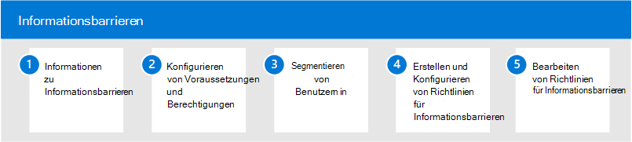

# Informationsbarrieren in Microsoft 365

Microsoft 365 ermöglicht die Kommunikation und Zusammenarbeit zwischen Gruppen und Organisationen und unterstützt Möglichkeiten, die Kommunikation und Zusammenarbeit bei Bedarf auf bestimmte Benutzergruppen einzuschränken. Dies kann Situationen oder Szenarien umfassen, in denen Sie die Kommunikation und Zusammenarbeit zwischen zwei Gruppen einschränken möchten, um zu verhindern, dass ein Interessenkonflikt in Ihrer Organisation auftritt. Dies kann auch Situationen einschließen, in denen Sie die Kommunikation und Zusammenarbeit zwischen bestimmten Personen innerhalb Ihrer Organisation einschränken müssen, um interne Informationen zu schützen.

Informationsbarrieren werden in Microsoft Teams, SharePoint Online und OneDrive für Unternehmen unterstützt. Ein Administrator für Compliance-oder Informationsbarrieren kann Richtlinien definieren, um die Kommunikation zwischen Benutzergruppen in Microsoft Teams zuzulassen oder zu verhindern. Richtlinien für Informationsbarrieren können für Situationen wie diese verwendet werden:

- Benutzer in der Day Trader-Gruppe sollten keine Dateien mit dem Marketing Team kommunizieren oder freigeben
- Finanz Personal, das an vertraulichen Unternehmensinformationen arbeitet, sollte keine Dateien mit bestimmten Gruppen innerhalb Ihrer Organisation kommunizieren oder freigeben
- Ein internes Team mit Geschäfts geheimem Material sollte nicht online mit Personen in bestimmten Gruppen innerhalb Ihrer Organisation anrufen oder chatten.
- Ein Forschungsteam sollte nur online mit einem Produktentwicklungsteam anrufen oder chatten

## Konfigurieren von Informationsbarrieren für Microsoft 365

Führen Sie die folgenden Schritte aus, um Informationsbarrieren für Ihre Organisation zu konfigurieren:

1. Erfahren Sie mehr über [Informationsbarrieren](information-barriers.md) in Microsoft 365
2. Konfigurieren von [Voraussetzungen und Berechtigungen](information-barriers-policies.md#prerequisites)
3. Segmentieren [von Benutzern in Ihrer Organisation](information-barriers-policies.md#part-1-segment-users)
4. Erstellen und Konfigurieren von [Richtlinien für Informationsbarrieren](information-barriers-policies.md#part-2-define-information-barrier-policies)
5. Anwenden von [Richtlinien für Informationsbarrieren](information-barriers-policies.md#part-3-apply-information-barrier-policies)

## Weitere Informationen zu Informationsbarrieren

- [Attribute für Richtlinien für Informationsbarrieren](information-barriers-attributes.md)
- [Bearbeiten oder Entfernen von Richtlinien für Informationsbarrieren](information-barriers-edit-segments-policies.md)