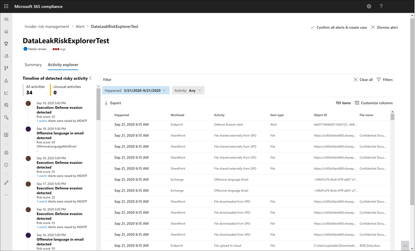

# Warnungen beim Insider Risikomanagement

Warnungen zum Insider-Risikomanagement werden automatisch durch Risikoindikatoren generiert, die in den Richtlinien zum Insider-Risikomanagement definiert sind. Diese Warnungen geben Compliance-Analysten und -Ermittlern einen umfassenden Überblick über den aktuellen Risikostatus und ermöglichen es Ihrem Unternehmen, eine Einstufung vorzunehmen und Maßnahmen für entdeckte Risiken zu ergreifen. Standardmäßig generieren Richtlinien eine bestimmte Menge an Warnungen mit niedrigem, mittlerem und hohem Schweregrad, aber Sie können [das Warnungs Volumen entsprechend Ihren Anforderungen erweitern oder verringern](insider-risk-management-settings.md#alert-volume) . Darüber hinaus können Sie den [Warnungsschwellenwert für Richtlinien Indikatoren](insider-risk-management-settings.md#indicator-level-settings-preview) beim Erstellen einer neuen Richtlinie mit dem Richtlinien-Assistenten konfigurieren.

## Dashboard "Warnung"

Das Alert- **Dashboard** für Insider Risiken ermöglicht Ihnen das Anzeigen und Bearbeiten von Warnungen, die von Insider Risikorichtlinien generiert werden. Jedes Berichts-Widget zeigt Informationen für die letzten 30 Tage an.

- **Zu über**prüfende Warnungen: die Gesamtzahl der Warnungen, die Überprüfung und Selektierung erforderlich sind, wird aufgeführt, einschließlich einer Aufteilung nach Warnungsschweregrad.
- **Warnungen in den letzten 30 Tagen öffnen**: die Gesamtzahl der Warnungen, die von Richtlinien Übereinstimmungen in den letzten 30 Tagen erstellt wurden, sortiert nach hoch-, Mittel-und niedrigem Warnungsschweregrad.
- **Durchschnittliche Zeit zum Auflösen von Warnungen**: eine Zusammenfassung der nützlichen Warnungs Statistiken:
    - Durchschnittliche Zeit zur Behebung von Warnungen höheren Schweregrades, angegeben in Stunden, Tagen oder Monaten.
    - Durchschnittliche Zeit bis zur Behebung von Warnungen mittleren Schweregrades, angegeben in Stunden, Tagen oder Monaten.
    - Durchschnittliche Zeit bis zur Behebung von Warnungen niedrigen Schweregrades, angegeben in Stunden, Tagen oder Monaten.

>[!NOTE]
>Bei der Verwaltung von Insider-Risiken wird eine integrierte Warnungsdrosselung verwendet, um Ihre Erfahrungen bei der Risikoermittlung und -prüfung zu schützen und zu optimieren. Diese Drosselung schützt vor Problemen, die zu einer Überlastung der Richtlinienwarnungen führen könnten, wie z. B. falsch konfigurierte Datenkonnektoren oder DLP-Richtlinien. Infolgedessen kann es zu einer Verzögerung bei der Anzeige neuer Warnungen für einen Benutzer kommen.

## Warnungsstatus und Schweregrad

Sie können Warnungen in einem der folgenden Status selektieren:

- **Bestätigt**: eine Warnung wurde bestätigt und einem neuen oder vorhandenen Fall zugewiesen.
- **Entlassen**: eine Warnung wurde beim Triage-Prozess als gutartig zurückgewiesen.
- **Needs Review**: eine neue Warnung, bei der noch keine Triage-Aktionen durchgeführt wurden.
- **Aufgelöst**: eine Warnung, die Teil eines geschlossenen und aufgelösten Falls ist.

Warnungs Risikobewertungen werden automatisch aus mehreren Risiko Aktivitätsindikatoren berechnet. Diese Indikatoren umfassen den Typ der Risiko Aktivität, die Anzahl und Häufigkeit des Aktivitätsereignisses, den Verlauf der Benutzer Risiko Aktivität und das Hinzufügen von Aktivitäts Risiken, die die Ernsthaftigkeit der Aktivität erhöhen können. Die Risikoeinstufung der Warnung bestimmt die programmatische Zuweisung eines Risikoschweregrades für jede Warnung und kann nicht individuell angepasst werden. Wenn Warnungen nicht triaged bleiben und Risiko Aktivitäten weiterhin für die Warnung anfallen, kann der Schweregrad des Risikos zunehmen. Risikoanalysten und Ermittler können den Warnungs risikoschweregrad verwenden, um Warnungen in Übereinstimmung mit den Risikorichtlinien und-Standards Ihrer Organisation zu selektieren.

Schweregrade des Warnungs Risikos sind:

- **Hoher Schweregrad**: die Aktivitäten und Indikatoren für die Warnung sind ein erhebliches Risiko. Die zugehörigen Risiko Aktivitäten sind schwerwiegend, repetitiv und beziehen sich stark auf andere wichtige Risikofaktoren.
- **Mittlerer Schweregrad**: die Aktivitäten und Indikatoren für die Warnung sind ein moderates Risiko. Die damit verbundenen Risikoaktivitäten sind moderat, häufig und weisen eine gewisse Korrelation zu anderen Risikofaktoren auf.
- **Niedriger Schweregrad**: die Aktivitäten und Indikatoren für die Warnung sind ein geringfügiger Risiko. Die zugeordneten Risiko Aktivitäten sind geringfügig, seltener und beziehen sich nicht auf andere wichtige Risikofaktoren.

## Filtern von Warnungen im Warnungs Dashboard

Je nach Anzahl und Art der aktiven Verwaltungsrichtlinien für Insider-Risiken in Ihrem Unternehmen kann die Überprüfung einer großen Warteschlange von Warnungen eine Herausforderung darstellen. Die Verwendung von Warnungs filtern kann Analysten und Ermittlern dabei helfen, Warnungen nach verschiedenen Attributen zu sortieren. Um Warnungen im **Alerts-Dashboard**zu filtern, wählen Sie das **Filter** -Steuerelement aus. Sie können Benachrichtigungen nach einem oder mehreren Attributen filtern:

- **Status**: Wählen Sie einen oder mehrere Statuswerte aus, um die Warnungsliste zu filtern. Die Optionen sind *Bestätigt*, *Abgelehnt*, *Überprüfung erforderlich* und *Behoben*.
- **Schweregrad**: Wählen Sie einen oder mehrere Warnungs Risikoschwere Grade aus, um die Warnungsliste zu filtern. Die Optionen sind *Hoch*, *Moderat* und *Niedrig*.
- **Erkannte Zeit**: Wählen Sie das Start-und Enddatum für die Erstellung der Warnung aus.
- **Richtlinie**: Wählen Sie eine oder mehrere Richtlinien aus, um die Warnungen zu filtern, die von den ausgewählten Richtlinien generiert wurden.

## Suchbenachrichtigungen im Alert-Dashboard

Um den Warnungsnamen nach einem bestimmten Wort zu durchsuchen, wählen Sie das Steuerelement **Suchen** und geben Sie das zu suchende Wort ein. In den Suchergebnissen wird jede Richtlinienwarnung angezeigt, die das in der Suche definierte Wort enthält.

## Selektieren von Warnungen

Führen Sie die folgenden Schritte aus, um eine Insider Risiko Warnung zu selektieren:

1. Wechseln Sie im [Microsoft 365 Compliance Center](https://compliance.microsoft.com)zu **Insider Risk Management** , und wählen Sie die Registerkarte **Benachrichtigungen** aus.
2. Wählen Sie im **Alerts-Dashboard**die Warnung aus, die Sie selektieren möchten.
3. Im **Detailbereich Benachrichtigungen**können Sie die folgenden Registerkarten überprüfen und die Warnung selektieren:
    - **Zusammenfassung**: Diese Registerkarte enthält allgemeine Informationen zur Warnung und ermöglicht es Ihnen, die Warnung zu bestätigen und einen neuen Fall zu erstellen, oder Sie können die Warnung schließen. Er enthält den aktuellen Status der Warnung und den Schweregrad des Warnungs Risikos, der als *hoch*, *Mittel*oder *niedrig*aufgeführt ist. Der Schweregrad kann im Laufe der Zeit zunehmen oder sich verkürzen, wenn die Warnung nicht mit dem Alter abläuft.
        - Vorgehensweise: zeigt die drei wichtigsten Risiko Aktivitäten und Richtlinien Übereinstimmungen während des Aktivitäts Evaluierungszeitraums an, einschließlich der Art der Verletzung, die der Aktivität **zugeordnet ist.**
        - **Benutzer Details**: zeigt allgemeine Informationen zu dem Benutzer an, der der Warnung zugewiesen ist. Wenn die Anonymisierung aktiviert ist, werden die Felder Benutzername, e-Mail-Adresse, Alias und Organisation anonymisiert.
        - **Warnungsdetails**: enthält die Zeitdauer, die seit der Benachrichtigung generiert wurde, die Richtlinien, die die Warnung generiert haben, und der aus der Warnung generierte Fall wird aufgeführt. Für neue Warnungen wird im Feld **Fall** keine angezeigt.
        - **Gefundener Inhalt**: enthält Inhalte, die den Risiko Aktivitäten für die Warnung zugeordnet sind, und fasst Aktivitätsereignisse nach Schlüsselbereichen zusammen. Wenn Sie einen Aktivitäts Link auswählen, wird der Aktivitäts-Explorer geöffnet, und es werden zusätzliche Details zur Aktivität angezeigt.
    - **Benutzeraktivität**: auf dieser Registerkarte wird der Aktivitätsverlauf für den Benutzer angezeigt, der der Warnung zugeordnet ist. Dieser Verlauf enthält andere Warnungen und Aktivitäten im Zusammenhang mit Risikoindikatoren, die in der Vorlage definiert sind, die der Richtlinie für diese Warnung zugewiesen ist. In dieser Vorgehensweise können Risikoanalysten und Ermittler in jedem Risikoverhalten der Vergangenheit für den Mitarbeiter als Teil des Triage-Prozesses berücksichtigt werden.
    - **Aktionen**: für jede Warnung stehen die folgenden Aktionen zur Verfügung:
        - **Geöffnete erweiterte Ansicht**: öffnet das Dashboard des **Aktivitäts-Explorers** .
        - **Bestätigen und Erstellen von Groß-/Kleinschreibung**: Verwenden Sie diese Aktion, um zu bestätigen und einen neuen Fall für alle Warnungen zu erstellen, die einem Benutzer zugeordnet sind. Durch diese Aktion wird der Warnungsstatus automatisch in " *bestätigt*" geändert.
        - **Warnung ablehnen**: Verwenden Sie diese Aktion, um die Warnung zu schließen. Durch diese Aktion wird der Warnungsstatus in *aufgelöst*geändert.

## Aktivitäts-Explorer (Vorschau)

>[!NOTE]
>Der Aktivitäts-Explorer steht im Bereich "Warnungsverwaltung" für Benutzer mit auslösenden Ereignissen zur Verfügung, nachdem dieses Feature in Ihrer Organisation verfügbar ist.

Der Aktivitäts-Explorer stellt Risiko Ermittlern und Analysten ein umfassendes Analyse Tool zur Verfügung, das detaillierte Informationen zu Warnungen bereitstellt. Mit dem Aktivitäts-Explorer können Bearbeiter schnell eine Zeitachse der erkannten riskanten Aktivität überprüfen und alle Risiko Aktivitäten identifizieren und Filtern, die mit Warnungen verbunden sind. Um Warnungen im Aktivitäts-Explorer zu filtern, wählen Sie das Filtersteuerelement aus. Sie können Benachrichtigungen nach einem oder mehreren Attributen filtern, die im Detailbereich für die Warnung aufgelistet sind. Der Aktivitäts-Explorer unterstützt auch anpassbare Spalten, damit Prüfer und Analysten das Dashboard auf die für Sie wichtigsten Informationen konzentrieren können.

Führen Sie die folgenden Schritte aus, um den **Aktivitäts-Explorer**zu verwenden:

1. Wechseln Sie im Microsoft 365 Compliance Center zu **Insider Risk Management** , und wählen Sie die Registerkarte **Benachrichtigungen** aus.
2. Wählen Sie im **Alerts-Dashboard**die Warnung aus, die Sie selektieren möchten.
3. Wählen Sie im **Detailbereich Benachrichtigungen**die Option **Erweiterte Ansicht öffnen**aus.
4. Wählen Sie auf der Seite für die ausgewählte Warnung die Registerkarte **Aktivitäts-Explorer** aus.

Bei der Überprüfung von Aktivitäten im Aktivitäts-Explorer können Ermittler und Analysten eine bestimmte Aktivität auswählen und den Bereich Aktivitätsdetails öffnen. Im Bereich werden detaillierte Informationen zu der Aktivität angezeigt, die Ermittler und Analysten während des Prozesses zur Warnungs Auswahl verwenden können. Die detaillierten Informationen bieten möglicherweise einen Kontext für die Warnung und unterstützen Sie bei der Ermittlung des vollständigen Bereichs der Risiko Aktivität, die die Warnung ausgelöst hat.

## Erstellen einer Anfrage für eine Warnung

Wenn die Warnung überprüft und die Funktion "neu" angezeigt wird, können Sie einen neuen Fall erstellen, um die Risiko Aktivität weiter zu untersuchen. Führen Sie die folgenden Schritte aus, um einen Fall für eine Warnung zu erstellen:

1. Wechseln Sie im [Microsoft 365 Compliance Center](https://compliance.microsoft.com)zu **Insider Risk Management** , und wählen Sie die Registerkarte **Benachrichtigungen** aus.
2. Wählen Sie im **Alerts-Dashboard**die Warnung aus, die Sie bestätigen möchten, und erstellen Sie eine neue Groß-/Kleinschreibung für.
3. Wählen Sie im **Bereich Benachrichtigungsdetails**die Option **Aktionen**  >  **bestätigen Benachrichtigungen & Fall erstellen**aus.
4. Geben Sie im Dialogfeld **Warnung bestätigen und Insider Risiko erstellen** einen Namen für den Fall ein, wählen Sie die Benutzer aus, die als Mitwirkende hinzugefügt werden sollen, und fügen Sie gegebenenfalls Kommentare hinzu. Kommentare werden dem Fall automatisch als Fall Hinweis hinzugefügt.
5. Wählen Sie **Case erstellen** aus, um einen neuen Fall zu erstellen, oder wählen Sie **Abbrechen** aus, um das Dialogfeld zu schließen, ohne eine Anfrage zu erstellen.

Nachdem der Fall erstellt wurde, können Ermittler und Analysten den Fall verwalten und bearbeiten. Weitere Informationen finden Sie im [Fall des Insider Risikomanagements](insider-risk-management-cases.md) in diesem Artikel.
