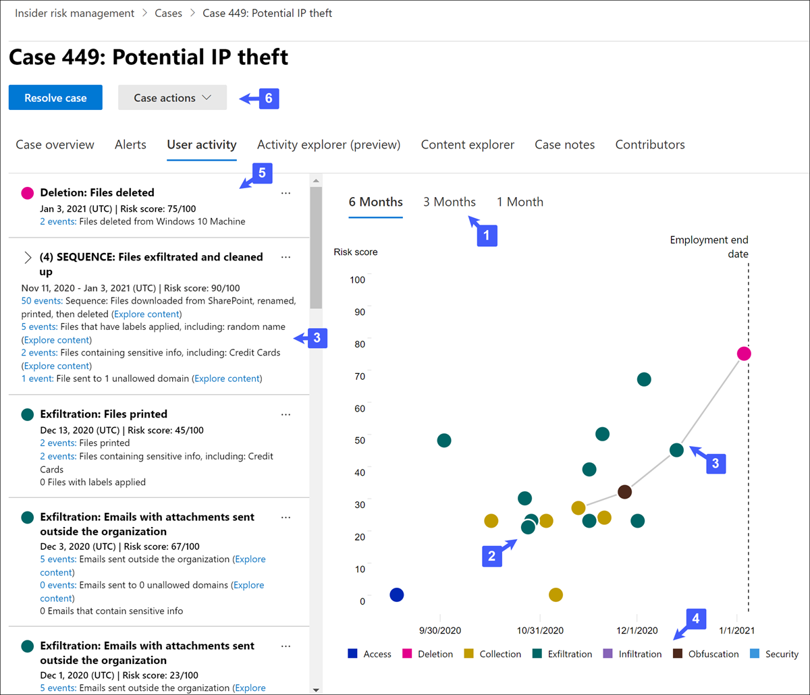

# Fälle des Insider-Risikomanagements

Fälle sind das Herzstück des Insider-Risikomanagements und ermöglichen es Ihnen, Probleme, die durch in Ihren Richtlinien definierte Risikoindikatoren generiert werden, umfassend zu untersuchen und zu bearbeiten. Fälle werden manuell anhand von Warnungen in Situationen erstellt, in denen weitere Maßnahmen erforderlich sind, um ein Compliance-bezogenes Problem für einen Benutzer zu beheben. Jeder Fall ist auf einen einzelnen Benutzer beschränkt, und mehrere Warnungen für den Benutzer können einem vorhandenen Fall oder einem neuen Fall hinzugefügt werden. 

Nachdem Sie die Details eines Falls untersucht haben, können Sie Folgendes tun:

- Senden einer Benachrichtigung an den Benutzer
- Auflösen des Falls als gutartig
- Freigeben des Falls für Ihre ServiceNow-Instanz oder für einen E-Mail-Empfänger
- Eskalieren des Falls für eine Advanced eDiscovery Untersuchung

Sehen Sie sich das Video "Untersuchung und Eskalation des [Insider-Risikomanagements"](https://www.youtube.com/watch?v=UONUSmkRC8s) an, um einen Überblick darüber zu erhalten, wie Fälle im Insider-Risikomanagement untersucht und verwaltet werden.

## Dashboard "Fälle"

Das Dashboard **"Fälle** des Insider-Risikomanagements" ermöglicht es Ihnen, Fälle anzuzeigen und zu bearbeiten. Jedes Berichts-Widget auf dem Dashboard zeigt Informationen für die letzten 30 Tage an.

- **Aktive Fälle:** Die Gesamtzahl der aktiven Fälle, die untersucht werden.
- **Fälle der letzten 30 Tage:** Die Gesamtzahl der erstellten Fälle, sortiert nach *dem Status "Aktiv"* und *"Geschlossen".*
- **Statistik:** Durchschnittliche Zeit aktiver Fälle, aufgelistet in Stunden, Tagen oder Monaten.

In der Fallwarteschlange werden alle aktiven und geschlossenen Fälle für Ihre Organisation sowie der aktuelle Status der folgenden Fallattribute aufgelistet:

- **Fallname:** Der Name des Falls, der definiert wird, wenn eine Warnung bestätigt und der Fall erstellt wird.  
- **Status:** Der Status der Groß-/Kleinschreibung, entweder *aktiv* oder *geschlossen.*
- **Benutzer:** Der Benutzer für den Fall. Wenn die Anonymisierung für Benutzernamen aktiviert ist, werden anonymisierte Informationen angezeigt.
- **Geöffneter Zeitfall:** Die Zeit, die seit dem Öffnen des Falls vergangen ist.
- **Gesamtanzahl der Richtlinienwarnungen:** Die Anzahl der in dem Fall enthaltenen Richtlinienübereinstimmungen. Diese Zahl kann steigen, wenn neue Warnungen zu dem Fall hinzugefügt werden.
- **Case last updated:** The time that has passed since there has been an added case note or change in the case state.
- **Last updated by**: The name of the insider risk management analyst or investigator that last updated the case.

Verwenden  Sie das Suchsteuerelement, um Fallnamen nach bestimmtem Text zu durchsuchen, und verwenden Sie den Fallfilter, um Fälle nach den folgenden Attributen zu sortieren:

- Status
- Öffnung des Falls, Startdatum und Enddatum
- Letzte Aktualisierung, Startdatum und Enddatum

## Filterfälle

Je nach Anzahl und Art der aktiven Richtlinien für das Insider-Risikomanagement in Ihrer Organisation kann es schwierig sein, eine große Warteschlange mit Fällen zu überprüfen. Die Verwendung von Fallfiltern kann Analysten und Ermittlern helfen, Fälle nach mehreren Attributen zu sortieren. Um Warnungen im **Dashboard "Fälle"** zu filtern, wählen Sie das **Filtersteuerelement** aus. Sie können Fälle nach einem oder mehreren Attributen filtern:

- **Status:** Wählen Sie einen oder mehrere Statuswerte aus, um die Fallliste zu filtern. Die Optionen sind *"Aktiv"* und *"Geschlossen".*
- **Geöffnete Groß-/Kleinschreibung:** Wählen Sie das Start- und Enddatum für den Zeitpunkt aus, zu dem die Groß-/Kleinschreibung geöffnet wurde.
- **Last updated**: Select the start and end dates for when the case was updated.

## Untersuchen eines Falls

Eine eingehendere Untersuchung von Insider-Risikomanagementwarnungen ist entscheidend, um geeignete Korrekturmaßnahmen zu ergreifen. Fälle des Insider-Risikomanagements sind das zentrale Verwaltungstool, um sich eingehender mit dem Verlauf von Benutzerrisikoaktivitäten, Warnungsdetails, der Abfolge von Risikoereignissen und den Inhalten und Nachrichten zu befassen, die Risiken ausgesetzt sind. Risikoanalysten und Ermittler verwenden Fälle auch, um Feedback und Notizen zu überprüfen und die Fallauflösung zu verarbeiten.

Wenn Sie einen Fall auswählen, werden die Fall-Verwaltungstool geöffnet. Diese ermöglichen es Analysten und Ermittlern, sich den Fall bis ins kleinste Detail anzeigen zu lassen.

### Fallübersicht

Auf der Registerkarte **"Fallübersicht"** werden die Falldetails für Risikoanalysten und Ermittler zusammengefasst. Sie enthält die folgenden Informationen im Bereich **"Info zu diesem Fall".**

- **Status:** Der aktuelle Status des Falls, entweder aktiv oder geschlossen.
- **Case created on**: The date and time the case was created.
- **Risikobewertung des Benutzers:** Die aktuelle berechnete Risikostufe des Benutzers für den Fall. Diese Bewertung wird alle 24 Stunden berechnet und verwendet Warnungsrisikobewertungen aller aktiven Warnungen, die dem Benutzer zugeordnet sind.
- **E-Mail:** Der E-Mail-Alias des Benutzers für den Fall.
- **Organisation oder Abteilung:** Die Organisation oder Abteilung, der der Benutzer zugewiesen ist.
- **Managername:** Der Name des Vorgesetzten des Benutzers.
- **Manager-E-Mail:** Der E-Mail-Alias des Vorgesetzten des Benutzers.

Die Registerkarte **"Fallübersicht"** enthält auch einen Abschnitt **"Warnungen",** der die folgenden Informationen zu dem Fall zugeordneten Richtlinienüberstimmungswarnungen enthält:

- **Richtlinienüberstimmungen:** Der Name der Insider-Risikomanagementrichtlinie, die den Übereinstimmungswarnungen für Benutzeraktivitäten zugeordnet ist.
- **Status:** Status der Warnung.
- **Schweregrad:** Schweregrad der Warnung.
- **Erkannte Zeit:** Die Zeit, die seit dem Generieren der Warnung vergangen ist.

### Benachrichtigungen

Auf der Registerkarte **"Warnungen"** sind die aktuellen Warnungen zusammengefasst, die in dem Fall enthalten sind. Neue Warnungen können zu einem vorhandenen Fall hinzugefügt werden, und sie werden der **Warnungswarteschlange** hinzugefügt, sobald sie zugewiesen werden. Die folgenden Warnungsattribute sind in der Warteschlange aufgeführt:

- Status
- Severity
- Ermittelte Zeit

Wählen Sie eine Warnung aus der Warteschlange aus, um die **Detailseite "Warnung"** anzuzeigen.

Verwenden Sie das Suchsteuerelement, um Warnungsnamen nach bestimmtem Text zu durchsuchen, und verwenden Sie den Warnungsfilter, um Fälle nach den folgenden Attributen zu sortieren:

- Status
- Severity
- Zeitpunkt der Erkennung, Startdatum und Enddatum

Verwenden Sie das Filtersteuerelement, um Warnungen nach mehreren Attributen zu filtern, einschließlich:

- **Status:** Wählen Sie einen oder mehrere Statuswerte aus, um die Warnungsliste zu filtern. Die Optionen sind *Bestätigt*, *Abgelehnt*, *Überprüfung erforderlich* und *Behoben*.
- **Schweregrad:** Wählen Sie eine oder mehrere Warnungsrisikoschweregrade aus, um die Warnungsliste zu filtern. Die Optionen sind *Hoch*, *Moderat* und *Niedrig*.
- **Erkannter Zeitpunkt:** Wählen Sie das Start- und Enddatum für den Zeitpunkt aus, zu dem die Warnung erstellt wurde.
- **Richtlinie:** Wählen Sie eine oder mehrere Richtlinien aus, um die von den ausgewählten Richtlinien generierten Warnungen zu filtern.

### Benutzeraktivität

Die Registerkarte **Benutzeraktivität** ist eines der leistungsstärksten Werkzeuge für die Analyse und Untersuchung interner Risiken bei Föllen in der Insider-Risikomanagement-Lösung. Diese Registerkarte ist strukturiert, um eine schnelle Überprüfung eines Falls zu ermöglichen, einschließlich einer historischen Zeitachse aller Warnungen, Warnungsdetails, der aktuellen Risikobewertung für den Benutzer im Fall, der Abfolge von Risikoereignissen und Steuerelementen, um effektive Maßnahmen zu ergreifen, um die Risiken in diesem Fall einzudämmen.

1. **Zeitfilter:** Standardmäßig werden die letzten sechs Monate der in diesem Fall bestätigten Warnungen im Benutzeraktivitätsdiagramm angezeigt. Sie können die Diagrammansicht ganz einfach filtern, indem Sie die Registerkarten *6 Monate,* *3 Monate* oder *1 Monat* im Blasendiagramm auswählen.
2. **Risikowarnungsaktivität und Details:** Risikoaktivitäten werden im Benutzeraktivitätsdiagramm visuell als farbige Blasen angezeigt. Blasen werden für verschiedene Risikokategorien erstellt, und die Blasengröße ist proportional zur Anzahl der Risikoaktivitäten für die Kategorie. Wählen Sie eine Blase aus, um die Details für jede Risikoaktivität anzuzeigen. Details umfassen:
    - **Datum** der Risikoaktivität.
    - Die **Kategorie der Risikoaktivität.** Beispielsweise *E-Mails mit Anlagen, die außerhalb der Organisation gesendet wurden,* oder Dateien, die *von SharePoint Online heruntergeladen wurden.*
    - **Risikobewertung** für die Warnung. Diese Bewertung ist der numerische Wert für den Schweregrad des Risikos.
    - Anzahl der Ereignisse, die mit der Warnung verknüpft sind. Links zu jeder Datei oder E-Mail, die mit der Risikoaktivität verknüpft sind, sind ebenfalls verfügbar.
3. **Risikosequenz (Vorschau):** Die chronologische Reihenfolge riskanter Aktivitäten ist ein wichtiger Aspekt der Risikountersuchung, und die Identifizierung dieser verwandten Aktivitäten ist ein wichtiger Bestandteil der Bewertung des Gesamtrisikos für Ihre Organisation. Zugehörige Warnungsaktivitäten werden mit Verbindungslinien angezeigt, um hervorzuheben, dass diese Aktivitäten einem größeren Risikobereich zugeordnet sind. Diese Ansicht von Aktivitäten kann Ermittlern helfen, die Punkte für Risikoaktivitäten, die als isolierte oder einmalige Ereignisse hätten angesehen werden können, wortwörtlich zu verbinden. Wählen Sie eine Blase in der Sequenz aus, um Details für alle zugehörigen Risikoaktivitäten anzuzeigen. Details umfassen:

    - **Name** der Sequenz.
    - **Datums-** oder **Datumsbereich** der Sequenz.
    - **Risikobewertung** für die Sequenz. Diese Bewertung ist die numerische Bewertung für die Abfolge der kombinierten Warnungsrisikoschweregrade für jede verwandte Aktivität in der Sequenz.
    - **Anzahl der Ereignisse, die jeder Warnung in der Sequenz zugeordnet sind.** Links zu jeder Datei oder E-Mail, die mit jeder Risikoaktivität verknüpft sind, sind ebenfalls verfügbar.
    - **Aktivitäten nacheinander anzeigen.** Zeigt die Sequenz als Hervorhebungslinie im Blasendiagramm an und erweitert die Warnungsdetails, um alle zugehörigen Warnungen in der Sequenz anzuzeigen.

4. Legende der **Risikoaktivität:** Am unteren Rand des Benutzeraktivitätsdiagramms hilft Ihnen eine farbcodierte Legende, die Risikokategorie für jede Warnung schnell zu bestimmen.
5. **Risikoaktivitätschronik:** Die vollständige Chronologe aller risikowarnungen, die mit dem Fall verbunden sind, werden aufgelistet, einschließlich aller Details, die in der entsprechenden Warnungsblase verfügbar sind.
6. **Fallaktionen:** Optionen zum Beheben des Falls befinden sich auf der Symbolleiste für Groß-/Kleinschreibung. Sie können einen Fall lösen, eine E-Mail-Benachrichtigung an den Benutzer senden oder den Fall für eine Daten- oder Benutzeruntersuchung eskalieren.

### Aktivitäten-Explorer (Vorschau)

> [!IMPORTANT]
> Die Registerkarte "Aktivitäten-Explorer" ist im Fallverwaltungsbereich für Benutzer verfügbar, die Ereignisse auslösen, nachdem dieses Feature in Ihrer Organisation verfügbar ist.

Auf der Registerkarte **"Aktivitäten-Explorer"** können Risikoanalysten und Ermittler Aktivitätsdetails im Zusammenhang mit Risikowarnungen überprüfen. Im Rahmen der Fallverwaltungsaktionen müssen Ermittler und Analysten beispielsweise möglicherweise alle mit dem Fall verbundenen Risikoaktivitäten überprüfen, um weitere Details zu erhalten. Mit dem **Aktivitäten-Explorer** können Prüfer schnell eine Zeitachse erkannter riskanter Aktivitäten überprüfen und alle Risikoaktivitäten im Zusammenhang mit Warnungen identifizieren und filtern.

Weitere Informationen zum Aktivitäts-Explorer finden Sie im Artikel ["Warnungen zum Insider-Risikomanagement".](insider-risk-management-activities.md#activity-explorer-preview)

### Inhaltsexplorer

Die Registerkarte **Inhaltsexplorer** ermöglicht es Risikoanalysten und Ermittlern, Kopien aller einzelnen Dateien und E-Mail-Nachrichten zu überprüfen, die mit der Risiko-Warnung verknüpft sind. Wenn beispielsweise eine Warnung erstellt wird, wenn ein Benutzer Hunderte von Dateien aus SharePoint Online herunterlädt und die Aktivität eine Richtlinienwarnung auslöst, werden alle heruntergeladenen Dateien für die Warnung erfasst und aus ursprünglichen Speicherquellen in den Fall des Insider-Risikomanagements kopiert.

Der Inhalts-Explorer ist ein leistungsstarkes Tool mit grundlegenden und erweiterten Such- und Filterfunktionen. Weitere Informationen zur Verwendung des Inhalts-Explorers finden Sie im [Inhalts-Explorer für Insider-Risikomanagement.](insider-risk-management-content-explorer.md)

### Fallnotizen

Auf der Registerkarte **"Fallnotizen"** in dem Fall teilen Risikoanalysten und Ermittler Kommentare, Feedback und Einblicke über ihre Arbeit für den Fall. Notizen sind dauerhafte Ergänzungen zu einem Fall und können nicht mehr bearbeitet oder gelöscht werden, sobald sie gespeichert wurden. Wenn ein Fall aus einer Warnung erstellt wird, werden die im Dialogfeld **Benachrichtigung bestätigen und Insider-Risikofall erstellen** eingegebenen Kommentare automatisch als Fallnotiz hinzugefügt.

Das Dashboard für Fallnotizen zeigt Notizen des Benutzers an, der die Notiz erstellt hat, sowie die Zeit, die seit dem Speichern der Notiz vergangen ist. Um das Textfeld für die Fallnotiz nach einem bestimmten Schlüsselwort zu durchsuchen, verwenden Sie die **Schaltfläche "Suchen"** im Falldashboard, und geben Sie ein bestimmtes Schlüsselwort ein.

So fügen Sie einem Fall einen Hinweis hinzu:

1. Wechseln [Sie im Microsoft 365 Compliance Center](https://compliance.microsoft.com)zum **Insider-Risikomanagement,** und wählen Sie die Registerkarte **"Fälle"** aus.
2. Wählen Sie einen Fall aus, und wählen Sie dann die Registerkarte **"Fallnotizen"** aus.
3. Wählen Sie **"Groß-/Kleinschreibung hinzufügen" aus.**
4. Geben Sie im Dialogfeld **"Fallnotiz** hinzufügen" die Notiz für den Fall ein. Wählen Sie **"Speichern"** aus, um die Notiz zum Fall hinzuzufügen, oder wählen Sie **"Abbrechen** schließen" aus, ohne die Notiz im Fall zu speichern.

### Mitwirkende

Auf der Registerkarte **Mitwirkende** können Risikoanalysten und Ermittler weitere Mitwirkende zu dem Fall hinzufügen. Standardmäßig werden alle Benutzer, denen die Rollen **"Insider-Risikomanagementanalysten"** und **"Ermittler des Insider-Risikomanagements"** zugewiesen sind, als Mitwirkende für jeden aktiven und geschlossenen Fall aufgeführt. Nur Benutzer, denen die Rolle **"Ermittler des Insider-Risikomanagements"** zugewiesen ist, haben die Berechtigung, Dateien und Nachrichten im Inhalts-Explorer anzuzeigen.

Temporärer Zugriff auf einen Fall kann gewährt werden, indem ein Benutzer als Mitwirkender hinzugefügt wird. Mitwirkende verfügen über die gesamte Fallverwaltungssteuerung für den jeweiligen Fall, außer:

- Die Berechtigung, Warnungen zu bestätigen oder zu verwerfen
- Die Berechtigung, die Mitwirkenden eines Falles zu bearbeiten
- Berechtigung zum Anzeigen von Dateien und Nachrichten im Inhalts-Explorer

So fügen Sie einen Mitwirkenden zu einem Fall hinzu:

1. Wechseln [Sie im Microsoft 365 Compliance Center](https://compliance.microsoft.com)zum **Insider-Risikomanagement,** und wählen Sie die Registerkarte **"Fälle"** aus.
2. Wählen Sie einen Fall aus, und wählen Sie dann die Registerkarte **"Mitwirkende" aus.**
3. Wählen Sie **"Mitwirkender hinzufügen" aus.**
4. Beginnen Sie im Dialogfeld **"Mitwirkender hinzufügen"** mit der Eingabe des Namens des Benutzers, den Sie hinzufügen möchten, und wählen Sie dann den Benutzer aus der Liste der vorgeschlagenen Benutzer aus. Diese Liste wird aus der Azure Active Directory Ihres Mandantenabonnements generiert.
5. Wählen Sie **"Hinzufügen"** aus, um den Benutzer als Mitwirkenden hinzuzufügen, oder wählen Sie **"Abbrechen"** aus, ohne den Benutzer als Mitwirkenden hinzuzufügen.

## Fallmaßnahmen

Risikoanalysten und Ermittler können in einer von mehreren Methoden maßnahmen ergreifen, je nach Schweregrad des Falls, Verlauf des Risikos des Benutzers und Risikorichtlinien Ihrer Organisation. In einigen Situationen müssen Sie einen Fall möglicherweise an einen Benutzer oder eine Datenuntersuchung eskalieren, um mit anderen Bereichen Ihrer Organisation zusammenzuarbeiten und sich eingehender mit Risikoaktivitäten zu befassen. Das Insider-Risikomanagement ist eng in andere Microsoft 365 Compliance-Lösungen integriert, um Ihnen bei der End-to-End-Lösungsverwaltung zu helfen.

### E-Mail-Benachrichtigung senden

In den meisten Fällen sind Benutzeraktionen, die Insider-Risikowarnungen erstellen, versehentlich oder versehentlich. Das Senden einer Erinnerung an den Benutzer per E-Mail ist eine effektive Methode zum Dokumentieren von Fallüberprüfungen und -aktionen und ist eine Methode, um Benutzer an Unternehmensrichtlinien zu erinnern oder sie auf Auffrischungsschulungen hinzuweisen. Hinweise werden aus [Benachrichtigungsvorlagen generiert, die Sie](insider-risk-management-notices.md) für Ihre Infrastruktur für das Insider-Risikomanagement erstellen.

Es ist wichtig zu beachten, dass das Senden einer E-Mail-Benachrichtigung an einen Benutzer * den Fall **nicht** _ als _Closed* löst. In einigen Fällen sollten Sie einen Fall geöffnet lassen, nachdem Sie eine Benachrichtigung an einen Benutzer gesendet haben, um nach weiteren Risikoaktivitäten zu suchen, ohne einen neuen Fall zu öffnen. Wenn Sie einen Fall nach dem Senden einer Benachrichtigung auflösen möchten, müssen Sie **Fall lösen** als Folgeschritt nach dem Senden einer Benachrichtigung auswählen.

So senden Sie eine Benachrichtigung an den Benutzer, der einem Fall zugewiesen ist:

1. Wechseln [Sie im Microsoft 365 Compliance Center](https://compliance.microsoft.com)zum **Insider-Risikomanagement,** und wählen Sie die Registerkarte **"Fälle"** aus.
2. Wählen Sie einen Fall aus, und wählen Sie dann die Schaltfläche **"E-Mail-Benachrichtigung senden"** auf der Symbolleiste für Fallaktionen aus.
3. Wählen Sie im Dialogfeld **"E-Mail-Benachrichtigung senden"** das Dropdown-Steuerelement **"Benachrichtigungsvorlage** auswählen" aus, um die Benachrichtigungsvorlage für den Hinweis auszuwählen. Diese Auswahl füllt die anderen Felder im Hinweis vorab aus.
4. Überprüfen Sie die Benachrichtigungsfelder, und aktualisieren Sie sie nach Bedarf. Die hier eingegebenen Werte überschreiben die Werte in der Vorlage.
5. Wählen Sie **"Senden"** aus, um den Hinweis an den Benutzer zu senden, oder wählen Sie **"Abbrechen"** aus, ohne den Hinweis an den Benutzer zu senden. Alle gesendeten Benachrichtigungen werden der Fallnotizwarteschlange im Dashboard **"Fallnotizen"** hinzugefügt.

### Eskalieren zur Überprüfung

Eskalieren Sie den Fall für eine Benutzeruntersuchung in Situationen, in denen eine zusätzliche rechtliche Überprüfung für die Risikoaktivität des Benutzers erforderlich ist. Diese Eskalation öffnet einen neuen Advanced eDiscovery-Fall in Ihrer Microsoft 365-Organisation. Advanced eDiscovery bietet einen End-to-End-Workflow zum Beibehalten, Sammeln, Überprüfen, Analysieren und Exportieren von Inhalten, die auf die internen und externen rechtlichen Ermittlungen Ihrer Organisation abgestimmt sind. Außerdem kann Ihr Rechtsteam den gesamten Benachrichtigungs-Workflow einsehen, der für juristische Zwecke aufbewahrt wurde, und so mit den an einem Fall beteiligten Verwahrern kommunizieren. Das Zuweisen eines Überprüfers als Verwahrer in einem Advanced eDiscovery-Fall, der aus einem Fall im Insider-Risikomanagement erstellt wurde, hilft Ihrem Rechtsteam dabei, angemessene Maßnahmen zu ergreifen, und die Erhaltung von Inhalten zu verwalten. Weitere Informationen zu den Advanced eDiscovery-Fällen finden Sie unter [Übersicht über Advanced eDiscovery in Microsoft 365](overview-ediscovery-20.md).

So eskalieren Sie einen Fall an eine Benutzeruntersuchung:

1. Wechseln [Sie im Microsoft 365 Compliance Center](https://compliance.microsoft.com)zum **Insider-Risikomanagement,** und wählen Sie die Registerkarte **"Fälle"** aus.
2. Wählen Sie einen Fall aus, und wählen Sie dann die Schaltfläche **"Für Untersuchung eskalieren"** auf der Symbolleiste für Fallaktionen aus.
3. Geben Sie im Dialogfeld **"Eskalieren für Untersuchung"** einen Namen für die Untersuchung des neuen Benutzers ein. Geben Sie bei Bedarf Notizen zu dem Fall ein, und wählen Sie **"Eskalieren"** aus.
4. Überprüfen Sie die Benachrichtigungsfelder, und aktualisieren Sie sie nach Bedarf. Die hier eingegebenen Werte überschreiben die Werte in der Vorlage.
5. Wählen Sie **"Bestätigen"** aus, um den Untersuchungsfall des Benutzers zu erstellen, oder wählen Sie **"Abbrechen"** aus, um das Dialogfeld zu schließen, ohne einen neuen Untersuchungsfall des Benutzers zu erstellen.

Nachdem der Fall "Insider-Risikomanagement" zu einem neuen Untersuchungsfall für Benutzer eskaliert wurde, können Sie den neuen Fall im Bereich **"eDiscovery**  >  **Advanced"** im Microsoft 365 Compliance Center überprüfen.

### Ausführen automatisierter Aufgaben mit Power Automate-Flüssen für den Fall

Mithilfe empfohlener Power Automate Flüsse können Risikoermittler und Analysten schnell Maßnahmen ergreifen, um:

- Anfordern von Informationen von PERSONAL oder Unternehmen über einen Benutzer in einem Insider-Risikofall
- Vorgesetzten benachrichtigen, wenn ein Benutzer über eine Insider-Risikowarnung verfügt
- Erstellen eines Datensatzes für einen Insider-Risikomanagementfall in ServiceNow
- Benutzer benachrichtigen, wenn sie einer Insider-Risikorichtlinie hinzugefügt werden

So führen Sie Power Automate Flüsse für einen Insider-Risikomanagementfall aus, verwalten oder erstellen sie:

1. Wählen Sie auf der Symbolleiste für Groß-/Kleinschreibung die Option **"Automatisieren"** aus. 
2. Wählen Sie den auszuführenden Power Automate Fluss aus, und wählen Sie dann **"Flow ausführen"** aus. 
3. Wählen Sie nach Abschluss des Flusses **"Fertig"** aus.

Weitere Informationen zu Power Automate Flüssen für das Insider-Risikomanagement finden Sie unter ["Erste Schritte mit Insider-Risikomanagementeinstellungen".](insider-risk-management-settings.md#power-automate-flows-preview)

### Anzeigen oder Erstellen eines Microsoft Teams Teams für den Fall

Wenn Microsoft Teams Integration für das Insider-Risikomanagement in den Einstellungen aktiviert ist, wird jedes Mal, wenn eine Warnung bestätigt und ein Fall erstellt wird, automatisch ein Microsoft Teams Team erstellt. Risikoermittler und Analysten können schnell Microsoft Teams öffnen und direkt zum Team für einen Fall navigieren, indem Sie auf der Symbolleiste für Fallaktionen **"Microsoft Teams Team anzeigen"** auswählen.

Für Fälle, die vor der Aktivierung der Microsoft Team-Integration geöffnet wurden, können Risikoermittler und Analysten ein neues Microsoft Teams Team für einen Fall erstellen, indem sie auf der Symbolleiste für Fallaktionen die Option **"Microsoft Teams Team** erstellen" auswählen.

Wenn ein Fall gelöst ist, wird das zugeordnete Microsoft-Team automatisch archiviert (ausgeblendet und schreibgeschützt).

Weitere Informationen zu Microsoft Teams für das Insider-Risikomanagement finden Sie unter "Erste Schritte mit Einstellungen für [das Insider-Risikomanagement".](insider-risk-management-settings.md#microsoft-teams-preview)

### Auflösen des Falls

Nachdem Risikoanalysten und Ermittler ihre Überprüfung und Untersuchung abgeschlossen haben, kann ein Fall gelöst werden, um auf alle warnungen zu reagieren, die derzeit im Fall enthalten sind. Durch das Auflösen eines Falls wird eine Auflösungsklassifizierung hinzugefügt, der Fallstatus in *"Geschlossen"* geändert, und die Gründe für die Lösungsaktion werden automatisch der Fallnotizwarteschlange im **Dashboard "Fallnotizen"** hinzugefügt. Fälle können auf zwei Arten aufgelöst werden:

- **Gutartig:** Die Klassifizierung für Fälle, in denen Richtlinienübereinstimmungswarnungen als niedriges Risiko, nicht schwerwiegend oder falsch positiv ausgewertet werden.
- **Bestätigter Richtlinienverstoß:** Die Klassifizierung für Fälle, in denen Richtlinienübereinstimmungswarnungen als riskant, schwerwiegend oder das Ergebnis böswilliger Absichten ausgewertet werden.

So beheben Sie einen Fall:

1. Wechseln [Sie im Microsoft 365 Compliance Center](https://compliance.microsoft.com)zum **Insider-Risikomanagement,** und wählen Sie die Registerkarte **"Fälle"** aus.
2. Wählen Sie einen Fall aus, und wählen Sie dann die Schaltfläche **"Groß-/Kleinschreibung auflösen"** auf der Symbolleiste für Groß-/Kleinschreibung aus.
3. Wählen Sie im Dialogfeld **"Fall auflösen"** das Dropdown-Steuerelement **"Auflösen" aus,** um die Auflösungsklassifizierung für den Fall auszuwählen. Die Optionen sind **"Gutartig"** oder **"Bestätigt", wenn eine Richtlinie verletzt wird.**
4. Geben Sie im Dialogfeld **"Fall auflösen"** die Gründe für die Auflösungsklassifizierung in das Textfeld Aktion **durchgeführt** ein.
5. Wählen Sie **"Auflösen"** aus, um die Groß-/Kleinschreibung zu schließen, oder wählen Sie **"Abbrechen"** aus, ohne den Fall aufzulösen.
