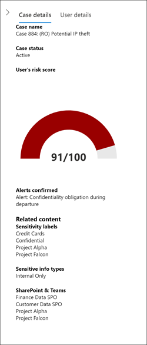

# Insider Risikomanagement-FälleInsider risk management cases

Fälle sind das Herzstück des Insider Risikomanagements und ermöglichen es Ihnen, Probleme, die durch in ihren Richtlinien definierte Risikoindikatoren generiert werden, eingehend zu untersuchen und Maßnahmen zu ergreifen.Cases are the heart of insider risk management and allow you to deeply investigate and take action on issues generated by risk indicators defined in your policies. Fälle werden manuell aus Warnungen in den Situationen erstellt, in denen weitere Aktionen erforderlich sind, um ein Compliance-bezogenes Problem für einen Mitarbeiter zu beheben.Cases are manually created from alerts in the situations where further action is needed to address a compliance-related issue for an employee. Bei jedem Fall handelt es sich um einen einzelnen Mitarbeiter, und mehrere Benachrichtigungen für den Mitarbeiter können einem vorhandenen Fall oder einem neuen Fall hinzugefügt werden.Each case is scoped to a single employee and multiple alerts for the employee can be added to an existing case or to a new case. Nach der Untersuchung der Einzelheiten eines Falls können Sie Maßnahmen ergreifen, indem Sie dem Mitarbeiter eine Mitteilung schicken, den Fall als gutartig lösen oder zu einer Daten- oder Mitarbeiteruntersuchung eskalieren.After investigating the details of a case, you can take action by sending the employee a notice, resolving the case as benign, or escalating to a data or employee investigation.

## Fall-DashboardCase dashboard

Im Dashboard**Fälle** im Insider-Risikomanagement können Sie Fälle anzeigen und entsprechende Maßnahmen ergreifen.The insider risk management **Cases dashboard** allows you to view and take action on cases. Jedes Berichts-Widget auf dem Dashboard zeigt Informationen für die letzten 30 Tage an.Each report widget on the dashboard displays information for last 30 days.

- **Aktive Fälle**: die Gesamtzahl der untersuchten aktiven Fälle.**Active cases**: The total number of active cases under investigation.
- **Fälle in den letzten 30 Tagen**: die Gesamtzahl der erstellten Fälle, sortiert nach *aktivem* und *geschlossenem* Status.**Cases over past 30 days**: The total number of cases created, sorted by *Active* and *Closed* status.
- **Statistik**: durchschnittliche Zeit der aktiven Fälle, aufgeführt in Stunden, Tagen oder Monaten.**Statistics**: Average time of active cases, listed in hours, days, or months.

In der Fall-Warteschlange befinden sich alle aktiven und abgeschlossenen Fälle Ihres Unternehmens sowie der aktuelle Zustand der folgenden Fall-Attribute:The case queue lists all active and closed cases for your organization, in addition to the current state of the following case attributes:

- **Case Name**: der Name des Falls, der definiert wird, wenn eine Warnung bestätigt wird und der Fall erstellt wird.**Case name**: The name of the case, defined when an alert is confirmed and the case is created.  
- **Status**: der Status des Falls, entweder *aktiv* oder *geschlossen*.**Status**: The status of the case, either *Active* or *Closed*.
- **User**: der Mitarbeiter für den Fall.**User**: The employee for the case.
- **Geöffneter Zeitfall**: die Zeit, die seit dem Öffnen des Groß-/Kleinschreibung-Verfahrens vergangen ist.**Time case opened**: The time that has passed since the case was opened.
- **Total Policy Alerts**: die Anzahl der Richtlinien Übereinstimmungen, die in der Anfrage enthalten sind.**Total policy alerts**: The number of policy matches included in the case. Diese Zahl kann steigen, wenn neue Warnungen zu dem Fall hinzugefügt werden.This number may increase if new alerts are added to the case.
- **Last updated**: die Zeit, die vergangen ist, seit es eine zusätzliche Groß-/Kleinschreibung oder Änderung im Fall Status gegeben hat.**Last updated**: The time that has passed since there has been an added case note or change in the case state.
- **Zuletzt aktualisiert von**: der Name des Insider Risk Management Analysts oder Investigators, der den Fall zuletzt aktualisiert hat.**Last updated by**: The name of the insider risk management analyst or investigator that last updated the case.

Verwenden Sie das **Search** -Steuerelement, um nach bestimmten Text zu suchen, und verwenden Sie den Fallfilter, um Fälle anhand der folgenden Attribute zu sortieren:Use the **Search** control to search case names for specific text and use the case filter to sort cases by the following attributes:

- StatusStatus
- Öffnung des Falls, Startdatum und EnddatumTime case opened, start date, and end date
- Letzte Aktualisierung, Startdatum und EnddatumLast updated, start date, and end date

## Untersuchen eines FallsInvestigate a case

Eine eingehendere Untersuchung der Warnungen beim Insider Risikomanagement ist für die richtigen Korrekturmaßnahmen wichtig.Deeper investigation into insider risk management alerts is critical to taking proper corrective actions. Bei Insider Risk Management-Fällen handelt es sich um das zentrale Verwaltungstool, mit dem Sie tiefer in den Verlauf von Mitarbeiter Risiken und Warnungsdetails eintauchen und die Inhalte und Nachrichten untersuchen können, die Risiken ausgesetzt sind.Insider risk management cases are the central management tool to dive deeper into employee risk activity history and alert details, and to explore the content and messages exposed to risks. Risikoanalysten und Ermittler verwenden auch Fälle, um Überprüfung Feedback und Notizen zu zentralisieren und die Fall Behebung zu verarbeiten.Risk analysts and investigators also use cases to centralize review feedback and notes and to process case resolution. 

Wenn Sie einen Fall auswählen, werden die Fall-Verwaltungstool geöffnet. Diese ermöglichen es Analysten und Ermittlern, sich den Fall bis ins kleinste Detail anzeigen zu lassen.Selecting a case opens the case management tools and allows analysts and investigators to dig into the details of cases.

### FallübersichtCase overview

Die Registerkarte **Fallübersicht** fasst die Warnungsaktivitäten und den Verlauf der Risikostufe für jeden Fall zusammen.The **Case overview** tab summarizes the alert activity and risk level history for the case. Das Widget **Warnungen** zeigt die Richtlinien Übereinstimmungen für den Fall an, einschließlich des Status der Warnung, des Schweregrads des Warnungs Risikos und der Feststellung der Warnung.The **Alerts** widget shows the policy matches for the case, including the status of the alert, the alert risk severity, and when the alert was detected. Das Diagramm **Risikostufenverlauf** zeigt die Risikostufe des entsprechenden Benutzers in den letzten 30 Tagen.The **Risk level history** chart displays the user risk level over the last 30 days. Das Liniendiagramm ermöglicht es Analysten und Ermittlern, die Entwicklung des allgemeinen Benutzerrisikos im Laufe der Zeit schnell auf einen Blick zu erfassen.The line chart allows analysts and investigators to quickly see the trend in overall user risk over time. Das Widget **Inhalt der Risikoaktivität** fasst die Daten- und Inhaltstypen zusammen, die in Fall-Warnungen enthalten sind.The **Risk activity content** widget summarizes the types of data and content contained in alerts added to the case. Dieses Widget bietet einen Gesamtüberblick über alle Daten und Inhalte, die in diesem Fall gefährdet sind.This widget gives an all-up view of the entire data and content set at risk in the case.

Der Bereich **Fall Details** ist auf allen Registerkarten für die Fallverwaltung verfügbar und fasst die Fall Details für Risikoanalysten und Ermittler zusammen.The **Case details** pane is available on all case management tabs and summarizes the case details for risk analysts and investigators. Sie umfasst die folgenden Bereiche:It includes the following areas:

- **Case Name**: der Name der Groß-/Kleinschreibung mit einer automatisch generierten fallsequenz Nummer und dem Namen des Risikos, das der Richtlinienvorlage zugeordnet ist, die von der ersten bestätigten Warnung gefunden wurde.**Case name**: The name of the case, prefixed with an autogenerated case sequence number and the name of the risk associated with the policy template that the first confirmed alert matches. 
- **Case Status**: der aktuelle Status des Falls, entweder *aktiv* oder *geschlossen*.**Case status**: The current status of the case, either *Active* or *Closed*.
- **Risikobewertung des Benutzers**: das aktuelle berechnete Risikoniveau des Benutzers für den Fall.**User's risk score**: The current calculated risk level of the user for the case. Dieser Wert wird alle 24 Stunden berechnet, und bezieht die Risikobewertungen aller aktiver Warnungen für den betreffenden Benutzer in die Berechnung mit ein.This score is calculated every 24 hours and uses the alert risk scores from all active alerts associated to the user.
- **Benachrichtigungen bestätigt**: Liste der Benachrichtigungen für den Benutzer, die für den Fall bestätigt wurden.**Alerts confirmed**: List of alerts for the user confirmed for the case.
- **Inhalt in Gefahr**: Liste der Inhalte, sortiert nach Inhaltsquellen und Typen.**Content at risk**: List of content, sorted by content sources and types. Beispielsweise würden Sie für gefährdete Inhalte in SharePoint Online eine Liste mit Ordner- oder Dateinamen sehen, die der Risikoaktivität für Warnungen im entsprechenden Fall zugeordnet sind.For example, for case alert content in SharePoint Online, you may see folder or file names listed that are associated with the risk activity for alerts in the case.

### WarnungenAlerts

Auf der Registerkarte **Benachrichtigungen** werden die aktuellen Warnungen zusammengefasst, die in der Anfrage enthalten sind.The **Alerts** tab summarizes the current alerts included in the case. Neue Warnungen werden möglicherweise zu einem vorhandenen Fall hinzugefügt, und Sie werden der **Benachrichtigungs** Warteschlange hinzugefügt, sobald Sie zugewiesen sind.New alerts may be added to an existing case and they will be added to the **Alert** queue as they are assigned. Die folgenden Warnungs Attribute werden in der Warteschlange aufgeführt:The following alert attributes are listed the queue:

- StatusStatus
- SchweregradSeverity
- Erkannte ZeitTime detected

Wählen Sie in der Warteschlange eine Warnung aus, um die **Warnungs Detail** Seite anzuzeigen.Select an alert from the queue to display the **Alert detail** page.

Verwenden Sie das Search-Steuerelement, um Warnungsnamen nach bestimmten Text zu durchsuchen, und verwenden Sie den Warnungsfilter, um Fälle anhand der folgenden Attribute zu sortieren:Use the search control to search alert names for specific text and use the alert filter to sort cases by the following attributes:

- StatusStatus
- SchweregradSeverity
- Zeitpunkt der Erkennung, Startdatum und EnddatumTime detected, start date, and end date

### BenutzeraktivitätUser activity

Die Registerkarte**Benutzeraktivität** ist eines der leistungsstärksten Werkzeuge für die Analyse und Untersuchung interner Risiken bei Föllen in der Insider-Risikomanagement-Lösung.The **User activity** tab is one of the most powerful tools for internal risk analysis and investigation for cases in the insider risk management solution. Diese Registerkarte ist so strukturiert, dass eine schnelle Überprüfung eines Falls möglich ist, einschließlich einer Verlaufs Zeitachse aller Warnungen, aller Warnungsdetails, des aktuellen Risiko Werts für den Benutzer in dem Fall und der Steuerelemente, mit denen wirksame Maßnahmen zur Eindämmung der Risiken in dem Fall ergriffen werden.This tab is structured to enable quick review of a case, including a historical timeline of all alerts, all alerts details, the current risk score for the user in the case, and controls to take effective action to contain the risks in the case.

1. **Datums-und Fenster Zeitfilter**: Standardmäßig werden die letzten sechs Monate der im Fall bestätigten Benachrichtigungen im Diagramm Benutzeraktivität angezeigt.**Date and window time filters**: By default, the last six months of alerts confirmed in the case are displayed in the User activity chart. Sie können die Diagrammansicht ganz einfach mit dem Schieberegler an beiden Enden des Diagrammfensters filtern oder indem Sie ein bestimmtes Start-und Enddatum im Diagramm Filter-Steuerelement definieren.You can easily filter the chart view with either the slider controls at both ends of the chart window, or by defining specific start and end dates in the chart filter control.
2. **Risiko Warnungs Aktivität und Details**: Risiko Aktivitäten werden visuell als farbige Blasen im Diagramm Benutzeraktivität angezeigt.**Risk alert activity and details**: Risk activities are visually displayed as colored bubbles in the User activity chart. Blasen werden für verschiedene Risikokategorien erstellt, und die Blasengröße ist proportional zur Anzahl der Risiko Aktivitäten für die Kategorie.Bubbles are created for different categories of risk and bubble size is proportional to the number of risk activities for the category. Wählen Sie eine Blase aus, um die Details für jede Risiko Aktivität anzuzeigen.Select a bubble to display the details for each risk activity. Details umfassen:Details include:
    - **Datum** der Risikoaktivität.**Date** of the risk activity.
    - Die **Risiko Aktivitätskategorie**.The **risk activity category**. *E-Mail-Nachrichten beispielsweise mit Anlagen, die außerhalb der Organisation* oder *von SharePoint Online heruntergeladen*wurden.For example, *Email(s) with attachments sent outside the organization* or *File(s) downloaded from SharePoint Online*.
    - **Risikobewertung** für die Warnung.**Risk score** for the alert. Diese Bewertung ist der numerische Wert für den Schweregrad des Risikos.This score is the numerical score for the alert risk severity level.
    - Anzahl der Ereignisse, die mit der Warnung verknüpft sind.Number of events associated with the alert. Links zu jeder Datei oder E-Mail, die mit der Risikoaktivität verknüpft sind, können ebenfalls abgerufen werden.Links to each file or email associated with the risk activity is also available.
3. **Legende zur Risiko Aktivität**: am unteren Rand des Benutzer Aktivitätsdiagramms können Sie mit einer farbcodierten Legende schnell die Risikokategorie für jede Warnung bestimmen.**Risk activity legend**: Across the bottom of the user activity chart, a color-coded legend helps you quickly determine risk category for each alert.
4. **Chronologie der Risiko Aktivität**: die vollständige Chronologie aller mit dem Fall verbundenen Risikowarnungen wird aufgeführt, einschließlich aller Details, die in der entsprechenden Warnungs Blase verfügbar sind.**Risk activity chronology**: The full chronology of all risk alerts associated with the case are listed, including all the details available in the corresponding alert bubble.
5. **Case-Aktionen**: Optionen zum Auflösen der Groß-/Kleinschreibung befinden sich auf der Symbolleiste für den Fall Vorgang.**Case actions**: Options for resolving the case are on the case action toolbar. Sie können einen Fall auflösen, eine E-Mail-Benachrichtigung an den betreffenden Mitarbeiter senden, oder den Fall für eine Daten- oder Mitarbeiteruntersuchung eskalieren.You can resolve a case, send an email notice to the employee, or escalate the case for a data or employee investigation.

### Inhalts-ExplorerContent Explorer

Auf der Registerkarte **Inhalts-Explorer** können Risikoanalysten und Ermittler Kopien aller einzelnen Dateien und e-Mail-Nachrichten überprüfen, die mit Risikowarnungen verbunden sind.The **Content Explorer** tab allows risk analysts and investigators to review copies of all individual files and email messages associated with risk alerts. Wenn beispielsweise eine Warnung erstellt wird, wenn ein Mitarbeiter Hunderte von Dateien aus SharePoint Online herunterlädt und die Aktivität eine Richtlinien Warnung auslöst, werden alle heruntergeladenen Dateien für die Warnung erfasst und aus den ursprünglichen Speicherquellen in den Fall Insider Risk Management kopiert.For example, if an alert is created when an employee downloads hundreds of files from SharePoint Online and the activity triggers a policy alert, all the downloaded files for the alert are captured and copied to the insider risk management case from original storage sources.

Der Inhalts-Explorer ist ein leistungsfähiges Tool mit einfachen und erweiterten Such-und Filterfunktionen.The Content Explorer is a powerful tool with basic and advanced search and filtering features. Weitere Informationen zur Verwendung des Inhalts-Explorers finden Sie unter [Insider Risk Management Content Explorer](insider-risk-management-content-explorer.md).To learn more about using the Content Explorer, see [Insider risk management Content Explorer](insider-risk-management-content-explorer.md).

### FallnotizenCase notes

Die Registerkarte **fallnotizen** in dem Fall besteht darin, dass Risikoanalysten und Ermittler Kommentare, Feedback und Einblicke in Ihre Arbeit für den Fall freigeben.The **Case notes** tab in the case is where risk analysts and investigators share comments, feedback, and insights about their work for the case. Notizen sind dauerhafte Ergänzungen zu einem Fall und können nicht mehr bearbeitet oder gelöscht werden, sobald sie gespeichert wurden.Notes are permanent additions to a case and cannot be edited or deleted after the note is saved. Wenn ein Fall aus einer Warnung erstellt wird, werden die im Dialogfeld **Benachrichtigung bestätigen und Insider-Risikofall erstellen** eingegebenen Kommentare automatisch als Fallnotiz hinzugefügt.When a case is created from an alert, the comments entered in the **Confirm alert and create insider risk case** dialog are automatically added as a case note.

Das Case Notes-Dashboard zeigt Notizen des Benutzers an, der die Notiz erstellt hat, und die Zeit, die seit dem Speichern der Notiz verstrichen ist.The case notes dashboard displays notes by the user that created the note and the time that has passed since the note was saved. Verwenden Sie zum Durchsuchen des Textfeldes Groß-/Kleinschreibung für ein bestimmtes Stichwort die Schaltfläche **Suchen** im Fall Dashboard, und geben Sie ein bestimmtes Stichwort ein.To search the case note text field for a specific keyword, use the **Search** button on the case dashboard and enter a specific keyword.

So fügen Sie einer Anfrage eine Notiz hinzu:To add a note to a case:

1. Wechseln Sie im [Microsoft 365 Compliance Center](https://compliance.microsoft.com)zu **Insider Risk Management** , und wählen Sie die Registerkarte **Fälle** aus.In the [Microsoft 365 compliance center](https://compliance.microsoft.com), go to **Insider risk management** and select the **Cases** tab.
2. Wählen Sie einen Fall aus, und wählen Sie dann die Registerkarte **fallnotizen** aus.Select a case, then select the **Case notes** tab.
3. Wählen Sie **Fall Hinweis hinzufügen**aus.Select **Add case note**.
4. Geben Sie im Dialogfeld **Fall Hinweis hinzufügen** den Hinweis für den Fall ein.On the **Add case note** dialog, type your note for the case. Wählen Sie **Speichern** aus, um den Hinweis zur Anfrage hinzuzufügen, oder wählen Sie **Abbrechen** schließen, ohne die Notiz in den Fall zu speichern.Select **Save** to add the note to the case or select **Cancel** close without saving the note to the case.

### MitwirkendeContributors

Auf der Registerkarte **Mitwirkende**können Risikoanalysten und Ermittler weitere Mitwirkende zu dem Fall hinzufügen.The **Contributors** tab in the case is where risk analysts and investigators can add other reviewers to the case. Standardmäßig werden alle Benutzer, denen die **Insider Risk Management Analysts** und **Insider Risk Management Investigators** -Rollen zugewiesen sind, als Mitwirkende für jeden aktiven und geschlossenen Fall aufgeführt.Be default, all users assigned the **Insider Risk Management Analysts** and **Insider Risk Management Investigators** roles are listed as contributors for each active and closed case.

Alle Fälle des Insider-Risikomanagements müssen mit angemessenen Zugriffssteuerungen verwaltet werden, damit die Vertraulichkeit und Integrität der Untersuchung aufrechterhalten wird.All insider risk management cases must be managed with appropriate access controls in place to maintain confidentiality and integrity of the investigation. Um die Zugriffssteuerung für Fälle aufrechtzuerhalten, werden Benutzern ein oder zwei Arten von Zugriff auf Fälle zugewiesen:To help maintain access control of cases, users are assigned one of two types of access to cases:

- **Permanenter Zugriff**: für Benutzer mit den **Insider Risk Management Analysts** und **Insider Risk Management Investigators** -Rollen wird automatisch ein dauerhafter Zugriff gewährt, wenn der Fall aus einer Warnung erstellt wird.**Permanent access**: Permanent access is automatically granted to users with the **Insider Risk Management Analysts** and **Insider Risk Management Investigators** roles when the case is created from an alert. Dauerhafter Zugriff gewährt den vollständigen Zugriff auf den Fall während der Lebensdauer des Falls, und ermöglicht es der Person, weitere Mitwirkende zu dem Fall hinzuzufügen.Permanent access grants full control of the case for the lifetime of the case and grants the ability to add other case contributors.
- **Vorübergehender Zugriff**: der temporäre Zugriff wird nur Benutzern von Mitwirkenden gewährt, die permanenten Zugriff für den Fall haben.**Temporary access**: Temporary access is only granted to users by contributors that have permanent access for the case. Normalerweise wird diese Zugriffsebene dem Benutzer erteilt, der einer Anfrage Notizen hinzufügen muss.Typically, this access level is granted to user that needs to add notes to a case. Mitwirkende mit temporärem Zugriff können auf alle Steuerelemente für das Fallmanagement zugreifen, ausgenommen:Contributors with temporary access have all case management control except:
    - Die Berechtigung, Warnungen zu bestätigen oder zu verwerfenPermission to confirm or dismiss alerts
    - Die Berechtigung, die Mitwirkenden eines Falles zu bearbeitenPermission to edit the contributors for cases
    - Die Berechtigung, Dateien und Nachrichten im Inhaltsexplorer anzuzeigenPermission to view files and messages in the Content Explorer

So fügen Sie einem Fall einen Mitwirkenden hinzu:To add a contributor to a case:

1. Wechseln Sie im [Microsoft 365 Compliance Center](https://compliance.microsoft.com)zu **Insider Risk Management** , und wählen Sie die Registerkarte **Fälle** aus.In the [Microsoft 365 compliance center](https://compliance.microsoft.com), go to **Insider risk management** and select the **Cases** tab.
2. Wählen Sie einen Fall aus, und wählen Sie dann die Registerkarte **mitwirk** Ende aus.Select a case, then select the **Contributors** tab.
3. Wählen Sie **Add Contributor**aus.Select **Add contributor**.
4. Geben Sie im Dialogfeld **Mitwirkender hinzufügen** den Namen des Benutzers ein, den Sie hinzufügen möchten, und wählen Sie dann den Benutzer in der Liste vorgeschlagener Benutzer aus.On the **Add contributor** dialog, start typing the name of the user you want to add and then select the user from the suggested user list. Diese Liste wird aus dem Azure-Active Directory Ihres Mandanten Abonnements generiert.This list is generated from the Azure Active Directory of your tenant subscription.
5. Wählen Sie im Dialogfeld **Mitwirkender hinzufügen** die Zugriffsebene für den Mitwirkenden aus.On the **Add contributor** dialog, select the access level for the contributor. Sie können **dauerhaft** oder **temporär**auswählen.You can select **Permanent** or **Temporary**.
6. Wählen Sie **Hinzufügen** aus, um den Benutzer als Teilnehmer hinzuzufügen, oder wählen Sie **Abbrechen** schließen, ohne den Benutzer als Mitwirkenden hinzuzufügen.Select **Add** to add the user as a contributor or select **Cancel** close the dialog without adding the user as a contributor.

## FallmaßnahmenCase actions

Risikoanalysten und Ermittler können abhängig vom Schweregrad des Falles, vom Risikoverlauf des betreffenden Benutzers, und von den Risikorichtlinien der Organisation Maßnahmen für einen Fall mithilfe einer von verschiedenen Methoden ergreifen.Risk analysts and investigators can take action on a case in one of several methods, depending on the severity of the case, the history of risk of the employee, and the risk guidelines of your organization. In einigen Fällen müssen Sie möglicherweise einen Fall eine Mitarbeiter- oder Datenermittlung eskalieren, um mit anderen Bereichen Ihrer Organisation zusammenzuarbeiten und sich tiefgreifender mit den Risikoaktivitäten zu befassen.In some situations, you may need to escalate a case to an employee or data investigation to collaborate with other areas of your organization and to dive deeper into risk activities. Das Insider Risikomanagement ist eng mit anderen Microsoft 365-Kompatibilitätsfeatures integriert, die Ihnen bei der End-to-End-Lösung helfen.Insider risk management is tightly integrated with other Microsoft 365 compliance features to help you with end-to-end resolution management.

### Senden einer NotizSend a notice

In den meisten Fällen sind Handlungen von Mitarbeitern, die Warnungen vor Richtlinienverstößen hervorrufen, unabsichtlich oder versehentlich.In most cases, employee actions that create policy match alerts are inadvertent or accidental. Das Senden einer Erinnerung an den Mitarbeiter per E-Mail ist eine effektive Methode zur Dokumentation der Fallüberprüfung und der Maßnahmen sowie eine Methode, um die Mitarbeiter an Unternehmensrichtlinien zu erinnern oder auf Auffrischungsschulungen hinzuweisen.Sending a reminder notice to the employee via email is an effective method for documenting case review and action, as well as a method to remind employees of corporate policies or point them to refresher training. Benachrichtigungen werden aus [Benachrichtigungsvorlagen generiert, die Sie](insider-risk-management-notices.md) für ihre Insider Risk Management-Infrastruktur erstellen.Notices are generated from [notice templates that you create](insider-risk-management-notices.md) for your insider risk management infrastructure.

Denken Sie daran, dass das Senden einer Erinnerung an einen Mitarbeiter ***den Fall nicht***als *abgeschlossen* markiert.It's important to remember that sending a notice to an employee ***does not*** resolve the case as *Closed*. In einigen Fällen möchten Sie möglicherweise einen Fall geöffnet lassen, auch nachdem Sie eine Benachrichtigung an den Mitarbeiter gesendet haben, um potentielle weitere Risikoaktivitäten nachvollziehen zu können, ohne einen neuen Fall zu öffnen.In some cases, you may want to leave a case open after sending a notice to an employee to look for additional risk activities without opening a new case. Wenn Sie einen Fall nach dem Senden einer Benachrichtigung auflösen möchten, müssen Sie **Fall lösen** als Folgeschritt nach dem Senden einer Benachrichtigung auswählen.If you want to resolve a case after sending a notice, you must select the **Resolve case** as a follow-on step after sending a notice.

So senden Sie eine Benachrichtigung an den einem Fall zugewiesenen Mitarbeiter:To send a notice to the employee assigned to a case:

1. Wechseln Sie im [Microsoft 365 Compliance Center](https://compliance.microsoft.com)zu **Insider Risk Management** , und wählen Sie die Registerkarte **Fälle** aus.In the [Microsoft 365 compliance center](https://compliance.microsoft.com), go to **Insider risk management** and select the **Cases** tab.
2. Wählen Sie einen Fall aus, und klicken Sie dann auf der Symbolleiste für den Fall Aktion auf die Schaltfläche **e-Mail-Nachricht senden**Select a case, then select the **Send e-mail notice** button on the case action toolbar.
3. Wählen Sie im Dialogfeld **e-Mail-Nachricht senden** das Dropdown-Steuerelement **Hinweis Vorlage** auswählen aus, um die Benachrichtigungsvorlage für den Hinweis auszuwählen.On the **Send e-mail notice** dialog, select the **Choose a notice template** dropdown control to select the notice template for the notice. Mit dieser Auswahl werden die anderen Felder im Hinweis vorab ausgefüllt.This selection pre-fills the other fields on the notice.
4. Überprüfen Sie die Hinweis Felder, und aktualisieren Sie nach Bedarf.Review the notice fields and update as appropriate. Durch die hier eingegebenen Werte werden die Werte der Vorlage außer Kraft gesetzt.The values entered here will override the values on the template.
5. Wählen Sie **senden** aus, um den Hinweis an den Mitarbeiter zu senden, oder wählen Sie **Abbrechen** , um das Dialogfeld zu schließen, ohne den Hinweis an den Mitarbeiter zu senden.Select **Send** to send the notice to the employee or select **Cancel** close the dialog without sending the notice to the employee. Alle gesendeten Benachrichtigungen werden der Fall Notes-Warteschlange im **Case Notes** -Dashboard hinzugefügt.All sent notices are added to the case notes queue on the **Case notes** dashboard.

### Eskalieren zur ÜberprüfungEscalate for investigation

In Situationen, in denen eine zusätzliche rechtliche Überprüfung für die Risikoaktivitäten des Mitarbeiters erforderlich ist, eskalieren Sie den Fall an die Mitarbeiteruntersuchung.Escalate the case for employee investigation in situations where additional legal review is needed for the employee's risk activity. Diese Eskalation öffnet einen neuen Advanced eDiscovery-Fall in Ihrer Microsoft 365-Organisation.This escalation opens a new Advanced eDiscovery case in your Microsoft 365 organization. Advanced eDiscovery bietet einen End-to-End-Workflow zum Beibehalten, Sammeln, Überprüfen, Analysieren und Exportieren von Inhalten, die auf die internen und externen rechtlichen Ermittlungen Ihrer Organisation abgestimmt sind.Advanced eDiscovery provides an end-to-end workflow to preserve, collect, review, analyze, and export content that's responsive to your organization's internal and external legal investigations. Außerdem kann Ihr Rechtsteam den gesamten Benachrichtigungs-Workflow einsehen, der für juristische Zwecke aufbewahrt wurde, und so mit den an einem Fall beteiligten Verwahrern kommunizieren.It also lets your legal team manage the entire legal hold notification workflow to communicate with custodians involved in a case. Das Zuweisen eines Überprüfers als Verwahrer in einem Advanced eDiscovery-Fall, der aus einem Fall im Insider-Risikomanagement erstellt wurde, hilft Ihrem Rechtsteam dabei, angemessene Maßnahmen zu ergreifen, und die Erhaltung von Inhalten zu verwalten.Assigning a reviewer as a custodian in an Advanced eDiscovery case created from an insider risk management case helps your legal team take appropriate action and manage content preservation. Weitere Informationen zu den Advanced eDiscovery-Fällen finden Sie unter [Übersicht über Advanced eDiscovery in Microsoft 365](overview-ediscovery-20.md).To learn more about Advanced eDiscovery cases, see [Overview of Advanced eDiscovery in Microsoft 365](overview-ediscovery-20.md).

So eskalieren Sie einen Fall an eine Untersuchung durch Mitarbeiter:To escalate a case to an employee investigation:

1. Wechseln Sie im [Microsoft 365 Compliance Center](https://compliance.microsoft.com)zu **Insider Risk Management** , und wählen Sie die Registerkarte **Fälle** aus.In the [Microsoft 365 compliance center](https://compliance.microsoft.com), go to **Insider risk management** and select the **Cases** tab.
2. Wählen Sie einen Fall aus, und wählen Sie dann auf der Symbolleiste für den Fall Vorgang die Schaltfläche **zur Untersuchung eskalieren aus** .Select a case, then select the **Escalate for investigation** button on the case action toolbar.
3. Geben Sie im Dialogfeld **zur Untersuchung eskalieren** einen Namen für die neue Mitarbeiter Ermittlung ein.On the **Escalate for investigation** dialog, enter a name for the new employee investigation. Geben Sie bei Bedarf Hinweise zu dem Fall ein, und wählen Sie **eskalieren**aus.If needed, enter notes about the case and select **Escalate**.
5. Wählen Sie **bestätigen** aus, um den Ermittlungs Fall für Mitarbeiter zu erstellen, oder wählen Sie **Abbrechen** , um das Dialogfeld zu schließen, ohne einen neuen Ermittlungs Fall für Mitarbeiter zu erstellen.Select **Confirm** to create the employee investigation case or select **Cancel** to close the dialog without creating a new employee investigation case.

Nachdem der Fall des Insider Risikomanagements an einen neuen Ermittlungs Fall für Mitarbeiter eskaliert wurde, können Sie den neuen Fall im **eDiscovery**  >  Microsoft 365 Compliance Center im eDiscovery**Advanced** -Bereich überprüfen.After the insider risk management case has been escalated to a new employee investigation case, you can review the new case in the **eDiscovery** > **Advanced** area in the Microsoft 365 compliance center.

### Auflösen des FallsResolve the case

Wenn die Überprüfung und Untersuchung durch die Risikoanalysten und Ermittler abgeschlossen wurde, kann ein Fall aufgelöst werden, um Maßnahmen als Reaktion auf alle Warnungen zu ergreifen, die aktuell im Fall enthalten sind.After risk analysts and investigators have completed their review and investigation, a case can be resolved to take action on all the alerts currently included in the case. Durch das Auflösen eines Falls wird eine Auflösungs Klassifizierung hinzugefügt, der Fall Status in " *geschlossen*" geändert, und die Auflösungs Aktions Gründe werden automatisch der Warteschlange "Case Notes" im Dashboard " **Case Notes** " hinzugefügt.Resolving a case adds a resolution classification, changes the case status to *Closed*, and the resolution action reasons are automatically added to the case notes queue on the **Case notes** dashboard. Fälle können auf zwei Arten aufgelöst werden:Cases are resolved as either:

- **Gutartig**: die Klassifizierung für Fälle, in denen Richtlinien Übereinstimmungs Warnungen als niedriges Risiko, nicht schwerwiegend oder falsch positiv bewertet werden.**Benign**: The classification for cases where policy match alerts are evaluated as low risk, non-serious, or false positive.
- **Bestätigte Richtlinienverletzung**: die Klassifizierung für Fälle, in denen Richtlinien Übereinstimmungs Warnungen als riskant, schwerwiegend oder als Ergebnis böswilliger Absicht ausgewertet werden.**Confirmed policy violation**: The classification for cases where policy match alerts are evaluated as risky, serious, or the result of malicious intent.

So lösen Sie einen Fall auf:To resolve a case:

1. Wechseln Sie im [Microsoft 365 Compliance Center](https://compliance.microsoft.com)zu **Insider Risk Management** , und wählen Sie die Registerkarte **Fälle** aus.In the [Microsoft 365 compliance center](https://compliance.microsoft.com), go to **Insider risk management** and select the **Cases** tab.
2. Wählen Sie eine Groß-/Kleinschreibung aus, und wählen Sie dann auf der Symbolleiste Fall Aktion die Schaltfläche **Auflösen groß** -/Kleinschreibung.Select a case, then select the **Resolve case** button on the case action toolbar.
3. Wählen Sie im Dialogfeld **Auflösungs Fall** das Dropdown-Steuerelement **Auflösen** aus, um die Lösungs Klassifizierung für den Fall auszuwählen.On the **Resolve case** dialog, select the **Resolve as** dropdown control to select the resolution classification for the case. Die Optionen sind eine **gutartige** oder **bestätigte Richtlinienverletzung**.The options are **Benign** or **Confirmed policy violation**.
4. Geben Sie im Dialogfeld **Auflösungs Fall** die Gründe für die Klassifizierung der Auflösung im Textfeld **Aktion durchgeführt** ein.On the **Resolve case** dialog, enter the reasons for the resolution classification in the **Action taken** text field.
5. Wählen Sie **Auflösen** aus, um den Fall zu schließen, oder wählen Sie **Abbrechen** schließen, ohne den Fall zu lösen.Select **Resolve** to close the case or select **Cancel** close the dialog without resolving the case.
