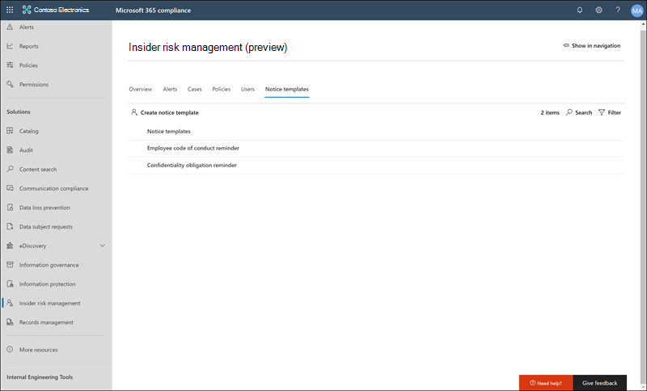

# <a name="insider-risk-management-notice-templates-preview"></a>Insider Risk Management-Benachrichtigungsvorlagen (Vorschau)

Insider Risk Management-Benachrichtigungsvorlagen ermöglichen das Senden von e-Mail-Nachrichten an Mitarbeiter, wenn ihre Aktivitäten eine Richtlinienübereinstimmung und-Warnung generieren. In den meisten Fällen sind Mitarbeiter Aktionen, die Warnungen generieren, das Ergebnis von Fehlern oder versehentlichen Aktivitäten ohne böswillige Absicht. Benachrichtigungen dienen als einfache Erinnerungen an Mitarbeiter, um vorsichtiger zu sein oder um Links oder Informationen für Auffrischungsschulungen oder Unternehmensrichtlinien Ressourcen bereitzustellen. Benachrichtigungen können ein wichtiger Bestandteilihres internen Compliance-Schulungsprogramms sein und können bei der Erstellung eines dokumentierten Überwachungspfads für Mitarbeiter mit wiederkehrenden Risiko Aktivitäten behilflich sein.

Erstellen von Benachrichtigungsvorlagen, wenn Sie Benutzern eine e-Mail-Erinnerungs Benachrichtigung für Richtlinien Übereinstimmungen als Teil des Problem Lösungsprozesses senden möchten. Benachrichtigungen können nur an die e-Mail-Adresse des Mitarbeiters gesendet werden, die mit der bestimmten Warnung verknüpft ist, die überprüft wird. Wenn Sie eine Benachrichtigungsvorlage auswählen, die auf eine Richtlinienübereinstimmung angewendet werden soll, können Sie die in der Vorlage definierten Feldwerte akzeptieren oder die Felder bei Bedarf überschreiben.

## <a name="notice-templates-dashboard"></a>Hinweis Vorlagen-Dashboard

Das Benachrichtigungs **Vorlagen-Dashboard** zeigt eine Liste konfigurierter Benachrichtigungsvorlagen an und ermöglicht Ihnen das Erstellen neuer Benachrichtigungsvorlagen. Die Benachrichtigungsvorlagen werden in umgekehrter Datumsreihenfolge mit der zuletzt aufgelisteten Benachrichtigungsvorlage aufgeführt.



## <a name="html-for-notices"></a>HTML für Benachrichtigungen

Wenn Sie mehr als eine einfache textbasierte e-Mail-Nachricht für Benachrichtigungen erstellen möchten, können Sie eine ausführlichere Meldung mithilfe von HTML im Feld Nachrichtentext einer Notizvorlage erstellen. Im folgenden Beispiel wird das Nachrichtentextformat für eine grundlegende HTML-basierte e-Mail-Benachrichtigungsvorlage bereitgestellt:

```HTML
<!DOCTYPE html>
<html>
<body>
<h2>Action Required: Contoso Employee Code of Conduct Policy Training</h2>
<p>A recent activity you've performed has generated a risk alert prohibited by the Contoso Employee <a href='https://www.contoso.com'>Code of Conduct Policy</a>.</p>
<p>You are required to attend the Contoso Employee Code of Conduct <a href='https://www.contoso.com'>training</a> within the next 14 days. Please contact <a href='mailto:hr@contoso.com'>Human Resources</a> with any questions about this training request.</p>
<p>Thank you,</p>
<p><em>Human Resources</em></p>
</body>
</html>
```

> [!NOTE]
> Die HTML-href-Attribut Implementierung in den Insider Risk Management-Hinweis Vorlagen unterstützen derzeit nur einfache Anführungszeichen anstelle von doppelten Anführungszeichen für URL-Verweise.

## <a name="create-a-new-notice-template"></a>Erstellen einer neuen Benachrichtigungsvorlage

Um eine neue Hinweis Vorlage für Insider Risk Management zu erstellen, verwenden Sie den Benachrichtigungs-Assistenten in der Lösung für das **Insider Risikomanagement** im Microsoft 365 Compliance Center.

Führen Sie die folgenden Schritte aus, um eine neue Hinweis Vorlage für Insider Risikomanagement zu erstellen:

1. Wechseln Sie im [Microsoft 365 Compliance Center](https://compliance.microsoft.com)zu **Insider Risk Management** , und wählen Sie die Registerkarte **Notiz Vorlagen** .
2. Wählen Sie **Notizvorlage erstellen** aus, um den Benachrichtigungs-Assistenten zu öffnen.
3. Füllen Sie auf der Seite **neue Notizvorlage erstellen** die folgenden Felder aus:
    - **Vorlagenname**: Geben Sie einen Anzeigenamen für den Hinweis ein. Dieser Name wird in der Liste der Benachrichtigungen im Benachrichtigungs Dashboard und in der Liste mit den Bekanntmachungen angezeigt, wenn Sie Benachrichtigungen von einem Fall senden.
    - **Senden von**: Geben Sie die Absender-e-Mail-Adresse für den Hinweis ein. Diese Adresse wird im Feld **von:** in allen an Mitarbeiter gesendeten Benachrichtigungen angezeigt, es sei denn, beim Senden einer Nachricht aus einem Fall wurde eine Änderung vorgenommen.
    - Felder **CC und Bcc** : optionale Benutzer oder Gruppen, die über die Richtlinienübereinstimmung benachrichtigt werden sollen, ausgewählt aus dem Active Directory für Ihr Abonnement.
    - **Betreff**: Informationen, die in der Betreffzeile der Nachricht angezeigt werden, unterstützen Textzeichen.
    - **Nachrichten**Text: im Nachrichtentext angezeigte Informationen unterstützen Text-oder HTML-Werte.
4. Wählen Sie **Erstellen** , um die Notizvorlage zu erstellen und zu speichern, oder wählen Sie **Abbrechen** aus, um zu schließen, ohne die Benachrichtigungsvorlage zu speichern.

## <a name="update-a-notice-template"></a>Aktualisieren einer Benachrichtigungsvorlage

Führen Sie die folgenden Schritte aus, um eine vorhandene Benachrichtigungsvorlage für Insider Risk Management zu aktualisieren:

1. Wechseln Sie im [Microsoft 365 Compliance Center](https://compliance.microsoft.com)zu **Insider Risk Management** , und wählen Sie die Registerkarte **Notiz Vorlagen** .
2. Wählen Sie im Benachrichtigungs Dashboard die Benachrichtigungsvorlage aus, die Sie verwalten möchten.
3. Wählen Sie auf der Seite Notice Details die Option **Bearbeiten** aus.
4. Auf der Seite **Bearbeiten** können Sie die folgenden Felder bearbeiten:
    - **Vorlagenname**: Geben Sie einen neuen Anzeigenamen für den Hinweis ein. Dieser Name wird in der Liste der Benachrichtigungen im Benachrichtigungs Dashboard und in der Liste mit den Bekanntmachungen angezeigt, wenn Sie Benachrichtigungen von einem Fall senden.
    - **Senden von**: Aktualisieren Sie die Absender-e-Mail-Adresse für den Hinweis. Diese Adresse wird im Feld **von:** in allen an Mitarbeiter gesendeten Benachrichtigungen angezeigt, es sei denn, beim Senden einer Nachricht aus einem Fall wurde eine Änderung vorgenommen.
    - Felder **CC und Bcc** : Aktualisieren Sie optionale Benutzer oder Gruppen, um über die Richtlinienübereinstimmung benachrichtigt zu werden, und wählen Sie aus dem Active Directory für Ihr Abonnement aus.
    - **Betreff**: Update Informationen, die in der Betreffzeile der Nachricht angezeigt werden, unterstützen Textzeichen.
    - **Nachrichtentext**: Aktualisieren von Informationen, die im Nachrichtentext angezeigt werden, unterstützt Text-oder HTML-Werte.
5. Wählen Sie **Speichern** aus, um den Hinweis zu aktualisieren und zu speichern, oder wählen Sie **Abbrechen** aus, um ohne Speichern der Benachrichtigungsvorlage zu schließen.

## <a name="delete-a-notice-template"></a>Löschen einer Benachrichtigungsvorlage

Führen Sie die folgenden Schritte aus, um eine vorhandene Benachrichtigungsvorlage für Insider Risk Management zu löschen:

1. Wechseln Sie im [Microsoft 365 Compliance Center](https://compliance.microsoft.com)zu **Insider Risk Management** , und wählen Sie die Registerkarte **Notiz Vorlagen** .
2. Wählen Sie im Benachrichtigungs Dashboard die Notizvorlage aus, die Sie löschen möchten.
3. Klicken Sie auf der Symbolleiste auf das Symbol **Löschen** .
4. Um die Notizvorlage zu löschen, wählen Sie **Ja** im Lösch Dialogfeld aus. Um den Löschvorgang abzubrechen, wählen Sie **Abbrechen**aus.
