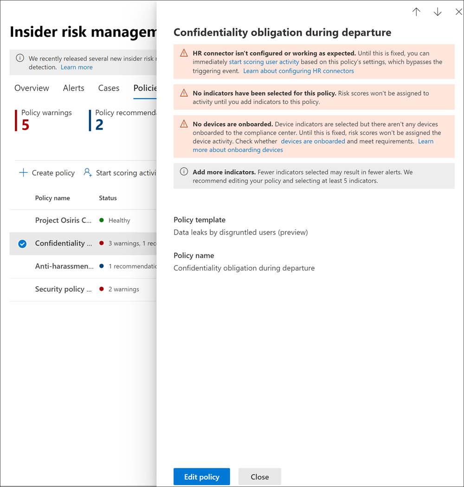

# <a name="insider-risk-management-policies"></a><span data-ttu-id="184e2-104">Insider-Risikomanagement-Richtlinien</span><span class="sxs-lookup"><span data-stu-id="184e2-104">Insider risk management policies</span></span>

<span data-ttu-id="184e2-105">Insider-Risikomanagement-Richtlinien legen fest, welche Benutzer in den Geltungsbereich fallen und welche Arten von Risikoindikatoren für Warnmeldungen konfiguriert werden.</span><span class="sxs-lookup"><span data-stu-id="184e2-105">Insider risk management policies determine which users are in-scope and which types of risk indicators are configured for alerts.</span></span> <span data-ttu-id="184e2-106">Sie können schnell eine Richtlinie erstellen, die für alle Benutzer in Ihrer Organisation gilt, oder einzelne Benutzer oder Gruppen für die Verwaltung in einer Richtlinie definieren.</span><span class="sxs-lookup"><span data-stu-id="184e2-106">You can quickly create a policy that applies to all users in your organization or define individual users or groups for management in a policy.</span></span> <span data-ttu-id="184e2-107">Richtlinien unterstützen Inhaltsprioritäten, um Richtlinienbedingungen auf mehrere oder bestimmte Microsoft-Teams, SharePoint-Sites, Vertraulichkeitstypen von Daten und Datenbezeichnungen zu konzentrieren.</span><span class="sxs-lookup"><span data-stu-id="184e2-107">Policies support content priorities to focus policy conditions on multiple or specific Microsoft Teams, SharePoint sites, data sensitivity types, and data labels.</span></span> <span data-ttu-id="184e2-108">Mithilfe von Vorlagen können Sie bestimmte Risikoindikatoren auswählen und Ereignisschwellenwerte für Richtlinienindikatoren anpassen und so die Risikobewertungen sowie die Stufe und Häufigkeit von Warnungen effektiv anpassen.</span><span class="sxs-lookup"><span data-stu-id="184e2-108">Using templates, you can select specific risk indicators and customize event thresholds for policy indicators, effectively customizing risk scores, and level and frequency of alerts.</span></span> <span data-ttu-id="184e2-109">Darüber hinaus helfen Ihnen Risikobewertungsverstärker und Anomalieerkennungen, Benutzeraktivitäten zu identifizieren, die von höherer Bedeutung oder eher ungewöhnlich sind.</span><span class="sxs-lookup"><span data-stu-id="184e2-109">Additionally, risk score boosters and anomaly detections help identify user activity that is of higher importance or more unusual.</span></span> <span data-ttu-id="184e2-110">Mit Richtlinienfenstern können Sie den Zeitrahmen definieren, in dem die Richtlinie auf Warnungsaktivitäten angewendet wird, und sie werden verwendet, um die Dauer der Richtlinie ab der Aktivierung zu bestimmen.</span><span class="sxs-lookup"><span data-stu-id="184e2-110">Policy windows allow you to define the time frame to apply the policy to alert activities and are used to determine the duration of the policy once activated.</span></span>

<span data-ttu-id="184e2-111">Sehen Sie sich das [Video zur Konfiguration von Risikomanagementrichtlinien](https://www.youtube.com/watch?v=kudK5ajZTUo) an, um einen Überblick darüber zu erhalten, wie Ihnen mithilfe integrierter Richtlinienvorlagen erstellte Richtlinien helfen können, schnell Maßnahmen bei potenziellen Risiken zu ergreifen.</span><span class="sxs-lookup"><span data-stu-id="184e2-111">Check out the [Insider Risk Management Policies Configuration video](https://www.youtube.com/watch?v=kudK5ajZTUo) for an overview of how policies created with built-in policy templates can help you to quickly take action on potential risks.</span></span>

## <a name="policy-dashboard"></a><span data-ttu-id="184e2-112">Richtlinien-Dashboard</span><span class="sxs-lookup"><span data-stu-id="184e2-112">Policy dashboard</span></span>

<span data-ttu-id="184e2-113">Über das **Richtlinien-Dashboard** können Sie sich schnell einen Überblick über die Richtlinien in Ihrer Organisation und deren Integrität verschaffen, den Richtlinien manuell Benutzer hinzufügen und den Status der mit den einzelnen Richtlinien verbundenen Warnungen anzeigen.</span><span class="sxs-lookup"><span data-stu-id="184e2-113">The **Policy dashboard** allows you to quickly see the policies in your organization, the health of the policy, manually add users to policies, and the view the status of alerts associated with each policy.</span></span>

- <span data-ttu-id="184e2-114">**Richtlinienname:** Der Name, der im Richtlinien-Assistenten der Richtlinie zugewiesen wurde.</span><span class="sxs-lookup"><span data-stu-id="184e2-114">**Policy name**: The name assigned to the policy in the policy wizard.</span></span>
- <span data-ttu-id="184e2-115">**Status**: Der Integritätsstatus für jede Richtlinie.</span><span class="sxs-lookup"><span data-stu-id="184e2-115">**Status**: The health status for each policy.</span></span> <span data-ttu-id="184e2-116">Zeigt die Anzahl der Richtlinienwarnungen und Empfehlungen oder den Status *Fehlerfrei* für Richtlinien ohne Probleme an.</span><span class="sxs-lookup"><span data-stu-id="184e2-116">Displays number of policy warnings and recommendations, or a status of *Healthy* for policies without issues.</span></span>  <span data-ttu-id="184e2-117">Sie können auf die Richtlinie klicken, um die Integritätsstatusdetails für Warnungen oder Empfehlungen anzuzeigen.</span><span class="sxs-lookup"><span data-stu-id="184e2-117">You can click on the policy to see the health status details for any warnings or recommendations.</span></span>
- <span data-ttu-id="184e2-118">**Aktive Warnungen:** Die Anzahl der aktiven Warnungen für jede Richtlinie.</span><span class="sxs-lookup"><span data-stu-id="184e2-118">**Active alerts**: The number of active alerts for each policy.</span></span>
- <span data-ttu-id="184e2-119">**Bestätigte Warnungen:** Die Gesamtzahl der Warnungen, die in den letzten 365 Tagen durch die Richtlinie zu Fällen geführt haben.</span><span class="sxs-lookup"><span data-stu-id="184e2-119">**Confirmed alerts**: The total number of alerts the resulted in cases from the policy in the last 365 days.</span></span>
- <span data-ttu-id="184e2-120">**Maßnahmen bei Warnungen**: Die Gesamtzahl der Warnungen, die in den letzten 365 Tagen bestätigt oder verworfen wurden.</span><span class="sxs-lookup"><span data-stu-id="184e2-120">**Actions taken on alerts**: The total number of alerts that were confirmed or dismissed for the last 365 days.</span></span>
- <span data-ttu-id="184e2-121">**Richtlinien-Warnungswirksamkeit:** Der Prozentsatz, der sich aus der Gesamtzahl der bestätigten Warnungen, geteilt durch die Gesamtzahl der aufgrund von Warnungen ergriffenen Maßnahmen ergibt (dies ist die Summe der Warnungen, die im Laufe des letzten Jahres bestätigt oder verworfen wurden).</span><span class="sxs-lookup"><span data-stu-id="184e2-121">**Policy alert effectiveness**: The percentage determined by total confirmed alerts divided by total actions taken on alerts (which is the sum of alerts that were confirmed or dismissed over the past year).</span></span>


## <a name="policy-recommendations-from-analytics-preview"></a><span data-ttu-id="184e2-123">Richtlinienempfehlungen aus Analysen (Vorschau)</span><span class="sxs-lookup"><span data-stu-id="184e2-123">Policy recommendations from analytics (preview)</span></span>

<span data-ttu-id="184e2-124">Mit Insider-Risikoanalysen können Sie eine Auswertung potenzieller Insider-Risiken in Ihrer Organisation durchführen, ohne Insider-Risikorichtlinien konfigurieren zu müssen.</span><span class="sxs-lookup"><span data-stu-id="184e2-124">Insider risk analytics enables you to conduct an evaluation of potential insider risks in your organization without configuring any insider risk policies.</span></span> <span data-ttu-id="184e2-125">Diese Auswertung kann Ihrer Organisation dabei helfen, potenzielle Bereiche mit höherem Benutzerrisiko zu identifizieren und den Typ und Umfang von Insider-Risikomanagement-Richtlinien zu bestimmen, die Sie konfigurieren sollten.</span><span class="sxs-lookup"><span data-stu-id="184e2-125">This evaluation can help your organization identify potential areas of higher user risk and help determine the type and scope of insider risk management policies you may consider configuring.</span></span>

<span data-ttu-id="184e2-126">Weitere Informationen zu Insider-Risikoanalysen und Richtlinienempfehlungen finden Sie unter [Insider-Risikomanagement-Einstellungen: Analysen (Vorschau)](insider-risk-management-settings.md#analytics-preview).</span><span class="sxs-lookup"><span data-stu-id="184e2-126">To learn more about insider risk analytics and policy recommendations, see [Insider risk management settings: Analytics (preview)](insider-risk-management-settings.md#analytics-preview).</span></span>

## <a name="policy-templates"></a><span data-ttu-id="184e2-127">Richtlinienvorlagen</span><span class="sxs-lookup"><span data-stu-id="184e2-127">Policy templates</span></span>

<span data-ttu-id="184e2-128">Insider-Risikomanagementvorlagen sind vordefinierte Richtlinienbedingungen, mit denen die von der Richtlinie verwendeten Arten von Risikoindikatoren und das verwendete Risikobewertungsmodell definiert werden.</span><span class="sxs-lookup"><span data-stu-id="184e2-128">Insider risk management templates are pre-defined policy conditions that define the types of risk indicators and risk scoring model used by the policy.</span></span> <span data-ttu-id="184e2-129">Bevor eine Richtlinie erstellt wird, muss ihr im Richtlinienerstellungs-Assistenten eine Vorlage zugewiesen werden.</span><span class="sxs-lookup"><span data-stu-id="184e2-129">Each policy must have a template assigned in the policy creation wizard before the policy is created.</span></span> <span data-ttu-id="184e2-130">Das Insider-Risikomanagement unterstützt bis zu fünf Richtlinien für jede Richtlinienvorlage.</span><span class="sxs-lookup"><span data-stu-id="184e2-130">Insider risk management supports up to five policies for each policy template.</span></span> <span data-ttu-id="184e2-131">Wenn Sie mit dem Richtlinien-Assistenten eine neue Insider-Risikorichtlinie erstellen, stehen Ihnen die folgenden Richtlinienvorlagen zur Auswahl:</span><span class="sxs-lookup"><span data-stu-id="184e2-131">When you create a new insider risk policy with the policy wizard, you'll choose from one of the following policy templates:</span></span>

### <a name="data-theft-by-departing-users"></a><span data-ttu-id="184e2-132">Datendiebstahl durch ausscheidende Benutzer</span><span class="sxs-lookup"><span data-stu-id="184e2-132">Data theft by departing users</span></span>

<span data-ttu-id="184e2-133">Wenn Benutzer Ihre Organisation verlassen, gibt es spezifische Risikoindikatoren, die in der Regel mit Datendiebstahl durch ausscheidende Benutzer verbunden sind.</span><span class="sxs-lookup"><span data-stu-id="184e2-133">When users leave your organization, there are specific risk indicators typically associated with data theft by departing users.</span></span> <span data-ttu-id="184e2-134">Diese Richtlinienvorlage verwendet zur Bewertung des Risikos Exfiltrationsindikatoren und konzentriert sich auf Erkennung und Warnungen in diesem Risikobereich.</span><span class="sxs-lookup"><span data-stu-id="184e2-134">This policy template uses exfiltration indicators for risk scoring and focuses on detection and alerts in this risk area.</span></span> <span data-ttu-id="184e2-135">Datendiebstahl durch ausscheidende Benutzer kann das Herunterladen von Dateien von SharePoint Online, das Drucken von Dateien sowie das Kopieren von Daten in persönliche Cloud-Messaging- und -Speicherdienste in zeitlicher Nähe zu den Daten der Kündigung und des Ausscheidens umfassen.</span><span class="sxs-lookup"><span data-stu-id="184e2-135">Data theft for departing users may include downloading files from SharePoint Online, printing files, and copying data to personal cloud messaging and storage services near their employment resignation and end dates.</span></span> <span data-ttu-id="184e2-136">Durch die Verwendung des Microsoft 365 HR-Connectors oder mithilfe der Option zum automatischen Überwachen auf das Löschen von Benutzerkonten in Azure Active Directory für Ihre Organisation beginnt diese Vorlage mit der Bewertung von Risikoindikatoren im Zusammenhang mit diesen Aktivitäten und ihrer Korrelation mit dem Benutzeranstellungsstatus.</span><span class="sxs-lookup"><span data-stu-id="184e2-136">By using either the Microsoft 365 HR connector or the option to automatically monitor for user account deletion in Azure Active Directory for your organization, this template starts scoring for risk indicators relating to these activities and how they correlate with user employment status.</span></span>

>[!IMPORTANT]
><span data-ttu-id="184e2-137">Wenn Sie diese Vorlage verwenden, können Sie einen Microsoft 365 HR-Connector so konfigurieren, dass er regelmäßig Informationen zu Ausscheide-und Kündigungsdaten von Benutzern Ihrer Organisation importiert.</span><span class="sxs-lookup"><span data-stu-id="184e2-137">When using this template, you can configure a Microsoft 365 HR connector to periodically import resignation and termination date information for users in your organization.</span></span> <span data-ttu-id="184e2-138">Eine schrittweise Anleitung zum Konfigurieren des Microsoft 365 HR-Connectors für Ihre Organisation finden Sie in dem Artikel [Importieren von Daten mit dem HR-Connector](import-hr-data.md).</span><span class="sxs-lookup"><span data-stu-id="184e2-138">See the [Import data with the HR connector](import-hr-data.md) article for step-by-step guidance to configure the Microsoft 365 HR connector for your organization.</span></span> <span data-ttu-id="184e2-139">Wenn Sie sich dafür entscheiden, den HR-Connector nicht zu verwenden, müssen Sie beim Konfigurieren von Triggerereignissen im Richtlinien-Assistenten die Option „Aus Azure AD gelöschtes Benutzerkonto“ auswählen.</span><span class="sxs-lookup"><span data-stu-id="184e2-139">If you choose not to use the HR connector, you must select the User account deleted from Azure AD option when configuring trigger events in the policy wizard.</span></span>

### <a name="general-data-leaks"></a><span data-ttu-id="184e2-140">Allgemeine Datenlecks</span><span class="sxs-lookup"><span data-stu-id="184e2-140">General data leaks</span></span>

<span data-ttu-id="184e2-141">Der Schutz von Daten und die Verhinderung von Datenlecks stellt für die meisten Organisationen eine konstante Herausforderung dar, insbesondere angesichts des schnellen Anstiegs neuer Daten, die von Benutzern, Geräten und Diensten erstellt werden.</span><span class="sxs-lookup"><span data-stu-id="184e2-141">Protecting data and preventing data leaks is a constant challenge for most organizations, particularly with the rapid grow of new data created by users, devices, and services.</span></span> <span data-ttu-id="184e2-142">Die Benutzer sind in der Lage, Informationen dienst- und geräteübergreifend zu erstellen, zu speichern und zu teilen, was die Verwaltung von Datenlecks immer komplexer und schwieriger macht.</span><span class="sxs-lookup"><span data-stu-id="184e2-142">Users are empowered to create, store, and share information across services and devices that make managing data leaks increasingly more complex and difficult.</span></span> <span data-ttu-id="184e2-143">Zu den Datenlecks können die versehentliche Weitergabe von Informationen außerhalb Ihres Unternehmens oder Datendiebstahl in böswilliger Absicht gehören.</span><span class="sxs-lookup"><span data-stu-id="184e2-143">Data leaks can include accidental oversharing of information outside your organization or data theft with malicious intent.</span></span> <span data-ttu-id="184e2-144">Mit einer zugewiesenen Richtlinie zur Verhinderung von Datenverlust (Data Loss Prevention, DLP) oder dem integrierten auslösenden Ereignis beginnt diese Vorlage mit der Bewertung von Erkennungen verdächtiger Downloads von SharePoint Online-Daten, verdächtiger Freigaben von Dateien und Ordnern, des verdächtigen Druckens von Dateien und des verdächtigen Kopierens von Daten in persönliche Cloud-Messaging- und -Speicherdienste in Echtzeit.</span><span class="sxs-lookup"><span data-stu-id="184e2-144">With an assigned Data Loss Prevention (DLP) policy or the built-in triggering event, this template starts scoring real-time detections of suspicious SharePoint Online data downloads, file and folder sharing, printing files, and copying data to personal cloud messaging and storage services.</span></span>

<span data-ttu-id="184e2-145">Bei Verwendung einer *Datenlecks*-Vorlage können Sie eine DLP-Richtlinie zuweisen, um Indikatoren in der Insider-Risikorichtlinie für Warnungen mit hohem Schweregrad in Ihrer Organisation auszulösen.</span><span class="sxs-lookup"><span data-stu-id="184e2-145">When using a *Data leaks* template, you can assign a DLP policy to trigger indicators in the insider risk policy for high severity alerts in your organization.</span></span> <span data-ttu-id="184e2-146">Immer, wenn eine Warnung mit hohem Schweregrad, die von einer DLP-Richtlinienregel generiert wurde, dem Office 365-Überwachungsprotokoll hinzugefügt wird, untersuchen mit dieser Vorlage erstellte Insider-Risikorichtlinien automatisch die DLP-Warnung mit hohem Schweregrad.</span><span class="sxs-lookup"><span data-stu-id="184e2-146">Whenever a high severity alert is generated by a DLP policy rule is added to the Office 365 audit log, insider risk policies created with this template automatically examine the high severity DLP alert.</span></span> <span data-ttu-id="184e2-147">Wenn die Warnung einen in der Insider-Risikorichtlinie definierten, im Umfang enthaltenen Benutzer enthält, wird die Warnung von der Insider-Risikorichtlinie als neue Warnung verarbeitet und ihr ein Schweregrad sowie eine Risikobewertung für ein Insider-Risiko zugewiesen.</span><span class="sxs-lookup"><span data-stu-id="184e2-147">If the alert contains an in-scope user defined in the insider risk policy, the alert is processed by the insider risk policy as a new alert and assigned an insider risk severity and risk score.</span></span> <span data-ttu-id="184e2-148">Diese Richtlinie ermöglicht es Ihnen, diese Warnung im Kontext mit anderen in den Fall enthaltenen Aktivitäten auszuwerten.</span><span class="sxs-lookup"><span data-stu-id="184e2-148">This policy allows you to evaluate this alert in context with other activities included in the case.</span></span> <span data-ttu-id="184e2-149">Wenn Sie keine DLP-Richtlinie auswählen, müssen Sie das integrierte auslösende Ereignis auswählen.</span><span class="sxs-lookup"><span data-stu-id="184e2-149">If you don't choose a DLP policy, you must select the built-in triggering event.</span></span>

#### <a name="data-leaks-policy-guidelines"></a><span data-ttu-id="184e2-150">Richtlinien für Datenleckrichtlinien</span><span class="sxs-lookup"><span data-stu-id="184e2-150">Data leaks policy guidelines</span></span>

<span data-ttu-id="184e2-151">Berücksichtigen Sie beim Erstellen oder Ändern von DLP-Richtlinien für die Verwendung mit Insider-Risikomanagement-Richtlinien die folgenden Richtlinien:</span><span class="sxs-lookup"><span data-stu-id="184e2-151">When creating or modifying DLP policies for use with insider risk management policies, consider the following guidelines:</span></span>

- <span data-ttu-id="184e2-152">Priorisieren Sie Datenexfiltrationsereignisse, und gehen Sie selektiv vor, wenn Sie beim Konfigurieren von Regeln in Ihren DLP-Richtlinien die Einstellungen von **Vorfallsberichten** auf *Hoch* festlegen.</span><span class="sxs-lookup"><span data-stu-id="184e2-152">Prioritize data exfiltration events and be selective when assigning **Incident reports** settings to *High* when configuring rules in your DLP policies.</span></span> <span data-ttu-id="184e2-153">Das Senden vertraulicher Dokumente per E-Mail an einen bekannten Mitbewerber sollte ein Exfiltrationsereignis der Warnstufe *Hoch* sein.</span><span class="sxs-lookup"><span data-stu-id="184e2-153">For example, emailing sensitive documents to a known competitor should be a *High* alert level exfiltration event.</span></span> <span data-ttu-id="184e2-154">Zu häufiges Zuweisen der Stufe *Hoch* in den Einstellungen von **Vorfallsberichten** in anderen DLP-Richtlinienregeln kann zu mehr Störungen (noise) im Warnungsworkflow des Insider-Risikomanagements führen und Ihren Datenprüfern und -analysten die angemessene Auswertung dieser Warnungen erschweren.</span><span class="sxs-lookup"><span data-stu-id="184e2-154">Over-assigning the *High* level in the **Incident reports** settings in other DLP policy rules can increase the noise in the insider risk management alert workflow and make it more difficult for your data investigators and analysts to properly evaluate these alerts.</span></span> <span data-ttu-id="184e2-155">Das Zuweisen der Warnstufe *Hoch* zu „Zugriff verweigert“-Aktivitäten in DLP-Richtlinien erschwert die Auswertung tatsächlich riskanter Benutzerverhalten und -aktivitäten.</span><span class="sxs-lookup"><span data-stu-id="184e2-155">For example, assigning *High* alert levels to access denial activities in DLP policies makes it more challenging to evaluate truly risky user behavior and activities.</span></span>
- <span data-ttu-id="184e2-156">Stellen Sie sicher, dass Sie die im Umfang enthaltenen Benutzer sowohl in den DLP- als auch in den Insider-Risikomanagement-Richtlinien verstehen und ordnungsgemäß konfigurieren.</span><span class="sxs-lookup"><span data-stu-id="184e2-156">Make sure you understand and properly configure the in-scope users in both the DLP and insider risk management policies.</span></span> <span data-ttu-id="184e2-157">Nur für Benutzer, die mithilfe der Vorlage **Datenlecks** für Insider-Risikomanagement-Richtlinien als im Umfang enthalten definiert sind, werden DLP-Richtlinienwarnungen mit hohem Schweregrad verarbeitet.</span><span class="sxs-lookup"><span data-stu-id="184e2-157">Only users defined as in-scope for insider risk management policies using the **Data leaks** template will have high severity DLP policy alerts processed.</span></span> <span data-ttu-id="184e2-158">Darüber hinaus werden nur Benutzer, die in einer Regel für eine DLP-Warnung mit hohem Schweregrad als im Umfang enthalten definiert sind, von der betreffenden Insider-Risikomanagement-Richtlinie untersucht.</span><span class="sxs-lookup"><span data-stu-id="184e2-158">Additionally, only users defined as in-scope in a rule for a high severity DLP alert will be examined by the insider risk management policy for consideration.</span></span> <span data-ttu-id="184e2-159">Es ist wichtig, dass Sie nicht unwissentlich im Umfang enthaltene Benutzer sowohl in Ihren DLP- als auch in Ihren Insider-Risikorichtlinien in widersprüchlicher Weise definieren.</span><span class="sxs-lookup"><span data-stu-id="184e2-159">It is important that you don't unknowingly configure in-scope users in both your DLP and insider risk policies in a conflicting manner.</span></span>

     <span data-ttu-id="184e2-160">Wenn Ihre DLP-Richtlinienregeln beispielsweise nur Benutzer im Vertriebsteam umfassen und in der aus der Vorlage **Datenlecks** erstellten Insider-Risikorichtlinie alle Benutzer als im Umfang enthalten definiert sind, verarbeitet die Insider-Risikorichtlinie tatsächlich nur DLP-Warnungen mit hohem Schweregrad für die Benutzer im Vertriebsteam.</span><span class="sxs-lookup"><span data-stu-id="184e2-160">For example, if your DLP policy rules are scoped to only users on the Sales Team and the insider risk policy created from the **Data leaks** template has defined all users as in-scope, the insider risk policy will only actually process high severity DLP alerts for the users on the Sales Team.</span></span> <span data-ttu-id="184e2-161">Die Insider-Risikorichtlinie erhält keine DLP-Warnungen der Stufe „Hoch“ für Benutzer zur Verarbeitung, die in diesem Beispiel nicht in den DLP-Regeln definiert sind.</span><span class="sxs-lookup"><span data-stu-id="184e2-161">The insider risk policy won't receive any high priority DLP alerts for users to process that aren't defined in the DLP rules in this example.</span></span> <span data-ttu-id="184e2-162">Wenn im Gegensatz dazu Ihre aus der Vorlage **Datenlecks** erstellte Insider-Risikomanagement-Richtlinie nur Benutzer im Vertriebsteam umfasst und im Umfang der zugewiesenen DLP-Richtlinie alle Benutzer enthalten sind, verarbeitet die Insider-Risikorichtlinie nur DLP-Warnungen mit hohem Schweregrad für Mitglieder des Vertriebsteams.</span><span class="sxs-lookup"><span data-stu-id="184e2-162">Conversely, if your insider risk management policy created from **Data leaks** templates is scoped to only users on the Sales Team and the assigned DLP policy is scoped to all users, the insider risk policy will only process high severity DLP alerts for members of the Sales Team.</span></span> <span data-ttu-id="184e2-163">Die Insider-Risikomanagement-Richtlinie ignoriert DLP-Warnungen mit hohem Schweregrad für alle Benutzer, die nicht zum Vertriebsteam gehören.</span><span class="sxs-lookup"><span data-stu-id="184e2-163">The insider risk management policy will ignore high severity DLP alerts for all users not on the Sales Team.</span></span>

- <span data-ttu-id="184e2-164">Stellen Sie sicher, dass die Regeleinstellung für **Vorfallsberichte** in der DLP-Richtlinie, die für diese Insider-Risikomanagementvorlage verwendet wird, für Warnungen mit Schweregrad *Hoch* konfiguriert ist.</span><span class="sxs-lookup"><span data-stu-id="184e2-164">Make sure the **Incident reports** rule setting in the DLP policy used for this insider risk management template is configured for *High* severity level alerts.</span></span> <span data-ttu-id="184e2-165">Der Schweregrad *Hoch* ist das auslösende Ereignis, und Insider-Risikomanagementwarnungen werden nicht aus Regeln in DLP-Richtlinien generiert, bei denen das Feld für **Vorfallsberichte** auf *Niedrig* oder *Mittel* festgelegt ist.</span><span class="sxs-lookup"><span data-stu-id="184e2-165">The *High* severity level is the triggering events and insider risk management alerts won't be generated from rules in DLP policies with the **Incident reports** field set at *Low* or *Medium*.</span></span>

    

     >[!NOTE]
     ><span data-ttu-id="184e2-167">Wenn Sie eine neue DLP-Richtlinie mithilfe der integrierten Vorlagen erstellen, müssen Sie die Option **Erweiterte DLP-Regeln erstellen oder anpassen** auswählen, um die Einstellung für **Vorfallsberichte** auf den Schweregrad *Hoch* zu konfigurieren.</span><span class="sxs-lookup"><span data-stu-id="184e2-167">When creating a new DLP policy using the built-in templates, you'll need to select the **Create or customize advanced DLP rules** option to configure the **Incident reports** setting for the *High* severity level.</span></span>

<span data-ttu-id="184e2-168">Jeder Insider-Risikomanagement-Richtlinie, die aus der Vorlage **Datenlecks** erstellt wurde, kann nur eine DLP-Richtlinie zugewiesen werden.</span><span class="sxs-lookup"><span data-stu-id="184e2-168">Each insider risk management policy created from the **Data leaks** template can only have one DLP policy assigned.</span></span> <span data-ttu-id="184e2-169">Erwägen Sie, eine dedizierte DLP-Richtlinie zu erstellen, die die verschiedenen Aktivitäten kombiniert, die Sie erkennen möchten und die als auslösende Ereignisse für Insider-Risikorichtlinien fungieren sollen, die die Vorlage **Datenlecks** verwenden.</span><span class="sxs-lookup"><span data-stu-id="184e2-169">Consider creating a dedicated DLP policy that combines the different activities you want to detect and act as triggering events for  insider risk policies that use the **Data leaks** template.</span></span>

<span data-ttu-id="184e2-170">Eine schrittweise Anleitung zum Konfigurieren von DLP-Richtlinien für Ihre Organisation finden Sie in dem Artikel [Erstellen, Testen und Optimieren einer DLP-Richtlinie](create-test-tune-dlp-policy.md).</span><span class="sxs-lookup"><span data-stu-id="184e2-170">See the [Create, test, and tune a DLP policy](create-test-tune-dlp-policy.md) article for step-by-step guidance to configure DLP policies for your organization.</span></span>

### <a name="data-leaks-by-priority-users-preview"></a><span data-ttu-id="184e2-171">Datenlecks durch prioritäre Benutzer (Vorschau)</span><span class="sxs-lookup"><span data-stu-id="184e2-171">Data leaks by priority users (preview)</span></span>

<span data-ttu-id="184e2-172">Der Schutz von Daten und die Verhinderung von Datenlecks durch Benutzer in Ihrer Organisation hängt möglicherweise von deren Position, ihrer Zugriffsebene auf vertrauliche Informationen oder ihrem Risikoverlauf ab.</span><span class="sxs-lookup"><span data-stu-id="184e2-172">Protecting data and preventing data leaks for users in your organization may depend on their position, level of access to sensitive information, or risk history.</span></span> <span data-ttu-id="184e2-173">Zu den Datenlecks gehören die versehentliche Weitergabe hochgradig vertraulicher Informationen außerhalb Ihres Unternehmens oder Datendiebstahl in böswilliger Absicht.</span><span class="sxs-lookup"><span data-stu-id="184e2-173">Data leaks can include accidental oversharing of highly sensitive information outside your organization or data theft with malicious intent.</span></span> <span data-ttu-id="184e2-174">Mit einer zugewiesenen Richtlinie zur Verhinderung von Datenverlust (Data Loss Prevention, DLP) beginnt diese Vorlage mit der Bewertung von Erkennungen verdächtiger Aktivitäten in Echtzeit und führt zu einer höheren Wahrscheinlichkeit für Insider-Risikowarnungen und Warnungen mit höheren Schweregraden.</span><span class="sxs-lookup"><span data-stu-id="184e2-174">With an assigned Data Loss Prevention (DLP) policy, this template starts scoring real-time detections of suspicious activity and result in an increased likelihood of insider risk alerts and alerts with higher severity levels.</span></span> <span data-ttu-id="184e2-175">Prioritäre Benutzer werden in [Gruppen prioritärer Benutzer](insider-risk-management-settings.md#priority-user-groups-preview) definiert, die im Bereich der Insider-Risikomanagementeinstellungen konfiguriert sind.</span><span class="sxs-lookup"><span data-stu-id="184e2-175">Priority users are defined in [priority user groups](insider-risk-management-settings.md#priority-user-groups-preview) configured in the insider risk management settings area.</span></span>

<span data-ttu-id="184e2-176">Wie auch bei der Vorlage **Allgemeine Datenlecks** müssen Sie eine DLP-Richtlinie zuweisen, um Indikatoren in der Insider-Risikorichtlinie für Warnungen mit hohem Schweregrad in Ihrer Organisation auszulösen.</span><span class="sxs-lookup"><span data-stu-id="184e2-176">As with the **General data leaks template**, you must assign a DLP policy to trigger indicators in the insider risk policy for high severity alerts in your organization.</span></span> <span data-ttu-id="184e2-177">Befolgen Sie die oben genannten Richtlinien für Datenleckrichtlinien, wenn Sie eine Richtlinie mit dieser Vorlage erstellen.</span><span class="sxs-lookup"><span data-stu-id="184e2-177">Follow the Data leaks policy guidelines above when creating a policy using this template.</span></span> <span data-ttu-id="184e2-178">Darüber hinaus müssen Sie der Richtlinie Gruppen prioritärer Benutzer zuweisen, die in **Insider-Risikomanagement** > **Einstellungen** > **Gruppen prioritärer Benutzer** erstellt wurden.</span><span class="sxs-lookup"><span data-stu-id="184e2-178">Additionally, you will need to assign priority user groups created in **Insider risk management** > **Settings** > **Priority user groups** to the policy.</span></span>

### <a name="data-leaks-by-disgruntled-users-preview"></a><span data-ttu-id="184e2-179">Datenlecks durch verärgerte Benutzer (Vorschau)</span><span class="sxs-lookup"><span data-stu-id="184e2-179">Data leaks by disgruntled users (preview)</span></span>

<span data-ttu-id="184e2-180">Wenn bei Benutzern Stressoren im Beschäftigungsverhältnis auftreten, werden sie möglicherweise verärgert, wodurch sich die Wahrscheinlichkeit von Insider-Risikoaktivitäten erhöhen kann.</span><span class="sxs-lookup"><span data-stu-id="184e2-180">When users experience employment stressors, they may become disgruntled, which may increase the chances of insider risk activity.</span></span> <span data-ttu-id="184e2-181">Diese Vorlage beginnt mit der Bewertung von Benutzeraktivitäten, wenn ein Indikator erkannt wird, der „Verärgerung“ zugeordnet ist.</span><span class="sxs-lookup"><span data-stu-id="184e2-181">This template starts scoring user activity when an indicator associated with disgruntlement is identified.</span></span> <span data-ttu-id="184e2-182">Beispiele hierfür sind Aufforderungen/Benachrichtigungen zur Leistungsverbesserung, schlechte Leistungsbeurteilungen oder Änderungen am Status der Beschäftigungsstufe.</span><span class="sxs-lookup"><span data-stu-id="184e2-182">Examples include performance improvement notifications, poor performance reviews, or changes to job level status.</span></span> <span data-ttu-id="184e2-183">Datenlecks durch verärgerte Benutzer können das Herunterladen von Dateien von SharePoint Online, sowie das Kopieren von Daten in persönliche Cloud-Messaging- und -Speicherdienste in zeitlicher Nähe zu Stressorereignissen im Beschäftigungsverhältnis umfassen.</span><span class="sxs-lookup"><span data-stu-id="184e2-183">Data leaks for disgruntled users may include downloading files from SharePoint Online and copying data to personal cloud messaging and storage services near employment stressor events.</span></span>

<span data-ttu-id="184e2-184">Wenn Sie diese Vorlage verwenden, müssen Sie auch einen Microsoft 365 HR-Connector so konfigurieren, dass er regelmäßig Aufforderungen/Benachrichtigungen zur Leistungsverbesserung, schlechte Leistungsbeurteilungen oder Informationen über Änderungen am Status der Beschäftigungsstufe für Benutzer Ihrer Organisation importiert.</span><span class="sxs-lookup"><span data-stu-id="184e2-184">When using this template, you must also configure a Microsoft 365 HR connector to periodically import performance improvement notifications, poor performance review status, or job level change information for users in your organization.</span></span> <span data-ttu-id="184e2-185">Eine schrittweise Anleitung zum Konfigurieren des Microsoft 365 HR-Connectors für Ihre Organisation finden Sie in dem Artikel [Importieren von Daten mit dem HR-Connector](import-hr-data.md).</span><span class="sxs-lookup"><span data-stu-id="184e2-185">See the [Import data with the HR connector](import-hr-data.md) article for step-by-step guidance to configure the Microsoft 365 HR connector for your organization.</span></span>

### <a name="general-security-policy-violations-preview"></a><span data-ttu-id="184e2-186">Allgemeine Verstöße gegen Sicherheitsrichtlinien (Vorschau)</span><span class="sxs-lookup"><span data-stu-id="184e2-186">General security policy violations (preview)</span></span>

<span data-ttu-id="184e2-187">In vielen Organisationen verfügen Benutzer über die Berechtigung zum Installieren von Software auf ihren Geräten oder zum Ändern von Geräteeinstellungen, um sie bei ihren Aufgaben zu unterstützen.</span><span class="sxs-lookup"><span data-stu-id="184e2-187">In many organizations, users have permission to install software on their devices or to modify device settings to help with their tasks.</span></span> <span data-ttu-id="184e2-188">Benutzer können unabsichtlich oder mit böswilligen Absichten Schadsoftware installieren oder wichtige Sicherheitsfeatures deaktivieren, die zum Schutz von Informationen auf ihrem Gerät oder in Ihren Netzwerkressourcen beitragen.</span><span class="sxs-lookup"><span data-stu-id="184e2-188">Either inadvertently or with malicious intent, users may install malware or disable important security features that help protect information on their device or on your network resources.</span></span> <span data-ttu-id="184e2-189">Diese Richtlinienvorlage verwendet Sicherheitswarnungen von Microsoft Defender für Endpunkt, um mit der Bewertung dieser Aktivitäten sowie zu beginnen und die Erkennung und Warnungen auf diesen Risikobereich zu fokussieren.</span><span class="sxs-lookup"><span data-stu-id="184e2-189">This policy template uses security alerts from Microsoft Defender for Endpoint to start scoring these activities and focus detection and alerts to this risk area.</span></span> <span data-ttu-id="184e2-190">Verwenden Sie diese Vorlage, um Erkenntnisse über Sicherheitsrichtlinienverstöße in Szenarien zu bieten, in denen Benutzer möglicherweise eine Vorgeschichte von Sicherheitsrichtlinienverstößen aufweisen, die als Indikator für ein Insider-Risiko dienen können.</span><span class="sxs-lookup"><span data-stu-id="184e2-190">Use this template to provide insights for security policy violations in scenarios when users may have a history of security policy violations that may be an indicator of insider risk.</span></span>

<span data-ttu-id="184e2-191">Sie müssen Microsoft Defender für Endpunkt in Ihrer Organisation konfiguriert haben und für die Integration des Insider-Risikomanagements Defender für Endpunkt im Defender Security Center aktivieren, um Warnungen bei Sicherheitsverstößen zu importieren.</span><span class="sxs-lookup"><span data-stu-id="184e2-191">You'll need to have Microsoft Defender for Endpoint configured in your organization and enable Defender for Endpoint for insider risk management integration in the Defender Security Center to import security violation alerts.</span></span> <span data-ttu-id="184e2-192">Weitere Informationen zum Konfigurieren von Defender für Endpunkt für die Insider-Risikomanagementintegration finden Sie unter [Konfigurieren erweiterter Features in Defender für Endpunkt](/windows/security/threat-protection/microsoft-defender-atp/advanced-features#share-endpoint-alerts-with-microsoft-compliance-center).</span><span class="sxs-lookup"><span data-stu-id="184e2-192">For more information on configuring Defender for Endpoint for insider risk management integration, see [Configure advanced features in Defender for Endpoint](/windows/security/threat-protection/microsoft-defender-atp/advanced-features#share-endpoint-alerts-with-microsoft-compliance-center).</span></span>

### <a name="security-policy-violations-by-departing-users-preview"></a><span data-ttu-id="184e2-193">Verstöße gegen Sicherheitsrichtlinien durch ausscheidende Benutzer (Vorschau)</span><span class="sxs-lookup"><span data-stu-id="184e2-193">Security policy violations by departing users (preview)</span></span>

<span data-ttu-id="184e2-194">Ausscheidende Benutzer, unabhängig davon, ob sie im Guten oder Bösen gehen, können höhere Risiken für Verstöße gegen Sicherheitsrichtlinien darstellen.</span><span class="sxs-lookup"><span data-stu-id="184e2-194">Departing users, whether leaving on positive or negative terms, may be higher risks for security policy violations.</span></span> <span data-ttu-id="184e2-195">Zum Schutz vor versehentlichen oder böswilligen Sicherheitsverstößen durch ausscheidende Benutzer verwendet diese Richtlinienvorlage Defender für Endpunkt-Warnungen, um Erkenntnisse über sicherheitsrelevante Aktivitäten zu bieten.</span><span class="sxs-lookup"><span data-stu-id="184e2-195">To help protect against inadvertent or malicious security violations for departing users, this policy template uses Defender for Endpoint alerts to provide insights into security-related activities.</span></span> <span data-ttu-id="184e2-196">Zu diesen Aktivitäten gehört das Installieren von Schadsoftware oder anderen potenziell schädlichen Anwendungen durch den Benutzer sowie das Deaktivieren von Sicherheitsfeatures auf seinen Geräten.</span><span class="sxs-lookup"><span data-stu-id="184e2-196">These activities include the user installing malware or other potentially harmful applications and disabling security features on their devices.</span></span> <span data-ttu-id="184e2-197">Durch die Verwendung des [Microsoft 365 HR-Connectors](import-hr-data.md) oder mithilfe der Option zum automatischen Überwachen auf das Löschen von Benutzerkonten in Azure Active Directory für Ihre Organisation beginnt diese Vorlage mit der Bewertung von Risikoindikatoren im Zusammenhang mit diesen Sicherheitsaktivitäten und ihrer Korrelation mit dem Benutzeranstellungsstatus.</span><span class="sxs-lookup"><span data-stu-id="184e2-197">By using either the [Microsoft 365 HR connector](import-hr-data.md) or the option to automatically monitor for user account deletion in Azure Active Directory for your organization, this template starts scoring for risk indicators relating to these security activities and how they correlate with user employment status.</span></span>

<span data-ttu-id="184e2-198">Sie müssen Microsoft Defender für Endpunkt in Ihrer Organisation konfiguriert haben und für die Integration des Insider-Risikomanagements Defender für Endpunkt im Defender Security Center aktivieren, um Warnungen bei Sicherheitsverstößen zu importieren.</span><span class="sxs-lookup"><span data-stu-id="184e2-198">You'll need to have Microsoft Defender for Endpoint configured in your organization and enable Defender for Endpoint for insider risk management integration in the Defender Security Center to import security violation alerts.</span></span> <span data-ttu-id="184e2-199">Weitere Informationen zum Konfigurieren von Defender für Endpunkt für die Insider-Risikomanagementintegration finden Sie unter [Konfigurieren erweiterter Features in Defender für Endpunkt](/windows/security/threat-protection/microsoft-defender-atp/advanced-features#share-endpoint-alerts-with-microsoft-compliance-center).</span><span class="sxs-lookup"><span data-stu-id="184e2-199">For more information on configuring Defender for Endpoint for insider risk management integration, see [Configure advanced features in Defender for Endpoint](/windows/security/threat-protection/microsoft-defender-atp/advanced-features#share-endpoint-alerts-with-microsoft-compliance-center).</span></span>

### <a name="security-policy-violations-by-priority-users-preview"></a><span data-ttu-id="184e2-200">Verstöße gegen Sicherheitsrichtlinien durch prioritäre Benutzer (Vorschau)</span><span class="sxs-lookup"><span data-stu-id="184e2-200">Security policy violations by priority users (preview)</span></span>

<span data-ttu-id="184e2-201">Der Schutz vor Sicherheitsverstößen durch Benutzer in Ihrer Organisation hängt möglicherweise von deren Position, ihrer Zugriffsebene auf vertrauliche Informationen oder ihrem Risikoverlauf ab.</span><span class="sxs-lookup"><span data-stu-id="184e2-201">Protecting against security violations for users in your organization may depend on their position, level of access to sensitive information, or risk history.</span></span> <span data-ttu-id="184e2-202">Da Sicherheitsverstöße durch prioritäre Benutzer erhebliche Auswirkungen auf die kritischen Bereiche Ihrer Organisation haben können, beginnt diese Richtlinienvorlage mit der Bewertung dieser Indikatoren und verwendet Microsoft Defender für Endpunkt-Warnungen, um Erkenntnisse über sicherheitsrelevante Aktivitäten für diese Benutzer zu bieten.</span><span class="sxs-lookup"><span data-stu-id="184e2-202">Because security violations by priority users may have a significant impact on your organization's critical areas, this policy template starts scoring on these indicators and uses Microsoft Defender for Endpoint alerts to provide insights into security-related activities for these users.</span></span> <span data-ttu-id="184e2-203">Zu diesen Aktivitäten kann das Installieren von Schadsoftware oder anderen potenziell schädlichen Anwendungen durch prioritäre Benutzer sowie das Deaktivieren von Sicherheitsfeatures auf ihren Geräten gehören.</span><span class="sxs-lookup"><span data-stu-id="184e2-203">These activities may include the priority users installing malware or other potentially harmful applications and disabling security features on their devices.</span></span> <span data-ttu-id="184e2-204">Prioritäre Benutzer werden in Gruppen prioritärer Benutzer definiert, die im Bereich der Insider-Risikomanagementeinstellungen konfiguriert sind.</span><span class="sxs-lookup"><span data-stu-id="184e2-204">Priority users are defined in priority user groups configured in the insider risk management settings area.</span></span>

<span data-ttu-id="184e2-205">Sie müssen Microsoft Defender für Endpunkt in Ihrer Organisation konfiguriert haben und für die Integration des Insider-Risikomanagements Defender für Endpunkt im Defender Security Center aktivieren, um Warnungen bei Sicherheitsverstößen zu importieren.</span><span class="sxs-lookup"><span data-stu-id="184e2-205">You'll need to have Microsoft Defender for Endpoint configured in your organization and enable Defender for Endpoint for insider risk management integration in the Defender Security Center to import security violation alerts.</span></span> <span data-ttu-id="184e2-206">Weitere Informationen zum Konfigurieren von Defender für Endpunkt für die Insider-Risikomanagementintegration finden Sie unter [Konfigurieren erweiterter Features in Defender für Endpunkt](/windows/security/threat-protection/microsoft-defender-atp/advanced-features#share-endpoint-alerts-with-microsoft-compliance-center).</span><span class="sxs-lookup"><span data-stu-id="184e2-206">For more information on configuring Defender for Endpoint for insider risk management integration, see [Configure advanced features in Defender for Endpoint](/windows/security/threat-protection/microsoft-defender-atp/advanced-features#share-endpoint-alerts-with-microsoft-compliance-center).</span></span> <span data-ttu-id="184e2-207">Darüber hinaus müssen Sie der Richtlinie Gruppen prioritärer Benutzer zuweisen, die in **Insider-Risikomanagement** > **Einstellungen** > **Gruppen prioritärer Benutzer** erstellt wurden.</span><span class="sxs-lookup"><span data-stu-id="184e2-207">Additionally, you will need to assign priority user groups created in **Insider risk management** > **Settings** > **Priority user groups** to the policy.</span></span>

### <a name="security-policy-violations-by-disgruntled-users-preview"></a><span data-ttu-id="184e2-208">Verstöße gegen Sicherheitsrichtlinien durch verärgerte Benutzer (Vorschau)</span><span class="sxs-lookup"><span data-stu-id="184e2-208">Security policy violations by disgruntled users (preview)</span></span>

<span data-ttu-id="184e2-209">Benutzern, bei denen Stressoren im Beschäftigungsverhältnis auftreten, haben möglicherweise ein höheres Risiko für versehentliche oder böswillige Verstößen gegen Sicherheitsrichtlinien.</span><span class="sxs-lookup"><span data-stu-id="184e2-209">Users that experience employment stressors may be at a higher risk for inadvertent or malicious security policy violations.</span></span> <span data-ttu-id="184e2-210">Zu diesen Stressoren kann gehören, dass der Benutzer einem Plan zur Leistungsverbesserung zugeteilt wird, dass er schlechte Leistungsbeurteilungen erhält oder seine berufliche Stellung herabgestuft wird.</span><span class="sxs-lookup"><span data-stu-id="184e2-210">These stressors may include the user being placed on a performance improvement plan, poor performance review status, or being demoted from their current position.</span></span> <span data-ttu-id="184e2-211">Diese Richtlinienvorlage beginnt mit der Risikobewertung anhand dieser Indikatoren und Aktivitäten, die diesen Ereignissen für diese Benutzer zugeordnet sind.</span><span class="sxs-lookup"><span data-stu-id="184e2-211">This policy template starts risk scoring based on these indicators and activities associated with these events for these users.</span></span>

<span data-ttu-id="184e2-212">Wenn Sie diese Vorlage verwenden, müssen Sie auch einen Microsoft 365 HR-Connector so konfigurieren, dass er regelmäßig Aufforderungen/Benachrichtigungen zur Leistungsverbesserung, schlechte Leistungsbeurteilungen oder Informationen über Änderungen am Status der Beschäftigungsstufe für Benutzer Ihrer Organisation importiert.</span><span class="sxs-lookup"><span data-stu-id="184e2-212">When using this template, you must also configure a Microsoft 365 HR connector to periodically import performance improvement notifications, poor performance review status, or job level change information for users in your organization.</span></span> <span data-ttu-id="184e2-213">Eine schrittweise Anleitung zum Konfigurieren des Microsoft 365 HR-Connectors für Ihre Organisation finden Sie in dem Artikel [Importieren von Daten mit dem HR-Connector](import-hr-data.md).</span><span class="sxs-lookup"><span data-stu-id="184e2-213">See the [Import data with the HR connector](import-hr-data.md) article for step-by-step guidance to configure the Microsoft 365 HR connector for your organization.</span></span>

<span data-ttu-id="184e2-214">Sie müssen außerdem Microsoft Defender für Endpunkt in Ihrer Organisation konfiguriert haben und für die Integration des Insider-Risikomanagements Defender für Endpunkt im Defender Security Center aktivieren, um Warnungen bei Sicherheitsverstößen zu importieren.</span><span class="sxs-lookup"><span data-stu-id="184e2-214">You'll also need to have Microsoft Defender for Endpoint configured in your organization and enable Defender for Endpoint for insider risk management integration in the Defender Security Center to import security violation alerts.</span></span> <span data-ttu-id="184e2-215">Weitere Informationen zum Konfigurieren von Defender für Endpunkt für die Insider-Risikomanagementintegration finden Sie unter [Konfigurieren erweiterter Features in Defender für Endpunkt](/windows/security/threat-protection/microsoft-defender-atp/advanced-features#share-endpoint-alerts-with-microsoft-compliance-center).</span><span class="sxs-lookup"><span data-stu-id="184e2-215">For more information on configuring Defender for Endpoint for insider risk management integration, see [Configure advanced features in Defender for Endpoint](/windows/security/threat-protection/microsoft-defender-atp/advanced-features#share-endpoint-alerts-with-microsoft-compliance-center).</span></span>

### <a name="policy-template-prerequisites-and-triggering-events"></a><span data-ttu-id="184e2-216">Voraussetzungen und auslösende Ereignisse für Richtlinienvorlagen</span><span class="sxs-lookup"><span data-stu-id="184e2-216">Policy template prerequisites and triggering events</span></span>

<span data-ttu-id="184e2-217">Je nach der Vorlage, die Sie für eine Insider-Risikomanagement-Richtlinie auswählen, variieren die auslösenden Ereignisse und Richtlinienvoraussetzungen.</span><span class="sxs-lookup"><span data-stu-id="184e2-217">Depending on the template you choose for an insider risk management policy, the triggering events and policy prerequisites vary.</span></span> <span data-ttu-id="184e2-218">Auslösende Ereignisse sind Voraussetzungen, die bestimmen, ob eine Insider-Risikomanagement-Richtlinie einen Benutzer als aktiv ansieht.</span><span class="sxs-lookup"><span data-stu-id="184e2-218">Triggering events are prerequisites that determine if a user is active for an insider risk management policy.</span></span> <span data-ttu-id="184e2-219">Wenn ein Benutzer einer Insider-Risikomanagement-Richtlinie hinzugefügt wird, ohne dass ein auslösendes Ereignis vorhanden ist, wird die Benutzeraktivität nur dann von der Richtlinie ausgewertet, wenn sie manuell im Benutzer-Dashboard hinzugefügt wird.</span><span class="sxs-lookup"><span data-stu-id="184e2-219">If a user is added to an insider risk management policy but does not have a triggering event, the user activity is not evaluated by the policy unless they are manually added in the Users dashboard.</span></span> <span data-ttu-id="184e2-220">Richtlinienvoraussetzungen sind erforderliche Elemente, damit die Richtlinie die Signale oder Aktivitäten empfängt, die zum Auswerten von Risiken erforderlich sind.</span><span class="sxs-lookup"><span data-stu-id="184e2-220">Policy prerequisites are required items so that the policy receives the signals or activities necessary to evaluate risk.</span></span>

<span data-ttu-id="184e2-221">In der folgenden Tabelle werden die auslösenden Ereignisse und Voraussetzungen für Richtlinien aufgeführt, die aus der jeweiligen Insider-Risikomanagement-Richtlinienvorlage erstellt wurden:</span><span class="sxs-lookup"><span data-stu-id="184e2-221">The following table lists the triggering events and prerequisites for policies created from each insider risk management policy template:</span></span>

| <span data-ttu-id="184e2-222">**Richtlinienvorlage**</span><span class="sxs-lookup"><span data-stu-id="184e2-222">**Policy template**</span></span> | <span data-ttu-id="184e2-223">**Auslösende Ereignisse für Richtlinien**</span><span class="sxs-lookup"><span data-stu-id="184e2-223">**Triggering events for policies**</span></span> | <span data-ttu-id="184e2-224">**Voraussetzungen**</span><span class="sxs-lookup"><span data-stu-id="184e2-224">**Prerequisites**</span></span> |
| :------------------ | :--------------------------------- | :---------------- |
| <span data-ttu-id="184e2-225">Datendiebstahl durch ausscheidende Benutzer</span><span class="sxs-lookup"><span data-stu-id="184e2-225">Data theft by departing users</span></span> | <span data-ttu-id="184e2-226">Indikator für Datum des Ausscheidens oder der Kündigung vom HR-Connector</span><span class="sxs-lookup"><span data-stu-id="184e2-226">Resignation or termination date indicator from HR connector</span></span> | <span data-ttu-id="184e2-227">(Optional) Für Indikatoren für Kündigungs- und Ausscheidensdaten konfigurierter Microsoft 365 HR-Connector oder aktivierte Azure Active Directory-Integration</span><span class="sxs-lookup"><span data-stu-id="184e2-227">(optional) Microsoft 365 HR connector configured for termination and resignation date indicators or Azure Active Directory integration enabled</span></span> |
| <span data-ttu-id="184e2-228">Allgemeine Datenlecks</span><span class="sxs-lookup"><span data-stu-id="184e2-228">General data leaks</span></span> | <span data-ttu-id="184e2-229">Datenleck-Richtlinienaktivität die eine Warnung mit hohem Schweregrad erzeugt</span><span class="sxs-lookup"><span data-stu-id="184e2-229">Data leak policy activity that creates a High severity alert</span></span> | <span data-ttu-id="184e2-230">(Optional) Für Warnungen mit hohem Schweregrad konfigurierte DLP-Richtlinie oder integrierte auslösendes Ereignis für Datenexfiltration</span><span class="sxs-lookup"><span data-stu-id="184e2-230">(optional) DLP policy configured for High severity alerts or built-in data exfiltration triggering event</span></span> |
| <span data-ttu-id="184e2-231">Datenlecks durch prioritäre Benutzer</span><span class="sxs-lookup"><span data-stu-id="184e2-231">Data leaks by priority users</span></span> | <span data-ttu-id="184e2-232">Datenleck-Richtlinienaktivität die eine Warnung mit *Schweregrad „Hoch“* erzeugt oder integrierte auslösende Trigger für Exfiltration</span><span class="sxs-lookup"><span data-stu-id="184e2-232">Data leak policy activity that creates a *High severity* alert or built-in exfiltration event triggers</span></span> | <span data-ttu-id="184e2-233">(Optional) Für Warnungen mit hohem Schweregrad konfigurierte DLP-Richtlinie</span><span class="sxs-lookup"><span data-stu-id="184e2-233">(optional) DLP policy configured for High severity alerts</span></span> <br><br> <span data-ttu-id="184e2-234">In den Insider-Risikoeinstellungen konfigurierte Gruppen prioritärer Benutzer</span><span class="sxs-lookup"><span data-stu-id="184e2-234">Priority user groups configured in insider risk settings</span></span> |
| <span data-ttu-id="184e2-235">Datenlecks durch verärgerte Benutzer</span><span class="sxs-lookup"><span data-stu-id="184e2-235">Data leaks by disgruntled users</span></span> | <span data-ttu-id="184e2-236">Indikatoren für Leistungsverbesserung, schlechte Leistung oder Änderungen am Status der Beschäftigungsstufe vom HR-Connector</span><span class="sxs-lookup"><span data-stu-id="184e2-236">Performance improvement, poor performance, or job level change indicators from HR connector</span></span> | <span data-ttu-id="184e2-237">Für Verärgerungsindikatoren konfigurierter Microsoft 365 HR-Connector</span><span class="sxs-lookup"><span data-stu-id="184e2-237">Microsoft 365 HR connector configured for disgruntlement indicators</span></span> |
| <span data-ttu-id="184e2-238">Allgemeine Verstöße gegen Sicherheitsrichtlinien</span><span class="sxs-lookup"><span data-stu-id="184e2-238">General security policy violations</span></span> | <span data-ttu-id="184e2-239">Defensives Ausweichen gegenüber Sicherheitskontrollen oder unerwünschte Software, die von Microsoft Defender für Endpunkt erkannt wurde</span><span class="sxs-lookup"><span data-stu-id="184e2-239">Defensive evasion of security controls or unwanted software detected by Microsoft Defender for Endpoint</span></span> | <span data-ttu-id="184e2-240">Aktives Microsoft Defender für Endpunkt-Abonnement</span><span class="sxs-lookup"><span data-stu-id="184e2-240">Active Microsoft Defender for Endpoint subscription</span></span> <br><br> <span data-ttu-id="184e2-241">Konfigurierte Integration von Microsoft Defender für Endpunkt in das Microsoft 365 Compliance Center</span><span class="sxs-lookup"><span data-stu-id="184e2-241">Microsoft Defender for Endpoint integration with Microsoft 365 compliance center configured</span></span> |
| <span data-ttu-id="184e2-242">Verstöße gegen Sicherheitsrichtlinien durch ausscheidende Benutzer</span><span class="sxs-lookup"><span data-stu-id="184e2-242">Security policy violations by departing users</span></span> | <span data-ttu-id="184e2-243">Indikatoren für Datum des Ausscheidens bzw. der Kündigung vom HR-Connector oder Kontolöschung in Azure Active Directory</span><span class="sxs-lookup"><span data-stu-id="184e2-243">Resignation or termination date indicators from HR connector or Azure Active Directory account deletion</span></span> | <span data-ttu-id="184e2-244">(Optional) Für Indikatoren für Kündigungs- und Ausscheidensdaten konfigurierter Microsoft 365 HR-Connector</span><span class="sxs-lookup"><span data-stu-id="184e2-244">(optional) Microsoft 365 HR connector configured for termination and resignation date indicators</span></span> <br><br> <span data-ttu-id="184e2-245">Aktives Microsoft Defender für Endpunkt-Abonnement</span><span class="sxs-lookup"><span data-stu-id="184e2-245">Active Microsoft Defender for Endpoint subscription</span></span> <br><br> <span data-ttu-id="184e2-246">Konfigurierte Integration von Microsoft Defender für Endpunkt in das Microsoft 365 Compliance Center</span><span class="sxs-lookup"><span data-stu-id="184e2-246">Microsoft Defender for Endpoint integration with Microsoft 365 compliance center configured</span></span> |
| <span data-ttu-id="184e2-247">Verstöße gegen Sicherheitsrichtlinien durch prioritäre Benutzer</span><span class="sxs-lookup"><span data-stu-id="184e2-247">Security policy violations by priority users</span></span> | <span data-ttu-id="184e2-248">Defensives Ausweichen gegenüber Sicherheitskontrollen oder unerwünschte Software, die von Microsoft Defender für Endpunkt erkannt wurde</span><span class="sxs-lookup"><span data-stu-id="184e2-248">Defensive evasion of security controls or unwanted software detected by Microsoft Defender for Endpoint</span></span> | <span data-ttu-id="184e2-249">Aktives Microsoft Defender für Endpunkt-Abonnement</span><span class="sxs-lookup"><span data-stu-id="184e2-249">Active Microsoft Defender for Endpoint subscription</span></span> <br><br> <span data-ttu-id="184e2-250">Konfigurierte Integration von Microsoft Defender für Endpunkt in das Microsoft 365 Compliance Center</span><span class="sxs-lookup"><span data-stu-id="184e2-250">Microsoft Defender for Endpoint integration with Microsoft 365 compliance center configured</span></span> <br><br> <span data-ttu-id="184e2-251">In den Insider-Risikoeinstellungen konfigurierte Gruppen prioritärer Benutzer</span><span class="sxs-lookup"><span data-stu-id="184e2-251">Priority user groups configured in insider risk settings</span></span> |
| <span data-ttu-id="184e2-252">Verstöße gegen Sicherheitsrichtlinien durch verärgerte Benutzer</span><span class="sxs-lookup"><span data-stu-id="184e2-252">Security policy violations by disgruntled user</span></span> | <span data-ttu-id="184e2-253">Indikatoren für Leistungsverbesserung, schlechte Leistung oder Änderungen am Status der Beschäftigungsstufe vom HR-Connector</span><span class="sxs-lookup"><span data-stu-id="184e2-253">Performance improvement, poor performance, or job level change indicators from HR connector</span></span> | <span data-ttu-id="184e2-254">Für Verärgerungsindikatoren konfigurierter Microsoft 365 HR-Connector</span><span class="sxs-lookup"><span data-stu-id="184e2-254">Microsoft 365 HR connector configured for disgruntlement indicators</span></span> <br><br> <span data-ttu-id="184e2-255">Aktives Microsoft Defender für Endpunkt-Abonnement</span><span class="sxs-lookup"><span data-stu-id="184e2-255">Active Microsoft Defender for Endpoint subscription</span></span> <br><br> <span data-ttu-id="184e2-256">Konfigurierte Integration von Microsoft Defender für Endpunkt in das Microsoft 365 Compliance Center</span><span class="sxs-lookup"><span data-stu-id="184e2-256">Microsoft Defender for Endpoint integration with Microsoft 365 compliance center configured</span></span> |

## <a name="prioritize-content-in-policies"></a><span data-ttu-id="184e2-257">Priorisieren von Inhalten in Richtlinien</span><span class="sxs-lookup"><span data-stu-id="184e2-257">Prioritize content in policies</span></span>

<span data-ttu-id="184e2-258">Insider-Risikomanagement-Richtlinien unterstützen die Angabe einer höheren Priorität für Inhalte, je nachdem, wo diese gespeichert werden oder wie sie klassifiziert sind.</span><span class="sxs-lookup"><span data-stu-id="184e2-258">Insider risk management policies support specifying a higher priority for content depending on where it is stored or how it is classified.</span></span> <span data-ttu-id="184e2-259">Durch Angeben von Inhalten als Priorität wird die Risikobewertung für jede zugeordnete Aktivität erhöht, wodurch wiederum die Wahrscheinlichkeit steigt, eine Warnung mit hohem Schweregrad zu generieren.</span><span class="sxs-lookup"><span data-stu-id="184e2-259">Specifying content as a priority increases the risk score for any associated activity, which in turn increases the chance of generating a high severity alert.</span></span> <span data-ttu-id="184e2-260">Bei einigen Aktivitäten wird jedoch überhaupt keine Warnung generiert, es sei denn, der relevante Inhalt enthält integrierte oder benutzerdefinierte Typen vertraulicher Informationen oder wurde in der Richtlinie als Priorität festgelegt.</span><span class="sxs-lookup"><span data-stu-id="184e2-260">However, some activities won't generate an alert at all unless the related content contains built-in or custom sensitive info types or was specified as a priority in the policy.</span></span>

<span data-ttu-id="184e2-261">Angenommen, Ihre Organisation besitzt eine dedizierte SharePoint-Site für ein hochgradig vertrauliches Projekt.</span><span class="sxs-lookup"><span data-stu-id="184e2-261">For example, your organization has a dedicated SharePoint site for a highly confidential project.</span></span> <span data-ttu-id="184e2-262">Datenlecks mit Informationen auf dieser SharePoint-Site könnten das Projekt kompromittieren und hätten erheblichen Einfluss auf den Projekterfolg.</span><span class="sxs-lookup"><span data-stu-id="184e2-262">Data leaks for information in this SharePoint site could compromise the project and would have a significant impact on its success.</span></span> <span data-ttu-id="184e2-263">Durch Priorisierung dieser SharePoint-Site in einer Datenleckrichtlinie werden die Risikobewertungen für qualifizierende Aktivitäten automatisch erhöht.</span><span class="sxs-lookup"><span data-stu-id="184e2-263">By prioritizing this SharePoint site in a Data leaks policy, risk scores for qualifying activities are automatically increased.</span></span> <span data-ttu-id="184e2-264">Diese Priorisierung erhöht die Wahrscheinlichkeit, dass diese Aktivitäten eine Insider-Risikowarnung generieren, und erhöht den Schweregrad der Warnung.</span><span class="sxs-lookup"><span data-stu-id="184e2-264">This prioritization increases the likelihood that these activities generate an insider risk alert and raises the severity level for the alert.</span></span>

<span data-ttu-id="184e2-265">Wenn Sie im Richtlinien-Assistenten eine Insider-Risikomanagement-Richtlinie erstellen, stehen Ihnen die folgenden Prioritäten zur Auswahl:</span><span class="sxs-lookup"><span data-stu-id="184e2-265">When you create an insider risk management policy in the policy wizard, you can choose from the following priorities:</span></span>

- <span data-ttu-id="184e2-266">**SharePoint-Sites**: Jede Aktivität, die mit allen Dateitypen auf definierten SharePoint-Sites verknüpft ist, erhält eine höhere Risikobewertung.</span><span class="sxs-lookup"><span data-stu-id="184e2-266">**SharePoint sites**: Any activity associated with all file types in defined SharePoint sites is assigned a higher risk score.</span></span> 
- <span data-ttu-id="184e2-267">**Typen vertraulicher Informationen**: Jegliche Aktivität, die mit Inhalten verknüpft ist, die [Typen vertraulicher Informationen](sensitive-information-type-entity-definitions.md) enthalten, erhält eine höhere Risikobewertung.</span><span class="sxs-lookup"><span data-stu-id="184e2-267">**Sensitive information types**: Any activity associated with content that contains [sensitive information types](sensitive-information-type-entity-definitions.md) are assigned a higher risk score.</span></span>
- <span data-ttu-id="184e2-268">**Vertraulichkeitsbezeichnungen**: Jegliche Aktivität, die mit Inhalten in Zusammenhang steht, auf die spezielle [Vertraulichkeitsbezeichnungen](sensitivity-labels.md) angewendet wurden, erhält eine höhere Risikobewertung.</span><span class="sxs-lookup"><span data-stu-id="184e2-268">**Sensitivity labels**: Any activity associated with content that has specific [sensitivity labels](sensitivity-labels.md) applied are assigned a higher risk score.</span></span>

## <a name="sequence-detection-preview"></a><span data-ttu-id="184e2-269">Sequenzerkennung (Vorschau)</span><span class="sxs-lookup"><span data-stu-id="184e2-269">Sequence detection (preview)</span></span>

<span data-ttu-id="184e2-270">Riskante Aktivitäten müssen nicht als isolierte Ereignisse auftreten.</span><span class="sxs-lookup"><span data-stu-id="184e2-270">Risky activities may not occur as isolated events.</span></span> <span data-ttu-id="184e2-271">Diese Risiken sind häufig Teil einer größeren Ereignissequenz.</span><span class="sxs-lookup"><span data-stu-id="184e2-271">These risks are frequently part of a larger sequence of events.</span></span> <span data-ttu-id="184e2-272">Eine Sequenz ist eine Gruppe von zwei oder mehr Benutzeraktivitäten, die nacheinander ausgeführt werden und eventuell auf ein erhöhtes Risiko schließen lassen.</span><span class="sxs-lookup"><span data-stu-id="184e2-272">A sequence is a group of two or more user activities performed one after the other that might suggest an elevated risk.</span></span> <span data-ttu-id="184e2-273">Das Identifizieren dieser relevanten Aktivitäten ist ein wichtiger Bestandteil der Auswertung des Gesamtrisikos.</span><span class="sxs-lookup"><span data-stu-id="184e2-273">Identifying these related activities is an important part of evaluating overall risk.</span></span> <span data-ttu-id="184e2-274">Wenn die Sequenzerkennung für Datendiebstahl- oder Datenleckrichtlinien aktiviert ist, werden Erkenntnisse aus Sequenzinformationsaktivitäten auf der Registerkarte **Benutzeraktivität** in einem Insider-Risikomanagementfall angezeigt.</span><span class="sxs-lookup"><span data-stu-id="184e2-274">When sequence detection is enabled for data theft or data leaks policies, insights from sequence information activities are displayed on the **User activity** tab within an insider risk management case.</span></span> <span data-ttu-id="184e2-275">Die folgenden Richtlinienvorlagen unterstützen Sequenzerkennung:</span><span class="sxs-lookup"><span data-stu-id="184e2-275">The following policy templates support sequence detection:</span></span>

- <span data-ttu-id="184e2-276">Datendiebstahl durch ausscheidende Benutzer</span><span class="sxs-lookup"><span data-stu-id="184e2-276">Data theft by departing users</span></span>
- <span data-ttu-id="184e2-277">Allgemeine Datenlecks</span><span class="sxs-lookup"><span data-stu-id="184e2-277">General data leaks</span></span>
- <span data-ttu-id="184e2-278">Datenlecks durch prioritäre Benutzer</span><span class="sxs-lookup"><span data-stu-id="184e2-278">Data leaks by priority users</span></span>
- <span data-ttu-id="184e2-279">Datenlecks durch verärgerte Benutzer</span><span class="sxs-lookup"><span data-stu-id="184e2-279">Data leaks by disgruntled users</span></span>

<span data-ttu-id="184e2-280">Diese Insider-Risikomanagement-Richtlinien können bestimmte Indikatoren und die Reihenfolge, in der sie auftreten, verwenden, um jeden Schritt in einer Risikosequenz zu erkennen.</span><span class="sxs-lookup"><span data-stu-id="184e2-280">These insider risk management policies can use specific indicators and the order that they occur to detect each step in a sequence of risk.</span></span> <span data-ttu-id="184e2-281">Beim Zuordnen von Aktivitäten über eine Sequenz hinweg werden Dateinamen verwendet.</span><span class="sxs-lookup"><span data-stu-id="184e2-281">File names are used when mapping activities across a sequence.</span></span> <span data-ttu-id="184e2-282">Diese Risiken sind in vier Hauptkategorien von Aktivitäten unterteilt:</span><span class="sxs-lookup"><span data-stu-id="184e2-282">These risks are organized into four main categories of activity:</span></span>

- <span data-ttu-id="184e2-283">**Sammlung**: Diese Kategorie signalisiert den Fokus auf Downloadaktivitäten durch im Umfang einer Richtlinie enthaltene Benutzer.</span><span class="sxs-lookup"><span data-stu-id="184e2-283">**Collection**: These category signals focus on download activities by in-scope policy users.</span></span> <span data-ttu-id="184e2-284">Eine Beispielaktivität in dieser Kategorie wäre das Herunterladen von Dateien von SharePoint-Sites.</span><span class="sxs-lookup"><span data-stu-id="184e2-284">An example activity in this category would be downloading files from SharePoint sites.</span></span>
- <span data-ttu-id="184e2-285">**Exfiltration**: Diese Kategorie signalisiert den Fokus auf Freigabe- oder Extraktionsaktivitäten an internen und externen Quellen durch im Umfang einer Richtlinie enthaltene Benutzer.</span><span class="sxs-lookup"><span data-stu-id="184e2-285">**Exfiltration**: These category signals focus on sharing or extraction activities to internal and external sources by in-scope policy users.</span></span> <span data-ttu-id="184e2-286">Eine Beispielaktivität in dieser Kategorie wäre das Senden von E-Mails mit Anlagen aus Ihrer Organisation an externe Empfänger.</span><span class="sxs-lookup"><span data-stu-id="184e2-286">An example activity in this category would be sending emails with attachments from your organization to external recipients.</span></span>
- <span data-ttu-id="184e2-287">**Verschleierung**: Diese Kategorie signalisiert den Fokus auf der Maskierung riskanter Aktivitäten durch im Umfang einer Richtlinie enthaltene Benutzer.</span><span class="sxs-lookup"><span data-stu-id="184e2-287">**Obfuscation**: These category signals focus on the masking of risky activities by in-scope policy users.</span></span> <span data-ttu-id="184e2-288">Eine Beispielaktivität in dieser Kategorie wäre das Umbenennen von Dateien auf einem Gerät.</span><span class="sxs-lookup"><span data-stu-id="184e2-288">An example activity in this category would be renaming files on a device.</span></span>
- <span data-ttu-id="184e2-289">**Bereinigung**: Diese Kategorie signalisiert den Fokus auf Löschaktivitäten durch im Umfang einer Richtlinie enthaltene Benutzer.</span><span class="sxs-lookup"><span data-stu-id="184e2-289">**Clean-up**: These category signals focus on deletion activities by in-scope policy users.</span></span> <span data-ttu-id="184e2-290">Eine Beispielaktivität in dieser Kategorie wäre das Löschen von Dateien auf einem Gerät.</span><span class="sxs-lookup"><span data-stu-id="184e2-290">An example activity in this category would be deleting files from a device.</span></span>

>[!NOTE]
><span data-ttu-id="184e2-291">Die Sequenzerkennung verwendet Indikatoren, die in den globalen Einstellungen für das Insider-Risikomanagement aktiviert sind, sowie Indikatoren, die in einer Richtlinie ausgewählt sind.</span><span class="sxs-lookup"><span data-stu-id="184e2-291">Sequence detection uses indicators that are enabled in the global settings for insider risk management and indicators that are selected in a policy.</span></span> <span data-ttu-id="184e2-292">Wenn keine geeigneten Indikatoren ausgewählt sind, funktioniert die Sequenzerkennung nicht.</span><span class="sxs-lookup"><span data-stu-id="184e2-292">If appropriate indicators are not selected, sequence detection will not work.</span></span>

<span data-ttu-id="184e2-293">Sie können einzelne Schwellenwerteinstellungen für jeden Sequenzerkennungstyp anpassen, wenn dieser in der Richtlinie konfiguriert ist.</span><span class="sxs-lookup"><span data-stu-id="184e2-293">You can customize individual threshold settings for each sequence detection type when configured in the policy.</span></span> <span data-ttu-id="184e2-294">Mit diesen Schwellenwerteinstellungen werden Warnungen auf Grundlage der Menge der Dateien angepasst, die der Sequenz zugeordnet sind.</span><span class="sxs-lookup"><span data-stu-id="184e2-294">These threshold settings adjust alerts based on the volume of files associated with the sequence.</span></span>

<span data-ttu-id="184e2-295">Weitere Informationen zur Verwaltung der Sequenzerkennung in der Ansicht **Benutzeraktivität** finden Sie unter [Insider-Risikomanagementfälle: Benutzeraktivität](insider-risk-management-cases.md#user-activity).</span><span class="sxs-lookup"><span data-stu-id="184e2-295">To learn more about sequence detection management in the **User activity** view, see [Insider risk management cases: User activity](insider-risk-management-cases.md#user-activity).</span></span>

## <a name="cumulative-exfiltration-detection-preview"></a><span data-ttu-id="184e2-296">Erkennung kumulativer Exfiltration (Vorschau)</span><span class="sxs-lookup"><span data-stu-id="184e2-296">Cumulative exfiltration detection (preview)</span></span>

<span data-ttu-id="184e2-297">Insider-Risikoindikatoren helfen dabei, ungewöhnliche Niveaus von Risikoaktivitäten zu erkennen, wenn diese täglich für Benutzer ausgewertet werden, die sich im Umfang von Insider-Risikorichtlinien befinden.</span><span class="sxs-lookup"><span data-stu-id="184e2-297">Insider risk indicators help identify unusual levels of risk activities when evaluated daily for users that are in-scope for insider risk policies.</span></span> <span data-ttu-id="184e2-298">Die Erkennung kumulativer Exfiltration verwendet Machine Learning-Modelle, um zu erkennen, wann Exfiltrationsaktivitäten von Benutzern die Durchschnittswerte der Organisation überschreiten, wenn sie über einen Zeitraum und für mehrere Typen von Exfiltrationsaktivitäten gemessen wurden.</span><span class="sxs-lookup"><span data-stu-id="184e2-298">Cumulative exfiltration detection uses machine learning models to help you identify when user exfiltration activities exceed the organizational averages when measured over time and over multiple exfiltration activity types.</span></span> <span data-ttu-id="184e2-299">Analysten und Prüfer des Insider-Risikomanagements können mithilfe von Erkenntnissen der Erkennung kumulativer Exfiltration Exfiltrationsaktivitäten identifizieren, die normalerweise keine Warnungen generieren, jedoch den für ihre Organisation typischen Umfang überschreiten.</span><span class="sxs-lookup"><span data-stu-id="184e2-299">Insider risk management analysts and investigators may use cumulative exfiltration detection insights to help identify exfiltration activities that may not typically generate alerts but are above what is typical for their organization.</span></span> <span data-ttu-id="184e2-300">Einige Beispiele können ausscheidende Benutzer sein, die Daten langsam über Tage verteilt exfiltrieren, oder wenn Benutzer häufiger als in Ihrer Organisation für die Datenfreigabe gewöhnlich wiederholt Daten über mehrere Kanäle teilen.</span><span class="sxs-lookup"><span data-stu-id="184e2-300">Some examples may be departing users slowly exfiltrate data across a range of days, or when users repeatedly share data across multiple channels more than usual for data sharing for your organization.</span></span>

<span data-ttu-id="184e2-301">Die Erkennung kumulierter Exfiltration ist standardmäßig aktiviert, wenn die folgenden Richtlinienvorlagen verwendet werden:</span><span class="sxs-lookup"><span data-stu-id="184e2-301">Cumulative exfiltration detection is enabled by default when using the following policy templates:</span></span>

- <span data-ttu-id="184e2-302">Datendiebstahl durch ausscheidende Benutzer</span><span class="sxs-lookup"><span data-stu-id="184e2-302">Data theft by departing users</span></span>
- <span data-ttu-id="184e2-303">Allgemeine Datenlecks</span><span class="sxs-lookup"><span data-stu-id="184e2-303">General data leaks</span></span>
- <span data-ttu-id="184e2-304">Datenlecks durch prioritäre Benutzer</span><span class="sxs-lookup"><span data-stu-id="184e2-304">Data leaks by priority users</span></span>
- <span data-ttu-id="184e2-305">Datenlecks durch verärgerte Benutzer</span><span class="sxs-lookup"><span data-stu-id="184e2-305">Data leaks by disgruntled users</span></span>

>[!NOTE]
><span data-ttu-id="184e2-306">Die Erkennung kumulativer Exfiltration verwendet Exfiltrationsindikatoren, die in den globalen Einstellungen für das Insider-Risikomanagement aktiviert sind, sowie Exfiltrationsindikatoren, die in einer Richtlinie ausgewählt sind.</span><span class="sxs-lookup"><span data-stu-id="184e2-306">Cumulative exfiltration detection uses exfiltration indicators that are enabled in the global settings for insider risk management and exfiltration indicators that are selected in a policy.</span></span> <span data-ttu-id="184e2-307">Als solches wird die Erkennung kumulativer Exfiltration nur für die erforderlichen, ausgewählten Exfiltrationsindikatoren ausgewertet.</span><span class="sxs-lookup"><span data-stu-id="184e2-307">As such, cumulative exfiltration detection is only evaluated for the necessary exfiltration indicators selected.</span></span>

<span data-ttu-id="184e2-308">Wenn die Erkennung kumulativer Exfiltration für Datendiebstahl- oder Datenleckrichtlinien aktiviert ist, werden Erkenntnisse aus kumulativen Exfiltrationsaktivitäten auf der Registerkarte **Benutzeraktivität** in einem Insider-Risikomanagementfall angezeigt.</span><span class="sxs-lookup"><span data-stu-id="184e2-308">When cumulative exfiltration detection is enabled for data theft or data leak policies, insights from cumulative exfiltration activities are displayed on the **User activity** tab within an insider risk management case.</span></span>

<span data-ttu-id="184e2-309">Weitere Informationen zur Verwaltung von Benutzeraktivitäten finden Sie unter [Insider-Risikomanagementfälle: Benutzeraktivitäten](insider-risk-management-cases.md#user-activity).</span><span class="sxs-lookup"><span data-stu-id="184e2-309">To learn more about the User activity management, see [Insider risk management cases: User activities](insider-risk-management-cases.md#user-activity).</span></span>

## <a name="policy-health-preview"></a><span data-ttu-id="184e2-310">Richtlinienintegrität (Vorschau)</span><span class="sxs-lookup"><span data-stu-id="184e2-310">Policy health (preview)</span></span>

<span data-ttu-id="184e2-311">Der Richtlinienintegritätsstatus verschafft Ihnen Erkenntnisse über potenzielle Probleme mit Ihren Insider-Risikomanagement-Richtlinien.</span><span class="sxs-lookup"><span data-stu-id="184e2-311">The policy health status gives you insights into potential issues with your insider risk management policies.</span></span> <span data-ttu-id="184e2-312">In der Spalte „Status“ auf der Registerkarte „Richtlinien“ können Sie auf Richtlinienprobleme aufmerksam gemacht werden, die möglicherweise verhindern, dass Benutzeraktivitäten gemeldet werden, oder warum die Anzahl der Aktivitätswarnungen ungewöhnlich ist.</span><span class="sxs-lookup"><span data-stu-id="184e2-312">The Status column on the Policies tab can alert you to policies issues that may prevent user activity from being reported or why the number of activity alerts is unusual.</span></span> <span data-ttu-id="184e2-313">Der Richtlinienintegritätsstatus kann auch bestätigen, dass die Richtlinie fehlerfrei ist und keine Maßnahmen oder Konfigurationsänderungen erforderlich sind.</span><span class="sxs-lookup"><span data-stu-id="184e2-313">The policy health status can also confirm that the policy is healthy and doesn't need attention or configuration changes.</span></span>

<span data-ttu-id="184e2-314">Wenn es Probleme mit einer Richtlinie gibt, werden im Richtlinienintegritätsstatus Warnungen und Empfehlungen angezeigt, die Ihnen helfen sollen, Maßnahmen zur Lösung von Richtlinienproblemen zu ergreifen.</span><span class="sxs-lookup"><span data-stu-id="184e2-314">If there are issues with a policy, the policy health status displays notification warnings and recommendations to help you take action to resolve policy issues.</span></span> <span data-ttu-id="184e2-315">Diese Benachrichtigungen können Ihnen bei der Behebung dieser Probleme helfen:</span><span class="sxs-lookup"><span data-stu-id="184e2-315">These notifications can help you resolve the following issues:</span></span>

- <span data-ttu-id="184e2-316">Richtlinien mit unvollständiger Konfiguration.</span><span class="sxs-lookup"><span data-stu-id="184e2-316">Policies with incomplete configuration.</span></span> <span data-ttu-id="184e2-317">Diese Probleme können fehlende Benutzer oder Gruppen in der Richtlinie oder andere unvollständige Richtlinienkonfigurationsschritte umfassen.</span><span class="sxs-lookup"><span data-stu-id="184e2-317">These issues may include missing users or groups in the policy or other incomplete policy configuration steps.</span></span>
- <span data-ttu-id="184e2-318">Richtlinien mit Problemen bei der Indikatorkonfiguration.</span><span class="sxs-lookup"><span data-stu-id="184e2-318">Policies with indicator configuration issues.</span></span> <span data-ttu-id="184e2-319">Indikatoren sind ein wichtiger Bestandteil jeder Richtlinie.</span><span class="sxs-lookup"><span data-stu-id="184e2-319">Indicators are an important part of each policy.</span></span> <span data-ttu-id="184e2-320">Wenn Indikatoren nicht konfiguriert sind, oder wenn zu wenige Indikatoren ausgewählt sind, wertet die Richtlinie riskante Aktivitäten möglicherweise nicht erwartungsgemäß aus.</span><span class="sxs-lookup"><span data-stu-id="184e2-320">If indicators aren't configured, or if too few indicators are selected, the policy may not evaluate risky activities as expected.</span></span>
- <span data-ttu-id="184e2-321">Richtlinientrigger funktionieren nicht, oder Anforderungen an Richtlinientrigger sind nicht ordnungsgemäß konfiguriert.</span><span class="sxs-lookup"><span data-stu-id="184e2-321">Policy triggers aren't working, or policy trigger requirements aren't properly configured.</span></span> <span data-ttu-id="184e2-322">Die Richtlinienfunktionalität kann von anderen Diensten oder Konfigurationsanforderungen abhängig sein, um auslösende Ereignisse effektiv zu erkennen und so die Zuweisung von Risikobewertungen an Benutzer in der Richtlinie zu aktivieren.</span><span class="sxs-lookup"><span data-stu-id="184e2-322">Policy functionality may depend on other services or configuration requirements to effectively detect triggering events to activate risk score assignment to users in the policy.</span></span> <span data-ttu-id="184e2-323">Diese Abhängigkeiten können Probleme mit der Connectorkonfiguration, mit der Warnungsfreigabe von Microsoft Defender für Endpunkte oder mit den Konfigurationseinstellungen von Richtlinien zur Verhinderung von Datenverlust umfassen.</span><span class="sxs-lookup"><span data-stu-id="184e2-323">These dependencies may include issues with connector configuration, Microsoft Defender for Endpoint alert sharing, or data loss prevention policy configuration settings.</span></span>
- <span data-ttu-id="184e2-324">Die Volumengrenzwerte nähern sich den Grenzwerten oder überschreiten sie.</span><span class="sxs-lookup"><span data-stu-id="184e2-324">Volume limits are nearing or over limits.</span></span> <span data-ttu-id="184e2-325">Insider-Risikomanagement-Richtlinien verwenden zahlreiche Microsoft 365-Dienste und -Endpunkte, um Signale von Risikoaktivitäten zu aggregieren.</span><span class="sxs-lookup"><span data-stu-id="184e2-325">Insider risk management policies use numerous Microsoft 365 services and endpoints to aggregate risk activity signals.</span></span> <span data-ttu-id="184e2-326">Abhängig von der Anzahl der Benutzer in Ihren Richtlinien können Volumengrenzwerte die Identifizierung und Meldung von Risikoaktivitäten verzögern.</span><span class="sxs-lookup"><span data-stu-id="184e2-326">Depending on the number of users in your policies, volume limits may delay identification and reporting of risk activities.</span></span> <span data-ttu-id="184e2-327">Weitere Informationen zu diesen Grenzwerten finden Sie im Abschnitt „Grenzwerte für Richtlinienvorlagen“ in diesem Artikel.</span><span class="sxs-lookup"><span data-stu-id="184e2-327">Learn more about these limits in the Policy template limits section of this article.</span></span>

<span data-ttu-id="184e2-328">Um schnell den Integritätsstatus einer Richtlinie anzuzeigen, navigieren Sie zur Registerkarte „Richtlinie“ und zur Spalte „Status“.</span><span class="sxs-lookup"><span data-stu-id="184e2-328">To quickly view the health status for a policy, navigate the Policy tab and the Status column.</span></span> <span data-ttu-id="184e2-329">Hier werden die folgenden Optionen für den Richtlinienintegritätsstatus der jeweiligen Richtlinie angezeigt:</span><span class="sxs-lookup"><span data-stu-id="184e2-329">Here you will see the following policy health status options for each policy:</span></span>

- <span data-ttu-id="184e2-330">Fehlerfrei: Es wurden keine Probleme mit der Richtlinie identifiziert.</span><span class="sxs-lookup"><span data-stu-id="184e2-330">Healthy: No issues have been identified with the policy.</span></span>
- <span data-ttu-id="184e2-331">Empfehlungen: Es gibt ein paar Probleme mit der Richtlinie, die möglicherweise verhindern, dass die Richtlinie wie erwartet funktioniert.</span><span class="sxs-lookup"><span data-stu-id="184e2-331">Recommendations: There are some issues with the policy that may prevent the policy from operating as expected.</span></span>
- <span data-ttu-id="184e2-332">Warnungen: Es gibt Probleme mit der Richtlinie, die verhindern, dass sie riskante Aktivitäten identifiziert.</span><span class="sxs-lookup"><span data-stu-id="184e2-332">Warnings: There are issues with the policy that will prevent it from identifying risky activities.</span></span>

<span data-ttu-id="184e2-333">Um weitere Details zu Empfehlungen oder Warnungen zu erhalten, wählen Sie eine Richtlinie auf der Registerkarte **Richtlinie** aus, um die Karte „Richtliniendetails“ zu öffnen.</span><span class="sxs-lookup"><span data-stu-id="184e2-333">For more details about any recommendations or warnings, select a policy on the **Policy** tab to open the policy details card.</span></span> <span data-ttu-id="184e2-334">Weitere Informationen zu den Empfehlungen und Warnungen, einschließlich Anleitungen zur Behandlung dieser Probleme, werden im Abschnitt „Benachrichtigungen“ der Karte „Details“ angezeigt.</span><span class="sxs-lookup"><span data-stu-id="184e2-334">More information about the recommendations and warnings, including guidance on how to address these issues, will be displayed in the Notifications section of the details card.</span></span>



<span data-ttu-id="184e2-336">In der folgenden Tabelle finden Sie weitere Informationen zu Empfehlungen und Warnungsbenachrichtigungen sowie zu den Maßnahmen, die Sie ergreifen können, um potenzielle Probleme zu beheben.</span><span class="sxs-lookup"><span data-stu-id="184e2-336">Use the following table to learn more about recommendations and warning notifications and actions to take to resolve potential issues.</span></span>

|<span data-ttu-id="184e2-337">**Benachrichtigungen**</span><span class="sxs-lookup"><span data-stu-id="184e2-337">**Notification messages**</span></span>|<span data-ttu-id="184e2-338">**Richtlinienvorlagen**</span><span class="sxs-lookup"><span data-stu-id="184e2-338">**Policy templates**</span></span>|<span data-ttu-id="184e2-339">**Ursachen/Korrekturversuch mit dieser Aktion**</span><span class="sxs-lookup"><span data-stu-id="184e2-339">**Causes / Try this action to fix**</span></span>|
|:------------------------|:-------------------|:---------------------------|
| <span data-ttu-id="184e2-340">Die Richtlinie weist Aktivitäten keine Risikobewertungen zu.</span><span class="sxs-lookup"><span data-stu-id="184e2-340">Policy isn't assigning risk scores to activity</span></span> | <span data-ttu-id="184e2-341">Alle Richtlinienvorlagen</span><span class="sxs-lookup"><span data-stu-id="184e2-341">All policy templates</span></span> | <span data-ttu-id="184e2-342">Sie sollten die Konfiguration des Umfangs und der auslösenden Ereignisse Ihrer Richtlinie überprüfen, damit die Richtlinie Risikobewertungen zu Aktivitäten zuweisen kann.</span><span class="sxs-lookup"><span data-stu-id="184e2-342">You may want to review your policy scope and triggering event configuration so that the policy can assign risk scores to activity</span></span> <br><br> <span data-ttu-id="184e2-343">1. Überprüfen Sie die Benutzer, die für die Richtlinie ausgewählt sind.</span><span class="sxs-lookup"><span data-stu-id="184e2-343">1. Review the users that are selected for the policy.</span></span> <span data-ttu-id="184e2-344">Wenn Sie nur wenige Benutzer ausgewählt haben, sollten Sie weitere Benutzer auswählen.</span><span class="sxs-lookup"><span data-stu-id="184e2-344">If you have few users selected, you may want to select additional users.</span></span> <br> <span data-ttu-id="184e2-345">2. Wenn Sie einen HR-Connector verwenden, überprüfen Sie, ob Ihr HR-Connector die richtigen Daten sendet.</span><span class="sxs-lookup"><span data-stu-id="184e2-345">2. If you're using an HR connector, check that your HR connector is sending the correct data.</span></span> <br> <span data-ttu-id="184e2-346">3. Wenn Sie eine DLP-Richtlinie als Ihr auslösendes Ereignis verwenden, überprüfen Sie ihre DLP-Richtlinienkonfiguration, um sicherzustellen, dass sie für die Verwendung in dieser Richtlinie konfiguriert ist.</span><span class="sxs-lookup"><span data-stu-id="184e2-346">3. If you're using a DLP policy as your triggering event, check your DLP policy configuration to ensure it is configured to be used in this policy.</span></span> <br> <span data-ttu-id="184e2-347">4. Überprüfen Sie bei Richtlinien für Sicherheitsverstöße den Warnungsselektierungsstatus von Microsoft Defender für Endpunkt, der in „Insider-Risikoeinstellungen > Intelligente Erkennungen“ ausgewählt ist.</span><span class="sxs-lookup"><span data-stu-id="184e2-347">4. For security violation policies, review the Microsoft Defender for Endpoint alert triage status selected in Insider risk settings > Intelligent detections.</span></span> <span data-ttu-id="184e2-348">Vergewissern Sie sich, dass der Warnungsfilter nicht zu eng gefasst ist.</span><span class="sxs-lookup"><span data-stu-id="184e2-348">Confirm that the alert filter isn't too narrow.</span></span> |
| <span data-ttu-id="184e2-349">Die Richtlinie hat noch keine Warnungen generiert.</span><span class="sxs-lookup"><span data-stu-id="184e2-349">Policy hasn't generated any alerts</span></span> | <span data-ttu-id="184e2-350">Alle Richtlinienvorlagen</span><span class="sxs-lookup"><span data-stu-id="184e2-350">All policy templates</span></span> | <span data-ttu-id="184e2-351">Sie sollten Ihre Richtlinienkonfiguration überprüfen, damit Sie die Bewertung der betreffenden Aktivität analysieren.</span><span class="sxs-lookup"><span data-stu-id="184e2-351">You may want to review your policy configuration so that you are analyzing the scoring the activity that you care about.</span></span> <br><br> <span data-ttu-id="184e2-352">1. Vergewissern Sie sich, dass Sie Indikatoren ausgewählt haben, die Sie bewerten möchten.</span><span class="sxs-lookup"><span data-stu-id="184e2-352">1. Confirm that you've selected indicators that you want to score.</span></span> <span data-ttu-id="184e2-353">Je mehr Indikatoren ausgewählt sind, desto mehr Risikobewertungen werden zu Aktivitäten zugewiesen.</span><span class="sxs-lookup"><span data-stu-id="184e2-353">The more indicators selected, the more activities are assigned risk scores.</span></span> <br> <span data-ttu-id="184e2-354">2. Überprüfen sie die Anpassung der Schwellenwerte für die Richtlinie.</span><span class="sxs-lookup"><span data-stu-id="184e2-354">2. Review threshold customization for policy.</span></span> <span data-ttu-id="184e2-355">Wenn die ausgewählten Schwellenwerte nicht an der Risikotoleranz Ihrer Organisation ausgerichtet sind, passen Sie die Auswahl so an, dass Warnungen auf Grundlage Ihrer bevorzugten Schwellenwerten erzeugt werden.</span><span class="sxs-lookup"><span data-stu-id="184e2-355">If the thresholds selected do not align with your organization's risk tolerance, adjust the selections so that alerts are created based on your preferred thresholds.</span></span> <br> <span data-ttu-id="184e2-356">3. Überprüfen Sie die für die Richtlinie ausgewählten Benutzer und Gruppen.</span><span class="sxs-lookup"><span data-stu-id="184e2-356">3. Review the users and groups selected for the policy.</span></span> <span data-ttu-id="184e2-357">Vergewissern Sie sich, dass Sie alle anwendbaren Benutzer und Gruppen ausgewählt haben.</span><span class="sxs-lookup"><span data-stu-id="184e2-357">Confirm you've selected all of the applicable users and groups.</span></span> <br> <span data-ttu-id="184e2-358">4. Vergewissern Sie sich bei Richtlinien für Sicherheitsverstöße, dass Sie den Warnungsselektierungsstatus, den Sie für Microsoft Defender für Endpunkt-Warnungen bewerten möchten, in den Einstellungen unter „Intelligente Erkennungen“ ausgewählt haben.</span><span class="sxs-lookup"><span data-stu-id="184e2-358">4. For security violation policies, confirm you've selected the alert triage status that you want to score for Microsoft Defender for Endpoint alerts in Intelligent Detections in settings.</span></span>|
| <span data-ttu-id="184e2-359">In dieser Richtlinie sind keine Benutzer oder Gruppen enthalten.</span><span class="sxs-lookup"><span data-stu-id="184e2-359">No users or groups are included in this policy</span></span> | <span data-ttu-id="184e2-360">Alle Richtlinienvorlagen</span><span class="sxs-lookup"><span data-stu-id="184e2-360">All policy templates</span></span> | <span data-ttu-id="184e2-361">Der Richtlinie sind keine Benutzer oder Gruppen zugewiesen.</span><span class="sxs-lookup"><span data-stu-id="184e2-361">Users or groups aren't assigned to the policy.</span></span> <br><br> <span data-ttu-id="184e2-362">Bearbeiten Sie Ihre Richtlinie, und wählen Sie Benutzer oder Gruppen für die Richtlinie aus.</span><span class="sxs-lookup"><span data-stu-id="184e2-362">Edit your policy and select users or groups for the policy.</span></span> |
| <span data-ttu-id="184e2-363">Für diese Richtlinie wurden keine Indikatoren ausgewählt.</span><span class="sxs-lookup"><span data-stu-id="184e2-363">No indicators have been selected for this policy</span></span> | <span data-ttu-id="184e2-364">Alle Richtlinienvorlagen</span><span class="sxs-lookup"><span data-stu-id="184e2-364">All policy templates</span></span> | <span data-ttu-id="184e2-365">Für die Richtlinie wurden keine Indikatoren ausgewählt.</span><span class="sxs-lookup"><span data-stu-id="184e2-365">Indicators haven't been selected for the policy</span></span> <br><br> <span data-ttu-id="184e2-366">Bearbeiten Sie Ihre Richtlinie, und wählen Sie geeignete Richtlinienindikatoren für die Richtlinie aus.</span><span class="sxs-lookup"><span data-stu-id="184e2-366">Edit your policy and select appropriate policy indicators for the policy.</span></span> |
| <span data-ttu-id="184e2-367">Es sind keine Gruppen prioritärer Benutzer in dieser Richtlinie enthalten.</span><span class="sxs-lookup"><span data-stu-id="184e2-367">No priority user groups are included in this policy</span></span> | <span data-ttu-id="184e2-368">– Datenlecks durch prioritäre Benutzer</span><span class="sxs-lookup"><span data-stu-id="184e2-368">- Data leaks by priority users</span></span> <br> <span data-ttu-id="184e2-369">– Verstöße gegen Sicherheitsrichtlinien durch prioritäre Benutzer</span><span class="sxs-lookup"><span data-stu-id="184e2-369">- Security policy violations by priority users</span></span> | <span data-ttu-id="184e2-370">Der Richtlinie sind keine Gruppen prioritärer Benutzer zugewiesen.</span><span class="sxs-lookup"><span data-stu-id="184e2-370">Priority user groups aren't assigned to the policy.</span></span> <br><br> <span data-ttu-id="184e2-371">Konfigurieren Sie Gruppen prioritärer Benutzer in den Einstellungen für das Insider-Risikomanagement, und weisen Sie der Richtline Gruppen prioritärer Benutzer zu.</span><span class="sxs-lookup"><span data-stu-id="184e2-371">Configure priority user groups in Insider risk management settings and assign priority user groups to the policy.</span></span> |
| <span data-ttu-id="184e2-372">Für diese Richtlinie wurde kein auslösendes Ereignis ausgewählt.</span><span class="sxs-lookup"><span data-stu-id="184e2-372">No triggering event has been selected for this policy</span></span> | <span data-ttu-id="184e2-373">Alle Richtlinienvorlagen</span><span class="sxs-lookup"><span data-stu-id="184e2-373">All policy templates</span></span> | <span data-ttu-id="184e2-374">Für die Richtlinie ist kein auslösendes Ereignis konfiguriert.</span><span class="sxs-lookup"><span data-stu-id="184e2-374">A triggering event isn't configured for the policy</span></span> <br><br> <span data-ttu-id="184e2-375">Risikobewertungen werden Benutzeraktivitäten erst zugewiesen, wenn Sie die Richtlinie bearbeiten und ein auslösendes Ereignis auswählen.</span><span class="sxs-lookup"><span data-stu-id="184e2-375">Risk scores won't be assigned to user activities until you edit the policy and select a triggering event.</span></span> |
| <span data-ttu-id="184e2-376">Der HR-Connector ist nicht konfiguriert oder funktioniert nicht wie erwartet.</span><span class="sxs-lookup"><span data-stu-id="184e2-376">HR connector isn't configured or working as expected</span></span> | <span data-ttu-id="184e2-377">– Datendiebstahl durch ausscheidende Benutzer</span><span class="sxs-lookup"><span data-stu-id="184e2-377">- Data theft by departing user</span></span> <br> <span data-ttu-id="184e2-378">– Verstöße gegen Sicherheitsrichtlinien durch ausscheidende Benutzer</span><span class="sxs-lookup"><span data-stu-id="184e2-378">- Security policy violations by departing user</span></span> <br> <span data-ttu-id="184e2-379">– Datenlecks durch verärgerte Benutzer</span><span class="sxs-lookup"><span data-stu-id="184e2-379">- Data leaks by disgruntled users</span></span> <br> <span data-ttu-id="184e2-380">– Verstöße gegen Sicherheitsrichtlinien durch verärgerte Benutzer</span><span class="sxs-lookup"><span data-stu-id="184e2-380">- Security policy violations by disgruntled users</span></span> | <span data-ttu-id="184e2-381">Es liegt ein Problem mit dem HR-Connector vor.</span><span class="sxs-lookup"><span data-stu-id="184e2-381">There is an issue with the HR connector.</span></span> <br><br> <span data-ttu-id="184e2-382">1. Wenn Sie einen HR-Connector verwenden, überprüfen Sie, ob Ihr HR-Connector die richtigen Daten sendet.</span><span class="sxs-lookup"><span data-stu-id="184e2-382">1. If you're using an HR connector, check that your HR connector is sending correct data</span></span> <br><br> <span data-ttu-id="184e2-383">ODER</span><span class="sxs-lookup"><span data-stu-id="184e2-383">OR</span></span> <br><br> <span data-ttu-id="184e2-384">2. Wählen Sie das auslösende Ereignis „Azure AD-Konto gelöscht“ aus.</span><span class="sxs-lookup"><span data-stu-id="184e2-384">2. Select the Azure AD account deleted triggering event.</span></span> |
| <span data-ttu-id="184e2-385">Es wurden noch keine Geräte integriert.</span><span class="sxs-lookup"><span data-stu-id="184e2-385">No devices are onboarded</span></span> | <span data-ttu-id="184e2-386">– Datendiebstahl durch ausscheidende Benutzer</span><span class="sxs-lookup"><span data-stu-id="184e2-386">- Data theft by departing users</span></span> <br> <span data-ttu-id="184e2-387">– Allgemeine Datenlecks</span><span class="sxs-lookup"><span data-stu-id="184e2-387">- General data leaks</span></span> <br> <span data-ttu-id="184e2-388">– Datenlecks durch verärgerte Benutzer</span><span class="sxs-lookup"><span data-stu-id="184e2-388">- Data leaks by disgruntled users</span></span> <br> <span data-ttu-id="184e2-389">– Datenlecks durch prioritäre Benutzer</span><span class="sxs-lookup"><span data-stu-id="184e2-389">- Data Leaks by priority users</span></span> | <span data-ttu-id="184e2-390">Geräteindikatoren sind ausgewählt, aber es sind keine Geräte in Microsoft 365 integriert.</span><span class="sxs-lookup"><span data-stu-id="184e2-390">Device indicators are selected but there aren't any devices onboarded to the Microsoft 365</span></span> <br><br> <span data-ttu-id="184e2-391">Überprüfen Sie, ob Geräte eingebunden sind und die Anforderungen erfüllen.</span><span class="sxs-lookup"><span data-stu-id="184e2-391">Check whether devices are onboarded and meet requirements.</span></span> |
| <span data-ttu-id="184e2-392">Der HR-Connector hat in letzter Zeit keine Daten hochgeladen.</span><span class="sxs-lookup"><span data-stu-id="184e2-392">HR connector hasn't uploaded data recently</span></span> | <span data-ttu-id="184e2-393">– Datendiebstahl durch ausscheidende Benutzer</span><span class="sxs-lookup"><span data-stu-id="184e2-393">- Data theft by departing user</span></span> <br> <span data-ttu-id="184e2-394">– Verstöße gegen Sicherheitsrichtlinien durch ausscheidende Benutzer</span><span class="sxs-lookup"><span data-stu-id="184e2-394">- Security policy violations by departing user</span></span> <br> <span data-ttu-id="184e2-395">– Datenlecks durch verärgerte Benutzer</span><span class="sxs-lookup"><span data-stu-id="184e2-395">- Data leaks by disgruntled users</span></span> <br> <span data-ttu-id="184e2-396">– Verstöße gegen Sicherheitsrichtlinien durch verärgerte Benutzer</span><span class="sxs-lookup"><span data-stu-id="184e2-396">- Security policy violations by disgruntled users</span></span> | <span data-ttu-id="184e2-397">Der HR-Connector hat länger als 7 Tage keine Daten importiert.</span><span class="sxs-lookup"><span data-stu-id="184e2-397">HR connector has not imported data in more than 7 days.</span></span> <br><br> <span data-ttu-id="184e2-398">Überprüfen Sie, ob Ihr HR-Connector richtig konfiguriert ist und Daten sendet.</span><span class="sxs-lookup"><span data-stu-id="184e2-398">Check that your HR connector is configured correctly and sending data.</span></span> |
| <span data-ttu-id="184e2-399">Wir können den Status Ihres HR-Connectors derzeit nicht überprüfen. Versuchen Sie es bitte später noch mal.</span><span class="sxs-lookup"><span data-stu-id="184e2-399">We are unable to check the status of your HR connector right now, please check again later</span></span> | <span data-ttu-id="184e2-400">– Datendiebstahl durch ausscheidende Benutzer</span><span class="sxs-lookup"><span data-stu-id="184e2-400">- Data theft by departing user</span></span> <br> <span data-ttu-id="184e2-401">– Verstöße gegen Sicherheitsrichtlinien durch ausscheidende Benutzer</span><span class="sxs-lookup"><span data-stu-id="184e2-401">- Security policy violations by departing user</span></span> <br> <span data-ttu-id="184e2-402">– Datenlecks durch verärgerte Benutzer</span><span class="sxs-lookup"><span data-stu-id="184e2-402">- Data leaks by disgruntled users</span></span> <br> <span data-ttu-id="184e2-403">– Verstöße gegen Sicherheitsrichtlinien durch verärgerte Benutzer</span><span class="sxs-lookup"><span data-stu-id="184e2-403">- Security policy violations by disgruntled users</span></span> | <span data-ttu-id="184e2-404">Die Insider-Risikomanagementlösung kann den Status Ihres HR-Connectors nicht überprüfen.</span><span class="sxs-lookup"><span data-stu-id="184e2-404">The insider risk management solution is unable to check the status of your HR connector.</span></span> <br><br> <span data-ttu-id="184e2-405">Überprüfen Sie, ob Ihr HR-Connector richtig konfiguriert ist und Daten sendet, oder kehren Sie zurück, und überprüfen Sie den Richtlinienstatus.</span><span class="sxs-lookup"><span data-stu-id="184e2-405">Check that your HR connector is configured correctly and sending data, or come back and check the policy status.</span></span>  |
| <span data-ttu-id="184e2-406">Die DLP-Richtlinie ist nicht als auslösendes Ereignis ausgewählt.</span><span class="sxs-lookup"><span data-stu-id="184e2-406">DLP policy isn't selected as the triggering event</span></span> | <span data-ttu-id="184e2-407">– Allgemeine Datenlecks</span><span class="sxs-lookup"><span data-stu-id="184e2-407">- General Data leaks</span></span> <br> <span data-ttu-id="184e2-408">– Datenlecks durch prioritäre Benutzer</span><span class="sxs-lookup"><span data-stu-id="184e2-408">- Data leaks by priority users</span></span> | <span data-ttu-id="184e2-409">Es wurde keine DLP-Richtlinie als auslösendes Ereignis ausgewählt, oder die ausgewählte DLP-Richtlinie wurde gelöscht.</span><span class="sxs-lookup"><span data-stu-id="184e2-409">A DLP policy has not been selected as a triggering event or the selected DLP policy has been deleted.</span></span> <br><br> <span data-ttu-id="184e2-410">Bearbeitung Sie die Richtlinie, und wählen Sie entweder eine aktive DLP-Richtlinie oder „Benutzer führt eine Exfiltrationsaktivität durch“ als auslösendes Ereignis in der Richtlinienkonfiguration aus.</span><span class="sxs-lookup"><span data-stu-id="184e2-410">Edit the policy and either select an active DLP policy or 'User performs an exfiltration activity' as the triggering event in the policy configuration.</span></span> |
| <span data-ttu-id="184e2-411">Die in dieser Richtlinie verwendete DLP-Richtlinie ist deaktiviert.</span><span class="sxs-lookup"><span data-stu-id="184e2-411">DLP policy used in this policy is turned off</span></span> | <span data-ttu-id="184e2-412">– Allgemeine Datenlecks</span><span class="sxs-lookup"><span data-stu-id="184e2-412">- General Data leaks</span></span> <br> <span data-ttu-id="184e2-413">– Datenlecks durch prioritäre Benutzer</span><span class="sxs-lookup"><span data-stu-id="184e2-413">- Data leaks by priority users</span></span> | <span data-ttu-id="184e2-414">Die in dieser Richtlinie verwendete DLP-Richtlinie ist deaktiviert.</span><span class="sxs-lookup"><span data-stu-id="184e2-414">DLP policy used in this policy is turned off.</span></span> <br><br> <span data-ttu-id="184e2-415">1. Aktivieren Sie die DLP-Richtlinie, die dieser Richtlinie zugewiesen ist.</span><span class="sxs-lookup"><span data-stu-id="184e2-415">1. Turn the DLP policy assigned to this policy on.</span></span> <br><br> <span data-ttu-id="184e2-416">ODER</span><span class="sxs-lookup"><span data-stu-id="184e2-416">OR</span></span> <br><br> <span data-ttu-id="184e2-417">2. Bearbeitung Sie diese Richtlinie, und wählen Sie entweder eine neue DLP-Richtlinie oder „Benutzer führt eine Exfiltrationsaktivität durch“ als auslösendes Ereignis in der Richtlinienkonfiguration aus.</span><span class="sxs-lookup"><span data-stu-id="184e2-417">2. Edit this policy and either select a new DLP policy or 'User performs an exfiltration activity' as the triggering event in the policy configuration.</span></span> |
| <span data-ttu-id="184e2-418">Die DLP-Richtlinie entspricht nicht den Anforderungen.</span><span class="sxs-lookup"><span data-stu-id="184e2-418">DLP policy doesn't meet requirements</span></span> | <span data-ttu-id="184e2-419">– Allgemeine Datenlecks</span><span class="sxs-lookup"><span data-stu-id="184e2-419">- General Data leaks</span></span> <br> <span data-ttu-id="184e2-420">– Datenlecks durch prioritäre Benutzer</span><span class="sxs-lookup"><span data-stu-id="184e2-420">- Data leaks by priority users</span></span> | <span data-ttu-id="184e2-421">Als auslösende Ereignisse verwendete DLP-Richtlinien müssen zum Generieren von Warnungen mit hohem Schweregrad konfiguriert sein.</span><span class="sxs-lookup"><span data-stu-id="184e2-421">DLP policies used as triggering events must be configured to generate high severity alerts.</span></span> <br><br>  <span data-ttu-id="184e2-422">1. Bearbeiten Sie Ihre DLP-Richtlinie, um anwendbare Warnungen als *Schweregrad „Hoch“* zuzuweisen.</span><span class="sxs-lookup"><span data-stu-id="184e2-422">1. Edit your DLP policy to assign applicable alerts as *High severity*.</span></span> <br><br> <span data-ttu-id="184e2-423">ODER</span><span class="sxs-lookup"><span data-stu-id="184e2-423">OR</span></span> <br><br> <span data-ttu-id="184e2-424">2. Bearbeitung Sie diese Richtlinie, und wählen Sie *Benutzer führt eine Exfiltrationsaktivität durch* als auslösendes Ereignis aus.</span><span class="sxs-lookup"><span data-stu-id="184e2-424">2. Edit this policy and select *User performs an exfiltration activity* as the triggering event.</span></span> |
| <span data-ttu-id="184e2-425">Ihre Organisation besitzt kein Abonnement für Microsoft Defender für Endpunkt.</span><span class="sxs-lookup"><span data-stu-id="184e2-425">Your organization doesn't have a Microsoft Defender for Endpoint subscription</span></span> | <span data-ttu-id="184e2-426">– Allgemeine Verstöße gegen Sicherheitsrichtlinien</span><span class="sxs-lookup"><span data-stu-id="184e2-426">- General security policy violations</span></span> <br> <span data-ttu-id="184e2-427">– Verstöße gegen Sicherheitsrichtlinien durch ausscheidende Benutzer</span><span class="sxs-lookup"><span data-stu-id="184e2-427">- Security policy violations by departing users</span></span> <br> <span data-ttu-id="184e2-428">– Verstöße gegen Sicherheitsrichtlinien durch verärgerte Benutzer</span><span class="sxs-lookup"><span data-stu-id="184e2-428">- Security policy violations by disgruntled users</span></span> <br> <span data-ttu-id="184e2-429">– Verstöße gegen Sicherheitsrichtlinien durch prioritäre Benutzer</span><span class="sxs-lookup"><span data-stu-id="184e2-429">- Security policy violations by priority users</span></span> | <span data-ttu-id="184e2-430">Es wurde kein aktives Microsoft Defender für Endpunkt-Abonnement für Ihre Organisation gefunden.</span><span class="sxs-lookup"><span data-stu-id="184e2-430">An active Microsoft Defender for Endpoint subscription wasn't detected for your organization.</span></span> <br><br> <span data-ttu-id="184e2-431">Diese Richtlinien weisen Benutzeraktivitäten erst dann Risikobewertungen zu, wenn ein Microsoft Defender für Endpunkt-Abonnement hinzugefügt wurde.</span><span class="sxs-lookup"><span data-stu-id="184e2-431">Until a Microsoft Defender for Endpoint subscription is added, these policies won't assign risk scores to user activity.</span></span> |
| <span data-ttu-id="184e2-432">Microsoft Defender für Endpunkt-Warnungen werden nicht mit dem Compliance-Center geteilt..</span><span class="sxs-lookup"><span data-stu-id="184e2-432">Microsoft Defenders for Endpoint alerts aren't being shared with the compliance center</span></span> | <span data-ttu-id="184e2-433">– Allgemeine Verstöße gegen Sicherheitsrichtlinien</span><span class="sxs-lookup"><span data-stu-id="184e2-433">- General security policy violations</span></span> <br> <span data-ttu-id="184e2-434">– Verstöße gegen Sicherheitsrichtlinien durch ausscheidende Benutzer</span><span class="sxs-lookup"><span data-stu-id="184e2-434">- Security policy violations by departing users</span></span> <br> <span data-ttu-id="184e2-435">– Verstöße gegen Sicherheitsrichtlinien durch verärgerte Benutzer</span><span class="sxs-lookup"><span data-stu-id="184e2-435">- Security policy violations by disgruntled users</span></span> <br> <span data-ttu-id="184e2-436">– Verstöße gegen Sicherheitsrichtlinien durch prioritäre Benutzer</span><span class="sxs-lookup"><span data-stu-id="184e2-436">- Security policy violations by priority users</span></span> | <span data-ttu-id="184e2-437">Microsoft Defender für Endpunkt-Warnungen werden nicht mit dem Compliance-Center geteilt.</span><span class="sxs-lookup"><span data-stu-id="184e2-437">Microsoft Defender for Endpoint alerts aren't being shared with the compliance center.</span></span> <br><br> <span data-ttu-id="184e2-438">Konfigurieren Sie das Teilen von Microsoft Defender für Endpunkt-Warnungen.</span><span class="sxs-lookup"><span data-stu-id="184e2-438">Configure sharing of Microsoft Defender for Endpoint alerts.</span></span> |
| <span data-ttu-id="184e2-439">Sie nähern sich dem maximalen Grenzwert von aktiv bewerteten Benutzern für diese Richtlinienvorlage.</span><span class="sxs-lookup"><span data-stu-id="184e2-439">You are approaching the maximum limit of users being actively scored for this policy template.</span></span> | <span data-ttu-id="184e2-440">Alle Richtlinienvorlagen</span><span class="sxs-lookup"><span data-stu-id="184e2-440">All policy templates</span></span> | <span data-ttu-id="184e2-441">Jede Richtlinienvorlage besitzt eine maximale Anzahl von im Umfang enthaltenen Benutzern.</span><span class="sxs-lookup"><span data-stu-id="184e2-441">Each policy template has a maximum number of in-scope users.</span></span> <span data-ttu-id="184e2-442">Informationen hierzu finden Sie in den Details im Abschnitt mit den Vorlagengrenzwerten.</span><span class="sxs-lookup"><span data-stu-id="184e2-442">See the template limit section details.</span></span> <br><br> <span data-ttu-id="184e2-443">Überprüfen Sie die Benutzer auf der Registerkarte „Benutzer“, und entfernen Sie alle Benutzer, die nicht mehr bewertet werden müssen.</span><span class="sxs-lookup"><span data-stu-id="184e2-443">Review the users in the Users tab and remove any users who do not need to be scored anymore.</span></span> |

## <a name="policy-template-limits"></a><span data-ttu-id="184e2-444">Grenzwerte für Richtlinienvorlagen</span><span class="sxs-lookup"><span data-stu-id="184e2-444">Policy template limits</span></span>

<span data-ttu-id="184e2-445">Insider-Risikomanagement-Richtlinienvorlagen verwenden Grenzwerte, um Verarbeitungsvolumen und -rate für Risikoaktivitäten von im Umfang enthaltenen Benutzern sowie die Art, in der dieser Prozess in unterstützende Microsoft 365-Dienste integriert wird, zu verwalten.</span><span class="sxs-lookup"><span data-stu-id="184e2-445">Insider risk management policy templates use limits to manage the volume and rate of processing for in-scope user risk activities and how this process is integrated with supporting Microsoft 365 services.</span></span> <span data-ttu-id="184e2-446">Jede Richtlinienvorlage besitzt eine maximale Anzahl von Benutzern, denen aktiv Risikobewertungen für die Richtlinie, die sie unterstützen kann, zugewiesen werden können, sowie einen Höchstwert an Risikoaktivitäten, die effektiv verarbeitet und gemeldet werden können.</span><span class="sxs-lookup"><span data-stu-id="184e2-446">Each policy template has a maximum number of users that can be actively assigned risk scores for the policy that it can support and effectively process and report risk activities.</span></span> <span data-ttu-id="184e2-447">Im Umfang enthaltene Benutzer sind Benutzer mit auslösenden Ereignissen für die Richtlinie.</span><span class="sxs-lookup"><span data-stu-id="184e2-447">In-scope users are users with triggering events for the policy.</span></span>

<span data-ttu-id="184e2-448">Der Grenzwert für jede Richtlinie wird auf Grundlage der Gesamtzahl der eindeutigen Benutzer berechnet, die Risikobewertungen pro Richtlinienvorlagentyp erhalten.</span><span class="sxs-lookup"><span data-stu-id="184e2-448">The limit for each policy is calculated based on the total number of unique users receiving risk scores per policy template type.</span></span> <span data-ttu-id="184e2-449">Wenn sich die Anzahl der Benutzer für einen Richtlinienvorlagentyp dem Benutzergrenzwert nähert oder diesen überschreitet, verringert sich die Richtlinienleistung.</span><span class="sxs-lookup"><span data-stu-id="184e2-449">If the number of users for a policy template type is near or exceeds the user limit, the policy performance will be reduced.</span></span> <span data-ttu-id="184e2-450">Um die aktuelle Anzahl von Benutzern für eine Richtlinie anzuzeigen, navigieren Sie zur Registerkarte „Richtlinie“ und zur Spalte „Benutzer im Umfang“.</span><span class="sxs-lookup"><span data-stu-id="184e2-450">To view the current number of users for a policy, navigate to the Policy tab and the Users in scope column.</span></span> <span data-ttu-id="184e2-451">Für jede Richtlinienvorlage können bis zu fünf Richtlinien vorhanden sein.</span><span class="sxs-lookup"><span data-stu-id="184e2-451">You may have up to five policies for any policy template.</span></span> <span data-ttu-id="184e2-452">Diese maximalen Grenzwerte gelten für Benutzer in allen Richtlinien, die eine bestimmte Richtlinienvorlage verwenden.</span><span class="sxs-lookup"><span data-stu-id="184e2-452">These maximum limits apply to users across all policies using a given policy template.</span></span>

<span data-ttu-id="184e2-453">Mithilfe der folgenden Tabelle können Sie die maximale Anzahl von im Umfang enthaltenen Benutzern ermitteln, die für jede Richtlinienvorlage unterstützt werden:</span><span class="sxs-lookup"><span data-stu-id="184e2-453">Use the following table to determine the maximum number of in-scope users supported for each policy template:</span></span>

|<span data-ttu-id="184e2-454">**Richtlinienvorlage**</span><span class="sxs-lookup"><span data-stu-id="184e2-454">**Policy template**</span></span>|<span data-ttu-id="184e2-455">**Aktueller Höchstwert für im Umfang enthaltene Benutzer**</span><span class="sxs-lookup"><span data-stu-id="184e2-455">**Current in-scope user maximum**</span></span>|
|:------------------|:--------------------------------|
| <span data-ttu-id="184e2-456">Allgemeines Datenleck</span><span class="sxs-lookup"><span data-stu-id="184e2-456">General data leak</span></span> | <span data-ttu-id="184e2-457">15.000</span><span class="sxs-lookup"><span data-stu-id="184e2-457">15,000</span></span> |
| <span data-ttu-id="184e2-458">Datenlecks durch verärgerte Benutzer</span><span class="sxs-lookup"><span data-stu-id="184e2-458">Data leak by disgruntled users</span></span> | <span data-ttu-id="184e2-459">7.500</span><span class="sxs-lookup"><span data-stu-id="184e2-459">7,500</span></span> |
| <span data-ttu-id="184e2-460">Datenlecks durch prioritäre Benutzer</span><span class="sxs-lookup"><span data-stu-id="184e2-460">Data leak by priority users</span></span> | <span data-ttu-id="184e2-461">1.000</span><span class="sxs-lookup"><span data-stu-id="184e2-461">1,000</span></span> |
| <span data-ttu-id="184e2-462">Datendiebstahl durch ausscheidende Benutzer</span><span class="sxs-lookup"><span data-stu-id="184e2-462">Data theft by departing users</span></span> | <span data-ttu-id="184e2-463">20.000</span><span class="sxs-lookup"><span data-stu-id="184e2-463">20,000</span></span> |
| <span data-ttu-id="184e2-464">Allgemeine Verstöße gegen Sicherheitsrichtlinien</span><span class="sxs-lookup"><span data-stu-id="184e2-464">General security policy violations</span></span> | <span data-ttu-id="184e2-465">1.000</span><span class="sxs-lookup"><span data-stu-id="184e2-465">1,000</span></span> |
| <span data-ttu-id="184e2-466">Verstöße gegen Sicherheitsrichtlinien durch prioritäre Benutzer</span><span class="sxs-lookup"><span data-stu-id="184e2-466">Security policy violation by priority users</span></span> | <span data-ttu-id="184e2-467">1.000</span><span class="sxs-lookup"><span data-stu-id="184e2-467">1,000</span></span> |
| <span data-ttu-id="184e2-468">Verstöße gegen Sicherheitsrichtlinien durch ausscheidende Benutzer</span><span class="sxs-lookup"><span data-stu-id="184e2-468">Security policy violations by departing users</span></span> | <span data-ttu-id="184e2-469">15.000</span><span class="sxs-lookup"><span data-stu-id="184e2-469">15,000</span></span> |
| <span data-ttu-id="184e2-470">Verstöße gegen Sicherheitsrichtlinien durch verärgerte Benutzer</span><span class="sxs-lookup"><span data-stu-id="184e2-470">Security policy violations by disgruntled users</span></span> | <span data-ttu-id="184e2-471">7.500</span><span class="sxs-lookup"><span data-stu-id="184e2-471">7,500</span></span> |

## <a name="create-a-new-policy"></a><span data-ttu-id="184e2-472">Erstellen einer neuen Richtlinie</span><span class="sxs-lookup"><span data-stu-id="184e2-472">Create a new policy</span></span>

<span data-ttu-id="184e2-473">Wenn Sie eine neue Insider-Risikomanagement-Richtlinie erstellen möchten, verwenden Sie den Richtlinien-Assistenten in der **Insider-Risikomanagement**-Lösung im Microsoft 365 Compliance Center.</span><span class="sxs-lookup"><span data-stu-id="184e2-473">To create a new insider risk management policy, you'll use the policy wizard in **Insider risk management** solution in the Microsoft 365 compliance center.</span></span>

<span data-ttu-id="184e2-474">Führen Sie die folgenden Schritte aus, um eine neue Richtlinie zu erstellen:</span><span class="sxs-lookup"><span data-stu-id="184e2-474">Complete the following steps to create a new policy:</span></span>

1. <span data-ttu-id="184e2-475">Wechseln Sie im [Microsoft 365 Compliance Center](https://compliance.microsoft.com) zu **Insider-Risikomanagement**, und wählen Sie die Registerkarte **Richtlinien** aus.</span><span class="sxs-lookup"><span data-stu-id="184e2-475">In the [Microsoft 365 compliance center](https://compliance.microsoft.com), go to **Insider risk management** and select the **Policies** tab.</span></span>
2. <span data-ttu-id="184e2-476">Wählen Sie **Richtlinie erstellen** aus, um den Richtlinien-Assistenten zu öffnen.</span><span class="sxs-lookup"><span data-stu-id="184e2-476">Select **Create policy** to open the policy wizard.</span></span>
3. <span data-ttu-id="184e2-477">Wählen Sie auf der Seite **Richtlinienvorlage** eine Richtlinienkategorie aus, und wählen Sie dann die Vorlage für die neue Richtlinie aus.</span><span class="sxs-lookup"><span data-stu-id="184e2-477">On the **Policy template** page, choose a policy category and then select the template for the new policy.</span></span> <span data-ttu-id="184e2-478">Diese Vorlagen bestehen aus Bedingungen und Indikatoren, die die zu erkennenden und zu untersuchenden Risikoaktivitäten definieren.</span><span class="sxs-lookup"><span data-stu-id="184e2-478">These templates are made up of conditions and indicators that define the risk activities you want to detect and investigate.</span></span> <span data-ttu-id="184e2-479">Überprüfen Sie die Vorlagenvoraussetzungen, die auslösenden Ereignisse und die erkannten Aktivitäten, um zu bestätigen, dass diese Richtlinienvorlage Ihren Anforderungen entspricht.</span><span class="sxs-lookup"><span data-stu-id="184e2-479">Review the template prerequisites, triggering events, and detected activities to confirm this policy template fits your needs.</span></span>

    >[!IMPORTANT]
    ><span data-ttu-id="184e2-480">Für einige Richtlinienvorlagen gibt es Voraussetzungen, die für die Richtlinie konfiguriert werden müssen, damit sie relevante Warnungen generiert.</span><span class="sxs-lookup"><span data-stu-id="184e2-480">Some policy templates have prerequisites that must be configured for the policy to generate relevant alerts.</span></span> <span data-ttu-id="184e2-481">Wenn Sie die anwendbaren Richtlinienvoraussetzungen nicht konfiguriert haben, sehen Sie weiter oben unter **Schritt 4** nach.</span><span class="sxs-lookup"><span data-stu-id="184e2-481">If you haven't configured the applicable policy prerequisites, see **Step 4** above.</span></span>

4. <span data-ttu-id="184e2-482">Wählen Sie **Weiter** aus, um fortzufahren.</span><span class="sxs-lookup"><span data-stu-id="184e2-482">Select **Next** to continue.</span></span>
5. <span data-ttu-id="184e2-483">Füllen Sie auf der Seite **Name und Beschreibung** die folgenden Felder aus:</span><span class="sxs-lookup"><span data-stu-id="184e2-483">On the **Name and description** page, complete the following fields:</span></span>
    - <span data-ttu-id="184e2-484">**Name (erforderlich)**: Geben Sie einen Anzeigenamen für die Richtlinie ein.</span><span class="sxs-lookup"><span data-stu-id="184e2-484">**Name (required)**: Enter a friendly name for the policy.</span></span> <span data-ttu-id="184e2-485">Dieser Name kann nach dem Erstellen der Richtlinie nicht mehr geändert werden.</span><span class="sxs-lookup"><span data-stu-id="184e2-485">This name cannot be changed after the policy is created.</span></span>
    - <span data-ttu-id="184e2-486">**Beschreibung (optional)**: Geben Sie eine Beschreibung für die Richtlinie ein.</span><span class="sxs-lookup"><span data-stu-id="184e2-486">**Description (optional)**: Enter a description for the policy.</span></span>

6. <span data-ttu-id="184e2-487">Wählen Sie **Weiter** aus, um fortzufahren.</span><span class="sxs-lookup"><span data-stu-id="184e2-487">Select **Next** to continue.</span></span>
7. <span data-ttu-id="184e2-488">Wählen Sie auf der Seite **Benutzer und Gruppen** die Option **Alle Benutzer und Gruppen einschließen** oder **Bestimmte Benutzer und Gruppen einschließen** aus, um zu definieren, welche Benutzer oder Gruppen in die Richtlinie einbezogen werden, oder wenn Sie eine auf prioritären Benutzern basierende Vorlage ausgewählt haben, wählen Sie **Gruppen prioritärer Benutzer hinzufügen oder bearbeiten** aus.</span><span class="sxs-lookup"><span data-stu-id="184e2-488">On the **Users and groups** page, select **Include all users and groups** or **Include specific users and groups** to define which users or groups are included in the policy, or if you've chosen a priority users-based template; select **Add or edit priority user groups**.</span></span> <span data-ttu-id="184e2-489">Wenn Sie **Alle Benutzer und Gruppen einschließen** auswählen, wird nach auslösenden Ereignissen für alle Benutzer und Gruppen in Ihrer Organisation gesucht, um mit dem Zuweisen von Risikobewertungen für die Richtlinie zu beginnen.</span><span class="sxs-lookup"><span data-stu-id="184e2-489">Selecting **Include all users and groups** will look for triggering events for all users and groups in your organization to start assigning risk scores for the policy.</span></span> <span data-ttu-id="184e2-490">Wenn Sie **Bestimmte Benutzer und Gruppen einschließen** auswählen, können Sie definieren, welche Benutzer und Gruppen der Richtlinie zugewiesen werden sollen.</span><span class="sxs-lookup"><span data-stu-id="184e2-490">Selecting **Include specific users and groups** allows you to define which users and groups to assign to the policy.</span></span>
8. <span data-ttu-id="184e2-491">Wählen Sie **Weiter** aus, um fortzufahren.</span><span class="sxs-lookup"><span data-stu-id="184e2-491">Select **Next** to continue.</span></span>
9. <span data-ttu-id="184e2-492">Auf der Seite **Zu priorisierende Inhalte** können Sie (bei Bedarf) die zu priorisierenden Quellen zuweisen, wodurch sich die Wahrscheinlichkeit erhöht, dass eine Warnung mit hohem Schweregrad für diese Quellen generiert wird.</span><span class="sxs-lookup"><span data-stu-id="184e2-492">On the **Content to prioritize** page, you can assign (if needed) the sources to prioritize, which increases the chance of generating a high severity alert for these sources.</span></span> <span data-ttu-id="184e2-493">Wählen Sie eine der folgenden Optionen aus:</span><span class="sxs-lookup"><span data-stu-id="184e2-493">Select one of the following choices:</span></span>

    - <span data-ttu-id="184e2-494">**Ich möchte SharePoint-Sites, Vertraulichkeitsbezeichnungen und/oder Typen vertraulicher Informationen als Inhalte mit Priorität angeben**.</span><span class="sxs-lookup"><span data-stu-id="184e2-494">**I want to specify SharePoint sites, sensitivity labels, and/or sensitive information types as priority content**.</span></span> <span data-ttu-id="184e2-495">Wenn Sie diese Option auswählen, werden Detailseiten im Assistenten aktiviert, um diese Kanäle zu konfigurieren.</span><span class="sxs-lookup"><span data-stu-id="184e2-495">Selecting this option will enable detail pages in the wizard to configure these channels.</span></span>
    - <span data-ttu-id="184e2-496">**Ich möchte jetzt keine Inhalte mit Priorität angeben (Sie können dies nach der Erstellung der Richtlinie tun)**.</span><span class="sxs-lookup"><span data-stu-id="184e2-496">**I don't want to specify priority content right now (you'll be able to do this after the policy is created)**.</span></span> <span data-ttu-id="184e2-497">Wenn Sie diese Option auswählen, werden die Kanaldetailseiten im Assistenten übersprungen.</span><span class="sxs-lookup"><span data-stu-id="184e2-497">Selecting this option will skip the channel detail pages in the wizard.</span></span>

10. <span data-ttu-id="184e2-498">Wählen Sie **Weiter** aus, um fortzufahren.</span><span class="sxs-lookup"><span data-stu-id="184e2-498">Select **Next** to continue.</span></span>

11. <span data-ttu-id="184e2-499">Wenn Sie im vorherigen Schritt **Ich möchte SharePoint-Sites, Vertraulichkeitsbezeichnungen und/oder Typen vertraulicher Informationen als Inhalte mit Priorität angeben** ausgewählt haben, werden die Detailseiten für *SharePoint-Sites*, *Typen vertraulicher Informationen* und *Vertraulichkeitsbezeichnungen* angezeigt.</span><span class="sxs-lookup"><span data-stu-id="184e2-499">If you selected **I want to specify SharePoint sites, sensitivity labels, and/or sensitive information types as priority content** in the previous step, you'll see the detail pages for *SharePoint sites*, *Sensitive info types*, and *Sensitivity labels*.</span></span> <span data-ttu-id="184e2-500">Auf diesen Detailseiten können Sie die SharePoint-Sites, die Typen vertraulicher Informationen und die Vertraulichkeitsbezeichnungen definieren, die in der Richtlinie priorisiert werden sollen.</span><span class="sxs-lookup"><span data-stu-id="184e2-500">Use these detail pages to define the SharePoint, sensitive info types, and sensitivity labels to prioritize in the policy.</span></span>

    - <span data-ttu-id="184e2-501">**SharePoint-Sites**: Wählen Sie **SharePoint-Site hinzufügen** und dann die SharePoint-Sites aus, auf die Sie Zugriff haben und die Sie priorisieren möchten.</span><span class="sxs-lookup"><span data-stu-id="184e2-501">**SharePoint sites**: Select **Add SharePoint site** and select the SharePoint sites you have access to and want to prioritize.</span></span> <span data-ttu-id="184e2-502">Beispiel: *„group1@contoso.sharepoint.com/sites/group1“*.</span><span class="sxs-lookup"><span data-stu-id="184e2-502">For example, *"group1@contoso.sharepoint.com/sites/group1"*.</span></span>
    - <span data-ttu-id="184e2-503">**Typ vertraulicher Informationen**: Wählen Sie **Typ vertraulicher Informationen hinzufügen** und dann die Typen vertraulicher Informationen aus, die Sie priorisieren möchten.</span><span class="sxs-lookup"><span data-stu-id="184e2-503">**Sensitive info type**: Select **Add sensitive info type** and select the sensitivity types you want to prioritize.</span></span> <span data-ttu-id="184e2-504">Beispiel: *„US-Bankkontonummer“* oder *„Kreditkartennummer“*.</span><span class="sxs-lookup"><span data-stu-id="184e2-504">For example, *"U.S. Bank Account Number"* and *"Credit Card Number"*.</span></span>
    - <span data-ttu-id="184e2-505">**Vertraulichkeitsbezeichnungen**: Wählen Sie **Vertraulichkeitsbezeichnung hinzufügen** und dann die Vertraulichkeitsbezeichnungen aus, die Sie priorisieren möchten.</span><span class="sxs-lookup"><span data-stu-id="184e2-505">**Sensitivity labels**: Select **Add sensitivity label** and select the labels you want to prioritize.</span></span> <span data-ttu-id="184e2-506">Beispiel: *„Vertraulich“* oder *„Geheim“*.</span><span class="sxs-lookup"><span data-stu-id="184e2-506">For example, *"Confidential"* and *"Secret"*.</span></span>

12. <span data-ttu-id="184e2-507">Wählen Sie **Weiter** aus, um fortzufahren.</span><span class="sxs-lookup"><span data-stu-id="184e2-507">Select **Next** to continue.</span></span>
13. <span data-ttu-id="184e2-508">Auf der Seite **Indikatoren und auslösende Ereignisse** werden die [Indikatoren](insider-risk-management-settings.md#indicators) angezeigt, die Sie auf der Seite **Insider-Risikoeinstellungen** > **Indikatoren** als verfügbar definiert haben.</span><span class="sxs-lookup"><span data-stu-id="184e2-508">On the **Indicators and triggering events** page, you'll see the [indicators](insider-risk-management-settings.md#indicators) that you've defined as available on the **Insider risk settings** > **Indicators** page.</span></span> <span data-ttu-id="184e2-509">Wenn Sie am Anfang des Assistenten eine *Datenleck* vorlage ausgewählt haben, müssen Sie aus der Dropdownliste **DLP-Richtlinie** eine DLP-Richtlinie auswählen, um das Auslösen von Indikatoren für die Richtlinie zu aktivieren, oder das integrierte auslösende Ereignis auswählen.</span><span class="sxs-lookup"><span data-stu-id="184e2-509">If you selected a *Data leaks* template at the beginning of the wizard, you must select a DLP policy from the **DLP policy** dropdown list to enable triggering indicators for the policy or select the built-in triggering event.</span></span>

    >[!IMPORTANT]
    ><span data-ttu-id="184e2-510">Wenn Indikatoren auf dieser Seite nicht ausgewählt werden können, müssen Sie die Indikatoren auswählen, die Sie für alle Richtlinien aktivieren möchten.</span><span class="sxs-lookup"><span data-stu-id="184e2-510">If indicators on this page can't be selected, you'll need to select the indicators you want to enable for all policies.</span></span> <span data-ttu-id="184e2-511">Sie können die Schaltfläche **Indikatoren aktivieren** im Assistenten verwenden oder Indikatoren auf der Seite **Insider-Risikomanagement** > **Einstellungen** > **Richtlinienindikatoren** auswählen.</span><span class="sxs-lookup"><span data-stu-id="184e2-511">You can use the **Turn on indicators** button in the wizard or select indicators on the **Insider risk management** > **Settings** > **Policy indicators** page.</span></span>

    <span data-ttu-id="184e2-512">Wählen Sie die Indikatoren aus, die Sie auf die Richtlinie anwenden möchten.</span><span class="sxs-lookup"><span data-stu-id="184e2-512">Select the indicators you want to apply to the policy.</span></span> <span data-ttu-id="184e2-513">Wenn Sie für diese Indikatoren lieber nicht die Standardeinstellungen für Richtlinienschwellenwerte verwenden möchten, deaktivieren Sie **Von Microsoft empfohlene Standardschwellenwerte verwenden**, und geben Sie die Schwellenwerte für jeden ausgewählten Indikator ein.</span><span class="sxs-lookup"><span data-stu-id="184e2-513">If you prefer not to use the default policy threshold settings for these indicators, disable the **Use default thresholds recommended by Microsoft** and enter the threshold values for each selected indicator.</span></span>

    - <span data-ttu-id="184e2-514">Wenn Sie mindestens einen *Office*- oder *Geräte*-Indikator ausgewählt haben, wählen Sie die entsprechenden **Risikobewertungsverstärker** aus.</span><span class="sxs-lookup"><span data-stu-id="184e2-514">If you've selected at least one *Office* or *Device* indicator, select the **Risk score boosters** as appropriate.</span></span> <span data-ttu-id="184e2-515">Risikobewertungsverstärker sind nur auf ausgewählte Indikatoren anwendbar.</span><span class="sxs-lookup"><span data-stu-id="184e2-515">Risk score boosters are only applicable for selected indicators.</span></span>
    - <span data-ttu-id="184e2-516">Wenn Sie eine *Datendiebstahl*- oder *Datenleck*-Richtlinienvorlage ausgewählt haben, wählen Sie eine oder mehrere **Sequenzerkennungs** methoden sowie eine Methode für die **Erkennung kumulativer Exfiltration** aus, die auf die Richtlinie angewendet werden sollen.</span><span class="sxs-lookup"><span data-stu-id="184e2-516">If you've selected a *Data theft* or *Data leaks* policy template, select one or more **Sequence detection** methods and a **Cumulative exfiltration detection** method to apply to the policy.</span></span>

14. <span data-ttu-id="184e2-517">Wählen Sie **Weiter** aus, um fortzufahren.</span><span class="sxs-lookup"><span data-stu-id="184e2-517">Select **Next** to continue.</span></span>
15. <span data-ttu-id="184e2-518">Wählen Sie auf der Seite **Indikatorschwellenwerte** die Option aus, um Standardschwellenwerte für Indikatoren zu verwenden, oder die, um benutzerdefinierte Schwellenwerte für einzelne Indikatoren anzugeben.</span><span class="sxs-lookup"><span data-stu-id="184e2-518">On the **Indicator thresholds** page, select the option to use default indicator thresholds or to specify custom thresholds for individual indicators.</span></span> <span data-ttu-id="184e2-519">Wählen Sie für jeden Indikator die geeignete Stufe aus, um den gewünschten Schwergrad von Aktivitätswarnungen zu generieren.</span><span class="sxs-lookup"><span data-stu-id="184e2-519">For each indicator, choose the appropriate level to generate the desired level of activity alerts.</span></span>
16. <span data-ttu-id="184e2-520">Wählen Sie **Weiter** aus, um fortzufahren.</span><span class="sxs-lookup"><span data-stu-id="184e2-520">Select **Next** to continue.</span></span>
17. <span data-ttu-id="184e2-521">Überprüfen Sie auf der Seite **Überprüfen** die Einstellungen, die Sie für die Richtlinie ausgewählt haben, sowie alle Vorschläge oder Warnungen zu Ihrer Auswahl.</span><span class="sxs-lookup"><span data-stu-id="184e2-521">On the **Review** page, review the settings you've chosen for the policy and any suggestions or warnings for your selections.</span></span> <span data-ttu-id="184e2-522">Wählen Sie **Bearbeiten** aus, um die Richtlinienwerte zu ändern, oder wählen Sie **Absenden** aus, um die Richtlinie zu erstellen und zu aktivieren.</span><span class="sxs-lookup"><span data-stu-id="184e2-522">Select **Edit** to change any of the policy values or select **Submit** to create and activate the policy.</span></span>

## <a name="update-a-policy"></a><span data-ttu-id="184e2-523">Aktualisieren einer Richtlinie</span><span class="sxs-lookup"><span data-stu-id="184e2-523">Update a policy</span></span>

<span data-ttu-id="184e2-524">Um eine vorhandene Insider-Risikomanagement-Richtlinie zu aktualisieren, verwenden Sie den Richtlinien-Assistenten in der **Insider-Risikomanagement**-Lösung im Microsoft 365 Compliance Center.</span><span class="sxs-lookup"><span data-stu-id="184e2-524">To update an existing insider risk management policy, you'll use the policy wizard in **Insider risk management** solution in the Microsoft 365 compliance center.</span></span>

<span data-ttu-id="184e2-525">Führen Sie die folgenden Schritte aus, um eine vorhandene Richtlinie zu verwalten:</span><span class="sxs-lookup"><span data-stu-id="184e2-525">Complete the following steps to manage an existing policy:</span></span>

1. <span data-ttu-id="184e2-526">Wechseln Sie im [Microsoft 365 Compliance Center](https://compliance.microsoft.com) zu **Insider-Risikomanagement**, und wählen Sie die Registerkarte **Richtlinien** aus.</span><span class="sxs-lookup"><span data-stu-id="184e2-526">In the [Microsoft 365 compliance center](https://compliance.microsoft.com), go to **Insider risk management** and select the **Policies** tab.</span></span>
2. <span data-ttu-id="184e2-527">Wählen Sie im Richtlinien-Dashboard die Richtlinie aus, die verwaltet werden soll.</span><span class="sxs-lookup"><span data-stu-id="184e2-527">On the policy dashboard, select the policy you want to manage.</span></span>
3. <span data-ttu-id="184e2-528">Wählen Sie auf der Seite „Richtliniendetails“ die Option **Richtlinie bearbeiten** aus.</span><span class="sxs-lookup"><span data-stu-id="184e2-528">On the policy details page, select **Edit policy**</span></span>
4. <span data-ttu-id="184e2-529">Folgendes können Sie im Richtlinien-Assistenten nicht bearbeiten:</span><span class="sxs-lookup"><span data-stu-id="184e2-529">In the policy wizard, you cannot edit the following:</span></span>
    - <span data-ttu-id="184e2-530">**Richtlinienvorlage**: Die Vorlage, die zum Definieren der Arten von Risikoindikatoren verwendet wird, die von der Richtlinie überwacht werden.</span><span class="sxs-lookup"><span data-stu-id="184e2-530">**Policy template**: The template used to define the types of risk indicators monitored by the policy.</span></span>
    - <span data-ttu-id="184e2-531">**Name**: Der Anzeigename für die Richtlinie.</span><span class="sxs-lookup"><span data-stu-id="184e2-531">**Name**: The friendly name for the policy</span></span>
5. <span data-ttu-id="184e2-532">Aktualisieren Sie auf der Seite **Name und Beschreibung** die Beschreibung für die Richtlinie im Feld **Beschreibung**.</span><span class="sxs-lookup"><span data-stu-id="184e2-532">On the **Name and description** page, update the description for the policy in the **Description** field.</span></span>
6. <span data-ttu-id="184e2-533">Wählen Sie **Weiter** aus, um fortzufahren.</span><span class="sxs-lookup"><span data-stu-id="184e2-533">Select **Next** to continue.</span></span>
7. <span data-ttu-id="184e2-534">Wählen Sie auf der Seite **Benutzer und Gruppen** die Option **Alle Benutzer und Gruppen einschließen** oder **Bestimmte Benutzer und Gruppen einschließen** aus, um zu definieren, welche Benutzer oder Gruppen in die Richtlinie einbezogen werden, oder wenn Sie eine auf prioritären Benutzern basierende Vorlage ausgewählt haben, wählen Sie **Gruppen prioritärer Benutzer hinzufügen oder bearbeiten** aus.</span><span class="sxs-lookup"><span data-stu-id="184e2-534">On the **Users and groups** page, select **Include all users and groups** or **Include specific users and groups** to define which users or groups are included in the policy, or if you've chosen a priority users-based template; select **Add or edit priority user groups**.</span></span> <span data-ttu-id="184e2-535">Wenn Sie **Alle Benutzer und Gruppen einschließen** auswählen, wird nach auslösenden Ereignissen für alle Benutzer und Gruppen in Ihrer Organisation gesucht, um mit dem Zuweisen von Risikobewertungen für die Richtlinie zu beginnen.</span><span class="sxs-lookup"><span data-stu-id="184e2-535">Selecting **Include all users and groups** will look for triggering events for all users and groups in your organization to start assigning risk scores for the policy.</span></span> <span data-ttu-id="184e2-536">Wenn Sie **Bestimmte Benutzer und Gruppen einschließen** auswählen, können Sie definieren, welche Benutzer und Gruppen der Richtlinie zugewiesen werden sollen.</span><span class="sxs-lookup"><span data-stu-id="184e2-536">Selecting **Include specific users and groups** allows you to define which users and groups to assign to the policy.</span></span>
8. <span data-ttu-id="184e2-537">Wählen Sie **Weiter** aus, um fortzufahren.</span><span class="sxs-lookup"><span data-stu-id="184e2-537">Select **Next** to continue.</span></span>
9. <span data-ttu-id="184e2-538">Auf der Seite **Zu priorisierende Inhalte** können Sie (bei Bedarf) die zu priorisierenden Quellen zuweisen, wodurch sich die Wahrscheinlichkeit erhöht, dass eine Warnung mit hohem Schweregrad für diese Quellen generiert wird.</span><span class="sxs-lookup"><span data-stu-id="184e2-538">On the **Content to prioritize** page, you can assign (if needed) the sources to prioritize, which increases the chance of generating a high severity alert for these sources.</span></span> <span data-ttu-id="184e2-539">Wählen Sie eine der folgenden Optionen aus:</span><span class="sxs-lookup"><span data-stu-id="184e2-539">Select one of the following choices:</span></span>

    - <span data-ttu-id="184e2-540">**Ich möchte SharePoint-Sites, Vertraulichkeitsbezeichnungen und/oder Typen vertraulicher Informationen als Inhalte mit Priorität angeben**.</span><span class="sxs-lookup"><span data-stu-id="184e2-540">**I want to specify SharePoint sites, sensitivity labels, and/or sensitive information types as priority content**.</span></span> <span data-ttu-id="184e2-541">Wenn Sie diese Option auswählen, werden Detailseiten im Assistenten aktiviert, um diese Kanäle zu konfigurieren.</span><span class="sxs-lookup"><span data-stu-id="184e2-541">Selecting this option will enable detail pages in the wizard to configure these channels.</span></span>
    - <span data-ttu-id="184e2-542">**Ich möchte jetzt keine Inhalte mit Priorität angeben (Sie können dies nach der Erstellung der Richtlinie tun)**.</span><span class="sxs-lookup"><span data-stu-id="184e2-542">**I don't want to specify priority content right now (you'll be able to do this after the policy is created)**.</span></span> <span data-ttu-id="184e2-543">Wenn Sie diese Option auswählen, werden die Kanaldetailseiten im Assistenten übersprungen.</span><span class="sxs-lookup"><span data-stu-id="184e2-543">Selecting this option will skip the channel detail pages in the wizard.</span></span>

10. <span data-ttu-id="184e2-544">Wählen Sie **Weiter** aus, um fortzufahren.</span><span class="sxs-lookup"><span data-stu-id="184e2-544">Select **Next** to continue.</span></span>

11. <span data-ttu-id="184e2-545">Wenn Sie im vorherigen Schritt **Ich möchte SharePoint-Sites, Vertraulichkeitsbezeichnungen und/oder Typen vertraulicher Informationen als Inhalte mit Priorität angeben** ausgewählt haben, werden die Detailseiten für *SharePoint-Sites*, *Typen vertraulicher Informationen* und *Vertraulichkeitsbezeichnungen* angezeigt.</span><span class="sxs-lookup"><span data-stu-id="184e2-545">If you selected **I want to specify SharePoint sites, sensitivity labels, and/or sensitive information types as priority content** in the previous step, you'll see the detail pages for *SharePoint sites*, *Sensitive info types*, and *Sensitivity labels*.</span></span> <span data-ttu-id="184e2-546">Auf diesen Detailseiten können Sie die SharePoint-Sites, die Typen vertraulicher Informationen und die Vertraulichkeitsbezeichnungen definieren, die in der Richtlinie priorisiert werden sollen.</span><span class="sxs-lookup"><span data-stu-id="184e2-546">Use these detail pages to define the SharePoint, sensitive info types, and sensitivity labels to prioritize in the policy.</span></span>

    - <span data-ttu-id="184e2-547">**SharePoint-Sites**: Wählen Sie **SharePoint-Site hinzufügen** und dann die SharePoint-Sites aus, auf die Sie Zugriff haben und die Sie priorisieren möchten.</span><span class="sxs-lookup"><span data-stu-id="184e2-547">**SharePoint sites**: Select **Add SharePoint site** and select the SharePoint sites you have access to and want to prioritize.</span></span> <span data-ttu-id="184e2-548">Beispiel: *„group1@contoso.sharepoint.com/sites/group1“*.</span><span class="sxs-lookup"><span data-stu-id="184e2-548">For example, *"group1@contoso.sharepoint.com/sites/group1"*.</span></span>
    - <span data-ttu-id="184e2-549">**Typ vertraulicher Informationen**: Wählen Sie **Typ vertraulicher Informationen hinzufügen** und dann die Typen vertraulicher Informationen aus, die Sie priorisieren möchten.</span><span class="sxs-lookup"><span data-stu-id="184e2-549">**Sensitive info type**: Select **Add sensitive info type** and select the sensitivity types you want to prioritize.</span></span> <span data-ttu-id="184e2-550">Beispiel: *„US-Bankkontonummer“* oder *„Kreditkartennummer“*.</span><span class="sxs-lookup"><span data-stu-id="184e2-550">For example, *"U.S. Bank Account Number"* and *"Credit Card Number"*.</span></span>
    - <span data-ttu-id="184e2-551">**Vertraulichkeitsbezeichnungen**: Wählen Sie **Vertraulichkeitsbezeichnung hinzufügen** und dann die Vertraulichkeitsbezeichnungen aus, die Sie priorisieren möchten.</span><span class="sxs-lookup"><span data-stu-id="184e2-551">**Sensitivity labels**: Select **Add sensitivity label** and select the labels you want to prioritize.</span></span> <span data-ttu-id="184e2-552">Beispiel: *„Vertraulich“* oder *„Geheim“*.</span><span class="sxs-lookup"><span data-stu-id="184e2-552">For example, *"Confidential"* and *"Secret"*.</span></span>

12. <span data-ttu-id="184e2-553">Wählen Sie **Weiter** aus, um fortzufahren.</span><span class="sxs-lookup"><span data-stu-id="184e2-553">Select **Next** to continue.</span></span>
13. <span data-ttu-id="184e2-554">Auf der Seite **Indikatoren und auslösende Ereignisse** werden die [Indikatoren](insider-risk-management-settings.md#indicators) angezeigt, die Sie auf der Seite **Insider-Risikoeinstellungen** > **Indikatoren** als verfügbar definiert haben.</span><span class="sxs-lookup"><span data-stu-id="184e2-554">On the **Indicators and triggering events** page, you'll see the [indicators](insider-risk-management-settings.md#indicators) that you've defined as available on the **Insider risk settings** > **Indicators** page.</span></span> <span data-ttu-id="184e2-555">Wenn Sie am Anfang des Assistenten eine *Datenleck* vorlage ausgewählt haben, müssen Sie aus der Dropdownliste **DLP-Richtlinie** eine DLP-Richtlinie auswählen, um das Auslösen von Indikatoren für die Richtlinie zu aktivieren, oder das integrierte auslösende Ereignis auswählen.</span><span class="sxs-lookup"><span data-stu-id="184e2-555">If you selected a *Data leaks* template at the beginning of the wizard, you must select a DLP policy from the **DLP policy** dropdown list to enable triggering indicators for the policy or select the built-in triggering event.</span></span>

    >[!IMPORTANT]
    ><span data-ttu-id="184e2-556">Wenn Indikatoren auf dieser Seite nicht ausgewählt werden können, müssen Sie die Indikatoren auswählen, die Sie für alle Richtlinien aktivieren möchten.</span><span class="sxs-lookup"><span data-stu-id="184e2-556">If indicators on this page can't be selected, you'll need to select the indicators you want to enable for all policies.</span></span> <span data-ttu-id="184e2-557">Sie können die Schaltfläche **Indikatoren aktivieren** im Assistenten verwenden oder Indikatoren auf der Seite **Insider-Risikomanagement** > **Einstellungen** > **Richtlinienindikatoren** auswählen.</span><span class="sxs-lookup"><span data-stu-id="184e2-557">You can use the **Turn on indicators** button in the wizard or select indicators on the **Insider risk management** > **Settings** > **Policy indicators** page.</span></span>

    <span data-ttu-id="184e2-558">Wählen Sie die Indikatoren aus, die Sie auf die Richtlinie anwenden möchten.</span><span class="sxs-lookup"><span data-stu-id="184e2-558">Select the indicators you want to apply to the policy.</span></span> <span data-ttu-id="184e2-559">Wenn Sie für diese Indikatoren lieber nicht die Standardeinstellungen für Richtlinienschwellenwerte verwenden möchten, deaktivieren Sie **Von Microsoft empfohlene Standardschwellenwerte verwenden**, und geben Sie die Schwellenwerte für jeden ausgewählten Indikator ein.</span><span class="sxs-lookup"><span data-stu-id="184e2-559">If you prefer not to use the default policy threshold settings for these indicators, disable the **Use default thresholds recommended by Microsoft** and enter the threshold values for each selected indicator.</span></span>

    - <span data-ttu-id="184e2-560">Wenn Sie mindestens einen *Office*- oder *Geräte*-Indikator ausgewählt haben, wählen Sie die entsprechenden **Risikobewertungsverstärker** aus.</span><span class="sxs-lookup"><span data-stu-id="184e2-560">If you've selected at least one *Office* or *Device* indicator, select the **Risk score boosters** as appropriate.</span></span> <span data-ttu-id="184e2-561">Risikobewertungsverstärker sind nur auf ausgewählte Indikatoren anwendbar.</span><span class="sxs-lookup"><span data-stu-id="184e2-561">Risk score boosters are only applicable for selected indicators.</span></span>
    - <span data-ttu-id="184e2-562">Wenn Sie eine *Datendiebstahl*- oder *Datenleck*-Richtlinienvorlage ausgewählt haben, wählen Sie eine oder mehrere **Sequenzerkennungs** methoden sowie eine Methode für die **Erkennung kumulativer Exfiltration** aus, die auf die Richtlinie angewendet werden sollen.</span><span class="sxs-lookup"><span data-stu-id="184e2-562">If you've selected a *Data theft* or *Data leaks* policy template, select one or more **Sequence detection** methods and a **Cumulative exfiltration detection** method to apply to the policy.</span></span>

14. <span data-ttu-id="184e2-563">Wählen Sie **Weiter** aus, um fortzufahren.</span><span class="sxs-lookup"><span data-stu-id="184e2-563">Select **Next** to continue.</span></span>
15. <span data-ttu-id="184e2-564">Wählen Sie auf der Seite **Indikatorschwellenwerte** die Option aus, um Standardschwellenwerte für Indikatoren zu verwenden, oder die, um benutzerdefinierte Schwellenwerte für einzelne Indikatoren anzugeben.</span><span class="sxs-lookup"><span data-stu-id="184e2-564">On the **Indicator thresholds** page, select the option to use default indicator thresholds or to specify custom thresholds for individual indicators.</span></span> <span data-ttu-id="184e2-565">Wählen Sie für jeden Indikator die geeignete Stufe aus, um den gewünschten Schwergrad von Aktivitätswarnungen zu generieren.</span><span class="sxs-lookup"><span data-stu-id="184e2-565">For each indicator, choose the appropriate level to generate the desired level of activity alerts.</span></span>
16. <span data-ttu-id="184e2-566">Wählen Sie **Weiter** aus, um fortzufahren.</span><span class="sxs-lookup"><span data-stu-id="184e2-566">Select **Next** to continue.</span></span>
17. <span data-ttu-id="184e2-567">Überprüfen Sie auf der Seite **Überprüfen** die Einstellungen, die Sie für die Richtlinie ausgewählt haben, sowie alle Vorschläge oder Warnungen zu Ihrer Auswahl.</span><span class="sxs-lookup"><span data-stu-id="184e2-567">On the **Review** page, review the settings you've chosen for the policy and any suggestions or warnings for your selections.</span></span> <span data-ttu-id="184e2-568">Wählen Sie **Bearbeiten** aus, um die Richtlinienwerte zu ändern, oder wählen Sie **Absenden** aus, um die Richtlinie zu erstellen und zu aktivieren.</span><span class="sxs-lookup"><span data-stu-id="184e2-568">Select **Edit** to change any of the policy values or select **Submit** to create and activate the policy.</span></span>

## <a name="copy-a-policy"></a><span data-ttu-id="184e2-569">Kopieren einer Richtlinie</span><span class="sxs-lookup"><span data-stu-id="184e2-569">Copy a policy</span></span>

<span data-ttu-id="184e2-570">Eventuell müssen Sie eine neue Richtlinie erstellen, die einer vorhandenen Richtlinie ähnelt, aber nur ein paar Konfigurationsänderungen benötigt.</span><span class="sxs-lookup"><span data-stu-id="184e2-570">You may need to create a new policy that is similar to an existing policy but needs just a few configuration changes.</span></span> <span data-ttu-id="184e2-571">Statt eine vollständig neue Richtlinie zu erstellen, können Sie eine vorhandene Richtlinie kopieren und dann die Bereiche ändern, die in der neuen Richtlinie aktualisiert werden müssen.</span><span class="sxs-lookup"><span data-stu-id="184e2-571">Instead of creating a new policy from scratch, you can copy an existing policy and then modify the areas that need to be updated in the new policy.</span></span>

<span data-ttu-id="184e2-572">Führen Sie die folgenden Schritte aus, um eine vorhandene Richtlinie zu kopieren:</span><span class="sxs-lookup"><span data-stu-id="184e2-572">Complete the following steps to copy an existing policy:</span></span>

1. <span data-ttu-id="184e2-573">Wechseln Sie im Microsoft 365 Compliance Center zu „Insider-Risikomanagement“, und wählen Sie die Registerkarte „Richtlinien“ aus.</span><span class="sxs-lookup"><span data-stu-id="184e2-573">In the Microsoft 365 compliance center, go to Insider risk management and select the Policies tab.</span></span>
2. <span data-ttu-id="184e2-574">Wählen Sie im Richtlinien-Dashboard die Richtlinie aus, die kopiert werden soll.</span><span class="sxs-lookup"><span data-stu-id="184e2-574">On the policy dashboard, select the policy you want to copy.</span></span>
3. <span data-ttu-id="184e2-575">Wählen Sie auf der Seite „Richtliniendetails“ die Option „Kopieren“ aus.</span><span class="sxs-lookup"><span data-stu-id="184e2-575">On the policy details page, select Copy.</span></span>
4. <span data-ttu-id="184e2-576">Benennen Sie im Richtlinien-Assistenten die neue Richtlinie, und aktualisieren Sie die Richtlinienkonfiguration nach Bedarf.</span><span class="sxs-lookup"><span data-stu-id="184e2-576">In the policy wizard, name the new policy and update the policy configuration as needed.</span></span>

## <a name="immediately-start-scoring-user-activity"></a><span data-ttu-id="184e2-577">Sofortiges Starten der Bewertung von Benutzeraktivitäten</span><span class="sxs-lookup"><span data-stu-id="184e2-577">Immediately start scoring user activity</span></span>

<span data-ttu-id="184e2-578">Es kann Szenarien geben, in denen Sie möglicherweise sofort mit dem Zuweisen von Risikobewertungen für Benutzer mit Insider-Risikorichtlinien beginnen müssen, die sich außerhalb des auslösenden Ereignisworkflows des Insider-Risikomanagements befinden.</span><span class="sxs-lookup"><span data-stu-id="184e2-578">There may be scenarios where you need to immediately start assigning risk scores to users with insider risk policies outside of the insider risk management triggering event workflow.</span></span> <span data-ttu-id="184e2-579">Verwenden Sie **Bewerten der Aktivitäten für Benutzer starten** auf der Registerkarte **Richtlinien**, um einen (oder mehrere) Benutzer mindestens einer Insider-Risikorichtlinie für einen bestimmten Zeitraum manuell hinzuzufügen, um sofort damit zu beginnen, ihrer Aktivität Risikobewertungen zuzuweisen, und die Anforderung zu umgehen, dass ein Benutzer einen auslösenden Indikator (z. B. eine DLP-Richtlinienübereinstimmung) aufweisen muss.</span><span class="sxs-lookup"><span data-stu-id="184e2-579">Use **Start scoring activity for users** on the **Policies** tab to manually add a user (or users) to one or more insider risk policies for a specific amount of time, to immediately start assigning risk scores to their activity, and to bypass the requirement for a user to have a triggering indicator (like a DLP policy match).</span></span> <span data-ttu-id="184e2-580">Sie können auch einen Grund für das Hinzufügen des Benutzers zur Richtlinie hinzufügen, der in der Aktivitätszeitachse des Benutzers angezeigt wird.</span><span class="sxs-lookup"><span data-stu-id="184e2-580">You can also add a reason for adding the user to the policy, which will appear on the users' activity timeline.</span></span> <span data-ttu-id="184e2-581">Benutzer, die Richtlinien manuell hinzugefügt wurden, werden im **Benutzer**-Dashboard angezeigt, und es werden Warnungen erstellt, wenn die Aktivität die Warnungsschwellenwerte der Richtlinie erfüllt.</span><span class="sxs-lookup"><span data-stu-id="184e2-581">Users manually added to policies are displayed in the **Users** dashboard and alerts are created if activity meets the policy alert thresholds.</span></span>

<span data-ttu-id="184e2-582">Einige Szenarien, bei denen Sie eventuell sofort mit der Bewertung von Benutzeraktivitäten beginnen sollten:</span><span class="sxs-lookup"><span data-stu-id="184e2-582">Some scenarios where you may want to immediately start scoring user activities:</span></span>

- <span data-ttu-id="184e2-583">Wenn Benutzer, für die Bedenken hinsichtlich ihres Risikos bestehen, identifiziert werden, und Sie sofort damit beginnen möchten, ihren Aktivitäten Risikobewertungen für eine oder mehrere Ihrer Richtlinien zuzuweisen.</span><span class="sxs-lookup"><span data-stu-id="184e2-583">When users are identified with risk concerns and you want to immediately start assigning risk scores to their activity for one or more of your policies</span></span>
- <span data-ttu-id="184e2-584">Wenn es einen Vorfall gibt, der es erforderlich macht, dass Sie sofort mit dem Zuweisen von Risikobewertungen für die Aktivität der betroffenen Benutzer für eine oder mehrere Ihrer Richtlinien beginnen.</span><span class="sxs-lookup"><span data-stu-id="184e2-584">When there is an incident that may require you to immediately start assigning risk scores to involved users' activity for one or more of your policies</span></span>
- <span data-ttu-id="184e2-585">Wenn Sie Ihren HR-Connector noch nicht konfiguriert haben, aber damit beginnen möchten, Benutzeraktivitäten Risikobewertungen für HR-Ereignisse zuzuweisen, indem Sie eine CSV-Datei für die Benutzer hochladen.</span><span class="sxs-lookup"><span data-stu-id="184e2-585">When you have not configured your HR connector yet, but you want to start assigning risk scores to user activities for HR events by uploading a .csv file for the users</span></span>

>[!NOTE]
><span data-ttu-id="184e2-586">Es kann mehrere Stunden dauern, bis neue, manuell hinzugefügte Benutzer im **Benutzer**-Dashboard angezeigt werden.</span><span class="sxs-lookup"><span data-stu-id="184e2-586">It may take several hours for new manually-added users to appear in the **Users** dashboard.</span></span> <span data-ttu-id="184e2-587">Die Anzeige von Aktivitäten für die vorherigen 90 Tage für diese Benutzer kann bis zu 24 Stunden dauern.</span><span class="sxs-lookup"><span data-stu-id="184e2-587">Activities for the previous 90 days for these users may take up to 24 hours to display.</span></span> <span data-ttu-id="184e2-588">Um Aktivitäten für manuell hinzugefügte Benutzer anzuzeigen, navigieren Sie zur Registerkarte **Benutzer**, wählen Sie den Benutzer im **Benutzer**-Dashboard aus, und öffnen Sie die Registerkarte **Benutzeraktivität** im Detailbereich.</span><span class="sxs-lookup"><span data-stu-id="184e2-588">To view activities for manually added users, navigate to the **Users** tab and select the user on the **Users** dashboard and open the **User activity** tab on the details pane.</span></span>

<span data-ttu-id="184e2-589">Um die Bewertung von Aktivitäten für Benutzer in einer oder mehreren Insider-Risikomanagement-Richtlinien manuell zu starten, führen Sie die folgenden Schritte aus:</span><span class="sxs-lookup"><span data-stu-id="184e2-589">To manually start scoring activity for users in one or more insider risk management policies, complete the following steps:</span></span>

1. <span data-ttu-id="184e2-590">Wechseln Sie im [Microsoft 365 Compliance Center](https://compliance.microsoft.com) zu **Insider-Risikomanagement**, und wählen Sie die Registerkarte **Richtlinien** aus.</span><span class="sxs-lookup"><span data-stu-id="184e2-590">In the [Microsoft 365 compliance center](https://compliance.microsoft.com), go to **Insider risk management** and select the **Policies** tab.</span></span>
2. <span data-ttu-id="184e2-591">Wählen Sie im Richtlinien-Dashboard die Richtlinie(n) aus, der/denen Sie Benutzer hinzufügen möchten.</span><span class="sxs-lookup"><span data-stu-id="184e2-591">On the policy dashboard, select the policy or policies you want to add users to.</span></span>
3. <span data-ttu-id="184e2-592">Wählen Sie **Bewertung der Aktivitäten für Benutzer starten** aus.</span><span class="sxs-lookup"><span data-stu-id="184e2-592">Select **Start scoring activity for users**.</span></span>
4. <span data-ttu-id="184e2-593">Fügen Sie im Feld **Grund** im Bereich **Benutzer zu mehreren Richtlinien hinzufügen** einen Grund für das Hinzufügen der Benutzer hinzu.</span><span class="sxs-lookup"><span data-stu-id="184e2-593">In the **Reason field** in the **Add users to multiple policies** pane, add a reason for adding the users.</span></span>
5. <span data-ttu-id="184e2-594">Definieren Sie im Feld **Dies sollte für (wählen Sie zwischen 5 und 30 Tagen) dauern** die Anzahl der Tage, für die die Aktivitäten des Benutzers für die Richtlinie, der er hinzugefügt wurde, bewertet werden sollen.</span><span class="sxs-lookup"><span data-stu-id="184e2-594">In the **This should last for (choose between 5 and 30 days)** field, define the number of days to score the user's activity for the policy they are added to</span></span>
6. <span data-ttu-id="184e2-595">Um Ihr Active Directory nach Benutzern zu durchsuchen, verwenden Sie das Feld **Benutzer suchen, um Sie zu Richtlinien hinzuzufügen**.</span><span class="sxs-lookup"><span data-stu-id="184e2-595">To search your Active Directory for users, use the **Search user to add to policies** field.</span></span> <span data-ttu-id="184e2-596">Geben Sie den Namen des Benutzers ein, den Sie den Richtlinien hinzufügen möchten.</span><span class="sxs-lookup"><span data-stu-id="184e2-596">Type the name of the user you want to add to the policies.</span></span> <span data-ttu-id="184e2-597">Wählen Sie den Benutzernamen aus, und wiederholen Sie den Vorgang, um den Richtlinien weitere Benutzer zuzuweisen.</span><span class="sxs-lookup"><span data-stu-id="184e2-597">Select the user name and repeat to assign additional users to the policies.</span></span> <span data-ttu-id="184e2-598">Die Liste der von Ihnen ausgewählten Benutzer wird im Abschnitt „Benutzer“ des Bereichs „Benutzer zu mehreren Richtlinien hinzufügen“ angezeigt.</span><span class="sxs-lookup"><span data-stu-id="184e2-598">The list of users you've selected appear in the users section of the Add users to multiple policies pane.</span></span>
7. <span data-ttu-id="184e2-599">Zum Importieren einer Liste von Benutzern, um sie den Richtlinien hinzuzufügen, wählen Sie **Importieren** aus, um eine CSV-Datei (durch Trennzeichen getrennte Werte) zu importieren.</span><span class="sxs-lookup"><span data-stu-id="184e2-599">To import a list of users to add to the policies, select **Import** to import a .csv (comma-separated values) file.</span></span> <span data-ttu-id="184e2-600">Die Datei muss das folgende Format haben und die Benutzerprinzipalnamen in der Datei auflisten:</span><span class="sxs-lookup"><span data-stu-id="184e2-600">The file must be in the following format and you must list the user principal names in the file:</span></span>

    ```csv
    Benutzerprinzipalname
    user1@domain.com
    user2@domain.com
    ```

8. <span data-ttu-id="184e2-601">Wählen Sie „Benutzer zu Richtlinien hinzufügen“ aus, um die Änderungen zu akzeptieren und den Richtlinien Benutzer hinzuzufügen, oder wählen Sie „Abbrechen“ aus, um die Änderungen zu verwerfen und das Dialogfeld zu schließen.</span><span class="sxs-lookup"><span data-stu-id="184e2-601">Select the Add users to policies to accept the changes and add users to the policies or select Cancel to discard the changes and close the dialog.</span></span>

## <a name="stop-scoring-users-in-a-policy"></a><span data-ttu-id="184e2-602">Beenden der Bewertung von Benutzern in einer Richtlinie</span><span class="sxs-lookup"><span data-stu-id="184e2-602">Stop scoring users in a policy</span></span>

<span data-ttu-id="184e2-603">Informationen zum Beenden der Bewertung von Benutzern in einer Richtlinie finden Sie in dem Artikel [Insider-Risikomanagementbenutzer: Entfernen von Benutzern aus der Zuweisung zum Umfang von Richtlinien](insider-risk-management-users.md#remove-users-from-in-scope-assignment-to-policies).</span><span class="sxs-lookup"><span data-stu-id="184e2-603">To stop scoring users in a policy, see the [Insider risk management users: Remove users from in-scope assignment to policies](insider-risk-management-users.md#remove-users-from-in-scope-assignment-to-policies) article.</span></span>

## <a name="delete-a-policy"></a><span data-ttu-id="184e2-604">Löschen einer Richtlinie</span><span class="sxs-lookup"><span data-stu-id="184e2-604">Delete a policy</span></span>

>[!NOTE]
><span data-ttu-id="184e2-605">Beim Löschen einer Richtlinie werden keine aktiven oder archivierten Warnungen gelöscht, die von der Richtlinie generiert wurden.</span><span class="sxs-lookup"><span data-stu-id="184e2-605">Deleting a policy does not delete active or archived alerts generated from the policy.</span></span>

<span data-ttu-id="184e2-606">Um eine vorhandene Insider-Risikomanagement-Richtlinie zu löschen, führen Sie die folgenden Schritte aus:</span><span class="sxs-lookup"><span data-stu-id="184e2-606">To delete an existing insider risk management policy, complete the following steps:</span></span>

1. <span data-ttu-id="184e2-607">Wechseln Sie im [Microsoft 365 Compliance Center](https://compliance.microsoft.com) zu **Insider-Risikomanagement**, und wählen Sie die Registerkarte **Richtlinien** aus.</span><span class="sxs-lookup"><span data-stu-id="184e2-607">In the [Microsoft 365 compliance center](https://compliance.microsoft.com), go to **Insider risk management** and select the **Policies** tab.</span></span>
2. <span data-ttu-id="184e2-608">Wählen Sie im Richtlinien-Dashboard die Richtlinie aus, die gelöscht werden soll.</span><span class="sxs-lookup"><span data-stu-id="184e2-608">On the policy dashboard, select the policy you want to delete.</span></span>
3. <span data-ttu-id="184e2-609">Wählen Sie **Löschen** auf der Dashboardsymbolleiste aus.</span><span class="sxs-lookup"><span data-stu-id="184e2-609">Select **Delete** on the dashboard toolbar.</span></span>
4. <span data-ttu-id="184e2-610">Wählen Sie im Dialogfeld **Löschen** die Option **Ja** aus, um die Richtlinie zu löschen, oder wählen Sie **Abbrechen** aus, um das Dialogfeld zu schließen.</span><span class="sxs-lookup"><span data-stu-id="184e2-610">On the **Delete** dialog, Select **Yes** to delete the policy, or select **Cancel** to close the dialog.</span></span>
