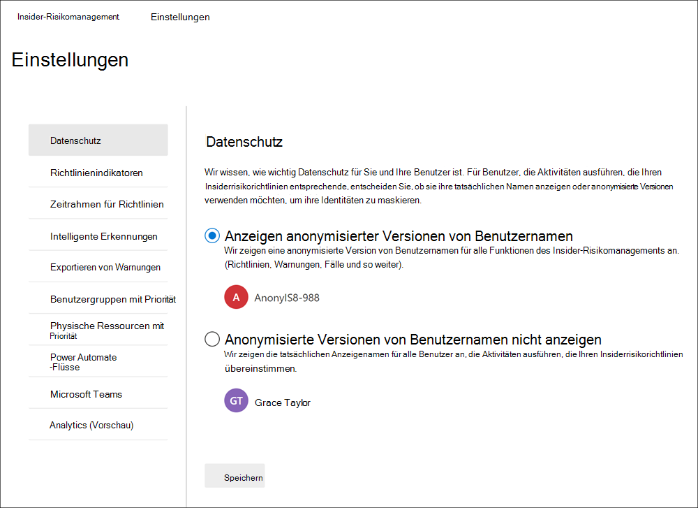
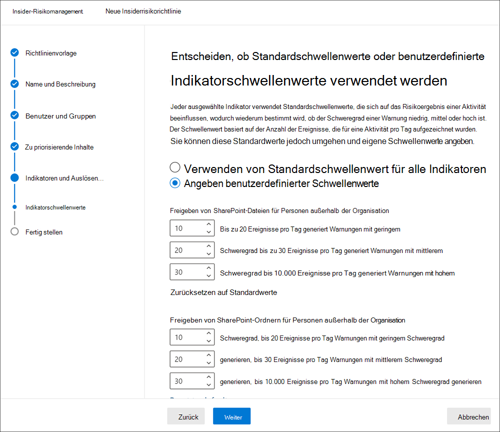
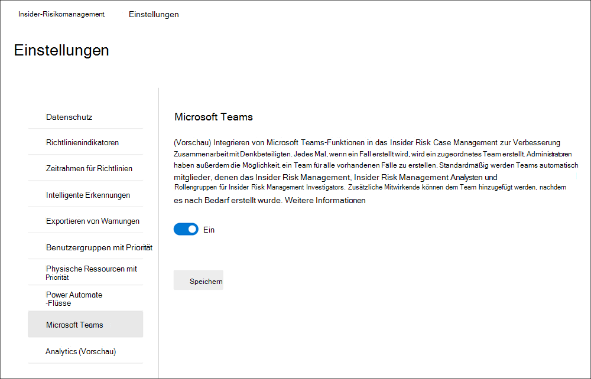
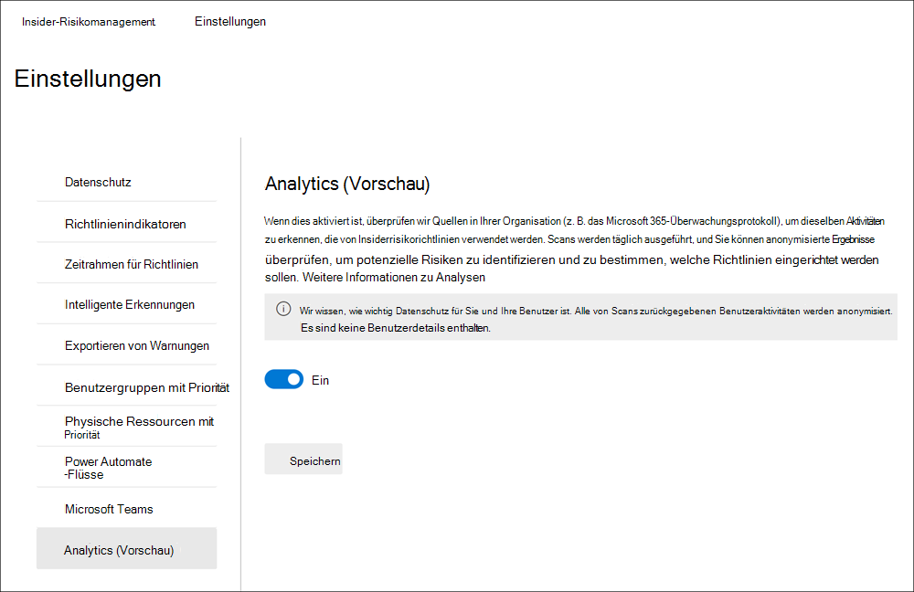
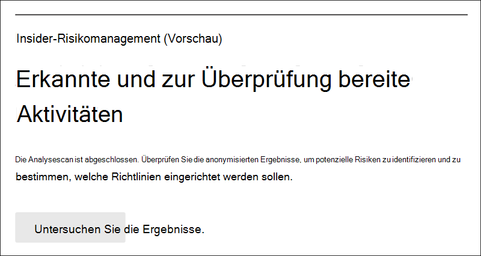

# Erste Schritte mit Insider-RisikomanagementeinstellungenGet started with insider risk management settings

Insider-Risikomanagementeinstellungen gelten für alle Richtlinien für das Insiderrisikomanagement, unabhängig von der Vorlage, die Sie beim Erstellen einer Richtlinie auswählen.Insider risk management settings apply to all insider risk management policies, regardless of the template you choose when creating a policy. Die Einstellungen werden über das Steuerelement **Insider-Risiko-Einstellungen** konfiguriert, das sich oben auf allen Registerkarten des Insider-Risikomanagements befindet.Settings are configured using the **Insider risk settings** control located at the top of all insider risk management tabs. Diese Einstellungen steuern Richtlinienkomponenten für die folgenden Bereiche:These settings control policy components for the following areas:

- DatenschutzPrivacy
- IndikatorenIndicators
- RichtlinienzeitachsenPolicy timelines
- Intelligente ErkennungenIntelligent detections
- Exportieren von Warnungen (Vorschau)Export alerts (preview)
- Prioritätsbenutzergruppen (Vorschau)Priority user groups (preview)
- Physische Ressourcen mit Priorität (Vorschau)Priority physical assets (preview)
- Power Automate (Vorschau)Power Automate flows (preview)
- Microsoft Teams (Vorschau)Microsoft Teams (preview)
- Analytics (Vorschau)Analytics (preview)

Bevor Sie beginnen und Richtlinien für das Insiderrisikomanagement erstellen, ist es wichtig, diese Einstellungen zu verstehen und die Einstellungsebenen für die Complianceanforderungen für Ihre Organisation am besten zu wählen.Before you get started and create insider risk management policies, it's important to understand these settings and choose setting levels best for the compliance needs for your organization.

## DatenschutzPrivacy

Der Schutz der Privatsphäre von Benutzern, die über Richtlinienübereinstimmungen verfügen, ist wichtig und kann zur Förderung der Objektivität bei der Überprüfung von Daten und Analysen im Hinblick auf Insider-Risikowarnungen beitragen.Protecting the privacy of users that have policy matches is important and can help promote objectivity in data investigation and analysis reviews for insider risk alerts. Für Benutzer mit einer Übereinstimmung mit einer Insiderrisikorichtlinie können Sie eine der folgenden Einstellungen auswählen:For users with an insider risk policy match, you can choose one of the following settings:

- **Anonymisierte Versionen** von Benutzernamen anzeigen: Die Namen der Benutzer werden anonymisiert, um zu verhindern, dass Administratoren, Datenermittler und Prüfer sehen, wer Richtlinienwarnungen zugeordnet ist.**Show anonymized versions of usernames**: Names of users are anonymized to prevent admins, data investigators, and reviewers from seeing who is associated with policy alerts. Zum Beispiel würde ein Benutzer "Grace Taylor" mit einem randomisierten Pseudonym wie "AnonIS8-988" in allen Bereichen des Insider-Risikomanagements erscheinen.For example, a user 'Grace Taylor' would appear with a randomized pseudonym such as 'AnonIS8-988' in all areas of the insider risk management experience. Wenn Sie diese Einstellung wählen, werden alle Benutzer mit aktuellen und früheren Richtlinienübereinstimmungen anonymisiert und gelten für alle Richtlinien.Choosing this setting anonymizes all users with current and past policy matches and applies to all policies. Benutzerprofilinformationen in der Warnung für Insiderrisiken und Falldetails stehen bei Auswahl dieser Option nicht zur Verfügung.User profile information in the insider risk alert and case details will not be available when this option is chosen. Benutzernamen werden jedoch beim Hinzufügen neuer Benutzer zu vorhandenen Richtlinien oder beim Zuweisen von Benutzern zu neuen Richtlinien angezeigt.However, usernames are displayed when adding new users to existing policies or when assigning users to new policies. Wenn Sie diese Einstellung deaktivieren, werden Benutzernamen für alle Benutzer mit aktuellen oder früheren Richtlinien übereinstimmungen angezeigt.If you choose to turn off this setting, usernames will be displayed for all users that have current or past policy matches.
- **Anonymisierte Versionen von Benutzernamen** nicht anzeigen: Benutzernamen werden für alle aktuellen und vergangenen Richtlinien übereinstimmungen für Warnungen und Fälle angezeigt.**Do not show anonymized versions of usernames**: Usernames are displayed for all current and past policy matches for alerts and cases. Benutzerprofilinformationen (Name, Titel, Alias sowie Organisation oder Abteilung) werden für den Benutzer für alle Insider-Risikomanagementwarnungen und -fälle angezeigt.User profile information (the name, title, alias, and organization or department) is displayed for the user for all insider risk management alerts and cases.

## IndikatorenIndicators

Vorlagen für Insiderrisikorichtlinien definieren die Art von Risikoaktivitäten, die Sie erkennen und untersuchen möchten.Insider risk policy templates define the type of risk activities that you want to detect and investigate. Jede Richtlinienvorlage basiert auf bestimmten Indikatoren, die bestimmten Triggern und Risikoaktivitäten entsprechen.Each policy template is based on specific indicators that correspond to specific triggers and risk activities. Alle Indikatoren sind standardmäßig deaktiviert, und Sie müssen einen oder mehrere Richtlinienindikatoren auswählen, bevor Sie eine Insider-Risikomanagementrichtlinie konfigurieren.All indicators are disabled by default, and you must select one or more policy indicators before configuring an insider risk management policy.

Warnungen werden durch Richtlinien ausgelöst, wenn Benutzer Aktivitäten im Zusammenhang mit Richtlinienindikatoren ausführen, die einen erforderlichen Schwellenwert erfüllen.Alerts are triggered by policies when users perform activities related to policy indicators that meet a required threshold. Das Risikomanagement von Insidern verwendet zwei Arten von Indikatoren:Insider risk management uses two types of indicators:

- **Auslösen von Ereignissen:** Ereignisse, die bestimmen, ob ein Benutzer in einer Insider-Risikomanagementrichtlinie aktiv ist.**Triggering events**: Events that determine if a user is active in an insider risk management policy. Wenn ein Benutzer einer Insider-Risikomanagementrichtlinie hinzugefügt wird, verfügt er nicht über ein auslösendes Ereignis, die Benutzeraktivität wird von der Richtlinie nicht ausgewertet.If a user is added to an insider risk management policy does not have a triggering event, the user activity is not evaluated by the policy. Beispielsweise wird Benutzer A einer Richtlinie hinzugefügt, die aus dem Datendiebstahl durch ausgehende Benutzerrichtlinienvorlage erstellt wurde, und die Richtlinie und der Microsoft 365 hr connector sind ordnungsgemäß konfiguriert. For example, User A is added to a policy created from the *Data theft by departing users* policy template and the policy and Microsoft 365 HR connector are properly configured. Solange Benutzer A nicht über ein vom Personalconnector gemeldetes Beendigungsdatum verfügt, werden Benutzer-A-Aktivitäten nicht von dieser Insider-Risikomanagementrichtlinie auf Risiken ausgewertet.Until User A has a termination date reported by the HR connector, User A activities aren't evaluated by this insider risk management policy for risk. Ein weiteres Beispiel für ein auslösendes  Ereignis ist, wenn ein Benutzer eine DLP-Richtlinienwarnung mit hohem Schweregrad hat, wenn *datenlecks-Richtlinien verwendet* werden.Another example of a triggering event is if a user has a *High* severity DLP policy alert when using *Data leaks* policies.
- **Richtlinienindikatoren:** Indikatoren, die in Insider-Risikomanagementrichtlinien enthalten sind, mit deren Rahmen ein Risikobewertungsergebnis für einen Benutzer in einem Bereich bestimmt wird.**Policy indicators**: Indicators included in insider risk management policies used to determine a risk score for an in-scope user. Diese Richtlinienindikatoren werden nur aktiviert, nachdem ein auslösendes Ereignis für einen Benutzer auftritt.These policy indicators are only activated after a triggering event occurs for a user. Einige Beispiele für Richtlinienindikatoren sind, wenn ein Benutzer Daten in persönliche Cloudspeicherdienste oder tragbare Speichergeräte kopiert, wenn ein Benutzerkonto aus Azure Active Directory entfernt wird oder wenn ein Benutzer interne Dateien und Ordner für nicht autorisierte externe Parteien freigegeben hat.Some examples of policy indicators are when a user copies data to personal cloud storage services or portable storage devices, if a user account is removed from Azure Active Directory, or if a user shares internal files and folders with unauthorized external parties.

Richtlinienindikatoren sind in die folgenden Bereiche segmentiert.Policy indicators are segmented into the following areas. Sie können die Indikatoren zum Aktivieren und Anpassen von Indikatorereignisgrenzwerte für jede Indikatorstufe beim Erstellen einer Insiderrisikorichtlinie auswählen:You can choose the indicators to activate and customize indicator event limits for each indicator level when creating an insider risk policy:

- **Office:** Dazu gehören Richtlinienindikatoren für websites SharePoint, Microsoft Teams und E-Mail-Nachrichten.**Office indicators**: These include policy indicators for SharePoint sites, Microsoft Teams, and email messaging.
- **Geräteindikatoren:** Dazu gehören Richtlinienindikatoren für Aktivitäten wie das Freigeben von Dateien über das Netzwerk oder mit Geräten.**Device indicators**: These include policy indicators for activity such as sharing files over the network or with devices. Zu den Indikatoren gehören Aktivitäten Microsoft Office Dateien, .csv (durch Kommas getrennte Werte) und .pdf (portables Dokumentformat).Indicators include activities involving Microsoft Office files, .csv (comma-separated values) files, and .pdf (portable document format) files. Wenn Sie Geräteindikatoren **auswählen,** wird die Aktivität nur für Geräte mit Windows 10 Build 1809 oder höher verarbeitet, und Sie müssen zuerst Geräte in das Compliance Center integrieren.If you select **Device indicators**, activity is processed only for devices with Windows 10 Build 1809 or higher and you must first onboard devices to the compliance center. Weitere Informationen zum Konfigurieren von Geräten für die  Integration mit Insiderrisiken finden Sie im abschnitt Aktivieren von Geräteindikatoren und onboard-Geräten in diesem Artikel.For more information on configuring devices for integration with insider risk, see the following [Enable device indicators and onboard devices](insider-risk-management-settings.md#OnboardDevices) section in this article.
- **Sicherheitsrichtlinienverletzungsindikator (Vorschau):** Dazu gehören Indikatoren von Microsoft Defender for Endpoint im Zusammenhang mit nicht genehmigter oder bösartiger Softwareinstallation oder Umgehen von Sicherheitssteuerelementen.**Security policy violation indicator (preview)**: These include indicators from Microsoft Defender for Endpoint related to unapproved or malicious software installation or bypassing security controls. Um Benachrichtigungen im Insider risk management zu erhalten, müssen Sie eine aktive Defender for Endpoint-Lizenz und die Integration von Insiderrisiken aktiviert haben.To receive alerts in insider risk management, you must have an active Defender for Endpoint license and insider risk integration enabled. Weitere Informationen zum Konfigurieren von Defender for Endpoint für insider risk management integration finden Sie unter [Configure advanced features in Microsoft Defender for Endpoint](/windows/security/threat-protection/microsoft-defender-atp/advanced-features\#share-endpoint-alerts-with-microsoft-compliance-center).For more information on configuring Defender for Endpoint for insider risk management integration, see [Configure advanced features in Microsoft Defender for Endpoint](/windows/security/threat-protection/microsoft-defender-atp/advanced-features\#share-endpoint-alerts-with-microsoft-compliance-center).
- **Indikatoren für den physischen Zugriff (Vorschau):** Dazu gehören Richtlinienindikatoren für den physischen Zugriff auf vertrauliche Ressourcen.**Physical access indicators (preview)**: These include policy indicators for physical access to sensitive assets. Beispielsweise kann versuchter Zugriff auf einen eingeschränkten Bereich in Ihren Systemprotokollen für physische Risikomanagementrichtlinien für Insider freigegeben werden.For example, attempted access to a restricted area in your physical badging system logs can be shared with insider risk management policies. Um diese Arten von Warnungen im Insider-Risikomanagement zu erhalten, müssen sie für das Insiderrisikomanagement und den [Connector](import-physical-badging-data.md) für physische Risikomanagementdaten konfiguriert sein.To receive these types of alerts in insider risk management, you must have priority physical assets enabled in insider risk management and the [Physical badging data connector](import-physical-badging-data.md) configured. Weitere Informationen zum Konfigurieren des physischen Zugriffs finden Sie im Abschnitt [Priority physical access](#priority-physical-assets-preview) in diesem Artikel.To learn more about configuring physical access, see the [Priority physical access section](#priority-physical-assets-preview) in this article.
- **Microsoft Cloud App Security (Vorschau):** Dazu gehören Richtlinienindikatoren aus freigegebenen Warnungen von Cloud App Security.**Microsoft Cloud App Security indicators (preview)**: These include policy indicators from shared alerts from Cloud App Security. Die automatisch aktivierte Anomalieerkennung in Cloud App Security beginnt sofort mit der Erkennung und Sortierung von Ergebnissen und zielt auf zahlreiche Verhaltensanomalien in Ihren Benutzern und den Computern und Geräten ab, die mit Ihrem Netzwerk verbunden sind.Automatically enabled anomaly detection in Cloud App Security immediately starts detecting and collating results, targeting numerous behavioral anomalies across your users and the machines and devices connected to your network. Wählen Sie in diesem Abschnitt einen oder mehrere Indikatoren aus, um diese Aktivitäten in Warnungen zu Insider-Risikomanagementrichtlinien zu enthalten.To include these activities in insider risk management policy alerts, select one or more indicators in this section. Weitere Informationen zur Cloud App Security und Anomalieerkennung finden Sie unter [Get behavioral analytics and anomaly detection](/cloud-app-security/anomaly-detection-policy).To learn more about Cloud App Security analytics and anomaly detection, see [Get behavioral analytics and anomaly detection](/cloud-app-security/anomaly-detection-policy).
- **Risk score boosts:** Dazu gehört die Erhöhung des Risikos für ungewöhnliche Aktivitäten oder frühere Richtlinienverstöße.**Risk score boosters**: These include raising the risk score for unusual activities or past policy violations. Das Aktivieren von Risikoscore-Verstärkungen erhöht die Risikoergebnisse und die Wahrscheinlichkeit von Warnungen für diese Arten von Aktivitäten.Enabling risk score boosters increases risk scores and the likelihood of alerts for these types of activities. Bei ungewöhnlichen Aktivitäten wird die Punktzahl erhöht, wenn die erkannte Aktivität vom typischen Verhalten des Benutzers abweicht.For unusual activities, scores are boosted if the detected activity deviates from the user's typical behavior. Beispielsweise eine erhebliche Zunahme der täglichen Dateidownloads.For example, a significant increase in daily file downloads. Ungewöhnliche Aktivität wird als Prozentualer Anstieg (z. B. "100 % über der üblichen Aktivität") dargestellt und wirkt sich je nach Aktivität unterschiedlich auf die Risikosentwertung aus.Unusual activity is presented as an increase in percentage (for example, '100% above usual activity') and will impact the risk score differently depending on the activity. Bei Benutzern mit vorherigen Richtlinienverstößen werden die Bewertungen erhöht, wenn ein Benutzer zuvor mehrere Fälle als bestätigten Richtlinienverstoß aufgelöst hat.For users with previous policy violations, scores are boosted if a user had more than one case previously resolved as a confirmed policy violation. Risikoergebnis-Verstärkungen können nur ausgewählt werden, wenn ein oder mehrere Indikatoren ausgewählt sind.Risk score boosters can only be selected if one or more indicators are selected.

In einigen Fällen können Sie die Richtlinienindikatoren für Insiderrisiken einschränken, die auf Insiderrisikorichtlinien in Ihrer Organisation angewendet werden.In some cases, you may want to limit the insider risk policy indicators that are applied to insider risk policies in your organization. Sie können die Richtlinienindikatoren für bestimmte Bereiche deaktivieren, indem Sie sie von allen Richtlinien für Insiderrisiken deaktivieren.You can turn off the policy indicators for specific areas by disabling them from all insider risk policies. Auslösen von Ereignissen kann für Richtlinienvorlagen für Insiderrisiken nicht geändert werden.Triggering events cannot be modified for insider risk policy templates.

Um die Insiderrisikorichtlinienindikatoren zu definieren, die in allen Insiderrisikorichtlinien aktiviert sind, navigieren Sie zu Insider-Risikoeinstellungen Indikatoren, und wählen Sie einen oder mehrere  >   Richtlinienindikatoren aus.To define the insider risk policy indicators that are enabled in all insider risk policies, navigate to **Insider risk settings** > **Indicators** and select one or more policy indicators. Die auf der Seite Indikatoreneinstellungen ausgewählten Indikatoren können beim Erstellen oder Bearbeiten einer Insiderrisikorichtlinie im Richtlinien-Assistenten nicht einzeln konfiguriert werden.The indicators selected on the Indicators settings page cannot be individually configured when creating or editing an insider risk policy in the policy wizard.

>[!NOTE]
>Es kann mehrere Stunden dauern, bis neue manuell hinzugefügte Benutzer im Benutzerdashboard **angezeigt werden.**It may take several hours for new manually-added users to appear in the **Users dashboard**. Die Anzeige von Aktivitäten für die vorherigen 90 Tage für diese Benutzer kann bis zu 24 Stunden dauern.Activities for the previous 90 days for these users may take up to 24 hours to display. Um Aktivitäten für manuell hinzugefügte Benutzer anzuzeigen, wählen  Sie den Benutzer im Dashboard Benutzer **aus,** und öffnen Sie die Registerkarte Benutzeraktivität im Detailbereich.To view activities for manually added users, select the user on the **Users dashboard** and open the **User activity** tab on the details pane.

### Aktivieren von Geräteindikatoren und integrierten GerätenEnable device indicators and onboard devices

Um die Überwachung von Risikoaktivitäten auf Geräten zu ermöglichen und Richtlinienindikatoren für diese Aktivitäten zu verwenden, müssen Ihre Geräte die folgenden Anforderungen erfüllen, und Sie müssen die folgenden Onboardingschritte ausführen.To enable the monitoring of risk activities on devices and include policy indicators for these activities, your devices must meet the following requirements and you must complete the following onboarding steps.

#### Schritt 1: Vorbereiten der EndpunkteStep 1: Prepare your endpoints

Stellen Sie sicher, dass Windows 10 Geräte, die Sie für die Berichterstellung im Insider risk management planen, diese Anforderungen erfüllen.Make sure that the Windows 10 devices that you plan on reporting in insider risk management meet these requirements.

1. Muss Windows 10 x64 Build 1809 oder höher ausgeführt werden und muss das [Windows 10-Update (Os Build 17763.1075)](https://support.microsoft.com/help/4537818/windows-10-update-kb4537818) vom 20. Februar 2020 installiert haben.Must be running Windows 10 x64 build 1809 or later and must have installed the [Windows 10 update (OS Build 17763.1075)](https://support.microsoft.com/help/4537818/windows-10-update-kb4537818) from February 20, 2020.
2. Das Benutzerkonto, das zum Anmelden beim Windows 10 verwendet wird, muss ein aktives Azure Active Directory (AAD) sein.The user account used to log into the Windows 10 device must be an active Azure Active Directory (AAD) account. Das Windows 10 kann [AAD,](/azure/active-directory/devices/concept-azure-ad-join)Hybrid-AAD oder Active Directory- oder AAD-registriert sein.The Windows 10 device may be [AAD](/azure/active-directory/devices/concept-azure-ad-join), hybrid AAD, or Active Directory joined, or AAD registered.
3. Installieren Sie Microsoft Chromium Edgebrowser auf dem Endpunktgerät, um Aktionen für die Clouduploadaktivität zu überwachen.Install Microsoft Chromium Edge browser on the endpoint device to monitor actions for the cloud upload activity. Weitere Informationen finden Sie unter [Herunterladen des auf Chromium basierenden neuen Microsoft Edge](https://support.microsoft.com/help/4501095/download-the-new-microsoft-edge-based-on-chromium).See, [Download the new Microsoft Edge based on Chromium](https://support.microsoft.com/help/4501095/download-the-new-microsoft-edge-based-on-chromium).

#### Schritt 2: Onboarding von GerätenStep 2: Onboarding devices

Sie müssen die Geräteüberwachung aktivieren und Ihre Endpunkte integrieren, bevor Sie Insider-Risikomanagementaktivitäten auf einem Gerät überwachen können.You must enable device monitoring and onboard your endpoints before you can monitor for insider risk management activities on a device. Beide Aktionen werden im Microsoft 365-Compliance-Portal ergriffen.Both actions are taken in the Microsoft 365 Compliance portal.

Wenn Sie Geräte integrieren möchten, die noch nicht onboarded wurden, laden Sie das entsprechende Skript herunter und stellen es wie in den folgenden Schritten beschrieben bereit.When you want to onboard devices that haven't been onboarded yet, you'll download the appropriate script and deploy as outlined in the following steps.

Wenn bereits Geräte in [Microsoft Defender für Endpunkt](/windows/security/threat-protection/) eingebunden sind, werden sie in der Liste der verwalteten Geräte angezeigt.If you already have devices onboarded into [Microsoft Defender for Endpoint](/windows/security/threat-protection/), they will already appear in the managed devices list. Folgen [Sie Schritt 3: Wenn Geräte](insider-risk-management-settings.md#OnboardStep3) in Microsoft Defender for Endpoint im nächsten Abschnitt onboardiert sind.Follow [Step 3: If you have devices onboarded into Microsoft Defender for Endpoint](insider-risk-management-settings.md#OnboardStep3) in the next section.

In diesem Bereitstellungsszenario integrieren Sie Geräte, die noch nicht onboarded wurden, und Sie möchten nur Insiderrisikoaktivitäten auf Windows 10 überwachen.In this deployment scenario, you'll onboard devices that have not been onboarded yet, and you just want to monitor insider risk activities on Windows 10 devices.

1. Öffnen Sie das [Microsoft Compliance Center](https://compliance.microsoft.com).Open the [Microsoft compliance center](https://compliance.microsoft.com).
2. Öffnen Sie die Seite "Einstellungen", und wählen Sie **Geräte-Onboarding** aus.Open the Compliance Center settings page and choose **Onboard devices**.

   > [!NOTE]
   > In der Regel dauert es zwar nur ungefähr eine Minute, bis das Geräte-Onboarding aktiviert ist, warten Sie aber mindestens 30 Minuten, bevor Sie sich an den Microsoft-Support wenden.While it usually takes about 60 seconds for device onboarding to be enabled, please allow up to 30 minutes before engaging with Microsoft support.

3. Wählen Sie **Geräteverwaltung** aus, um die Liste der **Geräte** zu öffnen.Choose **Device management** to open the **Devices** list. Die Liste ist leer, solange keine Geräte eingebunden sind.The list will be empty until you onboard devices.
4. Wählen Sie **Onboarding** aus, um mit dem Onboarding-Prozess zu beginnen.Choose **Onboarding** to begin the onboarding process.
5. Wählen Sie in der Liste Bereitstellungsmethode  die Art und Weise aus, die Sie auf diesen weiteren Geräten bereitstellen möchten, und laden Sie **dann das Paket herunter.**Choose the way you want to deploy to these more devices from the **Deployment method** list and then **download package**.
6. Führen Sie die unter [Onboarding-Tools und -Methoden für Windows 10-Computer](/windows/security/threat-protection/microsoft-defender-atp/configure-endpoints) beschriebenen entsprechenden Verfahren aus.Follow the appropriate procedures in [Onboarding tools and methods for Windows 10 machines](/windows/security/threat-protection/microsoft-defender-atp/configure-endpoints). Über diesen Link gelangen Sie zu einer Zielseite, auf der Microsoft Defender für Endpunkt-Prozeduren beschrieben werden, die dem in Schritt 5 ausgewählten Bereitstellungspaket entsprechen:This link takes you to a landing page where you can access Microsoft Defender for Endpoint procedures that match the deployment package you selected in step 5:
    - Onboarding von Windows 10-Computern mithilfe von GruppenrichtlinienOnboard Windows 10 machines using Group Policy
    - Onboarding von Windows-Computern mithilfe von Microsoft Endpoint Configuration ManagerOnboard Windows machines using Microsoft Endpoint Configuration Manager
    - Onboarding von Windows 10-Computern mit Tools für die Verwaltung von MobilgerätenOnboard Windows 10 machines using Mobile Device Management tools
    - Onboarding von Windows 10-Computern mithilfe eines lokalen SkriptsOnboard Windows 10 machines using a local script
    - Onboarding von nicht-persistenten Computern einer VD-Infrastruktur (Virtual Desktop)Onboard non-persistent virtual desktop infrastructure (VDI) machines.

Sobald der Endpunkt fertig ist und der Endpunkt onboardiert ist, sollte er in der Geräteliste angezeigt werden, und der Endpunkt beginnt, Überwachungsprotokolle an das Insiderrisikomanagement zu melden.Once done and endpoint is onboarded, it should be visible in the devices list and the endpoint will start reporting audit activity logs to insider risk management.

> [!NOTE]
> Diese Funktion erfordert eine Lizenz.This experience is under license enforcement. Ohne die erforderliche Lizenz werden keine Daten angezeigt und es ist kein Zugriff auf sie möglich.Without the required license, data will not be visible or accessible.

#### Schritt 3: Wenn Geräte in Microsoft Defender for Endpoint onboarded sindStep 3: If you have devices onboarded into Microsoft Defender for Endpoint

Wenn Microsoft Defender for Endpoint bereits bereitgestellt ist und Endpunktberichte vorhanden sind, werden alle diese Endpunkte in der Liste verwalteter Geräte angezeigt.If Microsoft Defender for Endpoint is already deployed and there are endpoints reporting in, all these endpoints will appear in the managed devices list. Sie können weiterhin neue Geräte in das Insider-Risikomanagement integrieren, um die Abdeckung mithilfe des Abschnitts [Schritt 2: Onboarding von Geräten zu](insider-risk-management-settings.md#OnboardStep2) erweitern.You can continue to onboard new devices into insider risk management to expand coverage by using the [Step 2: Onboarding devices](insider-risk-management-settings.md#OnboardStep2) section.

1. Öffnen Sie das [Microsoft Compliance Center](https://compliance.microsoft.com).Open the [Microsoft compliance center](https://compliance.microsoft.com).
2. Öffnen Sie die Seite "Einstellungen", und wählen Sie **Geräteüberwachung aktivieren** aus.Open the Compliance Center settings page and choose **Enable device monitoring**.
3. Wählen Sie **Geräteverwaltung** aus, um die Liste der **Geräte** zu öffnen.Choose **Device management** to open the **Devices** list. Die Liste der Geräte, die bereits bei Microsoft Defender for Endpoint melden, sollte angezeigt werden.You should see the list of devices that are already reporting into Microsoft Defender for Endpoint.
4. Wählen **Sie Onboarding** aus, wenn Sie weitere Geräte integrieren müssen.Choose **Onboarding** if you need to onboard more devices.
5. Wählen Sie in der Liste Bereitstellungsmethode  die Art und Weise aus, die Sie auf diesen weiteren Geräten bereitstellen möchten, und laden Sie **dann das Paket herunter.**Choose the way you want to deploy to these more devices from the **Deployment method** list and then **Download package**.
6. Führen Sie die unter [Onboarding-Tools und -Methoden für Windows 10-Computer](/windows/security/threat-protection/microsoft-defender-atp/configure-endpoints) beschriebenen entsprechenden Verfahren aus.Follow the appropriate procedures in [Onboarding tools and methods for Windows 10 machines](/windows/security/threat-protection/microsoft-defender-atp/configure-endpoints). Über diesen Link gelangen Sie zu einer Zielseite, auf der Microsoft Defender für Endpunkt-Prozeduren beschrieben werden, die dem in Schritt 5 ausgewählten Bereitstellungspaket entsprechen:This link takes you to a landing page where you can access Microsoft Defender for Endpoint procedures that match the deployment package you selected in step 5:
    - Onboarding von Windows 10-Computern mithilfe von GruppenrichtlinienOnboard Windows 10 machines using Group Policy
    - Onboarding von Windows-Computern mithilfe von Microsoft Endpoint Configuration ManagerOnboard Windows machines using Microsoft Endpoint Configuration Manager
    - Onboarding von Windows 10-Computern mit Tools für die Verwaltung von MobilgerätenOnboard Windows 10 machines using Mobile Device Management tools
    - Onboarding von Windows 10-Computern mithilfe eines lokalen SkriptsOnboard Windows 10 machines using a local script
    - Onboarding von nicht-persistenten Computern einer VD-Infrastruktur (Virtual Desktop)Onboard non-persistent virtual desktop infrastructure (VDI) machines.

Sobald der Endpunkt fertig ist und der  Endpunkt onboardiert ist, sollte er unter der Tabelle Geräte angezeigt werden, und der Endpunkt beginnt, Überwachungsprotokolle an das Insiderrisikomanagement zu melden.Once done and endpoint is onboarded, it should be visible under the **Devices** table and the endpoint will start reporting audit activity logs to insider risk management.

> [!NOTE]
>Diese Funktion erfordert eine Lizenz.This experience is under license enforcement. Ohne die erforderliche Lizenz werden keine Daten angezeigt und es ist kein Zugriff auf sie möglich.Without the required license, data will not be visible or accessible.

### Einstellungen auf Indikatorebene (Vorschau)Indicator level settings (preview)

Beim Erstellen einer Richtlinie im Richtlinien-Assistenten können Sie konfigurieren, wie die tägliche Anzahl von Risikoereignissen die Risikobewertung für Insiderrisikowarnungen beeinflussen soll.When creating a policy in the policy wizard, you can configure how the daily number of risk events should influence the risk score for insider risk alerts. Mit diesen Indikatoreinstellungen können Sie steuern, wie sich die Anzahl der Vorkommen von Risikoereignissen in Ihrer Organisation auf die Risikobewertung und damit den zugehörigen Warnungsschweregrad für diese Ereignisse auswirken soll.These indicator settings help you control how the number of occurrences of risk events in your organization should affect the risk score, and so the associated alert severity, for these events. Wenn es Ihnen lieber ist, können Sie auch festlegen, dass die von Microsoft empfohlenen Standardereignisschwellenwerte für alle aktivierten Indikatoren erhalten bleiben.If you prefer, you can also choose to keep the default event threshold levels recommended by Microsoft for all enabled indicators.

Sie entscheiden beispielsweise, SharePoint in den Insiderrisikorichtlinieneinstellungen zu aktivieren und benutzerdefinierte Schwellenwerte für SharePoint-Ereignisse beim Konfigurieren  von Indikatoren für eine neue Richtlinie für Insiderrisikodatenlecks zu konfigurieren.For example, you decide to enable SharePoint indicators in the insider risk policy settings and to set custom thresholds for SharePoint events when configuring indicators for a new insider risk *Data leaks* policy. Während Sie im Assistenten für Insiderrisikorichtlinien drei unterschiedliche tägliche Ereignisstufen für jeden SharePoint-Indikator konfigurieren, um die Risikobewertung für Warnungen im Zusammenhang mit diesen Ereignissen zu beeinflussen.While in the insider risk policy wizard, you configure three different daily event levels for each SharePoint indicator to influence the risk score for alerts associated with these events.

Für die erste tägliche Ereignisebene legen Sie den Schwellenwert auf *10* oder mehr Ereignisse pro Tag fest, um eine niedrigere Auswirkung auf die Risikopunktzahl für die Ereignisse, *20* oder mehr Ereignisse pro Tag für eine mittlere Auswirkung auf das Risikoergebnis für die Ereignisse und *30* oder mehr Ereignisse pro Tag eine höhere Auswirkung auf die Risikopunktzahl für die Ereignisse zu erzielen.For the first daily event level, you set the threshold at *10 or more events per day* for a lower impact to the risk score for the events, *20 or more events per day* for a medium impact to the risk score for the events, and *30 or more events per day* a higher impact to the risk score for the events. Diese Einstellungen bedeuten effektiv:These settings effectively mean:

- Wenn nach dem Auslösen des Ereignisses 1 bis 9 SharePoint ereignisse stattfinden, werden die Risikobewertungen minimal betroffen und würden in der Regel keine Warnung generieren.If there are 1-9 SharePoint events that take place after triggering event, risk scores are minimally impacted and would tend not to generate an alert.
- Wenn 10 bis 19 SharePoint Ereignisse nach einem auslösenden Ereignis stattfinden, ist die Risikopunktzahl grundsätzlich niedriger, und der Schweregrad der Warnung würde sich in der Regel auf einem niedrigen Niveau befinden.If there are 10-19  SharePoint events that take place after a triggering event, the risk score is inherently lower and alert severity levels would tend to be at a low level.
- Wenn nach einem Auslösen 20 bis 29 SharePoint ereignisse stattfinden, ist die Risikosentwertung grundsätzlich höher, und der Schweregrad der Warnung würde sich in der Regel auf mittlerer Ebene befinden.If there are 20-29 SharePoint events that take place after a triggering, the risk score is inherently higher and alert severity levels would tend to be at a medium level.
- Wenn nach einem Auslösen 30 oder mehr SharePoint ereignisse stattfinden, ist die Risikosentwertung grundsätzlich höher, und der Schweregrad der Warnung würde sich in der Regel auf einem hohen Niveau befinden.If there are 30 or more SharePoint events that take place after a triggering, the risk score is inherently higher and alert severity levels would tend to be at a high level.

## Zeitrahmen für RichtlinienPolicy timeframes

Mit Hilfe von Zeitrahmen für Richtlinien können Sie vergangene und zukünftige Überprüfungszeiträume definieren, die nach Richtlinienübereinstimmungen auf der Grundlage von Ereignissen und Aktivitäten für die Richtlinienvorlagen zum Insider-Risikomanagement ausgelöst werden.Policy timeframes allow you to define past and future review periods that are triggered after policy matches based on events and activities for the insider risk management policy templates. Abhängig von der von Ihnen verwendeten Richtlinienvorlage stehen die folgenden Richtlinien zeitrahmen zur Verfügung:Depending on the policy template you choose, the following policy timeframes are available:

- **Aktivierungsfenster**: Für alle  Richtlinienvorlagen verfügbar, ist das **Aktivierungsfenster** die definierte Anzahl von Tagen, die das Fenster nach einem auslösenden Ereignis aktiviert.**Activation window**: Available for all policy templates, the *Activation window* is the defined number of days that the window activates **after** a triggering event. Das Fenster wird 1 bis 30 Tage nach dem Auslösen eines Ereignisses für alle Benutzer aktiviert, die der Richtlinie zugewiesen sind.The window activates for 1 to 30 days after a triggering event occurs for any user assigned to the policy. Sie haben z. B. eine Insider-Risikomanagementrichtlinie konfiguriert und das *Aktivierungsfenster* auf 30 Tage festgelegt.For example, you've configured an insider risk management policy and set the *Activation window* to 30 days. Seit der Konfiguration der Richtlinie sind mehrere Monate vergangen, und für einen der in der Richtlinie enthaltenen Benutzer tritt ein auslösendes Ereignis auf.Several months have passed since you configured the policy, and a triggering event occurs for one of the users included in the policy. Das auslösende Ereignis  aktiviert das Aktivierungsfenster, und die Richtlinie ist für diesen Benutzer 30 Tage nach dem Auslösen des Ereignisses aktiv.The triggering event activates the *Activation window* and the policy is active for that user for 30 days after the triggering event occurred.
- **Erkennung vergangener** Aktivitäten: Für alle  Richtlinienvorlagen verfügbar, ist die Erkennung der  letzten Aktivität die definierte Anzahl von Tagen, die das Fenster vor einem auslösenden Ereignis aktiviert.**Past activity detection**: Available for all policy templates, the *Past activity detection* is the defined number of days that the window activates **before** a triggering event. Das Fenster wird für 0 bis 180 Tage aktiviert, bevor für jeden Benutzer, der der Richtlinie zugewiesen ist, ein auslösendes Ereignis auftritt.The window activates for 0 to 180 days before a triggering event occurs for any user assigned to the policy. Sie haben z. B. eine Insider-Risikomanagementrichtlinie konfiguriert und die Erkennung vergangener Aktivitäten *auf* 90 Tage festgelegt.For example, you've configured an insider risk management policy and set the *Past activity detection* to 90 days. Seit der Konfiguration der Richtlinie sind mehrere Monate vergangen, und für einen der in der Richtlinie enthaltenen Benutzer tritt ein auslösendes Ereignis auf.Several months have passed since you configured the policy, and a triggering event occurs for one of the users included in the policy. Das auslösende Ereignis  aktiviert die Erkennung vergangener Aktivitäten, und die Richtlinie sammelt historische Aktivitäten für diesen Benutzer 90 Tage vor dem auslösenden Ereignis.The triggering event activates the *Past activity detection* and the policy gathers historic activities for that user for 90 days prior to the triggering event.

## Intelligente ErkennungenIntelligent detections

Intelligente Erkennungseinstellungen helfen, die Verarbeitung riskanter Aktivitäten für Warnungen zu verfeinern.Intelligent detection settings help refine how the detections of risky activities are processed for alerts. Unter bestimmten Umständen müssen Sie möglicherweise zu ignorierende Dateitypen definieren oder eine Erkennungsstufe für Dateien erzwingen, um eine Mindestleiste für Warnungen zu definieren.In certain circumstances, you may need to define file types to ignore, or you want to enforce a detection level for files to help define a minimum bar for alerts. Verwenden Sie diese Einstellungen, um das allgemeine Warnungsvolumen, Dateitypausschlüsse und Dateivolumegrenzwerte zu steuern.Use these settings to control overall alert volume, file type exclusions, and file volume limits.

### DateitypausschlüsseFile type exclusions

Geben Sie Dateityperweiterungen durch Kommas getrennt ein, um bestimmte Dateitypen von allen Übereinstimmungen mit Insider-Risikomanagementrichtlinien auszuschließen.To exclude specific file types from all insider risk management policy matching, enter file type extensions separated by commas. Um beispielsweise bestimmte Arten von Musikdateien von den Richtlinienübereinstimmungen auszuschließen, können Sie AAC, MP3, WAV, WMA in das Feld **Dateityp-Ausschlüsse** eingeben.For example, to exclude certain types of music files from policy matches you may enter aac,mp3,wav,wma in the **File type exclusions** field. Dateien mit diesen Erweiterungen werden von allen Insider-Risikomanagementrichtlinien ignoriert.Files with these extensions will be ignored by all insider risk management policies.

### Schwellenwert für ungewöhnliche DateiaktivitätThreshold for unusual file activity

Geben Sie die Anzahl der Dateien ein, um eine Mindestdateiebene zu definieren, bevor Aktivitätswarnungen in Insiderrisikorichtlinien gemeldet werden.To define a minimum file level before activity alerts are reported in insider risk policies, enter the number of files. Beispielsweise würden Sie "10" eingeben, wenn Sie keine Insiderrisikowarnungen generieren möchten, wenn ein Benutzer 10 Dateien oder weniger herunterlädt, auch wenn die Richtlinien diese Aktivität als ungewöhnlich betrachten.For example, you would enter '10' if you do not want to generate insider risk alerts when a user downloads 10 files or less, even if the policies consider this activity as unusual.

### WarnungsvolumenAlert volume

Benutzeraktivitäten, die von Insiderrisikorichtlinien erkannt werden, erhalten eine bestimmte Risikobewertung, die wiederum den Warnungsschweregrad bestimmt (niedrig, mittel, hoch).User activities detected by insider risk policies are assigned a specific risk score, which in turn determines the alert severity (low, medium, high). Standardmäßig generieren wir eine bestimmte Menge von Warnungen mit niedrigem, mittlerem und hohem Schweregrad, aber Sie können das Volume entsprechend Ihren Anforderungen erhöhen oder verringern.By default, we'll generate a certain amount of low, medium, and high severity alerts, but you can increase or decrease the volume to suit your needs. Wählen Sie eine der folgenden Einstellungen aus, um das Volumen der Warnungen für alle Richtlinien für das Insiderrisikomanagement anzupassen:To adjust the volume of alerts for all insider risk management policies, choose one of the following settings:

- **Weniger Warnungen:** Es werden alle Warnungen mit hohem Schweregrad, weniger Warnungen mit mittlerem Schweregrad und keine Warnungen mit geringem Schweregrad angezeigt.**Fewer alerts**: You'll see all high severity alerts, fewer medium severity alerts, and no low severity ones. Diese Einstellungsstufe bedeutet, dass Sie möglicherweise einige echte Positives verpassen.This setting level means you might miss some true positives.
- **Standardvolume:** Es werden alle Warnungen mit hohem Schweregrad und eine ausgewogene Menge von Warnungen mit mittlerem und niedrigem Schweregrad angezeigt.**Default volume**: You'll see all high severity alerts and a balanced amount of medium and low severity alerts.
- **Weitere Warnungen:** Es werden alle Warnungen mit mittlerem und hohem Schweregrad und Warnungen mit dem größten Schweregrad angezeigt.**More alerts**: You'll see all medium and high severity alerts and most low severity alerts. Diese Einstellungsstufe kann zu weiteren falsch positiven Positiven führen.This setting level might result in more false positives.

### Microsoft Defender for Endpoint (Vorschau)Microsoft Defender for Endpoint (preview)

[Microsoft Defender for Endpoint](/windows/security/threat-protection/microsoft-defender-atp/microsoft-defender-advanced-threat-protection) ist eine Unternehmensendpunktsicherheitsplattform, die Unternehmensnetzwerken dabei helfen soll, erweiterte Bedrohungen zu verhindern, zu erkennen, zu untersuchen und auf sie zu reagieren.[Microsoft Defender for Endpoint](/windows/security/threat-protection/microsoft-defender-atp/microsoft-defender-advanced-threat-protection) is an enterprise endpoint security platform designed to help enterprise networks prevent, detect, investigate, and respond to advanced threats. Um eine bessere Sichtbarkeit von Sicherheitsverletzungen in Ihrer Organisation zu erhalten, können Sie Defender for Endpoint-Warnungen für Aktivitäten importieren und filtern, die in Richtlinien verwendet werden, die aus Richtlinienvorlagen für Sicherheitsverletzungen des Insiderrisikomanagements erstellt wurden.To have better visibility of security violations in your organization, you can import and filter Defender for Endpoint alerts for activities used in policies created from insider risk management security violation policy templates.

Je nachdem, welche Arten von Signalen Sie interessieren, können Sie Warnungen basierend auf dem Triagestatus der Defender for Endpoint-Warnung in das Insiderrisikomanagement importieren.Depending on the types of signals you are interested in, you can choose to import alerts to insider risk management based on the Defender for Endpoint alert triage status. Sie können einen oder mehrere der folgenden Warnungstriagestatus in den zu importierende globalen Einstellungen definieren:You can define one or more of the following alert triage statuses in the global settings to import:

- UnbekanntUnknown
- NeuNew
- In ArbeitIn progress
- GelöstResolved

Warnungen aus Defender for Endpoint werden täglich importiert.Alerts from Defender for Endpoint are imported daily. Je nach dem von Ihnen verwendeten Triagestatus werden möglicherweise mehrere Benutzeraktivitäten für dieselbe Warnung angezeigt, wie sich der Triagestatus in Defender for Endpoint ändert.Depending on the triage status you choose, you may see multiple user activities for the same alert as the triage status changes in Defender for Endpoint.

Wenn Sie beispielsweise Für diese Einstellung *Neu*, *In* Bearbeitung und *Aufgelöst* auswählen, wenn eine Microsoft Defender for Endpoint-Warnung generiert wird und der Status *Neu* ist, wird eine anfängliche Warnungsaktivität für den Benutzer im Insiderrisiko importiert.For example, if you select *New*, *In progress*, and *Resolved* for this setting, when a Microsoft Defender for Endpoint alert is generated and the status is *New*, an initial alert activity is imported for the user in insider risk. Wenn sich der Status der Defender for Endpoint-Triage *in In Bearbeitung* ändert, wird eine zweite Aktivität für diese Warnung für den Benutzer mit Insiderrisiko importiert.When the Defender for Endpoint triage status changes to *In progress*, a second activity for this alert is imported for the user in insider risk. Wenn der endgültige Defender for Endpoint-Triagestatus *Resolved* festgelegt ist, wird eine dritte Aktivität für diese Warnung für den Benutzer im Insiderrisiko importiert.When the final Defender for Endpoint triage status of *Resolved* is set, a third activity for this alert is imported for the user in insider risk. Mit dieser Funktion können Ermittler den Verlauf der Defender for Endpoint-Warnungen verfolgen und die Sichtbarkeitsstufe auswählen, die für ihre Untersuchung erforderlich ist.This functionality allows investigators to follow the progression of the Defender for Endpoint alerts and choose the level of visibility that their investigation requires.

>[!IMPORTANT]
>Sie müssen Microsoft Defender for Endpoint in Ihrer Organisation konfigurieren und Defender for Endpoint für insider risk management integration in das Defender Security Center aktivieren, um Sicherheitsverletzungswarnungen zu importieren.You'll need to have Microsoft Defender for Endpoint configured in your organization and enable Defender for Endpoint for insider risk management integration in the Defender Security Center to import security violation alerts. Weitere Informationen zum Konfigurieren von Defender for Endpoint für insider risk management integration finden Sie unter [Configure advanced features in Defender for Endpoint](/windows/security/threat-protection/microsoft-defender-atp/advanced-features\#share-endpoint-alerts-with-microsoft-compliance-center).For more information on configuring Defender for Endpoint for insider risk management integration, see [Configure advanced features in Defender for Endpoint](/windows/security/threat-protection/microsoft-defender-atp/advanced-features\#share-endpoint-alerts-with-microsoft-compliance-center).

### Domänen (Vorschau)Domains (preview)

Mithilfe von Domäneneinstellungen können Sie Risikostufen für Aktivitäten für bestimmte Domänen definieren.Domain settings help you define risk levels for activities to specific domains. Zu diesen Aktivitäten gehören das Freigeben von Dateien, das Senden von E-Mail-Nachrichten, das Herunterladen oder Hochladen von Inhalten.These activities include sharing files, sending email messages, downloading, or uploading content. Durch Angeben von Domänen in diesen Einstellungen können Sie die Risikobewertung für Aktivitäten erhöhen oder verringern, die mit diesen Domänen stattfinden.By specifying domains in these settings, you can increase or decrease the risk scoring for activity that takes place with these domains.

Verwenden Sie Domäne hinzufügen, um eine Domäne für jede der Domäneneinstellungen zu definieren.Use Add domain to define a domain for each of the domain settings. Darüber hinaus können Sie Platzhalter verwenden, um Abweichungen von Stammdomänen oder Unterdomänen zu entsprechen.Additionally, you can use wildcards to help match variations of root domains or subdomains. Um z. B. sales.wingtiptoys.com und support.wingtiptoys.com anzugeben, verwenden Sie den Platzhaltereintrag "\*.wingtiptoys.com", um mit diesen Unterdomänen (und jeder anderen Unterdomäne auf derselben Ebene) zu übereinstimmen.For example, to specify sales.wingtiptoys.com and support.wingtiptoys.com, you use the wildcard entry '\*.wingtiptoys.com' to match these subdomains (and any other subdomain at the same level). Zum Angeben von Unterdomänen auf mehreren Ebenen für  eine Stammdomäne müssen Sie das Kontrollkästchen Unterdomänen auf mehreren Ebenen hinzufügen aktivieren.To specify multi-level subdomains for a root domain, you must select the **Include Multi-Level Subdomains** checkbox.

Für jede der folgenden Domäneneinstellungen können Sie bis zu 500 Domänen eingeben:For each of the following domain settings, you can enter up to 500 domains:

- **Nicht zulässige Domänen:** Durch die Angabe nicht zulässiger Domänen haben Aktivitäten, die mit diesen Domänen stattfinden, *höhere Risikowerte.***Unallowed domains:** By specifying unallowed domains, activity that takes place with these domains will have *higher* risk scores. Einige Beispiele sind Aktivitäten, bei denen Inhalte für jemanden geteilt werden (z. B. das Senden von E-Mails an jemanden mit einer gmail.com-Adresse) und das Herunterladen von Inhalten auf ein Gerät von einer dieser nicht zulässigen Domänen.Some examples are activities involving sharing content with someone (such as sending email to someone with a gmail.com address) and when users download content to a device from one of these unallowed domains.
- **Zulässige Domänen:** Bestimmte Aktivitäten im Zusammenhang mit zulässigen Domänen werden von Ihren Richtlinien ignoriert und generieren keine Warnungen.**Allowed domains:** Certain activity related to allowed domains will be ignored by your policies and won't generate alerts. Zu diesen Aktivitäten gehören:These activities include:

    - An externe Domänen gesendete E-MailsEmail sent to external domains
    - Dateien, Ordner, Websites, die für externe Domänen freigegeben sindFiles, folders, sites shared with external domains
    - In externe Domänen hochgeladene Dateien (Microsoft Edge Browser)Files uploaded to external domains (using Microsoft Edge browser)

    Durch das Angeben zulässiger Domänen in Einstellungen wird diese Aktivität mit diesen Domänen ähnlich behandelt wie die Behandlung interner Organisationsaktivitäten.By specifying allowed domains in settings, this activity with these domains is treated similarly to how internal organization activity is treated. Die hier hinzugefügten Domänen können z. B. die Freigabe von Inhalten für eine Person außerhalb Ihrer Organisation umfassen (z. B. das Senden von E-Mails an jemanden mit gmail.com Adresse).For example, domains added here map to activities may involve sharing content with someone outside your organization (such as sending email to someone with a gmail.com address).

- **Domänen von Drittanbietern:** Wenn Ihre Organisation Domänen von Drittanbietern für geschäftsbezogene Zwecke (z. B. Cloudspeicher) verwendet, schließen Sie sie hier ein, damit Sie Benachrichtigungen über Aktivitäten im Zusammenhang mit dem Geräteindikator erhalten Können Sie einen Browser verwenden, um Inhalte von einer Drittanbieterwebsite *herunterzuladen.***Third party domains:** If your organization uses third-party domains for business purposes (such as cloud storage), include them here so you can receive alerts for activity related to the device indicator *Use a browser to download content from a third-party site*.

## Exportieren von Warnungen (Vorschau)Export alerts (preview)

Warnungsinformationen für insider risk management können über das Office 365 Management Activity API schema in Sicherheitsinformationen und Ereignisverwaltungsdienste [exportiert werden.](/office/office-365-management-api/office-365-management-activity-api-schema#security-and-compliance-alerts-schema)Insider risk management alert information is exportable to security information and event management (SIEM) services via the [Office 365 Management Activity API schema](/office/office-365-management-api/office-365-management-activity-api-schema#security-and-compliance-alerts-schema). Sie können die Office 365 Management Activity APIs verwenden, um Benachrichtigungsinformationen in andere Anwendungen zu exportieren, die Ihre Organisation möglicherweise zum Verwalten oder Aggregieren von Insiderrisikoinformationen verwendet.You can use the Office 365 Management Activity APIs to export alert information to other applications your organization may use to manage or aggregate insider risk information.

So verwenden Sie die APIs, um Informationen zu Insiderrisiken zu überprüfen:To use the APIs to review insider risk alert information:

1. Aktivieren Office 365 Unterstützung der Management Activity API in **Insider risk management**  >  **Einstellungen**  >  **Export alerts**.Enable Office 365 Management Activity API support in **Insider risk management** > **Settings** > **Export alerts**. Diese Einstellung ist standardmäßig für Ihre Organisation Microsoft 365 deaktiviert.By default, this setting is disabled for your Microsoft 365 organization.
2. Filtern sie die Office 365 Überwachungsaktivitäten nach *SecurityComplianceAlerts*.Filter the common Office 365 audit activities by *SecurityComplianceAlerts*.
3. Filter *securityComplianceAlerts* nach der *Kategorie InsiderRiskManagement.*Filter *SecurityComplianceAlerts* by the *InsiderRiskManagement* category.

Warnungsinformationen enthalten Informationen aus dem Sicherheits- und Kompatibilitätswarnungsschema und dem Office 365 allgemeinen Schema der Verwaltungsaktivitäts-API.Alert information contains information from the security and compliance alert schema and the Office 365 Management Activity API common schema.

Die folgenden Felder und Werte werden für Insider-Risikomanagementwarnungen für das Security & Compliance Alert Schema exportiert:The following fields and values are exported for insider risk management alerts for the Security & Compliance alert schema:

| **Warnungsparameter****Alert parameter** | **Beschreibung****Description** |
|:------------------|:----------------|
| AlertTypeAlertType | Der Typ der Warnung ist *Custom*.Type of the alert is *Custom*.  |
| AlertIdAlertId | Die GUID der Warnung.The GUID of the alert. Warnungen zum Risikomanagement von Insidern können stummgeschaltet werden.Insider risk management alerts are mutable. Wenn sich der Warnungsstatus ändert, wird ein neues Protokoll mit derselben AlertID generiert.As alert status changes, a new log with the same AlertID is generated. Diese AlertID kann verwendet werden, um Updates für eine Warnung zu korrelieren.This AlertID can be used to correlate updates for an alert. |
| KategorieCategory | Die Kategorie der Warnung ist *InsiderRiskManagement*.The category of the alert is *InsiderRiskManagement*. Diese Kategorie kann verwendet werden, um von diesen Warnungen von anderen Sicherheits- und & zu unterscheiden.This category can be used to distinguish from these alerts from other Security & Compliance alerts. |
| KommentareComments | Standardkommentare für die Warnung.Default comments for the alert. Die Werte *sind Neue Warnung* (protokolliert, wenn eine Warnung erstellt wird) und Warnung *aktualisiert* (protokolliert, wenn eine Warnung aktualisiert wird).Values are *New Alert* (logged when an alert is created) and *Alert Updated* (logged when there is an update to an alert). Verwenden Sie die AlertID, um Updates für eine Warnung zu korrelieren.Use the AlertID to correlate updates for an alert. |
| DatenData | Die Daten für die Warnung enthalten die eindeutige Benutzer-ID, den Benutzerprinzipalnamen sowie Datum und Uhrzeit (UTC), als der Benutzer in eine Richtlinie ausgelöst wurde.The data for the alert, includes the unique user ID, user principal name, and date and time (UTC) when user was triggered into a policy. |
| NameName | Richtlinienname für insider risk management policy that generated the alert.Policy name for insider risk management policy that generated the alert. |
| PolicyIdPolicyId | Die GUID der Insider-Risikomanagementrichtlinie, die die Warnung ausgelöst hat.The GUID of the insider risk management policy that triggered the alert. |
| SeveritySeverity | Der Schweregrad der Warnung.The severity of the alert. Die Werte sind *High*, *Medium* oder *Low*.Values are *High*, *Medium*, or *Low*. |
| QuelleSource | Die Quelle der Warnung.The source of the alert. Der Wert ist *Office 365 Security & Compliance*.The value is *Office 365 Security & Compliance*. |
| StatusStatus | Der Status der Warnung.The status of the alert. Die Werte sind *Aktiv* (*Needs Review* in insider risk), *Investigating* (*Confirmed* in insider risk), Resolved ( *Resolved* in insider risk), *Dismissed* (*Dismissed* in insider risk).Values are *Active* (*Needs Review* in insider risk), *Investigating* (*Confirmed* in insider risk), *Resolved* (*Resolved* in insider risk), *Dismissed* (*Dismissed* in insider risk). |
| VersionVersion | Die Version des Sicherheits- und Kompatibilitätsbenachrichtigungsschemas.The version of the security and compliance alert schema. |

Die folgenden Felder und Werte werden für Insider-Risikomanagementwarnungen für das allgemeine Schema Office 365 [Management Activity API exportiert.](/office/office-365-management-api/office-365-management-activity-api-schema#common-schema)The following fields and values are exported for insider risk management alerts for the [Office 365 Management Activity API common schema](/office/office-365-management-api/office-365-management-activity-api-schema#common-schema).

- UserIdUserId
- IdId
- RecordTypeRecordType
- CreationTimeCreationTime
- VorgangOperation
- OrganizationIdOrganizationId
- UserTypeUserType
- UserKeyUserKey

## Prioritätsbenutzergruppen (Vorschau)Priority user groups (preview)

Benutzer in Ihrer Organisation können je nach Position, Zugriffsebene auf vertrauliche Informationen oder Risikoverlauf unterschiedliche Risikostufen haben.Users in your organization may have different levels of risk depending on their position, level of access to sensitive information, or risk history. Wenn Sie die Prüfung und Bewertung der Aktivitäten dieser Benutzer priorisieren, können Sie auf potenzielle Risiken aufmerksam machen, die höhere Folgen für Ihre Organisation haben können.Prioritizing the examination and scoring of the activities of these users can help alert you to potential risks that may have higher consequences for your organization. Prioritätsbenutzergruppen im Insider risk management helfen dabei, die Benutzer in Ihrer Organisation zu definieren, die eine genauere Überprüfung und eine sensiblere Risikobewertung benötigen.Priority user groups in insider risk management help define the users in your organization that need closer inspection and more sensitive risk scoring. In Gekoppelt mit den Sicherheitsrichtlinienverletzungen durch *Prioritätsbenutzer* und Datenlecks nach Richtlinienvorlagen für Prioritätsbenutzer haben Benutzer, die einer Benutzergruppe mit Priorität hinzugefügt wurden, eine höhere Wahrscheinlichkeit von Insiderrisikowarnungen und Warnungen mit höherem Schweregrad. Coupled with the *Security policy violations by priority users* and *Data leaks by priority users* policy templates, users added to a priority user group have an increased likelihood of insider risk alerts and alerts with higher severity levels.

Beispielsweise müssen Sie datenlecks für ein streng vertrauliches Projekt schützen, bei dem Benutzer Zugriff auf vertrauliche Informationen haben.For example, you need to protect against data leaks for a highly confidential project where users have access to sensitive information. Sie wählen die Option *Vertraulich Project* *benutzerpriorität* benutzergruppe für Benutzer in Ihrer Organisation zu erstellen, die an diesem Projekt arbeiten.You choose to create *Confidential Project* *Users* priority user group for users in your organization that work on this project. Mithilfe des Richtlinien-Assistenten und der Richtlinienvorlage Datenlecks nach Prioritätsbenutzern erstellen Sie eine neue Richtlinie und weisen der Richtlinie die Gruppe Vertrauliche *Project* Benutzer priorität zu. Using the policy wizard and the *Data leaks by priority users* policy template, you create a new policy and assign the *Confidential Project Users* priority users group to the policy. Aktivitäten, die von der Richtlinie für Mitglieder der Benutzergruppe "Vertrauliche Project Benutzer" *untersucht* werden, sind risikoempfindlicher, und Aktivitäten dieser Benutzer generieren wahrscheinlicher eine Warnung und verfügen über Warnungen mit höherem Schweregrad.Activities examined by the policy for members of the *Confidential Project Users* priority user group are more sensitive to risk and activities by these users will be more likely to generate an alert and have alerts with higher severity levels.

### Erstellen einer Benutzergruppe mit PrioritätCreate a priority user group

Zum Erstellen einer neuen Benutzergruppe mit Priorität verwenden Sie Einstellungssteuerelemente in der **Insider-Risikomanagementlösung** im Microsoft 365 Compliance Center.To create a new priority user group, you'll use setting controls in the **Insider risk management** solution in the Microsoft 365 compliance center. Zum Erstellen einer Benutzergruppe mit Priorität müssen Sie Mitglied der Rollengruppe *Insider Risk Management* oder Insider Risk Management *Admin* sein.To create a priority user group, you must be a member of the *Insider Risk Management* or *Insider Risk Management Admin* role group.

Führen Sie die folgenden Schritte aus, um eine Benutzergruppe mit Priorität zu erstellen:Complete the following steps to create a priority user group:

1. Wechseln Sie [Microsoft 365 Compliance Center](https://compliance.microsoft.com)zu Insider Risk **Management,** und wählen Sie **Insider Risk Settings aus.**In the [Microsoft 365 compliance center](https://compliance.microsoft.com), go to **Insider risk management** and select **Insider risk settings**.
2. Auswählen der **Registerkarte Priorität von Benutzergruppen**Select the **Priority user groups** tab
3. Wählen Sie auf der Registerkarte Priorität **Benutzergruppen** die Option **Benutzergruppe** mit Priorität erstellen aus, um den Assistenten zum Erstellen von Gruppen zu starten.On the **Priority user groups** tab, select **Create priority user group** to start the group creation wizard.
4. Füllen Sie **auf der** Seite Gruppe definieren die folgenden Felder aus:On the **Define group** page, complete the following fields:
    - **Name (erforderlich):** Geben Sie einen Anzeigenamen für die Prioritätsbenutzergruppe ein.**Name (required)**: Enter a friendly name for the priority user group. Sie können den Namen der Prioritätsbenutzergruppe nach Abschluss des Assistenten nicht mehr ändern.You can't change the name of the priority user group after you complete the wizard.
    - **Beschreibung (optional):** Geben Sie eine Beschreibung für die Benutzergruppe priorität ein.**Description (optional)**: Enter a description for the priority user group.
5. Wählen **Sie Weiter aus,** um fortzufahren.Select **Next** to continue.
6. Wählen Sie **auf** der  Seite Mitglieder auswählen die Option Mitglieder suchen aus, und  wählen Sie aus, welche E-Mail-aktivierten Benutzerkonten in der Gruppe enthalten sind, oder aktivieren Sie das Kontrollkästchen Alle auswählen, um der Gruppe alle Benutzer in Ihrer Organisation hinzuzufügen.On the **Choose members** page, select **Choose members** to search and select which mail-enabled user accounts are included in the group or select the **Select all** checkbox to add all users in your organization to the group. Wählen **Sie Hinzufügen** aus, um fortzufahren oder **Abbrechen,** um zu schließen, ohne der Gruppe Benutzer hinzuzufügen.Select **Add** to continue or **Cancel** to close without adding any users to the group.
7. Wählen **Sie Weiter aus,** um fortzufahren.Select **Next** to continue.
8. Überprüfen Sie **auf** der Seite Überprüfen die Einstellungen, die Sie für die Prioritätsbenutzergruppe ausgewählt haben.On the **Review** page, review the settings you've chosen for the priority user group. Wählen **Sie Bearbeiten** aus, um einen der Gruppenwerte zu ändern, oder wählen Sie **Senden** aus, um die Benutzergruppe mit Priorität zu erstellen und zu aktivieren.Select **Edit** to change any of the group values or select **Submit** to create and activate the priority user group.
9. Wählen Sie auf der Bestätigungsseite **Fertig** aus, um den Assistenten zu beenden.On the confirmation page, select **Done** to exit the wizard.

### Aktualisieren einer Benutzergruppe mit PrioritätUpdate a priority user group

Zum Aktualisieren einer vorhandenen Benutzergruppe mit Priorität verwenden Sie Einstellungssteuerelemente in der **Insider-Risikomanagementlösung** im Microsoft 365 Compliance Center.To update an existing priority user group, you'll use setting controls in the **Insider risk management** solution in the Microsoft 365 compliance center. Zum Aktualisieren einer Benutzergruppe mit Priorität müssen Sie Mitglied der Rollengruppe *Insider Risk Management* oder Insider Risk Management *Admin* sein.To update a priority user group, you must be a member of the *Insider Risk Management* or *Insider Risk Management Admin* role group.

Führen Sie die folgenden Schritte aus, um eine Benutzergruppe mit Priorität zu bearbeiten:Complete the following steps to edit a priority user group:

1. Wechseln Sie [Microsoft 365 Compliance Center](https://compliance.microsoft.com)zu Insider Risk **Management,** und wählen Sie **Insider Risk Settings aus.**In the [Microsoft 365 compliance center](https://compliance.microsoft.com), go to **Insider risk management** and select **Insider risk settings**.
2. Auswählen der **Registerkarte Priorität von Benutzergruppen**Select the **Priority user groups** tab
3. Wählen Sie die Prioritätsbenutzergruppe aus, die Sie bearbeiten möchten, und wählen Sie **Gruppe bearbeiten aus.**Select the priority user group you want to edit and select **Edit group**.
4. Aktualisieren Sie **auf der Seite** Gruppe definieren das Feld Beschreibung bei Bedarf.On the **Define group** page, update the Description field if needed. Der Name der Prioritätsbenutzergruppe kann nicht aktualisiert werden.You can't update the name of the priority user group. Wählen **Sie Weiter aus,** um fortzufahren.Select **Next** to continue.
5. Fügen Sie **der Gruppe auf** der Seite Mitglieder auswählen mithilfe des **Steuerelements Mitglieder auswählen neue Mitglieder** hinzu.On the **Choose members** page, add new members to the group using the **Choose members** control. Um einen Benutzer aus der Gruppe zu entfernen, wählen Sie das "X" neben dem Benutzer aus, den Sie entfernen möchten.To remove a user from the group, select the 'X' next to the user you wish to remove. Wählen **Sie Weiter aus,** um fortzufahren.Select **Next** to continue.
6. Überprüfen Sie **auf** der Seite Überprüfen die Updateeinstellungen, die Sie für die Prioritätsbenutzergruppe ausgewählt haben.On the **Review** page, review the update settings you've chosen for the priority user group. Wählen **Sie Bearbeiten** aus, um einen der Gruppenwerte zu ändern, oder wählen Sie **Übermitteln** aus, um die Prioritätsbenutzergruppe zu aktualisieren.Select **Edit** to change any of the group values or select **Submit** to update the priority user group.
7. Wählen Sie auf der Bestätigungsseite **Fertig** aus, um den Assistenten zu beenden.On the confirmation page, select **Done** to exit the wizard.

### Löschen einer Benutzergruppe mit PrioritätDelete a priority user group

Zum Löschen einer vorhandenen Benutzergruppe mit Priorität verwenden Sie Einstellungssteuerelemente in der **Insider-Risikomanagementlösung** im Microsoft 365 Compliance Center.To delete an existing priority user group, you'll use setting controls in the **Insider risk management** solution in the Microsoft 365 compliance center. Zum Löschen einer Benutzergruppe mit Priorität müssen Sie Mitglied der Rollengruppe *Insider Risk Management* oder Insider Risk Management *Admin* sein.To delete a priority user group, you must be a member of the *Insider Risk Management* or *Insider Risk Management Admin* role group.

>[!IMPORTANT]
>Wenn Sie eine Benutzergruppe mit Priorität löschen, wird sie aus jeder aktiven Richtlinie entfernt, der sie zugewiesen ist.Deleting a priority user group will remove it from any active policy to which it is assigned. Wenn Sie eine Benutzergruppe mit Priorität löschen, die einer aktiven Richtlinie zugewiesen ist, enthält die Richtlinie keine Benutzer im Bereich und befindet sich im Leerlauf und erstellt keine Warnungen.If you delete a priority user group that is assigned to an active policy, the policy will not contain any in-scope users and will effectively be idle and will not create alerts.

Führen Sie die folgenden Schritte aus, um eine Benutzergruppe mit Priorität zu löschen:Complete the following steps to delete a priority user group:

1. Wechseln Sie [Microsoft 365 Compliance Center](https://compliance.microsoft.com)zu Insider Risk **Management,** und wählen Sie **Insider Risk Settings aus.**In the [Microsoft 365 compliance center](https://compliance.microsoft.com), go to **Insider risk management** and select **Insider risk settings**.
2. Auswählen der **Registerkarte Priorität von Benutzergruppen**Select the **Priority user groups** tab
3. Wählen Sie die Prioritätsbenutzergruppe aus, die Sie bearbeiten möchten, und wählen **Sie im** Dashboardmenü Löschen aus.Select the priority user group you want to edit and select **Delete** from the dashboard menu.
4. Wählen Sie **im Dialogfeld** Löschen die Option **Ja** aus, um die Prioritätsbenutzergruppe zu löschen, oder wählen Sie **Abbrechen** aus, um zum Dashboard zurückzukehren.On the **Delete** dialog, select **Yes** to delete the priority user group or select **Cancel** to return to the dashboard.

## Physische Ressourcen mit Priorität (Vorschau)Priority physical assets (preview)

Das Identifizieren des Zugriffs auf physische Ressourcen mit Priorität und das Korrelieren von Zugriffsaktivitäten auf Benutzerereignisse ist eine wichtige Komponente Ihrer Complianceinfrastruktur.Identifying access to priority physical assets and correlating access activity to user events is an important component of your compliance infrastructure. Diese physischen Objekte stellen Prioritätsspeicherorte in Ihrer Organisation dar, z. B. Unternehmensgebäude, Rechenzentren oder Serverräume.These physical assets represent priority locations in your organization, such as company buildings, data centers, or server rooms. Insider risk activities may be associated with users working unusual hours, attempting to access these unauthorized sensitive or secure areas, and requests for access to high-level areas without legitimate needs.Insider risk activities may be associated with users working unusual hours, attempting to access these unauthorized sensitive or secure areas, and requests for access to high-level areas without legitimate needs.

Da physische Ressourcen mit Priorität aktiviert sind und der [Datenconnector](import-physical-badging-data.md) für physische Gefährdungen konfiguriert ist, integriert das Insiderrisikomanagement Signale ihrer physischen Steuerungs- und Zugriffssysteme in andere Benutzerrisikoaktivitäten.With priority physical assets enabled and the [Physical badging data connector](import-physical-badging-data.md) configured, insider risk management integrates signals from your physical control and access systems with other user risk activities. Durch die Untersuchung von Verhaltensmustern in physischen Zugriffssystemen und durch Korrelieren dieser Aktivitäten mit anderen Insiderrisikoereignissen kann das Insiderrisikomanagement Complianceermittlern und Analysten dabei helfen, fundiertere Reaktionsentscheidungen für Warnungen zu treffen.By examining patterns of behavior across physical access systems and correlating these activities with other insider risk events, insider risk management can help compliance investigators and analysts make more informed response decisions for alerts. Der Zugriff auf physische Ressourcen mit Priorität wird in Erkenntnissen anders als der Zugriff auf Ressourcen ohne Priorität ermittelt.Access to priority physical assets are scored and identified in insights differently from access to non-priority assets.

Beispielsweise verfügt Ihre Organisation über ein System zur Verletzung von Benutzern, das den physischen Zugriff auf normale Arbeits- und vertrauliche Projektbereiche überwacht und genehmigt.For example, your organization has a badging system for users that monitors and approves physical access to normal working and sensitive project areas. Sie haben mehrere Benutzer, die an einem vertraulichen Projekt arbeiten, und diese Benutzer kehren nach Abschluss des Projekts in andere Bereiche Ihrer Organisation zurück.You have several users working on a sensitive project and these users will return to other areas of your organization when the project is completed. Da das vertrauliche Projekt kurz vor dem Abschluss steht, sollten Sie sicherstellen, dass die Projektarbeit vertraulich bleibt und der Zugriff auf die Projektbereiche streng kontrolliert wird.As the sensitive project nears completion, you want to make sure that the project work remains confidential and that access to the project areas is tightly controlled.

Sie können den Physischen Datenconnector in Microsoft 365 aktivieren, um Zugriffsinformationen aus Ihrem physischen System zu importieren und physische Ressourcen mit Priorität im Insiderrisikomanagement anzugeben.You choose to enable the Physical badging data connector in Microsoft 365 to import access information from your physical badging system and specify priority physical assets in insider risk management. Durch das Importieren von Informationen aus Ihrem Schadenssystem und das Korrelieren von physischen Zugriffsinformationen mit anderen Risikoaktivitäten, die im Insider risk management identifiziert werden, stellen Sie fest, dass einer der Benutzer des Projekts nach den normalen Arbeitszeiten auf die Projektbüros zutritt und große Datenmengen aus seinem normalen Arbeitsbereich in einen persönlichen Cloudspeicherdienst exportiert.By importing information from your badging system and correlating physical access information with other risk activities identified in insider risk management, you notice that one of the users on the project is accessing the project offices after normal working hours and is also exporting large amounts of data to a personal cloud storage service from their normal work area. Diese physische Zugriffsaktivität im Zusammenhang mit der Onlineaktivität kann auf möglichen Datendiebstahl hinweisen, und Complianceermittler und Analysten können entsprechend den Umständen für diesen Benutzer geeignete Maßnahmen ergreifen.This physical access activity associated with the online activity may point to possible data theft and compliance investigators and analysts can take appropriate actions as dictated by the circumstances for this user.

### Konfigurieren von physischen Ressourcen mit PrioritätConfigure priority physical assets

Um physische Ressourcen mit Priorität zu konfigurieren, konfigurieren Sie den Connector für physisches Badging und verwenden Einstellungssteuerelemente in der **Insider-Risikomanagementlösung** im Microsoft 365 Compliance Center.To configure priority physical assets, you'll configure the Physical badging connector and use setting controls in the **Insider risk management** solution in the Microsoft 365 compliance center. Zum Konfigurieren von physischen Ressourcen mit Priorität müssen Sie Mitglied der Rollengruppe *Insider Risk Management* oder Insider Risk Management Admin *sein.*To configure priority physical assets, you must be a member of the *Insider Risk Management* or *Insider Risk Management Admin role group*.

Führen Sie die folgenden Schritte aus, um physische Ressourcen mit Priorität zu konfigurieren:Complete the following steps to configure priority physical assets:

1. Befolgen Sie die Konfigurationsschritte für das Insider-Risikomanagement im [Artikel Erste Schritte mit Insider-Risikomanagement.](insider-risk-management-configure.md)Follow the configuration steps for insider risk management in the [Getting started with insider risk management](insider-risk-management-configure.md) article. Stellen Sie in Schritt 3 sicher, dass Sie den Konnektor für physische Badging konfigurieren.In Step 3, make sure you configure the Physical badging connector.

    >[!IMPORTANT]
    >Damit Insider-Risikomanagementrichtlinien Signaldaten im Zusammenhang mit ausscheidenden und beendeten Benutzern mit Ereignisdaten aus Ihren physischen Kontroll- und Zugriffsplattformen verwenden und korrelieren können, müssen Sie auch den Microsoft 365 konfigurieren.For insider risk management policies to use and correlate signal data related to departing and terminated users with event data from your physical control and access platforms, you must also configure the Microsoft 365 HR connector. Wenn Sie den Connector für physisches Badging aktivieren, ohne den Microsoft 365 hr-Connector zu aktivieren, verarbeiten Insiderrisikomanagementrichtlinien nur Ereignisse für physische Zugriffsaktivitäten für Benutzer in Ihrer Organisation.If you enable the Physical badging connector without enabling the Microsoft 365 HR connector, insider risk management policies will only process events for physical access activities for users in your organization.

2. Wechseln Sie [Microsoft 365 Compliance Center](https://compliance.microsoft.com)zu Insider Risk **Management,** und wählen Sie **Insider Risk Settings** Priority physical assets  >  **aus.**In the [Microsoft 365 compliance center](https://compliance.microsoft.com), go to **Insider risk management** and select **Insider risk settings** > **Priority physical assets**.
3. Auf  der Seite physische Ressourcen priorität können Sie entweder manuell die physischen Ressourcen-IDs hinzufügen, die Sie auf die vom Connector für physischen Badging importierten Objektereignisse überwachen möchten, oder eine .csv-Datei aller vom Connector für physisches Badging importierten physischen Ressourcen-IDs importieren: a) Wählen Sie Zum manuellen Hinzufügen physischer Ressourcen-IDs die Option Physische Ressourcen hinzufügen **aus,** geben Sie eine physische Ressourcen-ID ein, und wählen Sie dann **Hinzufügen** aus.On the **Priority physical assets** page, you can either manually add the physical asset IDs you want to monitor for the asset events imported by the Physical badging connector or import a .csv file of all physical assets IDs imported by the Physical badging connector: a) To manually add physical assets IDs, choose **Add priority physical assets**, enter a physical asset ID, then select **Add**. Geben Sie andere IDs für physische Objekte ein, und wählen Sie **dann Physische** Ressourcen mit Priorität hinzufügen aus, um alle eingegebenen Ressourcen zu speichern.Enter other physical asset IDs and then select **Add priority physical assets** to save all the assets entered.
    b) Wenn Sie eine Liste der physischen Objekt-IDs aus einer .csv hinzufügen möchten, wählen Sie Physische Ressourcen mit Priorität **importieren aus.**b) To add a list of physical asset IDs from a .csv file, choose **Import priority physical assets**. Wählen Sie im Dialogfeld Datei-Explorer die .csv, die Sie importieren möchten, und wählen Sie **dann Öffnen aus.**From the file explorer dialog, select the .csv file you wish to import, then select **Open**. Die physischen Objekt-IDs aus .csv werden der Liste hinzugefügt.The physical asset IDs from the .csv files are added to the list.
4. Navigieren Sie zur **Registerkarte Richtlinienindikatoren** in Einstellungen.Navigate to the **Policy indicators** tab in Settings.
5. Navigieren Sie **auf** der Seite  Richtlinienindikatoren zum Abschnitt Physische Zugriffsindikatoren, und aktivieren Sie das Kontrollkästchen Physischer Zugriff nach Beendigung oder fehlgeschlagener Zugriff **auf vertrauliche Ressourcen.**On the **Policy indicators** page, navigate to the **Physical access indicators** section and select the checkbox for **Physical access after termination or failed access to sensitive asset**.
6. Wählen **Sie Speichern aus,** um zu konfigurieren und zu beenden.Select **Save** to configure and exit.

### Löschen einer physischen PrioritätsanlageDelete a priority physical asset

Zum Löschen einer vorhandenen physischen Prioritätsanlage verwenden Sie Einstellungssteuerelemente in der Insider-Risikomanagementlösung im Microsoft 365 Compliance Center.To delete an existing priority physical asset, you'll use setting controls in the Insider risk management solution in the Microsoft 365 compliance center. Zum Löschen einer physischen Prioritätsanlage müssen Sie Mitglied der Rollengruppe Insider Risk Management oder Insider Risk Management Admin sein.To delete a priority physical asset, you must be a member of the Insider Risk Management or Insider Risk Management Admin role group.

>[!IMPORTANT]
>Das Löschen einer physischen Prioritätsanlage entfernt sie aus der Prüfung durch eine aktive Richtlinie, in die sie zuvor einbezogen wurde.Deleting a priority physical asset removes it from examination by any active policy to which it was previously included. Warnungen, die von Aktivitäten generiert werden, die der physischen Priorität zugeordnet sind, werden nicht gelöscht.Alerts generated by activities associated with the priority physical asset aren't deleted.

Führen Sie die folgenden Schritte aus, um ein physisches Prioritätsinventar zu löschen:Complete the following steps to delete a priority physical asset:

1. Wechseln Sie [Microsoft 365 Compliance Center](https://compliance.microsoft.com)zu Insider Risk **Management,** und wählen Sie **Insider Risk Settings** Priority physical assets  >  **aus.**In the [Microsoft 365 compliance center](https://compliance.microsoft.com), go to **Insider risk management** and select **Insider risk settings** > **Priority physical assets**.
2. Wählen Sie **auf der Seite Physische** Ressourcen priorität die Ressource aus, die Sie löschen möchten.On the **Priority physical assets** page, select the asset you want to delete.
3. Wählen **Sie im** Aktionsmenü Löschen aus, um das Objekt zu löschen.Select **Delete** on the action menu to delete the asset.

## Power Automate (Vorschau)Power Automate flows (preview)

[Microsoft Power Automate](/power-automate/getting-started) ist ein Workflowdienst, der Aktionen in verschiedenen Anwendungen und Diensten automatisiert.[Microsoft Power Automate](/power-automate/getting-started) is a workflow service that automates actions across applications and services. Durch die Verwendung von Vorlagenflüssen oder manuell erstellten Aufgaben können Sie allgemeine Aufgaben automatisieren, die diesen Anwendungen und Diensten zugeordnet sind.By using flows from templates or created manually, you can automate common tasks associated with these applications and services. Wenn Sie Power Automate für das Insiderrisikomanagement aktivieren, können Sie wichtige Aufgaben für Fälle und Benutzer automatisieren.When you enable Power Automate flows for insider risk management, you can automate important tasks for cases and users. Sie können Power Automate konfigurieren, um Benutzer-, Warnungs- und Fallinformationen abzurufen und diese Informationen für Beteiligte und andere Anwendungen zu teilen sowie Aktionen im Insider risk management zu automatisieren, z. B. das Veröffentlichen von Fallnotizen.You can configure Power Automate flows to retrieve user, alert, and case information and share this information with stakeholders and other applications, as well as automate actions in insider risk management, such as posting to case notes. Power Automate Abläufe gelten für Fälle und alle Benutzer, die für eine Richtlinie gelten.Power Automate flows are applicable for cases and any user in scope for a policy.

Kunden mit Microsoft 365, die insider risk management enthalten, benötigen keine zusätzlichen Power Automate Lizenzen, um die empfohlenen Insider risk management Power Automate verwenden.Customers with Microsoft 365 subscriptions that include insider risk management do not need additional Power Automate licenses to use the recommended insider risk management Power Automate templates. Diese Vorlagen können angepasst werden, um Ihre Organisation zu unterstützen und zentrale Szenarien des Insiderrisikomanagements zu abdecken.These templates can be customized to support your organization and cover core insider risk management scenarios. Wenn Sie premium Power Automate-Features in diesen Vorlagen verwenden, mithilfe des Microsoft 365-Complianceconnector eine benutzerdefinierte Vorlage erstellen oder Power Automate-Vorlagen für andere Compliancebereiche in Microsoft 365 verwenden, benötigen Sie möglicherweise mehr Power Automate-Lizenzen.If you choose to use premium Power Automate features in these templates, create a custom template using the Microsoft 365 compliance connector, or use Power Automate templates for other compliance areas in Microsoft 365, you may need more Power Automate licenses.

Die folgenden Power Automate werden Kunden bereitgestellt, um die Prozessautomatisierung für Insider-Risikomanagementbenutzer und -fälle zu unterstützen:The following Power Automate templates are provided to customers to support process automation for insider risk management users and cases:

- Benutzer benachrichtigen, wenn sie einer Insiderrisikorichtlinie hinzugefügt **werden:** Diese Vorlage ist für Organisationen mit internen Richtlinien, Datenschutz- oder behördlichen Anforderungen, dass Benutzer benachrichtigt werden müssen, wenn sie Richtlinien für das Insiderrisikomanagement unterliegen.**Notify users when they're added to an insider risk policy**: This template is for organizations that have internal policies, privacy, or regulatory requirements that users must be notified when they are subject to insider risk management policies. Wenn dieser Fluss für einen Benutzer auf der Benutzerseite konfiguriert und ausgewählt ist, erhalten Benutzer und ihre Vorgesetzten eine E-Mail-Nachricht, wenn der Benutzer einer Insider-Risikomanagementrichtlinie hinzugefügt wird.When this flow is configured and selected for a user in the users page, users and their managers are sent an email message when the user is added to an insider risk management policy. Diese Vorlage unterstützt auch das Aktualisieren einer SharePoint, die auf einer SharePoint-Website gehostet wird, um Benachrichtigungsdetails wie Datum/Uhrzeit und den Nachrichtenempfänger nachverfolgt zu können.This template also supports updating a SharePoint list hosted on a SharePoint site to help track notification message details like date/time and the message recipient. Wenn Sie sich für die Anonymisierung von Benutzern in den Datenschutzeinstellungen entschieden **haben,** funktionieren flüsse, die aus dieser Vorlage erstellt wurden, nicht wie beabsichtigt, sodass der Datenschutz des Benutzers erhalten bleibt.If you've chosen to anonymize users in **Privacy settings**, flows created from this template will not function as intended so that user privacy is maintained. Power Automate, die diese Vorlage verwenden, sind im Benutzerdashboard **verfügbar.**Power Automate flows using this template are available on the **Users dashboard**.
- Anfordern von Informationen von Personal oder Unternehmen über einen Benutzer **in** einem Insiderrisikofall: Wenn Sie in einem Fall handeln, müssen Insiderrisikoanalysten und Ermittler möglicherweise mit hr oder anderen Beteiligten sprechen, um den Kontext der Fallaktivitäten zu verstehen.**Request information from HR or business about a user in an insider risk case**: When acting on a case, insider risk analysts and investigators may need to consult with HR or other stakeholders to understand the context of the case activities. Wenn dieser Fluss für einen Fall konfiguriert und ausgewählt ist, senden Analysten und Ermittler eine E-Mail-Nachricht an Personal- und Geschäftsbeteiligten, die für diesen Fluss konfiguriert sind.When this flow is configured and selected for a case, analysts and investigators send an email message to HR and business stakeholders configured for this flow. Jedem Empfänger wird eine Nachricht mit vorkonfigurierten oder anpassbaren Antwortoptionen gesendet.Each recipient is sent a message with pre-configured or customizable response options. Wenn Empfänger eine Antwortoption auswählen, wird die Antwort als Fallnotiz aufgezeichnet und enthält Empfänger- und Datums-/Uhrzeitinformationen.When recipients select a response option, the response is recorded as a case note and includes recipient and date/time information. Wenn Sie sich für die Anonymisierung von Benutzern in den Datenschutzeinstellungen entschieden **haben,** funktionieren flüsse, die aus dieser Vorlage erstellt wurden, nicht wie beabsichtigt, sodass der Datenschutz des Benutzers erhalten bleibt.If you've chosen to anonymize users in **Privacy settings**, flows created from this template will not function as intended so that user privacy is maintained. Power Automate, die diese Vorlage verwenden, sind im **Falldashboard verfügbar.**Power Automate flows using this template are available on the **Cases dashboard**.
- **Benachrichtigen des Managers, wenn** ein Benutzer über eine Benachrichtigung über Insiderrisiken verfügt: Einige Organisationen benötigen möglicherweise eine sofortige Verwaltungsbenachrichtigung, wenn ein Benutzer über eine Benachrichtigung zum Insiderrisikomanagement verfügt.**Notify manager when a user has an insider risk alert**: Some organizations may need to have immediate management notification when a user has an insider risk management alert. Wenn dieser Fluss konfiguriert und ausgewählt ist, wird dem Vorgesetzten für den Fallbenutzer eine E-Mail mit den folgenden Informationen zu allen Fallwarnungen gesendet:When this flow is configured and selected, the manager for the case user is sent an email message with the following information about all case alerts:
    - Anwendbare Richtlinie für die WarnungApplicable policy for the alert
    - Datum/Uhrzeit der WarnungDate/Time of the alert
    - Schweregrad der WarnungSeverity level of the alert

    Der Fluss aktualisiert automatisch die Fallnotizen, dass die Nachricht gesendet wurde und dass der Fluss aktiviert wurde.The flow automatically updates the case notes that the message was sent and that the flow was activated. Wenn Sie sich für die Anonymisierung von Benutzern in den Datenschutzeinstellungen entschieden **haben,** funktionieren flüsse, die aus dieser Vorlage erstellt wurden, nicht wie beabsichtigt, sodass der Datenschutz des Benutzers erhalten bleibt.If you've chosen to anonymize users in **Privacy settings**, flows created from this template will not function as intended so that user privacy is maintained. Power Automate, die diese Vorlage verwenden, sind im **Falldashboard verfügbar.**Power Automate flows using this template are available on the **Cases dashboard**.
- **Datensatz für Insiderrisikofälle in ServiceNow** erstellen: Diese Vorlage ist für Organisationen, die ihre ServiceNow-Lösung verwenden möchten, um Insider-Risikomanagementfälle nachverfolgt zu werden.**Create record for insider risk case in ServiceNow**: This template is for organizations that want to use their ServiceNow solution to track insider risk management cases.  In einem Fall können Insiderrisikoanalysten und Ermittler einen Datensatz für den Fall in ServiceNow erstellen.When in a case, insider risk analysts and investigators can create a record for the case in ServiceNow. Sie können diese Vorlage anpassen, um ausgewählte Felder in ServiceNow basierend auf den Anforderungen Ihrer Organisation auffüllen zu können.You can customize this template to populate selected fields in ServiceNow based on your organization's requirements. Power Automate, die diese Vorlage verwenden, sind im **Falldashboard verfügbar.**Power Automate flows using this template are available on the **Cases dashboard**. Weitere Informationen zu verfügbaren ServiceNow-Feldern finden Sie im [ServiceNow Connector-Referenzartikel.](/connectors/service-now/)For more information on available ServiceNow fields, see the [ServiceNow Connector reference](/connectors/service-now/) article.

### Erstellen eines Power Automate aus der Vorlage für insider risk managementCreate a Power Automate flow from insider risk management template

Um einen Power Automate-Fluss aus einer empfohlenen Vorlage für insider risk management zu erstellen, verwenden Sie die **Einstellungssteuerelemente** in der **Insider-Risikomanagement-Lösung** im Microsoft 365  Compliance Center oder die Option **Power Automate-Flüsse** verwalten über das **Steuerelement Automatisieren,** wenn Sie direkt in den Dashboards Fälle oder Benutzer arbeiten.To create a Power Automate flow from a recommended  insider risk management template, you'll use the settings controls in the **Insider risk management** solution in the Microsoft 365 compliance center or the **Manage Power Automate flows** option from the **Automate** control when working directly in the **Cases** or **Users dashboards**.

Um einen Power Automate im Einstellungsbereich zu erstellen, müssen Sie Mitglied der Rollengruppe *Insider Risk Management* oder Insider Risk Management *Admin* sein.To create a Power Automate flow in the settings area, you must be a member of the *Insider Risk Management* or *Insider Risk Management Admin* role group. Um einen Power Automate mit der  Option Power Automate verwalten zu erstellen, müssen Sie Mitglied mindestens einer Rollengruppe für insider risk management sein.To create a Power Automate flow with the **Manage Power Automate flows** option, you must be a member of at least one insider risk management role group.

Führen Sie die folgenden Schritte aus, um einen Power Automate aus einer empfohlenen Vorlage für insider risk management zu erstellen:Complete the following steps to create a Power Automate flow from a recommended insider risk management template:

1. Wechseln Sie [Microsoft 365 Compliance Center](https://compliance.microsoft.com/)zu Insider Risk **Management,** und wählen Sie **Insider Risk Settings** Power Automate Flows  >  **aus.**In the [Microsoft 365 compliance center](https://compliance.microsoft.com/), go to **Insider risk management** and select **Insider risk settings** > **Power Automate flows**. Sie können auch auf den Seiten **Fälle oder** Benutzerdashboards zugreifen, indem Sie **Automatisieren** der Verwaltung von Power Automate   >  **auswählen.**You can also access from the **Cases** or **Users dashboards** pages by choosing **Automate** > **Manage Power Automate flows**.
2. Wählen Sie **auf Power Automate Seite** "Flüsse" eine empfohlene Vorlage aus den Vorlagen für das **Insider-Risikomanagement** aus, die Ihnen auf der Seite gefällt.On the **Power Automate flows** page, select a recommended template from the **Insider risk management templates you may like** section on the page.
3. Der Fluss listet die für den Fluss erforderlichen eingebetteten Verbindungen auf und notiert, ob die Verbindungsstatus verfügbar sind.The flow lists the embedded connections needed for the flow and will note if the connection statuses are available. Aktualisieren Sie bei Bedarf alle Verbindungen, die nicht als verfügbar angezeigt werden.If needed, update any connections that aren't displayed as available. Wählen Sie **Weiter** aus.Select **Continue**.
4. Standardmäßig sind die empfohlenen Flüsse mit den empfohlenen Insiderrisikomanagement- und Microsoft 365-Dienstdatenfeldern vorkonfiguriert, die zum Abschließen der zugewiesenen Aufgabe für den Fluss erforderlich sind.By default, the recommended flows are pre-configured with the recommended insider risk management and Microsoft 365 service data fields required to complete the assigned task for the flow. Passen Sie bei Bedarf die  Flusskomponenten mithilfe des Steuerelements Erweiterte Optionen anzeigen an und konfigurieren Sie die verfügbaren Eigenschaften für die Flusskomponente.If needed, customize the flow components by using the **Show advanced options** control and configuring the available properties for the flow component.
5. Fügen Sie bei Bedarf weitere Schritte zum Fluss hinzu, indem Sie die Schaltfläche **Neuer Schritt** auswählen.If needed, add any other steps to the flow by selecting the **New step** button. In den meisten Fällen sollte dies für die empfohlenen Standardvorlagen nicht erforderlich sein.In most cases, this should not be needed for the recommended default templates.
6. Wählen **Sie Entwurf speichern** aus, um den Fluss für weitere Konfiguration zu speichern, oder wählen Sie **Speichern** aus, um die Konfiguration für den Fluss zu vervollständigen.Select **Save draft** to save the flow for further configuration or select **Save** to complete the configuration for the flow.
7. Wählen **Sie Schließen** aus, um zur Power Automate **zurückzukehren.**Select **Close** to return to the **Power Automate flow** page. Die neue Vorlage wird als Fluss  auf den Registerkarten Meine Flüsse aufgeführt und steht automatisch im **Dropdownsteuerelement** Automatisieren zur Verfügung, wenn Sie mit Insider-Risikomanagementfällen für den Benutzer arbeiten, der den Fluss erstellt.The new template will be listed as a flow on the **My flows** tabs and is automatically available from the **Automate** dropdown control when working with insider risk management cases for the user creating the flow.

>[!IMPORTANT]
>Wenn andere Benutzer in Ihrer Organisation Zugriff auf den Fluss benötigen, muss der Fluss freigegeben werden.If other users in your organization need access to the flow, the flow must be shared.

### Erstellen eines benutzerdefinierten Power Automate für insider risk managementCreate a custom Power Automate flow for insider risk management

Einige Prozesse und Workflows für Ihre Organisation sind möglicherweise außerhalb der empfohlenen Vorlagen für insider risk management flow, und Sie müssen möglicherweise benutzerdefinierte Power Automate für Insider-Risikomanagementbereiche erstellen.Some processes and workflows for your organization may be outside of the recommended insider risk management flow templates and you may have the need to create custom Power Automate flows for insider risk management areas. Power Automate sind flexibel und unterstützen umfassende Anpassungen, es müssen jedoch Schritte zur Integration in Insider-Risikomanagementfunktionen unternommen werden.Power Automate flows are flexible and support extensive customization, but there are steps that need to be taken to integrate with insider risk management features.

Führen Sie die folgenden Schritte aus, um eine benutzerdefinierte Power Automate für das Insider-Risikomanagement zu erstellen:Complete the following steps to create a custom Power Automate template for insider risk management:

1. **Überprüfen Sie Power Automate Ablauflizenz:** Um benutzerdefinierte Power Automate zu erstellen, die Insider-Risikomanagement-Trigger verwenden, benötigen Sie eine Power Automate Lizenz.**Check your Power Automate flow license**: To create customized Power Automate flows that use insider risk management triggers, you'll need a Power Automate license. Die empfohlenen Vorlagen für insider risk management flow erfordern keine zusätzliche Lizenzierung und sind Teil Ihrer Insider-Risikomanagementlizenz.The recommended insider risk management flow templates do not require extra licensing and are included as part of your insider risk management license.
2. **Erstellen eines automatisierten Ablaufs:** Erstellen Sie einen Fluss, der eine oder mehrere Aufgaben ausführt, nachdem er von einem Insider-Risikomanagementereignis ausgelöst wurde.**Create an automated flow**: Create a flow that performs one or more tasks after it's triggered by an insider risk management event. Weitere Informationen zum Erstellen eines automatisierten Ablaufs finden Sie unter [Create a flow in Power Automate](/power-automate/get-started-logic-flow).For details on how to create an automated flow, see [Create a flow in Power Automate](/power-automate/get-started-logic-flow).
3. **Wählen Sie Microsoft 365 Complianceconnector** aus: Suchen Und wählen Sie den Microsoft 365 Complianceconnector aus.**Select the Microsoft 365 compliance connector**: Search for and select the Microsoft 365 compliance connector. Dieser Connector ermöglicht Insider-Risikomanagement-Trigger und -Aktionen.This connector enables insider risk management triggers and actions. Weitere Informationen zu Connectors finden Sie im [Übersichtsartikel zur Connectorreferenz.](/connectors/connector-reference/)For more information on connectors, see the [Connector reference overview](/connectors/connector-reference/) article.
4. **Wählen Sie Insider-Risikomanagement-Trigger für Ihren** Fluss aus: Das Insider-Risikomanagement verfügt über zwei Trigger für benutzerdefinierte Power Automate Flüsse:**Choose insider risk management triggers for your flow**: Insider risk management has two triggers available for custom Power Automate flows:
    - **Für einen ausgewählten Fall für insider risk management**: Flüsse mit diesem Trigger können auf der Dashboardseite insider risk management cases ausgewählt werden.**For a selected insider risk management case**: Flows with this trigger can be selected from the insider risk management Cases dashboard page.
    - **Für einen ausgewählten Insider-Risikomanagement-Benutzer:** Flüsse mit diesem Trigger können auf der Dashboardseite Insider risk management Users ausgewählt werden.**For a selected insider risk management user**: Flows with this trigger can be selected from the insider risk management Users dashboard page.
5. Wählen Sie Insider-Risikomanagementaktionen für Ihren Fluss aus: Sie können aus mehreren Aktionen für das Insider-Risikomanagement auswählen, die in Ihren benutzerdefinierten Fluss einpassen:Choose insider risk management actions for your flow: You can choose from several actions for insider risk management to include in your custom flow:
    - Benachrichtigung zum Insider-Risikomanagement erhaltenGet insider risk management alert
    - Insider-Risikomanagement-Fall erhaltenGet insider risk management case
    - Benutzer des Insider-Risikomanagements erhaltenGet insider risk management user
    - Erhalten von Benachrichtigungen zum Risikomanagement von Insidern für einen FallGet insider risk management alerts for a case
    - Hinzufügen einer Insider-Risikomanagement-FallnotizAdd insider risk management case note

### Freigeben eines Power Automate AblaufsShare a Power Automate flow

Standardmäßig sind Power Automate, die von einem Benutzer erstellt werden, nur für den Benutzer verfügbar.By default, Power Automate flows created by a user are only available to that user. Damit andere Benutzer des Insiderrisikomanagements Zugriff auf einen Fluss haben und einen Fluss verwenden können, muss der Fluss vom Flussersteller freigegeben werden.For other insider risk management users to have access and use a flow, the flow must be shared by the flow creator. Um einen Fluss gemeinsam zu nutzen, verwenden  Sie die Einstellungssteuerelemente in der Insider-Risikomanagementlösung im Microsoft 365 Compliance Center oder  die  Option **Power Automate-Flüsse** verwalten über das Steuerelement Automatisieren, wenn Sie direkt auf den Dashboardseiten Fälle oder Benutzer arbeiten.To share a flow, you'll use the settings controls in the **Insider risk management solution** in the Microsoft 365 compliance center or the **Manage Power Automate flows** option from the Automate control when working directly in the **Cases** or **Users dashboard** pages. Nachdem Sie einen Fluss freigegeben haben, kann jeder, für den er freigegeben  wurde, im **Dropdownmenü** Steuerelement automatisieren in den Fall- und **Benutzerdashboards** auf den Fluss zugreifen.Once you have shared a flow, everyone who it has been shared with can access the flow in the **Automate** control dropdown in the **Case** and **User dashboards**.

Um einen Power Automate im Einstellungsbereich zu teilen, müssen Sie Mitglied der Rollengruppe *Insider Risk Management* oder Insider Risk Management *Admin* sein.To share a Power Automate flow in the settings area, you must be a member of the *Insider Risk Management* or *Insider Risk Management Admin* role group. Um einen Power Automate mit der  Option Power Automate Verwalten von Flüssen zu teilen, müssen Sie Mitglied mindestens einer Rollengruppe für insider risk management sein.To share a Power Automate flow with the **Manage Power Automate flows** option, you must be a member of at least one insider risk management role group.

Führen Sie die folgenden Schritte aus, um einen Power Automate zu teilen:Complete the following steps to share a Power Automate flow:

1. Wechseln Sie [Microsoft 365 Compliance Center](https://compliance.microsoft.com)zu Insider Risk **Management,** und wählen Sie **Insider Risk Settings** Power Automate Flows  >  **aus.**In the [Microsoft 365 compliance center](https://compliance.microsoft.com), go to **Insider risk management** and select **Insider risk settings** > **Power Automate flows**. Sie können auch auf den Seiten **Fälle oder** Benutzerdashboards zugreifen, indem Sie **Automatisieren** der Verwaltung von Power Automate   >  **auswählen.**You can also access from the **Cases** or **Users dashboards** pages by choosing **Automate** > **Manage Power Automate flows**.
2. Wählen Sie **Power Automate Seite "Meine**  Flüsse" oder **"Teamflüsse"** aus.On the **Power Automate flows** page, select the **My flows** or **Team flows** tab.
3. Wählen Sie den zu teilende Fluss aus, und wählen Sie **dann im** Menü Flussoptionen die Option Freigeben aus.Select the flow to share, then select **Share** from the flow options menu.
4. Geben Sie auf der Seite Flussfreigabe den Namen des Benutzers oder der Gruppe ein, den Sie als Besitzer für den Fluss hinzufügen möchten.On the flow sharing page, enter the name of the user or group you want to add as an owner for the flow.
5. Wählen Sie **im Dialogfeld Verbindung verwendet** **ok** aus, um zu bestätigen, dass der hinzugefügte Benutzer oder die hinzugefügte Gruppe Vollzugriff auf den Fluss hat.On the **Connection Used** dialog, select **OK** to acknowledge that the added user or group will have full access to the flow.

### Bearbeiten eines Power Automate AblaufsEdit a Power Automate flow

Zum Bearbeiten eines Ablaufs verwenden Sie die  Einstellungssteuerelemente in der Insider-Risikomanagement-Lösung im Microsoft 365 Compliance Center oder die Option  **Power Automate-Flüsse** verwalten über das **Steuerelement** Automatisieren, wenn Sie direkt in den Fall- oder Benutzerdashboards arbeiten. To edit a flow, you'll use the settings controls in the **Insider risk management** solution in the Microsoft 365 compliance center or the **Manage Power Automate flows** option from the **Automate** control when working directly in the **Cases** or **Users dashboards**.

Um einen Power Automate im Einstellungsbereich zu bearbeiten, müssen Sie Mitglied der Rollengruppe *Insider Risk Management* oder Insider Risk Management *Admin* sein.To edit a Power Automate flow in the settings area, you must be a member of the *Insider Risk Management* or *Insider Risk Management Admin* role group. Um einen Power Automate mit der  Option Power Automate verwalten zu bearbeiten, müssen Sie Mitglied mindestens einer Rollengruppe für insider risk management sein.To edit a Power Automate flow with the **Manage Power Automate flows** option, you must be a member of at least one insider risk management role group.

Führen Sie die folgenden Schritte aus, um einen Power Automate zu bearbeiten:Complete the following steps to edit a Power Automate flow:

1. Wechseln Sie [Microsoft 365 Compliance Center](https://compliance.microsoft.com)zu Insider Risk **Management,** und wählen Sie **Insider Risk Settings** Power Automate Flows  >  **aus.**In the [Microsoft 365 compliance center](https://compliance.microsoft.com), go to **Insider risk management** and select **Insider risk settings** > **Power Automate flows**. Sie können auch auf den Seiten **Fälle oder** Benutzerdashboards zugreifen, indem Sie **Automatisieren** der Verwaltung von Power Automate   >  **auswählen.**You can also access from the **Cases** or **Users dashboards** pages by choosing **Automate** > **Manage Power Automate flows**.
2. Wählen Sie **auf Power Automate Der Fluss** einen zu bearbeitende Fluss aus, und wählen Sie **im** Menü Flusssteuerelement bearbeiten aus.On the **Power Automate flows** page, select a flow to edit and select **Edit** from the flow control menu.
3. Wählen Sie **die Auslassungspunkte**  >  **Einstellungen,** um eine Flusskomponenteneinstellung zu ändern, oder die Auslassungspunkte  >  **Löschen,** um eine Flusskomponente zu löschen.Select the **ellipsis** > **Settings** to change a flow component setting or **ellipsis** > **Delete** to delete a flow component.
4. Wählen **Sie Speichern** und dann Schließen **aus,** um die Bearbeitung des Ablaufs zu abschließen.Select **Save** and then **Close** to complete editing the flow.

### Löschen eines Power Automate AblaufsDelete a Power Automate flow

Um einen Fluss zu löschen, verwenden Sie  die Einstellungssteuerelemente in der Insider-Risikomanagementlösung im Microsoft 365 Compliance Center oder die  Option **Power Automate-Flüsse** verwalten über das **Steuerelement** Automatisieren, wenn Sie direkt in den Fällen oder Benutzerdashboards arbeiten. To delete a flow, you'll use the settings controls in the **Insider risk management** solution in the Microsoft 365 compliance center or the **Manage Power Automate flows** option from the **Automate** control when working directly in the **Cases** or **Users dashboards**. Wenn ein Fluss gelöscht wird, wird er als Option für alle Benutzer entfernt.When a flow is deleted, it is removed as an option for all users.

Um einen Power Automate im Einstellungsbereich zu löschen, müssen Sie Mitglied der Rollengruppe *Insider Risk Management* oder Insider Risk Management *Admin* sein.To delete a Power Automate flow in the settings area, you must be a member of the *Insider Risk Management* or *Insider Risk Management Admin* role group. Um einen Power Automate mit der  Option Power Automate Verwalten von Flüssen zu löschen, müssen Sie Mitglied mindestens einer Rollengruppe für insider risk management sein.To delete a Power Automate flow with the **Manage Power Automate flows** option, you must be a member of at least one insider risk management role group.

Führen Sie die folgenden Schritte aus, um einen Power Automate löschen:Complete the following steps to delete a Power Automate flow:

1. Wechseln Sie [Microsoft 365 Compliance Center](https://compliance.microsoft.com)zu Insider Risk **Management,** und wählen Sie **Insider Risk Settings** Power Automate Flows  >  **aus.**In the [Microsoft 365 compliance center](https://compliance.microsoft.com), go to **Insider risk management** and select **Insider risk settings** > **Power Automate flows**. Sie können auch auf den Seiten **Fälle oder** Benutzerdashboards zugreifen, indem Sie **Automatisieren** der Verwaltung von Power Automate   >  **auswählen.**You can also access from the **Cases** or **Users dashboards** pages by choosing **Automate** > **Manage Power Automate flows**.
2. Wählen Sie **auf Power Automate Flussseite** einen zu löschende Fluss aus, und wählen Sie **im** Menü Flusssteuerelement die Option Löschen aus.On the **Power Automate flows** page, select a flow to delete and select **Delete** from the flow control menu.
3. Wählen Sie im Dialogfeld Löschbestätigung die Option **Löschen** aus, um den Fluss zu entfernen, oder wählen Sie **Abbrechen** aus, um die Löschaktion zu beenden.On the deletion confirmation dialog, select **Delete** to remove the flow or select **Cancel** to exit the deletion action.

## Microsoft Teams (Vorschau)Microsoft Teams (preview)

Complianceanalysten und Ermittler können die Microsoft Teams für die Zusammenarbeit bei Insider-Risikomanagementfällen verwenden.Compliance analysts and investigators can easily use Microsoft Teams for collaboration on insider risk management cases. Sie können sich koordinieren und mit anderen Beteiligten in der Microsoft Teams:They can coordinate and communicate with other stakeholders in Microsoft Teams to:

- Koordinieren und Überprüfen von Reaktionsaktivitäten für Fälle in privaten Teams KanälenCoordinate and review response activities for cases in private Teams channels
- Sicheres Freigeben und Speichern von Dateien und Nachweisen im Zusammenhang mit einzelnen FällenSecurely share and store files and evidence related to individual cases
- Nachverfolgen und Überprüfen von Reaktionsaktivitäten von Analysten und ErmittlernTrack and review response activities by analysts and investigators

Nachdem Microsoft Teams für das Risikomanagement von Insidern aktiviert ist, wird jedes Mal, wenn eine Warnung bestätigt und ein Fall erstellt wird, ein dediziertes Microsoft Teams-Team erstellt.After Microsoft Teams is enabled for insider risk management, a dedicated Microsoft Teams team is created every time an alert is confirmed and a case is created. Standardmäßig umfasst das Team automatisch alle Mitglieder der Rollengruppen *Insider Risk Management,* *Insider Risk Management Analysts* und *Insider Risk Management Investigators* (bis zu 100 anfängliche Benutzer).By default, the team automatically includes all members of the *Insider Risk Management*, *Insider Risk Management Analysts*, and *Insider Risk Management Investigators* role groups (up to 100 initial users). Weitere Mitwirkende der Organisation können dem Team hinzugefügt werden, nachdem es erstellt wurde, und gegebenenfalls.Additional organization contributors may be added to the team after it is created and as appropriate. Bei vorhandenen Fällen, die vor der Aktivierung der Microsoft Teams erstellt wurden, können Analysten und Ermittler bei Bedarf ein neues Microsoft Teams-Team erstellen.For existing cases created before enabling Microsoft Teams, analysts and investigators can choose to create a new Microsoft Teams team when working in a case if needed.  Sobald Sie den zugeordneten Fall im Insider risk management aufgelöst haben, wird das Team automatisch archiviert (in ausgeblendet und schreibgeschützt verschoben).Once you resolve the associated case in insider risk management, the team is automatically archived (moved to hidden and read-only).

Weitere Informationen zur Verwendung von Teams und Kanälen in Microsoft Teams finden Sie unter [Overview of teams and channels in Microsoft Teams](/MicrosoftTeams/teams-channels-overview).For more information on how to use teams and channels in Microsoft Teams, see [Overview of teams and channels in Microsoft Teams](/MicrosoftTeams/teams-channels-overview).

Die Microsoft Teams unterstützung für Fälle ist schnell und einfach zu konfigurieren.Enabling Microsoft Teams support for cases is quick and easy to configure. Führen Sie die folgenden Schritte aus, um Microsoft Teams insider risk management zu aktivieren:To enable Microsoft Teams for insider risk management, complete the following steps:

1. Wechseln Sie [Microsoft 365 Compliance Center](https://compliance.microsoft.com)zu Insider risk **management** Insider  >  **risk settings**.In the [Microsoft 365 compliance center](https://compliance.microsoft.com), go to **Insider risk management** > **Insider risk settings**.
2. Wählen Sie **die Microsoft Teams** aus.Select the **Microsoft Teams** tab.
3. Aktivieren Microsoft Teams Integration für insider risk management.Enable Microsoft Teams integration for insider risk management.
4. Wählen **Sie Speichern aus,** um zu konfigurieren und zu beenden.Select **Save** to configure and exit.

### Erstellen eines Microsoft Teams für vorhandene FälleCreate a Microsoft Teams team for existing cases

Wenn Sie Microsoft Teams Unterstützung für das Insider risk management aktivieren, nachdem Sie über vorhandene Fälle verfügen, müssen Sie bei Bedarf manuell ein Team für jeden Fall erstellen.If you enable Microsoft Teams support for insider risk management after you have existing cases, you'll need to manually create a team for each case as needed. Nachdem sie Microsoft Teams unterstützung in Insider-Risikomanagementeinstellungen aktiviert haben, erstellen neue Fälle automatisch ein neues Microsoft Teams Team.After enabling Microsoft Teams support in insider risk management settings, new cases will automatically create a new Microsoft Teams team.

Benutzer benötigen die Berechtigung zum Erstellen Microsoft 365 Gruppen in Ihrer Organisation, um ein Microsoft Teams aus einem Fall zu erstellen.Users need permission to create Microsoft 365 groups in your organization to create a Microsoft Teams team from a case. Weitere Informationen zum Verwalten von Berechtigungen für gruppen Microsoft 365 finden Sie unter [Manage who can create Microsoft 365 Groups](../solutions/manage-creation-of-groups.md).For more information about managing permissions for Microsoft 365 Groups, see [Manage who can create Microsoft 365 Groups](../solutions/manage-creation-of-groups.md).

Zum Erstellen eines Teams für einen Fall verwenden Sie das Steuerelement Microsoft Team erstellen, wenn Sie direkt in einem vorhandenen Fall arbeiten.To create a team for a case, you'll use the Create Microsoft Team control when working directly in an existing case. Führen Sie die folgenden Schritte aus, um ein neues Team zu erstellen:Complete the following steps to create a new team:

1. Wechseln Sie [Microsoft 365 Compliance Center](https://compliance.microsoft.com)zu Insider Risk **Management**  >  **Cases,** und wählen Sie einen vorhandenen Fall aus.In the [Microsoft 365 compliance center](https://compliance.microsoft.com), go to **Insider risk management** > **Cases** and select an existing case.
2. Wählen Sie im Menü Fallaktion die Option **Microsoft Team erstellen aus.**On the case action menu, select **Create Microsoft Team**.
3. Geben Sie **im Feld Teamname** einen Namen für das neue Microsoft Teams ein.In the **Team name** field, enter a name for the new Microsoft Teams team.
4. Wählen **Sie Microsoft-Team erstellen** aus, und wählen Sie dann Schließen **aus.**Select **Create Microsoft team** and then select **Close**.

Abhängig von der Anzahl der Benutzer, die Rollengruppen für das Insiderrisikomanagement zugewiesen sind, kann es 15 Minuten dauern, bis alle Ermittler und Analysten dem Microsoft Teams für einen Fall hinzugefügt werden.Depending on the number of users assigned to insider risk management role groups, it may take 15 minutes for all investigators and analysts to be added to the Microsoft Teams team for a case.

## Analytics (Vorschau)Analytics (preview)

Insider-Risikoanalysen ermöglichen Es Ihnen, potenzielle Insiderrisiken in Ihrer Organisation zu evaluieren, ohne Insiderrisikorichtlinien zu konfigurieren.Insider risk analytics enables you to conduct an evaluation of potential insider risks in your organization without configuring any insider risk policies. Diese Bewertung kann Ihre Organisation dabei unterstützen, potenzielle Bereiche mit einem höheren Benutzerrisiko zu identifizieren und den Typ und Umfang von Insider-Risikomanagementrichtlinien zu bestimmen, die Sie möglicherweise konfigurieren möchten.This evaluation can help your organization identify potential areas of higher user risk and help determine the type and scope of insider risk management policies you may consider configuring. Analysescans bieten die folgenden Vorteile für Ihre Organisation:Analytics scans offer the following advantages for your organization:

- Einfach zu konfigurieren: Um mit Analysescans zu beginnen, können Sie Scan ausführen auswählen, wenn Sie von der Analyseempfehlung aufgefordert werden, oder wechseln Sie zu Insider risk settings > Analytics tab, und aktivieren Sie die Analyse.Easy to configure: To get started with analytics scans, you can select Run scan when prompted by the analytics recommendation or go to Insider risk settings > Analytics tab and enable analytics.
- Minimale Datenschutzanforderungen: Scanergebnisse und Einblicke werden als anonymisierte Benutzeraktivität zurückgegeben, einzelne Benutzernamen sind von Prüfern nicht identifizierbar.Minimal privacy requirements: Scan results and insights are returned as anonymized user activity, individual user names are not identifiable by reviewers.
- Verstehen potenzieller Risiken durch konsolidierte Einblicke: Scanergebnisse können Ihnen dabei helfen, potenzielle Risikobereiche für Ihre Benutzer schnell zu identifizieren, und welche Richtlinie am besten wäre, um diese Risiken zu mindern.Understand potential risks through consolidated insights: Scan results can help you quickly identify potential risk areas for your users and which policy would be best to help mitigate these risks.

Sehen Sie sich [das Video zu Insider Risk Management Analytics](https://www.youtube.com/watch?v=5c0P5MCXNXk) an, um zu verstehen, wie Analysen die Identifizierung potenzieller Insiderrisiken beschleunigen und Ihnen dabei helfen können, schnell Maßnahmen zu ergreifen.Check out the [Insider Risk Management Analytics video](https://www.youtube.com/watch?v=5c0P5MCXNXk) to help understand how analytics can help accelerate the identification of potential insider risks and help you to quickly take action.

Analysescans auf Risikoaktivitätsereignisse aus mehreren Quellen, um Einblicke in potenzielle Risikobereiche zu ermitteln.Analytics scans for risk activity events from several sources to help identify insights into potential areas of risk. Je nach aktueller Konfiguration sucht die Analyse nach qualifizierenden Risikoaktivitäten in den folgenden Bereichen:Depending on your current configuration, analytics looks for qualifying risk activities in the following areas:

- **Microsoft 365 Überwachungsprotokolle**: Dies ist die primäre Quelle für die Identifizierung der meisten potenziell riskanter Aktivitäten, die in allen Scans enthalten sind.**Microsoft 365 audit logs**: Included in all scans, this is the primary source for identifying most of the potentially risky activities.
- **Exchange Online**: In allen Scans enthalten, hilft Exchange Online Aktivitäten zu identifizieren, bei denen Daten in Anlagen per E-Mail an externe Kontakte oder Dienste gesendet werden.**Exchange Online**: Included in all scans, Exchange Online activity helps identify activities where data in attachments are emailed to external contacts or services.
- **Azure Active Directory**: In allen Scans enthalten, hilft Azure Active Directory, riskante Aktivitäten zu identifizieren, die Benutzern mit gelöschten Benutzerkonten zugeordnet sind.**Azure Active Directory**: Included in all scans, Azure Active Directory history helps identify risky activities associated with users with deleted user accounts.
- **Microsoft 365 Hr Data Connector:** Wenn konfiguriert, helfen Hr Connector-Ereignisse, riskante Aktivitäten zu identifizieren, die Benutzern mit Kündigungs- oder bevorstehenden Beendigungsterminen zugeordnet sind.**Microsoft 365 HR data connector**: If configured, HR connector events help identify risky activities associated with users that have resignation or upcoming termination dates.

Analyseeinblicke aus Scans basieren auf denselben Risikoaktivitätssignalen, die von Insider-Risikomanagementrichtlinien verwendet werden, und melden Ergebnisse basierend auf einzel- und sequenzbezogenen Benutzeraktivitäten.Analytics insights from scans are based on the same risk activity signals used by insider risk management policies and report results based on both single and sequence user activities. Die Risikobewertung für Analysen basiert jedoch auf bis zu 30 Tagen Aktivität, während Insiderrisikorichtlinien tägliche Aktivitäten für Einblicke verwenden.However, the risk scoring for analytics is based on up to 30 days of activity while insider risk policies use daily activity for insights. Wenn Sie die Analyse zum ersten Mal in Ihrer Organisation aktivieren und ausführen, werden die Scanergebnisse für einen Tag angezeigt.When you first enable and run analytics in your organization, you'll see the scan results for one day. Wenn Sie die Analyse aktiviert lassen, sehen Sie die Ergebnisse jeder täglichen Überprüfung, die den Einblicksberichten für einen maximalen Bereich der vorherigen 30 Tage der Aktivität hinzugefügt wurde.If you leave analytics enabled, you'll see the results of each daily scan added to the insight reports for a maximum range of the previous 30 days of activity.

### Aktivieren der Analyse und Starten des ScansEnable analytics and start your scan

Um insider risk analytics zu aktivieren, müssen Sie Mitglied der Rollengruppe "Insider Risk Management", "Insider Risk Management Admin" oder "Microsoft 365 Globaler Administrator" sein.To enable insider risk analytics, you must be a member of the Insider Risk Management, Insider Risk Management Admin or Microsoft 365 Global admin role group.
Führen Sie die folgenden Schritte aus, um insider risk analytics zu aktivieren:Complete the following steps to enable insider risk analytics:

1. Wechseln Sie [Microsoft 365 Compliance Center](https://compliance.microsoft.com)zu Insider Risk **Management**.In the [Microsoft 365 compliance center](https://compliance.microsoft.com), go to **Insider risk management**.
2. Wählen **Sie auf** der Registerkarte Übersicht über insider risk management die Option Überprüfung auf Insiderrisiken **auf** Ihrer Organisationskarte **ausführen** aus. Dadurch wird die Analyseprüfung für Ihre Organisation aktiviert.Select **Run scan** on the **Scan for insider risks in your organization** card on the insider risk management **Overview** tab. This turns on analytics scanning for your organization. Sie können die Überprüfung auch in Ihrer Organisation aktivieren, indem Sie zu **Insider** risk settings Analytics navigieren und die Benutzeraktivität Ihres Mandanten überprüfen aktivieren, um potenzielle  >   **Insiderrisiken zu identifizieren.**You can also turn on scanning in your organization by navigating to **Insider risk settings** > **Analytics** and enabling **Scan your tenant's user activity to identify potential insider risks**.
3. Wählen Sie **im Detailbereich** Analyse die Option **Scan ausführen** aus, um die Überprüfung für Ihre Organisation zu starten.On the **Analytics details** pane, select **Run scan** to start the scan for your organization. Die Analysescanergebnisse können bis zu 24 Stunden dauern, bis Einblicke als Berichte zur Überprüfung zur Verfügung stehen.Analytics scan results may take up to 24 hours before insights are available as reports for review.

### Anzeigen von Analyseeinblicken und Erstellen neuer RichtlinienViewing analytics insights and creating new policies

Nachdem die erste Analysescan für Ihre Organisation abgeschlossen ist, können Sie die Einblicke und Empfehlungen für potenziell riskante Aktivitäten ihrer Benutzer anzeigen.After the first analytics scan is complete for your organization, you can view the insights and recommendations for potentially risky activities by your users. Tägliche Scans werden fortgesetzt, es sei denn, Sie deaktivieren die Analyse für Ihre Organisation.Daily scans will continue unless you turn off analytics for your organization. Um potenzielle Risiken für Ihre Organisation  anzuzeigen, wechseln Sie zur Registerkarte Übersicht, und wählen Sie **Ergebnisse** auf der **Karte Insider Risk Analytics (Vorschau)** anzeigen aus.To view potential risks for your organization, go to the **Overview** tab and select **View results** on the **Insider risk analytics (preview)** card. Wenn die Überprüfung für Ihre Organisation nicht abgeschlossen ist, wird eine Meldung angezeigt, dass die Überprüfung noch aktiv ist.If the scan for your organization isn't complete, you'll see a message that the scan is still active.

Bei abgeschlossenen Scans sehen Sie die potenziellen Risiken, die in Ihrer Organisation erkannt wurden, sowie Einblicke und Empfehlungen, um diese Risiken zu vermeiden.For completed scans, you'll see the potential risks discovered in your organization and insights and recommendations to address these risks. Identifizierte Risiken und spezifische Einblicke sind in Berichten nach Bereich, der Gesamtzahl der Benutzer mit identifizierten Risiken, dem Prozentsatz dieser Benutzer mit potenziell riskanter Aktivitäten und einer empfohlenen Insiderrisikorichtlinie enthalten, um diese Risiken zu mindern.Identified risks and specific insights are included in reports grouped by area, the total number of users with identified risks, the percentage of these users with potentially risky activities, and a recommended insider risk policy to help mitigate these risks. Zu den Berichten gehören:The reports include:

- **Einblicke in Datenlecks:** Aktivitäten für alle Benutzer, die versehentliche Überschatten von Informationen außerhalb Ihrer Organisation oder Datenlecks durch Benutzer mit böswilliger Absicht umfassen können.**Data leaks insights**: Activities for all users that may include accidental oversharing of information outside your organization or data leaks by users with malicious intent.
- **Einblicke** in Datendiebstahl: Aktivitäten für ausscheidende Benutzer oder Benutzer mit gelöschten Azure Active Directory-Konten, die eine riskante Freigabe von Informationen außerhalb Ihrer Organisation oder Datendiebstahl durch Benutzer mit böswilliger Absicht umfassen können.**Data theft insights**: Activities for departing users or users with deleted Azure Active Directory accounts that may include risky sharing of information outside your organization or data theft by users with malicious intent.
- **Top exfiltration insights:** Aktivitäten aller Benutzer, die die Freigabe von Daten außerhalb Ihrer Organisation umfassen können.**Top exfiltration insights**: Activities by all users that may include sharing data outside of your organization.

Um weitere Informationen für einen Einblick anzuzeigen, wählen Sie **Details anzeigen aus,** um den Detailbereich für den Einblick anzuzeigen.To display more information for an insight, select **View details** to display the details pane for the insight. Der Detailbereich enthält die vollständigen Einblicksergebnisse, eine  Empfehlung für Insiderrisikorichtlinien und die Schaltfläche Richtlinien erstellen, um Ihnen beim Erstellen der empfohlenen Richtlinie schnell zu helfen.The details pane includes the complete insight results, an insider risk policy recommendation, and the **Create policy** button to quickly help you create the recommended policy. Wenn Sie Richtlinie erstellen auswählen, klicken Sie auf den Richtlinien-Assistenten und wählen automatisch die empfohlene Richtlinienvorlage im Zusammenhang mit dem Einblick aus.Selecting Create policy takes you to the policy wizard and automatically selects the recommended policy template related to the insight. Wenn der Analyse-Einblick beispielsweise  für Datenleckaktivitäten gilt, wird die Richtlinienvorlage Allgemeine Datenlecks im Richtlinien-Assistenten für Sie vorab ausgewählt. For example, if the analytics insight is for *Data leak* activity, the *General data leaks* policy template will be pre-selected in the policy wizard for you.

### Deaktivieren der AnalyseTurn off analytics

Um insider risk analytics zu deaktivieren, müssen Sie Mitglied der Rollengruppe *"Insider Risk Management",* *"Insider Risk Management Admin"* oder "Microsoft 365 *Globaler* Administrator" sein.To turn off insider risk analytics, you must be a member of the *Insider Risk Management*, *Insider Risk Management Admin*, or Microsoft 365 *Global admin* role group. Nach dem Deaktivieren der Analyse bleiben Analyseberichte statisch und werden nicht für neue Risiken aktualisiert.After you disable analytics, analytics insight reports will remain static and not be updated for new risks.

Führen Sie die folgenden Schritte aus, um die Insiderrisikoanalyse zu deaktivieren:Complete the following steps to turn off insider risk analytics:

1. Wechseln Sie [Microsoft 365 Compliance Center](https://compliance.microsoft.com)zu Insider Risk **Management**.In the [Microsoft 365 compliance center](https://compliance.microsoft.com), go to **Insider risk management**.
2. Wählen **Sie Die Seite Insider risk settings**  >  **Analytics** aus.Select **Insider risk settings** > **Analytics** page.
3. Deaktivieren Sie auf der **Seite** Analyse die Benutzeraktivität Ihres Mandanten überprüfen, **um potenzielle Insiderrisiken zu identifizieren.**On the **Analytics** page, turn off **Scan your tenant's user activity to identify potential insider risks**.