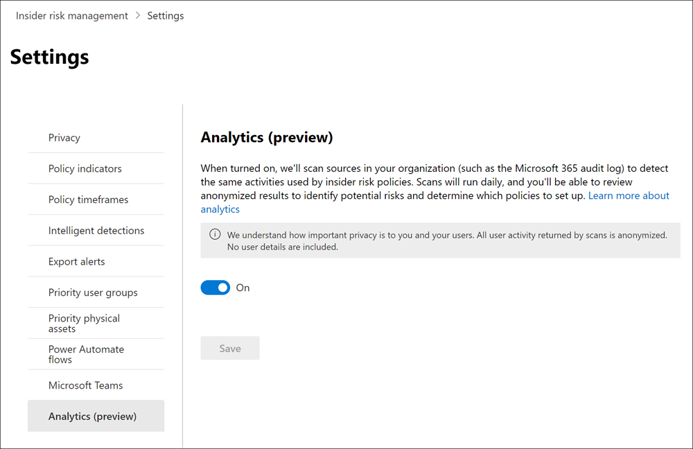
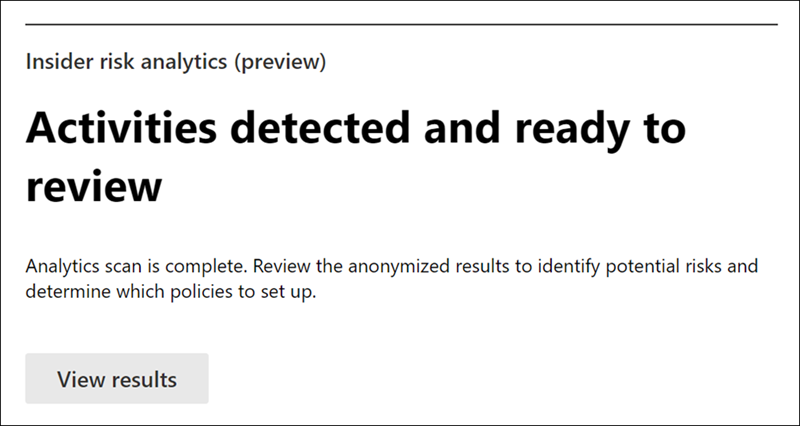

# Erste Schritte mit Einstellungen für das Insider-RisikomanagementGet started with insider risk management settings

Einstellungen für das Insider-Risikomanagement gelten für alle Insider-Risikomanagementrichtlinien, unabhängig von der Vorlage, die Sie beim Erstellen einer Richtlinie auswählen.Insider risk management settings apply to all insider risk management policies, regardless of the template you choose when creating a policy. Die Einstellungen werden über das Steuerelement **Insider-Risiko-Einstellungen** konfiguriert, das sich oben auf allen Registerkarten des Insider-Risikomanagements befindet.Settings are configured using the **Insider risk settings** control located at the top of all insider risk management tabs. Diese Einstellungen steuern Richtlinienkomponenten für die folgenden Bereiche:These settings control policy components for the following areas:

- DatenschutzPrivacy
- IndikatorenIndicators
- RichtlinienzeitachsenPolicy timelines
- Intelligente ErkennungenIntelligent detections
- Exportieren von Warnungen (Vorschau)Export alerts (preview)
- Benutzergruppen mit Priorität (Vorschau)Priority user groups (preview)
- Priorität physischer Ressourcen (Vorschau)Priority physical assets (preview)
- Power Automate Flüsse (Vorschau)Power Automate flows (preview)
- Microsoft Teams (Vorschau)Microsoft Teams (preview)
- Analytics (Vorschau)Analytics (preview)

Bevor Sie beginnen und Richtlinien für das Insider-Risikomanagement erstellen, ist es wichtig, diese Einstellungen zu verstehen und die Einstellungsstufen auszuwählen, die für die Complianceanforderungen Ihrer Organisation am besten geeignet sind.Before you get started and create insider risk management policies, it's important to understand these settings and choose setting levels best for the compliance needs for your organization.

## DatenschutzPrivacy

Der Schutz der Privatsphäre von Benutzern, die über Richtlinienübereinstimmungen verfügen, ist wichtig und kann zur Förderung der Objektivität bei der Überprüfung von Daten und Analysen im Hinblick auf Insider-Risikowarnungen beitragen.Protecting the privacy of users that have policy matches is important and can help promote objectivity in data investigation and analysis reviews for insider risk alerts. Für Benutzer mit einer Übereinstimmung mit einer Insider-Risikorichtlinie können Sie eine der folgenden Einstellungen auswählen:For users with an insider risk policy match, you can choose one of the following settings:

- **Anonymisierte Versionen von Benutzernamen anzeigen:** Namen von Benutzern werden anonymisiert, um zu verhindern, dass Administratoren, Datenermittler und Prüfer sehen, wer richtlinienwarnungen zugeordnet ist.**Show anonymized versions of usernames**: Names of users are anonymized to prevent admins, data investigators, and reviewers from seeing who is associated with policy alerts. Zum Beispiel würde ein Benutzer "Grace Taylor" mit einem randomisierten Pseudonym wie "AnonIS8-988" in allen Bereichen des Insider-Risikomanagements erscheinen.For example, a user 'Grace Taylor' would appear with a randomized pseudonym such as 'AnonIS8-988' in all areas of the insider risk management experience. Wenn Sie diese Einstellung wählen, werden alle Benutzer mit aktuellen und früheren Richtlinienübereinstimmungen anonymisiert und gelten für alle Richtlinien.Choosing this setting anonymizes all users with current and past policy matches and applies to all policies. Benutzerprofilinformationen in der Insider-Risikowarnung und Falldetails sind nicht verfügbar, wenn diese Option ausgewählt wird.User profile information in the insider risk alert and case details will not be available when this option is chosen. Benutzernamen werden jedoch beim Hinzufügen neuer Benutzer zu vorhandenen Richtlinien oder beim Zuweisen von Benutzern zu neuen Richtlinien angezeigt.However, usernames are displayed when adding new users to existing policies or when assigning users to new policies. Wenn Sie diese Einstellung deaktivieren, werden Benutzernamen für alle Benutzer angezeigt, die aktuelle oder frühere Richtlinienüberstimmungen haben.If you choose to turn off this setting, usernames will be displayed for all users that have current or past policy matches.
- **Anonymisierte Versionen von Benutzernamen nicht anzeigen:** Benutzernamen werden für alle aktuellen und früheren Richtlinienüberstimmungen für Warnungen und Fälle angezeigt.**Do not show anonymized versions of usernames**: Usernames are displayed for all current and past policy matches for alerts and cases. Benutzerprofilinformationen (Name, Titel, Alias und Organisation oder Abteilung) werden für den Benutzer für alle Warnungen und Fälle des Insider-Risikomanagements angezeigt.User profile information (the name, title, alias, and organization or department) is displayed for the user for all insider risk management alerts and cases.

## IndikatorenIndicators

Vorlagen für Insider-Risikorichtlinien definieren die Art der Risikoaktivitäten, die Sie erkennen und untersuchen möchten.Insider risk policy templates define the type of risk activities that you want to detect and investigate. Jede Richtlinienvorlage basiert auf bestimmten Indikatoren, die bestimmten Triggern und Risikoaktivitäten entsprechen.Each policy template is based on specific indicators that correspond to specific triggers and risk activities. Alle Indikatoren sind standardmäßig deaktiviert, und Sie müssen einen oder mehrere Richtlinienindikatoren auswählen, bevor Sie eine Insider-Risikomanagementrichtlinie konfigurieren.All indicators are disabled by default, and you must select one or more policy indicators before configuring an insider risk management policy.

Warnungen werden durch Richtlinien ausgelöst, wenn Benutzer Aktivitäten im Zusammenhang mit Richtlinienindikatoren ausführen, die einen erforderlichen Schwellenwert erfüllen.Alerts are triggered by policies when users perform activities related to policy indicators that meet a required threshold. Das Insider-Risikomanagement verwendet zwei Arten von Indikatoren:Insider risk management uses two types of indicators:

- **Auslösen von Ereignissen:** Ereignisse, die bestimmen, ob ein Benutzer in einer Insider-Risikomanagementrichtlinie aktiv ist.**Triggering events**: Events that determine if a user is active in an insider risk management policy. Wenn ein Benutzer zu einer Insider-Risikomanagementrichtlinie hinzugefügt wird, hat er kein auslösendes Ereignis, wird die Benutzeraktivität nicht von der Richtlinie ausgewertet.If a user is added to an insider risk management policy does not have a triggering event, the user activity is not evaluated by the policy. Beispielsweise wird Benutzer A einer Richtlinie hinzugefügt, die anhand des Datendiebstahls erstellt wurde, indem die *Richtlinienvorlage "Benutzer verlässt"* und die Richtlinie und Microsoft 365 HR-Connector ordnungsgemäß konfiguriert sind.For example, User A is added to a policy created from the *Data theft by departing users* policy template and the policy and Microsoft 365 HR connector are properly configured. Bis Benutzer A ein vom HR-Connector gemeldetes Beendigungsdatum hat, werden Benutzer-A-Aktivitäten von dieser Insider-Risikomanagementrichtlinie nicht auf Risiken ausgewertet.Until User A has a termination date reported by the HR connector, User A activities aren't evaluated by this insider risk management policy for risk. Ein weiteres Beispiel für ein auslösendes Ereignis ist, wenn ein Benutzer bei Verwendung von Richtlinien für *Datenlecks* eine DLP-Richtlinienwarnung mit *hohem* Schweregrad hat.Another example of a triggering event is if a user has a *High* severity DLP policy alert when using *Data leaks* policies.
- **Richtlinienindikatoren:** Indikatoren, die in Insider-Risikomanagementrichtlinien enthalten sind, die verwendet werden, um eine Risikobewertung für einen Benutzer im Umfang zu bestimmen.**Policy indicators**: Indicators included in insider risk management policies used to determine a risk score for an in-scope user. Diese Richtlinienindikatoren werden erst aktiviert, nachdem ein auslösendes Ereignis für einen Benutzer auftritt.These policy indicators are only activated after a triggering event occurs for a user. Einige Beispiele für Richtlinienindikatoren sind, wenn ein Benutzer Daten in persönliche Cloudspeicherdienste oder tragbare Speichergeräte kopiert, wenn ein Benutzerkonto aus Azure Active Directory entfernt wird oder wenn ein Benutzer interne Dateien und Ordner für nicht autorisierte externe Parteien teilt.Some examples of policy indicators are when a user copies data to personal cloud storage services or portable storage devices, if a user account is removed from Azure Active Directory, or if a user shares internal files and folders with unauthorized external parties.

Richtlinienindikatoren sind in die folgenden Bereiche unterteilt.Policy indicators are segmented into the following areas. Sie können die Indikatoren auswählen, um Indikatorereignisgrenzwerte für jede Indikatorebene zu aktivieren und anzupassen, wenn Sie eine Insider-Risikorichtlinie erstellen:You can choose the indicators to activate and customize indicator event limits for each indicator level when creating an insider risk policy:

- **Office Indikatoren:** Dazu gehören Richtlinienindikatoren für SharePoint Websites, Microsoft Teams und E-Mail-Nachrichten.**Office indicators**: These include policy indicators for SharePoint sites, Microsoft Teams, and email messaging.
- **Geräteindikatoren:** Dazu gehören Richtlinienindikatoren für Aktivitäten wie das Freigeben von Dateien über das Netzwerk oder für Geräte.**Device indicators**: These include policy indicators for activity such as sharing files over the network or with devices. Zu den Indikatoren gehören Aktivitäten, die alle Dateitypen betreffen, mit Ausnahme von ausführbaren Dateien (.exe) und Dateiaktivitäten der dynamischen Linkbibliothek (.dll).Indicators include activities involving all file types, excluding executable (.exe) and dynamic link library (.dll) file activity. Wenn Sie **Geräteindikatoren** auswählen, wird die Aktivität nur für Geräte mit Windows 10 Build 1809 oder höher verarbeitet, und Sie müssen zuerst Geräte in das Compliance Center integrieren.If you select **Device indicators**, activity is processed only for devices with Windows 10 Build 1809 or higher and you must first onboard devices to the compliance center. Weitere Informationen zum Konfigurieren von Geräten für die Integration mit Insider-Risiken finden Sie im abschnitt "Aktivieren von [Geräteindikatoren und Onboarding von Geräten"](insider-risk-management-settings.md#OnboardDevices) in diesem Artikel.For more information on configuring devices for integration with insider risk, see the following [Enable device indicators and onboard devices](insider-risk-management-settings.md#OnboardDevices) section in this article.
- **Indikator für Sicherheitsrichtlinienverletzungen (Vorschau):** Dazu gehören Indikatoren von Microsoft Defender für Endpunkt im Zusammenhang mit nicht genehmigter oder bösartiger Softwareinstallation oder Umgehung von Sicherheitskontrollen.**Security policy violation indicator (preview)**: These include indicators from Microsoft Defender for Endpoint related to unapproved or malicious software installation or bypassing security controls. Um Warnungen im Insider-Risikomanagement zu erhalten, müssen Sie eine aktive Defender für Endpunkt-Lizenz und die Integration von Insider-Risiken aktiviert haben.To receive alerts in insider risk management, you must have an active Defender for Endpoint license and insider risk integration enabled. Weitere Informationen zum Konfigurieren von Defender für Endpunkt für die Integration des Insider-Risikomanagements finden Sie unter [Konfigurieren erweiterter Features in Microsoft Defender für Endpunkt.](/windows/security/threat-protection/microsoft-defender-atp/advanced-features\#share-endpoint-alerts-with-microsoft-compliance-center)For more information on configuring Defender for Endpoint for insider risk management integration, see [Configure advanced features in Microsoft Defender for Endpoint](/windows/security/threat-protection/microsoft-defender-atp/advanced-features\#share-endpoint-alerts-with-microsoft-compliance-center).
- Indikatoren für **den physischen Zugriff (Vorschau):** Dazu gehören Richtlinienindikatoren für den physischen Zugriff auf vertrauliche Ressourcen.**Physical access indicators (preview)**: These include policy indicators for physical access to sensitive assets. Beispielsweise kann versucht werden, zugriff auf einen eingeschränkten Bereich in Ihren physischen Fehlerhafte Systemprotokollen mit Insider-Risikomanagementrichtlinien zu verwenden.For example, attempted access to a restricted area in your physical badging system logs can be shared with insider risk management policies. Um diese Arten von Warnungen im Insider-Risikomanagement zu erhalten, müssen Sie die prioritätsaktivierten physischen Ressourcen im Insider-Risikomanagement aktiviert und den Connector für [physische Fehlerhafte Daten](import-physical-badging-data.md) konfiguriert haben.To receive these types of alerts in insider risk management, you must have priority physical assets enabled in insider risk management and the [Physical badging data connector](import-physical-badging-data.md) configured. Weitere Informationen zum Konfigurieren des physischen Zugriffs finden Sie im [Abschnitt "Priorität für physischen Zugriff"](#priority-physical-assets-preview) in diesem Artikel.To learn more about configuring physical access, see the [Priority physical access section](#priority-physical-assets-preview) in this article.
- **Microsoft Cloud App Security Indikatoren (Vorschau):** Dazu gehören Richtlinienindikatoren aus freigegebenen Warnungen von Cloud App Security.**Microsoft Cloud App Security indicators (preview)**: These include policy indicators from shared alerts from Cloud App Security. Automatische Aktivierung der Anomalieerkennung in Cloud App Security sofort beginnt, Ergebnisse zu erkennen und zu sortieren, um zahlreiche Verhaltensanomalien für Ihre Benutzer und die mit Ihrem Netzwerk verbundenen Computer und Geräte zu adressieren.Automatically enabled anomaly detection in Cloud App Security immediately starts detecting and collating results, targeting numerous behavioral anomalies across your users and the machines and devices connected to your network. Um diese Aktivitäten in Richtlinienwarnungen für das Insider-Risikomanagement einzuschließen, wählen Sie einen oder mehrere Indikatoren in diesem Abschnitt aus.To include these activities in insider risk management policy alerts, select one or more indicators in this section. Weitere Informationen zu Cloud App Security Analyse und Anomalieerkennung finden Sie unter "Abrufen von [Verhaltensanalysen und Anomalieerkennung".](/cloud-app-security/anomaly-detection-policy)To learn more about Cloud App Security analytics and anomaly detection, see [Get behavioral analytics and anomaly detection](/cloud-app-security/anomaly-detection-policy).
- **Risikobewertungen:** Dazu gehören das Erhöhen der Risikobewertung für ungewöhnliche Aktivitäten oder frühere Richtlinienverstöße.**Risk score boosters**: These include raising the risk score for unusual activities or past policy violations. Das Aktivieren von Risikobewertungsergebnissen erhöht die Risikobewertungen und die Wahrscheinlichkeit von Warnungen für diese Arten von Aktivitäten.Enabling risk score boosters increases risk scores and the likelihood of alerts for these types of activities. Bei ungewöhnlichen Aktivitäten werden Bewertungen verstärkt, wenn die erkannte Aktivität vom typischen Verhalten des Benutzers abweicht.For unusual activities, scores are boosted if the detected activity deviates from the user's typical behavior. Beispielsweise ein erheblicher Anstieg der täglichen Dateidownloads.For example, a significant increase in daily file downloads. Ungewöhnliche Aktivitäten werden als prozentuale Erhöhung (z. B. "100 % über der üblichen Aktivität") dargestellt und wirken sich je nach Aktivität unterschiedlich auf die Risikobewertung aus.Unusual activity is presented as an increase in percentage (for example, '100% above usual activity') and will impact the risk score differently depending on the activity. Bei Benutzern mit vorherigen Richtlinienverstößen werden die Bewertungen erhöht, wenn ein Benutzer mehr als einen Fall zuvor als bestätigter Richtlinienverstoß gelöst hat.For users with previous policy violations, scores are boosted if a user had more than one case previously resolved as a confirmed policy violation. Risikobewertungsbewertungen können nur ausgewählt werden, wenn ein oder mehrere Indikatoren ausgewählt sind.Risk score boosters can only be selected if one or more indicators are selected.

In einigen Fällen sollten Sie die Indikatoren für Insider-Risikorichtlinien einschränken, die auf Insider-Risikorichtlinien in Ihrer Organisation angewendet werden.In some cases, you may want to limit the insider risk policy indicators that are applied to insider risk policies in your organization. Sie können die Richtlinienindikatoren für bestimmte Bereiche deaktivieren, indem Sie sie von allen Insider-Risikorichtlinien deaktivieren.You can turn off the policy indicators for specific areas by disabling them from all insider risk policies. Auslösende Ereignisse können für Richtlinienvorlagen für Insider-Risiken nicht geändert werden.Triggering events cannot be modified for insider risk policy templates.

Um die Indikatoren für Insider-Risikorichtlinien zu definieren, die in allen Insider-Risikorichtlinien aktiviert sind, navigieren Sie zu Indikatoren für **Insider-Risiken,**  >   und wählen Sie einen oder mehrere Richtlinienindikatoren aus.To define the insider risk policy indicators that are enabled in all insider risk policies, navigate to **Insider risk settings** > **Indicators** and select one or more policy indicators. Die auf der Seite "Indikatoreneinstellungen" ausgewählten Indikatoren können beim Erstellen oder Bearbeiten einer Richtlinie für Insider-Risiken im Richtlinien-Assistenten nicht einzeln konfiguriert werden.The indicators selected on the Indicators settings page cannot be individually configured when creating or editing an insider risk policy in the policy wizard.

> [!NOTE]
> Es kann mehrere Stunden dauern, bis neue manuell hinzugefügte Benutzer im **Benutzerdashboard** angezeigt werden.It may take several hours for new manually-added users to appear in the **Users dashboard**. Die Anzeige von Aktivitäten für die vorherigen 90 Tage für diese Benutzer kann bis zu 24 Stunden dauern.Activities for the previous 90 days for these users may take up to 24 hours to display. Um Aktivitäten für manuell hinzugefügte Benutzer anzuzeigen, wählen Sie den Benutzer im **Benutzerdashboard** aus, und öffnen Sie die Registerkarte **"Benutzeraktivität"** im Detailbereich.To view activities for manually added users, select the user on the **Users dashboard** and open the **User activity** tab on the details pane.

### Aktivieren von Geräteindikatoren und Onboarding von GerätenEnable device indicators and onboard devices

Um die Überwachung von Risikoaktivitäten auf Geräten zu aktivieren und Richtlinienindikatoren für diese Aktivitäten einzuschließen, müssen Ihre Geräte die folgenden Anforderungen erfüllen, und Sie müssen die folgenden Integrationsschritte ausführen.To enable the monitoring of risk activities on devices and include policy indicators for these activities, your devices must meet the following requirements and you must complete the following onboarding steps.

#### Schritt 1: Vorbereiten der EndpunkteStep 1: Prepare your endpoints

Stellen Sie sicher, dass die Windows 10 Geräte, die Sie für die Berichterstellung im Insider-Risikomanagement planen, diese Anforderungen erfüllen.Make sure that the Windows 10 devices that you plan on reporting in insider risk management meet these requirements.

1. Muss Windows 10 x64 Build 1809 oder höher ausgeführt werden und muss das [Windows 10 Update (BS Build 17763.1075)](https://support.microsoft.com/help/4537818/windows-10-update-kb4537818) vom 20. Februar 2020 installiert haben.Must be running Windows 10 x64 build 1809 or later and must have installed the [Windows 10 update (OS Build 17763.1075)](https://support.microsoft.com/help/4537818/windows-10-update-kb4537818) from February 20, 2020.
2. Das Benutzerkonto, das zum Anmelden beim Windows 10 Gerät verwendet wird, muss ein aktives Azure Active Directory (AAD)-Konto sein.The user account used to log into the Windows 10 device must be an active Azure Active Directory (AAD) account. Das Windows 10 Gerät kann [AAD,](/azure/active-directory/devices/concept-azure-ad-join)Hybrid-AAD oder Active Directory-Mitglied oder AAD registriert sein.The Windows 10 device may be [AAD](/azure/active-directory/devices/concept-azure-ad-join), hybrid AAD, or Active Directory joined, or AAD registered.
3. Installieren Sie Microsoft Chromium Edge-Browser auf dem Endpunktgerät, um Aktionen für die Clouduploadaktivität zu überwachen.Install Microsoft Chromium Edge browser on the endpoint device to monitor actions for the cloud upload activity. Weitere Informationen finden Sie unter [Herunterladen des auf Chromium basierenden neuen Microsoft Edge](https://support.microsoft.com/help/4501095/download-the-new-microsoft-edge-based-on-chromium).See, [Download the new Microsoft Edge based on Chromium](https://support.microsoft.com/help/4501095/download-the-new-microsoft-edge-based-on-chromium).

#### Schritt 2: Onboarding von GerätenStep 2: Onboarding devices

Sie müssen die Geräteüberwachung aktivieren und Ihre Endpunkte integrieren, bevor Sie Aktivitäten des Insider-Risikomanagements auf einem Gerät überwachen können.You must enable device monitoring and onboard your endpoints before you can monitor for insider risk management activities on a device. Beide Aktionen werden im Microsoft 365 Compliance-Portal ausgeführt.Both actions are taken in the Microsoft 365 Compliance portal.

Wenn Sie Geräte integrieren möchten, die noch nicht integriert wurden, laden Sie das entsprechende Skript herunter und stellen es bereit, wie in den folgenden Schritten beschrieben.When you want to onboard devices that haven't been onboarded yet, you'll download the appropriate script and deploy as outlined in the following steps.

Wenn bereits Geräte in [Microsoft Defender für Endpunkt](/windows/security/threat-protection/) eingebunden sind, werden sie in der Liste der verwalteten Geräte angezeigt.If you already have devices onboarded into [Microsoft Defender for Endpoint](/windows/security/threat-protection/), they will already appear in the managed devices list. Führen Sie [Schritt 3 aus: Wenn Sie Geräte im](insider-risk-management-settings.md#OnboardStep3) nächsten Abschnitt in Microsoft Defender für Endpunkt integriert haben.Follow [Step 3: If you have devices onboarded into Microsoft Defender for Endpoint](insider-risk-management-settings.md#OnboardStep3) in the next section.

In diesem Bereitstellungsszenario integrieren Sie Geräte, die noch nicht integriert wurden, und Sie möchten nur Insider-Risikoaktivitäten auf Windows 10 Geräten überwachen.In this deployment scenario, you'll onboard devices that have not been onboarded yet, and you just want to monitor insider risk activities on Windows 10 devices.

1. Öffnen Sie das [Microsoft Compliance Center](https://compliance.microsoft.com).Open the [Microsoft compliance center](https://compliance.microsoft.com).
2. Öffnen Sie die Seite "Einstellungen", und wählen Sie **Geräte-Onboarding** aus.Open the Compliance Center settings page and choose **Onboard devices**.

   > [!NOTE]
   > In der Regel dauert es zwar nur ungefähr eine Minute, bis das Geräte-Onboarding aktiviert ist, warten Sie aber mindestens 30 Minuten, bevor Sie sich an den Microsoft-Support wenden.While it usually takes about 60 seconds for device onboarding to be enabled, please allow up to 30 minutes before engaging with Microsoft support.

3. Wählen Sie **Geräteverwaltung** aus, um die Liste der **Geräte** zu öffnen.Choose **Device management** to open the **Devices** list. Die Liste ist leer, solange keine Geräte eingebunden sind.The list will be empty until you onboard devices.
4. Wählen Sie **Onboarding** aus, um mit dem Onboarding-Prozess zu beginnen.Choose **Onboarding** to begin the onboarding process.
5. Wählen Sie in der Liste der **Bereitstellungsmethoden** aus, wie Sie diese weiteren Geräte bereitstellen möchten, und laden Sie dann das **Paket herunter.**Choose the way you want to deploy to these more devices from the **Deployment method** list and then **download package**.
6. Führen Sie die unter [Onboarding-Tools und -Methoden für Windows 10-Computer](/windows/security/threat-protection/microsoft-defender-atp/configure-endpoints) beschriebenen entsprechenden Verfahren aus.Follow the appropriate procedures in [Onboarding tools and methods for Windows 10 machines](/windows/security/threat-protection/microsoft-defender-atp/configure-endpoints). Über diesen Link gelangen Sie zu einer Zielseite, auf der Microsoft Defender für Endpunkt-Prozeduren beschrieben werden, die dem in Schritt 5 ausgewählten Bereitstellungspaket entsprechen:This link takes you to a landing page where you can access Microsoft Defender for Endpoint procedures that match the deployment package you selected in step 5:
    - Onboarding von Windows 10-Computern mithilfe von GruppenrichtlinienOnboard Windows 10 machines using Group Policy
    - Onboarding von Windows-Computern mithilfe von Microsoft Endpoint Configuration ManagerOnboard Windows machines using Microsoft Endpoint Configuration Manager
    - Onboarding von Windows 10-Computern mit Tools für die Verwaltung von MobilgerätenOnboard Windows 10 machines using Mobile Device Management tools
    - Onboarding von Windows 10-Computern mithilfe eines lokalen SkriptsOnboard Windows 10 machines using a local script
    - Onboarding von nicht-persistenten Computern einer VD-Infrastruktur (Virtual Desktop)Onboard non-persistent virtual desktop infrastructure (VDI) machines.

Sobald dies abgeschlossen ist und der Endpunkt integriert ist, sollte er in der Geräteliste angezeigt werden, und der Endpunkt beginnt, Überwachungsaktivitätsprotokolle an das Insider-Risikomanagement zu melden.Once done and endpoint is onboarded, it should be visible in the devices list and the endpoint will start reporting audit activity logs to insider risk management.

> [!NOTE]
> Diese Funktion erfordert eine Lizenz.This experience is under license enforcement. Ohne die erforderliche Lizenz werden keine Daten angezeigt und es ist kein Zugriff auf sie möglich.Without the required license, data will not be visible or accessible.

#### Schritt 3: Wenn Sie Geräte in Microsoft Defender für Endpunkt integriert habenStep 3: If you have devices onboarded into Microsoft Defender for Endpoint

Wenn Microsoft Defender für Endpunkt bereits bereitgestellt wurde und Endpunkte gemeldet werden, werden alle diese Endpunkte in der Liste der verwalteten Geräte angezeigt.If Microsoft Defender for Endpoint is already deployed and there are endpoints reporting in, all these endpoints will appear in the managed devices list. Sie können weiterhin neue Geräte in das Insider-Risikomanagement integrieren, um die Abdeckung mithilfe des Abschnitts ["Schritt 2: Onboarding](insider-risk-management-settings.md#OnboardStep2) von Geräten" zu erweitern.You can continue to onboard new devices into insider risk management to expand coverage by using the [Step 2: Onboarding devices](insider-risk-management-settings.md#OnboardStep2) section.

1. Öffnen Sie das [Microsoft Compliance Center](https://compliance.microsoft.com).Open the [Microsoft compliance center](https://compliance.microsoft.com).
2. Öffnen Sie die Seite "Einstellungen", und wählen Sie **Geräteüberwachung aktivieren** aus.Open the Compliance Center settings page and choose **Enable device monitoring**.
3. Wählen Sie **Geräteverwaltung** aus, um die Liste der **Geräte** zu öffnen.Choose **Device management** to open the **Devices** list. Es sollte eine Liste der Geräte angezeigt werden, die bereits berichte in Microsoft Defender für Endpunkt.You should see the list of devices that are already reporting into Microsoft Defender for Endpoint.
4. Wählen Sie **"Onboarding",** wenn Sie weitere Geräte integrieren müssen.Choose **Onboarding** if you need to onboard more devices.
5. Wählen Sie in der Liste der **Bereitstellungsmethoden** aus, wie Sie diese weiteren Geräte bereitstellen möchten, und laden Sie dann das **Paket herunter.**Choose the way you want to deploy to these more devices from the **Deployment method** list and then **Download package**.
6. Führen Sie die unter [Onboarding-Tools und -Methoden für Windows 10-Computer](/windows/security/threat-protection/microsoft-defender-atp/configure-endpoints) beschriebenen entsprechenden Verfahren aus.Follow the appropriate procedures in [Onboarding tools and methods for Windows 10 machines](/windows/security/threat-protection/microsoft-defender-atp/configure-endpoints). Über diesen Link gelangen Sie zu einer Zielseite, auf der Microsoft Defender für Endpunkt-Prozeduren beschrieben werden, die dem in Schritt 5 ausgewählten Bereitstellungspaket entsprechen:This link takes you to a landing page where you can access Microsoft Defender for Endpoint procedures that match the deployment package you selected in step 5:
    - Onboarding von Windows 10-Computern mithilfe von GruppenrichtlinienOnboard Windows 10 machines using Group Policy
    - Onboarding von Windows-Computern mithilfe von Microsoft Endpoint Configuration ManagerOnboard Windows machines using Microsoft Endpoint Configuration Manager
    - Onboarding von Windows 10-Computern mit Tools für die Verwaltung von MobilgerätenOnboard Windows 10 machines using Mobile Device Management tools
    - Onboarding von Windows 10-Computern mithilfe eines lokalen SkriptsOnboard Windows 10 machines using a local script
    - Onboarding von nicht-persistenten Computern einer VD-Infrastruktur (Virtual Desktop)Onboard non-persistent virtual desktop infrastructure (VDI) machines.

Sobald dies abgeschlossen ist und der Endpunkt integriert ist, sollte er unter der **Tabelle "Geräte"** angezeigt werden, und der Endpunkt beginnt mit der Berichterstellung von Überwachungsaktivitätsprotokollen an das Insider-Risikomanagement.Once done and endpoint is onboarded, it should be visible under the **Devices** table and the endpoint will start reporting audit activity logs to insider risk management.

> [!NOTE]
>Diese Funktion erfordert eine Lizenz.This experience is under license enforcement. Ohne die erforderliche Lizenz werden keine Daten angezeigt und es ist kein Zugriff auf sie möglich.Without the required license, data will not be visible or accessible.

### Einstellungen auf Indikatorebene (Vorschau)Indicator level settings (preview)

Beim Erstellen einer Richtlinie im Richtlinien-Assistenten können Sie konfigurieren, wie die tägliche Anzahl von Risikoereignissen die Risikobewertung für Insider-Risikowarnungen beeinflussen soll.When creating a policy in the policy wizard, you can configure how the daily number of risk events should influence the risk score for insider risk alerts. Diese Indikatoreinstellungen helfen Ihnen zu steuern, wie sich die Anzahl der Vorkommen von Risikoereignissen in Ihrer Organisation auf die Risikobewertung und damit auf den zugehörigen Warnungsschweregrad für diese Ereignisse auswirken soll.These indicator settings help you control how the number of occurrences of risk events in your organization should affect the risk score, and so the associated alert severity, for these events. Wenn Sie möchten, können Sie auch festlegen, dass die von Microsoft empfohlenen Standardereignisschwellenwerte für alle aktivierten Indikatoren beibehalten werden.If you prefer, you can also choose to keep the default event threshold levels recommended by Microsoft for all enabled indicators.

Sie entscheiden sich beispielsweise, SharePoint Indikatoren in den Richtlinieneinstellungen für Insider-Risiken zu aktivieren und benutzerdefinierte Schwellenwerte für SharePoint Ereignisse festzulegen, wenn Sie Indikatoren für eine neue Richtlinie für *Datenlecks* mit Insiderrisiko konfigurieren.For example, you decide to enable SharePoint indicators in the insider risk policy settings and to set custom thresholds for SharePoint events when configuring indicators for a new insider risk *Data leaks* policy. Im Assistenten für Insider-Risikorichtlinien konfigurieren Sie drei verschiedene tägliche Ereignisebenen für jeden SharePoint Indikator, um die Risikobewertung für Warnungen im Zusammenhang mit diesen Ereignissen zu beeinflussen.While in the insider risk policy wizard, you configure three different daily event levels for each SharePoint indicator to influence the risk score for alerts associated with these events.

Für die erste tägliche Ereignisstufe legen Sie den Schwellenwert auf *10 oder mehr Ereignisse pro Tag* fest, um eine niedrigere Auswirkung auf die Risikobewertung für die Ereignisse, *20 oder mehr Ereignisse pro Tag* für eine mittlere Auswirkung auf die Risikobewertung für die Ereignisse und *30 oder mehr Ereignisse pro Tag* eine höhere Auswirkung auf die Risikobewertung für die Ereignisse zu haben.For the first daily event level, you set the threshold at *10 or more events per day* for a lower impact to the risk score for the events, *20 or more events per day* for a medium impact to the risk score for the events, and *30 or more events per day* a higher impact to the risk score for the events. Diese Einstellungen bedeuten effektiv:These settings effectively mean:

- Wenn es 1 bis 9 SharePoint Ereignisse gibt, die nach dem Auslösen des Ereignisses stattfinden, sind die Risikobewertungen minimal betroffen und würden in der Regel keine Warnung generieren.If there are 1-9 SharePoint events that take place after triggering event, risk scores are minimally impacted and would tend not to generate an alert.
- Wenn es 10 bis 19 SharePoint Ereignisse gibt, die nach einem auslösenden Ereignis stattfinden, ist die Risikobewertung grundsätzlich niedriger, und die Warnungsschweregrade sind in der Regel auf einem niedrigen Niveau.If there are 10-19  SharePoint events that take place after a triggering event, the risk score is inherently lower and alert severity levels would tend to be at a low level.
- Wenn es 20 bis 29 SharePoint Ereignisse gibt, die nach einem Auslösen stattfinden, ist die Risikobewertung grundsätzlich höher, und die Warnungsschweregrade sind in der Regel auf mittlerem Niveau.If there are 20-29 SharePoint events that take place after a triggering, the risk score is inherently higher and alert severity levels would tend to be at a medium level.
- Wenn es 30 oder mehr SharePoint Ereignisse gibt, die nach einem Auslösen stattfinden, ist die Risikobewertung grundsätzlich höher, und die Warnungsschweregrade sind in der Regel auf einem hohen Niveau.If there are 30 or more SharePoint events that take place after a triggering, the risk score is inherently higher and alert severity levels would tend to be at a high level.

## Zeitrahmen für RichtlinienPolicy timeframes

Mit Hilfe von Zeitrahmen für Richtlinien können Sie vergangene und zukünftige Überprüfungszeiträume definieren, die nach Richtlinienübereinstimmungen auf der Grundlage von Ereignissen und Aktivitäten für die Richtlinienvorlagen zum Insider-Risikomanagement ausgelöst werden.Policy timeframes allow you to define past and future review periods that are triggered after policy matches based on events and activities for the insider risk management policy templates. Je nach der von Ihnen ausgewählten Richtlinienvorlage sind die folgenden Richtlinienzeitfenster verfügbar:Depending on the policy template you choose, the following policy timeframes are available:

- **Aktivierungsfenster:** Für alle Richtlinienvorlagen verfügbar ist das *Aktivierungsfenster* die definierte Anzahl von Tagen, die das Fenster **nach** einem auslösenden Ereignis aktiviert.**Activation window**: Available for all policy templates, the *Activation window* is the defined number of days that the window activates **after** a triggering event. Das Fenster wird 1 bis 30 Tage lang aktiviert, nachdem ein auslösende Ereignis für jeden Benutzer auftritt, der der Richtlinie zugewiesen ist.The window activates for 1 to 30 days after a triggering event occurs for any user assigned to the policy. Sie haben beispielsweise eine Insider-Risikomanagementrichtlinie konfiguriert und das *Aktivierungsfenster* auf 30 Tage festgelegt.For example, you've configured an insider risk management policy and set the *Activation window* to 30 days. Seit der Konfiguration der Richtlinie sind mehrere Monate vergangen, und für einen der in der Richtlinie enthaltenen Benutzer tritt ein auslösendes Ereignis auf.Several months have passed since you configured the policy, and a triggering event occurs for one of the users included in the policy. Das auslösende Ereignis aktiviert das *Aktivierungsfenster,* und die Richtlinie ist für diesen Benutzer 30 Tage lang aktiv, nachdem das auslösende Ereignis aufgetreten ist.The triggering event activates the *Activation window* and the policy is active for that user for 30 days after the triggering event occurred.
- **Erkennung früherer Aktivitäten:** Für alle Richtlinienvorlagen verfügbar ist die Erkennung früherer *Aktivitäten* die definierte Anzahl von Tagen, die das Fenster **vor** einem auslösenden Ereignis aktiviert.**Past activity detection**: Available for all policy templates, the *Past activity detection* is the defined number of days that the window activates **before** a triggering event. Das Fenster wird 0 bis 180 Tage lang aktiviert, bevor ein auslösendes Ereignis für jeden Benutzer auftritt, der der Richtlinie zugewiesen ist.The window activates for 0 to 180 days before a triggering event occurs for any user assigned to the policy. Sie haben beispielsweise eine Insider-Risikomanagementrichtlinie konfiguriert und die *Erkennung früherer Aktivitäten* auf 90 Tage festgelegt.For example, you've configured an insider risk management policy and set the *Past activity detection* to 90 days. Seit der Konfiguration der Richtlinie sind mehrere Monate vergangen, und für einen der in der Richtlinie enthaltenen Benutzer tritt ein auslösendes Ereignis auf.Several months have passed since you configured the policy, and a triggering event occurs for one of the users included in the policy. Das auslösende Ereignis aktiviert die *Erkennung früherer Aktivitäten,* und die Richtlinie sammelt historische Aktivitäten für diesen Benutzer 90 Tage vor dem auslösenden Ereignis.The triggering event activates the *Past activity detection* and the policy gathers historic activities for that user for 90 days prior to the triggering event.

## Intelligente ErkennungenIntelligent detections

Intelligente Erkennungseinstellungen helfen zu verfeinern, wie die Erkennungen riskanter Aktivitäten für Warnungen verarbeitet werden.Intelligent detection settings help refine how the detections of risky activities are processed for alerts. Unter bestimmten Umständen müssen Sie möglicherweise Dateitypen definieren, die ignoriert werden sollen, oder Sie möchten eine Erkennungsstufe für Dateien erzwingen, um eine Mindestleiste für Warnungen zu definieren.In certain circumstances, you may need to define file types to ignore, or you want to enforce a detection level for files to help define a minimum bar for alerts. Verwenden Sie diese Einstellungen, um das gesamte Warnungsvolumen, Dateitypausschlüsse und Dateivolumelimits zu steuern.Use these settings to control overall alert volume, file type exclusions, and file volume limits.

### DateitypausschlüsseFile type exclusions

Um bestimmte Dateitypen von allen Insider-Risikomanagementrichtlinien auszuschließen, geben Sie Dateityperweiterungen durch Kommas getrennt ein.To exclude specific file types from all insider risk management policy matching, enter file type extensions separated by commas. Um beispielsweise bestimmte Arten von Musikdateien von den Richtlinienübereinstimmungen auszuschließen, können Sie AAC, MP3, WAV, WMA in das Feld **Dateityp-Ausschlüsse** eingeben.For example, to exclude certain types of music files from policy matches you may enter aac,mp3,wav,wma in the **File type exclusions** field. Dateien mit diesen Erweiterungen werden von allen Insider-Risikomanagementrichtlinien ignoriert.Files with these extensions will be ignored by all insider risk management policies.

### Schwellenwert für ungewöhnliche DateiaktivitätThreshold for unusual file activity

Um eine minimale Dateiebene zu definieren, bevor Aktivitätswarnungen in Insider-Risikorichtlinien gemeldet werden, geben Sie die Anzahl der Dateien ein.To define a minimum file level before activity alerts are reported in insider risk policies, enter the number of files. Sie würden z. B. "10" eingeben, wenn Sie keine Insider-Risikowarnungen generieren möchten, wenn ein Benutzer 10 Dateien oder weniger herunterlädt, auch wenn die Richtlinien diese Aktivität als ungewöhnlich betrachten.For example, you would enter '10' if you do not want to generate insider risk alerts when a user downloads 10 files or less, even if the policies consider this activity as unusual.

### WarnungsvolumenAlert volume

Benutzeraktivitäten, die von Insider-Risikorichtlinien erkannt werden, erhalten eine bestimmte Risikobewertung, die wiederum den Schweregrad der Warnung bestimmt (niedrig, mittel, hoch).User activities detected by insider risk policies are assigned a specific risk score, which in turn determines the alert severity (low, medium, high). Standardmäßig generieren wir eine bestimmte Anzahl von Warnungen mit niedrigem, mittlerem und hohem Schweregrad, Sie können das Volume jedoch entsprechend Ihren Anforderungen erhöhen oder verringern.By default, we'll generate a certain amount of low, medium, and high severity alerts, but you can increase or decrease the volume to suit your needs. Um die Anzahl der Warnungen für alle Insider-Risikomanagementrichtlinien anzupassen, wählen Sie eine der folgenden Einstellungen aus:To adjust the volume of alerts for all insider risk management policies, choose one of the following settings:

- **Weniger Warnungen:** Sie werden alle Warnungen mit hohem Schweregrad, weniger Warnungen mit mittlerem Schweregrad und keine Warnungen mit geringem Schweregrad sehen.**Fewer alerts**: You'll see all high severity alerts, fewer medium severity alerts, and no low severity ones. Diese Einstellungsebene bedeutet, dass Sie möglicherweise einige echte positive Ergebnisse verpassen.This setting level means you might miss some true positives.
- **Standardvolumen:** Es werden alle Warnungen mit hohem Schweregrad und eine ausgeglichene Anzahl von Warnungen mit mittleren und niedrigen Schweregraden angezeigt.**Default volume**: You'll see all high severity alerts and a balanced amount of medium and low severity alerts.
- **Weitere Warnungen:** Sie sehen alle Warnungen mit mittleren und hohen Schweregraden und die meisten Warnungen mit niedriger Dringlichkeit.**More alerts**: You'll see all medium and high severity alerts and most low severity alerts. Diese Einstellungsebene kann zu mehr falsch positiven Ergebnissen führen.This setting level might result in more false positives.

### Microsoft Defender für Endpunkt (Vorschau)Microsoft Defender for Endpoint (preview)

[Microsoft Defender für Endpunkt](/windows/security/threat-protection/microsoft-defender-atp/microsoft-defender-advanced-threat-protection) ist eine Sicherheitsplattform für Endpunkte für Unternehmen, die Unternehmensnetzwerke dabei unterstützt, fortgeschrittene Bedrohungen zu verhindern, zu erkennen, zu untersuchen und darauf zu reagieren.[Microsoft Defender for Endpoint](/windows/security/threat-protection/microsoft-defender-atp/microsoft-defender-advanced-threat-protection) is an enterprise endpoint security platform designed to help enterprise networks prevent, detect, investigate, and respond to advanced threats. Um eine bessere Sichtbarkeit von Sicherheitsverstößen in Ihrer Organisation zu erhalten, können Sie Defender für Endpunkt-Warnungen für Aktivitäten importieren und filtern, die in Richtlinien verwendet werden, die aus Richtlinienvorlagen für Insider-Risikomanagement-Sicherheitsverletzungen erstellt wurden.To have better visibility of security violations in your organization, you can import and filter Defender for Endpoint alerts for activities used in policies created from insider risk management security violation policy templates.

Abhängig von den Signaltypen, an denen Sie interessiert sind, können Sie basierend auf dem Defender für Endpunkt-Benachrichtigungs-Triagestatus Warnungen in das Insider-Risikomanagement importieren.Depending on the types of signals you are interested in, you can choose to import alerts to insider risk management based on the Defender for Endpoint alert triage status. Sie können einen oder mehrere der folgenden Status der Warnungstriage in den zu importierenden globalen Einstellungen definieren:You can define one or more of the following alert triage statuses in the global settings to import:

- UnbekanntUnknown
- NeuNew
- In ArbeitIn progress
- GelöstResolved

Warnungen von Defender für Endpunkt werden täglich importiert.Alerts from Defender for Endpoint are imported daily. Je nach ausgewähltem Triagestatus werden möglicherweise mehrere Benutzeraktivitäten für dieselbe Warnung angezeigt, da sich der Triagestatus in Defender für Endpunkt ändert.Depending on the triage status you choose, you may see multiple user activities for the same alert as the triage status changes in Defender for Endpoint.

Wenn Sie beispielsweise für diese Einstellung *"Neu"*, *"In Bearbeitung"* und *"Aufgelöst"* auswählen, wenn eine Microsoft Defender für Endpunkt-Warnung generiert wird und der Status *"Neu"* lautet, wird eine anfängliche Warnungsaktivität für den Benutzer im Insider-Risiko importiert.For example, if you select *New*, *In progress*, and *Resolved* for this setting, when a Microsoft Defender for Endpoint alert is generated and the status is *New*, an initial alert activity is imported for the user in insider risk. Wenn der Status der Defender für Endpunkt-Triage in *"In Bearbeitung"* geändert wird, wird eine zweite Aktivität für diese Warnung für den Benutzer im Insider-Risiko importiert.When the Defender for Endpoint triage status changes to *In progress*, a second activity for this alert is imported for the user in insider risk. Wenn der endgültige Defender für Endpunkt-Triagestatus *"Gelöst"* festgelegt ist, wird eine dritte Aktivität für diese Warnung für den Benutzer im Insider-Risiko importiert.When the final Defender for Endpoint triage status of *Resolved* is set, a third activity for this alert is imported for the user in insider risk. Diese Funktion ermöglicht es Ermittlern, den Verlauf der Defender für Endpunkt-Warnungen zu verfolgen und den Grad der Sichtbarkeit auszuwählen, den ihre Untersuchung erfordert.This functionality allows investigators to follow the progression of the Defender for Endpoint alerts and choose the level of visibility that their investigation requires.

> [!IMPORTANT]
> Sie müssen Microsoft Defender für Endpunkt in Ihrer Organisation konfiguriert haben und für die Integration des Insider-Risikomanagements Defender für Endpunkt im Defender Security Center aktivieren, um Warnungen bei Sicherheitsverstößen zu importieren.You'll need to have Microsoft Defender for Endpoint configured in your organization and enable Defender for Endpoint for insider risk management integration in the Defender Security Center to import security violation alerts. Weitere Informationen zum Konfigurieren von Defender für Endpunkt für die Insider-Risikomanagementintegration finden Sie unter [Konfigurieren erweiterter Features in Defender für Endpunkt](/windows/security/threat-protection/microsoft-defender-atp/advanced-features\#share-endpoint-alerts-with-microsoft-compliance-center).For more information on configuring Defender for Endpoint for insider risk management integration, see [Configure advanced features in Defender for Endpoint](/windows/security/threat-protection/microsoft-defender-atp/advanced-features\#share-endpoint-alerts-with-microsoft-compliance-center).

### Domänen (Vorschau)Domains (preview)

Mithilfe von Domäneneinstellungen können Sie Risikostufen für Aktivitäten für bestimmte Domänen definieren.Domain settings help you define risk levels for activities to specific domains. Zu diesen Aktivitäten gehören das Freigeben von Dateien, das Senden von E-Mail-Nachrichten, das Herunterladen oder Hochladen von Inhalten.These activities include sharing files, sending email messages, downloading, or uploading content. Indem Sie Domänen in diesen Einstellungen angeben, können Sie die Risikobewertung für Aktivitäten erhöhen oder verringern, die mit diesen Domänen stattfinden.By specifying domains in these settings, you can increase or decrease the risk scoring for activity that takes place with these domains.

Verwenden Sie "Domäne hinzufügen", um eine Domäne für die einzelnen Domäneneinstellungen zu definieren.Use Add domain to define a domain for each of the domain settings. Darüber hinaus können Sie Platzhalter verwenden, um Abweichungen von Stammdomänen oder Unterdomänen zu ermitteln.Additionally, you can use wildcards to help match variations of root domains or subdomains. Um beispielsweise sales.wingtiptoys.com und support.wingtiptoys.com anzugeben, verwenden Sie den Platzhaltereintrag "\*.wingtiptoys.com", um diese Unterdomänen (und alle anderen Unterdomänen auf derselben Ebene) zuzuordnen.For example, to specify sales.wingtiptoys.com and support.wingtiptoys.com, you use the wildcard entry '\*.wingtiptoys.com' to match these subdomains (and any other subdomain at the same level). Um Unterdomänen mit mehreren Ebenen für eine Stammdomäne anzugeben, müssen Sie das Kontrollkästchen **"Unterdomänen mit mehreren Ebenen einschließen"** aktivieren.To specify multi-level subdomains for a root domain, you must select the **Include Multi-Level Subdomains** checkbox.

Für jede der folgenden Domäneneinstellungen können Sie bis zu 500 Domänen eingeben:For each of the following domain settings, you can enter up to 500 domains:

- **Nicht zulässige Domänen:** Durch die Angabe nicht zulässiger Domänen weisen Aktivitäten, die mit diesen Domänen stattfinden, *höhere* Risikobewertungen auf.**Unallowed domains:** By specifying unallowed domains, activity that takes place with these domains will have *higher* risk scores. Beispiele sind Aktivitäten, bei denen Inhalte für jemanden freigegeben werden (z. B. das Senden von E-Mails an eine Person mit einer gmail.com Adresse) und wenn Benutzer Inhalte von einer dieser nicht zugelassenen Domänen auf ein Gerät herunterladen.Some examples are activities involving sharing content with someone (such as sending email to someone with a gmail.com address) and when users download content to a device from one of these unallowed domains.
- **Zulässige Domänen:** Bestimmte Aktivitäten im Zusammenhang mit zulässigen Domänen werden von Ihren Richtlinien ignoriert und generieren keine Warnungen.**Allowed domains:** Certain activity related to allowed domains will be ignored by your policies and won't generate alerts. Zu diesen Aktivitäten gehören:These activities include:

    - An externe Domänen gesendete E-MailsEmail sent to external domains
    - Dateien, Ordner, Websites, die für externe Domänen freigegeben sindFiles, folders, sites shared with external domains
    - Dateien, die in externe Domänen hochgeladen wurden (mit Microsoft Edge Browser)Files uploaded to external domains (using Microsoft Edge browser)

    Durch die Angabe zulässiger Domänen in den Einstellungen wird diese Aktivität mit diesen Domänen ähnlich behandelt wie die interne Organisationsaktivität.By specifying allowed domains in settings, this activity with these domains is treated similarly to how internal organization activity is treated. Beispielsweise können hier hinzugefügte Domänen Aktivitäten zugeordnet werden, um Inhalte für jemanden außerhalb Ihrer Organisation freizugeben (z. B. das Senden von E-Mails an eine Person mit einer gmail.com Adresse).For example, domains added here map to activities may involve sharing content with someone outside your organization (such as sending email to someone with a gmail.com address).

- **Drittanbieterdomänen:** Wenn Ihre Organisation Drittanbieterdomänen für Geschäftszwecke (z. B. Cloudspeicher) verwendet, fügen Sie diese hier ein, damit Sie Warnungen für Aktivitäten im Zusammenhang mit dem Geräteindikator erhalten *können. Verwenden Sie einen Browser zum Herunterladen von Inhalten von einer Drittanbieterwebsite.***Third party domains:** If your organization uses third-party domains for business purposes (such as cloud storage), include them here so you can receive alerts for activity related to the device indicator *Use a browser to download content from a third-party site*.

## Exportieren von Warnungen (Vorschau)Export alerts (preview)

Warnungsinformationen zum Insider-Risikomanagement können über das [Office 365-Verwaltungsaktivitäts-API-Schema](/office/office-365-management-api/office-365-management-activity-api-schema#security-and-compliance-alerts-schema)in SIEM-Dienste (Security Information and Event Management) exportiert werden.Insider risk management alert information is exportable to security information and event management (SIEM) services via the [Office 365 Management Activity API schema](/office/office-365-management-api/office-365-management-activity-api-schema#security-and-compliance-alerts-schema). Sie können die Office 365-Verwaltungsaktivitäts-APIs verwenden, um Warnungsinformationen in andere Anwendungen zu exportieren, die Ihre Organisation zum Verwalten oder Aggregieren von Insider-Risikoinformationen verwenden kann.You can use the Office 365 Management Activity APIs to export alert information to other applications your organization may use to manage or aggregate insider risk information.

So verwenden Sie die APIs, um Informationen zu Insider-Risikowarnungen zu überprüfen:To use the APIs to review insider risk alert information:

1. Aktivieren Sie die Office 365-Verwaltungsaktivitäts-API-Unterstützung im **Insider-Risikomanagement**  >  **Einstellungen**  >  **Exportieren von Warnungen.**Enable Office 365 Management Activity API support in **Insider risk management** > **Settings** > **Export alerts**. Diese Einstellung ist standardmäßig für Ihre Microsoft 365 Organisation deaktiviert.By default, this setting is disabled for your Microsoft 365 organization.
2. Filtern Sie die allgemeinen Office 365 Überwachungsaktivitäten nach *SecurityComplianceAlerts.*Filter the common Office 365 audit activities by *SecurityComplianceAlerts*.
3. Filtern Sie *SecurityComplianceAlerts* nach der Kategorie *"InsiderRiskManagement".*Filter *SecurityComplianceAlerts* by the *InsiderRiskManagement* category.

Warnungsinformationen enthalten Informationen aus dem Sicherheits- und Compliance-Warnungsschema und dem allgemeinen Schema der Office 365-Verwaltungsaktivitäts-API.Alert information contains information from the security and compliance alert schema and the Office 365 Management Activity API common schema.

Die folgenden Felder und Werte werden für Warnungen des Insider-Risikomanagements für das Sicherheits- & Compliance-Warnungsschema exportiert:The following fields and values are exported for insider risk management alerts for the Security & Compliance alert schema:

| **Warnungsparameter****Alert parameter** | **Beschreibung****Description** |
|:------------------|:----------------|
| AlertTypeAlertType | Der Typ der Warnung ist *benutzerdefinierte*.Type of the alert is *Custom*.  |
| AlertIdAlertId | Die GUID der Warnung.The GUID of the alert. Warnungen zum Insider-Risikomanagement sind änderbar.Insider risk management alerts are mutable. Wenn sich der Warnungsstatus ändert, wird ein neues Protokoll mit derselben AlertID generiert.As alert status changes, a new log with the same AlertID is generated. Diese AlertID kann verwendet werden, um Updates für eine Warnung zu korrelieren.This AlertID can be used to correlate updates for an alert. |
| KategorieCategory | Die Kategorie der Warnung ist *InsiderRiskManagement*.The category of the alert is *InsiderRiskManagement*. Diese Kategorie kann verwendet werden, um von diesen Warnungen von anderen Security & Compliance-Warnungen zu unterscheiden.This category can be used to distinguish from these alerts from other Security & Compliance alerts. |
| KommentareComments | Standardkommentare für die Warnung.Default comments for the alert. Die Werte sind *"Neue Warnung"* (beim Erstellen einer Warnung protokolliert) und *"Warnung aktualisiert"* (protokolliert, wenn eine Warnung aktualisiert wurde).Values are *New Alert* (logged when an alert is created) and *Alert Updated* (logged when there is an update to an alert). Verwenden Sie die AlertID, um Updates für eine Warnung zu korrelieren.Use the AlertID to correlate updates for an alert. |
| DatenData | Die Daten für die Warnung enthalten die eindeutige Benutzer-ID, den Benutzerprinzipalnamen sowie Datum und Uhrzeit (UTC), zu der der Benutzer in eine Richtlinie ausgelöst wurde.The data for the alert, includes the unique user ID, user principal name, and date and time (UTC) when user was triggered into a policy. |
| NameName | Richtlinienname für Die Insider-Risikomanagementrichtlinie, die die Warnung generiert hat.Policy name for insider risk management policy that generated the alert. |
| PolicyIdPolicyId | Die GUID der Insider-Risikomanagementrichtlinie, die die Warnung ausgelöst hat.The GUID of the insider risk management policy that triggered the alert. |
| SeveritySeverity | Der Schweregrad der Warnung.The severity of the alert. Die Werte sind *"Hoch",* *"Mittel"* oder *"Niedrig".*Values are *High*, *Medium*, or *Low*. |
| SourceSource | Die Quelle der Warnung.The source of the alert. Der Wert ist *Office 365 Security & Compliance*.The value is *Office 365 Security & Compliance*. |
| StatusStatus | Der Status der Warnung.The status of the alert. Die Werte sind *aktiv* (*Erfordert Überprüfung* im Insider-Risiko), *Investigating* (*Bestätigt* in Insider-Risiko), *Resolved* (*Behoben* in Insider-Risiko), *Dismissed* (*Dismissed* in insider risk).Values are *Active* (*Needs Review* in insider risk), *Investigating* (*Confirmed* in insider risk), *Resolved* (*Resolved* in insider risk), *Dismissed* (*Dismissed* in insider risk). |
| VersionVersion | Die Version des Sicherheits- und Compliancewarnungsschemas.The version of the security and compliance alert schema. |

Die folgenden Felder und Werte werden für Insider-Risikomanagementwarnungen für das [allgemeine Schema Office 365 Verwaltungsaktivitäts-API](/office/office-365-management-api/office-365-management-activity-api-schema#common-schema)exportiert.The following fields and values are exported for insider risk management alerts for the [Office 365 Management Activity API common schema](/office/office-365-management-api/office-365-management-activity-api-schema#common-schema).

- UserIdUserId
- IdId
- RecordTypeRecordType
- CreationTimeCreationTime
- VorgangOperation
- OrganizationIdOrganizationId
- UserTypeUserType
- UserKeyUserKey

## Benutzergruppen mit Priorität (Vorschau)Priority user groups (preview)

Benutzer in Ihrer Organisation haben je nach Position, Zugriffsebene auf vertrauliche Informationen oder Risikoverlauf möglicherweise unterschiedliche Risikostufen.Users in your organization may have different levels of risk depending on their position, level of access to sensitive information, or risk history. Die Priorisierung der Untersuchung und Bewertung der Aktivitäten dieser Benutzer kann Ihnen dabei helfen, sie auf potenzielle Risiken hinzuweisen, die höhere Auswirkungen auf Ihre Organisation haben können.Prioritizing the examination and scoring of the activities of these users can help alert you to potential risks that may have higher consequences for your organization. Prioritätsbenutzergruppen im Insider-Risikomanagement helfen bei der Definition der Benutzer in Ihrer Organisation, die eine genauere Überprüfung und eine sensiblere Risikobewertung benötigen.Priority user groups in insider risk management help define the users in your organization that need closer inspection and more sensitive risk scoring. Zusammen mit den *Sicherheitsrichtlinienverstößen nach Prioritätsbenutzern* und *Datenlecks nach* Richtlinienvorlagen für Prioritätsbenutzer haben Benutzer, die einer Benutzergruppe mit Priorität hinzugefügt werden, eine höhere Wahrscheinlichkeit von Insider-Risikowarnungen und Warnungen mit höheren Schweregraden.Coupled with the *Security policy violations by priority users* and *Data leaks by priority users* policy templates, users added to a priority user group have an increased likelihood of insider risk alerts and alerts with higher severity levels.

Anstatt von allen Analysten und Ermittlern überprüft zu werden, müssen Benutzergruppen mit Priorität möglicherweise auch die Überprüfungsaktivitäten auf bestimmte Benutzer oder Rollengruppen für Insiderrisiken beschränken.Instead of being open to review by all analysts and investigators, Priority users groups may also need to restrict review activities to specific users or insider risk role groups. Sie können einzelne Benutzer und Rollengruppen zuweisen, um Benutzer, Warnungen, Fälle und Berichte für jede Prioritätsbenutzergruppe zu überprüfen.You can choose to assign individual users and role groups to review users, alerts, cases, and reports for each priority user group. Prioritätsbenutzergruppen können über Prüfberechtigungen verfügen, die den integrierten Rollengruppen *Insider-Risikomanagement,* *Insider-Risikomanagementanalysten* und Ermittler des *Insider-Risikomanagements,* einer oder mehreren dieser Rollengruppen oder einer benutzerdefinierten Auswahl von Benutzern zugewiesen sind.Priority user groups can have review permissions assigned to the built-in *Insider Risk Management*, *Insider Risk Management Analysts*, and *Insider Risk Management Investigators* role groups, one or more of these role groups, or to a custom selection of users.

Sie müssen sich beispielsweise vor Datenlecks für ein streng vertrauliches Projekt schützen, bei dem Benutzer Zugriff auf vertrauliche Informationen haben.For example, you need to protect against data leaks for a highly confidential project where users have access to sensitive information. Sie können die Benutzergruppe *"Vertraulich Project* *Benutzer* mit Priorität" für Benutzer in Ihrer Organisation erstellen, die an diesem Projekt arbeiten.You choose to create *Confidential Project* *Users* priority user group for users in your organization that work on this project. Darüber hinaus sollte diese Benutzergruppe mit Priorität keine Benutzer, Warnungen, Fälle und Berichte enthalten, die der Gruppe zugeordnet sind, die für alle Standardmäßigen Administratoren, Analysten und Ermittler des Insider-Risikomanagements sichtbar sind.Additionally, this priority user group should not have users, alerts, cases, and reports associated with group visible to all the default insider risk management admins, analysts, and investigators. In **Einstellungen** erstellen Sie die Benutzergruppe *"Vertraulich Project Benutzer"* und weisen zwei Benutzer als Prüfer zu, die Daten im Zusammenhang mit den Gruppen anzeigen können.In **Settings**, you create the *Confidential Project Users* priority users group and assign two users as reviewer that can view data related to the groups. Mit dem Richtlinien-Assistenten und der Richtlinienvorlage *"Datenlecks nach Priorität"* erstellen Sie eine neue Richtlinie und weisen der Richtlinie die Gruppe *"Vertraulich Project Benutzer* mit Priorität" zu.Using the policy wizard and the *Data leaks by priority users* policy template, you create a new policy and assign the *Confidential Project Users* priority users group to the policy. Aktivitäten, die von der Richtlinie für Mitglieder der Benutzerprioritätsgruppe *"Vertraulich" Project "Benutzer"* überprüft werden, sind anfälliger für Risiken, und Aktivitäten dieser Benutzer generieren mit größerer Wahrscheinlichkeit eine Warnung und weisen Warnungen mit höherem Schweregrad auf.Activities examined by the policy for members of the *Confidential Project Users* priority user group are more sensitive to risk and activities by these users will be more likely to generate an alert and have alerts with higher severity levels.

### Erstellen einer Benutzergruppe mit PrioritätCreate a priority user group

Um eine neue Benutzergruppe mit Priorität zu erstellen, verwenden Sie einstellungssteuerelemente in der **Insider-Risikomanagementlösung** im Microsoft 365 Compliance Center.To create a new priority user group, you'll use setting controls in the **Insider risk management** solution in the Microsoft 365 compliance center. Um eine Benutzergruppe mit Priorität zu erstellen, müssen Sie Mitglied der Rollengruppe *"Insider-Risikomanagement"* oder "Administrator für *Insider-Risikomanagement"* sein.To create a priority user group, you must be a member of the *Insider Risk Management* or *Insider Risk Management Admin* role group.

Führen Sie die folgenden Schritte aus, um eine Benutzergruppe mit Priorität zu erstellen:Complete the following steps to create a priority user group:

1. Wechseln [Sie](https://compliance.microsoft.com)im Microsoft 365 Compliance Center zum **Insider-Risikomanagement,** und wählen Sie **Einstellungen für Insider-Risiken** aus.In the [Microsoft 365 compliance center](https://compliance.microsoft.com), go to **Insider risk management** and select **Insider risk settings**.
2. Wählen Sie die Registerkarte **"Benutzergruppen priorität" (Vorschau)** aus.Select the **Priority user groups (preview)** tab.
3. Wählen Sie auf der Registerkarte **prioritätsbenutzergruppen (Vorschau)** die Option **"Prioritätsbenutzergruppe erstellen"** aus, um den Gruppenerstellungs-Assistenten zu starten.On the **Priority user groups (preview)** tab, select **Create priority user group** to start the group creation wizard.
4. Füllen Sie auf der Seite **"Name" und "Beschreiben"** die folgenden Felder aus:On the **Name and describe** page, complete the following fields:
    - **Name (erforderlich):** Geben Sie einen Anzeigenamen für die Prioritätsbenutzergruppe ein.**Name (required)**: Enter a friendly name for the priority user group. Sie können den Namen der Benutzergruppe mit Priorität nicht mehr ändern, nachdem Sie den Assistenten abgeschlossen haben.You can't change the name of the priority user group after you complete the wizard.
    - **Beschreibung (optional):** Geben Sie eine Beschreibung für die Benutzergruppe mit Priorität ein.**Description (optional)**: Enter a description for the priority user group.
5. Wählen Sie **Weiter** aus, um fortzufahren.Select **Next** to continue.
6. Wählen Sie auf der Seite **"Mitglieder auswählen"** die Option **"Mitglieder** auswählen" aus, um zu suchen, und wählen Sie aus, welche E-Mail-aktivierten Benutzerkonten in der Gruppe enthalten sind, oder aktivieren Sie das Kontrollkästchen **"Alle auswählen",** um alle Benutzer in Ihrer Organisation zur Gruppe hinzuzufügen.On the **Choose members** page, select **Choose members** to search and select which mail-enabled user accounts are included in the group or select the **Select all** checkbox to add all users in your organization to the group. Wählen Sie **"Hinzufügen"** aus, um fortzufahren, oder **"Abbrechen",** um zu schließen, ohne der Gruppe Benutzer hinzuzufügen.Select **Add** to continue or **Cancel** to close without adding any users to the group.
7. Wählen Sie **Weiter** aus, um fortzufahren.Select **Next** to continue.
8. Auf der Seite **"Auswählen, wer diese Gruppe anzeigen kann"** müssen Sie definieren, wer Benutzer, Warnungen, Fälle und Berichte für die Prioritätsbenutzergruppe überprüfen kann.On the **Choose who can view this group** page, you must define who can review users, alerts, cases, and reports for the priority user group. Mindestens einer Benutzer- oder Insider-Risikomanagement-Rollengruppe muss zugewiesen werden.At least one user or insider risk management role group must be assigned. Wählen **Sie "Benutzer und Rollengruppen auswählen" aus,** und wählen Sie die Rollengruppen "Benutzer" oder "Insider-Risikomanagement" aus, die Sie der Benutzergruppe mit Priorität zuweisen möchten.Select **Choose users and role groups** and select the users or insider risk management role groups you want to assign to the priority user group. Wählen Sie **"Hinzufügen"** aus, um der Gruppe die ausgewählten Benutzer oder Rollengruppen zuzuweisen.Select **Add** to assign the selected users or role groups to the group.
9. Wählen Sie Weiter aus, um fortzufahren.Select Next to continue.
10. Überprüfen Sie auf der Seite **"Überprüfen"** die Einstellungen, die Sie für die Benutzergruppe mit Priorität ausgewählt haben.On the **Review** page, review the settings you've chosen for the priority user group. Wählen Sie die Links **bearbeiten** aus, um einen der Gruppenwerte zu ändern, oder wählen Sie **"Übermitteln"** aus, um die Benutzergruppe mit Priorität zu erstellen und zu aktivieren.Select the **Edit** links to change any of the group values or select **Submit** to create and activate the priority user group.
11. Wählen Sie auf der Bestätigungsseite **"Fertig"** aus, um den Assistenten zu beenden.On the confirmation page, select **Done** to exit the wizard.

### Aktualisieren einer Benutzergruppe mit PrioritätUpdate a priority user group

Um eine vorhandene Benutzergruppe mit Priorität zu aktualisieren, verwenden Sie Einstellungssteuerelemente in der Lösung für das **Insider-Risikomanagement** im Microsoft 365 Compliance Center.To update an existing priority user group, you'll use setting controls in the **Insider risk management** solution in the Microsoft 365 compliance center. Um eine Benutzergruppe mit Priorität zu aktualisieren, müssen Sie Mitglied der Rollengruppe *"Insider-Risikomanagement"* oder "Administrator des *Insider-Risikomanagements"* sein.To update a priority user group, you must be a member of the *Insider Risk Management* or *Insider Risk Management Admin* role group.

Führen Sie die folgenden Schritte aus, um eine Benutzergruppe mit Priorität zu bearbeiten:Complete the following steps to edit a priority user group:

1. Wechseln [Sie](https://compliance.microsoft.com)im Microsoft 365 Compliance Center zum **Insider-Risikomanagement,** und wählen Sie **Einstellungen für Insider-Risiken** aus.In the [Microsoft 365 compliance center](https://compliance.microsoft.com), go to **Insider risk management** and select **Insider risk settings**.
2. Wählen Sie die Registerkarte **"Benutzergruppen priorität" (Vorschau)** aus.Select the **Priority user groups (preview)** tab.
3. Wählen Sie die Prioritätsbenutzergruppe aus, die Sie bearbeiten möchten, und wählen Sie **"Gruppe bearbeiten"** aus.Select the priority user group you want to edit and select **Edit group**.
4. Aktualisieren Sie auf der Seite **"Name" und "Beschreibung"** bei Bedarf das Feld "Beschreibung".On the **Name and describe** page, update the Description field if needed. Sie können den Namen der Prioritätsbenutzergruppe nicht aktualisieren.You can't update the name of the priority user group. Wählen Sie **Weiter** aus, um fortzufahren.Select **Next** to continue.
5. Fügen Sie auf der Seite **"Mitglieder auswählen"** der Gruppe mithilfe des Steuerelements **"Mitglieder auswählen"** neue Mitglieder hinzu.On the **Choose members** page, add new members to the group using the **Choose members** control. Um einen Benutzer aus der Gruppe zu entfernen, wählen Sie das X neben dem Benutzer aus, den Sie entfernen möchten.To remove a user from the group, select the 'X' next to the user you wish to remove. Wählen Sie **Weiter** aus, um fortzufahren.Select **Next** to continue.
6. Fügen Sie auf der Seite **auswählen, wer diese Gruppenseite anzeigen kann,** Benutzer oder Rollengruppen hinzu oder entfernen Sie diese, die Benutzer, Warnungen, Fälle und Berichte für die Benutzergruppe mit Priorität überprüfen können.On the **Choose who can view this group** page, add or remove users or role groups that can review users, alerts, cases, and reports for the priority user group.
7. Wählen Sie **Weiter** aus, um fortzufahren.Select **Next** to continue.
8. Überprüfen Sie auf der Seite **"Überprüfen"** die Updateeinstellungen, die Sie für die Benutzergruppe mit Priorität ausgewählt haben.On the **Review** page, review the update settings you've chosen for the priority user group. Wählen Sie die Links **bearbeiten** aus, um einen der Gruppenwerte zu ändern, oder wählen Sie **"Übermitteln"** aus, um die Benutzergruppe mit Priorität zu aktualisieren.Select the **Edit** links to change any of the group values or select **Submit** to update the priority user group.
9. Wählen Sie auf der Bestätigungsseite **"Fertig"** aus, um den Assistenten zu beenden.On the confirmation page, select **Done** to exit the wizard.

### Löschen einer Benutzergruppe mit PrioritätDelete a priority user group

Um eine vorhandene Benutzergruppe mit Priorität zu löschen, verwenden Sie Einstellungssteuerelemente in der Lösung für das **Insider-Risikomanagement** im Microsoft 365 Compliance Center.To delete an existing priority user group, you'll use setting controls in the **Insider risk management** solution in the Microsoft 365 compliance center. Um eine Benutzergruppe mit Priorität zu löschen, müssen Sie Mitglied der Rollengruppe *"Insider-Risikomanagement"* oder "Administrator für *Insider-Risikomanagement"* sein.To delete a priority user group, you must be a member of the *Insider Risk Management* or *Insider Risk Management Admin* role group.

> [!IMPORTANT]
> Wenn Sie eine Benutzergruppe mit Priorität löschen, wird sie aus jeder aktiven Richtlinie entfernt, der sie zugewiesen ist.Deleting a priority user group will remove it from any active policy to which it is assigned. Wenn Sie eine Prioritätsbenutzergruppe löschen, die einer aktiven Richtlinie zugewiesen ist, enthält die Richtlinie keine Benutzer im Bereich, befindet sich im Leerlauf und erstellt keine Warnungen.If you delete a priority user group that is assigned to an active policy, the policy will not contain any in-scope users and will effectively be idle and will not create alerts.

Führen Sie die folgenden Schritte aus, um eine Benutzergruppe mit Priorität zu löschen:Complete the following steps to delete a priority user group:

1. Wechseln [Sie](https://compliance.microsoft.com)im Microsoft 365 Compliance Center zum **Insider-Risikomanagement,** und wählen Sie **Einstellungen für Insider-Risiken** aus.In the [Microsoft 365 compliance center](https://compliance.microsoft.com), go to **Insider risk management** and select **Insider risk settings**.
2. Wählen Sie die Registerkarte **"Benutzergruppen priorität" (Vorschau)** aus.Select the **Priority user groups (preview)** tab.
3. Wählen Sie die Priorität der Benutzergruppe aus, die Sie bearbeiten möchten, und wählen Sie im Menü "Dashboard" die Option **"Löschen"** aus.Select the priority user group you want to edit and select **Delete** from the dashboard menu.
4. Wählen Sie im Dialogfeld **"Löschen"** die Option **"Ja"** aus, um die Prioritätsbenutzergruppe zu löschen, oder wählen Sie **"Abbrechen"** aus, um zum Dashboard zurückzukehren.On the **Delete** dialog, select **Yes** to delete the priority user group or select **Cancel** to return to the dashboard.

## Priorität physischer Ressourcen (Vorschau)Priority physical assets (preview)

Das Identifizieren des Zugriffs auf physische Ressourcen mit Priorität und das Korrelieren von Zugriffsaktivitäten mit Benutzerereignissen ist ein wichtiger Bestandteil Ihrer Compliance-Infrastruktur.Identifying access to priority physical assets and correlating access activity to user events is an important component of your compliance infrastructure. Diese physischen Ressourcen stellen Prioritätsstandorte in Ihrer Organisation dar, z. B. Firmenobjekte, Rechenzentren oder Serverräume.These physical assets represent priority locations in your organization, such as company buildings, data centers, or server rooms. Insider-Risikoaktivitäten können mit Benutzern verbunden sein, die ungewöhnliche Stunden arbeiten, versuchen, auf diese nicht autorisierten vertraulichen oder sicheren Bereiche zuzugreifen, und Anforderungen für den Zugriff auf Bereiche auf hoher Ebene ohne berechtigte Anforderungen.Insider risk activities may be associated with users working unusual hours, attempting to access these unauthorized sensitive or secure areas, and requests for access to high-level areas without legitimate needs.

Mit aktivierten und konfigurierten physischen Ressourcen und dem konfigurierten [Konnektor](import-physical-badging-data.md) für physische Fehlerhafte Daten integriert das Insider-Risikomanagement Signale von Ihren physischen Steuerungs- und Zugriffssystemen in andere Benutzerrisikoaktivitäten.With priority physical assets enabled and the [Physical badging data connector](import-physical-badging-data.md) configured, insider risk management integrates signals from your physical control and access systems with other user risk activities. Durch die Untersuchung von Verhaltensmustern in physischen Zugriffssystemen und die Korrelation dieser Aktivitäten mit anderen Insider-Risikoereignissen kann das Insider-Risikomanagement Compliance-Ermittlern und Analysten dabei helfen, fundierte entscheidungen für Warnungen zu treffen.By examining patterns of behavior across physical access systems and correlating these activities with other insider risk events, insider risk management can help compliance investigators and analysts make more informed response decisions for alerts. Der Zugriff auf physische Ressourcen mit Priorität wird bewertet und in Einblicken anders als beim Zugriff auf Nicht-Prioritätsressourcen identifiziert.Access to priority physical assets are scored and identified in insights differently from access to non-priority assets.

Ihre Organisation verfügt z. B. über ein Fehlerhaftes System für Benutzer, das den physischen Zugriff auf normale Arbeits- und sensible Projektbereiche überwacht und genehmigt.For example, your organization has a badging system for users that monitors and approves physical access to normal working and sensitive project areas. Sie haben mehrere Benutzer, die an einem vertraulichen Projekt arbeiten, und diese Benutzer kehren zu anderen Bereichen Ihrer Organisation zurück, wenn das Projekt abgeschlossen ist.You have several users working on a sensitive project and these users will return to other areas of your organization when the project is completed. Wenn das vertrauliche Projekt kurz vor dem Abschluss steht, sollten Sie sicherstellen, dass die Projektarbeit vertraulich bleibt und der Zugriff auf die Projektbereiche streng kontrolliert wird.As the sensitive project nears completion, you want to make sure that the project work remains confidential and that access to the project areas is tightly controlled.

Sie entscheiden sich dafür, den Connector für physische Fehlerhafte Daten in Microsoft 365 zu aktivieren, um Zugriffsinformationen aus Ihrem physischen Fehlerhaften System zu importieren und die Priorität physischer Ressourcen im Insider-Risikomanagement anzugeben.You choose to enable the Physical badging data connector in Microsoft 365 to import access information from your physical badging system and specify priority physical assets in insider risk management. Indem Sie Informationen aus Ihrem Auslagerungssystem importieren und physische Zugriffsinformationen mit anderen Risikoaktivitäten korrelieren, die im Insider-Risikomanagement identifiziert werden, stellen Sie fest, dass einer der Benutzer des Projekts nach normalen Arbeitszeiten auf die Projektbüro zugreift und große Datenmengen aus ihrem normalen Arbeitsbereich in einen persönlichen Cloudspeicherdienst exportiert.By importing information from your badging system and correlating physical access information with other risk activities identified in insider risk management, you notice that one of the users on the project is accessing the project offices after normal working hours and is also exporting large amounts of data to a personal cloud storage service from their normal work area. Diese physische Zugriffsaktivität im Zusammenhang mit der Onlineaktivität kann auf möglichen Datendiebstahl hinweisen, und Compliance-Ermittler und Analysten können geeignete Maßnahmen ergreifen, wie die Umstände für diesen Benutzer bestimmen.This physical access activity associated with the online activity may point to possible data theft and compliance investigators and analysts can take appropriate actions as dictated by the circumstances for this user.

### Konfigurieren von physischen Ressourcen mit PrioritätConfigure priority physical assets

Um die Priorität physischer Ressourcen zu konfigurieren, konfigurieren Sie den Konnektor für physisches Fehlerhaftes und verwenden Einstellungssteuerelemente in der **Insider-Risikomanagementlösung** im Microsoft 365 Compliance Center.To configure priority physical assets, you'll configure the Physical badging connector and use setting controls in the **Insider risk management** solution in the Microsoft 365 compliance center. Um die Priorität physischer Ressourcen zu konfigurieren, müssen Sie Mitglied der Rollengruppe *"Insider-Risikomanagement"* oder *"Administrator für Insider-Risikomanagement"* sein.To configure priority physical assets, you must be a member of the *Insider Risk Management* or *Insider Risk Management Admin role group*.

Führen Sie die folgenden Schritte aus, um physische Ressourcen mit Priorität zu konfigurieren:Complete the following steps to configure priority physical assets:

1. Befolgen Sie die Konfigurationsschritte für das Insider-Risikomanagement im Artikel ["Erste Schritte mit dem Insider-Risikomanagement".](insider-risk-management-configure.md)Follow the configuration steps for insider risk management in the [Getting started with insider risk management](insider-risk-management-configure.md) article. Stellen Sie in Schritt 3 sicher, dass Sie den Konnektor für physisches Fehlerhaftes konfigurieren.In Step 3, make sure you configure the Physical badging connector.

    > [!IMPORTANT]
    > Damit Richtlinien für das Insider-Risikomanagement Signaldaten im Zusammenhang mit verlassenden und beendeten Benutzern mit Ereignisdaten von Ihren physischen Kontroll- und Zugriffsplattformen verwenden und korrelieren können, müssen Sie auch den Microsoft 365 HR-Connector konfigurieren.For insider risk management policies to use and correlate signal data related to departing and terminated users with event data from your physical control and access platforms, you must also configure the Microsoft 365 HR connector. Wenn Sie den Connector für physisches Fehlerhaftes Aktivieren aktivieren, ohne den Microsoft 365 HR-Connector zu aktivieren, verarbeiten Richtlinien für insider-Risikomanagement nur Ereignisse für physische Zugriffsaktivitäten für Benutzer in Ihrer Organisation.If you enable the Physical badging connector without enabling the Microsoft 365 HR connector, insider risk management policies will only process events for physical access activities for users in your organization.

2. Wechseln [Sie](https://compliance.microsoft.com)im Microsoft 365 Compliance Center zum **Insider-Risikomanagement,** und wählen Sie **Die Einstellungen für Insider-Risiken** als Priorität für physische  >  **Ressourcen** aus.In the [Microsoft 365 compliance center](https://compliance.microsoft.com), go to **Insider risk management** and select **Insider risk settings** > **Priority physical assets**.
3. Auf der Seite **"Physische Ressourcen priorität"** können Sie entweder manuell die physischen Objekt-IDs hinzufügen, die Sie für die vom Connector für physisches Bading importierten Ressourcenereignisse überwachen möchten, oder eine .csv Datei aller physischen Ressourcen-IDs importieren, die vom Konnektor für physische Anlagen importiert wurden: a) Um physische Ressourcen-IDs manuell hinzuzufügen, wählen **Sie "Physische Ressourcen mit Priorität hinzufügen"** aus, geben Sie eine physische Objekt-ID ein, und wählen Sie dann **"Hinzufügen"** aus.On the **Priority physical assets** page, you can either manually add the physical asset IDs you want to monitor for the asset events imported by the Physical badging connector or import a .csv file of all physical assets IDs imported by the Physical badging connector: a) To manually add physical assets IDs, choose **Add priority physical assets**, enter a physical asset ID, then select **Add**. Geben Sie andere physische Objekt-IDs ein, und wählen Sie dann **"Physische Ressourcen mit Priorität hinzufügen"** aus, um alle eingegebenen Ressourcen zu speichern.Enter other physical asset IDs and then select **Add priority physical assets** to save all the assets entered.
    b) Um eine Liste der physischen Objekt-IDs aus einer .csv Datei hinzuzufügen, wählen Sie **"Physische Ressourcen mit Priorität importieren"** aus.b) To add a list of physical asset IDs from a .csv file, choose **Import priority physical assets**. Wählen Sie im Dialogfeld "Datei-Explorer" die .csv Datei aus, die Sie importieren möchten, und wählen Sie dann **"Öffnen"** aus.From the file explorer dialog, select the .csv file you wish to import, then select **Open**. Die physischen Objekt-IDs aus den .csv Dateien werden der Liste hinzugefügt.The physical asset IDs from the .csv files are added to the list.
4. Navigieren Sie zur Registerkarte **"Richtlinienindikatoren"** in Einstellungen.Navigate to the **Policy indicators** tab in Settings.
5. Navigieren Sie auf der Seite **"Richtlinienindikatoren"** zum Abschnitt "Indikatoren für den **physischen Zugriff",** und aktivieren Sie das Kontrollkästchen für **physischen Zugriff nach Beendigung oder fehlgeschlagenen Zugriff auf vertrauliche Ressourcen.**On the **Policy indicators** page, navigate to the **Physical access indicators** section and select the checkbox for **Physical access after termination or failed access to sensitive asset**.
6. Wählen Sie **"Speichern"** aus, um sie zu konfigurieren und zu beenden.Select **Save** to configure and exit.

### Löschen einer physischen Ressource mit PrioritätDelete a priority physical asset

Um ein vorhandenes physisches Objekt mit Priorität zu löschen, verwenden Sie die Einstellungssteuerelemente in der Insider-Risikomanagementlösung im Microsoft 365 Compliance Center.To delete an existing priority physical asset, you'll use setting controls in the Insider risk management solution in the Microsoft 365 compliance center. Um eine prioritätsbewährte physische Ressource zu löschen, müssen Sie Mitglied der Rollengruppe "Insider-Risikomanagement" oder "Administrator für Insider-Risikomanagement" sein.To delete a priority physical asset, you must be a member of the Insider Risk Management or Insider Risk Management Admin role group.

> [!IMPORTANT]
> Durch das Löschen einer physischen Ressource mit prioritätsbehindender Bedeutung wird sie von jeder aktiven Richtlinie, in die sie zuvor einbezogen wurde, aus der Prüfung entfernt.Deleting a priority physical asset removes it from examination by any active policy to which it was previously included. Warnungen, die von Aktivitäten generiert werden, die der physischen Ressource mit Priorität zugeordnet sind, werden nicht gelöscht.Alerts generated by activities associated with the priority physical asset aren't deleted.

Führen Sie die folgenden Schritte aus, um eine physische Ressource mit Priorität zu löschen:Complete the following steps to delete a priority physical asset:

1. Wechseln [Sie](https://compliance.microsoft.com)im Microsoft 365 Compliance Center zum **Insider-Risikomanagement,** und wählen Sie **Die Einstellungen für Insider-Risiken** als Priorität für physische  >  **Ressourcen** aus.In the [Microsoft 365 compliance center](https://compliance.microsoft.com), go to **Insider risk management** and select **Insider risk settings** > **Priority physical assets**.
2. Wählen Sie auf der Seite **"Physische Ressourcen priorität"** die Ressource aus, die Sie löschen möchten.On the **Priority physical assets** page, select the asset you want to delete.
3. Wählen Sie im Aktionsmenü **"Löschen"** aus, um die Ressource zu löschen.Select **Delete** on the action menu to delete the asset.

## Power Automate Flüsse (Vorschau)Power Automate flows (preview)

[Microsoft Power Automate](/power-automate/getting-started) ist ein Workflowdienst, der Aktionen über Anwendungen und Dienste hinweg automatisiert.[Microsoft Power Automate](/power-automate/getting-started) is a workflow service that automates actions across applications and services. Durch die Verwendung von Flüssen aus Vorlagen oder manuell erstellte, können Sie allgemeine Aufgaben im Zusammenhang mit diesen Anwendungen und Diensten automatisieren.By using flows from templates or created manually, you can automate common tasks associated with these applications and services. Wenn Sie Power Automate Flüsse für das Insider-Risikomanagement aktivieren, können Sie wichtige Aufgaben für Fälle und Benutzer automatisieren.When you enable Power Automate flows for insider risk management, you can automate important tasks for cases and users. Sie können Power Automate Flüsse konfigurieren, um Benutzer-, Warnungs- und Fallinformationen abzurufen und diese Informationen für Projektbeteiligten und andere Anwendungen freizugeben sowie Aktionen im Insider-Risikomanagement zu automatisieren, z. B. das Veröffentlichen von Fallnotizen.You can configure Power Automate flows to retrieve user, alert, and case information and share this information with stakeholders and other applications, as well as automate actions in insider risk management, such as posting to case notes. Power Automate Flüsse gelten für Fälle und alle Benutzer im Bereich einer Richtlinie.Power Automate flows are applicable for cases and any user in scope for a policy.

Kunden mit Microsoft 365 Abonnements, die das Insider-Risikomanagement enthalten, benötigen keine zusätzlichen Power Automate Lizenzen, um die empfohlenen Vorlagen für das Insider-Risikomanagement Power Automate verwenden zu können.Customers with Microsoft 365 subscriptions that include insider risk management do not need additional Power Automate licenses to use the recommended insider risk management Power Automate templates. Diese Vorlagen können angepasst werden, um Ihre Organisation zu unterstützen und kernszenarien des Insider-Risikomanagements abzudecken.These templates can be customized to support your organization and cover core insider risk management scenarios. Wenn Sie premium Power Automate Features in diesen Vorlagen verwenden, eine benutzerdefinierte Vorlage mit dem Microsoft 365 Compliance Connector erstellen oder Power Automate Vorlagen für andere Compliancebereiche in Microsoft 365 verwenden, benötigen Sie möglicherweise weitere Power Automate Lizenzen.If you choose to use premium Power Automate features in these templates, create a custom template using the Microsoft 365 compliance connector, or use Power Automate templates for other compliance areas in Microsoft 365, you may need more Power Automate licenses.

Die folgenden Power Automate Vorlagen werden Kunden bereitgestellt, um die Prozessautomatisierung für Benutzer und Fälle des Insider-Risikomanagements zu unterstützen:The following Power Automate templates are provided to customers to support process automation for insider risk management users and cases:

- **Benachrichtigen Sie Benutzer, wenn sie einer Insider-Risikorichtlinie hinzugefügt werden:** Diese Vorlage ist für Organisationen mit internen Richtlinien, Datenschutz- oder behördlichen Anforderungen, die Benutzer benachrichtigen müssen, wenn sie Insider-Risikomanagementrichtlinien unterliegen.**Notify users when they're added to an insider risk policy**: This template is for organizations that have internal policies, privacy, or regulatory requirements that users must be notified when they are subject to insider risk management policies. Wenn dieser Fluss für einen Benutzer auf der Seite **"Benutzer"** konfiguriert und ausgewählt wird, wird Benutzern und deren Vorgesetzten eine E-Mail-Nachricht gesendet, wenn der Benutzer einer Insider-Risikomanagementrichtlinie hinzugefügt wird.When this flow is configured and selected for a user in the **Users** page, users and their managers are sent an email message when the user is added to an insider risk management policy. Diese Vorlage unterstützt auch das Aktualisieren einer SharePoint Liste, die auf einer SharePoint Website gehostet wird, um Benachrichtigungsdetails wie Datum/Uhrzeit und den Nachrichtenempfänger nachzuverfolgen.This template also supports updating a SharePoint list hosted on a SharePoint site to help track notification message details like date/time and the message recipient. Wenn Sie sich entschieden haben, Benutzer in **den Datenschutzeinstellungen** zu anonymisieren, funktionieren flüsse, die anhand dieser Vorlage erstellt wurden, nicht wie beabsichtigt, sodass der Datenschutz des Benutzers aufrechterhalten wird.If you've chosen to anonymize users in **Privacy settings**, flows created from this template will not function as intended so that user privacy is maintained. Power Automate Flüsse, die diese Vorlage verwenden, sind im **Benutzerdashboard** verfügbar.Power Automate flows using this template are available on the **Users dashboard**.
- **Fordern Sie Informationen von PERSONAL oder Unternehmen über einen Benutzer in einem Insider-Risikofall** an: Wenn Sie in einem Fall handeln, müssen Insider-Risikoanalysten und Ermittler sich möglicherweise an hr oder andere Interessengruppen wenden, um den Kontext der Fallaktivitäten zu verstehen.**Request information from HR or business about a user in an insider risk case**: When acting on a case, insider risk analysts and investigators may need to consult with HR or other stakeholders to understand the context of the case activities. Wenn dieser Fluss für einen Fall konfiguriert und ausgewählt wird, senden Analysten und Ermittler eine E-Mail-Nachricht an personal- und geschäftliche Interessengruppen, die für diesen Fluss konfiguriert sind.When this flow is configured and selected for a case, analysts and investigators send an email message to HR and business stakeholders configured for this flow. Jedem Empfänger wird eine Nachricht mit vorkonfigurierten oder anpassbaren Antwortoptionen gesendet.Each recipient is sent a message with pre-configured or customizable response options. Wenn Empfänger eine Antwortoption auswählen, wird die Antwort als Fallnotiz aufgezeichnet und enthält Empfänger- und Datums-/Uhrzeitinformationen.When recipients select a response option, the response is recorded as a case note and includes recipient and date/time information. Wenn Sie sich entschieden haben, Benutzer in **den Datenschutzeinstellungen** zu anonymisieren, funktionieren flüsse, die anhand dieser Vorlage erstellt wurden, nicht wie beabsichtigt, sodass der Datenschutz des Benutzers aufrechterhalten wird.If you've chosen to anonymize users in **Privacy settings**, flows created from this template will not function as intended so that user privacy is maintained. Power Automate Flüsse, die diese Vorlage verwenden, sind im **Dashboard "Fälle"** verfügbar.Power Automate flows using this template are available on the **Cases dashboard**.
- **Benachrichtigen Sie den Vorgesetzten, wenn ein Benutzer über eine Insider-Risikowarnung verfügt:** Einige Organisationen müssen möglicherweise eine sofortige Verwaltungsbenachrichtigung erhalten, wenn ein Benutzer über eine Insider-Risikomanagementwarnung verfügt.**Notify manager when a user has an insider risk alert**: Some organizations may need to have immediate management notification when a user has an insider risk management alert. Wenn dieser Fluss konfiguriert und ausgewählt ist, wird dem Vorgesetzten für den Fallbenutzer eine E-Mail-Nachricht mit den folgenden Informationen zu allen Fallwarnungen gesendet:When this flow is configured and selected, the manager for the case user is sent an email message with the following information about all case alerts:
    - Anwendbare Richtlinie für die WarnungApplicable policy for the alert
    - Datum/Uhrzeit der WarnungDate/Time of the alert
    - Schweregrad der WarnungSeverity level of the alert

    Der Fluss aktualisiert automatisch die Fallhinweise, dass die Nachricht gesendet und der Fluss aktiviert wurde.The flow automatically updates the case notes that the message was sent and that the flow was activated. Wenn Sie sich entschieden haben, Benutzer in **den Datenschutzeinstellungen** zu anonymisieren, funktionieren flüsse, die anhand dieser Vorlage erstellt wurden, nicht wie beabsichtigt, sodass der Datenschutz des Benutzers aufrechterhalten wird.If you've chosen to anonymize users in **Privacy settings**, flows created from this template will not function as intended so that user privacy is maintained. Power Automate Flüsse, die diese Vorlage verwenden, sind im **Dashboard "Fälle"** verfügbar.Power Automate flows using this template are available on the **Cases dashboard**.
- Erstellen Sie einen Datensatz für den Fall von **Insider-Risiken in ServiceNow:** Diese Vorlage ist für Organisationen vorgesehen, die ihre ServiceNow-Lösung verwenden möchten, um Fälle des Insider-Risikomanagements nachzuverfolgen.**Create record for insider risk case in ServiceNow**: This template is for organizations that want to use their ServiceNow solution to track insider risk management cases.  In einem Fall können Insider-Risikoanalysten und -ermittler einen Datensatz für den Fall in ServiceNow erstellen.When in a case, insider risk analysts and investigators can create a record for the case in ServiceNow. Sie können diese Vorlage anpassen, um ausgewählte Felder in ServiceNow basierend auf den Anforderungen Ihrer Organisation aufzufüllen.You can customize this template to populate selected fields in ServiceNow based on your organization's requirements. Power Automate Flüsse, die diese Vorlage verwenden, sind im **Dashboard "Fälle"** verfügbar.Power Automate flows using this template are available on the **Cases dashboard**. Weitere Informationen zu verfügbaren ServiceNow-Feldern finden Sie im Referenzartikel zum [ServiceNow-Connector.](/connectors/service-now/)For more information on available ServiceNow fields, see the [ServiceNow Connector reference](/connectors/service-now/) article.

### Erstellen eines Power Automate Flusses aus der Vorlage für das Insider-RisikomanagementCreate a Power Automate flow from insider risk management template

Um einen Power Automate Fluss aus einer empfohlenen Vorlage für das Insider-Risikomanagement zu erstellen, verwenden Sie die Einstellungssteuerelemente in der **Insider-Risikomanagementlösung** im Microsoft 365 Compliance Center oder die Option **"Verwalten Power Automate Flüsse"** aus dem **Steuerelement "Automatisieren",** wenn Sie direkt in den Dashboards **"Fälle"** oder **"Benutzer"** arbeiten.To create a Power Automate flow from a recommended  insider risk management template, you'll use the settings controls in the **Insider risk management** solution in the Microsoft 365 compliance center or the **Manage Power Automate flows** option from the **Automate** control when working directly in the **Cases** or **Users dashboards**.

Um einen Power Automate Ablauf im Einstellungsbereich zu erstellen, müssen Sie Mitglied der Rollengruppe *"Insider-Risikomanagement"* oder "Administrator für *Insider-Risikomanagement"* sein.To create a Power Automate flow in the settings area, you must be a member of the *Insider Risk Management* or *Insider Risk Management Admin* role group. Um einen Power Automate Fluss mit der Option **"Verwalten Power Automate Flüsse"** zu erstellen, müssen Sie Mitglied mindestens einer Rollengruppe für das Insider-Risikomanagement sein.To create a Power Automate flow with the **Manage Power Automate flows** option, you must be a member of at least one insider risk management role group.

Führen Sie die folgenden Schritte aus, um einen Power Automate Fluss aus einer empfohlenen Vorlage für das Insider-Risikomanagement zu erstellen:Complete the following steps to create a Power Automate flow from a recommended insider risk management template:

1. Wechseln [Sie im Microsoft 365 Compliance Center](https://compliance.microsoft.com/)zum **Insider-Risikomanagement,** und wählen Sie **Einstellungen für Insider-Risiken**  >  **Power Automate Flüsse aus.**In the [Microsoft 365 compliance center](https://compliance.microsoft.com/), go to **Insider risk management** and select **Insider risk settings** > **Power Automate flows**. Sie können auch über die Dashboardseiten **"Fälle"** oder **"Benutzer"** zugreifen, indem Sie **"Automatisieren**  >  **der Verwaltung Power Automate Flüsse"** auswählen.You can also access from the **Cases** or **Users dashboards** pages by choosing **Automate** > **Manage Power Automate flows**.
2. Wählen Sie auf der Seite **Power Automate Flüsse** eine empfohlene Vorlage aus den Vorlagen für das **Insider-Risikomanagement** aus, die Ihnen möglicherweise im Abschnitt auf der Seite gefällt.On the **Power Automate flows** page, select a recommended template from the **Insider risk management templates you may like** section on the page.
3. Der Fluss listet die eingebetteten Verbindungen auf, die für den Fluss erforderlich sind, und notiert, ob die Verbindungsstatus verfügbar sind.The flow lists the embedded connections needed for the flow and will note if the connection statuses are available. Aktualisieren Sie bei Bedarf alle Verbindungen, die nicht als verfügbar angezeigt werden.If needed, update any connections that aren't displayed as available. Wählen Sie **Weiter**.Select **Continue**.
4. Standardmäßig sind die empfohlenen Flüsse mit dem empfohlenen Insider-Risikomanagement und Microsoft 365 Dienstdatenfeldern vorkonfiguriert, die zum Ausführen der zugewiesenen Aufgabe für den Fluss erforderlich sind.By default, the recommended flows are pre-configured with the recommended insider risk management and Microsoft 365 service data fields required to complete the assigned task for the flow. Passen Sie bei Bedarf die Flusskomponenten an, indem Sie das Steuerelement **"Erweiterte Optionen anzeigen"** verwenden und die verfügbaren Eigenschaften für die Flusskomponente konfigurieren.If needed, customize the flow components by using the **Show advanced options** control and configuring the available properties for the flow component.
5. Fügen Sie ggf. weitere Schritte zum Fluss hinzu, indem Sie die Schaltfläche **"Neuer Schritt"** auswählen.If needed, add any other steps to the flow by selecting the **New step** button. In den meisten Fällen sollte dies für die empfohlenen Standardvorlagen nicht erforderlich sein.In most cases, this should not be needed for the recommended default templates.
6. Wählen Sie **"Entwurf speichern"** aus, um den Fluss zur weiteren Konfiguration zu speichern, oder wählen Sie **"Speichern"** aus, um die Konfiguration für den Fluss abzuschließen.Select **Save draft** to save the flow for further configuration or select **Save** to complete the configuration for the flow.
7. Wählen Sie **"Schließen"** aus, um zur **Power Automate Flussseite** zurückzukehren.Select **Close** to return to the **Power Automate flow** page. Die neue Vorlage wird als Fluss auf den Registerkarten **"Meine Flüsse"** aufgeführt und ist automatisch über das **Dropdown-Steuerelement "Automatisieren"** verfügbar, wenn sie mit Insider-Risikomanagementfällen für den Benutzer arbeitet, der den Fluss erstellt.The new template will be listed as a flow on the **My flows** tabs and is automatically available from the **Automate** dropdown control when working with insider risk management cases for the user creating the flow.

> [!IMPORTANT]
> Wenn andere Benutzer in Ihrer Organisation Zugriff auf den Fluss benötigen, muss der Fluss freigegeben werden.If other users in your organization need access to the flow, the flow must be shared.

### Erstellen eines benutzerdefinierten Power Automate-Flusses für das Insider-RisikomanagementCreate a custom Power Automate flow for insider risk management

Einige Prozesse und Workflows für Ihre Organisation befinden sich möglicherweise außerhalb der empfohlenen Flow-Vorlagen für das Insider-Risikomanagement, und Sie müssen möglicherweise benutzerdefinierte Power Automate Flüsse für Insider-Risikomanagementbereiche erstellen.Some processes and workflows for your organization may be outside of the recommended insider risk management flow templates and you may have the need to create custom Power Automate flows for insider risk management areas. Power Automate Flüsse sind flexibel und unterstützen umfassende Anpassungen, es müssen jedoch Schritte zur Integration in Insider-Risikomanagementfeatures ausgeführt werden.Power Automate flows are flexible and support extensive customization, but there are steps that need to be taken to integrate with insider risk management features.

Führen Sie die folgenden Schritte aus, um eine benutzerdefinierte Power Automate Vorlage für das Insider-Risikomanagement zu erstellen:Complete the following steps to create a custom Power Automate template for insider risk management:

1. **Überprüfen Sie Ihre Power Automate Flusslizenz:** Um angepasste Power Automate Flüsse zu erstellen, die Insider-Risikomanagementtrigger verwenden, benötigen Sie eine Power Automate Lizenz.**Check your Power Automate flow license**: To create customized Power Automate flows that use insider risk management triggers, you'll need a Power Automate license. Die empfohlenen Vorlagen für den Ablauf des Insider-Risikomanagements erfordern keine zusätzliche Lizenzierung und sind teil Ihrer Insider-Risikomanagement-Lizenz.The recommended insider risk management flow templates do not require extra licensing and are included as part of your insider risk management license.
2. **Erstellen eines automatisierten Flusses:** Erstellen Sie einen Flow, der eine oder mehrere Aufgaben ausführt, nachdem er durch ein Insider-Risikomanagementereignis ausgelöst wurde.**Create an automated flow**: Create a flow that performs one or more tasks after it's triggered by an insider risk management event. Ausführliche Informationen zum Erstellen eines automatisierten Flusses finden Sie unter [Erstellen eines Flusses in Power Automate](/power-automate/get-started-logic-flow).For details on how to create an automated flow, see [Create a flow in Power Automate](/power-automate/get-started-logic-flow).
3. **Wählen Sie den Microsoft 365 Compliance-Connector** aus: Suchen Sie nach dem Microsoft 365 Compliance-Connector, und wählen Sie den Connector aus.**Select the Microsoft 365 compliance connector**: Search for and select the Microsoft 365 compliance connector. Dieser Connector ermöglicht Auslöser und Aktionen des Insider-Risikomanagements.This connector enables insider risk management triggers and actions. Weitere Informationen zu Connectors finden Sie im [Connector-Referenzübersichtsartikel.](/connectors/connector-reference/)For more information on connectors, see the [Connector reference overview](/connectors/connector-reference/) article.
4. **Wählen Sie Insider-Risikomanagementtrigger für Ihren Flow** aus: Das Insider-Risikomanagement verfügt über zwei Trigger für benutzerdefinierte Power Automate Flüsse:**Choose insider risk management triggers for your flow**: Insider risk management has two triggers available for custom Power Automate flows:
    - Für einen ausgewählten Fall des **Insider-Risikomanagements:** Flüsse mit diesem Trigger können auf der Dashboard-Seite "Fälle des Insider-Risikomanagements" ausgewählt werden.**For a selected insider risk management case**: Flows with this trigger can be selected from the insider risk management Cases dashboard page.
    - Für einen ausgewählten Benutzer des **Insider-Risikomanagements:** Flüsse mit diesem Trigger können auf der Dashboardseite des Insider-Risikomanagements ausgewählt werden.**For a selected insider risk management user**: Flows with this trigger can be selected from the insider risk management Users dashboard page.
5. Wählen Sie Insider-Risikomanagementaktionen für Ihren Flow aus: Sie können aus mehreren Aktionen für das Insider-Risikomanagement wählen, die In Ihren benutzerdefinierten Fluss einbezogen werden sollen:Choose insider risk management actions for your flow: You can choose from several actions for insider risk management to include in your custom flow:
    - Warnung zum Insider-Risikomanagement erhaltenGet insider risk management alert
    - Insider-Risikomanagementfall abrufenGet insider risk management case
    - Abrufen von Insider-RisikomanagementbenutzernGet insider risk management user
    - Abrufen von Insider-Risikomanagementwarnungen für einen FallGet insider risk management alerts for a case
    - Hinzufügen eines Fallhinweiss zum Insider-RisikomanagementAdd insider risk management case note

### Freigeben eines Power Automate FlussesShare a Power Automate flow

Standardmäßig sind Power Automate von einem Benutzer erstellten Flüsse nur für diesen Benutzer verfügbar.By default, Power Automate flows created by a user are only available to that user. Damit andere Benutzer des Insider-Risikomanagements Zugriff auf einen Flow haben und diesen verwenden können, muss der Fluss vom Flow-Ersteller gemeinsam genutzt werden.For other insider risk management users to have access and use a flow, the flow must be shared by the flow creator. Um einen Fluss freizugeben, verwenden Sie die Einstellungssteuerelemente in der **Insider-Risikomanagementlösung** im Microsoft 365 Compliance Center oder die Option **"Verwalten Power Automate Flüsse"** aus dem Steuerelement "Automatisieren", wenn Sie direkt auf den Dashboardseiten **"Fälle"** oder **"Benutzer"** arbeiten.To share a flow, you'll use the settings controls in the **Insider risk management solution** in the Microsoft 365 compliance center or the **Manage Power Automate flows** option from the Automate control when working directly in the **Cases** or **Users dashboard** pages. Sobald Sie einen Fluss freigegeben haben, kann jeder, für den er freigegeben wurde, in der **Dropdownliste "Steuerelemente automatisieren"** in den **Fall-** und **Benutzerdashboards** auf den Fluss zugreifen.Once you have shared a flow, everyone who it has been shared with can access the flow in the **Automate** control dropdown in the **Case** and **User dashboards**.

Um einen Power Automate Fluss im Einstellungsbereich freizugeben, müssen Sie Mitglied der Rollengruppe *"Insider-Risikomanagement"* oder "Administrator für *Insider-Risikomanagement"* sein.To share a Power Automate flow in the settings area, you must be a member of the *Insider Risk Management* or *Insider Risk Management Admin* role group. Um einen Power Automate Fluss mit der Option **"Power Automate Flüsse verwalten"** zu teilen, müssen Sie Mitglied mindestens einer Rollengruppe für das Insider-Risikomanagement sein.To share a Power Automate flow with the **Manage Power Automate flows** option, you must be a member of at least one insider risk management role group.

Führen Sie die folgenden Schritte aus, um einen Power Automate Fluss freizugeben:Complete the following steps to share a Power Automate flow:

1. Wechseln [Sie im Microsoft 365 Compliance Center](https://compliance.microsoft.com)zum **Insider-Risikomanagement,** und wählen Sie **Einstellungen für Insider-Risiken**  >  **Power Automate Flüsse aus.**In the [Microsoft 365 compliance center](https://compliance.microsoft.com), go to **Insider risk management** and select **Insider risk settings** > **Power Automate flows**. Sie können auch über die Dashboardseiten **"Fälle"** oder **"Benutzer"** zugreifen, indem Sie **"Automatisieren**  >  **der Verwaltung Power Automate Flüsse"** auswählen.You can also access from the **Cases** or **Users dashboards** pages by choosing **Automate** > **Manage Power Automate flows**.
2. Wählen Sie auf der Seite **Power Automate Flüsse** die Registerkarte **Meine** Flüsse oder Teamflüsse aus. On the **Power Automate flows** page, select the **My flows** or **Team flows** tab.
3. Wählen Sie den zu teilenden Fluss aus, und wählen Sie dann im Menü "Flussoptionen" die Option **"Freigeben"** aus.Select the flow to share, then select **Share** from the flow options menu.
4. Geben Sie auf der Seite "Flussfreigabe" den Namen des Benutzers oder der Gruppe ein, den Sie als Besitzer für den Fluss hinzufügen möchten.On the flow sharing page, enter the name of the user or group you want to add as an owner for the flow.
5. Klicken Sie im Dialogfeld **"Verbindung verwendet"** auf **"OK",** um zu bestätigen, dass der hinzugefügte Benutzer oder die hinzugefügte Gruppe voll auf den Fluss zugreifen kann.On the **Connection Used** dialog, select **OK** to acknowledge that the added user or group will have full access to the flow.

### Bearbeiten eines Power Automate FlussesEdit a Power Automate flow

Zum Bearbeiten eines Flusses verwenden Sie die Einstellungssteuerelemente in der Lösung für das **Insider-Risikomanagement** im Microsoft 365 Compliance Center oder die Option **"Verwalten Power Automate Flüsse"** aus dem **Steuerelement "Automatisieren",** wenn Sie direkt in den Dashboards **"Fälle"** oder **"Benutzer"** arbeiten.To edit a flow, you'll use the settings controls in the **Insider risk management** solution in the Microsoft 365 compliance center or the **Manage Power Automate flows** option from the **Automate** control when working directly in the **Cases** or **Users dashboards**.

Um einen Power Automate Ablauf im Einstellungsbereich zu bearbeiten, müssen Sie Mitglied der Rollengruppe *"Insider-Risikomanagement"* oder "Administrator für *Insider-Risikomanagement"* sein.To edit a Power Automate flow in the settings area, you must be a member of the *Insider Risk Management* or *Insider Risk Management Admin* role group. Um einen Power Automate Fluss mit der Option **"Verwalten Power Automate Flüsse"** zu bearbeiten, müssen Sie Mitglied mindestens einer Rollengruppe für das Insider-Risikomanagement sein.To edit a Power Automate flow with the **Manage Power Automate flows** option, you must be a member of at least one insider risk management role group.

Führen Sie die folgenden Schritte aus, um einen Power Automate Fluss zu bearbeiten:Complete the following steps to edit a Power Automate flow:

1. Wechseln [Sie im Microsoft 365 Compliance Center](https://compliance.microsoft.com)zum **Insider-Risikomanagement,** und wählen Sie **Einstellungen für Insider-Risiken**  >  **Power Automate Flüsse aus.**In the [Microsoft 365 compliance center](https://compliance.microsoft.com), go to **Insider risk management** and select **Insider risk settings** > **Power Automate flows**. Sie können auch über die Dashboardseiten **"Fälle"** oder **"Benutzer"** zugreifen, indem Sie **"Automatisieren**  >  **der Verwaltung Power Automate Flüsse"** auswählen.You can also access from the **Cases** or **Users dashboards** pages by choosing **Automate** > **Manage Power Automate flows**.
2. Wählen Sie auf der **Seite Power Automate Flüsse** einen zu bearbeitenden Fluss aus, und wählen Sie im Flusssteuerungsmenü die Option **"Bearbeiten"** aus.On the **Power Automate flows** page, select a flow to edit and select **Edit** from the flow control menu.
3. Wählen Sie die **Auslassungszeichen**  >  **Einstellungen** aus, um eine Flusskomponenteneinstellung zu ändern, oder löschen Sie die **Auslassungszeichen,**  >   um eine Flusskomponente zu löschen.Select the **ellipsis** > **Settings** to change a flow component setting or **ellipsis** > **Delete** to delete a flow component.
4. Wählen Sie **"Speichern"** und dann **"Schließen"** aus, um die Bearbeitung des Flusses abzuschließen.Select **Save** and then **Close** to complete editing the flow.

### Löschen eines Power Automate FlussesDelete a Power Automate flow

Um einen Fluss zu löschen, verwenden Sie die Einstellungssteuerelemente in der **Insider-Risikomanagementlösung** im Microsoft 365 Compliance Center oder die Option **"Verwalten Power Automate Flüsse"** aus dem **Steuerelement "Automatisieren",** wenn Sie direkt in den Dashboards **"Fälle"** oder **"Benutzer"** arbeiten.To delete a flow, you'll use the settings controls in the **Insider risk management** solution in the Microsoft 365 compliance center or the **Manage Power Automate flows** option from the **Automate** control when working directly in the **Cases** or **Users dashboards**. Wenn ein Fluss gelöscht wird, wird er als Option für alle Benutzer entfernt.When a flow is deleted, it is removed as an option for all users.

Um einen Power Automate Fluss im Einstellungsbereich zu löschen, müssen Sie Mitglied der Rollengruppe *"Insider-Risikomanagement"* oder "Administrator für *Insider-Risikomanagement"* sein.To delete a Power Automate flow in the settings area, you must be a member of the *Insider Risk Management* or *Insider Risk Management Admin* role group. Um einen Power Automate Fluss mit der Option **"Power Automate Flüsse verwalten"** zu löschen, müssen Sie Mitglied mindestens einer Rollengruppe für das Insider-Risikomanagement sein.To delete a Power Automate flow with the **Manage Power Automate flows** option, you must be a member of at least one insider risk management role group.

Führen Sie die folgenden Schritte aus, um einen Power Automate Fluss zu löschen:Complete the following steps to delete a Power Automate flow:

1. Wechseln [Sie im Microsoft 365 Compliance Center](https://compliance.microsoft.com)zum **Insider-Risikomanagement,** und wählen Sie **Einstellungen für Insider-Risiken**  >  **Power Automate Flüsse aus.**In the [Microsoft 365 compliance center](https://compliance.microsoft.com), go to **Insider risk management** and select **Insider risk settings** > **Power Automate flows**. Sie können auch über die Dashboardseiten **"Fälle"** oder **"Benutzer"** zugreifen, indem Sie **"Automatisieren**  >  **der Verwaltung Power Automate Flüsse"** auswählen.You can also access from the **Cases** or **Users dashboards** pages by choosing **Automate** > **Manage Power Automate flows**.
2. Wählen Sie auf der Seite **Power Automate Flüsse** einen zu löschenden Fluss aus, und wählen Sie **"Löschen"** aus dem Flusssteuerungsmenü aus.On the **Power Automate flows** page, select a flow to delete and select **Delete** from the flow control menu.
3. Wählen Sie im Dialogfeld zur Bestätigung des Löschvorgangs **"Löschen"** aus, um den Fluss zu entfernen, oder wählen Sie **"Abbrechen"** aus, um die Löschaktion zu beenden.On the deletion confirmation dialog, select **Delete** to remove the flow or select **Cancel** to exit the deletion action.

## Microsoft Teams (Vorschau)Microsoft Teams (preview)

Complianceanalysten und Ermittler können Microsoft Teams problemlos für die Zusammenarbeit bei Insider-Risikomanagement-Fällen verwenden.Compliance analysts and investigators can easily use Microsoft Teams for collaboration on insider risk management cases. Sie können sich mit anderen Beteiligten in Microsoft Teams koordinieren und mit ihnen kommunizieren, um:They can coordinate and communicate with other stakeholders in Microsoft Teams to:

- Koordinieren und Überprüfen von Reaktionsaktivitäten für Fälle in privaten Teams KanälenCoordinate and review response activities for cases in private Teams channels
- Sicheres Freigeben und Speichern von Dateien und Nachweisen im Zusammenhang mit einzelnen FällenSecurely share and store files and evidence related to individual cases
- Nachverfolgen und Überprüfen der Reaktionsaktivitäten von Analysten und ErmittlernTrack and review response activities by analysts and investigators

Nachdem Microsoft Teams für das Insider-Risikomanagement aktiviert wurde, wird jedes Mal, wenn eine Warnung bestätigt und ein Fall erstellt wird, ein dediziertes Microsoft Teams Team erstellt.After Microsoft Teams is enabled for insider risk management, a dedicated Microsoft Teams team is created every time an alert is confirmed and a case is created. Standardmäßig umfasst das Team automatisch alle Mitglieder der Rollengruppen *"Insider-Risikomanagement",* *"Insider-Risikomanagementanalysten"* und *"Ermittler des Insider-Risikomanagements"* (bis zu 100 Ursprüngliche).By default, the team automatically includes all members of the *Insider Risk Management*, *Insider Risk Management Analysts*, and *Insider Risk Management Investigators* role groups (up to 100 initial users). Weitere Organisationsmitwirkende können dem Team hinzugefügt werden, nachdem es erstellt wurde, und zwar nach Bedarf.Additional organization contributors may be added to the team after it is created and as appropriate. Für vorhandene Fälle, die vor der Aktivierung Microsoft Teams erstellt wurden, können Analysten und Ermittler bei Bedarf ein neues Microsoft Teams Team erstellen, wenn sie in einem Fall arbeiten.For existing cases created before enabling Microsoft Teams, analysts and investigators can choose to create a new Microsoft Teams team when working in a case if needed.  Nachdem Sie den entsprechenden Fall im Insider-Risikomanagement gelöst haben, wird das Team automatisch archiviert (in ausgeblendet und schreibgeschützt verschoben).Once you resolve the associated case in insider risk management, the team is automatically archived (moved to hidden and read-only).

Weitere Informationen zur Verwendung von Teams und Kanälen in Microsoft Teams finden Sie unter [Übersicht über Teams und Kanäle in Microsoft Teams.](/MicrosoftTeams/teams-channels-overview)For more information on how to use teams and channels in Microsoft Teams, see [Overview of teams and channels in Microsoft Teams](/MicrosoftTeams/teams-channels-overview).

Die Aktivierung Microsoft Teams Unterstützung für Fälle ist schnell und einfach zu konfigurieren.Enabling Microsoft Teams support for cases is quick and easy to configure. Führen Sie die folgenden Schritte aus, um Microsoft Teams für das Insider-Risikomanagement zu aktivieren:To enable Microsoft Teams for insider risk management, complete the following steps:

1. Wechseln [Sie](https://compliance.microsoft.com)im Microsoft 365 Compliance Center zu **Insider-Risikomanagement-Insider-Risikoeinstellungen.**  >  In the [Microsoft 365 compliance center](https://compliance.microsoft.com), go to **Insider risk management** > **Insider risk settings**.
2. Wählen Sie die **Registerkarte Microsoft Teams** aus.Select the **Microsoft Teams** tab.
3. Aktivieren Sie Microsoft Teams Integration für das Insider-Risikomanagement.Enable Microsoft Teams integration for insider risk management.
4. Wählen Sie **"Speichern"** aus, um sie zu konfigurieren und zu beenden.Select **Save** to configure and exit.

### Erstellen eines Microsoft Teams Teams für vorhandene FälleCreate a Microsoft Teams team for existing cases

Wenn Sie Microsoft Teams Unterstützung für das Insider-Risikomanagement aktivieren, nachdem Sie bereits Fälle haben, müssen Sie bei Bedarf manuell ein Team für jeden Fall erstellen.If you enable Microsoft Teams support for insider risk management after you have existing cases, you'll need to manually create a team for each case as needed. Nachdem sie Microsoft Teams Unterstützung in den Einstellungen für das Insider-Risikomanagement aktiviert haben, erstellen neue Fälle automatisch ein neues Microsoft Teams Team.After enabling Microsoft Teams support in insider risk management settings, new cases will automatically create a new Microsoft Teams team.

Benutzer benötigen die Berechtigung, Microsoft 365 Gruppen in Ihrer Organisation zu erstellen, um ein Microsoft Teams Team anhand eines Falls zu erstellen.Users need permission to create Microsoft 365 groups in your organization to create a Microsoft Teams team from a case. Weitere Informationen zum Verwalten von Berechtigungen für Microsoft 365 Gruppen finden Sie unter [Verwalten, wer Microsoft 365 Gruppen erstellen kann.](../solutions/manage-creation-of-groups.md)For more information about managing permissions for Microsoft 365 Groups, see [Manage who can create Microsoft 365 Groups](../solutions/manage-creation-of-groups.md).

Um ein Team für einen Fall zu erstellen, verwenden Sie das Steuerelement "Microsoft Team erstellen", wenn Sie direkt in einem vorhandenen Fall arbeiten.To create a team for a case, you'll use the Create Microsoft Team control when working directly in an existing case. Führen Sie die folgenden Schritte aus, um ein neues Team zu erstellen:Complete the following steps to create a new team:

1. Wechseln [Sie](https://compliance.microsoft.com)im Microsoft 365 Compliance Center zu **Insider-Risikomanagementfällen,**  >   und wählen Sie einen vorhandenen Fall aus.In the [Microsoft 365 compliance center](https://compliance.microsoft.com), go to **Insider risk management** > **Cases** and select an existing case.
2. Wählen Sie im Aktionsmenü "Groß-/Kleinschreibung" die Option **"Microsoft Team erstellen"** aus.On the case action menu, select **Create Microsoft Team**.
3. Geben Sie im Feld **"Teamname"** einen Namen für das neue Microsoft Teams Team ein.In the **Team name** field, enter a name for the new Microsoft Teams team.
4. Wählen Sie **"Microsoft-Team erstellen"** und dann **"Schließen"** aus.Select **Create Microsoft team** and then select **Close**.

Abhängig von der Anzahl der Benutzer, die Rollengruppen für das Insider-Risikomanagement zugewiesen sind, kann es 15 Minuten dauern, bis alle Ermittler und Analysten dem Microsoft Teams-Team für einen Fall hinzugefügt wurden.Depending on the number of users assigned to insider risk management role groups, it may take 15 minutes for all investigators and analysts to be added to the Microsoft Teams team for a case.

## Analytics (Vorschau)Analytics (preview)

Mit Insider-Risikoanalysen können Sie eine Auswertung potenzieller Insider-Risiken in Ihrer Organisation durchführen, ohne Insider-Risikorichtlinien konfigurieren zu müssen.Insider risk analytics enables you to conduct an evaluation of potential insider risks in your organization without configuring any insider risk policies. Diese Auswertung kann Ihrer Organisation dabei helfen, potenzielle Bereiche mit höherem Benutzerrisiko zu identifizieren und den Typ und Umfang von Insider-Risikomanagement-Richtlinien zu bestimmen, die Sie konfigurieren sollten.This evaluation can help your organization identify potential areas of higher user risk and help determine the type and scope of insider risk management policies you may consider configuring. Analysescans bieten die folgenden Vorteile für Ihre Organisation:Analytics scans offer the following advantages for your organization:

- Einfach zu konfigurieren: Um mit Analysescans zu beginnen, können Sie "Scan ausführen" auswählen, wenn Sie von der Analyseempfehlung dazu aufgefordert werden, oder zu den Insider-Risikoeinstellungen > Registerkarte "Analyse" wechseln und analysen aktivieren.Easy to configure: To get started with analytics scans, you can select Run scan when prompted by the analytics recommendation or go to Insider risk settings > Analytics tab and enable analytics.
- Minimale Datenschutzanforderungen: Scanergebnisse und Erkenntnisse werden als anonymisierte Benutzeraktivität zurückgegeben, einzelne Benutzernamen sind von Prüfern nicht identifizierbar.Minimal privacy requirements: Scan results and insights are returned as anonymized user activity, individual user names are not identifiable by reviewers.
- Verstehen Sie potenzielle Risiken durch konsolidierte Einblicke: Scanergebnisse können Ihnen helfen, potenzielle Risikobereiche für Ihre Benutzer schnell zu identifizieren und welche Richtlinie am besten geeignet ist, um diese Risiken zu mindern.Understand potential risks through consolidated insights: Scan results can help you quickly identify potential risk areas for your users and which policy would be best to help mitigate these risks.

Sehen Sie sich das Video zu [Insider Risk Management Analytics](https://www.youtube.com/watch?v=5c0P5MCXNXk) an, um zu verstehen, wie Analysen die Identifizierung potenzieller Insider-Risiken beschleunigen und Ihnen helfen können, schnell Maßnahmen zu ergreifen.Check out the [Insider Risk Management Analytics video](https://www.youtube.com/watch?v=5c0P5MCXNXk) to help understand how analytics can help accelerate the identification of potential insider risks and help you to quickly take action.

Analyseüberprüfungen auf Risikoaktivitätsereignisse aus mehreren Quellen, um Einblicke in potenzielle Risikobereiche zu identifizieren.Analytics scans for risk activity events from several sources to help identify insights into potential areas of risk. Abhängig von Ihrer aktuellen Konfiguration wird bei analysen nach qualifizierenden Risikoaktivitäten in den folgenden Bereichen gesucht:Depending on your current configuration, analytics looks for qualifying risk activities in the following areas:

- **Microsoft 365 Überwachungsprotokollen:** Bei allen Scans ist dies die primäre Quelle für die Identifizierung der meisten potenziell riskanten Aktivitäten.**Microsoft 365 audit logs**: Included in all scans, this is the primary source for identifying most of the potentially risky activities.
- **Exchange Online:** In allen Scans enthalten, hilft Exchange Online Aktivität bei der Identifizierung von Aktivitäten, bei denen Daten in Anlagen an externe Kontakte oder Dienste per E-Mail gesendet werden.**Exchange Online**: Included in all scans, Exchange Online activity helps identify activities where data in attachments are emailed to external contacts or services.
- **Azure Active Directory:** In allen Scans enthalten, hilft Azure Active Directory Verlauf dabei, riskante Aktivitäten zu identifizieren, die mit Benutzern mit gelöschten Benutzerkonten verbunden sind.**Azure Active Directory**: Included in all scans, Azure Active Directory history helps identify risky activities associated with users with deleted user accounts.
- **Microsoft 365 HR-Datenkonnektor:** Wenn konfiguriert, helfen HR-Connector-Ereignisse dabei, riskante Aktivitäten zu identifizieren, die mit Benutzern verbunden sind, die Datumsangaben zur Kündigung oder bevorstehenden Beendigung haben.**Microsoft 365 HR data connector**: If configured, HR connector events help identify risky activities associated with users that have resignation or upcoming termination dates.

Analyseeinblicke aus Scans basieren auf denselben Risikoaktivitätssignalen, die von Insider-Risikomanagementrichtlinien verwendet werden, und melden Ergebnisse basierend auf Einzelnen- und Sequenzbenutzeraktivitäten.Analytics insights from scans are based on the same risk activity signals used by insider risk management policies and report results based on both single and sequence user activities. Die Risikobewertung für Analysen basiert jedoch auf bis zu 30 Tagen Aktivität, während Richtlinien für Insider-Risiken tägliche Aktivitäten für Einblicke verwenden.However, the risk scoring for analytics is based on up to 30 days of activity while insider risk policies use daily activity for insights. Wenn Sie die Analyse in Ihrer Organisation zum ersten Mal aktivieren und ausführen, werden die Scanergebnisse für einen Tag angezeigt.When you first enable and run analytics in your organization, you'll see the scan results for one day. Wenn Sie die Analyse aktiviert lassen, werden die Ergebnisse jeder täglichen Überprüfung den Einblicksberichten für einen maximalen Bereich der vorherigen 30 Tage der Aktivität hinzugefügt.If you leave analytics enabled, you'll see the results of each daily scan added to the insight reports for a maximum range of the previous 30 days of activity.

### Aktivieren von Analysen und Starten des ScansEnable analytics and start your scan

Um die Insider-Risikoanalyse zu aktivieren, müssen Sie Mitglied der Rollengruppe "Insider-Risikomanagement", "Insider-Risikomanagement-Administrator" oder "Microsoft 365 globaler Administrator" sein.To enable insider risk analytics, you must be a member of the Insider Risk Management, Insider Risk Management Admin or Microsoft 365 Global admin role group.
Führen Sie die folgenden Schritte aus, um Insider-Risikoanalysen zu ermöglichen:Complete the following steps to enable insider risk analytics:

1. Wechseln [Sie im Microsoft 365 Compliance Center](https://compliance.microsoft.com)zum **Insider-Risikomanagement.**In the [Microsoft 365 compliance center](https://compliance.microsoft.com), go to **Insider risk management**.
2. Wählen Sie auf der Registerkarte **"Übersicht über** Insider-Risikomanagement" die Option **"Scan** auf **Insider-Risiken in Ihrer Organisationskarte** überprüfen" aus. Dadurch wird die Analyseüberprüfung für Ihre Organisation aktiviert.Select **Run scan** on the **Scan for insider risks in your organization** card on the insider risk management **Overview** tab. This turns on analytics scanning for your organization. Sie können die Überprüfung auch in Ihrer Organisation aktivieren, indem Sie zu **Insider-Risikoeinstellungen** analytics navigieren  >   und die **Benutzeraktivität Ihres Mandanten überprüfen, um potenzielle Insider-Risiken zu erkennen.**You can also turn on scanning in your organization by navigating to **Insider risk settings** > **Analytics** and enabling **Scan your tenant's user activity to identify potential insider risks**.
3. Wählen Sie im Bereich **"Analysedetails"** die Option **"Scan ausführen"** aus, um den Scan für Ihre Organisation zu starten.On the **Analytics details** pane, select **Run scan** to start the scan for your organization. Analysescanergebnisse können bis zu 24 Stunden dauern, bis Einblicke als Berichte zur Überprüfung verfügbar sind.Analytics scan results may take up to 24 hours before insights are available as reports for review.

### Anzeigen von Analyseerkenntnissen und Erstellen neuer RichtlinienViewing analytics insights and creating new policies

Nachdem der erste Analysescan für Ihre Organisation abgeschlossen ist, können Sie die Einblicke und Empfehlungen für potenziell riskante Aktivitäten durch Ihre Benutzer anzeigen.After the first analytics scan is complete for your organization, you can view the insights and recommendations for potentially risky activities by your users. Tägliche Scans werden fortgesetzt, es sei denn, Sie deaktivieren die Analyse für Ihre Organisation.Daily scans will continue unless you turn off analytics for your organization. Um die potenziellen Risiken für Ihre Organisation anzuzeigen, wechseln Sie zur Registerkarte **"Übersicht",** und wählen Sie **die Option "Ergebnisse** anzeigen" auf der **Insider-Risikoanalysekarte (Vorschau)** aus.To view potential risks for your organization, go to the **Overview** tab and select **View results** on the **Insider risk analytics (preview)** card. Wenn der Scan für Ihre Organisation nicht abgeschlossen ist, wird eine Meldung angezeigt, dass der Scan weiterhin aktiv ist.If the scan for your organization isn't complete, you'll see a message that the scan is still active.

Bei abgeschlossenen Scans sehen Sie die in Ihrer Organisation entdeckten potenziellen Risiken sowie Einblicke und Empfehlungen, um diese Risiken zu beheben.For completed scans, you'll see the potential risks discovered in your organization and insights and recommendations to address these risks. Identifizierte Risiken und spezifische Erkenntnisse sind in Berichten nach Bereich, der Gesamtzahl der Benutzer mit identifizierten Risiken, dem Prozentsatz dieser Benutzer mit potenziell riskanten Aktivitäten und einer empfohlenen Insider-Risikorichtlinie enthalten, um diese Risiken zu mindern.Identified risks and specific insights are included in reports grouped by area, the total number of users with identified risks, the percentage of these users with potentially risky activities, and a recommended insider risk policy to help mitigate these risks. Die Berichte umfassen:The reports include:

- **Einblicke in Datenlecks:** Aktivitäten für alle Benutzer, die eine versehentliche Überfreigabe von Informationen außerhalb Ihrer Organisation oder Datenlecks durch Benutzer mit böswilliger Absicht umfassen können.**Data leaks insights**: Activities for all users that may include accidental oversharing of information outside your organization or data leaks by users with malicious intent.
- **Datendiebstahl-Einblicke:** Aktivitäten für abwesende Benutzer oder Benutzer mit gelöschten Azure Active Directory Konten, die die riskante Freigabe von Informationen außerhalb Ihrer Organisation oder den Datendiebstahl durch Benutzer mit böswilliger Absicht umfassen können.**Data theft insights**: Activities for departing users or users with deleted Azure Active Directory accounts that may include risky sharing of information outside your organization or data theft by users with malicious intent.
- **Wichtigste Exfiltrationserkenntnisse:** Aktivitäten aller Benutzer, die die Freigabe von Daten außerhalb Ihrer Organisation umfassen können.**Top exfiltration insights**: Activities by all users that may include sharing data outside of your organization.

Wenn Sie weitere Informationen zu einem Einblick anzeigen möchten, wählen Sie **"Details anzeigen"** aus, um den Detailbereich für den Einblick anzuzeigen.To display more information for an insight, select **View details** to display the details pane for the insight. Der Detailbereich enthält die vollständigen Einblicke, eine Empfehlung für Insider-Risikorichtlinien und die Schaltfläche **"Richtlinie erstellen",** um Sie bei der Erstellung der empfohlenen Richtlinie schnell zu unterstützen.The details pane includes the complete insight results, an insider risk policy recommendation, and the **Create policy** button to quickly help you create the recommended policy. Wenn Sie "Richtlinie erstellen" auswählen, gelangen Sie zum Richtlinien-Assistenten und wählen automatisch die empfohlene Richtlinienvorlage im Zusammenhang mit dem Einblick aus.Selecting Create policy takes you to the policy wizard and automatically selects the recommended policy template related to the insight. Wenn sich die Analyseeinblicke beispielsweise auf *Datenleckaktivitäten* beziehen, wird die Richtlinienvorlage *"Allgemeine Datenlecks"* im Richtlinien-Assistenten für Sie vorab ausgewählt.For example, if the analytics insight is for *Data leak* activity, the *General data leaks* policy template will be pre-selected in the policy wizard for you.

### Deaktivieren von AnalysenTurn off analytics

Um die Insider-Risikoanalyse zu deaktivieren, müssen Sie Mitglied der Rollengruppe *"Insider-Risikomanagement",* *"Insider-Risikomanagement-Administrator"* oder Microsoft 365 *"Globaler Administrator"* sein.To turn off insider risk analytics, you must be a member of the *Insider Risk Management*, *Insider Risk Management Admin*, or Microsoft 365 *Global admin* role group. Nachdem Sie die Analyse deaktiviert haben, bleiben Analyse-Insight-Berichte statisch und werden nicht für neue Risiken aktualisiert.After you disable analytics, analytics insight reports will remain static and not be updated for new risks.

Führen Sie die folgenden Schritte aus, um die Insider-Risikoanalyse zu deaktivieren:Complete the following steps to turn off insider risk analytics:

1. Wechseln [Sie im Microsoft 365 Compliance Center](https://compliance.microsoft.com)zum **Insider-Risikomanagement.**In the [Microsoft 365 compliance center](https://compliance.microsoft.com), go to **Insider risk management**.
2. Wählen Sie die Seite **"Insider-Risikoeinstellungen**  >  **Analytics"** aus.Select **Insider risk settings** > **Analytics** page.
3. Deaktivieren Sie **auf** der Analyseseite die **Benutzeraktivität Ihres Mandanten, um potenzielle Insider-Risiken zu erkennen.**On the **Analytics** page, turn off **Scan your tenant's user activity to identify potential insider risks**.