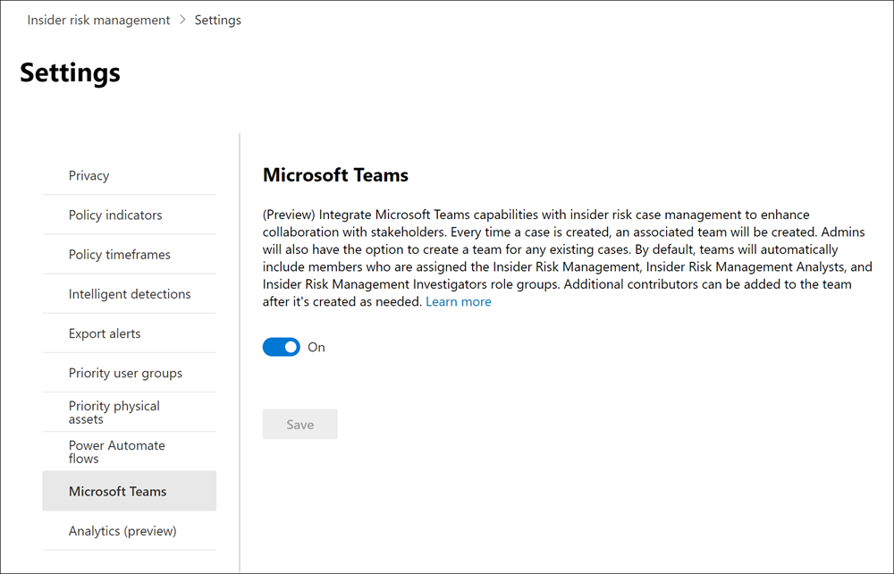

# Erste Schritte mit Einstellungen für das Insider-Risikomanagement

Einstellungen für das Insider-Risikomanagement gelten für alle Insider-Risikomanagementrichtlinien, unabhängig von der Vorlage, die Sie beim Erstellen einer Richtlinie auswählen. Die Einstellungen werden über das Steuerelement **Insider-Risiko-Einstellungen** konfiguriert, das sich oben auf allen Registerkarten des Insider-Risikomanagements befindet. Diese Einstellungen steuern Richtlinienkomponenten für die folgenden Bereiche:

- Datenschutz
- Indikatoren
- Richtlinienzeitachsen
- Intelligente Erkennungen
- Exportieren von Warnungen (Vorschau)
- Benutzergruppen mit Priorität (Vorschau)
- Priorität physischer Ressourcen (Vorschau)
- Power Automate Flüsse (Vorschau)
- Microsoft Teams (Vorschau)
- Analytics (Vorschau)

Bevor Sie beginnen und Richtlinien für das Insider-Risikomanagement erstellen, ist es wichtig, diese Einstellungen zu verstehen und die Einstellungsstufen auszuwählen, die für die Complianceanforderungen Ihrer Organisation am besten geeignet sind.

## Datenschutz

Der Schutz der Privatsphäre von Benutzern, die über Richtlinienübereinstimmungen verfügen, ist wichtig und kann zur Förderung der Objektivität bei der Überprüfung von Daten und Analysen im Hinblick auf Insider-Risikowarnungen beitragen. Für Benutzer mit einer Übereinstimmung mit einer Insider-Risikorichtlinie können Sie eine der folgenden Einstellungen auswählen:

- **Anonymisierte Versionen von Benutzernamen anzeigen:** Namen von Benutzern werden anonymisiert, um zu verhindern, dass Administratoren, Datenermittler und Prüfer sehen, wer richtlinienwarnungen zugeordnet ist. Zum Beispiel würde ein Benutzer "Grace Taylor" mit einem randomisierten Pseudonym wie "AnonIS8-988" in allen Bereichen des Insider-Risikomanagements erscheinen. Wenn Sie diese Einstellung wählen, werden alle Benutzer mit aktuellen und früheren Richtlinienübereinstimmungen anonymisiert und gelten für alle Richtlinien. Benutzerprofilinformationen in der Insider-Risikowarnung und Falldetails sind nicht verfügbar, wenn diese Option ausgewählt wird. Benutzernamen werden jedoch beim Hinzufügen neuer Benutzer zu vorhandenen Richtlinien oder beim Zuweisen von Benutzern zu neuen Richtlinien angezeigt. Wenn Sie diese Einstellung deaktivieren, werden Benutzernamen für alle Benutzer angezeigt, die aktuelle oder frühere Richtlinienüberstimmungen haben.
- **Anonymisierte Versionen von Benutzernamen nicht anzeigen:** Benutzernamen werden für alle aktuellen und früheren Richtlinienüberstimmungen für Warnungen und Fälle angezeigt. Benutzerprofilinformationen (Name, Titel, Alias und Organisation oder Abteilung) werden für den Benutzer für alle Warnungen und Fälle des Insider-Risikomanagements angezeigt.

## Indikatoren

Vorlagen für Insider-Risikorichtlinien definieren die Art der Risikoaktivitäten, die Sie erkennen und untersuchen möchten. Jede Richtlinienvorlage basiert auf bestimmten Indikatoren, die bestimmten Auslösern und Risikoaktivitäten entsprechen. Alle Indikatoren sind standardmäßig deaktiviert, und Sie müssen einen oder mehrere Richtlinienindikatoren auswählen, bevor Sie eine Insider-Risikomanagementrichtlinie konfigurieren.

Warnungen werden durch Richtlinien ausgelöst, wenn Benutzer Aktivitäten im Zusammenhang mit Richtlinienindikatoren ausführen, die einen erforderlichen Schwellenwert erfüllen. Das Insider-Risikomanagement verwendet zwei Arten von Indikatoren:

- **Auslösen von Ereignissen:** Ereignisse, die bestimmen, ob ein Benutzer in einer Insider-Risikomanagementrichtlinie aktiv ist. Wenn ein Benutzer zu einer Insider-Risikomanagementrichtlinie hinzugefügt wird, hat er kein auslösendes Ereignis, wird die Benutzeraktivität nicht von der Richtlinie ausgewertet. Beispielsweise wird Benutzer A einer Richtlinie hinzugefügt, die anhand *des Datendiebstahls* erstellt wurde, indem die Richtlinienvorlage des Benutzers verlassen wird, und die Richtlinie und Microsoft 365 HR-Connector ordnungsgemäß konfiguriert sind. Bis Benutzer A ein vom HR-Connector gemeldetes Beendigungsdatum hat, werden Benutzer-A-Aktivitäten von dieser Insider-Risikomanagementrichtlinie nicht auf Risiken ausgewertet. Ein weiteres Beispiel für ein auslösendes Ereignis ist, wenn ein Benutzer bei Verwendung von Richtlinien für *Datenlecks* eine DLP-Richtlinienwarnung mit *hohem* Schweregrad hat.
- **Richtlinienindikatoren:** Indikatoren, die in Insider-Risikomanagementrichtlinien enthalten sind, die verwendet werden, um eine Risikobewertung für einen Benutzer im Umfang zu bestimmen. Diese Richtlinienindikatoren werden erst aktiviert, nachdem ein auslösendes Ereignis für einen Benutzer auftritt. Einige Beispiele für Richtlinienindikatoren sind, wenn ein Benutzer Daten in persönliche Cloudspeicherdienste oder tragbare Speichergeräte kopiert, wenn ein Benutzerkonto aus Azure Active Directory entfernt wird oder wenn ein Benutzer interne Dateien und Ordner für nicht autorisierte externe Parteien teilt.

Richtlinienindikatoren sind in die folgenden Bereiche unterteilt. Sie können die Indikatoren auswählen, um Indikatorereignisgrenzwerte für jede Indikatorebene zu aktivieren und anzupassen, wenn Sie eine Insider-Risikorichtlinie erstellen:

- **Office Indikatoren:** Dazu gehören Richtlinienindikatoren für SharePoint Websites, Microsoft Teams und E-Mail-Nachrichten.
- **Geräteindikatoren:** Dazu gehören Richtlinienindikatoren für Aktivitäten wie das Freigeben von Dateien über das Netzwerk oder für Geräte. Zu den Indikatoren gehören Aktivitäten, die alle Dateitypen betreffen, mit Ausnahme von ausführbaren Dateien (.exe) und Dateiaktivitäten der dynamischen Linkbibliothek (.dll). Wenn Sie **Geräteindikatoren** auswählen, wird die Aktivität nur für Geräte mit Windows 10 Build 1809 oder höher verarbeitet, und Sie müssen zuerst Geräte in das Compliance Center integrieren. Weitere Informationen zum Konfigurieren von Geräten für die Integration mit Insider-Risiken finden Sie im abschnitt "Aktivieren von [Geräteindikatoren und Onboarding von Geräten"](insider-risk-management-settings.md#OnboardDevices) in diesem Artikel.
- **Indikator für Sicherheitsrichtlinienverstöße (Vorschau):** Dazu gehören Indikatoren von Microsoft Defender für Endpunkt im Zusammenhang mit nicht genehmigter oder bösartiger Softwareinstallation oder Umgehung von Sicherheitskontrollen. Um Warnungen im Insider-Risikomanagement zu erhalten, müssen Sie eine aktive Defender für Endpunkt-Lizenz und die Integration von Insider-Risiken aktiviert haben. Weitere Informationen zum Konfigurieren von Defender für Endpunkt für die Integration des Insider-Risikomanagements finden Sie unter [Konfigurieren erweiterter Features in Microsoft Defender für Endpunkt.](/windows/security/threat-protection/microsoft-defender-atp/advanced-features\#share-endpoint-alerts-with-microsoft-compliance-center)
- Indikatoren für **den physischen Zugriff (Vorschau):** Dazu gehören Richtlinienindikatoren für den physischen Zugriff auf vertrauliche Ressourcen. Beispielsweise kann versucht werden, zugriff auf einen eingeschränkten Bereich in Ihren physischen Fehlerhafte Systemprotokollen mit Insider-Risikomanagementrichtlinien zu verwenden. Um diese Arten von Warnungen im Insider-Risikomanagement zu erhalten, müssen Sie die prioritätsaktivierten physischen Ressourcen im Insider-Risikomanagement aktiviert und den Connector für [physische Fehlerhafte Daten](import-physical-badging-data.md) konfiguriert haben. Weitere Informationen zum Konfigurieren des physischen Zugriffs finden Sie im [Abschnitt "Priorität für physischen Zugriff"](#priority-physical-assets-preview) in diesem Artikel.
- **Microsoft Cloud App Security Indikatoren (Vorschau):** Dazu gehören Richtlinienindikatoren aus freigegebenen Warnungen von Cloud App Security. Automatische Aktivierung der Anomalieerkennung in Cloud App Security beginnt sofort mit dem Erkennen und Sortieren von Ergebnissen und richtet sich an zahlreiche Verhaltensanomalien zwischen Ihren Benutzern und den Computern und Geräten, die mit Ihrem Netzwerk verbunden sind. Um diese Aktivitäten in Richtlinienwarnungen für das Insider-Risikomanagement einzuschließen, wählen Sie einen oder mehrere Indikatoren in diesem Abschnitt aus. Weitere Informationen zu Cloud App Security Analyse und Anomalieerkennung finden Sie unter "Abrufen von [Verhaltensanalysen und Anomalieerkennung".](/cloud-app-security/anomaly-detection-policy)
- **Risikobewertungen:** Dazu gehören das Erhöhen der Risikobewertung für ungewöhnliche Aktivitäten oder frühere Richtlinienverstöße. Das Aktivieren von Risikobewertungsergebnissen erhöht die Risikobewertungen und die Wahrscheinlichkeit von Warnungen für diese Arten von Aktivitäten. Bei ungewöhnlichen Aktivitäten werden Bewertungen verstärkt, wenn die erkannte Aktivität vom typischen Verhalten des Benutzers abweicht. Beispielsweise ein erheblicher Anstieg der täglichen Dateidownloads. Ungewöhnliche Aktivitäten werden als prozentuale Erhöhung (z. B. "100 % über der üblichen Aktivität") dargestellt und wirken sich je nach Aktivität unterschiedlich auf die Risikobewertung aus. Bei Benutzern mit vorherigen Richtlinienverstößen werden die Bewertungen erhöht, wenn ein Benutzer mehr als einen Fall zuvor als bestätigter Richtlinienverstoß gelöst hat. Risikobewertungsbewertungen können nur ausgewählt werden, wenn ein oder mehrere Indikatoren ausgewählt sind.

In einigen Fällen sollten Sie die Indikatoren für Insider-Risikorichtlinien einschränken, die auf Insider-Risikorichtlinien in Ihrer Organisation angewendet werden. Sie können die Richtlinienindikatoren für bestimmte Bereiche deaktivieren, indem Sie sie von allen Insider-Risikorichtlinien deaktivieren. Auslösende Ereignisse können für Richtlinienvorlagen für Insider-Risiken nicht geändert werden.

Um die Indikatoren für Insider-Risikorichtlinien zu definieren, die in allen Insider-Risikorichtlinien aktiviert sind, navigieren Sie zu Indikatoren für **Insider-Risiken,**  >   und wählen Sie einen oder mehrere Richtlinienindikatoren aus. Die auf der Seite "Indikatoreneinstellungen" ausgewählten Indikatoren können beim Erstellen oder Bearbeiten einer Richtlinie für Insider-Risiken im Richtlinien-Assistenten nicht einzeln konfiguriert werden.

> [!NOTE]
> Es kann mehrere Stunden dauern, bis neue manuell hinzugefügte Benutzer im **Benutzerdashboard** angezeigt werden. Die Anzeige von Aktivitäten für die vorherigen 90 Tage für diese Benutzer kann bis zu 24 Stunden dauern. Um Aktivitäten für manuell hinzugefügte Benutzer anzuzeigen, wählen Sie den Benutzer im **Benutzerdashboard** aus, und öffnen Sie die Registerkarte **"Benutzeraktivität"** im Detailbereich.

### Aktivieren von Geräteindikatoren und Onboarding von Geräten

Um die Überwachung von Risikoaktivitäten auf Geräten zu aktivieren und Richtlinienindikatoren für diese Aktivitäten einzuschließen, müssen Ihre Geräte die folgenden Anforderungen erfüllen, und Sie müssen die folgenden Integrationsschritte ausführen.

#### Schritt 1: Vorbereiten der Endpunkte

Stellen Sie sicher, dass die Windows 10 Geräte, die Sie für die Berichterstellung im Insider-Risikomanagement planen, diese Anforderungen erfüllen.

1. Muss Windows 10 x64 Build 1809 oder höher ausgeführt werden und muss das [Windows 10 Update (BS Build 17763.1075)](https://support.microsoft.com/help/4537818/windows-10-update-kb4537818) vom 20. Februar 2020 installiert haben.
2. Das Benutzerkonto, das zum Anmelden beim Windows 10 Gerät verwendet wird, muss ein aktives Azure Active Directory (AAD)-Konto sein. Das Windows 10 Gerät kann [AAD,](/azure/active-directory/devices/concept-azure-ad-join)Hybrid-AAD oder Active Directory-Mitglied oder AAD registriert sein.
3. Installieren Sie Microsoft Chromium Edgebrowser auf dem Endpunktgerät, um Aktionen für die Clouduploadaktivität zu überwachen. Weitere Informationen finden Sie unter [Herunterladen des auf Chromium basierenden neuen Microsoft Edge](https://support.microsoft.com/help/4501095/download-the-new-microsoft-edge-based-on-chromium).

#### Schritt 2: Onboarding von Geräten

Sie müssen die Geräteüberwachung aktivieren und Ihre Endpunkte integrieren, bevor Sie Aktivitäten des Insider-Risikomanagements auf einem Gerät überwachen können. Beide Aktionen werden im Microsoft 365 Compliance-Portal ausgeführt.

Wenn Sie Geräte integrieren möchten, die noch nicht integriert wurden, laden Sie das entsprechende Skript herunter und stellen es bereit, wie in den folgenden Schritten beschrieben.

Wenn bereits Geräte in [Microsoft Defender für Endpunkt](/windows/security/threat-protection/) eingebunden sind, werden sie in der Liste der verwalteten Geräte angezeigt. Führen Sie [Schritt 3 aus: Wenn Sie Geräte im](insider-risk-management-settings.md#OnboardStep3) nächsten Abschnitt in Microsoft Defender für Endpunkt integriert haben.

In diesem Bereitstellungsszenario integrieren Sie Geräte, die noch nicht integriert wurden, und Sie möchten nur Insider-Risikoaktivitäten auf Windows 10 Geräten überwachen.

1. Öffnen Sie das [Microsoft Compliance Center](https://compliance.microsoft.com).
2. Öffnen Sie die Seite "Einstellungen", und wählen Sie **Geräte-Onboarding** aus.

   > [!NOTE]
   > In der Regel dauert es zwar nur ungefähr eine Minute, bis das Geräte-Onboarding aktiviert ist, warten Sie aber mindestens 30 Minuten, bevor Sie sich an den Microsoft-Support wenden.

3. Wählen Sie **Geräteverwaltung** aus, um die Liste der **Geräte** zu öffnen. Die Liste ist leer, solange keine Geräte eingebunden sind.
4. Wählen Sie **Onboarding** aus, um mit dem Onboarding-Prozess zu beginnen.
5. Wählen Sie in der Liste der **Bereitstellungsmethoden** aus, wie Sie diese weiteren Geräte bereitstellen möchten, und laden Sie dann das **Paket herunter.**
6. Führen Sie die unter [Onboarding-Tools und -Methoden für Windows 10-Computer](/windows/security/threat-protection/microsoft-defender-atp/configure-endpoints) beschriebenen entsprechenden Verfahren aus. Über diesen Link gelangen Sie zu einer Zielseite, auf der Microsoft Defender für Endpunkt-Prozeduren beschrieben werden, die dem in Schritt 5 ausgewählten Bereitstellungspaket entsprechen:
    - Onboarding von Windows 10-Computern mithilfe von Gruppenrichtlinien
    - Onboarding von Windows-Computern mithilfe von Microsoft Endpoint Configuration Manager
    - Onboarding von Windows 10-Computern mit Tools für die Verwaltung von Mobilgeräten
    - Onboarding von Windows 10-Computern mithilfe eines lokalen Skripts
    - Onboarding von nicht-persistenten Computern einer VD-Infrastruktur (Virtual Desktop)

Sobald dies abgeschlossen ist und der Endpunkt integriert ist, sollte er in der Geräteliste angezeigt werden, und der Endpunkt beginnt, Überwachungsaktivitätsprotokolle an das Insider-Risikomanagement zu melden.

> [!NOTE]
> Diese Funktion erfordert eine Lizenz. Ohne die erforderliche Lizenz werden keine Daten angezeigt und es ist kein Zugriff auf sie möglich.

#### Schritt 3: Wenn Sie Geräte in Microsoft Defender für Endpunkt integriert haben

Wenn Microsoft Defender für Endpunkt bereits bereitgestellt wurde und Endpunkte gemeldet werden, werden alle diese Endpunkte in der Liste der verwalteten Geräte angezeigt. Sie können weiterhin neue Geräte in das Insider-Risikomanagement integrieren, um die Abdeckung mithilfe des Abschnitts ["Schritt 2: Onboarding](insider-risk-management-settings.md#OnboardStep2) von Geräten" zu erweitern.

1. Öffnen Sie das [Microsoft Compliance Center](https://compliance.microsoft.com).
2. Öffnen Sie die Seite "Einstellungen", und wählen Sie **Geräteüberwachung aktivieren** aus.
3. Wählen Sie **Geräteverwaltung** aus, um die Liste der **Geräte** zu öffnen. Es sollte eine Liste der Geräte angezeigt werden, die bereits berichte in Microsoft Defender für Endpunkt.
4. Wählen Sie **"Onboarding",** wenn Sie weitere Geräte integrieren müssen.
5. Wählen Sie in der Liste der **Bereitstellungsmethoden** aus, wie Sie diese weiteren Geräte bereitstellen möchten, und laden Sie dann das **Paket herunter.**
6. Führen Sie die unter [Onboarding-Tools und -Methoden für Windows 10-Computer](/windows/security/threat-protection/microsoft-defender-atp/configure-endpoints) beschriebenen entsprechenden Verfahren aus. Über diesen Link gelangen Sie zu einer Zielseite, auf der Microsoft Defender für Endpunkt-Prozeduren beschrieben werden, die dem in Schritt 5 ausgewählten Bereitstellungspaket entsprechen:
    - Onboarding von Windows 10-Computern mithilfe von Gruppenrichtlinien
    - Onboarding von Windows-Computern mithilfe von Microsoft Endpoint Configuration Manager
    - Onboarding von Windows 10-Computern mit Tools für die Verwaltung von Mobilgeräten
    - Onboarding von Windows 10-Computern mithilfe eines lokalen Skripts
    - Onboarding von nicht-persistenten Computern einer VD-Infrastruktur (Virtual Desktop)

Sobald dies abgeschlossen ist und der Endpunkt integriert ist, sollte er unter der **Tabelle "Geräte"** angezeigt werden, und der Endpunkt beginnt mit der Berichterstellung von Überwachungsaktivitätsprotokollen an das Insider-Risikomanagement.

> [!NOTE]
>Diese Funktion erfordert eine Lizenz. Ohne die erforderliche Lizenz werden keine Daten angezeigt und es ist kein Zugriff auf sie möglich.

### Einstellungen auf Indikatorebene (Vorschau)

Beim Erstellen einer Richtlinie im Richtlinien-Assistenten können Sie konfigurieren, wie die tägliche Anzahl von Risikoereignissen die Risikobewertung für Insider-Risikowarnungen beeinflussen soll. Diese Indikatoreinstellungen helfen Ihnen zu steuern, wie sich die Anzahl der Vorkommen von Risikoereignissen in Ihrer Organisation auf die Risikobewertung und damit auf den zugehörigen Warnungsschweregrad für diese Ereignisse auswirken soll. Wenn Sie möchten, können Sie auch festlegen, dass die von Microsoft empfohlenen Standardereignisschwellenwerte für alle aktivierten Indikatoren beibehalten werden.

Sie entscheiden sich beispielsweise, SharePoint Indikatoren in den Richtlinieneinstellungen für Insider-Risiken zu aktivieren und benutzerdefinierte Schwellenwerte für SharePoint Ereignisse festzulegen, wenn Sie Indikatoren für eine neue Richtlinie für *Insider-Risikodatenlecks* konfigurieren. Im Assistenten für Insider-Risikorichtlinien konfigurieren Sie drei unterschiedliche tägliche Ereignisebenen für jeden SharePoint Indikator, um die Risikobewertung für Warnungen im Zusammenhang mit diesen Ereignissen zu beeinflussen.

Für die erste tägliche Ereignisstufe legen Sie den Schwellenwert auf *10 oder mehr Ereignisse pro Tag* fest, um eine niedrigere Auswirkung auf die Risikobewertung für die Ereignisse, *20 oder mehr Ereignisse pro Tag* für eine mittlere Auswirkung auf die Risikobewertung für die Ereignisse und *30 oder mehr Ereignisse pro Tag* eine höhere Auswirkung auf die Risikobewertung für die Ereignisse zu haben. Diese Einstellungen bedeuten effektiv:

- Wenn es 1 bis 9 SharePoint Ereignisse gibt, die nach dem Auslösen des Ereignisses stattfinden, sind die Risikobewertungen minimal betroffen und würden in der Regel keine Warnung generieren.
- Wenn es 10 bis 19 SharePoint Ereignisse gibt, die nach einem auslösenden Ereignis stattfinden, ist die Risikobewertung grundsätzlich niedriger, und die Warnungsschweregrade sind in der Regel auf einem niedrigen Niveau.
- Wenn es 20 bis 29 SharePoint Ereignisse gibt, die nach einem Auslösen stattfinden, ist die Risikobewertung grundsätzlich höher, und die Warnungsschweregrade sind in der Regel auf mittlerem Niveau.
- Wenn es 30 oder mehr SharePoint Ereignisse gibt, die nach einem Auslösen stattfinden, ist die Risikobewertung grundsätzlich höher, und die Warnungsschweregrade sind in der Regel auf einem hohen Niveau.

## Zeitrahmen für Richtlinien

Mit Hilfe von Zeitrahmen für Richtlinien können Sie vergangene und zukünftige Überprüfungszeiträume definieren, die nach Richtlinienübereinstimmungen auf der Grundlage von Ereignissen und Aktivitäten für die Richtlinienvorlagen zum Insider-Risikomanagement ausgelöst werden. Je nach der von Ihnen ausgewählten Richtlinienvorlage sind die folgenden Richtlinienzeitfenster verfügbar:

- **Aktivierungsfenster:** Für alle Richtlinienvorlagen verfügbar ist das *Aktivierungsfenster* die definierte Anzahl von Tagen, die das Fenster **nach** einem auslösenden Ereignis aktiviert. Das Fenster wird 1 bis 30 Tage lang aktiviert, nachdem ein auslösende Ereignis für jeden Benutzer auftritt, der der Richtlinie zugewiesen ist. Sie haben beispielsweise eine Insider-Risikomanagementrichtlinie konfiguriert und das *Aktivierungsfenster* auf 30 Tage festgelegt. Seit der Konfiguration der Richtlinie sind mehrere Monate vergangen, und für einen der in der Richtlinie enthaltenen Benutzer tritt ein auslösendes Ereignis auf. Das auslösende Ereignis aktiviert das *Aktivierungsfenster,* und die Richtlinie ist für diesen Benutzer 30 Tage lang aktiv, nachdem das auslösende Ereignis aufgetreten ist.
- **Erkennung früherer Aktivitäten:** Für alle Richtlinienvorlagen verfügbar ist die Erkennung früherer *Aktivitäten* die definierte Anzahl von Tagen, die das Fenster **vor** einem auslösenden Ereignis aktiviert. Das Fenster wird 0 bis 180 Tage lang aktiviert, bevor ein auslösendes Ereignis für jeden Benutzer auftritt, der der Richtlinie zugewiesen ist. Sie haben beispielsweise eine Insider-Risikomanagementrichtlinie konfiguriert und die *Erkennung früherer Aktivitäten* auf 90 Tage festgelegt. Seit der Konfiguration der Richtlinie sind mehrere Monate vergangen, und für einen der in der Richtlinie enthaltenen Benutzer tritt ein auslösendes Ereignis auf. Das auslösende Ereignis aktiviert die *Erkennung früherer Aktivitäten,* und die Richtlinie sammelt historische Aktivitäten für diesen Benutzer 90 Tage vor dem auslösenden Ereignis.

## Intelligente Erkennungen

Intelligente Erkennungseinstellungen helfen zu verfeinern, wie die Erkennungen riskanter Aktivitäten für Warnungen verarbeitet werden. Unter bestimmten Umständen müssen Sie möglicherweise Dateitypen definieren, die ignoriert werden sollen, oder Sie möchten eine Erkennungsstufe für Dateien erzwingen, um eine Mindestleiste für Warnungen zu definieren. Verwenden Sie diese Einstellungen, um das gesamte Warnungsvolumen, Dateitypausschlüsse und Dateivolumelimits zu steuern.

### Dateitypausschlüsse

Um bestimmte Dateitypen von allen Insider-Risikomanagementrichtlinien auszuschließen, geben Sie Dateityperweiterungen durch Kommas getrennt ein. Um beispielsweise bestimmte Arten von Musikdateien von den Richtlinienübereinstimmungen auszuschließen, können Sie AAC, MP3, WAV, WMA in das Feld **Dateityp-Ausschlüsse** eingeben. Dateien mit diesen Erweiterungen werden von allen Insider-Risikomanagementrichtlinien ignoriert.

### Schwellenwert für ungewöhnliche Dateiaktivität

Um eine minimale Dateiebene zu definieren, bevor Aktivitätswarnungen in Insider-Risikorichtlinien gemeldet werden, geben Sie die Anzahl der Dateien ein. Sie würden z. B. "10" eingeben, wenn Sie keine Insider-Risikowarnungen generieren möchten, wenn ein Benutzer 10 Dateien oder weniger herunterlädt, auch wenn die Richtlinien diese Aktivität als ungewöhnlich betrachten.

### Warnungsvolumen

Benutzeraktivitäten, die von Insider-Risikorichtlinien erkannt werden, werden einer bestimmten Risikobewertung zugewiesen, die wiederum den Schweregrad der Warnung bestimmt (niedrig, mittel, hoch). Standardmäßig generieren wir eine bestimmte Anzahl von Warnungen mit niedrigem, mittlerem und hohem Schweregrad, Sie können das Volume jedoch entsprechend Ihren Anforderungen erhöhen oder verringern. Um die Anzahl der Warnungen für alle Insider-Risikomanagementrichtlinien anzupassen, wählen Sie eine der folgenden Einstellungen aus:

- **Weniger Warnungen:** Sie werden alle Warnungen mit hohem Schweregrad, weniger Warnungen mit mittlerem Schweregrad und keine Warnungen mit geringem Schweregrad sehen. Diese Einstellungsebene bedeutet, dass Sie möglicherweise einige echte positive Ergebnisse verpassen.
- **Standardvolumen:** Es werden alle Warnungen mit hohem Schweregrad und eine ausgeglichene Anzahl von Warnungen mit mittleren und niedrigen Schweregraden angezeigt.
- **Weitere Warnungen:** Sie sehen alle Warnungen mit mittleren und hohen Schweregraden und die meisten Warnungen mit niedriger Dringlichkeit. Diese Einstellungsebene kann zu mehr falsch positiven Ergebnissen führen.

### Microsoft Defender für Endpunkt (Vorschau)

[Microsoft Defender für Endpunkt](/windows/security/threat-protection/microsoft-defender-atp/microsoft-defender-advanced-threat-protection) ist eine Sicherheitsplattform für Endpunkte für Unternehmen, die Unternehmensnetzwerke dabei unterstützt, fortgeschrittene Bedrohungen zu verhindern, zu erkennen, zu untersuchen und darauf zu reagieren. Um eine bessere Sichtbarkeit von Sicherheitsverstößen in Ihrer Organisation zu erhalten, können Sie Defender für Endpunkt-Warnungen für Aktivitäten importieren und filtern, die in Richtlinien verwendet werden, die aus Richtlinienvorlagen für Insider-Risikomanagement-Sicherheitsverletzungen erstellt wurden.

Abhängig von den Signaltypen, an denen Sie interessiert sind, können Sie basierend auf dem Defender für Endpunkt-Benachrichtigungs-Triagestatus Warnungen in das Insider-Risikomanagement importieren. Sie können einen oder mehrere der folgenden Status der Warnungstriage in den zu importierenden globalen Einstellungen definieren:

- Unbekannt
- Neu
- In Arbeit
- Gelöst

Warnungen von Defender für Endpunkt werden täglich importiert. Je nach ausgewähltem Triagestatus werden möglicherweise mehrere Benutzeraktivitäten für dieselbe Warnung angezeigt, da sich der Triagestatus in Defender für Endpunkt ändert.

Wenn Sie beispielsweise für diese Einstellung *"Neu"*, *"In Bearbeitung"* und *"Aufgelöst"* auswählen, wenn eine Microsoft Defender für Endpunkt-Warnung generiert wird und der Status *"Neu"* lautet, wird eine anfängliche Warnungsaktivität für den Benutzer im Insider-Risiko importiert. Wenn der Status der Defender für Endpunkt-Triage in *"In Bearbeitung"* geändert wird, wird eine zweite Aktivität für diese Warnung für den Benutzer im Insider-Risiko importiert. Wenn der endgültige Defender für Endpunkt-Triagestatus *"Gelöst"* festgelegt ist, wird eine dritte Aktivität für diese Warnung für den Benutzer im Insider-Risiko importiert. Diese Funktion ermöglicht es Ermittlern, den Verlauf der Defender für Endpunkt-Warnungen zu verfolgen und den Grad der Sichtbarkeit auszuwählen, den ihre Untersuchung erfordert.

> [!IMPORTANT]
> Sie müssen Microsoft Defender für Endpunkt in Ihrer Organisation konfiguriert haben und für die Integration des Insider-Risikomanagements Defender für Endpunkt im Defender Security Center aktivieren, um Warnungen bei Sicherheitsverstößen zu importieren. Weitere Informationen zum Konfigurieren von Defender für Endpunkt für die Insider-Risikomanagementintegration finden Sie unter [Konfigurieren erweiterter Features in Defender für Endpunkt](/windows/security/threat-protection/microsoft-defender-atp/advanced-features\#share-endpoint-alerts-with-microsoft-compliance-center).

### Domänen (Vorschau)

Mithilfe von Domäneneinstellungen können Sie Risikostufen für Aktivitäten für bestimmte Domänen definieren. Zu diesen Aktivitäten gehören das Freigeben von Dateien, das Senden von E-Mail-Nachrichten, das Herunterladen oder Hochladen von Inhalten. Indem Sie Domänen in diesen Einstellungen angeben, können Sie die Risikobewertung für Aktivitäten erhöhen oder verringern, die mit diesen Domänen stattfinden.

Verwenden Sie "Domäne hinzufügen", um eine Domäne für die einzelnen Domäneneinstellungen zu definieren. Darüber hinaus können Sie Platzhalter verwenden, um Abweichungen von Stammdomänen oder Unterdomänen zu ermitteln. Um beispielsweise sales.wingtiptoys.com und support.wingtiptoys.com anzugeben, verwenden Sie den Platzhaltereintrag "*.wingtiptoys.com", um diese Unterdomänen (und alle anderen Unterdomänen auf derselben Ebene) zuzuordnen. Um Unterdomänen mit mehreren Ebenen für eine Stammdomäne anzugeben, müssen Sie das Kontrollkästchen **"Unterdomänen mit mehreren Ebenen einschließen"** aktivieren.

Für jede der folgenden Domäneneinstellungen können Sie bis zu 500 Domänen eingeben:

- **Nicht zulässige Domänen:** Durch die Angabe nicht zulässiger Domänen weisen Aktivitäten, die mit diesen Domänen stattfinden, *höhere* Risikobewertungen auf. Beispiele sind Aktivitäten, bei denen Inhalte für jemanden freigegeben werden (z. B. das Senden von E-Mails an jemanden mit einer gmail.com-Adresse) und wenn Benutzer Inhalte von einer dieser nicht zugelassenen Domänen auf ein Gerät herunterladen.
- **Zulässige Domänen:** Bestimmte Aktivitäten im Zusammenhang mit zulässigen Domänen werden von Ihren Richtlinien ignoriert und generieren keine Warnungen. Zu diesen Aktivitäten gehören:

    - An externe Domänen gesendete E-Mails
    - Dateien, Ordner, Websites, die für externe Domänen freigegeben sind
    - Dateien, die in externe Domänen hochgeladen wurden (mit Microsoft Edge Browser)

    Durch die Angabe zulässiger Domänen in Den Einstellungen wird diese Aktivität mit diesen Domänen ähnlich behandelt wie die interne Organisationsaktivität. Beispielsweise können hier hinzugefügte Domänen Aktivitäten zugeordnet werden, um Inhalte für jemanden außerhalb Ihrer Organisation freizugeben (z. B. das Senden von E-Mails an eine Person mit einer gmail.com Adresse).

- **Drittanbieterdomänen:** Wenn Ihre Organisation Drittanbieterdomänen für Geschäftszwecke (z. B. Cloudspeicher) verwendet, fügen Sie diese hier ein, damit Sie Warnungen für Aktivitäten im Zusammenhang mit dem Geräteindikator erhalten *können. Verwenden Sie einen Browser zum Herunterladen von Inhalten von einer Drittanbieterwebsite.*

## Exportieren von Warnungen (Vorschau)

Warnungsinformationen zum Insider-Risikomanagement können über das [Office 365-Verwaltungsaktivitäts-API-Schema](/office/office-365-management-api/office-365-management-activity-api-schema#security-and-compliance-alerts-schema)in SIEM-Dienste (Security Information and Event Management) exportiert werden. Sie können die Office 365-Verwaltungsaktivitäts-APIs verwenden, um Warnungsinformationen in andere Anwendungen zu exportieren, die Ihre Organisation zum Verwalten oder Aggregieren von Insider-Risikoinformationen verwenden kann.

So verwenden Sie die APIs, um Informationen zu Insider-Risikowarnungen zu überprüfen:

1. Aktivieren Sie die Office 365-Verwaltungsaktivitäts-API-Unterstützung im **Insider-Risikomanagement**  >  **Einstellungen**  >  **Exportieren von Warnungen.** Diese Einstellung ist standardmäßig für Ihre Microsoft 365 Organisation deaktiviert.
2. Filtern Sie die allgemeinen Office 365 Überwachungsaktivitäten nach *SecurityComplianceAlerts.*
3. Filtern Sie *SecurityComplianceAlerts* nach der Kategorie *"InsiderRiskManagement".*

Warnungsinformationen enthalten Informationen aus dem Sicherheits- und Compliance-Warnungsschema und dem allgemeinen Schema der Office 365-Verwaltungsaktivitäts-API.

Die folgenden Felder und Werte werden für Warnungen des Insider-Risikomanagements für das Sicherheits- & Compliance-Warnungsschema exportiert:

| **Warnungsparameter** | **Beschreibung** |
|:------------------|:----------------|
| AlertType | Der Typ der Warnung ist *benutzerdefinierte*.  |
| AlertId | Die GUID der Warnung. Warnungen zum Insider-Risikomanagement sind änderbar. Wenn sich der Warnungsstatus ändert, wird ein neues Protokoll mit derselben AlertID generiert. Diese AlertID kann verwendet werden, um Updates für eine Warnung zu korrelieren. |
| Kategorie | Die Kategorie der Warnung ist *InsiderRiskManagement*. Diese Kategorie kann verwendet werden, um von diesen Warnungen von anderen Security & Compliance-Warnungen zu unterscheiden. |
| Kommentare | Standardkommentare für die Warnung. Die Werte sind *"Neue Warnung"* (beim Erstellen einer Warnung protokolliert) und *"Warnung aktualisiert"* (protokolliert, wenn eine Warnung aktualisiert wurde). Verwenden Sie die AlertID, um Updates für eine Warnung zu korrelieren. |
| Daten | Die Daten für die Warnung enthalten die eindeutige Benutzer-ID, den Benutzerprinzipalnamen sowie Datum und Uhrzeit (UTC), zu der der Benutzer in eine Richtlinie ausgelöst wurde. |
| Name | Richtlinienname für Die Insider-Risikomanagementrichtlinie, die die Warnung generiert hat. |
| PolicyId | Die GUID der Insider-Risikomanagementrichtlinie, die die Warnung ausgelöst hat. |
| Schweregrad | Der Schweregrad der Warnung. Die Werte sind *"Hoch",* *"Mittel"* oder *"Niedrig".* |
| Source | Die Quelle der Warnung. Der Wert ist *Office 365 Security & Compliance*. |
| Status | Der Status der Warnung. Die Werte sind *aktiv* (*Erfordert Überprüfung* im Insider-Risiko), *Investigating* (*Bestätigt* in Insider-Risiko), *Resolved* (*Behoben* in Insider-Risiko), *Dismissed* (*Dismissed* in insider risk). |
| Version | Die Version des Sicherheits- und Compliancewarnungsschemas. |

Die folgenden Felder und Werte werden für Insider-Risikomanagementwarnungen für das [allgemeine Schema Office 365 Verwaltungsaktivitäts-API](/office/office-365-management-api/office-365-management-activity-api-schema#common-schema)exportiert.

- UserId
- Id
- RecordType
- CreationTime
- Vorgang
- OrganizationId
- UserType
- UserKey

## Benutzergruppen mit Priorität (Vorschau)

Benutzer in Ihrer Organisation haben je nach Position, Zugriffsebene auf vertrauliche Informationen oder Risikoverlauf möglicherweise unterschiedliche Risikostufen. Die Priorisierung der Prüfung und Bewertung der Aktivitäten dieser Benutzer kann Ihnen dabei helfen, sie auf potenzielle Risiken hinzuweisen, die höhere Auswirkungen auf Ihre Organisation haben können. Prioritätsbenutzergruppen im Insider-Risikomanagement helfen bei der Definition der Benutzer in Ihrer Organisation, die eine genauere Überprüfung und eine sensiblere Risikobewertung benötigen. Zusammen mit den *Sicherheitsrichtlinienverstößen nach Prioritätsbenutzern* und *Datenlecks nach* Richtlinienvorlagen für Prioritätsbenutzer haben Benutzer, die einer Benutzergruppe mit Priorität hinzugefügt werden, eine höhere Wahrscheinlichkeit von Insider-Risikowarnungen und Warnungen mit höheren Schweregraden.

Sie müssen sich beispielsweise vor Datenlecks für ein streng vertrauliches Projekt schützen, bei dem Benutzer Zugriff auf vertrauliche Informationen haben. Sie können die Benutzergruppe *"Vertraulich Project* *Benutzer* mit Priorität" für Benutzer in Ihrer Organisation erstellen, die an diesem Projekt arbeiten. Mithilfe des Richtlinien-Assistenten und der Richtlinienvorlage *"Datenlecks nach Benutzern* mit Priorität" erstellen Sie eine neue Richtlinie und weisen der Richtlinie die Gruppe *"Vertraulich Project Benutzer* mit Priorität" zu. Aktivitäten, die von der Richtlinie für Mitglieder der Benutzerprioritätsgruppe *"Vertraulich" Project "Benutzer"* überprüft werden, sind anfälliger für Risiken, und Aktivitäten dieser Benutzer generieren mit größerer Wahrscheinlichkeit eine Warnung und weisen Warnungen mit höherem Schweregrad auf.

### Erstellen einer Benutzergruppe mit Priorität

Um eine neue Benutzergruppe mit Priorität zu erstellen, verwenden Sie Einstellungssteuerelemente in der Lösung für das **Insider-Risikomanagement** im Microsoft 365 Compliance Center. Um eine Benutzergruppe mit Priorität zu erstellen, müssen Sie Mitglied der Rollengruppe *"Insider-Risikomanagement"* oder "Administrator für *Insider-Risikomanagement"* sein.

Führen Sie die folgenden Schritte aus, um eine Benutzergruppe mit Priorität zu erstellen:

1. Wechseln [Sie](https://compliance.microsoft.com)im Microsoft 365 Compliance Center zum **Insider-Risikomanagement,** und wählen Sie **Einstellungen für Insider-Risiken** aus.
2. Wählen Sie die Registerkarte **"Benutzergruppen priorität"** aus.
3. Wählen Sie auf der Registerkarte **"Benutzergruppen** priorität" die Option **"Benutzergruppe mit Priorität erstellen"** aus, um den Gruppenerstellungs-Assistenten zu starten.
4. Füllen Sie auf der Seite **"Gruppe definieren"** die folgenden Felder aus:
    - **Name (erforderlich):** Geben Sie einen Anzeigenamen für die Prioritätsbenutzergruppe ein. Sie können den Namen der Benutzergruppe mit Priorität nicht mehr ändern, nachdem Sie den Assistenten abgeschlossen haben.
    - **Beschreibung (optional):** Geben Sie eine Beschreibung für die Benutzergruppe mit Priorität ein.
5. Wählen Sie **Weiter** aus, um fortzufahren.
6. Wählen Sie auf der Seite **"Mitglieder auswählen"** die Option **"Mitglieder** auswählen" aus, um zu suchen, und wählen Sie aus, welche E-Mail-aktivierten Benutzerkonten in der Gruppe enthalten sind, oder aktivieren Sie das Kontrollkästchen **"Alle auswählen",** um alle Benutzer in Ihrer Organisation zur Gruppe hinzuzufügen. Wählen Sie **"Hinzufügen"** aus, um fortzufahren, oder **"Abbrechen",** um zu schließen, ohne der Gruppe Benutzer hinzuzufügen.
7. Wählen Sie **Weiter** aus, um fortzufahren.
8. Überprüfen Sie auf der Seite **"Überprüfen"** die Einstellungen, die Sie für die Benutzergruppe mit Priorität ausgewählt haben. Wählen Sie **"Bearbeiten"** aus, um einen der Gruppenwerte zu ändern, oder wählen Sie **"Übermitteln"** aus, um die Benutzergruppe mit Priorität zu erstellen und zu aktivieren.
9. Wählen Sie auf der Bestätigungsseite **"Fertig"** aus, um den Assistenten zu beenden.

### Aktualisieren einer Benutzergruppe mit Priorität

Um eine vorhandene Benutzergruppe mit Priorität zu aktualisieren, verwenden Sie Einstellungssteuerelemente in der Lösung für das **Insider-Risikomanagement** im Microsoft 365 Compliance Center. Um eine Benutzergruppe mit Priorität zu aktualisieren, müssen Sie Mitglied der Rollengruppe *"Insider-Risikomanagement"* oder "Administrator des *Insider-Risikomanagements"* sein.

Führen Sie die folgenden Schritte aus, um eine Benutzergruppe mit Priorität zu bearbeiten:

1. Wechseln [Sie](https://compliance.microsoft.com)im Microsoft 365 Compliance Center zum **Insider-Risikomanagement,** und wählen Sie **Einstellungen für Insider-Risiken** aus.
2. Wählen Sie die Registerkarte **"Benutzergruppen priorität"** aus.
3. Wählen Sie die Prioritätsbenutzergruppe aus, die Sie bearbeiten möchten, und wählen Sie **"Gruppe bearbeiten"** aus.
4. Aktualisieren Sie auf der Seite **"Gruppe definieren"** bei Bedarf das Feld "Beschreibung". Sie können den Namen der Prioritätsbenutzergruppe nicht aktualisieren. Wählen Sie **Weiter** aus, um fortzufahren.
5. Fügen Sie auf der Seite **"Mitglieder auswählen"** der Gruppe mithilfe des Steuerelements **"Mitglieder auswählen"** neue Mitglieder hinzu. Um einen Benutzer aus der Gruppe zu entfernen, wählen Sie das X neben dem Benutzer aus, den Sie entfernen möchten. Wählen Sie **Weiter** aus, um fortzufahren.
6. Überprüfen Sie auf der Seite **"Überprüfen"** die Updateeinstellungen, die Sie für die Benutzergruppe mit Priorität ausgewählt haben. Wählen Sie **"Bearbeiten"** aus, um einen der Gruppenwerte zu ändern, oder wählen Sie **"Übermitteln"** aus, um die Benutzergruppe mit Priorität zu aktualisieren.
7. Wählen Sie auf der Bestätigungsseite **"Fertig"** aus, um den Assistenten zu beenden.

### Löschen einer Benutzergruppe mit Priorität

Um eine vorhandene Benutzergruppe mit Priorität zu löschen, verwenden Sie Einstellungssteuerelemente in der Lösung für das **Insider-Risikomanagement** im Microsoft 365 Compliance Center. Um eine Benutzergruppe mit Priorität zu löschen, müssen Sie Mitglied der Rollengruppe *"Insider-Risikomanagement"* oder "Administrator für *Insider-Risikomanagement"* sein.

> [!IMPORTANT]
> Wenn Sie eine Benutzergruppe mit Priorität löschen, wird sie aus jeder aktiven Richtlinie entfernt, der sie zugewiesen ist. Wenn Sie eine Prioritätsbenutzergruppe löschen, die einer aktiven Richtlinie zugewiesen ist, enthält die Richtlinie keine Benutzer im Bereich, befindet sich im Leerlauf und erstellt keine Warnungen.

Führen Sie die folgenden Schritte aus, um eine Benutzergruppe mit Priorität zu löschen:

1. Wechseln [Sie](https://compliance.microsoft.com)im Microsoft 365 Compliance Center zum **Insider-Risikomanagement,** und wählen Sie **Einstellungen für Insider-Risiken** aus.
2. Wählen Sie die Registerkarte **"Benutzergruppen priorität"** aus.
3. Wählen Sie die Priorität der Benutzergruppe aus, die Sie bearbeiten möchten, und wählen Sie im Menü "Dashboard" die Option **"Löschen"** aus.
4. Wählen Sie im Dialogfeld **"Löschen"** die Option **"Ja"** aus, um die Prioritätsbenutzergruppe zu löschen, oder wählen Sie **"Abbrechen"** aus, um zum Dashboard zurückzukehren.

## Priorität physischer Ressourcen (Vorschau)

Das Identifizieren des Zugriffs auf physische Ressourcen mit Priorität und das Korrelieren von Zugriffsaktivitäten mit Benutzerereignissen ist ein wichtiger Bestandteil Ihrer Compliance-Infrastruktur. Diese physischen Ressourcen stellen Prioritätsstandorte in Ihrer Organisation dar, z. B. Firmenobjekte, Rechenzentren oder Serverräume. Insider-Risikoaktivitäten können mit Benutzern verbunden sein, die ungewöhnliche Stunden arbeiten, versuchen, auf diese nicht autorisierten vertraulichen oder sicheren Bereiche zuzugreifen, und Anforderungen für den Zugriff auf Bereiche auf hoher Ebene ohne berechtigte Anforderungen.

Mit aktivierten und konfigurierten physischen Ressourcen und dem konfigurierten [Konnektor](import-physical-badging-data.md) für physische Fehlerhafte Daten integriert das Insider-Risikomanagement Signale von Ihren physischen Steuerungs- und Zugriffssystemen in andere Benutzerrisikoaktivitäten. Durch die Untersuchung von Verhaltensmustern in physischen Zugriffssystemen und die Korrelation dieser Aktivitäten mit anderen Insider-Risikoereignissen kann das Insider-Risikomanagement Compliance-Ermittlern und Analysten dabei helfen, fundierte entscheidungen für Warnungen zu treffen. Der Zugriff auf physische Ressourcen mit Priorität wird in Einblicken anders bewertet und identifiziert als der Zugriff auf Nicht-Prioritätsressourcen.

Ihre Organisation verfügt z. B. über ein Fehlerhaftes System für Benutzer, das den physischen Zugriff auf normale Arbeits- und sensible Projektbereiche überwacht und genehmigt. Sie haben mehrere Benutzer, die an einem vertraulichen Projekt arbeiten, und diese Benutzer kehren zu anderen Bereichen Ihrer Organisation zurück, wenn das Projekt abgeschlossen ist. Wenn das vertrauliche Projekt kurz vor dem Abschluss steht, sollten Sie sicherstellen, dass die Projektarbeit vertraulich bleibt und der Zugriff auf die Projektbereiche streng kontrolliert wird.

Sie entscheiden sich dafür, den Connector für physische Fehlerhafte Daten in Microsoft 365 zu aktivieren, um Zugriffsinformationen aus Ihrem physischen Fehlerhaften System zu importieren und die Priorität physischer Ressourcen im Insider-Risikomanagement anzugeben. Indem Sie Informationen aus Ihrem Auslagerungssystem importieren und physische Zugriffsinformationen mit anderen Risikoaktivitäten korrelieren, die im Insider-Risikomanagement identifiziert werden, stellen Sie fest, dass einer der Benutzer des Projekts nach normalen Arbeitszeiten auf die Projektbüro zugreift und außerdem große Datenmengen aus ihrem normalen Arbeitsbereich in einen persönlichen Cloudspeicherdienst exportiert. Diese physische Zugriffsaktivität im Zusammenhang mit der Onlineaktivität kann auf möglichen Datendiebstahl hinweisen, und Compliance-Ermittler und Analysten können geeignete Maßnahmen ergreifen, wie die Umstände für diesen Benutzer bestimmen.

### Konfigurieren von physischen Ressourcen mit Priorität

Um die Priorität physischer Ressourcen zu konfigurieren, konfigurieren Sie den Konnektor für physisches Badging und verwenden Einstellungssteuerelemente in der **Insider-Risikomanagementlösung** im Microsoft 365 Compliance Center. Um physische Ressourcen mit Priorität zu konfigurieren, müssen Sie Mitglied der Rollengruppe *"Insider-Risikomanagement"* oder *"Administrator für Insider-Risikomanagement"* sein.

Führen Sie die folgenden Schritte aus, um physische Ressourcen mit Priorität zu konfigurieren:

1. Befolgen Sie die Konfigurationsschritte für das Insider-Risikomanagement im Artikel ["Erste Schritte mit dem Insider-Risikomanagement".](insider-risk-management-configure.md) Stellen Sie in Schritt 3 sicher, dass Sie den Konnektor für physisches Fehlerhaftes konfigurieren.

    > [!IMPORTANT]
    > Damit Richtlinien für das Insider-Risikomanagement Signaldaten im Zusammenhang mit verlassenden und beendeten Benutzern mit Ereignisdaten von Ihren physischen Kontroll- und Zugriffsplattformen verwenden und korrelieren können, müssen Sie auch den Microsoft 365 HR-Connector konfigurieren. Wenn Sie den Connector für physisches Fehlerhaftes Aktivieren aktivieren, ohne den Microsoft 365 HR-Connector zu aktivieren, verarbeiten Richtlinien für insider-Risikomanagement nur Ereignisse für physische Zugriffsaktivitäten für Benutzer in Ihrer Organisation.

2. Wechseln [Sie im Microsoft 365 Compliance Center](https://compliance.microsoft.com)zum **Insider-Risikomanagement,** und wählen Sie **Einstellungen für Insider-Risiken**  >  **aus, die physische Ressourcen priorität** haben.
3. Auf der Seite **"Physische Ressourcen priorität"** können Sie entweder manuell die physischen Objekt-IDs hinzufügen, die Sie für die Vom Physischen Badging-Connector importierten Objektereignisse überwachen möchten, oder eine .csv Datei aller physischen Ressourcen-IDs importieren, die vom Konnektor für physisches Fehlerhaftes Importieren importiert wurden: a) Um physische Ressourcen-IDs manuell hinzuzufügen, wählen **Sie "Physische Ressourcen mit Priorität hinzufügen"** aus, geben Sie eine physische Objekt-ID ein, und wählen Sie dann **"Hinzufügen"** aus. Geben Sie andere physische Objekt-IDs ein, und wählen Sie dann **"Physische Ressourcen mit Priorität hinzufügen"** aus, um alle eingegebenen Ressourcen zu speichern.
    b) Um eine Liste der physischen Objekt-IDs aus einer .csv Datei hinzuzufügen, wählen Sie **"Physische Ressourcen mit Priorität importieren"** aus. Wählen Sie im Dialogfeld "Datei-Explorer" die .csv Datei aus, die Sie importieren möchten, und wählen Sie dann **"Öffnen"** aus. Die physischen Objekt-IDs aus den .csv Dateien werden der Liste hinzugefügt.
4. Navigieren Sie zur Registerkarte **"Richtlinienindikatoren"** in Einstellungen.
5. Navigieren Sie auf der Seite **"Richtlinienindikatoren"** zum Abschnitt "Indikatoren für den **physischen Zugriff",** und aktivieren Sie das Kontrollkästchen für **physischen Zugriff nach Beendigung oder fehlgeschlagenen Zugriff auf vertrauliche Ressourcen.**
6. Wählen Sie **"Speichern"** aus, um sie zu konfigurieren und zu beenden.

### Löschen einer physischen Ressource mit Priorität

Um ein vorhandenes physisches Objekt mit Priorität zu löschen, verwenden Sie die Einstellungssteuerelemente in der Lösung für das Insider-Risikomanagement im Microsoft 365 Compliance Center. Um eine prioritätsbewährte physische Ressource zu löschen, müssen Sie Mitglied der Rollengruppe "Insider-Risikomanagement" oder "Administrator für Insider-Risikomanagement" sein.

> [!IMPORTANT]
> Durch das Löschen einer physischen Ressource mit prioritätsbehindender Bedeutung wird sie von jeder aktiven Richtlinie, in die sie zuvor einbezogen wurde, aus der Prüfung entfernt. Warnungen, die von Aktivitäten generiert werden, die der physischen Ressource mit Priorität zugeordnet sind, werden nicht gelöscht.

Führen Sie die folgenden Schritte aus, um eine physische Ressource mit Priorität zu löschen:

1. Wechseln [Sie im Microsoft 365 Compliance Center](https://compliance.microsoft.com)zum **Insider-Risikomanagement,** und wählen Sie **Einstellungen für Insider-Risiken**  >  **aus, die physische Ressourcen priorität** haben.
2. Wählen Sie auf der Seite **"Physische Ressourcen priorität"** die Ressource aus, die Sie löschen möchten.
3. Wählen Sie im Aktionsmenü **"Löschen"** aus, um die Ressource zu löschen.

## Power Automate Flüsse (Vorschau)

[Microsoft Power Automate](/power-automate/getting-started) ist ein Workflowdienst, der Aktionen über Anwendungen und Dienste hinweg automatisiert. Durch die Verwendung von Flüssen aus Vorlagen oder manuell erstellte, können Sie allgemeine Aufgaben im Zusammenhang mit diesen Anwendungen und Diensten automatisieren. Wenn Sie Power Automate Flüsse für das Insider-Risikomanagement aktivieren, können Sie wichtige Aufgaben für Fälle und Benutzer automatisieren. Sie können Power Automate Flüsse konfigurieren, um Benutzer-, Warnungs- und Fallinformationen abzurufen und diese Informationen für Projektbeteiligten und andere Anwendungen freizugeben sowie Aktionen im Insider-Risikomanagement zu automatisieren, z. B. das Veröffentlichen von Fallnotizen. Power Automate Flüsse gelten für Fälle und alle Benutzer im Bereich einer Richtlinie.

Kunden mit Microsoft 365 Abonnements, die das Insider-Risikomanagement enthalten, benötigen keine zusätzlichen Power Automate Lizenzen, um die empfohlenen Vorlagen für das Insider-Risikomanagement Power Automate verwenden zu können. Diese Vorlagen können angepasst werden, um Ihre Organisation zu unterstützen und kernszenarien des Insider-Risikomanagements abzudecken. Wenn Sie premium Power Automate Features in diesen Vorlagen verwenden, eine benutzerdefinierte Vorlage mithilfe des Microsoft 365 Compliance-Connectors erstellen oder Power Automate Vorlagen für andere Compliancebereiche in Microsoft 365 verwenden, benötigen Sie möglicherweise mehr Power Automate Lizenzen.

Die folgenden Power Automate Vorlagen werden Kunden bereitgestellt, um die Prozessautomatisierung für Benutzer und Fälle des Insider-Risikomanagements zu unterstützen:

- **Benachrichtigen Sie Benutzer, wenn sie einer Insider-Risikorichtlinie hinzugefügt werden:** Diese Vorlage ist für Organisationen mit internen Richtlinien, Datenschutz- oder behördlichen Anforderungen, die Benutzer benachrichtigen müssen, wenn sie Insider-Risikomanagementrichtlinien unterliegen. Wenn dieser Fluss für einen Benutzer auf der Benutzerseite konfiguriert und ausgewählt wird, wird Benutzern und deren Vorgesetzten eine E-Mail-Nachricht gesendet, wenn der Benutzer einer Insider-Risikomanagementrichtlinie hinzugefügt wird. Diese Vorlage unterstützt auch das Aktualisieren einer SharePoint Liste, die auf einer SharePoint Website gehostet wird, um Benachrichtigungsdetails wie Datum/Uhrzeit und den Nachrichtenempfänger nachzuverfolgen. Wenn Sie sich entschieden haben, Benutzer in **den Datenschutzeinstellungen** zu anonymisieren, funktionieren flüsse, die anhand dieser Vorlage erstellt wurden, nicht wie beabsichtigt, sodass der Datenschutz des Benutzers aufrechterhalten wird. Power Automate Flüsse, die diese Vorlage verwenden, sind im **Benutzerdashboard** verfügbar.
- **Fordern Sie Informationen von PERSONAL oder Unternehmen über einen Benutzer in einem Insider-Risikofall** an: Wenn Sie in einem Fall handeln, müssen Insider-Risikoanalysten und Ermittler sich möglicherweise an hr oder andere Interessengruppen wenden, um den Kontext der Fallaktivitäten zu verstehen. Wenn dieser Fluss für einen Fall konfiguriert und ausgewählt wird, senden Analysten und Ermittler eine E-Mail-Nachricht an personal- und geschäftliche Interessengruppen, die für diesen Fluss konfiguriert sind. Jedem Empfänger wird eine Nachricht mit vorkonfigurierten oder anpassbaren Antwortoptionen gesendet. Wenn Empfänger eine Antwortoption auswählen, wird die Antwort als Fallnotiz aufgezeichnet und enthält Empfänger- und Datums-/Uhrzeitinformationen. Wenn Sie sich entschieden haben, Benutzer in **den Datenschutzeinstellungen** zu anonymisieren, funktionieren flüsse, die anhand dieser Vorlage erstellt wurden, nicht wie beabsichtigt, sodass der Datenschutz des Benutzers aufrechterhalten wird. Power Automate Flüsse, die diese Vorlage verwenden, sind im **Dashboard "Fälle"** verfügbar.
- **Benachrichtigen Sie den Vorgesetzten, wenn ein Benutzer über eine Insider-Risikowarnung verfügt:** Einige Organisationen müssen möglicherweise eine sofortige Verwaltungsbenachrichtigung erhalten, wenn ein Benutzer über eine Insider-Risikomanagementwarnung verfügt. Wenn dieser Fluss konfiguriert und ausgewählt ist, wird dem Vorgesetzten für den Fallbenutzer eine E-Mail-Nachricht mit den folgenden Informationen zu allen Fallwarnungen gesendet:
    - Anwendbare Richtlinie für die Warnung
    - Datum/Uhrzeit der Warnung
    - Schweregrad der Warnung

    Der Fluss aktualisiert automatisch die Fallhinweise, dass die Nachricht gesendet und der Fluss aktiviert wurde. Wenn Sie sich entschieden haben, Benutzer in **den Datenschutzeinstellungen** zu anonymisieren, funktionieren flüsse, die anhand dieser Vorlage erstellt wurden, nicht wie beabsichtigt, sodass der Datenschutz des Benutzers aufrechterhalten wird. Power Automate Flüsse, die diese Vorlage verwenden, sind im **Dashboard "Fälle"** verfügbar.
- Erstellen Sie einen Datensatz für den Fall von **Insider-Risiken in ServiceNow:** Diese Vorlage ist für Organisationen vorgesehen, die ihre ServiceNow-Lösung verwenden möchten, um Fälle des Insider-Risikomanagements nachzuverfolgen.  In einem Fall können Insider-Risikoanalysten und -ermittler einen Datensatz für den Fall in ServiceNow erstellen. Sie können diese Vorlage anpassen, um ausgewählte Felder in ServiceNow basierend auf den Anforderungen Ihrer Organisation aufzufüllen. Power Automate Flüsse, die diese Vorlage verwenden, sind im **Dashboard "Fälle"** verfügbar. Weitere Informationen zu verfügbaren ServiceNow-Feldern finden Sie im Referenzartikel zum [ServiceNow-Connector.](/connectors/service-now/)

### Erstellen eines Power Automate Flusses aus der Vorlage für das Insider-Risikomanagement

Um einen Power Automate Ablauf aus einer empfohlenen Vorlage für das Insider-Risikomanagement zu erstellen, verwenden Sie die Einstellungssteuerelemente in der Lösung für das **Insider-Risikomanagement** im Microsoft 365 Compliance Center oder die Option **"Verwalten Power Automate Flüsse"** aus dem **Steuerelement "Automatisieren",** wenn Sie direkt in den Dashboards **"Fälle"** oder **"Benutzer"** arbeiten.

Um einen Power Automate Ablauf im Einstellungsbereich zu erstellen, müssen Sie Mitglied der Rollengruppe *"Insider-Risikomanagement"* oder "Administrator für *Insider-Risikomanagement"* sein. Um einen Power Automate Fluss mit der Option **"Power Automate Flüsse verwalten"** zu erstellen, müssen Sie Mitglied mindestens einer Rollengruppe für das Insider-Risikomanagement sein.

Führen Sie die folgenden Schritte aus, um einen Power Automate Fluss aus einer empfohlenen Vorlage für das Insider-Risikomanagement zu erstellen:

1. Wechseln [Sie im Microsoft 365 Compliance Center](https://compliance.microsoft.com/)zum **Insider-Risikomanagement,** und wählen Sie **Einstellungen für Insider-Risiken**  >  **Power Automate Flüsse aus.** Sie können auch über die Dashboardseiten **"Fälle"** oder **"Benutzer"** zugreifen, indem Sie **"Automate**  >  **Manage Power Automate flows"** auswählen.
2. Wählen Sie auf der Seite **Power Automate Flüsse** eine empfohlene Vorlage aus den Vorlagen für das **Insider-Risikomanagement** aus, die Ihnen möglicherweise im Abschnitt auf der Seite gefällt.
3. Der Fluss listet die eingebetteten Verbindungen auf, die für den Fluss erforderlich sind, und notiert, ob die Verbindungsstatus verfügbar sind. Aktualisieren Sie bei Bedarf alle Verbindungen, die nicht als verfügbar angezeigt werden. Wählen Sie **Weiter**.
4. Standardmäßig sind die empfohlenen Flüsse mit dem empfohlenen Insider-Risikomanagement und Microsoft 365 Dienstdatenfeldern vorkonfiguriert, die zum Ausführen der zugewiesenen Aufgabe für den Fluss erforderlich sind. Passen Sie bei Bedarf die Flusskomponenten an, indem Sie das Steuerelement **"Erweiterte Optionen anzeigen"** verwenden und die verfügbaren Eigenschaften für die Flusskomponente konfigurieren.
5. Fügen Sie ggf. weitere Schritte zum Fluss hinzu, indem Sie die Schaltfläche **"Neuer Schritt"** auswählen. In den meisten Fällen sollte dies für die empfohlenen Standardvorlagen nicht erforderlich sein.
6. Wählen Sie **"Entwurf speichern"** aus, um den Fluss zur weiteren Konfiguration zu speichern, oder wählen Sie **"Speichern"** aus, um die Konfiguration für den Fluss abzuschließen.
7. Wählen Sie **"Schließen"** aus, um zur **Power Automate Flussseite** zurückzukehren. Die neue Vorlage wird als Fluss auf den Registerkarten **"Meine Flüsse"** aufgeführt und ist automatisch über das **Dropdown-Steuerelement "Automatisieren"** verfügbar, wenn sie mit Insider-Risikomanagementfällen für den Benutzer arbeitet, der den Fluss erstellt.

> [!IMPORTANT]
> Wenn andere Benutzer in Ihrer Organisation Zugriff auf den Fluss benötigen, muss der Fluss freigegeben werden.

### Erstellen eines benutzerdefinierten Power Automate Ablaufs für das Insider-Risikomanagement

Einige Prozesse und Workflows für Ihre Organisation befinden sich möglicherweise außerhalb der empfohlenen Flow-Vorlagen für Insider-Risikomanagement, und Sie müssen möglicherweise benutzerdefinierte Power Automate Flüsse für Insider-Risikomanagementbereiche erstellen. Power Automate Flüsse sind flexibel und unterstützen umfassende Anpassungen, aber es gibt Schritte, die zur Integration in Insider-Risikomanagementfeatures erforderlich sind.

Führen Sie die folgenden Schritte aus, um eine benutzerdefinierte Power Automate Vorlage für das Insider-Risikomanagement zu erstellen:

1. **Überprüfen Sie Ihre Power Automate Flusslizenz:** Um angepasste Power Automate Flüsse zu erstellen, die Insider-Risikomanagementtrigger verwenden, benötigen Sie eine Power Automate Lizenz. Die empfohlenen Vorlagen für den Ablauf des Insider-Risikomanagements erfordern keine zusätzliche Lizenzierung und sind teil Ihrer Insider-Risikomanagement-Lizenz.
2. **Erstellen eines automatisierten Flusses:** Erstellen Sie einen Fluss, der eine oder mehrere Aufgaben ausführt, nachdem er durch ein Insider-Risikomanagementereignis ausgelöst wurde. Ausführliche Informationen zum Erstellen eines automatisierten Flusses finden Sie unter [Erstellen eines Flusses in Power Automate](/power-automate/get-started-logic-flow).
3. **Wählen Sie den Microsoft 365 Compliance-Connector** aus: Suchen Sie nach dem Microsoft 365 Compliance-Connector, und wählen Sie den Connector aus. Dieser Connector ermöglicht Auslöser und Aktionen des Insider-Risikomanagements. Weitere Informationen zu Connectors finden Sie im [Connector-Referenzübersichtsartikel.](/connectors/connector-reference/)
4. **Wählen Sie Insider-Risikomanagementtrigger für Ihren Fluss** aus: Das Insider-Risikomanagement verfügt über zwei Trigger für benutzerdefinierte Power Automate Flüsse:
    - Für einen ausgewählten Fall des **Insider-Risikomanagements:** Flüsse mit diesem Trigger können auf der Dashboard-Seite "Fälle des Insider-Risikomanagements" ausgewählt werden.
    - Für einen ausgewählten Benutzer des **Insider-Risikomanagements:** Flüsse mit diesem Trigger können auf der Dashboardseite des Insider-Risikomanagements ausgewählt werden.
5. Wählen Sie Insider-Risikomanagementaktionen für Ihren Flow aus: Sie können aus mehreren Aktionen für das Insider-Risikomanagement wählen, die In Ihren benutzerdefinierten Fluss einbezogen werden sollen:
    - Warnung zum Insider-Risikomanagement erhalten
    - Insider-Risikomanagementfall abrufen
    - Abrufen von Insider-Risikomanagementbenutzern
    - Abrufen von Insider-Risikomanagementwarnungen für einen Fall
    - Hinzufügen eines Fallhinweiss zum Insider-Risikomanagement

### Freigeben eines Power Automate Flusses

Standardmäßig sind Power Automate von einem Benutzer erstellten Flüsse nur für diesen Benutzer verfügbar. Damit andere Benutzer des Insider-Risikomanagements Zugriff auf einen Flow haben und diesen verwenden können, muss der Fluss vom Flow-Ersteller gemeinsam genutzt werden. Um einen Fluss freizugeben, verwenden Sie die Einstellungssteuerelemente in der **Insider-Risikomanagementlösung** im Microsoft 365 Compliance Center oder die Option **"Verwalten Power Automate Flüsse"** aus dem Steuerelement "Automatisieren", wenn Sie direkt auf den Dashboardseiten **"Fälle"** oder **"Benutzer"** arbeiten. Sobald Sie einen Fluss freigegeben haben, kann jeder, für den er freigegeben wurde, in der **Dropdownliste "Steuerelemente automatisieren"** in den **Fall-** und **Benutzerdashboards** auf den Fluss zugreifen.

Um einen Power Automate Fluss im Einstellungsbereich freizugeben, müssen Sie Mitglied der Rollengruppe *"Insider-Risikomanagement"* oder "Administrator für *Insider-Risikomanagement"* sein. Um einen Power Automate Fluss mit der Option **"Power Automate Flüsse verwalten"** zu teilen, müssen Sie Mitglied mindestens einer Rollengruppe für das Insider-Risikomanagement sein.

Führen Sie die folgenden Schritte aus, um einen Power Automate Fluss freizugeben:

1. Wechseln [Sie im Microsoft 365 Compliance Center](https://compliance.microsoft.com)zum **Insider-Risikomanagement,** und wählen Sie **Einstellungen für Insider-Risiken**  >  **Power Automate Flüsse aus.** Sie können auch über die Dashboardseiten **"Fälle"** oder **"Benutzer"** zugreifen, indem Sie **"Automatisieren**  >  **der Verwaltung Power Automate Flüsse"** auswählen.
2. Wählen Sie auf der Seite **Power Automate Flüsse** die Registerkarte **Meine** Flüsse oder Teamflüsse aus. 
3. Wählen Sie den zu teilenden Fluss aus, und wählen Sie dann im Menü "Flussoptionen" die Option **"Freigeben"** aus.
4. Geben Sie auf der Seite "Flussfreigabe" den Namen des Benutzers oder der Gruppe ein, den Sie als Besitzer für den Fluss hinzufügen möchten.
5. Klicken Sie im Dialogfeld **"Verbindung verwendet"** auf **"OK",** um zu bestätigen, dass der hinzugefügte Benutzer oder die hinzugefügte Gruppe voll auf den Fluss zugreifen kann.

### Bearbeiten eines Power Automate Flusses

Zum Bearbeiten eines Flusses verwenden Sie die Einstellungssteuerelemente in der **Insider-Risikomanagementlösung** im Microsoft 365 Compliance Center oder die Option **"Verwalten Power Automate Flüsse"** aus dem **Steuerelement "Automatisieren",** wenn Sie direkt in den Dashboards **"Fälle"** oder **"Benutzer"** arbeiten.

Um einen Power Automate Ablauf im Einstellungsbereich zu bearbeiten, müssen Sie Mitglied der Rollengruppe *"Insider-Risikomanagement"* oder "Administrator für *Insider-Risikomanagement"* sein. Um einen Power Automate Fluss mit der Option **"Power Automate Flüsse verwalten"** zu bearbeiten, müssen Sie Mitglied mindestens einer Rollengruppe für das Insider-Risikomanagement sein.

Führen Sie die folgenden Schritte aus, um einen Power Automate Fluss zu bearbeiten:

1. Wechseln [Sie im Microsoft 365 Compliance Center](https://compliance.microsoft.com)zum **Insider-Risikomanagement,** und wählen Sie **Einstellungen für Insider-Risiken**  >  **Power Automate Flüsse aus.** Sie können auch über die Dashboardseiten **"Fälle"** oder **"Benutzer"** zugreifen, indem Sie **"Automatisieren**  >  **der Verwaltung Power Automate Flüsse"** auswählen.
2. Wählen Sie auf der **Seite Power Automate Flüsse** einen zu bearbeitenden Fluss aus, und wählen Sie im Flusssteuerungsmenü die Option **"Bearbeiten"** aus.
3. Wählen Sie die **Auslassungszeichen**  >  **Einstellungen** aus, um eine Flusskomponenteneinstellung zu ändern, oder löschen Sie die **Auslassungszeichen,**  >   um eine Flusskomponente zu löschen.
4. Wählen Sie **"Speichern"** und dann **"Schließen"** aus, um die Bearbeitung des Flusses abzuschließen.

### Löschen eines Power Automate Flusses

Um einen Fluss zu löschen, verwenden Sie die Einstellungssteuerelemente in der **Insider-Risikomanagementlösung** im Microsoft 365 Compliance Center oder die Option **"Verwalten Power Automate Flüsse"** aus dem **Steuerelement "Automatisieren",** wenn Sie direkt in den Dashboards **"Fälle"** oder **"Benutzer"** arbeiten. Wenn ein Fluss gelöscht wird, wird er als Option für alle Benutzer entfernt.

Um einen Power Automate Fluss im Einstellungsbereich zu löschen, müssen Sie Mitglied der Rollengruppe *"Insider-Risikomanagement"* oder "Administrator für *Insider-Risikomanagement"* sein. Um einen Power Automate Fluss mit der Option **"Power Automate Flüsse verwalten"** zu löschen, müssen Sie Mitglied mindestens einer Rollengruppe für das Insider-Risikomanagement sein.

Führen Sie die folgenden Schritte aus, um einen Power Automate Fluss zu löschen:

1. Wechseln [Sie im Microsoft 365 Compliance Center](https://compliance.microsoft.com)zum **Insider-Risikomanagement,** und wählen Sie **Einstellungen für Insider-Risiken**  >  **Power Automate Flüsse aus.** Sie können auch über die Dashboardseiten **"Fälle"** oder **"Benutzer"** zugreifen, indem Sie **"Automatisieren**  >  **der Verwaltung Power Automate Flüsse"** auswählen.
2. Wählen Sie auf der **Seite Power Automate Flüsse** einen zu löschenden Fluss aus, und wählen Sie im Flusssteuerungsmenü **"Löschen"** aus.
3. Wählen Sie im Dialogfeld zur Bestätigung des Löschvorgangs **"Löschen"** aus, um den Fluss zu entfernen, oder wählen Sie **"Abbrechen"** aus, um die Löschaktion zu beenden.

## Microsoft Teams (Vorschau)

Complianceanalysten und Ermittler können Microsoft Teams problemlos für die Zusammenarbeit bei Insider-Risikomanagement-Fällen verwenden. Sie können sich mit anderen Beteiligten in Microsoft Teams koordinieren und mit ihnen kommunizieren, um:

- Koordinieren und Überprüfen von Reaktionsaktivitäten für Fälle in privaten Teams Kanälen
- Sicheres Freigeben und Speichern von Dateien und Nachweisen im Zusammenhang mit einzelnen Fällen
- Nachverfolgen und Überprüfen der Reaktionsaktivitäten von Analysten und Ermittlern

Nachdem Microsoft Teams für das Insider-Risikomanagement aktiviert wurde, wird jedes Mal, wenn eine Warnung bestätigt und ein Fall erstellt wird, ein dediziertes Microsoft Teams Team erstellt. Standardmäßig umfasst das Team automatisch alle Mitglieder der Rollengruppen *"Insider-Risikomanagement",* *"Insider-Risikomanagementanalysten"* und *"Ermittler des Insider-Risikomanagements"* (bis zu 100 ursprüngliche Benutzer). Weitere Organisationsmitwirkende können dem Team hinzugefügt werden, nachdem es erstellt wurde, und zwar nach Bedarf. Für vorhandene Fälle, die vor dem Aktivieren Microsoft Teams erstellt wurden, können Analysten und Ermittler bei Bedarf ein neues Microsoft Teams Team erstellen, wenn sie in einem Fall arbeiten.  Nachdem Sie den entsprechenden Fall im Insider-Risikomanagement gelöst haben, wird das Team automatisch archiviert (in ausgeblendet und schreibgeschützt verschoben).

Weitere Informationen zur Verwendung von Teams und Kanälen in Microsoft Teams finden Sie unter [Übersicht über Teams und Kanäle in Microsoft Teams.](/MicrosoftTeams/teams-channels-overview)

Die Aktivierung Microsoft Teams Unterstützung für Fälle ist schnell und einfach zu konfigurieren. Führen Sie die folgenden Schritte aus, um Microsoft Teams für das Insider-Risikomanagement zu aktivieren:

1. Wechseln [Sie](https://compliance.microsoft.com)im Microsoft 365 Compliance Center zu **Insider-Risikomanagement-Insider-Risikoeinstellungen.**  >  
2. Wählen Sie die Registerkarte **Microsoft Teams** aus.
3. Aktivieren Sie Microsoft Teams Integration für das Insider-Risikomanagement.
4. Wählen Sie **"Speichern"** aus, um sie zu konfigurieren und zu beenden.

### Erstellen eines Microsoft Teams Teams für vorhandene Fälle

Wenn Sie Microsoft Teams Unterstützung für das Insider-Risikomanagement aktivieren, nachdem Sie bereits Fälle haben, müssen Sie bei Bedarf manuell ein Team für jeden Fall erstellen. Nachdem Sie Microsoft Teams Unterstützung in den Einstellungen für das Insider-Risikomanagement aktiviert haben, erstellen neue Fälle automatisch ein neues Microsoft Teams Team.

Benutzer benötigen die Berechtigung, Microsoft 365 Gruppen in Ihrer Organisation zu erstellen, um ein Microsoft Teams Team anhand eines Falls zu erstellen. Weitere Informationen zum Verwalten von Berechtigungen für Microsoft 365 Gruppen finden Sie unter [Verwalten, wer Microsoft 365 Gruppen erstellen kann.](../solutions/manage-creation-of-groups.md)

Um ein Team für einen Fall zu erstellen, verwenden Sie das Steuerelement "Microsoft Team erstellen", wenn Sie direkt in einem vorhandenen Fall arbeiten. Führen Sie die folgenden Schritte aus, um ein neues Team zu erstellen:

1. Wechseln [Sie](https://compliance.microsoft.com)im Microsoft 365 Compliance Center zu **Insider-Risikomanagementfällen,**  >   und wählen Sie einen vorhandenen Fall aus.
2. Wählen Sie im Aktionsmenü "Groß-/Kleinschreibung" die Option **"Microsoft Team erstellen"** aus.
3. Geben Sie im Feld **"Teamname"** einen Namen für das neue Microsoft Teams Team ein.
4. Wählen Sie **"Microsoft-Team erstellen"** und dann **"Schließen"** aus.

Abhängig von der Anzahl der Benutzer, die Rollengruppen für das Insider-Risikomanagement zugewiesen sind, kann es 15 Minuten dauern, bis alle Ermittler und Analysten dem Microsoft Teams-Team für einen Fall hinzugefügt wurden.

## Analytics (Vorschau)

Mit Insider-Risikoanalysen können Sie eine Auswertung potenzieller Insider-Risiken in Ihrer Organisation durchführen, ohne Insider-Risikorichtlinien konfigurieren zu müssen. Diese Auswertung kann Ihrer Organisation dabei helfen, potenzielle Bereiche mit höherem Benutzerrisiko zu identifizieren und den Typ und Umfang von Insider-Risikomanagement-Richtlinien zu bestimmen, die Sie konfigurieren sollten. Analysescans bieten die folgenden Vorteile für Ihre Organisation:

- Einfach zu konfigurieren: Um mit Analysescans zu beginnen, können Sie die Option "Scan ausführen" auswählen, wenn Sie von der Analyseempfehlung dazu aufgefordert werden, oder die Insider-Risikoeinstellungen > Registerkarte "Analyse" aufrufen und die Analyse aktivieren.
- Minimale Datenschutzanforderungen: Scanergebnisse und Erkenntnisse werden als anonymisierte Benutzeraktivität zurückgegeben, einzelne Benutzernamen sind von Prüfern nicht identifizierbar.
- Verstehen Sie potenzielle Risiken durch konsolidierte Einblicke: Scanergebnisse können Ihnen helfen, potenzielle Risikobereiche für Ihre Benutzer schnell zu identifizieren und welche Richtlinie am besten geeignet ist, um diese Risiken zu mindern.

Sehen Sie sich das Video zu [Insider Risk Management Analytics](https://www.youtube.com/watch?v=5c0P5MCXNXk) an, um zu verstehen, wie Analysen die Identifizierung potenzieller Insider-Risiken beschleunigen und Ihnen helfen können, schnell Maßnahmen zu ergreifen.

Analysescans auf Risikoaktivitätsereignisse aus mehreren Quellen, um Einblicke in potenzielle Risikobereiche zu identifizieren. Abhängig von Ihrer aktuellen Konfiguration wird bei analysen nach qualifizierenden Risikoaktivitäten in den folgenden Bereichen gesucht:

- **Microsoft 365 Überwachungsprotokollen:** Bei allen Scans ist dies die primäre Quelle für die Identifizierung der meisten potenziell riskanten Aktivitäten.
- **Exchange Online:** In allen Scans enthalten, hilft Exchange Online Aktivität bei der Identifizierung von Aktivitäten, bei denen Daten in Anlagen an externe Kontakte oder Dienste per E-Mail gesendet werden.
- **Azure Active Directory:** In allen Scans enthalten, hilft Azure Active Directory Verlauf bei der Identifizierung riskanter Aktivitäten, die mit Benutzern mit gelöschten Benutzerkonten verbunden sind.
- **Microsoft 365 HR-Datenkonnektor:** Wenn konfiguriert, helfen HR-Connector-Ereignisse dabei, riskante Aktivitäten zu identifizieren, die mit Benutzern verbunden sind, die terminiert oder anstehende Beendigungstermine haben.

Analyseeinblicke aus Scans basieren auf denselben Risikoaktivitätssignalen, die von Insider-Risikomanagementrichtlinien verwendet werden, und melden Ergebnisse basierend auf Einzelnen- und Sequenzbenutzeraktivitäten. Die Risikobewertung für Analysen basiert jedoch auf bis zu 30 Tagen Aktivität, während Richtlinien für Insider-Risiken tägliche Aktivitäten für Einblicke verwenden. Wenn Sie die Analyse in Ihrer Organisation zum ersten Mal aktivieren und ausführen, werden die Scanergebnisse für einen Tag angezeigt. Wenn Sie die Analyse aktiviert lassen, werden die Ergebnisse jeder täglichen Überprüfung den Einblicksberichten für einen maximalen Bereich der vorherigen 30 Tage der Aktivität hinzugefügt.

### Aktivieren von Analysen und Starten des Scans

Um Insider-Risikoanalysen zu aktivieren, müssen Sie Mitglied der Rollengruppe "Insider-Risikomanagement", "Insider-Risikomanagement-Administrator" oder "Microsoft 365 globaler Administrator" sein.
Führen Sie die folgenden Schritte aus, um Insider-Risikoanalysen zu ermöglichen:

1. Wechseln [Sie](https://compliance.microsoft.com)im Microsoft 365 Compliance Center zum **Insider-Risikomanagement.**
2. Wählen Sie auf der Registerkarte **"Übersicht über** Insider-Risikomanagement" die Option **"Scan** auf **Insider-Risiken in Ihrer Organisationskarte** überprüfen" aus. Dadurch wird die Analyseüberprüfung für Ihre Organisation aktiviert. Sie können die Überprüfung auch in Ihrer Organisation aktivieren, indem Sie zu **Insider-Risikoeinstellungen** analytics navigieren  >   und die **Benutzeraktivität Ihres Mandanten überprüfen, um potenzielle Insider-Risiken zu erkennen.**
3. Wählen Sie im Bereich **"Analysedetails"** die Option **"Scan ausführen"** aus, um den Scan für Ihre Organisation zu starten. Analysescanergebnisse können bis zu 24 Stunden dauern, bis Einblicke als Berichte zur Überprüfung verfügbar sind.

### Anzeigen von Analyseerkenntnissen und Erstellen neuer Richtlinien

Nachdem der erste Analysescan für Ihre Organisation abgeschlossen ist, können Sie die Einblicke und Empfehlungen für potenziell riskante Aktivitäten durch Ihre Benutzer anzeigen. Tägliche Scans werden fortgesetzt, es sei denn, Sie deaktivieren die Analyse für Ihre Organisation. Um potenzielle Risiken für Ihre Organisation anzuzeigen, wechseln Sie zur Registerkarte **"Übersicht",** und wählen Sie **die Option "Ergebnisse** anzeigen" auf der **Insider-Risikoanalysekarte (Vorschau)** aus. Wenn der Scan für Ihre Organisation nicht abgeschlossen ist, wird eine Meldung angezeigt, dass der Scan weiterhin aktiv ist.

Bei abgeschlossenen Scans sehen Sie die in Ihrer Organisation entdeckten potenziellen Risiken sowie Einblicke und Empfehlungen, um diese Risiken zu beheben. Identifizierte Risiken und spezifische Erkenntnisse sind in Berichten nach Bereich, der Gesamtzahl der Benutzer mit identifizierten Risiken, dem Prozentsatz dieser Benutzer mit potenziell riskanten Aktivitäten und einer empfohlenen Insider-Risikorichtlinie enthalten, um diese Risiken zu mindern. Die Berichte umfassen:

- **Einblicke in Datenlecks:** Aktivitäten für alle Benutzer, die eine versehentliche Überfreigabe von Informationen außerhalb Ihrer Organisation oder Datenlecks durch Benutzer mit böswilliger Absicht umfassen können.
- **Datendiebstahl-Einblicke:** Aktivitäten für abwesende Benutzer oder Benutzer mit gelöschten Azure Active Directory Konten, die die riskante Freigabe von Informationen außerhalb Ihrer Organisation oder den Datendiebstahl durch Benutzer mit böswilliger Absicht umfassen können.
- **Wichtigste Exfiltrationserkenntnisse:** Aktivitäten aller Benutzer, die die Freigabe von Daten außerhalb Ihrer Organisation umfassen können.

Wenn Sie weitere Informationen zu einem Einblick anzeigen möchten, wählen Sie **"Details anzeigen"** aus, um den Detailbereich für den Einblick anzuzeigen. Der Detailbereich enthält die vollständigen Einblicke, eine Empfehlung für Insider-Risikorichtlinien und die Schaltfläche **"Richtlinie erstellen",** um Sie beim Erstellen der empfohlenen Richtlinie schnell zu unterstützen. Wenn Sie "Richtlinie erstellen" auswählen, gelangen Sie zum Richtlinien-Assistenten und wählen automatisch die empfohlene Richtlinienvorlage im Zusammenhang mit dem Einblick aus. Wenn sich die Analyseeinblicke beispielsweise auf *Datenleckaktivitäten* beziehen, wird die Richtlinienvorlage *"Allgemeine Datenlecks"* im Richtlinien-Assistenten für Sie vorab ausgewählt.

### Deaktivieren von Analysen

Um die Insider-Risikoanalyse zu deaktivieren, müssen Sie Mitglied der Rollengruppe *"Insider Risk Management",* *"Insider Risk Management Admin"* oder Microsoft 365 *"Globaler Administrator"* sein. Nachdem Sie die Analyse deaktiviert haben, bleiben Analyse-Insight-Berichte statisch und werden nicht für neue Risiken aktualisiert.

Führen Sie die folgenden Schritte aus, um die Insider-Risikoanalyse zu deaktivieren:

1. Wechseln [Sie](https://compliance.microsoft.com)im Microsoft 365 Compliance Center zum **Insider-Risikomanagement.**
2. Wählen Sie die Seite **"Insider-Risikoeinstellungen**  >  **Analytics"** aus.
3. Deaktivieren Sie **auf** der Analyseseite die **Benutzeraktivität Ihres Mandanten, um potenzielle Insider-Risiken zu erkennen.**