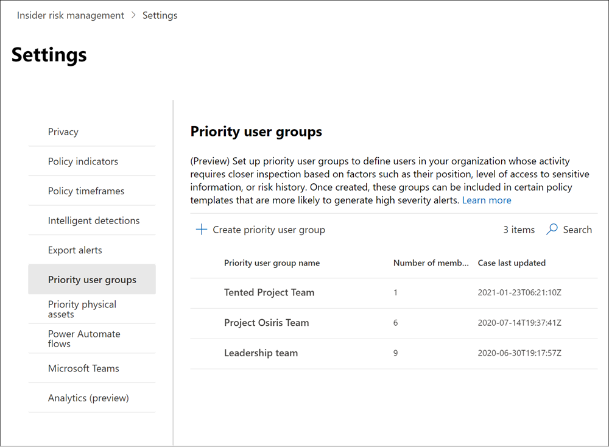
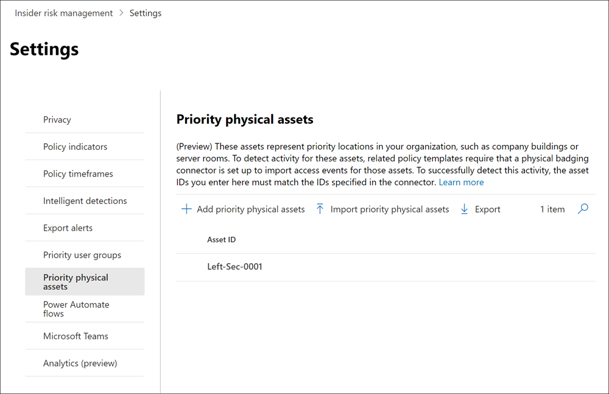

# Erste Schritte mit Insider-Risikomanagementeinstellungen

Insider-Risikomanagementeinstellungen gelten für alle Richtlinien für das Insiderrisikomanagement, unabhängig von der Vorlage, die Sie beim Erstellen einer Richtlinie auswählen. Die Einstellungen werden über das Steuerelement **Insider-Risiko-Einstellungen** konfiguriert, das sich oben auf allen Registerkarten des Insider-Risikomanagements befindet. Diese Einstellungen steuern Richtlinienkomponenten für die folgenden Bereiche:

- Datenschutz
- Indikatoren
- Richtlinienzeitachsen
- Intelligente Erkennungen
- Exportieren von Warnungen (Vorschau)
- Prioritätsbenutzergruppen (Vorschau)
- Physische Ressourcen mit Priorität (Vorschau)
- Power Automate (Vorschau)
- Microsoft Teams (Vorschau)
- Analytics (Vorschau)

Bevor Sie beginnen und Richtlinien für das Insiderrisikomanagement erstellen, ist es wichtig, diese Einstellungen zu verstehen und die Einstellungsebenen für die Complianceanforderungen für Ihre Organisation am besten zu wählen.

## Datenschutz

Der Schutz der Privatsphäre von Benutzern, die über Richtlinienübereinstimmungen verfügen, ist wichtig und kann zur Förderung der Objektivität bei der Überprüfung von Daten und Analysen im Hinblick auf Insider-Risikowarnungen beitragen. Für Benutzer mit einer Übereinstimmung mit einer Insiderrisikorichtlinie können Sie eine der folgenden Einstellungen auswählen:

- **Anonymisierte Versionen** von Benutzernamen anzeigen: Die Namen der Benutzer werden anonymisiert, um zu verhindern, dass Administratoren, Datenermittler und Prüfer sehen, wer Richtlinienwarnungen zugeordnet ist. Zum Beispiel würde ein Benutzer "Grace Taylor" mit einem randomisierten Pseudonym wie "AnonIS8-988" in allen Bereichen des Insider-Risikomanagements erscheinen. Wenn Sie diese Einstellung wählen, werden alle Benutzer mit aktuellen und früheren Richtlinienübereinstimmungen anonymisiert und gelten für alle Richtlinien. Benutzerprofilinformationen in der Warnung für Insiderrisiken und Falldetails stehen bei Auswahl dieser Option nicht zur Verfügung. Benutzernamen werden jedoch beim Hinzufügen neuer Benutzer zu vorhandenen Richtlinien oder beim Zuweisen von Benutzern zu neuen Richtlinien angezeigt. Wenn Sie diese Einstellung deaktivieren, werden Benutzernamen für alle Benutzer mit aktuellen oder früheren Richtlinien übereinstimmungen angezeigt.
- **Anonymisierte Versionen von Benutzernamen** nicht anzeigen: Benutzernamen werden für alle aktuellen und vergangenen Richtlinien übereinstimmungen für Warnungen und Fälle angezeigt. Benutzerprofilinformationen (Name, Titel, Alias sowie Organisation oder Abteilung) werden für den Benutzer für alle Insider-Risikomanagementwarnungen und -fälle angezeigt.

## Indikatoren

Vorlagen für Insiderrisikorichtlinien definieren die Art von Risikoaktivitäten, die Sie erkennen und untersuchen möchten. Jede Richtlinienvorlage basiert auf bestimmten Indikatoren, die bestimmten Triggern und Risikoaktivitäten entsprechen. Alle Indikatoren sind standardmäßig deaktiviert, und Sie müssen einen oder mehrere Richtlinienindikatoren auswählen, bevor Sie eine Insider-Risikomanagementrichtlinie konfigurieren.

Warnungen werden durch Richtlinien ausgelöst, wenn Benutzer Aktivitäten im Zusammenhang mit Richtlinienindikatoren ausführen, die einen erforderlichen Schwellenwert erfüllen. Das Risikomanagement von Insidern verwendet zwei Arten von Indikatoren:

- **Auslösen von Ereignissen:** Ereignisse, die bestimmen, ob ein Benutzer in einer Insider-Risikomanagementrichtlinie aktiv ist. Wenn ein Benutzer einer Insider-Risikomanagementrichtlinie hinzugefügt wird, verfügt er nicht über ein auslösendes Ereignis, die Benutzeraktivität wird von der Richtlinie nicht ausgewertet. Beispielsweise wird Benutzer A einer Richtlinie hinzugefügt, die aus dem Datendiebstahl durch ausgehende Benutzerrichtlinienvorlage erstellt wurde, und die Richtlinie und der Microsoft 365 hr connector sind ordnungsgemäß konfiguriert.  Solange Benutzer A nicht über ein vom Personalconnector gemeldetes Beendigungsdatum verfügt, werden Benutzer-A-Aktivitäten nicht von dieser Insider-Risikomanagementrichtlinie auf Risiken ausgewertet. Ein weiteres Beispiel für ein auslösendes  Ereignis ist, wenn ein Benutzer eine DLP-Richtlinienwarnung mit hohem Schweregrad hat, wenn *datenlecks-Richtlinien verwendet* werden.
- **Richtlinienindikatoren:** Indikatoren, die in Insider-Risikomanagementrichtlinien enthalten sind, mit deren Rahmen ein Risikobewertungsergebnis für einen Benutzer in einem Bereich bestimmt wird. Diese Richtlinienindikatoren werden nur aktiviert, nachdem ein auslösendes Ereignis für einen Benutzer auftritt. Einige Beispiele für Richtlinienindikatoren sind, wenn ein Benutzer Daten in persönliche Cloudspeicherdienste oder tragbare Speichergeräte kopiert, wenn ein Benutzerkonto aus Azure Active Directory entfernt wird oder wenn ein Benutzer interne Dateien und Ordner für nicht autorisierte externe Parteien freigegeben hat.

Richtlinienindikatoren sind in die folgenden Bereiche segmentiert. Sie können die Indikatoren zum Aktivieren und Anpassen von Indikatorereignisgrenzwerte für jede Indikatorstufe beim Erstellen einer Insiderrisikorichtlinie auswählen:

- **Office:** Dazu gehören Richtlinienindikatoren für websites SharePoint, Microsoft Teams und E-Mail-Nachrichten.
- **Geräteindikatoren:** Dazu gehören Richtlinienindikatoren für Aktivitäten wie das Freigeben von Dateien über das Netzwerk oder mit Geräten. Zu den Indikatoren gehören Aktivitäten Microsoft Office Dateien, .csv (durch Kommas getrennte Werte) und .pdf (portables Dokumentformat). Wenn Sie Geräteindikatoren **auswählen,** wird die Aktivität nur für Geräte mit Windows 10 Build 1809 oder höher verarbeitet, und Sie müssen zuerst Geräte in das Compliance Center integrieren. Weitere Informationen zum Konfigurieren von Geräten für die  Integration mit Insiderrisiken finden Sie im abschnitt Aktivieren von Geräteindikatoren und onboard-Geräten in diesem Artikel.
- **Sicherheitsrichtlinienverletzungsindikator (Vorschau):** Dazu gehören Indikatoren von Microsoft Defender for Endpoint im Zusammenhang mit nicht genehmigter oder bösartiger Softwareinstallation oder Umgehen von Sicherheitssteuerelementen. Um Benachrichtigungen im Insider risk management zu erhalten, müssen Sie eine aktive Defender for Endpoint-Lizenz und die Integration von Insiderrisiken aktiviert haben. Weitere Informationen zum Konfigurieren von Defender for Endpoint für insider risk management integration finden Sie unter [Configure advanced features in Microsoft Defender for Endpoint](/windows/security/threat-protection/microsoft-defender-atp/advanced-features\#share-endpoint-alerts-with-microsoft-compliance-center).
- **Indikatoren für den physischen Zugriff (Vorschau):** Dazu gehören Richtlinienindikatoren für den physischen Zugriff auf vertrauliche Ressourcen. Beispielsweise kann versuchter Zugriff auf einen eingeschränkten Bereich in Ihren Systemprotokollen für physische Risikomanagementrichtlinien für Insider freigegeben werden. Um diese Arten von Warnungen im Insider-Risikomanagement zu erhalten, müssen sie für das Insiderrisikomanagement und den [Connector](import-physical-badging-data.md) für physische Risikomanagementdaten konfiguriert sein. Weitere Informationen zum Konfigurieren des physischen Zugriffs finden Sie im Abschnitt [Priority physical access](#priority-physical-assets-preview) in diesem Artikel.
- **Microsoft Cloud App Security (Vorschau):** Dazu gehören Richtlinienindikatoren aus freigegebenen Warnungen von Cloud App Security. Die automatisch aktivierte Anomalieerkennung in Cloud App Security beginnt sofort mit der Erkennung und Sortierung von Ergebnissen und zielt auf zahlreiche Verhaltensanomalien in Ihren Benutzern und den Computern und Geräten ab, die mit Ihrem Netzwerk verbunden sind. Wählen Sie in diesem Abschnitt einen oder mehrere Indikatoren aus, um diese Aktivitäten in Warnungen zu Insider-Risikomanagementrichtlinien zu enthalten. Weitere Informationen zur Cloud App Security und Anomalieerkennung finden Sie unter [Get behavioral analytics and anomaly detection](/cloud-app-security/anomaly-detection-policy).
- **Risk score boosts:** Dazu gehört die Erhöhung des Risikos für ungewöhnliche Aktivitäten oder frühere Richtlinienverstöße. Das Aktivieren von Risikoscore-Verstärkungen erhöht die Risikoergebnisse und die Wahrscheinlichkeit von Warnungen für diese Arten von Aktivitäten. Bei ungewöhnlichen Aktivitäten wird die Punktzahl erhöht, wenn die erkannte Aktivität vom typischen Verhalten des Benutzers abweicht. Beispielsweise eine erhebliche Zunahme der täglichen Dateidownloads. Ungewöhnliche Aktivität wird als Prozentualer Anstieg (z. B. "100 % über der üblichen Aktivität") dargestellt und wirkt sich je nach Aktivität unterschiedlich auf die Risikosentwertung aus. Bei Benutzern mit vorherigen Richtlinienverstößen werden die Bewertungen erhöht, wenn ein Benutzer zuvor mehrere Fälle als bestätigten Richtlinienverstoß aufgelöst hat. Risikoergebnis-Verstärkungen können nur ausgewählt werden, wenn ein oder mehrere Indikatoren ausgewählt sind.

In einigen Fällen können Sie die Richtlinienindikatoren für Insiderrisiken einschränken, die auf Insiderrisikorichtlinien in Ihrer Organisation angewendet werden. Sie können die Richtlinienindikatoren für bestimmte Bereiche deaktivieren, indem Sie sie von allen Richtlinien für Insiderrisiken deaktivieren. Auslösen von Ereignissen kann für Richtlinienvorlagen für Insiderrisiken nicht geändert werden.

Um die Insiderrisikorichtlinienindikatoren zu definieren, die in allen Insiderrisikorichtlinien aktiviert sind, navigieren Sie zu Insider-Risikoeinstellungen Indikatoren, und wählen Sie einen oder mehrere  >   Richtlinienindikatoren aus. Die auf der Seite Indikatoreneinstellungen ausgewählten Indikatoren können beim Erstellen oder Bearbeiten einer Insiderrisikorichtlinie im Richtlinien-Assistenten nicht einzeln konfiguriert werden.

>[!NOTE]
>Es kann mehrere Stunden dauern, bis neue manuell hinzugefügte Benutzer im Benutzerdashboard **angezeigt werden.** Die Anzeige von Aktivitäten für die vorherigen 90 Tage für diese Benutzer kann bis zu 24 Stunden dauern. Um Aktivitäten für manuell hinzugefügte Benutzer anzuzeigen, wählen  Sie den Benutzer im Dashboard Benutzer **aus,** und öffnen Sie die Registerkarte Benutzeraktivität im Detailbereich.

### Aktivieren von Geräteindikatoren und integrierten Geräten

Um die Überwachung von Risikoaktivitäten auf Geräten zu ermöglichen und Richtlinienindikatoren für diese Aktivitäten zu verwenden, müssen Ihre Geräte die folgenden Anforderungen erfüllen, und Sie müssen die folgenden Onboardingschritte ausführen.

#### Schritt 1: Vorbereiten der Endpunkte

Stellen Sie sicher, dass Windows 10 Geräte, die Sie für die Berichterstellung im Insider risk management planen, diese Anforderungen erfüllen.

1. Muss Windows 10 x64 Build 1809 oder höher ausgeführt werden und muss das [Windows 10-Update (Os Build 17763.1075)](https://support.microsoft.com/help/4537818/windows-10-update-kb4537818) vom 20. Februar 2020 installiert haben.
2. Das Benutzerkonto, das zum Anmelden beim Windows 10 verwendet wird, muss ein aktives Azure Active Directory (AAD) sein. Das Windows 10 kann [AAD,](/azure/active-directory/devices/concept-azure-ad-join)Hybrid-AAD oder Active Directory- oder AAD-registriert sein.
3. Installieren Sie Microsoft Chromium Edgebrowser auf dem Endpunktgerät, um Aktionen für die Clouduploadaktivität zu überwachen. Weitere Informationen finden Sie unter [Herunterladen des auf Chromium basierenden neuen Microsoft Edge](https://support.microsoft.com/help/4501095/download-the-new-microsoft-edge-based-on-chromium).

#### Schritt 2: Onboarding von Geräten

Sie müssen die Geräteüberwachung aktivieren und Ihre Endpunkte integrieren, bevor Sie Insider-Risikomanagementaktivitäten auf einem Gerät überwachen können. Beide Aktionen werden im Microsoft 365-Compliance-Portal ergriffen.

Wenn Sie Geräte integrieren möchten, die noch nicht onboarded wurden, laden Sie das entsprechende Skript herunter und stellen es wie in den folgenden Schritten beschrieben bereit.

Wenn bereits Geräte in [Microsoft Defender für Endpunkt](/windows/security/threat-protection/) eingebunden sind, werden sie in der Liste der verwalteten Geräte angezeigt. Folgen [Sie Schritt 3: Wenn Geräte](insider-risk-management-settings.md#OnboardStep3) in Microsoft Defender for Endpoint im nächsten Abschnitt onboardiert sind.

In diesem Bereitstellungsszenario integrieren Sie Geräte, die noch nicht onboarded wurden, und Sie möchten nur Insiderrisikoaktivitäten auf Windows 10 überwachen.

1. Öffnen Sie das [Microsoft Compliance Center](https://compliance.microsoft.com).
2. Öffnen Sie die Seite "Einstellungen", und wählen Sie **Geräte-Onboarding** aus.

   > [!NOTE]
   > In der Regel dauert es zwar nur ungefähr eine Minute, bis das Geräte-Onboarding aktiviert ist, warten Sie aber mindestens 30 Minuten, bevor Sie sich an den Microsoft-Support wenden.

3. Wählen Sie **Geräteverwaltung** aus, um die Liste der **Geräte** zu öffnen. Die Liste ist leer, solange keine Geräte eingebunden sind.
4. Wählen Sie **Onboarding** aus, um mit dem Onboarding-Prozess zu beginnen.
5. Wählen Sie in der Liste Bereitstellungsmethode  die Art und Weise aus, die Sie auf diesen weiteren Geräten bereitstellen möchten, und laden Sie **dann das Paket herunter.**
6. Führen Sie die unter [Onboarding-Tools und -Methoden für Windows 10-Computer](/windows/security/threat-protection/microsoft-defender-atp/configure-endpoints) beschriebenen entsprechenden Verfahren aus. Über diesen Link gelangen Sie zu einer Zielseite, auf der Microsoft Defender für Endpunkt-Prozeduren beschrieben werden, die dem in Schritt 5 ausgewählten Bereitstellungspaket entsprechen:
    - Onboarding von Windows 10-Computern mithilfe von Gruppenrichtlinien
    - Onboarding von Windows-Computern mithilfe von Microsoft Endpoint Configuration Manager
    - Onboarding von Windows 10-Computern mit Tools für die Verwaltung von Mobilgeräten
    - Onboarding von Windows 10-Computern mithilfe eines lokalen Skripts
    - Onboarding von nicht-persistenten Computern einer VD-Infrastruktur (Virtual Desktop)

Sobald der Endpunkt fertig ist und der Endpunkt onboardiert ist, sollte er in der Geräteliste angezeigt werden, und der Endpunkt beginnt, Überwachungsprotokolle an das Insiderrisikomanagement zu melden.

> [!NOTE]
> Diese Funktion erfordert eine Lizenz. Ohne die erforderliche Lizenz werden keine Daten angezeigt und es ist kein Zugriff auf sie möglich.

#### Schritt 3: Wenn Geräte in Microsoft Defender for Endpoint onboarded sind

Wenn Microsoft Defender for Endpoint bereits bereitgestellt ist und Endpunktberichte vorhanden sind, werden alle diese Endpunkte in der Liste verwalteter Geräte angezeigt. Sie können weiterhin neue Geräte in das Insider-Risikomanagement integrieren, um die Abdeckung mithilfe des Abschnitts [Schritt 2: Onboarding von Geräten zu](insider-risk-management-settings.md#OnboardStep2) erweitern.

1. Öffnen Sie das [Microsoft Compliance Center](https://compliance.microsoft.com).
2. Öffnen Sie die Seite "Einstellungen", und wählen Sie **Geräteüberwachung aktivieren** aus.
3. Wählen Sie **Geräteverwaltung** aus, um die Liste der **Geräte** zu öffnen. Die Liste der Geräte, die bereits bei Microsoft Defender for Endpoint melden, sollte angezeigt werden.
4. Wählen **Sie Onboarding** aus, wenn Sie weitere Geräte integrieren müssen.
5. Wählen Sie in der Liste Bereitstellungsmethode  die Art und Weise aus, die Sie auf diesen weiteren Geräten bereitstellen möchten, und laden Sie **dann das Paket herunter.**
6. Führen Sie die unter [Onboarding-Tools und -Methoden für Windows 10-Computer](/windows/security/threat-protection/microsoft-defender-atp/configure-endpoints) beschriebenen entsprechenden Verfahren aus. Über diesen Link gelangen Sie zu einer Zielseite, auf der Microsoft Defender für Endpunkt-Prozeduren beschrieben werden, die dem in Schritt 5 ausgewählten Bereitstellungspaket entsprechen:
    - Onboarding von Windows 10-Computern mithilfe von Gruppenrichtlinien
    - Onboarding von Windows-Computern mithilfe von Microsoft Endpoint Configuration Manager
    - Onboarding von Windows 10-Computern mit Tools für die Verwaltung von Mobilgeräten
    - Onboarding von Windows 10-Computern mithilfe eines lokalen Skripts
    - Onboarding von nicht-persistenten Computern einer VD-Infrastruktur (Virtual Desktop)

Sobald der Endpunkt fertig ist und der  Endpunkt onboardiert ist, sollte er unter der Tabelle Geräte angezeigt werden, und der Endpunkt beginnt, Überwachungsprotokolle an das Insiderrisikomanagement zu melden.

> [!NOTE]
>Diese Funktion erfordert eine Lizenz. Ohne die erforderliche Lizenz werden keine Daten angezeigt und es ist kein Zugriff auf sie möglich.

### Einstellungen auf Indikatorebene (Vorschau)

Beim Erstellen einer Richtlinie im Richtlinien-Assistenten können Sie konfigurieren, wie die tägliche Anzahl von Risikoereignissen die Risikobewertung für Insiderrisikowarnungen beeinflussen soll. Mit diesen Indikatoreinstellungen können Sie steuern, wie sich die Anzahl der Vorkommen von Risikoereignissen in Ihrer Organisation auf die Risikobewertung und damit den zugehörigen Warnungsschweregrad für diese Ereignisse auswirken soll. Wenn es Ihnen lieber ist, können Sie auch festlegen, dass die von Microsoft empfohlenen Standardereignisschwellenwerte für alle aktivierten Indikatoren erhalten bleiben.

Sie entscheiden beispielsweise, SharePoint in den Insiderrisikorichtlinieneinstellungen zu aktivieren und benutzerdefinierte Schwellenwerte für SharePoint-Ereignisse beim Konfigurieren  von Indikatoren für eine neue Richtlinie für Insiderrisikodatenlecks zu konfigurieren. Während Sie im Assistenten für Insiderrisikorichtlinien drei unterschiedliche tägliche Ereignisstufen für jeden SharePoint-Indikator konfigurieren, um die Risikobewertung für Warnungen im Zusammenhang mit diesen Ereignissen zu beeinflussen.

Für die erste tägliche Ereignisebene legen Sie den Schwellenwert auf *10* oder mehr Ereignisse pro Tag fest, um eine niedrigere Auswirkung auf die Risikopunktzahl für die Ereignisse, *20* oder mehr Ereignisse pro Tag für eine mittlere Auswirkung auf das Risikoergebnis für die Ereignisse und *30* oder mehr Ereignisse pro Tag eine höhere Auswirkung auf die Risikopunktzahl für die Ereignisse zu erzielen. Diese Einstellungen bedeuten effektiv:

- Wenn nach dem Auslösen des Ereignisses 1 bis 9 SharePoint ereignisse stattfinden, werden die Risikobewertungen minimal betroffen und würden in der Regel keine Warnung generieren.
- Wenn 10 bis 19 SharePoint Ereignisse nach einem auslösenden Ereignis stattfinden, ist die Risikopunktzahl grundsätzlich niedriger, und der Schweregrad der Warnung würde sich in der Regel auf einem niedrigen Niveau befinden.
- Wenn nach einem Auslösen 20 bis 29 SharePoint ereignisse stattfinden, ist die Risikosentwertung grundsätzlich höher, und der Schweregrad der Warnung würde sich in der Regel auf mittlerer Ebene befinden.
- Wenn nach einem Auslösen 30 oder mehr SharePoint ereignisse stattfinden, ist die Risikosentwertung grundsätzlich höher, und der Schweregrad der Warnung würde sich in der Regel auf einem hohen Niveau befinden.

## Zeitrahmen für Richtlinien

Mit Hilfe von Zeitrahmen für Richtlinien können Sie vergangene und zukünftige Überprüfungszeiträume definieren, die nach Richtlinienübereinstimmungen auf der Grundlage von Ereignissen und Aktivitäten für die Richtlinienvorlagen zum Insider-Risikomanagement ausgelöst werden. Abhängig von der von Ihnen verwendeten Richtlinienvorlage stehen die folgenden Richtlinien zeitrahmen zur Verfügung:

- **Aktivierungsfenster**: Für alle  Richtlinienvorlagen verfügbar, ist das **Aktivierungsfenster** die definierte Anzahl von Tagen, die das Fenster nach einem auslösenden Ereignis aktiviert. Das Fenster wird 1 bis 30 Tage nach dem Auslösen eines Ereignisses für alle Benutzer aktiviert, die der Richtlinie zugewiesen sind. Sie haben z. B. eine Insider-Risikomanagementrichtlinie konfiguriert und das *Aktivierungsfenster* auf 30 Tage festgelegt. Seit der Konfiguration der Richtlinie sind mehrere Monate vergangen, und für einen der in der Richtlinie enthaltenen Benutzer tritt ein auslösendes Ereignis auf. Das auslösende Ereignis  aktiviert das Aktivierungsfenster, und die Richtlinie ist für diesen Benutzer 30 Tage nach dem Auslösen des Ereignisses aktiv.
- **Erkennung vergangener** Aktivitäten: Für alle  Richtlinienvorlagen verfügbar, ist die Erkennung der  letzten Aktivität die definierte Anzahl von Tagen, die das Fenster vor einem auslösenden Ereignis aktiviert. Das Fenster wird für 0 bis 180 Tage aktiviert, bevor für jeden Benutzer, der der Richtlinie zugewiesen ist, ein auslösendes Ereignis auftritt. Sie haben z. B. eine Insider-Risikomanagementrichtlinie konfiguriert und die Erkennung vergangener Aktivitäten *auf* 90 Tage festgelegt. Seit der Konfiguration der Richtlinie sind mehrere Monate vergangen, und für einen der in der Richtlinie enthaltenen Benutzer tritt ein auslösendes Ereignis auf. Das auslösende Ereignis  aktiviert die Erkennung vergangener Aktivitäten, und die Richtlinie sammelt historische Aktivitäten für diesen Benutzer 90 Tage vor dem auslösenden Ereignis.

## Intelligente Erkennungen

Intelligente Erkennungseinstellungen helfen, die Verarbeitung riskanter Aktivitäten für Warnungen zu verfeinern. Unter bestimmten Umständen müssen Sie möglicherweise zu ignorierende Dateitypen definieren oder eine Erkennungsstufe für Dateien erzwingen, um eine Mindestleiste für Warnungen zu definieren. Verwenden Sie diese Einstellungen, um das allgemeine Warnungsvolumen, Dateitypausschlüsse und Dateivolumegrenzwerte zu steuern.

### Dateitypausschlüsse

Geben Sie Dateityperweiterungen durch Kommas getrennt ein, um bestimmte Dateitypen von allen Übereinstimmungen mit Insider-Risikomanagementrichtlinien auszuschließen. Um beispielsweise bestimmte Arten von Musikdateien von den Richtlinienübereinstimmungen auszuschließen, können Sie AAC, MP3, WAV, WMA in das Feld **Dateityp-Ausschlüsse** eingeben. Dateien mit diesen Erweiterungen werden von allen Insider-Risikomanagementrichtlinien ignoriert.

### Schwellenwert für ungewöhnliche Dateiaktivität

Geben Sie die Anzahl der Dateien ein, um eine Mindestdateiebene zu definieren, bevor Aktivitätswarnungen in Insiderrisikorichtlinien gemeldet werden. Beispielsweise würden Sie "10" eingeben, wenn Sie keine Insiderrisikowarnungen generieren möchten, wenn ein Benutzer 10 Dateien oder weniger herunterlädt, auch wenn die Richtlinien diese Aktivität als ungewöhnlich betrachten.

### Warnungsvolumen

Benutzeraktivitäten, die von Insiderrisikorichtlinien erkannt werden, erhalten eine bestimmte Risikobewertung, die wiederum den Warnungsschweregrad bestimmt (niedrig, mittel, hoch). Standardmäßig generieren wir eine bestimmte Menge von Warnungen mit niedrigem, mittlerem und hohem Schweregrad, aber Sie können das Volume entsprechend Ihren Anforderungen erhöhen oder verringern. Wählen Sie eine der folgenden Einstellungen aus, um das Volumen der Warnungen für alle Richtlinien für das Insiderrisikomanagement anzupassen:

- **Weniger Warnungen:** Es werden alle Warnungen mit hohem Schweregrad, weniger Warnungen mit mittlerem Schweregrad und keine Warnungen mit geringem Schweregrad angezeigt. Diese Einstellungsstufe bedeutet, dass Sie möglicherweise einige echte Positives verpassen.
- **Standardvolume:** Es werden alle Warnungen mit hohem Schweregrad und eine ausgewogene Menge von Warnungen mit mittlerem und niedrigem Schweregrad angezeigt.
- **Weitere Warnungen:** Es werden alle Warnungen mit mittlerem und hohem Schweregrad und Warnungen mit dem größten Schweregrad angezeigt. Diese Einstellungsstufe kann zu weiteren falsch positiven Positiven führen.

### Microsoft Defender for Endpoint (Vorschau)

[Microsoft Defender for Endpoint](/windows/security/threat-protection/microsoft-defender-atp/microsoft-defender-advanced-threat-protection) ist eine Unternehmensendpunktsicherheitsplattform, die Unternehmensnetzwerken dabei helfen soll, erweiterte Bedrohungen zu verhindern, zu erkennen, zu untersuchen und auf sie zu reagieren. Um eine bessere Sichtbarkeit von Sicherheitsverletzungen in Ihrer Organisation zu erhalten, können Sie Defender for Endpoint-Warnungen für Aktivitäten importieren und filtern, die in Richtlinien verwendet werden, die aus Richtlinienvorlagen für Sicherheitsverletzungen des Insiderrisikomanagements erstellt wurden.

Je nachdem, welche Arten von Signalen Sie interessieren, können Sie Warnungen basierend auf dem Triagestatus der Defender for Endpoint-Warnung in das Insiderrisikomanagement importieren. Sie können einen oder mehrere der folgenden Warnungstriagestatus in den zu importierende globalen Einstellungen definieren:

- Unbekannt
- Neu
- In Arbeit
- Gelöst

Warnungen aus Defender for Endpoint werden täglich importiert. Je nach dem von Ihnen verwendeten Triagestatus werden möglicherweise mehrere Benutzeraktivitäten für dieselbe Warnung angezeigt, wie sich der Triagestatus in Defender for Endpoint ändert.

Wenn Sie beispielsweise Für diese Einstellung *Neu*, *In* Bearbeitung und *Aufgelöst* auswählen, wenn eine Microsoft Defender for Endpoint-Warnung generiert wird und der Status *Neu* ist, wird eine anfängliche Warnungsaktivität für den Benutzer im Insiderrisiko importiert. Wenn sich der Status der Defender for Endpoint-Triage *in In Bearbeitung* ändert, wird eine zweite Aktivität für diese Warnung für den Benutzer mit Insiderrisiko importiert. Wenn der endgültige Defender for Endpoint-Triagestatus *Resolved* festgelegt ist, wird eine dritte Aktivität für diese Warnung für den Benutzer im Insiderrisiko importiert. Mit dieser Funktion können Ermittler den Verlauf der Defender for Endpoint-Warnungen verfolgen und die Sichtbarkeitsstufe auswählen, die für ihre Untersuchung erforderlich ist.

>[!IMPORTANT]
>Sie müssen Microsoft Defender for Endpoint in Ihrer Organisation konfigurieren und Defender for Endpoint für insider risk management integration in das Defender Security Center aktivieren, um Sicherheitsverletzungswarnungen zu importieren. Weitere Informationen zum Konfigurieren von Defender for Endpoint für insider risk management integration finden Sie unter [Configure advanced features in Defender for Endpoint](/windows/security/threat-protection/microsoft-defender-atp/advanced-features\#share-endpoint-alerts-with-microsoft-compliance-center).

### Domänen (Vorschau)

Mithilfe von Domäneneinstellungen können Sie Risikostufen für Aktivitäten für bestimmte Domänen definieren. Zu diesen Aktivitäten gehören das Freigeben von Dateien, das Senden von E-Mail-Nachrichten, das Herunterladen oder Hochladen von Inhalten. Durch Angeben von Domänen in diesen Einstellungen können Sie die Risikobewertung für Aktivitäten erhöhen oder verringern, die mit diesen Domänen stattfinden.

Verwenden Sie Domäne hinzufügen, um eine Domäne für jede der Domäneneinstellungen zu definieren. Darüber hinaus können Sie Platzhalter verwenden, um Abweichungen von Stammdomänen oder Unterdomänen zu entsprechen. Um z. B. sales.wingtiptoys.com und support.wingtiptoys.com anzugeben, verwenden Sie den Platzhaltereintrag "*.wingtiptoys.com", um mit diesen Unterdomänen (und jeder anderen Unterdomäne auf derselben Ebene) zu übereinstimmen. Zum Angeben von Unterdomänen auf mehreren Ebenen für  eine Stammdomäne müssen Sie das Kontrollkästchen Unterdomänen auf mehreren Ebenen hinzufügen aktivieren.

Für jede der folgenden Domäneneinstellungen können Sie bis zu 500 Domänen eingeben:

- **Nicht zulässige Domänen:** Durch die Angabe nicht zulässiger Domänen haben Aktivitäten, die mit diesen Domänen stattfinden, *höhere Risikowerte.* Einige Beispiele sind Aktivitäten, bei denen Inhalte für jemanden geteilt werden (z. B. das Senden von E-Mails an jemanden mit einer gmail.com-Adresse) und das Herunterladen von Inhalten auf ein Gerät von einer dieser nicht zulässigen Domänen.
- **Zulässige Domänen:** Bestimmte Aktivitäten im Zusammenhang mit zulässigen Domänen werden von Ihren Richtlinien ignoriert und generieren keine Warnungen. Zu diesen Aktivitäten gehören:

    - An externe Domänen gesendete E-Mails
    - Dateien, Ordner, Websites, die für externe Domänen freigegeben sind
    - In externe Domänen hochgeladene Dateien (Microsoft Edge Browser)

    Durch das Angeben zulässiger Domänen in Einstellungen wird diese Aktivität mit diesen Domänen ähnlich behandelt wie die Behandlung interner Organisationsaktivitäten. Die hier hinzugefügten Domänen können z. B. die Freigabe von Inhalten für eine Person außerhalb Ihrer Organisation umfassen (z. B. das Senden von E-Mails an jemanden mit gmail.com Adresse).

- **Domänen von Drittanbietern:** Wenn Ihre Organisation Domänen von Drittanbietern für geschäftsbezogene Zwecke (z. B. Cloudspeicher) verwendet, schließen Sie sie hier ein, damit Sie Benachrichtigungen über Aktivitäten im Zusammenhang mit dem Geräteindikator erhalten Können Sie einen Browser verwenden, um Inhalte von einer Drittanbieterwebsite *herunterzuladen.*

## Exportieren von Warnungen (Vorschau)

Warnungsinformationen für insider risk management können über das Office 365 Management Activity API schema in Sicherheitsinformationen und Ereignisverwaltungsdienste [exportiert werden.](/office/office-365-management-api/office-365-management-activity-api-schema#security-and-compliance-alerts-schema) Sie können die Office 365 Management Activity APIs verwenden, um Benachrichtigungsinformationen in andere Anwendungen zu exportieren, die Ihre Organisation möglicherweise zum Verwalten oder Aggregieren von Insiderrisikoinformationen verwendet.

So verwenden Sie die APIs, um Informationen zu Insiderrisiken zu überprüfen:

1. Aktivieren Office 365 Unterstützung der Management Activity API in **Insider risk management**  >  **Einstellungen**  >  **Export alerts**. Diese Einstellung ist standardmäßig für Ihre Organisation Microsoft 365 deaktiviert.
2. Filtern sie die Office 365 Überwachungsaktivitäten nach *SecurityComplianceAlerts*.
3. Filter *securityComplianceAlerts* nach der *Kategorie InsiderRiskManagement.*

Warnungsinformationen enthalten Informationen aus dem Sicherheits- und Kompatibilitätswarnungsschema und dem Office 365 allgemeinen Schema der Verwaltungsaktivitäts-API.

Die folgenden Felder und Werte werden für Insider-Risikomanagementwarnungen für das Security & Compliance Alert Schema exportiert:

| **Warnungsparameter** | **Beschreibung** |
|:------------------|:----------------|
| AlertType | Der Typ der Warnung ist *Custom*.  |
| AlertId | Die GUID der Warnung. Warnungen zum Risikomanagement von Insidern können stummgeschaltet werden. Wenn sich der Warnungsstatus ändert, wird ein neues Protokoll mit derselben AlertID generiert. Diese AlertID kann verwendet werden, um Updates für eine Warnung zu korrelieren. |
| Kategorie | Die Kategorie der Warnung ist *InsiderRiskManagement*. Diese Kategorie kann verwendet werden, um von diesen Warnungen von anderen Sicherheits- und & zu unterscheiden. |
| Kommentare | Standardkommentare für die Warnung. Die Werte *sind Neue Warnung* (protokolliert, wenn eine Warnung erstellt wird) und Warnung *aktualisiert* (protokolliert, wenn eine Warnung aktualisiert wird). Verwenden Sie die AlertID, um Updates für eine Warnung zu korrelieren. |
| Daten | Die Daten für die Warnung enthalten die eindeutige Benutzer-ID, den Benutzerprinzipalnamen sowie Datum und Uhrzeit (UTC), als der Benutzer in eine Richtlinie ausgelöst wurde. |
| Name | Richtlinienname für insider risk management policy that generated the alert. |
| PolicyId | Die GUID der Insider-Risikomanagementrichtlinie, die die Warnung ausgelöst hat. |
| Severity | Der Schweregrad der Warnung. Die Werte sind *High*, *Medium* oder *Low*. |
| Quelle | Die Quelle der Warnung. Der Wert ist *Office 365 Security & Compliance*. |
| Status | Der Status der Warnung. Die Werte sind *Aktiv* (*Needs Review* in insider risk), *Investigating* (*Confirmed* in insider risk), Resolved ( *Resolved* in insider risk), *Dismissed* (*Dismissed* in insider risk). |
| Version | Die Version des Sicherheits- und Kompatibilitätsbenachrichtigungsschemas. |

Die folgenden Felder und Werte werden für Insider-Risikomanagementwarnungen für das allgemeine Schema Office 365 [Management Activity API exportiert.](/office/office-365-management-api/office-365-management-activity-api-schema#common-schema)

- UserId
- Id
- RecordType
- CreationTime
- Vorgang
- OrganizationId
- UserType
- UserKey

## Prioritätsbenutzergruppen (Vorschau)

Benutzer in Ihrer Organisation können je nach Position, Zugriffsebene auf vertrauliche Informationen oder Risikoverlauf unterschiedliche Risikostufen haben. Wenn Sie die Prüfung und Bewertung der Aktivitäten dieser Benutzer priorisieren, können Sie auf potenzielle Risiken aufmerksam machen, die höhere Folgen für Ihre Organisation haben können. Prioritätsbenutzergruppen im Insider risk management helfen dabei, die Benutzer in Ihrer Organisation zu definieren, die eine genauere Überprüfung und eine sensiblere Risikobewertung benötigen. In Gekoppelt mit den Sicherheitsrichtlinienverletzungen durch *Prioritätsbenutzer* und Datenlecks nach Richtlinienvorlagen für Prioritätsbenutzer haben Benutzer, die einer Benutzergruppe mit Priorität hinzugefügt wurden, eine höhere Wahrscheinlichkeit von Insiderrisikowarnungen und Warnungen mit höherem Schweregrad. 

Beispielsweise müssen Sie datenlecks für ein streng vertrauliches Projekt schützen, bei dem Benutzer Zugriff auf vertrauliche Informationen haben. Sie wählen die Option *Vertraulich Project* *benutzerpriorität* benutzergruppe für Benutzer in Ihrer Organisation zu erstellen, die an diesem Projekt arbeiten. Mithilfe des Richtlinien-Assistenten und der Richtlinienvorlage Datenlecks nach Prioritätsbenutzern erstellen Sie eine neue Richtlinie und weisen der Richtlinie die Gruppe Vertrauliche *Project* Benutzer priorität zu.  Aktivitäten, die von der Richtlinie für Mitglieder der Benutzergruppe "Vertrauliche Project Benutzer" *untersucht* werden, sind risikoempfindlicher, und Aktivitäten dieser Benutzer generieren wahrscheinlicher eine Warnung und verfügen über Warnungen mit höherem Schweregrad.

### Erstellen einer Benutzergruppe mit Priorität

Zum Erstellen einer neuen Benutzergruppe mit Priorität verwenden Sie Einstellungssteuerelemente in der **Insider-Risikomanagementlösung** im Microsoft 365 Compliance Center. Zum Erstellen einer Benutzergruppe mit Priorität müssen Sie Mitglied der Rollengruppe *Insider Risk Management* oder Insider Risk Management *Admin* sein.

Führen Sie die folgenden Schritte aus, um eine Benutzergruppe mit Priorität zu erstellen:

1. Wechseln Sie [Microsoft 365 Compliance Center](https://compliance.microsoft.com)zu Insider Risk **Management,** und wählen Sie **Insider Risk Settings aus.**
2. Auswählen der **Registerkarte Priorität von Benutzergruppen**
3. Wählen Sie auf der Registerkarte Priorität **Benutzergruppen** die Option **Benutzergruppe** mit Priorität erstellen aus, um den Assistenten zum Erstellen von Gruppen zu starten.
4. Füllen Sie **auf der** Seite Gruppe definieren die folgenden Felder aus:
    - **Name (erforderlich):** Geben Sie einen Anzeigenamen für die Prioritätsbenutzergruppe ein. Sie können den Namen der Prioritätsbenutzergruppe nach Abschluss des Assistenten nicht mehr ändern.
    - **Beschreibung (optional):** Geben Sie eine Beschreibung für die Benutzergruppe priorität ein.
5. Wählen **Sie Weiter aus,** um fortzufahren.
6. Wählen Sie **auf** der  Seite Mitglieder auswählen die Option Mitglieder suchen aus, und  wählen Sie aus, welche E-Mail-aktivierten Benutzerkonten in der Gruppe enthalten sind, oder aktivieren Sie das Kontrollkästchen Alle auswählen, um der Gruppe alle Benutzer in Ihrer Organisation hinzuzufügen. Wählen **Sie Hinzufügen** aus, um fortzufahren oder **Abbrechen,** um zu schließen, ohne der Gruppe Benutzer hinzuzufügen.
7. Wählen **Sie Weiter aus,** um fortzufahren.
8. Überprüfen Sie **auf** der Seite Überprüfen die Einstellungen, die Sie für die Prioritätsbenutzergruppe ausgewählt haben. Wählen **Sie Bearbeiten** aus, um einen der Gruppenwerte zu ändern, oder wählen Sie **Senden** aus, um die Benutzergruppe mit Priorität zu erstellen und zu aktivieren.
9. Wählen Sie auf der Bestätigungsseite **Fertig** aus, um den Assistenten zu beenden.

### Aktualisieren einer Benutzergruppe mit Priorität

Zum Aktualisieren einer vorhandenen Benutzergruppe mit Priorität verwenden Sie Einstellungssteuerelemente in der **Insider-Risikomanagementlösung** im Microsoft 365 Compliance Center. Zum Aktualisieren einer Benutzergruppe mit Priorität müssen Sie Mitglied der Rollengruppe *Insider Risk Management* oder Insider Risk Management *Admin* sein.

Führen Sie die folgenden Schritte aus, um eine Benutzergruppe mit Priorität zu bearbeiten:

1. Wechseln Sie [Microsoft 365 Compliance Center](https://compliance.microsoft.com)zu Insider Risk **Management,** und wählen Sie **Insider Risk Settings aus.**
2. Auswählen der **Registerkarte Priorität von Benutzergruppen**
3. Wählen Sie die Prioritätsbenutzergruppe aus, die Sie bearbeiten möchten, und wählen Sie **Gruppe bearbeiten aus.**
4. Aktualisieren Sie **auf der Seite** Gruppe definieren das Feld Beschreibung bei Bedarf. Der Name der Prioritätsbenutzergruppe kann nicht aktualisiert werden. Wählen **Sie Weiter aus,** um fortzufahren.
5. Fügen Sie **der Gruppe auf** der Seite Mitglieder auswählen mithilfe des **Steuerelements Mitglieder auswählen neue Mitglieder** hinzu. Um einen Benutzer aus der Gruppe zu entfernen, wählen Sie das "X" neben dem Benutzer aus, den Sie entfernen möchten. Wählen **Sie Weiter aus,** um fortzufahren.
6. Überprüfen Sie **auf** der Seite Überprüfen die Updateeinstellungen, die Sie für die Prioritätsbenutzergruppe ausgewählt haben. Wählen **Sie Bearbeiten** aus, um einen der Gruppenwerte zu ändern, oder wählen Sie **Übermitteln** aus, um die Prioritätsbenutzergruppe zu aktualisieren.
7. Wählen Sie auf der Bestätigungsseite **Fertig** aus, um den Assistenten zu beenden.

### Löschen einer Benutzergruppe mit Priorität

Zum Löschen einer vorhandenen Benutzergruppe mit Priorität verwenden Sie Einstellungssteuerelemente in der **Insider-Risikomanagementlösung** im Microsoft 365 Compliance Center. Zum Löschen einer Benutzergruppe mit Priorität müssen Sie Mitglied der Rollengruppe *Insider Risk Management* oder Insider Risk Management *Admin* sein.

>[!IMPORTANT]
>Wenn Sie eine Benutzergruppe mit Priorität löschen, wird sie aus jeder aktiven Richtlinie entfernt, der sie zugewiesen ist. Wenn Sie eine Benutzergruppe mit Priorität löschen, die einer aktiven Richtlinie zugewiesen ist, enthält die Richtlinie keine Benutzer im Bereich und befindet sich im Leerlauf und erstellt keine Warnungen.

Führen Sie die folgenden Schritte aus, um eine Benutzergruppe mit Priorität zu löschen:

1. Wechseln Sie [Microsoft 365 Compliance Center](https://compliance.microsoft.com)zu Insider Risk **Management,** und wählen Sie **Insider Risk Settings aus.**
2. Auswählen der **Registerkarte Priorität von Benutzergruppen**
3. Wählen Sie die Prioritätsbenutzergruppe aus, die Sie bearbeiten möchten, und wählen **Sie im** Dashboardmenü Löschen aus.
4. Wählen Sie **im Dialogfeld** Löschen die Option **Ja** aus, um die Prioritätsbenutzergruppe zu löschen, oder wählen Sie **Abbrechen** aus, um zum Dashboard zurückzukehren.

## Physische Ressourcen mit Priorität (Vorschau)

Das Identifizieren des Zugriffs auf physische Ressourcen mit Priorität und das Korrelieren von Zugriffsaktivitäten auf Benutzerereignisse ist eine wichtige Komponente Ihrer Complianceinfrastruktur. Diese physischen Objekte stellen Prioritätsspeicherorte in Ihrer Organisation dar, z. B. Unternehmensgebäude, Rechenzentren oder Serverräume. Insider risk activities may be associated with users working unusual hours, attempting to access these unauthorized sensitive or secure areas, and requests for access to high-level areas without legitimate needs.

Da physische Ressourcen mit Priorität aktiviert sind und der [Datenconnector](import-physical-badging-data.md) für physische Gefährdungen konfiguriert ist, integriert das Insiderrisikomanagement Signale ihrer physischen Steuerungs- und Zugriffssysteme in andere Benutzerrisikoaktivitäten. Durch die Untersuchung von Verhaltensmustern in physischen Zugriffssystemen und durch Korrelieren dieser Aktivitäten mit anderen Insiderrisikoereignissen kann das Insiderrisikomanagement Complianceermittlern und Analysten dabei helfen, fundiertere Reaktionsentscheidungen für Warnungen zu treffen. Der Zugriff auf physische Ressourcen mit Priorität wird in Erkenntnissen anders als der Zugriff auf Ressourcen ohne Priorität ermittelt.

Beispielsweise verfügt Ihre Organisation über ein System zur Verletzung von Benutzern, das den physischen Zugriff auf normale Arbeits- und vertrauliche Projektbereiche überwacht und genehmigt. Sie haben mehrere Benutzer, die an einem vertraulichen Projekt arbeiten, und diese Benutzer kehren nach Abschluss des Projekts in andere Bereiche Ihrer Organisation zurück. Da das vertrauliche Projekt kurz vor dem Abschluss steht, sollten Sie sicherstellen, dass die Projektarbeit vertraulich bleibt und der Zugriff auf die Projektbereiche streng kontrolliert wird.

Sie können den Physischen Datenconnector in Microsoft 365 aktivieren, um Zugriffsinformationen aus Ihrem physischen System zu importieren und physische Ressourcen mit Priorität im Insiderrisikomanagement anzugeben. Durch das Importieren von Informationen aus Ihrem Schadenssystem und das Korrelieren von physischen Zugriffsinformationen mit anderen Risikoaktivitäten, die im Insider risk management identifiziert werden, stellen Sie fest, dass einer der Benutzer des Projekts nach den normalen Arbeitszeiten auf die Projektbüros zutritt und große Datenmengen aus seinem normalen Arbeitsbereich in einen persönlichen Cloudspeicherdienst exportiert. Diese physische Zugriffsaktivität im Zusammenhang mit der Onlineaktivität kann auf möglichen Datendiebstahl hinweisen, und Complianceermittler und Analysten können entsprechend den Umständen für diesen Benutzer geeignete Maßnahmen ergreifen.

### Konfigurieren von physischen Ressourcen mit Priorität

Um physische Ressourcen mit Priorität zu konfigurieren, konfigurieren Sie den Connector für physisches Badging und verwenden Einstellungssteuerelemente in der **Insider-Risikomanagementlösung** im Microsoft 365 Compliance Center. Zum Konfigurieren von physischen Ressourcen mit Priorität müssen Sie Mitglied der Rollengruppe *Insider Risk Management* oder Insider Risk Management Admin *sein.*

Führen Sie die folgenden Schritte aus, um physische Ressourcen mit Priorität zu konfigurieren:

1. Befolgen Sie die Konfigurationsschritte für das Insider-Risikomanagement im [Artikel Erste Schritte mit Insider-Risikomanagement.](insider-risk-management-configure.md) Stellen Sie in Schritt 3 sicher, dass Sie den Konnektor für physische Badging konfigurieren.

    >[!IMPORTANT]
    >Damit Insider-Risikomanagementrichtlinien Signaldaten im Zusammenhang mit ausscheidenden und beendeten Benutzern mit Ereignisdaten aus Ihren physischen Kontroll- und Zugriffsplattformen verwenden und korrelieren können, müssen Sie auch den Microsoft 365 konfigurieren. Wenn Sie den Connector für physisches Badging aktivieren, ohne den Microsoft 365 hr-Connector zu aktivieren, verarbeiten Insiderrisikomanagementrichtlinien nur Ereignisse für physische Zugriffsaktivitäten für Benutzer in Ihrer Organisation.

2. Wechseln Sie [Microsoft 365 Compliance Center](https://compliance.microsoft.com)zu Insider Risk **Management,** und wählen Sie **Insider Risk Settings** Priority physical assets  >  **aus.**
3. Auf  der Seite physische Ressourcen priorität können Sie entweder manuell die physischen Ressourcen-IDs hinzufügen, die Sie auf die vom Connector für physischen Badging importierten Objektereignisse überwachen möchten, oder eine .csv-Datei aller vom Connector für physisches Badging importierten physischen Ressourcen-IDs importieren: a) Wählen Sie Zum manuellen Hinzufügen physischer Ressourcen-IDs die Option Physische Ressourcen hinzufügen **aus,** geben Sie eine physische Ressourcen-ID ein, und wählen Sie dann **Hinzufügen** aus. Geben Sie andere IDs für physische Objekte ein, und wählen Sie **dann Physische** Ressourcen mit Priorität hinzufügen aus, um alle eingegebenen Ressourcen zu speichern.
    b) Wenn Sie eine Liste der physischen Objekt-IDs aus einer .csv hinzufügen möchten, wählen Sie Physische Ressourcen mit Priorität **importieren aus.** Wählen Sie im Dialogfeld Datei-Explorer die .csv, die Sie importieren möchten, und wählen Sie **dann Öffnen aus.** Die physischen Objekt-IDs aus .csv werden der Liste hinzugefügt.
4. Navigieren Sie zur **Registerkarte Richtlinienindikatoren** in Einstellungen.
5. Navigieren Sie **auf** der Seite  Richtlinienindikatoren zum Abschnitt Physische Zugriffsindikatoren, und aktivieren Sie das Kontrollkästchen Physischer Zugriff nach Beendigung oder fehlgeschlagener Zugriff **auf vertrauliche Ressourcen.**
6. Wählen **Sie Speichern aus,** um zu konfigurieren und zu beenden.

### Löschen einer physischen Prioritätsanlage

Zum Löschen einer vorhandenen physischen Prioritätsanlage verwenden Sie Einstellungssteuerelemente in der Insider-Risikomanagementlösung im Microsoft 365 Compliance Center. Zum Löschen einer physischen Prioritätsanlage müssen Sie Mitglied der Rollengruppe Insider Risk Management oder Insider Risk Management Admin sein.

>[!IMPORTANT]
>Das Löschen einer physischen Prioritätsanlage entfernt sie aus der Prüfung durch eine aktive Richtlinie, in die sie zuvor einbezogen wurde. Warnungen, die von Aktivitäten generiert werden, die der physischen Priorität zugeordnet sind, werden nicht gelöscht.

Führen Sie die folgenden Schritte aus, um ein physisches Prioritätsinventar zu löschen:

1. Wechseln Sie [Microsoft 365 Compliance Center](https://compliance.microsoft.com)zu Insider Risk **Management,** und wählen Sie **Insider Risk Settings** Priority physical assets  >  **aus.**
2. Wählen Sie **auf der Seite Physische** Ressourcen priorität die Ressource aus, die Sie löschen möchten.
3. Wählen **Sie im** Aktionsmenü Löschen aus, um das Objekt zu löschen.

## Power Automate (Vorschau)

[Microsoft Power Automate](/power-automate/getting-started) ist ein Workflowdienst, der Aktionen in verschiedenen Anwendungen und Diensten automatisiert. Durch die Verwendung von Vorlagenflüssen oder manuell erstellten Aufgaben können Sie allgemeine Aufgaben automatisieren, die diesen Anwendungen und Diensten zugeordnet sind. Wenn Sie Power Automate für das Insiderrisikomanagement aktivieren, können Sie wichtige Aufgaben für Fälle und Benutzer automatisieren. Sie können Power Automate konfigurieren, um Benutzer-, Warnungs- und Fallinformationen abzurufen und diese Informationen für Beteiligte und andere Anwendungen zu teilen sowie Aktionen im Insider risk management zu automatisieren, z. B. das Veröffentlichen von Fallnotizen. Power Automate Abläufe gelten für Fälle und alle Benutzer, die für eine Richtlinie gelten.

Kunden mit Microsoft 365, die insider risk management enthalten, benötigen keine zusätzlichen Power Automate Lizenzen, um die empfohlenen Insider risk management Power Automate verwenden. Diese Vorlagen können angepasst werden, um Ihre Organisation zu unterstützen und zentrale Szenarien des Insiderrisikomanagements zu abdecken. Wenn Sie premium Power Automate-Features in diesen Vorlagen verwenden, mithilfe des Microsoft 365-Complianceconnector eine benutzerdefinierte Vorlage erstellen oder Power Automate-Vorlagen für andere Compliancebereiche in Microsoft 365 verwenden, benötigen Sie möglicherweise mehr Power Automate-Lizenzen.

Die folgenden Power Automate werden Kunden bereitgestellt, um die Prozessautomatisierung für Insider-Risikomanagementbenutzer und -fälle zu unterstützen:

- Benutzer benachrichtigen, wenn sie einer Insiderrisikorichtlinie hinzugefügt **werden:** Diese Vorlage ist für Organisationen mit internen Richtlinien, Datenschutz- oder behördlichen Anforderungen, dass Benutzer benachrichtigt werden müssen, wenn sie Richtlinien für das Insiderrisikomanagement unterliegen. Wenn dieser Fluss für einen Benutzer auf der Benutzerseite konfiguriert und ausgewählt ist, erhalten Benutzer und ihre Vorgesetzten eine E-Mail-Nachricht, wenn der Benutzer einer Insider-Risikomanagementrichtlinie hinzugefügt wird. Diese Vorlage unterstützt auch das Aktualisieren einer SharePoint, die auf einer SharePoint-Website gehostet wird, um Benachrichtigungsdetails wie Datum/Uhrzeit und den Nachrichtenempfänger nachverfolgt zu können. Wenn Sie sich für die Anonymisierung von Benutzern in den Datenschutzeinstellungen entschieden **haben,** funktionieren flüsse, die aus dieser Vorlage erstellt wurden, nicht wie beabsichtigt, sodass der Datenschutz des Benutzers erhalten bleibt. Power Automate, die diese Vorlage verwenden, sind im Benutzerdashboard **verfügbar.**
- Anfordern von Informationen von Personal oder Unternehmen über einen Benutzer **in** einem Insiderrisikofall: Wenn Sie in einem Fall handeln, müssen Insiderrisikoanalysten und Ermittler möglicherweise mit hr oder anderen Beteiligten sprechen, um den Kontext der Fallaktivitäten zu verstehen. Wenn dieser Fluss für einen Fall konfiguriert und ausgewählt ist, senden Analysten und Ermittler eine E-Mail-Nachricht an Personal- und Geschäftsbeteiligten, die für diesen Fluss konfiguriert sind. Jedem Empfänger wird eine Nachricht mit vorkonfigurierten oder anpassbaren Antwortoptionen gesendet. Wenn Empfänger eine Antwortoption auswählen, wird die Antwort als Fallnotiz aufgezeichnet und enthält Empfänger- und Datums-/Uhrzeitinformationen. Wenn Sie sich für die Anonymisierung von Benutzern in den Datenschutzeinstellungen entschieden **haben,** funktionieren flüsse, die aus dieser Vorlage erstellt wurden, nicht wie beabsichtigt, sodass der Datenschutz des Benutzers erhalten bleibt. Power Automate, die diese Vorlage verwenden, sind im **Falldashboard verfügbar.**
- **Benachrichtigen des Managers, wenn** ein Benutzer über eine Benachrichtigung über Insiderrisiken verfügt: Einige Organisationen benötigen möglicherweise eine sofortige Verwaltungsbenachrichtigung, wenn ein Benutzer über eine Benachrichtigung zum Insiderrisikomanagement verfügt. Wenn dieser Fluss konfiguriert und ausgewählt ist, wird dem Vorgesetzten für den Fallbenutzer eine E-Mail mit den folgenden Informationen zu allen Fallwarnungen gesendet:
    - Anwendbare Richtlinie für die Warnung
    - Datum/Uhrzeit der Warnung
    - Schweregrad der Warnung

    Der Fluss aktualisiert automatisch die Fallnotizen, dass die Nachricht gesendet wurde und dass der Fluss aktiviert wurde. Wenn Sie sich für die Anonymisierung von Benutzern in den Datenschutzeinstellungen entschieden **haben,** funktionieren flüsse, die aus dieser Vorlage erstellt wurden, nicht wie beabsichtigt, sodass der Datenschutz des Benutzers erhalten bleibt. Power Automate, die diese Vorlage verwenden, sind im **Falldashboard verfügbar.**
- **Datensatz für Insiderrisikofälle in ServiceNow** erstellen: Diese Vorlage ist für Organisationen, die ihre ServiceNow-Lösung verwenden möchten, um Insider-Risikomanagementfälle nachverfolgt zu werden.  In einem Fall können Insiderrisikoanalysten und Ermittler einen Datensatz für den Fall in ServiceNow erstellen. Sie können diese Vorlage anpassen, um ausgewählte Felder in ServiceNow basierend auf den Anforderungen Ihrer Organisation auffüllen zu können. Power Automate, die diese Vorlage verwenden, sind im **Falldashboard verfügbar.** Weitere Informationen zu verfügbaren ServiceNow-Feldern finden Sie im [ServiceNow Connector-Referenzartikel.](/connectors/service-now/)

### Erstellen eines Power Automate aus der Vorlage für insider risk management

Um einen Power Automate-Fluss aus einer empfohlenen Vorlage für insider risk management zu erstellen, verwenden Sie die **Einstellungssteuerelemente** in der **Insider-Risikomanagement-Lösung** im Microsoft 365  Compliance Center oder die Option **Power Automate-Flüsse** verwalten über das **Steuerelement Automatisieren,** wenn Sie direkt in den Dashboards Fälle oder Benutzer arbeiten.

Um einen Power Automate im Einstellungsbereich zu erstellen, müssen Sie Mitglied der Rollengruppe *Insider Risk Management* oder Insider Risk Management *Admin* sein. Um einen Power Automate mit der  Option Power Automate verwalten zu erstellen, müssen Sie Mitglied mindestens einer Rollengruppe für insider risk management sein.

Führen Sie die folgenden Schritte aus, um einen Power Automate aus einer empfohlenen Vorlage für insider risk management zu erstellen:

1. Wechseln Sie [Microsoft 365 Compliance Center](https://compliance.microsoft.com/)zu Insider Risk **Management,** und wählen Sie **Insider Risk Settings** Power Automate Flows  >  **aus.** Sie können auch auf den Seiten **Fälle oder** Benutzerdashboards zugreifen, indem Sie **Automatisieren** der Verwaltung von Power Automate   >  **auswählen.**
2. Wählen Sie **auf Power Automate Seite** "Flüsse" eine empfohlene Vorlage aus den Vorlagen für das **Insider-Risikomanagement** aus, die Ihnen auf der Seite gefällt.
3. Der Fluss listet die für den Fluss erforderlichen eingebetteten Verbindungen auf und notiert, ob die Verbindungsstatus verfügbar sind. Aktualisieren Sie bei Bedarf alle Verbindungen, die nicht als verfügbar angezeigt werden. Wählen Sie **Weiter** aus.
4. Standardmäßig sind die empfohlenen Flüsse mit den empfohlenen Insiderrisikomanagement- und Microsoft 365-Dienstdatenfeldern vorkonfiguriert, die zum Abschließen der zugewiesenen Aufgabe für den Fluss erforderlich sind. Passen Sie bei Bedarf die  Flusskomponenten mithilfe des Steuerelements Erweiterte Optionen anzeigen an und konfigurieren Sie die verfügbaren Eigenschaften für die Flusskomponente.
5. Fügen Sie bei Bedarf weitere Schritte zum Fluss hinzu, indem Sie die Schaltfläche **Neuer Schritt** auswählen. In den meisten Fällen sollte dies für die empfohlenen Standardvorlagen nicht erforderlich sein.
6. Wählen **Sie Entwurf speichern** aus, um den Fluss für weitere Konfiguration zu speichern, oder wählen Sie **Speichern** aus, um die Konfiguration für den Fluss zu vervollständigen.
7. Wählen **Sie Schließen** aus, um zur Power Automate **zurückzukehren.** Die neue Vorlage wird als Fluss  auf den Registerkarten Meine Flüsse aufgeführt und steht automatisch im **Dropdownsteuerelement** Automatisieren zur Verfügung, wenn Sie mit Insider-Risikomanagementfällen für den Benutzer arbeiten, der den Fluss erstellt.

>[!IMPORTANT]
>Wenn andere Benutzer in Ihrer Organisation Zugriff auf den Fluss benötigen, muss der Fluss freigegeben werden.

### Erstellen eines benutzerdefinierten Power Automate für insider risk management

Einige Prozesse und Workflows für Ihre Organisation sind möglicherweise außerhalb der empfohlenen Vorlagen für insider risk management flow, und Sie müssen möglicherweise benutzerdefinierte Power Automate für Insider-Risikomanagementbereiche erstellen. Power Automate sind flexibel und unterstützen umfassende Anpassungen, es müssen jedoch Schritte zur Integration in Insider-Risikomanagementfunktionen unternommen werden.

Führen Sie die folgenden Schritte aus, um eine benutzerdefinierte Power Automate für das Insider-Risikomanagement zu erstellen:

1. **Überprüfen Sie Power Automate Ablauflizenz:** Um benutzerdefinierte Power Automate zu erstellen, die Insider-Risikomanagement-Trigger verwenden, benötigen Sie eine Power Automate Lizenz. Die empfohlenen Vorlagen für insider risk management flow erfordern keine zusätzliche Lizenzierung und sind Teil Ihrer Insider-Risikomanagementlizenz.
2. **Erstellen eines automatisierten Ablaufs:** Erstellen Sie einen Fluss, der eine oder mehrere Aufgaben ausführt, nachdem er von einem Insider-Risikomanagementereignis ausgelöst wurde. Weitere Informationen zum Erstellen eines automatisierten Ablaufs finden Sie unter [Create a flow in Power Automate](/power-automate/get-started-logic-flow).
3. **Wählen Sie Microsoft 365 Complianceconnector** aus: Suchen Und wählen Sie den Microsoft 365 Complianceconnector aus. Dieser Connector ermöglicht Insider-Risikomanagement-Trigger und -Aktionen. Weitere Informationen zu Connectors finden Sie im [Übersichtsartikel zur Connectorreferenz.](/connectors/connector-reference/)
4. **Wählen Sie Insider-Risikomanagement-Trigger für Ihren** Fluss aus: Das Insider-Risikomanagement verfügt über zwei Trigger für benutzerdefinierte Power Automate Flüsse:
    - **Für einen ausgewählten Fall für insider risk management**: Flüsse mit diesem Trigger können auf der Dashboardseite insider risk management cases ausgewählt werden.
    - **Für einen ausgewählten Insider-Risikomanagement-Benutzer:** Flüsse mit diesem Trigger können auf der Dashboardseite Insider risk management Users ausgewählt werden.
5. Wählen Sie Insider-Risikomanagementaktionen für Ihren Fluss aus: Sie können aus mehreren Aktionen für das Insider-Risikomanagement auswählen, die in Ihren benutzerdefinierten Fluss einpassen:
    - Benachrichtigung zum Insider-Risikomanagement erhalten
    - Insider-Risikomanagement-Fall erhalten
    - Benutzer des Insider-Risikomanagements erhalten
    - Erhalten von Benachrichtigungen zum Risikomanagement von Insidern für einen Fall
    - Hinzufügen einer Insider-Risikomanagement-Fallnotiz

### Freigeben eines Power Automate Ablaufs

Standardmäßig sind Power Automate, die von einem Benutzer erstellt werden, nur für den Benutzer verfügbar. Damit andere Benutzer des Insiderrisikomanagements Zugriff auf einen Fluss haben und einen Fluss verwenden können, muss der Fluss vom Flussersteller freigegeben werden. Um einen Fluss gemeinsam zu nutzen, verwenden  Sie die Einstellungssteuerelemente in der Insider-Risikomanagementlösung im Microsoft 365 Compliance Center oder  die  Option **Power Automate-Flüsse** verwalten über das Steuerelement Automatisieren, wenn Sie direkt auf den Dashboardseiten Fälle oder Benutzer arbeiten. Nachdem Sie einen Fluss freigegeben haben, kann jeder, für den er freigegeben  wurde, im **Dropdownmenü** Steuerelement automatisieren in den Fall- und **Benutzerdashboards** auf den Fluss zugreifen.

Um einen Power Automate im Einstellungsbereich zu teilen, müssen Sie Mitglied der Rollengruppe *Insider Risk Management* oder Insider Risk Management *Admin* sein. Um einen Power Automate mit der  Option Power Automate Verwalten von Flüssen zu teilen, müssen Sie Mitglied mindestens einer Rollengruppe für insider risk management sein.

Führen Sie die folgenden Schritte aus, um einen Power Automate zu teilen:

1. Wechseln Sie [Microsoft 365 Compliance Center](https://compliance.microsoft.com)zu Insider Risk **Management,** und wählen Sie **Insider Risk Settings** Power Automate Flows  >  **aus.** Sie können auch auf den Seiten **Fälle oder** Benutzerdashboards zugreifen, indem Sie **Automatisieren** der Verwaltung von Power Automate   >  **auswählen.**
2. Wählen Sie **Power Automate Seite "Meine**  Flüsse" oder **"Teamflüsse"** aus.
3. Wählen Sie den zu teilende Fluss aus, und wählen Sie **dann im** Menü Flussoptionen die Option Freigeben aus.
4. Geben Sie auf der Seite Flussfreigabe den Namen des Benutzers oder der Gruppe ein, den Sie als Besitzer für den Fluss hinzufügen möchten.
5. Wählen Sie **im Dialogfeld Verbindung verwendet** **ok** aus, um zu bestätigen, dass der hinzugefügte Benutzer oder die hinzugefügte Gruppe Vollzugriff auf den Fluss hat.

### Bearbeiten eines Power Automate Ablaufs

Zum Bearbeiten eines Ablaufs verwenden Sie die  Einstellungssteuerelemente in der Insider-Risikomanagement-Lösung im Microsoft 365 Compliance Center oder die Option  **Power Automate-Flüsse** verwalten über das **Steuerelement** Automatisieren, wenn Sie direkt in den Fall- oder Benutzerdashboards arbeiten. 

Um einen Power Automate im Einstellungsbereich zu bearbeiten, müssen Sie Mitglied der Rollengruppe *Insider Risk Management* oder Insider Risk Management *Admin* sein. Um einen Power Automate mit der  Option Power Automate verwalten zu bearbeiten, müssen Sie Mitglied mindestens einer Rollengruppe für insider risk management sein.

Führen Sie die folgenden Schritte aus, um einen Power Automate zu bearbeiten:

1. Wechseln Sie [Microsoft 365 Compliance Center](https://compliance.microsoft.com)zu Insider Risk **Management,** und wählen Sie **Insider Risk Settings** Power Automate Flows  >  **aus.** Sie können auch auf den Seiten **Fälle oder** Benutzerdashboards zugreifen, indem Sie **Automatisieren** der Verwaltung von Power Automate   >  **auswählen.**
2. Wählen Sie **auf Power Automate Der Fluss** einen zu bearbeitende Fluss aus, und wählen Sie **im** Menü Flusssteuerelement bearbeiten aus.
3. Wählen Sie **die Auslassungspunkte**  >  **Einstellungen,** um eine Flusskomponenteneinstellung zu ändern, oder die Auslassungspunkte  >  **Löschen,** um eine Flusskomponente zu löschen.
4. Wählen **Sie Speichern** und dann Schließen **aus,** um die Bearbeitung des Ablaufs zu abschließen.

### Löschen eines Power Automate Ablaufs

Um einen Fluss zu löschen, verwenden Sie  die Einstellungssteuerelemente in der Insider-Risikomanagementlösung im Microsoft 365 Compliance Center oder die  Option **Power Automate-Flüsse** verwalten über das **Steuerelement** Automatisieren, wenn Sie direkt in den Fällen oder Benutzerdashboards arbeiten.  Wenn ein Fluss gelöscht wird, wird er als Option für alle Benutzer entfernt.

Um einen Power Automate im Einstellungsbereich zu löschen, müssen Sie Mitglied der Rollengruppe *Insider Risk Management* oder Insider Risk Management *Admin* sein. Um einen Power Automate mit der  Option Power Automate Verwalten von Flüssen zu löschen, müssen Sie Mitglied mindestens einer Rollengruppe für insider risk management sein.

Führen Sie die folgenden Schritte aus, um einen Power Automate löschen:

1. Wechseln Sie [Microsoft 365 Compliance Center](https://compliance.microsoft.com)zu Insider Risk **Management,** und wählen Sie **Insider Risk Settings** Power Automate Flows  >  **aus.** Sie können auch auf den Seiten **Fälle oder** Benutzerdashboards zugreifen, indem Sie **Automatisieren** der Verwaltung von Power Automate   >  **auswählen.**
2. Wählen Sie **auf Power Automate Flussseite** einen zu löschende Fluss aus, und wählen Sie **im** Menü Flusssteuerelement die Option Löschen aus.
3. Wählen Sie im Dialogfeld Löschbestätigung die Option **Löschen** aus, um den Fluss zu entfernen, oder wählen Sie **Abbrechen** aus, um die Löschaktion zu beenden.

## Microsoft Teams (Vorschau)

Complianceanalysten und Ermittler können die Microsoft Teams für die Zusammenarbeit bei Insider-Risikomanagementfällen verwenden. Sie können sich koordinieren und mit anderen Beteiligten in der Microsoft Teams:

- Koordinieren und Überprüfen von Reaktionsaktivitäten für Fälle in privaten Teams Kanälen
- Sicheres Freigeben und Speichern von Dateien und Nachweisen im Zusammenhang mit einzelnen Fällen
- Nachverfolgen und Überprüfen von Reaktionsaktivitäten von Analysten und Ermittlern

Nachdem Microsoft Teams für das Risikomanagement von Insidern aktiviert ist, wird jedes Mal, wenn eine Warnung bestätigt und ein Fall erstellt wird, ein dediziertes Microsoft Teams-Team erstellt. Standardmäßig umfasst das Team automatisch alle Mitglieder der Rollengruppen *Insider Risk Management,* *Insider Risk Management Analysts* und *Insider Risk Management Investigators* (bis zu 100 anfängliche Benutzer). Weitere Mitwirkende der Organisation können dem Team hinzugefügt werden, nachdem es erstellt wurde, und gegebenenfalls. Bei vorhandenen Fällen, die vor der Aktivierung der Microsoft Teams erstellt wurden, können Analysten und Ermittler bei Bedarf ein neues Microsoft Teams-Team erstellen.  Sobald Sie den zugeordneten Fall im Insider risk management aufgelöst haben, wird das Team automatisch archiviert (in ausgeblendet und schreibgeschützt verschoben).

Weitere Informationen zur Verwendung von Teams und Kanälen in Microsoft Teams finden Sie unter [Overview of teams and channels in Microsoft Teams](/MicrosoftTeams/teams-channels-overview).

Die Microsoft Teams unterstützung für Fälle ist schnell und einfach zu konfigurieren. Führen Sie die folgenden Schritte aus, um Microsoft Teams insider risk management zu aktivieren:

1. Wechseln Sie [Microsoft 365 Compliance Center](https://compliance.microsoft.com)zu Insider risk **management** Insider  >  **risk settings**.
2. Wählen Sie **die Microsoft Teams** aus.
3. Aktivieren Microsoft Teams Integration für insider risk management.
4. Wählen **Sie Speichern aus,** um zu konfigurieren und zu beenden.

### Erstellen eines Microsoft Teams für vorhandene Fälle

Wenn Sie Microsoft Teams Unterstützung für das Insider risk management aktivieren, nachdem Sie über vorhandene Fälle verfügen, müssen Sie bei Bedarf manuell ein Team für jeden Fall erstellen. Nachdem sie Microsoft Teams unterstützung in Insider-Risikomanagementeinstellungen aktiviert haben, erstellen neue Fälle automatisch ein neues Microsoft Teams Team.

Benutzer benötigen die Berechtigung zum Erstellen Microsoft 365 Gruppen in Ihrer Organisation, um ein Microsoft Teams aus einem Fall zu erstellen. Weitere Informationen zum Verwalten von Berechtigungen für gruppen Microsoft 365 finden Sie unter [Manage who can create Microsoft 365 Groups](../solutions/manage-creation-of-groups.md).

Zum Erstellen eines Teams für einen Fall verwenden Sie das Steuerelement Microsoft Team erstellen, wenn Sie direkt in einem vorhandenen Fall arbeiten. Führen Sie die folgenden Schritte aus, um ein neues Team zu erstellen:

1. Wechseln Sie [Microsoft 365 Compliance Center](https://compliance.microsoft.com)zu Insider Risk **Management**  >  **Cases,** und wählen Sie einen vorhandenen Fall aus.
2. Wählen Sie im Menü Fallaktion die Option **Microsoft Team erstellen aus.**
3. Geben Sie **im Feld Teamname** einen Namen für das neue Microsoft Teams ein.
4. Wählen **Sie Microsoft-Team erstellen** aus, und wählen Sie dann Schließen **aus.**

Abhängig von der Anzahl der Benutzer, die Rollengruppen für das Insiderrisikomanagement zugewiesen sind, kann es 15 Minuten dauern, bis alle Ermittler und Analysten dem Microsoft Teams für einen Fall hinzugefügt werden.

## Analytics (Vorschau)

Insider-Risikoanalysen ermöglichen Es Ihnen, potenzielle Insiderrisiken in Ihrer Organisation zu evaluieren, ohne Insiderrisikorichtlinien zu konfigurieren. Diese Bewertung kann Ihre Organisation dabei unterstützen, potenzielle Bereiche mit einem höheren Benutzerrisiko zu identifizieren und den Typ und Umfang von Insider-Risikomanagementrichtlinien zu bestimmen, die Sie möglicherweise konfigurieren möchten. Analysescans bieten die folgenden Vorteile für Ihre Organisation:

- Einfach zu konfigurieren: Um mit Analysescans zu beginnen, können Sie Scan ausführen auswählen, wenn Sie von der Analyseempfehlung aufgefordert werden, oder wechseln Sie zu Insider risk settings > Analytics tab, und aktivieren Sie die Analyse.
- Minimale Datenschutzanforderungen: Scanergebnisse und Einblicke werden als anonymisierte Benutzeraktivität zurückgegeben, einzelne Benutzernamen sind von Prüfern nicht identifizierbar.
- Verstehen potenzieller Risiken durch konsolidierte Einblicke: Scanergebnisse können Ihnen dabei helfen, potenzielle Risikobereiche für Ihre Benutzer schnell zu identifizieren, und welche Richtlinie am besten wäre, um diese Risiken zu mindern.

Sehen Sie sich [das Video zu Insider Risk Management Analytics](https://www.youtube.com/watch?v=5c0P5MCXNXk) an, um zu verstehen, wie Analysen die Identifizierung potenzieller Insiderrisiken beschleunigen und Ihnen dabei helfen können, schnell Maßnahmen zu ergreifen.

Analysescans auf Risikoaktivitätsereignisse aus mehreren Quellen, um Einblicke in potenzielle Risikobereiche zu ermitteln. Je nach aktueller Konfiguration sucht die Analyse nach qualifizierenden Risikoaktivitäten in den folgenden Bereichen:

- **Microsoft 365 Überwachungsprotokolle**: Dies ist die primäre Quelle für die Identifizierung der meisten potenziell riskanter Aktivitäten, die in allen Scans enthalten sind.
- **Exchange Online**: In allen Scans enthalten, hilft Exchange Online Aktivitäten zu identifizieren, bei denen Daten in Anlagen per E-Mail an externe Kontakte oder Dienste gesendet werden.
- **Azure Active Directory**: In allen Scans enthalten, hilft Azure Active Directory, riskante Aktivitäten zu identifizieren, die Benutzern mit gelöschten Benutzerkonten zugeordnet sind.
- **Microsoft 365 Hr Data Connector:** Wenn konfiguriert, helfen Hr Connector-Ereignisse, riskante Aktivitäten zu identifizieren, die Benutzern mit Kündigungs- oder bevorstehenden Beendigungsterminen zugeordnet sind.

Analyseeinblicke aus Scans basieren auf denselben Risikoaktivitätssignalen, die von Insider-Risikomanagementrichtlinien verwendet werden, und melden Ergebnisse basierend auf einzel- und sequenzbezogenen Benutzeraktivitäten. Die Risikobewertung für Analysen basiert jedoch auf bis zu 30 Tagen Aktivität, während Insiderrisikorichtlinien tägliche Aktivitäten für Einblicke verwenden. Wenn Sie die Analyse zum ersten Mal in Ihrer Organisation aktivieren und ausführen, werden die Scanergebnisse für einen Tag angezeigt. Wenn Sie die Analyse aktiviert lassen, sehen Sie die Ergebnisse jeder täglichen Überprüfung, die den Einblicksberichten für einen maximalen Bereich der vorherigen 30 Tage der Aktivität hinzugefügt wurde.

### Aktivieren der Analyse und Starten des Scans

Um insider risk analytics zu aktivieren, müssen Sie Mitglied der Rollengruppe "Insider Risk Management", "Insider Risk Management Admin" oder "Microsoft 365 Globaler Administrator" sein.
Führen Sie die folgenden Schritte aus, um insider risk analytics zu aktivieren:

1. Wechseln Sie [Microsoft 365 Compliance Center](https://compliance.microsoft.com)zu Insider Risk **Management**.
2. Wählen **Sie auf** der Registerkarte Übersicht über insider risk management die Option Überprüfung auf Insiderrisiken **auf** Ihrer Organisationskarte **ausführen** aus. Dadurch wird die Analyseprüfung für Ihre Organisation aktiviert. Sie können die Überprüfung auch in Ihrer Organisation aktivieren, indem Sie zu **Insider** risk settings Analytics navigieren und die Benutzeraktivität Ihres Mandanten überprüfen aktivieren, um potenzielle  >   **Insiderrisiken zu identifizieren.**
3. Wählen Sie **im Detailbereich** Analyse die Option **Scan ausführen** aus, um die Überprüfung für Ihre Organisation zu starten. Die Analysescanergebnisse können bis zu 24 Stunden dauern, bis Einblicke als Berichte zur Überprüfung zur Verfügung stehen.

### Anzeigen von Analyseeinblicken und Erstellen neuer Richtlinien

Nachdem die erste Analysescan für Ihre Organisation abgeschlossen ist, können Sie die Einblicke und Empfehlungen für potenziell riskante Aktivitäten ihrer Benutzer anzeigen. Tägliche Scans werden fortgesetzt, es sei denn, Sie deaktivieren die Analyse für Ihre Organisation. Um potenzielle Risiken für Ihre Organisation  anzuzeigen, wechseln Sie zur Registerkarte Übersicht, und wählen Sie **Ergebnisse** auf der **Karte Insider Risk Analytics (Vorschau)** anzeigen aus. Wenn die Überprüfung für Ihre Organisation nicht abgeschlossen ist, wird eine Meldung angezeigt, dass die Überprüfung noch aktiv ist.

Bei abgeschlossenen Scans sehen Sie die potenziellen Risiken, die in Ihrer Organisation erkannt wurden, sowie Einblicke und Empfehlungen, um diese Risiken zu vermeiden. Identifizierte Risiken und spezifische Einblicke sind in Berichten nach Bereich, der Gesamtzahl der Benutzer mit identifizierten Risiken, dem Prozentsatz dieser Benutzer mit potenziell riskanter Aktivitäten und einer empfohlenen Insiderrisikorichtlinie enthalten, um diese Risiken zu mindern. Zu den Berichten gehören:

- **Einblicke in Datenlecks:** Aktivitäten für alle Benutzer, die versehentliche Überschatten von Informationen außerhalb Ihrer Organisation oder Datenlecks durch Benutzer mit böswilliger Absicht umfassen können.
- **Einblicke** in Datendiebstahl: Aktivitäten für ausscheidende Benutzer oder Benutzer mit gelöschten Azure Active Directory-Konten, die eine riskante Freigabe von Informationen außerhalb Ihrer Organisation oder Datendiebstahl durch Benutzer mit böswilliger Absicht umfassen können.
- **Top exfiltration insights:** Aktivitäten aller Benutzer, die die Freigabe von Daten außerhalb Ihrer Organisation umfassen können.

Um weitere Informationen für einen Einblick anzuzeigen, wählen Sie **Details anzeigen aus,** um den Detailbereich für den Einblick anzuzeigen. Der Detailbereich enthält die vollständigen Einblicksergebnisse, eine  Empfehlung für Insiderrisikorichtlinien und die Schaltfläche Richtlinien erstellen, um Ihnen beim Erstellen der empfohlenen Richtlinie schnell zu helfen. Wenn Sie Richtlinie erstellen auswählen, klicken Sie auf den Richtlinien-Assistenten und wählen automatisch die empfohlene Richtlinienvorlage im Zusammenhang mit dem Einblick aus. Wenn der Analyse-Einblick beispielsweise  für Datenleckaktivitäten gilt, wird die Richtlinienvorlage Allgemeine Datenlecks im Richtlinien-Assistenten für Sie vorab ausgewählt. 

### Deaktivieren der Analyse

Um insider risk analytics zu deaktivieren, müssen Sie Mitglied der Rollengruppe *"Insider Risk Management",* *"Insider Risk Management Admin"* oder "Microsoft 365 *Globaler* Administrator" sein. Nach dem Deaktivieren der Analyse bleiben Analyseberichte statisch und werden nicht für neue Risiken aktualisiert.

Führen Sie die folgenden Schritte aus, um die Insiderrisikoanalyse zu deaktivieren:

1. Wechseln Sie [Microsoft 365 Compliance Center](https://compliance.microsoft.com)zu Insider Risk **Management**.
2. Wählen **Sie Die Seite Insider risk settings**  >  **Analytics** aus.
3. Deaktivieren Sie auf der **Seite** Analyse die Benutzeraktivität Ihres Mandanten überprüfen, **um potenzielle Insiderrisiken zu identifizieren.**