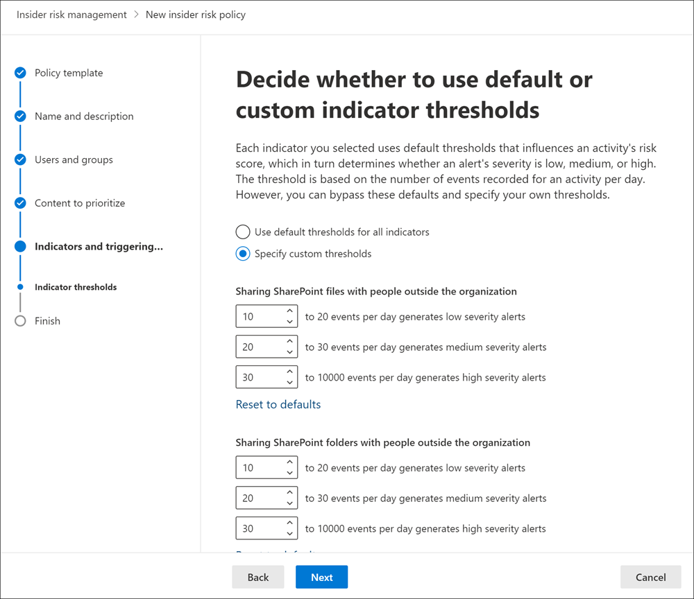

# Erste Schritte mit Einstellungen für das Insider Risikomanagement

Die Einstellungen für das Insider Risikomanagement gelten für alle Richtlinien für das Insider Risikomanagement, unabhängig von der Vorlage, die Sie beim Erstellen einer Richtlinie ausgewählt haben. Die Einstellungen werden über das Steuerelement **Insider-Risiko-Einstellungen** konfiguriert, das sich oben auf allen Registerkarten des Insider-Risikomanagements befindet. Diese Einstellungen steuern Richtlinienkomponenten für die folgenden Bereiche:

- Datenschutz
- Indikatoren
- Richtlinien Zeitlinien
- Intelligente Erkennungen
- Warnungen exportieren
- Prioritäts Benutzergruppen

Bevor Sie mit dem Erstellen von Richtlinien für die Verwaltung von Insider Risiken beginnen, müssen Sie sich mit diesen Einstellungen vertraut machen und die für die Compliance-Anforderungen am besten geeigneten Einstellungsstufen für Ihre Organisation auswählen.

## Datenschutz

Der Schutz der Privatsphäre von Benutzern, die über Richtlinienübereinstimmungen verfügen, ist wichtig und kann zur Förderung der Objektivität bei der Überprüfung von Daten und Analysen im Hinblick auf Insider-Risikowarnungen beitragen. Für Benutzer, denen eine Insider Risiko Richtlinie zugeordnet ist, können Sie eine der folgenden Einstellungen auswählen:

- **Anonyme Versionen von**Benutzernamen anzeigen: Benutzernamen werden anonymisiert, um zu verhindern, dass Administratoren, Daten Ermittler und Prüfer sehen, wem die Richtlinienwarnungen zugeordnet sind. Zum Beispiel würde ein Benutzer "Grace Taylor" mit einem randomisierten Pseudonym wie "AnonIS8-988" in allen Bereichen des Insider-Risikomanagements erscheinen. Wenn Sie diese Einstellung wählen, werden alle Benutzer mit aktuellen und früheren Richtlinienübereinstimmungen anonymisiert und gelten für alle Richtlinien. Benutzerprofilinformationen in der Warnung zu Insider Risiken und Fall Details sind nicht verfügbar, wenn diese Option ausgewählt wird. Benutzernamen werden jedoch beim Hinzufügen neuer Benutzer zu vorhandenen Richtlinien oder beim Zuweisen von Benutzern zu neuen Richtlinien angezeigt. Wenn Sie diese Einstellung deaktivieren, werden Benutzernamen für alle Benutzer angezeigt, die aktuelle oder vergangene Richtlinien Übereinstimmungen aufweisen.
- **Anonyme Versionen von Benutzernamen nicht anzeigen**: Benutzernamen werden für alle aktuellen und letzten Richtlinien Übereinstimmungen für Warnungen und Fälle angezeigt. Benutzerprofilinformationen (Name, Titel, Alias und Organisation oder Abteilung) werden für den Benutzer für alle Warnungen und Fälle im Insider Risikomanagement angezeigt.

## Indikatoren

Vorlagen für Insider Risikorichtlinien definieren Sie die Art der Risiko Aktivitäten, die Sie erkennen und untersuchen möchten. Jede Richtlinienvorlage basiert auf spezifischen Indikatoren, die bestimmten Auslösern und Risiko Aktivitäten entsprechen. Alle Indikatoren sind standardmäßig deaktiviert, und Sie müssen ein oder mehrere Richtlinien Indikatoren auswählen, bevor Sie eine Richtlinie für das Risikomanagement für Insider konfigurieren.

Warnungen werden durch Richtlinien ausgelöst, wenn Benutzeraktivitäten im Zusammenhang mit Richtlinien Indikatoren ausführen, die einen erforderlichen Schwellenwert erfüllen. Das Insider Risikomanagement verwendet zwei Arten von Indikatoren:

- **Auslösende Ereignisse**: Ereignisse, die bestimmen, ob ein Benutzer für eine Richtlinie zur Verwaltung von Insider Risiken aktiv ist. Wenn ein Benutzer einer Insider Risiko-Verwaltungsrichtlinie hinzugefügt wird und kein auslösendes Ereignis vorliegt, wird die Benutzeraktivität nicht von der Richtlinie ausgewertet. Beispielsweise wird Benutzer a einer Richtlinie hinzugefügt, die aus der Richtlinienvorlage " *Datendiebstahl durch Benutzer* " erstellt wurde, und die Richtlinie und der Microsoft 365 HR-Connector sind ordnungsgemäß konfiguriert. Bis für Benutzer a ein vom HR-Connector gemeldetes Terminierungs Datum vorliegt, werden die Aktivitäten des Benutzers a nicht von dieser Richtlinie für Insider-Risikomanagement für Risiken ausgewertet. Ein weiteres Beispiel für ein auslösendes Ereignis ist, wenn ein Benutzer über eine DLP-Richtlinien Warnung mit *hohem* Schweregrad verfügt, wenn *Datenlecks* -Richtlinien verwendet werden.
- **Richtlinien Indikatoren**: Indikatoren, die in Richtlinien für das Insider Risikomanagement verwendet werden, um eine Risikobewertung für einen in-Scope-Benutzer zu ermitteln. Diese Richtlinien Indikatoren werden nur aktiviert, nachdem ein auslösendes Ereignis für einen Benutzer auftritt. Einige Beispiele für Richtlinien Indikatoren sind, wenn ein Benutzerdaten in persönliche Cloud-Speicherdienste oder tragbare Speichergeräte kopiert oder wenn ein Benutzer interne Dateien und Ordner für nicht autorisierte externe Personen freigibt.

Richtlinien Indikatoren werden in die folgenden Bereiche segmentiert. Sie können die Indikatoren zum Aktivieren und Anpassen von Indikator Ereignis Grenzwerten für jede Indikator Ebene beim Erstellen einer Insider Risiko Richtlinie auswählen:

- **Office-Indikatoren**: dazu gehören Richtlinien Indikatoren für SharePoint-Websites, Teams und e-Mail-Nachrichten.
- **Geräte Indikatoren**: dazu gehören Richtlinien Indikatoren für Aktivitäten wie das Freigeben von Dateien über das Netzwerk oder mit Geräten. Indikatoren umfassen Aktivitäten mit Microsoft Office Dateien,. CSV-Dateien und. PDF-Dateien. Wenn Sie **Geräte Indikatoren**auswählen, wird die Aktivität nur für Geräte mit Windows 10 Build 1809 oder höher verarbeitet. Weitere Informationen zum Konfigurieren von Geräten für die Integration in Insider Risiken finden Sie unter [Erste Schritte mit Endpoint DLP](endpoint-dlp-getting-started.md).
- **Indikator für Sicherheitsrichtlinienverletzungen**: dazu zählen Indikatoren von Microsoft Defender ATP im Zusammenhang mit der Installation nicht genehmigter oder böswilliger Software oder der Umgehung von Sicherheitskontrollen. Um Warnungen im Insider Risk Management zu erhalten, müssen Sie über eine aktive Microsoft Defender ATP-Lizenz und die Integration aktivierter Insider Risiken verfügen. Weitere Informationen zum Konfigurieren von Microsoft Defender ATP für die Integration von Insider Risikomanagement finden Sie unter [configure Advanced Features in Microsoft Defender ATP](https://docs.microsoft.com/windows/security/threat-protection/microsoft-defender-atp/advanced-features\#share-endpoint-alerts-with-microsoft-compliance-center).
- **Risiko Bewertungs Verstärker**: dazu gehören das Erhöhen der Risikobewertung für ungewöhnliche Aktivitäten oder vergangene Richtlinienverletzungen. Durch Aktivieren der Risiko Bewertungs Steigerung erhöhen Sie die Risikobewertung und die Wahrscheinlichkeit, dass Warnungen für diese Arten von Aktivitäten aktiviert werden. Risiko Bewertungs Verstärker können nur ausgewählt werden, wenn mindestens ein Indikator oben ausgewählt ist.

In einigen Fällen möchten Sie möglicherweise die Insider-Risikorichtlinien Indikatoren einschränken, die auf Insider Risikorichtlinien in Ihrer Organisation angewendet werden. Sie können die Richtlinien Indikatoren für bestimmte Bereiche deaktivieren, indem Sie Sie von allen Insider Risikorichtlinien deaktivieren. Das Auslösen von Ereignissen kann für Vorlagen für Insider Risikorichtlinien nicht geändert werden.

Wenn Sie die in allen Insider Risikorichtlinien aktivierten Insider-Risikorichtlinien Indikatoren definieren möchten, navigieren Sie zu Indikatoren für **Insider Risiko Einstellungen**,  >  **Indicators** und wählen Sie ein oder mehrere Richtlinien Indikatoren aus. Die auf der Seite indikatoreneinstellungen ausgewählten Indikatoren können beim Erstellen oder Bearbeiten einer Insider Risiko Richtlinie im Richtlinien-Assistenten nicht individuell konfiguriert werden.

>[!NOTE]
>Es kann mehrere Stunden dauern, bis neue manuell hinzugefügte Benutzer im **Dashboard Benutzer**angezeigt werden. Aktivitäten für die letzten 90 Tage für diese Benutzer können bis zu 24 Stunden dauern, bis Sie angezeigt werden. Um Aktivitäten für manuell hinzugefügte Benutzer anzuzeigen, wählen Sie den Benutzer im **Dashboard Benutzer** aus, und öffnen Sie die Registerkarte **Benutzeraktivität** im Detailbereich.

### Einstellungen auf Indikator Ebene (Vorschau)

Beim Erstellen einer Richtlinie im Richtlinien-Assistenten können Sie konfigurieren, wie sich die tägliche Anzahl von Risikoereignissen auf die Risikobewertung für Insider Risikowarnungen auswirken soll. Mithilfe dieser Indikatoreinstellungen können Sie steuern, wie sich die Anzahl der Vorkommen von Risikoereignissen in Ihrer Organisation auf das Risikoergebnis und damit auf den zugeordneten Warnungsschweregrad für diese Ereignisse auswirken sollte. Wenn Sie möchten, können Sie auch die Standardschwellenwerte für Ereignisse beibehalten, die von Microsoft für alle aktivierten Indikatoren empfohlen werden.

Sie möchten beispielsweise SharePoint-Indikatoren in den Richtlinieneinstellungen für Insider Risiken aktivieren und benutzerdefinierte Schwellenwerte für SharePoint-Ereignisse festlegen, wenn Sie Indikatoren für eine neue Richtlinie für Insider-Risiko *Datenlecks* konfigurieren. Während Sie im Assistenten für Insider Risikorichtlinien die drei verschiedenen täglichen Ereignisebenen für jeden SharePoint-Indikator konfigurieren, um die Risikobewertung für Warnungen zu beeinflussen, die diesen Ereignissen zugeordnet sind.

Für die erste tägliche Ereignisebene legen Sie den Schwellenwert bei *10 oder mehr Ereignissen pro Tag* fest, um eine geringere Auswirkung auf das Risikoergebnis für die Ereignisse, *20 oder mehr Ereignisse pro Tag* für eine mittlere Auswirkung auf das Risikoergebnis für die Ereignisse und *30 oder mehr Ereignisse pro Tag* einen höheren Einfluss auf die Risikobewertung für die Ereignisse zu haben. Diese Einstellungen bedeuten effektiv:

- Wenn es 1-9 SharePoint-Ereignisse gibt, die nach dem Auslösen des Ereignisses stattfinden, werden die Risikobewertungen minimal beeinträchtigt und würden tendenziell keine Warnung generieren.
- Wenn es 10-19 SharePoint-Ereignisse gibt, die nach einem auslösendem Ereignis stattfinden, ist das Risikoergebnis inhärent niedriger, und die Warnungsschweregrade tendieren zu einer niedrigen Ebene.
- Wenn es 20-29 SharePoint-Ereignisse gibt, die nach einem Triggern stattfinden, ist das Risikoergebnis inhärent höher, und die Warnungsschweregrade tendieren zu einer mittleren Ebene.
- Wenn 30 oder mehr SharePoint-Ereignisse nach einem Triggern stattfinden, ist das Risikoergebnis inhärent höher, und der Warnungsschweregrad würde sich tendenziell auf einem hohen Niveau befinden.

## Zeitrahmen für Richtlinien

Mit Hilfe von Zeitrahmen für Richtlinien können Sie vergangene und zukünftige Überprüfungszeiträume definieren, die nach Richtlinienübereinstimmungen auf der Grundlage von Ereignissen und Aktivitäten für die Richtlinienvorlagen zum Insider-Risikomanagement ausgelöst werden. Je nach der ausgewählten Richtlinienvorlage stehen die folgenden Richtlinienzeit Rahmen zur Verfügung:

- **Aktivierungsfenster**: für alle Richtlinienvorlagen verfügbar ist das *Aktivierungsfenster* die festgelegte Anzahl von Tagen, die das Fenster **nach** einem auslösendem Ereignis aktiviert. Das Fenster wird für 1 bis 30 Tage aktiviert, nachdem für einen Benutzer, der der Richtlinie zugewiesen ist, ein auslösendes Ereignis auftritt. Sie haben beispielsweise eine Richtlinie für Insider-Risikoverwaltung konfiguriert und das *Aktivierungsfenster* auf 30 Tage festgelegt. Seit der Konfiguration der Richtlinie sind mehrere Monate vergangen, und für einen der in der Richtlinie enthaltenen Benutzer tritt ein auslösendes Ereignis ein. Das auslösende Ereignis aktiviert das *Aktivierungsfenster* , und die Richtlinie ist für diesen Benutzer 30 Tage lang aktiv, nachdem das auslösende Ereignis aufgetreten ist.
- **Erkennung der letzten Aktivität**: für alle Richtlinienvorlagen verfügbar, ist die *vergangene Aktivitätserkennung* die festgelegte Anzahl von Tagen, die das Fenster **vor** einem auslösendem Ereignis aktiviert. Das Fenster wird für 0 bis 180 Tage aktiviert, bevor ein auslösendes Ereignis für einen Benutzer eintritt, der der Richtlinie zugewiesen ist. Sie haben beispielsweise eine Richtlinie für Insider-Risikomanagement konfiguriert und die *bisherige Aktivitätserkennung* auf 90 Tage festgelegt. Seit der Konfiguration der Richtlinie sind mehrere Monate vergangen, und für einen der in der Richtlinie enthaltenen Benutzer tritt ein auslösendes Ereignis ein. Das auslösende Ereignis aktiviert die *bisherige Aktivitätserkennung* , und die Richtlinie sammelt historische Aktivitäten für diesen Benutzer 90 Tage vor dem auslösendem Ereignis.

## Intelligente Erkennungen

Mithilfe intelligenter Erkennungseinstellungen können Sie die Verarbeitung von Erkennungen riskanter Aktivitäten für Warnungen optimieren. Unter bestimmten Umständen müssen Sie möglicherweise Dateitypen definieren, die ignoriert werden sollen, oder Sie möchten einen Erkennungs Grad für Dateien erzwingen, um eine minimale Leiste für Warnungen zu definieren. Wenn Sie anstößige Sprachrichtlinien verwenden, müssen Sie möglicherweise die Erkennungsempfindlichkeit erhöhen oder verringern, um die Anzahl der gemeldeten Richtlinienübereinstimmungen zu kontrollieren. Verwenden Sie diese Einstellungen, um das gesamte Warnungs Volumen, die Dateitypen Ausschlüsse, die Grenzwerte für Datei Volumina und die Empfindlichkeit bei der Erkennung anstößiger Sprachen zu steuern.

### Anomalie-Erkennungen

Zu den Anomalie-Erkennungen gehören Einstellungen für Dateityp-Ausschlüsse und Dateivolumen-Begrenzungen.

- **Dateitypen Ausschlüsse**: um bestimmte Dateitypen aus allen Richtlinien für die Insider Risikoverwaltung auszuschließen, geben Sie die Dateitypen Erweiterungen durch Kommas getrennt ein. Um beispielsweise bestimmte Arten von Musikdateien von den Richtlinienübereinstimmungen auszuschließen, können Sie *AAC, MP3, WAV, WMA* in das Feld **Dateityp-Ausschlüsse** eingeben. Dateien mit diesen Erweiterungen würden von allen Richtlinien zum Insider-Risikomanagement ignoriert werden.
- **Grenzwert für Datei volumenüberschreitung**: um eine mindestdateimenge zu definieren, bevor Aktivitäts Warnungen in Insider Risikorichtlinien gemeldet werden, geben Sie die Anzahl der Dateien ein. Beispielsweise würden Sie "10" eingeben, wenn Sie keine Insider Risikowarnungen generieren möchten, wenn ein Benutzer 10 Dateien oder weniger herunterlädt, selbst wenn die Richtlinien diese Aktivität als Anomalie ansehen.

### Erkennung anstößiger Sprache

Um die Empfindlichkeit des Klassifizierers für anstößige Sprache für Richtlinien anzupassen, welche die Vorlage *Anstößige Sprache in E-Mail* verwenden, wählen Sie eine der folgenden Einstellungen aus:

- **Niedrig**: die niedrigste Empfindlichkeitsstufe mit dem breitesten Bereich für Erkennungs Offensive Sprache und Sentiment. Die Wahrscheinlichkeit falsch positiver Ergebnisse bei anstößigen Sprachübereinstimmungen ist erhöht.
- **Mittel**: die Empfindlichkeitsstufe auf mittlerer Ebene mit einem ausgewogenen Bereich für Erkennungs Offensive Sprache und Sentiment. Die Wahrscheinlichkeit falsch positiver Ergebnisse bei anstößigen Sprachübereinstimmungen ist durchschnittlich.
- **High**: die höchste Empfindlichkeitsstufe mit einem engen Bereich für Erkennungs Offensive Sprache und Sentiment. Die Wahrscheinlichkeit falsch positiver Ergebnisse bei anstößigen Sprachübereinstimmungen ist niedrig.

### Warnungs Lautstärke

Benutzeraktivitäten, die von Insider Risikorichtlinien erkannt werden, werden mit einem bestimmten Risikoergebnis versehen, das wiederum den Warnungsschweregrad (niedrig, Mittel, hoch) bestimmt. Standardmäßig wird eine bestimmte Anzahl von Warnungen mit niedrigem, mittlerem und hohem Schweregrad generiert, aber Sie können die Lautstärke entsprechend Ihren Anforderungen erweitern oder verringern. Wählen Sie eine der folgenden Einstellungen aus, um die Anzahl der Warnungen für alle Richtlinien für das Insider Risikomanagement anzupassen:

- **Weniger Warnungen**: Sie sehen alle Warnungen mit hohem Schweregrad, weniger Warnungen mittlerer Dringlichkeit und keine niedrigen Schweregrade. Diese Einstellungsebene bedeutet, dass Sie möglicherweise einige echte positive Ergebnisse verpassen.
- **Standard Volume**: alle Warnungen mit hohem Schweregrad und eine ausgewogene Anzahl mittlerer und niedriger Dringlichkeits Warnungen werden angezeigt.
- **Weitere Warnungen**: Es werden alle Warnungen bei mittlerer und hoher Dringlichkeit sowie Warnungen mit niedrigem Schweregrad angezeigt. Diese Einstellungsebene kann zu mehr falsch positiven Ergebnissen führen.

### Microsoft Defender Advanced Threat Protection (Vorschau)

[Microsoft Defender Advanced Threat Protection](https://docs.microsoft.com/windows/security/threat-protection/microsoft-defender-atp/microsoft-defender-advanced-threat-protection) (ATP) ist eine Enterprise-Endpunkt-Sicherheitsplattform, die Unternehmensnetzwerken dabei helfen soll, erweiterte Bedrohungen zu verhindern, zu erkennen, zu untersuchen und darauf zu reagieren. Um eine bessere Sichtbarkeit der Sicherheitsverletzung in Ihrer Organisation zu erhalten, können Sie Microsoft Defender ATP-Warnungen für Aktivitäten importieren und Filtern, die in Richtlinien verwendet werden, die aus Richtlinienvorlagen für Sicherheitsverstöße bei Insider Risk Management erstellt wurden.

Je nach den Signaltypen, für die Sie sich interessieren, können Sie Warnungen in das Insider Risikomanagement basierend auf dem Status "Microsoft Defender ATP Alert Triage" importieren. Sie können einen oder mehrere der folgenden Status der Warnungs Auswahl in den globalen Einstellungen zum Importieren definieren:

- Unbekannt
- Neu
- In Arbeit
- Gelöst

Benachrichtigungen von Microsoft Defender ATP werden täglich importiert. Je nach ausgewähltem Status werden möglicherweise mehrere Benutzeraktivitäten für dieselbe Warnung angezeigt, wie sich der Status der Triage in Microsoft Defender ATP ändert.

Wenn Sie beispielsweise " *neu*", " *in Bearbeitung*" und "für diese Einstellung *aufgelöst* " auswählen, wird beim Generieren einer Microsoft Defender ATP-Warnung und dem Status " *neu*" eine anfängliche Warnungs Aktivität für den Benutzer in "Insider Risk" importiert. Wenn sich der Status der Microsoft Defender ATP-Triage in " *in Progress*" ändert, wird eine zweite Aktivität für diese Warnung in "Insider Risiko" für den Benutzer importiert. Wenn der endgültige Status der Microsoft Defender-ATP-Triage für *aufgelöst* festgelegt ist, wird eine dritte Aktivität für diese Warnung in Insider Risiko für den Benutzer importiert. Mit dieser Funktion können Ermittler dem Fortschritt der Microsoft Defender ATP-Warnungen folgern und die Sichtbarkeitsstufe auswählen, die ihre Untersuchung erfordert.

>[!IMPORTANT]
>Sie müssen Microsoft Defender ATP in Ihrer Organisation konfigurieren und Microsoft Defender ATP for Insider Risk Management Integration in das Defender Security Center aktivieren, um Warnungen zu Sicherheitsverletzungen zu importieren. Weitere Informationen zum Konfigurieren von Microsoft Defender ATP für die Integration von Insider Risikomanagement finden Sie unter [configure Advanced Features in Microsoft Defender ATP](https://docs.microsoft.com/windows/security/threat-protection/microsoft-defender-atp/advanced-features\#share-endpoint-alerts-with-microsoft-compliance-center).

### Domänen (Vorschau)

Domäneneinstellungen unterstützen Sie bei der Definition von Risikostufen für die Kommunikation mit bestimmten Domänen. Diese Kommunikation umfasst das Freigeben von Dateien, e-Mail-Nachrichten oder das Herunterladen von Inhalten. Durch die Angabe von Domänen in diesen Einstellungen können Sie die Risikobewertung für Aktivitäten, die mit diesen Domänen stattfinden, vergrössern oder verringern. Um beispielsweise contoso.com und Sales.wingtiptoys.com als zugelassene Domänen anzugeben, geben Sie "contoso.com Sales.wingtiptoys.com" in das Feld **zugelassene Domänen** ein.

Für jede der folgenden Domäneneinstellungen können Sie bis zu 500 Domänen eingeben:

- Nicht **zugelassene Domänen:** Durch die Angabe unzulässiger Domänen werden Aktivitäten, die mit diesen Domänen stattfinden, mit *höheren* Risikobewertungen versehen.
- **Zugelassene Domänen:** Durch die Angabe zulässiger Domänen in Einstellungen haben Aktivitäten, die mit diesen Domänen stattfinden, *niedrigere* Risikobewertungen und werden entsprechend behandelt, wie die interne Organisations Aktivität behandelt wird. Beispielsweise werden e-Mail-Aktivitäten für diese Domänen ähnlich wie bei der Analyse interner e-Mail-Aktivitäten analysiert.
- **Drittanbieter Domänen:** Drittanbieter Domänen sind Domänen, die für geschäftliche Zwecke in Ihrer Organisation verwendet werden, und vertrauliche Inhalte können über diese Standorte hinweg gespeichert werden. Durch die Angabe einer Drittanbieter Domäne können Sie Benachrichtigungen für riskante Aktivitäten in diesen Domänen erhalten.

## Warnungen exportieren (Vorschau)

Warnungsinformationen für das Insider Risikomanagement können über das [API-Schema der Office 365 Verwaltungsaktivität](https://docs.microsoft.com/office/office-365-management-api/office-365-management-activity-api-schema#security-and-compliance-alerts-schema)für Siem-Dienste (Security Information and Event Management) exportierbar sein. Sie können die Office 365-Verwaltungs Aktivitäts-APIs verwenden, um Warnungsinformationen in andere Anwendungen zu exportieren, die Ihre Organisation zum Verwalten oder Aggregieren von Insider Risikoinformationen verwenden kann.

So verwenden Sie die APIs zum Überprüfen von Warnungsinformationen für Insider Risiken:

1. Aktivieren Sie die Unterstützung der Office 365-Verwaltungs Aktivitäts-API in den Einstellungen für das Insider Risikomanagement. Diese Einstellung ist standardmäßig für Ihre Microsoft 365-Organisation deaktiviert.
2. Filtern Sie die allgemeinen Office 365 Überwachungsaktivitäten nach *SecurityComplianceAlerts*.
3. Filtern Sie *SecurityComplianceAlerts* nach der Kategorie *InsiderRiskManagement* .

## Prioritäts Benutzergruppen (Vorschau)

Benutzer in Ihrer Organisation können je nach Position, Zugriffsebene auf vertrauliche Informationen oder Risikoverlauf unterschiedliche Risikostufen aufweisen. Das Priorisieren der Untersuchung und Bewertung der Aktivitäten dieser Benutzer kann Ihnen dabei helfen, Sie auf mögliche Risiken aufmerksam zu machen, die für Ihre Organisation möglicherweise höhere Auswirkungen haben. Priority User Groups in Insider Risk Management helfen bei der Definition der Benutzer in Ihrer Organisation, die eine genauere Überprüfung und eine sensiblere Risikobewertung benötigen. In Verbindung mit den *Sicherheitsrichtlinienverletzungen durch Prioritäts* Benutzer und *Datenverlusten nach Prioritäts Benutzer* Richtlinienvorlagen haben Benutzer, die einer Priorität-Benutzergruppe hinzugefügt wurden, eine erhöhte Wahrscheinlichkeit für Insider Risikowarnungen und Warnungen mit einem höheren Schweregrad.

Sie müssen beispielsweise vor Datenverlusten für ein streng vertrauliches Projekt schützen, in dem Benutzer Zugriff auf vertrauliche Informationen haben. Sie können die Benutzergruppe für *vertrauliche Projekt* *Benutzer* Priority für Benutzer in Ihrer Organisation erstellen, die an diesem Projekt arbeiten. Mit dem Richtlinien-Assistenten und der Richtlinienvorlage *Datenverlust nach Priorität Benutzer* erstellen Sie eine neue Richtlinie und weisen der Richtlinie die Gruppe vertrauliche Benutzer mit Priorität *Project Users* zu. Aktivitäten, die von der Richtlinie für Mitglieder der Benutzergruppe " *vertrauliche Projekt Benutzer* Priorität" untersucht werden, reagieren empfindlicher auf Risiken, und Aktivitäten von diesen Benutzern werden eher eine Warnung generieren und Warnungen mit einem höheren Schweregrad aufweisen.

### Erstellen einer Priorität-Benutzergruppe

Um eine neue Priorität-Benutzergruppe zu erstellen, verwenden Sie Einstellungs Steuerelemente in der Lösung für das **Insider Risikomanagement** im Microsoft 365 Compliance Center. Zum Erstellen einer Priority-Benutzergruppe müssen Sie Mitglied der Administrator-Rollengruppe " *Insider Risk Management* *" oder "Insider Risk Management"* sein.

Führen Sie die folgenden Schritte aus, um eine Priorität-Benutzergruppe zu erstellen:

1. Wechseln Sie im [Microsoft 365 Compliance Center](https://compliance.microsoft.com)zu **Insider Risk Management** , und wählen Sie **Einstellungen für Insider Risiken**aus.
2. Auswählen der Registerkarte " **Prioritäts Benutzergruppen** "
3. Wählen Sie auf der Registerkarte **Prioritäts Benutzergruppen** die Option **Priorität-Benutzergruppe erstellen** aus, um den Gruppen Erstellungs-Assistenten zu starten.
4. Füllen Sie auf der Seite **Gruppe definieren** die folgenden Felder aus:
    - **Name (erforderlich)**: Geben Sie einen Anzeigenamen für die Benutzergruppe Priority ein. Sie können den Namen der Prioritäts Benutzergruppe nicht ändern, nachdem Sie den Assistenten abgeschlossen haben.
    - **Description (optional)**: Geben Sie eine Beschreibung für die Prioritäts Benutzergruppe ein.
5. Wählen Sie **weiter** aus, um fortzufahren.
6. Wählen Sie auf der Seite **Mitglieder** auswählen die Option zu durchsuchende **Mitglieder** auswählen aus, und wählen Sie aus, welche e-Mail-aktivierten Benutzerkonten in der Gruppe enthalten sind, oder aktivieren Sie das Kontrollkästchen **Alles auswählen** , um der Gruppe alle Benutzer in Ihrer Organisation hinzuzufügen. Wählen Sie **Hinzufügen** zum Fortfahren oder **Abbrechen** aus, um zu schließen, ohne Benutzer zur Gruppe hinzuzufügen.
7. Wählen Sie **weiter** aus, um fortzufahren.
8. Überprüfen Sie auf der Seite **überprüfen** die Einstellungen, die Sie für die Benutzergruppe Priorität ausgewählt haben. Wählen Sie **Bearbeiten** aus, um einen der Gruppenwerte zu ändern, oder wählen Sie **senden** aus, um die Benutzergruppe Priorität zu erstellen und zu aktivieren.
9. Wählen Sie auf der Seite Bestätigung die Option **Fertig** aus, um den Assistenten zu beenden.

### Aktualisieren einer Priorität-Benutzergruppe

Um eine vorhandene Priorität-Benutzergruppe zu aktualisieren, verwenden Sie Einstellungs Steuerelemente in der Lösung für das **Insider Risikomanagement** im Microsoft 365 Compliance Center. Zum Aktualisieren einer Prioritäts Benutzergruppe müssen Sie Mitglied der Administrator-Rollengruppe " *Insider Risk Management* *" oder "Insider Risk Management"* sein.

Führen Sie die folgenden Schritte aus, um eine Priorität-Benutzergruppe zu bearbeiten:

1. Wechseln Sie im [Microsoft 365 Compliance Center](https://compliance.microsoft.com)zu **Insider Risk Management** , und wählen Sie **Einstellungen für Insider Risiken**aus.
2. Auswählen der Registerkarte " **Prioritäts Benutzergruppen** "
3. Wählen Sie die Benutzergruppe Priorität aus, die Sie bearbeiten möchten, und klicken Sie dann auf **Gruppe bearbeiten**.
4. Aktualisieren Sie auf der Seite **Gruppe definieren** bei Bedarf das Feld Beschreibung. Der Name der Prioritäts Benutzergruppe kann nicht aktualisiert werden. Wählen Sie **weiter** aus, um fortzufahren.
5. Fügen Sie auf der Seite **Mitglieder auswählen** mithilfe des Steuerelements **Choose** Members neue Mitglieder zu der Gruppe hinzu. Wenn Sie einen Benutzer aus der Gruppe entfernen möchten, wählen Sie das X neben dem Benutzer aus, den Sie entfernen möchten. Wählen Sie **weiter** aus, um fortzufahren.
6. Überprüfen Sie auf der Seite **überprüfen** die Updateeinstellungen, die Sie für die Benutzergruppe Priorität ausgewählt haben. Wählen Sie **Bearbeiten** aus, um einen der Gruppenwerte zu ändern, oder wählen Sie **Absenden** aus, um die Benutzergruppe Priorität zu aktualisieren.
7. Wählen Sie auf der Seite Bestätigung die Option **Fertig** aus, um den Assistenten zu beenden.

### Löschen einer Benutzergruppe mit Priorität

Um eine vorhandene Priorität-Benutzergruppe zu löschen, verwenden Sie Einstellungs Steuerelemente in der Lösung für das **Insider Risikomanagement** im Microsoft 365 Compliance Center. Zum Löschen einer Prioritäts Benutzergruppe müssen Sie Mitglied der Administrator-Rollengruppe " *Insider Risk Management* *" oder "Insider Risk Management"* sein.

>[!IMPORTANT]
>Wenn Sie eine Prioritäts Benutzergruppe löschen, wird Sie aus jeder aktiven Richtlinie entfernt, der Sie zugewiesen ist. Wenn Sie eine Prioritäts Benutzergruppe löschen, die einer aktiven Richtlinie zugewiesen ist, enthält die Richtlinie keine Benutzer in einem Bereich, die sich effektiv im Leerlauf befinden und keine Warnungen erstellen können.

Führen Sie die folgenden Schritte aus, um eine Priorität-Benutzergruppe zu löschen:

1. Wechseln Sie im [Microsoft 365 Compliance Center](https://compliance.microsoft.com)zu **Insider Risk Management** , und wählen Sie **Einstellungen für Insider Risiken**aus.
2. Auswählen der Registerkarte " **Prioritäts Benutzergruppen** "
3. Wählen Sie die Benutzergruppe Priorität aus, die Sie bearbeiten möchten, und wählen Sie im Menü Dashboard die Option **Löschen** aus.
4. Wählen Sie im Dialogfeld **Löschen** die Option **Ja** aus, um die Benutzergruppe Priorität zu löschen, oder wählen Sie **Abbrechen** aus, um zum Dashboard zurückzukehren.