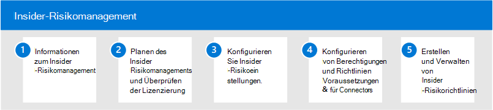

# Insider Risikomanagement in Microsoft 365

In zunehmendem Maße haben Mitarbeiter mehr Zugriff auf das Erstellen, verwalten und Freigeben von Daten für ein breites Spektrum an Plattformen und Diensten. In den meisten Fällen verfügen Organisationen über beschränkte Ressourcen und Tools, um organisationsweite Risiken zu identifizieren und zu verringern und gleichzeitig Compliance-Anforderungen und Datenschutzstandards für Mitarbeiter zu erfüllen. Zu diesen Risiken können Datendiebstahl durch das Ablegen von Mitarbeitern und Datenverluste von Informationen außerhalb Ihrer Organisation durch versehentliche über-oder böswillige Übernutzung oder böswillige Absicht gehören.

Das Insider Risk Management in Microsoft 365 verwendet die gesamte Bandbreite an Dienst-und Drittanbieter Indikatoren, damit Sie riskante Benutzeraktivitäten schnell erkennen, selektieren und handeln können. Mithilfe von Protokollen aus Microsoft 365 und Microsoft Graph können Sie mit dem Insider Risikomanagement bestimmte Richtlinien definieren, um Risikoindikatoren zu identifizieren und Maßnahmen zur Minderung dieser Risiken zu ergreifen.

## Konfigurieren des Insider Risikomanagements für Microsoft 365

Führen Sie die folgenden Schritte aus, um das Insider Risikomanagement für Ihre Organisation zu konfigurieren:

1. Informationen zum [Insider Risikomanagement](insider-risk-management.md) in Microsoft 365
2. Planen des [Insider Risikomanagements und Überprüfen der Lizenzierung](insider-risk-management-plan.md)
3. Konfigurieren von Einstellungen für das [Insider Risikomanagement](insider-risk-management-settings.md)
4. Konfigurieren von [Berechtigungen](insider-risk-management-configure.md#step-1-enable-permissions-for-insider-risk-management) und [Richtlinien Voraussetzungen &-Konnektoren](insider-risk-management-configure.md#step-3-configure-prerequisites-for-templates)
5. Erstellen und Konfigurieren von [Richtlinien für Insider-Risikomanagement](insider-risk-management-configure.md#step-5-create-an-insider-risk-management-policy)

## Weitere Informationen zum Insider Risk Management

- [Verwalten von Richtlinien für Insider Risiken](insider-risk-management-policies.md)
- [Untersuchen von Insider-Risikowarnungen](insider-risk-management-alerts.md)
- [Handeln bei Insider Risikofällen](insider-risk-management-cases.md)