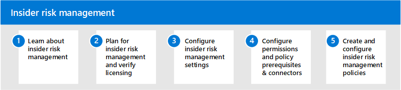

# Insider Risikomanagement in Microsoft 365Insider risk management in Microsoft 365

In zunehmendem Maße haben Mitarbeiter mehr Zugriff auf das Erstellen, verwalten und Freigeben von Daten für ein breites Spektrum an Plattformen und Diensten.Increasingly, employees have more access to create, manage, and share data across a broad spectrum of platforms and services. In den meisten Fällen verfügen Organisationen über beschränkte Ressourcen und Tools, um organisationsweite Risiken zu identifizieren und zu verringern und gleichzeitig Compliance-Anforderungen und Datenschutzstandards für Mitarbeiter zu erfüllen.In most cases, organizations have limited resources and tools to identify and mitigate organization-wide risks while also meeting compliance requirements and employee privacy standards. Zu diesen Risiken können Datendiebstahl durch das Ablegen von Mitarbeitern und Datenverluste von Informationen außerhalb Ihrer Organisation durch versehentliche über-oder böswillige Übernutzung oder böswillige Absicht gehören.These risks may include data theft by departing employees and data leaks of information outside your organization by accidental oversharing or malicious intent.

Das Insider Risk Management in Microsoft 365 verwendet die gesamte Bandbreite an Dienst-und Drittanbieter Indikatoren, damit Sie riskante Benutzeraktivitäten schnell erkennen, selektieren und handeln können.Insider risk management in Microsoft 365 uses the full breadth of service and 3rd-party indicators to help you quickly identify, triage, and act on risky user activity. Mithilfe von Protokollen aus Microsoft 365 und Microsoft Graph können Sie mit dem Insider Risikomanagement bestimmte Richtlinien definieren, um Risikoindikatoren zu identifizieren und Maßnahmen zur Minderung dieser Risiken zu ergreifen.By using logs from Microsoft 365 and Microsoft Graph, insider risk management allows you to define specific policies to identify risk indicators and to take action to mitigate these risks.

## Konfigurieren des Insider Risikomanagements für Microsoft 365Configure insider risk management for Microsoft 365

Führen Sie die folgenden Schritte aus, um das Insider Risikomanagement für Ihre Organisation zu konfigurieren:Use the following steps to configure insider risk management for your organization:

1. Informationen zum [Insider Risikomanagement](insider-risk-management.md) in Microsoft 365Learn about [insider risk management](insider-risk-management.md) in Microsoft 365
2. Planen des [Insider Risikomanagements und Überprüfen der Lizenzierung](insider-risk-management-plan.md)Plan for [insider risk management and verify licensing](insider-risk-management-plan.md)
3. Konfigurieren von Einstellungen für das [Insider Risikomanagement](insider-risk-management-settings.md)Configure [insider risk management settings](insider-risk-management-settings.md)
4. Konfigurieren von [Berechtigungen](insider-risk-management-configure.md#step-1-enable-permissions-for-insider-risk-management) und [Richtlinien Voraussetzungen &-Konnektoren](insider-risk-management-configure.md#step-3-configure-prerequisites-for-templates)Configure [permissions](insider-risk-management-configure.md#step-1-enable-permissions-for-insider-risk-management) and [policy prerequisites & connectors](insider-risk-management-configure.md#step-3-configure-prerequisites-for-templates)
5. Erstellen und Konfigurieren von [Richtlinien für Insider-Risikomanagement](insider-risk-management-configure.md#step-5-create-an-insider-risk-management-policy)Create and configure [insider risk management policies](insider-risk-management-configure.md#step-5-create-an-insider-risk-management-policy)

## Weitere Informationen zum Insider Risk ManagementMore information about insider risk management

- [Verwalten von Richtlinien für Insider RisikenManage insider risk policies](insider-risk-management-policies.md)
- [Untersuchen von Insider-RisikowarnungenInvestigate insider risk alerts](insider-risk-management-alerts.md)
- [Handeln bei Insider RisikofällenAct on insider risk cases](insider-risk-management-cases.md)