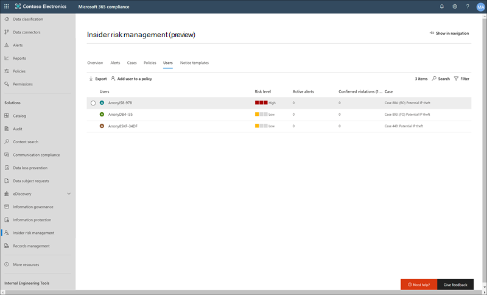

# Benutzer für das Insider RisikomanagementInsider risk management users

Insider Risk Management-Benutzer sind Mitarbeiter in Ihrer Organisation, die in einem oder mehreren Richtlinien für das Insider Risikomanagement enthalten sind.Insider risk management users are employees in your organization that are included in one or more insider risk management policies. Verwenden Sie das **benutzerdashboard** , um Risikoinformationen zu Mitarbeitern schnell zu überprüfen und einen Mitarbeiter zu einer vorhandenen Richtlinie für Insider Risikomanagement hinzuzufügen.Use the **Users dashboard** to quickly review risk information about employees and to add an employee to an existing insider risk management policy. Für jeden Benutzer, der in eine Richtlinie für das Insider Risikomanagement eingeschlossen ist, werden im **benutzerdashboard**folgende Informationen angezeigt:Each user included in an insider risk management policy has the following information displayed on the **Users dashboard**:

- **Users**: der Benutzername für einen Benutzer.**Users**: The username for a user.
- **Risikostufe**: das aktuelle berechnete Risikoniveau des Benutzers.**Risk level**: The current calculated risk level of the user. Diese Bewertung wird alle 24 Stunden berechnet und verwendet die Warnungs Risikobewertungen aller aktiven Warnungen, die dem Benutzer zugeordnet sind.This score is calculated every 24 hours and uses the alert risk scores from all active alerts associated to the user.
- **Aktive Warnungen**: die Anzahl der aktiven Warnungen für alle Richtlinien.**Active alerts**: The number of active alerts for all policies.
- **Bestätigte Verstöße**: die Anzahl der Fälle, die als *bestätigte Richtlinienverletzung* für den Benutzer aufgelöst wurden.**Confirmed violations**: The number of cases resolved as *confirmed policy violation* for the user.
- **Case**: der aktuell aktive Fall für den Benutzer.**Case**: The current active case for the user.

## Anzeigen von Benutzer DetailsView user details

Wenn Sie weitere Details zur Risiko Aktivität für einen Benutzer anzeigen möchten, öffnen Sie den Bereich Benutzer Details, indem Sie auf einen Benutzer im **Dashboard Benutzer**doppelklicken.To view more details about risk activity for a user, open the user details pane by double-clicking a user in the **Users dashboard**. Im Detailbereich können Sie die folgenden Informationen anzeigen:On the details pane, you can view the following information:

- Registerkarte ' **Benutzerprofil** '**User profile** tab
    - **Name und Title**: der Name und der Position-Titel für den Benutzer.**Name and title**: The name and position title for the user.
    - **Benutzer-e-Mail**: die e-Mail-Adresse für den Benutzer.**User email**: The email address for the user.
    - **Alias**: der Netzwerk Alias für den Benutzer.**Alias**: The network alias for the user.
    - **Organisation oder Abteilung**: die Organisation oder Abteilung für den Benutzer.**Organization or department**: The organization or department for the user.

- Registerkarte " **Benutzeraktivität** "**User activity** tab
    - **Verlauf der letzten Benutzeraktivität**: listet sowohl Richtlinien auslösende Ereignisse als auch Risikoindikatoren für Benutzeraktivitäten auf.**History of recent user activity**: Lists both policy triggering events and risk indicators for user activities. Ein auslösendes Ereignis kann die Annahme eines Rücktritts Datums oder des letzten geplanten Arbeitsdatums für den Mitarbeiter sein.A triggering event may be the acceptance of a resignation date or the last scheduled date of work for the employee. Risikoindikatoren sind Aktivitäten, die für ein Element des Risikos bestimmt sind und mit Richtlinien abgeglichen werden, in denen der Benutzer enthalten ist.Risk indicators are activities that are determined to have an element of risk and that are matched to policies that the user is included in. Ereignisse und Risiko Aktivitäten werden mit dem letzten Element aufgeführt, das zuerst aufgeführt wird.Events and risk activities are listed with the most recent item listed first.

## Hinzufügen eines Benutzers zu einer RichtlinieAdd a user to a policy

Zum Hinzufügen eines Benutzers zu einer Richtlinie für Insider Risiken verwenden Sie entweder den Assistenten für neue Richtlinien oder die Registerkarte **Benutzer** in der Lösung für das **Insider Risikomanagement** im Microsoft 365 Compliance Center.To add a user to an insider risk management policy, you'll either use the new policy wizard or the **Users** tab in the **Insider risk management** solution in the Microsoft 365 compliance center.

Führen Sie die folgenden Schritte aus, um einen Benutzer zu einer vorhandenen Insider Risiko Richtlinie hinzuzufügen:Complete the following steps to add a user to an existing insider risk policy:

1. Wechseln Sie im [Microsoft 365 Compliance Center](https://compliance.microsoft.com)zu **Insider Risk Management** , und wählen Sie die Registerkarte **Benutzer** aus.In the [Microsoft 365 compliance center](https://compliance.microsoft.com), go to **Insider risk management** and select the **Users** tab.
2. Wählen Sie auf der Symbolleiste **einen Benutzer zu einer Richtlinie hinzufügen** aus.Select **Add a user to a policy** on the toolbar.
3. Beginnen Sie im Dialogfeld **neuen Benutzer hinzufügen** mit der Eingabe eines Benutzernamens in das Feld **Benutzer** .On the **Add a new user** dialog, start typing a user name in the **User** field. Wählen Sie den Benutzer aus, den Sie einer Richtlinie hinzufügen möchten.Select the user you want to add to a policy.
4. Wählen Sie den Dropdownpfeil für das Feld **Richtlinie** aus, um konfigurierte Richtlinien für die Verwaltung von Insider Risiken anzuzeigen.Select the dropdown arrow for the **Policy** field to display configured insider risk management policies. Wählen Sie die Richtlinie aus, der der Benutzer hinzugefügt werden soll.Select the policy to add the user to.
5. Verwenden Sie das Slider-Steuerelement des **Aktivierungsfensters** , um zu definieren, wie lange die Richtlinie für diesen Benutzer aktiv ist, und wird ausgelöst, wenn der Benutzer die erste Aktivität ausführt, die der Richtlinie entspricht.Use the **Activation window** slider control to define how long the policy is active for this user and is triggered when the user performs the first activity matching the policy. Der Bereich für das Überwachungsfenster beträgt 5 bis 30 Tage.The range for the monitoring window is 5 to 30 days.
6. Wählen Sie **Hinzufügen** und **bestätigen** Sie dann, um den Benutzer zur Richtlinie hinzuzufügen.Select **Add** and then **Confirm** to add the user to the policy.
