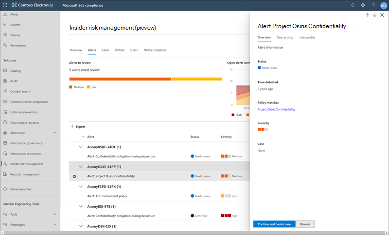

# Informationen zum Insider-Risikomanagement in Microsoft 365

Das Insider-Risikomanagement ist eine Compliancelösung in Microsoft 365, die interne Risiken minimiert, indem Es Ihnen ermöglicht, böswillige und unbeabsichtigte Aktivitäten in Ihrer Organisation zu erkennen, zu untersuchen und darauf zu reagieren. Richtlinien für Insider-Risiken ermöglichen es Ihnen, die Arten von Risiken zu definieren, die in Ihrer Organisation identifiziert und erkannt werden sollen, einschließlich des Handelns in Fällen und des Eskalierens von Fällen an Microsoft Advanced eDiscovery bei Bedarf. Risikoanalysten in Ihrer Organisation können schnell geeignete Maßnahmen ergreifen, um sicherzustellen, dass die Benutzer den Compliance-Standards Ihrer Organisation entsprechen.

Sehen Sie sich die folgenden Videos an, um zu erfahren, wie Das Insider-Risikomanagement Ihrer Organisation dabei helfen kann, Risiken zu verhindern, zu erkennen und einzudämmen, während Sie Werte, Kultur und Benutzerfreundlichkeit Ihrer Organisation priorisieren:
 
 

**Insider-Risikomanagementlösung & Entwicklung:**
>[!VIDEO https://www.microsoft.com/videoplayer/embed/RE4j9CN]
 

**Insider-Risikomanagement-Workflow:**
>[!VIDEO https://www.microsoft.com/videoplayer/embed/RE4OUXB]

## Moderne Risiko-Schwachstellen

Das Management und die Minimierung von Risiken in Ihrem Unternehmen beginnt mit der Kenntnis der Arten von Risiken, die am modernen Arbeitsplatz auftreten. Einige Risiken werden durch externe Ereignisse und Faktoren gesteuert, die sich außerhalb der direkten Kontrolle befinden. Andere Risiken werden durch interne Ereignisse und Benutzeraktivitäten gesteuert, die minimiert und vermieden werden können. Einige Beispiele sind Risiken durch unzulässiges, unangemessenes, nicht autorisiertes oder unkritisches Verhalten und Aktionen von Benutzern in Ihrer Organisation. Diese Verhaltensweisen umfassen eine breite Palette interner Risiken von Benutzern:

- Lecks vertraulicher Daten und Datenlecks
- Verstöße gegen die Vertraulichkeit
- Diebstahl von geistigem Eigentum
- Betrug
- Insidergeschäfte
- Verstöße gegen gesetzliche Vorschriften

Benutzer am modernen Arbeitsplatz haben Zugriff auf das Erstellen, Verwalten und Freigeben von Daten über ein breites Spektrum von Plattformen und Diensten hinweg. In den meisten Fällen verfügen Organisationen über begrenzte Ressourcen und Tools, um organisationsweite Risiken zu erkennen und zu mindern und gleichzeitig die Datenschutzstandards der Benutzer zu erfüllen.

Das Insider-Risikomanagement nutzt die gesamte Bandbreite von Service- und Drittanbieterindikatoren, um Risikoaktivitäten schnell zu erkennen, zu selektieren und zu bearbeiten. Mithilfe von Protokollen aus Microsoft 365 und Microsoft Graph können Sie mithilfe des Insider-Risikomanagements bestimmte Richtlinien definieren, um Risikoindikatoren zu identifizieren. Diese Richtlinien ermöglichen es Ihnen, riskante Aktivitäten zu identifizieren und zu handeln, um diese Risiken zu mindern.

Das Insider-Risikomanagement basiert auf den folgenden Prinzipien:

- **Transparenz:** Abwägen des Datenschutzes von Benutzern im Vergleich zu Unternehmensrisiken mit der Architektur für den datenschutzbasierten Entwurf.
- **Konfigurierbar:** Konfigurierbare Richtlinien basierend auf Branchen-, geografischen und Unternehmensgruppen.
- **Integriert:** Integrierter Workflow über Microsoft 365 Compliancelösungen hinweg.
- **Umsetzbar:** Bietet Einblicke, um Prüferbenachrichtigungen, Datenuntersuchungen und Benutzeruntersuchungen zu ermöglichen.

## Identifizieren potenzieller Risiken mitHilfe von Analysen (Vorschau)

Mit Insider-Risikoanalysen können Sie eine Auswertung potenzieller Insider-Risiken in Ihrer Organisation durchführen, ohne Insider-Risikorichtlinien konfigurieren zu müssen. Diese Auswertung kann Ihrer Organisation dabei helfen, potenzielle Bereiche mit höherem Benutzerrisiko zu identifizieren und den Typ und Umfang von Insider-Risikomanagement-Richtlinien zu bestimmen, die Sie konfigurieren sollten. Diese Bewertung kann Ihnen auch dabei helfen, die Anforderungen für zusätzliche Lizenzierung oder zukünftige Optimierungen vorhandener Insider-Risikorichtlinien zu ermitteln.

Weitere Informationen zu Insider-Risikoanalysen finden Sie in den Einstellungen für das [Insider-Risikomanagement: Analysen.](insider-risk-management-settings.md#analytics-preview)

## Workflow

Der Workflow des Insider-Risikomanagements hilft Ihnen, interne Risiken in Ihrer Organisation zu identifizieren, zu untersuchen und maßnahmen zu ergreifen. Mit fokussierten Richtlinienvorlagen, umfassender Aktivitätssignalisierung über den Microsoft 365-Dienst und Tools für die Warnungs- und Fallverwaltung können Sie umsetzbare Einblicke verwenden, um riskantes Verhalten schnell zu identifizieren und darauf zu reagieren.

Das Identifizieren und Lösen von internen Risikoaktivitäten und Compliance-Problemen mit dem Insider-Risikomanagement in Microsoft 365 verwendet den folgenden Workflow:

### Richtlinien

[Richtlinien für das Insider-Risikomanagement](insider-risk-management-policies.md) werden mithilfe vordefinierter Vorlagen und Richtlinienbedingungen erstellt, die definieren, welche auslösenden Ereignisse und Risikoindikatoren in Ihrer Organisation untersucht werden. Zu diesen Bedingungen gehören die Verwendung von Risikoindikatoren für Warnungen, welche Benutzer in die Richtlinie einbezogen werden, welche Dienste priorisiert werden, und der Überwachungszeitraum.

Sie können aus den folgenden Richtlinienvorlagen auswählen, um schnell mit dem Insider-Risikomanagement zu beginnen:

- [Datendiebstahl durch ausscheidende Benutzer](insider-risk-management-policies.md#data-theft-by-departing-users)
- [Allgemeine Datenlecks](insider-risk-management-policies.md#general-data-leaks)
- [Datenlecks durch prioritäre Benutzer (Vorschau)](insider-risk-management-policies.md#data-leaks-by-priority-users-preview)
- [Datenlecks durch verärgerte Benutzer (Vorschau)](insider-risk-management-policies.md#data-leaks-by-disgruntled-users-preview)
- [Allgemeine Verstöße gegen Sicherheitsrichtlinien (Vorschau)](insider-risk-management-policies.md#general-security-policy-violations-preview)
- [Verstöße gegen Sicherheitsrichtlinien durch ausscheidende Benutzer (Vorschau)](insider-risk-management-policies.md#security-policy-violations-by-departing-users-preview)
- [Verstöße gegen Sicherheitsrichtlinien durch prioritäre Benutzer (Vorschau)](insider-risk-management-policies.md#security-policy-violations-by-priority-users-preview)
- [Verstöße gegen Sicherheitsrichtlinien durch verärgerte Benutzer (Vorschau)](insider-risk-management-policies.md#security-policy-violations-by-disgruntled-users-preview)

### Warnungen

Warnungen werden automatisch von Risikoindikatoren generiert, die richtlinienbedingungen entsprechen, und werden im [Warnungsdashboard](insider-risk-management-activities.md#alert-dashboard)angezeigt. Dieses Dashboard ermöglicht eine schnelle Übersicht über alle Warnungen, die überprüft werden müssen, offene Warnungen im Laufe der Zeit und Warnungsstatistiken für Ihre Organisation. Alle Richtlinienwarnungen werden mit den folgenden Informationen angezeigt, damit Sie den Status vorhandener Warnungen und neuer Warnungen, die eine Aktion erfordern, schnell identifizieren können:

- Status
- Severity
- Ermittelte Zeit
- Fall
- Fallstatus

### Triage

Neue Benutzeraktivitäten, die untersucht werden müssen, generieren automatisch Warnungen, denen der *Status "Überprüfung erforderlich"* zugewiesen ist. Prüfer können diese Warnungen schnell identifizieren, überprüfen, bewerten und triagen.

Warnungen werden gelöst, indem ein neuer Fall eröffnet, die Warnung einem bestehenden Fall zugeordnet oder die Warnung zurückgewiesen wird. Mithilfe von Warnungsfiltern ist es einfach, Warnungen schnell nach Status, Schweregrad oder erkannter Zeit zu identifizieren. Im Rahmen des Triageprozesses können Prüfer Warnungsdetails für die von der Richtlinie identifizierten Aktivitäten anzeigen, benutzeraktivitäten anzeigen, die der Richtlinienübereinstimmung zugeordnet sind, den Schweregrad der Warnung anzeigen und Benutzerprofilinformationen überprüfen.

### Untersuchen

Untersuchen Sie schnell alle Aktivitäten für einen ausgewählten Benutzer mit [Benutzeraktivitätsberichten (Vorschau).](insider-risk-management-activities.md#user-activity-reports-preview) Diese Berichte ermöglichen es Ermittlern in Ihrer Organisation, Aktivitäten für bestimmte Benutzer für einen definierten Zeitraum zu untersuchen, ohne sie vorübergehend oder explizit einer Insider-Risikomanagementrichtlinie zuweisen zu müssen. Nach der Untersuchung von Aktivitäten für einen Benutzer können Ermittler einzelne Aktivitäten als gutartig schließen, einen Link zum Bericht mit anderen Ermittlern teilen oder per E-Mail senden oder den Benutzer vorübergehend oder explizit einer Insider-Risikomanagementrichtlinie zuweisen.

[Fälle](insider-risk-management-cases.md) werden für Warnungen erstellt, die eine eingehendere Überprüfung und Untersuchung der Aktivitätsdetails und -umstände rund um die Richtlinienüberstimmung erfordern. Das **Falldashboard** bietet eine Übersicht über alle aktiven Fälle, offene Fälle im Laufe der Zeit und Fallstatistiken für Ihre Organisation. Prüfer können Fälle schnell nach Status, Dem Datum des Öffnens der Groß-/Kleinschreibung und dem Datum der letzten Aktualisierung filtern.

Wenn Sie einen Fall im Falldashboard auswählen, wird der Fall zur Untersuchung und Überprüfung geöffnet. Dieser Schritt ist das Herzstück des Insider-Risikomanagement-Workflows. In diesem Bereich werden Risikoaktivitäten, Richtlinienbedingungen, Warnungsdetails und Benutzerdetails in einer integrierten Ansicht für Prüfer synthetisiert. Die wichtigsten Untersuchungstools in diesem Bereich sind:

- **Benutzeraktivität:** Benutzeraktivität wird automatisch in einem interaktiven Diagramm angezeigt, in dem Aktivitäten im Laufe der Zeit und nach Risikostufe für aktuelle oder frühere Risikoaktivitäten dargestellt werden. Prüfer können den gesamten Risikoverlauf für den Benutzer schnell filtern und anzeigen und detaillierte Informationen zu bestimmten Aktivitäten anzeigen.
- **Inhalts-Explorer:** Alle Mit Benachrichtigungsaktivitäten verknüpften Datendateien und E-Mail-Nachrichten werden automatisch im Inhalts-Explorer erfasst und angezeigt. Prüfer können Dateien und Nachrichten nach Datenquelle, Dateityp, Tags, Unterhaltung und vielen weiteren Attributen filtern und anzeigen.
- **Fallhinweise:** Prüfer können Hinweise zu einem Fall im Abschnitt "Fallnotizen" bereitstellen. In dieser Liste werden alle Notizen in einer zentralen Ansicht konsolidiert, und die Übermittelten Informationen des Prüfers und des Datums sind enthalten.

Darüber hinaus können Sie mit dem neuen [Überwachungsprotokoll (Vorschau)](insider-risk-management-audit-log.md) über die Aktionen informiert bleiben, die für Insider-Risikomanagement-Features ausgeführt wurden. Diese Ressource ermöglicht eine unabhängige Überprüfung der Aktionen von Benutzern, die einer oder mehreren Rollengruppen für das Insider-Risikomanagement zugewiesen sind.

### Aktion

Nachdem Fälle untersucht wurden, können Prüfer schnell handeln, um den Fall zu lösen oder mit anderen Risikobeteiligten in Ihrer Organisation zusammenzuarbeiten. Wenn Benutzer versehentlich oder versehentlich gegen Richtlinienbedingungen verstoßen, kann ein einfacher Erinnerungshinweis über Benachrichtigungsvorlagen, die Sie für Ihre Organisation anpassen können, an den Benutzer gesendet werden. Diese Hinweise können als einfache Erinnerungen dienen oder den Benutzer zu Auffrischungsschulungen oder Anleitungen leiten, um zukünftiges riskantes Verhalten zu verhindern. Weitere Informationen finden Sie unter [Insider-Risikomanagement-Benachrichtigungsvorlagen.](insider-risk-management-notices.md)

In schwerwiegenderen Situationen müssen Sie möglicherweise die Fallinformationen zum Insider-Risikomanagement mit anderen Prüfern oder Diensten in Ihrer Organisation teilen. Das Insider-Risikomanagement ist eng in andere Microsoft 365 Compliance-Lösungen integriert, um Sie bei der End-to-End-Risikobehebung zu unterstützen.

- **Advanced eDiscovery:** Wenn Sie einen Fall für die Untersuchung eskalieren, können Sie Daten und die Verwaltung des Falls an Advanced eDiscovery in Microsoft 365 übertragen. Advanced eDiscovery bietet einen End-to-End-Workflow zum Beibehalten, Sammeln, Überprüfen, Analysieren und Exportieren von Inhalten, die auf die internen und externen Ermittlungen Ihrer Organisation abgestimmt sind. Dies ermöglicht es juristischen Teams, den gesamten Warnungs-Workflow für die gesetzliche Aufbewahrungspflicht zu verwalten. Weitere Informationen zu den Advanced eDiscovery-Fällen finden Sie unter [Übersicht über Advanced eDiscovery in Microsoft 365](overview-ediscovery-20.md).
- **Office 365 Integration von Verwaltungs-APIs (Vorschau):** Das Insider-Risikomanagement unterstützt den Export von Warnungsinformationen in SIEM-Dienste (Security Information and Event Management) über die Office 365 Management-APIs. Wenn Sie Zugriff auf Benachrichtigungsinformationen auf der Plattform haben, die am besten zu den Risikoprozessen Ihrer Organisation passen, können Sie flexibler auf Risikoaktivitäten reagieren. Weitere Informationen zum Exportieren von Warnungsinformationen mit Office 365-Verwaltungs-APIs finden Sie unter Exportieren von [Warnungen.](insider-risk-management-settings.md#export-alerts-preview)

> [!NOTE]
> Vielen Dank für Ihr Feedback und Ihren Support während der Vorschau des ServiceNow-Connectors. Wir haben beschlossen, die Vorschau des ServiceNow-Connectors zu beenden und den Support im Insider-Risikomanagement am 30. November 2020 einzustellen. Wir evaluieren aktiv alternative Methoden, um Kunden die ServiceNow-Integration in das Insider-Risikomanagement zu ermöglichen.

## Szenarien

Das Insider-Risikomanagement kann Ihnen dabei helfen, interne Risiken in Ihrer Organisation in mehreren gängigen Szenarien zu erkennen, zu untersuchen und Maßnahmen zu ergreifen:

### Datendiebstahl durch ausscheidende Benutzer

Wenn Benutzer eine Organisation verlassen, entweder absichtlich oder als Ergebnis der Kündigung, gibt es häufig berechtigte Bedenken, dass Unternehmens-, Kunden- und Benutzerdaten gefährdet sind. Benutzer gehen möglicherweise davon aus, dass Projektdaten nicht proprietär sind, oder sie sind versucht, Unternehmensdaten zum persönlichen Vorteil und unter Verstoß gegen unternehmensrichtlinien und rechtliche Standards zu nutzen. Richtlinien für das Insider-Risikomanagement, [die den Datendiebstahl verwenden, indem sie](insider-risk-management-policies.md#policy-templates) die Richtlinienvorlage für verlassende Benutzer verwenden, erkennen automatisch Aktivitäten, die in der Regel mit dieser Art von Diebstahl verbunden sind. Mit dieser Richtlinie erhalten Sie automatisch Benachrichtigungen zu verdächtigen Aktivitäten im Zusammenhang mit Datendiebstahl durch abwesende Benutzer, damit Sie entsprechende Ermittlungsmaßnahmen ergreifen können. Für diese Richtlinienvorlage ist das Konfigurieren eines [Microsoft 365 HR-Connectors](import-hr-data.md) für Ihre Organisation erforderlich.

### Absichtliche oder unbeabsichtigte Lecks vertraulicher oder vertraulicher Informationen

In den meisten Fällen versuchen Benutzer, vertrauliche oder vertrauliche Informationen ordnungsgemäß zu behandeln. Aber gelegentlich machen Benutzer Fehler, und Informationen werden versehentlich außerhalb Ihrer Organisation oder unter Verstoß gegen Ihre Informationsschutzrichtlinien freigegeben. Unter anderen Umständen können Benutzer vertrauliche und vertrauliche Informationen absichtlich und zu potenziellen persönlichen Vorteilen weitergeben oder weitergeben. Richtlinien für das Insider-Risikomanagement, die mit den folgenden Richtlinienvorlagen für Datenlecks erstellt wurden, erkennen automatisch Aktivitäten, die normalerweise mit der Freigabe vertraulicher oder vertraulicher Informationen verbunden sind:

- [Allgemeine Datenlecks](insider-risk-management-policies.md#general-data-leaks)
- [Datenlecks durch prioritäre Benutzer (Vorschau)](insider-risk-management-policies.md#data-leaks-by-priority-users-preview)
- [Datenlecks durch verärgerte Benutzer (Vorschau)](insider-risk-management-policies.md#data-leaks-by-disgruntled-users-preview)

## Absichtliche oder unbeabsichtigte Sicherheitsrichtlinienverstöße (Vorschau)

Benutzer haben in der Regel ein hohes Maß an Kontrolle, wenn sie ihre Geräte am modernen Arbeitsplatz verwalten. Dieses Steuerelement kann Berechtigungen zum Installieren oder Deinstallieren von Anwendungen umfassen, die zur Erfüllung ihrer Aufgaben erforderlich sind, oder die Möglichkeit, Gerätesicherheitsfeatures vorübergehend zu deaktivieren. Unabhängig davon, ob diese Aktivität versehentlich, versehentlich oder bösartig ist, kann dieses Verhalten ein Risiko für Ihre Organisation darstellen und ist wichtig, um sie zu identifizieren und zu minimieren. Um diese riskanten Sicherheitsaktivitäten zu identifizieren, werden mit den folgenden Vorlagen für Sicherheitsrisikomanagement-Sicherheitsrichtlinienverletzungen Sicherheitsrisikoindikatoren bewertet und Microsoft Defender für Endpunkt-Warnungen verwendet, um Einblicke für sicherheitsrelevante Aktivitäten bereitzustellen:

- [Allgemeine Verstöße gegen Sicherheitsrichtlinien (Vorschau)](insider-risk-management-policies.md#general-security-policy-violations-preview)
- [Verstöße gegen Sicherheitsrichtlinien durch ausscheidende Benutzer (Vorschau)](insider-risk-management-policies.md#security-policy-violations-by-departing-users-preview)
- [Verstöße gegen Sicherheitsrichtlinien durch prioritäre Benutzer (Vorschau)](insider-risk-management-policies.md#security-policy-violations-by-priority-users-preview)
- [Verstöße gegen Sicherheitsrichtlinien durch verärgerte Benutzer (Vorschau)](insider-risk-management-policies.md#security-policy-violations-by-disgruntled-users-preview)

## Richtlinien für Benutzer basierend auf Position, Zugriffsebene oder Risikoverlauf (Vorschau)

Benutzer in Ihrer Organisation haben je nach Position, Zugriffsebene auf vertrauliche Informationen oder Risikoverlauf möglicherweise unterschiedliche Risikostufen. Diese Struktur kann Mitglieder des Führungsteams Ihrer Organisation, IT-Administratoren mit umfangreichen Daten- und Netzwerkzugriffsberechtigungen oder Benutzer mit früheren riskanten Aktivitäten umfassen. Unter diesen Umständen sind eine genauere Überprüfung und eine aggressivere Risikobewertung wichtig, um Warnungen für die Untersuchung und schnelles Handeln zu unterstützen. Um riskante Aktivitäten für diese Benutzertypen zu identifizieren, können Sie Benutzergruppen mit Priorität erstellen und Richtlinien aus den folgenden Richtlinienvorlagen erstellen:

- [Verstöße gegen Sicherheitsrichtlinien durch prioritäre Benutzer (Vorschau)](insider-risk-management-policies.md#security-policy-violations-by-priority-users-preview)
- [Datenlecks durch prioritäre Benutzer (Vorschau)](insider-risk-management-policies.md#data-leaks-by-priority-users-preview)

## Aktionen und Verhaltensweisen von verärgerten Benutzern (Vorschau)

Personalsituation kann sich auf verschiedene Weise auf das Benutzerverhalten im Zusammenhang mit Insider-Risiken auswirken. Bei diesen Stressoren kann es sich um eine leistungsschwache Überprüfung, eine Herabstufung der Position oder die Platzierung des Benutzers in einen Leistungsüberprüfungsplan handelt. Obwohl die meisten Benutzer nicht böswillig auf diese Ereignisse reagieren, kann der Stress dieser Aktionen dazu führen, dass einige Benutzer Aktionen ausführen, die sie unter normalen Umständen normalerweise nicht in Betracht ziehen. Um diese Arten riskanter Aktivitäten zu identifizieren, verwenden die folgenden Richtlinienvorlagen für das Insider-Risikomanagement den Microsoft 365 HR-Connector und beginnen mit der Bewertung von Risikoindikatoren im Zusammenhang mit Verhaltensweisen, die in der Nähe von Stressorereignissen auftreten können:

- [Datenlecks durch verärgerte Benutzer (Vorschau)](insider-risk-management-policies.md#data-leaks-by-disgruntled-users-preview)
- [Verstöße gegen Sicherheitsrichtlinien durch verärgerte Benutzer (Vorschau)](insider-risk-management-policies.md#security-policy-violations-by-disgruntled-users-preview)

## Sind Sie bereit loszulegen?

- Informationen zum Aktivieren von Richtlinien für das [Insider-Risikomanagement](insider-risk-management-plan.md) in Ihrer Organisation finden Sie unter "Planen des Insider-Risikomanagements".
- Informationen zum Konfigurieren globaler Einstellungen für Insider-Risikorichtlinien finden Sie unter ["Erste Schritte mit Insider-Risikomanagementeinstellungen".](insider-risk-management-settings.md)
- Informationen zum Konfigurieren von Voraussetzungen, zum Erstellen von Richtlinien und zum Empfangen von Warnungen finden Sie unter ["Erste Schritte mit dem Insider-Risikomanagement".](insider-risk-management-configure.md)
