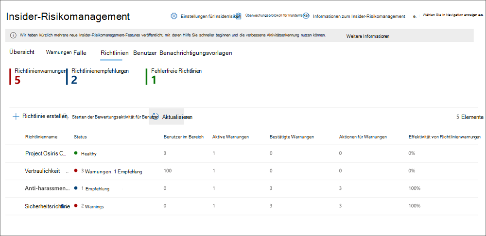

# Informationen zum Insider-Risikomanagement in Microsoft 365

Das Insider Risk Management ist eine Compliance-Lösung in Microsoft 365, mit der interne Risiken minimiert werden, indem Sie böswillige und unbeabsichtigte Aktivitäten in Ihrer Organisation erkennen, untersuchen und darauf reagieren können. Mit Insider Risikorichtlinien können Sie die Arten von Risiken definieren, die in Ihrer Organisation identifiziert und erkannt werden, einschließlich der Reaktion auf Fälle und Eskalations Fälle an Microsoft Advanced eDiscovery bei Bedarf. Risikoanalysten in Ihrer Organisation können schnell geeignete Maßnahmen ergreifen, um sicherzustellen, dass Benutzer mit den Compliance-Standards Ihrer Organisation konform sind.

Sehen Sie sich das folgende Video an, um zu erfahren, wie Sie mit dem Insider Risikomanagement Ihre Organisation bei der Priorisierung Ihrer Unternehmenswerte, ihrer Kultur und ihrer Benutzerfreundlichkeit bei der Vermeidung, Erkennung und Eindämmung von Risiken unterstützen können:
 
 
>[!VIDEO https://www.microsoft.com/videoplayer/embed/RE4j9CN]

## Probleme mit modernen Risiko Punkten

Das Management und die Minimierung von Risiken in Ihrem Unternehmen beginnt mit der Kenntnis der Arten von Risiken, die am modernen Arbeitsplatz auftreten. Einige Risiken werden durch externe Ereignisse und Faktoren gesteuert, die sich außerhalb der direkten Steuerung befinden. Andere Risiken werden durch interne Ereignisse und Benutzeraktivitäten gesteuert, die minimiert und vermieden werden können. Einige Beispiele sind Risiken durch illegales, unangemessenes, unbefugtes oder unethisches Verhalten und Aktionen von Benutzern in Ihrer Organisation. Diese Verhaltensweisen umfassen eine Vielzahl interner Risiken von Benutzern:

- Lecks von vertraulichen Daten und Datenüberlauf
- Verstöße gegen die Vertraulichkeit
- Diebstahl von geistigem Eigentum
- Betrug
- Insidergeschäfte
- Verstöße gegen gesetzliche Vorschriften

Benutzer am modernen Arbeitsplatz haben Zugriff auf das Erstellen, verwalten und Freigeben von Daten für ein breites Spektrum an Plattformen und Diensten. In den meisten Fällen verfügen Organisationen über beschränkte Ressourcen und Tools, um unternehmensweite Risiken zu identifizieren und zu verringern und gleichzeitig die Datenschutzstandards für Benutzer zu erfüllen.

Das Insider Risikomanagement verwendet die gesamte Bandbreite von Dienst-und Drittanbieter Indikatoren, damit Sie Risiko Aktivitäten schnell erkennen, selektieren und handeln können. Mithilfe von Protokollen aus Microsoft 365 und Microsoft Graph können Sie mit dem Insider Risikomanagement bestimmte Richtlinien zur Identifizierung von Risikoindikatoren definieren. Diese Richtlinien ermöglichen es Ihnen, riskante Aktivitäten zu identifizieren und zu handeln, um diese Risiken zu verringern.

Das Insider Risikomanagement konzentriert sich auf die folgenden Prinzipien:

- **Transparenz**: Gleichgewichtzwischen Benutzerdaten Schutz und Organisations Risiko mit Datenschutz-nach-Design-Architektur.
- **Konfigurierbar**: konfigurierbare Richtlinien basierend auf Branchen-, geografischen und Unternehmensgruppen.
- **Integriert**: integrierter Workflow in Microsoft 365 Compliance-Lösungen.
- **Handlungs** fähig: bietet Einblicke, um Benutzer Benachrichtigungen, Daten Ermittlungen und Benutzer Untersuchungen zu ermöglichen.

## Workflow

Der Workflow für den Insider Risikomanagement hilft Ihnen, interne Risiken in Ihrer Organisation zu identifizieren, zu untersuchen und Maßnahmen zu ergreifen. Mit fokussierten Richtlinienvorlagen, umfassenden Aktivitäts Signalen über den Microsoft 365-Dienst und Warnungs-und Fall Verwaltungstools können Sie Einblicke in Aktionen verwenden, um riskantes Verhalten schnell zu identifizieren und zu handeln.

Das Identifizieren und Lösen von internen Risikoaktivitäten und Compliance-Problemen mit dem Insider-Risikomanagement in Microsoft 365 verwendet den folgenden Workflow:

### Richtlinien

[Richtlinien für das Insider Risikomanagement](insider-risk-management-policies.md) werden mithilfe vordefinierter Vorlagen und Richtlinienbedingungen erstellt, die definieren, welche Auslöser von Ereignissen und Risikoindikatoren in Ihrer Organisation untersucht werden. Diese Bedingungen umfassen, wie Risikoindikatoren für Warnungen verwendet werden, welche Benutzer in der Richtlinie enthalten sind, welche Dienste priorisiert werden und welcher Zeitraum überwacht wird.

Sie können aus den folgenden [Richtlinienvorlagen auswählen, um schnell mit dem Insider-Risikomanagement zu beginnen:

- [Datendiebstahl durch Benutzer](insider-risk-management-policies.md#data-theft-by-departing-users)
- [Allgemeine Datenlecks](insider-risk-management-policies.md#general-data-leaks)
- [Datenlecks nach Prioritäts Benutzern (Vorschau)](insider-risk-management-policies.md#data-leaks-by-priority-users-preview)
- [Datenverluste durch verärgerte Benutzer (Vorschau)](insider-risk-management-policies.md#data-leaks-by-disgruntled-users-preview)
- [Allgemeine Sicherheitsrichtlinienverletzungen (Vorschau)](insider-risk-management-policies.md#general-security-policy-violations-preview)
- [Sicherheitsrichtlinienverletzungen durch abgehende Benutzer (Vorschau)](insider-risk-management-policies.md#security-policy-violations-by-departing-users-preview)
- [Sicherheitsrichtlinienverletzungen nach Prioritäts Benutzern (Vorschau)](insider-risk-management-policies.md#security-policy-violations-by-priority-users-preview)
- [Sicherheitsrichtlinienverletzungen durch verärgerte Benutzer (Vorschau)](insider-risk-management-policies.md#security-policy-violations-by-disgruntled-users-preview)
- [Anstößige Sprache in E-Mails](insider-risk-management-policies.md#offensive-language-in-email)

### Warnungen

Warnungen werden automatisch von Risikoindikatoren generiert, die Richtlinienbedingungen entsprechen und im [Alerts-Dashboard](insider-risk-management-alerts.md)angezeigt werden. Dieses Dashboard ermöglicht eine schnelle Ansicht aller Warnungen, die überprüft werden müssen, Warnungen werden über einen Zeitraum geöffnet, und es werden Warnungs Statistiken für Ihre Organisation angezeigt. Alle Richtlinienwarnungen werden mit den folgenden Informationen angezeigt, damit Sie schnell den Status vorhandener Warnungen und neuer Warnungen ermitteln können, die eine Aktion erfordern:

- Status
- Severity
- Erkannte Zeit
- Fall
- Fall Status

### Auswahl

Bei neuen Benutzeraktivitäten, bei denen Untersuchungen erforderlich sind, werden automatisch Warnungen generiert, denen ein *Überarbeitungs* Status für Anforderungen zugewiesen ist. Überprüfer können diese Warnungen schnell identifizieren und überprüfen, auswerten und selektieren.

Warnungen werden gelöst, indem ein neuer Fall eröffnet, die Warnung einem bestehenden Fall zugeordnet oder die Warnung zurückgewiesen wird. Mithilfe von Warnungs Filtern ist es ganz einfach, Warnungen nach Status, Schweregrad oder erkannter Zeit schnell zu identifizieren. Im Rahmen des Triage-Prozesses können Bearbeiter Warnungsdetails für die durch die Richtlinie identifizierten Aktivitäten anzeigen, Benutzeraktivitäten anzeigen, die der Richtlinienübereinstimmung zugeordnet sind, den Schweregrad der Warnung lesen und Benutzerprofilinformationen überprüfen.

### Untersuchen

Es werden [Fälle](insider-risk-management-cases.md) für Warnungen erstellt, die eine umfassendere Überprüfung und Untersuchung der Aktivitätsdetails und-Umstände in der Richtlinienübereinstimmung erfordern. Das **Case-Dashboard** bietet eine Übersicht über alle aktiven Fälle, offene Fälle im Laufe der Zeit und Fall Statistiken für Ihre Organisation. Bearbeiter können Fälle schnell nach Status filtern, das Datum, an dem der Fall geöffnet wurde, und das Datum, an dem der Fall zuletzt aktualisiert wurde.

Wenn Sie im Case-Dashboard einen Fall auswählen, wird der Fall zur Untersuchung und Überprüfung geöffnet. Dieser Schritt ist das Herzstück des Insider Risikomanagement-Workflows. In diesem Bereich werden Risiko Aktivitäten, Richtlinienbedingungen, Warnungsdetails und Benutzer Details in einer integrierten Ansicht für Bearbeiter synthetisiert. Die primären Ermittlungs Tools in diesem Bereich sind:

- **Benutzeraktivität**: Benutzeraktivität wird automatisch in einem interaktiven Diagramm angezeigt, in dem Aktivitäten im Laufe der Zeit und nach Risikoebene für aktuelle oder vergangene Risiko Aktivitäten gezeichnet werden. Bearbeiter können den gesamten Risikoverlauf für den Benutzer schnell Filtern und anzeigen und weitere Details in bestimmte Aktivitäten einblenden.
- **Inhalts-Explorer**: alle Datendateien und e-Mail-Nachrichten, die Warnungs Aktivitäten zugeordnet sind, werden automatisch erfasst und im Inhalts-Explorer angezeigt. Bearbeiter können Dateien und Nachrichten nach Datenquellen, Dateityp, Tags, Unterhaltung und vielen weiteren Attributen Filtern und anzeigen.
- **Fallnotizen**: Bearbeiter können Notizen für einen Fall im Abschnitt "fallnotizen" bereitstellen. In dieser Liste werden alle Notizen in einer zentralen Ansicht konsolidiert, und es werden die Informationen Prüfer und Datum übermittelt hinzugefügt.

### Aktion

Nachdem Fälle untersuchtwurden, können Bearbeiter schnell zur Lösung des Falles oder zur Zusammenarbeit mit anderen Risiko Beteiligten in Ihrer Organisation fungieren. Wenn Benutzer versehentlich oder versehentlich Richtlinienbedingungen verletzen, kann eine einfache Mahnungsbenachrichtigung an den Benutzer aus den Benachrichtigungsvorlagen gesendet werden, die Sie für Ihre Organisation anpassen können. Diese Hinweise können als einfache Erinnerungen dienen oder den Benutzer an eine Auffrischungsschulung oder Anleitung weiterleiten, um zukünftiges riskantes Verhalten zu verhindern. Weitere Informationen finden Sie unter [Insider Risk Management – Hinweis Vorlagen](insider-risk-management-notices.md).

In den schwerwiegenderen Situationen müssen Sie möglicherweise die Fall Informationen für Insider Risk Management für andere Bearbeiter oder Dienste in Ihrer Organisation freigeben. Das Insider Risikomanagement ist eng mit anderen Microsoft 365-Compliance-Lösungen integriert, die Ihnen bei der End-to-End-Risiko Lösung helfen.

- **Advanced eDiscovery**: eskalieren eines Falls zur Untersuchung können Sie Daten und die Verwaltung der Anfrage in Advanced eDiscovery in Microsoft 365 übertragen. Advanced eDiscovery bietet einen End-to-End-Workflow zum Beibehalten, Sammeln, Überprüfen, Analysieren und Exportieren von Inhalten, die auf die internen und externen Ermittlungen Ihrer Organisation abgestimmt sind. Dies ermöglicht es juristischen Teams, den gesamten Warnungs-Workflow für die gesetzliche Aufbewahrungspflicht zu verwalten. Weitere Informationen zu den Advanced eDiscovery-Fällen finden Sie unter [Übersicht über Advanced eDiscovery in Microsoft 365](overview-ediscovery-20.md).
- **ServiceNow (Vorschau)**: ServiceNow ist eine beliebte Cloud Computing-Plattform, die Organisationen bei der Verwaltung digitaler Workflows für Unternehmensvorgänge unterstützt. Das Insider Risikomanagement unterstützt das Freigeben von Fall Benachrichtigungen mit Ihrem ServiceNow-Dienst und ermöglicht Ihnen das Erstellen von Vorfällen und Änderungsanforderungen in Bezug auf einzelne Insider Risiko Fälle. Weitere Informationen zum Freigeben von Warnungsinformationen mit ServiceNow finden Sie unter [Freigeben eines Falls mit ServiceNow](insider-risk-management-cases.md#share-the-case).
- **Office 365 Management APIs Integration (Preview)**: das Insider Risikomanagement unterstützt das Exportieren von Warnungsinformationen in die Security Information and Event Management (SIEM)-Dienste über die Office 365 Management-APIs. Wenn Sie Zugriff auf die Warnungsinformationen auf der Plattform haben, ist die optimale Lösung für die Risikoprozesse Ihrer Organisation eine größere Flexibilität beim Handeln bei Risiko Aktivitäten. Weitere Informationen zum Exportieren von Warnungsinformationen mit Office 365-Verwaltungs-APIs finden Sie unter [Export Alerts](insider-risk-management-settings.md#export-alerts-preview).

>[!NOTE]
>Vielen Dank für Ihr Feedback und ihre Unterstützung während der Vorschau des ServiceNow-Konnektors. Wir haben uns entschlossen, die Vorschau von ServiceNow Connector zu beenden und die Unterstützung für das Insider Risk Management am 30. November 2020 einzustellen. Wir evaluieren aktiv Alternative Methoden, um Kunden die Integration von ServiceNow in das Insider Risikomanagement zu ermöglichen.

## Szenarien

Das Insider Risikomanagement hilft Ihnen bei der Erkennung, Untersuchung und Durchführung von Maßnahmen zur Minderung interner Risiken in Ihrer Organisation in mehreren gängigen Szenarien:

### Datendiebstahl durch Benutzer

Wenn Benutzer eine Organisation entweder freiwillig oder als Folge der Beendigung verlassen, gibt es häufig legitime Bedenken, dass Firmen-, Kunden-und Benutzerdaten gefährdet sind. Benutzer können unschuldig davon ausgehen, dass Projektdaten nicht proprietär sind, oder Sie können versucht sein, Unternehmensdaten zur persönlichen Verstärkung und unter Verstoß gegen Unternehmensrichtlinien und gesetzliche Standards zu nutzen. Richtlinien für Insider-Risikomanagement, die die Richtlinienvorlage " [Datendiebstahl durch departs users](insider-risk-management-policies.md#policy-templates) " verwenden, erkennen automatisch Aktivitäten, die typischerweise mit diesem Diebstahltyp verbunden sind. Mit dieser Richtlinie erhalten Sie automatisch Warnungen für verdächtige Aktivitäten im Zusammenhang mit dem Datendiebstahl durch die Benutzer, sodass Sie geeignete Ermittlungsaktionen durchführen können. Die Konfiguration eines [Microsoft 365 HR-Connectors](import-hr-data.md) für Ihre Organisation ist für diese Richtlinienvorlage erforderlich.

### Vorsätzliches oder unbeabsichtigtes Leck vertraulicher oder vertraulicher Informationen

In den meisten Fällen versuchen Benutzer ihr Bestes, vertrauliche oder vertrauliche Informationen ordnungsgemäß zu verarbeiten. Gelegentlich können Benutzer jedoch Fehler machen, und Informationen werden versehentlich außerhalb Ihrer Organisation oder unter Verletzung ihrer Richtlinien zum Schutz von Informationen freigegeben. In anderen Fällen können Benutzer vertrauliche und vertrauliche Informationen absichtlich mit böswilligen Absichten und potenziellen persönlichen gewinnen austauschen oder freigeben. Richtlinien für Insider-Risikomanagement, die mit den folgenden Datenverlust Richtlinienvorlagen erstellt werden, erkennen automatisch Aktivitäten, die in der Regel mit der Freigabe vertraulicher oder vertraulicher Informationen verbunden sind

- [Allgemeine Datenlecks](insider-risk-management-policies.md#general-data-leaks)
- [Datenlecks nach Prioritäts Benutzern (Vorschau)](insider-risk-management-policies.md#data-leaks-by-priority-users-preview)
- [Datenverluste durch verärgerte Benutzer (Vorschau)](insider-risk-management-policies.md#data-leaks-by-disgruntled-users-preview)

### Anstößiges Verhalten, das Unternehmensrichtlinien verletzt

Die Kommunikation zwischen Benutzern ist häufig eine Quelle für unbeabsichtigte oder böswillige Verstöße gegen Unternehmensrichtlinien. Diese Verletzungen können anstößige Sprache, Bedrohungen und Belästigung zwischen Benutzern umfassen. Diese Art von Aktivität trägt zu einer feindlichen Arbeitsumgebung bei und kann rechtliche Schritte sowohl für Benutzer als auch für die größere Organisation zur Folge haben. Das Insider Risikomanagement verwendet neue integrierte Microsoft 365-Klassifizierungen und die [offensiv Sprache in der e-Mail-](insider-risk-management-policies.md#offensive-language-in-email) Richtlinienvorlage, um diese Risiken zu minimieren. Diese Richtlinienvorlage hilft Ihnen, eine Richtlinie schnell zu konfigurieren und zu aktivieren, damit Sie diese Art von Verhalten in Ihrer Organisation automatisch erkennen und warnen können.

## Vorsätzliche oder unbeabsichtigte Sicherheitsrichtlinienverletzungen (Vorschau)

Benutzer verfügen in der Regel über ein hohes Maß an Kontrolle, wenn Sie Ihre Geräte im modernen Arbeitsplatz verwalten. Dies umfasst möglicherweise Berechtigungen zum Installieren oder Deinstallieren von Anwendungen, die für die Erfüllung ihrer Aufgaben erforderlich sind, oder zur vorübergehenden Deaktivierung von Geräte Sicherheitsfeatures. Unabhängig davon, ob diese Aktivität versehentlich, versehentlich oder böswillig ist, kann dieses Verhalten ein Risiko für Ihre Organisation darstellen, und es ist wichtig, die minimieren zu identifizieren und zu handeln. Zur Unterstützung der Identität dieser riskanten Sicherheitsaktivitäten werden durch die folgenden Sicherheitsrichtlinien übertretungs Vorlagen für das Insider Risk Management Sicherheitsrisiko Indikatoren bewertet und Microsoft Defender für Endpoint Alerts verwendet, um Einblicke in sicherheitsbezogene Aktivitäten zu geben:

- [Allgemeine Sicherheitsrichtlinienverletzungen (Vorschau)](insider-risk-management-policies.md#general-security-policy-violations-preview)
- [Sicherheitsrichtlinienverletzungen durch abgehende Benutzer (Vorschau)](insider-risk-management-policies.md#security-policy-violations-by-departing-users-preview)
- [Sicherheitsrichtlinienverletzungen nach Prioritäts Benutzern (Vorschau)](insider-risk-management-policies.md#security-policy-violations-by-priority-users-preview)
- [Sicherheitsrichtlinienverletzungen durch verärgerte Benutzer (Vorschau)](insider-risk-management-policies.md#security-policy-violations-by-disgruntled-users-preview)

## Richtlinien für Benutzer basierend auf Position, Zugriffsebene oder Risikoverlauf (Vorschau)

Benutzer in Ihrer Organisation können je nach Position, Zugriffsebene auf vertrauliche Informationen oder Risikoverlauf unterschiedliche Risikostufen aufweisen. Dies kann Mitglieder des Führungsteams Ihrer Organisation, IT-Administratoren mit umfangreichen Daten-und Netzwerkzugriffs rechten oder Benutzer mit einer vergangenen Geschichte riskanter Aktivitäten sein. Unter diesen Umständen sind genauere Überprüfungen und eine aggressivere Risikobewertung wichtig, um Oberflächen-Benachrichtigungen für Untersuchungen und schnelles Handeln zu unterstützen. Zur Unterstützung der Ermittlung riskanter Aktivitäten für diese Benutzertypen können Sie Prioritäts Benutzergruppen erstellen und Richtlinien aus den folgenden Richtlinienvorlagen erstellen:

- [Sicherheitsrichtlinienverletzungen nach Prioritäts Benutzern (Vorschau)](insider-risk-management-policies.md#security-policy-violations-by-priority-users-preview)
- [Datenlecks nach Prioritäts Benutzern (Vorschau)](insider-risk-management-policies.md#data-leaks-by-priority-users-preview)

## Aktionen und Verhaltensweisen durch verärgerte Benutzer (Vorschau)

Arbeitsplatz betont Ereignisse können sich auf das Benutzerverhalten auf verschiedene Weise auswirken, die sich auf Insider Risiken beziehen. Bei diesen Stressoren kann es sich um eine schlechte Leistungsüberprüfung, eine Positions Herabstufung oder den Benutzer handeln, der in einem Leistungs Überprüfungsplan platziert wird. Obwohl die meisten Benutzer nicht in böswilliger Absicht auf diese Ereignisse reagieren, kann die Belastung dieser Aktionen dazu führen, dass einige Benutzeraktionen ausführen, die Sie normalerweise bei normalen Umständen nicht berücksichtigen. Um die Identität dieser Typen riskante Aktivitäten zu unterstützen, verwenden die folgenden Richtlinien für Insider Risikomanagement den Microsoft 365 HR-Connector und beginnen mit der Bewertung von Risikoindikatoren in Bezug auf Verhaltensweisen, die in der Nähe von Beschäftigungs Stressor-Ereignissen auftreten können:

- [Datenverluste durch verärgerte Benutzer (Vorschau)](insider-risk-management-policies.md#data-leaks-by-disgruntled-users-preview)
- [Sicherheitsrichtlinienverletzungen durch verärgerte Benutzer (Vorschau)](insider-risk-management-policies.md#security-policy-violations-by-disgruntled-users-preview)

## Sind Sie bereit loszulegen?

- Informationen zum Vorbereiten der Aktivierung von Richtlinien für das Insider Risikomanagement in Ihrer Organisation finden Sie unter [Plan for Insider Risk Management](insider-risk-management-plan.md) .
- Weitere Informationen finden Sie unter [Erste Schritte mit den Einstellungen für das Insider Risikomanagement](insider-risk-management-settings.md) zum Konfigurieren globaler Einstellungen für Insider Risikorichtlinien.
- Weitere Informationen finden Sie unter [Erste Schritte mit dem Insider Risikomanagement](insider-risk-management-configure.md) zum Konfigurieren von Voraussetzungen, Erstellen von Richtlinien und Starten des Empfangs von Benachrichtigungen.
