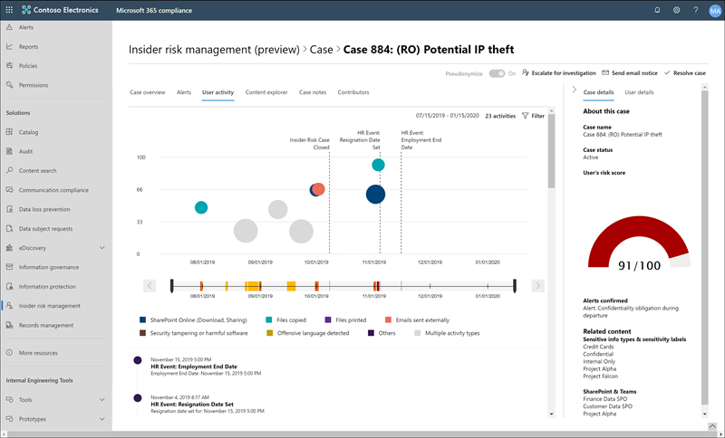

# Insider Risikomanagement in Microsoft 365 (Vorschau)Insider risk management in Microsoft 365 (preview)

Das Insider Risk Management ist eine interne Risiko Lösung in Microsoft 365, mit der interne Risiken minimiert werden, da Sie riskante Aktivitäten in Ihrer Organisation erkennen, untersuchen und Maßnahmen ergreifen können.Insider risk management is an internal risk solution in Microsoft 365 that helps minimize internal risks by enabling you to detect, investigate, and take action on risky activities in your organization. Mit benutzerdefinierten Richtlinien können Sie böswillige und unbeabsichtigte Risiko Aktivitäten in Ihrer Organisation erkennen und Maßnahmen ergreifen, einschließlich eskalierenden Fällen zu anderen Microsoft 365-Ermittlungs Lösungen bei Bedarf.Custom policies allow you to detect and take action on malicious and inadvertent risk activities in your organization, including escalating cases to other Microsoft 365 investigation solutions if needed. Risikoanalysten in Ihrer Organisation können schnell geeignete Maßnahmen ergreifen, um sicherzustellen, dass Benutzer mit den Compliance-Standards Ihrer Organisation konform sind.Risk analysts in your organization can quickly take appropriate actions to make sure users are compliant with your organization's compliance standards.

Sehen Sie sich das folgende Video an, um zu erfahren, wie Sie mit dem Insider Risikomanagement Ihre Organisation bei der Priorisierung Ihrer Unternehmenswerte, ihrer Kultur und ihrer Mitarbeiter Erfahrung beim verhindern, erkennen und eindämmen von Risiken unterstützen können:Watch the video below to learn how insider risk management can help your organization prevent, detect, and contain risks while prioritizing your organization values, culture, and employee experience:
 
 
>[!VIDEO https://www.microsoft.com/videoplayer/embed/RE4j9CN]

## Probleme mit modernen Risiko PunktenModern risk pain points

Das Verwalten und minimieren von Risiken in Ihrer Organisation beginnt mit dem Verständnis der Arten von Risiken, die im modernen Arbeitsplatz gefunden werden.Managing and minimizing risk in your organization starts with understanding the types of risks found in the modern workplace. Einige Risiken werden durch externe Ereignisse und Faktoren gesteuert und liegen außerhalb der direkten Kontrolle.Some risks are driven by external events and factors and are outside direct control. Andere Risiken werden durch interne Ereignisse und Mitarbeiter Aktivitäten gesteuert, die eliminiert und vermieden werden können.Other risks are driven by internal events and employee activities that can be eliminated and avoided. Einige Beispiele sind Risiken durch illegales, unangemessenes, unbefugtes oder unethisches Verhalten und Aktionen von Mitarbeitern und Führungskräften.Some examples are risks from illegal, inappropriate, unauthorized, or unethical behavior and actions by employees and managers. Diese Verhaltensweisen umfassen eine Vielzahl interner Risiken durch Mitarbeiter:These behaviors include a broad range of internal risks from employees:

- Lecks von vertraulichen Daten und DatenüberlaufLeaks of sensitive data and data spillage
- Vertraulichkeits VerletzungenConfidentiality violations
- Geistiges Eigentum (IP) DiebstahlIntellectual property (IP) theft
- BetrugsFraud
- Insider HandelInsider trading
- Verstöße gegen gesetzliche VorschriftenRegulatory compliance violations

Mitarbeiter am modernen Arbeitsplatz haben Zugriff auf das Erstellen, verwalten und Freigeben von Daten für ein breites Spektrum an Plattformen und Diensten.Employees in the modern workplace have access to create, manage, and share data across a broad spectrum of platforms and services. In den meisten Fällen verfügen Organisationen über beschränkte Ressourcen und Tools, um unternehmensweite Risiken zu identifizieren und zu verringern und gleichzeitig die Datenschutzstandards der Mitarbeiter zu erfüllen.In most cases, organizations have limited resources and tools to identify and mitigate organization-wide risks while also meeting employee privacy standards.

Das Insider Risk Management in Microsoft 365 verwendet die gesamte Bandbreite von Dienst-und Drittanbieter Indikatoren, damit Sie die Risiko Aktivität schnell erkennen, selektieren und Maßnahmen ergreifen können.Insider risk management in Microsoft 365 uses the full breadth of service and 3rd-party indicators to help you quickly identify, triage, and take action on risk activity. Mithilfe von Protokollen aus Office 365 und Microsoft Graph können Sie mit dem Insider Risikomanagement bestimmte Richtlinien zum Identifizieren von Risikoindikatoren definieren.By using logs from Office 365 and Microsoft Graph, insider risk management allows you to define specific policies to identify risk indicators. Diese Richtlinien ermöglichen es Ihnen, riskante Aktivitäten zu identifizieren und Maßnahmen zur Minderung dieser Risiken zu ergreifen.These policies allow you to identify risky activities and to take action to mitigate these risks.

Das Insider Risikomanagement konzentriert sich auf die folgenden Prinzipien:Insider risk management is centered around the following principles:

- **Transparenz**: Gleichgewicht der Datenschutz für Mitarbeiter im Vergleich zu Organisationsrisiken mit Architektur mit Datenschutz nach Design.**Transparency**: Balance employee privacy versus organization risk with privacy-by-design architecture.
- **Konfigurierbar**: konfigurierbare Richtlinien basierend auf Branchen-, geografischen und Unternehmensgruppen.**Configurable**: Configurable policies based on industry, geographical, and business groups.
- **Integriert**: integrierter Workflow in Microsoft 365 Compliance-Lösungen.**Integrated**: Integrated workflow across Microsoft 365 compliance solutions.
- **Handlungs**fähig: bietet Einblicke, um Mitarbeiter Benachrichtigungen, Daten Ermittlungen und Mitarbeiter Untersuchungen zu ermöglichen.**Actionable**: Provides insights to enable employee notifications, data investigations, and employee investigations.

## WorkflowWorkflow

Das Insider Risk Management hilft Ihnen dabei, interne Risiken in Ihrer Organisation zu identifizieren, zu untersuchen und Maßnahmen zu ergreifen.Insider risk management helps you identify, investigate, and take action to address internal risks in your organization. Mit fokussierten Richtlinienvorlagen, umfassenden Aktivitäts Signalen über den Microsoft 365-Dienst und einem flexiblen Workflow können Sie Einblicke in Aktionen verwenden, um riskantes Verhalten schnell zu identifizieren und zu beheben.With focused policy templates, comprehensive activity signaling across the Microsoft 365 service, and a flexible workflow, you can use actionable insights to quickly identify and resolve risky behavior.

Das identifizieren und beheben interner Risiko Aktivitäten und Compliance-Probleme mit dem Insider Risikomanagement in Microsoft 365 verwendet den folgenden Workflow:Identifying and resolving internal risk activities and compliance issues with insider risk management in Microsoft 365 uses the following workflow:

### RichtlinienPolicies

Richtlinien für das Insider Risikomanagement werden mithilfe vordefinierter Vorlagen und Richtlinienbedingungen erstellt, die definieren, welche Risikoindikatoren in Microsoft 365-Featurebereichen untersucht werden.Insider risk management policies are created using pre-defined templates and policy conditions that define what risk indicators are examined in Microsoft 365 feature areas. Diese Bedingungen umfassen, wie Indikatoren für Warnungen verwendet werden, welche Benutzer in der Richtlinie enthalten sind, welche Dienste priorisiert werden und welchen Zeitraum der Überwachung.These conditions include how indicators are used for alerts, what users are included in the policy, which services are prioritized, and the monitoring time period.

Sie können aus den folgenden [Richtlinienvorlagen](insider-risk-management-policies.md#policy-templates) auswählen, um schnell mit dem Insider Risikomanagement zu beginnen:You can select from the following [policy templates](insider-risk-management-policies.md#policy-templates) to quickly get started with insider risk management:

- Verabschiedung von Datendiebstahl durch MitarbeiterDeparting employee data theft
- DatenlecksData leaks
- Anstößige Sprache in der KommunikationOffensive language in communication

Weitere Informationen finden Sie unter [Insider Risk Management Policies](insider-risk-management-policies.md).For more information, see [Insider risk management policies](insider-risk-management-policies.md).

### WarnungenAlerts

Warnungen werden automatisch von Risikoindikatoren generiert, die Richtlinienbedingungen entsprechen und im **Alerts-Dashboard**angezeigt werden.Alerts are automatically generated by risk indicators that match policy conditions and are displayed in the **Alerts dashboard**. Dieses Dashboard ermöglicht eine schnelle Ansicht aller Warnungen, die überprüft werden müssen, Warnungen werden über einen Zeitraum geöffnet, und es werden Warnungs Statistiken für Ihre Organisation angezeigt.This dashboard enables a quick view of all alerts needing review, open alerts over time, and alert statistics for your organization. Alle Richtlinienwarnungen werden mit zugeordneten Informationen angezeigt, die Ihnen helfen, den aktuellen Status vorhandener Warnungen und neuer Warnungen schnell zu identifizieren, die eine Aktion erfordern:All policy alerts are displayed with associated information to help you quickly identify the current status of existing alerts and new alerts that need action:

- StatusStatus
- SeveritySeverity
- Erkannte ZeitTime detected
- FallCase
- Fall StatusCase status

Weitere Informationen finden Sie unter [Insider Risk Management Alerts](insider-risk-management-alerts.md).For more information, see [Insider risk management alerts](insider-risk-management-alerts.md).

### AuswahlTriage

Bei neuen Aktivitäten, bei denen Untersuchungen erforderlich sind, werden automatisch Warnungen generiert, denen ein Status zur *Überarbeitung der Anforderungen* zugewiesen ist.New activities that need investigation automatically generate alerts that are assigned a *Needs review* status. Bearbeiter können diese Warnungen schnell identifizieren und durch die einzelnen scrollen, um Sie auszuwerten und zu selektieren.Reviewers can quickly identify these alerts and scroll through each to evaluate and triage. 

Warnungen werden aufgelöst, indem ein neuer Fall geöffnet, die Warnung einem vorhandenen Fall zugewiesen oder die Warnung abgewiesen wird.Alerts are resolved by opening a new case, assigning the alert to an existing case, or dismissing the alert. Mithilfe von Warnungs Filtern ist es ganz einfach, Warnungen nach Status, Schweregrad oder erkannter Zeit schnell zu identifizieren.Using alert filters, it's easy to quickly identify alerts by status, severity, or time detected. Im Rahmen des Triage-Prozesses können Bearbeiter Warnungsdetails für die Richtlinienübereinstimmung anzeigen, Benutzeraktivitäten anzeigen, die der Übereinstimmung zugeordnet sind, den Schweregrad der Warnung anzeigen und Benutzerprofilinformationen überprüfen.As part of the triage process, reviewers can view alert details for the policy match, view user activity associated with the match, see the severity of the alert, and review user profile information.

### PrüfenInvestigate

Für Warnungen, die eine umfassendere Überprüfung und Untersuchung der Details und Umstände der Richtlinienübereinstimmung erfordern, werden Fälle erstellt.Cases are created for alerts that require deeper review and investigation of the details and circumstances around the policy match. Das **Case-Dashboard** bietet eine Übersicht über alle aktiven Fälle, offene Fälle im Laufe der Zeit und Fall Statistiken für Ihre Organisation.The **Case dashboard** provides an all-up view of all active cases, open cases over time, and case statistics for your organization. Bearbeiter können Fälle schnell nach Status filtern, das Datum, an dem der Fall geöffnet wurde, und das Datum, an dem der Fall zuletzt aktualisiert wurde.Reviewers can quickly filter cases by status, the date the case was opened, and the date the case was last updated.

Wenn Sie im Case-Dashboard einen Fall auswählen, wird der Fall zur Untersuchung und Überprüfung geöffnet.Selecting a case on the case dashboard opens the case for investigation and review. Dieser Schritt ist das Herzstück des Insider Risikomanagement-Workflows.This step is the heart of the insider risk management workflow. In diesem Bereich werden Risiko Aktivitätsindikatoren, Richtlinienbedingungen, Warnungsdetails und Mitarbeiterdetails in einer integrierten Ansicht für Bearbeiter synthetisiert.This area is where risk activity indicators, policy conditions, alerts details, and employee details are synthesized into an integrated view for reviewers. Die primären Ermittlungs Tools in diesem Bereich sind:The primary investigation tools in this area are:

- **Benutzeraktivität**: Benutzeraktivität wird automatisch in einem interaktiven Diagramm angezeigt, in dem Risiko Aktivitäten über einen bestimmten Zeitraum und ein Risikoniveau für aktuelle oder vergangene Risiko Aktivitäten gezeichnet werden.**User activity**: User activity is automatically displayed in an interactive chart that plots risk activities over time and by risk level for current or past risk activities. Bearbeiter können den gesamten Risikoverlauf für den Mitarbeiter schnell Filtern und anzeigen und weitere Details in bestimmte Aktivitäten einplanen.Reviewers can quickly filter and view the entire risk history for the employee and drill into specific activities for more details.
- **Inhalts-Explorer**: alle Datendateien und e-Mail-Nachrichten, die Warnungs Risiko Aktivitäten zugeordnet sind, werden automatisch erfasst und im Inhalts-Explorer angezeigt.**Content explorer**: All data files and email messages associated with alert risk activities are automatically captured and displayed in the content explorer. Bearbeiter können Dateien und Nachrichten nach Datenquellen, Dateityp, Tags, Unterhaltung und vielen weiteren Attributen Filtern und anzeigen.Reviewers can filter and view files and messages by data source, file type, tags, conversation, and many more attributes.
- **Fall Hinweise**: Überprüfer stellen Notizen für einen Fall im Abschnitt "fallnotizen" bereit.**Case notes**: Reviewers provide notes for a case in the Case Notes section. In dieser Liste werden alle Notizen in einer zentralen Ansicht konsolidiert, und es werden die Informationen Prüfer und Datum übermittelt hinzugefügt.This list consolidates all notes in a central view and include reviewer and date submitted information.

Weitere Informationen finden Sie unter [Insider Risk Management Cases](insider-risk-management-cases.md).For more information, see [Insider risk management cases](insider-risk-management-cases.md).

### AktionAction

Nachdem Fälle untersuchtwurden, können Bearbeiter schnell Maßnahmen zur Lösung des Falles ergreifen oder mit anderen Risiko Beteiligten in Ihrer Organisation zusammenarbeiten.After cases are investigated, reviewers can quickly take action to resolve the case or collaborate with other risk stakeholders in your organization. Wenn Mitarbeiter versehentlich oder versehentlich Richtlinienbedingungen verletzen, kann eine einfache Mahnungsbenachrichtigung an den Mitarbeiter aus den Benachrichtigungsvorlagen gesendet werden, die Sie für Ihre Organisation konfigurieren können.When employees accidentally or inadvertently violate policy conditions, a simple reminder notice can be sent to the employee from notice templates you can configure for your organization. Diese Benachrichtigungen dienen möglicherweise als einfache Erinnerungen oder leiten den Mitarbeiter an eine Auffrischungsschulung oder Anleitung weiter, um zukünftiges riskantes Verhalten zu verhindern.These notices may serve as simple reminders or may direct the employee to refresher training or guidance to help prevent future risky behavior. Weitere Informationen finden Sie unter [Insider Risk Management – Hinweis Vorlagen](insider-risk-management-notices.md).For more information, see [Insider risk management notice templates](insider-risk-management-notices.md).

In den schwerwiegendsten Situationen müssen Sie möglicherweise die Fall Informationen für Insider Risk Management für andere Bearbeiter in Ihrer Organisation freigeben.In the most serious situations, you may need to share the insider risk management case information with other reviewers in your organization. Das Insider Risikomanagement ist eng mit anderen Microsoft 365-Kompatibilitätsfeatures integriert, die Ihnen bei der End-to-End-Risiko Lösung helfen.Insider risk management is tightly integrated with other Microsoft 365 compliance features to help you with end-to-end risk resolution. Wenn Sie einen Fall für eine Untersuchung eskalieren, können Sie Daten und die Verwaltung der Anfrage in Microsoft 365 auf Advanced eDiscovery übertragen.Escalating a case for investigation allows you to transfer data and management of the case to Advanced eDiscovery in Microsoft 365. Advanced eDiscovery bietet einen End-to-End-Workflow zum aufbewahren, sammeln, überprüfen, analysieren und Exportieren von Inhalten, die auf interne und externe Untersuchungen in Ihrer Organisation reagieren.Advanced eDiscovery provides an end-to-end workflow to preserve, collect, review, analyze, and export content that's responsive to your organization's internal and external investigations. Sie ermöglicht es juristischen Teams, den gesamten Benachrichtigungs Workflow für rechtliche Aufbewahrungen zu verwalten.It allows legal teams to manage the entire legal hold notification workflow. Weitere Informationen zu erweiterten eDiscovery-Fällen finden Sie unter [Overview of Advanced eDiscovery in Microsoft 365](overview-ediscovery-20.md).To learn more about Advanced eDiscovery cases, see [Overview of Advanced eDiscovery in Microsoft 365](overview-ediscovery-20.md).

## SzenarienScenarios

Das Insider Risikomanagement hilft Ihnen bei der Erkennung, Untersuchung und Durchführung von Maßnahmen zur Minderung interner Risiken in Ihrer Organisation in mehreren gängigen Szenarien:Insider risk management can help you detect, investigate, and take action to mitigate internal risks in your organization in several common scenarios:

### Datendiebstahl durch abtrennender MitarbeiterData theft by departing employee

Wenn Mitarbeiter eine Organisation entweder freiwillig oder als Folge der Beendigung verlassen, gibt es häufig legitime Bedenken, dass Firmen-, Kunden-und Mitarbeiterdaten gefährdet sind.When employees leave an organization, either voluntarily or as the result of termination, there is often legitimate concerns that company, customer, and employee data are at risk. Mitarbeiter können unschuldig davon ausgehen, dass Projektdaten nicht proprietär sind oder dass Sie versucht sein könnten, Unternehmensdaten zur persönlichen Verstärkung und unter Verstoß gegen Unternehmensrichtlinien und gesetzliche Standards zu nutzen.Employees may innocently assume that project data isn't proprietary or they may be tempted to take company data for personal gain and in violation of company policy and legal standards. Richtlinien für das Insider Risikomanagement, die die Richtlinienvorlage " [departing Employee Data Theft](insider-risk-management-policies.md#policy-templates) Policy" verwenden, erkennen automatisch Aktivitäten, die typischerweise mit diesem Diebstahltyp verbunden sind.Insider risk management policies that use the [Departing employee data theft](insider-risk-management-policies.md#policy-templates) policy template automatically detect activities typically associated with this type of theft. Mit dieser Richtlinie erhalten Sie automatisch Warnungen für verdächtige Aktivitäten im Zusammenhang mit der abgehenden Mitarbeiter Diebstahl, damit Sie geeignete Ermittlungsaktionen durchführen können.With this policy, you'll automatically receive alerts for suspicious activities associated with departing employees theft so you can take appropriate investigative actions. Die Konfiguration eines [Microsoft 365 HR-Connectors](import-hr-data.md) für Ihre Organisation ist für diese Richtlinienvorlage erforderlich.Configuring a [Microsoft 365 HR Connector](import-hr-data.md) for your organization is required for this policy template.

### Vorsätzliches oder unbeabsichtigtes Leck vertraulicher oder vertraulicher InformationenIntentional or unintentional leak of sensitive or confidential information

In den meisten Fällen versuchen Mitarbeiter ihr Bestes, vertrauliche oder vertrauliche Informationen ordnungsgemäß zu verarbeiten.In most cases, employees try their best to properly handle sensitive or confidential information. Gelegentlich führen Mitarbeiter jedoch Fehler aus, und Informationen werden versehentlich außerhalb Ihrer Organisation oder unter Verletzung ihrer Richtlinien zum Schutz von Daten freigegeben.But occasionally employees make mistakes and information is accidentally shared outside your organization or in violation of your information protection policies. Manchmal können Mitarbeiter absichtlich lecken oder vertrauliche und vertrauliche Informationen mit böswilligen Absichten und potenziellen persönlichen gewinnen teilen.Sometimes employees may intentionally leak or share sensitive and confidential information with malicious intent and for potential personal gain. Mit der Richtlinienvorlage [Datenlecks](insider-risk-management-policies.md#policy-templates) erstellte Richtlinien für Insider Risiken ermitteln automatisch Aktivitäten, die in der Regel mit der Freigabe vertraulicher oder vertraulicher Informationen verbunden sind.Insider risk management policies created using the [Data leaks](insider-risk-management-policies.md#policy-templates) policy template automatically detect activities typically associated with sharing sensitive or confidential information. Für diese Richtlinienvorlage ist mindestens eine [DLP-Richtlinie (Data Loss Protection)](create-test-tune-dlp-policy.md) von Microsoft 365 für Ihre Organisation erforderlich.Configuring at least one Microsoft 365 [Data Loss Protection (DLP) policy](create-test-tune-dlp-policy.md) for your organization is required for this policy template.

### Aktionen und Verhaltensweisen, die Unternehmensrichtlinien verletzenActions and behaviors that violate corporate policies

Die Kommunikation zwischen Mitarbeitern ist häufig eine Quelle für unbeabsichtigte oder böswillige Verstöße gegen Unternehmensrichtlinien.Employee-to-employee communications are often a source of inadvertent or malicious violations of corporate policies. Diese Verletzungen können anstößige Sprachen, Bedrohungen und Cyber-Mobbing zwischen Mitarbeitern umfassen.These violations can include offensive language, threats, and cyber-bullying between employees. Diese Art von Aktivität trägt zu einer feindlichen Arbeitsumgebung bei und kann rechtliche Schritte sowohl für die Mitarbeiter als auch für die größere Organisation zur Folge haben.This type of activity contributes to a hostile work environment and can result in legal actions against both employees and the larger organization. Das Insider Risikomanagement verwendet neue integrierte Microsoft 365-Klassifizierungen und die [offensiv Sprache in der e-Mail-](insider-risk-management-policies.md#policy-templates) Richtlinienvorlage.Insider risk management uses new built-in Microsoft 365 classifiers and the [Offensive language in email](insider-risk-management-policies.md#policy-templates) policy template. Mit diesen Klassifizierungen und Vorlagen können Sie die schnelle Konfiguration einer Richtlinie automatisch erkennen und Sie über diese Art von Verhalten informieren.These classifiers and templates enable the quick configuration of a policy to automatically detect and alert you of this kind of behavior.

## Sind Sie bereit zu beginnen?Ready to get started?

Können Sie das Insider Risk Management für Ihre Organisation konfigurieren?Ready to configure insider risk management for your organization? Weitere Informationen finden Sie unter [Erste Schritte mit dem Insider Risikomanagement](insider-risk-management-configure.md) zum Konfigurieren von Voraussetzungen, Erstellen von Richtlinien und Starten des Empfangs von Benachrichtigungen.See [Get started with insider risk management](insider-risk-management-configure.md) to configure prerequisites, create policies, and start receiving alerts.
