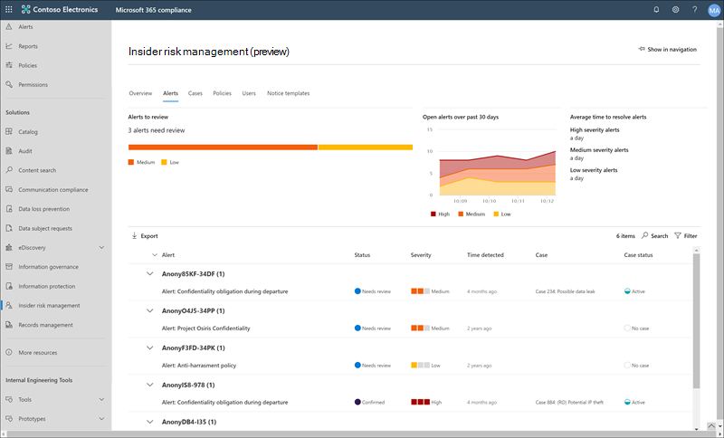

# Insider Risikomanagement in Microsoft 365Insider risk management in Microsoft 365

Das Insider Risk Management ist eine Compliance-Lösung in Microsoft 365, mit der interne Risiken minimiert werden, indem Sie böswillige und unbeabsichtigte Aktivitäten in Ihrer Organisation erkennen, untersuchen und darauf reagieren können.Insider risk management is a compliance solution in Microsoft 365 that helps minimize internal risks by enabling you to detect, investigate, and act on malicious and inadvertent activities in your organization. Mit Insider Risikorichtlinien können Sie die Arten von Risiken definieren, die in Ihrer Organisation identifiziert und erkannt werden, einschließlich der Reaktion auf Fälle und Eskalations Fälle an Microsoft Advanced eDiscovery bei Bedarf.Insider risk policies allow you to define the types of risks to identify and detect in your organization, including acting on cases and escalating cases to Microsoft Advanced eDiscovery if needed. Risikoanalysten in Ihrer Organisation können schnell geeignete Maßnahmen ergreifen, um sicherzustellen, dass Benutzer mit den Compliance-Standards Ihrer Organisation konform sind.Risk analysts in your organization can quickly take appropriate actions to make sure users are compliant with your organization's compliance standards.

Sehen Sie sich das folgende Video an, um zu erfahren, wie Sie mit dem Insider Risikomanagement Ihre Organisation bei der Priorisierung Ihrer Unternehmenswerte, ihrer Kultur und ihrer Benutzerfreundlichkeit bei der Vermeidung, Erkennung und Eindämmung von Risiken unterstützen können:Watch the video below to learn how insider risk management can help your organization prevent, detect, and contain risks while prioritizing your organization values, culture, and user experience:
 
 
>[!VIDEO https://www.microsoft.com/videoplayer/embed/RE4j9CN]

## Probleme mit modernen Risiko PunktenModern risk pain points

Das Management und die Minimierung von Risiken in Ihrem Unternehmen beginnt mit der Kenntnis der Arten von Risiken, die am modernen Arbeitsplatz auftreten.Managing and minimizing risk in your organization starts with understanding the types of risks found in the modern workplace. Einige Risiken werden durch externe Ereignisse und Faktoren gesteuert, die sich außerhalb der direkten Steuerung befinden.Some risks are driven by external events and factors that are outside of direct control. Andere Risiken werden durch interne Ereignisse und Benutzeraktivitäten gesteuert, die minimiert und vermieden werden können.Other risks are driven by internal events and user activities that can be minimized and avoided. Einige Beispiele sind Risiken durch illegales, unangemessenes, unbefugtes oder unethisches Verhalten und Aktionen von Benutzern in Ihrer Organisation.Some examples are risks from illegal, inappropriate, unauthorized, or unethical behavior and actions by users in your organization. Diese Verhaltensweisen umfassen eine Vielzahl interner Risiken von Benutzern:These behaviors include a broad range of internal risks from users:

- Lecks von vertraulichen Daten und DatenüberlaufLeaks of sensitive data and data spillage
- Verstöße gegen die VertraulichkeitConfidentiality violations
- Diebstahl von geistigem EigentumIntellectual property (IP) theft
- BetrugFraud
- InsidergeschäfteInsider trading
- Verstöße gegen gesetzliche VorschriftenRegulatory compliance violations

Benutzer am modernen Arbeitsplatz haben Zugriff auf das Erstellen, verwalten und Freigeben von Daten für ein breites Spektrum an Plattformen und Diensten.Users in the modern workplace have access to create, manage, and share data across a broad spectrum of platforms and services. In den meisten Fällen verfügen Organisationen über beschränkte Ressourcen und Tools, um unternehmensweite Risiken zu identifizieren und zu verringern und gleichzeitig die Datenschutzstandards für Benutzer zu erfüllen.In most cases, organizations have limited resources and tools to identify and mitigate organization-wide risks while also meeting user privacy standards.

Das Insider Risikomanagement verwendet die gesamte Bandbreite von Dienst-und Drittanbieter Indikatoren, damit Sie Risiko Aktivitäten schnell erkennen, selektieren und handeln können.Insider risk management uses the full breadth of service and 3rd-party indicators to help you quickly identify, triage, and act on risk activity. Mithilfe von Protokollen aus Microsoft 365 und Microsoft Graph können Sie mit dem Insider Risikomanagement bestimmte Richtlinien zur Identifizierung von Risikoindikatoren definieren.By using logs from Microsoft 365 and Microsoft Graph, insider risk management allows you to define specific policies to identify risk indicators. Diese Richtlinien ermöglichen es Ihnen, riskante Aktivitäten zu identifizieren und zu handeln, um diese Risiken zu verringern.These policies allow you to identify risky activities and to act to mitigate these risks.

Das Insider Risikomanagement konzentriert sich auf die folgenden Prinzipien:Insider risk management is centered around the following principles:

- **Transparenz** : Gleichgewichtzwischen Benutzerdaten Schutz und Organisations Risiko mit Datenschutz-nach-Design-Architektur.**Transparency** : Balance user privacy versus organization risk with privacy-by-design architecture.
- **Konfigurierbar** : konfigurierbare Richtlinien basierend auf Branchen-, geografischen und Unternehmensgruppen.**Configurable** : Configurable policies based on industry, geographical, and business groups.
- **Integriert** : integrierter Workflow in Microsoft 365 Compliance-Lösungen.**Integrated** : Integrated workflow across Microsoft 365 compliance solutions.
- **Handlungs** fähig: bietet Einblicke, um Benutzer Benachrichtigungen, Daten Ermittlungen und Benutzer Untersuchungen zu ermöglichen.**Actionable** : Provides insights to enable user notifications, data investigations, and user investigations.

## WorkflowWorkflow

Der Workflow für den Insider Risikomanagement hilft Ihnen, interne Risiken in Ihrer Organisation zu identifizieren, zu untersuchen und Maßnahmen zu ergreifen.The insider risk management workflow helps you identify, investigate, and take action to address internal risks in your organization. Mit fokussierten Richtlinienvorlagen, umfassenden Aktivitäts Signalen über den Microsoft 365-Dienst und Warnungs-und Fall Verwaltungstools können Sie Einblicke in Aktionen verwenden, um riskantes Verhalten schnell zu identifizieren und zu handeln.With focused policy templates, comprehensive activity signaling across the Microsoft 365 service, and alert and case management tools, you can use actionable insights to quickly identify and act on risky behavior.

Das Identifizieren und Lösen von internen Risikoaktivitäten und Compliance-Problemen mit dem Insider-Risikomanagement in Microsoft 365 verwendet den folgenden Workflow:Identifying and resolving internal risk activities and compliance issues with insider risk management in Microsoft 365 uses the following workflow:

### RichtlinienPolicies

[Richtlinien für das Insider Risikomanagement](insider-risk-management-policies.md) werden mithilfe vordefinierter Vorlagen und Richtlinienbedingungen erstellt, die definieren, welche Auslöser von Ereignissen und Risikoindikatoren in Ihrer Organisation untersucht werden.[Insider risk management policies](insider-risk-management-policies.md) are created using pre-defined templates and policy conditions that define what triggering events and risk indicators are examined in your organization. Diese Bedingungen umfassen, wie Risikoindikatoren für Warnungen verwendet werden, welche Benutzer in der Richtlinie enthalten sind, welche Dienste priorisiert werden und welcher Zeitraum überwacht wird.These conditions include how risk indicators are used for alerts, what users are included in the policy, which services are prioritized, and the monitoring time period.

Sie können aus den folgenden [Richtlinienvorlagen auswählen, um schnell mit dem Insider-Risikomanagement zu beginnen:You can select from the following[policy templates to quickly get started with insider risk management:

- [Datendiebstahl durch BenutzerData theft by departing users](insider-risk-management-policies.md#data-theft-by-departing-users)
- [Allgemeine DatenlecksGeneral data leaks](insider-risk-management-policies.md#general-data-leaks)
- [Datenlecks nach Prioritäts Benutzern (Vorschau)Data leaks by priority users (preview)](insider-risk-management-policies.md#data-leaks-by-priority-users-preview)
- [Datenverluste durch verärgerte Benutzer (Vorschau)Data leaks by disgruntled users (preview)](insider-risk-management-policies.md#data-leaks-by-disgruntled-users-preview)
- [Allgemeine Sicherheitsrichtlinienverletzungen (Vorschau)General security policy violations (preview)](insider-risk-management-policies.md#general-security-policy-violations-preview)
- [Sicherheitsrichtlinienverletzungen durch abgehende Benutzer (Vorschau)Security policy violations by departing users (preview)](insider-risk-management-policies.md#security-policy-violations-by-departing-users-preview)
- [Sicherheitsrichtlinienverletzungen nach Prioritäts Benutzern (Vorschau)Security policy violations by priority users (preview)](insider-risk-management-policies.md#security-policy-violations-by-priority-users-preview)
- [Sicherheitsrichtlinienverletzungen durch verärgerte Benutzer (Vorschau)Security policy violations by disgruntled users (preview)](insider-risk-management-policies.md#security-policy-violations-by-disgruntled-users-preview)
- [Anstößige Sprache in E-MailsOffensive language in email](insider-risk-management-policies.md#offensive-language-in-email)

### WarnungenAlerts

Warnungen werden automatisch von Risikoindikatoren generiert, die Richtlinienbedingungen entsprechen und im [Alerts-Dashboard](insider-risk-management-alerts.md)angezeigt werden.Alerts are automatically generated by risk indicators that match policy conditions and are displayed in the [Alerts dashboard](insider-risk-management-alerts.md). Dieses Dashboard ermöglicht eine schnelle Ansicht aller Warnungen, die überprüft werden müssen, Warnungen werden über einen Zeitraum geöffnet, und es werden Warnungs Statistiken für Ihre Organisation angezeigt.This dashboard enables a quick view of all alerts needing review, open alerts over time, and alert statistics for your organization. Alle Richtlinienwarnungen werden mit den folgenden Informationen angezeigt, damit Sie schnell den Status vorhandener Warnungen und neuer Warnungen ermitteln können, die eine Aktion erfordern:All policy alerts are displayed with the following information to help you quickly identify the status of existing alerts and new alerts that need action:

- StatusStatus
- SeveritySeverity
- Erkannte ZeitTime detected
- FallCase
- Fall StatusCase status

### AuswahlTriage

Bei neuen Benutzeraktivitäten, bei denen Untersuchungen erforderlich sind, werden automatisch Warnungen generiert, denen ein *Überarbeitungs* Status für Anforderungen zugewiesen ist.New user activities that need investigation automatically generate alerts that are assigned a *Needs review* status. Überprüfer können diese Warnungen schnell identifizieren und überprüfen, auswerten und selektieren.Reviewers can quickly identify and review, evaluate, and triage these alerts.

Warnungen werden gelöst, indem ein neuer Fall eröffnet, die Warnung einem bestehenden Fall zugeordnet oder die Warnung zurückgewiesen wird.Alerts are resolved by opening a new case, assigning the alert to an existing case, or dismissing the alert. Mithilfe von Warnungs Filtern ist es ganz einfach, Warnungen nach Status, Schweregrad oder erkannter Zeit schnell zu identifizieren.Using alert filters, it's easy to quickly identify alerts by status, severity, or time detected. Im Rahmen des Triage-Prozesses können Bearbeiter Warnungsdetails für die durch die Richtlinie identifizierten Aktivitäten anzeigen, Benutzeraktivitäten anzeigen, die der Richtlinienübereinstimmung zugeordnet sind, den Schweregrad der Warnung lesen und Benutzerprofilinformationen überprüfen.As part of the triage process, reviewers can view alert details for the activities identified by the policy, view user activity associated with the policy match, see the severity of the alert, and review user profile information.

### UntersuchenInvestigate

Es werden [Fälle](insider-risk-management-cases.md) für Warnungen erstellt, die eine umfassendere Überprüfung und Untersuchung der Aktivitätsdetails und-Umstände in der Richtlinienübereinstimmung erfordern.[Cases](insider-risk-management-cases.md) are created for alerts that require deeper review and investigation of the activity details and circumstances around the policy match. Das **Case-Dashboard** bietet eine Übersicht über alle aktiven Fälle, offene Fälle im Laufe der Zeit und Fall Statistiken für Ihre Organisation.The **Case dashboard** provides an all-up view of all active cases, open cases over time, and case statistics for your organization. Bearbeiter können Fälle schnell nach Status filtern, das Datum, an dem der Fall geöffnet wurde, und das Datum, an dem der Fall zuletzt aktualisiert wurde.Reviewers can quickly filter cases by status, the date the case was opened, and the date the case was last updated.

Wenn Sie im Case-Dashboard einen Fall auswählen, wird der Fall zur Untersuchung und Überprüfung geöffnet.Selecting a case on the case dashboard opens the case for investigation and review. Dieser Schritt ist das Herzstück des Insider Risikomanagement-Workflows.This step is the heart of the insider risk management workflow. In diesem Bereich werden Risiko Aktivitäten, Richtlinienbedingungen, Warnungsdetails und Benutzer Details in einer integrierten Ansicht für Bearbeiter synthetisiert.This area is where risk activities, policy conditions, alerts details, and user details are synthesized into an integrated view for reviewers. Die primären Ermittlungs Tools in diesem Bereich sind:The primary investigation tools in this area are:

- **Benutzeraktivität** : Benutzeraktivität wird automatisch in einem interaktiven Diagramm angezeigt, in dem Aktivitäten im Laufe der Zeit und nach Risikoebene für aktuelle oder vergangene Risiko Aktivitäten gezeichnet werden.**User activity** : User activity is automatically displayed in an interactive chart that plots activities over time and by risk level for current or past risk activities. Bearbeiter können den gesamten Risikoverlauf für den Benutzer schnell Filtern und anzeigen und weitere Details in bestimmte Aktivitäten einblenden.Reviewers can quickly filter and view the entire risk history for the user and drill into specific activities for more details.
- **Inhalts-Explorer** : alle Datendateien und e-Mail-Nachrichten, die Warnungs Aktivitäten zugeordnet sind, werden automatisch erfasst und im Inhalts-Explorer angezeigt.**Content Explorer** : All data files and email messages associated with alert activities are automatically captured and displayed in the Content Explorer. Bearbeiter können Dateien und Nachrichten nach Datenquellen, Dateityp, Tags, Unterhaltung und vielen weiteren Attributen Filtern und anzeigen.Reviewers can filter and view files and messages by data source, file type, tags, conversation, and many more attributes.
- **Fallnotizen** : Bearbeiter können Notizen für einen Fall im Abschnitt "fallnotizen" bereitstellen.**Case notes** : Reviewers can provide notes for a case in the Case Notes section. In dieser Liste werden alle Notizen in einer zentralen Ansicht konsolidiert, und es werden die Informationen Prüfer und Datum übermittelt hinzugefügt.This list consolidates all notes in a central view and include reviewer and date submitted information.

### AktionAction

Nachdem Fälle untersuchtwurden, können Bearbeiter schnell zur Lösung des Falles oder zur Zusammenarbeit mit anderen Risiko Beteiligten in Ihrer Organisation fungieren.After cases are investigated, reviewers can quickly act to resolve the case or collaborate with other risk stakeholders in your organization. Wenn Benutzer versehentlich oder versehentlich Richtlinienbedingungen verletzen, kann eine einfache Mahnungsbenachrichtigung an den Benutzer aus den Benachrichtigungsvorlagen gesendet werden, die Sie für Ihre Organisation anpassen können.If users accidentally or inadvertently violate policy conditions, a simple reminder notice can be sent to the user from notice templates you can customize for your organization. Diese Hinweise können als einfache Erinnerungen dienen oder den Benutzer an eine Auffrischungsschulung oder Anleitung weiterleiten, um zukünftiges riskantes Verhalten zu verhindern.These notices may serve as simple reminders or may direct the user to refresher training or guidance to help prevent future risky behavior. Weitere Informationen finden Sie unter [Insider Risk Management – Hinweis Vorlagen](insider-risk-management-notices.md).For more information, see [Insider risk management notice templates](insider-risk-management-notices.md).

In den schwerwiegenderen Situationen müssen Sie möglicherweise die Fall Informationen für Insider Risk Management für andere Bearbeiter oder Dienste in Ihrer Organisation freigeben.In the more serious situations, you may need to share the insider risk management case information with other reviewers or services in your organization. Das Insider Risikomanagement ist eng mit anderen Microsoft 365-Compliance-Lösungen integriert, die Ihnen bei der End-to-End-Risiko Lösung helfen.Insider risk management is tightly integrated with other Microsoft 365 compliance solutions to help you with end-to-end risk resolution.

- **Advanced eDiscovery** : eskalieren eines Falls zur Untersuchung können Sie Daten und die Verwaltung der Anfrage in Advanced eDiscovery in Microsoft 365 übertragen.**Advanced eDiscovery** : Escalating a case for investigation allows you to transfer data and management of the case to Advanced eDiscovery in Microsoft 365. Advanced eDiscovery bietet einen End-to-End-Workflow zum Beibehalten, Sammeln, Überprüfen, Analysieren und Exportieren von Inhalten, die auf die internen und externen Ermittlungen Ihrer Organisation abgestimmt sind.Advanced eDiscovery provides an end-to-end workflow to preserve, collect, review, analyze, and export content that's responsive to your organization's internal and external investigations. Dies ermöglicht es juristischen Teams, den gesamten Warnungs-Workflow für die gesetzliche Aufbewahrungspflicht zu verwalten.It allows legal teams to manage the entire legal hold notification workflow. Weitere Informationen zu den Advanced eDiscovery-Fällen finden Sie unter [Übersicht über Advanced eDiscovery in Microsoft 365](overview-ediscovery-20.md).To learn more about Advanced eDiscovery cases, see [Overview of Advanced eDiscovery in Microsoft 365](overview-ediscovery-20.md).
- **ServiceNow (Vorschau)** : ServiceNow ist eine beliebte Cloud Computing-Plattform, die Organisationen bei der Verwaltung digitaler Workflows für Unternehmensvorgänge unterstützt.**ServiceNow (preview)** : ServiceNow is a popular cloud computing platform that helps organizations manage digital workflows for enterprise operations. Das Insider Risikomanagement unterstützt das Freigeben von Fall Benachrichtigungen mit Ihrem ServiceNow-Dienst und ermöglicht Ihnen das Erstellen von Vorfällen und Änderungsanforderungen in Bezug auf einzelne Insider Risiko Fälle.Insider risk management supports sharing case alerts with your ServiceNow service and allows you to create incidents and change requests related to individual insider risk cases. Weitere Informationen zum Freigeben von Warnungsinformationen mit ServiceNow finden Sie unter [Freigeben eines Falls mit ServiceNow](insider-risk-management-cases.md#share-the-case).To learn more about sharing alert information with ServiceNow, see [Share a case with ServiceNow](insider-risk-management-cases.md#share-the-case).
- **Office 365 Management APIs Integration (Preview)** : das Insider Risikomanagement unterstützt das Exportieren von Warnungsinformationen in die Security Information and Event Management (SIEM)-Dienste über die Office 365 Management-APIs.**Office 365 Management APIs integration (preview)** : Insider risk management supports exporting alert information to security information and event management (SIEM) services via the Office 365 Management APIs. Wenn Sie Zugriff auf die Warnungsinformationen auf der Plattform haben, ist die optimale Lösung für die Risikoprozesse Ihrer Organisation eine größere Flexibilität beim Handeln bei Risiko Aktivitäten.Having access to alert information in the platform the best fits your organization's risk processes gives you more flexibility in how to act on risk activities. Weitere Informationen zum Exportieren von Warnungsinformationen mit Office 365-Verwaltungs-APIs finden Sie unter [Export Alerts](insider-risk-management-settings.md#export-alerts-preview).To learn more about exporting alert information with Office 365 Management APIs, see [Export alerts](insider-risk-management-settings.md#export-alerts-preview).

>[!NOTE]
>Vielen Dank für Ihr Feedback und ihre Unterstützung während der Vorschau des ServiceNow-Konnektors.Thank you for your feedback and support during the preview of the ServiceNow connector. Wir haben uns entschlossen, die Vorschau von ServiceNow Connector zu beenden und die Unterstützung für das Insider Risk Management am 30. November 2020 einzustellen.We've decided to end the preview of ServiceNow connector and discontinue support in insider risk management on November 30, 2020. Wir evaluieren aktiv Alternative Methoden, um Kunden die Integration von ServiceNow in das Insider Risikomanagement zu ermöglichen.We are actively evaluating alternative methods to provide customers with ServiceNow integration in insider risk management.

## SzenarienScenarios

Das Insider Risikomanagement hilft Ihnen bei der Erkennung, Untersuchung und Durchführung von Maßnahmen zur Minderung interner Risiken in Ihrer Organisation in mehreren gängigen Szenarien:Insider risk management can help you detect, investigate, and take action to mitigate internal risks in your organization in several common scenarios:

### Datendiebstahl durch BenutzerData theft by departing users

Wenn Benutzer eine Organisation entweder freiwillig oder als Folge der Beendigung verlassen, gibt es häufig legitime Bedenken, dass Firmen-, Kunden-und Benutzerdaten gefährdet sind.When users leave an organization, either voluntarily or as the result of termination, there is often legitimate concerns that company, customer, and user data are at risk. Benutzer können unschuldig davon ausgehen, dass Projektdaten nicht proprietär sind, oder Sie können versucht sein, Unternehmensdaten zur persönlichen Verstärkung und unter Verstoß gegen Unternehmensrichtlinien und gesetzliche Standards zu nutzen.Users may innocently assume that project data isn't proprietary, or they may be tempted to take company data for personal gain and in violation of company policy and legal standards. Richtlinien für Insider-Risikomanagement, die die Richtlinienvorlage " [Datendiebstahl durch departs users](insider-risk-management-policies.md#policy-templates) " verwenden, erkennen automatisch Aktivitäten, die typischerweise mit diesem Diebstahltyp verbunden sind.Insider risk management policies that use the [Data theft by departing users](insider-risk-management-policies.md#policy-templates) policy template automatically detect activities typically associated with this type of theft. Mit dieser Richtlinie erhalten Sie automatisch Warnungen für verdächtige Aktivitäten im Zusammenhang mit dem Datendiebstahl durch die Benutzer, sodass Sie geeignete Ermittlungsaktionen durchführen können.With this policy, you'll automatically receive alerts for suspicious activities associated with data theft by departing users so you can take appropriate investigative actions. Die Konfiguration eines [Microsoft 365 HR-Connectors](import-hr-data.md) für Ihre Organisation ist für diese Richtlinienvorlage erforderlich.Configuring a [Microsoft 365 HR connector](import-hr-data.md) for your organization is required for this policy template.

### Vorsätzliches oder unbeabsichtigtes Leck vertraulicher oder vertraulicher InformationenIntentional or unintentional leak of sensitive or confidential information

In den meisten Fällen versuchen Benutzer ihr Bestes, vertrauliche oder vertrauliche Informationen ordnungsgemäß zu verarbeiten.In most cases, users try their best to properly handle sensitive or confidential information. Gelegentlich können Benutzer jedoch Fehler machen, und Informationen werden versehentlich außerhalb Ihrer Organisation oder unter Verletzung ihrer Richtlinien zum Schutz von Informationen freigegeben.But occasionally users may make mistakes and information is accidentally shared outside your organization or in violation of your information protection policies. In anderen Fällen können Benutzer vertrauliche und vertrauliche Informationen absichtlich mit böswilligen Absichten und potenziellen persönlichen gewinnen austauschen oder freigeben.In other circumstances, users may intentionally leak or share sensitive and confidential information with malicious intent and for potential personal gain. Richtlinien für Insider-Risikomanagement, die mit den folgenden Datenverlust Richtlinienvorlagen erstellt werden, erkennen automatisch Aktivitäten, die in der Regel mit der Freigabe vertraulicher oder vertraulicher Informationen verbunden sindInsider risk management policies created using the following Data leaks policy templates automatically detect activities typically associated with sharing sensitive or confidential information:

- [Allgemeine DatenlecksGeneral data leaks](insider-risk-management-policies.md#general-data-leaks)
- [Datenlecks nach Prioritäts Benutzern (Vorschau)Data leaks by priority users (preview)](insider-risk-management-policies.md#data-leaks-by-priority-users-preview)
- [Datenverluste durch verärgerte Benutzer (Vorschau)Data leaks by disgruntled users (preview)](insider-risk-management-policies.md#data-leaks-by-disgruntled-users-preview)

### Anstößiges Verhalten, das Unternehmensrichtlinien verletztOffensive behavior that violates corporate policies

Die Kommunikation zwischen Benutzern ist häufig eine Quelle für unbeabsichtigte oder böswillige Verstöße gegen Unternehmensrichtlinien.User-to-user communications are often a source of inadvertent or malicious violations of corporate policies. Diese Verletzungen können anstößige Sprache, Bedrohungen und Belästigung zwischen Benutzern umfassen.These violations can include offensive language, threats, and harassment between users. Diese Art von Aktivität trägt zu einer feindlichen Arbeitsumgebung bei und kann rechtliche Schritte sowohl für Benutzer als auch für die größere Organisation zur Folge haben.This type of activity contributes to a hostile work environment and can result in legal actions against both users and the larger organization. Das Insider Risikomanagement verwendet neue integrierte Microsoft 365-Klassifizierungen und die [offensiv Sprache in der e-Mail-](insider-risk-management-policies.md#offensive-language-in-email) Richtlinienvorlage, um diese Risiken zu minimieren.Insider risk management uses new built-in Microsoft 365 classifiers and the [Offensive language in email](insider-risk-management-policies.md#offensive-language-in-email) policy template to help minimize these risks. Diese Richtlinienvorlage hilft Ihnen, eine Richtlinie schnell zu konfigurieren und zu aktivieren, damit Sie diese Art von Verhalten in Ihrer Organisation automatisch erkennen und warnen können.This policy template helps you quickly configure and enable a policy to automatically detect and alert you of this kind of behavior in your organization.

## Vorsätzliche oder unbeabsichtigte Sicherheitsrichtlinienverletzungen (Vorschau)Intentional or unintentional security policy violations (preview)

Benutzer verfügen in der Regel über ein hohes Maß an Kontrolle, wenn Sie Ihre Geräte im modernen Arbeitsplatz verwalten.Users typically have a large degree of control when managing their devices in the modern workplace. Dies umfasst möglicherweise Berechtigungen zum Installieren oder Deinstallieren von Anwendungen, die für die Erfüllung ihrer Aufgaben erforderlich sind, oder zur vorübergehenden Deaktivierung von Geräte Sicherheitsfeatures.This may include permissions to install or uninstall applications needed in the performance of their duties or the ability to temporarily disable device security features. Unabhängig davon, ob diese Aktivität versehentlich, versehentlich oder böswillig ist, kann dieses Verhalten ein Risiko für Ihre Organisation darstellen, und es ist wichtig, die minimieren zu identifizieren und zu handeln.Whether this activity is inadvertent, accidental, or malicious, this conduct can pose risk to your organization and is important to identify and act to minimize. Um die Identität dieser riskanten Sicherheitsaktivitäten zu unterstützen, werden durch die folgenden Sicherheitsrichtlinien übertretungs Vorlagen für Insider Risk Management Sicherheitsrisiken Indikatoren bewertet und Microsoft Defender Advanced Threat Protection (ATP)-Warnungen verwendet, um Einblicke in sicherheitsbezogene Aktivitäten zu geben:To help identity these risky security activities, the following insider risk management security policy violation templates scores security risk indicators and uses Microsoft Defender Advanced Threat Protection (ATP) alerts to provide insights for security-related activities:

- [Allgemeine Sicherheitsrichtlinienverletzungen (Vorschau)General security policy violations (preview)](insider-risk-management-policies.md#general-security-policy-violations-preview)
- [Sicherheitsrichtlinienverletzungen durch abgehende Benutzer (Vorschau)Security policy violations by departing users (preview)](insider-risk-management-policies.md#security-policy-violations-by-departing-users-preview)
- [Sicherheitsrichtlinienverletzungen nach Prioritäts Benutzern (Vorschau)Security policy violations by priority users (preview)](insider-risk-management-policies.md#security-policy-violations-by-priority-users-preview)
- [Sicherheitsrichtlinienverletzungen durch verärgerte Benutzer (Vorschau)Security policy violations by disgruntled users (preview)](insider-risk-management-policies.md#security-policy-violations-by-disgruntled-users-preview)

## Richtlinien für Benutzer basierend auf Position, Zugriffsebene oder Risikoverlauf (Vorschau)Policies for users based on position, access level, or risk history (preview)

Benutzer in Ihrer Organisation können je nach Position, Zugriffsebene auf vertrauliche Informationen oder Risikoverlauf unterschiedliche Risikostufen aufweisen.Users in your organization may have different levels of risk depending on their position, level of access to sensitive information, or risk history. Dies kann Mitglieder des Führungsteams Ihrer Organisation, IT-Administratoren mit umfangreichen Daten-und Netzwerkzugriffs rechten oder Benutzer mit einer vergangenen Geschichte riskanter Aktivitäten sein.This may include members of your organization's executive leadership team, IT administrators that have extensive data and network access privileges, or users with a past history of risky activities. Unter diesen Umständen sind genauere Überprüfungen und eine aggressivere Risikobewertung wichtig, um Oberflächen-Benachrichtigungen für Untersuchungen und schnelles Handeln zu unterstützen.In these circumstances, closer inspection and more aggressive risk scoring are important to help surface alerts for investigation and quick action. Zur Unterstützung der Ermittlung riskanter Aktivitäten für diese Benutzertypen können Sie Prioritäts Benutzergruppen erstellen und Richtlinien aus den folgenden Richtlinienvorlagen erstellen:To help identify risky activities for these types of users, you can create priority user groups and create policies from the following policy templates:

- [Sicherheitsrichtlinienverletzungen nach Prioritäts Benutzern (Vorschau)Security policy violations by priority users (preview)](insider-risk-management-policies.md#security-policy-violations-by-priority-users-preview)
- [Datenlecks nach Prioritäts Benutzern (Vorschau)Data leaks by priority users (preview)](insider-risk-management-policies.md#data-leaks-by-priority-users-preview)

## Aktionen und Verhaltensweisen durch verärgerte Benutzer (Vorschau)Actions and behaviors by disgruntled users (preview)

Arbeitsplatz betont Ereignisse können sich auf das Benutzerverhalten auf verschiedene Weise auswirken, die sich auf Insider Risiken beziehen.Employment stresses events can impact user behavior in several ways that relate to insider risks. Bei diesen Stressoren kann es sich um eine schlechte Leistungsüberprüfung, eine Positions Herabstufung oder den Benutzer handeln, der in einem Leistungs Überprüfungsplan platziert wird.These stressors may be a poor performance review, a position demotion, or the user being placement on a performance review plan. Obwohl die meisten Benutzer nicht in böswilliger Absicht auf diese Ereignisse reagieren, kann die Belastung dieser Aktionen dazu führen, dass einige Benutzeraktionen ausführen, die Sie normalerweise bei normalen Umständen nicht berücksichtigen.Though most users do not respond maliciously to these events, the stress of these actions may result in some users to take actions they may not normally consider during normal circumstances. Um die Identität dieser Typen riskante Aktivitäten zu unterstützen, verwenden die folgenden Richtlinien für Insider Risikomanagement den Microsoft 365 HR-Connector und beginnen mit der Bewertung von Risikoindikatoren in Bezug auf Verhaltensweisen, die in der Nähe von Beschäftigungs Stressor-Ereignissen auftreten können:To help identity these types risky activities, the following insider risk management policy templates use the Microsoft 365 HR connector and starts scoring risk indicators relating to behaviors that may occur near employment stressor events:

- [Datenverluste durch verärgerte Benutzer (Vorschau)Data leaks by disgruntled users (preview)](insider-risk-management-policies.md#data-leaks-by-disgruntled-users-preview)
- [Sicherheitsrichtlinienverletzungen durch verärgerte Benutzer (Vorschau)Security policy violations by disgruntled users (preview)](insider-risk-management-policies.md#security-policy-violations-by-disgruntled-users-preview)

## Sind Sie bereit loszulegen?Ready to get started?

- Informationen zum Vorbereiten der Aktivierung von Richtlinien für das Insider Risikomanagement in Ihrer Organisation finden Sie unter [Plan for Insider Risk Management](insider-risk-management-plan.md) .See [Plan for insider risk management](insider-risk-management-plan.md) for how to prepare to enable insider risk management policies in your organization.
- Weitere Informationen finden Sie unter [Erste Schritte mit den Einstellungen für das Insider Risikomanagement](insider-risk-management-settings.md) zum Konfigurieren globaler Einstellungen für Insider Risikorichtlinien.See [Get started with insider risk management settings](insider-risk-management-settings.md) to configure global settings for insider risk policies.
- Weitere Informationen finden Sie unter [Erste Schritte mit dem Insider Risikomanagement](insider-risk-management-configure.md) zum Konfigurieren von Voraussetzungen, Erstellen von Richtlinien und Starten des Empfangs von Benachrichtigungen.See [Get started with insider risk management](insider-risk-management-configure.md) to configure prerequisites, create policies, and start receiving alerts.
