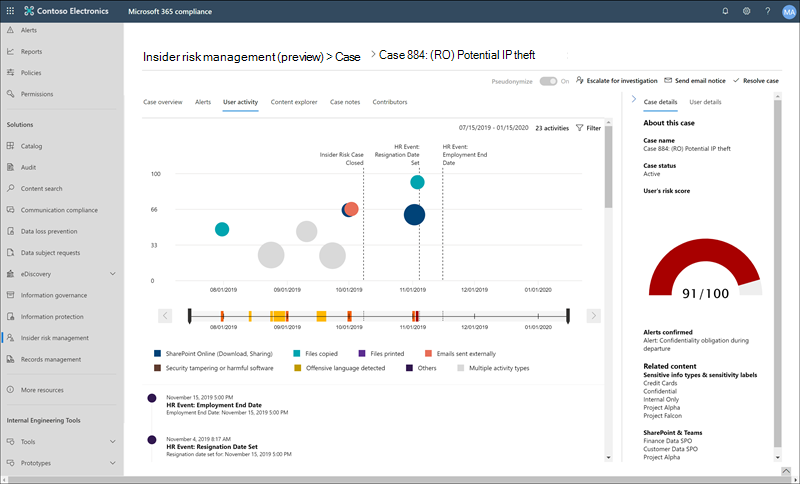

# Insider Risikomanagement in Microsoft 365

Das Insider Risk Management ist eine Lösung in Microsoft 365, mit der interne Risiken minimiert werden, indem Sie riskante Aktivitäten in Ihrer Organisation erkennen, untersuchen und Maßnahmen ergreifen können. Mit benutzerdefinierten Richtlinien können Sie böswillige und unbeabsichtigte Risiko Aktivitäten in Ihrer Organisation erkennen und Maßnahmen ergreifen, einschließlich eskalierenden Fällen an Microsoft Advanced eDiscovery bei Bedarf. Risikoanalysten in Ihrer Organisation können schnell geeignete Maßnahmen ergreifen, um sicherzustellen, dass Benutzer mit den Compliance-Standards Ihrer Organisation konform sind.

Sehen Sie sich das folgende Video an, um zu erfahren, wie Sie mit dem Insider Risikomanagement Ihre Organisation bei der Priorisierung Ihrer Unternehmenswerte, ihrer Kultur und ihrer Mitarbeiter Erfahrung beim verhindern, erkennen und eindämmen von Risiken unterstützen können:
 
 
>[!VIDEO https://www.microsoft.com/videoplayer/embed/RE4j9CN]

## Probleme mit modernen Risiko Punkten

Das Verwalten und minimieren von Risiken in Ihrer Organisation beginnt mit dem Verständnis der Arten von Risiken, die im modernen Arbeitsplatz gefunden werden. Einige Risiken werden durch externe Ereignisse und Faktoren gesteuert und liegen außerhalb der direkten Kontrolle. Andere Risiken werden durch interne Ereignisse und Mitarbeiter Aktivitäten gesteuert, die eliminiert und vermieden werden können. Einige Beispiele sind Risiken durch illegales, unangemessenes, unbefugtes oder unethisches Verhalten und Aktionen von Mitarbeitern und Führungskräften. Diese Verhaltensweisen umfassen eine Vielzahl interner Risiken durch Mitarbeiter:

- Lecks von vertraulichen Daten und Datenüberlauf
- Vertraulichkeits Verletzungen
- Geistiges Eigentum (IP) Diebstahl
- Betrugs
- Insider Handel
- Verstöße gegen gesetzliche Vorschriften

Mitarbeiter am modernen Arbeitsplatz haben Zugriff auf das Erstellen, verwalten und Freigeben von Daten für ein breites Spektrum an Plattformen und Diensten. In den meisten Fällen verfügen Organisationen über beschränkte Ressourcen und Tools, um unternehmensweite Risiken zu identifizieren und zu verringern und gleichzeitig die Datenschutzstandards der Mitarbeiter zu erfüllen.

Das Insider Risk Management in Microsoft 365 verwendet die gesamte Bandbreite von Dienst-und Drittanbieter Indikatoren, damit Sie die Risiko Aktivität schnell erkennen, selektieren und Maßnahmen ergreifen können. Mithilfe von Protokollen aus Office 365 und Microsoft Graph können Sie mit dem Insider Risikomanagement bestimmte Richtlinien zum Identifizieren von Risikoindikatoren definieren. Diese Richtlinien ermöglichen es Ihnen, riskante Aktivitäten zu identifizieren und Maßnahmen zur Minderung dieser Risiken zu ergreifen.

Das Insider Risikomanagement konzentriert sich auf die folgenden Prinzipien:

- **Transparenz**: Gleichgewicht der Datenschutz für Mitarbeiter im Vergleich zu Organisationsrisiken mit Architektur mit Datenschutz nach Design.
- **Konfigurierbar**: konfigurierbare Richtlinien basierend auf Branchen-, geografischen und Unternehmensgruppen.
- **Integriert**: integrierter Workflow in Microsoft 365 Compliance-Lösungen.
- **Handlungs**fähig: bietet Einblicke, um Mitarbeiter Benachrichtigungen, Daten Ermittlungen und Mitarbeiter Untersuchungen zu ermöglichen.

## Workflow

Das Insider Risk Management hilft Ihnen dabei, interne Risiken in Ihrer Organisation zu identifizieren, zu untersuchen und Maßnahmen zu ergreifen. Mit fokussierten Richtlinienvorlagen, umfassenden Aktivitäts Signalen über den Microsoft 365-Dienst und einem flexiblen Workflow können Sie Einblicke in Aktionen verwenden, um riskantes Verhalten schnell zu identifizieren und zu beheben.

Das identifizieren und beheben interner Risiko Aktivitäten und Compliance-Probleme mit dem Insider Risikomanagement in Microsoft 365 verwendet den folgenden Workflow:

### Richtlinien

Richtlinien für das Insider Risikomanagement werden mithilfe vordefinierter Vorlagen und Richtlinienbedingungen erstellt, die definieren, welche Risikoindikatoren in Microsoft 365-Featurebereichen untersucht werden. Diese Bedingungen umfassen, wie Indikatoren für Warnungen verwendet werden, welche Benutzer in der Richtlinie enthalten sind, welche Dienste priorisiert werden und welchen Zeitraum der Überwachung.

Sie können aus den folgenden [Richtlinienvorlagen](insider-risk-management-policies.md#policy-templates) auswählen, um schnell mit dem Insider Risikomanagement zu beginnen:

- Verabschiedung von Datendiebstahl durch Mitarbeiter
- Datenlecks
- Anstößige Sprache in e-Mail

Weitere Informationen finden Sie unter [Insider Risk Management Policies](insider-risk-management-policies.md).

### Warnungen

Warnungen werden automatisch von Risikoindikatoren generiert, die Richtlinienbedingungen entsprechen und im **Alerts-Dashboard**angezeigt werden. Dieses Dashboard ermöglicht eine schnelle Ansicht aller Warnungen, die überprüft werden müssen, Warnungen werden über einen Zeitraum geöffnet, und es werden Warnungs Statistiken für Ihre Organisation angezeigt. Alle Richtlinienwarnungen werden mit zugeordneten Informationen angezeigt, die Ihnen helfen, den aktuellen Status vorhandener Warnungen und neuer Warnungen schnell zu identifizieren, die eine Aktion erfordern:

- Status
- Severity
- Erkannte Zeit
- Fall
- Fall Status

Weitere Informationen finden Sie unter [Insider Risk Management Alerts](insider-risk-management-alerts.md).

### Auswahl

Bei neuen Aktivitäten, bei denen Untersuchungen erforderlich sind, werden automatisch Warnungen generiert, denen ein Status zur *Überarbeitung der Anforderungen* zugewiesen ist. Bearbeiter können diese Warnungen schnell identifizieren und durch die einzelnen scrollen, um Sie auszuwerten und zu selektieren. 

Warnungen werden aufgelöst, indem ein neuer Fall geöffnet, die Warnung einem vorhandenen Fall zugewiesen oder die Warnung abgewiesen wird. Mithilfe von Warnungs Filtern ist es ganz einfach, Warnungen nach Status, Schweregrad oder erkannter Zeit schnell zu identifizieren. Im Rahmen des Triage-Prozesses können Bearbeiter Warnungsdetails für die Richtlinienübereinstimmung anzeigen, Benutzeraktivitäten anzeigen, die der Übereinstimmung zugeordnet sind, den Schweregrad der Warnung anzeigen und Benutzerprofilinformationen überprüfen.

### Prüfen

Für Warnungen, die eine umfassendere Überprüfung und Untersuchung der Details und Umstände der Richtlinienübereinstimmung erfordern, werden Fälle erstellt. Das **Case-Dashboard** bietet eine Übersicht über alle aktiven Fälle, offene Fälle im Laufe der Zeit und Fall Statistiken für Ihre Organisation. Bearbeiter können Fälle schnell nach Status filtern, das Datum, an dem der Fall geöffnet wurde, und das Datum, an dem der Fall zuletzt aktualisiert wurde.

Wenn Sie im Case-Dashboard einen Fall auswählen, wird der Fall zur Untersuchung und Überprüfung geöffnet. Dieser Schritt ist das Herzstück des Insider Risikomanagement-Workflows. In diesem Bereich werden Risiko Aktivitätsindikatoren, Richtlinienbedingungen, Warnungsdetails und Mitarbeiterdetails in einer integrierten Ansicht für Bearbeiter synthetisiert. Die primären Ermittlungs Tools in diesem Bereich sind:

- **Benutzeraktivität**: Benutzeraktivität wird automatisch in einem interaktiven Diagramm angezeigt, in dem Risiko Aktivitäten über einen bestimmten Zeitraum und ein Risikoniveau für aktuelle oder vergangene Risiko Aktivitäten gezeichnet werden. Bearbeiter können den gesamten Risikoverlauf für den Mitarbeiter schnell Filtern und anzeigen und weitere Details in bestimmte Aktivitäten einplanen.
- **Inhalts-Explorer**: alle Datendateien und e-Mail-Nachrichten, die Warnungs Risiko Aktivitäten zugeordnet sind, werden automatisch erfasst und im Inhalts-Explorer angezeigt. Bearbeiter können Dateien und Nachrichten nach Datenquellen, Dateityp, Tags, Unterhaltung und vielen weiteren Attributen Filtern und anzeigen.
- **Fall Hinweise**: Überprüfer stellen Notizen für einen Fall im Abschnitt "fallnotizen" bereit. In dieser Liste werden alle Notizen in einer zentralen Ansicht konsolidiert, und es werden die Informationen Prüfer und Datum übermittelt hinzugefügt.

Weitere Informationen finden Sie unter [Insider Risk Management Cases](insider-risk-management-cases.md).

### Aktion

Nachdem Fälle untersuchtwurden, können Bearbeiter schnell Maßnahmen zur Lösung des Falles ergreifen oder mit anderen Risiko Beteiligten in Ihrer Organisation zusammenarbeiten. Wenn Mitarbeiter versehentlich oder versehentlich Richtlinienbedingungen verletzen, kann eine einfache Mahnungsbenachrichtigung an den Mitarbeiter aus den Benachrichtigungsvorlagen gesendet werden, die Sie für Ihre Organisation konfigurieren können. Diese Benachrichtigungen dienen möglicherweise als einfache Erinnerungen oder leiten den Mitarbeiter an eine Auffrischungsschulung oder Anleitung weiter, um zukünftiges riskantes Verhalten zu verhindern. Weitere Informationen finden Sie unter [Insider Risk Management – Hinweis Vorlagen](insider-risk-management-notices.md).

In den schwerwiegendsten Situationen müssen Sie möglicherweise die Fall Informationen für Insider Risk Management für andere Bearbeiter in Ihrer Organisation freigeben. Das Insider Risikomanagement ist eng mit anderen Microsoft 365-Kompatibilitätsfeatures integriert, die Ihnen bei der End-to-End-Risiko Lösung helfen. Wenn Sie einen Fall für eine Untersuchung eskalieren, können Sie Daten und die Verwaltung der Anfrage in Microsoft 365 auf Advanced eDiscovery übertragen. Advanced eDiscovery bietet einen End-to-End-Workflow zum aufbewahren, sammeln, überprüfen, analysieren und Exportieren von Inhalten, die auf interne und externe Untersuchungen in Ihrer Organisation reagieren. Sie ermöglicht es juristischen Teams, den gesamten Benachrichtigungs Workflow für rechtliche Aufbewahrungen zu verwalten. Weitere Informationen zu erweiterten eDiscovery-Fällen finden Sie unter [Overview of Advanced eDiscovery in Microsoft 365](overview-ediscovery-20.md).

## Szenarien

Das Insider Risikomanagement hilft Ihnen bei der Erkennung, Untersuchung und Durchführung von Maßnahmen zur Minderung interner Risiken in Ihrer Organisation in mehreren gängigen Szenarien:

### Datendiebstahl durch abtrennender Mitarbeiter

Wenn Mitarbeiter eine Organisation entweder freiwillig oder als Folge der Beendigung verlassen, gibt es häufig legitime Bedenken, dass Firmen-, Kunden-und Mitarbeiterdaten gefährdet sind. Mitarbeiter können unschuldig davon ausgehen, dass Projektdaten nicht proprietär sind oder dass Sie versucht sein könnten, Unternehmensdaten zur persönlichen Verstärkung und unter Verstoß gegen Unternehmensrichtlinien und gesetzliche Standards zu nutzen. Richtlinien für das Insider Risikomanagement, die die Richtlinienvorlage " [departing Employee Data Theft](insider-risk-management-policies.md#policy-templates) Policy" verwenden, erkennen automatisch Aktivitäten, die typischerweise mit diesem Diebstahltyp verbunden sind. Mit dieser Richtlinie erhalten Sie automatisch Warnungen für verdächtige Aktivitäten im Zusammenhang mit der abgehenden Mitarbeiter Diebstahl, damit Sie geeignete Ermittlungsaktionen durchführen können. Die Konfiguration eines [Microsoft 365 HR-Connectors](import-hr-data.md) für Ihre Organisation ist für diese Richtlinienvorlage erforderlich.

### Vorsätzliches oder unbeabsichtigtes Leck vertraulicher oder vertraulicher Informationen

In den meisten Fällen versuchen Mitarbeiter ihr Bestes, vertrauliche oder vertrauliche Informationen ordnungsgemäß zu verarbeiten. Gelegentlich führen Mitarbeiter jedoch Fehler aus, und Informationen werden versehentlich außerhalb Ihrer Organisation oder unter Verletzung ihrer Richtlinien zum Schutz von Daten freigegeben. Manchmal können Mitarbeiter absichtlich lecken oder vertrauliche und vertrauliche Informationen mit böswilligen Absichten und potenziellen persönlichen gewinnen teilen. Mit der Richtlinienvorlage [Datenlecks](insider-risk-management-policies.md#policy-templates) erstellte Richtlinien für Insider Risiken ermitteln automatisch Aktivitäten, die in der Regel mit der Freigabe vertraulicher oder vertraulicher Informationen verbunden sind. Für diese Richtlinienvorlage ist mindestens eine [DLP-Richtlinie (Data Loss Protection)](create-test-tune-dlp-policy.md) von Microsoft 365 für Ihre Organisation erforderlich.

### Aktionen und Verhaltensweisen, die Unternehmensrichtlinien verletzen

Die Kommunikation zwischen Mitarbeitern ist häufig eine Quelle für unbeabsichtigte oder böswillige Verstöße gegen Unternehmensrichtlinien. Diese Verletzungen können anstößige Sprachen, Bedrohungen und Cyber-Mobbing zwischen Mitarbeitern umfassen. Diese Art von Aktivität trägt zu einer feindlichen Arbeitsumgebung bei und kann rechtliche Schritte sowohl für die Mitarbeiter als auch für die größere Organisation zur Folge haben. Das Insider Risikomanagement verwendet neue integrierte Microsoft 365-Klassifizierungen und die [offensiv Sprache in der e-Mail-](insider-risk-management-policies.md#policy-templates) Richtlinienvorlage. Mit diesen Klassifizierungen und Vorlagen können Sie die schnelle Konfiguration einer Richtlinie automatisch erkennen und Sie über diese Art von Verhalten informieren.

## Sind Sie bereit zu beginnen?

Können Sie das Insider Risk Management für Ihre Organisation konfigurieren? Weitere Informationen finden Sie unter [Erste Schritte mit dem Insider Risikomanagement](insider-risk-management-configure.md) zum Konfigurieren von Voraussetzungen, Erstellen von Richtlinien und Starten des Empfangs von Benachrichtigungen.
