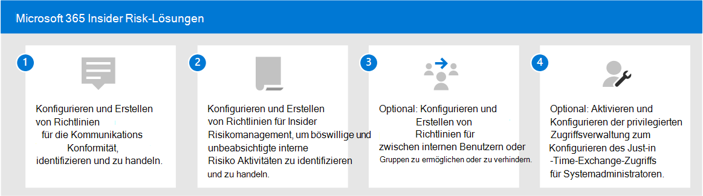

# Insider Risk-Lösungen in Microsoft 365

Insiderrisiken sind eines der obersten Anliegen von Sicherheits- und Complianceexperten am modernen Arbeitsplatz. Branchenstudien haben gezeigt, dass Insiderrisiken häufig mit bestimmten Benutzerereignissen oder -aktivitäten verbunden sind. Der Schutz Ihrer Organisation vor diesen Risiken kann schwierig zu identifizieren und schwer zu mindern sein. Insiderrisiken umfassen Sicherheitsrisiken in einer Vielzahl von Bereichen und können große Probleme für Ihre Organisation verursachen, angefangen beim Verlust von geistigem Eigentum bis hin zu Schikanen am Arbeitsplatz und vielem mehr. In der folgenden Abbildung werden allgemeine Insiderrisiken dargestellt:

Microsoft 365 risikoverhütungsfeatures sind in unsere Produkte und Lösungen für Insiderrisiken konzipiert und integrierte. Diese Lösungen arbeiten zusammen und verwenden erweiterte Dienst- und Drittanbieterindikatoren, um Risikoaktivitäten schnell zu identifizieren, zu verdingen und zu reagieren. Die meisten Lösungen bieten einen umfassenden Erkennungs-, Warnungs- und Behebungsworkflow für Datenanalysten und Ermittler, um diese Risiken schnell zu reagieren und zu minimieren.

| Risikosymbol | Risiken | Kommunikationscompliance | Insider-Risikomanagement | Informationsbarrieren | Verwaltung privilegierter Zugriffe |
| :---- | :-------- | :--------------------------- | :-------------------------- |:-------------------------| :--------------------------------|
| | Datenleck |  |  |  |  |
| | Verstöße gegen die Vertraulichkeit |  |  |  |  |
| | IP-Diebstahl |  |  |  |  |
| | Gewalt am Arbeitsplatz |  |  |  |  |
| | Betrug |  |  |  |  |
| | Richtlinienverletzungen |  |  |  |  |
| | Insidergeschäfte |  |  |  |  |
| | Interessenkonflikte |  |  |  |  |
| | Vertrauliche Datenlecks |  |  |  |  |
| | Belästigung am Arbeitsplatz |  |  |  |  |
| | Sicherheitsverletzungen |  |  |  |  |
| | Verstöße gegen gesetzliche Vorschriften |  |  |  |  |

## Microsoft 365 Insider Risk-Lösungen

Um Ihre Organisation vor Insiderrisiken zu schützen, verwenden Sie Microsoft 365 Funktionen und Features.

### Kommunikationscompliance

Kommunikationskonformität trägt dazu bei, Kommunikationsrisiken zu minimieren, indem Sie unangemessene Nachrichten in Ihrer Organisation erkennen, erfassen und gegen sie handeln. Die Kommunikationskonformität ist in den folgenden Abonnements verfügbar:

- Microsoft 365 E5 Abonnement (kostenpflichtig oder Testversion)
- Microsoft 365 E3 Abonnement + das Microsoft 365 E5 Compliance-Add-On
- Microsoft 365 E3 Abonnement + das Microsoft 365 E5 Insider Risk Management-Add-On
- Microsoft 365 A5-Abonnement (kostenpflichtig oder Testversion)
- Microsoft 365 A3-Abonnement + Microsoft 365 A5 Compliance-Add-On
- Microsoft 365 A3-Abonnement + Microsoft 365 A5 Insider Risk Management-Add-On
- Microsoft 365 G5-Abonnement (kostenpflichtig oder Testversion)
- Microsoft 365 G5-Abonnement + Microsoft 365 G5 Compliance-Add-On
- Microsoft 365 G5-Abonnement + Microsoft 365 G5 Insider Risk Management-Add-On
- Office 365 Enterprise E5-Abonnement (kostenpflichtig oder Testversion)
- Office 365 A5 Abonnement (kostenpflichtig oder Testversion)
- Office 365 Enterprise E3-Abonnement mit dem Add-On Office 365 Advanced Compliance (nicht mehr für neue Abonnements verfügbar)

### Insider-Risikomanagement

Das Risikomanagement von Insidern trägt dazu bei, interne Risiken zu minimieren, indem Sie schädliche und unbeabsichtigte Aktivitäten in Ihrer Organisation erkennen, untersuchen und auf diese weise handeln können.

Insider-Risikomanagement ist in den folgenden Abonnements verfügbar:

- Microsoft 365 E5 Abonnement (kostenpflichtig oder Testversion)
- Microsoft 365 E3 Abonnement + das Microsoft 365 E5 Compliance-Add-On
- Microsoft 365 E3 Abonnement + das Microsoft 365 E5 Insider Risk Management-Add-On
- Microsoft 365 A5-Abonnement (kostenpflichtig oder Testversion)
- Microsoft 365 A3-Abonnement + Microsoft 365 A5 Compliance-Add-On
- Microsoft 365 A3-Abonnement + Microsoft 365 A5 Insider Risk Management-Add-On
- Microsoft 365 G5-Abonnement (kostenpflichtig oder Testversion)
- Microsoft 365 G3 Abonnement + das Microsoft 365 G5 Compliance-Add-On
- Microsoft 365 G3 Abonnement + das Microsoft 365 G5 Insider Risk Management-Add-On
- Office 365 E3-Abonnement + Enterprise Mobility and Security E3 + das Microsoft 365 E5 Compliance-Add-On

### Informationsbarrieren

Informationsbarrieren ermöglichen es Ihnen, die Kommunikation und Zusammenarbeit zwischen zwei internen Gruppen einzuschränken, um zu verhindern, dass in Ihrer Organisation ein Interessenkonflikt auftritt.

Informationsbarrieren sind in den folgenden Abonnements verfügbar:

- Microsoft 365 E5 Abonnement (kostenpflichtig oder Testversion)
- Microsoft 365 A5-Abonnement (kostenpflichtig oder Testversion)
- Office 365 Enterprise E5-Abonnement (kostenpflichtig oder Testversion)
- Office 365 A5 Abonnement (kostenpflichtig oder Testversion)
- Office 365 Advanced Compliance -Add-On (nicht mehr verfügbar für neue Abonnements)
- Microsoft 365 E3 Abonnement + das Microsoft 365 E5 Compliance-Add-On
- Microsoft 365 E3 Abonnement + das Microsoft 365 E5 Insider Risk Management-Add-On
- Microsoft 365 A3-Abonnement + Microsoft 365 A5 Compliance-Add-On
- Microsoft 365 A3-Abonnement + Microsoft 365 A5 Insider Risk Management-Add-On

### Verwaltung des privilegierten Zugriffs

Die Verwaltung des privilegierten Zugriffs ermöglicht eine präzise Zugriffssteuerung Exchange Online Administratoraufgaben in Office 365. Dies kann Ihre Organisation vor Angriffen schützen, bei denen vorhandene privilegierte Administratorkonten mit kontinuierlichem Zugang auf vertrauliche Daten oder kritische Konfigurationseinstellungen verwendet werden.

Die Verwaltung des privilegierten Zugriffs ist in den folgenden Abonnements verfügbar:

- Microsoft 365 E5 Abonnement (kostenpflichtig oder Testversion)
- Microsoft 365 A5-Abonnement (kostenpflichtig oder Testversion)
- Office 365 Enterprise E5-Abonnement (kostenpflichtig oder Testversion)
- Office 365 A5 Abonnement (kostenpflichtig oder Testversion)
- Microsoft 365 E3 Abonnement + das Microsoft 365 E5 Compliance-Add-On
- Microsoft 365 E3 abonnement + Microsoft 365 E5 Information Protection and Governance add-on
- Microsoft 365 A3-Abonnement + Microsoft 365 A5 Compliance-Add-On
- Microsoft 365 A3-Abonnement + Microsoft 365 A5 Information Protection and Governance-Add-On

## Bereitstellen Microsoft 365 von Insiderrisikolösungen

Um Ihre Organisation vor Insiderrisiken zu schützen, richten Sie die folgenden Microsoft 365 ein:

1. Konfigurieren und Erstellen [von Kommunikationskonformitätsrichtlinien](communication-compliance-solution-overview.md).
2. Konfigurieren und Erstellen [von Insider-Risikomanagementrichtlinien](insider-risk-management-solution-overview.md).
3. Optional: Konfigurieren und Erstellen von [Richtlinien für Informationsbarrieren](information-barriers-solution-overview.md).
4. Optional: Aktivieren und Konfigurieren der [Privilegierten Zugriffsverwaltung](privileged-access-management-solution-overview.md).

## Illustrationen mit Beispielen

Um Ihnen bei der Planung einer integrierten Strategie für  die Implementierung Microsoft 365 insider risk capabilities zu helfen, laden Sie den Microsoft 365-Informationsschutz- und Compliancefunktionen-Satz von Illustrationen herunter. Informationen zu Insiderrisikofunktionen finden Sie auf den Abbildungsseiten der Architektur 5-7. Sie können diese Illustrationen für Ihren eigenen Gebrauch anpassen.

| Element | Beschreibung |
|:-----|:------------|
|   [Als PDF herunterladen](https://download.microsoft.com/download/3/a/6/3a6ab1a3-feb0-4ee2-8e77-62415a772e53/m365-compliance-illustrations.pdf)  \| [Als Visio herunterladen](https://download.microsoft.com/download/3/a/6/3a6ab1a3-feb0-4ee2-8e77-62415a772e53/m365-compliance-illustrations.vsdx)   Aktualisiert im Oktober 2020|Enthält: <ul><li>  Microsoft Information Protection und Verhinderung von Datenverlust</li><li>Aufbewahrungsrichtlinien und Aufbewahrungsbezeichnungen </li><li>Informationsbarrieren</li><li>Kommunikationscompliance</li><li>Insider-Risikomanagement</li><li>Datenerfassung durch Drittanbieter</li>|

## Schulung

Wenn Sie Ihre Administratoren und Daseinsverwaltungsteam in den Grundlagen für jede Insiderrisikolösung trainieren, können Sie Ihre Organisation schneller mit Ihren Bereitstellungs- und Implementierungsbemühungen beginnen. 

Microsoft 365 stellt die folgenden Ressourcen zur Verfügung, um diese Benutzer in Ihrer Organisation zu informieren und zu schulen:

| Lösung/Bereich | Ressourcen |
|:------------------|:--------------|
| Verwalten von Insider-Risiken in Microsoft 365 |[Vollständiger Lernpfad](/learn/paths/m365-compliance-insider)   Dieser Lernpfad umfasst alle einzelnen Lösungsmodule für Kommunikationskonformität, Insider-Risikomanagement, Informationsbarrieren und privilegierte Zugriffsverwaltung. Wählen Sie diesen Lernpfad aus, um alle Module zu vervollständigen. |
| Kommunikationscompliance | [Lernmodul: Vorbereiten der Kommunikationskonformität in Microsoft 365](/learn/modules/m365-compliance-insider-prepare-communication-compliance)   Dieses Modul hilft Ihnen, die Grundlagen zum Identifizieren und Behebung von Verstößen gegen Code-of-Conduct-Richtlinien bei der Kommunikationskonformität zu erlernen, die erforderlichen Voraussetzungen zu erfüllen, bevor Sie Richtlinien für die Kommunikationskonformität erstellen, und erfahren Sie mehr über die Typen von integrierten, vordefinierten Richtlinienvorlagen in der Kommunikationskonformität. |
| Insider-Risikomanagement | [Lernmodul: Insider risk management in Microsoft 365](/learn/modules/m365-compliance-insider-manage-insider-risk)   Dieses Modul hilft Ihnen, zu erfahren, wie das Insiderrisikomanagement in Microsoft 365 dazu beitragen kann, interne Risiken in einer Organisation zu verhindern, zu erkennen und zu enthalten. Außerdem erfahren Sie mehr über die Typen von integrierten, vordefinierten Richtlinienvorlagen, verstehen die grundlegenden Voraussetzungen, die vor dem Erstellen von Insiderrisikorichtlinien erforderlich sind, und erläutert die Arten von Aktionen, die Sie für Fälle des Insiderrisikomanagements ergreifen können. |
| Informationsbarrieren | [Lernmodul: Planen von Informationsbarrieren](/learn/modules/m365-compliance-insider-plan-information-barriers)   Dieses Modul hilft Ihnen, zu erfahren, wie Richtlinien für Informationsbarrieren Ihre Organisation dabei unterstützen können, die Einhaltung relevanter Branchenstandards und -vorschriften aufrecht zu erhalten, listet die Arten von Situationen auf, in denen Informationsbarrieren anwendbar sind, hilft ihnen, den Prozess der Erstellung einer Richtlinie für Informationsbarrieren zu erläutern und zu erläutern, wie unerwartete Probleme nach der Einrichtung von Informationsbarrieren behoben werden können. |
| Verwaltung des privilegierten Zugriffs | [Lernmodul: Implementieren der Verwaltung privilegierter Zugriffe](/learn/modules/m365-compliance-insider-implement-privileged-access-management)   Dieses Modul hilft Ihnen, den Unterschied zwischen privilegierter Zugriffsverwaltung und privilegierter Identitätsverwaltung zu verstehen, den Prozessablauf für die Verwaltung privilegierter Zugriffe zu verstehen und die Grundlagen der Konfiguration und Aktivierung der Verwaltung privilegierter Zugriffe zu verstehen. |
