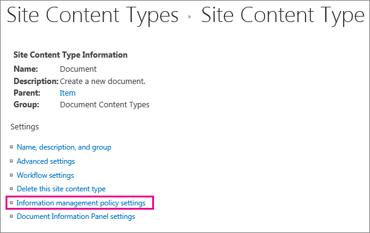

# Einführung in InformationsverwaltungsrichtlinienIntroduction to information management policies

Eine Informationsverwaltungsrichtlinie ist ein Satz von Regeln, der für eine bestimmte Art von Inhalten gilt.An information management policy is a set of rules for a type of content. Mithilfe von Informationsverwaltungsrichtlinien können Organisationen steuern und nachverfolgen, wie lange Inhalt beibehalten wird oder welche Aktionen die Benutzer für diesen Inhalt ausführen können.Information management policies enable organizations to control and track things like how long content is retained or what actions users can take with that content. Informationsverwaltungsrichtlinien können Organisationen helfen, gesetzliche oder behördliche Bestimmungen einzuhalten oder einfach interne Geschäftsprozesse erzwingen.Information management policies can help organizations comply with legal or governmental regulations, or they can simply enforce internal business processes. 
  
Beispielsweise kann eine Organisation, die den gesetzlichen Bestimmungen folgen muss, die erfordern, dass sie "angemessene Kontrollen" ihrer Abschlüsse nachweisen muss, eine oder mehrere Informationsverwaltungsrichtlinien erstellen, die bestimmte Aktionen im Erstellungs- und Genehmigungsprozess für alle Dokumente im Zusammenhang mit Finanzanmeldungen überwachen.For example, an organization that must follow government regulations requiring that they demonstrate "adequate controls" of their financial statements might create one or more information management policies that audit specific actions in the authoring and approval process for all documents related to financial filings.
  
Informationen zur Funktionsweise finden Sie unter Erstellen und Anwenden [von Informationsverwaltungsrichtlinien](create-info-mgmt-policies.md).For how-to information, see [Create and apply information management policies](create-info-mgmt-policies.md).
  
## Features von InformationsverwaltungsrichtlinienFeatures of information management policies

Es gibt vier grundlegende Kategorien vordefinierter Richtlinienfeatures, die Organisationen einzeln oder in Kombination zum Verwalten von Inhalten und Prozessen verwenden können.There are four basic categories of predefined policy features that organizations can use individually or in combination to manage content and processes. 
  

  
Mit dem Überwachungsrichtlinienfeature können Organisationen analysieren, wie ihre Inhaltsverwaltungssysteme durch Protokollierung von Ereignissen und Vorgängen verwendet werden, die für Dokumente und Listenelemente ausgeführt werden.The Auditing policy feature helps organizations analyze how their content management systems are used by logging events and operations that are performed on documents and list items. Sie können das Überwachungsrichtlinienfeature so konfigurieren, dass Ereignisse protokolliert werden, z. B. wenn ein Dokument oder Element bearbeitet, angezeigt, eingecheckt, ausgecheckt, gelöscht oder seine Berechtigungen geändert wurden.You can configure the Auditing policy feature to log events such as when a document or item is edited, viewed, checked in, checked out, deleted, or has its permissions changed. Alle Überwachungsinformationen werden in einem einzigen Überwachungsprotokoll auf dem Server gespeichert, und Websiteadministratoren können Berichte dazu ausführen.All of the audit information is stored in a single audit log on the server, and site administrators can run reports on it. 
  
Das Ablaufrichtlinienfeature hilft Organisationen dabei, veraltete Inhalte auf konsistente, nachverfolgbare Weise von ihren Websites zu löschen oder zu entfernen.The Expiration policy feature helps organizations delete or remove out-of-date content from their sites in a consistent, trackable way. Auf diese Weise können Sie sowohl die Kosten als auch das Risiko verwalten, die mit der Aufbewahrung veralteter Inhalte verbunden sind.This helps you manage both the cost and risk associated with retaining out-of-date content. Sie können eine Ablaufrichtlinie konfigurieren, um anzugeben, dass bestimmte Inhaltstypen an einem bestimmten Datum oder innerhalb eines Zeitraums ablaufen, nachdem das Dokument erstellt oder zuletzt geändert wurde.You can configure an Expiration policy to specify that certain types of content expire on a particular date or within a period of time after the document was created or last modified.
  
In Organisationen können auch benutzerdefinierte Richtlinienfeatures für spezielle Anforderungen erstellt und bereitgestellt werden.Organizations can also create and deploy custom policy features to meet specific needs. Beispielsweise kann eine Produktionsorganisation eine Informationsverwaltungsrichtlinie für alle Entwurfsdokumente für Produktdesignspezifikationen definieren, die benutzern das Drucken von Kopien dieser Dokumente auf nicht unsicheren Druckern verbieten.For example, a manufacturing organization might want to define an information management policy for all draft product-design specification documents that prohibits users from printing copies of these documents on nonsecure printers. Um diese Art von Informationsverwaltungsrichtlinie zu definieren, können Sie ein Richtlinienfeature für Druckeinschränkungen erstellen und bereitstellen, das der relevanten Informationsverwaltungsrichtlinie für den Inhaltstyp der Produktentwurfsspezifikation hinzugefügt werden kann.To define this kind of information management policy, you can create and deploy a Printing Restriction policy feature that can be added to the relevant information management policy for the product design specification content type.
  
## Speicherorte für die Verwendung einer InformationsverwaltungsrichtlinieLocations to use an information management policy

Um eine Informationsverwaltungsrichtlinie zu implementieren, müssen Sie sie einer Liste, Bibliothek oder einem Inhaltstyp auf einer Website hinzufügen.To implement an information management policy, you must add it to a list, library, or content type in a site. Der Speicherort, an dem Sie eine Informationsverwaltungsrichtlinie erstellen oder hinzufügen, wirkt sich darauf aus, wie allgemein die Richtlinie angewendet oder wie allgemein sie verwendet werden kann.The location where you create or add an information management policy affects how broadly the policy applies or how broadly it can be used. Sie können:You can:
  
 **Erstellen einer Websitesammlungsrichtlinie und anschließendes** Hinzufügen dieser Richtlinie zu einem Inhaltstyp, einer Liste oder Bibliothek Sie können eine Websitesammlungsrichtlinie in der Liste Richtlinien auf der Website auf oberster Ebene einer Websitesammlung erstellen.**Create a site collection policy and then add this policy to a content type, list, or library** You can create a site collection policy in the Policies list in the top-level site of a site collection. Nachdem Sie eine Websitesammlungsrichtlinie erstellt haben, können Sie sie exportieren, sodass Administratoren anderer Websitesammlungen sie in ihre Richtlinienliste importieren können.After you create a site collection policy, you can export it so that administrators of other site collections can import it into their Policies list. Durch das Erstellen einer exportierbaren Websitesammlungsrichtlinie können Sie die Informationsverwaltungsrichtlinien auf den Websites in Ihrer Organisation standardisieren.Creating an exportable site collection policy enables you to standardize the information management policies across the sites in your organization. 
  
Wenn Sie einem Websiteinhaltstyp eine Websitesammlungsrichtlinie hinzufügen und einer Liste oder Bibliothek eine Instanz dieses Websiteinhaltstyps hinzugefügt wird, kann der Besitzer dieser Liste oder Bibliothek die Websitesammlungsrichtlinie für die Liste oder Bibliothek nicht ändern.When you add a site collection policy to a site content type, and an instance of that site content type is added to a list or library, the owner of that list or library cannot modify the site collection policy for the list or library. Das Hinzufügen einer Websitesammlungsrichtlinie zu einem Websiteinhaltstyp ist eine gute Möglichkeit, um sicherzustellen, dass Websitesammlungsrichtlinien auf jeder Ebene der Websitehierarchie erzwungen werden.Adding a site collection policy to a site content type is a good way to ensure that site collection policies are enforced at each level of your site hierarchy.
  

  
 Erstellen sie eine Informationsverwaltungsrichtlinie für einen Websiteinhaltstyp im Websiteinhaltstypkatalog der obersten Ebene, und fügen Sie diesen Inhaltstyp dann einer **oder mehreren** Listen oder Bibliotheken hinzu. Sie können auch eine Informationsverwaltungsrichtlinie direkt für einen Websiteinhaltstyp erstellen und dann eine Instanz dieses Websiteinhaltstyps mehreren Listen oder Bibliotheken zuordnen.**Create an information management policy for a site content type in the top-level site's Site Content Type Gallery, and then add that content type to one or more lists or libraries** You can also create an information management policy directly for a site content type and then associate an instance of that site content type with multiple lists or libraries. Wenn Sie eine Informationsverwaltungsrichtlinie auf diese Weise erstellen, verfügt jedes Element in der Websitesammlung dieses Inhaltstyps oder ein Inhaltstyp, der von diesem Inhaltstyp erbt, über die Richtlinie.If you create an information management policy this way, every item in the site collection of that content type or a content type that inherits from that content type has the policy. Wenn Sie jedoch eine Informationsverwaltungsrichtlinie direkt für einen Websiteinhaltstyp erstellen, ist es schwieriger, diese Informationsverwaltungsrichtlinie in anderen Websitesammlungen wiederzuverwenden, da Richtlinien, die auf diese Weise erstellt werden, nicht exportiert werden können.However, if you create an information management policy directly for a site content type, it is more difficult to reuse this information management policy in other site collections, because policies that are created this way cannot be exported. 
  

  

  
Hinweis Um zu steuern, welche Richtlinien in einer Websitesammlung verwendet werden, können Websitesammlungsadministratoren die Möglichkeit deaktivieren, Richtlinienfeatures direkt für einen Inhaltstyp festlegen.Note To control which policies are used in a site collection, site collection administrators can disable the ability to set policy features directly on a content type. Wenn diese Einschränkung wirksam ist, sind Benutzer, die Inhaltstypen erstellen, auf die Auswahl von Richtlinien aus der Liste Websitesammlungsrichtlinien beschränkt.When this restriction is in effect, users who create content types are limited to selecting policies from the site collection Policies list.
  
 **Erstellen einer Informationsverwaltungsrichtlinie für eine Liste oder Bibliothek** Wenn Ihre Organisation eine bestimmte Informationsverwaltungsrichtlinie auf einen sehr begrenzten Satz von Inhalten anwenden muss, können Sie eine Informationsverwaltungsrichtlinie erstellen, die nur für eine einzelne Liste oder Bibliothek gilt.**Create an information management policy for a list or library** If your organization needs to apply a specific information management policy to a very limited set of content, you can create an information management policy that applies only to an individual list or library. Diese Methode zum Erstellen einer Informationsverwaltungsrichtlinie ist am wenigsten flexibel, da die Richtlinie nur für einen Speicherort gilt und nicht für andere Speicherorte exportiert oder wiederverwendet werden kann.This method of creating an information management policy is the least flexible, because the policy applies only to one location, and it cannot be exported or reused for other locations. Manchmal müssen Sie jedoch möglicherweise eindeutige Informationsverwaltungsrichtlinien mit eingeschränkter Anwendbarkeit erstellen, um bestimmte Situationen zu bewältigen.However, sometimes you may need to create unique information management policies with limited applicability to address specific situations. 
  

  
HinweiseNotes 
  
Sie können eine Informationsverwaltungsrichtlinie für eine Liste oder Bibliothek nur erstellen, wenn diese Liste oder Bibliothek nicht mehrere Inhaltstypen unterstützt.You can create an information management policy for a list or library only if that list or library does not support multiple content types. Wenn eine Liste oder Bibliothek mehrere Inhaltstypen unterstützt, müssen Sie eine Informationsverwaltungsrichtlinie für jeden einzelnen Listeninhaltstyp definieren, der dieser Liste oder Bibliothek zugeordnet ist.If a list or library supports multiple content types, you need to define an information management policy for each individual list content type that is associated with that list or library. (Instanzen eines Websiteinhaltstyps, die einer bestimmten Liste oder Bibliothek zugeordnet sind, werden als Listeninhaltstypen bezeichnet.)(Instances of a site content type that are associated with a specific list or library are known as list content types.)
  
Um zu steuern, welche Richtlinien in einer Websitesammlung verwendet werden, können Websitesammlungsadministratoren die Möglichkeit deaktivieren, Richtlinienfeatures direkt in einer Liste oder Bibliothek festlegen.To control which policies are used in a site collection, site collection administrators can disable the ability to set policy features directly on a list or library. Wenn diese Einschränkung wirksam ist, sind Benutzer, die Listen oder Bibliotheken verwalten, auf die Auswahl von Richtlinien aus der Liste Websitesammlungsrichtlinien beschränkt.When this restriction is in effect, users who manage lists or libraries are limited to selecting policies from the site collection Policies list.
  
[Eine Informationsverwaltungsrichtlinie ist ein Satz von Regeln für einen Inhaltstyp. Informationsverwaltungsrichtlinien ermöglichen Es Organisationen, Dinge zu steuern und nachverfolgt zu haben, z. B. wie lange Inhalte aufbewahrt werden oder welche Aktionen Benutzer mit diesen Inhalten ausführen können. Informationsverwaltungsrichtlinien können Organisationen bei der Einhaltung gesetzlicher oder behördlicher Bestimmungen unterstützen oder interne Geschäftsprozesse einfach erzwingen. Beispielsweise kann eine Organisation, die den gesetzlichen Bestimmungen folgen muss, die erfordern, dass sie "angemessene Kontrollen" ihrer Abschlüsse nachweisen muss, eine oder mehrere Informationsverwaltungsrichtlinien erstellen, die bestimmte Aktionen im Erstellungs- und Genehmigungsprozess für alle Dokumente im Zusammenhang mit Finanzanmeldungen überwachen. Informationen zur Funktionsweise finden Sie unter Erstellen und Anwenden von Informationsverwaltungsrichtlinien.An information management policy is a set of rules for a type of content. Information management policies enable organizations to control and track things like how long content is retained or what actions users can take with that content. Information management policies can help organizations comply with legal or governmental regulations, or they can simply enforce internal business processes. For example, an organization that must follow government regulations requiring that they demonstrate "adequate controls" of their financial statements might create one or more information management policies that audit specific actions in the authoring and approval process for all documents related to financial filings.For how-to information, see Create and apply information management policies.](intro-to-info-mgmt-policies.md#__top)
  

