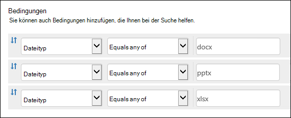
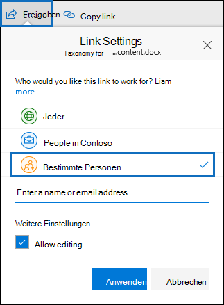

# <a name="keyword-queries-and-search-conditions-for-content-search-and-ediscovery"></a>Schlüsselwortabfragen und Suchbedingungen für inhaltssuche und eDiscovery

In diesem Thema werden die E-Mail- und Dokumenteigenschaften beschrieben, die Sie in E-Mail-Elementen in Exchange Online und auf SharePoint- und OneDrive for #A0 gespeicherte Dokumente mithilfe des Features "Inhaltssuche" im Microsoft 365 Compliance Center suchen können. Sie können auch die **\* Cmdlets -ComplianceSearch** in Security & Compliance Center PowerShell verwenden, um nach diesen Eigenschaften zu suchen. Das Thema beschreibt außerdem:
  
- Verwenden von booleschen Suchoperatoren, Suchbedingungen und anderen Suchabfragetechniken, um Ihre Suchergebnisse zu verfeinern.

- Suchen nach vertraulichen Datentypen und benutzerdefinierten vertraulichen Datentypen in SharePoint und OneDrive for Business.

- Suchen nach Websiteinhalten, die für Benutzer außerhalb Ihrer Organisation freigegeben werden

Schrittweise Anweisungen zum Erstellen einer Inhaltssuche finden Sie unter [Inhaltssuche](content-search.md).

> [!NOTE]
> Die Inhaltssuche im Microsoft 365 Compliance Center und die entsprechenden **\* Cmdlets -ComplianceSearch** in Security & Compliance Center PowerShell verwenden die Keyword Query Language (KQL). Ausführlichere Informationen finden Sie unter [Keyword Query Language syntax reference](/sharepoint/dev/general-development/keyword-query-language-kql-syntax-reference). 
  
## <a name="searchable-email-properties"></a>Durchsuchbare E-Mail-Eigenschaften

In der folgenden Tabelle sind **E-Mail-Nachrichteneigenschaften** aufgeführt, die mithilfe der Inhaltssuche im Microsoft 365 Compliance Center oder mithilfe der New-ComplianceSearch oder des **Cmdlets Set-ComplianceSearch** durchsucht werden können. Die Tabelle enthält ein Beispiel für die  _property:value_-Syntax für jede Eigenschaft und eine Beschreibung der für jedes Beispiel zurückgegebenen Suchergebnisse. Sie können diese Paare  `property:value` in das Schlüsselwortfeld für eine Inhaltssuche eingeben. 

> [!NOTE]
> Beim Durchsuchen von E-Mail-Eigenschaften ist es nicht möglich, nach Elementen zu suchen, in denen die angegebene Eigenschaft leer oder leer ist. Wenn Sie beispielsweise das *Property:Value-Paar* **subject:""** verwenden, um nach E-Mail-Nachrichten mit einer leeren Betreffzeile zu suchen, werden null Ergebnisse angezeigt. Dies gilt auch beim Durchsuchen von Website- und Kontakteigenschaften.
  
| Eigenschaft | Beschreibung der Eigenschaft | Beispiele | Von den Beispielen zurückgegebene Suchergebnisse |
|:-----|:-----|:-----|:-----|
|AttachmentNames|Die Namen der an eine E-Mail angefügten Dateien.|`attachmentnames:annualreport.ppt`  <br/> `attachmentnames:annual*` <br/> `attachmentnames:.pptx` |Nachrichten, an die eine Datei namens Jahresbericht.ppt angehängt ist. Im zweiten Beispiel werden, wenn Sie das Platzhalterzeichen verwenden, Nachrichten mit dem Wort "Jahresbericht" im Dateinamen eines Anhangs zurückgegeben. Im dritten Beispiel werden alle Anlagen mit der Dateierweiterung pptx zurückgegeben.|
|Bcc|Das Feld Bcc einer E-Mail-Nachricht. <sup>1</sup>|`bcc:pilarp@contoso.com`  <br/> `bcc:pilarp`  <br/> `bcc:"Pilar Pinilla"`|In allen Beispielen werden Nachrichten mit dem Namen "Pilar Pinilla" im Bcc-Feld zurückgegeben.|
|Kategorie| Die Kategorien, nach denen gesucht wird. Kategorien können von Benutzern mithilfe von Outlook oder Outlook im Web (früher als Outlook Web App bezeichnet) definiert werden. Die folgenden Werte sind möglich:  <br/><br/>  blau  <br/>  grün  <br/>  orange  <br/>  violett  <br/>  rot  <br/>  gelb|`category:"Red Category"`|Nachrichten, denen in den Quellpostfächern die rote Kategorie zugewiesen wurde.|
|Cc|Das Cc-Feld einer E-Mail-Nachricht. <sup>1</sup>|`cc:pilarp@contoso.com`  <br/> `cc:"Pilar Pinilla"`|In beiden Beispielen werden Nachrichten mit Pilar Pinilla im Feld Cc angegeben.|
|Folderid|Die Ordner-ID (GUID) eines bestimmten Postfachordners. Wenn Sie diese Eigenschaft verwenden, achten Sie darauf, das Postfach zu durchsuchen, in dem sich der angegebene Ordner befindet. Es wird nur der angegebene Ordner durchsucht. Alle Unterordner im Ordner werden nicht durchsucht. Zum Durchsuchen von Unterordnern müssen Sie die Folderid-Eigenschaft für den Zu durchsuchenden Unterordner verwenden.  <br/> Weitere Informationen zum Suchen nach der Folderid-Eigenschaft und zum Verwenden eines Skripts zum Abrufen der Ordner-IDs für ein bestimmtes Postfach finden Sie unter [Use Content Search for targeted collections](use-content-search-for-targeted-collections.md).|`folderid:4D6DD7F943C29041A65787E30F02AD1F00000000013A0000`  <br/> `folderid:2370FB455F82FC44BE31397F47B632A70000000001160000 AND participants:garthf@contoso.com`|Im ersten Beispiel werden alle Elemente im angegebenen Postfachordner zurückgegeben. Im zweiten Beispiel werden alle Elemente im angegebenen Postfachordner zurückgegeben, die von der Garthf@contoso.com.|
|Von|Der Absender einer E-Mail-Nachricht.<sup>1</sup>|`from:pilarp@contoso.com`  <br/> `from:contoso.com`|Nachrichten, die vom angegebenen Benutzer oder einer bestimmten Domäne gesendet wurden.|
|HasAttachment|Gibt an, ob eine Nachricht über eine Anlage verfügt. Verwenden Sie die **Werte true** oder **false**.|`from:pilar@contoso.com AND hasattachment:true`|Nachrichten, die vom angegebenen Benutzer mit Anlagen gesendet werden.|
|Wichtigkeit|Die Wichtigkeit einer E-Mail-Nachricht, die ein Absender festlegen kann, wenn er eine Nachricht sendet. Standardmäßig werden Nachrichten mit normaler Wichtigkeit gesendet, außer wenn der Absender die Wichtigkeit auf **Hoch** oder **Niedrig** setzt.  |`importance:high`  <br/> `importance:medium`  <br/> `importance:low`|Nachrichten, deren Wichtigkeit auf "Hoch", "Mittel" bzw. "Niedrig" eingestellt ist.|
|IsRead|Gibt an, ob Nachrichten gelesen wurden. Verwenden Sie die **Werte true** oder **false**.|`isread:true`  <br/> `isread:false`|Im ersten Beispiel werden Nachrichten zurückgegeben, deren IsRead-Eigenschaft auf **True festgelegt ist.** Im zweiten Beispiel werden Nachrichten zurückgegeben, deren IsRead-Eigenschaft auf **False festgelegt ist.**|
|ItemClass|Verwenden Sie diese Eigenschaft, um bestimmte Drittanbieterdatentypen zu durchsuchen, die Ihre Organisation in Office 365 importiert hat. Verwenden Sie die folgende Syntax für diese Eigenschaft:  `itemclass:ipm.externaldata.<third-party data type>*`|`itemclass:ipm.externaldata.Facebook* AND subject:contoso`  <br/> `itemclass:ipm.externaldata.Twitter* AND from:"Ann Beebe" AND "Northwind Traders"`|Im ersten Beispiel werden Facebook-Elemente zurückgegeben, die das Wort "contoso" in der Subject-Eigenschaft enthalten. Im zweiten Beispiel werden Twitter-Elemente zurückgegeben, die von Ann Beebe gepostet wurden und den Stichwortbegriff "Northwind Traders" enthalten.  <br/> Eine vollständige Liste der Werte, die für Drittanbieterdatentypen für die ItemClass-Eigenschaft verwendet werden sollen, finden Sie unter [Use Content Search to search third-party data that was imported to Office 365](use-content-search-to-search-third-party-data-that-was-imported.md).|
|Art| Der Typ der E-Mail-Nachricht, nach der gesucht werden soll. Mögliche Werte:  <br/>  contacts  <br/>  docs  <br/>  email  <br/>  externaldata  <br/>  faxes  <br/>  im  <br/>  journals  <br/>  meetings  <br/>  microsoftteams (gibt Elemente aus Chats, Besprechungen und Anrufen in Microsoft Teams zurück)  <br/>  notes  <br/>  posts  <br/>  rssfeeds  <br/>  tasks  <br/>  voicemail|`kind:email`  <br/> `kind:email OR kind:im OR kind:voicemail`  <br/> `kind:externaldata`|Im ersten Beispiel werden E-Mail-Nachrichten zurückgegeben, die den Suchkriterien entsprechen. Im zweiten Beispiel werden E-Mail-Nachrichten, Chatunterhaltungen (einschließlich Skype for Business-Unterhaltungen und Chats in Microsoft Teams) und Sprachnachrichten zurückgegeben, die die Suchkriterien erfüllen. Im dritten Beispiel werden Elemente zurückgegeben, die aus Datenquellen von Drittanbietern wie Twitter, Facebook und Cisco Jabber in Postfächer in Microsoft 365 importiert wurden, die die Suchkriterien erfüllen. Weitere Informationen finden Sie unter [Archivierung von Drittanbieterdaten in Office 365](https://www.microsoft.com/?ref=go).|
|Teilnehmer|Alle Personenfelder in einer E-Mail-Nachricht. Diese Felder sind From, To, Cc und Bcc.<sup>1</sup>|`participants:garthf@contoso.com`  <br/> `participants:contoso.com`|Nachrichten, die von oder an garthf@contoso.com gesendet wurden. Im zweiten Beispiel werden alle Nachrichten zurückgegeben, die von oder an einen Benutzer in der Domäne contoso.com gesendet wurden.|
|Empfangen|Das Datum, an dem eine E-Mail-Nachricht von einem Empfänger empfangen wurde.|`received:04/15/2016`  <br/> `received>=01/01/2016 AND received<=03/31/2016`|Nachrichten, die am 15. April 2016 empfangen wurden. Im zweiten Beispiel werden alle Nachrichten zurückgegeben, die zwischen dem 1. Januar 2016 und dem 31. März 2016 empfangen wurden.|
|Empfänger|Alle Empfängerfelder in einer E-Mail-Nachricht. Diese Felder sind An, Cc und Bcc.<sup>1</sup>|`recipients:garthf@contoso.com`  <br/> `recipients:contoso.com`|Nachrichten, die an garthf@contoso.com gesendet wurden. Im zweiten Beispiel werden Nachrichten zurückgegeben, die an einen Empfänger in der Domäne contoso.com gesendet wurden.|
|Gesendet|Das Datum, an dem eine E-Mail vom Absender gesendet wurde.|`sent:07/01/2016`  <br/> `sent>=06/01/2016 AND sent<=07/01/2016`|Nachrichten, die am angegebenen Tag oder im angegebenen Datumsbereich gesendet wurden.|
|Größe|Die Größe eines Elements in Byte.|`size>26214400`  <br/> `size:1..1048567`|Nachrichten größer als 25?? MB. Im zweiten Beispiel werden Nachrichten von 1 bis 1.048.567 Byte (1 MB) zurückgegeben.|
|Betreff|Der Text in der Betreffzeile einer E-Mail.  <br/> **Hinweis:** Wenn Sie die Subject-Eigenschaft in einer Abfrage verwenden, gibt die Suche alle Nachrichten zurück, in denen die Betreffzeile den gesuchten Text enthält. Mit anderen Worten, die Abfrage gibt nicht nur nachrichten zurück, die eine genaue Übereinstimmung haben. Wenn Sie z. B. nach suchen, enthalten Ihre Ergebnisse Nachrichten mit dem Betreff  `subject:"Quarterly Financials"` "Quarterly Financials 2018".|`subject:"Quarterly Financials"`  <br/> `subject:northwind`|Nachrichten, die den Ausdruck "Quarterly Financials" an einer beliebigen Stelle im Text der Betreffzeile enthalten. Im zweiten Beispiel werden alle Nachrichten mit dem Wort "northwind" in der Betreffzeile zurückgegeben.|
|An|Das Feld „An" einer E-Mail-Nachricht.<sup>1</sup>|`to:annb@contoso.com`  <br/> `to:annb ` <br/> `to:"Ann Beebe"`|In allen Beispielen wegen Nachrichten zurückgegeben, in deren Zeile "An" der Name "Ann Beebe" angegeben ist.|
|||||
   
> [!NOTE]
> <sup>1</sup> Für den Wert einer Empfängereigenschaft können Sie  E-Mail-Adresse (auch Benutzerprinzipalname oder UPN genannt), Anzeigename oder Alias verwenden, um einen Benutzer anzugeben. Sie können z. B. annb@contoso.com, Annb oder „Ann Beebe“ verwenden, um den Benutzer Ann Beebe anzugeben.

### <a name="recipient-expansion"></a>Empfängererweiterung

Beim Durchsuchen einer der Empfängereigenschaften (From, To, Cc, Bcc, Participants und Recipients) versucht Microsoft 365, die Identität der einzelnen Benutzer zu erweitern, indem er sie in Azure Active Directory (Azure AD) nachschaut.  Wenn der Benutzer in Azure AD gefunden wird, wird die Abfrage um die E-Mail-Adresse (oder UPN), den Alias, den Anzeigenamen und LegacyExchangeDN erweitert. Beispielsweise wird eine Abfrage wie erweitert `participants:ronnie@contoso.com` zu `participants:ronnie@contoso.com OR participants:ronnie OR participants:"Ronald Nelson" OR participants:"<LegacyExchangeDN>"` .

Um die Empfängererweiterung zu verhindern, fügen Sie am Ende der E-Mail-Adresse ein Platzhalterzeichen (Sternchen) hinzu, und verwenden Sie einen reduzierten Domänennamen. Achten Sie beispielsweise `participants:"ronnie@contoso*"` darauf, die E-Mail-Adresse mit doppelten Anführungszeichen zu umgeben.

Beachten Sie jedoch, dass das Verhindern der Empfängererweiterung in der Suchabfrage dazu führen kann, dass relevante Elemente nicht in den Suchergebnissen zurückgegeben werden. E-Mail-Nachrichten in Exchange können mit unterschiedlichen Textformaten in den Empfängerfeldern gespeichert werden. Die Empfängererweiterung soll dazu beitragen, diese Tatsache zu mindern, indem Nachrichten mit unterschiedlichen Textformaten zurückgeben werden. Das Verhindern der Empfängererweiterung kann daher dazu führen, dass die Suchabfrage nicht alle Elemente zurücksent, die für Ihre Untersuchung relevant sein können.

> [!NOTE]
> Wenn Sie die elemente überprüfen oder reduzieren müssen, die von einer Suchabfrage aufgrund der Empfängererweiterung zurückgegeben werden, erwägen Sie die Verwendung von Advanced eDiscovery. Sie können nach Nachrichten suchen (die Vorteile der Empfängererweiterung nutzen), sie einem Überprüfungssatz hinzufügen und dann Überprüfungssatzabfragen oder -filter verwenden, um die Ergebnisse zu überprüfen oder zu einenten. Weitere Informationen finden Sie unter [Sammeln von Daten für einen Fall und](collecting-data-for-ediscovery.md) Abfragen der Daten in einem [Überprüfungssatz](review-set-search.md).

## <a name="searchable-site-properties"></a>Durchsuchbare Websiteeigenschaften

In der folgenden Tabelle sind einige der SharePoint- und OneDrive for & aufgeführt, die mithilfe der Inhaltssuche im Security & Compliance Center oder mithilfe des **Cmdlets New-ComplianceSearch** oder **set-ComplianceSearch** durchsucht werden können. Die Tabelle enthält ein Beispiel für die  _property:value_-Syntax für jede Eigenschaft und eine Beschreibung der für jedes Beispiel zurückgegebenen Suchergebnisse. 
  
Eine vollständige Liste der SharePoint-Eigenschaften, die durchsucht werden können, finden Sie unter [Overview of crawled and managed properties in SharePoint](/SharePoint/technical-reference/crawled-and-managed-properties-overview). Eigenschaften, die **in** der Spalte **"Abfragebar"** mit "Ja" gekennzeichnet sind, können durchsucht werden. 
  
| Eigenschaft | Beschreibung der Eigenschaft | Beispiel | Von den Beispielen zurückgegebene Suchergebnisse |
|:-----|:-----|:-----|:-----|
|Ursprung|Das Autorenfeld aus Office-Dokumenten, das beibehalten wird, wenn ein Dokument kopiert wird. Wenn beispielsweise ein Benutzer ein Dokument erstellt und die E-Mails an eine andere Person senden, die es dann in SharePoint hochlädt, behält das Dokument weiterhin den ursprünglichen Autor bei. Achten Sie darauf, den Anzeigenamen des Benutzers für diese Eigenschaft zu verwenden.|`author:"Garth Fort"`|Alle Dokumente, die von Garth Fort verfasst werden.|
|ContentType|Der SharePoint-Inhaltstyp eines Elements, z. B. Element, Dokument oder Video.|`contenttype:document`|Alle Dokumente würden zurückgegeben.|
|Erstellt|Das Datum, an dem ein Element erstellt wird.|`created>=06/01/2016`|Alle Elemente, die am oder nach dem 1. Juni 2016 erstellt wurden.|
|CreatedBy|Die Person, die ein Element erstellt oder hochgeladen hat. Achten Sie darauf, den Anzeigenamen des Benutzers für diese Eigenschaft zu verwenden.|`createdby:"Garth Fort"`|Alle von Garth Fort erstellten oder hochgeladenen Elemente.|
|DetectedLanguage|Die Sprache eines Elements.|`detectedlanguage:english`|Alle Elemente in Englisch.|
|DocumentLink|Der Pfad (URL) eines bestimmten Ordners auf einer SharePoint- oder OneDrive for #A0 Wenn Sie diese Eigenschaft verwenden, achten Sie darauf, die Website zu durchsuchen, auf der sich der angegebene Ordner befindet.  <br/> Zum Zurückgeben von Elementen in Unterordnern des Ordners, den Sie für die documentlink-Eigenschaft angeben, müssen Sie /zur URL des angegebenen \* Ordners hinzufügen. Beispiel:  `documentlink: "https://contoso.sharepoint.com/Shared Documents/*"`  <br/> <br/>Weitere Informationen zum Suchen nach der documentlink-Eigenschaft und zum Verwenden eines Skripts zum Abrufen der documentlink-URLs für Ordner auf einer bestimmten Website finden Sie unter [Use Content Search for targeted collections](use-content-search-for-targeted-collections.md).|`documentlink:"https://contoso-my.sharepoint.com/personal/garthf_contoso_com/Documents/Private"`  <br/> `documentlink:"https://contoso-my.sharepoint.com/personal/garthf_contoso_com/Documents/Shared with Everyone/*" AND filename:confidential`|Im ersten Beispiel werden alle Elemente im angegebenen OneDrive for #A0 zurückgegeben. Im zweiten Beispiel werden Dokumente im angegebenen Websiteordner (und allen Unterordnern) zurückgegeben, die das Wort "vertraulich" im Dateinamen enthalten.|
|FileExtension|Die Erweiterung einer Datei; Beispiel: docx, one, pptx oder xlsx.|`fileextension:xlsx`|Alle Excel-Dateien (Excel 2007 und höher)|
|FileName|Der Name einer Datei.|`filename:"marketing plan"`  <br/> `filename:estimate`|Im ersten Beispiel werden Dateien mit dem exakten Ausdruck "Marketingplan" im Titel zurückgegeben. Im zweiten Beispiel werden Dateien mit dem Wort "estimate" im Dateinamen zurückgegeben.|
|LastModifiedTime|Das Datum, an dem ein Element zuletzt geändert wurde.|`lastmodifiedtime>=05/01/2016`  <br/> `lastmodifiedtime>=05/10/2016 AND lastmodifiedtime<=06/1/2016`|Im ersten Beispiel werden Elemente zurückgegeben, die am oder nach dem 1. Mai 2016 geändert wurden. Im zweiten Beispiel werden Elemente zurückgegeben, die zwischen dem 1. Mai 2016 und dem 1. Juni 2016 geändert wurden.|
|ModifiedBy|Die Person, die zuletzt ein Element geändert hat. Achten Sie darauf, den Anzeigenamen des Benutzers für diese Eigenschaft zu verwenden.|`modifiedby:"Garth Fort"`|Alle Elemente, die zuletzt von Garth Fort geändert wurden.|
|Pfad|Der Pfad (URL) einer bestimmten Website in einer SharePoint- oder OneDrive for #A0  <br/> Zum Zurückgeben von Elementen in Ordnern auf der Website, die Sie für die path-Eigenschaft angeben, müssen Sie /zur URL der angegebenen Website \* hinzufügen. Beispiel:  `path: "https://contoso.sharepoint.com/Shared Documents/*"`  <br/> <br/> **Hinweis:** Die Verwendung der Eigenschaft zum Durchsuchen von #A0 gibt keine Mediendateien  `Path` wie PNG-, TIFF- oder WAV-Dateien in den Suchergebnissen zurück. Verwenden Sie eine andere Websiteeigenschaft in Ihrer Suchabfrage, um nach Mediendateien in #A0 zu suchen. <br/>|`path:"https://contoso-my.sharepoint.com/personal/garthf_contoso_com/"`  <br/> `path:"https://contoso-my.sharepoint.com/personal/garthf_contoso_com/*" AND filename:confidential`|Im ersten Beispiel werden alle Elemente auf der angegebenen OneDrive for #A0 zurückgegeben. Im zweiten Beispiel werden Dokumente in der angegebenen Website (und Ordner auf der Website) zurückgegeben, die das Wort "vertraulich" im Dateinamen enthalten.|
|SharedWithUsersOWSUser|Dokumente, die für den angegebenen Benutzer  freigegeben und auf der Seite Für mich freigegeben auf der OneDrive for #A0 des Benutzers angezeigt wurden. Dies sind Dokumente, die von anderen Personen in Ihrer Organisation explizit für den angegebenen Benutzer freigegeben wurden. Wenn Sie Dokumente exportieren, die einer Suchabfrage entsprechen, die die SharedWithUsersOWSUser-Eigenschaft verwendet, werden die Dokumente aus dem ursprünglichen Inhaltsspeicherort der Person exportiert, die das Dokument für den angegebenen Benutzer freigegeben hat. Weitere Informationen finden Sie unter [Searching for site content shared within your organization](#searching-for-site-content-shared-within-your-organization).|`sharedwithusersowsuser:garthf`  <br/> `sharedwithusersowsuser:"garthf@contoso.com"`|Beide Beispiele geben alle internen Dokumente zurück, die explizit für  Garth Fort freigegeben wurden und auf der Seite Für mich freigegeben im OneDrive for #A0 von Garth Fort angezeigt werden.|
|Website|Die URL einer Website oder Gruppe von Websites in Ihrer Organisation.|`site:"https://contoso-my.sharepoint.com"`  <br/> `site:"https://contoso.sharepoint.com/sites/teams"`|Im ersten Beispiel werden Elemente von den OneDrive for #A0 für alle Benutzer in der Organisation zurückgegeben. Im zweiten Beispiel werden Elemente von allen Teamwebsites zurückgegeben.|
|Größe|Die Größe eines Elements in Byte.|`size>=1`  <br/> `size:1..10000`|Im ersten Beispiel werden Elemente zurückgegeben, die größer als 1 Byte sind. Im zweiten Beispiel werden Elemente zwischen 1 und 10.000 Byte zurückgegeben.|
|Titel|Der Titel des Dokuments. Bei der Title-Eigenschaft handelt es sich um Metadaten, die in Microsoft Office angegeben werden. Sie unterscheiden sich vom Dateinamen des Dokuments.|`title:"communication plan"`|Jedes Dokument, das den Ausdruck "Kommunikationsplan" in der Title-Metadateneigenschaft eines Office-Dokuments enthält.|
|||||

## <a name="searchable-contact-properties"></a>Durchsuchbare Kontakteigenschaften

In der folgenden Tabelle sind die Kontakteigenschaften aufgeführt, die indiziert sind und nach der Sie mithilfe der Inhaltssuche suchen können. Dies sind die Eigenschaften, die Benutzer für die Kontakte (auch persönliche Kontakte genannt) konfigurieren können, die sich im persönlichen Adressbuch des Postfachs eines Benutzers befinden. Zum Suchen nach Kontakten können Sie die zu durchsuchenden Postfächer auswählen und dann eine oder mehrere Kontakteigenschaften in der Stichwortabfrage verwenden.
  
> [!TIP]
> Verwenden Sie doppelte Anführungszeichen (" ") zum Suchen nach Werten, die Leerzeichen oder Sonderzeichen enthalten. Beispiel: `businessaddress:"123 Main Street"` .
  
| Eigenschaft | Beschreibung der Eigenschaft |
|:-----|:-----|
|BusinessAddress|Die Adresse in der **Business Address-Eigenschaft.** Die Eigenschaft wird auch als **Arbeitsadresse** auf der Seite "Kontakteigenschaften" bezeichnet.|
|BusinessPhone|Die Telefonnummer in einer der **Geschäftstelefonnummereigenschaften.**|
|CompanyName|Der Name in der **Company-Eigenschaft.**|
|Abteilung|Der Name in der **Department-Eigenschaft.**|
|DisplayName|Der Anzeigename des Kontakts. Dies ist der Name in der **Full Name-Eigenschaft** des Kontakts.|
|EmailAddress|Die Adresse für jede E-Mail-Adresseigenschaft für den Kontakt. Benutzer können mehrere E-Mail-Adressen für einen Kontakt hinzufügen. Die Verwendung dieser Eigenschaft würde Kontakte zurückgeben, die mit den E-Mail-Adressen des Kontakts übereinstimmen.|
|FileAs|Die **File as-Eigenschaft.** Diese Eigenschaft wird verwendet, um anzugeben, wie der Kontakt in der Kontaktliste des Benutzers aufgeführt wird. Beispielsweise kann ein Kontakt als *FirstName, LastName* oder *LastName,FirstName aufgeführt werden.*|
|GivenName|Der Name in der **First Name-Eigenschaft.**|
|HomeAddress|Die Adresse in einer der **Eigenschaften der Home-Adresse.**|
|HomePhone|Die Telefonnummer in einer der **Eigenschaften der Privattelefonnummer.**|
|IMAddress|Die Chatadresseneigenschaft, bei der es sich in der Regel um eine E-Mail-Adresse handelt, die für Chatnachrichten verwendet wird.|
|MiddleName|Der Name in der **Middle name-Eigenschaft.**|
|MobilePhone|Die Telefonnummer in der **Eigenschaft Mobiltelefonnummer.**|
|Spitzname|Der Name in der **Nickname-Eigenschaft.**|
|OfficeLocation|Der Wert in **der Office-** oder **Office-Location-Eigenschaft.**|
|OtherAddress|Der Wert für die **Other** address-Eigenschaft.|
|Nachname|Der Name in der **Nachnamen-Eigenschaft.**|
|Titel|Der Titel in der **Job title-Eigenschaft.**|
|||||

## <a name="searchable-sensitive-data-types"></a>Durchsuchbare vertrauliche Datentypen

Sie können eDiscovery-Suchtools im Microsoft 365 Compliance Center verwenden, um nach vertraulichen Daten wie Kreditkartennummern oder Sozialversicherungsnummern zu suchen, die in Dokumenten auf SharePoint- und OneDrive for #A0 gespeichert sind. Hierzu können Sie die Eigenschaft und den Namen (oder die ID) eines vertraulichen `SensitiveType` Informationstyps in einer Schlüsselwortabfrage verwenden. Die Abfrage gibt beispielsweise Dokumente `SensitiveType:"Credit Card Number"` zurück, die eine Kreditkartennummer enthalten. Die Abfrage  `SensitiveType:"U.S. Social Security Number (SSN)"` gibt Dokumente zurück, die eine US-amerikanische Sozialversicherungsnummer enthalten.

Eine Liste der Typen vertraulicher Informationen, nach der Sie suchen können, finden Sie unter **Datenklassifizierungen** Vertrauliche Infotypen im \>  Microsoft 365 Compliance Center. Sie können auch das **Get-DlpSensitiveInformationType-Cmdlet** in Security & Compliance Center PowerShell verwenden, um eine Liste vertraulicher Informationstypen anzeigen.
  
Weitere Informationen zum Erstellen von Abfragen mithilfe der Eigenschaft finden Sie unter `SensitiveType` Form a query to find sensitive data stored on [sites](form-a-query-to-find-sensitive-data-stored-on-sites.md).

### <a name="limitations-for-searching-sensitive-data-types"></a>Einschränkungen beim Suchen vertraulicher Datentypen

- Zum Suchen nach benutzerdefinierten Typen vertraulicher Informationen müssen Sie die ID des Vertraulichen Informationstyps in der Eigenschaft `SensitiveType` angeben. Wenn Sie den Namen eines benutzerdefinierten vertraulichen Informationstyps verwenden (wie im Beispiel für integrierte Typen vertraulicher Informationen im vorherigen Abschnitt gezeigt), werden keine Ergebnisse angezeigt. Verwenden Sie die  **Spalte Publisher** auf der Seite Typen vertraulicher Informationen im Compliance Center (oder der **Publisher-Eigenschaft** in PowerShell), um zwischen integrierten und benutzerdefinierten Typen vertraulicher Informationen zu unterscheiden. Integrierte vertrauliche Datentypen haben den Wert für `Microsoft Corporation` die **Publisher-Eigenschaft.**

  Führen Sie zum Anzeigen des Namens und der ID für die benutzerdefinierten vertraulichen Datentypen in Ihrer Organisation den folgenden Befehl in Security & Compliance Center PowerShell aus:

  ```powershell
  Get-DlpSensitiveInformationType | Where-Object {$_.Publisher -ne "Microsoft Corporation"} | FT Name,Id
  ```

  Anschließend können Sie die ID in der Sucheigenschaft verwenden, um Dokumente zurück zu geben, die den benutzerdefinierten `SensitiveType` vertraulichen Datentyp enthalten. Beispiel: `SensitiveType:7e13277e-6b04-3b68-94ed-1aeb9d47de37`
  
- Sie können vertrauliche Informationstypen und die Sucheigenschaft nicht verwenden, um in Exchange Online-Postfächern nach vertraulichen Daten in Ruhe `SensitiveType` zu suchen. Dies umfasst 1:1-Chatnachrichten, 1:N-Gruppenchatnachrichten und Teamkanalunterhaltungen in Microsoft Teams, da all diese Inhalte in Postfächern gespeichert werden. Sie können jedoch DLP-Richtlinien (Data Loss Prevention, Verhinderung von Datenverlust) verwenden, um vertrauliche E-Mail-Daten bei der Übertragung zu schützen. Weitere Informationen finden Sie unter [Overview of data loss prevention policies](data-loss-prevention-policies.md) and Search for and find personal [data](/compliance/regulatory/gdpr).
  
## <a name="search-operators"></a>Suchoperatoren

Boolesche Suchoperatoren wie **AND**, **OR** und **NOT** helfen Ihnen, präzisere Suchbegriffe zu definieren, indem Sie bestimmte Wörter in die Suchabfrage ein- oder ausschließen. Andere Techniken, z. B. die Verwendung von Eigenschaftsoperatoren (z. B. oder ), Anführungszeichen, Klammern und Platzhalter helfen Ihnen, eine `>=` `..` Suchabfrage zu verfeinern. In der folgenden Tabelle sind die Operatoren aufgeführt, die Sie zum Ein- oder Erweitern von Suchergebnissen verwenden können. 
  
| Operator | Verwendung | Beschreibung |
|:-----|:-----|:-----|
|AND|Wort1 AND Wort2|Gibt Elemente zurück, die alle angegebenen Schlüsselwörter oder Ausdrücke  `property:value` enthalten. Würde beispielsweise alle Nachrichten zurückgeben, die von Ann Beebe gesendet wurden, die das Wort  `from:"Ann Beebe" AND subject:northwind` "Northwind" in der Betreffzeile enthielten. <sup>2</sup>|
|+|keyword1 + keyword2 + keyword3|Gibt die Elemente zurück, die  *entweder*  `keyword2` oder  `keyword3` *enthalten und*  , die ebenfalls  `keyword1` enthalten. Damit entspricht dieses Beispiel der Abfrage  `(keyword2 OR keyword3) AND keyword1`.  <br/> Die Abfrage (mit einem Leerzeichen hinter dem Symbol) ist nicht identisch mit der Verwendung des `keyword1 + keyword2` **+** **AND-Operators.** Diese Abfrage wäre gleichbedeutend mit  `"keyword1 + keyword2"` und gibt Elemente mit dem exakten Ausdruck  `"keyword1 + keyword2"` zurück.|
|OR|Wort1 OR Wort2|Gibt Elemente zurück, die eines oder mehrere der angegebenen Schlüsselwörter oder Ausdrücke  `property:value` enthalten. <sup>2</sup>|
|NOT|Wort1 NOT Wort2  <br/> NOT Von:"Ann Beebe"  <br/> NOT kind:im|Schließt Elemente aus, die durch ein Schlüsselwort oder einen Ausdruck angegeben  `property:value` werden. Im zweiten Beispiel werden von Ann Beebe gesendete Nachrichten ausgeschlossen. Im dritten Beispiel werden Chatunterhaltungen ausgeschlossen, z. B. Skype for Business-Unterhaltungen, die im Postfachordner Unterhaltungsverlauf gespeichert werden. <sup>2</sup>|
|-|Wort1 - Wort2|Identisch mit dem Operator **NOT**. Daher gibt diese Abfrage Elemente zurück, die Elemente enthalten und  `keyword1` ausschließen würden, die  `keyword2` enthalten.|
|NEAR|Wort1 NEAR(n) Wort2|Gibt Elemente mit Wörtern zurück, die sich nah sind, wobei "n" der Anzahl der Wörter entspricht, die den Abstand zwischen den gesuchten Wörtern darstellen. Gibt beispielsweise jedes Element zurück, bei dem das Wort "worst" innerhalb von `best NEAR(5) worst` fünf Wörtern von "best" liegt. Wenn keine Anzahl angegeben wird, wird der Standardabstand von 8 Wörtern verwendet. <sup>2</sup>|
|:|Eigenschaftswert|Der Doppelpunkt (:) in der  `property:value` Syntax gibt an, dass der Wert der gesuchten Eigenschaft den angegebenen Wert enthält. Gibt z.  `recipients:garthf@contoso.com` B. alle Nachrichten zurück, die an garthf@contoso.com.|
|=|property=value|Identisch mit dem **Operator :**|
|\<|Eigenschaft\<Wert|Zeigt an, dass die Eigenschaft, nach der gesucht wird, kleiner ist als der angegebene Wert.<sup>1</sup>|
|\>|Eigenschaft\>Wert|Zeigt an, dass die Eigenschaft, nach der gesucht wird, größer ist als der angegebene Wert.<sup>1</sup>|
|\<=|Eigenschaft\<=Wert|Zeigt an, dass die Eigenschaft, nach der gesucht wird, kleiner gleich dem angegebenen Wert ist.<sup>1</sup>|
|\>=|Eigenschaft\>=Wert|Zeigt an, dass die Eigenschaft, nach der gesucht wird, größer gleich dem angegebenen Wert ist.<sup>1</sup>|
|..|property:value1.. value2|Zeigt an, dass die Eigenschaft, nach der gesucht wird, größer gleich Wert1 und kleiner gleich Wert2 ist.<sup>1</sup>|
|"  "|"fair Value"  <br/> Betreff:"Vierteljährliche Finanzdaten"|Verwenden Sie doppelte Anführungszeichen (" ") zum Suchen nach einem genauen Ausdruck oder Ausdruck in Stichwort- und  `property:value` Suchabfragen.|
|\*|cat\*  <br/> Betreff:set\*|Präfix-Platzhaltersuchen (wobei das Sternchen am Ende eines Worts platziert wird) entsprechen null oder mehr Zeichen in Schlüsselwörtern oder  `property:value` Abfragen. Gibt z. B. Dokumente zurück, die den Wortsatz, die Einrichtung und die Einstellung (und andere Wörter, die mit  `title:set*` "set" beginnen) im Dokumenttitel enthalten.  <br/><br/> **Hinweis:** Sie können nur Präfix-Platzhaltersuchen verwenden. z. B. **cat _ oder \* *_* set \* *_. Suffixsuchen (_* \* Cat** ), Infixsuchen (**c \* t**) und Teilzeichenfolgensuchen (**\* Katze \***) werden nicht unterstützt.<br/><br/>Fügen Sie außerdem einen Zeitraum hinzu ( \. ) zu einem Präfix der Platzhaltersuche werden die zurückgegebenen Ergebnisse geändert. Der Grund dafür ist, dass ein Zeitraum als Stoppwort behandelt wird. Beispielsweise gibt die Suche nach **Katze _ und die Suche nach \* *_* cat unterschiedliche \*** Ergebnisse zurück. Es wird empfohlen, keinen Zeitraum in einer Präfix-Platzhaltersuche zu verwenden. |
|(  )| (fair OR frei) AND (Von:contoso.com)  <br/> (IPO OR Initiale) AND (Aktien OR Anteile)  <br/> (Vierteljährliche Finanzdaten)|Mit Klammern werden Boolesche Ausdrücke,  `property:value`-Elemente und Schlüsselwörter gruppiert.  `(quarterly financials)` gibt z. B. Elemente zurück, die die Wörter "Vierteljährliche" und "Finanzdaten" enthalten.  |
|||||
   
> [!NOTE]
> <sup>1</sup> Verwenden Sie diesen Operator für Eigenschaften mit Datums- oder numerischen Werten.<br/> <sup>2</sup> Boolesche Suchoperatoren müssen Großbuchstaben sein. Beispiel: **AND**. Wenn Sie einen Kleinbuchstabenoperator wie **and** verwenden, wird er als Schlüsselwort in der Suchabfrage behandelt. 
  
## <a name="search-conditions"></a>Suchbedingungen

Sie können einer Suchabfrage Bedingungen hinzufügen, um eine Suche zu eindrücken und einen verfeinerten Satz von Ergebnissen zurückzukehren. Jede Bedingung fügt eine Klausel zu der KQL-Suchabfrage hinzu, die beim Starten der Suche erstellt und ausgeführt wird.
  
[Bedingungen für allgemeine Eigenschaften ](#conditions-for-common-properties)

[Bedingungen für E-Mail-Eigenschaften](#conditions-for-mail-properties)

[Bedingungen für Dokumenteigenschaften](#conditions-for-document-properties)

[Mit Bedingungen verwendete Operatoren](#operators-used-with-conditions)

[Richtlinien für die Verwendung von Bedingungen](#guidelines-for-using-conditions)

[Beispiele](#examples-of-using-conditions-in-search-queries)
  
### <a name="conditions-for-common-properties"></a>Bedingungen für allgemeine Eigenschaften 

Erstellen Sie eine Bedingung mit allgemeinen Eigenschaften beim Durchsuchen von Postfächern und Websites in derselben Suche. In der folgenden Tabelle sind die verfügbaren Eigenschaften aufgeführt, die beim Hinzufügen einer Bedingung verwendet werden können.
  
| Bedingung | Beschreibung |
|:-----|:-----|
|Datum|Bei E-Mails: Das Datum, an dem die Nachricht vom Empfänger empfangen oder vom Absender gesendet wurde.   Für Dokumente das Datum, an dem ein Dokument zuletzt geändert wurde.|
|Absender/Autor|Bei E-Mails: Die Person, die eine Nachricht gesendet hat.  Bei Dokumenten wird die im Feld Autor aus Office-Dokumenten zitierte Person verwendet. Sie können mehrere Namen eingeben, getrennt durch Kommas. Zwei oder mehr Werte werden logisch durch den **OR-Operator** verbunden.|
|Größe (in Bytes)|Für E-Mails und Dokumente die Größe des Elements (in Bytes).|
|Betreff/Titel|Bei E-Mails: Der Text in der Betreffzeile einer Nachricht.   Bei Dokumenten der Titel des Dokuments. Wie bereits erläutert, handelt es sich bei der Title-Eigenschaft um Metadaten, die in Microsoft Office sind. Sie können den Namen von mehreren Betreff/Titeln eingeben, getrennt durch Kommas. Zwei oder mehr Werte werden logisch durch den **OR-Operator** verbunden.|
|Compliancebezeichnung|Für E-Mails und Dokumente Aufbewahrungsbezeichnungen, die Nachrichten und Dokumenten automatisch durch Richtlinien für automatische Bezeichnungen oder Aufbewahrungsbezeichnungen zugewiesen wurden, die von Benutzern manuell zugewiesen wurden. Aufbewahrungsbezeichnungen werden verwendet, um E-Mails und Dokumente für die Informationsverwaltung zu klassifizieren und Aufbewahrungsregeln basierend auf den von der Bezeichnung definierten Einstellungen zu erzwingen. Sie können einen Teil des Aufbewahrungsbezeichnungsnamens eingeben und einen Platzhalter verwenden oder den vollständigen Bezeichnungsnamen eingeben. Weitere Informationen zu Aufbewahrungsbezeichnungen finden Sie [unter Informationen zu Aufbewahrungsrichtlinien und Aufbewahrungsbezeichnungen.](retention.md)|
|||
  
### <a name="conditions-for-mail-properties"></a>Bedingungen für E-Mail-Eigenschaften

Erstellen Sie eine Bedingung mithilfe von E-Mail-Eigenschaften beim Durchsuchen von Postfächern oder öffentlichen Ordnern. In der folgenden Tabelle sind die E-Mail-Eigenschaften aufgeführt, die Sie für eine Bedingung verwenden können. Diese Eigenschaften sind eine Teilmenge der zuvor beschriebenen E-Mail-Eigenschaften. Diese Beschreibungen werden zur Vereinfachung wiederholt.
  
| Bedingung | Beschreibung |
|:-----|:-----|
|Nachrichten art| Der Nachrichtentyp, nach dem gesucht wird. Dies ist die gleiche Eigenschaft wie die E-Mail-Eigenschaft „Art“. Mögliche Werte:  <br/><br/>  contacts  <br/>  docs  <br/>  email  <br/>  externaldata  <br/>  faxes  <br/>  im  <br/>  journals  <br/>  meetings  <br/>  microsoftteams  <br/>  notes  <br/>  posts  <br/>  rssfeeds  <br/>  tasks  <br/>  voicemail|
|Teilnehmer|Alle Personenfelder in einer E-Mail-Nachricht. Diese Felder sind From, To, Cc und Bcc.|
|Typ|Die Nachrichtenklasseneigenschaft für ein E-Mail-Element. Dies ist dieselbe Eigenschaft wie die ItemClass-E-Mail-Eigenschaft. Es ist auch eine mehrwertige Bedingung. Wenn Sie also mehrere Nachrichtenklassen auswählen möchten, halten Sie die STRG-TASTE gedrückt, und klicken Sie dann in der Dropdownliste auf zwei oder mehr Nachrichtenklassen, die Sie der Bedingung hinzufügen möchten.  Jede Nachrichtenklasse, die Sie in der Liste auswählen, wird durch den **OR-Operator** in der entsprechenden Suchabfrage logisch verbunden.  <br/> Eine Liste der Nachrichtenklassen (und der entsprechenden Nachrichtenklassen-ID), die von Exchange  verwendet werden und die Sie in der Liste Nachrichtenklassen auswählen können, finden Sie unter [Item Types and Message Classes](/office/vba/outlook/Concepts/Forms/item-types-and-message-classes).|
|Empfangen|Das Datum, an dem eine E-Mail-Nachricht von einem Empfänger empfangen wurde. Dies ist die gleiche Eigenschaft wie die E-Mail-Eigenschaft „Empfangen“.|
|Empfänger|Alle Empfängerfelder in einer E-Mail-Nachricht. Diese Felder sind To, Cc und Bcc.|
|Absender|Der Absender einer E-Mail-Nachricht.|
|Gesendet|Das Datum, an dem eine E-Mail vom Absender gesendet wurde. Dies ist die gleiche Eigenschaft wie die E-Mail-Eigenschaft „Gesendet“.|
|Betreff|Der Text in der Betreffzeile einer E-Mail.|
|An|Der Empfänger einer E-Mail-Nachricht im Feld An.|
|||
  
### <a name="conditions-for-document-properties"></a>Bedingungen für Dokumenteigenschaften

Erstellen Sie eine Bedingung mithilfe von Dokumenteigenschaften, wenn Sie auf SharePoint- und OneDrive for #A0 nach Dokumenten suchen. In der folgenden Tabelle sind die Dokumenteigenschaften aufgeführt, die Sie für eine Bedingung verwenden können. Diese Eigenschaften sind eine Teilmenge der zuvor beschriebenen Websiteeigenschaften. Diese Beschreibungen werden zur Vereinfachung wiederholt.
  
| Bedingung | Beschreibung |
|:-----|:-----|
|Ursprung|Das Autorenfeld aus Office-Dokumenten, das beibehalten wird, wenn ein Dokument kopiert wird. Wenn beispielsweise ein Benutzer ein Dokument erstellt und die E-Mails an eine andere Person senden, die es dann in SharePoint hochlädt, behält das Dokument weiterhin den ursprünglichen Autor bei.|
|Titel|Der Titel des Dokuments. Die Title-Eigenschaft sind Metadaten, die in Office-Dokumenten angegeben sind. Er ist anders als der Dateiname des Dokuments.|
|Erstellt|Das Datum, an dem ein Dokument erstellt wird.|
|Zuletzt geändert|Das Datum, an dem ein Dokument zuletzt geändert wurde.|
|Dateityp|Die Erweiterung einer Datei; Beispiel: docx, one, pptx oder xlsx. Dies ist dieselbe Eigenschaft wie die FileExtension-Websiteeigenschaft.|
|||
  
### <a name="operators-used-with-conditions"></a>Mit Bedingungen verwendete Operatoren

Beim Hinzufügen einer Bedingung können Sie einen Operator auswählen, der für den Typ der Eigenschaft für die Bedingung relevant ist. Die folgende Tabelle enthält die mit Bedingungen verwendeten Operatoren und die dazugehörigen Entsprechungen, die in der Suchabfrage verwendet werden.
  
| Operator | Entsprechung in der Abfrage | Beschreibung |
|:-----|:-----|:-----|
|Nach|`property>date`|Wird mit Datumsbedingungen verwendet. Gibt die Elemente zurück, die nach dem angegebenen Datum gesendet, empfangen oder geändert wurden. |
|Vor|`property<date`|Wird mit Datumsbedingungen verwendet. Gibt die Elemente zurück, die vor dem angegebenen Datum gesendet, empfangen oder geändert wurden.|
|Between|`date..date`|Wird mit Datums- und Größenbedingungen verwendet. Bei Verwendung mit einer Datumsbedingung werden Elemente zurückgegeben, die innerhalb des angegebenen Datumsbereichs gesendet, empfangen oder geändert wurden. Bei Verwendung mit einer Größenbedingung werden Elemente zurückgegeben, deren Größe innerhalb des angegebenen Bereichs liegt.|
|Contains any of|`(property:value) OR (property:value)`|Wird mit Bedingungen für Eigenschaften verwendet, die einen Zeichenfolgenwert angeben. Gibt Elemente zurück, die mindestens einen Teil der angegebenen Zeichenfolgenwerte enthalten.|
|Doesn't contain any of|`-property:value`  <br/> `NOT property:value`|Wird mit Bedingungen für Eigenschaften verwendet, die einen Zeichenfolgenwert angeben. Gibt Elemente zurück, die keinen Teil des angegebenen Zeichenfolgenwerts enthalten.|
|Doesn't equal any of|`-property=value`  <br/> `NOT property=value`|Wird mit Bedingungen für Eigenschaften verwendet, die einen Zeichenfolgenwert angeben. Gibt Elemente zurück, die die angegebene Zeichenfolge nicht enthalten.|
|Gleich|`size=value`|Gibt Elemente zurück, die der angegebenen Größe entspricht. <sup>1</sup>|
|Equals any of|`(property=value) OR (property=value)`|Wird mit Bedingungen für Eigenschaften verwendet, die einen Zeichenfolgenwert angeben. Gibt Elemente zurück, die genau den angegebenen Zeichenfolgenwerten entsprechen.|
|Größer|`size>value`|Gibt Elemente zurück, bei denen die angegebene Eigenschaft größer als der angegebene Wert ist. <sup>1</sup>|
|Greater or equal|`size>=value`|Gibt Elemente zurück, bei denen die angegebene Eigenschaft größer oder gleich dem angegebenen Wert ist. <sup>1</sup>|
|Less|`size<value`|Gibt Elemente zurück, die größer oder gleich dem bestimmten Wert sind. <sup>1</sup>|
|Less or equal|`size<=value`|Gibt Elemente zurück, die größer oder gleich dem bestimmten Wert sind. <sup>1</sup>|
|Not equal|`size<>value`|Gibt Elemente zurück, die nicht der angegebenen Größe entspricht. <sup>1</sup>|
|||
   
> [!NOTE]
> <sup>1</sup> Dieser Operator ist nur für Bedingungen verfügbar, die die Size-Eigenschaft verwenden. 
  
### <a name="guidelines-for-using-conditions"></a>Richtlinien für die Verwendung von Bedingungen

Beachten Sie Folgendes bei der Verwendung von Suchbedingungen:
  
- Eine Bedingung ist logisch mit der Schlüsselwortabfrage (im Feld „Schlüsselwort“ angegeben) durch den **AND**-Operator verknüpft. Dies bedeutet, dass Elemente sowohl die Schlüsselwortabfrage als auch die Bedingung erfüllen muss, damit sie in die Suchergebnisse aufgenommen werden. Auf diese Weise können Sie Ihre Ergebnisse mit Bedingungen eingrenzen. 
    
- Wenn Sie einer Suchabfrage zwei oder mehr eindeutige Bedingungen hinzufügen (Bedingungen, die unterschiedliche Eigenschaften angeben), werden diese Bedingungen logisch durch den **AND-Operator** verbunden. Das bedeutet, dass nur Elemente zurückgegeben werden, die neben der Schlüsselwortabfrage allen Bedingungen entsprechen. 
    
- Wenn Sie mehr als eine Bedingung für die gleiche Eigenschaft hinzufügen, werden diese Bedingungen mit dem **OR**-Operator logisch verknüpft. Das bedeutet, dass Elemente zurückgegeben werden, die der Schlüsselwortabfrage entsprechen und eine der Bedingungen erfüllen. Bedingungen, die sich auf die gleichen Eigenschaften beziehen, werden mit dem **OR**-Operator und die eindeutigen Bedingungen werden mit dem **AND**-Operator miteinander verknüpft. 
    
- Wenn Sie einer einzelnen Bedingung mehrere Werte (durch Kommas oder Semikolon getrennt) hinzufügen, werden diese Werte durch den **OR-Operator** verbunden. Das bedeutet, es werden Elemente zurückgegeben, die einen der angegebenen Werte für die Eigenschaft in der Bedingung enthalten. 
    
- Die Suchabfrage, die mithilfe des Schlüsselwortfelds und  der Bedingungen erstellt wird, wird auf der Seite Suchen im Detailbereich für die ausgewählte Suche angezeigt. In einer Abfrage gibt alles rechts neben der Notation Bedingungen an,  `(c:c)` die der Abfrage hinzugefügt werden. 
    
- Mit Bedingungen werden der Suchabfrage nur Eigenschaften hinzugefügt, keine Operatoren. Aus diesem Grund zeigt die im Detailbereich angezeigte Abfrage keine Operatoren rechts neben der  `(c:c)` Notation an. KQL fügt die logischen Operatoren (entsprechend den bereits erläuterten Regeln) beim Ausführen der Abfrage hinzu. 
    
- Sie können das Drag and Drop-Steuerelement verwenden, um die Reihenfolge der Bedingungen neu zu setzen. Klicken Sie auf das Steuerelement für eine Bedingung, und verschieben Sie es nach oben oder unten.
    
- Wie bereits beschrieben können bei einigen Bedingungseigenschaften mehrere Werte eingegeben werden. Diese Werte werden mit **OR**-Operator logisch verknüpft. Das Ergebnis ist das gleiche wie beim Verwenden mehrerer Instanzen der gleichen Bedingung, wobei jede jeweils einen einzelnen Wert aufweist. Die folgenden Abbildungen zeigen ein Beispiel für eine einzelne Bedingung mit mehreren Werten und ein Beispiel für mehrere Bedingungen (für dieselbe Eigenschaft) mit einem einzelnen Wert. Beide Beispiele führen zu derselben Abfrage:  `(filetype:docx) OR (filetype:pptx) OR (filetype:xlsx)`
    
    
  
    
  
> [!TIP]
> Wenn für eine Bedingung mehrere Werte zulässig sind, wird empfohlen, eine einzelne Bedingung mit mehreren Werten (durch Kommas oder Semikolons getrennt) zu verwenden. Auf diese Weise können Sie leichter sicherstellen, dass Sie die gewünschte Abfragelogik erhalten. 
  
### <a name="examples-of-using-conditions-in-search-queries"></a>Beispiele

Die folgenden Beispiele zeigen die GUI-basierte Version einer Suchabfrage mit Bedingungen, die Suchabfragesyntax, die im Detailbereich der ausgewählten Suche angezeigt wird (die auch vom **Cmdlet Get-ComplianceSearch** zurückgegeben wird) und die Logik der entsprechenden KQL-Abfrage. 
  
#### <a name="example-1"></a>Beispiel 1

In diesem Beispiel werden Dokumente auf SharePoint- und OneDrive for #A0 zurückgegeben, die eine Kreditkartennummer enthalten und zuletzt vor dem 1. Januar 2016 geändert wurden.
  
 **GUI**
  

  
 **Suchabfragesyntax**
  
 `SensitiveType:"Credit Card Number"(c:c)(lastmodifiedtime<2016-01-01)`
  
 **Suchabfragelogik**
  
 `SensitiveType:"Credit Card Number" AND (lastmodifiedtime<2016-01-01)`
  
#### <a name="example-2"></a>Beispiel 2

In diesem Beispiel werden E-Mail-Elemente oder Dokumente zurückgegeben, die das Schlüsselwort "report" enthalten, die vor dem 1. April 2105 gesendet oder erstellt wurden und das Wort "northwind" im Betrefffeld von E-Mail-Nachrichten oder in der title-Eigenschaft von Dokumenten enthalten. Die Abfrage schließt Webseiten aus, die die anderen Suchkriterien erfüllen.
  
 **GUI**
  

  
 **Suchabfragesyntax**
  
 `report(c:c)(date<2016-04-01)(subjecttitle:"northwind")(-filetype:aspx)`
  
 **Suchabfragelogik**
  
 `report AND (date<2016-04-01) AND (subjecttitle:"northwind") NOT (filetype:aspx)`
  
#### <a name="example-3"></a>Beispiel 3

In diesem Beispiel werden E-Mail-Nachrichten oder Kalenderbesprechungen zurückgegeben, die zwischen dem 1.12.2016 und dem 30.11.2016 gesendet wurden und Wörter enthalten, die mit "Telefon" oder "Smartphone" beginnen.
  
 **GUI**
  

  
 **Suchabfragesyntax**
  
 `phone* OR smartphone*(c:c)(sent=2016-12-01..2016-11-30)(kind="email")(kind="meetings")`
  
 **Suchabfragelogik**
  
 `phone* OR smartphone* AND (sent=2016-12-01..2016-11-30) AND ((kind="email") OR (kind="meetings"))`
  
## <a name="special-characters"></a>Sonderzeichen

Einige Sonderzeichen sind nicht im Suchindex enthalten und daher nicht durchsuchbar. Dazu gehören auch die Sonderzeichen, die Suchoperatoren in der Suchabfrage darstellen. Hier ist eine Liste der Sonderzeichen, die entweder durch ein leeres Leerzeichen in der tatsächlichen Suchabfrage ersetzt werden oder einen Suchfehler verursachen.

`+ - = : ! @ # % ^ & ; _ / ? ( ) [ ] { }`

## <a name="searching-for-site-content-shared-with-external-users"></a>Suchen nach Websiteinhalten, die für externe Benutzer freigegeben sind

Sie können auch die Inhaltssuche im Security & Compliance Center verwenden, um nach Dokumenten zu suchen, die auf SharePoint- und OneDrive for & gespeichert sind, die für Personen außerhalb Ihrer Organisation freigegeben wurden. Dadurch können Sie vertrauliche oder proprietäre Informationen identifizieren, die außerhalb Ihrer Organisation freigegeben werden. Dazu können Sie die Eigenschaft  `ViewableByExternalUsers` in einer Schlüsselwortabfrage verwenden. Diese Eigenschaft gibt Dokumente oder Websites zurück, die mit einer der folgenden Freigabemethoden für externe Benutzer freigegeben wurden: 
  
- Eine Freigabeeinladung, bei der sich Benutzer als authentifizierter Benutzer bei Ihrer Organisation anmelden müssen.
    
- Ein anonymer Gastlink, über den jeder benutzer mit diesem Link auf die Ressource zugreifen kann, ohne authentifiziert werden zu müssen.
    
Im Folgenden finden Sie einige Beispiele:
  
- Die Abfrage gibt alle Elemente zurück, die für Personen außerhalb Ihrer Organisation freigegeben wurden  `ViewableByExternalUsers:true AND SensitiveType:"Credit Card Number"` und eine Kreditkartennummer enthalten. 
    
- Die Abfrage gibt eine Liste der Dokumente auf allen Teamwebsites in der Organisation zurück, die für externe  `ViewableByExternalUsers:true AND ContentType:document AND site:"https://contoso.sharepoint.com/Sites/Teams"` Benutzer freigegeben wurden. 
    
> [!TIP]
> Eine Suchabfrage,  `ViewableByExternalUsers:true AND ContentType:document` z. B. kann viele ASPX-Dateien in den Suchergebnissen zurückgeben. Um diese (oder andere Dateitypen) auszuschließen, können Sie die Eigenschaft verwenden, um  `FileExtension` bestimmte Dateitypen auszuschließen, z. B.  `ViewableByExternalUsers:true AND ContentType:document NOT FileExtension:aspx` . 
  
Was wird als Inhalt betrachtet, der für Personen außerhalb Ihrer Organisation freigegeben wird? Dokumente in den SharePoint- und OneDrive for #A0 Ihrer Organisation, die durch Senden einer Freigabeeinladung freigegeben werden oder an öffentlichen Orten freigegeben werden. Die folgenden Benutzeraktivitäten führen beispielsweise zu Inhalten, die von externen Benutzern angezeigt werden können:
  
- Ein Benutzer teilt eine Datei oder einen Ordner für eine Person außerhalb Ihrer Organisation.
    
- Ein Benutzer erstellt und sendet einen Link zu einer freigegebenen Datei an eine Person außerhalb Ihrer Organisation. Über diesen Link kann der externe Benutzer die Datei anzeigen (oder bearbeiten).
    
- Ein Benutzer sendet eine Freigabeeinladung oder einen Gastlink an eine Person außerhalb Ihrer Organisation, um eine freigegebene Datei anzeigen (oder bearbeiten) zu können.
    
### <a name="issues-using-the-viewablebyexternalusers-property"></a>Probleme mit der ViewableByExternalUsers-Eigenschaft

Während die Eigenschaft den Status darstellt, ob ein Dokument oder eine Website für externe Benutzer freigegeben wird, gibt es einige Vorbehalte, was diese Eigenschaft tut und nicht  `ViewableByExternalUsers` widerspiegelt. In den folgenden Szenarien wird der Wert der Eigenschaft nicht aktualisiert, und die Ergebnisse einer Inhaltssuchabfrage, die diese Eigenschaft verwendet,  `ViewableByExternalUsers` sind möglicherweise ungenau. 
  
- Änderungen an Freigaberichtlinien, z. B. Deaktivieren der externen Freigabe für eine Website oder für die Organisation. Die Eigenschaft zeigt weiterhin zuvor freigegebene Dokumente als extern zugänglich an, auch wenn der externe Zugriff möglicherweise widerrufen wurde.
    
- Änderungen an der Gruppenmitgliedschaft, z. B. Hinzufügen oder Entfernen externer Benutzer zu Microsoft 365-Gruppen oder Microsoft 365-Sicherheitsgruppen. Die Eigenschaft wird nicht automatisch für Elemente aktualisiert, auf die die Gruppe Zugriff hat.
    
- Senden von Freigabeeinladungen an externe Benutzer, bei denen der Empfänger die Einladung nicht angenommen hat und daher noch keinen Zugriff auf den Inhalt hat.
    
In diesen Szenarien spiegelt die Eigenschaft den aktuellen Freigabestatus erst wieder, wenn die Website oder Dokumentbibliothek neu bzw.  `ViewableByExternalUsers` neu indiziert wurde. 

## <a name="searching-for-site-content-shared-within-your-organization"></a>Suchen nach in Ihrer Organisation freigegebenen Websiteinhalten

Wie bereits erläutert, können Sie die Eigenschaft verwenden, um nach Dokumenten zu suchen, die von Personen  `SharedWithUsersOWSUser` in Ihrer Organisation freigegeben wurden. Wenn eine Person eine Datei (oder einen Ordner) für einen anderen Benutzer  in Ihrer Organisation freigegeben hat, wird auf der Seite Für mich freigegeben im OneDrive for #A0 der Person, für die die Datei freigegeben wurde, ein Link zur freigegebenen Datei angezeigt. Um beispielsweise nach den Dokumenten zu suchen, die für Sara Davis freigegeben wurden, können Sie die Abfrage  `SharedWithUsersOWSUser:"sarad@contoso.com"` verwenden. Wenn Sie die Ergebnisse dieser Suche exportieren, werden die ursprünglichen Dokumente (die sich am Inhaltsspeicherort der Person befinden, die die Dokumente für Sara freigegeben hat) heruntergeladen.
  
Dokumente müssen explizit für einen bestimmten Benutzer freigegeben werden, um bei Verwendung der Eigenschaft in Suchergebnissen zurückgegeben zu  `SharedWithUsersOWSUser` werden. Wenn z. B. eine Person ein Dokument in ihrem #A0 teilt, haben sie die Möglichkeit, es für jede Person (innerhalb oder außerhalb der Organisation) zu teilen, es nur für Personen innerhalb der Organisation zu freigeben oder es für eine bestimmte Person zu teilen. Hier ist ein Screenshot  des #A0 in OneDrive, der die drei Freigabeoptionen zeigt. 
  

  
Nur Dokumente, die mithilfe der dritten Option (für bestimmte Personen **freigegeben)** freigegeben werden, werden von einer Suchabfrage zurückgegeben, die die Eigenschaft  `SharedWithUsersOWSUser` verwendet. 

## <a name="searching-for-skype-for-business-conversations"></a>Suchen nach Skype for Business-Unterhaltungen

Sie können die folgende Stichwortabfrage verwenden, um gezielt nach Inhalten in Skype for Business-Unterhaltungen zu suchen:

```powershell
kind:im
```

Die vorherige Suchabfrage gibt auch Chats von Microsoft Teams zurück. Um dies zu verhindern, können Sie die Suchergebnisse mithilfe der folgenden Stichwortabfrage so eindingen, dass nur Skype for Business-Unterhaltungen enthalten sind:

```powershell
kind:im AND subject:conversation
```

Die vorherige Stichwortabfrage schließt Chats in Microsoft Teams aus, da Skype for Business-Unterhaltungen als E-Mail-Nachrichten mit einer Betreffzeile gespeichert werden, die mit dem Wort "Unterhaltung" beginnt.

Verwenden Sie die folgende Stichwortabfrage, um nach Skype for Business-Unterhaltungen zu suchen, die innerhalb eines bestimmten Datumsbereichs stattgefunden haben:

```powershell
kind:im AND subject:conversation AND (received=startdate..enddate)
```

## <a name="search-tips-and-tricks"></a>Tipps und Tricks für die Suche

- Bei Stichwortsuchen wird die Zwischen-/Kleinschreibung nicht beachtet. Beispielsweise geben **katze** und **KATZE** dieselben Ergebnisse zurück. 

- Die booleschen **Operatoren AND**, **OR**, **NOT** und **NEAR** müssen Großbuchstaben sein. 

- A space between two keywords or two  `property:value` expressions is the same as using **AND**. Gibt beispielsweise alle Nachrichten zurück, die von Sara Davis gesendet wurden,  `from:"Sara Davis" subject:reorganization` die das Wort Neuorganisation in der Betreffzeile enthalten. 

- Verwenden Sie Syntax, die dem Format `property:value` entspricht. Werte werden nicht zwischen Klein- und Kleinschreibung beachtet, und sie können kein Leerzeichen hinter dem Operator haben. Wenn es ein Leerzeichen gibt, handelt es sich bei Ihrem beabsichtigten Wert um eine Volltextsuche. Sucht beispielsweise nach "pilarp" als Schlüsselwort und nicht nach `to: pilarp` Nachrichten, die an pilarp gesendet wurden. 

- Wenn Sie nach einer Empfängereigenschaft wie An, Von, Cc oder Empfänger suchen, können Sie eine SMTP-Adresse, einen Alias oder einen Anzeigenamen verwenden, um einen Empfänger anzugeben. Sie können z. B. pilarp@contoso.com, pilarp oder "Pilar Pinilla" verwenden.

- Sie können nur Präfix-Platzhaltersuchen verwenden. z. B. **cat _ oder \* *_* set \* *_. Suffixsuchen (_* \* Cat**), Infixsuchen (**c \* t**) und Teilzeichenfolgensuchen (**\* Katze \***) werden nicht unterstützt.

- Verwenden Sie beim Durchsuchen einer Eigenschaft doppelte Anführungszeichen (" "), wenn der Suchwert aus mehreren Wörtern besteht. Gibt beispielsweise Nachrichten zurück, die ein Budget in der Betreffzeile enthalten und an einer beliebigen Stelle in der Nachricht oder in einer der `subject:budget Q1` Nachrichteneigenschaften **Q1** enthalten.  Using `subject:"budget Q1"` gibt alle Nachrichten zurück, die budget **Q1** an einer beliebigen Stelle in der Betreffzeile enthalten.

- Wenn Sie Inhalte mit einem bestimmten Eigenschaftswert in den Suchergebnissen ausschließen möchten, fügen Sie ein Minuszeichen (-) vor dem Namen der Eigenschaft hinzu. Schließt beispielsweise `-from:"Sara Davis"` alle nachrichten aus, die von Sara Davis gesendet werden.

- Sie können Elemente basierend auf dem Nachrichtentyp exportieren. Verwenden Sie beispielsweise die Syntax, um #A0 und -Chats in Microsoft Teams zu `kind:im` exportieren. Wenn Sie nur E-Mail-Nachrichten zurückgeben möchten, verwenden Sie `kind:email` . Verwenden Sie zum Zurückgeben von Chats, Besprechungen und Anrufen in Microsoft Teams `kind:microsoftteams` .