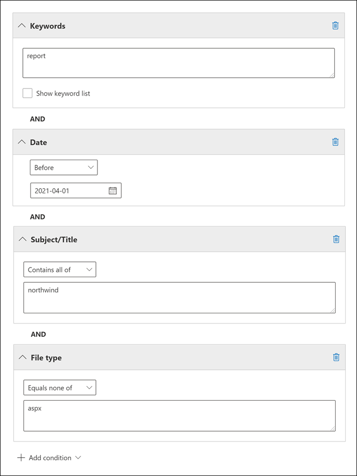

# <a name="keyword-queries-and-search-conditions-for-ediscovery"></a><span data-ttu-id="b46bf-103">Stichwortabfragen und Suchbedingungen für eDiscovery</span><span class="sxs-lookup"><span data-stu-id="b46bf-103">Keyword queries and search conditions for eDiscovery</span></span>

<span data-ttu-id="b46bf-104">In diesem Thema werden die E-Mail- und Dokumenteigenschaften beschrieben, nach denen Sie in E-Mail-Elementen suchen und Chatunterhaltungen in Exchange Online Microsoft Teams können, sowie Dokumente, die auf SharePoint und OneDrive for Business Websites mithilfe der eDiscovery-Suchtools im Microsoft 365 Compliance Center gespeichert sind.</span><span class="sxs-lookup"><span data-stu-id="b46bf-104">This topic describes the email and document properties that you can search for in email items and Microsoft Teams chat conversations in Exchange Online, and documents stored on SharePoint and OneDrive for Business sites using the eDiscovery search tools in the Microsoft 365 compliance center.</span></span> <span data-ttu-id="b46bf-105">Dazu gehören die Inhaltssuche, Core eDiscovery und Advanced eDiscovery (eDiscovery-Suchvorgänge in Advanced eDiscovery als *Sammlungen* bezeichnet werden).</span><span class="sxs-lookup"><span data-stu-id="b46bf-105">This includes Content search, Core eDiscovery, and Advanced eDiscovery (eDiscovery searches in Advanced eDiscovery are called *collections*).</span></span> <span data-ttu-id="b46bf-106">Sie können auch die **\* -ComplianceSearch-Cmdlets** in Security & Compliance Center PowerShell verwenden, um nach diesen Eigenschaften zu suchen.</span><span class="sxs-lookup"><span data-stu-id="b46bf-106">You can also use the **\*-ComplianceSearch** cmdlets in Security & Compliance Center PowerShell to search for these properties.</span></span> <span data-ttu-id="b46bf-107">In diesem Thema wird außerdem Folgendes beschrieben:</span><span class="sxs-lookup"><span data-stu-id="b46bf-107">The topic also describes:</span></span>
  
- <span data-ttu-id="b46bf-108">Verwenden von booleschen Suchoperatoren, Suchbedingungen und anderen Suchabfragetechniken, um Ihre Suchergebnisse zu verfeinern.</span><span class="sxs-lookup"><span data-stu-id="b46bf-108">Using Boolean search operators, search conditions, and other search query techniques to refine your search results.</span></span>

- <span data-ttu-id="b46bf-109">Suchen nach vertraulichen Datentypen und benutzerdefinierten vertraulichen Datentypen in SharePoint und OneDrive for Business.</span><span class="sxs-lookup"><span data-stu-id="b46bf-109">Searching for sensitive data types and custom sensitive data types in SharePoint and OneDrive for Business.</span></span>

- <span data-ttu-id="b46bf-110">Suchen nach Websiteinhalten, die für Benutzer außerhalb Ihrer Organisation freigegeben sind</span><span class="sxs-lookup"><span data-stu-id="b46bf-110">Searching for site content that's shared with users outside of your organization</span></span>

<span data-ttu-id="b46bf-111">Schritt-für-Schritt-Anleitungen zum Erstellen verschiedener eDiscovery-Suchvorgänge finden Sie unter:</span><span class="sxs-lookup"><span data-stu-id="b46bf-111">For step-by-step instructions on how to create different eDiscovery searches, see:</span></span>

- [<span data-ttu-id="b46bf-112">Inhaltssuche</span><span class="sxs-lookup"><span data-stu-id="b46bf-112">Content search</span></span>](content-search.md)

- [<span data-ttu-id="b46bf-113">Suchen nach Inhalten in Core eDiscovery</span><span class="sxs-lookup"><span data-stu-id="b46bf-113">Search for content in Core eDiscovery</span></span>](search-for-content-in-core-ediscovery.md)

- [<span data-ttu-id="b46bf-114">Erstellen einer Entwurfssammlung in Advanced eDiscovery</span><span class="sxs-lookup"><span data-stu-id="b46bf-114">Create a draft collection in Advanced eDiscovery</span></span>](create-draft-collection.md)

> [!NOTE]
> <span data-ttu-id="b46bf-115">eDiscovery-Suchvorgänge im Microsoft 365 Compliance Center und die entsprechenden **\* -ComplianceSearch-Cmdlets** in Security & Compliance Center PowerShell verwenden die Keyword Query Language (KQL).</span><span class="sxs-lookup"><span data-stu-id="b46bf-115">eDiscovery searches in the Microsoft 365 compliance center and the corresponding **\*-ComplianceSearch** cmdlets in Security & Compliance Center PowerShell use the Keyword Query Language (KQL).</span></span> <span data-ttu-id="b46bf-116">Ausführlichere Informationen finden Sie unter [Keyword Query Language Syntax Reference.](/sharepoint/dev/general-development/keyword-query-language-kql-syntax-reference)</span><span class="sxs-lookup"><span data-stu-id="b46bf-116">For more detailed information, see [Keyword Query Language syntax reference](/sharepoint/dev/general-development/keyword-query-language-kql-syntax-reference).</span></span>
  
## <a name="searchable-email-properties"></a><span data-ttu-id="b46bf-117">Durchsuchbare E-Mail-Eigenschaften</span><span class="sxs-lookup"><span data-stu-id="b46bf-117">Searchable email properties</span></span>

<span data-ttu-id="b46bf-118">In der folgenden Tabelle sind E-Mail-Nachrichteneigenschaften aufgeführt, die mithilfe der eDiscovery-Suchtools im Microsoft 365 Compliance Center oder mithilfe der **New-ComplianceSearch** oder des **Set-ComplianceSearch-Cmdlets** durchsucht werden können.</span><span class="sxs-lookup"><span data-stu-id="b46bf-118">The following table lists email message properties that can be searched by using the eDiscovery search tools in the Microsoft 365 compliance center or by using the **New-ComplianceSearch** or the **Set-ComplianceSearch** cmdlet.</span></span> <span data-ttu-id="b46bf-119">Die Tabelle enthält ein Beispiel für die  _property:value_-Syntax für jede Eigenschaft und eine Beschreibung der für jedes Beispiel zurückgegebenen Suchergebnisse.</span><span class="sxs-lookup"><span data-stu-id="b46bf-119">The table includes an example of the  _property:value_ syntax for each property and a description of the search results returned by the examples.</span></span> <span data-ttu-id="b46bf-120">Sie können diese  `property:value` Paare in das Schlüsselwörterfeld für eine eDiscovery-Suche eingeben.</span><span class="sxs-lookup"><span data-stu-id="b46bf-120">You can type these  `property:value` pairs in the keywords box for an eDiscovery search.</span></span> 

> [!NOTE]
> <span data-ttu-id="b46bf-121">Beim Durchsuchen von E-Mail-Eigenschaften ist es nicht möglich, nach Elementen zu suchen, in denen die angegebene Eigenschaft leer oder leer ist.</span><span class="sxs-lookup"><span data-stu-id="b46bf-121">When searching email properties, it's not possible to search for items in which the specified property is empty or blank.</span></span> <span data-ttu-id="b46bf-122">Wenn Sie z. B. das *"property:value"-Paar* **"betreff:""** verwenden, um nach E-Mail-Nachrichten mit einer leeren Betreffzeile zu suchen, werden keine Ergebnisse zurückgegeben.</span><span class="sxs-lookup"><span data-stu-id="b46bf-122">For example, using the *property:value* pair of **subject:""** to search for email messages with an empty subject line will return zero results.</span></span> <span data-ttu-id="b46bf-123">Dies gilt auch beim Durchsuchen von Website- und Kontakteigenschaften.</span><span class="sxs-lookup"><span data-stu-id="b46bf-123">This also applies when searching site and contact properties.</span></span>
  
| <span data-ttu-id="b46bf-124">Eigenschaft</span><span class="sxs-lookup"><span data-stu-id="b46bf-124">Property</span></span> | <span data-ttu-id="b46bf-125">Beschreibung der Eigenschaft</span><span class="sxs-lookup"><span data-stu-id="b46bf-125">Property description</span></span> | <span data-ttu-id="b46bf-126">Beispiele</span><span class="sxs-lookup"><span data-stu-id="b46bf-126">Examples</span></span> | <span data-ttu-id="b46bf-127">Von den Beispielen zurückgegebene Suchergebnisse</span><span class="sxs-lookup"><span data-stu-id="b46bf-127">Search results returned by the examples</span></span> |
|:-----|:-----|:-----|:-----|
|<span data-ttu-id="b46bf-128">AttachmentNames</span><span class="sxs-lookup"><span data-stu-id="b46bf-128">AttachmentNames</span></span>|<span data-ttu-id="b46bf-129">Die Namen der an eine E-Mail angefügten Dateien.</span><span class="sxs-lookup"><span data-stu-id="b46bf-129">The names of files attached to an email message.</span></span>|`attachmentnames:annualreport.ppt`  <br/> `attachmentnames:annual*` <br/> `attachmentnames:.pptx` |<span data-ttu-id="b46bf-130">Nachrichten, an die eine Datei namens Jahresbericht.ppt angehängt ist.</span><span class="sxs-lookup"><span data-stu-id="b46bf-130">Messages that have an attached file named annualreport.ppt.</span></span> <span data-ttu-id="b46bf-131">Im zweiten Beispiel werden mithilfe des Platzhalterzeichens ( \* ) Nachrichten mit dem Wort "annual" im Dateinamen einer Anlage zurückgegeben.</span><span class="sxs-lookup"><span data-stu-id="b46bf-131">In the second example, using the wildcard character ( \* ) returns messages with the word "annual" in the file name of an attachment.</span></span> <span data-ttu-id="b46bf-132">Im dritten Beispiel werden alle Anlagen mit der Dateinamenerweiterung pptx zurückgegeben.</span><span class="sxs-lookup"><span data-stu-id="b46bf-132">The third example returns all attachments with the pptx file extension.</span></span>|
|<span data-ttu-id="b46bf-133">Bcc</span><span class="sxs-lookup"><span data-stu-id="b46bf-133">Bcc</span></span>|<span data-ttu-id="b46bf-134">Das Bcc-Feld einer E-Mail-Nachricht. <sup>1</sup></span><span class="sxs-lookup"><span data-stu-id="b46bf-134">The Bcc field of an email message.<sup>1</sup></span></span>|`bcc:pilarp@contoso.com`  <br/> `bcc:pilarp`  <br/> `bcc:"Pilar Pinilla"`|<span data-ttu-id="b46bf-135">In allen Beispielen werden Nachrichten mit dem Namen "Pilar Pinilla" im Bcc-Feld zurückgegeben.</span><span class="sxs-lookup"><span data-stu-id="b46bf-135">All examples return messages with Pilar Pinilla included in the Bcc field.</span></span>|
|<span data-ttu-id="b46bf-136">Kategorie</span><span class="sxs-lookup"><span data-stu-id="b46bf-136">Category</span></span>| <span data-ttu-id="b46bf-137">Die Kategorien, nach denen gesucht wird.</span><span class="sxs-lookup"><span data-stu-id="b46bf-137">The categories to search.</span></span> <span data-ttu-id="b46bf-138">Kategorien können von Benutzern mithilfe von Outlook oder Outlook im Web (früher als Outlook Web App bezeichnet) definiert werden.</span><span class="sxs-lookup"><span data-stu-id="b46bf-138">Categories can be defined by users by using Outlook or Outlook on the web (formerly known as Outlook Web App).</span></span> <span data-ttu-id="b46bf-139">Die folgenden Werte sind möglich:</span><span class="sxs-lookup"><span data-stu-id="b46bf-139">The possible values are:</span></span>  <br/><br/>  <span data-ttu-id="b46bf-140">blau</span><span class="sxs-lookup"><span data-stu-id="b46bf-140">blue</span></span>  <br/>  <span data-ttu-id="b46bf-141">grün</span><span class="sxs-lookup"><span data-stu-id="b46bf-141">green</span></span>  <br/>  <span data-ttu-id="b46bf-142">orange</span><span class="sxs-lookup"><span data-stu-id="b46bf-142">orange</span></span>  <br/>  <span data-ttu-id="b46bf-143">violett</span><span class="sxs-lookup"><span data-stu-id="b46bf-143">purple</span></span>  <br/>  <span data-ttu-id="b46bf-144">rot</span><span class="sxs-lookup"><span data-stu-id="b46bf-144">red</span></span>  <br/>  <span data-ttu-id="b46bf-145">gelb</span><span class="sxs-lookup"><span data-stu-id="b46bf-145">yellow</span></span>|`category:"Red Category"`|<span data-ttu-id="b46bf-146">Nachrichten, denen in den Quellpostfächern die rote Kategorie zugewiesen wurde.</span><span class="sxs-lookup"><span data-stu-id="b46bf-146">Messages that have been assigned the red category in the source mailboxes.</span></span>|
|<span data-ttu-id="b46bf-147">Cc</span><span class="sxs-lookup"><span data-stu-id="b46bf-147">Cc</span></span>|<span data-ttu-id="b46bf-148">Das Feld "Cc" einer E-Mail-Nachricht. <sup>1</sup></span><span class="sxs-lookup"><span data-stu-id="b46bf-148">The Cc field of an email message.<sup>1</sup></span></span>|`cc:pilarp@contoso.com`  <br/> `cc:"Pilar Pinilla"`|<span data-ttu-id="b46bf-149">In beiden Beispielen werden Nachrichten mit Pilar Pinilla im Feld "Cc" angegeben.</span><span class="sxs-lookup"><span data-stu-id="b46bf-149">In both examples, messages with Pilar Pinilla specified in the Cc field.</span></span>|
|<span data-ttu-id="b46bf-150">Folderid</span><span class="sxs-lookup"><span data-stu-id="b46bf-150">Folderid</span></span>|<span data-ttu-id="b46bf-151">Die Ordner-ID (GUID) eines bestimmten Postfachordners.</span><span class="sxs-lookup"><span data-stu-id="b46bf-151">The folder ID (GUID) of a specific mailbox folder.</span></span> <span data-ttu-id="b46bf-152">Wenn Sie diese Eigenschaft verwenden, müssen Sie das Postfach durchsuchen, in dem sich der angegebene Ordner befindet.</span><span class="sxs-lookup"><span data-stu-id="b46bf-152">If you use this property, be sure to search the mailbox that the specified folder is located in.</span></span> <span data-ttu-id="b46bf-153">Nur der angegebene Ordner wird durchsucht.</span><span class="sxs-lookup"><span data-stu-id="b46bf-153">Only the specified folder will be searched.</span></span> <span data-ttu-id="b46bf-154">Alle Unterordner im Ordner werden nicht durchsucht.</span><span class="sxs-lookup"><span data-stu-id="b46bf-154">Any subfolders in the folder won't be searched.</span></span> <span data-ttu-id="b46bf-155">Zum Durchsuchen von Unterordnern müssen Sie die Folderid-Eigenschaft für den Unterordner verwenden, den Sie durchsuchen möchten.</span><span class="sxs-lookup"><span data-stu-id="b46bf-155">To search subfolders, you need to use the Folderid property for the subfolder you want to search.</span></span>  <br/> <span data-ttu-id="b46bf-156">Weitere Informationen zum Suchen nach der Folderid-Eigenschaft und zum Verwenden eines Skripts zum Abrufen der Ordner-IDs für ein bestimmtes Postfach finden Sie unter Verwenden der [Inhaltssuche für gezielte Sammlungen.](use-content-search-for-targeted-collections.md)</span><span class="sxs-lookup"><span data-stu-id="b46bf-156">For more information about searching for the Folderid property and using a script to obtain the folder IDs for a specific mailbox, see [Use Content search for targeted collections](use-content-search-for-targeted-collections.md).</span></span>|`folderid:4D6DD7F943C29041A65787E30F02AD1F00000000013A0000`  <br/> `folderid:2370FB455F82FC44BE31397F47B632A70000000001160000 AND participants:garthf@contoso.com`|<span data-ttu-id="b46bf-157">Im ersten Beispiel werden alle Elemente im angegebenen Postfachordner zurückgegeben.</span><span class="sxs-lookup"><span data-stu-id="b46bf-157">The first example returns all items in the specified mailbox folder.</span></span> <span data-ttu-id="b46bf-158">Im zweiten Beispiel werden alle Elemente im angegebenen Postfachordner zurückgegeben, die von garthf@contoso.com gesendet oder empfangen wurden.</span><span class="sxs-lookup"><span data-stu-id="b46bf-158">The second example returns all items in the specified mailbox folder that were sent or received by garthf@contoso.com.</span></span>|
|<span data-ttu-id="b46bf-159">Von</span><span class="sxs-lookup"><span data-stu-id="b46bf-159">From</span></span>|<span data-ttu-id="b46bf-160">Der Absender einer E-Mail-Nachricht.<sup>1</sup></span><span class="sxs-lookup"><span data-stu-id="b46bf-160">The sender of an email message.<sup>1</sup></span></span>|`from:pilarp@contoso.com`  <br/> `from:contoso.com`|<span data-ttu-id="b46bf-161">Nachrichten, die vom angegebenen Benutzer oder einer bestimmten Domäne gesendet wurden.</span><span class="sxs-lookup"><span data-stu-id="b46bf-161">Messages sent by the specified user or sent from a specified domain.</span></span>|
|<span data-ttu-id="b46bf-162">HasAttachment</span><span class="sxs-lookup"><span data-stu-id="b46bf-162">HasAttachment</span></span>|<span data-ttu-id="b46bf-163">Gibt an, ob eine Nachricht über eine Anlage verfügt.</span><span class="sxs-lookup"><span data-stu-id="b46bf-163">Indicates whether a message has an attachment.</span></span> <span data-ttu-id="b46bf-164">Verwenden Sie die Werte **"true"** oder **"false".**</span><span class="sxs-lookup"><span data-stu-id="b46bf-164">Use the values **true** or **false**.</span></span>|`from:pilar@contoso.com AND hasattachment:true`|<span data-ttu-id="b46bf-165">Nachrichten, die vom angegebenen Benutzer mit Anlagen gesendet wurden.</span><span class="sxs-lookup"><span data-stu-id="b46bf-165">Messages sent by the specified user that have attachments.</span></span>|
|<span data-ttu-id="b46bf-166">Wichtigkeit</span><span class="sxs-lookup"><span data-stu-id="b46bf-166">Importance</span></span>|<span data-ttu-id="b46bf-p110">Die Wichtigkeit einer E-Mail-Nachricht, die ein Absender festlegen kann, wenn er eine Nachricht sendet. Standardmäßig werden Nachrichten mit normaler Wichtigkeit gesendet, außer wenn der Absender die Wichtigkeit auf **Hoch** oder **Niedrig** setzt.  </span><span class="sxs-lookup"><span data-stu-id="b46bf-p110">The importance of an email message, which a sender can specify when sending a message. By default, messages are sent with normal importance, unless the sender sets the importance as **high** or **low**.</span></span>|`importance:high`  <br/> `importance:medium`  <br/> `importance:low`|<span data-ttu-id="b46bf-169">Nachrichten, deren Wichtigkeit auf "Hoch", "Mittel" bzw. "Niedrig" eingestellt ist.</span><span class="sxs-lookup"><span data-stu-id="b46bf-169">Messages that are marked as high importance, medium importance, or low importance.</span></span>|
|<span data-ttu-id="b46bf-170">IsRead</span><span class="sxs-lookup"><span data-stu-id="b46bf-170">IsRead</span></span>|<span data-ttu-id="b46bf-171">Gibt an, ob Nachrichten gelesen wurden.</span><span class="sxs-lookup"><span data-stu-id="b46bf-171">Indicates whether messages have been read.</span></span> <span data-ttu-id="b46bf-172">Verwenden Sie die Werte **"true"** oder **"false".**</span><span class="sxs-lookup"><span data-stu-id="b46bf-172">Use the values **true** or **false**.</span></span>|`isread:true`  <br/> `isread:false`|<span data-ttu-id="b46bf-173">Im ersten Beispiel werden Nachrichten zurückgegeben, bei denen die IsRead-Eigenschaft auf **"True"** festgelegt ist.</span><span class="sxs-lookup"><span data-stu-id="b46bf-173">The first example returns messages with the IsRead property set to **True**.</span></span> <span data-ttu-id="b46bf-174">Im zweiten Beispiel werden Nachrichten zurückgegeben, bei denen die IsRead-Eigenschaft auf **"False"** festgelegt ist.</span><span class="sxs-lookup"><span data-stu-id="b46bf-174">The second example returns messages with the IsRead property set to **False**.</span></span>|
|<span data-ttu-id="b46bf-175">ItemClass</span><span class="sxs-lookup"><span data-stu-id="b46bf-175">ItemClass</span></span>|<span data-ttu-id="b46bf-176">Verwenden Sie diese Eigenschaft, um bestimmte Datentypen von Drittanbietern zu durchsuchen, die Ihre Organisation in Office 365 importiert hat.</span><span class="sxs-lookup"><span data-stu-id="b46bf-176">Use this property to search specific third-party data types that your organization imported to Office 365.</span></span> <span data-ttu-id="b46bf-177">Verwenden Sie die folgende Syntax für diese Eigenschaft:  `itemclass:ipm.externaldata.<third-party data type>*`</span><span class="sxs-lookup"><span data-stu-id="b46bf-177">Use the following syntax for this property:  `itemclass:ipm.externaldata.<third-party data type>*`</span></span>|`itemclass:ipm.externaldata.Facebook* AND subject:contoso`  <br/> `itemclass:ipm.externaldata.Twitter* AND from:"Ann Beebe" AND "Northwind Traders"`|<span data-ttu-id="b46bf-178">Im ersten Beispiel werden Facebook-Elemente zurückgegeben, die das Wort "contoso" in der Subject-Eigenschaft enthalten.</span><span class="sxs-lookup"><span data-stu-id="b46bf-178">The first example returns Facebook items that contain the word "contoso" in the Subject property.</span></span> <span data-ttu-id="b46bf-179">Das zweite Beispiel gibt Twitter-Elemente zurück, die von Ann Beebe gepostet wurden und den Schlüsselwortsatz "Northwind-Händler" enthalten.</span><span class="sxs-lookup"><span data-stu-id="b46bf-179">The second example returns Twitter items that were posted by Ann Beebe and that contain the keyword phrase "Northwind Traders".</span></span>  <br/> <span data-ttu-id="b46bf-180">Eine vollständige Liste der Werte, die für Datentypen von Drittanbietern für die ItemClass-Eigenschaft verwendet werden sollen, finden Sie unter Verwenden der [Inhaltssuche, um Daten von Drittanbietern zu durchsuchen, die in Office 365 importiert wurden.](use-content-search-to-search-third-party-data-that-was-imported.md)</span><span class="sxs-lookup"><span data-stu-id="b46bf-180">For a complete list of values to use for third-party data types for the ItemClass property, see [Use Content search to search third-party data that was imported to Office 365](use-content-search-to-search-third-party-data-that-was-imported.md).</span></span>|
|<span data-ttu-id="b46bf-181">Art</span><span class="sxs-lookup"><span data-stu-id="b46bf-181">Kind</span></span>| <span data-ttu-id="b46bf-182">Der Typ der E-Mail-Nachricht, nach der gesucht werden soll.</span><span class="sxs-lookup"><span data-stu-id="b46bf-182">The type of email message to search for.</span></span> <span data-ttu-id="b46bf-183">Mögliche Werte:</span><span class="sxs-lookup"><span data-stu-id="b46bf-183">Possible values:</span></span>  <br/>  <span data-ttu-id="b46bf-184">contacts</span><span class="sxs-lookup"><span data-stu-id="b46bf-184">contacts</span></span>  <br/>  <span data-ttu-id="b46bf-185">docs</span><span class="sxs-lookup"><span data-stu-id="b46bf-185">docs</span></span>  <br/>  <span data-ttu-id="b46bf-186">email</span><span class="sxs-lookup"><span data-stu-id="b46bf-186">email</span></span>  <br/>  <span data-ttu-id="b46bf-187">Externe Daten</span><span class="sxs-lookup"><span data-stu-id="b46bf-187">externaldata</span></span>  <br/>  <span data-ttu-id="b46bf-188">faxes</span><span class="sxs-lookup"><span data-stu-id="b46bf-188">faxes</span></span>  <br/>  <span data-ttu-id="b46bf-189">im</span><span class="sxs-lookup"><span data-stu-id="b46bf-189">im</span></span>  <br/>  <span data-ttu-id="b46bf-190">journals</span><span class="sxs-lookup"><span data-stu-id="b46bf-190">journals</span></span>  <br/>  <span data-ttu-id="b46bf-191">meetings</span><span class="sxs-lookup"><span data-stu-id="b46bf-191">meetings</span></span>  <br/>  <span data-ttu-id="b46bf-192">microsoftteams (gibt Elemente aus Chats, Besprechungen und Anrufen in Microsoft Teams zurück)</span><span class="sxs-lookup"><span data-stu-id="b46bf-192">microsoftteams (returns items from chats, meetings, and calls in Microsoft Teams)</span></span>  <br/>  <span data-ttu-id="b46bf-193">notes</span><span class="sxs-lookup"><span data-stu-id="b46bf-193">notes</span></span>  <br/>  <span data-ttu-id="b46bf-194">posts</span><span class="sxs-lookup"><span data-stu-id="b46bf-194">posts</span></span>  <br/>  <span data-ttu-id="b46bf-195">rssfeeds</span><span class="sxs-lookup"><span data-stu-id="b46bf-195">rssfeeds</span></span>  <br/>  <span data-ttu-id="b46bf-196">tasks</span><span class="sxs-lookup"><span data-stu-id="b46bf-196">tasks</span></span>  <br/>  <span data-ttu-id="b46bf-197">voicemail</span><span class="sxs-lookup"><span data-stu-id="b46bf-197">voicemail</span></span>|`kind:email`  <br/> `kind:email OR kind:im OR kind:voicemail`  <br/> `kind:externaldata`|<span data-ttu-id="b46bf-198">Im ersten Beispiel werden E-Mail-Nachrichten zurückgegeben, die den Suchkriterien entsprechen.</span><span class="sxs-lookup"><span data-stu-id="b46bf-198">The first example returns email messages that meet the search criteria.</span></span> <span data-ttu-id="b46bf-199">Im zweiten Beispiel werden E-Mail-Nachrichten, Chatunterhaltungen (einschließlich Skype for Business Unterhaltungen und Chats in Microsoft Teams) und Sprachnachrichten zurückgegeben, die die Suchkriterien erfüllen.</span><span class="sxs-lookup"><span data-stu-id="b46bf-199">The second example returns email messages, instant messaging conversations (including Skype for Business conversations and chats in Microsoft Teams), and voice messages that meet the search criteria.</span></span> <span data-ttu-id="b46bf-200">Im dritten Beispiel werden Elemente zurückgegeben, die in Postfächer in Microsoft 365 aus Datenquellen von Drittanbietern importiert wurden, z. B. Twitter, Facebook und Cisco Jabber, die die Suchkriterien erfüllen.</span><span class="sxs-lookup"><span data-stu-id="b46bf-200">The third example returns items that were imported to mailboxes in Microsoft 365 from third-party data sources, such as Twitter, Facebook, and Cisco Jabber, that meet the search criteria.</span></span> <span data-ttu-id="b46bf-201">Weitere Informationen finden Sie unter Archivierung von [Drittanbieterdaten in Office 365.](https://www.microsoft.com/?ref=go)</span><span class="sxs-lookup"><span data-stu-id="b46bf-201">For more information, see [Archiving third-party data in Office 365](https://www.microsoft.com/?ref=go).</span></span>|
|<span data-ttu-id="b46bf-202">Teilnehmer</span><span class="sxs-lookup"><span data-stu-id="b46bf-202">Participants</span></span>|<span data-ttu-id="b46bf-203">Alle Personenfelder in einer E-Mail-Nachricht.</span><span class="sxs-lookup"><span data-stu-id="b46bf-203">All the people fields in an email message.</span></span> <span data-ttu-id="b46bf-204">Diese Felder sind From, To, Cc und Bcc.<sup>1</sup></span><span class="sxs-lookup"><span data-stu-id="b46bf-204">These fields are From, To, Cc, and Bcc.<sup>1</sup></span></span>|`participants:garthf@contoso.com`  <br/> `participants:contoso.com`|<span data-ttu-id="b46bf-p118">Nachrichten, die von oder an garthf@contoso.com gesendet wurden. Im zweiten Beispiel werden alle Nachrichten zurückgegeben, die von oder an einen Benutzer in der Domäne contoso.com gesendet wurden.</span><span class="sxs-lookup"><span data-stu-id="b46bf-p118">Messages sent by or sent to garthf@contoso.com. The second example returns all messages sent by or sent to a user in the contoso.com domain.</span></span>|
|<span data-ttu-id="b46bf-207">Empfangen</span><span class="sxs-lookup"><span data-stu-id="b46bf-207">Received</span></span>|<span data-ttu-id="b46bf-208">Das Datum, an dem eine E-Mail-Nachricht von einem Empfänger empfangen wurde.</span><span class="sxs-lookup"><span data-stu-id="b46bf-208">The date that an email message was received by a recipient.</span></span>|`received:04/15/2016`  <br/> `received>=01/01/2016 AND received<=03/31/2016`|<span data-ttu-id="b46bf-209">Nachrichten, die am 15. April 2016 empfangen wurden.</span><span class="sxs-lookup"><span data-stu-id="b46bf-209">Messages that were received on April 15, 2016.</span></span> <span data-ttu-id="b46bf-210">Im zweiten Beispiel werden alle Nachrichten zurückgegeben, die zwischen dem 1. Januar 2016 und dem 31. März 2016 empfangen wurden.</span><span class="sxs-lookup"><span data-stu-id="b46bf-210">The second example returns all messages received between January 1, 2016 and March 31, 2016.</span></span>|
|<span data-ttu-id="b46bf-211">Empfänger</span><span class="sxs-lookup"><span data-stu-id="b46bf-211">Recipients</span></span>|<span data-ttu-id="b46bf-212">Alle Empfängerfelder in einer E-Mail-Nachricht.</span><span class="sxs-lookup"><span data-stu-id="b46bf-212">All recipient fields in an email message.</span></span> <span data-ttu-id="b46bf-213">Diese Felder sind "An", "Cc" und "Bcc".<sup>1</sup></span><span class="sxs-lookup"><span data-stu-id="b46bf-213">These fields are To, Cc, and Bcc.<sup>1</sup></span></span>|`recipients:garthf@contoso.com`  <br/> `recipients:contoso.com`|<span data-ttu-id="b46bf-p121">Nachrichten, die an garthf@contoso.com gesendet wurden. Im zweiten Beispiel werden Nachrichten zurückgegeben, die an einen Empfänger in der Domäne contoso.com gesendet wurden.</span><span class="sxs-lookup"><span data-stu-id="b46bf-p121">Messages sent to garthf@contoso.com. The second example returns messages sent to any recipient in the contoso.com domain.</span></span>|
|<span data-ttu-id="b46bf-216">Gesendet</span><span class="sxs-lookup"><span data-stu-id="b46bf-216">Sent</span></span>|<span data-ttu-id="b46bf-217">Das Datum, an dem eine E-Mail vom Absender gesendet wurde.</span><span class="sxs-lookup"><span data-stu-id="b46bf-217">The date that an email message was sent by the sender.</span></span>|`sent:07/01/2016`  <br/> `sent>=06/01/2016 AND sent<=07/01/2016`|<span data-ttu-id="b46bf-218">Nachrichten, die am angegebenen Tag oder im angegebenen Datumsbereich gesendet wurden.</span><span class="sxs-lookup"><span data-stu-id="b46bf-218">Messages that were sent on the specified date or sent within the specified date range.</span></span>|
|<span data-ttu-id="b46bf-219">Größe</span><span class="sxs-lookup"><span data-stu-id="b46bf-219">Size</span></span>|<span data-ttu-id="b46bf-220">Die Größe eines Elements in Byte.</span><span class="sxs-lookup"><span data-stu-id="b46bf-220">The size of an item, in bytes.</span></span>|`size>26214400`  <br/> `size:1..1048567`|<span data-ttu-id="b46bf-221">Nachrichten mit mehr als 25 MB.</span><span class="sxs-lookup"><span data-stu-id="b46bf-221">Messages larger than 25 MB.</span></span> <span data-ttu-id="b46bf-222">Im zweiten Beispiel werden Nachrichten zwischen 1 und 1.048.567 Bytes (1 MB) zurückgegeben.</span><span class="sxs-lookup"><span data-stu-id="b46bf-222">The second example returns messages from 1 through 1,048,567 bytes (1 MB) in size.</span></span>|
|<span data-ttu-id="b46bf-223">Betreff</span><span class="sxs-lookup"><span data-stu-id="b46bf-223">Subject</span></span>|<span data-ttu-id="b46bf-224">Der Text in der Betreffzeile einer E-Mail.</span><span class="sxs-lookup"><span data-stu-id="b46bf-224">The text in the subject line of an email message.</span></span>  <br/> <span data-ttu-id="b46bf-225">**Hinweis:** Wenn Sie die Subject-Eigenschaft in einer Abfrage verwenden, gibt die Suche alle Nachrichten zurück, in denen die Betreffzeile den gesuchten Text enthält.</span><span class="sxs-lookup"><span data-stu-id="b46bf-225">**Note:** When you use the Subject property in a query, the search returns all messages in which the subject line contains the text you're searching for.</span></span> <span data-ttu-id="b46bf-226">Mit anderen Worten, die Abfrage gibt nicht nur die Nachrichten zurück, die eine genaue Übereinstimmung aufweisen.</span><span class="sxs-lookup"><span data-stu-id="b46bf-226">In other words, the query doesn't return only those messages that have an exact match.</span></span> <span data-ttu-id="b46bf-227">Wenn Sie beispielsweise  `subject:"Quarterly Financials"` suchen, enthalten Ihre Ergebnisse Nachrichten mit dem Betreff "Vierteljährliche Finanzen 2018".</span><span class="sxs-lookup"><span data-stu-id="b46bf-227">For example, if you search for  `subject:"Quarterly Financials"`, your results will include messages with the subject "Quarterly Financials 2018".</span></span>|`subject:"Quarterly Financials"`  <br/> `subject:northwind`|<span data-ttu-id="b46bf-228">Nachrichten, die den Ausdruck "Vierteljährliche Finanzen" an einer beliebigen Stelle im Text der Betreffzeile enthalten.</span><span class="sxs-lookup"><span data-stu-id="b46bf-228">Messages that contain the phrase "Quarterly Financials" anywhere in the text of the subject line.</span></span> <span data-ttu-id="b46bf-229">Im zweiten Beispiel werden alle Nachrichten mit dem Wort "northwind" in der Betreffzeile zurückgegeben.</span><span class="sxs-lookup"><span data-stu-id="b46bf-229">The second example returns all messages that contain the word northwind in the subject line.</span></span>|
|<span data-ttu-id="b46bf-230">An</span><span class="sxs-lookup"><span data-stu-id="b46bf-230">To</span></span>|<span data-ttu-id="b46bf-231">Das Feld „An" einer E-Mail-Nachricht.<sup>1</sup></span><span class="sxs-lookup"><span data-stu-id="b46bf-231">The To field of an email message.<sup>1</sup></span></span>|`to:annb@contoso.com`  <br/> `to:annb ` <br/> `to:"Ann Beebe"`|<span data-ttu-id="b46bf-232">In allen Beispielen wegen Nachrichten zurückgegeben, in deren Zeile "An" der Name "Ann Beebe" angegeben ist.</span><span class="sxs-lookup"><span data-stu-id="b46bf-232">All examples return messages where Ann Beebe is specified in the To: line.</span></span>|
|||||
   
> [!NOTE]
> <span data-ttu-id="b46bf-233"><sup>1</sup> Für den Wert einer Empfängereigenschaft können Sie die E-Mail-Adresse (auch *benutzerprinzipalname* oder UPN genannt), den Anzeigenamen oder den Alias verwenden, um einen Benutzer anzugeben.</span><span class="sxs-lookup"><span data-stu-id="b46bf-233"><sup>1</sup> For the value of a recipient property, you can use email address (also called *user principal name* or UPN), display name, or alias to specify a user.</span></span> <span data-ttu-id="b46bf-234">Sie können z. B. annb@contoso.com, Annb oder „Ann Beebe“ verwenden, um den Benutzer Ann Beebe anzugeben.</span><span class="sxs-lookup"><span data-stu-id="b46bf-234">For example, you can use annb@contoso.com, annb, or "Ann Beebe" to specify the user Ann Beebe.</span></span>

### <a name="recipient-expansion"></a><span data-ttu-id="b46bf-235">Empfängererweiterung</span><span class="sxs-lookup"><span data-stu-id="b46bf-235">Recipient expansion</span></span>

<span data-ttu-id="b46bf-236">Beim Durchsuchen einer der Empfängereigenschaften (From, To, Cc, Bcc, Participants und Recipients) versucht Microsoft 365, die Identität der einzelnen Benutzer zu erweitern, indem sie sie in Azure Active Directory (Azure AD) nachschlagen.</span><span class="sxs-lookup"><span data-stu-id="b46bf-236">When searching any of the recipient properties (From, To, Cc, Bcc, Participants, and Recipients), Microsoft 365 attempts to expand the identity of each user by looking them up in Azure Active Directory (Azure AD).</span></span>  <span data-ttu-id="b46bf-237">Wenn der Benutzer in Azure AD gefunden wird, wird die Abfrage erweitert, um die E-Mail-Adresse (oder UPN), den Alias, den Anzeigenamen und legacyExchangeDN des Benutzers einzuschließen.</span><span class="sxs-lookup"><span data-stu-id="b46bf-237">If the user is found in Azure AD, the query is expanded to include the user's email address (or UPN), alias, display name, and LegacyExchangeDN.</span></span> <span data-ttu-id="b46bf-238">Eine Abfrage wie z. B. wird z. `participants:ronnie@contoso.com` B. bis `participants:ronnie@contoso.com OR participants:ronnie OR participants:"Ronald Nelson" OR participants:"<LegacyExchangeDN>"` erweitert.</span><span class="sxs-lookup"><span data-stu-id="b46bf-238">For example, a query such as `participants:ronnie@contoso.com` expands to `participants:ronnie@contoso.com OR participants:ronnie OR participants:"Ronald Nelson" OR participants:"<LegacyExchangeDN>"`.</span></span>

<span data-ttu-id="b46bf-239">Um eine Empfängererweiterung zu verhindern, fügen Sie am Ende der E-Mail-Adresse ein Platzhalterzeichen (Sternchen) hinzu, und verwenden Sie einen reduzierten Domänennamen. Achten Sie beispielsweise `participants:"ronnie@contoso*"` darauf, die E-Mail-Adresse in doppelte Anführungszeichen einzuschließen.</span><span class="sxs-lookup"><span data-stu-id="b46bf-239">To prevent recipient expansion, add a wild card character (asterisk) to the end of the email address and use a reduced domain name; for example, `participants:"ronnie@contoso*"` Be sure to surround the email address with double quotation marks.</span></span>

<span data-ttu-id="b46bf-240">Beachten Sie jedoch, dass das Verhindern der Empfängererweiterung in der Suchabfrage dazu führen kann, dass relevante Elemente nicht in den Suchergebnissen zurückgegeben werden.</span><span class="sxs-lookup"><span data-stu-id="b46bf-240">However, be aware that preventing recipient expansion in the search query may result in relevant items not being returned in the search results.</span></span> <span data-ttu-id="b46bf-241">E-Mail-Nachrichten in Exchange können in verschiedenen Textformaten in den Empfängerfeldern gespeichert werden.</span><span class="sxs-lookup"><span data-stu-id="b46bf-241">Email messages in Exchange can be saved with different text formats in the recipient fields.</span></span> <span data-ttu-id="b46bf-242">Die Empfängererweiterung soll dazu beitragen, diese Tatsache zu mindern, indem Nachrichten zurückgegeben werden, die unterschiedliche Textformate enthalten können.</span><span class="sxs-lookup"><span data-stu-id="b46bf-242">Recipient expansion is intended to help mitigate this fact by returning messages that may contain different text formats.</span></span> <span data-ttu-id="b46bf-243">Das Verhindern der Empfängererweiterung kann dazu führen, dass die Suchabfrage nicht alle Elemente zurückgibt, die für Ihre Untersuchung relevant sein können.</span><span class="sxs-lookup"><span data-stu-id="b46bf-243">So preventing recipient expansion may result in the search query not returning all items that may be relevant to your investigation.</span></span>

> [!NOTE]
> <span data-ttu-id="b46bf-244">Wenn Sie die von einer Suchabfrage aufgrund der Empfängererweiterung zurückgegebenen Elemente überprüfen oder reduzieren müssen, sollten Sie Advanced eDiscovery verwenden.</span><span class="sxs-lookup"><span data-stu-id="b46bf-244">If you need to review or reduce the items returned by a search query due to recipient expansion, consider using Advanced eDiscovery.</span></span> <span data-ttu-id="b46bf-245">Sie können nach Nachrichten suchen (unter Nutzung der Empfängererweiterung), sie einem Prüfdateisatz hinzufügen und dann Prüfdateisatzabfragen oder Filter verwenden, um die Ergebnisse zu überprüfen oder einzugrenzen.</span><span class="sxs-lookup"><span data-stu-id="b46bf-245">You can search for messages (taking advantage of recipient expansion), add them to a review set, and then use review set queries or filters to review or narrow the results.</span></span> <span data-ttu-id="b46bf-246">Weitere Informationen finden Sie unter [Sammeln von Daten für einen Fall](collecting-data-for-ediscovery.md) und Abfragen der Daten in einem [Prüfdateisatz.](review-set-search.md)</span><span class="sxs-lookup"><span data-stu-id="b46bf-246">For more information, see [Collect data for a case](collecting-data-for-ediscovery.md) and [Query the data in a review set](review-set-search.md).</span></span>

## <a name="searchable-site-properties"></a><span data-ttu-id="b46bf-247">Durchsuchbare Websiteeigenschaften</span><span class="sxs-lookup"><span data-stu-id="b46bf-247">Searchable site properties</span></span>

<span data-ttu-id="b46bf-248">In der folgenden Tabelle sind einige der SharePoint und OneDrive for Business Eigenschaften aufgeführt, die mithilfe der eDiscovery-Suchtools im Microsoft 365 Compliance Center oder mithilfe der **New-ComplianceSearch** oder des **Set-ComplianceSearch-Cmdlets** durchsucht werden können.</span><span class="sxs-lookup"><span data-stu-id="b46bf-248">The following table lists some of the SharePoint and OneDrive for Business properties that can be searched by using the eDiscovery search tools in the Microsoft 365 compliance Center or by using the **New-ComplianceSearch** or the **Set-ComplianceSearch** cmdlet.</span></span> <span data-ttu-id="b46bf-249">Die Tabelle enthält ein Beispiel für die  _property:value_-Syntax für jede Eigenschaft und eine Beschreibung der für jedes Beispiel zurückgegebenen Suchergebnisse.</span><span class="sxs-lookup"><span data-stu-id="b46bf-249">The table includes an example of the  _property:value_ syntax for each property and a description of the search results returned by the examples.</span></span> 
  
<span data-ttu-id="b46bf-250">Eine vollständige Liste der SharePoint Eigenschaften, die durchsucht werden können, finden Sie unter [Übersicht über durchforstete und verwaltete Eigenschaften in SharePoint.](/SharePoint/technical-reference/crawled-and-managed-properties-overview)</span><span class="sxs-lookup"><span data-stu-id="b46bf-250">For a complete list of SharePoint properties that can be searched, see [Overview of crawled and managed properties in SharePoint](/SharePoint/technical-reference/crawled-and-managed-properties-overview).</span></span> <span data-ttu-id="b46bf-251">Eigenschaften, die in der Spalte **"Abfragbar"** mit **"Ja"** markiert sind, können durchsucht werden.</span><span class="sxs-lookup"><span data-stu-id="b46bf-251">Properties marked with a **Yes** in the **Queryable** column can be searched.</span></span>
  
| <span data-ttu-id="b46bf-252">Eigenschaft</span><span class="sxs-lookup"><span data-stu-id="b46bf-252">Property</span></span> | <span data-ttu-id="b46bf-253">Beschreibung der Eigenschaft</span><span class="sxs-lookup"><span data-stu-id="b46bf-253">Property description</span></span> | <span data-ttu-id="b46bf-254">Beispiel</span><span class="sxs-lookup"><span data-stu-id="b46bf-254">Example</span></span> | <span data-ttu-id="b46bf-255">Von den Beispielen zurückgegebene Suchergebnisse</span><span class="sxs-lookup"><span data-stu-id="b46bf-255">Search results returned by the examples</span></span> |
|:-----|:-----|:-----|:-----|
|<span data-ttu-id="b46bf-256">Ursprung</span><span class="sxs-lookup"><span data-stu-id="b46bf-256">Author</span></span>|<span data-ttu-id="b46bf-257">Das Feld "Autor" aus Office Dokumenten, das beim Kopieren eines Dokuments beibehalten wird.</span><span class="sxs-lookup"><span data-stu-id="b46bf-257">The author field from Office documents, which persists if a document is copied.</span></span> <span data-ttu-id="b46bf-258">Wenn ein Benutzer beispielsweise ein Dokument erstellt und die E-Mails an eine andere Person sendet, die es dann in SharePoint hochlädt, behält das Dokument den ursprünglichen Autor bei.</span><span class="sxs-lookup"><span data-stu-id="b46bf-258">For example, if a user creates a document and the emails it to someone else who then uploads it to SharePoint, the document will still retain the original author.</span></span> <span data-ttu-id="b46bf-259">Achten Sie darauf, den Anzeigenamen des Benutzers für diese Eigenschaft zu verwenden.</span><span class="sxs-lookup"><span data-stu-id="b46bf-259">Be sure to use the user's display name for this property.</span></span>|`author:"Garth Fort"`|<span data-ttu-id="b46bf-260">Alle Dokumente, die von Garth Fort erstellt wurden.</span><span class="sxs-lookup"><span data-stu-id="b46bf-260">All documents that are authored by Garth Fort.</span></span>|
|<span data-ttu-id="b46bf-261">ContentType</span><span class="sxs-lookup"><span data-stu-id="b46bf-261">ContentType</span></span>|<span data-ttu-id="b46bf-262">Die SharePoint Inhaltstyp eines Elements, z. B. "Element", "Dokument" oder "Video".</span><span class="sxs-lookup"><span data-stu-id="b46bf-262">The SharePoint content type of an item, such as Item, Document, or Video.</span></span>|`contenttype:document`|<span data-ttu-id="b46bf-263">Alle Dokumente würden zurückgegeben.</span><span class="sxs-lookup"><span data-stu-id="b46bf-263">All documents would be returned.</span></span>|
|<span data-ttu-id="b46bf-264">Erstellt</span><span class="sxs-lookup"><span data-stu-id="b46bf-264">Created</span></span>|<span data-ttu-id="b46bf-265">Das Erstellungsdatum eines Elements.</span><span class="sxs-lookup"><span data-stu-id="b46bf-265">The date that an item is created.</span></span>|`created>=06/01/2016`|<span data-ttu-id="b46bf-266">Alle Elemente, die am oder nach dem 1. Juni 2016 erstellt wurden.</span><span class="sxs-lookup"><span data-stu-id="b46bf-266">All items created on or after June 1, 2016.</span></span>|
|<span data-ttu-id="b46bf-267">CreatedBy</span><span class="sxs-lookup"><span data-stu-id="b46bf-267">CreatedBy</span></span>|<span data-ttu-id="b46bf-268">Die Person, die ein Element erstellt oder hochgeladen hat.</span><span class="sxs-lookup"><span data-stu-id="b46bf-268">The person that created or uploaded an item.</span></span> <span data-ttu-id="b46bf-269">Achten Sie darauf, den Anzeigenamen des Benutzers für diese Eigenschaft zu verwenden.</span><span class="sxs-lookup"><span data-stu-id="b46bf-269">Be sure to use the user's display name for this property.</span></span>|`createdby:"Garth Fort"`|<span data-ttu-id="b46bf-270">Alle von Garth Fort erstellten oder hochgeladenen Elemente.</span><span class="sxs-lookup"><span data-stu-id="b46bf-270">All items created or uploaded by Garth Fort.</span></span>|
|<span data-ttu-id="b46bf-271">DetectedLanguage</span><span class="sxs-lookup"><span data-stu-id="b46bf-271">DetectedLanguage</span></span>|<span data-ttu-id="b46bf-272">Die Sprache eines Elements.</span><span class="sxs-lookup"><span data-stu-id="b46bf-272">The language of an item.</span></span>|`detectedlanguage:english`|<span data-ttu-id="b46bf-273">Alle Elemente in Englisch.</span><span class="sxs-lookup"><span data-stu-id="b46bf-273">All items in English.</span></span>|
|<span data-ttu-id="b46bf-274">DocumentLink</span><span class="sxs-lookup"><span data-stu-id="b46bf-274">DocumentLink</span></span>|<span data-ttu-id="b46bf-275">Der Pfad (URL) eines bestimmten Ordners auf einer SharePoint oder OneDrive for Business Website.</span><span class="sxs-lookup"><span data-stu-id="b46bf-275">The path (URL) of a specific folder on a SharePoint or OneDrive for Business site.</span></span> <span data-ttu-id="b46bf-276">Wenn Sie diese Eigenschaft verwenden, müssen Sie die Website durchsuchen, in der sich der angegebene Ordner befindet.</span><span class="sxs-lookup"><span data-stu-id="b46bf-276">If you use this property, be sure to search the site that the specified folder is located in.</span></span>  <br/> <span data-ttu-id="b46bf-277">Um Elemente zurückzugeben, die sich in Unterordnern des Ordners befinden, den Sie für die documentlink-Eigenschaft angeben, müssen Sie \* der URL des angegebenen Ordners /hinzufügen, z. B.  `documentlink: "https://contoso.sharepoint.com/Shared Documents/*"`</span><span class="sxs-lookup"><span data-stu-id="b46bf-277">To return items located in subfolders of the folder that you specify for the documentlink property, you have to add /\* to the URL of the specified folder; for example,  `documentlink: "https://contoso.sharepoint.com/Shared Documents/*"`</span></span>  <br/> <br/><span data-ttu-id="b46bf-278">Weitere Informationen zum Suchen nach der documentlink-Eigenschaft und zum Verwenden eines Skripts zum Abrufen der Documentlink-URLs für Ordner auf einer bestimmten Website finden Sie unter Verwenden der [Inhaltssuche für Gezielte Sammlungen.](use-content-search-for-targeted-collections.md)</span><span class="sxs-lookup"><span data-stu-id="b46bf-278">For more information about searching for the documentlink property and using a script to obtain the documentlink URLs for folders on a specific site, see [Use Content search for targeted collections](use-content-search-for-targeted-collections.md).</span></span>|`documentlink:"https://contoso-my.sharepoint.com/personal/garthf_contoso_com/Documents/Private"`  <br/> `documentlink:"https://contoso-my.sharepoint.com/personal/garthf_contoso_com/Documents/Shared with Everyone/*" AND filename:confidential`|<span data-ttu-id="b46bf-279">Im ersten Beispiel werden alle Elemente im angegebenen OneDrive for Business Ordner zurückgegeben.</span><span class="sxs-lookup"><span data-stu-id="b46bf-279">The first example returns all items in the specified OneDrive for Business folder.</span></span> <span data-ttu-id="b46bf-280">Im zweiten Beispiel werden Dokumente im angegebenen Websiteordner (und allen Unterordnern) zurückgegeben, die das Wort "vertraulich" im Dateinamen enthalten.</span><span class="sxs-lookup"><span data-stu-id="b46bf-280">The second example returns documents in the specified site folder (and all subfolders) that contain the word "confidential" in the file name.</span></span>|
|<span data-ttu-id="b46bf-281">Fileextension</span><span class="sxs-lookup"><span data-stu-id="b46bf-281">FileExtension</span></span>|<span data-ttu-id="b46bf-282">Die Erweiterung einer Datei; z. B. docx, one, pptx oder xlsx.</span><span class="sxs-lookup"><span data-stu-id="b46bf-282">The extension of a file; for example, docx, one, pptx, or xlsx.</span></span>|`fileextension:xlsx`|<span data-ttu-id="b46bf-283">Alle Excel Dateien (Excel 2007 und höher)</span><span class="sxs-lookup"><span data-stu-id="b46bf-283">All Excel files (Excel 2007 and later)</span></span>|
|<span data-ttu-id="b46bf-284">FileName</span><span class="sxs-lookup"><span data-stu-id="b46bf-284">FileName</span></span>|<span data-ttu-id="b46bf-285">Der Name einer Datei.</span><span class="sxs-lookup"><span data-stu-id="b46bf-285">The name of a file.</span></span>|`filename:"marketing plan"`  <br/> `filename:estimate`|<span data-ttu-id="b46bf-286">Im ersten Beispiel werden Dateien mit dem exakten Ausdruck "Marketingplan" im Titel zurückgegeben.</span><span class="sxs-lookup"><span data-stu-id="b46bf-286">The first example returns files with the exact phrase "marketing plan" in the title.</span></span> <span data-ttu-id="b46bf-287">Im zweiten Beispiel werden Dateien mit dem Wort "estimate" im Dateinamen zurückgegeben.</span><span class="sxs-lookup"><span data-stu-id="b46bf-287">The second example returns files with the word "estimate" in the file name.</span></span>|
|<span data-ttu-id="b46bf-288">LastModifiedTime</span><span class="sxs-lookup"><span data-stu-id="b46bf-288">LastModifiedTime</span></span>|<span data-ttu-id="b46bf-289">Das Datum, an dem ein Element zuletzt geändert wurde.</span><span class="sxs-lookup"><span data-stu-id="b46bf-289">The date that an item was last changed.</span></span>|`lastmodifiedtime>=05/01/2016`  <br/> `lastmodifiedtime>=05/10/2016 AND lastmodifiedtime<=06/1/2016`|<span data-ttu-id="b46bf-290">Im ersten Beispiel werden Elemente zurückgegeben, die am oder nach dem 1. Mai 2016 geändert wurden.</span><span class="sxs-lookup"><span data-stu-id="b46bf-290">The first example returns items that were changed on or after May 1, 2016.</span></span> <span data-ttu-id="b46bf-291">Im zweiten Beispiel werden Elemente zurückgegeben, die zwischen dem 1. Mai 2016 und dem 1. Juni 2016 geändert wurden.</span><span class="sxs-lookup"><span data-stu-id="b46bf-291">The second example returns items changed between May 1, 2016 and June 1, 2016.</span></span>|
|<span data-ttu-id="b46bf-292">ModifiedBy</span><span class="sxs-lookup"><span data-stu-id="b46bf-292">ModifiedBy</span></span>|<span data-ttu-id="b46bf-293">Die Person, die ein Element zuletzt geändert hat.</span><span class="sxs-lookup"><span data-stu-id="b46bf-293">The person who last changed an item.</span></span> <span data-ttu-id="b46bf-294">Achten Sie darauf, den Anzeigenamen des Benutzers für diese Eigenschaft zu verwenden.</span><span class="sxs-lookup"><span data-stu-id="b46bf-294">Be sure to use the user's display name for this property.</span></span>|`modifiedby:"Garth Fort"`|<span data-ttu-id="b46bf-295">Alle Elemente, die zuletzt von Garth Fort geändert wurden.</span><span class="sxs-lookup"><span data-stu-id="b46bf-295">All items that were last changed by Garth Fort.</span></span>|
|<span data-ttu-id="b46bf-296">Pfad</span><span class="sxs-lookup"><span data-stu-id="b46bf-296">Path</span></span>|<span data-ttu-id="b46bf-297">Der Pfad (URL) einer bestimmten Website in einer SharePoint oder OneDrive for Business Website.</span><span class="sxs-lookup"><span data-stu-id="b46bf-297">The path (URL) of a specific site in a SharePoint or OneDrive for Business site.</span></span><br/><br/><span data-ttu-id="b46bf-298">Um nur Elemente von der angegebenen Website zurückzugeben, müssen Sie das nachstehende `/` Element am Ende der URL hinzufügen, z. B. `path: "https://contoso.sharepoint.com/sites/international/"`</span><span class="sxs-lookup"><span data-stu-id="b46bf-298">To return items only from the specified site, you have to add the trailing `/` to the end of the URL; for example, `path: "https://contoso.sharepoint.com/sites/international/"`</span></span> <br/><br/> <span data-ttu-id="b46bf-299">Um Elemente zurückzugeben, die sich in Ordnern auf der Website befinden, die Sie in der Pfadeigenschaft angeben, müssen Sie `/*` sie am Ende der URL hinzufügen, z. B.  `path: "https://contoso.sharepoint.com/Shared Documents/*"`</span><span class="sxs-lookup"><span data-stu-id="b46bf-299">To return items located in folders in the site that you specify in the path property, you have to add `/*` to the end of the URL; for example,  `path: "https://contoso.sharepoint.com/Shared Documents/*"`</span></span>  <br/><br/> <span data-ttu-id="b46bf-300">**Hinweis:** Wenn Sie die `Path` Eigenschaft verwenden, um OneDrive Speicherorte zu durchsuchen, werden keine Mediendateien wie .png-, TIFF- oder WAV-Dateien in den Suchergebnissen zurückgegeben.</span><span class="sxs-lookup"><span data-stu-id="b46bf-300">**Note:** Using the  `Path` property to search OneDrive locations won't return media files, such as .png, .tiff, or .wav files, in the search results.</span></span> <span data-ttu-id="b46bf-301">Verwenden Sie eine andere Websiteeigenschaft in Ihrer Suchabfrage, um nach Mediendateien in OneDrive Ordnern zu suchen.</span><span class="sxs-lookup"><span data-stu-id="b46bf-301">Use a different site property in your search query to search for media files in OneDrive folders.</span></span> <br/>|`path:"https://contoso-my.sharepoint.com/personal/garthf_contoso_com/"`  <br/> `path:"https://contoso-my.sharepoint.com/personal/garthf_contoso_com/*" AND filename:confidential`|<span data-ttu-id="b46bf-302">Im ersten Beispiel werden alle Elemente in der angegebenen OneDrive for Business Website zurückgegeben.</span><span class="sxs-lookup"><span data-stu-id="b46bf-302">The first example returns all items in the specified OneDrive for Business site.</span></span> <span data-ttu-id="b46bf-303">Im zweiten Beispiel werden Dokumente auf der angegebenen Website (und Ordner auf der Website) zurückgegeben, die das Wort "vertraulich" im Dateinamen enthalten.</span><span class="sxs-lookup"><span data-stu-id="b46bf-303">The second example returns documents in the specified site (and folders in the site) that contain the word "confidential" in the file name.</span></span>|
|<span data-ttu-id="b46bf-304">SharedWithUsersOWSUser</span><span class="sxs-lookup"><span data-stu-id="b46bf-304">SharedWithUsersOWSUser</span></span>|<span data-ttu-id="b46bf-305">Dokumente, die für den angegebenen Benutzer freigegeben und auf der Seite **"Für mich freigegeben"** auf der OneDrive for Business Website des Benutzers angezeigt wurden.</span><span class="sxs-lookup"><span data-stu-id="b46bf-305">Documents that have been shared with the specified user and displayed on the **Shared with me** page in the user's OneDrive for Business site.</span></span> <span data-ttu-id="b46bf-306">Hierbei handelt es sich um Dokumente, die von anderen Personen in Ihrer Organisation explizit für den angegebenen Benutzer freigegeben wurden.</span><span class="sxs-lookup"><span data-stu-id="b46bf-306">These are documents that have been explicitly shared with the specified user by other people in your organization.</span></span> <span data-ttu-id="b46bf-307">Wenn Sie Dokumente exportieren, die einer Suchabfrage entsprechen, die die SharedWithUsersOWSUser-Eigenschaft verwendet, werden die Dokumente aus dem ursprünglichen Inhaltsspeicherort der Person exportiert, die das Dokument für den angegebenen Benutzer freigegeben hat.</span><span class="sxs-lookup"><span data-stu-id="b46bf-307">When you export documents that match a search query that uses the SharedWithUsersOWSUser property, the documents are exported from the original content location of the person who shared the document with the specified user.</span></span> <span data-ttu-id="b46bf-308">Weitere Informationen finden Sie unter [Suchen nach Websiteinhalten, die in Ihrer Organisation freigegeben sind.](#searching-for-site-content-shared-within-your-organization)</span><span class="sxs-lookup"><span data-stu-id="b46bf-308">For more information, see [Searching for site content shared within your organization](#searching-for-site-content-shared-within-your-organization).</span></span>|`sharedwithusersowsuser:garthf`  <br/> `sharedwithusersowsuser:"garthf@contoso.com"`|<span data-ttu-id="b46bf-309">Beide Beispiele geben alle internen Dokumente zurück, die explizit für Garth Fort freigegeben wurden und auf der Seite **"Für mich freigegeben"** im OneDrive for Business-Konto von Garth Fort angezeigt werden.</span><span class="sxs-lookup"><span data-stu-id="b46bf-309">Both examples return all internal documents that have been explicitly shared with Garth Fort and that appear on the **Shared with me** page in Garth Fort's OneDrive for Business account.</span></span>|
|<span data-ttu-id="b46bf-310">Website</span><span class="sxs-lookup"><span data-stu-id="b46bf-310">Site</span></span>|<span data-ttu-id="b46bf-311">Die URL einer Website oder Gruppe von Websites in Ihrer Organisation.</span><span class="sxs-lookup"><span data-stu-id="b46bf-311">The URL of a site or group of sites in your organization.</span></span>|`site:"https://contoso-my.sharepoint.com"`  <br/> `site:"https://contoso.sharepoint.com/sites/teams"`|<span data-ttu-id="b46bf-312">Im ersten Beispiel werden Elemente aus den OneDrive for Business Websites für alle Benutzer in der Organisation zurückgegeben.</span><span class="sxs-lookup"><span data-stu-id="b46bf-312">The first example returns items from the OneDrive for Business sites for all users in the organization.</span></span> <span data-ttu-id="b46bf-313">Im zweiten Beispiel werden Elemente von allen Teamwebsites zurückgegeben.</span><span class="sxs-lookup"><span data-stu-id="b46bf-313">The second example returns items from all team sites.</span></span>|
|<span data-ttu-id="b46bf-314">Größe</span><span class="sxs-lookup"><span data-stu-id="b46bf-314">Size</span></span>|<span data-ttu-id="b46bf-315">Die Größe eines Elements in Byte.</span><span class="sxs-lookup"><span data-stu-id="b46bf-315">The size of an item, in bytes.</span></span>|`size>=1`  <br/> `size:1..10000`|<span data-ttu-id="b46bf-316">Im ersten Beispiel werden Elemente zurückgegeben, die größer als 1 Byte sind.</span><span class="sxs-lookup"><span data-stu-id="b46bf-316">The first example returns items larger than 1 byte.</span></span> <span data-ttu-id="b46bf-317">Im zweiten Beispiel werden Elemente mit einer Größe von 1 bis 10.000 Byte zurückgegeben.</span><span class="sxs-lookup"><span data-stu-id="b46bf-317">The second example returns items from 1 through 10,000 bytes in size.</span></span>|
|<span data-ttu-id="b46bf-318">Titel</span><span class="sxs-lookup"><span data-stu-id="b46bf-318">Title</span></span>|<span data-ttu-id="b46bf-319">Der Titel des Dokuments.</span><span class="sxs-lookup"><span data-stu-id="b46bf-319">The title of the document.</span></span> <span data-ttu-id="b46bf-320">Die Title-Eigenschaft ist Metadaten, die in Microsoft Office Dokumenten angegeben sind.</span><span class="sxs-lookup"><span data-stu-id="b46bf-320">The Title property is metadata that's specified in Microsoft Office documents.</span></span> <span data-ttu-id="b46bf-321">Sie unterscheidet sich vom Dateinamen des Dokuments.</span><span class="sxs-lookup"><span data-stu-id="b46bf-321">It's different from the file name of the document.</span></span>|`title:"communication plan"`|<span data-ttu-id="b46bf-322">Jedes Dokument, das den Ausdruck "Kommunikationsplan" in der Title-Metadateneigenschaft eines Office Dokuments enthält.</span><span class="sxs-lookup"><span data-stu-id="b46bf-322">Any document that contains the phrase "communication plan" in the Title metadata property of an Office document.</span></span>|
|||||

## <a name="searchable-contact-properties"></a><span data-ttu-id="b46bf-323">Durchsuchbare Kontakteigenschaften</span><span class="sxs-lookup"><span data-stu-id="b46bf-323">Searchable contact properties</span></span>

<span data-ttu-id="b46bf-324">In der folgenden Tabelle sind die Kontakteigenschaften aufgeführt, die indiziert sind und nach denen Sie mithilfe von eDiscovery-Suchtools suchen können.</span><span class="sxs-lookup"><span data-stu-id="b46bf-324">The following table lists the contact properties that are indexed and that you can search for using eDiscovery search tools.</span></span> <span data-ttu-id="b46bf-325">Dies sind die Eigenschaften, die Benutzer für die Kontakte (auch als persönliche Kontakte bezeichnet) konfigurieren können, die sich im persönlichen Adressbuch des Postfachs eines Benutzers befinden.</span><span class="sxs-lookup"><span data-stu-id="b46bf-325">These are the properties that are available for users to configure for the contacts (also called personal contacts) that are located in the personal address book of a user's mailbox.</span></span> <span data-ttu-id="b46bf-326">Um nach Kontakten zu suchen, können Sie die zu durchsuchenden Postfächer auswählen und dann eine oder mehrere Kontakteigenschaften in der Stichwortabfrage verwenden.</span><span class="sxs-lookup"><span data-stu-id="b46bf-326">To search for contacts, you can select the mailboxes to search and then use one or more contact properties in the keyword query.</span></span>
  
> [!TIP]
> <span data-ttu-id="b46bf-327">Um nach Werten zu suchen, die Leerzeichen oder Sonderzeichen enthalten, verwenden Sie doppelte Anführungszeichen (" ") für den Ausdruck. Beispiel: `businessaddress:"123 Main Street"` .</span><span class="sxs-lookup"><span data-stu-id="b46bf-327">To search for values that contain spaces or special characters, use double quotation marks ("  ") to contain the phrase; for example, `businessaddress:"123 Main Street"`.</span></span>
  
|<span data-ttu-id="b46bf-328">Eigenschaft</span><span class="sxs-lookup"><span data-stu-id="b46bf-328">Property</span></span> |<span data-ttu-id="b46bf-329">Beschreibung der Eigenschaft</span><span class="sxs-lookup"><span data-stu-id="b46bf-329">Property description</span></span> |
|:-----|:-----|
|<span data-ttu-id="b46bf-330">BusinessAddress</span><span class="sxs-lookup"><span data-stu-id="b46bf-330">BusinessAddress</span></span>|<span data-ttu-id="b46bf-331">Die Adresse in der **Business Address-Eigenschaft.**</span><span class="sxs-lookup"><span data-stu-id="b46bf-331">The address in the **Business Address** property.</span></span> <span data-ttu-id="b46bf-332">Die Eigenschaft wird auch als **Arbeitsadresse** auf der Kontakteigenschaftenseite bezeichnet.</span><span class="sxs-lookup"><span data-stu-id="b46bf-332">The property is also called the **Work** address on the contact properties page.</span></span>|
|<span data-ttu-id="b46bf-333">BusinessPhone</span><span class="sxs-lookup"><span data-stu-id="b46bf-333">BusinessPhone</span></span>|<span data-ttu-id="b46bf-334">Die Telefonnummer in einer der **Eigenschaften "Business Telefon** Number".</span><span class="sxs-lookup"><span data-stu-id="b46bf-334">The phone number in any of the **Business Phone** number properties.</span></span>|
|<span data-ttu-id="b46bf-335">CompanyName</span><span class="sxs-lookup"><span data-stu-id="b46bf-335">CompanyName</span></span>|<span data-ttu-id="b46bf-336">Der Name in der **Eigenschaft "Company".**</span><span class="sxs-lookup"><span data-stu-id="b46bf-336">The name in the **Company** property.</span></span>|
|<span data-ttu-id="b46bf-337">Abteilung</span><span class="sxs-lookup"><span data-stu-id="b46bf-337">Department</span></span>|<span data-ttu-id="b46bf-338">Der Name in der **Department-Eigenschaft.**</span><span class="sxs-lookup"><span data-stu-id="b46bf-338">The name in the **Department** property.</span></span>|
|<span data-ttu-id="b46bf-339">DisplayName</span><span class="sxs-lookup"><span data-stu-id="b46bf-339">DisplayName</span></span>|<span data-ttu-id="b46bf-340">Der Anzeigename des Kontakts.</span><span class="sxs-lookup"><span data-stu-id="b46bf-340">The display name of the contact.</span></span> <span data-ttu-id="b46bf-341">Dies ist der Name in der **Eigenschaft "Vollständiger Name"** des Kontakts.</span><span class="sxs-lookup"><span data-stu-id="b46bf-341">This is the name in the **Full Name** property of the contact.</span></span>|
|<span data-ttu-id="b46bf-342">EmailAddress</span><span class="sxs-lookup"><span data-stu-id="b46bf-342">EmailAddress</span></span>|<span data-ttu-id="b46bf-343">Die Adresse für eine beliebige E-Mail-Adresseigenschaft für den Kontakt.</span><span class="sxs-lookup"><span data-stu-id="b46bf-343">The address for any email address property for the contact.</span></span> <span data-ttu-id="b46bf-344">Benutzer können mehrere E-Mail-Adressen für einen Kontakt hinzufügen.</span><span class="sxs-lookup"><span data-stu-id="b46bf-344">Users can add multiple email addresses for a contact.</span></span> <span data-ttu-id="b46bf-345">Wenn Sie diese Eigenschaft verwenden, werden Kontakte zurückgegeben, die einer der E-Mail-Adressen des Kontakts entsprechen.</span><span class="sxs-lookup"><span data-stu-id="b46bf-345">Using this property would return contacts that match any of the contact's email addresses.</span></span>|
|<span data-ttu-id="b46bf-346">FileAs</span><span class="sxs-lookup"><span data-stu-id="b46bf-346">FileAs</span></span>|<span data-ttu-id="b46bf-347">Die **Datei als** Eigenschaft.</span><span class="sxs-lookup"><span data-stu-id="b46bf-347">The **File as** property.</span></span> <span data-ttu-id="b46bf-348">Diese Eigenschaft wird verwendet, um anzugeben, wie der Kontakt in der Kontaktliste des Benutzers aufgeführt wird.</span><span class="sxs-lookup"><span data-stu-id="b46bf-348">This property is used to specify how the contact is listed in the user's contact list.</span></span> <span data-ttu-id="b46bf-349">Beispielsweise kann ein Kontakt als  *FirstName, LastName*  oder  *LastName,FirstName* aufgeführt werden.</span><span class="sxs-lookup"><span data-stu-id="b46bf-349">For example, a contact could be listed as  *FirstName,LastName*  or  *LastName,FirstName*.</span></span>|
|<span data-ttu-id="b46bf-350">GivenName</span><span class="sxs-lookup"><span data-stu-id="b46bf-350">GivenName</span></span>|<span data-ttu-id="b46bf-351">Der Name in der **First Name-Eigenschaft.**</span><span class="sxs-lookup"><span data-stu-id="b46bf-351">The name in the **First Name** property.</span></span>|
|<span data-ttu-id="b46bf-352">HomeAddress</span><span class="sxs-lookup"><span data-stu-id="b46bf-352">HomeAddress</span></span>|<span data-ttu-id="b46bf-353">Die Adresse in einer der **Home-Adresseigenschaften.**</span><span class="sxs-lookup"><span data-stu-id="b46bf-353">The address in any of the **Home** address properties.</span></span>|
|<span data-ttu-id="b46bf-354">HomePhone</span><span class="sxs-lookup"><span data-stu-id="b46bf-354">HomePhone</span></span>|<span data-ttu-id="b46bf-355">Die Telefonnummer in einer  der Eigenschaften der Privattelefonnummer.</span><span class="sxs-lookup"><span data-stu-id="b46bf-355">The phone number in any of the **Home** phone number properties.</span></span>|
|<span data-ttu-id="b46bf-356">IMAddress</span><span class="sxs-lookup"><span data-stu-id="b46bf-356">IMAddress</span></span>|<span data-ttu-id="b46bf-357">Die Chatadresseneigenschaft, bei der es sich in der Regel um eine E-Mail-Adresse handelt, die für Chatnachrichten verwendet wird.</span><span class="sxs-lookup"><span data-stu-id="b46bf-357">The IM address property, which is typically an email address used for instant messaging.</span></span>|
|<span data-ttu-id="b46bf-358">MiddleName</span><span class="sxs-lookup"><span data-stu-id="b46bf-358">MiddleName</span></span>|<span data-ttu-id="b46bf-359">Der Name in der **Eigenschaft "Zweiter** Vorname".</span><span class="sxs-lookup"><span data-stu-id="b46bf-359">The name in the **Middle** name property.</span></span>|
|<span data-ttu-id="b46bf-360">MobilePhone</span><span class="sxs-lookup"><span data-stu-id="b46bf-360">MobilePhone</span></span>|<span data-ttu-id="b46bf-361">Die Telefonnummer in der Eigenschaft **"Mobiltelefonnummer".**</span><span class="sxs-lookup"><span data-stu-id="b46bf-361">The phone number in the **Mobile** phone number property.</span></span>|
|<span data-ttu-id="b46bf-362">Spitzname</span><span class="sxs-lookup"><span data-stu-id="b46bf-362">Nickname</span></span>|<span data-ttu-id="b46bf-363">Der Name in der **Nickname-Eigenschaft.**</span><span class="sxs-lookup"><span data-stu-id="b46bf-363">The name in the **Nickname** property.</span></span>|
|<span data-ttu-id="b46bf-364">OfficeLocation</span><span class="sxs-lookup"><span data-stu-id="b46bf-364">OfficeLocation</span></span>|<span data-ttu-id="b46bf-365">Der Wert in **Office** oder **Office Location-Eigenschaft.**</span><span class="sxs-lookup"><span data-stu-id="b46bf-365">The value in **Office** or **Office location** property.</span></span>|
|<span data-ttu-id="b46bf-366">OtherAddress</span><span class="sxs-lookup"><span data-stu-id="b46bf-366">OtherAddress</span></span>|<span data-ttu-id="b46bf-367">Der Wert für die **Eigenschaft "Other** address".</span><span class="sxs-lookup"><span data-stu-id="b46bf-367">The value for the **Other** address property.</span></span>|
|<span data-ttu-id="b46bf-368">Nachname</span><span class="sxs-lookup"><span data-stu-id="b46bf-368">Surname</span></span>|<span data-ttu-id="b46bf-369">Der Name  in der Nachnameneigenschaft.</span><span class="sxs-lookup"><span data-stu-id="b46bf-369">The name in the **Last** name property.</span></span>|
|<span data-ttu-id="b46bf-370">Titel</span><span class="sxs-lookup"><span data-stu-id="b46bf-370">Title</span></span>|<span data-ttu-id="b46bf-371">Der Titel in der Eigenschaft **"Position".**</span><span class="sxs-lookup"><span data-stu-id="b46bf-371">The title in the **Job title** property.</span></span>|
|||||

## <a name="searchable-sensitive-data-types"></a><span data-ttu-id="b46bf-372">Durchsuchbare vertrauliche Datentypen</span><span class="sxs-lookup"><span data-stu-id="b46bf-372">Searchable sensitive data types</span></span>

<span data-ttu-id="b46bf-373">Sie können eDiscovery-Suchtools im Microsoft 365 Compliance Center verwenden, um nach vertraulichen Daten wie Kreditkartennummern oder Sozialversicherungsnummern zu suchen, die in Dokumenten auf SharePoint und OneDrive for Business Websites gespeichert sind.</span><span class="sxs-lookup"><span data-stu-id="b46bf-373">You can use eDiscovery search tools in the Microsoft 365 compliance center to search for sensitive data, such as credit card numbers or social security numbers, that is stored in documents on SharePoint and OneDrive for Business sites.</span></span> <span data-ttu-id="b46bf-374">Dazu können Sie die `SensitiveType` Eigenschaft und den Namen (oder die ID) eines vertraulichen Informationstyps in einer Stichwortabfrage verwenden.</span><span class="sxs-lookup"><span data-stu-id="b46bf-374">You can do this by using the `SensitiveType` property and the name (or ID) of a sensitive information type in a keyword query.</span></span> <span data-ttu-id="b46bf-375">Die Abfrage gibt beispielsweise `SensitiveType:"Credit Card Number"` Dokumente zurück, die eine Kreditkartennummer enthalten.</span><span class="sxs-lookup"><span data-stu-id="b46bf-375">For example, the query `SensitiveType:"Credit Card Number"` returns documents that contain a credit card number.</span></span> <span data-ttu-id="b46bf-376">Die Abfrage  `SensitiveType:"U.S. Social Security Number (SSN)"` gibt Dokumente zurück, die eine US-Sozialversicherungsnummer enthalten.</span><span class="sxs-lookup"><span data-stu-id="b46bf-376">The query  `SensitiveType:"U.S. Social Security Number (SSN)"` returns documents that contain a U.S. social security number.</span></span>

<span data-ttu-id="b46bf-377">Eine Liste der Typen vertraulicher Informationen, nach denen Sie suchen können, finden Sie unter **"Datenklassifizierungen** \> **vertraulicher Informationstypen"** im Microsoft 365 Compliance Center.</span><span class="sxs-lookup"><span data-stu-id="b46bf-377">To see a list of the sensitive information types that you can search for, go to **Data classifications** \> **Sensitive info types** in the Microsoft 365 compliance center.</span></span> <span data-ttu-id="b46bf-378">Sie können auch das Cmdlet **"Get-DlpSensitiveInformationType"** in Security & Compliance Center PowerShell verwenden, um eine Liste vertraulicher Informationstypen anzuzeigen.</span><span class="sxs-lookup"><span data-stu-id="b46bf-378">Or you can use the **Get-DlpSensitiveInformationType** cmdlet in Security & Compliance Center PowerShell to display a list of sensitive information types.</span></span>
  
<span data-ttu-id="b46bf-379">Weitere Informationen zum Erstellen von Abfragen mithilfe der `SensitiveType` Eigenschaft finden Sie unter [Formularieren einer Abfrage, um vertrauliche Daten zu finden, die auf Websites gespeichert sind.](form-a-query-to-find-sensitive-data-stored-on-sites.md)</span><span class="sxs-lookup"><span data-stu-id="b46bf-379">For more information about creating queries using the `SensitiveType` property, see [Form a query to find sensitive data stored on sites](form-a-query-to-find-sensitive-data-stored-on-sites.md).</span></span>

### <a name="limitations-for-searching-sensitive-data-types"></a><span data-ttu-id="b46bf-380">Einschränkungen für die Suche nach vertraulichen Datentypen</span><span class="sxs-lookup"><span data-stu-id="b46bf-380">Limitations for searching sensitive data types</span></span>

- <span data-ttu-id="b46bf-381">Um nach benutzerdefinierten Typen vertraulicher Informationen zu suchen, müssen Sie die ID des Typs für vertrauliche Informationen in der `SensitiveType` Eigenschaft angeben.</span><span class="sxs-lookup"><span data-stu-id="b46bf-381">To search for custom sensitive information types, you have to specify the ID of the sensitive information type in the `SensitiveType` property.</span></span> <span data-ttu-id="b46bf-382">Die Verwendung des Namens eines benutzerdefinierten vertraulichen Informationstyps (wie im Beispiel für integrierte Typen vertraulicher Informationen im vorherigen Abschnitt gezeigt) gibt keine Ergebnisse zurück.</span><span class="sxs-lookup"><span data-stu-id="b46bf-382">Using the name of a custom sensitive information type (as shown in the example for built-in sensitive information types in the previous section) will return no results.</span></span> <span data-ttu-id="b46bf-383">Verwenden Sie die **Spalte Publisher** auf der Seite **"Typen vertraulicher Informationen"** im Compliance Center (oder die **Publisher-Eigenschaft** in PowerShell), um zwischen integrierten und benutzerdefinierten Typen vertraulicher Informationen zu unterscheiden.</span><span class="sxs-lookup"><span data-stu-id="b46bf-383">Use the **Publisher** column on the **Sensitive info types** page in the compliance center (or the **Publisher** property in PowerShell) to differentiate between built-in and custom sensitive information types.</span></span> <span data-ttu-id="b46bf-384">Integrierte typen vertraulicher Daten weisen einen Wert `Microsoft Corporation` für die eigenschaft Publisher **auf.**</span><span class="sxs-lookup"><span data-stu-id="b46bf-384">Built-in sensitive data types have a value of `Microsoft Corporation` for the **Publisher** property.</span></span>

  <span data-ttu-id="b46bf-385">Um den Namen und die ID für die benutzerdefinierten typen vertraulicher Daten in Ihrer Organisation anzuzeigen, führen Sie den folgenden Befehl in Security & Compliance Center PowerShell aus:</span><span class="sxs-lookup"><span data-stu-id="b46bf-385">To display the name and ID for the custom sensitive data types in your organization, run the following command in Security & Compliance Center PowerShell:</span></span>

  ```powershell
  Get-DlpSensitiveInformationType | Where-Object {$_.Publisher -ne "Microsoft Corporation"} | FT Name,Id
  ```

  <span data-ttu-id="b46bf-386">Anschließend können Sie die ID in der `SensitiveType` Sucheigenschaft verwenden, um Dokumente zurückzugeben, die den benutzerdefinierten vertraulichen Datentyp enthalten, z. B. `SensitiveType:7e13277e-6b04-3b68-94ed-1aeb9d47de37`</span><span class="sxs-lookup"><span data-stu-id="b46bf-386">Then you can use the ID in the `SensitiveType` search property to return documents that contain the custom sensitive data type; for example, `SensitiveType:7e13277e-6b04-3b68-94ed-1aeb9d47de37`</span></span>
  
- <span data-ttu-id="b46bf-387">Sie können vertrauliche Informationstypen und die Sucheigenschaft nicht `SensitiveType` verwenden, um in Exchange Online Postfächern nach ruhenden vertraulichen Daten zu suchen.</span><span class="sxs-lookup"><span data-stu-id="b46bf-387">You can't use sensitive information types and the `SensitiveType` search property to search for sensitive data at-rest in Exchange Online mailboxes.</span></span> <span data-ttu-id="b46bf-388">Dazu gehören 1:1-Chatnachrichten, 1:N-Gruppenchatnachrichten und Teamkanalunterhaltungen in Microsoft Teams, da alle diese Inhalte in Postfächern gespeichert sind.</span><span class="sxs-lookup"><span data-stu-id="b46bf-388">This includes 1:1 chat messages, 1:N group chat messages, and team channel conversations in Microsoft teams because all of this content is stored in mailboxes.</span></span> <span data-ttu-id="b46bf-389">Sie können jedoch DLP-Richtlinien (Data Loss Prevention, Verhinderung von Datenverlust) verwenden, um vertrauliche E-Mail-Daten während der Übertragung zu schützen.</span><span class="sxs-lookup"><span data-stu-id="b46bf-389">However, you can use data loss prevention (DLP) policies to protect sensitive email data in transit.</span></span> <span data-ttu-id="b46bf-390">Weitere Informationen finden Sie unter ["Informationen zur Verhinderung von Datenverlust"](dlp-learn-about-dlp.md) und [zum Suchen nach personenbezogenen Daten.](/compliance/regulatory/gdpr)</span><span class="sxs-lookup"><span data-stu-id="b46bf-390">For more information, see [Learn about data loss prevention](dlp-learn-about-dlp.md) and [Search for and find personal data](/compliance/regulatory/gdpr).</span></span>
  
## <a name="search-operators"></a><span data-ttu-id="b46bf-391">Suchoperatoren</span><span class="sxs-lookup"><span data-stu-id="b46bf-391">Search operators</span></span>

<span data-ttu-id="b46bf-392">Boolesche Suchoperatoren wie **AND**, **OR** und **NOT** helfen Ihnen bei der Definition präziserer Suchvorgänge, indem bestimmte Wörter in die Suchabfrage eingeschlossen oder ausgeschlossen werden.</span><span class="sxs-lookup"><span data-stu-id="b46bf-392">Boolean search operators, such as **AND**, **OR**, and **NOT**, help you define more-precise searches by including or excluding specific words in the search query.</span></span> <span data-ttu-id="b46bf-393">Andere Techniken, z. B. die Verwendung von Eigenschaftsoperatoren (z. `>=` B. oder `..` ), Anführungszeichen, Klammern und Platzhaltern, helfen Ihnen bei der Verfeinerung einer Suchabfrage.</span><span class="sxs-lookup"><span data-stu-id="b46bf-393">Other techniques, such as using property operators (such as `>=` or `..`), quotation marks, parentheses, and wildcards, help you refine a search query.</span></span> <span data-ttu-id="b46bf-394">In der folgenden Tabelle sind die Operatoren aufgeführt, mit denen Sie Suchergebnisse eingrenzen oder erweitern können.</span><span class="sxs-lookup"><span data-stu-id="b46bf-394">The following table lists the operators that you can use to narrow or broaden search results.</span></span> 
  
|<span data-ttu-id="b46bf-395">Operator</span><span class="sxs-lookup"><span data-stu-id="b46bf-395">Operator</span></span> |<span data-ttu-id="b46bf-396">Verwendung</span><span class="sxs-lookup"><span data-stu-id="b46bf-396">Usage</span></span> |<span data-ttu-id="b46bf-397">Beschreibung</span><span class="sxs-lookup"><span data-stu-id="b46bf-397">Description</span></span> |
|:-----|:-----|:-----|
|<span data-ttu-id="b46bf-398">AND</span><span class="sxs-lookup"><span data-stu-id="b46bf-398">AND</span></span>|<span data-ttu-id="b46bf-399">Wort1 AND Wort2</span><span class="sxs-lookup"><span data-stu-id="b46bf-399">keyword1 AND keyword2</span></span>|<span data-ttu-id="b46bf-400">Gibt Elemente zurück, die alle angegebenen Schlüsselwörter oder  `property:value` Ausdrücke enthalten.</span><span class="sxs-lookup"><span data-stu-id="b46bf-400">Returns items that include all of the specified keywords or  `property:value` expressions.</span></span> <span data-ttu-id="b46bf-401">Würde beispielsweise  `from:"Ann Beebe" AND subject:northwind` alle von Ann Beebe gesendeten Nachrichten zurückgeben, die das Wort Nordwind in der Betreffzeile enthielten.</span><span class="sxs-lookup"><span data-stu-id="b46bf-401">For example,  `from:"Ann Beebe" AND subject:northwind` would return all messages sent by Ann Beebe that contained the word northwind in the subject line.</span></span> <span data-ttu-id="b46bf-402"><sup>2</sup></span><span class="sxs-lookup"><span data-stu-id="b46bf-402"><sup>2</sup></span></span>|
|+|<span data-ttu-id="b46bf-403">Schlüsselwort1 + Schlüsselwort2 + Schlüsselwort3</span><span class="sxs-lookup"><span data-stu-id="b46bf-403">keyword1 + keyword2 + keyword3</span></span>|<span data-ttu-id="b46bf-p155">Gibt die Elemente zurück, die  *entweder*  `keyword2` oder  `keyword3` *enthalten und*  , die ebenfalls  `keyword1` enthalten. Damit entspricht dieses Beispiel der Abfrage  `(keyword2 OR keyword3) AND keyword1`.  </span><span class="sxs-lookup"><span data-stu-id="b46bf-p155">Returns items that contain  *either*  `keyword2` or  `keyword3` *and*  that also contain  `keyword1`. Therefore, this example is equivalent to the query  `(keyword2 OR keyword3) AND keyword1`.  </span></span><br/> <span data-ttu-id="b46bf-406">Die Abfrage `keyword1 + keyword2` (mit einem Leerzeichen hinter dem Symbol) ist nicht identisch mit **+** der Verwendung des **AND-Operators.**</span><span class="sxs-lookup"><span data-stu-id="b46bf-406">The query  `keyword1 + keyword2` (with a space after the **+** symbol) isn't the same as using the **AND** operator.</span></span> <span data-ttu-id="b46bf-407">Diese Abfrage wäre gleichbedeutend mit  `"keyword1 + keyword2"` und gibt Elemente mit dem exakten Ausdruck  `"keyword1 + keyword2"` zurück.</span><span class="sxs-lookup"><span data-stu-id="b46bf-407">This query would be equivalent to  `"keyword1 + keyword2"` and return items with the exact phase  `"keyword1 + keyword2"`.</span></span>|
|<span data-ttu-id="b46bf-408">OR</span><span class="sxs-lookup"><span data-stu-id="b46bf-408">OR</span></span>|<span data-ttu-id="b46bf-409">Wort1 OR Wort2</span><span class="sxs-lookup"><span data-stu-id="b46bf-409">keyword1 OR keyword2</span></span>|<span data-ttu-id="b46bf-410">Gibt Elemente zurück, die mindestens eines der angegebenen Schlüsselwörter oder  `property:value` Ausdrücke enthalten.</span><span class="sxs-lookup"><span data-stu-id="b46bf-410">Returns items that include one or more of the specified keywords or  `property:value` expressions.</span></span> <span data-ttu-id="b46bf-411"><sup>2</sup></span><span class="sxs-lookup"><span data-stu-id="b46bf-411"><sup>2</sup></span></span>|
|<span data-ttu-id="b46bf-412">NOT</span><span class="sxs-lookup"><span data-stu-id="b46bf-412">NOT</span></span>|<span data-ttu-id="b46bf-413">Wort1 NOT Wort2</span><span class="sxs-lookup"><span data-stu-id="b46bf-413">keyword1 NOT keyword2</span></span>  <br/> <span data-ttu-id="b46bf-414">NOT Von:"Ann Beebe"</span><span class="sxs-lookup"><span data-stu-id="b46bf-414">NOT from:"Ann Beebe"</span></span>  <br/> <span data-ttu-id="b46bf-415">NOT kind:im</span><span class="sxs-lookup"><span data-stu-id="b46bf-415">NOT kind:im</span></span>|<span data-ttu-id="b46bf-416">Schließt elemente aus, die durch ein Schlüsselwort oder einen Ausdruck angegeben  `property:value` werden.</span><span class="sxs-lookup"><span data-stu-id="b46bf-416">Excludes items specified by a keyword or a  `property:value` expression.</span></span> <span data-ttu-id="b46bf-417">Im zweiten Beispiel werden von Ann Beebe gesendete Nachrichten ausgeschlossen.</span><span class="sxs-lookup"><span data-stu-id="b46bf-417">In the second example excludes messages sent by Ann Beebe.</span></span> <span data-ttu-id="b46bf-418">Im dritten Beispiel werden alle Chatunterhaltungen ausgeschlossen, z. B. Skype for Business Unterhaltungen, die im Postfachordner "Aufgezeichnete Unterhaltungen" gespeichert werden.</span><span class="sxs-lookup"><span data-stu-id="b46bf-418">The third example excludes any instant messaging conversations, such as Skype for Business conversations that are saved to the Conversation History mailbox folder.</span></span> <span data-ttu-id="b46bf-419"><sup>2</sup></span><span class="sxs-lookup"><span data-stu-id="b46bf-419"><sup>2</sup></span></span>|
|-|<span data-ttu-id="b46bf-420">Wort1 - Wort2</span><span class="sxs-lookup"><span data-stu-id="b46bf-420">keyword1 -keyword2</span></span>|<span data-ttu-id="b46bf-421">Identisch mit dem Operator **NOT**.</span><span class="sxs-lookup"><span data-stu-id="b46bf-421">The same as the **NOT** operator.</span></span> <span data-ttu-id="b46bf-422">Diese Abfrage gibt also Elemente zurück, die Elemente enthalten  `keyword1` und ausschließen würden, die  `keyword2` enthalten.</span><span class="sxs-lookup"><span data-stu-id="b46bf-422">So this query returns items that contain  `keyword1` and would exclude items that contain  `keyword2`.</span></span>|
|<span data-ttu-id="b46bf-423">NEAR</span><span class="sxs-lookup"><span data-stu-id="b46bf-423">NEAR</span></span>|<span data-ttu-id="b46bf-424">Wort1 NEAR(n) Wort2</span><span class="sxs-lookup"><span data-stu-id="b46bf-424">keyword1 NEAR(n) keyword2</span></span>|<span data-ttu-id="b46bf-425">Gibt Elemente mit Wörtern zurück, die sich nah sind, wobei "n" der Anzahl der Wörter entspricht, die den Abstand zwischen den gesuchten Wörtern darstellen.</span><span class="sxs-lookup"><span data-stu-id="b46bf-425">Returns items with words that are near each other, where n equals the number of words apart.</span></span> <span data-ttu-id="b46bf-426">Gibt beispielsweise `best NEAR(5) worst` jedes Element zurück, bei dem das Wort "am schlechtesten" innerhalb von fünf Wörtern von "am besten" liegt.</span><span class="sxs-lookup"><span data-stu-id="b46bf-426">For example, `best NEAR(5) worst` returns any item where the word "worst" is within five words of "best".</span></span> <span data-ttu-id="b46bf-427">Wenn keine Anzahl angegeben wird, wird der Standardabstand von 8 Wörtern verwendet.</span><span class="sxs-lookup"><span data-stu-id="b46bf-427">If no number is specified, the default distance is eight words.</span></span> <span data-ttu-id="b46bf-428"><sup>2</sup></span><span class="sxs-lookup"><span data-stu-id="b46bf-428"><sup>2</sup></span></span>|
|<span data-ttu-id="b46bf-429">:</span><span class="sxs-lookup"><span data-stu-id="b46bf-429">:</span></span>|<span data-ttu-id="b46bf-430">Eigenschaftswert</span><span class="sxs-lookup"><span data-stu-id="b46bf-430">property:value</span></span>|<span data-ttu-id="b46bf-431">Doppelpunkt (:) gibt in der  `property:value` Syntax an, dass der Wert der eigenschaft, nach der gesucht wird, den angegebenen Wert enthält.</span><span class="sxs-lookup"><span data-stu-id="b46bf-431">The colon (:) in the  `property:value` syntax specifies that the value of the property being searched for contains the specified value.</span></span> <span data-ttu-id="b46bf-432">Gibt beispielsweise  `recipients:garthf@contoso.com` eine an garthf@contoso.com gesendete Nachricht zurück.</span><span class="sxs-lookup"><span data-stu-id="b46bf-432">For example,  `recipients:garthf@contoso.com` returns any message sent to garthf@contoso.com.</span></span>|
|=|<span data-ttu-id="b46bf-433">property=value</span><span class="sxs-lookup"><span data-stu-id="b46bf-433">property=value</span></span>|<span data-ttu-id="b46bf-434">Identisch mit dem **Operator :**</span><span class="sxs-lookup"><span data-stu-id="b46bf-434">The same as the **:** operator.</span></span>|
|\<|<span data-ttu-id="b46bf-435">Eigenschaft\<Wert</span><span class="sxs-lookup"><span data-stu-id="b46bf-435">property\<value</span></span>|<span data-ttu-id="b46bf-p162">Zeigt an, dass die Eigenschaft, nach der gesucht wird, kleiner ist als der angegebene Wert.<sup>1</sup></span><span class="sxs-lookup"><span data-stu-id="b46bf-p162">Denotes that the property being searched is less than the specified value. <sup>1</sup></span></span>|
|\>|<span data-ttu-id="b46bf-438">Eigenschaft\>Wert</span><span class="sxs-lookup"><span data-stu-id="b46bf-438">property\>value</span></span>|<span data-ttu-id="b46bf-439">Zeigt an, dass die Eigenschaft, nach der gesucht wird, größer ist als der angegebene Wert.<sup>1</sup></span><span class="sxs-lookup"><span data-stu-id="b46bf-439">Denotes that the property being searched is greater than the specified value.<sup>1</sup></span></span>|
|\<=|<span data-ttu-id="b46bf-440">Eigenschaft\<=Wert</span><span class="sxs-lookup"><span data-stu-id="b46bf-440">property\<=value</span></span>|<span data-ttu-id="b46bf-441">Zeigt an, dass die Eigenschaft, nach der gesucht wird, kleiner gleich dem angegebenen Wert ist.<sup>1</sup></span><span class="sxs-lookup"><span data-stu-id="b46bf-441">Denotes that the property being searched is less than or equal to a specific value.<sup>1</sup></span></span>|
|\>=|<span data-ttu-id="b46bf-442">Eigenschaft\>=Wert</span><span class="sxs-lookup"><span data-stu-id="b46bf-442">property\>=value</span></span>|<span data-ttu-id="b46bf-443">Zeigt an, dass die Eigenschaft, nach der gesucht wird, größer gleich dem angegebenen Wert ist.<sup>1</sup></span><span class="sxs-lookup"><span data-stu-id="b46bf-443">Denotes that the property being searched is greater than or equal to a specific value.<sup>1</sup></span></span>|
|<span data-ttu-id="b46bf-444">..</span><span class="sxs-lookup"><span data-stu-id="b46bf-444">..</span></span>|<span data-ttu-id="b46bf-445">property:value1.. Wert2</span><span class="sxs-lookup"><span data-stu-id="b46bf-445">property:value1..value2</span></span>|<span data-ttu-id="b46bf-446">Zeigt an, dass die Eigenschaft, nach der gesucht wird, größer gleich Wert1 und kleiner gleich Wert2 ist.<sup>1</sup></span><span class="sxs-lookup"><span data-stu-id="b46bf-446">Denotes that the property being searched is greater than or equal to value1 and less than or equal to value2.<sup>1</sup></span></span>|
|<span data-ttu-id="b46bf-447">"  "</span><span class="sxs-lookup"><span data-stu-id="b46bf-447">"  "</span></span>|<span data-ttu-id="b46bf-448">"fair Value"</span><span class="sxs-lookup"><span data-stu-id="b46bf-448">"fair value"</span></span>  <br/> <span data-ttu-id="b46bf-449">Betreff:"Vierteljährliche Finanzdaten"</span><span class="sxs-lookup"><span data-stu-id="b46bf-449">subject:"Quarterly Financials"</span></span>|<span data-ttu-id="b46bf-450">Verwenden Sie doppelte Anführungszeichen (" ") zum Suchen nach einem exakten Ausdruck oder Begriff in Stichwort- und  `property:value` Suchabfragen.</span><span class="sxs-lookup"><span data-stu-id="b46bf-450">Use double quotation marks ("  ") to search for an exact phrase or term in keyword and  `property:value` search queries.</span></span>|
|\*|<span data-ttu-id="b46bf-451">cat\*</span><span class="sxs-lookup"><span data-stu-id="b46bf-451">cat\*</span></span>  <br/> <span data-ttu-id="b46bf-452">Betreff:set\*</span><span class="sxs-lookup"><span data-stu-id="b46bf-452">subject:set\*</span></span>|<span data-ttu-id="b46bf-453">Präfixsuchen (auch *Präfixvergleich* genannt), bei denen ein Platzhalterzeichen ( \* ) in Schlüsselwörtern oder Abfragen am Ende eines Worts platziert `property:value` wird.</span><span class="sxs-lookup"><span data-stu-id="b46bf-453">Prefix searches (also called *prefix matching*) where a wildcard character ( \* ) is placed at the end of a word in keywords or `property:value` queries.</span></span> <span data-ttu-id="b46bf-454">Bei Präfixsuchen gibt die Suche Ergebnisse mit Begriffen zurück, die das Wort gefolgt von Null oder mehr Zeichen enthalten.</span><span class="sxs-lookup"><span data-stu-id="b46bf-454">In prefix searches, the search returns results with terms that contain the word followed by zero or more characters.</span></span> <span data-ttu-id="b46bf-455">Gibt beispielsweise Dokumente zurück, `title:set*` die das Wort "set", "setup" und "setting" (und andere Wörter, die mit "set" beginnen) im Dokumenttitel enthalten.</span><span class="sxs-lookup"><span data-stu-id="b46bf-455">For example, `title:set*` returns documents that contain the word "set", "setup", and "setting" (and other words that start with "set") in the document title.</span></span>  <br/><br/> <span data-ttu-id="b46bf-456">**Hinweis:** Sie können nur Präfixsuchen verwenden. z. B. **Cat _ oder \* *_* set \* *_. Suffixsuchen (_* \* Cat** ), Infixsuchen (**c \* t**) und Teilzeichenfolgensuchen (**\* Katze \***) werden nicht unterstützt.</span><span class="sxs-lookup"><span data-stu-id="b46bf-456">**Note:** You can use only prefix searches; for example, **cat\**_ or _\* set\**_. Suffix searches (_*\*cat*\* ), infix searches (**c\*t**), and substring searches (**\*cat\***) are not supported.</span></span><br/><br/><span data-ttu-id="b46bf-457">Hinzufügen eines Punkts ( \.</span><span class="sxs-lookup"><span data-stu-id="b46bf-457">Also, adding a period ( \.</span></span> <span data-ttu-id="b46bf-458">) zu einer Präfixsuche werden die zurückgegebenen Ergebnisse geändert.</span><span class="sxs-lookup"><span data-stu-id="b46bf-458">) to a prefix search will change the results that are returned.</span></span> <span data-ttu-id="b46bf-459">Der Grund dafür ist, dass ein Punkt als Stoppwort behandelt wird.</span><span class="sxs-lookup"><span data-stu-id="b46bf-459">That's because a period is treated as a stop word.</span></span> <span data-ttu-id="b46bf-460">For example, searching for **cat _ and searching for \* *_* cat. \*** will return different results.</span><span class="sxs-lookup"><span data-stu-id="b46bf-460">For example, searching for **cat\**_ and searching for _\* cat.\**\* will return different results.</span></span> <span data-ttu-id="b46bf-461">Es wird empfohlen, keinen Punkt in einer Präfixsuche zu verwenden.</span><span class="sxs-lookup"><span data-stu-id="b46bf-461">We recommend not using a period in a prefix search.</span></span> |
|<span data-ttu-id="b46bf-462">(  )</span><span class="sxs-lookup"><span data-stu-id="b46bf-462">(  )</span></span>|<span data-ttu-id="b46bf-463"> (fair OR frei) AND (Von:contoso.com)</span><span class="sxs-lookup"><span data-stu-id="b46bf-463">(fair OR free) AND (from:contoso.com)</span></span>  <br/> <span data-ttu-id="b46bf-464">(IPO OR Initiale) AND (Aktien OR Anteile)</span><span class="sxs-lookup"><span data-stu-id="b46bf-464">(IPO OR initial) AND (stock OR shares)</span></span>  <br/> <span data-ttu-id="b46bf-465">(Vierteljährliche Finanzdaten)</span><span class="sxs-lookup"><span data-stu-id="b46bf-465">(quarterly financials)</span></span>|<span data-ttu-id="b46bf-p165">Mit Klammern werden Boolesche Ausdrücke,  `property:value`-Elemente und Schlüsselwörter gruppiert.  `(quarterly financials)` gibt z. B. Elemente zurück, die die Wörter "Vierteljährliche" und "Finanzdaten" enthalten.  </span><span class="sxs-lookup"><span data-stu-id="b46bf-p165">Parentheses group together Boolean phrases,  `property:value` items, and keywords. For example,  `(quarterly financials)` returns items that contain the words quarterly and financials.</span></span>|
|||||
   
> [!NOTE]
> <span data-ttu-id="b46bf-468"><sup>1</sup> Verwenden Sie diesen Operator für Eigenschaften mit Datums- oder Numerischen Werten.</span><span class="sxs-lookup"><span data-stu-id="b46bf-468"><sup>1</sup> Use this operator for properties that have date or numeric values.</span></span><br/> <span data-ttu-id="b46bf-469"><sup>2</sup> boolesche Suchoperatoren müssen groß geschrieben sein; Beispiel: **AND**.</span><span class="sxs-lookup"><span data-stu-id="b46bf-469"><sup>2</sup> Boolean search operators must be uppercase; for example, **AND**.</span></span> <span data-ttu-id="b46bf-470">Wenn Sie einen Operator in Kleinbuchstaben verwenden, z. B. **"and",** wird er in der Suchabfrage als Schlüsselwort behandelt.</span><span class="sxs-lookup"><span data-stu-id="b46bf-470">If you use a lowercase operator, such as **and**, it will be treated as a keyword in the search query.</span></span> 
  
## <a name="search-conditions"></a><span data-ttu-id="b46bf-471">Suchbedingungen</span><span class="sxs-lookup"><span data-stu-id="b46bf-471">Search conditions</span></span>

<span data-ttu-id="b46bf-472">Sie können einer Suchabfrage Bedingungen hinzufügen, um eine Suche einzugrenzen und einen genaueren Satz von Ergebnissen zurückzugeben.</span><span class="sxs-lookup"><span data-stu-id="b46bf-472">You can add conditions to a search query to narrow a search and return a more refined set of results.</span></span> <span data-ttu-id="b46bf-473">Jede Bedingung fügt eine Klausel zu der KQL-Suchabfrage hinzu, die beim Starten der Suche erstellt und ausgeführt wird.</span><span class="sxs-lookup"><span data-stu-id="b46bf-473">Each condition adds a clause to the KQL search query that is created and run when you start the search.</span></span>
  
[<span data-ttu-id="b46bf-474">Bedingungen für allgemeine Eigenschaften </span><span class="sxs-lookup"><span data-stu-id="b46bf-474">Conditions for common properties</span></span>](#conditions-for-common-properties)

[<span data-ttu-id="b46bf-475">Bedingungen für E-Mail-Eigenschaften</span><span class="sxs-lookup"><span data-stu-id="b46bf-475">Conditions for mail properties</span></span>](#conditions-for-mail-properties)

[<span data-ttu-id="b46bf-476">Bedingungen für Dokumenteigenschaften</span><span class="sxs-lookup"><span data-stu-id="b46bf-476">Conditions for document properties</span></span>](#conditions-for-document-properties)

[<span data-ttu-id="b46bf-477">Mit Bedingungen verwendete Operatoren</span><span class="sxs-lookup"><span data-stu-id="b46bf-477">Operators used with conditions</span></span>](#operators-used-with-conditions)

[<span data-ttu-id="b46bf-478">Richtlinien für die Verwendung von Bedingungen</span><span class="sxs-lookup"><span data-stu-id="b46bf-478">Guidelines for using conditions</span></span>](#guidelines-for-using-conditions)

[<span data-ttu-id="b46bf-479">Beispiele</span><span class="sxs-lookup"><span data-stu-id="b46bf-479">Examples of using conditions in search queries</span></span>](#examples-of-using-conditions-in-search-queries)
  
### <a name="conditions-for-common-properties"></a><span data-ttu-id="b46bf-480">Bedingungen für allgemeine Eigenschaften </span><span class="sxs-lookup"><span data-stu-id="b46bf-480">Conditions for common properties</span></span>

<span data-ttu-id="b46bf-481">Erstellen Sie eine Bedingung mit allgemeinen Eigenschaften beim Durchsuchen von Postfächern und Websites in derselben Suche.</span><span class="sxs-lookup"><span data-stu-id="b46bf-481">Create a condition using common properties when searching mailboxes and sites in the same search.</span></span> <span data-ttu-id="b46bf-482">In der folgenden Tabelle sind die verfügbaren Eigenschaften aufgeführt, die beim Hinzufügen einer Bedingung verwendet werden sollen.</span><span class="sxs-lookup"><span data-stu-id="b46bf-482">The following table lists the available properties to use when adding a condition.</span></span>
  
| <span data-ttu-id="b46bf-483">Bedingung</span><span class="sxs-lookup"><span data-stu-id="b46bf-483">Condition</span></span> | <span data-ttu-id="b46bf-484">Beschreibung</span><span class="sxs-lookup"><span data-stu-id="b46bf-484">Description</span></span> |
|:-----|:-----|
|<span data-ttu-id="b46bf-485">Datum</span><span class="sxs-lookup"><span data-stu-id="b46bf-485">Date</span></span>|<span data-ttu-id="b46bf-486">Bei E-Mails: Das Datum, an dem die Nachricht vom Empfänger empfangen oder vom Absender gesendet wurde.  </span><span class="sxs-lookup"><span data-stu-id="b46bf-486">For email, the date a message was received by a recipient or sent by the sender.</span></span> <span data-ttu-id="b46bf-487">Bei Dokumenten das Datum, an dem ein Dokument zuletzt geändert wurde.</span><span class="sxs-lookup"><span data-stu-id="b46bf-487">For documents, the date a document was last modified.</span></span>|
|<span data-ttu-id="b46bf-488">Absender/Autor</span><span class="sxs-lookup"><span data-stu-id="b46bf-488">Sender/Author</span></span>|<span data-ttu-id="b46bf-489">Bei E-Mails: Die Person, die eine Nachricht gesendet hat. </span><span class="sxs-lookup"><span data-stu-id="b46bf-489">For email, the person who sent a message.</span></span> <span data-ttu-id="b46bf-490">Bei Dokumenten die Person, die im Feld "Autor" aus Office Dokumenten erwähnt wird.</span><span class="sxs-lookup"><span data-stu-id="b46bf-490">For documents, the person cited in the author field from Office documents.</span></span> <span data-ttu-id="b46bf-491">Sie können mehrere Namen durch Kommas getrennt eingeben.</span><span class="sxs-lookup"><span data-stu-id="b46bf-491">You can type more than one name, separated by commas.</span></span> <span data-ttu-id="b46bf-492">Zwei oder mehr Werte werden vom **OR-Operator** logisch verbunden.</span><span class="sxs-lookup"><span data-stu-id="b46bf-492">Two or more values are logically connected by the **OR** operator.</span></span>|
|<span data-ttu-id="b46bf-493">Größe (in Bytes)</span><span class="sxs-lookup"><span data-stu-id="b46bf-493">Size (in bytes)</span></span>|<span data-ttu-id="b46bf-494">Für E-Mails und Dokumente die Größe des Elements (in Bytes).</span><span class="sxs-lookup"><span data-stu-id="b46bf-494">For both email and documents, the size of the item (in bytes).</span></span>|
|<span data-ttu-id="b46bf-495">Betreff/Titel</span><span class="sxs-lookup"><span data-stu-id="b46bf-495">Subject/Title</span></span>|<span data-ttu-id="b46bf-496">Bei E-Mails: Der Text in der Betreffzeile einer Nachricht.  </span><span class="sxs-lookup"><span data-stu-id="b46bf-496">For email, the text in the subject line of a message.</span></span> <span data-ttu-id="b46bf-497">Bei Dokumenten der Titel des Dokuments.</span><span class="sxs-lookup"><span data-stu-id="b46bf-497">For documents, the title of the document.</span></span> <span data-ttu-id="b46bf-498">Wie zuvor erläutert, handelt es sich bei der Title-Eigenschaft um Metadaten, die in Microsoft Office Dokumenten angegeben sind.</span><span class="sxs-lookup"><span data-stu-id="b46bf-498">As previously explained, the Title property is metadata specified in Microsoft Office documents.</span></span> <span data-ttu-id="b46bf-499">Sie können den Namen mehrerer Subjekte/Titel durch Kommas getrennt eingeben.</span><span class="sxs-lookup"><span data-stu-id="b46bf-499">You can type the name of more than one subject/title, separated by commas.</span></span> <span data-ttu-id="b46bf-500">Zwei oder mehr Werte werden vom **OR-Operator** logisch verbunden.</span><span class="sxs-lookup"><span data-stu-id="b46bf-500">Two or more values are logically connected by the **OR** operator.</span></span>|
|<span data-ttu-id="b46bf-501">Aufbewahrungsbezeichnung</span><span class="sxs-lookup"><span data-stu-id="b46bf-501">Retention label</span></span>|<span data-ttu-id="b46bf-502">Sowohl für E-Mails als auch für Dokumente: Aufbewahrungsbezeichnungen, die Nachrichten und Dokumenten automatisch durch Richtlinien für automatische Bezeichnungen zugewiesen wurden, oder Aufbewahrungsbezeichnungen, die manuell von Benutzern zugewiesen wurden.</span><span class="sxs-lookup"><span data-stu-id="b46bf-502">For both email and documents, retention labels that have been assigned to messages and documents automatically by auto-label policies or retention labels that have been manually assigned by users.</span></span> <span data-ttu-id="b46bf-503">Aufbewahrungsbezeichnungen werden verwendet, um E-Mails und Dokumente für die Informationsgovernance zu klassifizieren und Aufbewahrungsregeln basierend auf den durch die Bezeichnung definierten Einstellungen zu erzwingen.</span><span class="sxs-lookup"><span data-stu-id="b46bf-503">Retention labels are used to classify email and documents for information governance and enforce retention rules based on the settings defined by the label.</span></span> <span data-ttu-id="b46bf-504">Sie können einen Teil des Aufbewahrungsbezeichnungsnamens eingeben und einen Platzhalter verwenden oder den vollständigen Bezeichnungsnamen eingeben.</span><span class="sxs-lookup"><span data-stu-id="b46bf-504">You can type part of the retention label name and use a wildcard or type the complete label name.</span></span> <span data-ttu-id="b46bf-505">Weitere Informationen zu Aufbewahrungsbezeichnungen finden Sie unter [Informationen zu Aufbewahrungsrichtlinien und Aufbewahrungsbezeichnungen.](retention.md)</span><span class="sxs-lookup"><span data-stu-id="b46bf-505">For more information about retention labels, see [Learn about retention policies and retention labels](retention.md).</span></span>|
|||
  
### <a name="conditions-for-mail-properties"></a><span data-ttu-id="b46bf-506">Bedingungen für E-Mail-Eigenschaften</span><span class="sxs-lookup"><span data-stu-id="b46bf-506">Conditions for mail properties</span></span>

<span data-ttu-id="b46bf-507">Erstellen Sie eine Bedingung mithilfe von E-Mail-Eigenschaften beim Durchsuchen von Postfächern oder öffentlichen Ordnern.</span><span class="sxs-lookup"><span data-stu-id="b46bf-507">Create a condition using mail properties when searching mailboxes or public folders.</span></span> <span data-ttu-id="b46bf-508">In der folgenden Tabelle sind die E-Mail-Eigenschaften aufgeführt, die Sie für eine Bedingung verwenden können.</span><span class="sxs-lookup"><span data-stu-id="b46bf-508">The following table lists the email properties that you can use for a condition.</span></span> <span data-ttu-id="b46bf-509">Diese Eigenschaften sind eine Teilmenge der E-Mail-Eigenschaften, die zuvor beschrieben wurden.</span><span class="sxs-lookup"><span data-stu-id="b46bf-509">These properties are a subset of the email properties that were previously described.</span></span> <span data-ttu-id="b46bf-510">Diese Beschreibungen werden aus Gründen der Einfachheit wiederholt.</span><span class="sxs-lookup"><span data-stu-id="b46bf-510">These descriptions are repeated for your convenience.</span></span>
  
| <span data-ttu-id="b46bf-511">Bedingung</span><span class="sxs-lookup"><span data-stu-id="b46bf-511">Condition</span></span> | <span data-ttu-id="b46bf-512">Beschreibung</span><span class="sxs-lookup"><span data-stu-id="b46bf-512">Description</span></span> |
|:-----|:-----|
|<span data-ttu-id="b46bf-513">Nachrichtenart</span><span class="sxs-lookup"><span data-stu-id="b46bf-513">Message kind</span></span>| <span data-ttu-id="b46bf-514">Der Nachrichtentyp, nach dem gesucht wird.</span><span class="sxs-lookup"><span data-stu-id="b46bf-514">The message type to search.</span></span> <span data-ttu-id="b46bf-515">Dies ist die gleiche Eigenschaft wie die E-Mail-Eigenschaft „Art“.</span><span class="sxs-lookup"><span data-stu-id="b46bf-515">This is the same property as the Kind email property.</span></span> <span data-ttu-id="b46bf-516">Mögliche Werte:</span><span class="sxs-lookup"><span data-stu-id="b46bf-516">Possible values:</span></span>  <br/><br/>  <span data-ttu-id="b46bf-517">contacts</span><span class="sxs-lookup"><span data-stu-id="b46bf-517">contacts</span></span>  <br/>  <span data-ttu-id="b46bf-518">docs</span><span class="sxs-lookup"><span data-stu-id="b46bf-518">docs</span></span>  <br/>  <span data-ttu-id="b46bf-519">email</span><span class="sxs-lookup"><span data-stu-id="b46bf-519">email</span></span>  <br/>  <span data-ttu-id="b46bf-520">Externe Daten</span><span class="sxs-lookup"><span data-stu-id="b46bf-520">externaldata</span></span>  <br/>  <span data-ttu-id="b46bf-521">faxes</span><span class="sxs-lookup"><span data-stu-id="b46bf-521">faxes</span></span>  <br/>  <span data-ttu-id="b46bf-522">im</span><span class="sxs-lookup"><span data-stu-id="b46bf-522">im</span></span>  <br/>  <span data-ttu-id="b46bf-523">journals</span><span class="sxs-lookup"><span data-stu-id="b46bf-523">journals</span></span>  <br/>  <span data-ttu-id="b46bf-524">meetings</span><span class="sxs-lookup"><span data-stu-id="b46bf-524">meetings</span></span>  <br/>  <span data-ttu-id="b46bf-525">microsoftteams</span><span class="sxs-lookup"><span data-stu-id="b46bf-525">microsoftteams</span></span>  <br/>  <span data-ttu-id="b46bf-526">notes</span><span class="sxs-lookup"><span data-stu-id="b46bf-526">notes</span></span>  <br/>  <span data-ttu-id="b46bf-527">posts</span><span class="sxs-lookup"><span data-stu-id="b46bf-527">posts</span></span>  <br/>  <span data-ttu-id="b46bf-528">rssfeeds</span><span class="sxs-lookup"><span data-stu-id="b46bf-528">rssfeeds</span></span>  <br/>  <span data-ttu-id="b46bf-529">tasks</span><span class="sxs-lookup"><span data-stu-id="b46bf-529">tasks</span></span>  <br/>  <span data-ttu-id="b46bf-530">voicemail</span><span class="sxs-lookup"><span data-stu-id="b46bf-530">voicemail</span></span>|
|<span data-ttu-id="b46bf-531">Teilnehmer</span><span class="sxs-lookup"><span data-stu-id="b46bf-531">Participants</span></span>|<span data-ttu-id="b46bf-532">Alle Personenfelder in einer E-Mail-Nachricht.</span><span class="sxs-lookup"><span data-stu-id="b46bf-532">All the people fields in an email message.</span></span> <span data-ttu-id="b46bf-533">Diese Felder sind From, To, Cc und Bcc.</span><span class="sxs-lookup"><span data-stu-id="b46bf-533">These fields are From, To, Cc, and Bcc.</span></span>|
|<span data-ttu-id="b46bf-534">Typ</span><span class="sxs-lookup"><span data-stu-id="b46bf-534">Type</span></span>|<span data-ttu-id="b46bf-535">Die Nachrichtenklasseneigenschaft für ein E-Mail-Element.</span><span class="sxs-lookup"><span data-stu-id="b46bf-535">The message class property for an email item.</span></span> <span data-ttu-id="b46bf-536">Dies ist die gleiche Eigenschaft wie die ItemClass-E-Mail-Eigenschaft.</span><span class="sxs-lookup"><span data-stu-id="b46bf-536">This is the same property as the ItemClass email property.</span></span> <span data-ttu-id="b46bf-537">Es handelt sich auch um eine Mehrwertbedingung.</span><span class="sxs-lookup"><span data-stu-id="b46bf-537">It's also a multi-value condition.</span></span> <span data-ttu-id="b46bf-538">Um also mehrere Nachrichtenklassen auszuwählen, halten Sie die **STRG-TASTE** gedrückt, und klicken Sie dann auf zwei oder mehr Nachrichtenklassen in der Dropdownliste, die Sie der Bedingung hinzufügen möchten.</span><span class="sxs-lookup"><span data-stu-id="b46bf-538">So to select multiple message classes, hold the **CTRL** key and then click two or more message classes in the drop-down list that you want to add to the condition.</span></span> <span data-ttu-id="b46bf-539">Jede Nachrichtenklasse, die Sie in der Liste auswählen, wird vom **OR-Operator** in der entsprechenden Suchabfrage logisch verbunden.</span><span class="sxs-lookup"><span data-stu-id="b46bf-539">Each message class that you select in the list will be logically connected by the **OR** operator in the corresponding search query.</span></span>  <br/> <span data-ttu-id="b46bf-540">Eine Liste der Nachrichtenklassen (und deren entsprechende Nachrichtenklassen-ID), die von Exchange verwendet werden und die Sie in der **Nachrichtenklassenliste** auswählen können, finden Sie unter ["Elementtypen und Nachrichtenklassen".](/office/vba/outlook/Concepts/Forms/item-types-and-message-classes)</span><span class="sxs-lookup"><span data-stu-id="b46bf-540">For a list of the message classes (and their corresponding message class ID) that are used by Exchange and that you can select in the **Message class** list, see [Item Types and Message Classes](/office/vba/outlook/Concepts/Forms/item-types-and-message-classes).</span></span>|
|<span data-ttu-id="b46bf-541">Auszahlung</span><span class="sxs-lookup"><span data-stu-id="b46bf-541">Received</span></span>|<span data-ttu-id="b46bf-p177">Das Datum, an dem eine E-Mail-Nachricht von einem Empfänger empfangen wurde. Dies ist die gleiche Eigenschaft wie die E-Mail-Eigenschaft „Empfangen“.</span><span class="sxs-lookup"><span data-stu-id="b46bf-p177">The date that an email message was received by a recipient. This is the same property as the Received email property.</span></span>|
|<span data-ttu-id="b46bf-544">Empfänger</span><span class="sxs-lookup"><span data-stu-id="b46bf-544">Recipients</span></span>|<span data-ttu-id="b46bf-545">Alle Empfängerfelder in einer E-Mail-Nachricht.</span><span class="sxs-lookup"><span data-stu-id="b46bf-545">All recipient fields in an email message.</span></span> <span data-ttu-id="b46bf-546">Diese Felder sind "An", "Cc" und "Bcc".</span><span class="sxs-lookup"><span data-stu-id="b46bf-546">These fields are To, Cc, and Bcc.</span></span>|
|<span data-ttu-id="b46bf-547">Absender</span><span class="sxs-lookup"><span data-stu-id="b46bf-547">Sender</span></span>|<span data-ttu-id="b46bf-548">Der Absender einer E-Mail-Nachricht.</span><span class="sxs-lookup"><span data-stu-id="b46bf-548">The sender of an email message.</span></span>|
|<span data-ttu-id="b46bf-549">Gesendet</span><span class="sxs-lookup"><span data-stu-id="b46bf-549">Sent</span></span>|<span data-ttu-id="b46bf-550">Das Datum, an dem eine E-Mail vom Absender gesendet wurde.</span><span class="sxs-lookup"><span data-stu-id="b46bf-550">The date that an email message was sent by the sender.</span></span> <span data-ttu-id="b46bf-551">Dies ist die gleiche Eigenschaft wie die E-Mail-Eigenschaft „Gesendet“.</span><span class="sxs-lookup"><span data-stu-id="b46bf-551">This is the same property as the Sent email property.</span></span>|
|<span data-ttu-id="b46bf-552">Betreff</span><span class="sxs-lookup"><span data-stu-id="b46bf-552">Subject</span></span>|<span data-ttu-id="b46bf-553">Der Text in der Betreffzeile einer E-Mail.</span><span class="sxs-lookup"><span data-stu-id="b46bf-553">The text in the subject line of an email message.</span></span>|
|<span data-ttu-id="b46bf-554">An</span><span class="sxs-lookup"><span data-stu-id="b46bf-554">To</span></span>|<span data-ttu-id="b46bf-555">Der Empfänger einer E-Mail-Nachricht im Feld "An".</span><span class="sxs-lookup"><span data-stu-id="b46bf-555">The recipient of an email message in the To field.</span></span>|
|||
  
### <a name="conditions-for-document-properties"></a><span data-ttu-id="b46bf-556">Bedingungen für Dokumenteigenschaften</span><span class="sxs-lookup"><span data-stu-id="b46bf-556">Conditions for document properties</span></span>

<span data-ttu-id="b46bf-557">Erstellen Sie eine Bedingung mithilfe von Dokumenteigenschaften, wenn Sie nach Dokumenten auf SharePoint und OneDrive for Business Websites suchen.</span><span class="sxs-lookup"><span data-stu-id="b46bf-557">Create a condition using document properties when searching for documents on SharePoint and OneDrive for Business sites.</span></span> <span data-ttu-id="b46bf-558">In der folgenden Tabelle sind die Dokumenteigenschaften aufgeführt, die Sie für eine Bedingung verwenden können.</span><span class="sxs-lookup"><span data-stu-id="b46bf-558">The following table lists the document properties that you can use for a condition.</span></span> <span data-ttu-id="b46bf-559">Diese Eigenschaften sind eine Teilmenge der zuvor beschriebenen Websiteeigenschaften.</span><span class="sxs-lookup"><span data-stu-id="b46bf-559">These properties are a subset of the site properties that were previously described.</span></span> <span data-ttu-id="b46bf-560">Diese Beschreibungen werden aus Gründen der Einfachheit wiederholt.</span><span class="sxs-lookup"><span data-stu-id="b46bf-560">These descriptions are repeated for your convenience.</span></span>
  
| <span data-ttu-id="b46bf-561">Bedingung</span><span class="sxs-lookup"><span data-stu-id="b46bf-561">Condition</span></span> | <span data-ttu-id="b46bf-562">Beschreibung</span><span class="sxs-lookup"><span data-stu-id="b46bf-562">Description</span></span> |
|:-----|:-----|
|<span data-ttu-id="b46bf-563">Ursprung</span><span class="sxs-lookup"><span data-stu-id="b46bf-563">Author</span></span>|<span data-ttu-id="b46bf-564">Das Feld "Autor" aus Office Dokumenten, das beim Kopieren eines Dokuments beibehalten wird.</span><span class="sxs-lookup"><span data-stu-id="b46bf-564">The author field from Office documents, which persists if a document is copied.</span></span> <span data-ttu-id="b46bf-565">Wenn ein Benutzer beispielsweise ein Dokument erstellt und die E-Mails an eine andere Person sendet, die es dann in SharePoint hochlädt, behält das Dokument den ursprünglichen Autor bei.</span><span class="sxs-lookup"><span data-stu-id="b46bf-565">For example, if a user creates a document and the emails it to someone else who then uploads it to SharePoint, the document will still retain the original author.</span></span>|
|<span data-ttu-id="b46bf-566">Titel</span><span class="sxs-lookup"><span data-stu-id="b46bf-566">Title</span></span>|<span data-ttu-id="b46bf-567">Der Titel des Dokuments.</span><span class="sxs-lookup"><span data-stu-id="b46bf-567">The title of the document.</span></span> <span data-ttu-id="b46bf-568">Die Title-Eigenschaft ist Metadaten, die in Office Dokumenten angegeben sind.</span><span class="sxs-lookup"><span data-stu-id="b46bf-568">The Title property is metadata that's specified in Office documents.</span></span> <span data-ttu-id="b46bf-569">Sie unterscheidet sich vom Dateinamen des Dokuments.</span><span class="sxs-lookup"><span data-stu-id="b46bf-569">It's different than the file name of the document.</span></span>|
|<span data-ttu-id="b46bf-570">Erstellt</span><span class="sxs-lookup"><span data-stu-id="b46bf-570">Created</span></span>|<span data-ttu-id="b46bf-571">Das Erstellungsdatum eines Dokuments.</span><span class="sxs-lookup"><span data-stu-id="b46bf-571">The date that a document is created.</span></span>|
|<span data-ttu-id="b46bf-572">Zuletzt geändert</span><span class="sxs-lookup"><span data-stu-id="b46bf-572">Last modified</span></span>|<span data-ttu-id="b46bf-573">Das Datum, an dem ein Dokument zuletzt geändert wurde.</span><span class="sxs-lookup"><span data-stu-id="b46bf-573">The date that a document was last changed.</span></span>|
|<span data-ttu-id="b46bf-574">Dateityp</span><span class="sxs-lookup"><span data-stu-id="b46bf-574">File type</span></span>|<span data-ttu-id="b46bf-575">Die Erweiterung einer Datei; z. B. docx, one, pptx oder xlsx.</span><span class="sxs-lookup"><span data-stu-id="b46bf-575">The extension of a file; for example, docx, one, pptx, or xlsx.</span></span> <span data-ttu-id="b46bf-576">Dies ist die gleiche Eigenschaft wie die FileExtension-Websiteeigenschaft.</span><span class="sxs-lookup"><span data-stu-id="b46bf-576">This is the same property as the FileExtension site property.</span></span> <br/><br/> <span data-ttu-id="b46bf-577">**Hinweis:** Wenn Sie eine Dateitypbedingung mit dem Operator **"Equals"** oder **"Equals"** in eine Suchabfrage einschließen, können Sie keine Präfixsuche (durch Einschließen des Platzhalterzeichens ( \* ) am Ende des Dateityps) verwenden, um alle Versionen eines Dateityps zurückzugeben.</span><span class="sxs-lookup"><span data-stu-id="b46bf-577">**Note:** If you include a File type condition using the **Equals** or **Equals any of** operator in a search query, you can't use a prefix search (by including the wildcard character ( \* ) at the end of the file type) to return all versions of a file type.</span></span> <span data-ttu-id="b46bf-578">In diesem Fall wird der Platzhalter ignoriert.</span><span class="sxs-lookup"><span data-stu-id="b46bf-578">If you do, the wildcard will be ignored.</span></span> <span data-ttu-id="b46bf-579">Wenn Sie z. B. die Bedingung `Equals any of doc*` einschließen, werden nur Dateien mit einer Erweiterung von `.doc` zurückgegeben.</span><span class="sxs-lookup"><span data-stu-id="b46bf-579">For example if you include the condition `Equals any of doc*`, only files with an extension of `.doc` will be returned.</span></span> <span data-ttu-id="b46bf-580">Dateien mit einer Erweiterung von `.docx` werden nicht zurückgegeben.</span><span class="sxs-lookup"><span data-stu-id="b46bf-580">Files with an extension of `.docx` will not be returned.</span></span> <span data-ttu-id="b46bf-581">Um alle Versionen eines Dateityps zurückzugeben, verwenden Sie das *Paar "property:value"* in einer Stichwortabfrage. Beispiel: `filetype:doc*` .</span><span class="sxs-lookup"><span data-stu-id="b46bf-581">To return all versions of a file type, used the *property:value* pair in a keyword query; for example, `filetype:doc*`.</span></span>|
|||
  
### <a name="operators-used-with-conditions"></a><span data-ttu-id="b46bf-582">Mit Bedingungen verwendete Operatoren</span><span class="sxs-lookup"><span data-stu-id="b46bf-582">Operators used with conditions</span></span>

<span data-ttu-id="b46bf-p185">Beim Hinzufügen einer Bedingung können Sie einen Operator auswählen, der für den Typ der Eigenschaft für die Bedingung relevant ist. Die folgende Tabelle enthält die mit Bedingungen verwendeten Operatoren und die dazugehörigen Entsprechungen, die in der Suchabfrage verwendet werden.</span><span class="sxs-lookup"><span data-stu-id="b46bf-p185">When you add a condition, you can select an operator that is relevant to type of property for the condition. The following table describes the operators that are used with conditions and lists the equivalent that is used in the search query.</span></span>
  
| <span data-ttu-id="b46bf-585">Operator</span><span class="sxs-lookup"><span data-stu-id="b46bf-585">Operator</span></span> | <span data-ttu-id="b46bf-586">Entsprechung in der Abfrage</span><span class="sxs-lookup"><span data-stu-id="b46bf-586">Query equivalent</span></span> | <span data-ttu-id="b46bf-587">Beschreibung</span><span class="sxs-lookup"><span data-stu-id="b46bf-587">Description</span></span> |
|:-----|:-----|:-----|
|<span data-ttu-id="b46bf-588">Nach</span><span class="sxs-lookup"><span data-stu-id="b46bf-588">After</span></span>|`property>date`|<span data-ttu-id="b46bf-p186">Wird mit Datumsbedingungen verwendet. Gibt die Elemente zurück, die nach dem angegebenen Datum gesendet, empfangen oder geändert wurden. </span><span class="sxs-lookup"><span data-stu-id="b46bf-p186">Used with date conditions. Returns items that were sent, received, or modified after the specified date.</span></span>|
|<span data-ttu-id="b46bf-591">Vor</span><span class="sxs-lookup"><span data-stu-id="b46bf-591">Before</span></span>|`property<date`|<span data-ttu-id="b46bf-p187">Wird mit Datumsbedingungen verwendet. Gibt die Elemente zurück, die vor dem angegebenen Datum gesendet, empfangen oder geändert wurden.</span><span class="sxs-lookup"><span data-stu-id="b46bf-p187">Used with date conditions. Returns items that were sent, received, or modified before the specified date.</span></span>|
|<span data-ttu-id="b46bf-594">Zwischen</span><span class="sxs-lookup"><span data-stu-id="b46bf-594">Between</span></span>|`date..date`|<span data-ttu-id="b46bf-595">Wird mit Datums- und Größenbedingungen verwendet.</span><span class="sxs-lookup"><span data-stu-id="b46bf-595">Use with date and size conditions.</span></span> <span data-ttu-id="b46bf-596">Bei Verwendung mit einer Datumsbedingung werden Elemente zurückgegeben, die innerhalb des angegebenen Datumsbereichs gesendet, empfangen oder geändert wurden.</span><span class="sxs-lookup"><span data-stu-id="b46bf-596">When used with a date condition, returns items there were sent, received, or modified within the specified date range.</span></span> <span data-ttu-id="b46bf-597">Bei Verwendung mit einer Größenbedingung werden Elemente zurückgegeben, deren Größe innerhalb des angegebenen Bereichs liegt.</span><span class="sxs-lookup"><span data-stu-id="b46bf-597">When used with a size condition, returns items whose size is within the specified range.</span></span>|
|<span data-ttu-id="b46bf-598">Contains any of</span><span class="sxs-lookup"><span data-stu-id="b46bf-598">Contains any of</span></span>|`(property:value) OR (property:value)`|<span data-ttu-id="b46bf-599">Wird mit Bedingungen für Eigenschaften verwendet, die einen Zeichenfolgenwert angeben.</span><span class="sxs-lookup"><span data-stu-id="b46bf-599">Used with conditions for properties that specify a string value.</span></span> <span data-ttu-id="b46bf-600">Gibt Elemente zurück, die mindestens einen Teil der angegebenen Zeichenfolgenwerte enthalten.</span><span class="sxs-lookup"><span data-stu-id="b46bf-600">Returns items that contain any part of one or more specified string values.</span></span>|
|<span data-ttu-id="b46bf-601">Doesn't contain any of</span><span class="sxs-lookup"><span data-stu-id="b46bf-601">Doesn't contain any of</span></span>|`-property:value`  <br/> `NOT property:value`|<span data-ttu-id="b46bf-p190">Wird mit Bedingungen für Eigenschaften verwendet, die einen Zeichenfolgenwert angeben. Gibt Elemente zurück, die keinen Teil des angegebenen Zeichenfolgenwerts enthalten.</span><span class="sxs-lookup"><span data-stu-id="b46bf-p190">Used with conditions for properties that specify a string value. Returns items that don't contain any part of the specified string value.</span></span>|
|<span data-ttu-id="b46bf-604">Doesn't equal any of</span><span class="sxs-lookup"><span data-stu-id="b46bf-604">Doesn't equal any of</span></span>|`-property=value`  <br/> `NOT property=value`|<span data-ttu-id="b46bf-p191">Wird mit Bedingungen für Eigenschaften verwendet, die einen Zeichenfolgenwert angeben. Gibt Elemente zurück, die die angegebene Zeichenfolge nicht enthalten.</span><span class="sxs-lookup"><span data-stu-id="b46bf-p191">Used with conditions for properties that specify a string value. Returns items that don't contain the specific string.</span></span>|
|<span data-ttu-id="b46bf-607">Gleich</span><span class="sxs-lookup"><span data-stu-id="b46bf-607">Equals</span></span>|`size=value`|<span data-ttu-id="b46bf-608">Gibt Elemente zurück, die der angegebenen Größe entsprechen. <sup>1</sup></span><span class="sxs-lookup"><span data-stu-id="b46bf-608">Returns items that are equal to the specified size.<sup>1</sup></span></span>|
|<span data-ttu-id="b46bf-609">Equals any of</span><span class="sxs-lookup"><span data-stu-id="b46bf-609">Equals any of</span></span>|`(property=value) OR (property=value)`|<span data-ttu-id="b46bf-p192">Wird mit Bedingungen für Eigenschaften verwendet, die einen Zeichenfolgenwert angeben. Gibt Elemente zurück, die genau den angegebenen Zeichenfolgenwerten entsprechen.</span><span class="sxs-lookup"><span data-stu-id="b46bf-p192">Used with conditions for properties that specify a string value. Returns items that are an exact match of one or more specified string values.</span></span>|
|<span data-ttu-id="b46bf-612">Größer</span><span class="sxs-lookup"><span data-stu-id="b46bf-612">Greater</span></span>|`size>value`|<span data-ttu-id="b46bf-613">Gibt Elemente zurück, bei denen die angegebene Eigenschaft größer als der angegebene Wert ist. <sup>1</sup></span><span class="sxs-lookup"><span data-stu-id="b46bf-613">Returns items where the specified property is greater than the specified value.<sup>1</sup></span></span>|
|<span data-ttu-id="b46bf-614">Greater or equal</span><span class="sxs-lookup"><span data-stu-id="b46bf-614">Greater or equal</span></span>|`size>=value`|<span data-ttu-id="b46bf-615">Gibt Elemente zurück, bei denen die angegebene Eigenschaft größer oder gleich dem angegebenen Wert ist. <sup>1</sup></span><span class="sxs-lookup"><span data-stu-id="b46bf-615">Returns items where the specified property is greater than or equal to the specified value.<sup>1</sup></span></span>|
|<span data-ttu-id="b46bf-616">Weniger</span><span class="sxs-lookup"><span data-stu-id="b46bf-616">Less</span></span>|`size<value`|<span data-ttu-id="b46bf-617">Gibt Elemente zurück, die größer oder gleich dem spezifischen Wert sind. <sup>1</sup></span><span class="sxs-lookup"><span data-stu-id="b46bf-617">Returns items that are greater than or equal to the specific value.<sup>1</sup></span></span>|
|<span data-ttu-id="b46bf-618">Less or equal</span><span class="sxs-lookup"><span data-stu-id="b46bf-618">Less or equal</span></span>|`size<=value`|<span data-ttu-id="b46bf-619">Gibt Elemente zurück, die größer oder gleich dem spezifischen Wert sind. <sup>1</sup></span><span class="sxs-lookup"><span data-stu-id="b46bf-619">Returns items that are greater than or equal to the specific value.<sup>1</sup></span></span>|
|<span data-ttu-id="b46bf-620">Not equal</span><span class="sxs-lookup"><span data-stu-id="b46bf-620">Not equal</span></span>|`size<>value`|<span data-ttu-id="b46bf-621">Gibt Elemente zurück, die nicht der angegebenen Größe entsprechen. <sup>1</sup></span><span class="sxs-lookup"><span data-stu-id="b46bf-621">Returns items that don't equal the specified size.<sup>1</sup></span></span>|
|||
   
> [!NOTE]
> <span data-ttu-id="b46bf-622"><sup>1</sup> Dieser Operator ist nur für Bedingungen verfügbar, die die Size-Eigenschaft verwenden.</span><span class="sxs-lookup"><span data-stu-id="b46bf-622"><sup>1</sup> This operator is available only for conditions that use the Size property.</span></span> 
  
### <a name="guidelines-for-using-conditions"></a><span data-ttu-id="b46bf-623">Richtlinien für die Verwendung von Bedingungen</span><span class="sxs-lookup"><span data-stu-id="b46bf-623">Guidelines for using conditions</span></span>

<span data-ttu-id="b46bf-624">Beachten Sie Folgendes bei der Verwendung von Suchbedingungen:</span><span class="sxs-lookup"><span data-stu-id="b46bf-624">Keep the following in mind when using search conditions.</span></span>
  
- <span data-ttu-id="b46bf-625">Eine Bedingung ist logisch mit der Schlüsselwortabfrage (im Feld „Schlüsselwort“ angegeben) durch den **AND**-Operator verknüpft.</span><span class="sxs-lookup"><span data-stu-id="b46bf-625">A condition is logically connected to the keyword query (specified in the keyword box) by the **AND** operator.</span></span> <span data-ttu-id="b46bf-626">Dies bedeutet, dass Elemente sowohl die Schlüsselwortabfrage als auch die Bedingung erfüllen muss, damit sie in die Suchergebnisse aufgenommen werden.</span><span class="sxs-lookup"><span data-stu-id="b46bf-626">That means that items have to satisfy both the keyword query and the condition to be included in the results.</span></span> <span data-ttu-id="b46bf-627">Auf diese Weise können Sie Ihre Ergebnisse mit Bedingungen eingrenzen.</span><span class="sxs-lookup"><span data-stu-id="b46bf-627">This is how conditions help to narrow your results.</span></span>
  
- <span data-ttu-id="b46bf-628">Wenn Sie zwei oder mehr eindeutige Bedingungen (Bedingungen, die unterschiedliche Eigenschaften angeben) zu einer Suchabfrage hinzufügen, werden diese Suchkriterien mit dem **AND**-Operator logisch verknüpft.</span><span class="sxs-lookup"><span data-stu-id="b46bf-628">If you add two or more unique conditions to a search query (conditions that specify different properties), those conditions are logically connected by the **AND** operator.</span></span> <span data-ttu-id="b46bf-629">Das bedeutet, dass nur Elemente zurückgegeben werden, die neben der Schlüsselwortabfrage allen Bedingungen entsprechen.</span><span class="sxs-lookup"><span data-stu-id="b46bf-629">That means only items that satisfy all the conditions (in addition to any keyword query) are returned.</span></span>
  
- <span data-ttu-id="b46bf-630">Wenn Sie mehr als eine Bedingung für die gleiche Eigenschaft hinzufügen, werden diese Bedingungen mit dem **OR**-Operator logisch verknüpft.</span><span class="sxs-lookup"><span data-stu-id="b46bf-630">If you add more than one condition for the same property, those conditions are logically connected by the **OR** operator.</span></span> <span data-ttu-id="b46bf-631">Das bedeutet, dass Elemente zurückgegeben werden, die der Schlüsselwortabfrage entsprechen und eine der Bedingungen erfüllen.</span><span class="sxs-lookup"><span data-stu-id="b46bf-631">That means items that satisfy the keyword query and any one of the conditions are returned.</span></span> <span data-ttu-id="b46bf-632">Bedingungen, die sich auf die gleichen Eigenschaften beziehen, werden mit dem **OR**-Operator und die eindeutigen Bedingungen werden mit dem **AND**-Operator miteinander verknüpft.</span><span class="sxs-lookup"><span data-stu-id="b46bf-632">So, groups of the same conditions are connected to each other by the **OR** operator and then sets of unique conditions are connected by the **AND** operator.</span></span> 
  
- <span data-ttu-id="b46bf-633">Wenn Sie mehrere Werte (durch Kommas oder Semikolons getrennt) zu einer Bedingung hinzufügen, werden diese Werte mit dem **OR**-Operator verknüpft.</span><span class="sxs-lookup"><span data-stu-id="b46bf-633">If you add multiple values (separated by commas or semi-colons) to a single condition, those values are connected by the **OR** operator.</span></span> <span data-ttu-id="b46bf-634">Das bedeutet, es werden Elemente zurückgegeben, die einen der angegebenen Werte für die Eigenschaft in der Bedingung enthalten.</span><span class="sxs-lookup"><span data-stu-id="b46bf-634">That means items are returned if they contain any of the specified values for the property in the condition.</span></span> 
  
- <span data-ttu-id="b46bf-635">Die Suchabfrage, die mithilfe des Stichwörterfelds und der Bedingungen erstellt wird, wird auf der **Suchseite** im Detailbereich für die ausgewählte Suche angezeigt.</span><span class="sxs-lookup"><span data-stu-id="b46bf-635">The search query that is created by using the keywords box and conditions is displayed on the **Search** page, in the details pane for the selected search.</span></span> <span data-ttu-id="b46bf-636">In einer Abfrage gibt alles rechts neben der Notation  `(c:c)` Bedingungen an, die der Abfrage hinzugefügt werden.</span><span class="sxs-lookup"><span data-stu-id="b46bf-636">In a query, everything to the right of the notation  `(c:c)` indicates conditions that are added to the query.</span></span>
  
- <span data-ttu-id="b46bf-637">Mit Bedingungen werden der Suchabfrage nur Eigenschaften hinzugefügt, keine Operatoren.</span><span class="sxs-lookup"><span data-stu-id="b46bf-637">Conditions only add properties to the search query; the don't add operators.</span></span> <span data-ttu-id="b46bf-638">Aus diesem Grund zeigt die im Detailbereich angezeigte Abfrage keine Operatoren rechts neben der  `(c:c)` Notation an.</span><span class="sxs-lookup"><span data-stu-id="b46bf-638">This is why the query displayed in the detail pane doesn't show operators to the right of the  `(c:c)` notation.</span></span> <span data-ttu-id="b46bf-639">KQL fügt die logischen Operatoren (entsprechend den bereits erläuterten Regeln) beim Ausführen der Abfrage hinzu.</span><span class="sxs-lookup"><span data-stu-id="b46bf-639">KQL adds the logical operators (according to the previously explained rules) when the executing the query.</span></span>
  
- <span data-ttu-id="b46bf-640">Sie können das Drag & Drop-Steuerelement verwenden, um die Reihenfolge der Bedingungen erneut anzuzeigen.</span><span class="sxs-lookup"><span data-stu-id="b46bf-640">You can use the drag and drop control to resequence the order of conditions.</span></span> <span data-ttu-id="b46bf-641">Klicken Sie auf das Steuerelement für eine Bedingung, und verschieben Sie sie nach oben oder unten.</span><span class="sxs-lookup"><span data-stu-id="b46bf-641">Click on the control for a condition and move it up or down.</span></span>
  
- <span data-ttu-id="b46bf-642">Wie zuvor erläutert, können Sie mit einigen Bedingungseigenschaften mehrere Werte eingeben (getrennt durch Semikolons).</span><span class="sxs-lookup"><span data-stu-id="b46bf-642">As previously explained, some condition properties allow you to type multiple values (separated by semi-colons).</span></span> <span data-ttu-id="b46bf-643">Jeder Wert ist logisch durch den **OR-Operator** verbunden und führt zu der `(filetype=docx) OR (filetype=pptx) OR (filetype=xlsx)` Abfrage.</span><span class="sxs-lookup"><span data-stu-id="b46bf-643">Each value is logically connected by the **OR** operator, and results in the query `(filetype=docx) OR (filetype=pptx) OR (filetype=xlsx)`.</span></span> <span data-ttu-id="b46bf-644">Die folgende Abbildung zeigt ein Beispiel für eine Bedingung mit mehreren Werten.</span><span class="sxs-lookup"><span data-stu-id="b46bf-644">The following illustration shows an example of a condition with multiple values.</span></span>

    
  
  > [!NOTE]
  > <span data-ttu-id="b46bf-646">Sie können nicht mehrere Bedingungen hinzufügen (indem Sie auf "Bedingung für dieselbe Eigenschaft **hinzufügen"** klicken.</span><span class="sxs-lookup"><span data-stu-id="b46bf-646">You can't add multiple conditions (by clicking **Add condition** for the same property.</span></span> <span data-ttu-id="b46bf-647">Stattdessen müssen Sie mehrere Werte für die Bedingung angeben (getrennt durch Semikolons), wie im vorherigen Beispiel gezeigt.</span><span class="sxs-lookup"><span data-stu-id="b46bf-647">Instead, you have to provide multiple values for the condition (separated by semi-colons), as shown in the previous example.</span></span>
  
### <a name="examples-of-using-conditions-in-search-queries"></a><span data-ttu-id="b46bf-648">Beispiele</span><span class="sxs-lookup"><span data-stu-id="b46bf-648">Examples of using conditions in search queries</span></span>

<span data-ttu-id="b46bf-649">Die folgenden Beispiele zeigen die GUI-basierte Version einer Suchabfrage mit Bedingungen, die Suchabfragesyntax, die im Detailbereich der ausgewählten Suche angezeigt wird (die auch vom Cmdlet **Get-ComplianceSearch** zurückgegeben wird) und die Logik der entsprechenden KQL-Abfrage.</span><span class="sxs-lookup"><span data-stu-id="b46bf-649">The following examples show the GUI-based version of a search query with conditions, the search query syntax that is displayed in the details pane of the selected search (which is also returned by the **Get-ComplianceSearch** cmdlet), and the logic of the corresponding KQL query.</span></span>
  
#### <a name="example-1"></a><span data-ttu-id="b46bf-650">Beispiel 1</span><span class="sxs-lookup"><span data-stu-id="b46bf-650">Example 1</span></span>

<span data-ttu-id="b46bf-651">In diesem Beispiel werden Dokumente auf SharePoint und OneDrive for Business Websites zurückgegeben, die eine Kreditkartennummer enthalten und zuletzt vor dem 1. Januar 2021 geändert wurden.</span><span class="sxs-lookup"><span data-stu-id="b46bf-651">This example returns documents on SharePoint and OneDrive for Business sites that contain a credit card number and were last modified before January 1, 2021.</span></span>
  
 <span data-ttu-id="b46bf-652">**GUI**</span><span class="sxs-lookup"><span data-stu-id="b46bf-652">**GUI**</span></span>
  

  
 <span data-ttu-id="b46bf-654">**Suchabfragesyntax**</span><span class="sxs-lookup"><span data-stu-id="b46bf-654">**Search query syntax**</span></span>
  
 `SensitiveType:"Credit Card Number"(c:c)(lastmodifiedtime<2021-01-01)`
  
 <span data-ttu-id="b46bf-655">**Suchabfragelogik**</span><span class="sxs-lookup"><span data-stu-id="b46bf-655">**Search query logic**</span></span>
  
 `SensitiveType:"Credit Card Number" AND (lastmodifiedtime<2021-01-01)`
  
<span data-ttu-id="b46bf-656">Beachten Sie im vorherigen Screenshot, dass die Benutzeroberfläche der Suche bestätigt, dass die Schlüsselwortabfrage und -bedingung durch den **OPERATOR AND** verbunden sind.</span><span class="sxs-lookup"><span data-stu-id="b46bf-656">Notice in the previous screenshot that the search UI reinforces that the keyword query and condition are connected by the **AND** operator.</span></span>

#### <a name="example-2"></a><span data-ttu-id="b46bf-657">Beispiel 2</span><span class="sxs-lookup"><span data-stu-id="b46bf-657">Example 2</span></span>

<span data-ttu-id="b46bf-658">In diesem Beispiel werden E-Mail-Elemente oder Dokumente zurückgegeben, die das Schlüsselwort "report" enthalten, die vor dem 1. April 2021 gesendet oder erstellt wurden und das Wort "northwind" im Betrefffeld von E-Mail-Nachrichten oder in der Titeleigenschaft von Dokumenten enthalten.</span><span class="sxs-lookup"><span data-stu-id="b46bf-658">This example returns email items or documents that contain the keyword "report", that were sent or created before April 1, 2021, and that contain the word "northwind" in the subject field of email messages or in the title property of documents.</span></span> <span data-ttu-id="b46bf-659">Die Abfrage schließt Webseiten aus, die den anderen Suchkriterien entsprechen.</span><span class="sxs-lookup"><span data-stu-id="b46bf-659">The query excludes Web pages that meet the other search criteria.</span></span>
  
 <span data-ttu-id="b46bf-660">**GUI**</span><span class="sxs-lookup"><span data-stu-id="b46bf-660">**GUI**</span></span>
  

  
 <span data-ttu-id="b46bf-662">**Suchabfragesyntax**</span><span class="sxs-lookup"><span data-stu-id="b46bf-662">**Search query syntax**</span></span>
  
 `report(c:c)(date<2021-04-01)(subjecttitle:"northwind")(-filetype:aspx)`
  
 <span data-ttu-id="b46bf-663">**Suchabfragelogik**</span><span class="sxs-lookup"><span data-stu-id="b46bf-663">**Search query logic**</span></span>
  
 `report AND (date<2021-04-01) AND (subjecttitle:"northwind") NOT (filetype:aspx)`
  
#### <a name="example-3"></a><span data-ttu-id="b46bf-664">Beispiel 3</span><span class="sxs-lookup"><span data-stu-id="b46bf-664">Example 3</span></span>

<span data-ttu-id="b46bf-665">In diesem Beispiel werden E-Mail-Nachrichten oder Kalenderbesprechungen zurückgegeben, die zwischen dem 1.1.2019 und dem 30.11.2020 gesendet wurden und Wörter enthalten, die mit "Telefon" oder "Smartphone" beginnen.</span><span class="sxs-lookup"><span data-stu-id="b46bf-665">This example returns email messages or calendar meetings that were sent between 12/1/2019 and 11/30/2020 and that contain words that start with "phone" or "smartphone".</span></span>
  
 <span data-ttu-id="b46bf-666">**GUI**</span><span class="sxs-lookup"><span data-stu-id="b46bf-666">**GUI**</span></span>
  

  
 <span data-ttu-id="b46bf-668">**Suchabfragesyntax**</span><span class="sxs-lookup"><span data-stu-id="b46bf-668">**Search query syntax**</span></span>
  
 `phone* OR smartphone*(c:c)(sent=2019-12-01..2020-11-30)(kind="email")(kind="meetings")`
  
 <span data-ttu-id="b46bf-669">**Suchabfragelogik**</span><span class="sxs-lookup"><span data-stu-id="b46bf-669">**Search query logic**</span></span>
  
 `phone* OR smartphone* AND (sent=2029-12-01..2020-11-30) AND ((kind="email") OR (kind="meetings"))`
  
## <a name="special-characters"></a><span data-ttu-id="b46bf-670">Sonderzeichen</span><span class="sxs-lookup"><span data-stu-id="b46bf-670">Special characters</span></span>

<span data-ttu-id="b46bf-671">Einige Sonderzeichen sind nicht im Suchindex enthalten und daher nicht durchsuchbar.</span><span class="sxs-lookup"><span data-stu-id="b46bf-671">Some special characters are not included in the search index and therefore are not searchable.</span></span> <span data-ttu-id="b46bf-672">Dazu gehören auch die Sonderzeichen, die Suchoperatoren in der Suchabfrage darstellen.</span><span class="sxs-lookup"><span data-stu-id="b46bf-672">This also includes the special characters that represent search operators in the search query.</span></span> <span data-ttu-id="b46bf-673">Nachfolgend finden Sie eine Liste von Sonderzeichen, die entweder durch ein Leerzeichen in der tatsächlichen Suchabfrage ersetzt werden oder einen Suchfehler verursachen.</span><span class="sxs-lookup"><span data-stu-id="b46bf-673">Here's a list of special characters that are either replaced by a blank space in the actual search query or cause a search error.</span></span>

`+ - = : ! @ # % ^ & ; _ / ? ( ) [ ] { }`

## <a name="searching-for-site-content-shared-with-external-users"></a><span data-ttu-id="b46bf-674">Suchen nach Websiteinhalten, die für externe Benutzer freigegeben sind</span><span class="sxs-lookup"><span data-stu-id="b46bf-674">Searching for site content shared with external users</span></span>

<span data-ttu-id="b46bf-675">Sie können auch eDiscovery-Suchtools im Compliance Center verwenden, um nach Dokumenten zu suchen, die auf SharePoint und OneDrive for Business Websites gespeichert sind, die für Personen außerhalb Ihrer Organisation freigegeben wurden.</span><span class="sxs-lookup"><span data-stu-id="b46bf-675">You can also use eDiscovery search tools in the compliance center to search for documents stored on SharePoint and OneDrive for Business sites that have been shared with people outside of your organization.</span></span> <span data-ttu-id="b46bf-676">Dies kann Ihnen helfen, vertrauliche oder proprietäre Informationen zu identifizieren, die außerhalb Ihrer Organisation geteilt werden.</span><span class="sxs-lookup"><span data-stu-id="b46bf-676">This can help you identify sensitive or proprietary information that's being shared outside your organization.</span></span> <span data-ttu-id="b46bf-677">Dazu können Sie die  `ViewableByExternalUsers` Eigenschaft in einer Stichwortabfrage verwenden.</span><span class="sxs-lookup"><span data-stu-id="b46bf-677">You can do this by using the  `ViewableByExternalUsers` property in a keyword query.</span></span> <span data-ttu-id="b46bf-678">Diese Eigenschaft gibt Dokumente oder Websites zurück, die mithilfe einer der folgenden Freigabemethoden für externe Benutzer freigegeben wurden:</span><span class="sxs-lookup"><span data-stu-id="b46bf-678">This property returns documents or sites that have been shared with external users by using one of the following sharing methods:</span></span> 
  
- <span data-ttu-id="b46bf-679">Eine Freigabe-Einladung, die erfordert, dass sich Benutzer bei Ihrer Organisation als authentifizierter Benutzer anmelden müssen.</span><span class="sxs-lookup"><span data-stu-id="b46bf-679">A sharing invitation that requires users to sign in to your organization as an authenticated user.</span></span>

- <span data-ttu-id="b46bf-680">Ein anonymer Gastlink, mit dem jeder mit diesem Link auf die Ressource zugreifen kann, ohne authentifiziert werden zu müssen.</span><span class="sxs-lookup"><span data-stu-id="b46bf-680">An anonymous guest link, which allows anyone with this link to access the resource without having to be authenticated.</span></span>

<span data-ttu-id="b46bf-681">Im Folgenden finden Sie einige Beispiele:</span><span class="sxs-lookup"><span data-stu-id="b46bf-681">Here are some examples:</span></span>
  
- <span data-ttu-id="b46bf-682">Die Abfrage  `ViewableByExternalUsers:true AND SensitiveType:"Credit Card Number"` gibt alle Elemente zurück, die für Personen außerhalb Ihrer Organisation freigegeben wurden und eine Kreditkartennummer enthalten.</span><span class="sxs-lookup"><span data-stu-id="b46bf-682">The query  `ViewableByExternalUsers:true AND SensitiveType:"Credit Card Number"` returns all items that have been shared with people outside your organization and contain a credit card number.</span></span>
  
- <span data-ttu-id="b46bf-683">Die Abfrage  `ViewableByExternalUsers:true AND ContentType:document AND site:"https://contoso.sharepoint.com/Sites/Teams"` gibt eine Liste der Dokumente auf allen Teamwebsites in der Organisation zurück, die für externe Benutzer freigegeben wurden.</span><span class="sxs-lookup"><span data-stu-id="b46bf-683">The query  `ViewableByExternalUsers:true AND ContentType:document AND site:"https://contoso.sharepoint.com/Sites/Teams"` returns a list of documents on all team sites in the organization that have been shared with external users.</span></span>

> [!TIP]
> <span data-ttu-id="b46bf-684">Eine Suchabfrage, die  `ViewableByExternalUsers:true AND ContentType:document` möglicherweise viele ASPX-Dateien in den Suchergebnissen zurückgibt.</span><span class="sxs-lookup"><span data-stu-id="b46bf-684">A search query such as  `ViewableByExternalUsers:true AND ContentType:document` might return a lot of .aspx files in the search results.</span></span> <span data-ttu-id="b46bf-685">Um diese (oder andere Dateitypen) auszuschließen, können Sie die  `FileExtension` Eigenschaft verwenden, um bestimmte Dateitypen auszuschließen, z.  `ViewableByExternalUsers:true AND ContentType:document NOT FileExtension:aspx` B. .</span><span class="sxs-lookup"><span data-stu-id="b46bf-685">To eliminate these (or other types of files), you can use the  `FileExtension` property to exclude specific file types; for example  `ViewableByExternalUsers:true AND ContentType:document NOT FileExtension:aspx`.</span></span>
  
<span data-ttu-id="b46bf-686">Was wird als Inhalt betrachtet, der für Personen außerhalb Ihrer Organisation freigegeben wird?</span><span class="sxs-lookup"><span data-stu-id="b46bf-686">What is considered content that is shared with people outside your organization?</span></span> <span data-ttu-id="b46bf-687">Dokumente in den SharePoint und OneDrive for Business Websites Ihrer Organisation, die durch Senden einer Freigabe-Einladung freigegeben oder an öffentlichen Orten freigegeben werden.</span><span class="sxs-lookup"><span data-stu-id="b46bf-687">Documents in your organization's SharePoint and OneDrive for Business sites that are shared by sending a sharing invitation or that are shared in public locations.</span></span> <span data-ttu-id="b46bf-688">Die folgenden Benutzeraktivitäten führen beispielsweise zu Inhalten, die von externen Benutzern angezeigt werden können:</span><span class="sxs-lookup"><span data-stu-id="b46bf-688">For example, the following user activities result in content that is viewable by external users:</span></span>
  
- <span data-ttu-id="b46bf-689">Ein Benutzer gibt eine Datei oder einen Ordner für eine Person außerhalb Ihrer Organisation frei.</span><span class="sxs-lookup"><span data-stu-id="b46bf-689">A user shares a file or folder with a person outside your organization.</span></span>
  
- <span data-ttu-id="b46bf-690">Ein Benutzer erstellt und sendet einen Link zu einer freigegebenen Datei an eine Person außerhalb Ihrer Organisation.</span><span class="sxs-lookup"><span data-stu-id="b46bf-690">A user creates and sends a link to a shared file to a person outside your organization.</span></span> <span data-ttu-id="b46bf-691">Über diesen Link kann der externe Benutzer die Datei anzeigen (oder bearbeiten).</span><span class="sxs-lookup"><span data-stu-id="b46bf-691">This link allows the external user to view (or edit) the file.</span></span>
  
- <span data-ttu-id="b46bf-692">Ein Benutzer sendet eine Freigabe-Einladung oder einen Gastlink an eine Person außerhalb Ihrer Organisation, um eine freigegebene Datei anzuzeigen (oder zu bearbeiten).</span><span class="sxs-lookup"><span data-stu-id="b46bf-692">A user sends a sharing invitation or a guest link to a person outside your organization to view (or edit) a shared file.</span></span>
  
### <a name="issues-using-the-viewablebyexternalusers-property"></a><span data-ttu-id="b46bf-693">Probleme bei der Verwendung der ViewableByExternalUsers-Eigenschaft</span><span class="sxs-lookup"><span data-stu-id="b46bf-693">Issues using the ViewableByExternalUsers property</span></span>

<span data-ttu-id="b46bf-694">Die  `ViewableByExternalUsers` Eigenschaft stellt zwar den Status dar, ob ein Dokument oder eine Website für externe Benutzer freigegeben wird, es gibt jedoch einige Vorsichtsmaßnahmen, was diese Eigenschaft bewirkt und nicht widerspiegelt.</span><span class="sxs-lookup"><span data-stu-id="b46bf-694">While the  `ViewableByExternalUsers` property represents the status of whether a document or site is shared with external users, there are some caveats to what this property does and doesn't reflect.</span></span> <span data-ttu-id="b46bf-695">In den folgenden Szenarien wird der Wert der  `ViewableByExternalUsers` Eigenschaft nicht aktualisiert, und die Ergebnisse einer Suchabfrage, die diese Eigenschaft verwendet, sind möglicherweise ungenau.</span><span class="sxs-lookup"><span data-stu-id="b46bf-695">In the following scenarios, the value of the  `ViewableByExternalUsers` property won't be updated, and the results of a search query that uses this property may be inaccurate.</span></span> 
  
- <span data-ttu-id="b46bf-696">Änderungen an der Freigaberichtlinie, z. B. Deaktivieren der externen Freigabe für eine Website oder für die Organisation.</span><span class="sxs-lookup"><span data-stu-id="b46bf-696">Changes to sharing policy, such as turning off external sharing for a site or for the organization.</span></span> <span data-ttu-id="b46bf-697">Die Eigenschaft zeigt weiterhin an, dass zuvor freigegebene Dokumente extern zugänglich sind, obwohl der externe Zugriff möglicherweise widerrufen wurde.</span><span class="sxs-lookup"><span data-stu-id="b46bf-697">The property will still show previously shared documents as being externally accessible even though external access might have been revoked.</span></span>
    
- <span data-ttu-id="b46bf-698">Änderungen an der Gruppenmitgliedschaft, z. B. Hinzufügen oder Entfernen externer Benutzer zu Microsoft 365 Gruppen oder Microsoft 365 Sicherheitsgruppen.</span><span class="sxs-lookup"><span data-stu-id="b46bf-698">Changes to group membership, such as adding or removing external users to Microsoft 365 Groups or Microsoft 365 security groups.</span></span> <span data-ttu-id="b46bf-699">Die Eigenschaft wird nicht automatisch für Elemente aktualisiert, auf die die Gruppe Zugriff hat.</span><span class="sxs-lookup"><span data-stu-id="b46bf-699">The property won't automatically be updated for items the group has access to.</span></span>
    
- <span data-ttu-id="b46bf-700">Senden von Freigabe-Einladungen an externe Benutzer, bei denen der Empfänger die Einladung nicht angenommen hat und daher noch keinen Zugriff auf den Inhalt hat.</span><span class="sxs-lookup"><span data-stu-id="b46bf-700">Sending sharing invitations to external users where the recipient hasn't accepted the invitation, and therefore doesn't yet have access to the content.</span></span>
    
<span data-ttu-id="b46bf-701">In diesen Szenarien gibt die  `ViewableByExternalUsers` Eigenschaft erst dann den aktuellen Freigabestatus wieder, wenn die Website oder Dokumentbibliothek erneut durchforsht und neu indiziert wird.</span><span class="sxs-lookup"><span data-stu-id="b46bf-701">In these scenarios, the  `ViewableByExternalUsers` property won't reflect the current sharing status until the site or document library is recrawled and reindexed.</span></span> 

## <a name="searching-for-site-content-shared-within-your-organization"></a><span data-ttu-id="b46bf-702">Suchen nach in Ihrer Organisation freigegebenen Websiteinhalten</span><span class="sxs-lookup"><span data-stu-id="b46bf-702">Searching for site content shared within your organization</span></span>

<span data-ttu-id="b46bf-703">Wie zuvor erläutert, können Sie die Eigenschaft verwenden,  `SharedWithUsersOWSUser` um nach Dokumenten zu suchen, die von Personen in Ihrer Organisation freigegeben wurden.</span><span class="sxs-lookup"><span data-stu-id="b46bf-703">As previously explained, you can use the  `SharedWithUsersOWSUser` property so search for documents that have been shared between people in your organization.</span></span> <span data-ttu-id="b46bf-704">Wenn eine Person eine Datei (oder einen Ordner) für einen anderen Benutzer innerhalb Ihrer Organisation freigibt, wird auf der Seite **"Für mich freigegeben"** im OneDrive for Business Konto der Person, für die die Datei freigegeben wurde, ein Link zu der freigegebenen Datei angezeigt.</span><span class="sxs-lookup"><span data-stu-id="b46bf-704">When a person shares a file (or folder) with another user inside your organization, a link to the shared file appears on the **Shared with me** page in the OneDrive for Business account of the person who the file was shared with.</span></span> <span data-ttu-id="b46bf-705">Um z. B. nach den Dokumenten zu suchen, die für Sara David freigegeben wurden, können Sie die Abfrage  `SharedWithUsersOWSUser:"sarad@contoso.com"` verwenden.</span><span class="sxs-lookup"><span data-stu-id="b46bf-705">For example, to search for the documents that have been shared with Sara Davis, you can use the query  `SharedWithUsersOWSUser:"sarad@contoso.com"`.</span></span> <span data-ttu-id="b46bf-706">Wenn Sie die Ergebnisse dieser Suche exportieren, werden die Originaldokumente (die sich am Inhaltsspeicherort der Person befinden, die die Dokumente für Sara freigegeben hat) heruntergeladen.</span><span class="sxs-lookup"><span data-stu-id="b46bf-706">If you export the results of this search, the original documents (located in the content location of the person who shared the documents with Sara) will be downloaded.</span></span>
  
<span data-ttu-id="b46bf-707">Dokumente müssen explizit für einen bestimmten Benutzer freigegeben werden, damit sie bei Verwendung der Eigenschaft in den Suchergebnissen zurückgegeben  `SharedWithUsersOWSUser` werden.</span><span class="sxs-lookup"><span data-stu-id="b46bf-707">Documents must be explicitly shared with a specific user to be returned in search results when using the  `SharedWithUsersOWSUser` property.</span></span> <span data-ttu-id="b46bf-708">Wenn eine Person beispielsweise ein Dokument in ihrem OneDrive-Konto freigibt, hat sie die Möglichkeit, es für alle Personen (innerhalb oder außerhalb der Organisation) freizugeben, es nur für Personen innerhalb der Organisation oder für eine bestimmte Person freizugeben.</span><span class="sxs-lookup"><span data-stu-id="b46bf-708">For example, when a person shares a document in their OneDrive account, they have the option to share it with anyone (inside or outside the organization), share it only with people inside the organization, or share it with a specific person.</span></span> <span data-ttu-id="b46bf-709">Hier ist ein Screenshot des **Fensters "Freigeben"** in OneDrive, in dem die drei Freigabeoptionen angezeigt werden.</span><span class="sxs-lookup"><span data-stu-id="b46bf-709">Here's a screenshot of the **Share** window in OneDrive, that shows the three sharing options.</span></span> 
  

  
<span data-ttu-id="b46bf-711">Nur Dokumente, die mithilfe der dritten Option (freigegeben für **bestimmte Personen)** freigegeben werden, werden von einer Suchabfrage zurückgegeben, die die  `SharedWithUsersOWSUser` Eigenschaft verwendet.</span><span class="sxs-lookup"><span data-stu-id="b46bf-711">Only documents that are shared by using the third option (shared with **Specific people**) will be returned by a search query that uses the  `SharedWithUsersOWSUser` property.</span></span> 

## <a name="searching-for-skype-for-business-conversations"></a><span data-ttu-id="b46bf-712">Suchen nach Skype for Business Unterhaltungen</span><span class="sxs-lookup"><span data-stu-id="b46bf-712">Searching for Skype for Business conversations</span></span>

<span data-ttu-id="b46bf-713">Mit der folgenden Stichwortabfrage können Sie gezielt nach Inhalten in Skype for Business Unterhaltungen suchen:</span><span class="sxs-lookup"><span data-stu-id="b46bf-713">You can use the following keyword query to specifically search for content in Skype for Business conversations:</span></span>

```powershell
kind:im
```

<span data-ttu-id="b46bf-714">Die vorherige Suchabfrage gibt auch Chats von Microsoft Teams zurück.</span><span class="sxs-lookup"><span data-stu-id="b46bf-714">The previous search query also returns chats from Microsoft Teams.</span></span> <span data-ttu-id="b46bf-715">Um dies zu verhindern, können Sie die Suchergebnisse einschränken, um nur Skype for Business Unterhaltungen einzuschließen, indem Sie die folgende Stichwortabfrage verwenden:</span><span class="sxs-lookup"><span data-stu-id="b46bf-715">To prevent this, you can narrow the search results to include only Skype for Business conversations by using the following keyword query:</span></span>

```powershell
kind:im AND subject:conversation
```

<span data-ttu-id="b46bf-716">Die vorherige Stichwortabfrage schließt Chats in Microsoft Teams aus, da Skype for Business Unterhaltungen als E-Mail-Nachrichten mit einer Betreffzeile gespeichert werden, die mit dem Wort "Unterhaltung" beginnt.</span><span class="sxs-lookup"><span data-stu-id="b46bf-716">The previous keyword query excludes chats in Microsoft Teams because Skype for Business conversations are saved as email messages with a Subject line that starts with the word "Conversation".</span></span>

<span data-ttu-id="b46bf-717">Verwenden Sie die folgende Stichwortabfrage, um nach Skype for Business Unterhaltungen zu suchen, die innerhalb eines bestimmten Datumsbereichs aufgetreten sind:</span><span class="sxs-lookup"><span data-stu-id="b46bf-717">To search for Skype for Business conversations that occurred within a specific date range, use the following keyword query:</span></span>

```powershell
kind:im AND subject:conversation AND (received=startdate..enddate)
```

## <a name="character-limits-for-searches"></a><span data-ttu-id="b46bf-718">Zeichenbeschränkungen für Suchvorgänge</span><span class="sxs-lookup"><span data-stu-id="b46bf-718">Character limits for searches</span></span>

<span data-ttu-id="b46bf-719">Beim Suchen nach Inhalten in SharePoint Websites und OneDrive Konten gilt ein Grenzwert von 4.000 Zeichen für Suchabfragen.</span><span class="sxs-lookup"><span data-stu-id="b46bf-719">There is a 4,000 character limit for search queries when searching for content in SharePoint sites and OneDrive accounts.</span></span>  
<span data-ttu-id="b46bf-720">Hier sehen Sie, wie die Gesamtzahl der Zeichen in der Suchabfrage berechnet wird:</span><span class="sxs-lookup"><span data-stu-id="b46bf-720">Here is how the total number of characters in the search query are calculated:</span></span>

- <span data-ttu-id="b46bf-721">Die Zeichen in der Stichwortsuchabfrage (einschließlich Benutzer- und Filterfeldern) werden gegen diesen Grenzwert gezählt.</span><span class="sxs-lookup"><span data-stu-id="b46bf-721">The characters in keyword search query (including both user and filter fields) count against this limit.</span></span>

- <span data-ttu-id="b46bf-722">Die Zeichen in einer beliebigen Standorteigenschaft (z. B. die URLs für alle SharePoint Websites oder OneDrive Speicherorte, die durchsucht werden) zählen für diesen Grenzwert.</span><span class="sxs-lookup"><span data-stu-id="b46bf-722">The characters in any location property (such as the URLs for all the SharePoint sites or OneDrive locations being searched) count against this limit.</span></span>

- <span data-ttu-id="b46bf-723">Die Zeichen in allen Suchberechtigungsfiltern, die auf den Benutzer angewendet werden, der die Suchanzahl für den Grenzwert ausführt.</span><span class="sxs-lookup"><span data-stu-id="b46bf-723">The characters in all the search permissions filters that are applied to the user running the search count against the limit.</span></span>

<span data-ttu-id="b46bf-724">Weitere Informationen zu Zeichenbeschränkungen finden Sie unter [eDiscovery-Suchgrenzwerte.](limits-for-content-search.md#search-limits)</span><span class="sxs-lookup"><span data-stu-id="b46bf-724">For more information about character limits, see [eDiscovery search limits](limits-for-content-search.md#search-limits).</span></span>

> [!NOTE]
> <span data-ttu-id="b46bf-725">Der Grenzwert von 4.000 Zeichen gilt für die Inhaltssuche, Core eDiscovery und Advanced eDiscovery.</span><span class="sxs-lookup"><span data-stu-id="b46bf-725">The 4,000 character limit applies to Content search, Core eDiscovery, and Advanced eDiscovery.</span></span>

## <a name="search-tips-and-tricks"></a><span data-ttu-id="b46bf-726">Tipps und Tricks für die Suche</span><span class="sxs-lookup"><span data-stu-id="b46bf-726">Search tips and tricks</span></span>

- <span data-ttu-id="b46bf-727">Bei Stichwortsuchen wird die Groß-/Kleinschreibung nicht beachtet.</span><span class="sxs-lookup"><span data-stu-id="b46bf-727">Keyword searches are not case-sensitive.</span></span> <span data-ttu-id="b46bf-728">Beispielsweise geben **katze** und **KATZE** dieselben Ergebnisse zurück.</span><span class="sxs-lookup"><span data-stu-id="b46bf-728">For example, **cat** and **CAT** return the same results.</span></span>

- <span data-ttu-id="b46bf-729">Die booleschen Operatoren **AND**, **OR**, **NOT** und **NEAR** müssen groß geschrieben sein.</span><span class="sxs-lookup"><span data-stu-id="b46bf-729">The Boolean operators **AND**, **OR**, **NOT**, and **NEAR** must be uppercase.</span></span> 

- <span data-ttu-id="b46bf-730">A space between two keywords or two  `property:value` expressions is the same as using **AND**.</span><span class="sxs-lookup"><span data-stu-id="b46bf-730">A space between two keywords or two  `property:value` expressions is the same as using **AND**.</span></span> <span data-ttu-id="b46bf-731">Gibt z. B. alle von Sara David gesendeten Nachrichten zurück,  `from:"Sara Davis" subject:reorganization` die das Wort "neu" in der Betreffzeile enthalten.</span><span class="sxs-lookup"><span data-stu-id="b46bf-731">For example,  `from:"Sara Davis" subject:reorganization` returns all messages sent by Sara Davis that contain the word reorganization in the subject line.</span></span> 

- <span data-ttu-id="b46bf-732">Verwenden Sie eine Syntax, die dem `property:value` Format entspricht.</span><span class="sxs-lookup"><span data-stu-id="b46bf-732">Use syntax that matches the `property:value` format.</span></span> <span data-ttu-id="b46bf-733">Bei Werten wird die Groß-/Kleinschreibung nicht beachtet, und nach dem Operator kann kein Leerzeichen vorhanden sein.</span><span class="sxs-lookup"><span data-stu-id="b46bf-733">Values are not case-sensitive, and they can't have a space after the operator.</span></span> <span data-ttu-id="b46bf-734">Wenn ein Leerzeichen vorhanden ist, ist ihr beabsichtigter Wert eine Volltextsuche.</span><span class="sxs-lookup"><span data-stu-id="b46bf-734">If there is a space, your intended value will be a full-text search.</span></span> <span data-ttu-id="b46bf-735">For example `to: pilarp` searches for "pilarp" as a keyword, rather than for messages that were sent to pilarp.</span><span class="sxs-lookup"><span data-stu-id="b46bf-735">For example `to: pilarp` searches for "pilarp" as a keyword, rather than for messages that were sent to pilarp.</span></span> 

- <span data-ttu-id="b46bf-p217">Wenn Sie nach einer Empfängereigenschaft wie An, Von, Cc oder Empfänger suchen, können Sie eine SMTP-Adresse, einen Alias oder einen Anzeigenamen verwenden, um einen Empfänger anzugeben. Sie können z. B. pilarp@contoso.com, pilarp oder "Pilar Pinilla" verwenden.</span><span class="sxs-lookup"><span data-stu-id="b46bf-p217">When searching a recipient property, such as To, From, Cc, or Recipients, you can use an SMTP address, alias, or display name to denote a recipient. For example, you can use pilarp@contoso.com, pilarp, or "Pilar Pinilla".</span></span>

- <span data-ttu-id="b46bf-738">Sie können nur Präfixsuchen verwenden. z. B. **Cat _ oder \* *_* set \* *_. Suffixsuchen (_* \* Cat**), Infixsuchen (**c \* t**) und Teilzeichenfolgensuchen (**\* Katze \***) werden nicht unterstützt.</span><span class="sxs-lookup"><span data-stu-id="b46bf-738">You can use only prefix searches; for example, **cat\**_ or _\* set\**_. Suffix searches (_\*\*cat**), infix searches (**c\*t**), and substring searches (**\*cat\*\*\*) are not supported.</span></span>

- <span data-ttu-id="b46bf-739">Verwenden Sie beim Durchsuchen einer Eigenschaft doppelte Anführungszeichen (" "), wenn der Suchwert aus mehreren Wörtern besteht.</span><span class="sxs-lookup"><span data-stu-id="b46bf-739">When searching a property, use double quotation marks ("  ") if the search value consists of multiple words.</span></span> <span data-ttu-id="b46bf-740">Gibt beispielsweise `subject:budget Q1` Nachrichten zurück, die **das Budget** in der Betreffzeile und **Q1** an einer beliebigen Stelle in der Nachricht oder in einer der Nachrichteneigenschaften enthalten.</span><span class="sxs-lookup"><span data-stu-id="b46bf-740">For example `subject:budget Q1` returns messages that contain **budget** in the subject line and that contain **Q1** anywhere in the message or in any of the message properties.</span></span> <span data-ttu-id="b46bf-741">Using `subject:"budget Q1"` returns all messages that contain budget **Q1** anywhere in the subject line.</span><span class="sxs-lookup"><span data-stu-id="b46bf-741">Using `subject:"budget Q1"` returns all messages that contain **budget Q1** anywhere in the subject line.</span></span>

- <span data-ttu-id="b46bf-742">Wenn Sie Inhalte mit einem bestimmten Eigenschaftswert in den Suchergebnissen ausschließen möchten, fügen Sie ein Minuszeichen (-) vor dem Namen der Eigenschaft hinzu.</span><span class="sxs-lookup"><span data-stu-id="b46bf-742">To exclude content marked with a certain property value from your search results, place a minus sign (-) before the name of the property.</span></span> <span data-ttu-id="b46bf-743">Schließt beispielsweise alle Nachrichten aus, die `-from:"Sara Davis"` von Sara David gesendet wurden.</span><span class="sxs-lookup"><span data-stu-id="b46bf-743">For example, `-from:"Sara Davis"` excludes any messages sent by Sara Davis.</span></span>

- <span data-ttu-id="b46bf-744">Sie können Elemente basierend auf dem Nachrichtentyp exportieren.</span><span class="sxs-lookup"><span data-stu-id="b46bf-744">You can export items based on message type.</span></span> <span data-ttu-id="b46bf-745">Verwenden Sie beispielsweise die Syntax, um Skype Unterhaltungen und Chats in Microsoft Teams zu `kind:im` exportieren.</span><span class="sxs-lookup"><span data-stu-id="b46bf-745">For example, to export Skype conversations and chats in Microsoft Teams, use the syntax `kind:im`.</span></span> <span data-ttu-id="b46bf-746">Um nur E-Mail-Nachrichten zurückzugeben, verwenden Sie `kind:email` .</span><span class="sxs-lookup"><span data-stu-id="b46bf-746">To return only email messages, you would use `kind:email`.</span></span> <span data-ttu-id="b46bf-747">Verwenden Sie zum Zurückgeben von Chats, Besprechungen und Anrufen in Microsoft Teams `kind:microsoftteams` .</span><span class="sxs-lookup"><span data-stu-id="b46bf-747">To return chats, meetings, and calls in Microsoft Teams, use `kind:microsoftteams`.</span></span>

- <span data-ttu-id="b46bf-748">Wie bereits erläutert, müssen Sie beim Durchsuchen von Websites das nachstehende `/` Ende der URL hinzufügen, wenn Sie die `path` Eigenschaft verwenden, um nur Elemente in einer angegebenen Website zurückzugeben.</span><span class="sxs-lookup"><span data-stu-id="b46bf-748">As previously explained, when searching sites you have to add the trailing `/` to the end of the URL when using the `path` property to return only items in a specified site.</span></span> <span data-ttu-id="b46bf-749">Wenn Sie die nachstehenden Elemente nicht `/` einschließen, werden auch Elemente von einer Website mit einem ähnlichen Pfadnamen zurückgegeben.</span><span class="sxs-lookup"><span data-stu-id="b46bf-749">If you don't include the trailing `/`, items from a site with a similar path name will also be returned.</span></span> <span data-ttu-id="b46bf-750">Wenn Sie z. B. Elemente von benannten Websites verwenden `path:sites/HelloWorld` oder auch zurückgegeben `sites/HelloWorld_East` `sites/HelloWorld_West` werden.</span><span class="sxs-lookup"><span data-stu-id="b46bf-750">For example, if you use `path:sites/HelloWorld` then items from sites named `sites/HelloWorld_East` or `sites/HelloWorld_West` would also be returned.</span></span> <span data-ttu-id="b46bf-751">Um nur Elemente von der HelloWorld-Website zurückzugeben, müssen Sie `path:sites/HelloWorld/` verwenden.</span><span class="sxs-lookup"><span data-stu-id="b46bf-751">To return items only from the HelloWorld site, you have to use `path:sites/HelloWorld/`.</span></span>
