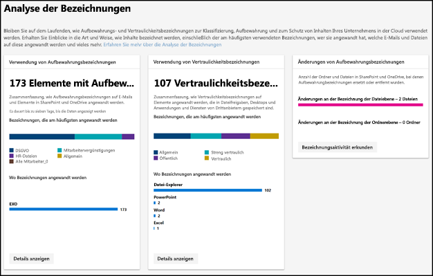
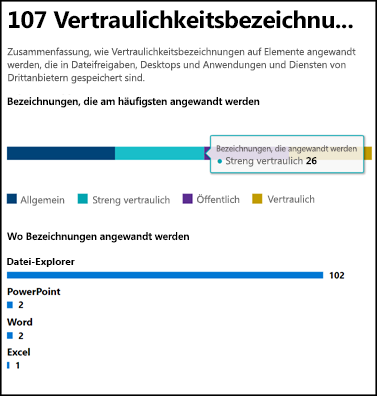
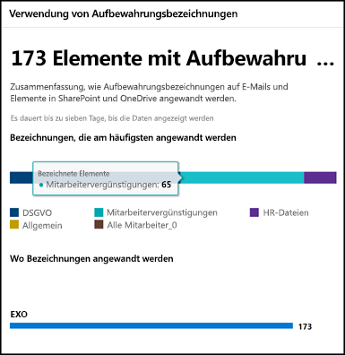
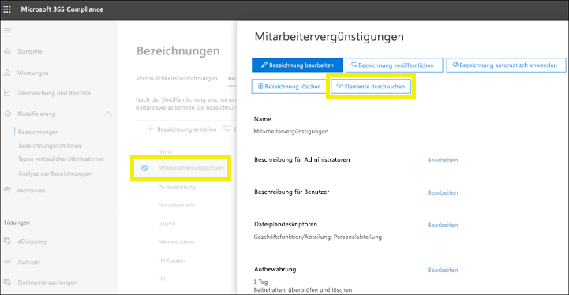
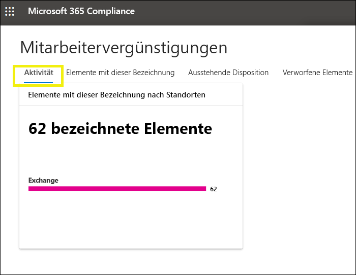
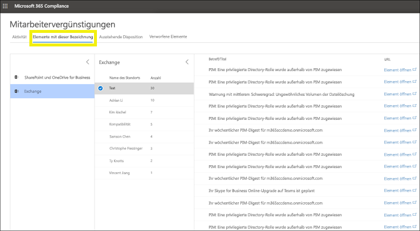

# Anzeigen der Bezeichnungsnutzung mit der Analyse der BezeichnungenView label usage with label analytics

Nachdem Sie Ihre Aufbewahrungsbezeichnungen und Vertraulichkeitsbezeichnungen erstellt haben, können Sie überprüfen, wie sie mandantenübergreifend verwendet werden.After you create your retention labels and sensitivity labels, you’ll want to see how they’re being used across your tenant. Mithilfe der Analyse der Bezeichnungen im Microsoft 365 Compliance Center und Microsoft 365 Security Center können Sie schnell sehen, welche Bezeichnungen am häufigsten verwendet werden und wo sie angewendet werden.With label analytics in the Microsoft 365 compliance center and Microsoft 365 security center, you can quickly see which labels are used the most and where they’re being applied.

Mit der Analyse der Bezeichnungen können Sie beispielsweise Folgendes anzeigen:For example, with label analytics, you can view the:

- Gesamtzahl der Aufbewahrungsbezeichnungen und Vertraulichkeitsbezeichnungen, die auf Inhalte angewandt wurden.Total number of retention labels and sensitivity labels applied to content.
- Topbezeichnungen und die Anzahl der Anwendungen jeder Bezeichnung.Top labels and the count of how many times each label was applied.
- Stellen, an denen Bezeichnungen angewendet werden, und die Anzahl jeder Stelle.Locations where labels are applied and the count for each location.
- Anzahl der Dateien und Ordner, bei denen die Aufbewahrungsbezeichnung geändert oder entfernt wurde.Count for how many files and folders had their retention label changed or removed.

Sie finden die Analyse der Bezeichnungen im [Microsoft 365 Compliance Center](https://compliance.microsoft.com/labelanalytics) oder [Microsoft 365 Security Center](https://security.microsoft.com/labelanalytics) > **Klassifizierung** > **Analyse der Bezeichnungen**.You can find label analytics in the [Microsoft 365 compliance center](https://compliance.microsoft.com/labelanalytics) or [Microsoft 365 security center](https://security.microsoft.com/labelanalytics) > **Classification** > **Label analytics**.

## VertraulichkeitsbezeichnungsnutzungSensitivity label usage

Die Daten zur Verwendung der Vertraulichkeitsbezeichnung werden aus den Berichten für Azure Information Protection abgerufen. Weitere Informationen hierzu finden Sie unter [Zentrale Berichterstellung für Azure Information Protection](https://docs.microsoft.com/azure/information-protection/reports-aip).The data on sensitivity label usage is pulled from the reports for Azure Information Protection – for more information, see [Central reporting for Azure Information Protection](https://docs.microsoft.com/azure/information-protection/reports-aip).

Beachten Sie, dass für die Azure Information Protection-Berichte [Voraussetzungen](/azure/information-protection/reports-aip#prerequisites) gelten, die auch für die Analyse der Bezeichnungen im Hinblick auf Vertraulichkeitsbezeichnungen im Microsoft 365 Compliance Center und Microsoft 365 Security Center gelten.Note that the Azure Information Protection reports have [prerequisites](/azure/information-protection/reports-aip#prerequisites) that also apply to label analytics on sensitivity labels in the Microsoft 365 compliance center and Microsoft 365 security center. Sie benötigen z. B. ein Azure-Abonnement, das die Protokollanalyse enthält, da diese Berichte durch das Senden von Informationen zu Überwachungsereignissen von Azure Information Protection-Clients und -Scannern an einen zentralen Speicherort basierend auf dem Azure Log Analytics-Dienst entstehen.For example, you need an Azure subscription that includes the Log Analytics because these reports are a result of sending information protection audit events from Azure Information Protection clients and scanners to a centralized location based on Azure Log Analytics service.

Für die Vertraulichkeitsbezeichnungsnutzung:For sensitivity label usage:

- Es gibt keine Latenz in den Daten.There is no latency in the data. Dies ist ein Echtzeitbericht.This is a real-time report.
- Wenn Sie die Anzahl für jede Topbezeichnung anzeigen möchten, zeigen Sie auf das Balkendiagramm und lesen Sie die QuickInfo, die angezeigt wird.To see the count for each top label, point to the bar graph and read the tool tip that appears.
- Der Bericht zeigt, wo Vertraulichkeitsbezeichnungen pro App angewendet werden (während Aufbewahrungsbezeichnungen pro Standort angezeigt werden).The report shows where sensitivity labels are applied per app (whereas retention labels are shown per location).

## AufbewahrungsbezeichnungsnutzungRetention label usage

Dieser Bericht zeigt einen schnellen Überblick über die Topbezeichnungen und darüber, wo sie angewendet werden.This report shows a quick view of what the top labels are and where they’re applied. Weitere Informationen zur Bezeichnung von Inhalten in SharePoint und OneDrive finden Sie unter [Anzeigen der Bezeichnungsaktivität für Dokumente](view-label-activity-for-documents.md).For more detailed information on how content in SharePoint and OneDrive is labeled, see [View label activity for documents](view-label-activity-for-documents.md).

Für die Aufbewahrungsbezeichnungsnutzung:For retention label usage:

- Daten werden wöchentlich aggregiert, sodass es bis zu sieben Tage dauern kann, bis Daten im Bericht angezeigt werden.Data is aggregated weekly, so it may take up to seven days for data to appear in the report.
- Wenn Sie die Anzahl für jede Topbezeichnung anzeigen möchten, zeigen Sie auf das Balkendiagramm und lesen Sie die QuickInfo, die angezeigt wird.To see the count for each top label, point to the bar graph and read the tool tip that appears.
- Der Bericht zeigt, wo Aufbewahrungsbezeichnungen pro Standort angewendet werden (während Vertraulichkeitsbezeichnungen pro Standort angezeigt werden).The report shows where retention labels are applied per location (whereas sensitivity labels are shown per app).
- Bei Aufbewahrungsbezeichnungen ist dies eine Zusammenfassung der Daten in Ihrem Mandanten. Es wird nicht nach einem bestimmten Datumsbereich gefiltert.For retention labels, this is a summary of the all-time data in your tenant; it’s not filtered to a specific date range. Im Gegensatz dazu zeigt der [Bezeichnungsaktivitäten-Explorer](view-label-activity-for-documents.md) nur Daten aus den letzten 30 Tagen.By contrast, the [Label Activity Explorer](view-label-activity-for-documents.md) shows data from only the past 30 days.

## Anzeigen aller Inhalte mit einer bestimmten AufbewahrungsbezeichnungView all content with a specific retention label

Im Nutzungsbericht für Aufbewahrungsbezeichnungen können Sie schnell alle Inhalte mit dieser Bezeichnung anzeigen.From the retention label usage report, you can quickly explore all content with that label applied. (Beachten Sie, dass wir derzeit an diesem Feature arbeiten, damit weniger Schritte erforderlich sind, um alle beschrifteten Inhalte anzuzeigen.)(Note that we're currently working on this feature, so that it will take fewer steps to view all the labeled content.)

Wählen Sie zuerst **Details anzeigen** unten im Bericht aus.First, choose **View Details** at the bottom of the report.

Wählen Sie dann eine Aufbewahrungsbezeichnung > **Elemente erkunden** im rechten Bereich.Then choose a retention label > **Explore items** in the right pane.

Für diese Bezeichnung können Sie die Registerkarte **Aktivität** auswählen, um die Anzahl der Elemente mit dieser Bezeichnung nach Standort anzuzeigen.For that label, you can choose the **Activity** tab to view a count of items with that label by location.

Sie können auch die Registerkarte **Elemente mit dieser Bezeichnung** auswählen. Dann können Sie eine Aufschlüsselung bestimmter Standorte anzeigen:You can also choose the **Items with this label** tab. Then you can drill into specific locations:

- Bei Exchange Online sehen Sie eine Liste der Postfächer mit der Anzahl der bezeichneten Elemente in jedem Postfach.For Exchange Online, you see a list of mailboxes with the count of labeled items in each mailbox.
- Bei SharePoint Online und OneDrive for Business wird eine Liste der Websitesammlungen und OneDrive-Konten mit der Anzahl der bezeichneten Elemente an jedem Standort angezeigt.For SharePoint Online and OneDrive for Business, you see a list of site collections and OneDrive accounts with the count of labeled items in each location.

Wenn Sie ein Postfach oder eine Websitesammlung auswählen, können Sie eine Liste mit Elementen mit dieser Aufbewahrungsbezeichnung an diesem Standort anzeigen.When you choose a mailbox or site collection, you can view a list of items with that retention label in that location.

## BerechtigungenPermissions

Wenn Sie die Analyse der Bezeichnungen anzeigen möchten, muss Ihnen eine der folgenden Rollen in Azure Active Directory zugewiesen sein:To view label analytics, you must be assigned one of the following roles in Azure Active Directory:

- Globaler AdministratorGlobal administrator
- Compliance-AdministratorCompliance administrator
- SicherheitsadministratorSecurity administrator
- Benutzer mit Leseberechtigung für SicherheitsfunktionenSecurity reader

Beachten Sie außerdem, dass diese Berichte Azure Monitor verwenden, um die Daten in einem Protokollanalysearbeitsbereich Ihres Unternehmens zu speichern.In addition, note these reports use Azure Monitor to store the data in a Log Analytics workspace that your organization owns. Aus diesem Grund sollte der Benutzer als Leseberechtigter zum Azure Monitoring-Arbeitsbereich hinzugefügt werden, der die Daten enthält. Weitere Informationen finden Sie unter [Erforderliche Berechtigungen für Azure Information Protection-Analysen](https://docs.microsoft.com/azure/information-protection/reports-aip#permissions-required-for-azure-information-protection-analytics).Therefore, the user should be added as a reader to the Azure Monitoring workspace that holds the data - for more information, see [Permissions required for Azure Information Protection analytics](https://docs.microsoft.com/azure/information-protection/reports-aip#permissions-required-for-azure-information-protection-analytics).

