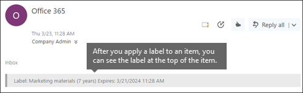
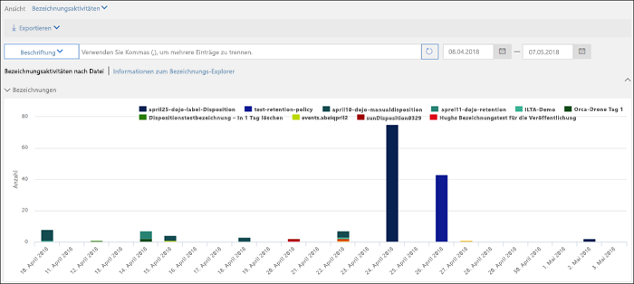

# Informationen zu AufbewahrungsbezeichnungenLearn about retention labels

>*[Microsoft 365-Lizenzierungsleitfaden für Sicherheit und Compliance](https://aka.ms/ComplianceSD).**[Microsoft 365 licensing guidance for security & compliance](https://aka.ms/ComplianceSD).*

In Ihrer Organisation verwenden Sie wahrscheinlich verschiedene Arten von Inhalten, für die unterschiedliche Aktionen ausgeführt werden müssen, um branchenspezifische Vorschriften und interne Richtlinien einzuhalten. Dies kann zum Beispiel die folgenden Inhalte umfassen:Across your organization, you probably have different types of content that require different actions taken on them in order to comply with industry regulations and internal policies. For example, you might have:
  
- Steuerformulare, die für einen bestimmten Zeitraum **aufbewahrt** werden müssen.Tax forms that need to be **retained** for a minimum period of time. 
    
- Pressematerialien, die nach dem Erreichen eines bestimmten Alters **dauerhaft gelöscht** werden müssen.Press materials that need to be **permanently deleted** when they reach a certain age. 
    
- Im Wettbewerb stehende Forschungen, die sowohl **aufbewahrt** als auch anschließend **dauerhaft gelöscht** werden müssen.Competitive research that needs to be both **retained** and then **permanently deleted**. 
    
- Arbeitsvisa, die **als Datensatz gekennzeichnet** werden müssen, damit sie nicht bearbeitet oder gelöscht werden.Work visas that must be **marked as a record** so that they can't be edited or deleted. 
    
In all diesen Fällen können Aufbewahrungsbezeichnungen Ihnen dabei helfen, die richtigen Maßnahmen für die entsprechenden Inhalte zu treffen. Mit Aufbewahrungsbezeichnungen können Sie Daten organisationsweit für Governance klassifizieren und Aufbewahrungsregeln basierend auf dieser Klassifizierung durchsetzen.In all of these cases, retention labels can help you take the right actions on the right content. With retention labels, you can classify data across your organization for governance, and enforce retention rules based on that classification.
  
Mit Aufbewahrungsbezeichnungen können Sie Folgendes:With retention labels, you can:
  
- **Es Personen in Ihrer Organisation ermöglichen, eine Aufbewahrungsbezeichnung manuell** auf einen Inhalt in Outlook im Web, Outlook 2010 und höher, OneDrive, SharePoint und Microsoft 365-Gruppen anzuwenden. Benutzer wissen oft am besten, mit welcher Art von Inhalt sie arbeiten. Deshalb können sie den Inhalt klassifizieren und die entsprechende Richtlinie darauf anwenden lassen.**Enable people in your organization to apply a retention label manually** to content in Outlook on the web, Outlook 2010 and later, OneDrive, SharePoint, and Microsoft 365 Groups. Users often know best what type of content they're working with, so they can classify it and have the appropriate policy applied. 
    
- **Sie können Aufbewahrungsbezeichnungen automatisch** auf Inhalt anwenden, wenn er bestimmten Bedingungen entspricht:**Apply retention labels to content automatically** if it matches specific conditions, such as when the content contains: 
    
    - Der Inhalt enthält bestimmte vertrauliche Informationen.Specific types of sensitive information.
    
    - Der Inhalt enthält bestimmte Stichwörter, die einer von Ihnen erstellten Abfrage entsprechen.Specific keywords that match a query you create.
    
    - Musterübereinstimmungen für eine trainierbare Klassifizierung.Pattern matches for a trainable classifier.
    
  Die Möglichkeit, Aufbewahrungsbezeichnungen automatisch auf Inhalte anzuwenden, ist aus den folgenden Gründen wichtig:The ability to apply retention labels to content automatically is important because:
    
     - Sie müssen die Benutzer nicht schulen, damit sie alle Ihre Klassifizierungen kennen.You don't need to train your users on all of your classifications.
    
     - Sie müssen sich nicht darauf verlassen, dass die Benutzer alle Inhalte richtig klassifizieren.You don't need to rely on users to classify all content correctly.
    
   - Benutzer müssen nicht mehr über Governance-Richtlinien Bescheid wissen, sondern können sich stattdessen auf ihre Arbeit konzentrieren.Users no longer need to know about data governance policies - they can instead focus on their work.

- **Wenden Sie eine Standardaufbewahrungsbezeichnung auf eine Dokumentbibliothek, einen Ordner oder eine Dokumentenmappe** in SharePoint an, sodass alle an diesem Speicherort gespeicherten Dokumente mit der Standardaufbewahrungsbezeichnung versehen werden.**Apply a default retention label to a document library, folder, or document set** in SharePoint, so that all documents that are stored in that location inherit the default retention label.

Aufbewahrungsbezeichnungen unterstützen darüber hinaus die [Datensatzverwaltung](records-management.md) für E-Mails und Dokumente in Microsoft 365-Apps und -Diensten.Additionally, retention labels support [records management](records-management.md) for email and documents across Microsoft 365 apps and services. Sie können Aufbewahrungsbezeichnungen verwenden, um Inhalte als Datensätze zu kennzeichnen.You can use a retention label to classify content as a record. Wenn dies geschieht, kann die Bezeichnung nicht geändert oder entfernt und die Inhalte können nicht bearbeitet oder gelöscht werden.When this happens, the label can't be changed or removed, and the content can't be edited or deleted. 

Für die Anzahl der Aufbewahrungsbezeichnungen, die für einen Mandanten unterstützt werden, gibt es keine Beschränkung.There is no limit to the number of retention labels that are supported for a tenant. Es werden jedoch maximal 10.000 Richtlinien für einen Mandanten unterstützt. Dazu gehören die Richtlinien, mit denen die Bezeichnungen angewendet werden (Aufbewahrungsbezeichnungsrichtlinien und automatische Aufbewahrungsrichtlinien), sowie Aufbewahrungsrichtlinien.However, 10,000 is the maximum number of policies that are supported for a tenant and these include the policies that apply the labels (retention label policies and auto-apply retention policies), as well as retention policies.

## Funktionsweise von Aufbewahrungsbezeichnungen bei AufbewahrungsbezeichnungsrichtlinienHow retention labels work with retention label policies

Der Vorgang, mit dem Personen in Ihrer Organisation Aufbewahrungsbezeichnungen zur Verfügung gestellt werden, damit sie Inhalte klassifizieren können, besteht aus zwei Schritten:Making retention labels available to people in your organization so that they can classify content is a two-step process: 

1. Erstellen der AufbewahrungsbezeichnungenCreate the retention labels

2. Veröffentlichen der Aufbewahrungsbezeichnungen mithilfe einer AufbewahrungsbezeichnungsrichtliniePublish the retention labels by using a retention label policy
  

  
Aufbewahrungsbezeichnungen sind unabhängige, wiederverwendbare Bausteine, die in einer oder mehreren Aufbewahrungsbezeichnungsrichtlinien enthalten sind.Retention labels are independent, reusable building blocks that are included in one or more retention label policies. Der Hauptzweck der Aufbewahrungsbezeichnungsrichtlinie besteht darin, eine Reihe von Aufbewahrungsbezeichnungen zu gruppieren und die Orte anzugeben, an denen die Bezeichnungen angezeigt werden sollen.The primary purpose of a retention label policy is to group a set of retention labels and specify the locations where you want those labels to appear.
  

  
1. Wenn Sie Aufbewahrungsbezeichnungen veröffentlichen, werden sie in eine Aufbewahrungsbezeichnungsrichtlinie einbezogen.When you publish retention labels, they're included in a retention label policy. Die Namen von Aufbewahrungsbezeichnungen sind unveränderlich, das bedeutet, sie können nach ihrer Erstellung nicht mehr bearbeitet werden.Retention label names are immutable, which means that they cannot be edited after they're created.

2. Eine einzelne Aufbewahrungsbezeichnung kann in mehrere Aufbewahrungsbezeichnungsrichtlinien einbezogen werden.A single retention label can be included in many retention label policies.

3. Ein einzelner Ort kann auch in viele Aufbewahrungsbezeichnungsrichtlinien einbezogen werden.A single location can also be included in many retention label policies.
    
3. Aufbewahrungsbezeichnungsrichtlinien geben die Speicherorte zum Veröffentlichen der Aufbewahrungsbezeichnungen an.Retention label policies specify the locations to publish the retention labels.
    
## Jeweils nur eine AufbewahrungsbezeichnungOnly one retention label at a time

Es ist wichtig zu wissen, dass ein Inhalt wie eine E-Mail-Nachricht oder ein Dokument jeweils nur über eine Aufbewahrungsbezeichnung verfügen kann:It's important to know that content like an email or document can have only a single retention label assigned to it at a time:
  
- Aufbewahrungsbezeichnungen, die von den Endbenutzern manuell zugewiesen wurden, können entfernt oder geändert werden.For retention labels assigned manually by end users, people can remove or change the retention label that's assigned.
    
- Wenn eine Bezeichnung einem Inhalt automatisch zugewiesen wurde, kann diese automatisch zugewiesene Aufbewahrungsbezeichnung durch eine vom Endbenutzer manuell zugewiesene Bezeichnung ersetzt werden.If content has an auto-apply label assigned, an auto-apply label can be replaced by a retention label assigned manually by an end user.
    
- Wenn einem Inhalt eine Aufbewahrungsbezeichnung manuell von einem Endbenutzer zugewiesen wurde, kann diese manuell zugewiesene Aufbewahrungsbezeichnung nicht durch eine automatisch zugewiesene Bezeichnung ersetzt werden.If content has a retention label assigned manually by an end user, an auto-apply label cannot replace the manually assigned retention label.
    
- Wenn es mehrere Regeln gibt, durch die eine Bezeichnung automatisch zugewiesen wird, und ein Inhalt die Bedingungen verschiedener Regeln erfüllt, wird die Aufbewahrungsbezeichnung für die älteste Regel angewendet.If there are multiple rules that assign an auto-apply label and content meets the conditions of multiple rules, the retention label for the oldest rule is assigned.
    
Um zu verstehen, wie und warum eine Aufbewahrungsbezeichnung und nicht eine andere angewendet wird, ist es hilfreich, den Unterschied zwischen der expliziten und der impliziten Zuweisung einer Bezeichnung nachzuvollziehen:To understand how and why one retention label is applied rather than another, it's helpful to understand the difference between explicitly assign a label, and implicitly assigned a label:

- Manuell zugewiesene Bezeichnungen sind explizit zugewiesen.Manually assigned labels are explicitly assigned
- Automatisch angewendete Bezeichnungen sind implizit zugewiesen.Automatically applied labels are implicitly assigned

Eine explizit zugewiesene Aufbewahrungsbezeichnung hat Vorrang vor einer implizit zugewiesenen.An explicitly assigned retention label takes precedence over an implicitly assigned retention label. Weitere Informationen finden Sie im Abschnitt [Die Grundsätze der Aufbewahrung, oder was hat Vorrang?](#the-principles-of-retention-or-what-takes-precedence) auf dieser Seite.For more information, see the [The principles of retention, or what takes precedence?](#the-principles-of-retention-or-what-takes-precedence) section on this page.

## Aufbewahrungsbezeichnungsrichtlinien und SpeicherorteRetention label policies and locations

Verschiedene Arten von Aufbewahrungsbezeichnungen können an verschiedenen Speicherorten veröffentlicht werden, je nach Funktion der Aufbewahrungsbezeichnung.Different types of retention labels can be published to different locations, depending on what the retention label does.
  
|**Wenn für die Aufbewahrungsbezeichnung Folgendes gilt:****If the retention label is…**|**So kann die Bezeichnungsrichtlinie angewendet werden auf...****Then the label policy can be applied to…**|
|:-----|:-----|
|für Endbenutzer veröffentlichtPublished to end users    |Exchange, SharePoint, OneDrive, Microsoft 365-GruppenExchange, SharePoint, OneDrive, Microsoft 365 Groups    |
|basierend auf Typen vertraulicher Informationen automatisch angewendetAuto-applied based on sensitive information types    |Exchange (nur alle Postfächer), SharePoint, OneDriveExchange (all mailboxes only), SharePoint, OneDrive    |
|basieren auf einer Abfrage automatisch angewendetAuto-applied based on a query    |Exchange, SharePoint, OneDrive, Microsoft 365-GruppenExchange, SharePoint, OneDrive, Microsoft 365 Groups    |
   
In Exchange werden automatisch angewendete Bezeichnungen (sowohl für Abfragen als auch für vertrauliche Informationstypen) nur auf neu gesendete Nachrichten (in Übertragung begriffene Daten) angewendet, und nicht auf alle Elemente, die sich derzeit im Postfach befinden (ruhende Daten).In Exchange, auto-apply retention labels (for both queries and sensitive information types) are applied only to messages newly sent (data in transit), not to all items currently in the mailbox (data at rest). Außerdem können automatisch angewendete Aufbewahrungsbezeichnungen für vertrauliche Informationstypen nur auf alle Postfächer angewendet werden; Sie können keine bestimmten Postfächer dafür auswählen.Also, auto-apply retention labels for sensitive information types can apply only to all mailboxes; you can't select the specific mailboxes.
  
Öffentliche Exchange-Ordner, Skype- und Teams-Kanalnachrichten und -Chats unterstützen keine Aufbewahrungskennzeichnungen.Exchange public folders, Skype, and Teams channel messages and chats do not support retention labels.

## So erzwingen Aufbewahrungsbezeichnungen die AufbewahrungHow retention labels enforce retention

Aufbewahrungsbezeichnungen können die gleichen Aufbewahrungsaktionen wie eine Aufbewahrungsrichtlinie erzwingen: aufbewahren und dann löschen, nur aufbewahren oder nur löschen.Retention labels can enforce the same retention actions that a retention policy can - retain and then delete, or retain-only, or delete-only. Sie können Aufbewahrungskennzeichnungen verwenden, um einen detaillierten Dateiplan zu implementieren, der für bestimmte Dateien verschiedene Aufbewahrungseinstellungen festlegt.You can use retention labels to implement a sophisticated file plan that identifies specific files for different retention settings. Näheres über die Aufbewahrung erfahren Sie unter [Informationen zu Aufbewahrungsrichtlinien](retention-policies.md).For more information about how retention works, see [Learn about retention policies](retention-policies.md).

Darüber hinaus hat eine Aufbewahrungsbezeichnung zwei Aufbewahrungsoptionen, die nur für eine Aufbewahrungsbezeichnung und nicht in einer Aufbewahrungsrichtlinie verfügbar sind. Aufbewahrungsbezeichnungen bieten Ihnen die folgenden Möglichkeiten:In addition, a retention label has two retention options that are available only in a retention label and not in a retention policy. With a retention label, you can:
  
- Auslösen einer Löschungsprüfung am Ende des Aufbewahrungszeitraums, damit SharePoint- und OneDrive-Dokumente überprüft werden müssen, bevor sie gelöscht werden können.Trigger a disposition review at the end of the retention period, so that SharePoint and OneDrive documents must be reviewed before they can be deleted. Weitere Informationen finden Sie unter [Löschungsprüfungen](disposition.md#disposition-reviews).For more information, see [Disposition reviews](disposition.md#disposition-reviews).
    
- Beginnen des Aufbewahrungszeitraums zu dem Zeitpunkt, an dem der Inhalt mit der Bezeichnung versehen wurde, und nicht ausgehend vom Alter des Inhalts oder dem Zeitpunkt, zu dem er zuletzt geändert wurde.Start the retention period from when the content was labeled, instead of the age of the content or when it was last modified. Diese Option gilt nur für Inhalte auf SharePoint-Websites und in OneDrive-Konten.This option applies only to content in SharePoint sites and OneDrive accounts. Bei Exchange-E-Mails basiert der Aufbewahrungszeitraum immer auf dem Datum, an dem die Nachricht gesendet oder empfangen wurde, und zwar unabhängig davon, welche Option Sie hier auswählen.For Exchange email, the retention period is always based on the date when the message was sent or received, no matter which option you choose here.
    

Ein weiterer wichtiger Unterschied besteht darin, dass Benutzer die Datei nicht löschen können, während der Aufbewahrungszeitraum erzwungen wird, wenn Sie eine Aufbewahrungskennzeichnung anstelle einer Aufbewahrungsrichtlinie auf Dateien in SharePoint anwenden und die Kennzeichnungen für die Aufbewahrung von Inhalten konfiguriert ist.Another important difference is that when you apply a retention label rather than a retention policy to files in SharePoint, and the label is configured to retain content, users can't delete the file while the retention period is enforced. Benutzer können Inhalte löschen, wenn dieselbe Bezeichnung auf Dateien in OneDrive und auf E-Mails angewendet wird, es sei denn, der Inhalt wird als Datensatz gekennzeichnet.Users can delete content when the same label is applied to files in OneDrive and to emails, unless the label marks the content as a record.

## Wo veröffentlichte Aufbewahrungsbezeichnungen Endbenutzern verfügbar gemacht werden könnenWhere published retention labels can appear to end users

Wenn Endbenutzer Aufbewahrungsbezeichnungen auf Inhalte anwenden, können Sie die Bezeichnungen an den folgenden Speicherorten veröffentlichen:If your retention label will be assigned to content by end users, you can publish it to:
  
- Outlook und Outlook im WebOutlook and Outlook on the web
    
- OneDriveOneDrive
    
- SharePointSharePoint
    
- Microsoft 365-Gruppen (sowohl die Gruppenwebsite als auch das Gruppenpostfach in Outlook im Web)Microsoft 365 groups (both the group site and group mailbox in Outlook on the web)
    
In den folgenden Abschnitten wird erläutert, wie Bezeichnungen den Endbenutzern in Ihrer Organisation in verschiedenen Apps angezeigt werden.The sections that follow explain how labels appear in different apps to people in your organization.
  

### OutlookOutlook

Wenn Sie ein Element im Outlook-Desktop-Client beschriften möchten, wählen Sie es zunächst aus.To label an item in the Outlook desktop client, select the item. Klicken Sie im Menüband auf der Registerkarte **Start** auf **Richtlinie zuweisen**, und wählen Sie dann die gewünschte Aufbewahrungsbezeichnung aus.On the **Home** tab on the ribbon, click **Assign Policy**, and then choose the retention label. 
  

  
Sie können auch mit der rechten Maustaste auf ein Element klicken, im Kontextmenü auf **Richtlinie zuweisen** klicken, und dann die gewünschte Aufbewahrungsbezeichnung auswählen.You can also right-click an item, click **Assign Policy** in the context menu, and then choose the retention label. 

Nachdem die Aufbewahrungsbezeichnung angewendet wurde, können Sie sie zusammen mit der von ihr ausgeführten Aktion über dem Element anzeigen.After the retention label is applied, you can view that retention label and what action it takes at the top of the item. Wenn einer E-Mail eine Aufbewahrungsbezeichnung und damit verbunden ein Aufbewahrungszeitraum zugeordnet wurde, können Sie auf einen Blick sehen, wann die E-Mail abläuft.If an email has a retention label applied that has an associated retention period, you can see at a glance when the email expires.
  
Sie können Aufbewahrungsbezeichnungen auch auf Ordner anwenden. Hierbei gilt Folgendes:You can also apply retention labels to folders, in which case:
  
- Alle Elemente im Ordner erhalten automatisch dieselbe Aufbewahrungsbezeichnung, **mit Ausnahme von Elementen**, auf die eine Aufbewahrungsbezeichnung explizit angewendet wurde.All items in the folder automatically get the same retention label, **except** for items that have had a retention label applied explicitly to them. Explizit bezeichnete Elemente behalten die bestehende Aufbewahrungsbezeichnung bei.Explicitly labeled items keep their existing retention label. Weitere Informationen finden Sie im Abschnitt [Die Grundsätze der Aufbewahrung, oder was hat Vorrang?](#the-principles-of-retention-or-what-takes-precedence) auf dieser Seite.For more information, see [The principles of retention, or what takes precedence?](#the-principles-of-retention-or-what-takes-precedence) section on this page. 
    
- Wenn Sie die Standardaufbewahrungsbezeichnung eines Ordners ändern oder entfernen, wird die Aufbewahrungsbezeichnung ebenfalls für alle Elemente in dem Ordner geändert oder entfernt, **mit Ausnahme von** Elementen, die über explizit zugewiesene Aufbewahrungsbezeichnungen verfügen.If you change or remove the default retention label for a folder, the retention label's also changed or removed for all items in the folder, **except** items with explicitly assigned retention labels. 
    
- Wenn Sie ein Element mit einer Standardaufbewahrungsbezeichnung von einem Ordner in einen anderen Ordner mit einer anderen Standardaufbewahrungsbezeichnung verschieben, erhält das Element die neue Standardaufbewahrungsbezeichnung.If you move an item with a default retention label from one folder to another folder with a different default retention label, the item gets the new default retention label.
    
- Wenn Sie ein Element mit einer Standardaufbewahrungsbezeichnung von einem Ordner in einen anderen Ordner ohne Standardaufbewahrungsbezeichnung verschieben, wird die alte Standardaufbewahrungsbezeichnung entfernt.If you move an item with a default retention label from one folder to another folder with no default retention label, the old default retention label is removed.

### Outlook im WebOutlook on the web

Um ein Element in Outlook im Web mit einer Bezeichnung zu versehen: Mit der rechten Maustaste auf das Element klicken \> **Richtlinie zuweisen** \> Aufbewahrungsbezeichnung auswählen.To label an item in Outlook on the web, right-click the item \> **Assign policy** \> choose the retention label. 
  

  
Nachdem die Aufbewahrungsbezeichnung zugewiesen wurde, können Sie oben im Element diese Aufbewahrungsbezeichnung anzeigen und sehen, welche Aktion sie durchführt. Wenn eine E-Mail klassifiziert ist, der ein Aufbewahrungszeitraum zugeordnet wurde, sehen Sie auf einen Blick, wann die E-Mail abläuft.After the retention label is applied, you can view that retention label and what action it takes at the top of the item. If an email is classified and has an associated retention period, you can know at a glance when the email will expire.
  

  
Wie bei Outlook im Web können Sie Aufbewahrungsbezeichnungen auch auf Ordner anwenden.As with Outlook on the web, you can also apply retention labels to folders. 

### OneDrive und SharePointOneDrive and SharePoint

Um in OneDrive oder SharePoint ein Dokument mit einer Bezeichnung zu versehen (einschließlich OneNote-Dateien), wählen Sie das entsprechende Element \> in der oberen rechten Ecke aus, wählen Sie **Detailfenster öffnen** \> **Aufbewahrungsbezeichnung anwenden** \> Aufbewahrungsbezeichnung auswählen.To label a document (including OneNote files) in OneDrive or SharePoint, select the item \> in the upper-right corner, choose **Open the details pane** \> **Apply retention label** \> choose the retention label. 
  
Sie können eine Aufbewahrungsbezeichnung auch auf einen Ordner- oder Dokumentensatz anwenden sowie eine [Standardaufbewahrungsbezeichnung für eine Dokumentbibliothek](#applying-a-default-retention-label-to-all-content-in-a-sharepoint-library-folder-or-document-set) festlegen.You can also apply a retention label to a folder or document set, and you can set a [default retention label for a document library](#applying-a-default-retention-label-to-all-content-in-a-sharepoint-library-folder-or-document-set).
  

  
Nachdem eine Aufbewahrungsbezeichnung auf ein Element angewendet wurde, wird sie im Detailbereich angezeigt, wenn das Element ausgewählt wird.After a retention label is applied to an item, you can view it in the details pane when that item's selected.
  

  
Für SharePoint, aber nicht OneDrive, können Sie eine Bibliotheksansicht erstellen, die die Spalten **Bezeichnungen** oder **Element ist ein Datensatz** enthält.For SharePoint, but not OneDrive, you can create a view of the library that contains the **Labels** column or **Item is a Record** column. In dieser Ansicht sehen Sie auf einen Blick die Aufbewahrungsbezeichnungen, die allen Elementen zugeordnet sind, und bei welchen Elementen es sich um Datensätze handelt.This view lets you see at a glance the retention labels assigned to all items and which items are records. Beachten Sie jedoch, dass Sie die Ansicht nicht nach der Spalte **Element ist ein Datensatz** filtern können.Note, however, that you can't filter the view by the **Item is a Record** column. Anweisungen zum Hinzufügen von Spalten finden Sie unter [Ein- oder Ausblenden von Spalten in einer Liste oder Bibliothek](https://support.microsoft.com/de-DE/office/show-or-hide-columns-in-a-list-or-library-b820db0d-9e3e-4ff9-8b8b-0b2dbefa87e2).For instructions how to add columns, see [Show or hide columns in a list or library](https://support.microsoft.com/de-DE/office/show-or-hide-columns-in-a-list-or-library-b820db0d-9e3e-4ff9-8b8b-0b2dbefa87e2).

### Microsoft 365-GruppenMicrosoft 365 groups

Wenn Sie Aufbewahrungsbezeichnungen für Microsoft 365-Gruppen ([vormals Office 365-Gruppen](https://techcommunity.microsoft.com/t5/microsoft-365-blog/office-365-groups-will-become-microsoft-365-groups/ba-p/1303601)) veröffentlichen, werden diese sowohl auf der Gruppen-Website als auch im Gruppenpostfach in Outlook im Web angezeigt.When you publish retention labels to Microsoft 365 groups ([formerly Office 365 groups](https://techcommunity.microsoft.com/t5/microsoft-365-blog/office-365-groups-will-become-microsoft-365-groups/ba-p/1303601)), the retention labels appear in both the group site and group mailbox in Outlook on the web. Die Vorgehensweise zum Anwenden einer Aufbewahrungsbezeichnung auf Inhalte ist mit der für E-Mails und Dokumente identisch.The experience of applying a retention label to content is identical to that for email and documents.

Wenn Sie Inhalte für eine Microsoft 365-Gruppe aufbewahren möchten, verwenden Sie den **Office 365-Gruppen**-Speicherort.To retain content for a Microsoft 365 group, use the **Office 365 groups** location. Obwohl eine Microsoft 365-Gruppe über ein Exchange-Postfach verfügt, bezieht eine Aufbewahrungsrichtlinie, die den gesamten Exchange-Speicherort umfasst, keine Inhalte in Microsoft 365-Gruppenpostfächern mit ein.Even though a Microsoft 365 group has an Exchange mailbox, a retention policy that includes the entire Exchange location won't include content in Microsoft 365 group mailboxes.

Außerdem ist es nicht möglich, den Exchange-Speicherort für den Ein- oder Ausschluss eines bestimmten Gruppenpostfachs zu verwenden.In addition, it's not possible to use the Exchange location to include or exclude a specific group mailbox. Obwohl der Exchange-Speicherort zunächst die Auswahl eines Gruppenpostfachs zulässt, erhalten Sie beim Versuch, die Aufbewahrungsrichtlinie zu speichern, die Fehlermeldung, dass "RemoteGroupMailbox" keine gültige Auswahl für den Exchange-Speicherort ist.Although the Exchange location initially allows a group mailbox to be selected, when you try to save the retention policy, you receive an error that "RemoteGroupMailbox" is not a valid selection for the Exchange location.
  
Erstellen und konfigurieren Sie zunächst die Vertraulichkeitsbezeichnungen, die Sie für Apps und andere Dienste zur Verfügung stellen möchten,First, create and configure the sensitivity labels that you want to make available for apps and other services. zum Beispiel die Bezeichnungen, die Benutzer in Office-Apps sehen und anwenden sollen.For example, the labels you want users to see and apply from Office apps. 

Erstellen Sie dann eine oder mehrere Bezeichnungsrichtlinien mit den von Ihnen konfigurierten Bezeichnungen und Richtlinieneinstellungen.Then, create one or more label policies that contain the labels and policy settings that you configure. Es ist die Bezeichnungsrichtlinie, die die Bezeichnungen und Einstellungen für die von Ihnen ausgewählten Benutzer und Standorte veröffentlicht.It's the label policy that publishes the labels and settings for your chosen users and locations.

## Automatisches Zuweisen einer Aufbewahrungsbezeichnung basierend auf BedingungenApplying a retention label automatically based on conditions

Eines der leistungsstärksten Features von Aufbewahrungsbezeichnungen ist die Möglichkeit, sie automatisch auf Inhalte anzuwenden, die bestimmte Bedingungen erfüllen.One of the most powerful features of retention labels is the ability to apply them automatically to content that matches certain conditions. In diesem Fall müssen die Personen in Ihrer Organisation die Bezeichnungen nicht selber anwenden.In this case, people in your organization don't need to apply the retention labels. Das wird von Microsoft 365 erledigt.Microsoft 365 does the work for them.
  

  
Das automatische Anwenden von Aufbewahrungsbezeichnungen ist aus den folgenden Gründen besonders effektiv:Auto-applying retention labels are powerful because:
  
- Sie müssen die Benutzer nicht schulen, damit sie alle Ihre Klassifizierungen kennen.You don't need to train your users on all of your classifications.
    
- Sie müssen sich nicht darauf verlassen, dass die Benutzer alle Inhalte richtig klassifizieren.You don't need to rely on users to classify all content correctly.
    
- Benutzer müssen nicht mehr über Governance-Richtlinien Bescheid wissen, sondern können sich stattdessen auf ihre Arbeit konzentrieren.Users no longer need to know about data governance policies - they can focus on their work.
    
Sie können Aufbewahrungsbezeichnungen automatisch auf Inhalte anwenden, wenn diese folgende Bedingungen erfüllen:You can choose to apply retention labels to content automatically when that content contains:
  
- [Der Inhalt enthält bestimmte vertrauliche Informationen.Specific types of sensitive information](create-retention-labels.md#auto-apply-labels-to-content-with-specific-types-of-sensitive-information)
    
- [Der Inhalt enthält bestimmte Stichwörter, die einer von Ihnen erstellten Abfrage entsprechen.Specific keywords that match a query you create](create-retention-labels.md#auto-apply-labels-to-content-with-keywords-or-searchable-properties)

- [Eine Übereinstimmung für trainierbare KlassifizierungenA match for trainable classifiers](create-retention-labels.md#auto-apply-labels-to-content-by-using-trainable-classifiers)
    

> [!TIP]
> Unter [Verwalten des Lebenszyklus von SharePoint-Dokumenten mithilfe von Aufbewahrungsbezeichnungen](auto-apply-retention-labels-scenario.md)finden Sie ein detailliertes Szenario zur Verwendung von verwalteten Eigenschaften in SharePoint, um Aufbewahrungsbezeichnungen automatisch anzuwenden und die ereignisgesteuerte Aufbewahrung zu implementieren.See [Manage the lifecycle of SharePoint documents with retention labels](auto-apply-retention-labels-scenario.md) for a detailed scenario about using managed properties in SharePoint to auto-apply retention labels and implement event-driven retention.

## Anwenden einer Standardaufbewahrungsbezeichnung auf alle Inhalte in einer SharePoint-Bibliothek, einem Ordner oder einer DokumentenmappeApplying a default retention label to all content in a SharePoint library, folder, or document set

Sie können es Personen nicht nur ermöglichen, eine Aufbewahrungsbezeichnung auf einzelne Dokumente anzuwenden, sondern Sie können eine Standardaufbewahrungsbezeichnung auf eine SharePoint-Bibliothek, einen Ordner oder eine Dokumentenmappe anwenden, sodass alle Dokumente in diesem Speicherort diese Standardaufbewahrungsbezeichnung erhalten.In addition to enabling people to apply a retention label to individual documents, you can also apply a default retention label to a SharePoint library, folder, or document set, so that all documents in that location get the default retention label.
  
Bei einer Dokumentbibliothek geschieht das auf der Seite **Bibliothekseinstellungen**.For a document library, this is done on the **Library settings** page for a document library. Wenn Sie die standardmäßige Aufbewahrungsbezeichnung auswählen, können Sie auch auswählen, dass sie auf vorhandene Elemente in der Bibliothek angewendet werden soll.When you choose the default retention label, you can also choose to apply it to existing items in the library. 
  
Wenn Sie zum Beispiel über ein Tag für Marketingmaterial verfügen und wissen, dass eine bestimmte Dokumentenbibliothek nur diese Art von Inhalt enthält, können Sie das Marketingmaterial-Tag als Standard für alle Dokumente in dieser Bibliothek festlegen.For example, if you have a tag for marketing materials, and you know a specific document library contains only that type of content, you can make the Marketing Materials tag the default for all documents in that library.
  

  
Wenn Sie eine Standardaufbewahrungsbezeichnung auf vorhandene Elemente in der Bibliothek, im Ordner oder in der Dokumentenmappe anwenden:If you apply a default retention label to existing items in the library, folder, or document set:
  
- Alle Elemente in der Bibliothek, dem Ordner oder der Dokumentenmappe erhalten automatisch dieselbe Aufbewahrungsbezeichnung, **mit Ausnahme von Elementen**, auf die eine Aufbewahrungsbezeichnung explizit angewendet wurde (z. B. Datensätze).All items in the library, folder, or document set automatically get the same retention label, **except** for items that have had a retention label applied explicitly to them (such as records). Explizit bezeichnete Elemente behalten diese Bezeichnung bei.Explicitly labeled items keep their existing label. Weitere Informationen finden Sie weiter unten im Abschnitt [Die Grundsätze der Aufbewahrung, oder was hat Vorrang?](#the-principles-of-retention-or-what-takes-precedence)For more information, see the below section on [The principles of retention, or what takes precedence](#the-principles-of-retention-or-what-takes-precedence).
    
- Wenn Sie die Standardaufbewahrungsbezeichnung einer Bibliothek, eines Ordners oder einer Dokumentenmappe ändern oder entfernen, wird die Aufbewahrungsbezeichnung ebenfalls für alle Elemente in der Bibliothek, im Ordner oder in der Dokumentenmappe geändert oder entfernt, **mit Ausnahme von** Elementen, die über explizit zugewiesene Aufbewahrungsbezeichnungen verfügen (z. B. Datensätze).If you change or remove the default retention label for a library, folder, or document set, the retention label is also changed or removed for all items in the library, folder, or document set, **except** items with explicit retention labels (such as records).
    
- Wenn Sie ein Element mit einer Standardaufbewahrungsbezeichnung aus einer Sitesammlung, Bibliothek, einem Ordner oder einer Dokumentenmappe in eine andere Sitesammlung, Bibliothek, einen Ordner oder eine Dokumentenmappe verschieben, behält das Element die vorhandene Standardaufbewahrungsbezeichnung auch dann, wenn der neue Speicherort eine andere Standardaufbewahrungsbezeichnung hat.If you move an item with a default retention label from one site collection, library, folder, or document set to another site collection, library, folder, or document set that has a different label, the item keeps its existing default retention label, even if the new location has a different default retention label. Wenn das Element vor dem Verschieben nicht mit einer Bezeichnung versehen ist, nimmt es die Standardaufbewahrungsbezeichnung des neuen Speicherorts an.If the item does not have a label before moving, it will take on the default retention label of the new location.

**Einträge:** Wenn Sie eine Standarddatensatzbezeichnung auf eine Bibliothek, einen Ordner oder eine Dokumentenmappe anwenden, wird eine Datensatzbezeichnung auf jedes einzelne Element innerhalb dieser Speicherorte angewendet.**Records:** If you apply a default record label to a library, folder, or document set, then a record label is applied to all the individual items within those locations. Wenn Sie ein neues Element an einen Speicherort mit einer Datensatzbezeichnung verschieben, erhält dieses Element eine Bezeichnung als Datensatz.When you move a new item into a location with a record label, that item is labeled a record. Wenn Sie die Standardaufbewahrungsbezeichnung jedoch in eine Bezeichnung ändern, die Inhalt nicht als Datensatz deklariert, wird die Datensatzbezeichnung durch diese Aktion nicht von den einzelnen Elementen entfernt, und die einzelnen Elemente behalten ihre Datensatzbezeichnung.However, if you change the default retention label to a label that doesn't declare content as a record, that action does not remove the record label from the individual items; those items retain their record label. Nur ein Websitesammlungsadministrator kann die Aufbewahrungsbezeichnung von Datensatzelementen explizit entfernen oder ändern.Only a site collection admin can explicitly remove or change the retention label of record items.

Weitere Informationen zu Aufbewahrungsbezeichnungen, die Inhalte als Datensatz deklarieren, finden Sie unter [Informationen zu Datensätzen](records.md).For more information about retention labels that declare content as a record, see [Learn about records](records.md).

## Anwenden einer Aufbewahrungsbezeichnung auf E-Mails mithilfe von RegelnApplying a retention label to email by using rules

In Outlook können Sie Regeln zum Anwenden einer Aufbewahrungsbezeichnung oder Aufbewahrungsrichtlinie erstellen.In Outlook, you can create rules to apply a retention label or retention policy.
  
Sie können zum Beispiel eine Regel erstellen, die eine bestimmte Aufbewahrungsbezeichnung auf alle Nachrichten anwendet, die an eine oder von einer bestimmten Verteilergruppe gesendet werden.For example, you can create a rule that applies a specific retention label to all messages sent to or from a specific distribution group.
  
So erstellen Sie eine Regel: Rechtsklick auf ein Element \> **Regeln** \> **Regel erstellen** \> **Erweiterte Optionen** \> **Regel-Assistent** \> **Aufbewahrungsrichtlinie anwenden**.To create a rule, right-click an item \> **Rules** \> **Create Rule** \> **Advanced Options** \> **Rules Wizard** \> **apply retention policy**.
  

  
## Klassifizieren von Inhalten ohne Anwendung von AktionenClassifying content without applying any actions

Sie können eine Aufbewahrungsbezeichnung erstellen, ohne eine Aufbewahrungsaktion oder sonstige Aktionen aktivieren zu müssen.When you create a retention label, you can do so without turning on any retention or other actions. In diesem Fall können Sie eine Aufbewahrungsbezeichnung einfach als Beschriftung verwenden, ohne irgendwelche Aktionen zu erzwingen.In this case, you can use a retention label simply as a text label, without enforcing any actions.
  
Sie können beispielsweise die Aufbewahrungsbezeichnung „Später überprüfen“ ohne Aktionen erstellen und diese Aufbewahrungsbezeichnung dann automatisch auf Inhalte mit vertraulichen Informationen oder auf abgefragte Inhalte anwenden.For example, you can create a retention label named "Review later" with no actions, and then auto-apply that retention label to content with sensitive information types or queried content.
  

  
## Verwenden von Aufbewahrungsbezeichnungen für die DatensatzverwaltungUsing retention labels for records management
    
Sie können Aufbewahrungsbezeichnungen verwenden, um Inhalte als Datensätze zu klassifizieren.You can use retention labels to declare content as a record. Auf diese Weise können Sie eine einzige, einheitliche Strategie zur Datensatzverwaltung in Microsoft 365 einrichten.This lets you implement a single, consistent records-management strategy across Microsoft 365. Weitere Informationen finden Sie unter [Informationen zu Datensätzen](records.md).For more information, see [Learn about records](records.md).
  
## Verwenden einer Aufbewahrungsbezeichnung als Bedingung in einer DLP-RichtlinieUsing a retention label as a condition in a DLP policy

Eine Aufbewahrungsbezeichnung kann Aufbewahrungsaktionen für Inhalte erzwingen. Darüber hinaus können Sie eine Aufbewahrungsbezeichnung als Bedingung in einer Richtlinie zur Verhinderung von Datenverlust (Data Loss Prevention, DLP) verwenden. Dies bedeutet, dass die DLP-Richtlinie weitere Aktionen für Inhalte, die eine bestimmte Bezeichnung haben, erzwingen kann, wie zum Beispiel das Einschränken des Zugriffs.A retention label can enforce retention actions on content. In addition, you can use a retention label as a condition in a data loss prevention (DLP) policy, and the DLP policy can enforce other actions, such as restricting access, on content that contains a specific label. 
  
Weitere Informationen finden Sie unter [Verwenden einer Aufbewahrungsbezeichnung als Bedingung in einer DLP-Richtlinie](data-loss-prevention-policies.md#using-a-retention-label-as-a-condition-in-a-dlp-policy).For more information, see [Using a retention label as a condition in a DLP policy](data-loss-prevention-policies.md#using-a-retention-label-as-a-condition-in-a-dlp-policy).
  

## Die Grundsätze der Aufbewahrung, oder was hat Vorrang?The principles of retention, or what takes precedence?

Es ist möglich oder sogar wahrscheinlich, dass auf Inhalte mehrere Aufbewahrungsrichtlinien angewendet werden, die jeweils mit einer anderen Aktion (aufbewahren, löschen oder beides) und einem anderen Aufbewahrungszeitraum verbunden sind. Was hat Vorrang? Ganz allgemein sei gesagt, dass Sie sich sicher sein können, dass Inhalte, die aufgrund einer Richtlinie aufbewahrt werden müssen, nicht von einer anderen Richtlinie dauerhaft gelöscht werden können.It's possible or even likely that content might have several retention policies applied to it, each with a different action (retain, delete, or both) and retention period. What takes precedence? At the highest level, rest assured that content being retained by one policy can't be permanently deleted by another policy.
  

  
Um zu verstehen, wie verschiedene Bezeichnungen mit Aufbewahrungsrichtlinien auf Inhalte angewendet werden, sollten Sie diese Grundsätze der Aufbewahrung beachten:To understand how different labels with retention actions are applied to content, keep these principles of retention in mind:
  
1. \*\*Aufbewahrung hat Vorrang vor Löschung. \*\* Angenommen, eine Aufbewahrungsrichtlinie gibt vor, dass Exchange-E-Mails nach drei Jahren gelöscht werden sollen, eine andere Aufbewahrungsrichtlinie jedoch besagt, dass Exchange-E-Mails fünf Jahre lang aufbewahrt und dann gelöscht werden müssen. Alle Inhalte, die drei Jahre alt sind, werden gelöscht und aus der Ansicht der Benutzer ausgeblendet, aber immer noch im Ordner "Wiederherstellbare Elemente" aufbewahrt, bis sie fünf Jahre alt sind und endgültig gelöscht werden.**Retention wins over deletion.** Suppose that one retention policy says to delete Exchange email after three years, but another retention policy says to retain Exchange email for five years and then delete it. Any content that reaches three years old will be deleted and hidden from the users' view, but still retained in the Recoverable Items folder until the content reaches five years old, when it will be permanently deleted. 
    
2. \*\*Der längste Aufbewahrungszeitraum hat Vorrang. \*\* Wenn Inhalte mehreren Aufbewahrungsrichtlinien, nach denen Inhalte aufbewahrt werden, unterliegen, werden sie bis zum Ende des längsten Aufbewahrungszeitraums aufbewahrt.**The longest retention period wins.** If content's subject to multiple policies that retain content, it will be retained until the end of the longest retention period. 
    
3. **Explizite Einbindung hat Vorrang vor impliziter Einbindung.** Dies bedeutet:**Explicit inclusion wins over implicit inclusion.** This means: 
    
    1. Wenn eine Aufbewahrungsbezeichnung mit Einstellungen für die Aufbewahrung von einem Benutzer manuell einem Element, z. B. einer Exchange-E-Mail oder einem OneDrive-Dokument, zugewiesen wird, hat diese Aufbewahrungsbezeichnung sowohl Vorrang vor einer Richtlinie, die auf Website- oder Postfachebene zugewiesen wurde, als auch vor einer Standard-Aufbewahrungsbezeichnung, die von der Dokumentbibliothek zugewiesen wurde.If a retention label with retention settings is manually assigned by a user to an item, such as an Exchange email or OneDrive document, that retention label takes precedence over both a policy assigned at the site or mailbox level and a default retention label assigned by the document library. Wenn beispielsweise die explizite Aufbewahrungsbezeichnung eine Aufbewahrung über zehn Jahre angibt, die der Website zugewiesene Aufbewahrungsrichtlinie hingegen eine Aufbewahrung über nur fünf Jahre, hat die Aufbewahrungsbezeichnung Vorrang.For example, if the explicit retention label says to retain for 10 years, but the retention policy assigned to the site says to retain for only five years, the retention label takes precedence. Automatisch zugewiesene Aufbewahrungsbezeichnungen werden als implizit und nicht explizit angesehen, da sie von Microsoft 365 automatisch angewendet werden.Auto-applied retention labels are considered implicit, not explicit, because they're applied automatically by Microsoft 365.
    
    2. Wenn eine Aufbewahrungsrichtlinie einen bestimmten Speicherort wie das Postfach oder OneDrive-Konto eines bestimmten Benutzers umfasst, hat diese Richtlinie Vorrang vor einer anderen Aufbewahrungsrichtlinie, die für alle Postfächer oder OneDrive-Konten von Benutzern gilt, aber nicht das Postfach dieses Benutzers speziell einschließt.If a retention policy includes a specific location, such as a specific user's mailbox or OneDrive account, that policy takes precedence over another retention policy that applies to all users' mailboxes or OneDrive accounts but doesn't specifically include that user's mailbox.
    
4. \*\*Der kürzeste Löschzeitraum hat Vorrang. \*\* Ebenso gilt, dass wenn Inhalte mehreren Aufbewahrungsrichtlinien zur Löschung (ohne Aufbewahrung) unterliegen, sie am Ende des kürzesten Aufbewahrungszeitraums gelöscht werden.**The shortest deletion period wins.** Similarly, if content's subject to multiple policies that delete content (with no retention), it will be deleted at the end of the shortest retention period. 
    
Beachten Sie: Wenn die Regeln, die von allen Richtlinien oder Kennzeichnungen angewendet werden, auf einer Ebene identisch sind, bewegt sich der Fluss nach unten zur nächsten Ebene, wo entschieden wird, welche Regel Vorrang hat.Understand that the principles of retention work as a tie-breaking flow from top to bottom: If the rules applied by all policies or labels are the same at one level, the flow moves down to the next level to determine precedence for which rule is applied.
  
Inhalt, der für eDiscovery gesperrt ist, kann nicht dauerhaft aufgrund einer Aufbewahrungsrichtlinie oder -bezeichnung gelöscht werden.Finally, a retention policy or retention label cannot permanently delete any content that's on hold for eDiscovery. Wenn die Sperre aufgehoben wird, ist der Inhalt wieder für den oben beschriebenen Bereinigungsprozess verfügbar.When the hold is released, the content again becomes eligible for the cleanup process described above.

### Vorrang für das automatische Bezeichnen mit trainierbaren KlassifizierungsmerkmalenPrecedence for auto-labeling with trainable classifiers

Alle Aufbewahrungsbezeichnungen, die für trainierbare Klassifizierungsmerkmale konfiguriert sind, werden gleichzeitig ausgewertet.All retention labels that are configured for trainable classifiers are evaluated simultaneously. Wird ein Element von mehr als einem trainierbaren Klassifizierungsmerkmal erkannt, wird anhand der folgenden Kriterien bestimmt, welche Aufbewahrungsbezeichnungen anzuwenden ist:If an item is detected by more than one trainable classifier, the following criteria is used to determine which retention label to apply:

1. Aufbewahrungsbezeichnungen, die für "nur aufbewahren" oder "aufbewahren und anschließend löschen" konfiguriert sind, haben Vorrang vor Aufbewahrungsbezeichnungen, die für "nur löschen" konfiguriert sind.Retention labels configured for retain-only or retain and then delete have a higher priority over retention labels that are configured for delete-only.

2. Bei Aufbewahrungsbezeichnungen, die für "nur aufbewahren" oder "aufbewahren und anschließend löschen" konfiguriert sind, gilt die Aufbewahrungsbezeichnung, die für die längste Aufbewahrung konfiguriert ist.For retention labels that are configured for retain-only or retain and then delete, the retention label that is configured for the longest retention period wins.

3. Bei Aufbewahrungsbezeichnungen, die für "nur löschen" konfiguriert sind, gilt die Aufbewahrungsbezeichnung, die für den kürzesten Zeitraum konfiguriert ist.For retention labels that are configured for delete-only, the retention label that has been configured for the shortest period wins.

4. Aufbewahrungsbezeichnungen mit derselben Aktion und dem gleichen Zeitraum führen zu einer nicht deterministischen Auswahl der Aufbewahrungsbezeichnung.Retention labels with the same action and the same period result in a retention label selection that is non-deterministic.

## Aufbewahrungsbezeichnungen überwachenMonitor retention labels

Nachdem Sie Ihre Aufbewahrungsbezeichnungen veröffentlicht oder automatisch angewendet haben, sollten Sie überprüfen, ob sie auf Inhalte wie gewünscht angewendet werden.After you publish or auto-apply your retention labels, you'll want to verify that they're being applied to content as you intended. So überwachen Sie Ihre Aufbewahrungsbezeichnungen:To monitor your retention labels:
  
- **Der Bezeichnungsaktivitäten-Explorer**.**Label Activity Explorer**. Mit dem Explorer (Beispiel im Bild unten) können Sie Aktivitäten von Aufbewahrungsbezeichnungen für alle Inhalte in SharePoint und OneDrive während der letzten 30 Tage schnell suchen und anzeigen.With the explorer (example in the next picture), you can quickly search and view retention label activity for all content across SharePoint and OneDrive over the past 30 days. Weitere Informationen finden Sie unter [Bezeichnungaktivitäten für Dokumente anzeigen](view-label-activity-for-documents.md).For more information, see [View label activity for documents](view-label-activity-for-documents.md).

- Seite zur **Analyse von Bezeichnungen**.**Label analytics** page. Im Microsoft 365 Compliance Center und Microsoft 365 Security Center können Sie schnell sehen, welche Aufbewahrungsbezeichnungen am häufigsten verwendet werden und wo sie angewendet werden.In the Microsoft 365 compliance center and Microsoft 365 security center, you can quickly view your top retention labels and where they're applied. Außerdem können Sie alle Inhalte mit einer bestimmten Aufbewahrungsbezeichnung anzeigen.You can also view all content with a specific retention label. Weitere Informationen finden Sie unter [Anzeigen der Bezeichnungsnutzung mit der Analyse der Bezeichnungen](label-analytics.md).For more information, see [View label usage with label analytics](label-analytics.md).
    
- **Daten-Governance-Berichte**.**Data governance reports**. Mit diesem Berichten können Sie Trends und Aktivitäten von Aufbewahrungsbezeichnungen für alle Inhalte in Exchange, SharePoint und OneDrive während der letzten 90 Tage schnell anzeigen.With these reports, you can quickly view retention label trends and activity for all content across Exchange, SharePoint, and OneDrive over the past 90 days. Weitere Informationen finden Sie unter [Anzeigen der Daten-Governance-Berichte](view-the-data-governance-reports.md).For more information, see [View the data governance reports](view-the-data-governance-reports.md).
    

## Verwenden der Inhaltssuche zum Suchen des gesamten Inhalts, auf den eine bestimmte Aufbewahrungsbezeichnung angewendet wurdeUsing Content Search to find all content with a specific retention label applied to it

Nachdem die Aufbewahrungsbezeichnungen den Inhalten entweder von Benutzern oder automatisch zugewiesen wurden, können Sie mit der Inhaltssuche alle Inhalte finden, die mit einer bestimmten Aufbewahrungsbezeichnung klassifiziert sind.After retention labels are assigned to content, either by users or auto-applied, you can use content search to find all content that's classified with a specific retention label.
  
Wählen Sie beim Erstellen einer Inhaltssuche die Bedingung **Compliancetag** aus, und geben Sie den Namen der Aufbewahrungsbezeichnung vollständig oder teilweise (mit einem Platzhalter) ein.When you create a content search, choose the **Compliance Tag** condition, and then enter the complete retention label name or part of the label name and use a wildcard. Weitere Informationen finden Sie unter [Stichwortabfragen und Suchbedingungen für die Inhaltssuche](keyword-queries-and-search-conditions.md).For more information, see [Keyword queries and search conditions for Content Search](keyword-queries-and-search-conditions.md).
  

  
## Verwenden von Aufbewahrungsbezeichnungen anstelle älterer FeaturesUse retention labels instead of older features

Aufbewahrungsbezeichnungen können auf einfache Weise der gesamten Organisation und deren Inhalten überall in Microsoft 365 – einschließlich Exchange, SharePoint, OneDrive und Microsoft 365-Gruppen – zur Verfügung gestellt werden.Retention labels can easily be made available to an entire organization and its content across Microsoft 365, including Exchange, SharePoint, OneDrive, and Microsoft 365 groups. Wenn Sie an einer beliebigen Stelle in Microsoft 365 Inhalte aufbewahren oder löschen oder Datensätze verwalten müssen, empfiehlt sich die Verwendung von Aufbewahrungsbezeichnungen.If you need to retain or delete content, or manage records anywhere in Microsoft 365, we recommend that you use retention labels.
  
Es gibt mehrere andere Features, die zuvor zum Aufbewahren oder Löschen von Inhalten oder zum Verwalten von Datensätzen in Microsoft 365 verwendet wurden.There are several other features that have previously been used to retain or delete content or to manage records in Microsoft 365. Diese Features funktionieren weiterhin Seite an Seite mit Aufbewahrungsbezeichnungen.These features will continue to work side by side with retention labels. Es gibt zwar Fälle, in denen sich die Implementierung von Aufbewahrungsbezeichnungen von früheren Features unterscheidet, die Entwicklung von Aufbewahrungsbezeichnungen wird jedoch die Zukunft der Datensatzverwaltung in Microsoft 365 bestimmen.While there are instances where the implementation of retention labels differs from previous features, the evolution of retention labels will drive the future of records management across Microsoft 365. Daher wird im Hinblick auf Datengovernance auf lange Sicht empfohlen, Aufbewahrungsbezeichnungen anstelle der nachfolgend aufgeführten älteren Features zu verwenden.Therefore, moving forward, for data governance, we recommend that you use retention labels instead of the following older features.
  
### Exchange OnlineExchange Online

- [Aufbewahrungstags und Aufbewahrungsrichtlinien](https://go.microsoft.com/fwlink/?linkid=846125), auch bekannt als [Messaging-Datensatzverwaltung](https://go.microsoft.com/fwlink/?linkid=846126) (Nur Löschen)[Retention tags and retention policies](https://go.microsoft.com/fwlink/?linkid=846125), also known as [messaging records management (MRM)](https://go.microsoft.com/fwlink/?linkid=846126) (deletion only) 
    
### SharePoint und OneDriveSharePoint and OneDrive

- [Konfiguration der direkten Datensatzverwaltung](https://support.office.com/article/7707a878-780c-4be6-9cb0-9718ecde050a) (Aufbewahrung)[Configuring in place records management](https://support.office.com/article/7707a878-780c-4be6-9cb0-9718ecde050a) (retention) 
    
- [Einführung in das Datenarchiv](https://support.office.com/article/bae6ca5a-7b19-40e0-b433-e3613a747c2c) (Aufbewahrung)[Introduction to the Records Center](https://support.office.com/article/bae6ca5a-7b19-40e0-b433-e3613a747c2c) (retention) 
    
- [Richtlinien zur Informationsverwaltung](intro-to-info-mgmt-policies.md) (Nur Löschen)[Information management policies](intro-to-info-mgmt-policies.md) (deletion only) 
    
## Nächste SchritteNext steps

Wenn Sie bereit sind, Aufbewahrungsbezeichnungen zu erstellen und zu veröffentlichen, lesen Sie [Erstellen, Veröffentlichen und automatisches Anwenden von Aufbewahrungsbezeichnungen](create-retention-labels.md).If you are ready to create and publish retention labels, see [Create, publish, and auto-apply retention labels](create-retention-labels.md).
