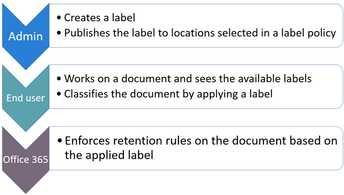

# Informationen zu Aufbewahrungsbezeichnungen

>*[Microsoft 365-Lizenzierungsleitfaden für Sicherheit und Compliance](https://aka.ms/ComplianceSD).*

Across your organization, you probably have different types of content that require different actions taken on them in order to comply with industry regulations and internal policies. For example, you might have:
  
- Steuerformulare, die für einen bestimmten Zeitraum **aufbewahrt** werden müssen. 
    
- Pressematerialien, die nach dem Erreichen eines bestimmten Alters **dauerhaft gelöscht** werden müssen. 
    
- Im Wettbewerb stehende Forschungen, die sowohl **aufbewahrt** als auch anschließend **dauerhaft gelöscht** werden müssen. 
    
- Arbeitsvisa, die **als Datensatz gekennzeichnet** werden müssen, damit sie nicht bearbeitet oder gelöscht werden. 
    
In all of these cases, retention labels can help you take the right actions on the right content. With retention labels, you can classify data across your organization for governance, and enforce retention rules based on that classification.
  
Mit Aufbewahrungsbezeichnungen können Sie Folgendes:
  
- **Enable people in your organization to apply a retention label manually** to content in Outlook on the web, Outlook 2010 and later, OneDrive, SharePoint, and Microsoft 365 Groups. Users often know best what type of content they're working with, so they can classify it and have the appropriate policy applied. 
    
- **Sie können Aufbewahrungsbezeichnungen automatisch** auf Inhalt anwenden, wenn er bestimmten Bedingungen entspricht: 
    
    - Der Inhalt enthält bestimmte vertrauliche Informationen.
    
    - Der Inhalt enthält bestimmte Stichwörter, die einer von Ihnen erstellten Abfrage entsprechen.
    
    - Musterübereinstimmungen für eine trainierbare Klassifizierung.
    
  Die Möglichkeit, Aufbewahrungsbezeichnungen automatisch auf Inhalte anzuwenden, ist aus den folgenden Gründen wichtig:
    
     - Sie müssen die Benutzer nicht schulen, damit sie alle Ihre Klassifizierungen kennen.
    
     - Sie müssen sich nicht darauf verlassen, dass die Benutzer alle Inhalte richtig klassifizieren.
    
   - Benutzer müssen nicht mehr über Governance-Richtlinien Bescheid wissen, sondern können sich stattdessen auf ihre Arbeit konzentrieren.

- **Wenden Sie eine Standardaufbewahrungsbezeichnung auf eine Dokumentbibliothek, einen Ordner oder eine Dokumentenmappe** in SharePoint an, sodass alle an diesem Speicherort gespeicherten Dokumente mit der Standardaufbewahrungsbezeichnung versehen werden.

Aufbewahrungsbezeichnungen unterstützen darüber hinaus die [Datensatzverwaltung](records-management.md) für E-Mails und Dokumente in Microsoft 365-Apps und -Diensten. Sie können Aufbewahrungsbezeichnungen verwenden, um Inhalte als Datensätze zu kennzeichnen. Wenn dies geschieht und die Inhalte in Microsoft 365 bleiben, kann die Bezeichnung nicht geändert oder entfernt und die Inhalte können nicht bearbeitet oder gelöscht werden. 

Aufbewahrungsbezeichnungen bleiben im Gegensatz zu [Vertraulichkeitsbezeichnungen](sensitivity-labels.md) nicht erhalten, wenn der Inhalt außerhalb von Microsoft 365 verschoben wird.

Für die Anzahl der Aufbewahrungsbezeichnungen, die für einen Mandanten unterstützt werden, gibt es keine Beschränkung. Es werden jedoch maximal 10.000 Richtlinien für einen Mandanten unterstützt. Dazu gehören die Richtlinien, mit denen die Bezeichnungen angewendet werden (Aufbewahrungsbezeichnungsrichtlinien und automatische Aufbewahrungsrichtlinien), sowie Aufbewahrungsrichtlinien.

## Funktionsweise von Aufbewahrungsbezeichnungen bei Aufbewahrungsbezeichnungsrichtlinien

Der Vorgang, mit dem Personen in Ihrer Organisation Aufbewahrungsbezeichnungen zur Verfügung gestellt werden, damit sie Inhalte klassifizieren können, besteht aus zwei Schritten: 

1. Erstellen der Aufbewahrungsbezeichnungen

2. Veröffentlichen der Aufbewahrungsbezeichnungen mithilfe einer Aufbewahrungsbezeichnungsrichtlinie
  

  
Aufbewahrungsbezeichnungen sind unabhängige, wiederverwendbare Bausteine, die in einer oder mehreren Aufbewahrungsbezeichnungsrichtlinien enthalten sind. Der Hauptzweck der Aufbewahrungsbezeichnungsrichtlinie besteht darin, eine Reihe von Aufbewahrungsbezeichnungen zu gruppieren und die Orte anzugeben, an denen die Bezeichnungen angezeigt werden sollen.
  

  
1. Wenn Sie Aufbewahrungsbezeichnungen veröffentlichen, werden sie in eine Aufbewahrungsbezeichnungsrichtlinie einbezogen. Die Namen von Aufbewahrungsbezeichnungen sind unveränderlich, das bedeutet, sie können nach ihrer Erstellung nicht mehr bearbeitet werden.

2. Eine einzelne Aufbewahrungsbezeichnung kann in mehrere Aufbewahrungsbezeichnungsrichtlinien einbezogen werden.

3. Ein einzelner Ort kann auch in viele Aufbewahrungsbezeichnungsrichtlinien einbezogen werden.
    
3. Aufbewahrungsbezeichnungsrichtlinien geben die Speicherorte zum Veröffentlichen der Aufbewahrungsbezeichnungen an.
    
## Jeweils nur eine Aufbewahrungsbezeichnung

Es ist wichtig zu wissen, dass ein Inhalt wie eine E-Mail-Nachricht oder ein Dokument jeweils nur über eine Aufbewahrungsbezeichnung verfügen kann:
  
- Aufbewahrungsbezeichnungen, die von den Endbenutzern manuell zugewiesen wurden, können entfernt oder geändert werden.
    
- Wenn eine Bezeichnung einem Inhalt automatisch zugewiesen wurde, kann diese automatisch zugewiesene Aufbewahrungsbezeichnung durch eine vom Endbenutzer manuell zugewiesene Bezeichnung ersetzt werden.
    
- Wenn einem Inhalt eine Aufbewahrungsbezeichnung manuell von einem Endbenutzer zugewiesen wurde, kann diese manuell zugewiesene Aufbewahrungsbezeichnung nicht durch eine automatisch zugewiesene Bezeichnung ersetzt werden.
    
- Wenn es mehrere Regeln gibt, durch die eine Bezeichnung automatisch zugewiesen wird, und ein Inhalt die Bedingungen verschiedener Regeln erfüllt, wird die Aufbewahrungsbezeichnung für die älteste Regel angewendet.
    
Um zu verstehen, wie und warum eine Aufbewahrungsbezeichnung und nicht eine andere angewendet wird, ist es hilfreich, den Unterschied zwischen der expliziten und der impliziten Zuweisung einer Bezeichnung nachzuvollziehen:

- Manuell zugewiesene Bezeichnungen sind explizit zugewiesen.
- Automatisch angewendete Bezeichnungen sind implizit zugewiesen.

Eine explizit zugewiesene Aufbewahrungsbezeichnung hat Vorrang vor einer implizit zugewiesenen. Weitere Informationen finden Sie im Abschnitt [Die Grundsätze der Aufbewahrung, oder was hat Vorrang?](#the-principles-of-retention-or-what-takes-precedence) auf dieser Seite.

## Aufbewahrungsbezeichnungsrichtlinien und Speicherorte

Verschiedene Arten von Aufbewahrungsbezeichnungen können an verschiedenen Speicherorten veröffentlicht werden, je nach Funktion der Aufbewahrungsbezeichnung.
  
|**Wenn für die Aufbewahrungsbezeichnung Folgendes gilt:**|**So kann die Bezeichnungsrichtlinie angewendet werden auf...**|
|:-----|:-----|
|für Endbenutzer veröffentlicht    |Exchange, SharePoint, OneDrive, Microsoft 365-Gruppen    |
|basierend auf Typen vertraulicher Informationen automatisch angewendet    |Exchange (nur alle Postfächer), SharePoint, OneDrive    |
|basieren auf einer Abfrage automatisch angewendet    |Exchange, SharePoint, OneDrive, Microsoft 365-Gruppen    |
   
In Exchange werden automatisch angewendete Bezeichnungen (sowohl für Abfragen als auch für vertrauliche Informationstypen) nur auf neu gesendete Nachrichten (in Übertragung begriffene Daten) angewendet, und nicht auf alle Elemente, die sich derzeit im Postfach befinden (ruhende Daten). Außerdem können automatisch angewendete Aufbewahrungsbezeichnungen für vertrauliche Informationstypen nur auf alle Postfächer angewendet werden; Sie können keine bestimmten Postfächer dafür auswählen.
  
Öffentliche Exchange-Ordner, Skype- und Teams-Kanalnachrichten und -Chats unterstützen keine Aufbewahrungskennzeichnungen.

## So erzwingen Aufbewahrungsbezeichnungen die Aufbewahrung

Aufbewahrungsbezeichnungen können die gleichen Aufbewahrungsaktionen wie eine Aufbewahrungsrichtlinie erzwingen: aufbewahren und dann löschen, nur aufbewahren oder nur löschen. Sie können Aufbewahrungskennzeichnungen verwenden, um einen detaillierten Dateiplan zu implementieren, der für bestimmte Dateien verschiedene Aufbewahrungseinstellungen festlegt. Näheres über die Aufbewahrung erfahren Sie unter [Informationen zu Aufbewahrungsrichtlinien](retention-policies.md).

In addition, a retention label has two retention options that are available only in a retention label and not in a retention policy. With a retention label, you can:
  
- Auslösen einer Löschungsprüfung am Ende des Aufbewahrungszeitraums, damit SharePoint- und OneDrive-Dokumente überprüft werden müssen, bevor sie gelöscht werden können. Weitere Informationen finden Sie unter [Löschungsprüfungen](disposition.md#disposition-reviews).
    
- Beginnen des Aufbewahrungszeitraums zu dem Zeitpunkt, an dem der Inhalt mit der Bezeichnung versehen wurde, und nicht ausgehend vom Alter des Inhalts oder dem Zeitpunkt, zu dem er zuletzt geändert wurde. Wenn Sie diese Option verwenden:
    - Gilt sie nur für Inhalte auf SharePoint-Websites und in OneDrive-Konten. Bei Exchange-E-Mails basiert der Aufbewahrungszeitraum immer auf dem Datum, an dem die Nachricht gesendet oder empfangen wurde.
    - Sie können den Aufbewahrungszeitraum nach dem Speichern der Bezeichnung nicht ändern.
    

Ein weiterer wichtiger Unterschied besteht darin, dass Benutzer die Datei nicht löschen können, während der Aufbewahrungszeitraum erzwungen wird, wenn Sie eine Aufbewahrungskennzeichnung anstelle einer Aufbewahrungsrichtlinie auf Dateien in SharePoint anwenden und die Kennzeichnungen für die Aufbewahrung von Inhalten konfiguriert ist. Benutzer können Inhalte löschen, wenn dieselbe Bezeichnung auf Dateien in OneDrive und auf E-Mails angewendet wird, es sei denn, der Inhalt wird als Datensatz gekennzeichnet.

## Wo veröffentlichte Aufbewahrungsbezeichnungen Endbenutzern verfügbar gemacht werden können

Wenn Endbenutzer Aufbewahrungsbezeichnungen auf Inhalte anwenden, können Sie die Bezeichnungen an den folgenden Speicherorten veröffentlichen:
  
- Outlook und Outlook im Web
    
- OneDrive
    
- SharePoint
    
- Microsoft 365-Gruppen (sowohl die Gruppenwebsite als auch das Gruppenpostfach in Outlook im Web)
    
In den folgenden Abschnitten wird erläutert, wie Bezeichnungen den Endbenutzern in Ihrer Organisation in verschiedenen Apps angezeigt werden.
  

### Outlook

Wenn Sie ein Element im Outlook-Desktop-Client beschriften möchten, wählen Sie es zunächst aus. Klicken Sie im Menüband auf der Registerkarte **Start** auf **Richtlinie zuweisen**, und wählen Sie dann die gewünschte Aufbewahrungsbezeichnung aus. 
  

  
Sie können auch mit der rechten Maustaste auf ein Element klicken, im Kontextmenü auf **Richtlinie zuweisen** klicken, und dann die gewünschte Aufbewahrungsbezeichnung auswählen. 

Nachdem die Aufbewahrungsbezeichnung angewendet wurde, können Sie sie zusammen mit der von ihr ausgeführten Aktion über dem Element anzeigen. Wenn einer E-Mail eine Aufbewahrungsbezeichnung und damit verbunden ein Aufbewahrungszeitraum zugeordnet wurde, können Sie auf einen Blick sehen, wann die E-Mail abläuft.
  
Sie können Aufbewahrungsbezeichnungen auch auf Ordner anwenden. Hierbei gilt Folgendes:
  
- Alle Elemente im Ordner erhalten automatisch dieselbe Aufbewahrungsbezeichnung, **mit Ausnahme von Elementen**, auf die eine Aufbewahrungsbezeichnung explizit angewendet wurde. Explizit bezeichnete Elemente behalten die bestehende Aufbewahrungsbezeichnung bei. Weitere Informationen finden Sie im Abschnitt [Die Grundsätze der Aufbewahrung, oder was hat Vorrang?](#the-principles-of-retention-or-what-takes-precedence) auf dieser Seite. 
    
- Wenn Sie die Standardaufbewahrungsbezeichnung eines Ordners ändern oder entfernen, wird die Aufbewahrungsbezeichnung ebenfalls für alle Elemente in dem Ordner geändert oder entfernt, **mit Ausnahme von** Elementen, die über explizit zugewiesene Aufbewahrungsbezeichnungen verfügen. 
    
- Wenn Sie ein Element mit einer Standardaufbewahrungsbezeichnung von einem Ordner in einen anderen Ordner mit einer anderen Standardaufbewahrungsbezeichnung verschieben, erhält das Element die neue Standardaufbewahrungsbezeichnung.
    
- Wenn Sie ein Element mit einer Standardaufbewahrungsbezeichnung von einem Ordner in einen anderen Ordner ohne Standardaufbewahrungsbezeichnung verschieben, wird die alte Standardaufbewahrungsbezeichnung entfernt.

### Outlook im Web

Um ein Element in Outlook im Web mit einer Bezeichnung zu versehen: Mit der rechten Maustaste auf das Element klicken \> **Richtlinie zuweisen** \> Aufbewahrungsbezeichnung auswählen. 
  

  
After the retention label is applied, you can view that retention label and what action it takes at the top of the item. If an email is classified and has an associated retention period, you can know at a glance when the email will expire.
  

  
Wie bei Outlook im Web können Sie Aufbewahrungsbezeichnungen auch auf Ordner anwenden. 

### OneDrive und SharePoint

Um in OneDrive oder SharePoint ein Dokument mit einer Bezeichnung zu versehen (einschließlich OneNote-Dateien), wählen Sie das entsprechende Element \> in der oberen rechten Ecke aus, wählen Sie **Detailfenster öffnen** \> **Aufbewahrungsbezeichnung anwenden** \> Aufbewahrungsbezeichnung auswählen. 
  
Sie können eine Aufbewahrungsbezeichnung auch auf einen Ordner- oder Dokumentensatz anwenden sowie eine [Standardaufbewahrungsbezeichnung für eine Dokumentbibliothek](#applying-a-default-retention-label-to-all-content-in-a-sharepoint-library-folder-or-document-set) festlegen.
  

  
Nachdem eine Aufbewahrungsbezeichnung auf ein Element angewendet wurde, wird sie im Detailbereich angezeigt, wenn das Element ausgewählt wird.
  

  
Für SharePoint, aber nicht OneDrive, können Sie eine Bibliotheksansicht erstellen, die die Spalten **Bezeichnungen** oder **Element ist ein Datensatz** enthält. In dieser Ansicht sehen Sie auf einen Blick die Aufbewahrungsbezeichnungen, die allen Elementen zugeordnet sind, und bei welchen Elementen es sich um Datensätze handelt. Beachten Sie jedoch, dass Sie die Ansicht nicht nach der Spalte **Element ist ein Datensatz** filtern können. Anweisungen zum Hinzufügen von Spalten finden Sie unter [Ein- oder Ausblenden von Spalten in einer Liste oder Bibliothek](https://support.microsoft.com/de-DE/office/show-or-hide-columns-in-a-list-or-library-b820db0d-9e3e-4ff9-8b8b-0b2dbefa87e2).

### Microsoft 365-Gruppen

Wenn Sie Aufbewahrungsbezeichnungen für Microsoft 365-Gruppen ([vormals Office 365-Gruppen](https://techcommunity.microsoft.com/t5/microsoft-365-blog/office-365-groups-will-become-microsoft-365-groups/ba-p/1303601)) veröffentlichen, werden diese sowohl auf der Gruppen-Website als auch im Gruppenpostfach in Outlook im Web angezeigt. Die Vorgehensweise zum Anwenden einer Aufbewahrungsbezeichnung auf Inhalte ist mit der für E-Mails und Dokumente identisch.

Wenn Sie Inhalte für eine Microsoft 365-Gruppe aufbewahren möchten, verwenden Sie den **Office 365-Gruppen**-Speicherort. Obwohl eine Microsoft 365-Gruppe über ein Exchange-Postfach verfügt, bezieht eine Aufbewahrungsrichtlinie, die den gesamten Exchange-Speicherort umfasst, keine Inhalte in Microsoft 365-Gruppenpostfächern mit ein.

Außerdem ist es nicht möglich, den Exchange-Speicherort für den Ein- oder Ausschluss eines bestimmten Gruppenpostfachs zu verwenden. Obwohl der Exchange-Speicherort zunächst die Auswahl eines Gruppenpostfachs zulässt, erhalten Sie beim Versuch, die Aufbewahrungsrichtlinie zu speichern, die Fehlermeldung, dass "RemoteGroupMailbox" keine gültige Auswahl für den Exchange-Speicherort ist.
  
Erstellen und konfigurieren Sie zunächst die Vertraulichkeitsbezeichnungen, die Sie für Apps und andere Dienste zur Verfügung stellen möchten, zum Beispiel die Bezeichnungen, die Benutzer in Office-Apps sehen und anwenden sollen. 

Erstellen Sie dann eine oder mehrere Bezeichnungsrichtlinien mit den von Ihnen konfigurierten Bezeichnungen und Richtlinieneinstellungen. Es ist die Bezeichnungsrichtlinie, die die Bezeichnungen und Einstellungen für die von Ihnen ausgewählten Benutzer und Standorte veröffentlicht.

## Automatisches Zuweisen einer Aufbewahrungsbezeichnung basierend auf Bedingungen

Eines der leistungsstärksten Features von Aufbewahrungsbezeichnungen ist die Möglichkeit, sie automatisch auf Inhalte anzuwenden, die bestimmte Bedingungen erfüllen. In diesem Fall müssen die Personen in Ihrer Organisation die Bezeichnungen nicht selber anwenden. Das wird von Microsoft 365 erledigt.
  

  
Das automatische Anwenden von Aufbewahrungsbezeichnungen ist aus den folgenden Gründen besonders effektiv:
  
- Sie müssen die Benutzer nicht schulen, damit sie alle Ihre Klassifizierungen kennen.
    
- Sie müssen sich nicht darauf verlassen, dass die Benutzer alle Inhalte richtig klassifizieren.
    
- Benutzer müssen nicht mehr über Governance-Richtlinien Bescheid wissen, sondern können sich stattdessen auf ihre Arbeit konzentrieren.
    
Sie können Aufbewahrungsbezeichnungen automatisch auf Inhalte anwenden, wenn diese folgende Bedingungen erfüllen:
  
- [Der Inhalt enthält bestimmte vertrauliche Informationen.](create-retention-labels.md#auto-apply-labels-to-content-with-specific-types-of-sensitive-information)
    
- [Der Inhalt enthält bestimmte Stichwörter, die einer von Ihnen erstellten Abfrage entsprechen.](create-retention-labels.md#auto-apply-labels-to-content-with-keywords-or-searchable-properties)

- [Eine Übereinstimmung für trainierbare Klassifizierungen](create-retention-labels.md#auto-apply-labels-to-content-by-using-trainable-classifiers)
    

> [!TIP]
> Unter [Verwalten des Lebenszyklus von SharePoint-Dokumenten mithilfe von Aufbewahrungsbezeichnungen](auto-apply-retention-labels-scenario.md)finden Sie ein detailliertes Szenario zur Verwendung von verwalteten Eigenschaften in SharePoint, um Aufbewahrungsbezeichnungen automatisch anzuwenden und die ereignisgesteuerte Aufbewahrung zu implementieren.

## Anwenden einer Standardaufbewahrungsbezeichnung auf alle Inhalte in einer SharePoint-Bibliothek, einem Ordner oder einer Dokumentenmappe

Sie können es Personen nicht nur ermöglichen, eine Aufbewahrungsbezeichnung auf einzelne Dokumente anzuwenden, sondern Sie können eine Standardaufbewahrungsbezeichnung auf eine SharePoint-Bibliothek, einen Ordner oder eine Dokumentenmappe anwenden, sodass alle Dokumente in diesem Speicherort diese Standardaufbewahrungsbezeichnung erhalten.
  
Bei einer Dokumentbibliothek geschieht das auf der Seite **Bibliothekseinstellungen**. Wenn Sie die standardmäßige Aufbewahrungsbezeichnung auswählen, können Sie auch auswählen, dass sie auf vorhandene Elemente in der Bibliothek angewendet werden soll. 
  
Wenn Sie zum Beispiel über ein Tag für Marketingmaterial verfügen und wissen, dass eine bestimmte Dokumentenbibliothek nur diese Art von Inhalt enthält, können Sie das Marketingmaterial-Tag als Standard für alle Dokumente in dieser Bibliothek festlegen.
  

  
Wenn Sie eine Standardaufbewahrungsbezeichnung auf vorhandene Elemente in der Bibliothek, im Ordner oder in der Dokumentenmappe anwenden:
  
- Alle Elemente in der Bibliothek, dem Ordner oder der Dokumentenmappe erhalten automatisch dieselbe Aufbewahrungsbezeichnung, **mit Ausnahme von Elementen**, auf die eine Aufbewahrungsbezeichnung explizit angewendet wurde (z. B. Datensätze). Explizit bezeichnete Elemente behalten diese Bezeichnung bei. Weitere Informationen finden Sie weiter unten im Abschnitt [Die Grundsätze der Aufbewahrung, oder was hat Vorrang?](#the-principles-of-retention-or-what-takes-precedence)
    
- Wenn Sie die Standardaufbewahrungsbezeichnung einer Bibliothek, eines Ordners oder einer Dokumentenmappe ändern oder entfernen, wird die Aufbewahrungsbezeichnung ebenfalls für alle Elemente in der Bibliothek, im Ordner oder in der Dokumentenmappe geändert oder entfernt, **mit Ausnahme von** Elementen, die über explizit zugewiesene Aufbewahrungsbezeichnungen verfügen (z. B. Datensätze).
    
- Wenn Sie ein Element mit einer Standardaufbewahrungsbezeichnung aus einer Sitesammlung, Bibliothek, einem Ordner oder einer Dokumentenmappe in eine andere Sitesammlung, Bibliothek, einen Ordner oder eine Dokumentenmappe verschieben, behält das Element die vorhandene Standardaufbewahrungsbezeichnung auch dann, wenn der neue Speicherort eine andere Standardaufbewahrungsbezeichnung hat. Wenn das Element vor dem Verschieben nicht mit einer Bezeichnung versehen ist, nimmt es die Standardaufbewahrungsbezeichnung des neuen Speicherorts an.

**Einträge:** Wenn Sie eine Standarddatensatzbezeichnung auf eine Bibliothek, einen Ordner oder eine Dokumentenmappe anwenden, wird eine Datensatzbezeichnung auf jedes einzelne Element innerhalb dieser Speicherorte angewendet. Wenn Sie ein neues Element an einen Speicherort mit einer Datensatzbezeichnung verschieben, erhält dieses Element eine Bezeichnung als Datensatz. Wenn Sie die Standardaufbewahrungsbezeichnung jedoch in eine Bezeichnung ändern, die Inhalt nicht als Datensatz deklariert, wird die Datensatzbezeichnung durch diese Aktion nicht von den einzelnen Elementen entfernt, und die einzelnen Elemente behalten ihre Datensatzbezeichnung. Nur ein Websitesammlungsadministrator kann die Aufbewahrungsbezeichnung von Datensatzelementen explizit entfernen oder ändern.

Weitere Informationen zu Aufbewahrungsbezeichnungen, die Inhalte als Datensatz deklarieren, finden Sie unter [Informationen zu Datensätzen](records.md).

## Anwenden einer Aufbewahrungsbezeichnung auf E-Mails mithilfe von Regeln

In Outlook können Sie Regeln zum Anwenden einer Aufbewahrungsbezeichnung oder Aufbewahrungsrichtlinie erstellen.
  
Sie können zum Beispiel eine Regel erstellen, die eine bestimmte Aufbewahrungsbezeichnung auf alle Nachrichten anwendet, die an eine oder von einer bestimmten Verteilergruppe gesendet werden.
  
So erstellen Sie eine Regel: Rechtsklick auf ein Element \> **Regeln** \> **Regel erstellen** \> **Erweiterte Optionen** \> **Regel-Assistent** \> **Aufbewahrungsrichtlinie anwenden**.
  

  
## Klassifizieren von Inhalten ohne Anwendung von Aktionen

Sie können eine Aufbewahrungsbezeichnung erstellen, ohne eine Aufbewahrungsaktion oder sonstige Aktionen aktivieren zu müssen. In diesem Fall können Sie eine Aufbewahrungsbezeichnung einfach als Beschriftung verwenden, ohne irgendwelche Aktionen zu erzwingen.
  
Sie können beispielsweise die Aufbewahrungsbezeichnung „Später überprüfen“ ohne Aktionen erstellen und diese Aufbewahrungsbezeichnung dann automatisch auf Inhalte mit vertraulichen Informationen oder auf abgefragte Inhalte anwenden.
  

  
## Verwenden von Aufbewahrungsbezeichnungen für die Datensatzverwaltung
    
Sie können Aufbewahrungsbezeichnungen verwenden, um Inhalte als Datensätze zu klassifizieren. Auf diese Weise können Sie eine einzige, einheitliche Strategie zur Datensatzverwaltung in Microsoft 365 einrichten. Weitere Informationen finden Sie unter [Informationen zu Datensätzen](records.md).
  
## Verwenden einer Aufbewahrungsbezeichnung als Bedingung in einer DLP-Richtlinie

A retention label can enforce retention actions on content. In addition, you can use a retention label as a condition in a data loss prevention (DLP) policy, and the DLP policy can enforce other actions, such as restricting access, on content that contains a specific label. 
  
Weitere Informationen finden Sie unter [Verwenden einer Aufbewahrungsbezeichnung als Bedingung in einer DLP-Richtlinie](data-loss-prevention-policies.md#using-a-retention-label-as-a-condition-in-a-dlp-policy).
  

## Die Grundsätze der Aufbewahrung, oder was hat Vorrang?

It's possible or even likely that content might have several retention policies applied to it, each with a different action (retain, delete, or both) and retention period. What takes precedence? At the highest level, rest assured that content being retained by one policy can't be permanently deleted by another policy.
  

  
Um zu verstehen, wie verschiedene Bezeichnungen mit Aufbewahrungsrichtlinien auf Inhalte angewendet werden, sollten Sie diese Grundsätze der Aufbewahrung beachten:
  
1. **Retention wins over deletion.** Suppose that one retention policy says to delete Exchange email after three years, but another retention policy says to retain Exchange email for five years and then delete it. Any content that reaches three years old will be deleted and hidden from the users' view, but still retained in the Recoverable Items folder until the content reaches five years old, when it will be permanently deleted. 
    
2. **The longest retention period wins.** If content's subject to multiple policies that retain content, it will be retained until the end of the longest retention period. 
    
3. **Explicit inclusion wins over implicit inclusion.** This means: 
    
    1. Wenn eine Aufbewahrungsbezeichnung mit Einstellungen für die Aufbewahrung von einem Benutzer manuell einem Element, z. B. einer Exchange-E-Mail oder einem OneDrive-Dokument, zugewiesen wird, hat diese Aufbewahrungsbezeichnung sowohl Vorrang vor einer Richtlinie, die auf Website- oder Postfachebene zugewiesen wurde, als auch vor einer Standard-Aufbewahrungsbezeichnung, die von der Dokumentbibliothek zugewiesen wurde. Wenn beispielsweise die explizite Aufbewahrungsbezeichnung eine Aufbewahrung über zehn Jahre angibt, die der Website zugewiesene Aufbewahrungsrichtlinie hingegen eine Aufbewahrung über nur fünf Jahre, hat die Aufbewahrungsbezeichnung Vorrang. Automatisch zugewiesene Aufbewahrungsbezeichnungen werden als implizit und nicht explizit angesehen, da sie von Microsoft 365 automatisch angewendet werden.
    
    2. Wenn eine Aufbewahrungsrichtlinie einen bestimmten Speicherort wie das Postfach oder OneDrive-Konto eines bestimmten Benutzers umfasst, hat diese Richtlinie Vorrang vor einer anderen Aufbewahrungsrichtlinie, die für alle Postfächer oder OneDrive-Konten von Benutzern gilt, aber nicht das Postfach dieses Benutzers speziell einschließt.
    
4. **The shortest deletion period wins.** Similarly, if content's subject to multiple policies that delete content (with no retention), it will be deleted at the end of the shortest retention period. 
    
Beachten Sie: Wenn die Regeln, die von allen Richtlinien oder Kennzeichnungen angewendet werden, auf einer Ebene identisch sind, bewegt sich der Fluss nach unten zur nächsten Ebene, wo entschieden wird, welche Regel Vorrang hat.
  
Inhalt, der für eDiscovery gesperrt ist, kann nicht dauerhaft aufgrund einer Aufbewahrungsrichtlinie oder -bezeichnung gelöscht werden. Wenn die Sperre aufgehoben wird, ist der Inhalt wieder für den oben beschriebenen Bereinigungsprozess verfügbar.

### Vorrang für das automatische Bezeichnen mit trainierbaren Klassifizierungsmerkmalen

Alle Aufbewahrungsbezeichnungen, die für trainierbare Klassifizierungsmerkmale konfiguriert sind, werden gleichzeitig ausgewertet. Wird ein Element von mehr als einem trainierbaren Klassifizierungsmerkmal erkannt, wird anhand der folgenden Kriterien bestimmt, welche Aufbewahrungsbezeichnungen anzuwenden ist:

1. Aufbewahrungsbezeichnungen, die für "nur aufbewahren" oder "aufbewahren und anschließend löschen" konfiguriert sind, haben Vorrang vor Aufbewahrungsbezeichnungen, die für "nur löschen" konfiguriert sind.

2. Bei Aufbewahrungsbezeichnungen, die für "nur aufbewahren" oder "aufbewahren und anschließend löschen" konfiguriert sind, gilt die Aufbewahrungsbezeichnung, die für die längste Aufbewahrung konfiguriert ist.

3. Bei Aufbewahrungsbezeichnungen, die für "nur löschen" konfiguriert sind, gilt die Aufbewahrungsbezeichnung, die für den kürzesten Zeitraum konfiguriert ist.

4. Aufbewahrungsbezeichnungen mit derselben Aktion und dem gleichen Zeitraum führen zu einer nicht deterministischen Auswahl der Aufbewahrungsbezeichnung.

## Aufbewahrungsbezeichnungen überwachen

Nachdem Sie Ihre Aufbewahrungsbezeichnungen veröffentlicht oder automatisch angewendet haben, sollten Sie überprüfen, ob sie auf Inhalte wie gewünscht angewendet werden. So überwachen Sie Ihre Aufbewahrungsbezeichnungen:
  
- **Der Bezeichnungsaktivitäten-Explorer**. Mit dem Explorer (Beispiel im Bild unten) können Sie Aktivitäten von Aufbewahrungsbezeichnungen für alle Inhalte in SharePoint und OneDrive während der letzten 30 Tage schnell suchen und anzeigen. Weitere Informationen finden Sie unter [Bezeichnungaktivitäten für Dokumente anzeigen](view-label-activity-for-documents.md).

- Seite zur **Analyse von Bezeichnungen**. Im Microsoft 365 Compliance Center und Microsoft 365 Security Center können Sie schnell sehen, welche Aufbewahrungsbezeichnungen am häufigsten verwendet werden und wo sie angewendet werden. Außerdem können Sie alle Inhalte mit einer bestimmten Aufbewahrungsbezeichnung anzeigen. Weitere Informationen finden Sie unter [Anzeigen der Bezeichnungsnutzung mit der Analyse der Bezeichnungen](label-analytics.md).
    
- **Daten-Governance-Berichte**. Mit diesem Berichten können Sie Trends und Aktivitäten von Aufbewahrungsbezeichnungen für alle Inhalte in Exchange, SharePoint und OneDrive während der letzten 90 Tage schnell anzeigen. Weitere Informationen finden Sie unter [Anzeigen der Daten-Governance-Berichte](view-the-data-governance-reports.md).
    

## Verwenden der Inhaltssuche zum Suchen des gesamten Inhalts, auf den eine bestimmte Aufbewahrungsbezeichnung angewendet wurde

Nachdem die Aufbewahrungsbezeichnungen den Inhalten entweder von Benutzern oder automatisch zugewiesen wurden, können Sie mit der Inhaltssuche alle Inhalte finden, die mit einer bestimmten Aufbewahrungsbezeichnung klassifiziert sind.
  
Wählen Sie beim Erstellen einer Inhaltssuche die Bedingung **Compliancebezeichnung** aus, und geben Sie den Namen der Aufbewahrungsbezeichnung vollständig oder teilweise (mit einem Platzhalter) ein. Weitere Informationen finden Sie unter [Stichwortabfragen und Suchbedingungen für die Inhaltssuche](keyword-queries-and-search-conditions.md).
  

  
## Verwenden von Aufbewahrungsbezeichnungen anstelle älterer Features

Aufbewahrungsbezeichnungen können auf einfache Weise der gesamten Organisation und deren Inhalten überall in Microsoft 365 – einschließlich Exchange, SharePoint, OneDrive und Microsoft 365-Gruppen – zur Verfügung gestellt werden. Wenn Sie an einer beliebigen Stelle in Microsoft 365 Inhalte aufbewahren oder löschen oder Datensätze verwalten müssen, empfiehlt sich die Verwendung von Aufbewahrungsbezeichnungen.
  
Es gibt mehrere andere Features, die zuvor zum Aufbewahren oder Löschen von Inhalten oder zum Verwalten von Datensätzen in Microsoft 365 verwendet wurden. Diese Features funktionieren weiterhin Seite an Seite mit Aufbewahrungsbezeichnungen. Es gibt zwar Fälle, in denen sich die Implementierung von Aufbewahrungsbezeichnungen von früheren Features unterscheidet, die Entwicklung von Aufbewahrungsbezeichnungen wird jedoch die Zukunft der Datensatzverwaltung in Microsoft 365 bestimmen. Daher wird im Hinblick auf Datengovernance auf lange Sicht empfohlen, Aufbewahrungsbezeichnungen anstelle der nachfolgend aufgeführten älteren Features zu verwenden.
  
### Exchange Online

- [Aufbewahrungstags und Aufbewahrungsrichtlinien](https://go.microsoft.com/fwlink/?linkid=846125), auch bekannt als [Messaging-Datensatzverwaltung](https://go.microsoft.com/fwlink/?linkid=846126) (Nur Löschen) 
    
### SharePoint und OneDrive

- [Konfiguration der direkten Datensatzverwaltung](https://support.office.com/article/7707a878-780c-4be6-9cb0-9718ecde050a) (Aufbewahrung) 
    
- [Einführung in das Datenarchiv](https://support.office.com/article/bae6ca5a-7b19-40e0-b433-e3613a747c2c) (Aufbewahrung) 
    
- [Richtlinien zur Informationsverwaltung](intro-to-info-mgmt-policies.md) (Nur Löschen) 
    
## Nächste Schritte

Wenn Sie bereit sind, Aufbewahrungsbezeichnungen zu erstellen und zu veröffentlichen, lesen Sie [Erstellen, Veröffentlichen und automatisches Anwenden von Aufbewahrungsbezeichnungen](create-retention-labels.md).
