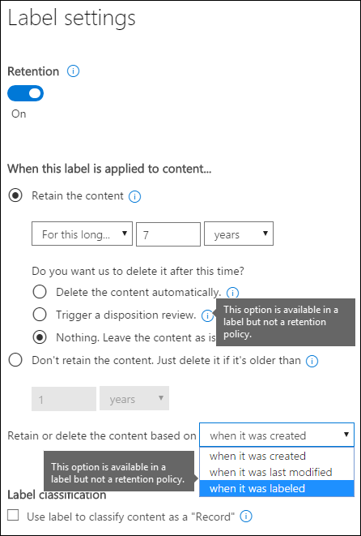
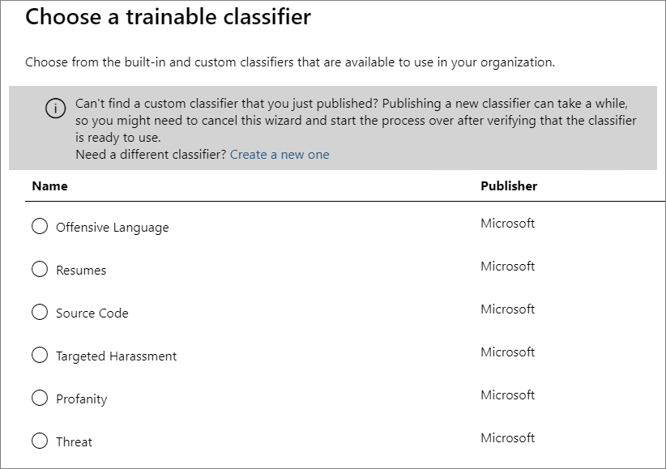

# <a name="overview-of-retention-labels"></a><span data-ttu-id="92edc-104">Übersicht über Aufbewahrungsbezeichnungen</span><span class="sxs-lookup"><span data-stu-id="92edc-104">Overview of retention labels</span></span>

><span data-ttu-id="92edc-105">*[Microsoft 365-Lizenzierungsleitfaden für Sicherheit und Compliance](https://aka.ms/ComplianceSD).*</span><span class="sxs-lookup"><span data-stu-id="92edc-105">*[Microsoft 365 licensing guidance for security & compliance](https://aka.ms/ComplianceSD).*</span></span>

<span data-ttu-id="92edc-p102">In Ihrer Organisation verwenden Sie wahrscheinlich verschiedene Arten von Inhalten, für die unterschiedliche Aktionen ausgeführt werden müssen, um branchenspezifische Vorschriften und interne Richtlinien einzuhalten. Dies kann zum Beispiel die folgenden Inhalte umfassen:</span><span class="sxs-lookup"><span data-stu-id="92edc-p102">Across your organization, you probably have different types of content that require different actions taken on them in order to comply with industry regulations and internal policies. For example, you might have:</span></span>
  
- <span data-ttu-id="92edc-108">Steuerformulare, die für einen bestimmten Zeitraum **aufbewahrt** werden müssen.</span><span class="sxs-lookup"><span data-stu-id="92edc-108">Tax forms that need to be **retained** for a minimum period of time.</span></span> 
    
- <span data-ttu-id="92edc-109">Pressematerialien, die nach dem Erreichen eines bestimmten Alters **dauerhaft gelöscht** werden müssen.</span><span class="sxs-lookup"><span data-stu-id="92edc-109">Press materials that need to be **permanently deleted** when they reach a certain age.</span></span> 
    
- <span data-ttu-id="92edc-110">Im Wettbewerb stehende Forschungen, die sowohl **aufbewahrt** als auch anschließend **dauerhaft gelöscht** werden müssen.</span><span class="sxs-lookup"><span data-stu-id="92edc-110">Competitive research that needs to be both **retained** and then **permanently deleted**.</span></span> 
    
- <span data-ttu-id="92edc-111">Arbeitsvisa, die **als Datensatz gekennzeichnet** werden müssen, damit sie nicht bearbeitet oder gelöscht werden.</span><span class="sxs-lookup"><span data-stu-id="92edc-111">Work visas that must be **marked as a record** so that they can't be edited or deleted.</span></span> 
    
<span data-ttu-id="92edc-p103">In all diesen Fällen können Aufbewahrungsbezeichnungen in Office 365 Ihnen dabei helfen, die richtigen Maßnahmen für die entsprechenden Inhalte zu treffen. Mit Aufbewahrungsbezeichnungen können Sie Daten organisationsweit für Governance klassifizieren und Aufbewahrungsregeln basierend auf dieser Klassifizierung durchsetzen.</span><span class="sxs-lookup"><span data-stu-id="92edc-p103">In all of these cases, retention labels in Office 365 can help you take the right actions on the right content. With retention labels, you can classify data across your organization for governance, and enforce retention rules based on that classification.</span></span>
  
<span data-ttu-id="92edc-114">Mit Aufbewahrungsbezeichnungen können Sie Folgendes:</span><span class="sxs-lookup"><span data-stu-id="92edc-114">With retention labels, you can:</span></span>
  
- <span data-ttu-id="92edc-p104">**Sie können Personen in Ihrer Organisation ermöglichen, eine Aufbewahrungsbezeichnungen manuell** auf einen Inhalt in Outlook im Web, Outlook 2010 und höher, OneDrive, SharePoint und Office 365-Gruppen anzuwenden. Benutzer wissen häufig am besten, mit welcher Art von Inhalt sie arbeiten. Sie können den Inhalt somit klassifizieren und die entsprechende Richtlinie anwenden lassen.</span><span class="sxs-lookup"><span data-stu-id="92edc-p104">**Enable people in your organization to apply a retention label manually** to content in Outlook on the web, Outlook 2010 and later, OneDrive, SharePoint, and Office 365 groups. Users often know best what type of content they're working with, so they can classify it and have the appropriate policy applied.</span></span> 
    
- <span data-ttu-id="92edc-117">**Sie können Aufbewahrungsbezeichnungen automatisch** auf Inhalt anwenden, wenn er bestimmten Bedingungen entspricht:</span><span class="sxs-lookup"><span data-stu-id="92edc-117">**Apply retention labels to content automatically** if it matches specific conditions, such as when the content contains:</span></span> 
    
    - <span data-ttu-id="92edc-118">Der Inhalt enthält bestimmte vertrauliche Informationen.</span><span class="sxs-lookup"><span data-stu-id="92edc-118">Specific types of sensitive information.</span></span>
    
    - <span data-ttu-id="92edc-119">Der Inhalt enthält bestimmte Stichwörter, die einer von Ihnen erstellten Abfrage entsprechen.</span><span class="sxs-lookup"><span data-stu-id="92edc-119">Specific keywords that match a query you create.</span></span>
    
    - <span data-ttu-id="92edc-120">Musterübereinstimmungen für eine trainierbare Klassifizierung.</span><span class="sxs-lookup"><span data-stu-id="92edc-120">Pattern matches for a trainable classifier.</span></span>
    
  <span data-ttu-id="92edc-121">Die Möglichkeit, Aufbewahrungsbezeichnungen automatisch auf Inhalte anzuwenden, ist aus den folgenden Gründen wichtig:</span><span class="sxs-lookup"><span data-stu-id="92edc-121">The ability to apply retention labels to content automatically is important because:</span></span>
    
     - <span data-ttu-id="92edc-122">Sie müssen die Benutzer nicht schulen, damit sie alle Ihre Klassifizierungen kennen.</span><span class="sxs-lookup"><span data-stu-id="92edc-122">You don't need to train your users on all of your classifications.</span></span>
    
     - <span data-ttu-id="92edc-123">Sie müssen sich nicht darauf verlassen, dass die Benutzer alle Inhalte richtig klassifizieren.</span><span class="sxs-lookup"><span data-stu-id="92edc-123">You don't need to rely on users to classify all content correctly.</span></span>
    
   - <span data-ttu-id="92edc-124">Benutzer müssen nicht mehr über Governance-Richtlinien Bescheid wissen, sondern können sich stattdessen auf ihre Arbeit konzentrieren.</span><span class="sxs-lookup"><span data-stu-id="92edc-124">Users no longer need to know about data governance policies - they can instead focus on their work.</span></span>

- <span data-ttu-id="92edc-p105">**Implementieren Sie die Datensatzverwaltung im gesamten Office 365**, darunter E-Mails und Dokumente. Sie können eine Aufbewahrungsbezeichnung verwenden, um Inhalt als Datensatz zu klassifizieren. In diesem Fall kann die Bezeichnung nicht geändert oder entfernt werden, und der Inhalt kann nicht bearbeitet oder gelöscht werden.</span><span class="sxs-lookup"><span data-stu-id="92edc-p105">**Implement records management across Office 365**, including both email and documents. You can use a retention label to classify content as a record. When this happens, the label can't be changed or removed, and the content can't be edited or deleted.</span></span> 

- <span data-ttu-id="92edc-128">**Wenden Sie eine Standardaufbewahrungsbezeichnung auf eine Dokumentbibliothek, einen Ordner oder eine Dokumentenmappe** in SharePoint an, sodass alle Dokumente, die an diesem Speicherort eintreffen, mit der Standardaufbewahrungsbezeichnung versehen werden.</span><span class="sxs-lookup"><span data-stu-id="92edc-128">**Apply a default retention label to a document library, folder, or document set** in SharePoint, so that all documents that arrive in that location inherit the default retention label.</span></span>  
    
<span data-ttu-id="92edc-129">Sie erstellen Aufbewahrungsbezeichnungen im Microsoft 365 Compliance Center, Microsoft 365 Security Center oder Office 365 Security & Compliance Center.</span><span class="sxs-lookup"><span data-stu-id="92edc-129">You create retention labels in the Microsoft 365 compliance center, Microsoft 365 security center, or Office 365 Security & Compliance Center.</span></span>

## <a name="how-retention-labels-work-with-retention-label-policies"></a><span data-ttu-id="92edc-130">Funktionsweise von Aufbewahrungsbezeichnungen mit Aufbewahrungsbezeichnungsrichtlinien</span><span class="sxs-lookup"><span data-stu-id="92edc-130">How retention labels work with retention label policies</span></span>

<span data-ttu-id="92edc-131">Der Vorgang, mit dem Personen in Ihrer Organisation Aufbewahrungsbezeichnungen zur Verfügung gestellt werden, damit sie Inhalte klassifizieren können, besteht aus zwei Schritten: Zuerst erstellen Sie die Aufbewahrungsbezeichnungen, und dann veröffentlichen Sie sie an den von Ihnen ausgewählten Orten.</span><span class="sxs-lookup"><span data-stu-id="92edc-131">Making retention labels available to people in your organization so that they can classify content is a two-step process: first you create the retention labels, and then you publish them to the locations you choose.</span></span> <span data-ttu-id="92edc-132">Wenn Sie Aufbewahrungsbezeichnungen veröffentlichen, wird eine Aufbewahrungsbezeichnungsrichtlinie erstellt.</span><span class="sxs-lookup"><span data-stu-id="92edc-132">When you publish retention labels, a retention label policy gets created.</span></span>
  

  
<span data-ttu-id="92edc-134">Aufbewahrungsbezeichnungen sind unabhängige, wiederverwendbare Bausteine, die in einer oder mehreren Aufbewahrungsbezeichnungsrichtlinien enthalten sind.</span><span class="sxs-lookup"><span data-stu-id="92edc-134">Retention labels are independent, reusable building blocks that are included in one or more retention label policies.</span></span> <span data-ttu-id="92edc-135">Der Hauptzweck der Aufbewahrungsbezeichnungsrichtlinie besteht darin, eine Reihe von Aufbewahrungsbezeichnungen zu gruppieren und die Orte anzugeben, an denen die Bezeichnungen angezeigt werden sollen.</span><span class="sxs-lookup"><span data-stu-id="92edc-135">The primary purpose of a retention label policy is to group a set of retention labels and specify the locations where you want those labels to appear.</span></span>
  

  
1. <span data-ttu-id="92edc-137">Wenn Sie Aufbewahrungsbezeichnungen veröffentlichen, werden sie in eine Aufbewahrungsbezeichnungsrichtlinie einbezogen.</span><span class="sxs-lookup"><span data-stu-id="92edc-137">When you publish retention labels, they're included in a retention label policy.</span></span> <span data-ttu-id="92edc-138">Namen von Aufbewahrungsbezeichnungen sind unveränderlich, das bedeutet, sie können nach ihrer Erstellung nicht mehr bearbeitet werden.</span><span class="sxs-lookup"><span data-stu-id="92edc-138">Retention label names are immutable, which means that they and cannot be edited after they're created.</span></span>


2. <span data-ttu-id="92edc-139">Eine einzelne Aufbewahrungsbezeichnung kann in mehrere Aufbewahrungsbezeichnungsrichtlinien einbezogen werden.</span><span class="sxs-lookup"><span data-stu-id="92edc-139">A single retention label can be included in many retention label policies.</span></span>

3. <span data-ttu-id="92edc-140">Ein einzelner Ort kann auch in viele Aufbewahrungsbezeichnungsrichtlinien einbezogen werden.</span><span class="sxs-lookup"><span data-stu-id="92edc-140">A single location can also be included in many retention label policies.</span></span>    
    
3. <span data-ttu-id="92edc-141">Aufbewahrungsbezeichnungsrichtlinien geben die Speicherorte zum Veröffentlichen der Aufbewahrungsbezeichnungen an.</span><span class="sxs-lookup"><span data-stu-id="92edc-141">Retention label policies specify the locations to publish the retention labels.</span></span>
    
## <a name="only-one-retention-label-at-a-time"></a><span data-ttu-id="92edc-142">Jeweils nur eine Aufbewahrungsbezeichnung</span><span class="sxs-lookup"><span data-stu-id="92edc-142">Only one retention label at a time</span></span>

<span data-ttu-id="92edc-143">Es ist wichtig zu wissen, dass ein Inhalt wie eine E-Mail-Nachricht oder ein Dokument jeweils nur über eine Aufbewahrungsbezeichnung verfügen kann:</span><span class="sxs-lookup"><span data-stu-id="92edc-143">It's important to know that content like an email or document can have only a single retention label assigned to it at a time:</span></span>
  
- <span data-ttu-id="92edc-144">Aufbewahrungsbezeichnungen, die von den Endbenutzern manuell zugewiesen wurden, können entfernt oder geändert werden.</span><span class="sxs-lookup"><span data-stu-id="92edc-144">For retention labels assigned manually by end users, people can remove or change the retention label that's assigned.</span></span>
    
- <span data-ttu-id="92edc-145">Wenn eine Bezeichnung einem Inhalt automatisch zugewiesen wurde, kann diese automatisch zugewiesene Aufbewahrungsbezeichnung durch eine vom Endbenutzer manuell zugewiesene Bezeichnung ersetzt werden.</span><span class="sxs-lookup"><span data-stu-id="92edc-145">If content has an auto-apply label assigned, an auto-apply label can be replaced by a retention label assigned manually by an end user.</span></span>
    
- <span data-ttu-id="92edc-146">Wenn einem Inhalt eine Aufbewahrungsbezeichnung manuell von einem Endbenutzer zugewiesen wurde, kann diese manuell zugewiesene Aufbewahrungsbezeichnung nicht durch eine automatisch zugewiesene Bezeichnung ersetzt werden.</span><span class="sxs-lookup"><span data-stu-id="92edc-146">If content has a retention label assigned manually by an end user, an auto-apply label cannot replace the manually assigned retention label.</span></span>
    
- <span data-ttu-id="92edc-147">Wenn es mehrere Regeln gibt, durch die eine Bezeichnung automatisch zugewiesen wird, und ein Inhalt die Bedingungen verschiedener Regeln erfüllt, wird die Aufbewahrungsbezeichnung für die älteste Regel angewendet.</span><span class="sxs-lookup"><span data-stu-id="92edc-147">If there are multiple rules that assign an auto-apply label and content meets the conditions of multiple rules, the retention label for the oldest rule is assigned.</span></span>
    
<span data-ttu-id="92edc-p109">Manuelle Bezeichnungen werden explizit zugewiesen, automatische Bezeichnungen hingegen implizit. Eine explizite Aufbewahrungsbezeichnung hat Vorrang vor einer impliziten Bezeichnung. Weitere Informationen finden Sie weiter unten im Abschnitt [Die Grundsätze der Aufbewahrung, oder was hat Vorrang?](#the-principles-of-retention-or-what-takes-precedence).</span><span class="sxs-lookup"><span data-stu-id="92edc-p109">Manually assigned labels are explicitly assigned; auto-apply labels are implicitly assigned; an explicit retention label takes precedence over an implicit label. For more information, see the below section on [The principles of retention, or what takes precedence?](#the-principles-of-retention-or-what-takes-precedence).</span></span>

<span data-ttu-id="92edc-p110">Alle Informationen in diesem Abschnitt gelten nur für Aufbewahrungsbezeichnungen. Beachten Sie, dass zusätzlich zu einer Aufbewahrungsbezeichnung auf ein Inhaltselement auch eine Vertraulichkeitsbezeichnung angewendet werden kann.</span><span class="sxs-lookup"><span data-stu-id="92edc-p110">All the information in this section applies only to retention labels. Note that an item of content can also have one sensitivity label applied to it, in addition to one retention label.</span></span>
  
## <a name="how-long-it-takes-for-retention-labels-to-take-effect"></a><span data-ttu-id="92edc-152">Wie lange es dauert, bis Aufbewahrungsbezeichnungen wirksam werden</span><span class="sxs-lookup"><span data-stu-id="92edc-152">How long it takes for retention labels to take effect</span></span>

<span data-ttu-id="92edc-153">Wenn Sie Aufbewahrungsbezeichnungen veröffentlichen oder automatisch anwenden, werden sie nicht sofort wirksam:</span><span class="sxs-lookup"><span data-stu-id="92edc-153">When you publish or auto-apply retention labels, they don't take effect immediately:</span></span>
  
1. <span data-ttu-id="92edc-154">Zuerst muss die Bezeichnungsrichtlinie aus dem Admin Center mit den Standorten der Richtlinie synchronisiert werden.</span><span class="sxs-lookup"><span data-stu-id="92edc-154">First the label policy needs to be synced from the admin center to the locations in the policy.</span></span>
    
2. <span data-ttu-id="92edc-155">Dann dauert es eine Zeitlang, bis der jeweilige Ort den Endbenutzern veröffentlichte Aufbewahrungsbezeichnungen zur Verfügung stellt oder Bezeichnungen automatisch auf Inhalte anwendet.</span><span class="sxs-lookup"><span data-stu-id="92edc-155">Then the location may require time to make published retention labels available to end users or time to auto-apply labels to content.</span></span> <span data-ttu-id="92edc-156">Die jeweilige Dauer ist vom Ort und der Art der Aufbewahrungsbezeichnung abhängig.</span><span class="sxs-lookup"><span data-stu-id="92edc-156">How long this takes depends on the location and type of retention label.</span></span>
    
### <a name="published-retention-labels"></a><span data-ttu-id="92edc-157">Veröffentlichte Aufbewahrungsbezeichnungen</span><span class="sxs-lookup"><span data-stu-id="92edc-157">Published retention labels</span></span>

<span data-ttu-id="92edc-p112">Wenn Sie Aufbewahrungsbezeichnungen auf SharePoint oder OneDrive veröffentlichen, kann es bis zu einem Tag dauern, bevor diese Aufbewahrungsbezeichnungen den Endbenutzern angezeigt werden. Darüber hinaus kann es, wenn Sie Aufbewahrungsbezeichnungen auf Exchange veröffentlichen, bis zu sieben Tage dauern, bevor sie den Endbenutzern zur Verfügung stehen. Außerdem muss das Postfach mindestens 10 MB Daten enthalten.</span><span class="sxs-lookup"><span data-stu-id="92edc-p112">If you publish retention labels to SharePoint or OneDrive, it can take one day for those retention labels to appear for end users. In addition, if you publish retention labels to Exchange, it can take 7 days for those retention labels to appear for end users, and the mailbox needs to contain at least 10 MB of data.</span></span>
  

  
### <a name="auto-apply-retention-labels"></a><span data-ttu-id="92edc-161">Automatisch angewendete Aufbewahrungsbezeichnungen</span><span class="sxs-lookup"><span data-stu-id="92edc-161">Auto-apply retention labels</span></span>

<span data-ttu-id="92edc-162">Wenn Sie Aufbewahrungsbezeichnungen automatisch auf Inhalte anwenden, die bestimmte Bedingungen erfüllen, kann es bis zu sieben Tage dauern, bevor die Aufbewahrungsbezeichnungen auf alle vorhandenen Inhalte angewendet werden, die diesen Kriterien entsprechen.</span><span class="sxs-lookup"><span data-stu-id="92edc-162">If you auto-apply retention labels to content matching specific conditions, it can take seven days for the retention labels to be applied to all existing content that matches the conditions.</span></span>
  

  
### <a name="how-to-check-on-the-status-of-retention-labels-published-to-exchange"></a><span data-ttu-id="92edc-164">So überprüfen Sie den Status der in Exchange veröffentlichten Aufbewahrungsbezeichnungen</span><span class="sxs-lookup"><span data-stu-id="92edc-164">How to check on the status of retention labels published to Exchange</span></span>

<span data-ttu-id="92edc-p113">In Exchange Online werden Aufbewahrungsbezeichnungen Endbenutzern anhand eines Prozesses bereitgestellt, die alle sieben Tage ausgeführt wird. Mit PowerShell können Sie sehen, wann dieser Prozess zuletzt ausgeführt wurde, und so ermitteln, wann er erneut ausgeführt wird.</span><span class="sxs-lookup"><span data-stu-id="92edc-p113">In Exchange Online, retention labels are made available to end users by a process that runs every seven days. By using Powershell, you can see when this process last ran and thus determine when it will run again.</span></span>
  
1. <span data-ttu-id="92edc-167">[Stellen Sie eine Verbindung mit Exchange Online PowerShell her](https://go.microsoft.com/fwlink/?linkid=799773).</span><span class="sxs-lookup"><span data-stu-id="92edc-167">[Connect to Exchange Online PowerShell](https://go.microsoft.com/fwlink/?linkid=799773).</span></span>
    
2. <span data-ttu-id="92edc-168">Führen Sie die folgenden Befehle aus:</span><span class="sxs-lookup"><span data-stu-id="92edc-168">Run these commands.</span></span>
    
   ```powershell
   $logProps = Export-MailboxDiagnosticLogs <user> -ExtendedProperties
   ```

   ```powershell
   $xmlprops = [xml]($logProps.MailboxLog)
   ```

   ```powershell
   $xmlprops.Properties.MailboxTable.Property | ? {$_.Name -like "ELC*"}
   ```

<span data-ttu-id="92edc-169">In den Ergebnissen zeigt die Eigenschaft `ELCLastSuccessTimeStamp` (UTC), wann das System zuletzt Ihr Postfach verarbeitet hat.</span><span class="sxs-lookup"><span data-stu-id="92edc-169">In the results, the `ELCLastSuccessTimeStamp` (UTC) property shows when the system last processed your mailbox.</span></span> <span data-ttu-id="92edc-170">Wenn dies seit dem Zeitpunkt der Richtlinienerstellung nicht geschehen ist, werden die Bezeichnungen nicht angezeigt.</span><span class="sxs-lookup"><span data-stu-id="92edc-170">If it has not happened since the time you created the policy, the labels are not going to appear.</span></span> <span data-ttu-id="92edc-171">Um die Verarbeitung zu erzwingen, führen Sie `Start-ManagedFolderAssistant -Identity <user>` aus.</span><span class="sxs-lookup"><span data-stu-id="92edc-171">To force processing, run  `Start-ManagedFolderAssistant -Identity <user>`.</span></span>
    
<span data-ttu-id="92edc-172">Wenn die Bezeichnungen nicht in Outlook im Web angezeigt werden und Sie denken, dass sie angezeigt werden sollten, müssen Sie den Cache des Browsers leeren (STRG + F5).</span><span class="sxs-lookup"><span data-stu-id="92edc-172">If labels aren't appearing in Outlook on the web and you think they should be, make sure to clear the cache in your browser (CTRL+F5).</span></span>
    
## <a name="retention-label-policies-and-locations"></a><span data-ttu-id="92edc-173">Aufbewahrungsbezeichnungsrichtlinien und Speicherorte</span><span class="sxs-lookup"><span data-stu-id="92edc-173">Retention label policies and locations</span></span>

<span data-ttu-id="92edc-174">Verschiedene Arten von Aufbewahrungsbezeichnungen können an verschiedenen Speicherorten veröffentlicht werden, je nach Funktion der Aufbewahrungsbezeichnung.</span><span class="sxs-lookup"><span data-stu-id="92edc-174">Different types of retention labels can be published to different locations, depending on what the retention label does.</span></span>
  
|<span data-ttu-id="92edc-175">**Wenn für die Aufbewahrungsbezeichnung Folgendes gilt:**</span><span class="sxs-lookup"><span data-stu-id="92edc-175">**If the retention label is…**</span></span>|<span data-ttu-id="92edc-176">**So kann die Bezeichnungsrichtlinie angewendet werden auf...**</span><span class="sxs-lookup"><span data-stu-id="92edc-176">**Then the label policy can be applied to…**</span></span>|
|:-----|:-----|
|<span data-ttu-id="92edc-177">für Endbenutzer veröffentlicht</span><span class="sxs-lookup"><span data-stu-id="92edc-177">Published to end users</span></span>  <br/> |<span data-ttu-id="92edc-178">Gruppen in Exchange, SharePoint, OneDrive, Office 365</span><span class="sxs-lookup"><span data-stu-id="92edc-178">Exchange, SharePoint, OneDrive, Office 365 groups</span></span>  <br/> |
|<span data-ttu-id="92edc-179">basierend auf Typen vertraulicher Informationen automatisch angewendet</span><span class="sxs-lookup"><span data-stu-id="92edc-179">Auto-applied based on sensitive information types</span></span>  <br/> |<span data-ttu-id="92edc-180">Exchange (nur alle Postfächer), SharePoint, OneDrive</span><span class="sxs-lookup"><span data-stu-id="92edc-180">Exchange (all mailboxes only), SharePoint, OneDrive</span></span>  <br/> |
|<span data-ttu-id="92edc-181">basieren auf einer Abfrage automatisch angewendet</span><span class="sxs-lookup"><span data-stu-id="92edc-181">Auto-applied based on a query</span></span>  <br/> |<span data-ttu-id="92edc-182">Gruppen in Exchange, SharePoint, OneDrive, Office 365</span><span class="sxs-lookup"><span data-stu-id="92edc-182">Exchange, SharePoint, OneDrive, Office 365 groups</span></span>  <br/> |
   
<span data-ttu-id="92edc-183">In Exchange werden automatisch angewendete Bezeichnungen (sowohl für Abfragen als auch für vertrauliche Informationstypen) nur auf neu gesendete Nachrichten (in Übertragung begriffene Daten) angewendet, und nicht auf alle Elemente, die sich derzeit im Postfach befinden (ruhende Daten).</span><span class="sxs-lookup"><span data-stu-id="92edc-183">In Exchange, auto-apply retention labels (for both queries and sensitive information types) are applied only to messages newly sent (data in transit), not to all items currently in the mailbox (data at rest).</span></span> <span data-ttu-id="92edc-184">Außerdem können automatisch angewendete Aufbewahrungsbezeichnungen für vertrauliche Informationstypen nur auf alle Postfächer angewendet werden; Sie können keine bestimmten Postfächer dafür auswählen.</span><span class="sxs-lookup"><span data-stu-id="92edc-184">Also, auto-apply retention labels for sensitive information types can apply only to all mailboxes; you can't select the specific mailboxes.</span></span>
  
<span data-ttu-id="92edc-185">Öffentliche Ordner in Exchange und Skype unterstützen keine Bezeichnungen.</span><span class="sxs-lookup"><span data-stu-id="92edc-185">Exchange public folders and Skype do not support labels.</span></span>
  
## <a name="how-retention-labels-enforce-retention"></a><span data-ttu-id="92edc-186">So erzwingen Aufbewahrungsbezeichnungen die Aufbewahrung</span><span class="sxs-lookup"><span data-stu-id="92edc-186">How retention labels enforce retention</span></span>

<span data-ttu-id="92edc-187">Aufbewahrungsbezeichnungen können die gleichen Aufbewahrungsaktionen wie eine Aufbewahrungsrichtlinie erzwingen.</span><span class="sxs-lookup"><span data-stu-id="92edc-187">Retention labels can enforce the same retention actions that a retention policy can.</span></span> <span data-ttu-id="92edc-188">Mithilfe von Aufbewahrungsbezeichnungen können Sie einen komplexen Inhaltsplan (oder Dateiplan) implementieren.</span><span class="sxs-lookup"><span data-stu-id="92edc-188">You can use retention labels to implement a sophisticated content plan (or file plan).</span></span> <span data-ttu-id="92edc-189">Weitere Informationen zur Funktionsweise der Aufbewahrung finden Sie unter [Übersicht über Aufbewahrungsrichtlinien](retention-policies.md).</span><span class="sxs-lookup"><span data-stu-id="92edc-189">For more information on how retention works, see [Overview of retention policies](retention-policies.md).</span></span>
  
<span data-ttu-id="92edc-p117">Darüber hinaus hat eine Aufbewahrungsbezeichnung zwei Aufbewahrungsoptionen, die nur für eine Aufbewahrungsbezeichnung und nicht in einer Aufbewahrungsrichtlinie verfügbar sind. Aufbewahrungsbezeichnungen bieten Ihnen die folgenden Möglichkeiten:</span><span class="sxs-lookup"><span data-stu-id="92edc-p117">In addition, a retention label has two retention options that are available only in a retention label and not in a retention policy. With a retention label, you can:</span></span>
  
- <span data-ttu-id="92edc-p118">Auslösen einer Dispositionsprüfung am Ende des Aufbewahrungszeitraums, damit SharePoint- und OneDrive-Dokumente überprüft werden müssen, bevor sie gelöscht werden können. Weitere Informationen finden Sie unter [Übersicht über Dispositionsprüfungen](disposition-reviews.md).</span><span class="sxs-lookup"><span data-stu-id="92edc-p118">Trigger a disposition review at the end of the retention period, so that SharePoint and OneDrive documents must be reviewed before they can be deleted. For more information, see [Overview of disposition reviews](disposition-reviews.md).</span></span>
    
- <span data-ttu-id="92edc-194">Beginnen des Aufbewahrungszeitraums zu dem Zeitpunkt, an dem der Inhalt mit der Bezeichnung versehen wurde, und nicht ausgehend vom Alter des Inhalts oder dem Zeitpunkt, zu dem er zuletzt geändert wurde.</span><span class="sxs-lookup"><span data-stu-id="92edc-194">Start the retention period from when the content was labeled, instead of the age of the content or when it was last modified.</span></span> <span data-ttu-id="92edc-195">Diese Option gilt nur für Inhalte auf SharePoint-Websites und in OneDrive-Konten.</span><span class="sxs-lookup"><span data-stu-id="92edc-195">This option applies only to content in SharePoint sites and OneDrive accounts.</span></span> <span data-ttu-id="92edc-196">Bei Exchange-E-Mails basiert der Aufbewahrungszeitraum immer auf dem Datum, an dem die Nachricht gesendet oder empfangen wurde, und zwar unabhängig davon, welche Option Sie hier auswählen.</span><span class="sxs-lookup"><span data-stu-id="92edc-196">For Exchange email, the retention period is always based on the date when the message was sent or received, no matter which option you choose here.</span></span>
    

  
## <a name="where-published-retention-labels-can-appear-to-end-users"></a><span data-ttu-id="92edc-198">Wo veröffentlichte Aufbewahrungsbezeichnungen Endbenutzern verfügbar gemacht werden können</span><span class="sxs-lookup"><span data-stu-id="92edc-198">Where published retention labels can appear to end users</span></span>

<span data-ttu-id="92edc-199">Wenn Endbenutzer Aufbewahrungsbezeichnungen auf Inhalte anwenden, können Sie die Bezeichnungen an den folgenden Speicherorten veröffentlichen:</span><span class="sxs-lookup"><span data-stu-id="92edc-199">If your retention label will be assigned to content by end users, you can publish it to:</span></span>
  
- <span data-ttu-id="92edc-200">Outlook im Web</span><span class="sxs-lookup"><span data-stu-id="92edc-200">Outlook on the web</span></span>
    
- <span data-ttu-id="92edc-201">Outlook 2010 und höher</span><span class="sxs-lookup"><span data-stu-id="92edc-201">Outlook 2010 and later</span></span>
    
- <span data-ttu-id="92edc-202">OneDrive</span><span class="sxs-lookup"><span data-stu-id="92edc-202">OneDrive</span></span>
    
- <span data-ttu-id="92edc-203">SharePoint</span><span class="sxs-lookup"><span data-stu-id="92edc-203">SharePoint</span></span>
    
- <span data-ttu-id="92edc-204">Office 365-Gruppen (sowohl die Gruppenwebsite als auch das Gruppenpostfach in Outlook im Web)</span><span class="sxs-lookup"><span data-stu-id="92edc-204">Office 365 groups (both the group site and group mailbox in Outlook on the web)</span></span>
    
<span data-ttu-id="92edc-205">In den folgenden Abschnitten wird erläutert, wie Bezeichnungen den Endbenutzern in Ihrer Organisation in verschiedenen Apps angezeigt werden.</span><span class="sxs-lookup"><span data-stu-id="92edc-205">The sections that follow explain how labels appear in different apps to people in your organization.</span></span>
  
### <a name="outlook-on-the-web"></a><span data-ttu-id="92edc-206">Outlook im Web</span><span class="sxs-lookup"><span data-stu-id="92edc-206">Outlook on the web</span></span>

<span data-ttu-id="92edc-207">Um ein Element in Outlook im Web mit einer Bezeichnung zu versehen: Mit der rechten Maustaste auf das Element klicken \> **Richtlinie zuweisen** \> Aufbewahrungsbezeichnung auswählen.</span><span class="sxs-lookup"><span data-stu-id="92edc-207">To label an item in Outlook on the web, right-click the item \> **Assign policy** \> choose the retention label.</span></span> 
  

  
<span data-ttu-id="92edc-p120">Nachdem die Aufbewahrungsbezeichnung zugewiesen wurde, können Sie oben im Element diese Aufbewahrungsbezeichnung anzeigen und sehen, welche Aktion sie durchführt. Wenn eine E-Mail klassifiziert ist, der ein Aufbewahrungszeitraum zugeordnet wurde, sehen Sie auf einen Blick, wann die E-Mail abläuft.</span><span class="sxs-lookup"><span data-stu-id="92edc-p120">After the retention label is applied, you can view that retention label and what action it takes at the top of the item. If an email is classified and has an associated retention period, you can know at a glance when the email will expire.</span></span>
  

  
<span data-ttu-id="92edc-212">Sie können Aufbewahrungsbezeichnungen auch auf Ordner anwenden. Hierbei gilt Folgendes:</span><span class="sxs-lookup"><span data-stu-id="92edc-212">You can also apply retention labels to folders, in which case:</span></span>
  
- <span data-ttu-id="92edc-p121">Allen Elementen im Ordner wird automatisch dieselbe Aufbewahrungsbezeichnung zugewiesen, **mit Ausnahme von** Elementen, denen eine Aufbewahrungsbezeichnung explizit zugewiesen wurde. Explizit bezeichnete Elemente behalten diese Aufbewahrungsbezeichnung. Weitere Informationen finden Sie weiter unter im Abschnitt zu den Grundsätzen der Aufbewahrung.</span><span class="sxs-lookup"><span data-stu-id="92edc-p121">All items in the folder automatically get the same retention label, **except** for items that have had a retention label applied explicitly to them. Explicitly labeled items keep their existing retention label. For more information, see the below section on the principles of retention.</span></span> 
    
- <span data-ttu-id="92edc-216">Wenn Sie die Standardaufbewahrungsbezeichnung eines Ordners ändern oder entfernen, wird die Aufbewahrungsbezeichnung ebenfalls für alle Elemente in dem Ordner geändert oder entfernt, **mit Ausnahme von** Elementen, die über explizit zugewiesene Aufbewahrungsbezeichnungen verfügen.</span><span class="sxs-lookup"><span data-stu-id="92edc-216">If you change or remove the default retention label for a folder, the retention label's also changed or removed for all items in the folder, **except** items with explicit retention labels.</span></span> 
    
- <span data-ttu-id="92edc-217">Wenn Sie ein Element mit einer Standardaufbewahrungsbezeichnung von einem Ordner in einen anderen Ordner mit einer anderen Standardaufbewahrungsbezeichnung verschieben, erhält das Element die neue Standardaufbewahrungsbezeichnung.</span><span class="sxs-lookup"><span data-stu-id="92edc-217">If you move an item with a default retention label from one folder to another folder with a different default retention label, the item gets the new default retention label.</span></span>
    
- <span data-ttu-id="92edc-218">Wenn Sie ein Element mit einer Standardaufbewahrungsbezeichnung von einem Ordner in einen anderen Ordner ohne Standardaufbewahrungsbezeichnung verschieben, wird die alte Standardaufbewahrungsbezeichnung entfernt.</span><span class="sxs-lookup"><span data-stu-id="92edc-218">If you move an item with a default retention label from one folder to another folder with no default retention label, the old default retention label is removed.</span></span>
    
### <a name="outlook-2010-and-later"></a><span data-ttu-id="92edc-219">Outlook 2010 und höher</span><span class="sxs-lookup"><span data-stu-id="92edc-219">Outlook 2010 and later</span></span>

<span data-ttu-id="92edc-220">Wenn Sie ein Element im Outlook-Desktop-Client beschriften möchten, wählen Sie es zunächst aus.</span><span class="sxs-lookup"><span data-stu-id="92edc-220">To label an item in the Outlook desktop client, select the item.</span></span> <span data-ttu-id="92edc-221">Klicken Sie im Menüband auf der Registerkarte **Start** auf **Richtlinie zuweisen**, und wählen Sie dann die gewünschte Aufbewahrungsbezeichnung aus.</span><span class="sxs-lookup"><span data-stu-id="92edc-221">On the **Home** tab on the ribbon, click **Assign Policy**, and then choose the retention label.</span></span> 
  

  
<span data-ttu-id="92edc-223">Sie können auch mit der rechten Maustaste auf ein Element klicken, im Kontextmenü auf **Richtlinie zuweisen** klicken, und dann die gewünschte Aufbewahrungsbezeichnung auswählen.</span><span class="sxs-lookup"><span data-stu-id="92edc-223">You can also right-click an item, click **Assign Policy** in the context menu, and then choose the retention label.</span></span> 

<span data-ttu-id="92edc-224">Nachdem die Aufbewahrungsbezeichnung angewendet wurde, können Sie sie zusammen mit der von ihr ausgeführten Aktion über dem Element anzeigen.</span><span class="sxs-lookup"><span data-stu-id="92edc-224">After the retention label is applied, you can view that retention label and what action it takes at the top of the item.</span></span> <span data-ttu-id="92edc-225">Wenn einer E-Mail eine Aufbewahrungsbezeichnung und damit verbunden ein Aufbewahrungszeitraum zugeordnet wurde, können Sie auf einen Blick sehen, wann die E-Mail abläuft.</span><span class="sxs-lookup"><span data-stu-id="92edc-225">If an email has a retention label applied that has an associated retention period, you can see at a glance when the email expires.</span></span>
  
<span data-ttu-id="92edc-226">Sie können Aufbewahrungsbezeichnungen auch auf Ordner anwenden.</span><span class="sxs-lookup"><span data-stu-id="92edc-226">You can also apply retention labels to folders.</span></span> <span data-ttu-id="92edc-227">Die Funktionsweise ist in Outlook 2010 und höher die gleiche wie in Outlook im Web.</span><span class="sxs-lookup"><span data-stu-id="92edc-227">This works the same in Outlook 2010 and later as it does in Outlook on the web.</span></span> <span data-ttu-id="92edc-228">Weitere Informationen hierzu finden Sie im vorherigen Abschnitt.</span><span class="sxs-lookup"><span data-stu-id="92edc-228">See the previous section for more info.</span></span>
  
### <a name="onedrive-and-sharepoint"></a><span data-ttu-id="92edc-229">OneDrive und SharePoint</span><span class="sxs-lookup"><span data-stu-id="92edc-229">OneDrive and SharePoint</span></span>

<span data-ttu-id="92edc-230">Um in OneDrive oder SharePoint ein Dokument mit einer Bezeichnung zu versehen (einschließlich OneNote-Dateien), wählen Sie das entsprechende Element \> in der oberen rechten Ecke aus, wählen Sie **Detailfenster öffnen** \> **Aufbewahrungsbezeichnung anwenden** \> Aufbewahrungsbezeichnung auswählen.</span><span class="sxs-lookup"><span data-stu-id="92edc-230">To label a document (including OneNote files) in OneDrive or SharePoint, select the item \> in the upper-right corner, choose **Open the details pane** \> **Apply retention label** \> choose the retention label.</span></span> 
  
<span data-ttu-id="92edc-231">Sie können eine Aufbewahrungsbezeichnung auch auf einen Ordner- oder Dokumentensatz anwenden sowie eine Standardaufbewahrungsbezeichnung für eine Dokumentbibliothek festlegen.</span><span class="sxs-lookup"><span data-stu-id="92edc-231">You can also apply a retention label to a folder or document set, and you can set a default retention label for a document library.</span></span> <span data-ttu-id="92edc-232">Weitere Informationen hierzu finden Sie im nachstehenden Abschnitt.</span><span class="sxs-lookup"><span data-stu-id="92edc-232">See the section below for more information.</span></span>
  

  
<span data-ttu-id="92edc-234">Nachdem eine Aufbewahrungsbezeichnung auf ein Element angewendet wurde, wird sie im Detailbereich angezeigt, wenn das Element ausgewählt wird.</span><span class="sxs-lookup"><span data-stu-id="92edc-234">After a retention label is applied to an item, you can view it in the details pane when that item's selected.</span></span>
  

  
<span data-ttu-id="92edc-p126">Sie können auch eine Ansicht der Bibliothek erstellen, die die Spalte **Bezeichnungen** oder die Spalte **Element ist ein Datensatz** enthält. Auf diese Weise können Sie auf einen Blick alle Aufbewahrungsbezeichnungen sehen, die Elementen zugewiesen sind, und Sie können sehen, welche Elemente Datensätze sind. Beachten Sie jedoch, dass Sie die Ansicht nicht anhand der Spalte **Element ist ein Datensatz** filtern können.</span><span class="sxs-lookup"><span data-stu-id="92edc-p126">You can also create a view of the library that contains the **Labels** column or **Item is a Record** column, so that you can see at a glance the retention labels assigned to all items and which items are records. Note, however, that you can't filter the view by the **Item is a Record** column.</span></span> 
  

  
### <a name="office-365-groups"></a><span data-ttu-id="92edc-239">Office 365-Gruppen</span><span class="sxs-lookup"><span data-stu-id="92edc-239">Office 365 groups</span></span>

<span data-ttu-id="92edc-p127">Wenn Sie Aufbewahrungsbezeichnungen in einer Office 365-Gruppe veröffentlichen, werden sie sowohl auf der Gruppenwebsite als auch im Gruppenpostfach in Outlook im Web angezeigt. Das Vorgehen zum Zuweisen einer Aufbewahrungsbezeichnung zu Inhalten ist mit dem weiter oben für E-Mails und Dokumente aufgeführten Vorgang identisch.</span><span class="sxs-lookup"><span data-stu-id="92edc-p127">When you publish retention labels to an Office 365 group, the retention labels appear in both the group site and group mailbox in Outlook on the web. The experience of applying a retention label to content is identical to that shown above for email and documents.</span></span>

<span data-ttu-id="92edc-p128">Um Inhalte für eine Office 365-Gruppe zu speichern, müssen Sie den Speicherort der Office 365-Gruppen verwenden. Obwohl eine Office 365-Gruppe über ein Exchange-Postfach verfügt, schließt eine Aufbewahrungsrichtlinie, die den gesamten Exchange-Speicherort umfasst, keine Inhalte in Office 365-Gruppenpostfächern ein.</span><span class="sxs-lookup"><span data-stu-id="92edc-p128">To retain content for an Office 365 group, you need to use the Office 365 groups location. Even though an Office 365 group has an Exchange mailbox, a retention policy that includes the entire Exchange location won't include content in Office 365 group mailboxes.</span></span>

<span data-ttu-id="92edc-244">Außerdem ist es nicht möglich, den Exchange-Speicherort für den Ein- oder Ausschluss eines bestimmten Gruppenpostfachs zu verwenden.</span><span class="sxs-lookup"><span data-stu-id="92edc-244">In addition, it's not possible to use the Exchange location to include or exclude a specific group mailbox.</span></span> <span data-ttu-id="92edc-245">Obwohl der Exchange-Speicherort zunächst die Auswahl eines Gruppenpostfachs zulässt, erhalten Sie beim Versuch, die Aufbewahrungsrichtlinie zu speichern, die Fehlermeldung, dass "RemoteGroupMailbox" keine gültige Auswahl für den Exchange-Speicherort ist.</span><span class="sxs-lookup"><span data-stu-id="92edc-245">Although the Exchange location initially allows a group mailbox to be selected, when you try to save the retention policy, you receive an error that "RemoteGroupMailbox" is not a valid selection for the Exchange location.</span></span>
  
## <a name="applying-a-retention-label-automatically-based-on-conditions"></a><span data-ttu-id="92edc-246">Automatisches Zuweisen einer Aufbewahrungsbezeichnung basierend auf Bedingungen</span><span class="sxs-lookup"><span data-stu-id="92edc-246">Applying a retention label automatically based on conditions</span></span>

<span data-ttu-id="92edc-247">Eines der leistungsstärksten Features von Aufbewahrungsbezeichnungen ist die Möglichkeit, sie automatisch auf Inhalte anzuwenden, die bestimmte Bedingungen erfüllen.</span><span class="sxs-lookup"><span data-stu-id="92edc-247">One of the most powerful features of retention labels is the ability to apply them automatically to content that matches certain conditions.</span></span> <span data-ttu-id="92edc-248">In diesem Fall müssen die Personen in Ihrer Organisation die Bezeichnungen nicht selber anwenden.</span><span class="sxs-lookup"><span data-stu-id="92edc-248">In this case, people in your organization don't need to apply the retention labels.</span></span> <span data-ttu-id="92edc-249">Dies erledigt Office 365 automatisch.</span><span class="sxs-lookup"><span data-stu-id="92edc-249">Office 365 does the work for them.</span></span>
  

  
<span data-ttu-id="92edc-251">Das automatische Anwenden von Aufbewahrungsbezeichnungen ist aus den folgenden Gründen besonders leistungsstark:</span><span class="sxs-lookup"><span data-stu-id="92edc-251">Auto-apply retention labels are powerful because:</span></span>
  
- <span data-ttu-id="92edc-252">Sie müssen die Benutzer nicht schulen, damit sie alle Ihre Klassifizierungen kennen.</span><span class="sxs-lookup"><span data-stu-id="92edc-252">You don't need to train your users on all of your classifications.</span></span>
    
- <span data-ttu-id="92edc-253">Sie müssen sich nicht darauf verlassen, dass die Benutzer alle Inhalte richtig klassifizieren.</span><span class="sxs-lookup"><span data-stu-id="92edc-253">You don't need to rely on users to classify all content correctly.</span></span>
    
- <span data-ttu-id="92edc-254">Benutzer müssen nicht mehr über Governance-Richtlinien Bescheid wissen, sondern können sich stattdessen auf ihre Arbeit konzentrieren.</span><span class="sxs-lookup"><span data-stu-id="92edc-254">Users no longer need to know about data governance policies - they can focus on their work.</span></span>
    
<span data-ttu-id="92edc-255">Sie können Aufbewahrungsbezeichnungen automatisch auf Inhalte anwenden, wenn diese folgende Bedingungen erfüllen:</span><span class="sxs-lookup"><span data-stu-id="92edc-255">You can choose to apply retention labels to content automatically when that content contains:</span></span>
  
- [<span data-ttu-id="92edc-256">Der Inhalt enthält bestimmte vertrauliche Informationen.</span><span class="sxs-lookup"><span data-stu-id="92edc-256">Specific types of sensitive information</span></span>](#auto-apply-retention-labels-to-content-with-specific-types-of-sensitive-information)
    
- [<span data-ttu-id="92edc-257">Der Inhalt enthält bestimmte Stichwörter, die einer von Ihnen erstellten Abfrage entsprechen.</span><span class="sxs-lookup"><span data-stu-id="92edc-257">Specific keywords that match a query you create</span></span>](#auto-apply-labels-to-content-with-keywords-or-searchable-properties)

- [<span data-ttu-id="92edc-258">Eine Übereinstimmung für trainierbare Klassifizierungen</span><span class="sxs-lookup"><span data-stu-id="92edc-258">A match for trainable classifiers</span></span>](#auto-apply-labels-to-content-by-using-trainable-classifiers)
    


<span data-ttu-id="92edc-260">Es kann bis zu sieben Tage dauern, bis die automatisch angewendeten Aufbewahrungsbezeichnungen für alle Inhalte, die den von Ihnen konfigurierten Bedingungen entsprechen, wirksam werden.</span><span class="sxs-lookup"><span data-stu-id="92edc-260">It can take up to seven days for auto-apply retention labels to be applied to all content that matches the conditions you've configured.</span></span>
  
> [!TIP]
> <span data-ttu-id="92edc-261">Unter [Verwalten des Lebenszyklus von SharePoint-Dokumenten mithilfe von Aufbewahrungsbezeichnungen](auto-apply-retention-labels-scenario.md)finden Sie ein detailliertes Szenario zur Verwendung von verwalteten Eigenschaften in SharePoint, um Aufbewahrungsbezeichnungen automatisch anzuwenden und die ereignisgesteuerte Aufbewahrung zu implementieren.</span><span class="sxs-lookup"><span data-stu-id="92edc-261">See [Manage the lifecycle of SharePoint documents with retention labels](auto-apply-retention-labels-scenario.md) for a detailed scenario about using managed properties in SharePoint to auto-apply retention labels and implement event-driven retention.</span></span>

### <a name="auto-apply-retention-labels-to-content-with-specific-types-of-sensitive-information"></a><span data-ttu-id="92edc-262">Automatisches Anwenden von Aufbewahrungsbezeichnungen auf Inhalte mit bestimmten Typen von vertraulichen Informationen</span><span class="sxs-lookup"><span data-stu-id="92edc-262">Auto-apply retention labels to content with specific types of sensitive information</span></span>

<span data-ttu-id="92edc-263">Wenn Sie automatisch angewendete Aufbewahrungsbezeichnungen für vertrauliche Informationen erstellen, wird dieselbe Liste von Richtlinienvorlagen wie beim Erstellen einer DLP-Richtlinie (Data Loss Prevention, Verhinderung von Datenverlust) angezeigt.</span><span class="sxs-lookup"><span data-stu-id="92edc-263">When you create auto-apply retention labels for sensitive information, you see the same list of policy templates as when you create a data loss prevention (DLP) policy.</span></span> <span data-ttu-id="92edc-264">Jede Richtlinienvorlage ist für die Suche nach bestimmten Typen vertraulicher Informationen vorkonfiguriert.</span><span class="sxs-lookup"><span data-stu-id="92edc-264">Each policy template is preconfigured to look for specific types of sensitive information.</span></span> <span data-ttu-id="92edc-265">Die hier wiedergegebene Vorlage sucht beispielsweise nach US-amerikanischen Steuernummern für Privatpersonen (ITIN), Sozialversicherungsnummern (SSN) und Reisepassnummern.</span><span class="sxs-lookup"><span data-stu-id="92edc-265">For example, the template shown here looks for U.S. ITIN, SSN, and passport numbers.</span></span> <span data-ttu-id="92edc-266">Weitere Informationen zu DLP finden Sie unter [Übersicht über Richtlinien zur Verhinderung von Datenverlust](data-loss-prevention-policies.md).</span><span class="sxs-lookup"><span data-stu-id="92edc-266">To learn more about DLP, see [Overview of data loss prevention policies](data-loss-prevention-policies.md).</span></span>
  

  
<span data-ttu-id="92edc-p132">Nach der Auswahl einer Richtlinienvorlage können Sie alle Arten von vertraulichen Informationen hinzufügen oder entfernen, und Sie können die Instanzenanzahl ändern und die Genauigkeit abgleichen. Im hier gezeigten Beispiel wird eine Aufbewahrungsbezeichnung nur dann automatisch angewendet, wenn Folgendes zutrifft:</span><span class="sxs-lookup"><span data-stu-id="92edc-p132">After you select a policy template, you can add or remove any types of sensitive information, and you can change the instance count and match accuracy. In the example shown here, a retention label will be auto-applied only when:</span></span>
  
- <span data-ttu-id="92edc-p133">Der Inhalt besteht aus 1 bis 9 Instanzen einer der drei folgenden Typen von vertraulichen Informationen. Sie können den **max**-Wert löschen, sodass er sich in **any** ändert.</span><span class="sxs-lookup"><span data-stu-id="92edc-p133">The content contains between 1 and 9 instances of any of these three sensitive information types. You can delete the **max** value so that it changes to **any**.</span></span>
    
- <span data-ttu-id="92edc-p134">Der Typ der vertraulichen Informationen, der erkannt wird, hat eine Übereinstimmungsgenauigkeit (oder Vertrauensstufe) von mindestens 75. Viele Typen vertraulicher Informationen werden mit mehreren Mustern definiert, wobei ein Muster mit einer höheren Übereinstimmungsgenauigkeit mehr Nachweise (z. B. Stichwörter, Datumsangaben oder Adressen) erfordert, während ein Muster mit einer niedrigeren Übereinstimmungsgenauigkeit weniger Nachweise erfordert. Einfach ausgedrückt: Je niedriger die **min**-Übereinstimmungsgenauigkeit, desto einfacher ist es für den Inhalt, die Bedingung zu erfüllen.</span><span class="sxs-lookup"><span data-stu-id="92edc-p134">The type of sensitive information that's detected has a match accuracy (or confidence level) of at least 75. Many sensitive information types are defined with multiple patterns, where a pattern with a higher match accuracy requires more evidence to be found (such as keywords, dates, or addresses), while a pattern with a lower match accuracy requires less evidence. Simply put, the lower the **min** match accuracy, the easier it is for content to match the condition.</span></span> 
    
<span data-ttu-id="92edc-275">Weitere Informationen zu diesen Optionen finden Sie unter [Optimieren von Regeln, um die Übereinstimmung zu vereinfachen oder zu erschweren](data-loss-prevention-policies.md#tuning-rules-to-make-them-easier-or-harder-to-match).</span><span class="sxs-lookup"><span data-stu-id="92edc-275">For more information on these options, see [Tuning rules to make them easier or harder to match](data-loss-prevention-policies.md#tuning-rules-to-make-them-easier-or-harder-to-match).</span></span>
    

  
### <a name="auto-apply-labels-to-content-with-keywords-or-searchable-properties"></a><span data-ttu-id="92edc-277">Automatisches Anwenden von Bezeichnungen auf Inhalte mit Stichwörtern oder durchsuchbare Eigenschaften</span><span class="sxs-lookup"><span data-stu-id="92edc-277">Auto-apply labels to content with keywords or searchable properties</span></span>

<span data-ttu-id="92edc-p135">Sie können automatische Bezeichnungen auf Inhalte anwenden, die bestimmte Kriterien erfüllen. Die derzeit verfügbaren Bedingungen unterstützen das Anwenden einer Bezeichnung auf Inhalte, die bestimmte Wörter, Ausdrücke oder durchsuchbare Eigenschaften enthalten. Sie können Ihre Abfrage mithilfe von Suchoperatoren wie UND, ODER und NICHT verfeinern.</span><span class="sxs-lookup"><span data-stu-id="92edc-p135">You can auto-apply labels to content that satisfies certain conditions. The conditions now available support applying a label to content that contains specific words, phrases, or values of searchable properties. You can refine your query by using search operators like AND, OR, and NOT.</span></span>

<span data-ttu-id="92edc-281">Weitere Informationen zur Abfragesyntax finden Sie unter:</span><span class="sxs-lookup"><span data-stu-id="92edc-281">For more information on query syntax, see:</span></span>

- [<span data-ttu-id="92edc-282">Syntaxreferenz für die Keyword Query Language (KQL)</span><span class="sxs-lookup"><span data-stu-id="92edc-282">Keyword Query Language (KQL) syntax reference</span></span>](https://docs.microsoft.com/sharepoint/dev/general-development/keyword-query-language-kql-syntax-reference)

<span data-ttu-id="92edc-p136">Abfragebasierte Bezeichnungen verwenden den Suchindex zum Identifizieren von Inhalten. Weitere Informationen zu gültigen durchsuchbaren Eigenschaften finden Sie unter:</span><span class="sxs-lookup"><span data-stu-id="92edc-p136">Query-based labels use the search index to identify content. For more information on valid searchable properties, see:</span></span>

- [<span data-ttu-id="92edc-285">Stichwortabfragen und Suchbedingungen für die Inhaltssuche</span><span class="sxs-lookup"><span data-stu-id="92edc-285">Keyword queries and search conditions for Content Search</span></span>](keyword-queries-and-search-conditions.md)
- [<span data-ttu-id="92edc-286">Übersicht über durchforstete und verwaltete Eigenschaften in SharePoint Server</span><span class="sxs-lookup"><span data-stu-id="92edc-286">Overview of crawled and managed properties in SharePoint Server</span></span>](https://docs.microsoft.com/SharePoint/technical-reference/crawled-and-managed-properties-overview)

<span data-ttu-id="92edc-287">Beispiele für Abfragen:</span><span class="sxs-lookup"><span data-stu-id="92edc-287">Examples queries:</span></span>

- <span data-ttu-id="92edc-288">Exchange</span><span class="sxs-lookup"><span data-stu-id="92edc-288">Exchange</span></span>
    - <span data-ttu-id="92edc-289">Betreff: „Vierteljährliche Finanzdaten“</span><span class="sxs-lookup"><span data-stu-id="92edc-289">subject:"Quarterly Financials"</span></span>
    - <span data-ttu-id="92edc-290">recipients:garthf</span><span class="sxs-lookup"><span data-stu-id="92edc-290">recipients:garthf</span></span><!--nolink--><span data-ttu-id="92edc-291">@contoso.com</span><span class="sxs-lookup"><span data-stu-id="92edc-291">@contoso.com</span></span>
- <span data-ttu-id="92edc-292">SharePoint und OneDrive for Business</span><span class="sxs-lookup"><span data-stu-id="92edc-292">SharePoint and OneDrive for Business</span></span>
    - <span data-ttu-id="92edc-293">contenttype:contract</span><span class="sxs-lookup"><span data-stu-id="92edc-293">contenttype:contract</span></span>
    - <span data-ttu-id="92edc-294">site:https</span><span class="sxs-lookup"><span data-stu-id="92edc-294">site:https</span></span><!--nolink--><span data-ttu-id="92edc-295">://contoso.sharepoint.com/sites/teams/procurement AND contenttype:contract</span><span class="sxs-lookup"><span data-stu-id="92edc-295">://contoso.sharepoint.com/sites/teams/procurement AND contenttype:contract</span></span>


### <a name="auto-apply-labels-to-content-by-using-trainable-classifiers"></a><span data-ttu-id="92edc-297">Automatisches Anwenden von Bezeichnungen auf Inhalte mithilfe von trainierbare Klassifizierungen</span><span class="sxs-lookup"><span data-stu-id="92edc-297">Auto-apply labels to content by using trainable classifiers</span></span>

<span data-ttu-id="92edc-298">Wenn Sie die Option für eine trainierbare Klassifizierung auswählen, können Sie eine der integrierten Klassifizierungen oder eine benutzerdefinierte Klassifizierung auswählen.</span><span class="sxs-lookup"><span data-stu-id="92edc-298">When you choose the option for a trainable classifier, you can select one of the built-in classifiers, or a custom classifier.</span></span> <span data-ttu-id="92edc-299">Zu den integrierten Klassifizierungen gehören **Anstößige Sprache**, **Lebensläufe**, **Quellcode**, **Gezielte Belästigung**, **Vulgäre Ausdrücke** und **Drohung**:</span><span class="sxs-lookup"><span data-stu-id="92edc-299">The built-in classifiers include **Offensive Language**, **Resumes**, **SourceCode**, **Targeted Harassment**, **Profanity**, and **Threat**:</span></span>



<span data-ttu-id="92edc-301">Wenn Sie eine Bezeichnung mithilfe dieser Option automatisch anwenden möchten, müssen SharePoint Online-Websites und -Postfächer mindestens 10 MB Daten umfassen.</span><span class="sxs-lookup"><span data-stu-id="92edc-301">To automatically apply a label by using this option, SharePoint Online sites and mailboxes must have at least 10 MB of data.</span></span>

<span data-ttu-id="92edc-302">Weitere Informationen zu trainierbaren Klassifizierungen finden Sie unter [Erste Schritte mit trainierbaren Klassifizierungen (Vorschau)](classifier-getting-started-with.md).</span><span class="sxs-lookup"><span data-stu-id="92edc-302">For more information about trainable classifiers, see [Getting started with trainable classifiers (preview)](classifier-getting-started-with.md).</span></span>

<span data-ttu-id="92edc-303">Eine Beispielkonfiguration finden Sie unter [Vorbereiten und Verwenden einer eingebauten Klassifizierung](classifier-using-a-ready-to-use-classifier.md#how-to-prepare-for-and-use-a-built-in-classifier).</span><span class="sxs-lookup"><span data-stu-id="92edc-303">For an example configuration, see [How to prepare for and use a built-in classifier](classifier-using-a-ready-to-use-classifier.md#how-to-prepare-for-and-use-a-built-in-classifier).</span></span>

## <a name="applying-a-default-retention-label-to-all-content-in-a-sharepoint-library-folder-or-document-set"></a><span data-ttu-id="92edc-304">Anwenden einer Standardaufbewahrungsbezeichnung auf alle Inhalte in einer SharePoint-Bibliothek, einem Ordner oder einer Dokumentenmappe</span><span class="sxs-lookup"><span data-stu-id="92edc-304">Applying a default retention label to all content in a SharePoint library, folder, or document set</span></span>

<span data-ttu-id="92edc-305">Sie können es Personen nicht nur ermöglichen, eine Aufbewahrungsbezeichnung auf einzelne Dokumente anzuwenden, sondern Sie können eine Standardaufbewahrungsbezeichnung auf eine SharePoint-Bibliothek, einen Ordner oder eine Dokumentenmappe anwenden, sodass alle Dokumente in diesem Speicherort diese Standardaufbewahrungsbezeichnung erhalten.</span><span class="sxs-lookup"><span data-stu-id="92edc-305">In addition to enabling people to apply a retention label to individual documents, you can also apply a default retention label to a SharePoint library, folder, or document set, so that all documents in that location get the default retention label.</span></span>
  
<span data-ttu-id="92edc-306">Bei einer Dokumentbibliothek geschieht das auf der Seite **Bibliothekseinstellungen**.</span><span class="sxs-lookup"><span data-stu-id="92edc-306">For a document library, this is done on the **Library settings** page for a document library.</span></span> <span data-ttu-id="92edc-307">Wenn Sie die standardmäßige Aufbewahrungsbezeichnung auswählen, können Sie auch auswählen, dass sie auf vorhandene Elemente in der Bibliothek angewendet werden soll.</span><span class="sxs-lookup"><span data-stu-id="92edc-307">When you choose the default retention label, you can also choose to apply it to existing items in the library.</span></span> 
  
<span data-ttu-id="92edc-308">Wenn Sie zum Beispiel über ein Tag für Marketingmaterial verfügen und wissen, dass eine bestimmte Dokumentenbibliothek nur diese Art von Inhalt enthält, können Sie das Marketingmaterial-Tag als Standard für alle Dokumente in dieser Bibliothek festlegen.</span><span class="sxs-lookup"><span data-stu-id="92edc-308">For example, if you have a tag for marketing materials, and you know a specific document library contains only that type of content, you can make the Marketing Materials tag the default for all documents in that library.</span></span>
  

  
<span data-ttu-id="92edc-310">Wenn Sie eine Standardaufbewahrungsbezeichnung auf vorhandene Elemente in der Bibliothek, im Ordner oder in der Dokumentenmappe anwenden:</span><span class="sxs-lookup"><span data-stu-id="92edc-310">If you apply a default retention label to existing items in the library, folder, or document set:</span></span>
  
- <span data-ttu-id="92edc-311">Alle Elemente in der Bibliothek, dem Ordner oder der Dokumentenmappe erhalten automatisch dieselbe Aufbewahrungsbezeichnung, **mit Ausnahme von Elementen**, auf die eine Aufbewahrungsbezeichnung explizit angewendet wurde (z. B. Datensätze).</span><span class="sxs-lookup"><span data-stu-id="92edc-311">All items in the library, folder, or document set automatically get the same retention label, **except** for items that have had a retention label applied explicitly to them (such as records).</span></span> <span data-ttu-id="92edc-312">Explizit bezeichnete Elemente behalten diese Bezeichnung bei.</span><span class="sxs-lookup"><span data-stu-id="92edc-312">Explicitly labeled items keep their existing label.</span></span> <span data-ttu-id="92edc-313">Weitere Informationen finden Sie weiter unten im Abschnitt [Die Grundsätze der Aufbewahrung, oder was hat Vorrang?](#the-principles-of-retention-or-what-takes-precedence)</span><span class="sxs-lookup"><span data-stu-id="92edc-313">For more information, see the below section on [The principles of retention, or what takes precedence](#the-principles-of-retention-or-what-takes-precedence).</span></span>
    
- <span data-ttu-id="92edc-314">Wenn Sie die Standardaufbewahrungsbezeichnung einer Bibliothek, eines Ordners oder einer Dokumentenmappe ändern oder entfernen, wird die Aufbewahrungsbezeichnung ebenfalls für alle Elemente in der Bibliothek, im Ordner oder in der Dokumentenmappe geändert oder entfernt, **mit Ausnahme von** Elementen, die über explizit zugewiesene Aufbewahrungsbezeichnungen verfügen (z. B. Datensätze).</span><span class="sxs-lookup"><span data-stu-id="92edc-314">If you change or remove the default retention label for a library, folder, or document set, the retention label is also changed or removed for all items in the library, folder, or document set, **except** items with explicit retention labels (such as records).</span></span>
    
- <span data-ttu-id="92edc-315">Wenn Sie ein Element mit einer Standardaufbewahrungsbezeichnung aus einer Sitesammlung, Bibliothek, einem Ordner oder einer Dokumentenmappe in eine andere Sitesammlung, Bibliothek, einen Ordner oder eine Dokumentenmappe verschieben, behält das Element die vorhandene Standardaufbewahrungsbezeichnung auch dann, wenn der neue Speicherort eine andere Standardaufbewahrungsbezeichnung hat.</span><span class="sxs-lookup"><span data-stu-id="92edc-315">If you move an item with a default retention label from one site collection, library, folder, or document set to another site collection, library, folder, or document set that has a different label, the item keeps its existing default retention label, even if the new location has a different default retention label.</span></span> <span data-ttu-id="92edc-316">Wenn das Element vor dem Verschieben nicht mit einer Bezeichnung versehen ist, nimmt es die Standardaufbewahrungsbezeichnung des neuen Speicherorts an.</span><span class="sxs-lookup"><span data-stu-id="92edc-316">If the item does not have a label before moving, it will take on the default retention label of the new location.</span></span>

<span data-ttu-id="92edc-317">**Einträge:** Wenn Sie eine Standarddatensatzbezeichnung auf eine Bibliothek, einen Ordner oder eine Dokumentenmappe anwenden, wird eine Datensatzbezeichnung auf jedes einzelne Element innerhalb dieser Speicherorte angewendet.</span><span class="sxs-lookup"><span data-stu-id="92edc-317">**Records:** If you apply a default record label to a library, folder, or document set, then a record label is applied to all the individual items within those locations.</span></span> <span data-ttu-id="92edc-318">Wenn Sie ein neues Element an einen Speicherort mit einer Datensatzbezeichnung verschieben, erhält dieses Element eine Bezeichnung als Datensatz.</span><span class="sxs-lookup"><span data-stu-id="92edc-318">When you move a new item into a location with a record label, that item is labeled a record.</span></span> <span data-ttu-id="92edc-319">Wenn Sie die Standardaufbewahrungsbezeichnung jedoch in eine Bezeichnung ändern, die Inhalt nicht als Datensatz deklariert, wird die Datensatzbezeichnung durch diese Aktion **nicht** von den einzelnen Elementen entfernt, und die einzelnen Elemente behalten ihre Datensatzbezeichnung.</span><span class="sxs-lookup"><span data-stu-id="92edc-319">However, if you change the default retention label to a label that doesn't declare content as a record, that action **does not** remove the record label from the individual items; those items retain their record label.</span></span> <span data-ttu-id="92edc-320">Nur ein Websitesammlungsadministrator kann die Aufbewahrungsbezeichnung von Datensatzelementen explizit löschen oder ändern.</span><span class="sxs-lookup"><span data-stu-id="92edc-320">Only a site collection admin can explicitly remove or change the retention label of record items.</span></span>

<span data-ttu-id="92edc-321">Weitere Informationen zu Aufbewahrungsbezeichnungen, die Inhalte als Datensatz deklarieren, finden Sie unter [Übersicht über Datensätze](records.md).</span><span class="sxs-lookup"><span data-stu-id="92edc-321">For more information about retention labels that declare content as a record, see [Overview of records](records.md).</span></span>
    
## <a name="applying-a-retention-label-to-email-by-using-rules"></a><span data-ttu-id="92edc-322">Anwenden einer Aufbewahrungsbezeichnung auf E-Mails mithilfe von Regeln</span><span class="sxs-lookup"><span data-stu-id="92edc-322">Applying a retention label to email by using rules</span></span>

<span data-ttu-id="92edc-323">In Outlook 2010 oder höher können Sie Regeln zum Anwenden einer Aufbewahrungsbezeichnung oder Aufbewahrungsrichtlinie erstellen.</span><span class="sxs-lookup"><span data-stu-id="92edc-323">In Outlook 2010 or later, you can create rules to apply a retention label or retention policy.</span></span>
  
<span data-ttu-id="92edc-324">Sie können zum Beispiel eine Regel erstellen, die eine bestimmte Aufbewahrungsbezeichnung auf alle Nachrichten anwendet, die an eine oder von einer bestimmten Verteilergruppe gesendet werden.</span><span class="sxs-lookup"><span data-stu-id="92edc-324">For example, you can create a rule that applies a specific retention label to all messages sent to or from a specific distribution group.</span></span>
  
<span data-ttu-id="92edc-325">So erstellen Sie eine Regel: Rechtsklick auf ein Element \> **Regeln** \> **Regel erstellen** \> **Erweiterte Optionen** \> **Regel-Assistent** \> **Aufbewahrungsrichtlinie anwenden**.</span><span class="sxs-lookup"><span data-stu-id="92edc-325">To create a rule, right-click an item \> **Rules** \> **Create Rule** \> **Advanced Options** \> **Rules Wizard** \> **apply retention policy**.</span></span>
  

  
## <a name="classifying-content-without-applying-any-actions"></a><span data-ttu-id="92edc-327">Klassifizieren von Inhalten ohne Anwendung von Aktionen</span><span class="sxs-lookup"><span data-stu-id="92edc-327">Classifying content without applying any actions</span></span>

<span data-ttu-id="92edc-p142">Wenn Sie eine Aufbewahrungsbezeichnung erstellen, müssen Sie keine Aufbewahrungsaktion oder anderen Aktionen aktivieren, wie unten dargestellt. In diesem Fall können Sie eine Aufbewahrungsbezeichnung einfach als Textbeschriftung verwenden, ohne Aktionen zu erzwingen.</span><span class="sxs-lookup"><span data-stu-id="92edc-p142">When you create a retention label, you can do so without turning on any retention or other actions, as shown below. In this case, you can use a retention label simply as a text label, without enforcing any actions.</span></span>
  
<span data-ttu-id="92edc-330">Sie können beispielsweise die Aufbewahrungsbezeichnung „Später überprüfen“ ohne Aktionen erstellen und diese Aufbewahrungsbezeichnung dann automatisch auf Inhalte mit vertraulichen Informationen oder auf abgefragte Inhalte anwenden.</span><span class="sxs-lookup"><span data-stu-id="92edc-330">For example, you can create a retention label named "Review later" with no actions, and then auto-apply that retention label to content with sensitive information types or queried content.</span></span>
  

  
## <a name="using-retention-labels-for-records-management"></a><span data-ttu-id="92edc-332">Verwenden von Aufbewahrungsbezeichnungen für die Datensatzverwaltung</span><span class="sxs-lookup"><span data-stu-id="92edc-332">Using retention labels for records management</span></span>
    
<span data-ttu-id="92edc-333">Sie können Aufbewahrungsbezeichnungen verwenden, um Inhalte als Datensätze zu klassifizieren.</span><span class="sxs-lookup"><span data-stu-id="92edc-333">You can use retention labels to declare content as a record.</span></span> <span data-ttu-id="92edc-334">Auf diese Weise können Sie eine einzige, einheitliche Strategie zur Datensatzverwaltung in Office 365 einrichten.</span><span class="sxs-lookup"><span data-stu-id="92edc-334">This lets you implement a single, consistent records-management strategy across Office 365.</span></span> <span data-ttu-id="92edc-335">Weitere Informationen finden Sie unter [Übersicht über Datensätze](records.md).</span><span class="sxs-lookup"><span data-stu-id="92edc-335">For more information, see [Overview of records](records.md).</span></span>
  
## <a name="using-a-retention-label-as-a-condition-in-a-dlp-policy"></a><span data-ttu-id="92edc-336">Verwenden einer Aufbewahrungsbezeichnung als Bedingung in einer DLP-Richtlinie</span><span class="sxs-lookup"><span data-stu-id="92edc-336">Using a retention label as a condition in a DLP policy</span></span>

<span data-ttu-id="92edc-p144">Eine Aufbewahrungsbezeichnung kann Aufbewahrungsaktionen für Inhalte erzwingen. Darüber hinaus können Sie eine Aufbewahrungsbezeichnung als Bedingung in einer Richtlinie zur Verhinderung von Datenverlust (Data Loss Prevention, DLP) verwenden. Dies bedeutet, dass die DLP-Richtlinie weitere Aktionen für Inhalte, die eine bestimmte Bezeichnung haben, erzwingen kann, wie zum Beispiel das Einschränken des Zugriffs.</span><span class="sxs-lookup"><span data-stu-id="92edc-p144">A retention label can enforce retention actions on content. In addition, you can use a retention label as a condition in a data loss prevention (DLP) policy, and the DLP policy can enforce other actions, such as restricting access, on content that contains a specific label.</span></span> 
  
<span data-ttu-id="92edc-339">Weitere Informationen finden Sie unter [Verwenden einer Bezeichnung als Bedingung in einer DLP-Richtlinie](data-loss-prevention-policies.md#using-a-label-as-a-condition-in-a-dlp-policy)</span><span class="sxs-lookup"><span data-stu-id="92edc-339">For more information, see [Using a label as a condition in a DLP policy](data-loss-prevention-policies.md#using-a-label-as-a-condition-in-a-dlp-policy).</span></span>
  
## <a name="monitor-retention-labels"></a><span data-ttu-id="92edc-340">Aufbewahrungsbezeichnungen überwachen</span><span class="sxs-lookup"><span data-stu-id="92edc-340">Monitor retention labels</span></span>

<span data-ttu-id="92edc-p145">Wenn Sie Aufbewahrungsbezeichnungen veröffentlicht oder automatisch angewendet haben, sollten Sie überprüfen, ob sie wie gewünscht auf Inhalte angewendet werden. Zum Überwachen der Aufbewahrungsbezeichnungen können Sie den</span><span class="sxs-lookup"><span data-stu-id="92edc-p145">After you publish or auto-apply your retention labels, you'll want to verify that they're being applied to content as you intended. To monitor your retention labels, you can use the:</span></span>
  
- <span data-ttu-id="92edc-p146">**Bezeichnungsaktivitäten-Explorer** verwenden. Mit dem Explorer (siehe unten) können Sie schnell die Aufbewahrungsbezeichnungsaktivität für alle Inhalte in SharePoint und OneDrive for Business während der letzten 30 Tage durchsuchen und sie anzeigen. Weitere Informationen finden Sie unter [Anzeigen der Bezeichnungsaktivität für Dokumente](view-label-activity-for-documents.md).</span><span class="sxs-lookup"><span data-stu-id="92edc-p146">**Label Activity Explorer**. With the explorer (shown below), you can quickly search and view retention label activity for all content across SharePoint and OneDrive for Business over the past 30 days. For more information, see [View label activity for documents](view-label-activity-for-documents.md).</span></span>

- <span data-ttu-id="92edc-346">Seite **Analyse der Bezeichnungen**.</span><span class="sxs-lookup"><span data-stu-id="92edc-346">**Label analytics** page.</span></span> <span data-ttu-id="92edc-347">Im Microsoft 365 Compliance Center und Microsoft 365 Security Center können Sie schnell sehen, welche Bezeichnungen am häufigsten verwendet werden und wo sie angewendet werden.</span><span class="sxs-lookup"><span data-stu-id="92edc-347">In the Microsoft 365 compliance center and Microsoft 365 security center, you can quickly view your top labels and where they're applied.</span></span> <span data-ttu-id="92edc-348">Außerdem können Sie alle Inhalte mit einer bestimmten Bezeichnung anzeigen.</span><span class="sxs-lookup"><span data-stu-id="92edc-348">You can also view all content with a specific label.</span></span> <span data-ttu-id="92edc-349">Weitere Informationen finden Sie unter [Anhzeigen der Bezeichnungsnutzung mit der Analyse der Bezeichnungen](label-analytics.md).</span><span class="sxs-lookup"><span data-stu-id="92edc-349">For more information, see [View label usage with label analytics](label-analytics.md).</span></span>
    
- <span data-ttu-id="92edc-p148">**Berichte zur Data Governance**. Mit diesen Berichten können Sie schnell die Trends bei Aufbewahrungsbezeichnungen und die Aktivitäten für alle Inhalte in Exchange, SharePoint und OneDrive for Business während der letzten 90 Tage anzeigen. Weitere Informationen finden Sie unter [Anzeigen der Berichte zur Data Governance](view-the-data-governance-reports.md).</span><span class="sxs-lookup"><span data-stu-id="92edc-p148">**Data governance reports**. With these reports, you can quickly view retention label trends and activity for all content across Exchange, SharePoint, and OneDrive for Business over the past 90 days. For more information, see [View the data governance reports](view-the-data-governance-reports.md).</span></span>
    

  
## <a name="using-content-search-to-find-all-content-with-a-specific-retention-label-applied-to-it"></a><span data-ttu-id="92edc-354">Verwenden der Inhaltssuche zum Suchen des gesamten Inhalts, auf den eine bestimmte Aufbewahrungsbezeichnung angewendet wurde</span><span class="sxs-lookup"><span data-stu-id="92edc-354">Using Content Search to find all content with a specific retention label applied to it</span></span>

<span data-ttu-id="92edc-355">Nachdem die Aufbewahrungsbezeichnungen den Inhalten entweder von Benutzern oder automatisch zugewiesen wurden, können Sie mit der Inhaltssuche alle Inhalte finden, die mit einer bestimmten Aufbewahrungsbezeichnung klassifiziert sind.</span><span class="sxs-lookup"><span data-stu-id="92edc-355">After retention labels are assigned to content, either by users or auto-applied, you can use content search to find all content that's classified with a specific retention label.</span></span>
  
<span data-ttu-id="92edc-p149">Wenn Sie eine Inhaltssuche erstellen, wählen Sie die **Compliancetag**-Bedingung, und geben Sie dann den gesamten Bezeichnungsnamen oder einen Teil davon ein, und verwenden Sie ein Platzhalterzeichen. Weitere Informationen finden Sie unter [Stichwortabfragen und Suchbedingungen für die Inhaltssuche](keyword-queries-and-search-conditions.md).</span><span class="sxs-lookup"><span data-stu-id="92edc-p149">When you create a content search, choose the **Compliance Tag** condition, and then enter the complete label name or part of the label name and use a wildcard. For more information, see [Keyword queries and search conditions for Content Search](keyword-queries-and-search-conditions.md).</span></span>
  

  
## <a name="the-principles-of-retention-or-what-takes-precedence"></a><span data-ttu-id="92edc-359">Die Grundsätze der Aufbewahrung, oder was hat Vorrang?</span><span class="sxs-lookup"><span data-stu-id="92edc-359">The principles of retention, or what takes precedence?</span></span>

<span data-ttu-id="92edc-p150">Es ist möglich oder sogar wahrscheinlich, dass auf Inhalte mehrere Aufbewahrungsrichtlinien angewendet werden, die jeweils mit einer anderen Aktion (aufbewahren, löschen oder beides) und einem anderen Aufbewahrungszeitraum verbunden sind. Was hat Vorrang? Ganz allgemein sei gesagt, dass Sie sich sicher sein können, dass Inhalte, die aufgrund einer Richtlinie aufbewahrt werden müssen, nicht von einer anderen Richtlinie dauerhaft gelöscht werden können.</span><span class="sxs-lookup"><span data-stu-id="92edc-p150">It's possible or even likely that content might have several retention policies applied to it, each with a different action (retain, delete, or both) and retention period. What takes precedence? At the highest level, rest assured that content being retained by one policy can't be permanently deleted by another policy.</span></span>
  

  
<span data-ttu-id="92edc-364">Um zu verstehen, wie verschiedene Bezeichnungen mit Aufbewahrungsrichtlinien auf Inhalte angewendet werden, sollten Sie diese Grundsätze der Aufbewahrung beachten:</span><span class="sxs-lookup"><span data-stu-id="92edc-364">To understand how different labels with retention actions are applied to content, keep these principles of retention in mind:</span></span>
  
1. <span data-ttu-id="92edc-p151">\*\*Aufbewahrung hat Vorrang vor Löschung. \*\* Angenommen, eine Aufbewahrungsrichtlinie gibt vor, dass Exchange-E-Mails nach drei Jahren gelöscht werden sollen, eine andere Aufbewahrungsrichtlinie jedoch besagt, dass Exchange-E-Mails fünf Jahre lang aufbewahrt und dann gelöscht werden müssen. Alle Inhalte, die drei Jahre alt sind, werden gelöscht und aus der Ansicht der Benutzer ausgeblendet, aber immer noch im Ordner "Wiederherstellbare Elemente" aufbewahrt, bis sie fünf Jahre alt sind und endgültig gelöscht werden.</span><span class="sxs-lookup"><span data-stu-id="92edc-p151">**Retention wins over deletion.** Suppose that one retention policy says to delete Exchange email after three years, but another retention policy says to retain Exchange email for five years and then delete it. Any content that reaches three years old will be deleted and hidden from the users' view, but still retained in the Recoverable Items folder until the content reaches five years old, when it will be permanently deleted.</span></span> 
    
2. <span data-ttu-id="92edc-p152">\*\*Der längste Aufbewahrungszeitraum hat Vorrang. \*\* Wenn Inhalte mehreren Aufbewahrungsrichtlinien, nach denen Inhalte aufbewahrt werden, unterliegen, werden sie bis zum Ende des längsten Aufbewahrungszeitraums aufbewahrt.</span><span class="sxs-lookup"><span data-stu-id="92edc-p152">**The longest retention period wins.** If content's subject to multiple policies that retain content, it will be retained until the end of the longest retention period.</span></span> 
    
3. <span data-ttu-id="92edc-p153">**Explizite Einbindung hat Vorrang vor impliziter Einbindung.** Dies bedeutet:</span><span class="sxs-lookup"><span data-stu-id="92edc-p153">**Explicit inclusion wins over implicit inclusion.** This means:</span></span> 
    
    1. <span data-ttu-id="92edc-372">Wenn eine Aufbewahrungsbezeichnung mit Einstellungen für die Aufbewahrung von einem Benutzer manuell einem Element, z. B. einer Exchange-E-Mail oder einem OneDrive-Dokument, zugewiesen wird, hat diese Aufbewahrungsbezeichnung sowohl Vorrang vor einer Richtlinie, die auf Website- oder Postfachebene zugewiesen wurde, als auch vor einer Standard-Aufbewahrungsbezeichnung, die von der Dokumentbibliothek zugewiesen wurde.</span><span class="sxs-lookup"><span data-stu-id="92edc-372">If a retention label with retention settings is manually assigned by a user to an item, such as an Exchange email or OneDrive document, that retention label takes precedence over both a policy assigned at the site or mailbox level and a default retention label assigned by the document library.</span></span> <span data-ttu-id="92edc-373">Wenn beispielsweise die explizite Aufbewahrungsbezeichnung eine Aufbewahrung über zehn Jahre angibt, die der Website zugewiesene Aufbewahrungsrichtlinie hingegen eine Aufbewahrung über nur fünf Jahre, hat die Aufbewahrungsbezeichnung Vorrang.</span><span class="sxs-lookup"><span data-stu-id="92edc-373">For example, if the explicit retention label says to retain for 10 years, but the retention policy assigned to the site says to retain for only five years, the retention label takes precedence.</span></span> <span data-ttu-id="92edc-374">Automatisch zugewiesene Kennzeichnungen werden als implizit und nicht explizit angesehen, da sie von Office 365 automatisch angewendet werden.</span><span class="sxs-lookup"><span data-stu-id="92edc-374">Auto-applied retention labels are considered implicit, not explicit, because they're applied automatically by Office 365.</span></span>
    
    2. <span data-ttu-id="92edc-375">Wenn eine Aufbewahrungsrichtlinie einen bestimmten Speicherort wie das Postfach oder OneDrive for Business-Konto eines bestimmten Benutzers umfasst, hat diese Richtlinie Vorrang vor einer anderen Aufbewahrungsrichtlinie, die für alle Postfächer oder OneDrive for Business-Konten von Benutzern gilt, aber nicht das Postfach dieses Benutzers speziell einschließt.</span><span class="sxs-lookup"><span data-stu-id="92edc-375">If a retention policy includes a specific location, such as a specific user's mailbox or OneDrive for Business account, that policy takes precedence over another retention policy that applies to all users' mailboxes or OneDrive for Business accounts but doesn't specifically include that user's mailbox.</span></span>
    
4. <span data-ttu-id="92edc-p155">\*\*Der kürzeste Löschzeitraum hat Vorrang. \*\* Ebenso gilt, dass wenn Inhalte mehreren Aufbewahrungsrichtlinien zur Löschung (ohne Aufbewahrung) unterliegen, sie am Ende des kürzesten Aufbewahrungszeitraums gelöscht werden.</span><span class="sxs-lookup"><span data-stu-id="92edc-p155">**The shortest deletion period wins.** Similarly, if content's subject to multiple policies that delete content (with no retention), it will be deleted at the end of the shortest retention period.</span></span> 
    
<span data-ttu-id="92edc-378">Beachten Sie: Wenn die Regeln, die von allen Richtlinien oder Kennzeichnungen angewendet werden, auf einer Ebene identisch sind, bewegt sich der Fluss nach unten zur nächsten Ebene, wo entschieden wird, welche Regel Vorrang hat.</span><span class="sxs-lookup"><span data-stu-id="92edc-378">Understand that the principles of retention work as a tie-breaking flow from top to bottom: If the rules applied by all policies or labels are the same at one level, the flow moves down to the next level to determine precedence for which rule is applied.</span></span>
  
<span data-ttu-id="92edc-p156">Schließlich kann keine Aufbewahrungsrichtlinie oder Kennzeichnung einen Inhalt dauerhaft löschen, der für eDiscovery gesperrt ist. Wenn die Sperre aufgehoben wird, kommt der Inhalt wieder für den oben beschriebenen Bereinigungsprozess infrage.</span><span class="sxs-lookup"><span data-stu-id="92edc-p156">Finally, a retention policy or label cannot permanently delete any content that's on hold for eDiscovery. When the hold is released, the content again becomes eligible for the cleanup process described above.</span></span>

### <a name="precedence-for-auto-labeling-with-trainable-classifiers"></a><span data-ttu-id="92edc-381">Vorrang für das automatische Bezeichnen mit trainierbaren Klassifizierungsmerkmalen</span><span class="sxs-lookup"><span data-stu-id="92edc-381">Precedence for auto-labeling with trainable classifiers</span></span>

<span data-ttu-id="92edc-382">Alle Aufbewahrungsbezeichnungen, die für trainierbare Klassifizierungsmerkmale konfiguriert sind, werden gleichzeitig ausgewertet.</span><span class="sxs-lookup"><span data-stu-id="92edc-382">All retention labels that are configured for trainable classifiers are evaluated simultaneously.</span></span> <span data-ttu-id="92edc-383">Wird ein Element von mehr als einem trainierbaren Klassifizierungsmerkmal erkannt, wird anhand der folgenden Kriterien bestimmt, welche Aufbewahrungsbezeichnungen anzuwenden ist:</span><span class="sxs-lookup"><span data-stu-id="92edc-383">If an item is detected by more than one trainable classifier, the following criteria is used to determine which retention label to apply:</span></span>

1. <span data-ttu-id="92edc-384">Aufbewahrungsbezeichnungen, die für "nur aufbewahren" oder "aufbewahren und anschließend löschen" konfiguriert sind, haben Vorrang vor Aufbewahrungsbezeichnungen, die für "nur löschen" konfiguriert sind.</span><span class="sxs-lookup"><span data-stu-id="92edc-384">Retention labels configured for retain-only or retain and then delete have a higher priority over retention labels that are configured for delete-only.</span></span>

2. <span data-ttu-id="92edc-385">Bei Aufbewahrungsbezeichnungen, die für "nur aufbewahren" oder "aufbewahren und anschließend löschen" konfiguriert sind, gilt die Aufbewahrungsbezeichnung, die für die längste Aufbewahrung konfiguriert ist.</span><span class="sxs-lookup"><span data-stu-id="92edc-385">For retention labels that are configured for retain-only or retain and then delete, the retention label that is configured for the longest retention period wins.</span></span>

3. <span data-ttu-id="92edc-386">Bei Aufbewahrungsbezeichnungen, die für "nur löschen" konfiguriert sind, gilt die Aufbewahrungsbezeichnung, die für den kürzesten Zeitraum konfiguriert ist.</span><span class="sxs-lookup"><span data-stu-id="92edc-386">For retention labels that are configured for delete-only, the retention label that has been configured for the shortest period wins.</span></span>

4. <span data-ttu-id="92edc-387">Aufbewahrungsbezeichnungen mit derselben Aktion und dem gleichen Zeitraum führen zu einer nicht deterministischen Auswahl der Aufbewahrungsbezeichnung.</span><span class="sxs-lookup"><span data-stu-id="92edc-387">Retention labels with the same action and the same period result in a retention label selection that is non-deterministic.</span></span>

## <a name="use-retention-labels-instead-of-these-features"></a><span data-ttu-id="92edc-388">Verwenden von Aufbewahrungsbezeichnungen statt dieser Features</span><span class="sxs-lookup"><span data-stu-id="92edc-388">Use retention labels instead of these features</span></span>

<span data-ttu-id="92edc-p158">Aufbewahrungsbezeichnungen können ganz einfach der gesamten Organisation und deren Inhalten in Office 365 bereitgestellt werden, einschließlich Exchange, SharePoint, OneDrive und Office 365-Gruppen. Wenn Sie Inhalte klassifizieren oder Datensätze in Office 365 verwalten müssen, empfehlen wir, dass Sie Aufbewahrungsbezeichnungen verwenden.</span><span class="sxs-lookup"><span data-stu-id="92edc-p158">Retention labels can easily be made available to an entire organization and its content across Office 365, including Exchange, SharePoint, OneDrive, and Office 365 groups. If you need to classify content or manage records anywhere in Office 365, we recommend that you use retention labels.</span></span>
  
<span data-ttu-id="92edc-391">Es gibt mehrere andere Features, die zuvor zum Klassifizieren von Inhalten oder Verwalten von Datensätzen in Office 365 verwendet wurden.</span><span class="sxs-lookup"><span data-stu-id="92edc-391">There are several other features that have previously been used to classify content or manage records in Office 365.</span></span> <span data-ttu-id="92edc-392">Diese sind nachfolgend aufgeführt.</span><span class="sxs-lookup"><span data-stu-id="92edc-392">These are listed below.</span></span> <span data-ttu-id="92edc-393">Diese Features arbeiten weiterhin Seite an Seite mit Aufbewahrungsbezeichnungen.</span><span class="sxs-lookup"><span data-stu-id="92edc-393">These features will continue to work side by side with retention labels.</span></span> <span data-ttu-id="92edc-394">Es gibt zwar Fälle, in denen sich die Implementierung von Aufbewahrungsbezeichnungen von früheren Features unterscheidet, die Entwicklung von Aufbewahrungsbezeichnungen wird jedoch die Zukunft der Datensatzverwaltung in Office 365 bestimmen.</span><span class="sxs-lookup"><span data-stu-id="92edc-394">While there are instances where the implementation of retention labels differs from previous features, the evolution of retention labels will drive the future of records management across Office 365.</span></span> <span data-ttu-id="92edc-395">Daher wird im Hinblick auf Datengovernance auf lange Sicht empfohlen, Aufbewahrungsbezeichnungen anstelle dieser Features zu verwenden.</span><span class="sxs-lookup"><span data-stu-id="92edc-395">Therefore, moving forward, for data governance, we recommend that you use retention labels instead of these features.</span></span>
  
### <a name="exchange-online"></a><span data-ttu-id="92edc-396">Exchange Online</span><span class="sxs-lookup"><span data-stu-id="92edc-396">Exchange Online</span></span>

- <span data-ttu-id="92edc-397">[Aufbewahrungstags und Aufbewahrungsrichtlinien](https://go.microsoft.com/fwlink/?linkid=846125), auch bekannt als [Messaging-Datensatzverwaltung](https://go.microsoft.com/fwlink/?linkid=846126) (Nur Löschen)</span><span class="sxs-lookup"><span data-stu-id="92edc-397">[Retention tags and retention policies](https://go.microsoft.com/fwlink/?linkid=846125), also known as [messaging records management (MRM)](https://go.microsoft.com/fwlink/?linkid=846126) (Deletion only)</span></span> 
    
### <a name="sharepoint-online-and-onedrive-for-business"></a><span data-ttu-id="92edc-398">SharePoint Online und OneDrive for Business</span><span class="sxs-lookup"><span data-stu-id="92edc-398">SharePoint Online and OneDrive for Business</span></span>

- <span data-ttu-id="92edc-399">[Konfiguration von Datensatzverwaltung in situ](https://support.office.com/article/7707a878-780c-4be6-9cb0-9718ecde050a) (Aufbewahrung)</span><span class="sxs-lookup"><span data-stu-id="92edc-399">[Configuring in place records management](https://support.office.com/article/7707a878-780c-4be6-9cb0-9718ecde050a) (Retention)</span></span> 
    
- <span data-ttu-id="92edc-400">[Einführung in das Datenarchiv](https://support.office.com/article/bae6ca5a-7b19-40e0-b433-e3613a747c2c) (Aufbewahrung)</span><span class="sxs-lookup"><span data-stu-id="92edc-400">[Introduction to the Records Center](https://support.office.com/article/bae6ca5a-7b19-40e0-b433-e3613a747c2c) (Retention)</span></span> 
    
- <span data-ttu-id="92edc-401">[Informationsverwaltungsrichtlinien](intro-to-info-mgmt-policies.md) (Nur Löschen)</span><span class="sxs-lookup"><span data-stu-id="92edc-401">[Information management policies](intro-to-info-mgmt-policies.md) (Deletion only)</span></span> 
    
## <a name="permissions"></a><span data-ttu-id="92edc-402">Berechtigungen</span><span class="sxs-lookup"><span data-stu-id="92edc-402">Permissions</span></span>

<span data-ttu-id="92edc-403">Die Mitglieder Ihres Complianceteams, die Aufbewahrungsbezeichnungen erstellen sollen, benötigen Berechtigungen für das Security &amp; Compliance Center.</span><span class="sxs-lookup"><span data-stu-id="92edc-403">Members of your compliance team who will create retention labels need permissions to the Security &amp; Compliance Center.</span></span> <span data-ttu-id="92edc-404">Standardmäßig hat Ihr Mandantenadministrator Zugriff auf diesen Speicherort und kann anderen Personen den Zugriff auf das Security &amp; Compliance Center gewähren, ohne ihnen alle Berechtigungen eines Mandantenadministrators zu geben. Zu diesem Zweck wird empfohlen, dass Sie zur Seite **Berechtigungen** des Security &amp; Compliance Centers gehen, die Rollengruppe **Compliance-Administrator** bearbeiten und dieser Rollengruppe Mitglieder hinzufügen.</span><span class="sxs-lookup"><span data-stu-id="92edc-404">By default, your tenant admin has access to this location and can give compliance officers and other people access to the Security &amp; Compliance Center, without giving them all of the permissions of a tenant admin. To do this, we recommend that you go to the **Permissions** page of the Security &amp; Compliance Center, edit the **Compliance Administrator** role group, and add members to that role group.</span></span> 
  
<span data-ttu-id="92edc-405">Weitere Informationen finden Sie unter [Freigeben des Benutzerzugriffs auf das Office 365 Security &amp; Compliance Center](../security/office-365-security/grant-access-to-the-security-and-compliance-center.md).</span><span class="sxs-lookup"><span data-stu-id="92edc-405">For more information, see [Give users access to the Office 365 Security &amp; Compliance Center](../security/office-365-security/grant-access-to-the-security-and-compliance-center.md).</span></span>
  
<span data-ttu-id="92edc-p161">Diese Berechtigungen sind nur erforderlich, um Aufbewahrungsbezeichnungen und eine Aufbewahrungsrichtlinie zu erstellen und anzuwenden. Für die Durchsetzung von Richtlinien ist kein Zugriff auf Inhalte erforderlich.</span><span class="sxs-lookup"><span data-stu-id="92edc-p161">These permissions are required only to create and apply retention labels and a label policy. Policy enforcement does not require access to the content.</span></span>  
## <a name="find-the-powershell-cmdlets-for-labels"></a><span data-ttu-id="92edc-408">Suchen der PowerShell-Cmdlets für Bezeichnungen</span><span class="sxs-lookup"><span data-stu-id="92edc-408">Find the PowerShell cmdlets for labels</span></span>

<span data-ttu-id="92edc-409">Um die Bezeichnungs-Cmdlets verwenden zu können, müssen Sie wie folgt vorgehen:</span><span class="sxs-lookup"><span data-stu-id="92edc-409">To use the label cmdlets, you need to:</span></span>
  
1. [<span data-ttu-id="92edc-410">Herstellen einer Verbindung mit Office 365 Security & Compliance Center PowerShell</span><span class="sxs-lookup"><span data-stu-id="92edc-410">Connect to the Office 365 Security & Compliance Center Powershell</span></span>](https://docs.microsoft.com/powershell/exchange/office-365-scc/connect-to-scc-powershell/connect-to-scc-powershell)
    
2. <span data-ttu-id="92edc-411">Verwenden Sie die folgenden Office 365 Security & Compliance Center-Cmdlets:</span><span class="sxs-lookup"><span data-stu-id="92edc-411">Use these Office 365 Security & Compliance Center cmdlets:</span></span>

  - [<span data-ttu-id="92edc-412">Get-ComplianceTag</span><span class="sxs-lookup"><span data-stu-id="92edc-412">Get-ComplianceTag</span></span>](https://docs.microsoft.com/powershell/module/exchange/policy-and-compliance-retention/get-compliancetag)

  - [<span data-ttu-id="92edc-413">New-ComplianceTag</span><span class="sxs-lookup"><span data-stu-id="92edc-413">New-ComplianceTag</span></span>](https://docs.microsoft.com/powershell/module/exchange/policy-and-compliance-retention/new-compliancetag)

  - [<span data-ttu-id="92edc-414">Remove-ComplianceTag</span><span class="sxs-lookup"><span data-stu-id="92edc-414">Remove-ComplianceTag</span></span>](https://docs.microsoft.com/powershell/module/exchange/policy-and-compliance-retention/remove-compliancetag)

  - [<span data-ttu-id="92edc-415">Set-ComplianceTag</span><span class="sxs-lookup"><span data-stu-id="92edc-415">Set-ComplianceTag</span></span>](https://docs.microsoft.com/powershell/module/exchange/policy-and-compliance-retention/set-compliancetag)

  - [<span data-ttu-id="92edc-416">Enable-ComplianceTagStorage</span><span class="sxs-lookup"><span data-stu-id="92edc-416">Enable-ComplianceTagStorage</span></span>](https://docs.microsoft.com/powershell/module/exchange/policy-and-compliance-retention/enable-compliancetagstorage)

  - [<span data-ttu-id="92edc-417">Get-ComplianceTagStorage</span><span class="sxs-lookup"><span data-stu-id="92edc-417">Get-ComplianceTagStorage</span></span>](https://docs.microsoft.com/powershell/module/exchange/policy-and-compliance-retention/get-compliancetagstorage)

  - [<span data-ttu-id="92edc-418">Get-RetentionCompliancePolicy</span><span class="sxs-lookup"><span data-stu-id="92edc-418">Get-RetentionCompliancePolicy</span></span>](https://docs.microsoft.com/powershell/module/exchange/policy-and-compliance-retention/get-retentioncompliancepolicy)

  - [<span data-ttu-id="92edc-419">New-RetentionCompliancePolicy</span><span class="sxs-lookup"><span data-stu-id="92edc-419">New-RetentionCompliancePolicy</span></span>](https://docs.microsoft.com/powershell/module/exchange/policy-and-compliance-retention/new-retentioncompliancepolicy)

  - [<span data-ttu-id="92edc-420">Remove-RetentionCompliancePolicy</span><span class="sxs-lookup"><span data-stu-id="92edc-420">Remove-RetentionCompliancePolicy</span></span>](https://docs.microsoft.com/powershell/module/exchange/policy-and-compliance-retention/remove-retentioncompliancepolicy)

  - [<span data-ttu-id="92edc-421">Set-RetentionCompliancePolicy</span><span class="sxs-lookup"><span data-stu-id="92edc-421">Set-RetentionCompliancePolicy</span></span>](https://docs.microsoft.com/powershell/module/exchange/policy-and-compliance-retention/set-retentioncompliancepolicy)

  - [<span data-ttu-id="92edc-422">Get-RetentionComplianceRule</span><span class="sxs-lookup"><span data-stu-id="92edc-422">Get-RetentionComplianceRule</span></span>](https://docs.microsoft.com/powershell/module/exchange/policy-and-compliance-retention/get-retentioncompliancerule)

  - [<span data-ttu-id="92edc-423">New-RetentionComplianceRule</span><span class="sxs-lookup"><span data-stu-id="92edc-423">New-RetentionComplianceRule</span></span>](https://docs.microsoft.com/powershell/module/exchange/policy-and-compliance-retention/new-retentioncompliancerule)

  - [<span data-ttu-id="92edc-424">Remove-RetentionComplianceRule</span><span class="sxs-lookup"><span data-stu-id="92edc-424">Remove-RetentionComplianceRule</span></span>](https://docs.microsoft.com/powershell/module/exchange/policy-and-compliance-retention/remove-retentioncompliancerule)

  - [<span data-ttu-id="92edc-425">Set-RetentionComplianceRule</span><span class="sxs-lookup"><span data-stu-id="92edc-425">Set-RetentionComplianceRule</span></span>](https://docs.microsoft.com/powershell/module/exchange/policy-and-compliance-retention/set-retentioncompliancerule)
