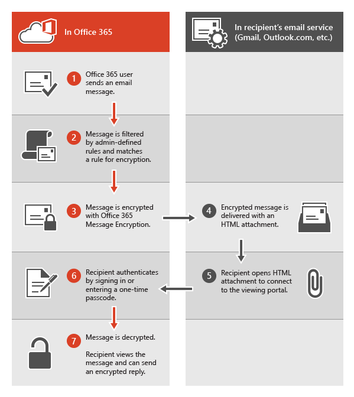

# <a name="legacy-information-for-office-365-message-encryption"></a>Legacyinformationen für die Office 365-Nachrichtenverschlüsselung

Wenn Sie Ihre Organisation noch nicht zu den neuen OM-Funktionen verschoben haben, Sie jedoch bereits OM bereitgestellt haben, gelten die Informationen in diesem Artikel für Ihre Organisation. Microsoft empfiehlt, einen Plan für die Umstellung auf die neuen OM-Funktionen zu erstellen, sobald dies für Ihre Organisation sinnvoll ist. Anweisungen finden Sie unter [Einrichten von neuen Office 365 Nachrichten Verschlüsselungsfunktionen, die auf Azure Information Protection basieren](set-up-new-message-encryption-capabilities.md). Wenn Sie mehr darüber erfahren möchten, wie die neuen Funktionen als erstes funktionieren, lesen Sie [Office 365 Nachrichtenverschlüsselung](ome.md). Der Rest dieses Artikels bezieht sich auf das OM-Verhalten vor der Veröffentlichung der neuen OM-Funktionen.
  
Mit der Office 365-Nachrichtenverschlüsselung kann Ihre Organisation verschlüsselte E-Mail-Nachrichten von bzw. zwischen Personen innerhalb und außerhalb Ihrer Organisation senden und empfangen. Office 365 Nachrichtenverschlüsselung funktioniert mit Outlook.com, Yahoo, Gmail und anderen e-Mail-Diensten. Die E-Mail-Nachrichtenverschlüsselung sorgt dafür, dass nur vorgesehene Empfänger verschlüsselte Nachrichten ansehen können.
  
Im Folgenden finden Sie einige Beispiele:
  
- Ein Bankmitarbeiter sendet Kreditkartenabrechnungen an Kunden

- Ein Versicherungsvertreter stellt Kunden Richtliniendetails zur Verfügung.

- Ein Hypothekenmakler fordert Finanzinformationen von einem Kunden für eine Darlehens Anwendung an.

- Ein Gesundheitsdienstleister sendet Patienteninformationen zum Gesundheitswesen.

- Ein Anwalt sendet vertrauliche Informationen an einen Kunden oder einen anderen Anwalt.

## <a name="how-office-365-message-encryption-works-without-the-new-capabilities"></a>Funktionsweise der Office 365 Nachrichtenverschlüsselung ohne die neuen Funktionen

Office 365 Nachrichtenverschlüsselung ist ein Onlinedienst, der auf Microsoft Azure Rights Management (Azure RMS) basiert. Mit Azure RMS können Administratoren e-Mail-Flussregeln definieren, um die Bedingungen für die Verschlüsselung zu bestimmen. Beispielsweise kann eine Regel die Verschlüsselung aller Nachrichten erfordern, die an einen bestimmten Empfänger adressiert sind.
  
Wenn ein Benutzer eine e-Mail-Nachricht in Exchange Online sendet, die mit einer Verschlüsselungs Regel übereinstimmt, wird die Nachricht mit einer HTML-Anlage gesendet. Der Empfänger öffnet die HTML-Anlage und folgt Anweisungen, um die verschlüsselte Nachricht im Office 365 Nachrichten Verschlüsselungs Portal anzuzeigen. Der Empfänger kann die Nachricht auswählen, indem er sich mit einem Microsoft-Konto oder einer mit Office 365 verknüpften Arbeit oder Schule oder mithilfe eines einmaligen Pass Codes anmeldet. Beide Optionen stellen sicher, dass die verschlüsselte Nachricht nur vom vorgesehenen Empfänger angezeigt werden kann. Dieser Vorgang unterscheidet sich sehr stark von den neuen OM-Funktionen.
  
Im folgenden Diagramm wird die Weitergabe einer E-Mail-Nachricht durch den Verschlüsselungs- und Entschlüsselungsvorgang zusammengefasst.
  

  
Weitere Informationen finden Sie unter [Dienstinformationen für die Verschlüsselung veralteter Office 365 Nachrichten vor der Veröffentlichung der neuen OM-Funktionen](legacy-information-for-message-encryption.md#LegacyServiceInfo).
  
## <a name="defining-mail-flow-rules-for-office-365-message-encryption-that-dont-use-the-new-ome-capabilities"></a>Definieren von Nachrichtenfluss Regeln für Office 365 Nachrichtenverschlüsselung, die nicht die neuen OM-Funktionen verwenden

Um Office 365 Nachrichtenverschlüsselung ohne die neuen Funktionen zu aktivieren, definieren Exchange Online und Exchange Online Schutz Administratoren Exchange-Nachrichtenfluss Regeln. Diese Regeln bestimmen, unter welchen Bedingungen e-Mail-Nachrichten verschlüsselt werden sollen, sowie Bedingungen für das Entfernen der Nachrichtenverschlüsselung. Wenn eine Verschlüsselungsaktion für eine Regel festgelegt ist, führt der Dienst die Aktion für alle Nachrichten aus, die mit den Regelbedingungen übereinstimmen, bevor die Nachrichten gesendet werden.

Nachrichtenfluss Regeln sind flexibel, sodass Sie Bedingungen kombinieren können, um bestimmte Sicherheitsanforderungen in einer einzigen Regel zu erfüllen. Sie können beispielsweise eine Regel zum Verschlüsseln aller Nachrichten definieren, die bestimmte Schlüsselwörter enthalten und an externe Empfänger adressiert sind. Die Office 365-Nachrichtenverschlüsselung verschlüsselt auch Antworten der Empfänger von verschlüsselten E-Mails und Sie können eine Regel erstellen, die diese Antworten bereits bequem für Ihre E-Mail-Benutzer entschlüsselt. Auf diese Weise müssen sich Benutzer in Ihrer Organisation nicht beim Verschlüsselungs Portal anmelden, um Antworten anzuzeigen.
  
Weitere Informationen zum Erstellen von Exchange-Nachrichtenfluss Regeln finden Sie unter [define Rules for Office 365 Message Encryption](define-mail-flow-rules-to-encrypt-email.md).
  
### <a name="use-the-eac-to-create-a-mail-flow-rule-for-encrypting-email-messages-without-the-new-ome-capabilities"></a>Erstellen einer Nachrichtenfluss Regel zum Verschlüsseln von e-Mail-Nachrichten ohne die neuen OM-Funktionen mithilfe der Exchange-Verwaltungskonsole

1. Melden Sie sich in einem Webbrowser mit einem Arbeits-oder Schulkonto, dem globale Administratorberechtigungen erteilt wurden, bei [Office 365 an](https://support.office.com/article/b9582171-fd1f-4284-9846-bdd72bb28426#ID0EAABAAA=Web_browser).

2. Wählen Sie die Kachel **Admin** aus.

3. Wählen Sie im Microsoft 365 Admin Center **Admin** Center \> **Exchange** aus.

4. Wechseln Sie in der Exchange-Verwaltungskonsole zu **Nachrichtenfluss** \> **Regeln** , und wählen Sie **Neues**  \> **Regel erstellen** aus. Weitere Informationen zur Verwendung der Exchange-Verwaltungskonsole finden Sie unter [Exchange Admin Center in Exchange Online](https://docs.microsoft.com/exchange/exchange-admin-center).

5. Geben Sie unter **Name** einen Namen für die Regel ein, beispielsweise Verschlüsseln von e-Mails für DrToniRamos@hotmail.com.

6. Wählen Sie unter **Diese Regel anwenden, wenn** eine Bedingung aus, und geben Sie ggf. einen Wert ein. Geben Sie beispielsweise Folgendes ein, um Nachrichten an "DrToniRamos@hotmail.com" zu verschlüsseln:

   1. Wählen Sie unter **Diese Regel anwenden, wenn****the recipient is** (Der Empfänger ist) aus.

   2. Wählen Sie in der Kontaktliste einen vorhandenen Namen aus, oder geben Sie im Feld **Namen prüfen** eine neue E-Mail-Adresse ein.

      - Um einen vorhandenen Namen auszuwählen, wählen Sie ihn in der Liste aus, und klicken Sie dann auf **OK**.

      - Geben Sie zum Eingeben eines neuen Namens eine e-Mail-Adresse in das Feld **Namen überprüfen** ein, und wählen Sie dann **Namen überprüfen** \> **OK** aus.

7. Um weitere Bedingungen hinzuzufügen, wählen Sie **Weitere Optionen** aus, und wählen Sie dann **Bedingung hinzufügen** aus, und wählen Sie aus der Liste aus.

   Wenn Sie beispielsweise die Regel nur dann anwenden möchten, wenn sich der Empfänger außerhalb Ihrer Organisation befindet, wählen Sie **Bedingung hinzufügen** aus, und wählen Sie dann **den Empfänger ist extern/intern** \> **außerhalb der Organisation** \> **OK** aus.

8. Um die Verschlüsselung ohne Verwendung der neuen OM-Funktionen zu aktivieren, wählen Sie unter **Folgendes ausführen die** Option **Nachrichtensicherheit** \> **Anwenden der vorherigen Version von OM** ändern aus, und wählen Sie dann **Speichern** aus.

   Wenn Sie eine Fehlermeldung erhalten, dass IRM-Lizenzierung nicht aktiviert ist, verwenden Sie nicht Legacy om.

9. Optional Wählen Sie **Aktion hinzufügen** aus, um eine andere Aktion anzugeben.

### <a name="use-exchange-online-powershell-to-create-a-mail-flow-rule-for-encrypting-email-messages-without-the-new-ome-capabilities"></a>Verwenden Exchange Online PowerShell zum Erstellen einer e-Mail-Fluss Regel zum Verschlüsseln von e-Mail-Nachrichten ohne die neuen OM-Funktionen

1. Stellen Sie eine Verbindung mit Exchange Online PowerShell her. Weitere Informationen finden Sie unter [Herstellen einer Verbindung mit Exchange Online PowerShell](https://docs.microsoft.com/powershell/exchange/connect-to-exchange-online-powershell).

2. Erstellen Sie mithilfe des Cmdlets **New-TransportRule** eine Regel, und legen Sie den Parameter _ApplyOME_ auf fest `$true` .

   In diesem Beispiel müssen alle e-Mail-Nachrichten, die an DrToniRamos@hotmail.com gesendet werden, verschlüsselt werden.

   ```powershell
   New-TransportRule -Name "Encrypt rule for Dr Toni Ramos" -SentTo "DrToniRamos@hotmail.com" -SentToScope "NotinOrganization" -ApplyOME $true
   ```

   Dabei gilt:

   - Der eindeutige Name der neuen Regel lautet "verschlüsseln Sie Regel für Dr. Toni Ramos".
   - Der Parameter _SentTo_ gibt die Nachrichtenempfänger an (gekennzeichnet durch den Namen, die e-Mail-Adresse, den Distinguished Name usw.). In diesem Beispiel wird der Empfänger durch die e-Mail-Adresse "DrToniRamos@hotmail.com" identifiziert.
   - Der Parameter _SentToScope_ gibt den Speicherort der Nachrichtenempfänger an. In diesem Beispiel befindet sich das Postfach des Empfängers in Hotmail und ist nicht Teil der Organisation, daher wird der Wert `NotInOrganization` verwendet.

   Detaillierte Informationen zur Syntax und den Parametern finden Sie unter [New-TransportRule](https://docs.microsoft.com/powershell/module/exchange/New-TransportRule).

### <a name="remove-encryption-from-email-replies-encrypted-without-the-new-ome-capabilities"></a>Entfernen der Verschlüsselung aus e-Mail-Antworten ohne die neuen OM-Funktionen verschlüsselt

Wenn Ihre E-Mail-Benutzer verschlüsselte Nachrichten senden, können Empfänger dieser Nachrichten verschlüsselte Antworten senden. Sie können e-Mail-Flussregeln erstellen, um die Verschlüsselung automatisch von Antworten zu entfernen, sodass sich e-Mail-Benutzer in Ihrer Organisation nicht beim Verschlüsselungs Portal anmelden müssen, um Sie anzuzeigen. Sie können die Exchange-Verwaltungskonsole oder Windows PowerShell-Cmdlets verwenden, um diese Regeln zu definieren. Sie können Nachrichten, die innerhalb Ihrer Organisation gesendet werden, oder Nachrichten entschlüsseln, die Antworten auf Nachrichten sind, die von innerhalb Ihrer Organisation gesendet werden. Verschlüsselte Nachrichten, die von außerhalb Ihrer Organisation stammen, können nicht entschlüsselt werden.

#### <a name="use-the-eac-to-create-a-rule-for-removing-encryption-from-email-replies-encrypted-without-the-new-ome-capabilities"></a>Verwenden der Exchange-Verwaltungskonsole zum Erstellen einer Regel zum Entfernen der Verschlüsselung aus e-Mail-Antworten, die ohne die neuen OM-Funktionen verschlüsselt wurden

1. Melden Sie sich in einem Webbrowser mit einem Arbeits-oder Schulkonto, dem Administratorberechtigungen erteilt wurden, bei [Office 365 an](https://support.office.com/article/b9582171-fd1f-4284-9846-bdd72bb28426#ID0EAABAAA=Web_browser).

2. Wählen Sie die Kachel **Admin** aus.

3. Wählen Sie im Microsoft 365 Admin Center **Admin** Center \> **Exchange** aus.

4. Wechseln Sie in der Exchange-Verwaltungskonsole zu **Nachrichtenfluss** \> **Regeln** , und wählen Sie **Neues**  \> **Regel erstellen** aus. Weitere Informationen zur Verwendung der Exchange-Verwaltungskonsole finden Sie unter [Exchange Admin Center in Exchange Online](https://docs.microsoft.com/exchange/exchange-admin-center).

5. Geben Sie unter **Name** einen Namen für die Regel ein, beispielsweise die Verschlüsselung aus eingehenden e-Mails entfernen.

6. Wählen Sie unter **diese Regel anwenden, wenn** die Bedingungen aus, aus denen die Verschlüsselung aus Nachrichten entfernt werden soll, wie **der Empfänger** sich \> **innerhalb der Organisation** befindet.

7. Wählen Sie unter **Folgendes ausführen** die Option **Nachrichtensicherheit ändern** aus, um \> **die vorherige Version von OM zu entfernen**.

8. Klicken Sie auf **Speichern**.

#### <a name="use-exchange-online-powershell-to-create-a-rule-to-remove-encryption-from-email-replies-encrypted-without-the-new-ome-capabilities"></a>Verwenden Exchange Online PowerShell zum Erstellen einer Regel zum Entfernen der Verschlüsselung aus e-Mail-Antworten, die ohne die neuen OM-Funktionen verschlüsselt wurden

1. Stellen Sie eine Verbindung mit Exchange Online PowerShell her. Weitere Informationen finden Sie unter [Herstellen einer Verbindung mit Exchange Online PowerShell](https://docs.microsoft.com/powershell/exchange/connect-to-exchange-online-powershell).

2. Erstellen Sie mithilfe des Cmdlets **New-TransportRule** eine Regel, und legen Sie den Parameter _RemoveOME_ auf fest `$true` .

   In diesem Beispiel wird die Verschlüsselung von allen e-Mails entfernt, die an Empfänger in der Organisation gesendet wurden.

   ```powershell
   New-TransportRule -Name "Remove encryption from incoming mail" -SentToScope "InOrganization" -RemoveOME $true
   ```

   Dabei gilt:

   - Der eindeutige Name der neuen Regel lautet "Entfernen der Verschlüsselung aus eingehenden e-Mails".
   - Der Parameter _SentToScope_ gibt den Speicherort der Nachrichtenempfänger an. In diesem Beispiel wird der Wert Wert `InOrganization` verwendet, der eine der folgenden Werte angibt:
     - Der Empfänger ist ein Postfach, ein e-Mail-Benutzer, eine Gruppe oder ein e-Mail-aktivierter Öffentlicher Ordner in Ihrer Organisation.
     - Die e-Mail-Adresse des Empfängers befindet sich in einer akzeptierten Domäne, die als autorisierende Domäne oder als interne Relay-Domäne in Ihrer Organisation konfiguriert ist, _und_ die Nachricht wurde über eine authentifizierte Verbindung gesendet oder empfangen.

Detaillierte Informationen zur Syntax und den Parametern finden Sie unter [New-TransportRule](https://docs.microsoft.com/powershell/module/exchange/New-TransportRule).

## <a name="sending-viewing-and-replying-to-messages-encrypted-without-the-new-capabilities"></a>Senden, anzeigen und beantworten von Nachrichten, die ohne die neuen Funktionen verschlüsselt wurden

Bei Office 365 Nachrichtenverschlüsselung werden e-Mail-Nachrichten basierend auf vom Administrator definierten Regeln automatisch verschlüsselt. Eine e-Mail mit einer verschlüsselten Nachricht kommt im Posteingang des Empfängers mit einer angefügten HTML-Datei an.
  
Empfänger folgen den Anweisungen in der Nachricht, um die Anlage zu öffnen und mit einem Microsoft-Konto oder einer mit Office 365 verknüpften Arbeit oder Schule zu authentifizieren. Wenn Empfänger nicht über ein Konto verfügen, werden Sie zum Erstellen eines Microsoft-Kontos aufgefordert, mit dem Sie sich anmelden können, um die verschlüsselte Nachricht anzuzeigen. Alternativ können Empfänger auswählen, einen einmaligen Code zum Anzeigen der Nachricht zu erhalten. Nach der Anmeldung oder der Verwendung eines einmaligen Pass Codes können Empfänger die entschlüsselte Nachricht anzeigen und eine verschlüsselte Antwort senden.
  
## <a name="customize-encrypted-messages-with-office-365-message-encryption"></a>Anpassen von verschlüsselten Nachrichten mit Office 365 Nachrichtenverschlüsselung

Als Exchange Online-und Exchange Online Schutz Administrator können Sie Ihre verschlüsselten Nachrichten anpassen. Sie können beispielsweise die Marke und das Logo Ihres Unternehmens hinzufügen, eine Einführung angeben und Haftungsausschluss-Text in verschlüsselte Nachrichten und im Portal hinzufügen, in dem Empfänger Ihre verschlüsselten Nachrichten anzeigen. Mit Windows PowerShell-Cmdlets passen Sie die folgenden Aspekte im Erscheinungsbild für Epfänger von verschlüsselten E-Mails an:

- Einleitender Text der E-Mail, die die verschlüsselte Nachricht enthält

- Text des Haftungsausschlusses der E-Mail, die die verschlüsselte Nachricht enthält

- Portaltext, der im Meldungsanzeigeportal angezeigt wird

- Logo, das in der E-Mail-Nachricht und im Anzeigeportal erscheint

Sie können auch jederzeit zum Standardaussehen und -verhalten zurückkehren.
  
Im folgenden Beispiel wird ein benutzerdefiniertes ContosoPharma-Logo im E-Mail-Anhang gezeigt:

> [!div class="mx-imgBorder"]
> 
  
**So passen Sie Verschlüsselungs-e-Mails und das Verschlüsselungs Portal mit der Marke Ihrer Organisation an**
  
1. Stellen Sie mithilfe von Remote-PowerShell eine Verbindung mit Exchange Online her, wie unter [Verbinden mit Exchange Online mithilfe von Remote-PowerShell](https://docs.microsoft.com/powershell/exchange/connect-to-exchange-online-powershell)beschrieben.

2. Verwenden Sie das Set-OMEConfiguration-Cmdlet wie hier beschrieben: [legen Sie-OMEConfiguration fest](https://technet.microsoft.com/3ef0aec0-ce28-411d-abe8-7236f082af1b) , oder verwenden Sie die folgende Tabelle, um Anleitungen zu erhalten.

   **Anpassungsoptionen für Verschlüsselung**

   | So passen Sie dieses Verschlüsselungsfeature an | Verwenden Sie diese Befehle von Windows PowerShell |
   |:-----|:-----|
   |Standardtext, der verschlüsselten E-Mail-Nachrichten beigefügt ist  <br/> Der Standardtext wird über den Anweisungen zum Betrachten von verschlüsselten Nachrichten angezeigt  <br/> | `Set-OMEConfiguration -Identity <OMEConfigurationIdParameter> -EmailText "<string of up to 1024 characters>"` <br/> **Beispiel:** `Set-OMEConfiguration -Identity "OME Configuration" -EmailText "Encrypted message from ContosoPharma secure messaging system"` <br/> |
   |Haftungsausschluss in der E-Mail, die die verschlüsselte Nachricht enthält  <br/> | `Set-OMEConfiguration -Identity <OMEConfigurationIdParameter> DisclaimerText "<your disclaimer statement, string of up to 1024 characters>"` <br/> **Beispiel:** `Set-OMEConfiguration -Identity "OME Configuration" -DisclaimerText "This message is confidential for the use of the addressee only"` <br/> |
   |Der Text wird oben im Anzeigeportal für verschlüsselte E-Mails angezeigt  <br/> | `Set-OMEConfiguration -Identity <OMEConfigurationIdParameter> -PortalText "<text for your portal, string of up to 128 characters>"` <br/> **Beispiel:** `Set-OMEConfiguration -Identity "OME Configuration" -PortalText "ContosoPharma secure email portal"` <br/> |
   |Logo  <br/> | `Set-OMEConfiguration -Identity <OMEConfigurationIdParameter> -Image <Byte[]>` <br/> **Beispiel:** `Set-OMEConfiguration -Identity "OME configuration" -Image (Get-Content "C:\Temp\contosologo.png" -Encoding byte)` <br/> Unterstützte Dateiformate: .png, .jpg, .bmp oder .tiff  <br/> Optimale Größe der Logodatei: weniger als 40 KB  <br/> Optimale Abmessungen des Logobilds: 170 x 70 Pixel  <br/> |

**So entfernen Sie Marken Anpassungen aus e-Mail-Verschlüsselungs Nachrichten und dem Verschlüsselungs Portal**
  
1. Stellen Sie mithilfe von Remote-PowerShell eine Verbindung mit Exchange Online her, wie unter [Verbinden mit Exchange Online mithilfe von Remote-PowerShell](https://technet.microsoft.com/library/jj984289%28v=exchg.150%29.aspx)beschrieben.

2. Verwenden Sie das Set-OMEConfiguration-Cmdlet wie hier beschrieben: [festlegen-OMEConfiguration](https://technet.microsoft.com/3ef0aec0-ce28-411d-abe8-7236f082af1b). Wenn Sie die Marken Anpassungen ihrer Organisation aus den DisclaimerText-, EmailText-und Portal Text-Werten entfernen möchten, legen Sie den Wert auf eine leere Zeichenfolge fest  `""` . Legen Sie für alle Bild Werte wie Logo den Wert auf fest  `"$null"` .

   **Anpassungsoptionen für Verschlüsselung**

   | Dieses Feature der Verschlüsselungserfahrung zu Standardtext und -bild zurücksetzen | Verwenden Sie diese Befehle von Windows PowerShell |
   |:-----|:-----|
   |Standardtext, der verschlüsselten E-Mail-Nachrichten beigefügt ist  <br/> Der Standardtext wird über den Anweisungen zum Betrachten von verschlüsselten Nachrichten angezeigt  <br/> | `Set-OMEConfiguration -Identity <OMEConfigurationIdParameter> -EmailText "<empty string>"` <br/> **Beispiel:** `Set-OMEConfiguration -Identity "OME Configuration" -EmailText ""` <br/> |
   |Haftungsausschluss in der E-Mail, die die verschlüsselte Nachricht enthält  <br/> | `Set-OMEConfiguration -Identity <OMEConfigurationIdParameter> DisclaimerText "<empty string>"` <br/> **Beispiel:** `Set-OMEConfiguration -Identity "OME Configuration" -DisclaimerText ""` <br/> |
   |Der Text wird oben im Anzeigeportal für verschlüsselte E-Mails angezeigt  <br/> | `Set-OMEConfiguration -Identity <OMEConfigurationIdParameter> -PortalText "<empty string>"` <br/> **Beispiel Zurücksetzen auf Standard:**`Set-OMEConfiguration -Identity "OME Configuration" -PortalText ""` <br/> |
   |Logo  <br/> | `Set-OMEConfiguration -Identity <OMEConfigurationIdParameter> -Image <"$null">` <br/> **Beispiel Zurücksetzen auf Standard:**`Set-OMEConfiguration -Identity "OME configuration" -Image $null` <br/> |

## <a name="service-information-for-legacy-office-365-message-encryption-prior-to-the-release-of-the-new-ome-capabilities"></a>Dienstinformationen für die Verschlüsselung veralteter Office 365 Nachrichten vor der Veröffentlichung der neuen OM-Funktionen
<a name="LegacyServiceInfo"> </a>

Die folgende Tabelle enthält technische Details für den Office 365 Nachrichten Verschlüsselungsdienst vor der Veröffentlichung der neuen OM-Funktionen.
  
| Service-Informationen | Beschreibung |
|:-----|:-----|
|Anforderungen an die Client-Geräte  <br/> |Verschlüsselte Nachrichten können auf einem Client-Gerät angezeigt werden, solange der HTML-Anhang in einem modernen Browser geöffnet werden kann, der Form Post unterstützt.  <br/> |
|Verschlüsselungsalgorithmus und Compliance Federal Information Processing Standards (FIPS)  <br/> |Die Office 365 Nachrichtenverschlüsselung verwendet dieselbe Verschlüsselung wie Windows Azure Information Rights Management (IRM) und unterstützt Kryptografiemodus 2 (2K Schlüssel für RSA und 256 Bit Schlüssel für SHA-1-Systeme). Weitere Informationen zu den zugrunde liegenden IRM-kryptografischen Modi finden Sie unter [AD RMS Cryptographic Modes](https://technet.microsoft.com/library/hh867439%28WS.10%29.aspx).  <br/> |
|Unterstützte Nachrichtentypen  <br/> |Die Office 365-Nachrichtenverschlüsselung wird nur für Elemente mit der Nachrichtenklassen-ID **IPM.Note** unterstützt. Weitere Informationen finden Sie unter [Elementtypen und Nachrichtenklassen](https://msdn.microsoft.com/library/office/ff861573.aspx).  <br/> |
|Beschränkungen der Nachrichtengröße  <br/> |Die Office 365 Nachrichtenverschlüsselung kann Nachrichten bis zu 25 MB verschlüsseln. Weitere Informationen zu Grenzwerten für die Nachrichtengröße finden Sie unter [Exchange Online Limits](https://technet.microsoft.com/library/exchange-online-limits.aspx).  <br/> |
|Exchange Online von e-Mail-Aufbewahrungsrichtlinien  <br/> |In Exchange Online werden die verschlüsselten Nachrichten nicht gespeichert.  <br/> |
|Die Sprachunterstützung für Office 365 Nachrichtenverschlüsselung  <br/> | Office 365 Nachrichtenverschlüsselung unterstützt Microsoft 365-Sprachen wie folgt:  <br/>  Eingehende e-Mail-Nachrichten und angefügte HTML-Dateien werden basierend auf den Spracheinstellungen des Absenders lokalisiert.  <br/>  Das Anzeigeportal wird basierend auf den Browsereinstellungen des Empfängers lokalisiert.  <br/>  Der Nachrichtentext (Inhalt) der verschlüsselten Nachricht ist nicht lokalisiert.  <br/> |
|Datenschutzinformationen für OME-Portal und OME-Viewer-App  <br/> |Die [Office 365 Messaging Encryption Portal privacy statement](https://privacy.microsoft.com/privacystatement) enthalten ausführliche Informationen darüber, wofür Microsoft Ihre vertraulichen Informationen verwendet.  <br/> |

## <a name="frequently-asked-questions-about-legacy-ome"></a>Häufig gestellte Fragen zu Legacy-OM
<a name="LegacyServiceInfo"> </a>

Haben Sie Fragen zu Office 365 Nachrichtenverschlüsselung? Hier finden Sie einige Antworten. Wenn Sie nicht finden können, was Sie benötigen, lesen Sie [in den Microsoft Tech Community-Foren nach Office 365](https://techcommunity.microsoft.com/t5/Office-365/ct-p/Office365).
  
 **F.. Meine Benutzer senden verschlüsselte e-Mail-Nachrichten an Empfänger außerhalb unserer Organisation. Gibt es etwas, das externe Empfänger durchführen müssen, um e-Mail-Nachrichten zu lesen und zu beantworten, die mit Office 365 Nachrichtenverschlüsselung verschlüsselt sind?**
  
Empfänger außerhalb Ihrer Organisation, die Microsoft 365-verschlüsselte Nachrichten erhalten, können Sie auf eine von zwei Arten anzeigen:
  
- Indem Sie sich mit einem Microsoft-Konto oder einem mit Office 365 verknüpften Arbeits-oder Schulkonto anmelden.

- Mithilfe eines einmaligen Pass Codes.

 **F.. Werden Microsoft 365-verschlüsselte Nachrichten in der Cloud oder auf Microsoft-Servern gespeichert?**
  
Nein, die verschlüsselten Nachrichten werden auf dem e-Mail-System des Empfängers aufbewahrt, und wenn der Empfänger die Nachricht öffnet, wird Sie vorübergehend zur Anzeige auf Microsoft-Servern bereitgestellt. Die Nachrichten werden dort nicht gespeichert.
  
 **F. Kann ich meine Marke in verschlüsselte E-Mail-Nachrichten einbinden?**
  
Ja. Sie können Windows PowerShell-Cmdlets verwenden, um den Standardtext, der oben in verschlüsselten E-Mail-Nachrichten angezeigt wird, sowie den Haftungsausschlusstext und das Logo, das Sie für E-Mail-Nachrichten und das Verschlüsselungsportal verwenden möchten, anpassen. Dieses Feature ist jetzt in OMEv2 verfügbar. Weitere Informationen finden Sie unter [Add branding to encrypted messages](add-your-organization-brand-to-encrypted-messages.md).
  
 **F. Ist für den Dienst eine Lizenz für jeden Benutzer in meiner Organisation erforderlich?**
  
Jeder Benutzer in der Organisation benötigt eine Lizenz, der verschlüsselte E-Mails versendet.
  
 **Q. Benötigen externe Empfänger Abonnements?**
  
Nein, externe Empfänger benötigen kein Abonnement zum Lesen oder Beantworten verschlüsselter Nachrichten.
  
 **F.. Inwiefern unterscheidet sich Office 365 Nachrichtenverschlüsselung von RMS (Rights Management Services, Rechteverwaltungsdienst)?**
  
RMS bietet Funktionen zum Schutz von Informationsrechten für interne e-Mail-Nachrichten durch Bereitstellen integrierter Vorlagen, beispielsweise: nicht weiterleiten und Unternehmens vertraulich. Office 365 Nachrichtenverschlüsselung unterstützt die e-Mail-Nachrichtenverschlüsselung für Nachrichten, die an externe Empfänger sowie interne Empfänger gesendet werden.
  
 **F.. Wie unterscheidet sich Office 365 Nachrichtenverschlüsselung von S/MIME?**
  
S/MIME ist im Grunde eine clientseitige Verschlüsselungstechnologie, für die eine komplizierte Zertifikatverwaltung und Veröffentlichungsinfrastruktur erforderlich ist. Office 365 Nachrichtenverschlüsselung verwendet Nachrichtenfluss Regeln (auch als Transportregeln bezeichnet) und ist nicht von der Veröffentlichung von Zertifikaten abhängig.
  
 **F. Kann ich über mobile Geräte verschlüsselten Nachrichten lesen?**
  
Ja, Sie können Nachrichten auf Android und IOS anzeigen, indem Sie die apps OM Viewer aus dem Google Play Store und dem Apple App Store herunterladen. Öffnen Sie die HTML-Anlage in der OME Viewer-App, und befolgen Sie dann die Anweisungen, um die verschlüsselte Nachricht zu öffnen. Andere mobile Geräte können den HTML-Anhang öffnen, solange der E-Mail-Client Form Post unterstützt.
  
 **F. Sind Antworten und weitergeleitete Nachrichten verschlüsselt?**
  
Ja. Antworten werden während des gesamten Nachrichtenverlaufs weiterhin verschlüsselt.
  
 **F.. Bietet Office 365 Nachrichtenverschlüsselung eine Lokalisierung?**
  
Eingehende E-Mails und HTML-Inhalte werden basierend auf den E-Maileinstellungen des Absenders lokalisiert. Das Anzeigeportal wird basierend auf den Browsereinstellungen des Empfängers lokalisiert. Allerdings wird der eigentliche Text (Inhalt) der verschlüsselten Nachricht nicht lokalisiert.
  
 **F.. Welche Verschlüsselungsmethode wird für Office 365 Nachrichtenverschlüsselung verwendet?**
  
Office 365 Nachrichtenverschlüsselung verwendet RMS (Rights Management Services) als Verschlüsselungsinfrastruktur. Die verwendete Verschlüsselungsmethode hängt davon ab, woher Sie die RMS-Schlüssel zum Verschlüsseln und Entschlüsseln von Nachrichten erhalten.
  
- Wenn Sie Microsoft Azure RMS verwenden, um die Schlüssel zu erhalten, wird kryptografischer Modus 2 verwendet. Kryptografiemodus 2 ist eine aktualisierte und weiterentwickelte Kryptografieimplementierung für AD RMS. Er bietet Unterstützung für RSA 2048 für Signatur und Verschlüsselung sowie Unterstützung für SHA-256 für die Signatur.

- Wenn Sie Active Directory (AD) RMS verwenden, um die Schlüssel abzurufen, wird entweder Kryptografiemodus 1 oder 2 verwendet. Die verwendete Methode hängt von Ihrer lokalen AD RMS-Bereitstellung ab. Kryptografiemodus 1 ist die ursprüngliche Kryptografieimplementierung für AD RMS. Er bietet Unterstützung für RSA 1024 für Signatur und Verschlüsselung sowie Unterstützung für SHA-1 für die Signatur. Dieser Modus wird durch alle aktuellen Versionen von RMS weiter unterstützt.

Weitere Informationen finden Sie unter [AD RMS Cryptographic Modes](https://go.microsoft.com/fwlink/p/?LinkId=398616).
  
**Q. Warum sagen einige verschlüsselte Nachrichten, dass Sie aus Office365@Messaging.Microsoft.com stammen** ?
  
Wenn eine verschlüsselte Antwort aus dem Verschlüsselungsportal oder über die OME Viewer-App gesendet wird, wird die Absender-E-Mail-Adresse auf Office365@messaging.microsoft.com festgelegt, da die verschlüsselte Nachricht über einen Microsoft-Endpunkt gesendet wird. Dadurch wird verhindert, dass verschlüsselte Nachrichten als Spam markiert werden. Der angezeigte Name in der E-Mail und die Adresse im Verschlüsselungsportal werden durch diese Bezeichnung nicht geändert. Außerdem gilt diese Bezeichnung nur für über das Portal gesendete Nachrichten und nicht für Nachrichten, die über einen anderen E-Mail-Client gesendet werden.
  
 **F.. Ich bin ein Abonnent von Exchange Hosted Encryption (ehst). Wo kann ich mehr über das Upgrade auf Office 365 Nachrichtenverschlüsselung erfahren?**
  
Bei allen EHE-Kunden wurde ein Upgrade auf Office 365-Nachrichtenverschlüsselung durchgeführt. Weitere Informationen finden Sie im [Exchange Hosted Encryption Upgrade Center](https://go.microsoft.com/fwlink/p/?LinkID=511077).
  
 **F.. Muss ich alle URLs, IP-Adressen oder Ports in der Firewall meines Unternehmens öffnen, um Office 365 Nachrichtenverschlüsselung zu unterstützen?**
  
Ja. Sie müssen URLs für Exchange Online zur Liste "Zulassen" für Ihre Organisation hinzufügen, damit Nachrichten, die mit der Office 365-Nachrichtenverschlüsselung verschlüsselt wurden, authentifiziert werden können. Eine Liste der Exchange Online-URLs finden Sie unter [Microsoft 365-URLs und IP-Adressbereiche](https://docs.microsoft.com/microsoft-365/enterprise/urls-and-ip-address-ranges).
  
 **F.. An wie viele Empfänger kann ich eine verschlüsselte Microsoft 365-Nachricht senden?**
  
Die Empfänger Grenze beträgt 500 Empfänger pro Nachricht oder, wenn Sie nach der Erweiterung der Verteilerliste kombiniert werden, 11.980 Zeichen im Feld " **an** " der Nachricht, je nachdem, was zuerst angezeigt wird.
  
 **F: Ist es möglich, eine Nachricht an einen bestimmten Empfänger zu sperren?**
  
Nein. Sie können eine Nachricht nicht für eine bestimmte Person widerrufen, nachdem Sie gesendet wurde.
  
 **F: Kann ich einen Bericht über verschlüsselte Nachrichten anzeigen, die empfangen und gelesen wurden?**
  
Es gibt keinen Bericht, der anzeigt, ob eine verschlüsselte Nachricht angezeigt wurde, aber es sind Microsoft 365-Berichte verfügbar, die Sie nutzen können, um die Anzahl der Nachrichten zu ermitteln, die einer bestimmten e-Mail-Fluss Regel (auch als Transportregel bezeichnet) zugeordnet sind.
  
 **F. Wofür verwendet Microsoft die von mir über das OME-Portal und die OME-Viewer-App eingegebenen Informationen?**
  
Die [Datenschutzerklärung für das Office 365 Messaging-Verschlüsselungs Portal](https://privacy.microsoft.com/privacystatement) enthält detaillierte Informationen dazu, was Microsoft mit ihren privaten Informationen macht und was nicht.

**F.. Was muss ich tun, wenn ich den einmaligen Passcode nicht erhalte, nachdem ich ihn angefordert habe?**

Überprüfen Sie zuerst den Junk-oder Spam-Ordner in Ihrem e-Mail-Client. DKIM-und DMARC-Einstellungen für Ihre Organisation können dazu führen, dass diese e-Mails als Spam gefiltert werden.

Überprüfen Sie als nächstes die Quarantäne im Security & Compliance Center. Häufig werden Nachrichten, die einen einmaligen Passcode enthalten, insbesondere die ersten, die in Ihrer Organisation empfangen werden, in Quarantäne gelandet.
