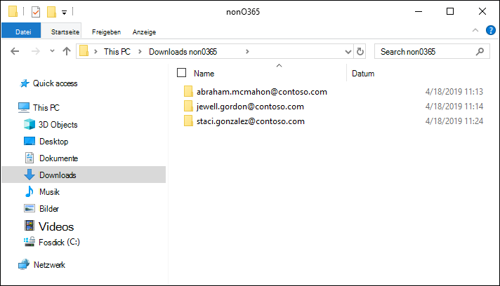

# Laden von nicht von Microsoft 365 stammenden Daten in einen Prüfdateisatz

Nicht alle Dokumente, die Sie in der Advanced eDiscovery analysieren müssen, befinden sich in Microsoft 365. Mit dem Microsoft 365-Datenimport-Feature in Advanced eDiscovery können Sie Dokumente, die sich nicht in Microsoft 365 befinden, in einen Prüfdateisatz hochladen. In diesem Artikel erfahren Sie, wie Sie Ihre nicht Microsoft 365 dokumente in die analyse Advanced eDiscovery können.

## Anforderungen zum Hochladen nicht Office 365 Inhalts

Für die Verwendung des in diesem Microsoft 365 beschriebenen Features zum Hochladen ist Folgendes erforderlich:

- Allen Verwahrern, denen Nicht-Microsoft 365 zuordnen möchten, muss die entsprechende Lizenz zugewiesen werden. Weitere Informationen finden Sie unter [Erste Schritte mit Advanced eDiscovery](get-started-with-advanced-ediscovery.md#step-1-verify-and-assign-appropriate-licenses).

- Ein vorhandener Advanced eDiscovery Fall.

- Verwahrer müssen dem Fall hinzugefügt werden, bevor Sie die Nicht-Microsoft 365 hochladen und diesen zuordnen können.

- Nicht von Microsoft 365 stammende Daten müssen einen Dateityp aufweisen, der von Advanced eDiscovery unterstützt wird. Weitere Informationen finden Sie unter [Unterstützte Dateitypen in Advanced eDiscovery](supported-filetypes-ediscovery20.md).

- Alle Dateien, die in einen Prüfdateisatz hochgeladen werden, müssen sich in Ordnern befinden, wobei jeder Ordner einem bestimmten Verwahrer zugeordnet ist. Für die Namen dieser Ordner muss das folgende Namensformat verwendet werden: *alias@domainname*. Bei „alias@domainname“ muss es sich um den Microsoft 365-Alias und die Domäne des Benutzers handeln. Sie können alle ordner alias@domainname in einem Stammordner erfassen. Der Stammordner kann nur die alias@domainname enthalten. Lose Dateien im Stammordner werden nicht unterstützt.

   Die Ordnerstruktur für die nicht Microsoft 365, die Sie hochladen möchten, ähnelt dem folgenden Beispiel:

   - c:\nonO365\abraham.mcmahon@contoso.com
   - c:\nonO365\jewell.gordon@contoso.com
   - c:\nonO365\staci.gonzalez@contoso.com

   Dabei abraham.mcmahon@contoso.com, jewell.gordon@contoso.com und staci.gonzalez@contoso.com die SMTP-Adressen von Verwahrern in dem Fall.

   

- Ein Konto, das der Rollengruppe eDiscovery Manager zugewiesen ist (und als eDiscovery-Administrator hinzugefügt wurde).

- Das AzCopy v8.1-Tool, das auf einem Computer installiert ist, der Zugriff auf die nicht Microsoft 365 Inhaltsordnerstruktur hat. Informationen zur Installation von AzCopy finden Sie unter Übertragen von Daten [mit azCopy v8.1 auf Windows](/previous-versions/azure/storage/storage-use-azcopy). Installieren Sie AzCopy unbedingt am Standardspeicherort, der **%ProgramFiles(x86)%\Microsoft SDKs\Azure\AzCopy ist.** Sie müssen AzCopy v8.1 verwenden. Andere Versionen von AzCopy funktionieren möglicherweise nicht, wenn Nicht-Microsoft 365-Daten in Advanced eDiscovery.

## Hochladen Nicht-Microsoft 365 inhalt in Advanced eDiscovery

1. Öffnen Sie als eDiscovery-Manager oder eDiscovery-Administrator Advanced eDiscovery, und wechseln Sie zu dem Fall, in den die nicht Microsoft 365 hochgeladen werden.  

2. Klicken **Sie auf Überprüfungssätze,** und wählen Sie dann den Überprüfungssatz aus, in den die nicht Microsoft 365 hochgeladen werden.  Wenn Sie keinen Überprüfungssatz haben, können Sie einen erstellen. 
 
3. Klicken Sie im Prüfdateisatz auf **Prüfdateisatz verwalten**, und klicken Sie dann auf der Kachel **Nicht von Microsoft 365 stammende Daten** auf **Uploads anzeigen**.

4. Klicken Sie auf **Dateien hochladen**, um den Datenimport-Assistenten zu starten.

   

   Der erste Schritt im Assistenten bereitet einen von Microsoft bereitgestellten sicheren Azure-Speicherort vor, in den die Dateien hochgeladen werden sollen.  Wenn die Vorbereitung abgeschlossen ist, wird die Schaltfläche **Weiter: Dateien hochladen** aktiviert.

   
 
5. Klicken Sie auf **Weiter: Dateien hochladen**.

6. Gehen Sie **auf Hochladen Seite "Dateien"** wie folgt vor:

   

   a. Überprüfen **oder** geben Sie im Feld Pfad zum Speicherort von Dateien den Speicherort des Stammordners ein, in dem Sie die nicht Microsoft 365 daten gespeichert haben, die Sie hochladen möchten. Für den Speicherort der Beispieldateien, die im Abschnitt "Bevor Sie beginnen" angezeigt **werden,** geben Sie beispielsweise **%USERPROFILE\Downloads\nonO365 ein.** Wenn Sie den richtigen Speicherort bereitstellen, wird sichergestellt, dass der Befehl AzCopy, der im Feld unter dem Pfad angezeigt wird, ordnungsgemäß aktualisiert wird.

   b. Klicken **Sie auf Kopieren in die** Zwischenablage, um den Befehl zu kopieren, der im Feld angezeigt wird.

7. Starten Sie Windows Eingabeaufforderung, fügen Sie den Befehl ein, den  Sie im vorherigen Schritt kopiert haben, und drücken Sie dann die EINGABETASTE, um den Befehl AzCopy zu starten.  Nachdem Sie den Befehl gestartet haben, werden die nicht Microsoft 365 dateien an den speicherort hochgeladen Azure Storage der in Schritt 4 vorbereitet wurde.

   

   > [!NOTE]
   > Wie bereits erwähnt, müssen Sie AzCopy v8.1 verwenden, um den Befehl erfolgreich zu verwenden, der auf der Seite Hochladen **ist.** Wenn beim angegebenen Befehl AzCopy ein Fehler auftritt, finden Sie weitere Informationen unter [Troubleshoot AzCopy in Advanced eDiscovery](troubleshooting-azcopy.md).

8. Wechseln Sie zurück zum Security & Compliance Center, und klicken Sie im Assistenten auf **Weiter: Dateien** verarbeiten.  Die Verarbeitung, Textextraktion und Indizierung der nicht von Microsoft 365 stammenden Dateien, die in den Azure-Speicherort hochgeladen wurden, wird gestartet.  

9. Verfolgen Sie den Fortschritt der  Verarbeitung der Dateien  auf der Seite Prozessdateien oder auf der Registerkarte Aufträge, indem Sie einen Auftrag mit dem Namen Hinzufügen nicht Microsoft 365 Daten zu einem **Überprüfungssatz anzeigen.**  Nach Abschluss des Auftrags sind die neuen Dateien im Überprüfungssatz verfügbar.

   

10. Nachdem die Verarbeitung abgeschlossen ist, können Sie den Assistenten schließen.