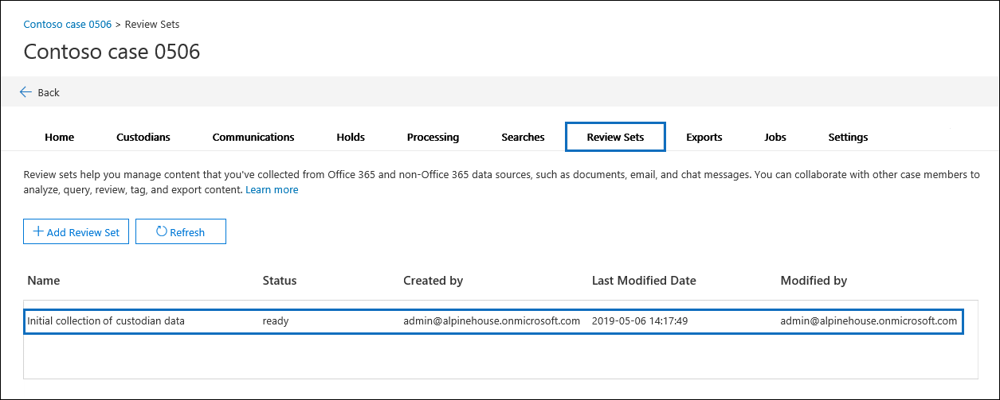

# Verwalten von Überprüfungssätzen in Advanced eDiscovery

Prüfdateisätze sind statische Dokumente, in denen Sie Daten eines Falls analysieren, abfragen, anzeigen, taggen und exportieren können. Weitere Informationen zum Ausführen dieser Aufgaben finden Sie unter:

- [Analysieren von Daten in einem Prüfdateisatz](analyzing-data-in-review-set.md)

- [Abfragen der Daten in einem Prüfdateisatz](review-set-search.md)

- [Anzeigen von Dokumenten in einem Prüfdateisatz](view-documents-in-review-set.md)

- [Markieren von Dokumenten in einem Prüfdateisatz](tagging-documents.md)

- [Exportieren von Falldaten](exporting-data-ediscover20.md)

## Erstellen eines Überprüfungssatz

Überprüfungssätze können auf der Registerkarte **Überprüfungssätze** erstellt werden, indem Sie **auf + Überprüfungssatz hinzufügen klicken.**

Geben Sie auf der Seite Add **review set** flyout einen Namen für den Überprüfungssatz ein, und klicken Sie dann auf **Speichern**. Der neue Überprüfungssatz wird in der Liste auf der Registerkarte **Überprüfungssätze** angezeigt.

Es gibt drei verschiedene Möglichkeiten zum Hinzufügen von Daten zu einem Überprüfungssatz in einem Advanced eDiscovery Fall.

1. [Hinzufügen von Suchergebnissen zu einem Prüfdateisatz](add-data-to-review-set.md)

2. [Laden von nicht von Microsoft 365 stammenden Daten in einen Prüfdateisatz](load-non-Office-365-data-into-a-review-set.md)

3. [Hinzufügen von Daten aus einem Prüfdateisatz zu einem anderen Prüfdateisatz](add-data-to-review-set-from-another-review-set.md)
