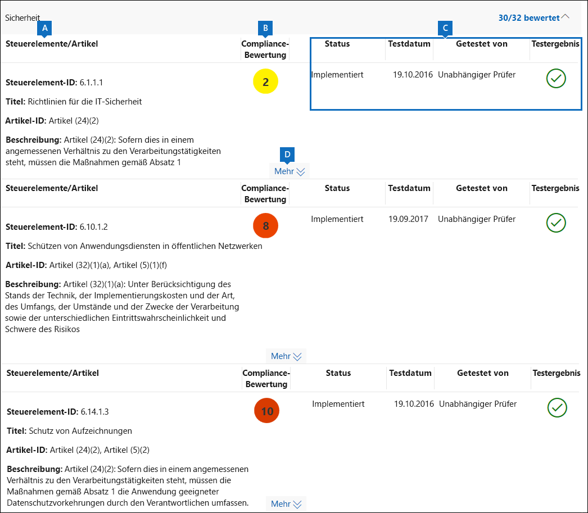
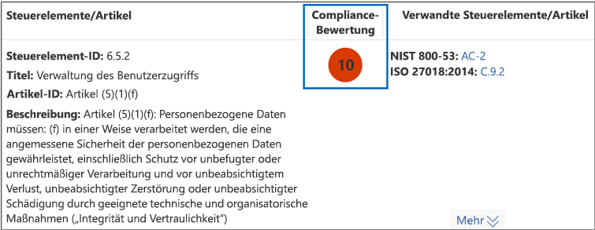
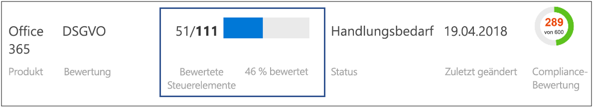
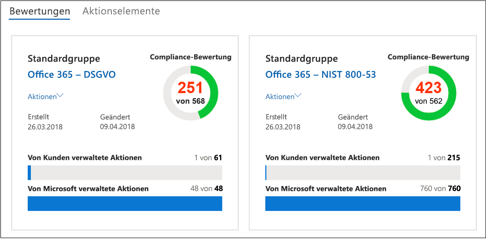
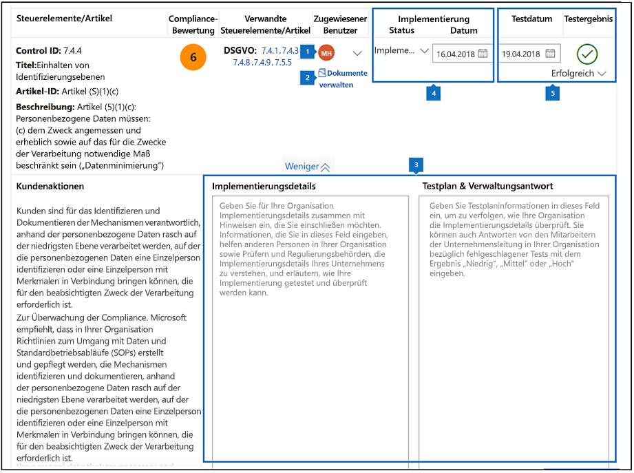
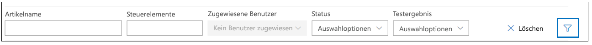

# Microsoft Compliance-Manager (klassisch)Microsoft Compliance Manager (classic)

> [!NOTE]
> Diese Dokumentation beschreibt eine frühere Version dieses Produkts.This documentation describes a previous version of this product. Benutzern wird *dringend abgeraten, diese Version von Compliance Manager*zu verwenden.Users are *strongly discouraged from using this version of Compliance Manager*. **Wenn Sie die aktuelle Vorschauversion von Compliance Manager verwenden, lesen Sie die [Dokumentation zum Compliance Manager (Vorschau)](working-with-compliance-manager.md).****If you're using the current preview version of Compliance Manager, refer to the [Compliance Manager (preveiw) documentation](working-with-compliance-manager.md).**

 *Der Compliance-Manager ist nicht in Office 365, betrieben von 21Vianet, Office 365 Deutschland, Office 365 US Government Community High (GCC) High oder Office 365 Department of Defense verfügbar.**Compliance Manager isn't available in Office 365 operated by 21Vianet, Office 365 Germany, Office 365 U.S. Government Community High (GCC High), or Office 365 Department of Defense.*
  
Mit dem Compliance-Manager, einem workflowbasierten Tools zur Risikoabschätzung im Microsoft [Service Trust-Portal](https://docs.microsoft.com/microsoft-365/compliance/get-started-with-service-trust-portal), können Sie Complianceaktivitäten Ihres Unternehmens im Zusammenhang mit Microsoft Professional Services und Microsoft Cloud Services, z. B. Microsoft Office 365, Microsoft Dynamics 365 und Microsoft Azure, nachverfolgen, zuweisen und überprüfen.Compliance Manager, a workflow-based risk assessment tool in the Microsoft [Service Trust Portal](https://docs.microsoft.com/microsoft-365/compliance/get-started-with-service-trust-portal), enables you to track, assign, and verify your organization's regulatory compliance activities related to Microsoft Professional Services and Microsoft cloud services, such as Microsoft Office 365, Microsoft Dynamics 365, and Microsoft Azure. 

Für Compliance-Manager gilt Folgendes:Compliance Manager:
  
- Er kombiniert die ausführlichen Informationen, die von Microsoft für Prüfer und Regulierungsbehörden im Rahmen unterschiedlicher unabhängiger Prüfungen der Microsoft-Clouddienste im Hinblick auf verschiedene Standards (z. B. ISO 27001, ISO 27018 und NIST) bereitgestellt werden, sowie Informationen, die Microsoft intern für die Einhaltung von Vorschriften (z. B. HIPAA und EU General Data Protection Regulation oder DSGVO) zusammenstellt, mit Ihrer eigenen Selbsteinschätzung bezüglich der Einhaltung dieser Standards und Vorschriften durch Ihr Unternehmen.Combines the detailed information provided by Microsoft to auditors and regulators as part of various third-party audits of Microsoft 's cloud services against various standards (for example, ISO 27001, ISO 27018, and NIST) and information that Microsoft compiles internally for its compliance with regulations (such as HIPAA and the EU General Data Protection Regulation, or GDPR) with your own self-assessment of your organization's compliance with these standards and regulations.
    
- Sie können damit Aktivitäten im Zusammenhang mit Compliance und Bewertung zuweisen, nachverfolgen und aufzeichnen, mit denen Ihre Organisation über die Grenzen von Teams hinweg die Complianceziele Ihres Unternehmens erreichen kann.Enables you to assign, track, and record compliance and assessment-related activities, which can help your organization cross team barriers to achieve your organization's compliance goals.
    
- Er liefert eine Compliance-Bewertung, anhand der Sie Ihre Fortschritte aufzeichnen und die Überwachungssteuerelemente priorisieren können, mit denen Sie Risiken für Ihre Organisation minimieren können.Provides a Compliance Score to help you track your progress and prioritize the auditing controls that will help reduce your organization's exposure to risk.
    
- Er bietet ein sicheres Repository zum Hochladen und Verwalten von Nachweisen oder anderen Artefakten im Zusammenhang mit Complianceaktivitäten.Provides a secure repository for you to upload and manage evidence and other artifacts related to your compliance activities.
    
- Er generiert ausführliche Berichte in Microsoft Excel, in denen die von Microsoft und Ihrer Organisation durchgeführten Complianceaktivitäten dokumentiert werden, und die Prüfern, Regulierungsbehörden und anderen Beteiligten an der Compliance zur Verfügung gestellt werden können.Produces richly detailed reports in Microsoft Excel that document the compliance activities performed by Microsoft and your organization, which can be provided to auditors, regulators, and other compliance stakeholders.

Eine kurze Demo von Compliance-Manager finden Sie in diesem Video zu [Compliance-Manager](https://www.youtube.com/watch?v=r1vs8NdSXKQ).For a brief demo of Compliance Manager, see this [Compliance Manager](https://www.youtube.com/watch?v=r1vs8NdSXKQ) video.

    
> [!IMPORTANT]
> Compliance Manager is a dashboard that provides a summary of your data protection and compliance stature and recommendations to improve data protection and compliance.Compliance Manager is a dashboard that provides a summary of your data protection and compliance stature and recommendations to improve data protection and compliance. The Customer Actions provided in Compliance Manager are recommendations; it is up to each organization to evaluate the effectiveness of these recommendations in their respective regulatory environment prior to implementation.The Customer Actions provided in Compliance Manager are recommendations; it is up to each organization to evaluate the effectiveness of these recommendations in their respective regulatory environment prior to implementation. Recommendations found in Compliance Manager should not be interpreted as a guarantee of compliance.Recommendations found in Compliance Manager should not be interpreted as a guarantee of compliance.

    
## Was ist der Compliance-Manager?What is Compliance Manager?

Compliance Manager is a workflow-based risk assessment tool designed to help you manage regulatory compliance within the shared responsibility model of the cloud.Compliance Manager is a workflow-based risk assessment tool designed to help you manage regulatory compliance within the shared responsibility model of the cloud. Compliance Manager provides you with a dashboard view of standards and regulations and assessments that contain Microsoft's control implementation details and test results and customer control implementation guidance and tracking for your organization to enter.Compliance Manager provides you with a dashboard view of standards and regulations and assessments that contain Microsoft's control implementation details and test results and customer control implementation guidance and tracking for your organization to enter. Compliance Manager provides certification assessment control definitions, guidance on implementation and testing of controls, risk-weighted scoring of controls, role-based access management, and an in-place control action assignment workflow to track control implementation, testing status and evidence management.Compliance Manager provides certification assessment control definitions, guidance on implementation and testing of controls, risk-weighted scoring of controls, role-based access management, and an in-place control action assignment workflow to track control implementation, testing status and evidence management. Compliance Manager optimizes compliance workload by enabling customers to logically group assessments together and apply assessment control testing to identical or related controls, reducing the duplication of effort that might otherwise be required to satisfy identical control requirements across different certifications.Compliance Manager optimizes compliance workload by enabling customers to logically group assessments together and apply assessment control testing to identical or related controls, reducing the duplication of effort that might otherwise be required to satisfy identical control requirements across different certifications.

## Bewertungen im Compliance-ManagerAssessments in Compliance Manager

The core component of Compliance Manager is called an *Assessment*.The core component of Compliance Manager is called an *Assessment*. An Assessment is an assessment of a Microsoft service against a certification standard or data protection regulation (such as ISO 27001:2013, and the GDPR).An Assessment is an assessment of a Microsoft service against a certification standard or data protection regulation (such as ISO 27001:2013, and the GDPR). Assessments help you to discern your organization's data protection and compliance posture against the selected industry standard for the selected Microsoft cloud service.Assessments help you to discern your organization's data protection and compliance posture against the selected industry standard for the selected Microsoft cloud service. Assessments are completed by the implementation of the controls that map to the certification standard being assessed.Assessments are completed by the implementation of the controls that map to the certification standard being assessed. 
  
Die Struktur einer Bewertung basiert auf der Verantwortung, die sich Microsoft und Ihre Organisation im Zusammenhang mit der Bewertung der Sicherheits- und Compliancerisiken in der Cloud und mit der Implementierung der von einem Compliancestandard angegebenen Sicherheitsmaßnahmen für Datenschutz, eines Datenschutzstandards, einer Vorschrift oder eines Gesetzes teilen.The structure of an Assessment is based on the responsibility that is shared between Microsoft and your organization for assessing security and compliance risks in the cloud and for implementing the data protection safeguards specified by a compliance standard, a data protection standard, a regulation, or a law.
  
Eine Bewertung besteht aus mehreren der folgenden Komponenten:An Assessment is made of several components, which are:
  
- **Im Bereich enthaltene Dienste**: Jede Bewertung gilt für einen bestimmten Satz von Microsoft-Diensten, die im Abschnitt der im Bereich enthaltenen Dienste ausgeführt sind.**In-Scope Services** - Each assessment applies to a specific set of Microsoft services, which are listed in the In-Scope Cloud Services section. 
    
- **Microsoft-Managed Controls** - For each cloud service, Microsoft implements and manages a set of  *controls*  as part of Microsoft's compliance with various standards and regulations.**Microsoft-Managed Controls** - For each cloud service, Microsoft implements and manages a set of  *controls*  as part of Microsoft's compliance with various standards and regulations. These controls are organized into  *control families*  that align with the structure from the corresponding certification or regulation that the Assessment is aligned to.These controls are organized into  *control families*  that align with the structure from the corresponding certification or regulation that the Assessment is aligned to. For each Microsoft-managed control, Compliance Manager provides details about how Microsoft implemented the control, along with how and when that implementation was tested and validated by an independent third-party auditor.For each Microsoft-managed control, Compliance Manager provides details about how Microsoft implemented the control, along with how and when that implementation was tested and validated by an independent third-party auditor. 
    
    Nachfolgend finden Sie ein Beispiel von drei von Microsoft verwalteten Steuerelementen in der Steuerelementfamilie **Sicherheit** aus einer Bewertung von Office 365 und der DSGVO.Here's an example of three Microsoft-managed controls in the **Security** control family from an Assessment of Office 365 and the GDPR. 

    
  
  a.a. Specifies the following information from the certification or regulation that maps to the Microsoft-managed control.Specifies the following information from the certification or regulation that maps to the Microsoft-managed control.

  - **Steuerelement-ID**: Die Abschnit-t oder Artikelnummer der Zertifizierung oder Vorschrift, die dem von Microsoft verwalteten Steuerelement zugeordnet ist.**Control ID** - The section or article number from the certification or regulation that the control maps to.
    
  - **Titel**: Der Titel aus der entsprechenden Zertifizierung oder Vorschrift.**Title** - The title from the corresponding certification or regulation.
    
  - **Artikel-ID**: Dieses Feld ist nur für DSGVO-Bewertungen enthalten, da es die entsprechende DSGVO-Artikelnummer angibt.**Article ID** - This field is included only for GDPR assessments, as it specifies the corresponding GDPR article number.
    
  - **Beschreibung** –Text des Standards oder der Vorschrift, der bzw. die dem von Microsoft verwalteten Steuerelement zugeordnet ist.**Description** - Text of the standard or regulation that maps to the selected Microsoft-managed control.

  b.b. The Compliance Score for the control, which indicates the level of risk (due to non-compliance or control failure) associated with each Microsoft-managed control.The Compliance Score for the control, which indicates the level of risk (due to non-compliance or control failure) associated with each Microsoft-managed control. See [Understanding the Compliance Score](#understanding-the-compliance-score) for more information.See [Understanding the Compliance Score](#understanding-the-compliance-score) for more information. Note that Compliance Scores are rated from 1 to 10 and are color-coded.Note that Compliance Scores are rated from 1 to 10 and are color-coded. Yellow indicates low risk controls, orange indicates medium-risk controls, and red indicated high-risk controls.Yellow indicates low risk controls, orange indicates medium-risk controls, and red indicated high-risk controls. 
    
  c.c. Information about the implementation status of a control, the date the control was tested, who performed the test, and the test result.Information about the implementation status of a control, the date the control was tested, who performed the test, and the test result.
    
  d.d. For each control, you can click **More** to see additional information, including details about Microsoft's implementation of the control and details about how the control was tested and validated by an independent third-party auditor.For each control, you can click **More** to see additional information, including details about Microsoft's implementation of the control and details about how the control was tested and validated by an independent third-party auditor. 
    
- **Customer-Managed Controls** - This is the collection of controls that are managed by your organization.**Customer-Managed Controls** - This is the collection of controls that are managed by your organization. Your organization is responsible for implementing these controls as part of your compliance process for a given standard or regulation.Your organization is responsible for implementing these controls as part of your compliance process for a given standard or regulation. Customer-managed controls are also organized into control families for the corresponding certification or regulation.Customer-managed controls are also organized into control families for the corresponding certification or regulation. Use the customer-managed controls to implement the recommended actions suggested by Microsoft as part of your compliance activities.Use the customer-managed controls to implement the recommended actions suggested by Microsoft as part of your compliance activities. Your organization can use the prescriptive guidance and recommended Customer Actions in each customer-managed control to manage the implementation and assessment process for that control.Your organization can use the prescriptive guidance and recommended Customer Actions in each customer-managed control to manage the implementation and assessment process for that control.
    
    Customer-managed controls in Assessments also have built-in workflow management functionality that you can use to manage and track your organization's progress towards completing the Assessment.Customer-managed controls in Assessments also have built-in workflow management functionality that you can use to manage and track your organization's progress towards completing the Assessment. For example, a Compliance Officer in your organization can assign an Action Item to an IT admin who has the responsibility and necessary permissions to perform the actions that are recommended for the control.For example, a Compliance Officer in your organization can assign an Action Item to an IT admin who has the responsibility and necessary permissions to perform the actions that are recommended for the control. When that work is complete, the IT admin can upload evidence of their implementation tasks (for example, screenshots of configuration or policy settings) and then assign the Action Item back to the Compliance Officer to evaluate the collected evidence, test the implementation of the control, and record the implementation date and test results in Compliance Manager.When that work is complete, the IT admin can upload evidence of their implementation tasks (for example, screenshots of configuration or policy settings) and then assign the Action Item back to the Compliance Officer to evaluate the collected evidence, test the implementation of the control, and record the implementation date and test results in Compliance Manager. For more information, see the [Managing the assessment process](#managing-the-assessment-process) section in the article.For more information, see the [Managing the assessment process](#managing-the-assessment-process) section in the article. 
  
## Berechtigungen und rollenbasierte ZugriffssteuerungPermissions and role-based access control

Compliance-Manager verwendet ein Berechtigungsmodell der rollenbasierten Zugriffssteuerung.Compliance Manager uses a role-based access control permission model. Nur Benutzer, denen eine Benutzerrolle zugewiesen ist, können auf Compliance-Manager zugreifen, und welche Aktionen ein Benutzer ausführen darf, wird durch den jeweiligen Rollentyp eingeschränkt.Only users who are assigned a user role may access Compliance Manager, and the actions allowed by each user are restricted by role type.
  
Beachten Sie, dass es keine Standardrolle **Gastzugriff** mehr gibt.Note that there is no longer a default **Guest access** role. Jedem Benutzer muss eine Rolle zugewiesen werden, damit er auf Compliance-Manager zugreifen und darin arbeiten kann.Each user must be assigned a role in order to access and work within Compliance Manager.
  
The following table describes each Compliance Manager permission and what it allows the user do.The following table describes each Compliance Manager permission and what it allows the user do. The table also indicates the role that each permission is assigned to.The table also indicates the role that each permission is assigned to.
  
||**Compliance Manager Reader****Compliance Manager Reader**|**Compliance Manager Contributor****Compliance Manager Contributor**|**Compliance Manager Assessor****Compliance Manager Assessor**|**Compliance Manager Administrator****Compliance Manager Administrator**|**Portal Admin****Portal Admin**|
|:-----|:-----|:-----|:-----|:-----|:-----|
|**Lesen von Daten**: Benutzer können Daten lesen, aber nicht bearbeiten.**Read data** - Users can read but not edit data.    |             |             |             |             |            |
|**Bearbeiten von Daten**: Benutzer können alle Felder, mit Ausnahme von „Testergebnis“ und „Testdatum“, bearbeiten.**Edit data** - Users can edit all fields, except the Test Result and Test Date fields.    ||            |             |             |             |
|**Bearbeiten der Testergebnisse**: Benutzer können die Felder „Testergebnis“ und „Testdatum“ bearbeiten.**Edit test results** - Users can edit the Test Result and Test Date fields.    ||  |             |             |             |
|**Verwalten von Bewertungen**: Benutzer können Bewertungen erstellen, archivieren und löschen.**Manage assessments** - Users can create, archive, and delete Assessments.    |||  |             |             |
|**Manage users** - Users can add other users in their organization to the Reader, Contributor, Assessor, and Administrator roles.**Manage users** - Users can add other users in their organization to the Reader, Contributor, Assessor, and Administrator roles. Only those users with the Global Administrator role in your organization can add or remove users from the Portal Admin role.Only those users with the Global Administrator role in your organization can add or remove users from the Portal Admin role.    ||||  |             |
   
## Grundlegendes zur CompliancebewertungUnderstanding the Compliance Score

Compliance-Manager zeigt im Dashboard einen Gesamtwert für Office 365-Bewertungen in der oberen rechten Ecke der Kachel an.On the Dashboard, Compliance Manager displays a total score for Office 365 assessments in the upper right-hand corner of the tile. Dies ist der allgemeine Compliancegesamtwert für die Bewertung und stellt die Akkumulierung der Punkte dar, die für jede Steuerelementbewertung erhalten wurden, die in der Bewertung als implementiert und getestet gekennzeichnet wurde.This is the overall total Compliance Score for the Assessment, and is the accumulation of points received for each control assessment that has been marked as Implemented and Tested in the Assessment. Wenn Sie eine Bewertung hinzufügen, werden Sie feststellen, dass die Compliancebewertung bereits nahezu abgeschlossen ist, weil die Punkte für die von Microsoft verwalteten Steuerelemente, die von Microsoft implementiert und von unabhängigen Dritten getestet wurden, bereits angewendet wurden.When adding an Assessment, you will see that the Compliance Score is already on the way towards completion because the points for the Microsoft-managed controls that have been implemented by Microsoft and tested by independent third parties are already applied.
  

  
Die übrigen Punkte stammen aus der erfolgreichen Bewertung von Kundensteuerelementen, aus der Implementierung und aus dem Test der vom Kunden verwalteten Steuerelemente, von denen jedes einen bestimmten Wert hat, der einen Teil der Compliance-Bewertung ausmacht.The remaining points come from the successful customer control assessment, from the implementation and testing of the customer-managed controls, each of which has a specific value that contributes to the overall compliance score. 
  
Jede Bewertung zeigt einen Wert der risikobasierten Compliancebewertung, damit Sie das Risikoniveau (aufgrund einer Nichtkonformität oder eines Steuerelementfehlers) im Zusammenhang mit jedem Steuerelement (einschließlich der von Microsoft verwalteten und vom Kunden verwalteten Steuerelemente) in einer Bewertung abschätzen können.Each Assessment displays a risk-based Compliance Score to help you assess the level of risk (due to non-compliance or control failure) associated with each control (including both Microsoft managed and customer-managed controls) in an Assessment. Jedem vom Kunden verwalteten Steuerelement wird eine mögliche Anzahl von Punkten auf einer Skala von 1 bis 10 zugeordnet (als \*Schweregradeinstufung bezeichnet). Dabei werden Steuerelementen mit einem höheren Risikofaktor beim Fehlschlagen mehr Punkte und Steuerelementen mit einem geringen Risiko weniger Punkte zugeordnet.Each customer-managed control is assigned a possible number of points (called a  \*severity ranking) on a scale from 1 to 10, where more points are awarded for controls associated with a higher risk factor if the control fails, and fewer points are awarded for lower-risk controls. 
  
Das unten dargestellte Bewertungssteuerelement für die Verwaltung des Benutzerzugriffs hat einen sehr hohen Schweregrad. Deshalb wird der Wert 10 angezeigt.For example, the User Access Management assessment control shown below has a very high severity risk ranking, and displays an assigned value of 10.
  

  
 Das unten dargestellte Bewertungssteuerelement für die Sicherung von Informationen hat dagegen einen niedrigeren Schweregrad. Deshalb wird der Wert 3 angezeigt.By comparison, the Information Backup assessment control shown below has a lower severity risk ranking, and displays an assigned value of 3. 
  

  
The Compliance Manager assigns a default severity ranking to each control.The Compliance Manager assigns a default severity ranking to each control. Risk rankings are calculated based on the following criteria:Risk rankings are calculated based on the following criteria:
  
- Ob ein Steuerelement das Auftreten von Vorfällen verhindert (die höchste Einstufung), Vorfälle, die geschehen sind, erkennt oder die Auswirkungen eines Vorfalls korrigiert (niedrigste Einstufung).Whether a control prevents incidents from happening (highest ranking), detects incidents that have happened, or corrects the impact of an incident (lowest ranking). Im Hinblick auf die Schweregradeinstufung wird einem obligatorischen Steuerelement, das eine Bedrohung verhindert, die höchste Punktzahl zugeordnet. Steuerelementen, die zur Erkennung oder Behebung dienen (unabhängig davon, ob sie obligatorisch sind oder nach eigenem Ermessen angewendet werden), wird die niedrigste Punktzahl zugeordnet.In terms of severity ranking, a mandatory control that prevents a threat is assigned the highest number of points; controls that are detective or corrective (regardless of whether they're mandatory or discretionary) are assigned the lowest number of points.
    
- Ob ein Steuerelement (nach seiner Implementierung) erforderlich ist und deshalb von den Benutzern nicht umgangen werden kann (Benutzer müssen beispielsweise ihr Kennwort zurücksetzen und Anforderungen im Hinblick auf Kennwortlänge und -zeichen erfüllen), oder ob es frei verfügbar ist und von Benutzern umgangen werden kann (zum Beispiel Geschäftsregeln, die erfordern, dass Benutzer ihre Bildschirme sperren, wenn sie sich nicht an ihren Computern befinden).Whether a control (after it's been implemented) is mandatory and therefore can't be by-passed by users (for example, users having to reset their password and meet password length and character requirements) or discretionary and can be by-passed by users (for example, business rules that require users to lock their screens when their computers are unattended).
    
- Controls related to risks to data confidentiality, integrity, and availability, whether these risks come from internal or external threats, and whether the threat is malicious or accidental.Controls related to risks to data confidentiality, integrity, and availability, whether these risks come from internal or external threats, and whether the threat is malicious or accidental. For example, controls that would help prevent an external attacker from breaching that network and gaining access to personally identifiable information would be assigned more points than a control related to preventing an employee from accidentally mis-configuring a network router setting that results in a network outage).For example, controls that would help prevent an external attacker from breaching that network and gaining access to personally identifiable information would be assigned more points than a control related to preventing an employee from accidentally mis-configuring a network router setting that results in a network outage).
    
- Risiken im Zusammenhang mit rechtlichen und externen Faktoren, z. B. Verträge, Vorschriften und öffentliche Verpflichtungen, für jedes Steuerelement.Risks related to legal and external drivers, such as contracts, regulations, and public commitments, for each control.
    
The displayed Compliance Score values for the control are applied  *in their entirety*  to the Total Compliance Score on a pass/fail basis--either the control is implemented and passes the subsequent assessment test or it does not; there is no partial credit for a partial implementation.The displayed Compliance Score values for the control are applied  *in their entirety*  to the Total Compliance Score on a pass/fail basis--either the control is implemented and passes the subsequent assessment test or it does not; there is no partial credit for a partial implementation. Only when the control has its **Implementation Status** set to **Implemented** or **Alternative Implementation** and the **Test Result** is set to **Passed** are the assigned points added to the Total Compliance Score.Only when the control has its **Implementation Status** set to **Implemented** or **Alternative Implementation** and the **Test Result** is set to **Passed** are the assigned points added to the Total Compliance Score. 
  
Die Compliancebewertung kann Ihnen insbesondere bei der Priorisierung von Steuerelementen helfen, auf die bei der Implementierung der Schwerpunkt gelegt werden muss, indem angegeben wird, welche Steuerelemente bei einem Fehler ein höheres mögliches Risiko aufweisen.Most importantly, the Compliance Score can help you prioritize which controls to focus on for implementation by indicating which controls that have a higher potential risk if there is a failure related to a control. Neben der risikobasierten Priorisierung ist Folgendes zu beachten: Wenn sich die Bewertungssteuerelemente auf andere Steuerelemente beziehen (entweder innerhalb derselben Bewertung oder in einer anderen Bewertung in derselben Bewertungsgruppe), kann der erfolgreiche Abschluss eines einzelnen Steuerelements zu einer erheblichen Verringerung des Aufwands basierend auf der Synchronisierung der Steuerelement-Testergebnisse führen.In addition to risk-based prioritization, when assessment controls are related to other controls (either within the same assessment or in another assessment in the same assessment grouping), completing a single control successfully can result in a significant reduction of effort based on the synchronization of control test results.
  
In der Abbildung unten sehen wir beispielsweise, dass die Bewertung „Office 365 – DSGVO“ derzeit zu 46 % bewertet ist, was bedeutet, dass 51 von 111 Steuerelementbewertungen mit einer Gesamtbewertung von 289 Punkten von möglichen 600 Punkten abgeschlossen wurden.For example, in the image below we see that the Office 365 - GDPR Assessment is currently 46% assessed, with 51 of 111 control assessments completed for a Total Compliance score of 289 out of a possible 600.
  

  
In der Bewertung bezieht sich das DSGVO-Steuerelement 7.5.5 auf 5 andere Steuerelemente (7.4.1, 7.4.3, 7.4.4, 7.4.8 und 7.4.9), die jeweils einen mittleren bis hohen Risikobewertungswert von 6 oder 8 für den Schweregrad aufweisen).Within the assessment GDPR control 7.5.5 is related to 5 other controls (7.4.1, 7.4.3, 7.4.4, 7.4.8, and 7.4.9) each with a moderate to high severity risk rating score of 6 or 8). Mithilfe des Bewertungsfilters haben wir alle diese Steuerelemente ausgewählt, sodass sie in der Bewertungsansicht angezeigt werden. Sie können unten erkennen, dass keines von ihnen bewertet wurde.Using the assessment filter, we have selected all of these controls, making them visible in the assessment view, and can see below that none of them have been assessed. 
  
 As those 6 controls are related, the completion of any one them will result in a synchronization of those test results across the related controls within this assessment (just as it will for any related controls in an assessment that is in the same assessment grouping).As those 6 controls are related, the completion of any one them will result in a synchronization of those test results across the related controls within this assessment (just as it will for any related controls in an assessment that is in the same assessment grouping). Upon completion of the implementation and testing of GDPR control 7.5.5, the control detail area refreshes to show that all 6 controls have been assessed, with a corresponding increase in the number of assessed controls to 57 and 51% assessed, and a change in total Compliance Score of +40.Upon completion of the implementation and testing of GDPR control 7.5.5, the control detail area refreshes to show that all 6 controls have been assessed, with a corresponding increase in the number of assessed controls to 57 and 51% assessed, and a change in total Compliance Score of +40. 
  

  
Dieses Dialogfeld zur Bestätigung der Aktualisierung wird angezeigt, wenn Sie im Begriff sind, den Implementierungsstatus eines verknüpften Steuerelements derart zu ändern, dass dies Auswirkungen auf andere verknüpfte Steuerelemente hat.This confirmation update dialog box will appear if you are about to change the Implementation Status of a related control in a way that will impact the other related controls.
  

  
> [!NOTE]
> Currently, only Assessments for Office 365 cloud services include a Compliance Score.Currently, only Assessments for Office 365 cloud services include a Compliance Score. Assessments for Azure and Dynamics show an assessment status.Assessments for Azure and Dynamics show an assessment status. 

## Methodik der Compliance-BewertungCompliance Score methodology

Die Compliance-Bewertung, wie der Microsoft Secure Store, ist anderen verhaltensbasierten Bewertungssystemen ähnlich. Die Compliance-Bewertung Ihrer Organisation kann erhöht werden, indem Aktivitäten im Zusammenhang mit Datenschutz und Sicherheit ausgeführt werden.The Compliance Score, like the Microsoft Secure Score, is similar to other behavior-based scoring systems; your organization's activity can increase its Compliance Score by performing activities related to data protection, privacy, and security.
  
> [!NOTE]
> The Compliance Score does not express an absolute measure of organizational compliance with any particular standard or regulation.The Compliance Score does not express an absolute measure of organizational compliance with any particular standard or regulation. It expresses the extent to which you have adopted controls which can reduce the risks to personal data and individual privacy.It expresses the extent to which you have adopted controls which can reduce the risks to personal data and individual privacy. No service can guarantee that you are compliant with a standard or regulation, and the Compliance Score should not be interpreted as a guarantee in any way.No service can guarantee that you are compliant with a standard or regulation, and the Compliance Score should not be interpreted as a guarantee in any way. 
  
Assessments in Compliance Manager are based on the shared responsibility model for cloud computing.Assessments in Compliance Manager are based on the shared responsibility model for cloud computing. In the shared responsibility model, Microsoft and each customer share responsibility for the protection of the customer's data when that data is stored in our cloud.In the shared responsibility model, Microsoft and each customer share responsibility for the protection of the customer's data when that data is stored in our cloud.
  
Wie aus der folgenden Office 365 DSGVO-Bewertung hervorgeht, sind Microsoft und seine Kunden jeweils für die Durchführung einer Reihe von Maßnahmen verantwortlich, die den Anforderungen der zu beurteilenden Standards oder Vorschriften entsprechen.As shown in the Office 365 GDPR Assessment below, Microsoft and customers are each responsible for performing a variety of Actions that are designed to satisfy the requirements of the standard or regulation being assessed. Um die erforderlichen Maßnahmen für eine Vielzahl von Standards und Vorschriften zu rationalisieren und zu verstehen,To rationalize and understand the required. behandelt der Compliance-Manager alle Standards und Vorschriften so, als wären sie Kontrollframeworks.Actions across a variety of standards and regulations, Compliance Manager treats all standards and regulations as if they were control frameworks. So beinhalten die von Microsoft und den Kunden für jede Bewertung durchgeführten Maßnahmen die Implementierung und Validierung verschiedener Steuerelemente.Thus, the Actions performed by Microsoft and by customers for each Assessment involve the implementation and validation of various controls.
  

  
Nachfolgend sehen Sie den grundlegenden Workflow für eine typische Aktion:Here's the basic workflow for a typical Action:
  
1. The Compliance, Risk, Privacy, and/or Data Protection Officer of an organization assigns the task to someone in the organization to implement a control.The Compliance, Risk, Privacy, and/or Data Protection Officer of an organization assigns the task to someone in the organization to implement a control. That person could be:That person could be:

    - Der Besitzer einer UnternehmensrichtlinieA business policy owner
    
    - Ein IT-ImplementiererAn IT implementer
    
    - Eine andere Person in der Organisation, die für das Ausführen der Aufgabe verantwortlich istAnother individual in the organization who has responsibility for performing the task
    
2. That individual performs the tasks necessary to implement the control, uploads evidence of implementation into Compliance Manager, and marks the control(s) tied to the Action as implemented.That individual performs the tasks necessary to implement the control, uploads evidence of implementation into Compliance Manager, and marks the control(s) tied to the Action as implemented. Once these tasks are completed, they assign the Action to an Assessor for validation.Once these tasks are completed, they assign the Action to an Assessor for validation. Assessors can be:Assessors can be:
    
    - Interne Prüfer, die die Überprüfung von Steuerelementen in einer Organisation ausführenInternal assessors that perform validation of controls within an organization
    
    - Externe Prüfer, die die Compliance überprüfen und bestätigen, z. B. die unabhängigen Organisationen, die die Microsoft-Clouddienste prüfenExternal assessors that examine, verify, and certify compliance, such as the third-party independent organizations that audit Microsoft's cloud services
    
3. Der Prüfer überprüft das Steuerelement, untersucht den Nachweis und markiert die Steuerelemente als bewertet und kennzeichnet die Ergebnisse der Bewertung (z. B. bestanden).The Assessor validates the control and examines the evidence and marks the control(s) as assessed and the results of the assessment (e.g., passed).
    
Nachdem alle Steuerelemente, die einer Bewertung zugeordnet sind, bewertet wurden, wird die Bewertung als abgeschlossen betrachtet.Once all the controls associated with an Assessment have been assessed, the Assessment is considered completed.
  
Every Assessment in Compliance Manager comes pre-loaded with information that provides details about the Actions taken by Microsoft to satisfy the requirements of the controls for which Microsoft is responsible.Every Assessment in Compliance Manager comes pre-loaded with information that provides details about the Actions taken by Microsoft to satisfy the requirements of the controls for which Microsoft is responsible. This information includes details about how Microsoft has implemented each control and how and when Microsoft's implementation was assessed and verified by a third-party auditor.This information includes details about how Microsoft has implemented each control and how and when Microsoft's implementation was assessed and verified by a third-party auditor. For this reason, the Microsoft Managed Controls for each Assessment are marked as Assessed, and the Compliance Score for the Assessment reflects this.For this reason, the Microsoft Managed Controls for each Assessment are marked as Assessed, and the Compliance Score for the Assessment reflects this.
  
Each Assessment includes a total Compliance Score based on the shared responsibility model.Each Assessment includes a total Compliance Score based on the shared responsibility model. Microsoft's implementation and testing of controls for Office 365 contributes a portion of the total possible points associated with a GDPR assessment.Microsoft's implementation and testing of controls for Office 365 contributes a portion of the total possible points associated with a GDPR assessment. As the customer implements and tests each of the customer Actions, the Compliance Score for the Assessment will increase by the value assigned to the control.As the customer implements and tests each of the customer Actions, the Compliance Score for the Assessment will increase by the value assigned to the control. 
  
 ### Methode der risikobasierten BewertungRisk-based scoring methodology
  
Compliance Manager uses a risk-based scoring methodology with a scale from 1-10 that assigns a higher value to controls that represent a higher risk in the event the control fails or is non-compliant.Compliance Manager uses a risk-based scoring methodology with a scale from 1-10 that assigns a higher value to controls that represent a higher risk in the event the control fails or is non-compliant. The scoring system used by Compliance Score is based on several key factors, such as:The scoring system used by Compliance Score is based on several key factors, such as:
  
- Die Grundidee des SteuerelementsThe essence of the control
    
- Die Risikostufe des Steuerelements basierend auf der Art von BedrohungenThe level of risk of the control based on the kinds of threats
    
- Die externen Faktoren für das SteuerelementThe external drivers for the control
    

  
 ### Die Grundidee des SteuerelementsEssence of the control
  
Die Grundidee des Steuerelements basiert darauf, ob das Steuerelement erforderlich oder frei ist, und ob es vorbeugende, erkennende oder korrigierende Maßnahmen umfasst.The essence of the control is based on whether the control is Mandatory or Discretionary, and whether it is Preventative, Detective, or Corrective.
  
 ### Erforderlich oder freiMandatory or discretionary
  
 *Mandatory controls*  are controls that cannot be bypassed either intentionally or accidentally.*Mandatory controls*  are controls that cannot be bypassed either intentionally or accidentally. An example of a common mandatory control is a centrally-managed password policy that sets requirements for password length, complexity, and expiration.An example of a common mandatory control is a centrally-managed password policy that sets requirements for password length, complexity, and expiration. Users must comply with these requirements in order to access the system.Users must comply with these requirements in order to access the system. 
  
 *Discretionary controls*  rely upon users to understand policy and act accordingly.*Discretionary controls*  rely upon users to understand policy and act accordingly. For example, a policy requiring users to lock their computer when they leave it is a discretionary control because it relies on the user.For example, a policy requiring users to lock their computer when they leave it is a discretionary control because it relies on the user. 
  
 ### Vorbeugende, erkennende oder korrigierende SteuerelementePreventative, detective, or corrective
  
 *Preventative controls*  are those that prevent specific risks.*Preventative controls*  are those that prevent specific risks. For example, protecting information at rest using encryption is a preventative control against attacks, breaches, etc. Separation of duties is a preventative control to manage conflict of interest and to guard against fraud.For example, protecting information at rest using encryption is a preventative control against attacks, breaches, etc. Separation of duties is a preventative control to manage conflict of interest and to guard against fraud. 
  
 *Detective controls*  are those that actively monitor systems to identify irregular conditions or behaviors that represent risk or that can be used to detect intrusions or determine if a breach has occurred.*Detective controls*  are those that actively monitor systems to identify irregular conditions or behaviors that represent risk or that can be used to detect intrusions or determine if a breach has occurred. System access auditing and privileged administrative actions auditing are types of detective monitoring controls; regulatory compliance audits are a type of detective control used to find process issues.System access auditing and privileged administrative actions auditing are types of detective monitoring controls; regulatory compliance audits are a type of detective control used to find process issues. 
  
 *Corrective controls*  are those that try to keep the adverse effects of a security incident to a minimum, take corrective action to reduce the immediate effect, and reverse the damage, if possible.*Corrective controls*  are those that try to keep the adverse effects of a security incident to a minimum, take corrective action to reduce the immediate effect, and reverse the damage, if possible. Privacy incident response is a corrective control to limit damage and restore systems to an operational state after a breach.Privacy incident response is a corrective control to limit damage and restore systems to an operational state after a breach. 
  
Durch die Auswertung jedes Steuerelements anhand dieser Faktoren bestimmen wir die Grundidee des Steuerelements und weisen ihm einen Wert relativ zu dem Risiko zu, das es darstellt.By evaluating each control using these factors, we determine the essence of the control and assign it a value relative to the risk that it represents.
  
 **Bedrohung****Threat**
  
| | | |
|:-----|:-----|:-----|
||**Erforderlich****Mandatory**   |**Frei****Discretionary**   |
|**Präventiv****Preventative**   |Hohes RisikoHigh risk    |Mittleres RisikoMedium risk    |
|**Erkennend****Detective**   |Mittleres RisikoMedium risk    |Niedriges RisikoLow risk    |
|**Korrigierend****Corrective**   |Mittleres RisikoMedium risk    |Niedriges RisikoLow risk    |
   
Bedrohung bezieht sich auf alles, was eine Gefahr für den grundlegenden, universell akzeptierten Sicherheitsstandard darstellt, der als die CIA-Triade für Daten bekannt ist: Confidentiality, Integrity und Availability (Vertraulichkeit, Integrität und Verfügbarkeit):Threat refers to anything that poses a risk to the fundamental, universally-accepted security standard known as the CIA triad for data: Confidentiality, Integrity, and Availability:
  
- Vertraulichkeit bedeutet, dass Informationen nur von vertrauenswürdigen, autorisierten Personen gelesen werden können.Confidentiality means that information can be read and understood only by trusted, authorized parties.
    
- Integrität bedeutet, dass Informationen nicht von nicht autorisierten Personen geändert oder gelöscht wurden.Integrity means that information has not been modified or destroyed by unauthorized parties.
    
- Verfügbarkeit bedeutet, dass auf Informationen problemlos mit einem hohem Maß an Dienstqualität zugegriffen werden kann.Availability means that information can be accessed readily with a high level of quality of service.
    
A failure of any of these characteristics is considered a compromise of the system as a whole.A failure of any of these characteristics is considered a compromise of the system as a whole. Threats can come from both internal and external sources, and an actor's intent can be accidental or malicious.Threats can come from both internal and external sources, and an actor's intent can be accidental or malicious. These factors are estimated in a threat matrix that assigns threat levels of either High, Moderate, or Low to each combination of scenarios.These factors are estimated in a threat matrix that assigns threat levels of either High, Moderate, or Low to each combination of scenarios.

| |**Intern****Internal** | |**Extern****External** | | | |
|:-----|:-----|:-----|:-----|:-----|:-----|:-----|
||*Bösartig**Malicious* |*Unbeabsichtigt**Accidental* |*Bösartig**Malicious* |*Unbeabsichtigt**Accidental* |||
|**Vertraulichkeit****Confidentiality** |(H, M oder N)(H, M, or L)    |(H, M oder N)(H, M, or L)    |(H, M oder N)(H, M, or L)    |(H, M oder N)(H, M, or L)|
|**Integrität****Integrity** |(H, M oder N)(H, M, or L)    |(H, M oder N)(H, M, or L)    |(H, M oder N)(H, M, or L)    |(H, M oder N)(H, M, or L)|
|**Verfügbarkeit****Availability** |(H, M oder N)(H, M, or L)    |(H, M oder N)(H, M, or L)    |(H, M oder N)(H, M, or L)    |(H, M oder N)(H, M, or L)|
   
 **Externe Faktoren****External drivers**
  
|**Verträge****Contracts**|**Vorschriften****Regulations**|**Öffentliche Verpflichtungen****Public commitments**|
|:-----|:-----|:-----|
|(H, M oder N)(H, M, or L)    |(H, M oder N)(H, M, or L)    |(H, M oder N)(H, M, or L)    |
   
Externe Faktoren wie geltende Vorschriften, Verträge und öffentliche Verpflichtungen können Auswirkungen auf Steuerelemente haben, die zum Schützen von Daten und zum Verhindern von Datenschutzverletzungen entwickelt wurden. Jedem Faktor wird der Risikowert „Hoch“, „Mittel“ oder „Niedrig“ zugewiesen.External factors such as applicable regulations, contracts, and public commitments can influence controls designed to protect data and prevent data breaches, and each of these factors are assigned risk values or High, Moderate or Low.
  
Die geschätzte Anzahl von Vorkommnissen der Risikostufen „Hoch“, „Mittel“ oder „Niedrig“ über die 15 möglichen Risikoszenarien hinweg, die unter CIA/Bedrohung und Rechtlich/Externe Faktoren dargestellt sind, werden kombiniert, sodass eine Risikogewichtung entsteht, bei der die Wahrscheinlichkeit und die Anzahl von Vorkommnissen von Risiken bei einem bestimmten Wert als signifikant berücksichtigt wird und bei der Berechnung des Schweregrads des Steuerelements mit einbezogen wird.The estimated number of occurrences of these risk values of High, Moderate, or Low across the 15 possible risk scenarios represented in the CIA/Threat and Legal/External Drivers are combined to provide a risk weighting, which considers the likelihood and number of occurrences of risks at a given value as significant and is taken into consideration when calculating the severity ranking of the control.
  
Basierend auf dem Schweregrad des Steuerelements wird das Steuerelement seiner Compliance-Bewertung zugewiesen, eine Zahl zwischen 1 (niedrig) und 10 (hoch), gruppiert in die folgenden Risikokategorien:Based on the control's severity ranking, the control is assigned its compliance score value, a number between 1 (low) and 10 (high), grouped into the following categories of risk:
  
|**Risikostufe****Risk level**|**Steuerelementwert****Control value**|
|:-----|:-----|
|NiedrigLow    |1-31-3    |
|MittelModerate    |66    |
|HochHigh    |88    |
|SchwerwiegendSevere    |1010    |
   
Durch Priorisieren von Bewertungssteuerelementen mit den höchsten Compliance-Bewertungen konzentriert sich die Organisation auf die Elemente mit dem höchsten Risiko und erhält proportional positiveres Feedback in der Form von mehr Punkten, die zum Gesamtwert für die Bewertung für jede abgeschlossene Steuerelementbewertung addiert werden.By prioritizing assessment controls with the highest compliance score values, the organization will be concentrating on the highest risk items and receive proportionally higher positive feedback in the form of more points added to the total compliance score for the assessment for each control assessment completed.
  
### Zusammenfassung der BewertungsmethodeSummary of scoring methodology
  
The Compliance Score is a core component of the way that Compliance Manager helps organizations understand and manage their compliance.The Compliance Score is a core component of the way that Compliance Manager helps organizations understand and manage their compliance. The Compliance Score for an assessment is an expression of the company's compliance with a given standard or regulation as a number, where the higher the score (up to the maximum number of points allocated for the Assessment), the better the company's compliance posture.The Compliance Score for an assessment is an expression of the company's compliance with a given standard or regulation as a number, where the higher the score (up to the maximum number of points allocated for the Assessment), the better the company's compliance posture. Understanding the compliance scoring methodology in which assessment controls are assigned risk severity values between 1- 10 (low to high), and how completed control assessments add to the total compliance score is crucial to organizations for prioritizing their actions.Understanding the compliance scoring methodology in which assessment controls are assigned risk severity values between 1- 10 (low to high), and how completed control assessments add to the total compliance score is crucial to organizations for prioritizing their actions.

## Gruppieren von BewertungenGrouping Assessments

Wenn Sie eine neue Bewertung erstellen, werden Sie aufgefordert, eine neue Gruppe zu erstellen, der die Bewertung zugewiesen werden soll, oder die Bewertung einer vorhandenen Gruppe zuzuweisen.When you create a new Assessment, you're prompted to create a group to assign the Assessment to or assign the Assessment to an existing group. Mithilfe von Gruppen können Sie Bewertungen logisch anordnen und allgemeine Informationen sowie Workflowaufgaben zwischen Bewertungen teilen, die die gleichen oder ähnliche vom Kunden verwaltete Steuerelemente aufweisen.Groups allow you to logically organize Assessments and share common information and workflow tasks between Assessments that have the same or related customer-managed controls.
  
For example, you could group Assessments by year or teams, departments, or agencies within your organization or group them by year.For example, you could group Assessments by year or teams, departments, or agencies within your organization or group them by year. Here are some examples of groups and the Assessments they might contain.Here are some examples of groups and the Assessments they might contain.
  
- DSGVO-Bewertungen – 2018GDPR Assessments — 2018
    
  - Office 365 + DSGVOOffice 365 + GDPR
    
  - Azure + DSGVOAzure + GDPR
    
  - Dynamics + DSGVODynamics + GDPR
    
- Azure-Bewertungen – 2018Azure Assessments — 2018
    
  - Azure + DSGVOAzure + GDPR
    
  - Azure + ISO 27001:2013Azure + ISO 27001:2013
    
  - Azure + ISO 27018:2014Azure + ISO 27018:2014
    
- DatenschutzbewertungenData Security and Privacy Assessments
    
  - Office 365 + ISO 27001:2013Office 365 + ISO 27001:2013
    
  - Office 365 + ISO 27018:2014Office 365 + ISO 27018:2014
    
  - Azure + ISO 27001:2013Azure + ISO 27001:2013
    
  - Azure + ISO 27018:2014Azure + ISO 27018:2014
    
> [!TIP]
> Es wird empfohlen, dass Sie eine Gruppierungsstrategie für Ihre Organisation ermitteln, bevor Sie neue Bewertungen hinzufügen:We recommend that your determine a grouping strategy for your organization before adding new assessments. 
  
Die folgenden Anforderungen gelten für das Gruppieren von Bewertungen:These are the requirements for grouping Assessments:
  
- Gruppennamen (auch als \*Gruppen-IDs bezeichnet) müssen in Ihrer Organisation eindeutig sein.Group names (also called  \*Group IDs) must be unique within your organization. 
    
- Groups can contain Assessments for the same certification/regulation, but each group can only contain one Assessment for a specific cloud service/certification pair.Groups can contain Assessments for the same certification/regulation, but each group can only contain one Assessment for a specific cloud service/certification pair. For example, a group can't contain two Assessments for Office 365 and GDPR.For example, a group can't contain two Assessments for Office 365 and GDPR. Similarly, a group can contain multiple Assessments for the same cloud service as long as the corresponding certification/regulation for each one is different.Similarly, a group can contain multiple Assessments for the same cloud service as long as the corresponding certification/regulation for each one is different.
    
Nachdem eine Bewertung einer Bewertungsgruppierung hinzugefügt wurde, kann die Gruppierung nicht mehr geändert werden.Once an assessment has been added to an assessment grouping, the grouping cannot be changed. Sie können die Bewertungsgruppe umbenennen. Dies ändert den Namen der Bewertungsgruppierung für alle Bewertungen, die dieser Gruppe zugeordnet sind.You can rename the assessment group, which changes the name of the assessment grouping for all of the assessments associated with that group. Sie können eine neue Bewertung und eine neue Bewertungsgruppe erstellen und Informationen aus einer vorhandenen Bewertung kopieren. Auf diese Weise wird effektiv ein Duplikat dieser Bewertung in einer anderen Bewertungsgruppe erstellt.You can create an assessment and a new assessment group and copy information from an existing assessment, which effectively creates a duplicate of that assessment in a different assessment group. Durch das Archivieren einer Bewertung wird die Beziehung zwischen dieser Bewertung und der Bewertungsgruppe unterbrochen.Archiving an assessment breaks the relationship between that assessment and the assessment group. Alle weiteren Updates zu anderen verwandten Bewertungen werden in der archivierten Bewertung nicht mehr berücksichtigt.Any further updates to other related assessments are no longer reflected in the archived assessment.
  
Wie bereits erläutert, besteht ein wesentlicher Vorteil der Verwendung von Gruppen darin, dass bei Nutzung desselben vom Kunden verwalteten Steuerelements für zwei verschiedene Bewertungen in der gleichen Gruppe (wodurch die Kundenaktionen für jedes Steuerelement identisch sind) die Implementierungsdetails, Testinformationen und der Status für das Steuerelement in einer Bewertung mit demselben Steuerelement in jeder anderen Bewertung in der Gruppe synchronisiert werden.As previous explained, one key advantage of using groups is that when two different Assessments in the same group share the same customer-managed control (and therefore the customer actions would be the same for each control), then the completion of implementation details, testing information, and status for the control in one Assessment would be synchronized to the same control in any other Assessment in the group. Anders ausgedrückt: Wenn Bewertungen dasselbe Steuerelement verwenden und sich diese Bewertungen in derselben Gruppe befinden, müssen Sie nur den Bewertungsprozess für das Steuerelement in einer Bewertung verwalten.In other words, if Assessments share the same control and those Assessments are in the same group, you'd only have to manage the assessment process for the control in one Assessment. Die Ergebnisse für dieses Steuerelement werden automatisch mit anderen Bewertungen synchronisiert.The results for that control will be automatically synchronized to other Assessments. ISO 27001 und ISO 27018 weisen beispielsweise ein Steuerelement auf, das sich auf Kennwortrichtlinien bezieht.For example, ISO 27001 and ISO 27018 both have a control related to password policies. Wenn der Teststatus für das Steuerelement in einer Bewertung auf „Erfolgreich“ gesetzt wird, wird das Steuerelement in der anderen Bewertung entsprechend aktualisiert (und als „Erfolgreich“ gekennzeichnet), sofern beide Bewertungen Teil derselben Bewertungsgruppe sind.If the Test Status for the control is set to "Passed" in one Assessment, the control is updated (and marked as "Passed") in the other Assessment, as long as both assessments are part of the same Assessment Group.
  
Betrachten Sie als Beispiel hierfür diese zwei in Beziehung stehenden Bewertungssteuerelemente, die beide mit der Verschlüsselung von Daten über öffentliche Netzwerke zu tun haben: Steuerelement 6.10.1.2 in der Office 365 – DSGVO-Bewertung und Steuerelement SC-13 in der Office 365 – NIST 800-53-Bewertung.As an example of this, consider these two related assessment controls, each having to do with encryption of data on public networks, control 6.10.1.2 in the Office 365 — GDPR assessment, and control SC-13 in the Office 365 — NIST 800-53 assessment. Dies sind in Beziehung stehende Bewertungssteuerelemente in zwei verschiedenen Bewertungen. Sie befinden sich beide in der Standardgruppe. These are related assessment controls, in two different assessments, both in the Default Group. Zunächst hat keine dieser Bewertungen Steuerelementbewertungen durch den Kunden abgeschlossen, wie im Compliance-Manager-Dashboard ersichtlich wird, das diese beiden Bewertungen anzeigt.Initially, neither assessment has completed any customer control assessments, as is displayed on the Compliance Manager Dashboard that shows these two Assessments.
  

  
Durch Klicken auf die Bewertung **Office 365 – DSGVO** und mithilfe der Filtersteuerelemente zum Anzeigen des DSGVO-Steuerelements 6.10.1.2 sehen wir, dass das Steuerelement SC-13 in NIST 800-53 als verknüpftes Steuerelement aufgeführt ist.By clicking the **Office 365 — GDPR** assessment, and using the filter controls to view GDPR control 6.10.1.2, we see that NIST 800-53 control SC-13 is listed as a related control.
  

  
 Nachfolgend ist der Abschluss der Implementierung und des Tests von DSGVO-Steuerelement 6.10.1.2 dargestellt.Here we show the completion of the implementation and testing of GDPR control 6.10.1.2. 
  

  
Indem wir zu dem verknüpften Steuerelement in der gruppierten Bewertung navigieren, sehen wir, dass NIST 800-53 SC-13 auch als abgeschlossen mit demselben Datum und derselben Uhrzeit markiert wurde, ohne zusätzliche Implementierungs- oder Testarbeiten.By navigating to the related control in the grouped assessment, we see that NIST 800-53 SC-13 has also been marked as completed with the same date and time, with no additional implementation or testing effort.
  

  
Zurück im Dashboard können wir sehen, dass in jeder Bewertung eine Steuerelementbewertung abgeschlossen wurde und dass sich die gesamte Compliancebwertung für jede Bewertung um 8 erhöht hat (der Wert der Compliancebewertung dieses gemeinsam verwendeten Steuerelements).Back at the Dashboard, we can see that each assessment has one control assessment completed and that the total Compliance Score for each assessment has increased by 8 (the compliance score value of that shared control).
  

## VerwaltungsfunktionenAdministrative functions

Es gibt bestimmte Verwaltungsfunktionen, die nur für das Mandantenadministratorkonto verfügbar sind und nur bei der Anmeldung als globaler Administrator sichtbar sind.There are specific administrative functions that are only available to the tenant administrator account, and will only be visible when logged in as a global administrator.
  
> [!NOTE]
> The Access to Restricted Documents permission in the drop-down list will allow administrators to give users access to restricted documents that Microsoft shares on the Service Trust Portal.The Access to Restricted Documents permission in the drop-down list will allow administrators to give users access to restricted documents that Microsoft shares on the Service Trust Portal. The Restricted Documents feature isn't available, but is coming soon.The Restricted Documents feature isn't available, but is coming soon. 
  
### Zuweisen von Compliance-Manager-Rollen zu BenutzernAssigning Compliance Manager roles to users

Each Compliance Manager role has slightly different permissions.Each Compliance Manager role has slightly different permissions. You can view the permissions assigned to each role, see which users are in which roles, and add or remove users from that role through the Service Trust Portal by selecting the **Admin** menu item, and then choosing **Settings**.You can view the permissions assigned to each role, see which users are in which roles, and add or remove users from that role through the Service Trust Portal by selecting the **Admin** menu item, and then choosing **Settings**. 
  

  
Hinzufügen oder Entfernen von Benutzern aus Compliance-Manager-RollenTo add or remove users from Compliance Manager roles.
  
1. Wechseln Sie zu [https://servicetrust.microsoft.com](https://servicetrust.microsoft.com).Go to [https://servicetrust.microsoft.com](https://servicetrust.microsoft.com).
    
2. Melden Sie sich mit Ihrem globalen Azure Active Directory-Administratorkonto an.Sign in with your Azure Active Directory global administrator account.
    
3. Klicken Sie auf der oberen Menüleiste des Service Trust Portals auf **Admin**, und wählen Sie dann **Einstellungen** aus.On the Service Trust Portal top menu bar, click **Admin** and then choose **Settings**. 
    
4. Klicken Sie in der Dropdownliste **Rolle auswählen** auf die Rolle, die Sie verwalten möchten.In the **Select Role** drop-down list, click the role that you want to manage. 
    
5. Benutzer, die den einzelnen Rollen hinzugefügt wurden, werden auf der Seite **Rolle auswählen** aufgeführt.Users added to each role are listed on the **Select Role** page. 
    
6. To add users to this role, click **Add**.To add users to this role, click **Add**. In the **Add Users** dialog, click the user field.In the **Add Users** dialog, click the user field. You can scroll through the list of available users or begin typing the user name to filter the list based on your search term.You can scroll through the list of available users or begin typing the user name to filter the list based on your search term. Click the user to add that account to the **Add Users** list to be provisioned with that role.Click the user to add that account to the **Add Users** list to be provisioned with that role. If you would like to add multiple users concurrently, begin typing a user name to filter the list, and then click the user to add to the list.If you would like to add multiple users concurrently, begin typing a user name to filter the list, and then click the user to add to the list. Click **Save** to provision the selected role to these users.Click **Save** to provision the selected role to these users. 
    
    
  
7. Um Benutzer aus dieser Rolle zu entfernen, wählen Sie den/die Benutzer aus, und klicken Sie auf **Löschen**.To remove users from this role, select the user(s) and click **Delete**. 
    
    
 
## DatenschutzeinstellungenUser Privacy settings

Certain regulations require that an organization must be able to delete user history data.Certain regulations require that an organization must be able to delete user history data. To enable this, Compliance Manager provides the **User Privacy Settings** functions, that allow administrators to:To enable this, Compliance Manager provides the **User Privacy Settings** functions, that allow administrators to: 
  
- [Suchen eines BenutzersSearch for a user](#search-for-a-user)

- [Exportieren eines Berichts mit KontoverlaufsdatenExport a report of account data history](#export-a-report-of-account-data-history)

- [Erneutes Zuweisen von Aktionselementen](#reassign-action-items)
[Reassign action items](#reassign-action-items)

- [Löschen der Verlaufsdaten von BenutzernDelete user data history](#delete-user-data-history)
    

  
### Suchen eines BenutzersSearch for a user

So suchen Sie nach einem BenutzerkontoTo search for a user account:
  
1. Geben Sie die E-Mail-Adresse des Benutzers ein, indem Sie den Alias (die Informationen auf der linken Seite des @-Symbols) eingeben und den Domänennamen durch Klicken auf das Domänensuffix in der Liste auf der rechten Seite auswählen.Enter the user email address by typing in the alias (the information to the left of the @ symbol) and choosing the domain name by clicking the domain suffix list on the right. Wenn es sich um einen Mandanten mehrerer registrierter Domänen handelt, sollten Sie das Domänennamensuffix der E-Mail-Adresse auf seine Richtigkeit überprüfen.If this is tenant with multiple registered domains, you can double check the email address domain name suffix to ensure that it is correct.
    
2. Wenn Sie den Benutzernamen korrekt eingegeben haben, klicken Sie auf **Suchen**.When you have the username correctly entered, click **Search**. 
    
3. If the user account is not found, the error message 'User not found' will be displayed on the page.If the user account is not found, the error message 'User not found' will be displayed on the page. Check the user's email address information, make corrections as necessary and click **Search** to try again.Check the user's email address information, make corrections as necessary and click **Search** to try again. 
    
4. Wenn ein Benutzerkonto gefunden wird, ändert sich der Text der Schaltfläche von **Suchen** in **Löschen**, was darauf hinweist, dass das zurückgegebene Benutzerkonto der Betriebskontext für die zusätzlichen Funktionen ist, die unten angezeigt werden, und dass das Ausführen dieser Funktionen für dieses Benutzerkonto gilt.If user account is found, the text of the button changes from **Search** to **Clear**, which indicates that the returned user account is the operating context for the additional functions that will be displayed below, that running those functions will apply to this user account. 
    
5. Klicken Sie auf **Löschen**, um die Suchergebnisse zu löschen und nach einem anderen Benutzer zu suchen.To clear search results and search for a different user, click **Clear**. 
    
### Exportieren eines Berichts mit KontoverlaufsdatenExport a report of account data history

Nachdem das Benutzerkonto identifiziert wurde, möchten Sie möglicherweise einen Bericht der Abhängigkeiten generieren, die mit diesem Konto verknüpft sind.Once the user account has been identified, you may wish to generate a report of dependencies that exist linked to this account. Anhand dieser Informationen können Sie offene Aktionselemente neu zuweisen oder den Zugriff auf zuvor hochgeladene Nachweise sicherstellen.This information allows you to reassign open action items or ensure access to previously uploaded evidence. 
  
 So generieren und exportieren Sie einen Bericht:To generate and export a report:
  
1. Klicken Sie auf **Exportieren**, um einen Bericht der dem zurückgegebenen Benutzerkonto derzeit zugeordneten Compliance-Manager-Steuerelementaktionselemente sowie die Liste der von diesem Benutzer hochgeladenen Dokumente zu generieren und herunterzuladen.Click **Export** to generate and download a report of the Compliance Manager control action items currently assigned to the returned user account and the list of documents uploaded by that user. Wenn keine zugeordneten Aktionen oder hochgeladenen Dokumenten vorliegen, wird die Fehlermeldung „Keine Daten für diesen Benutzer“ angezeigt.If there are no assigned actions or uploaded documents, an error message will state "No data for this user". 
    
2. Der Bericht wird im Hintergrund des aktiven Browserfensters heruntergeladen. Wenn kein Popupfenster für den Download angezeigt wird, sollten Sie den Downloadverlauf Ihres Browsers überprüfen.The report downloads in the background of the active browser window — if you don't see a download popup you want to check your browser download history.
    
3. Öffnen Sie das Dokument, um die Daten des Berichts zu überprüfen.Open the document to review the report data.
    
> [!NOTE]
> This is not a historical report that retains and displays state changes to action item assignment history.This is not a historical report that retains and displays state changes to action item assignment history. The generated report is a snapshot of the control action items assigned at the time that the report is run (date and time stamp written into the report).The generated report is a snapshot of the control action items assigned at the time that the report is run (date and time stamp written into the report). For instance, any subsequent reassignment of action items will result in different snapshot report data if this report is generated again for the same user.For instance, any subsequent reassignment of action items will result in different snapshot report data if this report is generated again for the same user. 
  
### Erneutes Zuweisen von AktionselementenReassign action items

This function enables an organization to remove any active or outstanding dependencies on the user account by reassigning all action item ownership (which includes both active and completed action items) from the returned user account to a new user selected below.This function enables an organization to remove any active or outstanding dependencies on the user account by reassigning all action item ownership (which includes both active and completed action items) from the returned user account to a new user selected below. This action does not change document upload history for the returned user account.This action does not change document upload history for the returned user account. 
  
 So weisen Sie Aktionselemente einem anderen Benutzer erneut zuTo reassign action items to another user:
  
1. Klicken Sie auf das Eingabefeld, um nach einem anderen Benutzer in der Organisation zu suchen und diesen auszuwählen. Diesem Benutzer sollen die zurückgegebenen Aktionselemente zugewiesen werden.Click the input box to browse for and select another user within the organization to whom the returned user's action items should be assigned.
    
2. Wählen Sie **Ersetzen**, um alle Aktionselemente von dem zurückgegebenen Benutzer dem neu ausgewählten Benutzer zuzuweisen.Select **Replace** to reassign all control action items from the returned user to the newly selected user. 
    
3. Folgendes Bestätigungsdialogfeld wird angezeigt: „Hiermit werden alle Steuerelementaktionselemente des aktuellen Benutzers dem ausgewählten Benutzer zugewiesen.A confirmation dialog box appears stating "This will reassign all control action items from the current user to the selected user. Diese Aktion kann nicht rückgängig gemacht werden.This action cannot be undone. Möchten Sie den Vorgang fortsetzen?“Are you sure you want to continue?"
    
4. Klicken Sie auf **OK**, um fortzufahren. Andernfalls klicken Sie auf **Abbrechen**.To continue click **OK**, otherwise click **Cancel**. 
    
> [!NOTE]
> All action items (both active and completed) will be assigned to the newly selected user.All action items (both active and completed) will be assigned to the newly selected user. However, this action does not affect the document upload history; any documents uploaded by the previously assigned user will still show the date/time and name of the previously assigned user.However, this action does not affect the document upload history; any documents uploaded by the previously assigned user will still show the date/time and name of the previously assigned user. 
  
Changing the document upload history to remove the previously assigned user will have to be done as a manual process.Changing the document upload history to remove the previously assigned user will have to be done as a manual process. In that case, the administrator will need to:In that case, the administrator will need to:
  
1. Öffnen Sie den zuvor heruntergeladenen Exportbericht.Open the previously downloaded Export report.
  
2. Identifizieren Sie das gewünschte Steuerelementaktionselement, und navigieren Sie zu diesem.Identify and navigate to the desired control action item.
  
3. Klicken Sie auf **Dokumente verwalten**, um zu dem Nachweisspeicher für dieses Steuerelement zu navigieren.Click **Manage Documents** to navigate to the evidence repository for that control. 
  
4. Laden Sie das Dokument herunter.Download the document.
  
5. Löschen Sie das Dokument im Nachweisspeicher.Delete the document in the evidence repository.
  
6. Re-upload the document.Re-upload the document. The document will now have a new upload date, time and Uploaded By username.The document will now have a new upload date, time and Uploaded By username. 
  
### Löschen der Verlaufsdaten von BenutzernDelete user data history

This sets control action items to 'unassigned' for all action items assigned to the returned user.This sets control action items to 'unassigned' for all action items assigned to the returned user. This also sets uploaded by value to 'user removed' for any documents uploaded by the returned userThis also sets uploaded by value to 'user removed' for any documents uploaded by the returned user
  
 So löschen Sie das Aktionselement für das Benutzerkonto und den Uploadverlauf des DokumentsTo delete the user account action item and document upload history:
  
1. Klicken Sie auf **Löschen**.Click **Delete**. 

    A confirmation dialog will be displayed, stating "This will remove all control action item assignments and the document upload history for the selected user.A confirmation dialog will be displayed, stating "This will remove all control action item assignments and the document upload history for the selected user. This action cannot be undone.This action cannot be undone. Are you sure you want to continue?"Are you sure you want to continue?"
    
3. Klicken Sie auf **OK**, um fortzufahren. Andernfalls klicken Sie auf **Abbrechen**.To continue click **OK**, otherwise click **Cancel**. 
  
## Verwenden des Compliance-ManagersUsing Compliance Manager

Im Compliance-Manager erhalten Sie Tools zum Zuweisen, Nachverfolgen und Aufzeichnen von Aktivitäten im Zusammenhang mit Compliance und Bewertung. Mithilfe dieser Tools kann Ihre Organisation über Teamgrenzen hinweg die Compliance-Ziele Ihrer Organisation erreichen.Compliance Manager provides you with tools to assign, track, and record compliance and assessment-related activities, and to help your organization cross team barriers to achieve your organization's compliance goals.
  

## Zugreifen auf den Compliance-ManagerAccessing Compliance Manager

You access Compliance Manager from the Service Trust Portal.You access Compliance Manager from the Service Trust Portal. Anyone with a Microsoft account or Azure Active Directory organizational account can access Compliance Manager.Anyone with a Microsoft account or Azure Active Directory organizational account can access Compliance Manager.
  

  
1. Wechseln Sie zu [https://servicetrust.microsoft.com](https://servicetrust.microsoft.com/).Go to [https://servicetrust.microsoft.com](https://servicetrust.microsoft.com/).
    
2. Melden Sie sich mit Ihrem Azure Active Directory-Administratorkonto an.Sign in with your Azure Active Directory (Azure AD) user account.
    
3. Klicken Sie im Service Trust Portal auf **Compliance-Manager**.In the Service Trust Portal, click **Compliance Manager**. 
    
4. When the Non-Disclosure Agreement is displayed, read it, and then click **Agree** to continue.When the Non-Disclosure Agreement is displayed, read it, and then click **Agree** to continue. You'll only have to do this once, and then the Compliance Manager dashboard is displayed.You'll only have to do this once, and then the Compliance Manager dashboard is displayed. 

    Um Ihnen den Einstieg zu erleichtern, haben wir standardmäßig die folgenden Bewertungen hinzugefügt:To get you started, we've added the following Assessments by default:
    
    
    
5. Klicken Sie auf das  **Hilfe**, um sich eine kurze Einführung in Compliance-Manager anzusehen.Click  **Help** to take a short tour of Compliance Manager. 
  
## Anzeigen von AktionselementenViewing action items

Compliance-Manager bietet eine bequeme Ansicht aller Ihrer zugewiesenen Steuerelementbewertungsaktionselemente, sodass Sie schnell und einfach Aktionen für diese ausführen können.Compliance Manager provides a convenient view of all your assigned control assessment action items, enabling you to quickly and easily take action on them. Sie können alle Aktionselemente anzeigen oder die Aktionselemente auswählen, die einer bestimmten Zertifizierung entsprechen, indem Sie auf die Registerkarte für diese Bewertung klicken.You can view all action items or select the action items that correspond with a specific certification by clicking the tab associated with that assessment. Beispielsweise wurde in der nachstehenden Abbildung die Registerkarte „DSGVO“ ausgewählt, die Steuerelemente anzeigt, die sich auf die DSGVO-Bewertung beziehen.For instance, in the image below, the GDPR tab has been selected, showing controls that related to the GDPR assessment.
  

  
So zeigen Sie Ihre Aktionselemente anTo view your action items:
  
1. Wechseln zum Compliance-Manager-DashboardGo to the Compliance Manager dashboard
    
2. Klicken Sie auf den Link **Aktionselemente**. Die Seite wird so aktualisiert, dass die Ihnen zugewiesenen Aktionselemente angezeigt werden.Click the **Action Items** link, and the page will refresh to show the action items that have been assigned to you. 
    
    By default, all action items are shown.By default, all action items are shown. If you have action items across multiple certifications, the names of the certifications will be listed in tabs across the top of the assessment control.If you have action items across multiple certifications, the names of the certifications will be listed in tabs across the top of the assessment control. To see the action items for a specific certification, click that tab.To see the action items for a specific certification, click that tab.

## Hinzufügen einer BewertungAdding an Assessment

So fügen Sie eine Bewertung zu Compliance-Manager hinzuTo add an Assessment to Compliance Manager:
  
1. Klicken Sie im Compliance-Manager-Dashboard auf  **Bewertung hinzufügen**.In the Compliance Manager dashboard, click  **Add Assessment**. 
    
2. In the **Add an Assessment** window, you can create a new group to add the Assessment to or you can add it to an existing group (the built-in group is named "Initial Group".) Depending on the option you choose, either type the name of a new group or select an existing group from the drop-down list.In the **Add an Assessment** window, you can create a new group to add the Assessment to or you can add it to an existing group (the built-in group is named "Initial Group".) Depending on the option you choose, either type the name of a new group or select an existing group from the drop-down list. For more information, see [Grouping Assessments](#grouping-assessments).For more information, see [Grouping Assessments](#grouping-assessments).
    
    Wenn Sie eine neue Gruppe erstellen, können Sie auch Informationen aus einer vorhandenen Gruppe in die neue Bewertung kopieren.If you create a group, you also have the option to copy information from an existing group to the new Assessment. Das bedeutet, dass alle Informationen, die den Feldern für Implementierungsdetails, Testplan und Verwaltungsantwort für vom Kunden verwaltete Steuerelemente von Bewertungen in der Gruppe, aus der Sie kopieren, hinzugefügt wurden, in dieselben (oder zugehörigen) vom Kunden verwalteten Steuerelemente in der neuen Bewertung kopiert werden.That means any information that was added to the Implementation Details and Test Plan and Management Response fields of customer-managed controls from Assessments in the group that you're copying from are copied to the same (or related) customer-managed controls in the new Assessment. Wenn Sie einer vorhandenen Gruppe eine neue Bewertung hinzufügen, werden allgemeine Informationen von Bewertungen in dieser Gruppe in die neue Bewertung kopiert.If you're adding a new Assessment to an existing group, common information from Assessments in that group will be copied to the new Assessment. Weitere Informationen finden Sie unter [Kopieren von Informationen aus vorhandenen Bewertungen](#copying-information-from-existing-assessments).For more information, see [Copying information from existing Assessments](#copying-information-from-existing-assessments).
    
3. Klicken Sie auf **Weiter**, und gehen Sie folgendermaßen vor:Click **Next**, and do the following:
    
    a.a. Wählen Sie einen Microsoft-Clouddienst, dessen Compliance bewertet werden soll, aus der Dropdownliste **Produkt auswählen** aus.Choose a Microsoft cloud service to assess for compliance from the **Select a product** drop-down list. 
    
    b.b. Wählen Sie eine Zertifizierung, für die der ausgewählte Clouddienst bewertet werden soll, aus der Dropdownliste **Zertifizierung auswählen** aus.Choose a certification to assess the selected cloud service against from the **Select a certification** drop-down list. 
    
4. Klicken Sie auf **Zum Dashboard hinzufügen**, um die Bewertung zu erstellen. Die Bewertung wird dem Compliance-Manager-Dashboard als neue Kachel am Ende der Liste der vorhandenen Kacheln hinzugefügt.Click **Add to Dashboard** to create the Assessment; the assessment will be added to the Compliance Manager dashboard as a new tile at the end of the list of existing tiles. 
    
    Auf der **Bewertungskachel** im Compliance-Manager-Dashboard werden die Bewertungsgruppierung, der Name der Bewertung (automatisch als Kombination des Dienstnamens und der ausgewählten Zertifizierung erstellt), das Erstellungsdatum, das Datum der letzten Änderung, die gesamte Compliancebewertung (die Summe aller Risikobewertungen zugewiesener Steuerelemente, die implementiert, getestet und bestanden wurden) sowie Statusanzeigen im unteren Bereich angezeigt, in denen die Anzahl von bewerteten Steuerelementen angezeigt wird.The **Assessment Tile** on the Compliance Manager dashboard, displays the assessment grouping, the name of the assessment (automatically created as a combination of the Service name and the certification selected), the date it was created and when it was last modified, the Total Compliance Score (which is the sum of all of the assigned control risk values that have been implemented, tested, and passed), and progress indicators along the bottom that show the number of controls that have been assessed. 
    
5. Klicken Sie auf den Namen der Bewertung, um sie zu öffnen, und zeigen Sie die Details der Bewertung an.Click the Assessment name to open it, and view the details of the Assessment.
    
6. Klicken Sie auf das Menü **Aktionen**, um die Ihnen zugewiesenen Aktionselemente anzuzeigen, benennen Sie die Bewertungsgruppe um, exportieren Sie den Bewertungsbericht oder archivieren Sie die Bewertung.Click the **Actions** menu to view your assigned action items, rename the assessment group, export the assessment report, or archive the assessment. 
    
    

## Kopieren von Informationen aus vorhandenen BewertungenCopying information from existing Assessments

Wie bereits erwähnt, haben Sie beim Erstellen einer neuen Bewertungsgruppe die Möglichkeit, Informationen aus Bewertungen in einer vorhandenen Gruppe in die neue Bewertung in der neuen Gruppe zu kopieren.As previously explained, when you create an assessment group, you have the option to copy information from Assessments in an existing group to the new Assessment in the new group. Dadurch können Sie abgeschlossene Bewertungen und Tests für dieselben vom Kunden verwalteten Steuerelemente in der neuen Bewertung anwenden.This allows you to apply the assessment and testing work that's been completed to the same customer-managed controls in the new Assessment. Wenn Sie beispielsweise über eine Gruppe für alle DSGVO-bezogenen Bewertungen in Ihrer Organisation verfügen, können Sie beim Hinzufügen einer neuen Bewertung zur Gruppe allgemeine Informationen aus der vorhandenen Bewertung kopieren.For example, if you have a group for all GDPR-related Assessments in your organization, you can copy common information from existing assessment work when add a new Assessment to the group.
  
Sie können die folgenden Informationen von Kunden in eine neuen Bewertung kopieren:You can copy the following information from customer to a new Assessment:
  
- Assessment Users.Assessment Users. An Assessment user is a user who the control is assigned to.An Assessment user is a user who the control is assigned to.
    
- Status, Testdatum und Testergebnisse.Status, Test Date, and Test Results.
    
- Implementierungsdetails und TestplaninformationenImplementation details and test plan information.
    
Ebenso werden Informationen von gemeinsam genutzten und vom Kunden verwalteten Steuerelementen in derselben Bewertungsgruppe synchronisiert.Similarly, information from shared customer-managed controls within the same Assessment group is synchronized. Auch Informationen in zugehörigen und vom Kunden verwalteten Steuerelementen in der gleichen Bewertung werden synchronisiert.And information in related customer-managed controls within the same Assessment is also synchronized.

## Bewertungen anzeigenViewing Assessments

1. Suchen Sie die Bewertungskachel, die der Bewertung entspricht, die Sie anzeigen möchten. Klicken Sie dann auf den Bewertungsnamen, um diese zu öffnen, und zeigen Sie die von Microsoft und von Kunden verwalteten und mit der Bewertung verknüpften Steuerelemente sowie eine Liste der Clouddienste an, die sich im Bereich der Bewertung befinden. Locate the Assessment Tile corresponding to the assessment you wish to view, then click the assessment name to open it and view the Microsoft and customer-managed controls associated with the Assessment, along with a list of the cloud services that are in-scope for the Assessment. Nachfolgend finden Sie ein Beispiel der Bewertung für Office 365 und DSGVO.Here's an example of the Assessment for Office 365 and GDPR.
    
    
  
1. In diesem Abschnitt wird die Bewertungszusammenfassung, einschließlich des Namens der Bewertungsgruppierung, des Produkts, des Bewertungsnamens und der Anzahl von Bewertungssteuerelementen, angezeigt.This section shows the Assessment summary information, including the name of the Assessment Grouping, Product, Assessment name, number of Assess controls
    
2. This section shows the Assessment Filter controls.This section shows the Assessment Filter controls. For a more detailed explanation of how to use the Assessment Filter controls see the [Managing the assessment process](#managing-the-assessment-process) section.For a more detailed explanation of how to use the Assessment Filter controls see the [Managing the assessment process](#managing-the-assessment-process) section. 
    
3. In diesem Abschnitt werden die einzelnen Clouddienste dargestellt, die sich im Bereich der Bewertung befinden.This section shows the individual cloud services that are in-scope for the assessment.
    
4. Dieser Abschnitt enthält von Microsoft verwaltete Steuerelemente.This section contains Microsoft-managed controls. Verwandte Steuerelemente sind nach Steuerelementfamilien geordnet.Related controls are organized by control family. Klicken Sie auf eine Steuerelementfamilie, um sie zu erweitern und einzelne Steuerelemente anzuzeigen.Click a control family to expand it and display individual controls.
    
5. Dieser Abschnitt enthält vom Kunden verwaltete Steuerelemente, die ebenfalls nach Steuerelementfamilie angeordnet sind.This section contains customer-managed controls, which are also organized by control family. Klicken Sie auf eine Steuerelementfamilie, um sie zu erweitern und einzelne Steuerelemente anzuzeigen.Click a control family to expand it and display individual controls.
    
6. Zeigt die Gesamtanzahl der Steuerelemente in der Steuerelementfamilie an und wie viele dieser Steuerelemente bewertet wurden.Displays the total number of controls in the control family, and how many of those controls have been assessed. Eine Schlüsselfunktion des Compliance-Managers ist das Nachverfolgen des Fortschritts Ihrer Organisation bei der Bewertung der vom Kunden verwalteten Steuerelemente.A key capability of Compliance Manager is tracking your organization's progress on assessing the customer-managed controls. Weitere Informationen finden Sie im Abschnitt [Grundlegendes zur Compliancebewertung](#understanding-the-compliance-score).For more information, see the [Understanding the Compliance Score](#understanding-the-compliance-score) section. 

## Verwaltung des BewertungsprozessesManaging the assessment process

Der Ersteller einer Bewertung ist anfangs der einzige Bewertungsbenutzer.The creator of an Assessment is initially the only Assessment User. Für jedes vom Kunden verwaltete Steuerelement können Sie einem Benutzer in Ihrer Organisation ein Aktionselement zuweisen, sodass diese Person zu einem Benutzer der Bewertung wird, der die empfohlenen Kundenaktionen ausführen und Erkenntnisse sammeln und hochladen kann.For each customer-managed control, you can assign an Action Item to a person in your organization so that person becomes an Assessment User who can perform the recommended Customer Actions, and gather and upload evidence. Wenn Sie ein Aktionselement zuweisen, können Sie der Person eine E-Mail zu senden, die Details zu den empfohlenen Kundenaktionen und die Priorität des Aktionselements enthält.When you assign an Action Item, you can choose to send an email to the person that contains details including the recommended Customer Actions and the Action Item priority. Die E-Mail-Benachrichtigung enthält einen Link zu dem **Aktionselemente**-Dashboard, welches alle dieser Person zugewiesenen Aktionselemente auflistet.The email notification includes a link to the **Action Items** dashboard, which lists all Action Items assigned to that person. 
  
Nachfolgend finden Sie eine Liste von Aufgaben, die Sie mithilfe der Workflowfeatures von Compliance-Manager ausführen können.Here's a list of tasks that you can perform using the workflow features of Compliance Manager.
  

  
1. **Verwenden der Filteroptionen, um bestimmte Bewertungssteuerelemente zu finden**: Compliance-Manager bietet **Filteroptionen**, mit denen Sie hochgranulare Auswahlkriterien zum Anzeigen von Bewertungssteuerelementen enthalten, sodass Sie auf bestimmte Bereiche Ihrer Compliancebemühungen abzielen können.**Use the Filter Options to find specific assessment controls** - Compliance Manager provides **Filter Options**, giving you highly granular selection criteria for displaying assessment controls, helping you to precisely target specific areas of your compliance efforts. 
    
    Klicken Sie auf das Trichtersymbol auf der rechten Seite der Seite, um die Steuerelemente **Filteroptionen** anzuzeigen oder auszublenden.Click the funnel icon on the right-hand side of the page to show or hide the **Filter Options** controls. Mit diesen Steuerelementen können Sie Filterkriterien angeben. Nur diejenigen Bewertungssteuerelemente, die diese Kriterien erfüllen, werden unten angezeigt. These controls allow you to specify filter criteria, and only the assessment controls that fit those criteria will be displayed below. 
  
    - **Artikel** – Filtert auf den Artikelnamen und gibt die Bewertungssteuerelemente zurück, die diesem Artikel zugeordnet sind.**Articles** - filters on the article name and returns the assessment controls associated to that article. Wenn Sie z. B. „Artikel (5)“ eingeben, wird eine Auswahlliste der Artikel zurückgegeben, deren Namen diese Zeichenfolge enthalten, also Artikel (5)(1)(a), Artikel (5)(1)(b), Artikel (5)(1)(c) usw. Wenn Sie Artikel (5)(1)(c) auswählen, werden die mit Artikel (5)(1)(c) verbundenen Steuerelemente zurückgegeben.For instance, typing in "Article (5)" returns a selection list of articles whose name includes that string, i.e. Article (5)(1)(a), Article (5)(1)(b), Article (5)(1)(c), etc. Selecting Article (5)(1)(c) will return the controls associated with Article (5)(1)(c). Dies ist ein Mehrfachauswahlfeld, das mehrere Werte mit einem ODER-Operator verwendet. Wenn Sie z. B. Artikel (5)(1)(a) auswählen und dann Artikel (5)(1)(c) hinzufügen, gibt der Filter Steuerelemente zurück, die entweder Artikel (5)(1)(a) oder Artikel (5)(1)(c) zugeordnet sind.This is multiselect field that uses an OR operator with multiple values — for instance, if you select Article (5)(1)(a) and then add Article (5)(1)(c), the filter will return controls associated with either Article (5)(1)(a) or Article (5)(1)(c). 
    
      
  
    - **Steuerelemente** – Gibt die Liste von Steuerelementen zurück, deren Namen zu dem Filter passen. Wenn Sie also 7.3 eingeben, wird eine Auswahlliste von Elementen wie 7.3.1, 7.3.4, 7.3.5 usw. zurückgegeben. Dies ist ein Mehrfachauswahlfeld, das einen OR-Operator mit mehreren Werten verwendet. Wenn Sie beispielsweise 7.3.1 auswählen und dann 7.3.4 hinzufügen, gibt der Filter Steuerelemente im Zusammenhang mit 7.3.1 oder 7.3.4 zurück.**Controls** - returns the list of controls whose names fit the filter, i.e. typing in 7.3 returns a selection list of items like 7.3.1, 7.3.4, 7.3.5, etc. This is multiselect field that uses an OR operator with multiple values — for instance, if you select 7.3.1 and then add 7.3.4, the filter returns controls associated with either 7.3.1 or 7.3.4. 
    
      
  
    - **Zugewiesene Benutzer**: Gibt die Liste von Steuerelementen zurück, die dem ausgewählten Benutzer zugewiesen sind.**Assigned Users** - returns the list of controls who are assigned to the selected user. 
    
    - **Status**: Gibt die Liste der Steuerelemente mit dem ausgewählten Status zurück.**Status** - returns the list of controls with the selected status. 
    
    - **Testergebnis**: Gibt die Liste der Steuerelemente mit dem ausgewählten Testergebnis zurück.**Test Result** - returns the list of controls with the selected test result. 
    
    As you apply filter conditions, the view of applicable controls will change to correspond to your filter conditions.As you apply filter conditions, the view of applicable controls will change to correspond to your filter conditions. Expand the control family sections to show the control details below.Expand the control family sections to show the control details below. 
    
    
  
2. If after selecting the desired filters no results are shown, that means there are no controls that correspond to the specified filter conditions.If after selecting the desired filters no results are shown, that means there are no controls that correspond to the specified filter conditions. For instance, if you select a particular **Assigned User** and then choose a **Control** name that does correspond to the control assigned to that user, no assessments will be shown in the page below.For instance, if you select a particular **Assigned User** and then choose a **Control** name that does correspond to the control assigned to that user, no assessments will be shown in the page below. 
    
3. **Assign an Action Item to a user** - You can assign an Action Item to a person to implement the requirements of a certification/regulation, or to test, verify, and document your organization's implementation requirements.**Assign an Action Item to a user** - You can assign an Action Item to a person to implement the requirements of a certification/regulation, or to test, verify, and document your organization's implementation requirements. When you assign an Action Item, you can choose to send an email to the person that contains details including the recommended Customer Actions and the Action Item priority.When you assign an Action Item, you can choose to send an email to the person that contains details including the recommended Customer Actions and the Action Item priority. You can also unassign or reassign an Action Item to a different person.You can also unassign or reassign an Action Item to a different person. 
    
4. **Dokumente verwalten** – Von Kunden verwaltete Steuerelemente verfügen auch über eine Position zum Verwalten von Dokumenten, die mit der Durchführung von Implementierungsaufgaben zusammenhängen und zum Durchführen von Test- und Validierungsaufgaben.**Manage documents** - Customer-managed controls also have a place to manage documents that are related to performing implementation tasks and for performing testing and validation tasks. Jede Person mit der Berechtigung zum Bearbeiten von Daten im Compliance-Manager kann Dokumente hochladen, indem sie auf **Dokumente verwalten** klickt.Anyone with permissions to edit data in Compliance Manager can upload documents by clicking **Manage Documents**. Nachdem ein Dokument hochgeladen wurde, können Sie auf **Dokumente verwalten** klicken, um Dateien anzuzeigen und herunterzuladen.After a documented has been uploaded, you can click **Manage Documents** to view and download files. 
    
5. **Bereitstellen von Implementierungs- und Testdetails** – Jedes vom Kunden verwaltete Steuerelement weist ein bearbeitbares Feld auf, in das Benutzer Implementierungsdetails eingeben können, welche die Schritte dokumentieren, die von Ihrer Organisation zur Erfüllung der Anforderungen der Zertifizierung/Vorschrift unternommen werden und zur Prüfung und Dokumentation darüber, wie Ihre Organisation diese Anforderungen erfüllt.**Provide implementation and testing details** - Every customer-managed control has an editable field where users can add implementation details that document the steps taken by your organization to meet the requirements of the certification/regulation, and to validate and document how your organization meets those requirements.
    
6. **Set Status** - Set the Status for each item as part of the assessment process.**Set Status** - Set the Status for each item as part of the assessment process. Available status values are **Implemented**, **Alternative Implementation**, **Planned**, and **Not in Scope**.Available status values are **Implemented**, **Alternative Implementation**, **Planned**, and **Not in Scope**. 
    
7. **Testdatum und Testergebnis eingeben** – Die Person in der Rolle des Compliance-Manager-Sachverständigen kann überprüfen, dass der geeignete Test durchgeführt wurde, die Implementierungsdetails, den Testplan, die Testergebnisse und alle hochgeladenen Erkenntnisse prüfen und dann das Testdatum und das Testergebnis festlegen.**Enter test date and test result** - The person with the Compliance Manager Assessor role can verify that proper testing performed, review the implementation details, test plan, test results, and any uploaded evidence, and then set the Test Date and Test Result. Verfügbare Testergebniswerte sind \*\*Erfolgreich \*\*, **Fehlgeschlagen geringes Risiko**, **Fehlgeschlagen – mittleres Risiko** und **Fehlgeschlagen hohes Risiko**.Available test result values are **Passed**, **Failed-Low Risk**, **Failed-Medium Risk**, and **Failed-High Risk**. 

## Aktionselemente verwaltenManaging action items

Die in den Bewertungsprozess involvierten Personen in Ihrer Organisation können Compliance-Manager verwenden, um die vom Kunden verwalteten Steuerelemente aller Bewertungen zu prüfen, deren Benutzer sie sind.The people involved in the assessment process in your organization can use Compliance Manager to review the customer-managed controls from all Assessments for which they are users. Wenn ein Benutzer sich beim Compliance-Manager anmeldet und das **Aktionselemente**-Dashboard öffnet, wird eine Liste der ihm zugewiesenen Aktionselemente angezeigt.When a user signs in to Compliance Manager and opens the **Action Items** dashboard, a list of Action Items assigned to them is displayed. Je nach der Compliance-Manager-Rolle, die dem Benutzer zugewiesen wurde, kann er Implementierungs- oder Testdetails bereitstellen, den Status hochladen oder Aktionselemente zuweisen.Depending on the Compliance Manager role assigned to the user, they can provide implementation or test details, update the Status, or assign Action Items. 
  
As certification controls are generally implemented by one person and tested by another, the control action item can be initially assigned to one person for implementation, and once that is complete, that person can reassign the control action item to the next person for control testing and uploading of evidence.As certification controls are generally implemented by one person and tested by another, the control action item can be initially assigned to one person for implementation, and once that is complete, that person can reassign the control action item to the next person for control testing and uploading of evidence. This assignment/reassignment of control actions can be performed by any users who have a Compliance Manager role with sufficient permissions, allowing for central management of control assignments, or decentralized routing of control action items, from implementer to tester as appropriate.This assignment/reassignment of control actions can be performed by any users who have a Compliance Manager role with sufficient permissions, allowing for central management of control assignments, or decentralized routing of control action items, from implementer to tester as appropriate.
  
So weisen Sie ein Aktionselement zuTo assign an action item:
  
1. Suchen Sie im Compliance-Manager-Dashboard die Bewertungskachel der Bewertung, mit der Sie arbeiten möchten, und klicken Sie auf den Namen der Bewertung, um zur Detailseite der Bewertung zu wechseln.On the Compliance Manager dashboard, locate the assessment tile of the assessment you wish to work with and click on the name of the assessment to go to the assessment details page.
    
2. Klicken Sie auf **Filter**, und verwenden Sie die Filtersteuerelemente, um das jeweilige Bewertungssteuerelement zu finden, das Sie zuweisen möchten. Oder:You can click **Filter** and use the filter controls to find the specific assessment control you wish to assign, or 
    
3. Führen Sie einen Bildlauf nach unten zum Abschnitt mit den vom Kunden verwalteten Steuerelementen aus, erweitern Sie die Steuerelementfamilie, und führen Sie einen Bildlauf durch die Liste von Steuerelementen aus, bis Sie das Bewertungssteuerelement gefunden haben, das Sie zuweisen möchten.Scroll down to the Customer-Managed Controls section, expand the control family, and scroll through the list of control until you have located the assessment control to be assigned
    
4. Klicken Sie in der Spalte **Zugewiesener Benutzer** auf **Zuweisen**.Under the **Assigned User** column, click **Assign**. 
    
5. In the Assign Action Item dialog box, click the **Assign To** field to populate the list of users to whom the action can be assigned.In the Assign Action Item dialog box, click the **Assign To** field to populate the list of users to whom the action can be assigned. You can scroll through the list to find the target user or start typing in the field to search for the username.You can scroll through the list to find the target user or start typing in the field to search for the username. 
    
6. Klicken Sie auf den Benutzer, um diesem das Aktionselement zuzuweisen.Click the user to assign them this action item.
    
7. Wenn Sie eine E-Mail-Benachrichtigung an den Benutzer senden möchten, aktivieren Sie das Kontrollkästchen **E-Mail-Benachrichtigung senden**.If you wish to send an email notification to the user notifying them, ensure that the **Send Email Notification** checkbox is checked. 
    
8. Geben Sie Hinweise ein, die für diesen Benutzer angezeigt werden sollen, und klicken Sie auf **Zuweisen**.Type any notes you wish to be displayed to that user and click **Assign**. 
 
    Der Benutzer erhält eine Benachrichtigung über die Zuweisung des Aktionselements sowie alle Hinweise, die Sie eingegeben haben.The user will receive notification of their action item assignment and any notes you have provided.
    
The notes that are associated with the action item are persisted in the notes section, available for the next time the action item is assigned.The notes that are associated with the action item are persisted in the notes section, available for the next time the action item is assigned. These notes are not read-only, can be edited, replaced or removed by the person assigning the action item.These notes are not read-only, can be edited, replaced or removed by the person assigning the action item.

## Exportieren von Informationen aus einer BewertungExporting information from an Assessment

Sie können eine Bewertung in eine Excel-Datei exportieren, die von Compliancemitwirkenden in Ihrer Organisation überprüft und für Auditoren und Datenschutzbehörden bereitgestellt werden kann.You can export an Assessment to an Excel file, which can be reviewed by compliance stakeholders in your organization, and provided to auditors and regulators. Dieser Bewertungsbericht ist eine Momentaufnahme der Bewertung zum Zeitpunkt (Datum und Uhrzeit) der Berichterstellung, und er enthält die Details der von Microsoft verwalteten Steuerelemente als auch der vom Kunden verwalteten Steuerelemente für diese Bewertung wie den Implementierungsstatus, Testdatum und Testergebnisse des Steuerelements. Außerdem enthält er Links zu den hochgeladenen Nachweisdokumenten.This assessment report is a snapshot of the assessment as of the date and time that the report is created, and it contains the details of both the Microsoft-managed controls and the customer-managed controls for that assessment, including control implementation status, control test date and test results, and provides links to the uploaded evidence documents. Es wird empfohlen, den Bewertungsbericht vor der Archivierung einer Bewertung zu exportieren, da archivierte Bewertungen ihre Links zu hochgeladenen Dokumenten nicht beibehalten.It is recommended that you export the assessment report prior to archiving an assessment, as archived assessments do not retain their links to uploaded documents.
  
So exportieren Sie einen BewertungsberichtTo export an Assessment report:
  
- Klicken Sie im Compliance-Manager-Dashboard auf der Kachel der Bewertung, die Sie exportieren möchten, auf **Aktionen**, und wählen Sie dann **Nach Excel exportieren** aus.On the Compliance Manager dashboard, click **Actions** on the tile of the assessment you wish to export, and then choose **Export to Excel**

  OderOr
    
- Wenn Sie die Seite mit den Bewertungsdetails anzeigen, klicken Sie auf die Schaltfläche **Nach Excel exportieren**, die sich in der oberen rechten Ecke der Seite über der Compliancebewertung der Bewertung befindet.If you are viewing the Assessment details page, click on the **Export to Excel** button, which is located in the upper right-hand corner of the page above the assessment's Compliance Score.
    
The assessment report will be downloaded in your browser session.The assessment report will be downloaded in your browser session. If you don't see a popup informing you of this, you may wish to check your browser's downloads folder.If you don't see a popup informing you of this, you may wish to check your browser's downloads folder.

## Archivieren einer BewertungArchiving an Assessment

When you have completed an Assessment and no longer need it for compliance purposes, you can archive it.When you have completed an Assessment and no longer need it for compliance purposes, you can archive it. When an Assessment is archived, it is removed from Assessments dashboard.When an Assessment is archived, it is removed from Assessments dashboard.
  
> [!NOTE]
> When an Assessment is Archived, it cannot be 'unarchived' or restored to a read-write in progress state.When an Assessment is Archived, it cannot be 'unarchived' or restored to a read-write in progress state. Please note that Archived Assessments do not retain their links to uploaded evidence documents, so it is highly recommended that you perform an Export of the Assessment before archiving it, as the exported assessment report will contain links to the evidence documents, enabling you to continue to access them.Please note that Archived Assessments do not retain their links to uploaded evidence documents, so it is highly recommended that you perform an Export of the Assessment before archiving it, as the exported assessment report will contain links to the evidence documents, enabling you to continue to access them. 
  
So archivieren Sie eine BewertungTo archive an assessment:
  
1. Klicken Sie auf der Dashboardkachel der gewünschten Bewertung auf **Aktionen**.On the dashboard tile of the desired assessment, click **Actions**. 
    
2. Wählen Sie **Bewertung archivieren** aus.Select **Archive Assessment**. 
 
    Das Dialogfeld **Bewertungen archivieren** wird angezeigt, und Sie werden aufgefordert zu bestätigen, dass Sie die Bewertung archivieren möchten.The **Archive Assessments** dialog is displayed, asking you to confirm that you want to archive the assessment.
    
4. Um mit der Archivierung fortzufahren, klicken Sie auf **Archivieren**. Andernfalls klicken Sie auf **Abbrechen**.To continue with archiving, click **Archive**, or else click **Cancel**. 
    
So zeigen Sie archivierte Bewertungen anTo view archived Assessments:
  
1. Aktivieren Sie im Compliance-Manager-Dashboard das Kontrollkästchen zum **Anzeigen der archivierten Bewertungen**.On the Compliance Manager dashboard, check the **Show Archived** checkbox. 
    
    Die archivierten Bewertungen werden in einem neuen sichtbaren Bereich unter den restlichen aktiven Bewertungen unter einen Leiste mit dem Namen **Archivierte Bewertungen** angezeigt.The archived assessments will appear in a newly visible section below the rest of the active assessments under a bar titled **Archived Assessments**.
    
3. Klicken Sie auf den Namen der Bewertung, die Sie anzeigen möchten.Click the name of the assessment you wish to view.
    
Wenn Sie eine archivierte Bewertung anzeigen, ist keines der normalerweise bearbeitbaren Steuerelemente (d. h. Implementierung, Testergebnisse) aktiv, und die Schaltfläche **Verwaltete Dokumente** ist nicht vorhanden.When viewing an archived assessment, none of the normally editable controls (i.e. Implementation, Test Results) will be active, and the **Managed Documents** button will be absent.

## Verwenden der SucheUsing search

  
Click the magnifying glass in the upper right-hand corner of the page by to expand the Search input field, enter your search terms and press Enter.Click the magnifying glass in the upper right-hand corner of the page by to expand the Search input field, enter your search terms and press Enter. The Search control will appear, with the search term in the search pane input field, and search results will appear beneath.The Search control will appear, with the search term in the search pane input field, and search results will appear beneath.
  
By default, Search returns Document results, and you can use the Filter By dropdown lists to refine the list of documents displayed, to add or remove search results from view.By default, Search returns Document results, and you can use the Filter By dropdown lists to refine the list of documents displayed, to add or remove search results from view. You can use multiple filter attributes at the same time to narrow the returned documents to specific cloud services, categories of compliance or security practices, regions of the world, or industries.You can use multiple filter attributes at the same time to narrow the returned documents to specific cloud services, categories of compliance or security practices, regions of the world, or industries. Click the document name link to download the document.Click the document name link to download the document.
  

  
Klicken Sie auf den Compliance-Manager-Link, um Suchergebnisse für Compliance-Manager-Bewertungssteuerelemente anzuzeigen.Click on the Compliance Manager link to display Search results for Compliance Manager assessment controls. In den aufgelisteten Ergebnissen werden das Erstellungsdatum der Bewertung, der Name der Bewertungsgruppierung und der entsprechende Clouddienst angezeigt, und ob die Steuerelemente von Microsoft oder vom Kunden verwaltet werden.The listed search results show the date the assessment was created, the name of the assessment grouping, the applicable cloud service, and whether the controls are Microsoft or Customer Managed.
  

  
> [!NOTE]
> Service Trust Portal-Berichte und -Dokumente können nun für mindestens 12 Monate nach ihrer Veröffentlichung oder bis eine neue Dokumentversion verfügbar wird, heruntergeladen werden.Service Trust Portal reports and documents are available to download for at least twelve months after publishing or until a new version of document becomes available. 
 
## Unterstützung der LokalisierungLocalization support

Service Trust Portal enables you to view the page content in different languages.Service Trust Portal enables you to view the page content in different languages. To change the page language, simply click on the globe icon in the lower left corner of the page and select the language of your choice.To change the page language, simply click on the globe icon in the lower left corner of the page and select the language of your choice. 
  

## Änderungsprotokoll für vom Kunden verwaltete SteuerelementeChange log for Customer-Managed Controls

Compliance-Manager ist so konzipiert, dass eine regelmäßige Aktualisierung stattfindet, um mit Änderungen in behördlichen Vorschriften sowie mit Änderungen in unseren Clouddiensten Schritt halten zu können.Compliance Manager is designed to be regularly updated to keep pace with changes in regulatory requirements, as well as changes in our cloud services. Diese Updates umfassen Änderungen an den vom Kunden verwalteten Steuerelementen.These updates include changes to the Customer-Managed Controls. Ein Änderungsprotokoll wird bereitgestellt, um Ihnen das Verständnis über die Auswirkung dieser Änderungen zu erleichtern, einschließlich der Details der hinzugefügten oder geänderten Inhalte. Außerdem bietet es Anleitung dazu, welche Auswirkung die Änderungen auf vorhandene Bewertungen haben.A Change Log is provided to help you understand the impact of these changes, including the details of the content being added or changed, and guidance as to what effect the changes have on existing Assessments. Im Allgemeinen gibt es zwei Arten von Änderungen:Generally, there are two types of changes:
  
- A **Major** change is a significant change to a Customer Action, such as the addition or removal of a control or specific numbered steps, or a change in the guidance around responsibilities, recommendations, or evidence.A **Major** change is a significant change to a Customer Action, such as the addition or removal of a control or specific numbered steps, or a change in the guidance around responsibilities, recommendations, or evidence. For Major changes, we recommend that you re-evaluate your implementation and/or assessment of the affected control.For Major changes, we recommend that you re-evaluate your implementation and/or assessment of the affected control.
    
- A **Minor** change is an insignificant change to a Customer Actions, such as fixing a typo or formatting issues, or updating or correcting hyperlinks.A **Minor** change is an insignificant change to a Customer Actions, such as fixing a typo or formatting issues, or updating or correcting hyperlinks. Minor changes generally do not require the control to be re-evaluated; however, we do recommend that you review the updated Customer Action.Minor changes generally do not require the control to be re-evaluated; however, we do recommend that you review the updated Customer Action.
  
### Vom Kunden verwaltete Steuerelemente – Änderungsprotokoll für Juli 2018Customer-managed controls - Change Log for July 2018

|**Steuerelement-ID****Control ID**|**Bewertung****Assessment**|**Art der Änderung****Type of change**|**Beschreibung der Änderung****Description of change**|**Empfohlene Aktionen für Kunden****Recommended actions for customers**|
|:-----|:-----|:-----|:-----|:-----|:-----|:-----|:-----|:-----|
|45 C.F.R.45 C.F.R. § 164.308(a)(7)(ii)(A)§ 164.308(a)(7)(ii)(A)  |Office 365: HIPAAOffice 365: HIPAA|GrößerMajor|HITECH-Steuerelement wurde zur HIPAA-Bewertung für Office 365 hinzugefügtAdded HITECH control to HIPAA Assessment for Office 365 |Sehen Sie sich das hinzugefügte Steuerelement und die empfohlenen Kundenaktionen an.Review the added control and recommended Customer Actions  |
|45 C.F.R.45 C.F.R.  164.312(a)(6)(ii)164.312(a)(6)(ii)|Office 365: HIPAAOffice 365: HIPAA|GrößerMajor|HITECH-Steuerelement wurde zur HIPAA-Bewertung für Office 365 hinzugefügtAdded HITECH control to HIPAA Assessment for Office 365|Sehen Sie sich das hinzugefügte Steuerelement und die empfohlenen Kundenaktionen an.Review the added control and recommended Customer Actions |
45 C.F.R.45 C.F.R. § 164.312(c)(1)§ 164.312(c)(1)| Office 365: HIPAAOffice 365: HIPAA|GrößerMajor| HITECH-Steuerelement wurde zur HIPAA-Bewertung für Office 365 hinzugefügtAdded HITECH control to HIPAA Assessment for Office 365 |Sehen Sie sich das hinzugefügte Steuerelement und die empfohlenen Kundenaktionen an.Review the added control and recommended Customer Actions  |
45 C.F.R.45 C.F.R.  § 164.316(b)(2)(iii)§ 164.316(b)(2)(iii)| Office 365: HIPAAOffice 365: HIPAA|GrößerMajor|HITECH-Steuerelement wurde zur HIPAA-Bewertung für Office 365 hinzugefügtAdded HITECH control to HIPAA Assessment for Office 365|Sehen Sie sich das hinzugefügte Steuerelement und die empfohlenen Kundenaktionen an.Review the added control and recommended Customer Actions |
|

### Vom Kunden verwaltete Steuerelemente – Änderungsprotokoll für April 2018Customer-managed controls - Change Log for April 2018

|**DSGVO****GDPR**|**HIPAA****HIPAA**|**ISO 27001****ISO 27001**|**ISO 27018****ISO 27018**|**NIST 800-53****NIST 800-53**|**NIST 800-171****NIST 800-171**|**Art der Änderung****Type of change**|**Beschreibung der Änderung****Description of change**|**Empfohlene Aktionen für Kunden****Recommended actions for customers**|
|:-----|:-----|:-----|:-----|:-----|:-----|:-----|:-----|:-----|
|6.13.26.13.2    |||C.16.1.1C.16.1.1    |||GrößerMajor    |Bisher nummeriert als 6.12.1.1.Previously numbered as 6.12.1.1.    Es wurden Informationen zu Empfehlungen hinzugefügt.Added details to recommendations.    |Bewerten Sie das Steuerelement erneut: Sehen Sie sich die aktualisierten Leitfäden in den Kundenaktionen an, und befolgen Sie die empfohlenen Schritte zum Implementieren und Bewerten des Steuerelements.Re-assess the control: Review the updated guidance in the Customer Actions and follow the recommended steps for implementing and assessing the control.    |
||||||3.1.63.1.6    |GrößerMajor    |Es wurden Schritte zu Leitfäden hinzugefügt, die das Aktivieren der Überwachung und das Durchsuchen von Überwachungsprotokollen umfassen.Added steps to guidance that include enabling auditing and searching audit logs.    |Überprüfen Sie die aktualisierten Empfehlungen in den Kundenaktionen.Review the updated recommendations in the Customer Actions.    |
|6.8.26.8.2    |||A.10.2A.10.2    |||GrößerMajor    |Bisher nummeriert als 6.7.2.9.Previously numbered as 6.7.2.9.    Aktualisierte Leitfäden mit zusätzliche Informationen und Aktionselementen.Updated guidance with additional recommendations and action items.    |Bewerten Sie das Steuerelement erneut: Sehen Sie sich die aktualisierten Leitfäden in den Kundenaktionen an, und befolgen Sie die empfohlenen Schritte zum Implementieren und Bewerten des Steuerelements.Re-assess the control: Review the updated guidance in the Customer Actions and follow the recommended steps for implementing and assessing the control.    |
|6.6.46.6.4    |45 C.F.R.45 C.F.R. § 164.312(a)(2)(i)§ 164.312(a)(2)(i)              45 C.F.R.45 C.F.R. § 164.312(d)§ 164.312(d)    |A.9.4.2A.9.4.2    ||IA-2IA-2    |3.5.13.5.1    |GrößerMajor    |Bisher nummeriert als 6.5.2.3.Previously numbered as 6.5.2.3.    Aktualisierte Leitfäden mit zusätzliche Informationen und Aktionselementen.Updated guidance with additional recommendations and action items.    |Bewerten Sie das Steuerelement erneut: Sehen Sie sich die aktualisierten Leitfäden in den Kundenaktionen an, und befolgen Sie die empfohlenen Schritte zum Implementieren und Bewerten des Steuerelements.Re-assess the control: Review the updated guidance in the Customer Actions and follow the recommended steps for implementing and assessing the control.    |
|6.13.16.13.1    |45 C.F.R.45 C.F.R. § 164.308(a)(1)(i)§ 164.308(a)(1)(i)    |A.16.1A.16.1    |C.16.1C.16.1    |IR-4(a)IR-4(a)    |3.6.13.6.1    |GrößerMajor    |Bisher nummeriert als 6.12.1.Previously numbered as 6.12.1.    Aktualisierte Leitfäden mit zusätzliche Informationen und Aktionselementen.Updated guidance with additional recommendations and action items.    |Bewerten Sie das Steuerelement erneut: Sehen Sie sich die aktualisierten Leitfäden in den Kundenaktionen an, und befolgen Sie die empfohlenen Schritte zum Implementieren und Bewerten des Steuerelements.Re-assess the control: Review the updated guidance in the Customer Actions and follow the recommended steps for implementing and assessing the control.    |
|6.76.7    ||||||GrößerMajor    |Bisher nummeriert als 6.6.1.1.Previously numbered as 6.6.1.1.    Aktualisierte Leitfäden mit zusätzliche Informationen und Aktionselementen.Updated guidance with additional recommendations and action items.    |Bewerten Sie das Steuerelement erneut: Sehen Sie sich die aktualisierten Leitfäden in den Kundenaktionen an, und befolgen Sie die empfohlenen Schritte zum Implementieren und Bewerten des Steuerelements.Re-assess the control: Review the updated guidance in the Customer Actions and follow the recommended steps for implementing and assessing the control.    |
|6.6.56.6.5    |||A.10.8A.10.8    |IA-3IA-3    |3.5.23.5.2    |GrößerMajor    |Bisher nummeriert als 6.5.4.2.Previously numbered as 6.5.4.2.    Aktualisierte Leitfäden mit zusätzliche Informationen und Aktionselementen.Updated guidance with additional recommendations and action items.    |Bewerten Sie das Steuerelement erneut: Sehen Sie sich die aktualisierten Leitfäden in den Kundenaktionen an, und befolgen Sie die empfohlenen Schritte zum Implementieren und Bewerten des Steuerelements.Re-assess the control: Review the updated guidance in the Customer Actions and follow the recommended steps for implementing and assessing the control.    |
|6.15.16.15.1    ||||||GrößerMajor    |Bisher nummeriert als 6.14.1.3.Previously numbered as 6.14.1.3.    Aktualisierte Leitfäden mit zusätzliche Informationen und Aktionselementen.Updated guidance with additional recommendations and action items.    |Bewerten Sie das Steuerelement erneut: Sehen Sie sich die aktualisierten Leitfäden in den Kundenaktionen an, und befolgen Sie die empfohlenen Schritte zum Implementieren und Bewerten des Steuerelements.Re-assess the control: Review the updated guidance in the Customer Actions and follow the recommended steps for implementing and assessing the control.    |
|||||AC-2(h)(2)AC-2(h)(2)    ||KleinerMinor    |Es wurde ein Link zum Blatt „Überwachung aktivieren“ hinzugefügt.Added link to Enable Auditing blade.    |Keine Aktion erforderlich.No action necessary.    |
|||||AC-2(7)(b)AC-2(7)(b)    ||KleinerMinor    |Es wurde ein Link zum Blatt „Überwachung aktivieren“ hinzugefügt.Added link to Enable Auditing blade.    |Keine Aktion erforderlich.No action necessary.    |
|||||AC-2(h)(1)AC-2(h)(1)    ||KleinerMinor    |Es wurde ein Link zum Blatt „Überwachung aktivieren“ hinzugefügt.Added link to Enable Auditing blade.    |Keine Aktion erforderlich.No action necessary.    |
||45 C.F.R.45 C.F.R. § 164.308(a)(5)(ii)(C)§ 164.308(a)(5)(ii)(C)    |||AC-2(g)AC-2(g)    ||KleinerMinor    |Es wurde ein Link zum Blatt „Überwachung aktivieren“ hinzugefügt.Added link to Enable Auditing blade.    |Keine Aktion erforderlich.No action necessary.    |
|||||AC-2(12)AC-2(12)    ||KleinerMinor    |Es wurde ein Link zum Blatt „Überwachung aktivieren“ hinzugefügt.Added link to Enable Auditing blade.    |Keine Aktion erforderlich.No action necessary.    |
||45 C.F.R.45 C.F.R. § 164.312(b)§ 164.312(b)    |A.12.4.3A.12.4.3    ||AU-2(d)AU-2(d)    ||KleinerMinor    |Es wurde ein Link zum Blatt „Überwachung aktivieren“ hinzugefügt.Added link to Enable Auditing blade.    |Keine Aktion erforderlich.No action necessary.    |
|||||AC-2(4)AC-2(4)    ||KleinerMinor    |Es wurde ein Link zum Blatt „Überwachung aktivieren“ hinzugefügt.Added link to Enable Auditing blade.    |Keine Aktion erforderlich.No action necessary.    |
||||||3.1.73.1.7    |KleinerMinor    |Es wurde ein Link zum Blatt „Überwachung aktivieren“ hinzugefügt.Added link to Enable Auditing blade.    |Keine Aktion erforderlich.No action necessary.    |
|||A.16.1.7A.16.1.7    |C.12.4.2, Teil 2C.12.4.2, Part 2    |||KleinerMinor    |Es wurde ein Link zum Blatt „Überwachung aktivieren“ hinzugefügt.Added link to Enable Auditing blade.    |Keine Aktion erforderlich.No action necessary.    |
|||||AC-2(h)(3)AC-2(h)(3)    ||KleinerMinor    |Es wurde ein Link zum Blatt „Überwachung aktivieren“ hinzugefügt.Added link to Enable Auditing blade.    |Keine Aktion erforderlich.No action necessary.    |
|||A.12.4.2A.12.4.2    ||||KleinerMinor    |Es wurde ein Link zum Blatt „Überwachung aktivieren“ hinzugefügt.Added link to Enable Auditing blade.    |Keine Aktion erforderlich.No action necessary.    |
|||A.7.2.8A.7.2.8    ||||KleinerMinor    |Es wurden Links zum Blatt „Inhaltssuche“ und zum DSR-Portal hinzugefügt.Added links to Content Search blade and to DSR portal.    |Keine Aktion erforderlich.No action necessary.    |
||45 C.F.R.45 C.F.R. § 164.308(a)(3)(ii)(C)§ 164.308(a)(3)(ii)(C)    |||||KleinerMinor    |Es wurden Links zum Blatt „Überwachung aktivieren“ und zu den Unterstützungsthemen für die Office 365-Administratorrolle hinzugefügt.Added links to Enable Auditing blade and to Office 365 admin role support topics.    |Keine Aktion erforderlich.No action necessary.    |
|5.2.15.2.1    ||||||KleinerMinor    |Bisher nummeriert als 5.2.2.Previously numbered as 5.2.2.    Verantwortlichkeiten des Kunden wurden in den Leitfäden definiert.Clarified customer responsibilities within guidance.    |Überprüfen Sie die aktualisierten Empfehlungen in den Kundenaktionen.Review the updated recommendations in the Customer Actions.    |
|6.11.16.11.1    |45 C.F.R.45 C.F.R. § 164.312(e)(2)(ii)§ 164.312(e)(2)(ii)    |A.10.1.1          A.10.1.2          A.18.1.5A.10.1.1          A.10.1.2          A.18.1.5    |C.10.1.1C.10.1.1    |SC-13SC-13    |3.13.113.13.11    |KleinerMinor    |Bisher nummeriert als 6.10.1.2.Previously numbered as 6.10.1.2.    Ein Tippfehler wurde korrigiert.Fixed typo.    |Keine Aktion erforderlich.No action necessary.    |
|7.5.17.5.1    ||||||KleinerMinor    |Bisher nummeriert als A.7.4.1.Previously numbered as A.7.4.1.    Ein Tippfehler wurde korrigiert.Fixed typo.    |Keine Aktion erforderlich.No action necessary.    |
|||A.8.2.3A.8.2.3    |||3.1.33.1.3    |KleinerMinor    |Ein zusätzlicher unnötiger Satz wurde entfernt.Removed extra unnecessary sentence.    |Keine Aktion erforderlich.No action necessary.    |
||45 C.F.R.45 C.F.R. § 164.308(a)(4)(i)§ 164.308(a)(4)(i)    |A.6.1.2A.6.1.2    ||AC-5(a)AC-5(a)    |3.1.2          3.1.43.1.2          3.1.4    |KleinerMinor    |Aktualisierte Leitfäden mit zusätzliche Informationen und Aktionselementen.Updated guidance with additional recommendations and action items.    |Überprüfen Sie die aktualisierten Empfehlungen in den Kundenaktionen.Review the updated recommendations in the Customer Actions.    |
||45 C.F.R.45 C.F.R. § 164.308(a)(7)(ii)(E)§ 164.308(a)(7)(ii)(E)    |||RA-2(a)RA-2(a)    ||KleinerMinor    |Der Hilfethemenlink zum Importdienst wurde so aktualisiert, dass FWLink verwendet wird.Updated import service help topic link to use FWLink.    |Keine Aktion erforderlich.No action necessary.    |
|

### Referenz zur Änderung der Steuerelement-ID für DSGVO Bewertung – Änderungsprotokoll für Februar 2018GDPR Assessment Control ID Change Reference - Change Log for February 2018 

|**Bisherige Steuerelement-ID (November 2017: Vorschau)****Previous Control ID (November 2017 Preview)**|**Neue Steuerelement-ID (Februar 2018: GA-Version)****New Control ID (February 2018 GA release)**|
|:-----|:-----|
|5.2.25.2.2    |5.2.15.2.1    |
|5.2.35.2.3    |5.2.25.2.2    |
|5.2.45.2.4    |5.2.35.2.3    |
|6.1.1.16.1.1.1    |6.26.2    |
|6.10.1.26.10.1.2    |6.11.16.11.1    |
|6.10.2.56.10.2.5    |6.11.26.11.2    |
|6.11.1.26.11.1.2    |6.126.12    |
|6.12.16.12.1    |6.13.16.13.1    |
|6.12.1.16.12.1.1    |6.13.26.13.2    |
|6.12.1.56.12.1.5    |6.13.36.13.3    |
|6.14.1.36.14.1.3    |6.15.16.15.1    |
|6.14.2.16.14.2.1    |6.15.26.15.2    |
|6.14.2.36.14.2.3    |6.15.36.15.3    |
|6.2.1.16.2.1.1    |6.36.3    |
|6.3.2.26.3.2.2    |6.46.4    |
|6.4.3.16.4.3.1    |6.5.26.5.2    |
|6.4.3.26.4.3.2    |6.8.16.8.1    |
|6.4.3.36.4.3.3    |6.5.36.5.3    |
|6.5.26.5.2    |6.6.16.6.1    |
|6.5.2.16.5.2.1    |6.6.26.6.2    |
|6.5.2.26.5.2.2    |6.6.36.6.3    |
|6.5.2.36.5.2.3    |6.6.46.6.4    |
|6.5.4.26.5.4.2    |6.6.56.6.5    |
|6.6.1.16.6.1.1    |6.76.7      |
|6.7.2.76.7.2.7    |6.8.16.8.1    |
|6.7.2.96.7.2.9    |6.8.26.8.2    |
|6.8.1.46.8.1.4    |6.9.16.9.1    |
|6.8.4.16.8.4.1    |6.9.36.9.3    |
|6.8.4.26.8.4.2    |6.9.46.9.4    |
|6.9.2.16.9.2.1    |6.10.16.10.1   |
|6.9.2.36.9.2.3    |6.10.26.10.2   |
|A.7.1.1A.7.1.1    |7.2.17.2.1    |
|A.7.1.2A.7.1.2    |7.2.27.2.2    |
|A.7.1.3A.7.1.3    |7.2.37.2.3    |
|A.7.1.4A.7.1.4    |7.2.47.2.4    |
|A.7.1.5A.7.1.5    |7.2.57.2.5    |
|A.7.1.6A.7.1.6    |7.2.67.2.6    |
|A.7.1.7A.7.1.7    |7.2.77.2.7    |
|A.7.2.1A.7.2.1    |7.3.17.3.1    |
|A.7.2.10A.7.2.10   |7.3.97.3.9    |
|A.7.2.11A.7.2.11   |7.3.107.3.10   |
|A.7.2.2A.7.2.2    |7.3.27.3.2    |
|A.7.2.3A.7.2.3    |7.3.37.3.3    |
|A.7.2.4A.7.2.4    |7.3.47.3.4    |
|A.7.2.5A.7.2.5    |7.3.57.3.5    |
|A.7.2.6A.7.2.6    |7.3.67.3.6    |
|A.7.2.7A.7.2.7    |7.3.77.3.7    |
|A.7.2.8A.7.2.8    |7.3.87.3.8    |
|A.7.3.1A.7.3.1    |7.4.17.4.1    |
|A.7.3.10A.7.3.10   |7.4.107.4.10   |
|A.7.3.2A.7.3.2    |7.4.27.4.2    |
|A.7.3.3A.7.3.3    |7.4.37.4.3    |
|A.7.3.4A.7.3.4    |7.4.47.4.4    |
|A.7.3.5A.7.3.5    |7.4.57.4.5    |
|A.7.3.6A.7.3.6    |7.4.67.4.6    |
|A.7.3.7A.7.3.7    |7.4.77.4.7    |
|A.7.3.8A.7.3.8    |7.4.87.4.8    |
|A.7.3.9A.7.3.9    |7.4.97.4.9    |
|A.7.4.1A.7.4.1    |7.5.17.5.1    |
|A.7.4.2A.7.4.2    |7.5.27.5.2    |
|A.7.4.3A.7.4.3    |7.5.37.5.3    |
|A.7.4.4A.7.4.4    |7.5.47.5.4    |
|A.7.4.5A.7.4.5    |7.5.57.5.5    |
|B.8.1.1B.8.1.1    |8.2.18.2.1    |
|B.8.1.2B.8.1.2    |8.2.28.2.2    |
|B.8.1.3B.8.1.3    |8.2.38.2.3    |
|B.8.1.4B.8.1.4    |8.2.48.2.4    |
|B.8.1.5B.8.1.5    |8.2.58.2.5    |
|B.8.1.6B.8.1.6    |8.2.68.2.6    |
|B.8.2.1B.8.2.1    |8.3.18.3.1    |
|B.8.3.1B.8.3.1    |8.4.18.4.1    |
|B.8.3.2B.8.3.2    |8.4.28.4.2    |
|B.8.3.3B.8.3.3    |8.4.38.4.3    |
|B.8.4.1B.8.4.1    |8.5.18.5.1    |
|B.8.4.2B.8.4.2    |8.5.28.5.2    |
|B.8.4.3B.8.4.3    |8.5.48.5.4    |
|B.8.4.4B.8.4.4    |8.5.58.5.5    |
|B.8.4.5B.8.4.5    |8.5.38.5.3    |
|B.8.4.6B.8.4.6    |8.5.68.5.6    |
|B.8.4.7B.8.4.7    |8.5.78.5.7    |
|B.8.4.8B.8.4.8    |8.5.88.5.8    |
|
   
## Siehe auchSee also

- [Compliance-Manager interaktiv LeitfadenCompliance Manager Interactive guide](https://content.cloudguides.com/guides/Compliance%20Manager)

- [Ankündigung: Allgemeine Verfügbarkeit von Compliance-ManagerAnnouncing Compliance Manager general availability](https://techcommunity.microsoft.com/t5/Security-Privacy-and-Compliance/Announcing-Compliance-Manager-general-availability/ba-p/161922)

- [Mit Microsoft 365 erhalten Sie einen effizienten Informationsschutz zum Einhalten der DSGVOMicrosoft 365 provides an information protection strategy to help with the GDPR](https://blogs.office.com/2018/02/22/microsoft-365-provides-an-information-protection-strategy-to-help-with-the-gdpr)
