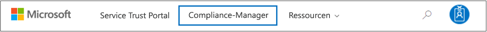

# Microsoft Compliance-Manager (klassisch)

> [!NOTE]
> Diese Dokumentation beschreibt eine frühere Version dieses Produkts. Benutzern wird dringend davon abgeraten, diese Version von Compliance Manager zu verwenden; stattdessen wird empfohlen, die neue [Microsoft Compliance-Bewertung](compliance-score.md) zu verwenden.

 *Der Compliance-Manager ist nicht in Office 365, betrieben von 21Vianet, Office 365 Deutschland, Office 365 US Government Community High (GCC) High oder Office 365 Department of Defense verfügbar.*
  
Mit dem Compliance-Manager, einem workflowbasierten Tools zur Risikoabschätzung im Microsoft [Service Trust-Portal](https://docs.microsoft.com/microsoft-365/compliance/get-started-with-service-trust-portal), können Sie Complianceaktivitäten Ihres Unternehmens im Zusammenhang mit Microsoft Professional Services und Microsoft Cloud Services, z. B. Microsoft Office 365, Microsoft Dynamics 365 und Microsoft Azure, nachverfolgen, zuweisen und überprüfen. 

Für Compliance-Manager gilt Folgendes:
  
- Er kombiniert die ausführlichen Informationen, die von Microsoft für Prüfer und Regulierungsbehörden im Rahmen unterschiedlicher unabhängiger Prüfungen der Microsoft-Clouddienste im Hinblick auf verschiedene Standards (z. B. ISO 27001, ISO 27018 und NIST) bereitgestellt werden, sowie Informationen, die Microsoft intern für die Einhaltung von Vorschriften (z. B. HIPAA und EU General Data Protection Regulation oder DSGVO) zusammenstellt, mit Ihrer eigenen Selbsteinschätzung bezüglich der Einhaltung dieser Standards und Vorschriften durch Ihr Unternehmen.
    
- Sie können damit Aktivitäten im Zusammenhang mit Compliance und Bewertung zuweisen, nachverfolgen und aufzeichnen, mit denen Ihre Organisation über die Grenzen von Teams hinweg die Complianceziele Ihres Unternehmens erreichen kann.
    
- Er liefert eine Compliance-Bewertung, anhand der Sie Ihre Fortschritte aufzeichnen und die Überwachungssteuerelemente priorisieren können, mit denen Sie Risiken für Ihre Organisation minimieren können.
    
- Er bietet ein sicheres Repository zum Hochladen und Verwalten von Nachweisen oder anderen Artefakten im Zusammenhang mit Complianceaktivitäten.
    
- Er generiert ausführliche Berichte in Microsoft Excel, in denen die von Microsoft und Ihrer Organisation durchgeführten Complianceaktivitäten dokumentiert werden, und die Prüfern, Regulierungsbehörden und anderen Beteiligten an der Compliance zur Verfügung gestellt werden können.

Eine kurze Demo von Compliance-Manager finden Sie in diesem Video zu [Compliance-Manager](https://www.youtube.com/watch?v=r1vs8NdSXKQ).

    
> [!IMPORTANT]
> Compliance Manager is a dashboard that provides a summary of your data protection and compliance stature and recommendations to improve data protection and compliance. The Customer Actions provided in Compliance Manager are recommendations; it is up to each organization to evaluate the effectiveness of these recommendations in their respective regulatory environment prior to implementation. Recommendations found in Compliance Manager should not be interpreted as a guarantee of compliance.

    
## Was ist der Compliance-Manager?

Compliance Manager is a workflow-based risk assessment tool designed to help you manage regulatory compliance within the shared responsibility model of the cloud. Compliance Manager provides you with a dashboard view of standards and regulations and assessments that contain Microsoft's control implementation details and test results and customer control implementation guidance and tracking for your organization to enter. Compliance Manager provides certification assessment control definitions, guidance on implementation and testing of controls, risk-weighted scoring of controls, role-based access management, and an in-place control action assignment workflow to track control implementation, testing status and evidence management. Compliance Manager optimizes compliance workload by enabling customers to logically group assessments together and apply assessment control testing to identical or related controls, reducing the duplication of effort that might otherwise be required to satisfy identical control requirements across different certifications.

## Bewertungen im Compliance-Manager

The core component of Compliance Manager is called an *Assessment*. An Assessment is an assessment of a Microsoft service against a certification standard or data protection regulation (such as ISO 27001:2013, and the GDPR). Assessments help you to discern your organization's data protection and compliance posture against the selected industry standard for the selected Microsoft cloud service. Assessments are completed by the implementation of the controls that map to the certification standard being assessed. 
  
Die Struktur einer Bewertung basiert auf der Verantwortung, die sich Microsoft und Ihre Organisation im Zusammenhang mit der Bewertung der Sicherheits- und Compliancerisiken in der Cloud und mit der Implementierung der von einem Compliancestandard angegebenen Sicherheitsmaßnahmen für Datenschutz, eines Datenschutzstandards, einer Vorschrift oder eines Gesetzes teilen.
  
Eine Bewertung besteht aus mehreren der folgenden Komponenten:
  
- **Im Bereich enthaltene Dienste**: Jede Bewertung gilt für einen bestimmten Satz von Microsoft-Diensten, die im Abschnitt der im Bereich enthaltenen Dienste ausgeführt sind. 
    
- **Microsoft-Managed Controls** - For each cloud service, Microsoft implements and manages a set of  *controls*  as part of Microsoft's compliance with various standards and regulations. These controls are organized into  *control families*  that align with the structure from the corresponding certification or regulation that the Assessment is aligned to. For each Microsoft-managed control, Compliance Manager provides details about how Microsoft implemented the control, along with how and when that implementation was tested and validated by an independent third-party auditor. 
    
    Nachfolgend finden Sie ein Beispiel von drei von Microsoft verwalteten Steuerelementen in der Steuerelementfamilie **Sicherheit** aus einer Bewertung von Office 365 und der DSGVO. 

    
  
  a. Specifies the following information from the certification or regulation that maps to the Microsoft-managed control.

  - **Steuerelement-ID**: Die Abschnit-t oder Artikelnummer der Zertifizierung oder Vorschrift, die dem von Microsoft verwalteten Steuerelement zugeordnet ist.
    
  - **Titel**: Der Titel aus der entsprechenden Zertifizierung oder Vorschrift.
    
  - **Artikel-ID**: Dieses Feld ist nur für DSGVO-Bewertungen enthalten, da es die entsprechende DSGVO-Artikelnummer angibt.
    
  - **Beschreibung** –Text des Standards oder der Vorschrift, der bzw. die dem von Microsoft verwalteten Steuerelement zugeordnet ist.

  b. The Compliance Score for the control, which indicates the level of risk (due to non-compliance or control failure) associated with each Microsoft-managed control. See [Understanding the Compliance Score](#understanding-the-compliance-score) for more information. Note that Compliance Scores are rated from 1 to 10 and are color-coded. Yellow indicates low risk controls, orange indicates medium-risk controls, and red indicated high-risk controls. 
    
  c. Information about the implementation status of a control, the date the control was tested, who performed the test, and the test result.
    
  d. For each control, you can click **More** to see additional information, including details about Microsoft's implementation of the control and details about how the control was tested and validated by an independent third-party auditor. 
    
- **Customer-Managed Controls** - This is the collection of controls that are managed by your organization. Your organization is responsible for implementing these controls as part of your compliance process for a given standard or regulation. Customer-managed controls are also organized into control families for the corresponding certification or regulation. Use the customer-managed controls to implement the recommended actions suggested by Microsoft as part of your compliance activities. Your organization can use the prescriptive guidance and recommended Customer Actions in each customer-managed control to manage the implementation and assessment process for that control.
    
    Customer-managed controls in Assessments also have built-in workflow management functionality that you can use to manage and track your organization's progress towards completing the Assessment. For example, a Compliance Officer in your organization can assign an Action Item to an IT admin who has the responsibility and necessary permissions to perform the actions that are recommended for the control. When that work is complete, the IT admin can upload evidence of their implementation tasks (for example, screenshots of configuration or policy settings) and then assign the Action Item back to the Compliance Officer to evaluate the collected evidence, test the implementation of the control, and record the implementation date and test results in Compliance Manager. For more information, see the [Managing the assessment process](#managing-the-assessment-process) section in the article. 
  
## Berechtigungen und rollenbasierte Zugriffssteuerung

Compliance-Manager verwendet ein Berechtigungsmodell der rollenbasierten Zugriffssteuerung. Nur Benutzer, denen eine Benutzerrolle zugewiesen ist, können auf Compliance-Manager zugreifen, und welche Aktionen ein Benutzer ausführen darf, wird durch den jeweiligen Rollentyp eingeschränkt.
  
Beachten Sie, dass es keine Standardrolle **Gastzugriff** mehr gibt. Jedem Benutzer muss eine Rolle zugewiesen werden, damit er auf Compliance-Manager zugreifen und darin arbeiten kann.
  
The following table describes each Compliance Manager permission and what it allows the user do. The table also indicates the role that each permission is assigned to.
  
||**Compliance Manager Reader**|**Compliance Manager Contributor**|**Compliance Manager Assessor**|**Compliance Manager Administrator**|**Portal Admin**|
|:-----|:-----|:-----|:-----|:-----|:-----|
|**Lesen von Daten**: Benutzer können Daten lesen, aber nicht bearbeiten.    |             |             |             |             |            |
|**Bearbeiten von Daten**: Benutzer können alle Felder, mit Ausnahme von „Testergebnis“ und „Testdatum“, bearbeiten.    ||            |             |             |             |
|**Bearbeiten der Testergebnisse**: Benutzer können die Felder „Testergebnis“ und „Testdatum“ bearbeiten.    ||  |             |             |             |
|**Verwalten von Bewertungen**: Benutzer können Bewertungen erstellen, archivieren und löschen.    |||  |             |             |
|**Manage users** - Users can add other users in their organization to the Reader, Contributor, Assessor, and Administrator roles. Only those users with the Global Administrator role in your organization can add or remove users from the Portal Admin role.    ||||  |             |
   
## Grundlegendes zur Compliancebewertung

Compliance-Manager zeigt im Dashboard einen Gesamtwert für Office 365-Bewertungen in der oberen rechten Ecke der Kachel an. Dies ist der allgemeine Compliancegesamtwert für die Bewertung und stellt die Akkumulierung der Punkte dar, die für jede Steuerelementbewertung erhalten wurden, die in der Bewertung als implementiert und getestet gekennzeichnet wurde. Wenn Sie eine Bewertung hinzufügen, werden Sie feststellen, dass die Compliancebewertung bereits nahezu abgeschlossen ist, weil die Punkte für die von Microsoft verwalteten Steuerelemente, die von Microsoft implementiert und von unabhängigen Dritten getestet wurden, bereits angewendet wurden.
  

  
Die übrigen Punkte stammen aus der erfolgreichen Bewertung von Kundensteuerelementen, aus der Implementierung und aus dem Test der vom Kunden verwalteten Steuerelemente, von denen jedes einen bestimmten Wert hat, der einen Teil der Compliance-Bewertung ausmacht. 
  
Jede Bewertung zeigt einen Wert der risikobasierten Compliancebewertung, damit Sie das Risikoniveau (aufgrund einer Nichtkonformität oder eines Steuerelementfehlers) im Zusammenhang mit jedem Steuerelement (einschließlich der von Microsoft verwalteten und vom Kunden verwalteten Steuerelemente) in einer Bewertung abschätzen können. Jedem vom Kunden verwalteten Steuerelement wird eine mögliche Anzahl von Punkten auf einer Skala von 1 bis 10 zugeordnet (als *Schweregradeinstufung bezeichnet). Dabei werden Steuerelementen mit einem höheren Risikofaktor beim Fehlschlagen mehr Punkte und Steuerelementen mit einem geringen Risiko weniger Punkte zugeordnet. 
  
Das unten dargestellte Bewertungssteuerelement für die Verwaltung des Benutzerzugriffs hat einen sehr hohen Schweregrad. Deshalb wird der Wert 10 angezeigt.
  

  
 Das unten dargestellte Bewertungssteuerelement für die Sicherung von Informationen hat dagegen einen niedrigeren Schweregrad. Deshalb wird der Wert 3 angezeigt. 
  

  
The Compliance Manager assigns a default severity ranking to each control. Risk rankings are calculated based on the following criteria:
  
- Ob ein Steuerelement das Auftreten von Vorfällen verhindert (die höchste Einstufung), Vorfälle, die geschehen sind, erkennt oder die Auswirkungen eines Vorfalls korrigiert (niedrigste Einstufung). Im Hinblick auf die Schweregradeinstufung wird einem obligatorischen Steuerelement, das eine Bedrohung verhindert, die höchste Punktzahl zugeordnet. Steuerelementen, die zur Erkennung oder Behebung dienen (unabhängig davon, ob sie obligatorisch sind oder nach eigenem Ermessen angewendet werden), wird die niedrigste Punktzahl zugeordnet.
    
- Ob ein Steuerelement (nach seiner Implementierung) erforderlich ist und deshalb von den Benutzern nicht umgangen werden kann (Benutzer müssen beispielsweise ihr Kennwort zurücksetzen und Anforderungen im Hinblick auf Kennwortlänge und -zeichen erfüllen), oder ob es frei verfügbar ist und von Benutzern umgangen werden kann (zum Beispiel Geschäftsregeln, die erfordern, dass Benutzer ihre Bildschirme sperren, wenn sie sich nicht an ihren Computern befinden).
    
- Controls related to risks to data confidentiality, integrity, and availability, whether these risks come from internal or external threats, and whether the threat is malicious or accidental. For example, controls that would help prevent an external attacker from breaching that network and gaining access to personally identifiable information would be assigned more points than a control related to preventing an employee from accidentally mis-configuring a network router setting that results in a network outage).
    
- Risiken im Zusammenhang mit rechtlichen und externen Faktoren, z. B. Verträge, Vorschriften und öffentliche Verpflichtungen, für jedes Steuerelement.
    
The displayed Compliance Score values for the control are applied  *in their entirety*  to the Total Compliance Score on a pass/fail basis--either the control is implemented and passes the subsequent assessment test or it does not; there is no partial credit for a partial implementation. Only when the control has its **Implementation Status** set to **Implemented** or **Alternative Implementation** and the **Test Result** is set to **Passed** are the assigned points added to the Total Compliance Score. 
  
Die Compliancebewertung kann Ihnen insbesondere bei der Priorisierung von Steuerelementen helfen, auf die bei der Implementierung der Schwerpunkt gelegt werden muss, indem angegeben wird, welche Steuerelemente bei einem Fehler ein höheres mögliches Risiko aufweisen. Neben der risikobasierten Priorisierung ist Folgendes zu beachten: Wenn sich die Bewertungssteuerelemente auf andere Steuerelemente beziehen (entweder innerhalb derselben Bewertung oder in einer anderen Bewertung in derselben Bewertungsgruppe), kann der erfolgreiche Abschluss eines einzelnen Steuerelements zu einer erheblichen Verringerung des Aufwands basierend auf der Synchronisierung der Steuerelement-Testergebnisse führen.
  
In der Abbildung unten sehen wir beispielsweise, dass die Bewertung „Office 365 – DSGVO“ derzeit zu 46 % bewertet ist, was bedeutet, dass 51 von 111 Steuerelementbewertungen mit einer Gesamtbewertung von 289 Punkten von möglichen 600 Punkten abgeschlossen wurden.
  

  
In der Bewertung bezieht sich das DSGVO-Steuerelement 7.5.5 auf 5 andere Steuerelemente (7.4.1, 7.4.3, 7.4.4, 7.4.8 und 7.4.9), die jeweils einen mittleren bis hohen Risikobewertungswert von 6 oder 8 für den Schweregrad aufweisen). Mithilfe des Bewertungsfilters haben wir alle diese Steuerelemente ausgewählt, sodass sie in der Bewertungsansicht angezeigt werden. Sie können unten erkennen, dass keines von ihnen bewertet wurde. 
  
 As those 6 controls are related, the completion of any one them will result in a synchronization of those test results across the related controls within this assessment (just as it will for any related controls in an assessment that is in the same assessment grouping). Upon completion of the implementation and testing of GDPR control 7.5.5, the control detail area refreshes to show that all 6 controls have been assessed, with a corresponding increase in the number of assessed controls to 57 and 51% assessed, and a change in total Compliance Score of +40. 
  

  
Dieses Dialogfeld zur Bestätigung der Aktualisierung wird angezeigt, wenn Sie im Begriff sind, den Implementierungsstatus eines verknüpften Steuerelements derart zu ändern, dass dies Auswirkungen auf andere verknüpfte Steuerelemente hat.
  

  
> [!NOTE]
> Currently, only Assessments for Office 365 cloud services include a Compliance Score. Assessments for Azure and Dynamics show an assessment status. 

## Methodik der Compliance-Bewertung

Die Compliance-Bewertung, wie der Microsoft Secure Store, ist anderen verhaltensbasierten Bewertungssystemen ähnlich. Die Compliance-Bewertung Ihrer Organisation kann erhöht werden, indem Aktivitäten im Zusammenhang mit Datenschutz und Sicherheit ausgeführt werden.
  
> [!NOTE]
> The Compliance Score does not express an absolute measure of organizational compliance with any particular standard or regulation. It expresses the extent to which you have adopted controls which can reduce the risks to personal data and individual privacy. No service can guarantee that you are compliant with a standard or regulation, and the Compliance Score should not be interpreted as a guarantee in any way. 
  
Assessments in Compliance Manager are based on the shared responsibility model for cloud computing. In the shared responsibility model, Microsoft and each customer share responsibility for the protection of the customer's data when that data is stored in our cloud.
  
Wie aus der folgenden Office 365 DSGVO-Bewertung hervorgeht, sind Microsoft und seine Kunden jeweils für die Durchführung einer Reihe von Maßnahmen verantwortlich, die den Anforderungen der zu beurteilenden Standards oder Vorschriften entsprechen. Um die erforderlichen Maßnahmen für eine Vielzahl von Standards und Vorschriften zu rationalisieren und zu verstehen, behandelt der Compliance-Manager alle Standards und Vorschriften so, als wären sie Kontrollframeworks. So beinhalten die von Microsoft und den Kunden für jede Bewertung durchgeführten Maßnahmen die Implementierung und Validierung verschiedener Steuerelemente.
  

  
Nachfolgend sehen Sie den grundlegenden Workflow für eine typische Aktion:
  
1. The Compliance, Risk, Privacy, and/or Data Protection Officer of an organization assigns the task to someone in the organization to implement a control. That person could be:

    - Der Besitzer einer Unternehmensrichtlinie
    
    - Ein IT-Implementierer
    
    - Eine andere Person in der Organisation, die für das Ausführen der Aufgabe verantwortlich ist
    
2. That individual performs the tasks necessary to implement the control, uploads evidence of implementation into Compliance Manager, and marks the control(s) tied to the Action as implemented. Once these tasks are completed, they assign the Action to an Assessor for validation. Assessors can be:
    
    - Interne Prüfer, die die Überprüfung von Steuerelementen in einer Organisation ausführen
    
    - Externe Prüfer, die die Compliance überprüfen und bestätigen, z. B. die unabhängigen Organisationen, die die Microsoft-Clouddienste prüfen
    
3. Der Prüfer überprüft das Steuerelement, untersucht den Nachweis und markiert die Steuerelemente als bewertet und kennzeichnet die Ergebnisse der Bewertung (z. B. bestanden).
    
Nachdem alle Steuerelemente, die einer Bewertung zugeordnet sind, bewertet wurden, wird die Bewertung als abgeschlossen betrachtet.
  
Every Assessment in Compliance Manager comes pre-loaded with information that provides details about the Actions taken by Microsoft to satisfy the requirements of the controls for which Microsoft is responsible. This information includes details about how Microsoft has implemented each control and how and when Microsoft's implementation was assessed and verified by a third-party auditor. For this reason, the Microsoft Managed Controls for each Assessment are marked as Assessed, and the Compliance Score for the Assessment reflects this.
  
Each Assessment includes a total Compliance Score based on the shared responsibility model. Microsoft's implementation and testing of controls for Office 365 contributes a portion of the total possible points associated with a GDPR assessment. As the customer implements and tests each of the customer Actions, the Compliance Score for the Assessment will increase by the value assigned to the control. 
  
 ### Methode der risikobasierten Bewertung
  
Compliance Manager uses a risk-based scoring methodology with a scale from 1-10 that assigns a higher value to controls that represent a higher risk in the event the control fails or is non-compliant. The scoring system used by Compliance Score is based on several key factors, such as:
  
- Die Grundidee des Steuerelements
    
- Die Risikostufe des Steuerelements basierend auf der Art von Bedrohungen
    
- Die externen Faktoren für das Steuerelement
    

  
 ### Die Grundidee des Steuerelements
  
Die Grundidee des Steuerelements basiert darauf, ob das Steuerelement erforderlich oder frei ist, und ob es vorbeugende, erkennende oder korrigierende Maßnahmen umfasst.
  
 ### Erforderlich oder frei
  
 *Mandatory controls*  are controls that cannot be bypassed either intentionally or accidentally. An example of a common mandatory control is a centrally-managed password policy that sets requirements for password length, complexity, and expiration. Users must comply with these requirements in order to access the system. 
  
 *Discretionary controls*  rely upon users to understand policy and act accordingly. For example, a policy requiring users to lock their computer when they leave it is a discretionary control because it relies on the user. 
  
 ### Vorbeugende, erkennende oder korrigierende Steuerelemente
  
 *Preventative controls*  are those that prevent specific risks. For example, protecting information at rest using encryption is a preventative control against attacks, breaches, etc. Separation of duties is a preventative control to manage conflict of interest and to guard against fraud. 
  
 *Detective controls*  are those that actively monitor systems to identify irregular conditions or behaviors that represent risk or that can be used to detect intrusions or determine if a breach has occurred. System access auditing and privileged administrative actions auditing are types of detective monitoring controls; regulatory compliance audits are a type of detective control used to find process issues. 
  
 *Corrective controls*  are those that try to keep the adverse effects of a security incident to a minimum, take corrective action to reduce the immediate effect, and reverse the damage, if possible. Privacy incident response is a corrective control to limit damage and restore systems to an operational state after a breach. 
  
Durch die Auswertung jedes Steuerelements anhand dieser Faktoren bestimmen wir die Grundidee des Steuerelements und weisen ihm einen Wert relativ zu dem Risiko zu, das es darstellt.
  
 **Bedrohung**
  
||||
|:-----|:-----|:-----|
||**Erforderlich**   |**Frei**   |
|**Präventiv**   |Hohes Risiko    |Mittleres Risiko    |
|**Erkennend**   |Mittleres Risiko    |Niedriges Risiko    |
|**Korrigierend**   |Mittleres Risiko    |Niedriges Risiko    |
   
Bedrohung bezieht sich auf alles, was eine Gefahr für den grundlegenden, universell akzeptierten Sicherheitsstandard darstellt, der als die CIA-Triade für Daten bekannt ist: Confidentiality, Integrity und Availability (Vertraulichkeit, Integrität und Verfügbarkeit):
  
- Vertraulichkeit bedeutet, dass Informationen nur von vertrauenswürdigen, autorisierten Personen gelesen werden können.
    
- Integrität bedeutet, dass Informationen nicht von nicht autorisierten Personen geändert oder gelöscht wurden.
    
- Verfügbarkeit bedeutet, dass auf Informationen problemlos mit einem hohem Maß an Dienstqualität zugegriffen werden kann.
    
A failure of any of these characteristics is considered a compromise of the system as a whole. Threats can come from both internal and external sources, and an actor's intent can be accidental or malicious. These factors are estimated in a threat matrix that assigns threat levels of either High, Moderate, or Low to each combination of scenarios.

||**Intern** ||**Extern** ||||
|:-----|:-----|:-----|:-----|:-----|:-----|:-----|
||*Bösartig* |*Unbeabsichtigt* |*Bösartig* |*Unbeabsichtigt* |||
|**Vertraulichkeit** |(H, M oder N)    |(H, M oder N)    |(H, M oder N)    |(H, M oder N)|
|**Integrität** |(H, M oder N)    |(H, M oder N)    |(H, M oder N)    |(H, M oder N)|
|**Verfügbarkeit** |(H, M oder N)    |(H, M oder N)    |(H, M oder N)    |(H, M oder N)|
   
 **Externe Faktoren**
  
|**Verträge**|**Vorschriften**|**Öffentliche Verpflichtungen**|
|:-----|:-----|:-----|
|(H, M oder N)    |(H, M oder N)    |(H, M oder N)    |
   
Externe Faktoren wie geltende Vorschriften, Verträge und öffentliche Verpflichtungen können Auswirkungen auf Steuerelemente haben, die zum Schützen von Daten und zum Verhindern von Datenschutzverletzungen entwickelt wurden. Jedem Faktor wird der Risikowert „Hoch“, „Mittel“ oder „Niedrig“ zugewiesen.
  
Die geschätzte Anzahl von Vorkommnissen der Risikostufen „Hoch“, „Mittel“ oder „Niedrig“ über die 15 möglichen Risikoszenarien hinweg, die unter CIA/Bedrohung und Rechtlich/Externe Faktoren dargestellt sind, werden kombiniert, sodass eine Risikogewichtung entsteht, bei der die Wahrscheinlichkeit und die Anzahl von Vorkommnissen von Risiken bei einem bestimmten Wert als signifikant berücksichtigt wird und bei der Berechnung des Schweregrads des Steuerelements mit einbezogen wird.
  
Basierend auf dem Schweregrad des Steuerelements wird das Steuerelement seiner Compliance-Bewertung zugewiesen, eine Zahl zwischen 1 (niedrig) und 10 (hoch), gruppiert in die folgenden Risikokategorien:
  
|**Risikostufe**|**Steuerelementwert**|
|:-----|:-----|
|Niedrig    |1-3    |
|Mittel    |6    |
|Hoch    |8    |
|Schwerwiegend    |10    |
   
Durch Priorisieren von Bewertungssteuerelementen mit den höchsten Compliance-Bewertungen konzentriert sich die Organisation auf die Elemente mit dem höchsten Risiko und erhält proportional positiveres Feedback in der Form von mehr Punkten, die zum Gesamtwert für die Bewertung für jede abgeschlossene Steuerelementbewertung addiert werden.
  
### Zusammenfassung der Bewertungsmethode
  
The Compliance Score is a core component of the way that Compliance Manager helps organizations understand and manage their compliance. The Compliance Score for an assessment is an expression of the company's compliance with a given standard or regulation as a number, where the higher the score (up to the maximum number of points allocated for the Assessment), the better the company's compliance posture. Understanding the compliance scoring methodology in which assessment controls are assigned risk severity values between 1- 10 (low to high), and how completed control assessments add to the total compliance score is crucial to organizations for prioritizing their actions.

## Gruppieren von Bewertungen

Wenn Sie eine neue Bewertung erstellen, werden Sie aufgefordert, eine neue Gruppe zu erstellen, der die Bewertung zugewiesen werden soll, oder die Bewertung einer vorhandenen Gruppe zuzuweisen. Mithilfe von Gruppen können Sie Bewertungen logisch anordnen und allgemeine Informationen sowie Workflowaufgaben zwischen Bewertungen teilen, die die gleichen oder ähnliche vom Kunden verwaltete Steuerelemente aufweisen.
  
For example, you could group Assessments by year or teams, departments, or agencies within your organization or group them by year. Here are some examples of groups and the Assessments they might contain.
  
- DSGVO-Bewertungen – 2018
    
  - Office 365 + DSGVO
    
  - Azure + DSGVO
    
  - Dynamics + DSGVO
    
- Azure-Bewertungen – 2018
    
  - Azure + DSGVO
    
  - Azure + ISO 27001:2013
    
  - Azure + ISO 27018:2014
    
- Datenschutzbewertungen
    
  - Office 365 + ISO 27001:2013
    
  - Office 365 + ISO 27018:2014
    
  - Azure + ISO 27001:2013
    
  - Azure + ISO 27018:2014
    
> [!TIP]
> Es wird empfohlen, dass Sie eine Gruppierungsstrategie für Ihre Organisation ermitteln, bevor Sie neue Bewertungen hinzufügen: 
  
Die folgenden Anforderungen gelten für das Gruppieren von Bewertungen:
  
- Gruppennamen (auch als *Gruppen-IDs bezeichnet) müssen in Ihrer Organisation eindeutig sein. 
    
- Groups can contain Assessments for the same certification/regulation, but each group can only contain one Assessment for a specific cloud service/certification pair. For example, a group can't contain two Assessments for Office 365 and GDPR. Similarly, a group can contain multiple Assessments for the same cloud service as long as the corresponding certification/regulation for each one is different.
    
Nachdem eine Bewertung einer Bewertungsgruppierung hinzugefügt wurde, kann die Gruppierung nicht mehr geändert werden. Sie können die Bewertungsgruppe umbenennen. Dies ändert den Namen der Bewertungsgruppierung für alle Bewertungen, die dieser Gruppe zugeordnet sind. Sie können eine neue Bewertung und eine neue Bewertungsgruppe erstellen und Informationen aus einer vorhandenen Bewertung kopieren. Auf diese Weise wird effektiv ein Duplikat dieser Bewertung in einer anderen Bewertungsgruppe erstellt. Durch das Archivieren einer Bewertung wird die Beziehung zwischen dieser Bewertung und der Bewertungsgruppe unterbrochen. Alle weiteren Updates zu anderen verwandten Bewertungen werden in der archivierten Bewertung nicht mehr berücksichtigt.
  
Wie bereits erläutert, besteht ein wesentlicher Vorteil der Verwendung von Gruppen darin, dass bei Nutzung desselben vom Kunden verwalteten Steuerelements für zwei verschiedene Bewertungen in der gleichen Gruppe (wodurch die Kundenaktionen für jedes Steuerelement identisch sind) die Implementierungsdetails, Testinformationen und der Status für das Steuerelement in einer Bewertung mit demselben Steuerelement in jeder anderen Bewertung in der Gruppe synchronisiert werden. Anders ausgedrückt: Wenn Bewertungen dasselbe Steuerelement verwenden und sich diese Bewertungen in derselben Gruppe befinden, müssen Sie nur den Bewertungsprozess für das Steuerelement in einer Bewertung verwalten. Die Ergebnisse für dieses Steuerelement werden automatisch mit anderen Bewertungen synchronisiert. ISO 27001 und ISO 27018 weisen beispielsweise ein Steuerelement auf, das sich auf Kennwortrichtlinien bezieht. Wenn der Teststatus für das Steuerelement in einer Bewertung auf „Erfolgreich“ gesetzt wird, wird das Steuerelement in der anderen Bewertung entsprechend aktualisiert (und als „Erfolgreich“ gekennzeichnet), sofern beide Bewertungen Teil derselben Bewertungsgruppe sind.
  
Betrachten Sie als Beispiel hierfür diese zwei in Beziehung stehenden Bewertungssteuerelemente, die beide mit der Verschlüsselung von Daten über öffentliche Netzwerke zu tun haben: Steuerelement 6.10.1.2 in der Office 365 – DSGVO-Bewertung und Steuerelement SC-13 in der Office 365 – NIST 800-53-Bewertung. Dies sind in Beziehung stehende Bewertungssteuerelemente in zwei verschiedenen Bewertungen. Sie befinden sich beide in der Standardgruppe.  Zunächst hat keine dieser Bewertungen Steuerelementbewertungen durch den Kunden abgeschlossen, wie im Compliance-Manager-Dashboard ersichtlich wird, das diese beiden Bewertungen anzeigt.
  

  
Durch Klicken auf die Bewertung **Office 365 – DSGVO** und mithilfe der Filtersteuerelemente zum Anzeigen des DSGVO-Steuerelements 6.10.1.2 sehen wir, dass das Steuerelement SC-13 in NIST 800-53 als verknüpftes Steuerelement aufgeführt ist.
  

  
 Nachfolgend ist der Abschluss der Implementierung und des Tests von DSGVO-Steuerelement 6.10.1.2 dargestellt. 
  

  
Indem wir zu dem verknüpften Steuerelement in der gruppierten Bewertung navigieren, sehen wir, dass NIST 800-53 SC-13 auch als abgeschlossen mit demselben Datum und derselben Uhrzeit markiert wurde, ohne zusätzliche Implementierungs- oder Testarbeiten.
  

  
Zurück im Dashboard können wir sehen, dass in jeder Bewertung eine Steuerelementbewertung abgeschlossen wurde und dass sich die gesamte Compliancebwertung für jede Bewertung um 8 erhöht hat (der Wert der Compliancebewertung dieses gemeinsam verwendeten Steuerelements).
  

## Verwaltungsfunktionen

Es gibt bestimmte Verwaltungsfunktionen, die nur für das Mandantenadministratorkonto verfügbar sind und nur bei der Anmeldung als globaler Administrator sichtbar sind.
  
> [!NOTE]
> The Access to Restricted Documents permission in the drop-down list will allow administrators to give users access to restricted documents that Microsoft shares on the Service Trust Portal. The Restricted Documents feature isn't available, but is coming soon. 
  
### Zuweisen von Compliance-Manager-Rollen zu Benutzern

Each Compliance Manager role has slightly different permissions. You can view the permissions assigned to each role, see which users are in which roles, and add or remove users from that role through the Service Trust Portal by selecting the **Admin** menu item, and then choosing **Settings**. 
  

  
Hinzufügen oder Entfernen von Benutzern aus Compliance-Manager-Rollen
  
1. Wechseln Sie zu [https://servicetrust.microsoft.com](https://servicetrust.microsoft.com).
    
2. Melden Sie sich mit Ihrem globalen Azure Active Directory-Administratorkonto an.
    
3. Klicken Sie auf der oberen Menüleiste des Service Trust Portals auf **Admin**, und wählen Sie dann **Einstellungen** aus. 
    
4. Klicken Sie in der Dropdownliste **Rolle auswählen** auf die Rolle, die Sie verwalten möchten. 
    
5. Benutzer, die den einzelnen Rollen hinzugefügt wurden, werden auf der Seite **Rolle auswählen** aufgeführt. 
    
6. To add users to this role, click **Add**. In the **Add Users** dialog, click the user field. You can scroll through the list of available users or begin typing the user name to filter the list based on your search term. Click the user to add that account to the **Add Users** list to be provisioned with that role. If you would like to add multiple users concurrently, begin typing a user name to filter the list, and then click the user to add to the list. Click **Save** to provision the selected role to these users. 
    
    
  
7. Um Benutzer aus dieser Rolle zu entfernen, wählen Sie den/die Benutzer aus, und klicken Sie auf **Löschen**. 
    
    
 
## Datenschutzeinstellungen

Certain regulations require that an organization must be able to delete user history data. To enable this, Compliance Manager provides the **User Privacy Settings** functions, that allow administrators to: 
  
- [Suchen eines Benutzers](#search-for-a-user)

- [Exportieren eines Berichts mit Kontoverlaufsdaten](#export-a-report-of-account-data-history)

- [Erneutes Zuweisen von Aktionselementen](#reassign-action-items)

- [Löschen der Verlaufsdaten von Benutzern](#delete-user-data-history)
    

  
### Suchen eines Benutzers

So suchen Sie nach einem Benutzerkonto
  
1. Geben Sie die E-Mail-Adresse des Benutzers ein, indem Sie den Alias (die Informationen auf der linken Seite des @-Symbols) eingeben und den Domänennamen durch Klicken auf das Domänensuffix in der Liste auf der rechten Seite auswählen. Wenn es sich um einen Mandanten mehrerer registrierter Domänen handelt, sollten Sie das Domänennamensuffix der E-Mail-Adresse auf seine Richtigkeit überprüfen.
    
2. Wenn Sie den Benutzernamen korrekt eingegeben haben, klicken Sie auf **Suchen**. 
    
3. If the user account is not found, the error message 'User not found' will be displayed on the page. Check the user's email address information, make corrections as necessary and click **Search** to try again. 
    
4. Wenn ein Benutzerkonto gefunden wird, ändert sich der Text der Schaltfläche von **Suchen** in **Löschen**, was darauf hinweist, dass das zurückgegebene Benutzerkonto der Betriebskontext für die zusätzlichen Funktionen ist, die unten angezeigt werden, und dass das Ausführen dieser Funktionen für dieses Benutzerkonto gilt. 
    
5. Klicken Sie auf **Löschen**, um die Suchergebnisse zu löschen und nach einem anderen Benutzer zu suchen. 
    
### Exportieren eines Berichts mit Kontoverlaufsdaten

Nachdem das Benutzerkonto identifiziert wurde, möchten Sie möglicherweise einen Bericht der Abhängigkeiten generieren, die mit diesem Konto verknüpft sind. Anhand dieser Informationen können Sie offene Aktionselemente neu zuweisen oder den Zugriff auf zuvor hochgeladene Nachweise sicherstellen. 
  
 So generieren und exportieren Sie einen Bericht:
  
1. Klicken Sie auf **Exportieren**, um einen Bericht der dem zurückgegebenen Benutzerkonto derzeit zugeordneten Compliance-Manager-Steuerelementaktionselemente sowie die Liste der von diesem Benutzer hochgeladenen Dokumente zu generieren und herunterzuladen. Wenn keine zugeordneten Aktionen oder hochgeladenen Dokumenten vorliegen, wird die Fehlermeldung „Keine Daten für diesen Benutzer“ angezeigt. 
    
2. Der Bericht wird im Hintergrund des aktiven Browserfensters heruntergeladen. Wenn kein Popupfenster für den Download angezeigt wird, sollten Sie den Downloadverlauf Ihres Browsers überprüfen.
    
3. Öffnen Sie das Dokument, um die Daten des Berichts zu überprüfen.
    
> [!NOTE]
> This is not a historical report that retains and displays state changes to action item assignment history. The generated report is a snapshot of the control action items assigned at the time that the report is run (date and time stamp written into the report). For instance, any subsequent reassignment of action items will result in different snapshot report data if this report is generated again for the same user. 
  
### Erneutes Zuweisen von Aktionselementen

This function enables an organization to remove any active or outstanding dependencies on the user account by reassigning all action item ownership (which includes both active and completed action items) from the returned user account to a new user selected below. This action does not change document upload history for the returned user account. 
  
 So weisen Sie Aktionselemente einem anderen Benutzer erneut zu
  
1. Klicken Sie auf das Eingabefeld, um nach einem anderen Benutzer in der Organisation zu suchen und diesen auszuwählen. Diesem Benutzer sollen die zurückgegebenen Aktionselemente zugewiesen werden.
    
2. Wählen Sie **Ersetzen**, um alle Aktionselemente von dem zurückgegebenen Benutzer dem neu ausgewählten Benutzer zuzuweisen. 
    
3. Folgendes Bestätigungsdialogfeld wird angezeigt: „Hiermit werden alle Steuerelementaktionselemente des aktuellen Benutzers dem ausgewählten Benutzer zugewiesen. Diese Aktion kann nicht rückgängig gemacht werden. Möchten Sie den Vorgang fortsetzen?“
    
4. Klicken Sie auf **OK**, um fortzufahren. Andernfalls klicken Sie auf **Abbrechen**. 
    
> [!NOTE]
> All action items (both active and completed) will be assigned to the newly selected user. However, this action does not affect the document upload history; any documents uploaded by the previously assigned user will still show the date/time and name of the previously assigned user. 
  
Changing the document upload history to remove the previously assigned user will have to be done as a manual process. In that case, the administrator will need to:
  
1. Öffnen Sie den zuvor heruntergeladenen Exportbericht.
  
2. Identifizieren Sie das gewünschte Steuerelementaktionselement, und navigieren Sie zu diesem.
  
3. Klicken Sie auf **Dokumente verwalten**, um zu dem Nachweisspeicher für dieses Steuerelement zu navigieren. 
  
4. Laden Sie das Dokument herunter.
  
5. Löschen Sie das Dokument im Nachweisspeicher.
  
6. Re-upload the document. The document will now have a new upload date, time and Uploaded By username. 
  
### Löschen der Verlaufsdaten von Benutzern

This sets control action items to 'unassigned' for all action items assigned to the returned user. This also sets uploaded by value to 'user removed' for any documents uploaded by the returned user
  
 So löschen Sie das Aktionselement für das Benutzerkonto und den Uploadverlauf des Dokuments
  
1. Klicken Sie auf **Löschen**. 

    A confirmation dialog will be displayed, stating "This will remove all control action item assignments and the document upload history for the selected user. This action cannot be undone. Are you sure you want to continue?"
    
3. Klicken Sie auf **OK**, um fortzufahren. Andernfalls klicken Sie auf **Abbrechen**. 
  
## Verwenden des Compliance-Managers

Im Compliance-Manager erhalten Sie Tools zum Zuweisen, Nachverfolgen und Aufzeichnen von Aktivitäten im Zusammenhang mit Compliance und Bewertung. Mithilfe dieser Tools kann Ihre Organisation über Teamgrenzen hinweg die Compliance-Ziele Ihrer Organisation erreichen.
  

## Zugreifen auf den Compliance-Manager

You access Compliance Manager from the Service Trust Portal. Anyone with a Microsoft account or Azure Active Directory organizational account can access Compliance Manager.
  

  
1. Wechseln Sie zu [https://servicetrust.microsoft.com](https://servicetrust.microsoft.com/).
    
2. Melden Sie sich mit Ihrem Azure Active Directory-Administratorkonto an.
    
3. Klicken Sie im Service Trust Portal auf **Compliance-Manager**. 
    
4. When the Non-Disclosure Agreement is displayed, read it, and then click **Agree** to continue. You'll only have to do this once, and then the Compliance Manager dashboard is displayed. 

    Um Ihnen den Einstieg zu erleichtern, haben wir standardmäßig die folgenden Bewertungen hinzugefügt:
    
    
    
5. Klicken Sie auf das  **Hilfe**, um sich eine kurze Einführung in Compliance-Manager anzusehen. 
  
## Anzeigen von Aktionselementen

Compliance-Manager bietet eine bequeme Ansicht aller Ihrer zugewiesenen Steuerelementbewertungsaktionselemente, sodass Sie schnell und einfach Aktionen für diese ausführen können. Sie können alle Aktionselemente anzeigen oder die Aktionselemente auswählen, die einer bestimmten Zertifizierung entsprechen, indem Sie auf die Registerkarte für diese Bewertung klicken. Beispielsweise wurde in der nachstehenden Abbildung die Registerkarte „DSGVO“ ausgewählt, die Steuerelemente anzeigt, die sich auf die DSGVO-Bewertung beziehen.
  

  
So zeigen Sie Ihre Aktionselemente an
  
1. Wechseln zum Compliance-Manager-Dashboard
    
2. Klicken Sie auf den Link **Aktionselemente**. Die Seite wird so aktualisiert, dass die Ihnen zugewiesenen Aktionselemente angezeigt werden. 
    
    By default, all action items are shown. If you have action items across multiple certifications, the names of the certifications will be listed in tabs across the top of the assessment control. To see the action items for a specific certification, click that tab.

## Hinzufügen einer Bewertung

So fügen Sie eine Bewertung zu Compliance-Manager hinzu
  
1. Klicken Sie im Compliance-Manager-Dashboard auf  **Bewertung hinzufügen**. 
    
2. In the **Add an Assessment** window, you can create a new group to add the Assessment to or you can add it to an existing group (the built-in group is named "Initial Group".) Depending on the option you choose, either type the name of a new group or select an existing group from the drop-down list. For more information, see [Grouping Assessments](#grouping-assessments).
    
    Wenn Sie eine neue Gruppe erstellen, können Sie auch Informationen aus einer vorhandenen Gruppe in die neue Bewertung kopieren. Das bedeutet, dass alle Informationen, die den Feldern für Implementierungsdetails, Testplan und Verwaltungsantwort für vom Kunden verwaltete Steuerelemente von Bewertungen in der Gruppe, aus der Sie kopieren, hinzugefügt wurden, in dieselben (oder zugehörigen) vom Kunden verwalteten Steuerelemente in der neuen Bewertung kopiert werden. Wenn Sie einer vorhandenen Gruppe eine neue Bewertung hinzufügen, werden allgemeine Informationen von Bewertungen in dieser Gruppe in die neue Bewertung kopiert. Weitere Informationen finden Sie unter [Kopieren von Informationen aus vorhandenen Bewertungen](#copying-information-from-existing-assessments).
    
3. Klicken Sie auf **Weiter**, und gehen Sie folgendermaßen vor:
    
    a. Wählen Sie einen Microsoft-Clouddienst, dessen Compliance bewertet werden soll, aus der Dropdownliste **Produkt auswählen** aus. 
    
    b. Wählen Sie eine Zertifizierung, für die der ausgewählte Clouddienst bewertet werden soll, aus der Dropdownliste **Zertifizierung auswählen** aus. 
    
4. Klicken Sie auf **Zum Dashboard hinzufügen**, um die Bewertung zu erstellen. Die Bewertung wird dem Compliance-Manager-Dashboard als neue Kachel am Ende der Liste der vorhandenen Kacheln hinzugefügt. 
    
    Auf der **Bewertungskachel** im Compliance-Manager-Dashboard werden die Bewertungsgruppierung, der Name der Bewertung (automatisch als Kombination des Dienstnamens und der ausgewählten Zertifizierung erstellt), das Erstellungsdatum, das Datum der letzten Änderung, die gesamte Compliancebewertung (die Summe aller Risikobewertungen zugewiesener Steuerelemente, die implementiert, getestet und bestanden wurden) sowie Statusanzeigen im unteren Bereich angezeigt, in denen die Anzahl von bewerteten Steuerelementen angezeigt wird. 
    
5. Klicken Sie auf den Namen der Bewertung, um sie zu öffnen, und zeigen Sie die Details der Bewertung an.
    
6. Klicken Sie auf das Menü **Aktionen**, um die Ihnen zugewiesenen Aktionselemente anzuzeigen, benennen Sie die Bewertungsgruppe um, exportieren Sie den Bewertungsbericht oder archivieren Sie die Bewertung. 
    
    

## Kopieren von Informationen aus vorhandenen Bewertungen

Wie bereits erwähnt, haben Sie beim Erstellen einer neuen Bewertungsgruppe die Möglichkeit, Informationen aus Bewertungen in einer vorhandenen Gruppe in die neue Bewertung in der neuen Gruppe zu kopieren. Dadurch können Sie abgeschlossene Bewertungen und Tests für dieselben vom Kunden verwalteten Steuerelemente in der neuen Bewertung anwenden. Wenn Sie beispielsweise über eine Gruppe für alle DSGVO-bezogenen Bewertungen in Ihrer Organisation verfügen, können Sie beim Hinzufügen einer neuen Bewertung zur Gruppe allgemeine Informationen aus der vorhandenen Bewertung kopieren.
  
Sie können die folgenden Informationen von Kunden in eine neuen Bewertung kopieren:
  
- Assessment Users. An Assessment user is a user who the control is assigned to.
    
- Status, Testdatum und Testergebnisse.
    
- Implementierungsdetails und Testplaninformationen
    
Ebenso werden Informationen von gemeinsam genutzten und vom Kunden verwalteten Steuerelementen in derselben Bewertungsgruppe synchronisiert. Auch Informationen in zugehörigen und vom Kunden verwalteten Steuerelementen in der gleichen Bewertung werden synchronisiert.

## Bewertungen anzeigen

1. Suchen Sie die Bewertungskachel, die der Bewertung entspricht, die Sie anzeigen möchten. Klicken Sie dann auf den Bewertungsnamen, um diese zu öffnen, und zeigen Sie die von Microsoft und von Kunden verwalteten und mit der Bewertung verknüpften Steuerelemente sowie eine Liste der Clouddienste an, die sich im Bereich der Bewertung befinden.  Nachfolgend finden Sie ein Beispiel der Bewertung für Office 365 und DSGVO.
    
    
  
1. In diesem Abschnitt wird die Bewertungszusammenfassung, einschließlich des Namens der Bewertungsgruppierung, des Produkts, des Bewertungsnamens und der Anzahl von Bewertungssteuerelementen, angezeigt.
    
2. This section shows the Assessment Filter controls. For a more detailed explanation of how to use the Assessment Filter controls see the [Managing the assessment process](#managing-the-assessment-process) section. 
    
3. In diesem Abschnitt werden die einzelnen Clouddienste dargestellt, die sich im Bereich der Bewertung befinden.
    
4. Dieser Abschnitt enthält von Microsoft verwaltete Steuerelemente. Verwandte Steuerelemente sind nach Steuerelementfamilien geordnet. Klicken Sie auf eine Steuerelementfamilie, um sie zu erweitern und einzelne Steuerelemente anzuzeigen.
    
5. Dieser Abschnitt enthält vom Kunden verwaltete Steuerelemente, die ebenfalls nach Steuerelementfamilie angeordnet sind. Klicken Sie auf eine Steuerelementfamilie, um sie zu erweitern und einzelne Steuerelemente anzuzeigen.
    
6. Zeigt die Gesamtanzahl der Steuerelemente in der Steuerelementfamilie an und wie viele dieser Steuerelemente bewertet wurden. Eine Schlüsselfunktion des Compliance-Managers ist das Nachverfolgen des Fortschritts Ihrer Organisation bei der Bewertung der vom Kunden verwalteten Steuerelemente. Weitere Informationen finden Sie im Abschnitt [Grundlegendes zur Compliancebewertung](#understanding-the-compliance-score). 

## Verwaltung des Bewertungsprozesses

Der Ersteller einer Bewertung ist anfangs der einzige Bewertungsbenutzer. Für jedes vom Kunden verwaltete Steuerelement können Sie einem Benutzer in Ihrer Organisation ein Aktionselement zuweisen, sodass diese Person zu einem Benutzer der Bewertung wird, der die empfohlenen Kundenaktionen ausführen und Erkenntnisse sammeln und hochladen kann. Wenn Sie ein Aktionselement zuweisen, können Sie der Person eine E-Mail zu senden, die Details zu den empfohlenen Kundenaktionen und die Priorität des Aktionselements enthält. Die E-Mail-Benachrichtigung enthält einen Link zu dem **Aktionselemente**-Dashboard, welches alle dieser Person zugewiesenen Aktionselemente auflistet. 
  
Nachfolgend finden Sie eine Liste von Aufgaben, die Sie mithilfe der Workflowfeatures von Compliance-Manager ausführen können.
  

  
1. **Verwenden der Filteroptionen, um bestimmte Bewertungssteuerelemente zu finden**: Compliance-Manager bietet **Filteroptionen**, mit denen Sie hochgranulare Auswahlkriterien zum Anzeigen von Bewertungssteuerelementen enthalten, sodass Sie auf bestimmte Bereiche Ihrer Compliancebemühungen abzielen können. 
    
    Klicken Sie auf das Trichtersymbol auf der rechten Seite der Seite, um die Steuerelemente **Filteroptionen** anzuzeigen oder auszublenden. Mit diesen Steuerelementen können Sie Filterkriterien angeben. Nur diejenigen Bewertungssteuerelemente, die diese Kriterien erfüllen, werden unten angezeigt.  
  
    - **Artikel** – Filtert auf den Artikelnamen und gibt die Bewertungssteuerelemente zurück, die diesem Artikel zugeordnet sind. Wenn Sie z. B. „Artikel (5)“ eingeben, wird eine Auswahlliste der Artikel zurückgegeben, deren Namen diese Zeichenfolge enthalten, also Artikel (5)(1)(a), Artikel (5)(1)(b), Artikel (5)(1)(c) usw. Wenn Sie Artikel (5)(1)(c) auswählen, werden die mit Artikel (5)(1)(c) verbundenen Steuerelemente zurückgegeben. Dies ist ein Mehrfachauswahlfeld, das mehrere Werte mit einem ODER-Operator verwendet. Wenn Sie z. B. Artikel (5)(1)(a) auswählen und dann Artikel (5)(1)(c) hinzufügen, gibt der Filter Steuerelemente zurück, die entweder Artikel (5)(1)(a) oder Artikel (5)(1)(c) zugeordnet sind. 
    
      
  
    - **Steuerelemente** – Gibt die Liste von Steuerelementen zurück, deren Namen zu dem Filter passen. Wenn Sie also 7.3 eingeben, wird eine Auswahlliste von Elementen wie 7.3.1, 7.3.4, 7.3.5 usw. zurückgegeben. Dies ist ein Mehrfachauswahlfeld, das einen OR-Operator mit mehreren Werten verwendet. Wenn Sie beispielsweise 7.3.1 auswählen und dann 7.3.4 hinzufügen, gibt der Filter Steuerelemente im Zusammenhang mit 7.3.1 oder 7.3.4 zurück. 
    
      
  
    - **Zugewiesene Benutzer**: Gibt die Liste von Steuerelementen zurück, die dem ausgewählten Benutzer zugewiesen sind. 
    
    - **Status**: Gibt die Liste der Steuerelemente mit dem ausgewählten Status zurück. 
    
    - **Testergebnis**: Gibt die Liste der Steuerelemente mit dem ausgewählten Testergebnis zurück. 
    
    As you apply filter conditions, the view of applicable controls will change to correspond to your filter conditions. Expand the control family sections to show the control details below. 
    
    
  
2. If after selecting the desired filters no results are shown, that means there are no controls that correspond to the specified filter conditions. For instance, if you select a particular **Assigned User** and then choose a **Control** name that does correspond to the control assigned to that user, no assessments will be shown in the page below. 
    
3. **Assign an Action Item to a user** - You can assign an Action Item to a person to implement the requirements of a certification/regulation, or to test, verify, and document your organization's implementation requirements. When you assign an Action Item, you can choose to send an email to the person that contains details including the recommended Customer Actions and the Action Item priority. You can also unassign or reassign an Action Item to a different person. 
    
4. **Dokumente verwalten** – Von Kunden verwaltete Steuerelemente verfügen auch über eine Position zum Verwalten von Dokumenten, die mit der Durchführung von Implementierungsaufgaben zusammenhängen und zum Durchführen von Test- und Validierungsaufgaben. Jede Person mit der Berechtigung zum Bearbeiten von Daten im Compliance-Manager kann Dokumente hochladen, indem sie auf **Dokumente verwalten** klickt. Nachdem ein Dokument hochgeladen wurde, können Sie auf **Dokumente verwalten** klicken, um Dateien anzuzeigen und herunterzuladen. 
    
5. **Bereitstellen von Implementierungs- und Testdetails** – Jedes vom Kunden verwaltete Steuerelement weist ein bearbeitbares Feld auf, in das Benutzer Implementierungsdetails eingeben können, welche die Schritte dokumentieren, die von Ihrer Organisation zur Erfüllung der Anforderungen der Zertifizierung/Vorschrift unternommen werden und zur Prüfung und Dokumentation darüber, wie Ihre Organisation diese Anforderungen erfüllt.
    
6. **Set Status** - Set the Status for each item as part of the assessment process. Available status values are **Implemented**, **Alternative Implementation**, **Planned**, and **Not in Scope**. 
    
7. **Testdatum und Testergebnis eingeben** – Die Person in der Rolle des Compliance-Manager-Sachverständigen kann überprüfen, dass der geeignete Test durchgeführt wurde, die Implementierungsdetails, den Testplan, die Testergebnisse und alle hochgeladenen Erkenntnisse prüfen und dann das Testdatum und das Testergebnis festlegen. Verfügbare Testergebniswerte sind **Erfolgreich **, **Fehlgeschlagen geringes Risiko**, **Fehlgeschlagen – mittleres Risiko** und **Fehlgeschlagen hohes Risiko**. 

## Aktionselemente verwalten

Die in den Bewertungsprozess involvierten Personen in Ihrer Organisation können Compliance-Manager verwenden, um die vom Kunden verwalteten Steuerelemente aller Bewertungen zu prüfen, deren Benutzer sie sind. Wenn ein Benutzer sich beim Compliance-Manager anmeldet und das **Aktionselemente**-Dashboard öffnet, wird eine Liste der ihm zugewiesenen Aktionselemente angezeigt. Je nach der Compliance-Manager-Rolle, die dem Benutzer zugewiesen wurde, kann er Implementierungs- oder Testdetails bereitstellen, den Status hochladen oder Aktionselemente zuweisen. 
  
As certification controls are generally implemented by one person and tested by another, the control action item can be initially assigned to one person for implementation, and once that is complete, that person can reassign the control action item to the next person for control testing and uploading of evidence. This assignment/reassignment of control actions can be performed by any users who have a Compliance Manager role with sufficient permissions, allowing for central management of control assignments, or decentralized routing of control action items, from implementer to tester as appropriate.
  
So weisen Sie ein Aktionselement zu
  
1. Suchen Sie im Compliance-Manager-Dashboard die Bewertungskachel der Bewertung, mit der Sie arbeiten möchten, und klicken Sie auf den Namen der Bewertung, um zur Detailseite der Bewertung zu wechseln.
    
2. Klicken Sie auf **Filter**, und verwenden Sie die Filtersteuerelemente, um das jeweilige Bewertungssteuerelement zu finden, das Sie zuweisen möchten. Oder: 
    
3. Führen Sie einen Bildlauf nach unten zum Abschnitt mit den vom Kunden verwalteten Steuerelementen aus, erweitern Sie die Steuerelementfamilie, und führen Sie einen Bildlauf durch die Liste von Steuerelementen aus, bis Sie das Bewertungssteuerelement gefunden haben, das Sie zuweisen möchten.
    
4. Klicken Sie in der Spalte **Zugewiesener Benutzer** auf **Zuweisen**. 
    
5. In the Assign Action Item dialog box, click the **Assign To** field to populate the list of users to whom the action can be assigned. You can scroll through the list to find the target user or start typing in the field to search for the username. 
    
6. Klicken Sie auf den Benutzer, um diesem das Aktionselement zuzuweisen.
    
7. Wenn Sie eine E-Mail-Benachrichtigung an den Benutzer senden möchten, aktivieren Sie das Kontrollkästchen **E-Mail-Benachrichtigung senden**. 
    
8. Geben Sie Hinweise ein, die für diesen Benutzer angezeigt werden sollen, und klicken Sie auf **Zuweisen**. 
 
    Der Benutzer erhält eine Benachrichtigung über die Zuweisung des Aktionselements sowie alle Hinweise, die Sie eingegeben haben.
    
The notes that are associated with the action item are persisted in the notes section, available for the next time the action item is assigned. These notes are not read-only, can be edited, replaced or removed by the person assigning the action item.

## Exportieren von Informationen aus einer Bewertung

Sie können eine Bewertung in eine Excel-Datei exportieren, die von Compliancemitwirkenden in Ihrer Organisation überprüft und für Auditoren und Datenschutzbehörden bereitgestellt werden kann. Dieser Bewertungsbericht ist eine Momentaufnahme der Bewertung zum Zeitpunkt (Datum und Uhrzeit) der Berichterstellung, und er enthält die Details der von Microsoft verwalteten Steuerelemente als auch der vom Kunden verwalteten Steuerelemente für diese Bewertung wie den Implementierungsstatus, Testdatum und Testergebnisse des Steuerelements. Außerdem enthält er Links zu den hochgeladenen Nachweisdokumenten. Es wird empfohlen, den Bewertungsbericht vor der Archivierung einer Bewertung zu exportieren, da archivierte Bewertungen ihre Links zu hochgeladenen Dokumenten nicht beibehalten.
  
So exportieren Sie einen Bewertungsbericht
  
- Klicken Sie im Compliance-Manager-Dashboard auf der Kachel der Bewertung, die Sie exportieren möchten, auf **Aktionen**, und wählen Sie dann **Nach Excel exportieren** aus.

  Oder
    
- Wenn Sie die Seite mit den Bewertungsdetails anzeigen, klicken Sie auf die Schaltfläche **Nach Excel exportieren**, die sich in der oberen rechten Ecke der Seite über der Compliancebewertung der Bewertung befindet.
    
The assessment report will be downloaded in your browser session. If you don't see a popup informing you of this, you may wish to check your browser's downloads folder.

## Archivieren einer Bewertung

When you have completed an Assessment and no longer need it for compliance purposes, you can archive it. When an Assessment is archived, it is removed from Assessments dashboard.
  
> [!NOTE]
> When an Assessment is Archived, it cannot be 'unarchived' or restored to a read-write in progress state. Please note that Archived Assessments do not retain their links to uploaded evidence documents, so it is highly recommended that you perform an Export of the Assessment before archiving it, as the exported assessment report will contain links to the evidence documents, enabling you to continue to access them. 
  
So archivieren Sie eine Bewertung
  
1. Klicken Sie auf der Dashboardkachel der gewünschten Bewertung auf **Aktionen**. 
    
2. Wählen Sie **Bewertung archivieren** aus. 
 
    Das Dialogfeld **Bewertungen archivieren** wird angezeigt, und Sie werden aufgefordert zu bestätigen, dass Sie die Bewertung archivieren möchten.
    
4. Um mit der Archivierung fortzufahren, klicken Sie auf **Archivieren**. Andernfalls klicken Sie auf **Abbrechen**. 
    
So zeigen Sie archivierte Bewertungen an
  
1. Aktivieren Sie im Compliance-Manager-Dashboard das Kontrollkästchen zum **Anzeigen der archivierten Bewertungen**. 
    
    Die archivierten Bewertungen werden in einem neuen sichtbaren Bereich unter den restlichen aktiven Bewertungen unter einen Leiste mit dem Namen **Archivierte Bewertungen** angezeigt.
    
3. Klicken Sie auf den Namen der Bewertung, die Sie anzeigen möchten.
    
Wenn Sie eine archivierte Bewertung anzeigen, ist keines der normalerweise bearbeitbaren Steuerelemente (d. h. Implementierung, Testergebnisse) aktiv, und die Schaltfläche **Verwaltete Dokumente** ist nicht vorhanden.

## Verwenden der Suche

  
Click the magnifying glass in the upper right-hand corner of the page by to expand the Search input field, enter your search terms and press Enter. The Search control will appear, with the search term in the search pane input field, and search results will appear beneath.
  
By default, Search returns Document results, and you can use the Filter By dropdown lists to refine the list of documents displayed, to add or remove search results from view. You can use multiple filter attributes at the same time to narrow the returned documents to specific cloud services, categories of compliance or security practices, regions of the world, or industries. Click the document name link to download the document.
  

  
Klicken Sie auf den Compliance-Manager-Link, um Suchergebnisse für Compliance-Manager-Bewertungssteuerelemente anzuzeigen. In den aufgelisteten Ergebnissen werden das Erstellungsdatum der Bewertung, der Name der Bewertungsgruppierung und der entsprechende Clouddienst angezeigt, und ob die Steuerelemente von Microsoft oder vom Kunden verwaltet werden.
  

  
> [!NOTE]
> Service Trust Portal-Berichte und -Dokumente können nun für mindestens 12 Monate nach ihrer Veröffentlichung oder bis eine neue Dokumentversion verfügbar wird, heruntergeladen werden. 
 
## Unterstützung der Lokalisierung

Service Trust Portal enables you to view the page content in different languages. To change the page language, simply click on the globe icon in the lower left corner of the page and select the language of your choice. 
  

## Änderungsprotokoll für vom Kunden verwaltete Steuerelemente

Compliance-Manager ist so konzipiert, dass eine regelmäßige Aktualisierung stattfindet, um mit Änderungen in behördlichen Vorschriften sowie mit Änderungen in unseren Clouddiensten Schritt halten zu können. Diese Updates umfassen Änderungen an den vom Kunden verwalteten Steuerelementen. Ein Änderungsprotokoll wird bereitgestellt, um Ihnen das Verständnis über die Auswirkung dieser Änderungen zu erleichtern, einschließlich der Details der hinzugefügten oder geänderten Inhalte. Außerdem bietet es Anleitung dazu, welche Auswirkung die Änderungen auf vorhandene Bewertungen haben. Im Allgemeinen gibt es zwei Arten von Änderungen:
  
- A **Major** change is a significant change to a Customer Action, such as the addition or removal of a control or specific numbered steps, or a change in the guidance around responsibilities, recommendations, or evidence. For Major changes, we recommend that you re-evaluate your implementation and/or assessment of the affected control.
    
- A **Minor** change is an insignificant change to a Customer Actions, such as fixing a typo or formatting issues, or updating or correcting hyperlinks. Minor changes generally do not require the control to be re-evaluated; however, we do recommend that you review the updated Customer Action.
  
### Vom Kunden verwaltete Steuerelemente – Änderungsprotokoll für Juli 2018

|**Steuerelement-ID**|**Bewertung**|**Art der Änderung**|**Beschreibung der Änderung**|**Empfohlene Aktionen für Kunden**|
|:-----|:-----|:-----|:-----|:-----|:-----|:-----|:-----|:-----|
|45 C.F.R. § 164.308(a)(7)(ii)(A)  |Office 365: HIPAA|Größer|HITECH-Steuerelement wurde zur HIPAA-Bewertung für Office 365 hinzugefügt |Sehen Sie sich das hinzugefügte Steuerelement und die empfohlenen Kundenaktionen an.  |
|45 C.F.R.  164.312(a)(6)(ii)|Office 365: HIPAA|Größer|HITECH-Steuerelement wurde zur HIPAA-Bewertung für Office 365 hinzugefügt|Sehen Sie sich das hinzugefügte Steuerelement und die empfohlenen Kundenaktionen an. |
45 C.F.R. § 164.312(c)(1)| Office 365: HIPAA|Größer| HITECH-Steuerelement wurde zur HIPAA-Bewertung für Office 365 hinzugefügt |Sehen Sie sich das hinzugefügte Steuerelement und die empfohlenen Kundenaktionen an.  |
45 C.F.R.  § 164.316(b)(2)(iii)| Office 365: HIPAA|Größer|HITECH-Steuerelement wurde zur HIPAA-Bewertung für Office 365 hinzugefügt|Sehen Sie sich das hinzugefügte Steuerelement und die empfohlenen Kundenaktionen an. |
|

### Vom Kunden verwaltete Steuerelemente – Änderungsprotokoll für April 2018

|**DSGVO**|**HIPAA**|**ISO 27001**|**ISO 27018**|**NIST 800-53**|**NIST 800-171**|**Art der Änderung**|**Beschreibung der Änderung**|**Empfohlene Aktionen für Kunden**|
|:-----|:-----|:-----|:-----|:-----|:-----|:-----|:-----|:-----|
|6.13.2    |||C.16.1.1    |||Größer    |Bisher nummeriert als 6.12.1.1.    Es wurden Informationen zu Empfehlungen hinzugefügt.    |Bewerten Sie das Steuerelement erneut: Sehen Sie sich die aktualisierten Leitfäden in den Kundenaktionen an, und befolgen Sie die empfohlenen Schritte zum Implementieren und Bewerten des Steuerelements.    |
||||||3.1.6    |Größer    |Es wurden Schritte zu Leitfäden hinzugefügt, die das Aktivieren der Überwachung und das Durchsuchen von Überwachungsprotokollen umfassen.    |Überprüfen Sie die aktualisierten Empfehlungen in den Kundenaktionen.    |
|6.8.2    |||A.10.2    |||Größer    |Bisher nummeriert als 6.7.2.9.    Aktualisierte Leitfäden mit zusätzliche Informationen und Aktionselementen.    |Bewerten Sie das Steuerelement erneut: Sehen Sie sich die aktualisierten Leitfäden in den Kundenaktionen an, und befolgen Sie die empfohlenen Schritte zum Implementieren und Bewerten des Steuerelements.    |
|6.6.4    |45 C.F.R. § 164.312(a)(2)(i)              45 C.F.R. § 164.312(d)    |A.9.4.2    ||IA-2    |3.5.1    |Größer    |Bisher nummeriert als 6.5.2.3.    Aktualisierte Leitfäden mit zusätzliche Informationen und Aktionselementen.    |Bewerten Sie das Steuerelement erneut: Sehen Sie sich die aktualisierten Leitfäden in den Kundenaktionen an, und befolgen Sie die empfohlenen Schritte zum Implementieren und Bewerten des Steuerelements.    |
|6.13.1    |45 C.F.R. § 164.308(a)(1)(i)    |A.16.1    |C.16.1    |IR-4(a)    |3.6.1    |Größer    |Bisher nummeriert als 6.12.1.    Aktualisierte Leitfäden mit zusätzliche Informationen und Aktionselementen.    |Bewerten Sie das Steuerelement erneut: Sehen Sie sich die aktualisierten Leitfäden in den Kundenaktionen an, und befolgen Sie die empfohlenen Schritte zum Implementieren und Bewerten des Steuerelements.    |
|6.7    ||||||Größer    |Bisher nummeriert als 6.6.1.1.    Aktualisierte Leitfäden mit zusätzliche Informationen und Aktionselementen.    |Bewerten Sie das Steuerelement erneut: Sehen Sie sich die aktualisierten Leitfäden in den Kundenaktionen an, und befolgen Sie die empfohlenen Schritte zum Implementieren und Bewerten des Steuerelements.    |
|6.6.5    |||A.10.8    |IA-3    |3.5.2    |Größer    |Bisher nummeriert als 6.5.4.2.    Aktualisierte Leitfäden mit zusätzliche Informationen und Aktionselementen.    |Bewerten Sie das Steuerelement erneut: Sehen Sie sich die aktualisierten Leitfäden in den Kundenaktionen an, und befolgen Sie die empfohlenen Schritte zum Implementieren und Bewerten des Steuerelements.    |
|6.15.1    ||||||Größer    |Bisher nummeriert als 6.14.1.3.    Aktualisierte Leitfäden mit zusätzliche Informationen und Aktionselementen.    |Bewerten Sie das Steuerelement erneut: Sehen Sie sich die aktualisierten Leitfäden in den Kundenaktionen an, und befolgen Sie die empfohlenen Schritte zum Implementieren und Bewerten des Steuerelements.    |
|||||AC-2(h)(2)    ||Kleiner    |Es wurde ein Link zum Blatt „Überwachung aktivieren“ hinzugefügt.    |Keine Aktion erforderlich.    |
|||||AC-2(7)(b)    ||Kleiner    |Es wurde ein Link zum Blatt „Überwachung aktivieren“ hinzugefügt.    |Keine Aktion erforderlich.    |
|||||AC-2(h)(1)    ||Kleiner    |Es wurde ein Link zum Blatt „Überwachung aktivieren“ hinzugefügt.    |Keine Aktion erforderlich.    |
||45 C.F.R. § 164.308(a)(5)(ii)(C)    |||AC-2(g)    ||Kleiner    |Es wurde ein Link zum Blatt „Überwachung aktivieren“ hinzugefügt.    |Keine Aktion erforderlich.    |
|||||AC-2(12)    ||Kleiner    |Es wurde ein Link zum Blatt „Überwachung aktivieren“ hinzugefügt.    |Keine Aktion erforderlich.    |
||45 C.F.R. § 164.312(b)    |A.12.4.3    ||AU-2(d)    ||Kleiner    |Es wurde ein Link zum Blatt „Überwachung aktivieren“ hinzugefügt.    |Keine Aktion erforderlich.    |
|||||AC-2(4)    ||Kleiner    |Es wurde ein Link zum Blatt „Überwachung aktivieren“ hinzugefügt.    |Keine Aktion erforderlich.    |
||||||3.1.7    |Kleiner    |Es wurde ein Link zum Blatt „Überwachung aktivieren“ hinzugefügt.    |Keine Aktion erforderlich.    |
|||A.16.1.7    |C.12.4.2, Teil 2    |||Kleiner    |Es wurde ein Link zum Blatt „Überwachung aktivieren“ hinzugefügt.    |Keine Aktion erforderlich.    |
|||||AC-2(h)(3)    ||Kleiner    |Es wurde ein Link zum Blatt „Überwachung aktivieren“ hinzugefügt.    |Keine Aktion erforderlich.    |
|||A.12.4.2    ||||Kleiner    |Es wurde ein Link zum Blatt „Überwachung aktivieren“ hinzugefügt.    |Keine Aktion erforderlich.    |
|||A.7.2.8    ||||Kleiner    |Es wurden Links zum Blatt „Inhaltssuche“ und zum DSR-Portal hinzugefügt.    |Keine Aktion erforderlich.    |
||45 C.F.R. § 164.308(a)(3)(ii)(C)    |||||Kleiner    |Es wurden Links zum Blatt „Überwachung aktivieren“ und zu den Unterstützungsthemen für die Office 365-Administratorrolle hinzugefügt.    |Keine Aktion erforderlich.    |
|5.2.1    ||||||Kleiner    |Bisher nummeriert als 5.2.2.    Verantwortlichkeiten des Kunden wurden in den Leitfäden definiert.    |Überprüfen Sie die aktualisierten Empfehlungen in den Kundenaktionen.    |
|6.11.1    |45 C.F.R. § 164.312(e)(2)(ii)    |A.10.1.1          A.10.1.2          A.18.1.5    |C.10.1.1    |SC-13    |3.13.11    |Kleiner    |Bisher nummeriert als 6.10.1.2.    Ein Tippfehler wurde korrigiert.    |Keine Aktion erforderlich.    |
|7.5.1    ||||||Kleiner    |Bisher nummeriert als A.7.4.1.    Ein Tippfehler wurde korrigiert.    |Keine Aktion erforderlich.    |
|||A.8.2.3    |||3.1.3    |Kleiner    |Ein zusätzlicher unnötiger Satz wurde entfernt.    |Keine Aktion erforderlich.    |
||45 C.F.R. § 164.308(a)(4)(i)    |A.6.1.2    ||AC-5(a)    |3.1.2          3.1.4    |Kleiner    |Aktualisierte Leitfäden mit zusätzliche Informationen und Aktionselementen.    |Überprüfen Sie die aktualisierten Empfehlungen in den Kundenaktionen.    |
||45 C.F.R. § 164.308(a)(7)(ii)(E)    |||RA-2(a)    ||Kleiner    |Der Hilfethemenlink zum Importdienst wurde so aktualisiert, dass FWLink verwendet wird.    |Keine Aktion erforderlich.    |
|

### Referenz zur Änderung der Steuerelement-ID für DSGVO Bewertung – Änderungsprotokoll für Februar 2018 

|**Bisherige Steuerelement-ID (November 2017: Vorschau)**|**Neue Steuerelement-ID (Februar 2018: GA-Version)**|
|:-----|:-----|
|5.2.2    |5.2.1    |
|5.2.3    |5.2.2    |
|5.2.4    |5.2.3    |
|6.1.1.1    |6.2    |
|6.10.1.2    |6.11.1    |
|6.10.2.5    |6.11.2    |
|6.11.1.2    |6.12    |
|6.12.1    |6.13.1    |
|6.12.1.1    |6.13.2    |
|6.12.1.5    |6.13.3    |
|6.14.1.3    |6.15.1    |
|6.14.2.1    |6.15.2    |
|6.14.2.3    |6.15.3    |
|6.2.1.1    |6.3    |
|6.3.2.2    |6.4    |
|6.4.3.1    |6.5.2    |
|6.4.3.2    |6.8.1    |
|6.4.3.3    |6.5.3    |
|6.5.2    |6.6.1    |
|6.5.2.1    |6.6.2    |
|6.5.2.2    |6.6.3    |
|6.5.2.3    |6.6.4    |
|6.5.4.2    |6.6.5    |
|6.6.1.1    |6.7      |
|6.7.2.7    |6.8.1    |
|6.7.2.9    |6.8.2    |
|6.8.1.4    |6.9.1    |
|6.8.4.1    |6.9.3    |
|6.8.4.2    |6.9.4    |
|6.9.2.1    |6.10.1   |
|6.9.2.3    |6.10.2   |
|A.7.1.1    |7.2.1    |
|A.7.1.2    |7.2.2    |
|A.7.1.3    |7.2.3    |
|A.7.1.4    |7.2.4    |
|A.7.1.5    |7.2.5    |
|A.7.1.6    |7.2.6    |
|A.7.1.7    |7.2.7    |
|A.7.2.1    |7.3.1    |
|A.7.2.10   |7.3.9    |
|A.7.2.11   |7.3.10   |
|A.7.2.2    |7.3.2    |
|A.7.2.3    |7.3.3    |
|A.7.2.4    |7.3.4    |
|A.7.2.5    |7.3.5    |
|A.7.2.6    |7.3.6    |
|A.7.2.7    |7.3.7    |
|A.7.2.8    |7.3.8    |
|A.7.3.1    |7.4.1    |
|A.7.3.10   |7.4.10   |
|A.7.3.2    |7.4.2    |
|A.7.3.3    |7.4.3    |
|A.7.3.4    |7.4.4    |
|A.7.3.5    |7.4.5    |
|A.7.3.6    |7.4.6    |
|A.7.3.7    |7.4.7    |
|A.7.3.8    |7.4.8    |
|A.7.3.9    |7.4.9    |
|A.7.4.1    |7.5.1    |
|A.7.4.2    |7.5.2    |
|A.7.4.3    |7.5.3    |
|A.7.4.4    |7.5.4    |
|A.7.4.5    |7.5.5    |
|B.8.1.1    |8.2.1    |
|B.8.1.2    |8.2.2    |
|B.8.1.3    |8.2.3    |
|B.8.1.4    |8.2.4    |
|B.8.1.5    |8.2.5    |
|B.8.1.6    |8.2.6    |
|B.8.2.1    |8.3.1    |
|B.8.3.1    |8.4.1    |
|B.8.3.2    |8.4.2    |
|B.8.3.3    |8.4.3    |
|B.8.4.1    |8.5.1    |
|B.8.4.2    |8.5.2    |
|B.8.4.3    |8.5.4    |
|B.8.4.4    |8.5.5    |
|B.8.4.5    |8.5.3    |
|B.8.4.6    |8.5.6    |
|B.8.4.7    |8.5.7    |
|B.8.4.8    |8.5.8    |
|
   
## Siehe auch

- [Compliance-Manager interaktiv Leitfaden](https://content.cloudguides.com/guides/Compliance%20Manager)

- [Ankündigung: Allgemeine Verfügbarkeit von Compliance-Manager](https://techcommunity.microsoft.com/t5/Security-Privacy-and-Compliance/Announcing-Compliance-Manager-general-availability/ba-p/161922)

- [Mit Microsoft 365 erhalten Sie einen effizienten Informationsschutz zum Einhalten der DSGVO](https://blogs.office.com/2018/02/22/microsoft-365-provides-an-information-protection-strategy-to-help-with-the-gdpr)
