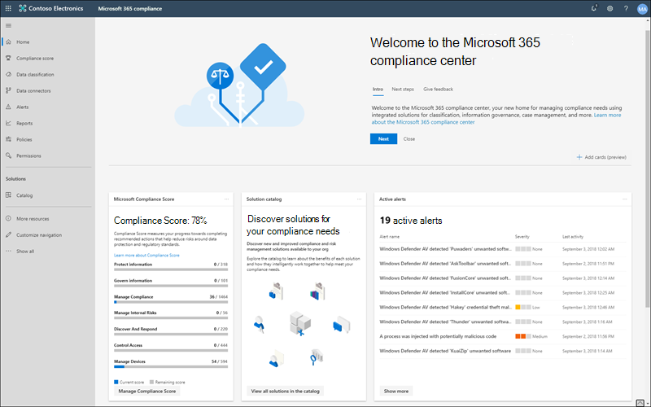

# Microsoft 365 Compliance CenterMicrosoft 365 compliance center

Wenn Sie der Compliance-Status Ihrer Organisation interessiert, werden Sie das [Microsoft 365 Compliance Center](https://compliance.microsoft.com) lieben.If you're interested in your organization's compliance posture, you're going to love the [Microsoft 365 compliance center](https://compliance.microsoft.com). Das Microsoft 365 Compliance Center bietet einfachen Zugriff auf die Daten und Tools, die Sie benötigen, um die Complianceanforderungen Ihrer Organisation zu verwalten.The Microsoft 365 compliance center provides easy access to the data and tools you need to manage to your organization's compliance needs.

Lesen Sie diesen Artikel, um sich mit dem Microsoft 365 Compliance Center vertraut zu machen und um zu erfahren,[wie Sie es erhalten](#how-do-i-get-the-compliance-center), um Antworten auf [häufig gestellte Fragen](#frequently-asked-questions) zu erhalten und sich über die [nächsten Schritte](#next-steps) zu informieren.Read this article to get acquainted with the Microsoft 365 compliance center, [how to get it](#how-do-i-get-the-compliance-center), [frequently asked questions](#frequently-asked-questions), and your [next steps](#next-steps).

## Willkommen beim Microsoft 365 Compliance CenterWelcome to Microsoft 365 compliance

Wenn Sie zum ersten Mal zum Microsoft 365 Compliance Center wechseln, wird die folgende Willkommensnachricht angezeigt:When you go to your Microsoft 365 compliance center for the first time, you're greeted with the following welcome message:

Das Willkommensbanner enthält einige Tipps zum Loslegen sowie eine Einladung, uns Feedback zu senden.The welcome banner gives you some pointers on how to get started, with next steps, and an invitation for you to give us feedback.

## Der Karten-AbschnittCard section

Wenn Sie zum ersten Mal das Microsoft 365 Compliance Center besuchen, können Sie im Karten-Abschnitt auf der Startseite auf einen Blick sehen, wie Ihre Organisation in puncto Datencompliance aufgestellt ist, welche Lösungen für Ihr Unternehmen zur Verfügung stehen sowie eine Übersicht über alle aktiven Warnungen.When you first visit the Microsoft 365 compliance center, the card section on the home page shows you at a glance how your organization is doing with data compliance, what solutions are available for your organization, and a summary of any active alerts.

Hier haben Sie folgende Möglichkeiten:From here, you can:

- Überprüfen Sie die **Microsoft Compliance Manager** -Karte, die Sie zur [Compliance Manager-](compliance-manager.md) Lösung führt.Review the **Microsoft Compliance Manager** card, which leads you to the [Compliance Manager](compliance-manager.md) solution. Compliance-Manager hilft Ihnen, die Compliance-Verwaltung zu vereinfachen.Compliance Manager helps simplify the way you manage compliance. Er berechnet eine risikobasierte Bewertung, die Ihren Fortschritt bei der Durchführung von empfohlenen Aktionen misst, die zur Verringerung von Risiken im Hinblick auf Datenschutz und regulatorische Standards beitragen.It calculates a risk-based score measuring your progress toward completing recommended actions that help reduce risks around data protection and regulatory standards. Außerdem werden Workflowfunktionen und integrierte Steuerungs Zuordnungen bereitgestellt, die Sie bei der effizienten Durchführung von Verbesserungs Aktionen unterstützen.It also provides workflow capabilities and built-in control mapping to help you efficiently carry out improvement actions.

    

- Überprüfen Sie die neue Karte **Lösungskatalog**, die mit Sammlungen von [integrierten Lösungen](microsoft-365-solution-catalog.md) verknüpft ist, die Sie zum Verwalten von End-to-End-Compliance-Szenarios verwenden können.Review the new **Solution catalog** card, which links to collections of [integrated solutions](microsoft-365-solution-catalog.md) you can use to help you manage end-to-end compliance scenarios. Die Funktionen und Tools einer Lösung können eine Kombination von Richtlinien, Warnungen, Berichten und mehr umfassen.A solution's capabilities and tools might include a combination of policies, alerts, reports, and more.

    

- Überprüfen Sie die Karte **Aktive Warnungen**, die eine Zusammenfassung der [aktivsten Warnungen](alert-policies.md) sowie einen Link enthält, unter dem Sie detailliertere Informationen wie Schweregrad, Status, Kategorie und mehr finden.Review the **Active alerts** card, which includes a summary of the most [active alerts](alert-policies.md) and includes a link where you can view more detailed information, such as Severity, Status, Category, and more.

    

Sie können über die Funktion "**Karten hinzufügen**" auch weitere Karten hinzuzufügen, z. B. eine Karte zur Anzeige der Cloud-App-Compliance Ihrer Organisation und eine, auf der Daten zu Benutzern mit freigegebenen Dateien angezeigt werden, mit Links zu [Cloud App Security](https://docs.microsoft.com/cloud-app-security/) oder anderen Tools, mit denen Sie Daten untersuchen können.You can also use the **Add cards** feature to add additional cards, such as one showing your organization's cloud app compliance, and another showing data about users with shared files, with links to [Cloud App Security](https://docs.microsoft.com/cloud-app-security/) or other tools where you can explore data.

## Einfache Navigation zu weiteren Compliance-Funktionen und -FeaturesEasy navigation to more compliance features and capabilities

Zusätzlich zu Links auf den Karten auf der Startseite befindet sich auf der linken Seite des Bildschirms ein Navigationsbereich, der Ihnen einfachen Zugriff auf [Warnungen](../security/office-365-security/alerts.md), [Berichte](reports-in-security-and-compliance.md), [Richtlinien](alert-policies.md), Compliance-Lösungen und vieles mehr bietet.In addition to links in cards on the home page, you'll see a navigation pane on the left side of the screen that gives you easy access to your [alerts](../security/office-365-security/alerts.md), [reports](reports-in-security-and-compliance.md), [policies](alert-policies.md), compliance solutions, and more. Verwenden Sie zum Hinzufügen oder Entfernen von Optionen für einen benutzerdefinierten Navigationsbereich das Steuerelement **Navigation anpassen** im Navigationsbereich.To add or remove options for a customized navigation pane, use the **Customize navigation** control on the navigation pane. Dadurch werden die Einstellungen zum **Anpassen des Navigationsbereichs** geöffnet, über die Sie festlegen können, welche Elemente im Navigationsbereich angezeigt werden.This opens the **Customize your navigation pane** settings so you can configure which items appear in the navigation pane.

|  |  |
|---------|---------|
|  | Wählen Sie **Start** aus, um zur Hauptseite des Microsoft 365 Compliance Centers zurückzukehren.Select **Home** to return to the Microsoft 365 compliance center main page.   Besuchen Sie den **Compliance-Manager** , um die Konformitätsbewertung zu überprüfen und die Compliance für Ihre Organisation zu [Verwalten](compliance-manager.md) .Visit **Compliance Manager** to check your compliance score and start [managing compliance](compliance-manager.md) for your organization.    Wählen Sie den Abschnitt **Datenklassifizierung** aus, um auf [Schulungs relevante Klassifizierungen](classifier-learn-about.md), [Entitätsdefinitionen für vertrauliche Informationen](sensitive-information-type-entity-definitions.md), Inhalts-und [Aktivitäts](data-classification-activity-explorer.md) -Explorer zuzugreifen.Select the **Data classification** section to access [trainable classifiers](classifier-learn-about.md), [Sensitive information type entity definitions](sensitive-information-type-entity-definitions.md), content and [activity](data-classification-activity-explorer.md) explorers.    Wählen Sie **Datenconnectors** aus, um [Connectors](archiving-third-party-data.md) zum Importieren und Archivieren von Daten in Ihr Microsoft 365-Abonnement zu konfigurieren.Select **Data connectors** to [configure connectors](archiving-third-party-data.md) to import and archive data in your Microsoft 365 subscription.    Wechseln Sie zu **Warnungen** zum Anzeigen und Beheben von [Warnungen](alert-policies.md).Go to **Alerts** to view and resolve [alerts](alert-policies.md)   Besuchen Sie **Berichte** zum Anzeigen von Daten zur [Bezeichnungsverwendung und -aufbewahrung](sensitivity-labels.md), [DLP-Richtlinienübereinstimmungen und Außerkraftsetzungen](view-the-dlp-reports.md), [freigegebene Dateien](https://docs.microsoft.com/cloud-app-security/file-filters), [verwendete Apps von Drittanbietern](https://docs.microsoft.com/cloud-app-security/discovered-apps) und vieles mehr.Visit **Reports** to view data about [label usage and retention](sensitivity-labels.md), [DLP policy matches and overrides](view-the-dlp-reports.md), [shared files](https://docs.microsoft.com/cloud-app-security/file-filters), [third-party apps in use](https://docs.microsoft.com/cloud-app-security/discovered-apps), and more.    Wechseln Sie zu **Richtlinien**, um Richtlinien für die Verwaltung von Daten und von Geräten sowie den Versand von [Warnungen](../security/office-365-security/alerts.md) festzulegen.Go to **Policies** to set up policies to govern data, manage devices, and receive [alerts](../security/office-365-security/alerts.md). Sie können auch auf Ihre [DLP](data-loss-prevention-policies.md)- und [Aufbewahrungs](retention.md)-Richtlinien zugreifen.You can also access your [DLP](data-loss-prevention-policies.md) and [retention](retention.md) policies.   Verwalten Sie über die **Berechtigungen**, wer in Ihrer Organisation auf das Microsoft 365 Compliance Center zugreifen kann, um Inhalte anzuzeigen und Aufgaben auszuführen.Select **Permissions** to manage who in your organization has access to the Microsoft 365 compliance center to view content and complete tasks.    Verwenden Sie die Links im Abschnitt **Lösungen**, um auf die Compliancelösungen Ihrer Organisation zuzugreifen.Use the links in the **Solutions** section to access your organization's compliance solutions. Zu diesen zählen:These include:    [KatalogCatalog](microsoft-365-solution-catalog.md)   Entdecken Sie und beginnen Sie mit der Nutzung der Intelligenten Lösungen für Compliance und Risikomanagement, die für Ihre Organisation verfügbar sind.Discover, learn about, and start using the intelligent compliance and risk management solutions available to your organization.    [ÜberwachungAudit](search-the-audit-log-in-security-and-compliance.md)   Verwenden Sie das Überwachungsprotokoll, um häufige Support- und Compliance-Probleme zu untersuchen.Use the Audit log to investigate common support and compliance issues.    [InhaltssucheContent search](search-for-content.md)   Verwenden Sie das Tool "Inhaltssuche", um schnell nach E-Mails in allen Exchange-Postfächern, Dokumente auf SharePoint-Websites und an OneDrive-Speicherorten sowie Chatunterhaltungen in Microsoft Teams und Skype for Business zu suchen.Use Content search to quickly find email in Exchange mailboxes, documents in SharePoint sites and OneDrive locations, and instant messaging conversations in Microsoft Teams and Skype for Business.    [KommunikationscomplianceCommunication compliance](communication-compliance.md)   Minimieren Sie Kommunikationsrisiken durch die automatische Erfassung unangemessener Nachrichten, die Untersuchung möglicher Verstöße gegen Richtlinien und die Durchführung von Schritten zur Behebung.Minimize communication risks by automatically capturing inappropriate messages, investigating possible policy violations, and taking steps to remediate.    [Verhinderung von DatenverlustData loss prevention](data-loss-prevention-policies.md)   Ermitteln Sie vertrauliche Inhalte, die in der gesamten Organisation, in der Cloud und auf Geräten verwendet und freigegeben werden, und beugen Sie so versehentlichem Datenverlust vor.Detect sensitive content as it's used and shared throughout your organization, in the cloud and on devices, and helps prevent accidental data loss.    [Anfragen von DatensubjektenData subject requests](manage-gdpr-data-subject-requests-with-the-dsr-case-tool.md)   Suchen und Exportieren der personenbezogenen Daten eines Benutzers, um Sie bei der Reaktion auf Anfragen der betroffenen Person für die allgemeine Datenschutzverordnung (dsgvo) zu unterstützen.Find and export a user's personal data to help you respond to data subject requests for the General Data Protection Regulation (GDPR).    [eDiscoveryeDiscovery](overview-ediscovery-20.md)   Erweitern Sie diesen Abschnitt, um die grundlegenden und die erweiterten eDiscovery-Funktionen zum Beibehalten, Sammeln, Überprüfen, Analysieren und Exportieren von Inhalten zu nutzen, die für interne und externe Untersuchungen Ihres Unternehmens relevant sind.Expand this section to use the core and Advanced eDiscovery for preserving, collecting, reviewing, analyzing, and exporting content that's responsive to your organization's internal and external investigations.    [InformationsgovernanceInformation governance](manage-information-governance.md)   Verwalten Sie den Lebenszyklus Ihrer Inhalte mithilfe von Funktionen zum Importieren, Speichern und Klassifizieren geschäftsrelevanter Daten, damit Erforderliches beibehalten und alles andere gelöscht wird.Manage your content lifecycle using features to import, store, and classify business-critical data so you can keep what you need and delete what you don't.    [Schutz von DatenInformation protection](information-protection.md)   Ermitteln, klassifizieren und schützen Sie vertrauliche und unternehmensrelevante Inhalte organisationsweit über ihren gesamten Lebenszyklus hinweg.Discover, classify, and protect sensitive and business-critical content throughout its lifecycle across your organization.    [Insider-RisikomanagementInsider risk management](insider-risk-management.md)   Entdecken Sie riskante Aktivitäten in Ihrer Organisation, um Insider-Risiken und -Bedrohungen schnell zu erkennen, zu untersuchen und entsprechende Maßnahmen zu ergreifen.Detect risky activity across your organization to help you quickly identify, investigate, and take action on insider risks and threats.    [DatensatzverwaltungRecords management](records-management.md)   Automatisieren und vereinfachen Sie den Aufbewahrungszeitplan für gesetzlich vorgeschriebene, rechts- und unternehmensrelevante Datensätze in Ihrer Organisation.Automate and simplify the retention schedule for regulatory, legal and business-critical records in your organization.

## Wie erhalte ich das Compliance Center?How do I get the compliance center?

- Falls Sie noch nicht über das neue Microsoft 365 Compliance Center verfügen, wird es in Kürze so weit sein.If you don't have the new Microsoft 365 compliance center already, you'll have it soon. Das Microsoft 365 Compliance Center steht jetzt allgemein für Microsoft 365 SKU-Kunden zur Verfügung.The Microsoft 365 compliance center is generally available now to Microsoft 365 SKU customers.

- Wenn Sie das Microsoft 365 Compliance Center besuchen möchten, wechseln Sie als globaler Administrator, Compliance-Administrator oder Compliance-Datenadministrator zu [https://compliance.microsoft.com](https://compliance.microsoft.com), und melden Sie sich an.To visit the Microsoft 365 compliance center, as a global administrator, compliance administrator, or compliance data administrator go to [https://compliance.microsoft.com](https://compliance.microsoft.com) and sign in.

## Häufig gestellte FragenFrequently asked questions

**Warum werde ich zum Security & Compliance Center gebracht, um einige Aufgaben wie die Definition bestimmter Richtlinien abzuschließen?****Why am I taken to the Security & Compliance Center to complete some tasks, such as defining certain policies?**

Wir arbeiten weiterhin an der Entwicklung des Microsoft 365 Compliance Centers. Darüber hinaus werden in den kommenden Monaten weitere Funktionalitäten und Lösungen hinzugefügt.We're still developing the Microsoft 365 compliance center, and we add more functionality and solutions over the coming months. In der Zwischenzeit müssen einige Aufgaben im Security & Compliance Center () erfüllt sein [https://protection.office.com](https://protection.office.com) .In the meantime, there are a few tasks that must be completed in the Security & Compliance Center ([https://protection.office.com](https://protection.office.com)). In solchen Fällen werden Sie automatisch an den Ort weitergeleitet, an dem Sie die Aufgabe ausführen können, z. B. zum Erstellen oder Bearbeiten einer Aufsichtsrichtlinie.In those cases, you'll be directed automatically to the location where you can complete the task at hand, such as creating or editing a supervision policy.

**Warum wird das neue Microsoft 365 Compliance Center noch nicht angezeigt?****Why don't I see the new Microsoft 365 compliance center yet?**

Stellen Sie zunächst sicher, dass Sie über die entsprechenden Lizenzen und Berechtigungen verfügen.First, make sure that you have the appropriate licenses and permissions. Melden Sie sich dann bei [https://compliance.microsoft.com](https://compliance.microsoft.com) an.Then, sign in at [https://compliance.microsoft.com](https://compliance.microsoft.com). Falls das neue Compliance Center noch nicht angezeigt wird, wird es in Kürze so weit sein.If you don't see the new compliance center yet, you'll have it soon.

**Einige meiner Compliancefunktionen stehen im Microsoft 365 Compliance Center nicht zur Verfügung. Was kann ich tun?****Some of my compliance features aren't available in the Microsoft 365 compliance center. What do I do?**

Wir arbeiten weiterhin an der Funktionalität des Microsoft 365 Compliance Centers.We're still adding functionality to the Microsoft 365 compliance center. Wenn Sie nicht fündig werden, wie beispielsweise die Überwachungsprotokoll Suche, verwenden Sie das Security & Compliance Center ( [https://protection.office.com](https://protection.office.com) ).If you can't find something, such as audit log search, use the Security & Compliance Center ([https://protection.office.com](https://protection.office.com)). Ihre Konfigurationen werden im vorhandenen Security & Compliance Center und im neuen Microsoft 365 Compliance Center automatisch gespeichert.Your configurations are saved in both the existing Security & Compliance Center and in the new Microsoft 365 compliance center automatically.

Um dorthin zu gelangen, wählen Sie im Microsoft 365 Compliance Center im Navigationsbereich auf der linken Seite des Bildschirms **Weitere Ressourcen** aus, und wählen Sie dann unter **Office 365 Security & Compliance Center** die Option **Öffnen** aus.To go there, in the Microsoft 365 compliance center, in the navigation pane on the left side of the screen, choose **More resources**, and then, under **Office 365 Security & Compliance Center**, choose **Open**.

## Nächste SchritteNext steps

- **Besuchen Sie den Microsoft Compliance-Manager** , um die Konformitätsbewertung anzuzeigen und die Compliance-Verwaltung für Ihre Organisation zu verwalten.**Visit Microsoft Compliance Manager** to see your compliance score and start managing compliance for your organization. Weitere Informationen finden Sie unter [Compliance-Manager](compliance-manager.md).To learn more, see [Compliance Manager](compliance-manager.md).

- **Konfigurieren Sie Richtlinien für Insider-Risiken** zur Minimierung interner Risiken und zum Erkennen, Untersuchen und Reagieren auf riskante Aktivitäten in Ihrer Organisation.**Configure insider risk management policies** to help minimize internal risks and enable you to detect, investigate, and take action for risky activities in your organization. Weitere Informationen finden Sie unter [Insider-Risikomanagement](insider-risk-management.md).See [Insider risk management](insider-risk-management.md).

- **Überprüfen Sie die Richtlinien zur Verhinderung von Datenverlust** Ihres Unternehmens, und nehmen Sie bei Bedarf Änderungen daran vor.**Review your organization's data loss prevention policies** and make required changes as necessary. Weitere Informationen finden Sie unter [Übersicht über Richtlinien zur Verhinderung von Datenverlust](data-loss-prevention-policies.md).To learn more about, see [Overview of data loss prevention policies](data-loss-prevention-policies.md).

- **Lernen Sie Microsoft Cloud App Security kennen und richten Sie es ein**.**Get acquainted with and set up Microsoft Cloud App Security**. Näheres dazu finden Sie unter [Schnellstart: Erste Schritte mit Microsoft Cloud App Security](https://docs.microsoft.com/cloud-app-security/getting-started-with-cloud-app-security).See [Quickstart: Get started with Microsoft Cloud App Security](https://docs.microsoft.com/cloud-app-security/getting-started-with-cloud-app-security).

- **Erfahren Sie mehr über und erstellen Sie Richtlinien für die Kommunikationscompliance**, um Verstöße gegen Unternehmensregeln schnell zu erkennen und Maßnahmen dagegen zu ergreifen.**Learn about and create communication compliance policies** to quickly identify and remediate corporate code-of-conduct policy violations. Weitere Informationen finden Sie unter [Kommunikationscompliance in Microsoft 365 (Vorschau)](communication-compliance.md).See [Communication compliance in Microsoft 365](communication-compliance.md).

- **Besuchen Sie das Microsoft 365 Compliance Center möglichst oft**, und überprüfen Sie alle Warnungen oder potenziellen Risiken.**Visit your Microsoft 365 compliance center often**, and make sure to review any alerts or potential risks that arise. Gehen Sie zu [https://compliance.microsoft.com](https://compliance.microsoft.com), und melden Sie sich an.Go to [https://compliance.microsoft.com](https://compliance.microsoft.com) and sign in.
