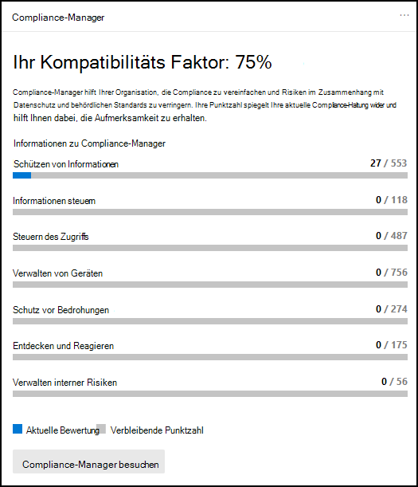
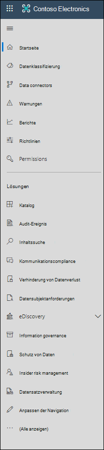

# Microsoft 365 Compliance Center

Wenn Sie der Compliance-Status Ihrer Organisation interessiert, werden Sie das [Microsoft 365 Compliance Center](https://compliance.microsoft.com) lieben. Das Microsoft 365 Compliance Center bietet einfachen Zugriff auf die Daten und Tools, die Sie benötigen, um die Complianceanforderungen Ihrer Organisation zu verwalten.

Lesen Sie diesen Artikel, um sich mit dem Microsoft 365 Compliance Center vertraut zu machen und um zu erfahren,[wie Sie es erhalten](#how-do-i-get-the-compliance-center), um Antworten auf [häufig gestellte Fragen](#frequently-asked-questions) zu erhalten und sich über die [nächsten Schritte](#next-steps) zu informieren.

## Willkommen beim Microsoft 365 Compliance Center

Wenn Sie zum ersten Mal zum Microsoft 365 Compliance Center wechseln, wird die folgende Willkommensnachricht angezeigt:

Das Willkommensbanner enthält einige Tipps zum Loslegen sowie eine Einladung, uns Feedback zu senden.

## Der Karten-Abschnitt

Wenn Sie zum ersten Mal das Microsoft 365 Compliance Center besuchen, können Sie im Karten-Abschnitt auf der Startseite auf einen Blick sehen, wie Ihre Organisation in puncto Datencompliance aufgestellt ist, welche Lösungen für Ihr Unternehmen zur Verfügung stehen sowie eine Übersicht über alle aktiven Warnungen.

Hier haben Sie folgende Möglichkeiten:

- Überprüfen Sie die **Microsoft Compliance Manager-Karte,** die Sie zur [Compliance-Manager-Lösung](compliance-manager.md) führt. Compliance-Manager vereinfacht die Verwaltung der Compliance. Es berechnet eine risikobasierte Bewertung, die Ihren Fortschritt bei der Durchführung empfohlener Maßnahmen misst, die dazu beitragen, Risiken im Hinblick auf Datenschutz und behördliche Standards zu verringern. Es bietet außerdem Workflowfunktionen und integrierte Steuerelementzuordnungen, die Ihnen bei der effizienten Durchführung von Verbesserungsmaßnahmen helfen.

    

- Überprüfen Sie die neue Karte **Lösungskatalog**, die mit Sammlungen von [integrierten Lösungen](microsoft-365-solution-catalog.md) verknüpft ist, die Sie zum Verwalten von End-to-End-Compliance-Szenarios verwenden können. Die Funktionen und Tools einer Lösung können eine Kombination von Richtlinien, Warnungen, Berichten und mehr umfassen.

    

- Überprüfen Sie die Karte **Aktive Warnungen**, die eine Zusammenfassung der [aktivsten Warnungen](alert-policies.md) sowie einen Link enthält, unter dem Sie detailliertere Informationen wie Schweregrad, Status, Kategorie und mehr finden.

    

Sie können über die Funktion "**Karten hinzufügen**" auch weitere Karten hinzuzufügen, z. B. eine Karte zur Anzeige der Cloud-App-Compliance Ihrer Organisation und eine, auf der Daten zu Benutzern mit freigegebenen Dateien angezeigt werden, mit Links zu [Cloud App Security](/cloud-app-security/) oder anderen Tools, mit denen Sie Daten untersuchen können.

## Einfache Navigation zu weiteren Compliance-Funktionen und -Features

Zusätzlich zu Links auf den Karten auf der Startseite befindet sich auf der linken Seite des Bildschirms ein Navigationsbereich, der Ihnen einfachen Zugriff auf [Warnungen](../security/office-365-security/alerts.md), [Berichte](reports-in-security-and-compliance.md), [Richtlinien](alert-policies.md), Compliance-Lösungen und vieles mehr bietet. Verwenden Sie zum Hinzufügen oder Entfernen von Optionen für einen benutzerdefinierten Navigationsbereich das Steuerelement **Navigation anpassen** im Navigationsbereich. Dadurch werden die Einstellungen zum **Anpassen des Navigationsbereichs** geöffnet, über die Sie festlegen können, welche Elemente im Navigationsbereich angezeigt werden.

|  |  |
|---------|---------|
|  | Wählen Sie **Start** aus, um zur Hauptseite des Microsoft 365 Compliance Centers zurückzukehren.   Besuchen Sie **den Compliance-Manager,** um Ihre Compliancebewertung zu überprüfen und [mit der Verwaltung der Compliance](compliance-manager.md) für Ihre Organisation zu beginnen.    Wählen Sie den Abschnitt **"Datenklassifizierung"** aus, um auf [trainierbare Klassifizierungen, Entitätsdefinitionen](classifier-learn-about.md)für [vertrauliche Informationstypen,](sensitive-information-type-entity-definitions.md)Inhalts- und Aktivitätsexplorer zuzugreifen.     Wählen Sie **Datenconnectors** aus, um [Connectors](archiving-third-party-data.md) zum Importieren und Archivieren von Daten in Ihr Microsoft 365-Abonnement zu konfigurieren.    Wechseln Sie zu **Warnungen** zum Anzeigen und Beheben von [Warnungen](alert-policies.md).   Besuchen Sie **Berichte** zum Anzeigen von Daten zur [Bezeichnungsverwendung und -aufbewahrung](sensitivity-labels.md), [DLP-Richtlinienübereinstimmungen und Außerkraftsetzungen](view-the-dlp-reports.md), [freigegebene Dateien](/cloud-app-security/file-filters), [verwendete Apps von Drittanbietern](/cloud-app-security/discovered-apps) und vieles mehr.    Wechseln Sie zu **Richtlinien**, um Richtlinien für die Verwaltung von Daten und von Geräten sowie den Versand von [Warnungen](../security/office-365-security/alerts.md) festzulegen. Sie können auch auf Ihre [DLP](dlp-learn-about-dlp.md)- und [Aufbewahrungs](retention.md)-Richtlinien zugreifen.   Verwalten Sie über die **Berechtigungen**, wer in Ihrer Organisation auf das Microsoft 365 Compliance Center zugreifen kann, um Inhalte anzuzeigen und Aufgaben auszuführen.    Verwenden Sie die Links im Abschnitt **Lösungen**, um auf die Compliancelösungen Ihrer Organisation zuzugreifen. Zu diesen zählen:    [Katalog](microsoft-365-solution-catalog.md)   Entdecken Sie und beginnen Sie mit der Nutzung der Intelligenten Lösungen für Compliance und Risikomanagement, die für Ihre Organisation verfügbar sind.    [Überwachung](search-the-audit-log-in-security-and-compliance.md)   Verwenden Sie das Überwachungsprotokoll, um häufige Support- und Compliance-Probleme zu untersuchen.    [Inhaltssuche](search-for-content.md)   Verwenden Sie das Tool "Inhaltssuche", um schnell nach E-Mails in allen Exchange-Postfächern, Dokumente auf SharePoint-Websites und an OneDrive-Speicherorten sowie Chatunterhaltungen in Microsoft Teams und Skype for Business zu suchen.    [Kommunikationscompliance](communication-compliance.md)   Minimieren Sie Kommunikationsrisiken durch die automatische Erfassung unangemessener Nachrichten, die Untersuchung möglicher Verstöße gegen Richtlinien und die Durchführung von Schritten zur Behebung.    [Informationen zur Verhinderung von Datenverlust](dlp-learn-about-dlp.md)   Ermitteln Sie vertrauliche Inhalte, die in der gesamten Organisation, in der Cloud und auf Geräten verwendet und freigegeben werden, und beugen Sie so versehentlichem Datenverlust vor.    [Anfragen von Datensubjekten](/compliance/regulatory/gdpr-manage-gdpr-data-subject-requests-with-the-dsr-case-tool)   Suchen und Exportieren der personenbezogenen Daten eines Benutzers, damit Sie auf Anträge betroffener Personen im Zusammenhang mit der Datenschutz-Grundverordnung (DSGVO) reagieren können.    [eDiscovery](overview-ediscovery-20.md)   Erweitern Sie diesen Abschnitt, um die grundlegenden und die erweiterten eDiscovery-Funktionen zum Beibehalten, Sammeln, Überprüfen, Analysieren und Exportieren von Inhalten zu nutzen, die für interne und externe Untersuchungen Ihres Unternehmens relevant sind.    [Informationsgovernance](manage-information-governance.md)   Verwalten Sie den Lebenszyklus Ihrer Inhalte mithilfe von Funktionen zum Importieren, Speichern und Klassifizieren geschäftsrelevanter Daten, damit Erforderliches beibehalten und alles andere gelöscht wird.    [Schutz von Daten](information-protection.md)   Ermitteln, klassifizieren und schützen Sie vertrauliche und unternehmensrelevante Inhalte organisationsweit über ihren gesamten Lebenszyklus hinweg.    [Insider-Risikomanagement](insider-risk-management.md)   Entdecken Sie riskante Aktivitäten in Ihrer Organisation, um Insider-Risiken und -Bedrohungen schnell zu erkennen, zu untersuchen und entsprechende Maßnahmen zu ergreifen.    [Datensatzverwaltung](records-management.md)   Automatisieren und vereinfachen Sie den Aufbewahrungszeitplan für gesetzlich vorgeschriebene, rechts- und unternehmensrelevante Datensätze in Ihrer Organisation.

## Wie erhalte ich das Compliance Center?

- Falls Sie noch nicht über das neue Microsoft 365 Compliance Center verfügen, wird es in Kürze so weit sein. Das Microsoft 365 Compliance Center steht jetzt allgemein für Microsoft 365 SKU-Kunden zur Verfügung.

- Wenn Sie das Microsoft 365 Compliance Center besuchen möchten, wechseln Sie als globaler Administrator, Compliance-Administrator oder Compliance-Datenadministrator zu [https://compliance.microsoft.com](https://compliance.microsoft.com), und melden Sie sich an.

## Häufig gestellte Fragen

**Warum wird ich zum Security & Compliance Center geleitet, um einige Aufgaben auszuführen, z. B. das Definieren bestimmter Richtlinien?**

Wir entwickeln weiterhin die Microsoft 365 Compliance Center und werden in den kommenden Monaten weitere Funktionen und Lösungen hinzufügen. In der Zwischenzeit müssen einige Aufgaben im Security & Compliance Center ([https://protection.office.com](https://protection.office.com)) ausgeführt werden. In solchen Fällen werden Sie automatisch an den Ort weitergeleitet, an dem Sie die Aufgabe ausführen können, z. B. zum Erstellen oder Bearbeiten einer Aufsichtsrichtlinie.

**Warum wird das neue Microsoft 365 Compliance Center noch nicht angezeigt?**

Stellen Sie zunächst sicher, dass Sie über die entsprechenden Lizenzen und Berechtigungen verfügen. Melden Sie sich dann bei [https://compliance.microsoft.com](https://compliance.microsoft.com) an. Falls das neue Compliance Center noch nicht angezeigt wird, wird es in Kürze so weit sein.

**Einige meiner Compliancefunktionen stehen im Microsoft 365 Compliance Center nicht zur Verfügung. Was kann ich tun?**

Wir arbeiten weiterhin an der Funktionalität des Microsoft 365 Compliance Centers. Wenn Sie etwas nicht finden können, z. B. die Überwachungsprotokollsuche, verwenden Sie das Security & Compliance Center ( [https://protection.office.com](https://protection.office.com) ). Ihre Konfigurationen werden sowohl im vorhandenen Security & Compliance Center als auch im neuen Microsoft 365 Compliance Center automatisch gespeichert.

Um dorthin zu gelangen, wählen Sie im Microsoft 365 Compliance Center im Navigationsbereich auf der linken Seite des Bildschirms **weitere Ressourcen** aus, und wählen Sie dann unter Office 365 Security & **Compliance Center** die Option **"Öffnen"** aus.

## Nächste Schritte

- **Besuchen Sie den Microsoft Compliance-Manager,** um Ihre Compliancebewertung zu sehen und mit der Verwaltung der Compliance für Ihre Organisation zu beginnen. Weitere Informationen finden Sie unter [Compliance-Manager.](compliance-manager.md)

- **Konfigurieren Sie Richtlinien für Insider-Risiken** zur Minimierung interner Risiken und zum Erkennen, Untersuchen und Reagieren auf riskante Aktivitäten in Ihrer Organisation. Weitere Informationen finden Sie unter [Insider-Risikomanagement](insider-risk-management.md).

- **Überprüfen Sie die Richtlinien zur Verhinderung von Datenverlust** Ihres Unternehmens, und nehmen Sie bei Bedarf Änderungen daran vor. Weitere Informationen finden Sie unter ["Informationen zur Verhinderung von Datenverlust".](dlp-learn-about-dlp.md)

- **Lernen Sie Microsoft Cloud App Security kennen und richten Sie es ein**. Näheres dazu finden Sie unter [Schnellstart: Erste Schritte mit Microsoft Cloud App Security](/cloud-app-security/getting-started-with-cloud-app-security).

- **Erfahren Sie mehr über und erstellen Sie Richtlinien für die Kommunikationscompliance**, um Verstöße gegen Unternehmensregeln schnell zu erkennen und Maßnahmen dagegen zu ergreifen. Weitere Informationen finden Sie unter [Kommunikationscompliance in Microsoft 365 (Vorschau)](communication-compliance.md).

- **Besuchen Sie das Microsoft 365 Compliance Center möglichst oft**, und überprüfen Sie alle Warnungen oder potenziellen Risiken. Gehen Sie zu [https://compliance.microsoft.com](https://compliance.microsoft.com), und melden Sie sich an.