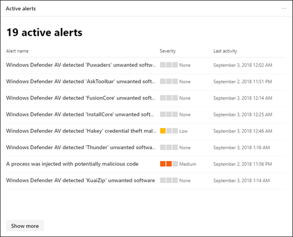

# Übersicht über das Microsoft 365 Compliance Center

## Übersicht

Wenn Sie an der Compliance-Haltung ihrer Organisation interessiert sind, werden Sie das [Microsoft 365 Compliance Center](https://compliance.microsoft.com)lieben. Das Microsoft 365 Compliance Center bietet einfachen Zugriff auf die Daten und Tools, die Sie benötigen, um die Compliance-Anforderungen Ihrer Organisation zu bewältigen.

Lesen Sie diesen Artikel, um sich mit dem Microsoft 365 Compliance Center vertraut zu machen, [wie Sie es erhalten](#how-do-i-get-the-compliance-center), [häufig gestellte Fragen](#frequently-asked-questions)und Ihre [nächsten Schritte](#next-steps).

## Willkommen bei der Microsoft 365-Compliance

Wenn Sie zum ersten Mal zu Ihrem Microsoft 365 Compliance Center wechseln, werden Sie mit der folgenden Willkommensnachricht begrüßt:

Das Willkommens Banner bietet Ihnen einige Hinweise, wie Sie mit den nächsten Schritten beginnen und eine Einladung erhalten, uns Feedback zu geben.

## Kartenabschnitt

Wenn Sie das Microsoft 365 Compliance Center zum ersten Mal besuchen, zeigt Ihnen der Kartenabschnitt auf der Startseite auf einen Blick, wie Ihre Organisation mit der Datenkompatibilität umgeht, welche Lösungen für Ihre Organisation zur Verfügung stehen, und eine Zusammenfassung aller aktiven Warnungen.

Von hier aus haben Sie folgende Möglichkeiten:

- Lesen Sie die **Microsoft-Konformitäts Bewertungs** Karte, die Sie zur neuen [Compliance Score](compliance-score.md) -Lösung führt. Es wird eine risikobasierte Bewertung berechnet, die Ihren Fortschritt bei der Durchführung von empfohlenen Aktionen misst, um Risiken hinsichtlich des Datenschutzes und der regulatorischen Standards zu verringern. Außerdem werden Workflowfunktionen und integrierte Steuerungs Zuordnungen bereitgestellt, die Sie bei der effizienten Ausführung dieser Aktionen unterstützen.

    

- Überprüfen Sie die neue **Lösung Katalog** Karte, die mit Sammlungen [integrierter Lösungen](microsoft-365-solution-catalog.md) , die Sie verwenden können, um Ihnen bei der Verwaltung von End-to-End-Compliance-Szenarien Links. Die Funktionen und Tools einer Lösung umfassen möglicherweise eine Kombination aus Richtlinien, Warnungen, Berichten und vielem mehr.

    

- Überprüfen Sie die **aktive Warnungs** Karte, die eine Zusammenfassung der [aktivsten Warnungen](alert-policies.md) enthält und einen Link enthält, in dem Sie ausführlichere Informationen wie Schweregrad, Status, Kategorie und vieles mehr anzeigen können.

    

Sie können auch das Feature " **Karten hinzufügen** " verwenden, um zusätzliche Karten hinzuzufügen, beispielsweise eine, die die Cloud-App-Compliance Ihrer Organisation anzeigt, und eine weitere, die Daten zu Benutzern mit freigegebenen Dateien zeigt, mit Links zur [Cloud-App-Sicherheit](https://docs.microsoft.com/cloud-app-security/) oder anderen Tools, mit denen Sie Daten durchsuchen können.

## Einfache Navigation zu mehr Compliance-Features und-Funktionen

Zusätzlich zu den Links in Karten auf der Startseite sehen Sie einen Navigationsbereich auf der linken Seite des Bildschirms, der Ihnen einfachen Zugriff auf Ihre [Benachrichtigungen](../security/office-365-security/alerts.md), [Berichte](reports-in-security-and-compliance.md), [Richtlinien](alert-policies.md), Compliance-Lösungen und vieles mehr bietet.

|  |  |
|---------|---------|
|  | Wählen Sie **Home** aus, um zur Hauptseite des Microsoft 365 Compliance Center zurückzukehren.    Wählen Sie den Abschnitt **Datenklassifizierung** aus, um auf [Schulungs relevante Klassifizierungen](classifier-getting-started-with.md), [vertrauliche Informationstypen](what-the-sensitive-information-types-look-for.md), Inhalts-und [Aktivitäts](data-classification-activity-explorer.md) -Explorer zuzugreifen.    Wählen Sie **Daten Konnektoren** zum [Konfigurieren von Connectors](archiving-third-party-data.md) zum Importieren und Archivieren von Daten in Ihrem Microsoft 365-Abonnement aus.    Wechseln Sie zu **Warnungen** , um [Warnungen](alert-policies.md) anzuzeigen und zu beheben.   Besuchen Sie **Berichte** , um Daten über die [Verwendung und Aufbewahrung von Bezeichnungen](sensitivity-labels.md)anzuzeigen, die DLP- [Richtlinie entspricht und Außerkraftsetzungen](view-the-dlp-reports.md), [freigegebene Dateien](https://docs.microsoft.com/cloud-app-security/file-filters), [von Drittanbieter-Apps verwendet](https://docs.microsoft.com/cloud-app-security/discovered-apps)und vieles mehr.    Wechseln Sie zu **Richtlinien** , um Richtlinien zum Steuern von Daten, zum Verwalten von Geräten und zum Empfangen von [Benachrichtigungen](../security/office-365-security/alerts.md)einzurichten. Sie können auch auf Ihre [DLP](data-loss-prevention-policies.md) -und [Aufbewahrungs](retention-policies.md) Richtlinien zugreifen.   Wählen Sie **Berechtigungen** zum Verwalten der Personen in Ihrer Organisation, die Zugriff auf das Microsoft 365 Compliance Center haben, um Inhalte anzuzeigen und Aufgaben abzuschließen.    Verwenden Sie die Links im Abschnitt **Lösungen** , um auf die Compliance-Lösungen Ihrer Organisation zuzugreifen. Zu diesen zählen:    [Katalog](microsoft-365-solution-catalog.md)   Entdecken Sie, erfahren Sie mehr über die Verwendung der intelligenten Compliance-und Risikomanagement-Lösungen, die für Ihre Organisation zur Verfügung stehen.    [Schutz von Daten](protect-information.md)   Ermitteln, klassifizieren und schützen Sie vertrauliche und geschäftsrelevante Inhalte über den gesamten Lebenszyklus hinweg in Ihrer Organisation.    [Schutz vor Datenverlust](data-loss-prevention-policies.md)   Erkennen Sie vertrauliche Inhalte, da diese in Ihrer Organisation, in der Cloud und auf Geräten verwendet und gemeinsam genutzt werden, und verhindert versehentlichen Datenverlust.    [Datensatzverwaltung](records-management.md)   Automatisieren und vereinfachen Sie den aufbewahrungszeitplan für regulatorische, rechtliche und unternehmenswichtige Datensätze in Ihrer Organisation.    [Information Governance](manage-information-governance.md)   Verwalten des Inhaltslebenszyklus mithilfe von Funktionen zum Importieren, speichern und Klassifizieren von geschäftskritischen Daten, sodass Sie das benötigte behalten und nicht mehr löschen können.    [Datenbetreffsanforderungen](manage-gdpr-data-subject-requests-with-the-dsr-case-tool.md)   Suchen und Exportieren der personenbezogenen Daten eines Benutzers, um Sie bei der Reaktion auf Anfragen der betroffenen Person für die allgemeine Datenschutzverordnung (dsgvo) zu unterstützen.    [Inhaltssuche](search-for-content.md)   Verwenden Sie die Inhaltssuche, um e-Mails schnell in Exchange-Postfächern, Dokumenten in SharePoint-Websites und OneDrive-Speicherorten sowie Chatnachrichten in Microsoft Teams und Skype for Business zu finden.    [Überwachungs](search-the-audit-log-in-security-and-compliance.md)   Verwenden Sie das Überwachungsprotokoll, um häufige Support-und Kompatibilitätsprobleme zu untersuchen.    [eDiscovery](overview-ediscovery-20.md)   Erweitern Sie diesen Abschnitt, um den Kern und die erweiterte eDiscovery zum beibehalten, sammeln, überprüfen, analysieren und Exportieren von Inhalten zu verwenden, die auf interne und externe Untersuchungen in Ihrer Organisation reagieren.    [Datenuntersuchungen](overview-data-investigations.md)   Durchsuchen über inhaltsspeicherorte zum Identifizieren von vertraulichen, böswilligen oder verfallenen Daten in Microsoft 365, sodass Sie Vorfälle wie Datenüberlauf untersuchen und beheben können.    [Kommunikationscompliance](communication-compliance.md)   Minimierung von Kommunikationsrisiken durch automatisches erfassen unangemessener Nachrichten, untersuchen möglicher Richtlinienverstöße und Durchführen von Korrekturmaßnahmen.

## Wie erhalte ich das Compliance Center?

- Wenn Sie das neue Microsoft 365 Compliance Center nicht bereits haben, haben Sie es bald. Das Microsoft 365 Compliance Center ist jetzt allgemein für Microsoft 365 SKU-Kunden verfügbar.

- Besuchen Sie das Microsoft 365 Compliance Center als globaler Administrator, Kompatibilitäts Administrator oder Compliance-Datenadministrator, [https://compliance.microsoft.com](https://compliance.microsoft.com) und melden Sie sich an.

- Weitere Informationen zu den Anforderungen finden Sie unter [Required licenses and Permissions](../security/office-365-security/microsoft-security-and-compliance.md#required-licenses-and-permissions).

## Häufig gestellte Fragen

**Warum werde ich zum Office 365 Security #a0 Compliance Center gebracht, um einige Aufgaben wie das Definieren bestimmter Richtlinien abzuschließen?**

Wir entwickeln weiterhin das Microsoft 365 Compliance Center und fügen in den kommenden Monaten weitere Funktionen und Lösungen hinzu. In der Zwischenzeit müssen einige Aufgaben im Office 365 Security #a0 Compliance Center ([https://protection.office.com](https://protection.office.com)) erfüllt sein. In diesen Fällen werden Sie automatisch an den Standort geleitet, an dem Sie die Aufgabe ausführen können, beispielsweise das Erstellen oder Bearbeiten einer Aufsichtsrichtlinie.

**Warum wird das neue Microsoft 365 Compliance Center noch nicht angezeigt?**

Stellen Sie zunächst sicher, dass Sie über die entsprechenden [Lizenzen und Berechtigungen](../security/office-365-security/microsoft-security-and-compliance.md#required-licenses-and-permissions)verfügen. Melden Sie sich dann bei [https://compliance.microsoft.com](https://compliance.microsoft.com)an. Wenn das neue Compliance Center noch nicht angezeigt wird, haben Sie es bald.

**Einige meiner Kompatibilitätsfunktionen sind im Microsoft 365 Compliance Center nicht verfügbar. Was soll ich tun?**

Wir fügen dem Microsoft 365 Compliance Center weiterhin Funktionalität hinzu. Wenn Sie nicht fündig werden, wie beispielsweise die Überwachungsprotokoll Suche, verwenden Sie das Office 365 Security #a0[https://protection.office.com](https://protection.office.com)Compliance Center (). Ihre Konfigurationen werden im vorhandenen Office 365 Security #a0 Compliance Center und im neuen Microsoft 365 Compliance Center automatisch gespeichert.

Um dorthin zu gelangen, wählen Sie im Microsoft 365 Compliance Center im Navigationsbereich auf der linken Seite des Bildschirms **Weitere Ressourcen**aus, und wählen Sie dann unter **Office 365 Security #a0 Compliance Center**die Option **Öffnen**aus.

## Nächste Schritte

- **Überprüfen Sie Ihr Microsoft-Kompatibilitäts Ergebnis** , um die Konformitätsbewertung zu verbessern. Weitere Informationen finden Sie unter [Compliance Score (Preview)](compliance-score.md).

- **Überprüfen Sie die Richtlinien zur Verhinderung von Datenverlust Ihrer Organisation** , und nehmen Sie die erforderlichen Änderungen vor. Weitere Informationen finden Sie unter [Übersicht über Richtlinien zur Verhinderung von Datenverlust](data-loss-prevention-policies.md).

- **Machen Sie sich mit Microsoft Cloud App Security vertraut und richten Sie Sie**ein. Weitere Informationen finden Sie unter [Quick Start: Erste Schritte mit Microsoft Cloud App Security](https://docs.microsoft.com/cloud-app-security/getting-started-with-cloud-app-security).

- **Erfahren Sie mehr über und erstellen Sie Richtlinien** für die Kommunikationsrichtlinien zur schnellen Erkennung und Korrektur von Richtlinienverstößen in Bezug auf Corporate Code of Conduct. Weitere Informationen finden Sie unter [Communication Compliance in Microsoft 365](communication-compliance.md).

- **Besuchen Sie Ihr Microsoft 365 Compliance Center häufig**, und stellen Sie sicher, dass Sie alle Warnungen oder potenziellen Risiken überprüfen, die auftreten. Wechseln Sie [https://compliance.microsoft.com](https://compliance.microsoft.com) zu, und melden Sie sich an.