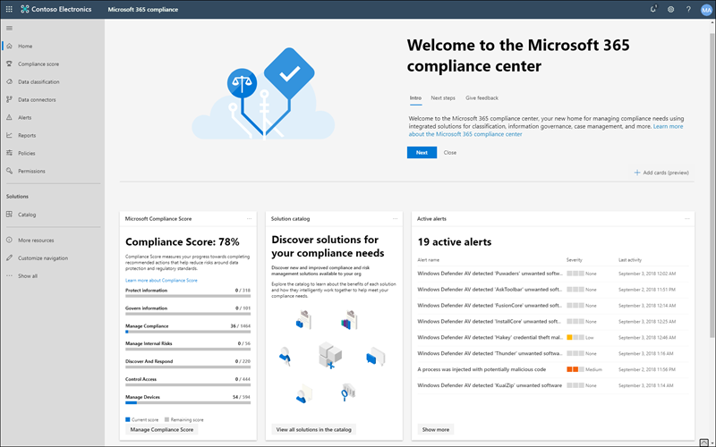

# Microsoft 365 Compliance CenterMicrosoft 365 compliance center

Wenn Sie an der Compliance-Haltung ihrer Organisation interessiert sind, werden Sie das [Microsoft 365 Compliance Center](https://compliance.microsoft.com)lieben.If you're interested in your organization's compliance posture, you're going to love the [Microsoft 365 compliance center](https://compliance.microsoft.com). Das Microsoft 365 Compliance Center bietet einfachen Zugriff auf die Daten und Tools, die Sie benötigen, um die Compliance-Anforderungen Ihrer Organisation zu bewältigen.The Microsoft 365 compliance center provides easy access to the data and tools you need to manage to your organization's compliance needs.

Lesen Sie diesen Artikel, um sich mit dem Microsoft 365 Compliance Center vertraut zu machen, [wie Sie es erhalten](#how-do-i-get-the-compliance-center), [häufig gestellte Fragen](#frequently-asked-questions)und Ihre [nächsten Schritte](#next-steps).Read this article to get acquainted with the Microsoft 365 compliance center, [how to get it](#how-do-i-get-the-compliance-center), [frequently asked questions](#frequently-asked-questions), and your [next steps](#next-steps).

## Willkommen bei der Microsoft 365-ComplianceWelcome to Microsoft 365 compliance

Wenn Sie zum ersten Mal zu Ihrem Microsoft 365 Compliance Center wechseln, werden Sie mit der folgenden Willkommensnachricht begrüßt:When you go to your Microsoft 365 compliance center for the first time, you're greeted with the following welcome message:

Das Willkommens Banner bietet Ihnen einige Hinweise, wie Sie mit den nächsten Schritten beginnen und eine Einladung erhalten, uns Feedback zu geben.The welcome banner gives you some pointers on how to get started, with next steps, and an invitation for you to give us feedback.

## KartenabschnittCard section

Wenn Sie das Microsoft 365 Compliance Center zum ersten Mal besuchen, zeigt Ihnen der Kartenabschnitt auf der Startseite auf einen Blick, wie Ihre Organisation mit der Datenkompatibilität umgeht, welche Lösungen für Ihre Organisation zur Verfügung stehen, und eine Zusammenfassung aller aktiven Warnungen.When you first visit the Microsoft 365 compliance center, the card section on the home page shows you at a glance how your organization is doing with data compliance, what solutions are available for your organization, and a summary of any active alerts.

Von hier aus haben Sie folgende Möglichkeiten:From here, you can:

- Lesen Sie die **Microsoft-Konformitäts Bewertungs** Karte, die Sie zur neuen [Compliance Score](compliance-score.md) -Lösung führt.Review the **Microsoft Compliance Score** card, which leads you to the new [Compliance Score](compliance-score.md) solution. Es wird eine risikobasierte Bewertung berechnet, die Ihren Fortschritt bei der Durchführung von empfohlenen Aktionen misst, um Risiken hinsichtlich des Datenschutzes und der regulatorischen Standards zu verringern.It calculates a risk-based score that measures your progress toward completing recommended actions that help reduce risks around data protection and regulatory standards. Außerdem werden Workflowfunktionen und integrierte Steuerungs Zuordnungen bereitgestellt, die Sie bei der effizienten Ausführung dieser Aktionen unterstützen.It also provides workflow capabilities and built-in control mapping to help you efficiently carry out those actions.

    

- Überprüfen Sie die neue **Lösung Katalog** Karte, die mit Sammlungen [integrierter Lösungen](microsoft-365-solution-catalog.md) , die Sie verwenden können, um Ihnen bei der Verwaltung von End-to-End-Compliance-Szenarien Links.Review the new **Solution catalog** card, which links to collections of [integrated solutions](microsoft-365-solution-catalog.md) you can use to help you manage end-to-end compliance scenarios. Die Funktionen und Tools einer Lösung umfassen möglicherweise eine Kombination aus Richtlinien, Warnungen, Berichten und vielem mehr.A solution's capabilities and tools might include a combination of policies, alerts, reports, and more.

    

- Überprüfen Sie die **aktive Warnungs** Karte, die eine Zusammenfassung der [aktivsten Warnungen](alert-policies.md) enthält und einen Link enthält, in dem Sie ausführlichere Informationen wie Schweregrad, Status, Kategorie und vieles mehr anzeigen können.Review the **Active alerts** card, which includes a summary of the most [active alerts](alert-policies.md) and includes a link where you can view more detailed information, such as Severity, Status, Category, and more.

    

Sie können auch das Feature " **Karten hinzufügen** " verwenden, um zusätzliche Karten hinzuzufügen, beispielsweise eine, die die Cloud-App-Compliance Ihrer Organisation anzeigt, und eine weitere, die Daten zu Benutzern mit freigegebenen Dateien zeigt, mit Links zur [Cloud-App-Sicherheit](https://docs.microsoft.com/cloud-app-security/) oder anderen Tools, mit denen Sie Daten durchsuchen können.You can also use the **Add cards** feature to add additional cards, such as one showing your organization's cloud app compliance, and another showing data about users with shared files, with links to [Cloud App Security](https://docs.microsoft.com/cloud-app-security/) or other tools where you can explore data.

## Einfache Navigation zu mehr Compliance-Features und-FunktionenEasy navigation to more compliance features and capabilities

Zusätzlich zu den Links in Karten auf der Startseite sehen Sie einen Navigationsbereich auf der linken Seite des Bildschirms, der Ihnen einfachen Zugriff auf Ihre [Benachrichtigungen](../security/office-365-security/alerts.md), [Berichte](reports-in-security-and-compliance.md), [Richtlinien](alert-policies.md), Compliance-Lösungen und vieles mehr bietet.In addition to links in cards on the home page, you'll see a navigation pane on the left side of the screen that gives you easy access to your [alerts](../security/office-365-security/alerts.md), [reports](reports-in-security-and-compliance.md), [policies](alert-policies.md), compliance solutions, and more. Verwenden Sie zum Hinzufügen oder Entfernen von Optionen für einen benutzerdefinierten Navigationsbereich das Navigationssteuerelement **Anpassen** im Navigationsbereich.To add or remove options for a customized navigation pane, use the **Customize navigation** control on the navigation pane. Dadurch werden die Einstellungen des **Navigationsbereichs anpassen** geöffnet, sodass Sie konfigurieren können, welche Elemente im Navigationsbereich angezeigt werden.This opens the **Customize your navigation pane** settings so you can configure which items appear in the navigation pane.

|  |  |
|---------|---------|
|  | Wählen Sie **Home** aus, um zur Hauptseite des Microsoft 365 Compliance Center zurückzukehren.Select **Home** to return to the Microsoft 365 compliance center main page.    Wählen Sie den Abschnitt **Datenklassifizierung** aus, um auf [Schulungs relevante Klassifizierungen](classifier-getting-started-with.md), [vertrauliche Informationstypen](what-the-sensitive-information-types-look-for.md), Inhalts-und [Aktivitäts](data-classification-activity-explorer.md) -Explorer zuzugreifen.Select the **Data classification** section to access [trainable classifiers](classifier-getting-started-with.md), [sensitive info types](what-the-sensitive-information-types-look-for.md), content and [activity](data-classification-activity-explorer.md) explorers.    Wählen Sie **Daten Konnektoren** zum [Konfigurieren von Connectors](archiving-third-party-data.md) zum Importieren und Archivieren von Daten in Ihrem Microsoft 365-Abonnement aus.Select **Data connectors** to [configure connectors](archiving-third-party-data.md) to import and archive data in your Microsoft 365 subscription.    Wechseln Sie zu **Warnungen** , um [Warnungen](alert-policies.md) anzuzeigen und zu beheben.Go to **Alerts** to view and resolve [alerts](alert-policies.md)   Besuchen Sie **Berichte** , um Daten über die [Verwendung und Aufbewahrung von Bezeichnungen](sensitivity-labels.md)anzuzeigen, die DLP- [Richtlinie entspricht und Außerkraftsetzungen](view-the-dlp-reports.md), [freigegebene Dateien](https://docs.microsoft.com/cloud-app-security/file-filters), [von Drittanbieter-Apps verwendet](https://docs.microsoft.com/cloud-app-security/discovered-apps)und vieles mehr.Visit **Reports** to view data about [label usage and retention](sensitivity-labels.md), [DLP policy matches and overrides](view-the-dlp-reports.md), [shared files](https://docs.microsoft.com/cloud-app-security/file-filters), [third-party apps in use](https://docs.microsoft.com/cloud-app-security/discovered-apps), and more.    Wechseln Sie zu **Richtlinien** , um Richtlinien zum Steuern von Daten, zum Verwalten von Geräten und zum Empfangen von [Benachrichtigungen](../security/office-365-security/alerts.md)einzurichten.Go to **Policies** to set up policies to govern data, manage devices, and receive [alerts](../security/office-365-security/alerts.md). Sie können auch auf Ihre [DLP](data-loss-prevention-policies.md) -und [Aufbewahrungs](retention-policies.md) Richtlinien zugreifen.You can also access your [DLP](data-loss-prevention-policies.md) and [retention](retention-policies.md) policies.   Wählen Sie **Berechtigungen** zum Verwalten der Personen in Ihrer Organisation, die Zugriff auf das Microsoft 365 Compliance Center haben, um Inhalte anzuzeigen und Aufgaben abzuschließen.Select **Permissions** to manage who in your organization has access to the Microsoft 365 compliance center to view content and complete tasks.    Verwenden Sie die Links im Abschnitt **Lösungen** , um auf die Compliance-Lösungen Ihrer Organisation zuzugreifen.Use the links in the **Solutions** section to access your organization's compliance solutions. Zu diesen zählen:These include:    [KatalogCatalog](microsoft-365-solution-catalog.md)   Entdecken Sie, erfahren Sie mehr über die Verwendung der intelligenten Compliance-und Risikomanagement-Lösungen, die für Ihre Organisation zur Verfügung stehen.Discover, learn about, and start using the intelligent compliance and risk management solutions available to your organization.    [ÜberwachungsAudit](search-the-audit-log-in-security-and-compliance.md)   Verwenden Sie das Überwachungsprotokoll, um häufige Support-und Kompatibilitätsprobleme zu untersuchen.Use the Audit log to investigate common support and compliance issues.    [InhaltssucheContent search](search-for-content.md)   Verwenden Sie die Inhaltssuche, um e-Mails schnell in Exchange-Postfächern, Dokumenten in SharePoint-Websites und OneDrive-Speicherorten sowie Chatnachrichten in Microsoft Teams und Skype for Business zu finden.Use Content search to quickly find email in Exchange mailboxes, documents in SharePoint sites and OneDrive locations, and instant messaging conversations in Microsoft Teams and Skype for Business.    [KommunikationscomplianceCommunication compliance](communication-compliance.md)   Minimierung von Kommunikationsrisiken durch automatisches erfassen unangemessener Nachrichten, untersuchen möglicher Richtlinienverstöße und Durchführen von Korrekturmaßnahmen.Minimize communication risks by automatically capturing inappropriate messages, investigating possible policy violations, and taking steps to remediate.    [DatenuntersuchungenData investigations](overview-data-investigations.md)   Durchsuchen über inhaltsspeicherorte zum Identifizieren von vertraulichen, böswilligen oder verfallenen Daten in Microsoft 365, sodass Sie Vorfälle wie Datenüberlauf untersuchen und beheben können.Search across content locations to identify sensitive, malicious, or misplaced data across Microsoft 365 so you can investigate and remediate any incidents, such as data spillage.    [Schutz vor DatenverlustData loss protection](data-loss-prevention-policies.md)   Erkennen Sie vertrauliche Inhalte, da diese in Ihrer Organisation, in der Cloud und auf Geräten verwendet und gemeinsam genutzt werden, und verhindert versehentlichen Datenverlust.Detect sensitive content as it's used and shared throughout your organization, in the cloud and on devices, and helps prevent accidental data loss.    [DatenbetreffsanforderungenData subject requests](manage-gdpr-data-subject-requests-with-the-dsr-case-tool.md)   Suchen und Exportieren der personenbezogenen Daten eines Benutzers, um Sie bei der Reaktion auf Anfragen der betroffenen Person für die allgemeine Datenschutzverordnung (dsgvo) zu unterstützen.Find and export a user’s personal data to help you respond to data subject requests for the General Data Protection Regulation (GDPR).    [eDiscoveryeDiscovery](overview-ediscovery-20.md)   Erweitern Sie diesen Abschnitt, um den Kern und die erweiterte eDiscovery zum beibehalten, sammeln, überprüfen, analysieren und Exportieren von Inhalten zu verwenden, die auf interne und externe Untersuchungen in Ihrer Organisation reagieren.Expand this section to use the core and Advanced eDiscovery for preserving, collecting, reviewing, analyzing, and exporting content that's responsive to your organization's internal and external investigations.    [Information GovernanceInformation governance](manage-information-governance.md)   Verwalten des Inhaltslebenszyklus mithilfe von Funktionen zum Importieren, speichern und Klassifizieren von geschäftskritischen Daten, sodass Sie das benötigte behalten und nicht mehr löschen können.Manage your content lifecycle using features to import, store, and classify business-critical data so you can keep what you need and delete what you don't.    [Schutz von DatenInformation protection](protect-information.md)   Ermitteln, klassifizieren und schützen Sie vertrauliche und geschäftsrelevante Inhalte über den gesamten Lebenszyklus hinweg in Ihrer Organisation.Discover, classify, and protect sensitive and business-critical content throughout its lifecycle across your organization.    [Insider RisikomanagementInsider risk management](insider-risk-management.md)   Erkennen Sie riskante Aktivitäten in Ihrer Organisation, damit Sie Insider Risiken und-Bedrohungen schnell erkennen, untersuchen und Maßnahmen ergreifen können.Detect risky activity across your organization to help you quickly identify, investigate, and take action on insider risks and threats.    [DatensatzverwaltungRecords management](records-management.md)   Automatisieren und vereinfachen Sie den aufbewahrungszeitplan für regulatorische, rechtliche und unternehmenswichtige Datensätze in Ihrer Organisation.Automate and simplify the retention schedule for regulatory, legal and business-critical records in your organization.

## Wie erhalte ich das Compliance Center?How do I get the compliance center?

- Wenn Sie das neue Microsoft 365 Compliance Center nicht bereits haben, haben Sie es bald.If you don't have the new Microsoft 365 compliance center already, you'll have it soon. Das Microsoft 365 Compliance Center ist jetzt allgemein für Microsoft 365 SKU-Kunden verfügbar.The Microsoft 365 compliance center is generally available now to Microsoft 365 SKU customers.

- Besuchen Sie das Microsoft 365 Compliance Center als globaler Administrator, Kompatibilitäts Administrator oder Compliance-Datenadministrator, [https://compliance.microsoft.com](https://compliance.microsoft.com) und melden Sie sich an.To visit the Microsoft 365 compliance center, as a global administrator, compliance administrator, or compliance data administrator go to [https://compliance.microsoft.com](https://compliance.microsoft.com) and sign in.

## Häufig gestellte FragenFrequently asked questions

**Warum werde ich zum Office 365 Security & Compliance Center gebracht, um einige Aufgaben wie das Definieren bestimmter Richtlinien abzuschließen?****Why am I taken to the Office 365 Security & Compliance Center to complete some tasks, such as defining certain policies?**

Wir entwickeln weiterhin das Microsoft 365 Compliance Center und fügen in den kommenden Monaten weitere Funktionen und Lösungen hinzu.We're still developing the Microsoft 365 compliance center, and we add more functionality and solutions over the coming months. In der Zwischenzeit müssen einige Aufgaben im Office 365 Security & Compliance Center ([https://protection.office.com](https://protection.office.com)) erfüllt sein.In the meantime, there are a few tasks that must be completed in the Office 365 Security & Compliance Center ([https://protection.office.com](https://protection.office.com)). In diesen Fällen werden Sie automatisch an den Standort geleitet, an dem Sie die Aufgabe ausführen können, beispielsweise das Erstellen oder Bearbeiten einer Aufsichtsrichtlinie.In those cases, you'll be directed automatically to the location where you can complete the task at hand, such as creating or editing a supervision policy.

**Warum wird das neue Microsoft 365 Compliance Center noch nicht angezeigt?****Why don't I see the new Microsoft 365 compliance center yet?**

Stellen Sie zunächst sicher, dass Sie über die entsprechenden Lizenzen und Berechtigungen verfügen.First, make sure that you have the appropriate licenses and permissions. Melden Sie sich dann bei [https://compliance.microsoft.com](https://compliance.microsoft.com)an.Then, sign in at [https://compliance.microsoft.com](https://compliance.microsoft.com). Wenn das neue Compliance Center noch nicht angezeigt wird, haben Sie es bald.If you don't see the new compliance center yet, you'll have it soon.

**Einige meiner Kompatibilitätsfunktionen sind im Microsoft 365 Compliance Center nicht verfügbar. Was soll ich tun?****Some of my compliance features aren't available in the Microsoft 365 compliance center. What do I do?**

Wir fügen dem Microsoft 365 Compliance Center weiterhin Funktionalität hinzu.We're still adding functionality to the Microsoft 365 compliance center. Wenn Sie nicht fündig werden, wie beispielsweise die Überwachungsprotokoll Suche, verwenden Sie das Office 365 Security &[https://protection.office.com](https://protection.office.com)Compliance Center ().If you can't find something, such as audit log search, use the Office 365 Security & Compliance Center ([https://protection.office.com](https://protection.office.com)). Ihre Konfigurationen werden im vorhandenen Office 365 Security & Compliance Center und im neuen Microsoft 365 Compliance Center automatisch gespeichert.Your configurations are saved in both the existing Office 365 Security & Compliance Center and in the new Microsoft 365 compliance center automatically.

Um dorthin zu gelangen, wählen Sie im Microsoft 365 Compliance Center im Navigationsbereich auf der linken Seite des Bildschirms **Weitere Ressourcen**aus, und wählen Sie dann unter **Office 365 Security & Compliance Center**die Option **Öffnen**aus.To go there, in the Microsoft 365 compliance center, in the navigation pane on the left side of the screen, choose **More resources**, and then, under **Office 365 security & compliance center**, choose **Open**.

## Nächste SchritteNext steps

- **Überprüfen Sie Ihr Microsoft-Kompatibilitäts Ergebnis** , um die Konformitätsbewertung zu verbessern.**Review your Microsoft Compliance Score** to improve your compliance score. Weitere Informationen finden Sie unter [Compliance Score (Preview)](compliance-score.md).To learn more, see [Compliance Score (Preview)](compliance-score.md).

- **Konfigurieren Sie Richtlinien für das Insider Risikomanagement** , um interne Risiken zu minimieren und Ihnen die Möglichkeit zu geben, riskante Aktivitäten in Ihrer Organisation zu erkennen, zu untersuchen und Maßnahmen zu ergreifen.**Configure insider risk management policies** to help minimize internal risks and enable you to detect, investigate, and take action for risky activities in your organization. Siehe [Insider Risk Management](insider-risk-management.md).See [Insider risk management](insider-risk-management.md).

- **Überprüfen Sie die Richtlinien zur Verhinderung von Datenverlust Ihrer Organisation** , und nehmen Sie die erforderlichen Änderungen vor.**Review your organization's data loss prevention policies** and make required changes as necessary. Weitere Informationen finden Sie unter [Übersicht über Richtlinien zur Verhinderung von Datenverlust](data-loss-prevention-policies.md).To learn more about, see [Overview of data loss prevention policies](data-loss-prevention-policies.md).

- **Machen Sie sich mit Microsoft Cloud App Security vertraut und richten Sie Sie**ein.**Get acquainted with and set up Microsoft Cloud App Security**. Weitere Informationen finden Sie unter [Quick Start: Erste Schritte mit Microsoft Cloud App Security](https://docs.microsoft.com/cloud-app-security/getting-started-with-cloud-app-security).See [Quickstart: Get started with Microsoft Cloud App Security](https://docs.microsoft.com/cloud-app-security/getting-started-with-cloud-app-security).

- **Erfahren Sie mehr über und erstellen Sie Richtlinien** für die Kommunikationsrichtlinien zur schnellen Erkennung und Korrektur von Richtlinienverstößen in Bezug auf Corporate Code of Conduct.**Learn about and create communication compliance policies** to quickly identify and remediate corporate code-of-conduct policy violations. Weitere Informationen finden Sie unter [Communication Compliance in Microsoft 365](communication-compliance.md).See [Communication compliance in Microsoft 365](communication-compliance.md).

- **Besuchen Sie Ihr Microsoft 365 Compliance Center häufig**, und stellen Sie sicher, dass Sie alle Warnungen oder potenziellen Risiken überprüfen, die auftreten.**Visit your Microsoft 365 compliance center often**, and make sure to review any alerts or potential risks that arise. Gehen Sie zu [https://compliance.microsoft.com](https://compliance.microsoft.com), und melden Sie sich an.Go to [https://compliance.microsoft.com](https://compliance.microsoft.com) and sign in.