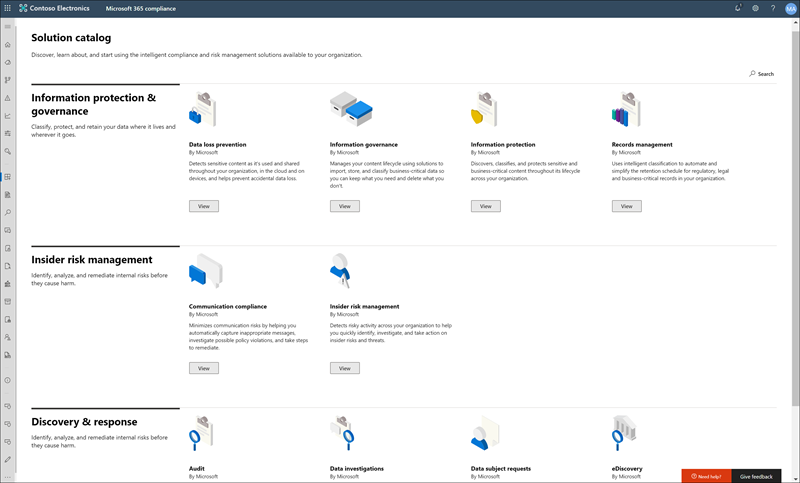
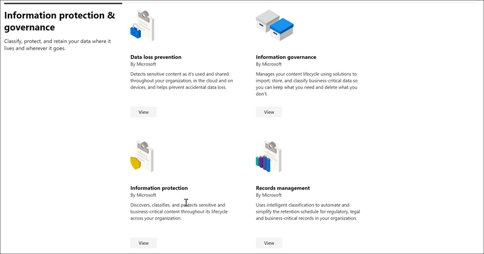

# Microsoft 365-Lösungskatalog

Möchten Sie möglichst schnell mit der Ausführung von Compliance-Aufgaben in Microsoft 365 beginnen? Sehen Sie sich den [Microsoft 365-Lösungskatalog](https://compliance.microsoft.com/solutioncatalog) mit Compliance- und Risikomanagement-Lösungen an, und erfahren Sie, wie Sie schnell loslegen können.

Bei den Compliance-Lösungen in Microsoft 365 handelt es sich um Sammlungen von integrierten Funktionen, die Sie verwenden können, um End-to-End-Compliance-Szenarien zu verwalten. Die Funktionen und Tools einer Lösung können eine Kombination von Richtlinien, Warnungen, Berichten und mehr umfassen.

Lesen Sie diesen Artikel, um sich mit dem neuen Lösungskatalog im Microsoft 365 Compliance Center vertraut zu machen und um zu erfahren,[wie Sie ihn erhalten](#how-do-i-get-this), um Antworten auf [häufig gestellte Fragen](#frequently-asked-questions) zu erhalten und sich über die [nächsten Schritte](#next-steps) zu informieren.

## Strukturierung des Katalogs

Der Lösungskatalog ist in Abschnitte unterteilt, die Informationskarten für jede in Ihrem Microsoft 365-Abonnement zur Verfügung stehende Compliancelösung enthalten. Jeder Abschnitt enthält Karten für Lösungen, die nach Compliancebereich gruppiert sind.

Wenn Sie **Anzeigen** für eine Lösungskarte auswählen, werden ausführliche Informationen zur Compliancelösung und zu den ersten Schritten angezeigt. Diese Informationen umfassen eine Übersicht, Voraussetzungen für die Konfiguration, Schulungsressourcen, Steuerelemente, mit denen Sie die Karte an den Navigationsbereich anheften können, sowie eine Option zum Freigeben der Lösung als Link, E-Mail- oder Microsoft Teams-Nachricht.

## Abschnitt "Information Protection & Governance"

Im Abschnitt **Information Protection & Governance** sehen Sie auf einen Blick, wie Sie Microsoft 365-Compliancelösungen zum Schutz und zur Kontrolle von Daten in Ihrer Organisation verwenden können.

Hier sehen Sie Karten für die folgenden Lösungen:

- [Verhinderung von Datenverlust](data-loss-prevention-policies.md): Ermittelt vertrauliche Inhalte, die in der gesamten Organisation, in der Cloud und auf Geräten verwendet und freigegeben werden, und hilft bei der Vorbeugung von versehentlichem Datenverlust.
- [Information Governance](manage-information-governance.md): verwaltet ihren Inhaltslebenszyklus mithilfe von Lösungen zum Importieren, speichern und Klassifizieren von geschäftskritischen Daten, sodass Sie die benötigten Informationen behalten und löschen können.
- [Schutz von Daten](information-protection.md): Ermittelt, klassifiziert und schützt vertrauliche und unternehmensrelevante Inhalte organisationsweit über ihren gesamten Lebenszyklus hinweg.
- [Datensatzverwaltung](records-management.md): Nutzt eine intelligente Klassifizierung zum Automatisieren und Vereinfachen des Aufbewahrungszeitplans für gesetzlich vorgeschriebene, rechts- und unternehmensrelevante Datensätze in Ihrer Organisation.

## Abschnitt "Insider-Risikomanagement"

Im Abschnitt " **Insider-Risikomanagement"** auf der Startseite sehen Sie auf einen Blick, wie Ihre Organisation interne Risiken erkennen, analysieren und darauf reagieren kann, bevor durch sie Schaden entsteht.

Hier sehen Sie Karten für die folgenden Lösungen:

- [Kommunikationscompliance](communication-compliance.md): Minimiert kommunikationsbezogene Risiken, da unangemessene Nachrichten automatisch erfasst, mögliche Verstöße gegen Richtlinien untersucht und Maßnahmen zur Minimierung von Schäden ergriffen werden.
- [Insider-Risikomanagement](insider-risk-management.md): Ermittelt riskante Aktivitäten in Ihrer Organisation, um Ihnen dabei zu helfen, Insider-Risiken und -Bedrohungen schnell zu erkennen, zu untersuchen und entsprechende Maßnahmen zu ergreifen.

## Abschnitt "Ermittlung und Reaktion"

Im Abschnitt **Ermittlung und Reaktion** auf der Startseite sehen Sie auf einen Blick, wie Ihre Organisation Compliance-Probleme im Hinblick auf relevante Daten schnell finden, untersuchen und beheben kann.

Hier sehen Sie Karten für die folgenden Lösungen:

- [Überwachung](search-the-audit-log-in-security-and-compliance.md): Erfasst Benutzer- und Administratoraktivitäten in Ihrer Organisation, sodass Sie das Überwachungsprotokoll durchsuchen und eine umfassende Liste der Aktivitäten an allen Orten und in allen Diensten überprüfen können.
- [Datenuntersuchungen](overview-data-investigations.md): Sucht in allen Inhaltsspeicherorten nach vertraulichen, bösartigen oder falsch abgelegten Daten in allen Microsoft 365-Speicherorten, um Ihnen dabei zu helfen, Vorfälle wie z. B. Datenlecks zu untersuchen und zu beheben.
- [Datensubjekt Anforderungen](manage-gdpr-data-subject-requests-with-the-dsr-case-tool.md): sucht und exportiert die personenbezogenen Daten eines Benutzers, um Sie bei der Reaktion auf Anfragen von Datensubjekten für dsgvo zu unterstützen.
- [eDiscovery](manage-legal-investigations.md)
    - [Core eDiscovery](ediscovery-cases.md): Durchsucht Inhaltsspeicherorte, um Daten für Reaktionen im Rahmen der Offenlegungspflicht und für eDiscovery-Fälle zu identifizieren, beizubehalten und zu exportieren.
    - [Advanced eDiscovery](overview-ediscovery-20.md): baut auf eDiscovery-Funktionen auf, indem intelligente Analysen und Maschinelles Lernen bereitgestellt werden, damit Sie die für Discovery-Anforderungen relevanten Daten weiter analysieren können.

## Wie erhalte ich den Katalog?

Wenn Sie den Microsoft 365-Lösungskatalog besuchen möchten, wechseln Sie zu [https://compliance.microsoft.com](https://compliance.microsoft.com), und melden Sie sich als globaler Administrator, Compliance-Administrator oder Compliance-Datenadministrator an. Wählen Sie im Navigationsbereich auf der linken Seite des Bildschirms **Katalog** aus, um die Katalog-Startseite zu öffnen.

## Häufig gestellte Fragen

**Warum wird der Microsoft 365-Lösungskatalog nicht angezeigt?**

Stellen Sie zunächst sicher, dass Sie über die entsprechenden Lizenzen und Berechtigungen verfügen. Melden Sie sich dann bei [https://compliance.microsoft.com](https://compliance.microsoft.com) als globaler Administrator, Compliance-Administrator oder Compliance-Datenadministrator an.

**Einige der auf der Lösungskatalogseite aufgeführten Compliancefunktionen stehen im Microsoft 365 Compliance Center nicht zur Verfügung. Was kann ich tun?**

Wir arbeiten ständig daran, dem Microsoft 365 Compliance Center und dem Lösungskatalog neue Funktionen hinzuzufügen. Wenn Sie eine bestimmte Lösung im Navigationsbereich nicht finden können, ist sie in Ihrem Abonnement (noch) nicht verfügbar.

Wenn Sie eine vorhandene Compliance-Lösung suchen und diese im Microsoft 365 Compliance Center noch nicht verfügbar ist, können Sie jederzeit auf Lösungen im vorhandenen Security &amp; Compliance Center zugreifen, indem Sie zu wechseln [https://protection.office.com](https://protection.office.com) . Alternativ können Sie im linken Navigationsbereich des Microsoft 365 Compliance Centers auf die Registerkarte **Weitere Ressourcen** klicken und die Office 365 Security & Compliance Center-Karte auswählen.  

## Nächste Schritte

- **Besuchen Sie den Microsoft Compliance-Manager** , der Ihnen hilft, den Zustand Ihrer Organisation bezüglich der Einhaltung wichtiger Standards und Richtlinien zu verstehen. Sie enthält empfohlene Maßnahmen, die Sie ergreifen können, um den allgemeinen Compliance-Status zu verbessern, und bietet Workflowfunktionen, die Ihnen helfen, diese Maßnahmen effizient umzusetzen. Weitere Informationen finden Sie unter [Compliance-Manager](compliance-manager.md).

- **Konfigurieren Sie Richtlinien für Insider-Risiken** zur Minimierung interner Risiken und zum Erkennen, Untersuchen und Reagieren auf riskante Aktivitäten in Ihrer Organisation. Weitere Informationen finden Sie unter [Insider-Risikomanagement](insider-risk-management.md).

- **Erfahren Sie mehr über und erstellen Sie Richtlinien für die Kommunikationscompliance** , um Verstöße gegen Unternehmensregeln schnell zu erkennen und Maßnahmen dagegen zu ergreifen. Näheres erfahren Sie unter [Kommunikationscompliance](communication-compliance.md).

- **Microsoft Information Protection** : Erfahren Sie, wie Sie mithilfe von Microsoft 365-Lösungen vertrauliche Informationen unabhängig davon, wo sie sich befinden oder unterwegs sind, entdecken, klassifizieren und schützen können.
    - **Lernen Sie Microsoft Cloud App Security kennen und richten Sie es ein**. Näheres dazu finden Sie unter [Schnellstart: Erste Schritte mit Microsoft Cloud App Security](https://docs.microsoft.com/cloud-app-security/getting-started-with-cloud-app-security).
    - **Erste Schritte mit Klassifizierern**. Das Klassifizieren von Inhalten und deren anschließende Bezeichnung, damit sie geschützt sind und ordnungsgemäß gehandhabt werden, ist der Ausgangspunkt für einen optimalen Schutz von Daten. Weitere Informationen finden Sie unter [erfahren Sie mehr über Lernende Klassifizierungen (Preview)](classifier-learn-about.md).

- **Besuchen Sie den Microsoft 365-Lösungskatalog möglichst oft** , und sehen Sie sich etwaige neue Lösungen an, die Ihnen bei der Compliance-Einhaltung helfen können. Melden Sie sich bei [https://compliance.microsoft.com](https://compliance.microsoft.com) an, und wählen Sie dann im linken Navigationsbereich **Katalog** aus.
