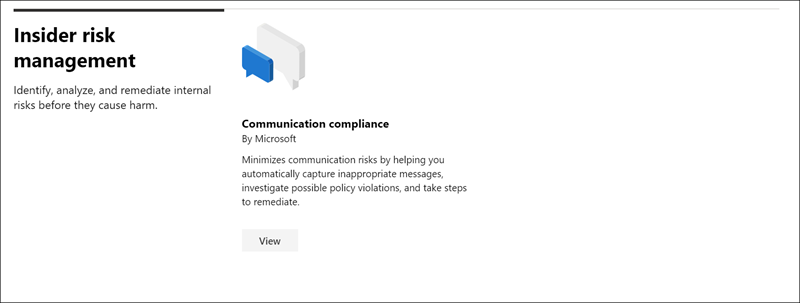

# Übersicht über den Microsoft 365-Lösungskatalog (Vorschau)

## Übersicht

Suchen Sie nach einer Möglichkeit, mit Compliance-Aufgaben in Microsoft 365 schnell zu beginnen? Sehen Sie sich den neuen [Microsoft 365-Lösungskatalog](https://compliance.microsoft.com/solutioncatalog) an, um die Compliance-und Risikomanagementlösungen zu entdecken, zu erfahren und schnell zu starten.

Compliance-Lösungen in Microsoft 365 sind Sammlungen integrierter Funktionen, die Sie bei der Verwaltung von End-to-End-Konformitätsszenarien verwenden können. Die Funktionen und Tools einer Lösung umfassen möglicherweise eine Kombination aus Richtlinien, Warnungen, Berichten und vielem mehr.

Lesen Sie diesen Artikel, um sich mit dem neuen Lösungskatalog im Microsoft 365 Compliance Center vertraut zu machen, [wie Sie es erhalten](#how-do-i-get-this), [häufig gestellte Fragen](#frequently-asked-questions)und Ihre [nächsten Schritte](#next-steps).

## Katalog Organisation

Der Lösungskatalog ist in Abschnitten organisiert, die Informationskarten für jede kompatibilitätslösung enthalten, die in Ihrem Microsoft 365-Abonnement verfügbar ist. Jeder Abschnitt enthält Karten für Lösungen, die nach Kompatibilitätsbereich gruppiert sind.

Wenn Sie für eine Lösung Karte **anzeigen** auswählen, werden ausführliche Informationen zur Compliance-Lösung und zu den ersten Schritten angezeigt. Diese Informationen umfassen eine Übersicht, vorkonfigurierte Anforderungen, Lernressourcen, Steuerelemente, mit denen Sie die Karte an den Navigationsbereich anheften können, sowie eine Option zum Freigeben der Lösung als Link, e-Mail oder Microsoft Teams-Nachricht.

## Abschnitt "Information Protection #a0 Governance"

Der Abschnitt **Information Protection #a0 Governance** zeigt Ihnen auf einen Blick, wie Sie mithilfe von Microsoft 365-Kompatibilitätslösungen Daten in Ihrer Organisation schützen und steuern können.

Von hier aus sehen Sie Karten für die folgenden Lösungen:

- [Verhinderung von Datenverlust](data-loss-prevention-policies.md): erkennt vertrauliche Inhalte, da diese in Ihrer Organisation, in der Cloud und auf Geräten verwendet und gemeinsam genutzt werden, und verhindert versehentlichen Datenverlust.
- [Information Governance](manage-information-governance.md): verwaltet ihren Inhaltslebenszyklus mithilfe von Lösungen zum Importieren, speichern und Klassifizieren von geschäftskritischen Daten, sodass Sie die benötigten Informationen behalten und löschen können.
- [Informationsschutz](protect-information.md): erkennt, klassifiziert und schützt vertrauliche und geschäftsrelevante Inhalte über den gesamten Lebenszyklus hinweg in Ihrer Organisation.
- [Datensatzverwaltung](records-management.md): intelligente Klassifizierung verwendet, um den aufbewahrungszeitplan für regulatorische, rechtliche und unternehmenswichtige Datensätze in Ihrer Organisation zu automatisieren und zu vereinfachen.

## Abschnitt "Insider Risikomanagement"

Im Abschnitt **Insider Risk Management** auf der Startseite erfahren Sie auf einen Blick, wie Ihre Organisation interne Risiken erkennen, analysieren und beheben kann, bevor Sie Schaden anrichten.

Von hier aus können Sie zu einer Karte für die folgende Lösung wechseln:

- [Kommunikation Compliance](communication-compliance.md): minimiert Kommunikationsrisiken, indem es Ihnen hilft, unangemessene Nachrichten automatisch zu erfassen, mögliche Richtlinienverletzungen zu untersuchen und Schritte zur Korrektur zu ergreifen.

## Abschnitt "Discovery #a0 Response"

Im Abschnitt **Discovery #a0 Response** auf der Startseite erfahren Sie auf einen Blick, wie Ihre Organisation auf Compliance-Probleme mit relevanten Daten schnell suchen, diese untersuchen und auf diese reagieren kann.

Von hier aus sehen Sie Karten für die folgenden Lösungen:

- [Überwachung](search-the-audit-log-in-security-and-compliance.md): zeichnet Benutzer-und Administratoraktivitäten in Ihrer Organisation auf, sodass Sie das Überwachungsprotokoll durchsuchen und eine umfassende Liste der Aktivitäten für alle Standorte und Dienste untersuchen können.
- [Daten Ermittlungen](overview-data-investigations.md): Durchsuchen von Inhaltsspeicherorten zum Identifizieren von vertraulichen, böswilligen oder verfallenen Daten in Microsoft 365-Standorten, sodass Sie Vorfälle wie Datenüberlauf untersuchen und beheben können.
- [Datensubjekt Anforderungen](manage-gdpr-data-subject-requests-with-the-dsr-case-tool.md): sucht und exportiert die personenbezogenen Daten eines Benutzers, um Sie bei der Reaktion auf Anfragen von Datensubjekten für dsgvo zu unterstützen.
- [eDiscovery](manage-legal-investigations.md)
    - [Zentrale eDiscovery](ediscovery-cases.md): Durchsuchen von Inhalts Standorten zum identifizieren, beibehalten und Exportieren von Daten als Reaktion auf gesetzliche Ermittlungsanfragen und eDiscovery-Fälle.
    - [Advanced eDiscovery](overview-ediscovery-20.md): baut auf eDiscovery-Funktionen auf, indem intelligente Analysen und Maschinelles Lernen bereitgestellt werden, damit Sie die für Discovery-Anforderungen relevanten Daten weiter analysieren können.

## Wie erhalte ich diese?

- Wenn Sie den neuen Microsoft 365-Lösungskatalog nicht bereits haben, haben Sie ihn bald. Wir aktivieren den Lösungskatalog für alle Microsoft 365-Abonnements in einer inkrementellen Einführung.

- Wenn Sie den Microsoft 365-Lösungskatalog besuchen möchten [https://compliance.microsoft.com](https://compliance.microsoft.com) , wechseln Sie zu und melden Sie sich als globaler Administrator, Kompatibilitäts Administrator oder Compliance-Datenadministrator an. Wählen Sie im Navigationsbereich auf der linken Seite des Bildschirms **Katalog** aus, um die Katalog Homepage zu öffnen.

- Weitere Informationen zu den Anforderungen finden Sie unter [Required licenses and Permissions](../security/office-365-security/microsoft-security-and-compliance.md#required-licenses-and-permissions).

## Häufig gestellte Fragen

**Warum wird der neue Microsoft 365-Lösungskatalog noch nicht angezeigt?**

Stellen Sie zunächst sicher, dass Sie über die entsprechenden [Lizenzen und Berechtigungen](../security/office-365-security/microsoft-security-and-compliance.md#required-licenses-and-permissions)verfügen. Melden Sie sich dann als [https://compliance.microsoft.com](https://compliance.microsoft.com) globaler Administrator, Kompatibilitäts Administrator oder Datenadministrator für die Richtlinientreue an. Wenn der neue Lösungskatalog noch nicht im linken Navigationsbereich angezeigt wird, haben Sie ihn bald.

**Einige der Kompatibilitätsfeatures, die auf der Seite Lösungskatalog aufgeführt sind, sind im Microsoft 365 Compliance Center nicht verfügbar. Was soll ich tun?**

Im Microsoft 365 Compliance Center und im Lösungskatalog werden weiterhin Funktionen hinzugefügt. Wenn Sie eine bestimmte Lösung im Navigationsbereich nicht finden können, ist sie zugänglich, wenn die Lösung in Ihrem Abonnement verfügbar ist.

Wenn Sie eine vorhandene Compliance-Lösung suchen und diese im Microsoft 365 Compliance Center noch nicht verfügbar ist, können Sie immer auf Lösungen im vorhandenen Office 365 Security and Compliance Center zugreifen, indem Sie zu [https://protection.office.com](https://protection.office.com)wechseln. Alternativ können Sie auf die Registerkarte **Weitere Ressourcen** im linken Navigationsbereich des Microsoft 365 Compliance Centers klicken und die Karte Office 365 Security and Compliance Center auswählen.  

## Nächste Schritte

- **Überprüfen Sie Ihre Microsoft-Kompatibilitäts**Bewertung, eine personalisierte, risikobasierte Bewertung, die Ihnen hilft, den Zustand Ihrer Organisation bezüglich der Einhaltung wichtiger Standards und Vorschriften zu verstehen. Es enthält empfohlene Maßnahmen, die Sie ergreifen können, um Ihre allgemeine Compliance-Haltung zu stärken, und bietet Workflowfunktionen, die Sie bei der effizienten Ausführung dieser Aktionen unterstützen. Weitere Informationen finden Sie unter [Compliance Score (Preview)](compliance-score.md).

- **Microsoft Information Protection**: erfahren Sie, wie Sie mithilfe von Microsoft 365-Lösungen vertrauliche Informationen überall dort, wo Sie leben oder Reisen, erkennen, klassifizieren und schützen.
    - **Machen Sie sich mit Microsoft Cloud App Security vertraut und richten Sie Sie**ein. Weitere Informationen finden Sie unter [Quick Start: Erste Schritte mit Microsoft Cloud App Security](https://docs.microsoft.com/cloud-app-security/getting-started-with-cloud-app-security).
    - **Erste Schritte mit den Klassifizierungen**. Das Klassifizieren von Inhalten und deren anschließende Kennzeichnung, damit diese geschützt und ordnungsgemäß behandelt werden kann, ist der Ausgangspunkt für die Informationsschutz Disziplin. Weitere Informationen finden Sie unter [Erste Schritte mit Schulungs Klassifizierern](classifier-getting-started-with.md).

- **Erfahren Sie mehr über und erstellen Sie Richtlinien** für die Kommunikationsrichtlinien zur schnellen Erkennung und Korrektur von Richtlinienverstößen in Bezug auf Corporate Code of Conduct. Weitere Informationen finden Sie unter [Communication Compliance in Microsoft 365](communication-compliance.md).

- **Besuchen Sie häufig ihren Microsoft 365-Lösungskatalog**, und stellen Sie sicher, dass Sie neue Lösungen überprüfen, die Ihnen bei ihren Compliance-Anforderungen helfen. Melden Sie sich [https://compliance.microsoft.com](https://compliance.microsoft.com) bei an, und wählen Sie dann im linken Navigationsbereich **Katalog** aus.