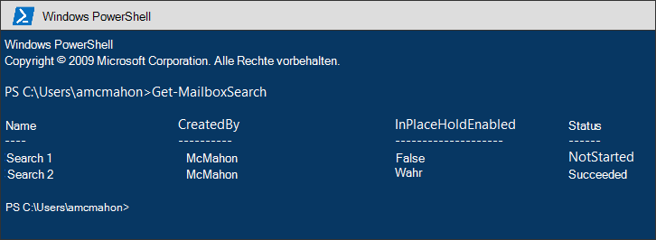
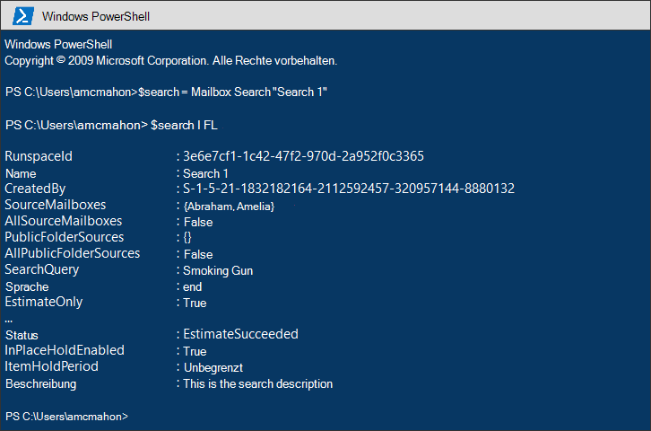
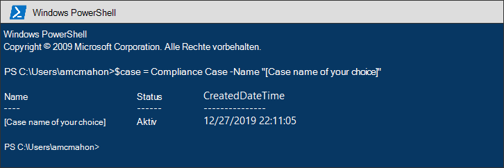
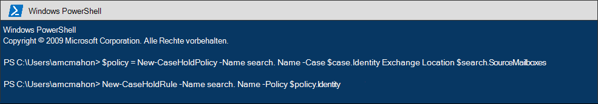
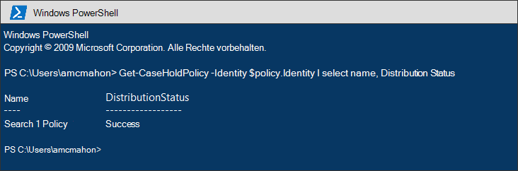
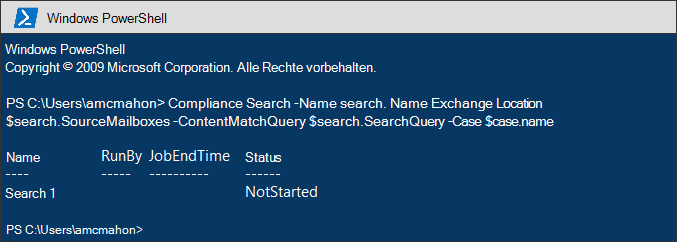

# <a name="migrate-legacy-ediscovery-searches-and-holds-to-the-microsoft-365-compliance-center"></a>Migrieren von älteren eDiscovery-Suchen und -Haltedaten zum Microsoft 365 Compliance Center

Das Microsoft 365 Compliance Center bietet eine verbesserte Erfahrung für die eDiscovery-Verwendung, einschließlich: höhere Zuverlässigkeit, bessere Leistung und viele Features, die auf eDiscovery-Workflows zugeschnitten sind, einschließlich Fällen, in denen Ihre Inhalte nach Inhalten organisiert werden, Überprüfungssätze zur Überprüfung von Inhalten und Analysen, um daten für die Überprüfung zu überprüfen, z. B. beinahe duplizierte Gruppierungen, E-Mail-Threading, Designsanalyse und Vorhersagecodierung.

Damit Kunden die neuen und verbesserten Funktionen nutzen können, enthält dieser Artikel grundlegende Anleitungen zum Migrieren von In-Place eDiscovery-Suchen und -Haltefunktionen vom Exchange Admin Center zum Microsoft 365 Compliance Center.

> [!NOTE]
> Da es viele verschiedene Szenarien gibt, bietet dieser Artikel allgemeine Anleitungen für die Übergangssuche und die Übergänge zu einem zentralen eDiscovery-Fall im Microsoft 365 Compliance Center. Die Verwendung von eDiscovery-Fällen ist nicht immer erforderlich, sie fügen jedoch eine zusätzliche Sicherheitsebene hinzu, indem Sie Berechtigungen zuweisen können, um zu steuern, wer Zugriff auf die eDiscovery-Fälle in Ihrer Organisation hat.

## <a name="before-you-begin"></a>Bevor Sie beginnen

- Sie müssen Mitglied der Rollengruppe eDiscovery Manager im Security & Compliance Center sein, um die in diesem Artikel beschriebenen PowerShell-Befehle auszuführen. Sie müssen auch Mitglied der Rollengruppe Discoveryverwaltung im Exchange Admin Center sein.

- Dieser Artikel enthält Anleitungen zum Erstellen eines eDiscovery-Halteraums. Die Halterichtlinie wird über einen asynchronen Prozess auf Postfächer angewendet. Beim Erstellen eines eDiscovery-Halteraums müssen Sie sowohl caseHoldPolicy als auch CaseHoldRule erstellen, andernfalls wird der Halteraum nicht erstellt, und Inhaltsstandorte werden nicht in die Warteschleife gesetzt.

## <a name="step-1-connect-to-exchange-online-powershell-and-security--compliance-center-powershell"></a>Schritt 1: Herstellen einer Verbindung mit Exchange Online PowerShell und & Compliance Center PowerShell

Der erste Schritt besteht im Herstellen einer Verbindung mit Exchange Online PowerShell und Security & Compliance Center PowerShell. Sie können das folgende Skript kopieren, in ein PowerShell-Fenster einfügen und dann ausführen. Sie werden zur Eingabe von Anmeldeinformationen für die Organisation aufgefordert, mit der Sie eine Verbindung herstellen möchten. 

```powershell
$UserCredential = Get-Credential
$sccSession = New-PSSession -ConfigurationName Microsoft.Exchange -ConnectionUri https://ps.compliance.protection.outlook.com/powershell-liveid -Credential $UserCredential -Authentication Basic -AllowRedirection
Import-PSSession $sccSession -DisableNameChecking
$exoSession = New-PSSession -ConfigurationName Microsoft.Exchange -ConnectionUri https://ps.outlook.com/powershell-liveid/ -Credential $UserCredential -Authentication Basic -AllowRedirection
Import-PSSession $exoSession -AllowClobber -DisableNameChecking
```

Sie müssen die Befehle in den folgenden Schritten in dieser PowerShell-Sitzung ausführen.

## <a name="step-2-get-a-list-of-in-place-ediscovery-searches-by-using-get-mailboxsearch"></a>Schritt 2: Eine Liste der eDiscovery-In-Place mithilfe von Get-MailboxSearch

Nachdem Sie sich authentifiziert haben, können Sie eine Liste der In-Place eDiscovery-Suchen erhalten, indem Sie das **Cmdlet Get-MailboxSearch** ausführen. Kopieren Sie den folgenden Befehl, und fügen Sie ihn in PowerShell ein, und führen Sie ihn aus. Eine Liste der Suchbegriffe wird mit ihren Namen und dem Status aller In-Place aufgelistet.

```powershell
Get-MailboxSearch
```

Die Ausgabe des Cmdlets ähnelt der folgenden:



## <a name="step-3-get-information-about-the-in-place-ediscovery-searches-and-in-place-holds-you-want-to-migrate"></a>Schritt 3: Informationen zu eDiscoveryIn-Place suchen und In-Place, die Sie migrieren möchten

Auch hier verwenden Sie das **Cmdlet Get-MailboxSearch,** aber dieses Mal, um die Eigenschaften der Suche zu erhalten. Sie können diese Eigenschaften später in einer Variablen speichern. Im folgenden Beispiel werden die Ergebnisse des **Cmdlets Get-MailboxSearch** in einer Variablen gespeichert und dann die Eigenschaften der Suche angezeigt.

```powershell
$search = Get-MailboxSearch -Identity "Search 1"
```

```powershell
$search | FL
```

Die Ausgabe dieser beiden Befehle ähnelt der folgenden:



> [!NOTE]
> Die Dauer des In-Place in diesem Beispiel ist unbegrenzt (*ItemHoldPeriod: Unlimited*). Dies ist typisch für eDiscovery- und rechtliche Untersuchungsszenarien. Wenn die Aufbewahrungsdauer einen anderen Wert als auf unbestimmte Zeit hat, liegt der Grund wahrscheinlich daran, dass der Haltespeicher zum Beibehalten von Inhalten in einem Aufbewahrungsszenario verwendet wird. Anstatt die eDiscovery-Cmdlets in Security & Compliance Center PowerShell für Aufbewahrungsszenarien zu verwenden, sollten Sie [New-RetentionCompliancePolicy](/powershell/module/exchange/new-retentioncompliancepolicy) und [New-RetentionComplianceRule](/powershell/module/exchange/new-retentioncompliancerule) verwenden, um Inhalte zu behalten. Das Ergebnis der Verwendung dieser Cmdlets ähnelt der Verwendung von **New-CaseHoldPolicy** und **New-CaseHoldRule,** Sie können jedoch einen Aufbewahrungszeitraum und eine Aufbewahrungsaktion angeben, z. B. das Löschen von Inhalten nach Ablauf des Aufbewahrungszeitraums. Wenn Sie die Aufbewahrungs-Cmdlets verwenden, müssen Sie die Aufbewahrungsspeicher auch nicht einem eDiscovery-Fall zuordnen.

## <a name="step-4-create-a-case-in-the-microsoft-365-compliance-center"></a>Schritt 4: Erstellen eines Falls im Microsoft 365 Compliance Center

Zum Erstellen eines eDiscovery-Halteraums müssen Sie einen eDiscovery-Fall erstellen, um den Halteraum zuzuordnen. Im folgenden Beispiel wird ein eDiscovery-Fall mit einem Namen Ihrer Wahl erstellt. Die Eigenschaften des neuen Falls werden später in einer Variablen gespeichert. Sie können diese Eigenschaften anzeigen, indem Sie den `$case | FL` Befehl ausführen, nachdem Sie den Fall erstellt haben.

```powershell
$case = New-ComplianceCase -Name "[Case name of your choice]"
```


## <a name="step-5-create-the-ediscovery-hold"></a>Schritt 5: Erstellen des eDiscovery-Halteraums

Nachdem der Fall erstellt wurde, können Sie den Halteraum erstellen und dem Fall zuordnen, den Sie im vorherigen Schritt erstellt haben. Beachten Sie, dass Sie sowohl eine Fall-Halterichtlinie als auch eine Fall-Halteregel erstellen müssen. Wenn die Fall-Halteregel nicht erstellt wird, nachdem Sie eine Fall-Halterichtlinie erstellt haben, wird die eDiscovery-Halterichtlinie nicht erstellt, und Inhalte werden nicht in den Halteraum gestellt.

Führen Sie die folgenden Befehle aus, um den eDiscovery-Halteraum neu zu erstellen, den Sie migrieren möchten. In diesen Beispielen werden die Eigenschaften In-Place aus Schritt 3 verwendet, die Sie migrieren möchten. Der erste Befehl erstellt eine neue Fallaufforderungsrichtlinie und speichert die Eigenschaften in einer Variablen. Mit dem zweiten Befehl wird die entsprechende Fallaufforderungsregel erstellt.

```powershell
$policy = New-CaseHoldPolicy -Name $search.Name -Case $case.Identity -ExchangeLocation $search.SourceMailboxes
```

```powershell
New-CaseHoldRule -Name $search.Name -Policy $policy.Identity
```



## <a name="step-6-verify-the-ediscovery-hold"></a>Schritt 6: Überprüfen des eDiscovery-Halteraums

Um sicherzustellen, dass beim Erstellen des Haltestatus keine Probleme auftreten, sollten Sie überprüfen, ob der Status der Halteverteilung erfolgreich ist. Verteilung bedeutet, dass der Halteraum auf alle im *ExchangeLocation-Parameter* im vorherigen Schritt angegebenen Inhaltspositionen angewendet wurde. Dazu können Sie das **Cmdlet Get-CaseHoldPolicy** ausführen. Da die in der im vorherigen *Schritt $policy* gespeicherten Eigenschaften nicht automatisch in der Variablen aktualisiert werden, müssen Sie das Cmdlet erneut ausführen, um sicherzustellen, dass die Verteilung erfolgreich ist. Es kann zwischen 5 Minuten und 24 Stunden dauern, bis Case Hold-Richtlinien erfolgreich verteilt werden.

Führen Sie den folgenden Befehl aus, um zu überprüfen, ob der eDiscovery-Halteraum erfolgreich verteilt wurde.

```powershell
Get-CaseHoldPolicy -Identity $policy.Identity | Select name, DistributionStatus
```

Der Wert **von Success** für die *DistributionStatus-Eigenschaft* gibt an, dass der Haltestatus erfolgreich an den Inhaltsstandorten platziert wurde. Wenn die Verteilung noch nicht abgeschlossen ist, wird der Wert **Ausstehend** angezeigt.



## <a name="step-7-create-the-search"></a>Schritt 7: Erstellen der Suche

Der letzte Schritt besteht in der neu erstellten Suche, die Sie in Schritt 3 identifiziert haben, und ordnen Sie sie dem Fall zu. Nachdem Sie die Suche erstellt haben, können Sie sie mit dem **Cmdlet Start-ComplianceSearch** ausführen oder zu einem späteren Zeitpunkt ausführen.

```powershell
New-ComplianceSearch -Name $search.Name -ExchangeLocation $search.SourceMailboxes -ContentMatchQuery $search.SearchQuery -Case $case.name
```



## <a name="step-8-verify-the-case-hold-and-search-in-the-microsoft-365-compliance-center"></a>Schritt 8: Überprüfen von Fall, Halte und Suche im Microsoft 365 Compliance Center

Um sicherzustellen, dass alles ordnungsgemäß eingerichtet ist, wechseln Sie zum Microsoft 365 Compliance Center unter , und klicken Sie auf [https://compliance.microsoft.com](https://compliance.microsoft.com) **eDiscovery > Core**.


Der fall, den Sie in Schritt 3 erstellt haben, wird auf der **Seite Core eDiscovery** aufgeführt. Öffnen Sie den Fall, und beachten Sie dann den halte, den Sie in Schritt 4 in auf der Registerkarte Halte **halte erstellt** haben. Sie können auf den Haltestatus klicken, um Details anzuzeigen, einschließlich der Anzahl der Postfächer, auf die der Haltestatus angewendet wird, und den Verteilungsstatus.


Die suche, die Sie in Schritt 7  erstellt haben, wird auf der Registerkarte Suchen des eDiscovery-Falls aufgeführt.


Wenn Sie eine In-Place eDiscovery-Suche migrieren, sie jedoch keinem eDiscovery-Fall zuordnen, wird sie auf der Seite Inhaltssuche im Microsoft 365 Compliance Center aufgeführt.

## <a name="more-information"></a>Weitere Informationen

- Weitere Informationen zu In-Place eDiscovery & im Exchange Admin Center finden Sie unter:
  
  - [Compliance-eDiscovery](/exchange/security-and-compliance/in-place-ediscovery/in-place-ediscovery)

  - [In-Situ-Speicher und Beweissicherungsverfahren](/exchange/security-and-compliance/in-place-and-litigation-holds)

- Weitere Informationen zu den im Artikel verwendeten PowerShell-Cmdlets finden Sie unter:

  - [Get-MailboxSearch](/powershell/module/exchange/get-mailboxsearch)
  
  - [New-ComplianceCase](/powershell/module/exchange/new-compliancecase)

  - [New-CaseHoldPolicy](/powershell/module/exchange/new-caseholdpolicy)
  
  - [New-CaseHoldRule](/powershell/module/exchange/new-caseholdrule)

  - [Get-CaseHoldPolicy](/powershell/module/exchange/get-caseholdpolicy)
  
  - [New-ComplianceSearch](/powershell/module/exchange/new-compliancesearch)

  - [Start-ComplianceSearch](/powershell/module/exchange/start-compliancesearch)

- Weitere Informationen zum Microsoft 365 Compliance Center finden Sie [unter Overview of the Microsoft 365 Compliance Center](microsoft-365-compliance-center.md).