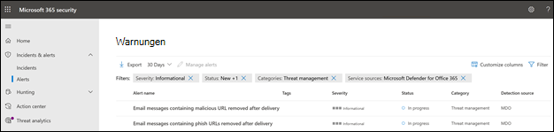

# Neue Warnungsrichtlinien in Microsoft Defender für Office 365

In Microsoft Defender für Office 365 werden neue und verbesserte Warnungsrichtlinien im Zusammenhang mit der Erkennung nach der Zustellung eingeführt. Dies schließt Verbesserungen der Playbooks für die automatisierte Untersuchung und Reaktion (Automated Investigation and Response, AIR) ein, die diesen zugeordnet sind. Darüber hinaus ändern wir bei sechs Standardwarnungsrichtlinien die Schweregradklassifizierung, um die von diesen Richtlinien generierten Warnungen besser an den Auswirkungen auf Ihre Organisation auszurichten.

## Erkennung nach der Zustellung

Wir führen vier neue Standardwarnungsrichtlinien ein, die sich auf die Erkennung nach der Zustellung beziehen, nachdem durch die Funktion zum automatischen Löschen (Zero Hour Auto Purge, ZAP) in Microsoft Defender für Office 365 Nachrichten aus einem Posteingang entfernt wurden. Diese vier neuen Warnungsrichtlinien ersetzen zwei bestehende Standardwarnungsrichtlinien, die ZAP-Szenarien betreffen, und liefern Organisationen erweiterte Details über die zugrunde liegende Erkennung und damit zusammenhängende Indikatoren. Diese Warnungen (und die AIR-Playbooks, die durch diese Warnungen getriggert werden) erfassen präzise die Bedrohungen in E-Mails und Entitäten, etwa ob eine URL auf eine schädliche Datei verweist oder eine Datei eine böswillige URL enthält.

In der nachstehenden Tabelle sind die neuen sowie die bestehenden Warnungsrichtlinien, die entfernt werden, aufgeführt. Details zum Rollout finden Sie im Abschnitt [Auswirkungen auf Ihre Organisation](#how-this-will-affect-your-organization).

| Neue oder bestehende Warnungsrichtlinie | Name der Warnungsrichtlinie | ID der Warnungsrichtlinie|
|:-----------------------------|:----------------|:--------------|
| Neu| **E-Mail-Nachrichten mit schädlicher URL wurden nach der Zustellung entfernt**   | 0179B3F7-3FDA-40C3-8F24-278563978DBB |
| Neu| **E-Mail-Nachrichten mit schädlicher Datei wurden nach der Übermittlung entfernt**  | 8E6BA277-EF39-404E-AAF1-294F6D9A2B88 |
| Neu| **E-Mail-Nachrichten aus einer Kampagne wurden zugestellt und später entfernt** | ef850570-5624-42b2-ff0a-08d8d899d578 |
| Neu|**Schädliche E-Mails wurden zugestellt und später entfernt**                | a1f563cc-fb1f-466b-1fb5-08d8d71a3050 |
| Bestehend (wird entfernt)| **E-Mail-Nachrichten mit Phishing-URLs wurden nach der Zustellung entfernt**| EA8169FA-0678-4751-8854-AEBEA7ADECEB |
| Bestehend (wird entfernt)| **E-Mail-Nachrichten mit Schadsoftware wurden nach der Zustellung entfernt**| 0179B3F7-3FDA-40C3-8F24-278563978DBB |
||||

## Verbesserungen bei der Schweregradeinstufung

In der folgenden Tabelle sind die Standard-Alarmrichtlinien aufgeführt, deren Schweregradklassifizierungen geändert werden. Wir ändern die Schweregradklassifizierung für diese Alarmrichtlinien, um sie besser an das potenzielle Risiko und die Auswirkungen auf Ihr Unternehmen anzupassen und Ihren Sicherheitsteams zu helfen, die von diesen Richtlinien generierten Alarme zu priorisieren.

| Warnung| ID der Warnungsrichtlinie| Alter Schweregrad| Neuer Schweregrad  |
|:----------|:---------------|:------------|:--------------|
| **Verdächtige E-Mail-Weiterleitunsaktivitäten**| BFD48F06-0865-41A6-85FF-ADB746423EBF | Mittel| Hoch|
| **Vom Benutzer als Schadsoftware oder Phishing-Mail gemeldete E-Mails** | B26A5770-0C38-434A-9380-3A3C2C27BBB3 | Zur Information | Niedrig|
| **Ungewöhnliche Zunahme von E-Mails, die als Phishing-Mails gemeldet wurden** | A00D8C62-9320-4EEA-A7E5-966B9AC09558 | High| Medium |
| **Ergebnis Administrator-Übermittlung abgeschlossen** | AE9B83DD-6039-4EA9-B675-6B0AC3BF4A41 | Niedrig| Zur Information |
| **Erstellung einer Weiterleitungs-/Umleitungsregel** | D59A8FD4-1272-41EE-9408-86F7BCF72479 | Niedrig| Zur Information |
| **eDiscovery-Suche gestartet oder exportiert**| 6FDC5710-3998-47F0-AFBB-57CEFD7378AE | Mittel| Zur Information |
|||||

## Wann werden diese Änderungen vorgenommen?

In der folgenden Tabelle ist aufgeführt, wann die neuen Warnungsrichtlinien damit beginnen werden, Warnungen nach der Zustellung auszulösen. Der Tabelle können Sie außerdem entnehmen, wann die beiden bestehenden Warnungsrichtlinien entfernt werden.

| Warnungsrichtlinie| Datum |
|:------------|:-----|
| **E-Mail-Nachrichten mit schädlicher URL wurden nach der Zustellung entfernt** (neu) | Warnungen werden ab dem 11. April 2021 ausgelöst.|
| **E-Mail-Nachrichten mit schädlicher Datei wurden nach der Übermittlung entfernt** (neu) | Warnungen werden ab dem 11. April 2021 ausgelöst. |
| **E-Mail-Nachrichten aus einer Kampagne wurden zugestellt und später entfernt** (neu) | Warnungen werden ab dem 14. Mai 2021 ausgelöst.|
| **Schädliche E-Mails wurden zugestellt und später entfernt** (neu) | Warnungen werden ab dem 14. Mai 2021 ausgelöst.|
| **E-Mail-Nachrichten mit Phishing-URLs wurden nach der Zustellung entfernt** (bestehend, wird entfernt)| Die Warnungsrichtlinie wird am 14. Mai 2021 entfernt. Lesen Sie hierzu den Abschnitt [Was Sie tun müssen, um sich auf diese Änderungen vorzubereiten](#what-you-need-to-do-to-prepare-for-these-changes).|
| **E-Mail-Nachrichten mit Schadsoftware wurden nach der Zustellung entfernt** (bestehend, wird entfernt) | Die Warnungsrichtlinie wird am 14. Mai 2021 entfernt. Lesen Sie hierzu den Abschnitt [Was Sie tun müssen, um sich auf diese Änderungen vorzubereiten](#what-you-need-to-do-to-prepare-for-these-changes). |
|||

Die Änderungen an den Warnungsschweregraden werden bis zum 14. Mai 2021 für alle Organisationen veröffentlicht.

## Auswirkungen auf Ihre Organisation

Die neuen Warnungen werden ab den oben genannten Terminen ausgelöst und beginnen mit dem Triggern von AIR-Untersuchungen in Ihrer Organisation. Um die Auswirkungen auf Sicherheitsorganisationen zu verringern, die die zwei zu entfernenden Warnungen implementiert haben, werden zwischen dem 5. April 2021 und dem 14. Mai 2021 durch die bestehenden *und* die neuen Warnungsrichtlinien ausgelöste Warnungen angezeigt. Dadurch haben Sicherheitsteams ausreichend Zeit, die erforderlichen Änderungen vorzunehmen. Um die Sicherheitsteams das Handling des erhöhten Warnungsvolumen während dieser kurzen Dauer zu erleichtern, werden sowohl die alten als auch die neuen Warnungen in derselben AIR-Untersuchung und im selben Vorfall korreliert. Dies schließt insbesondere das folgende Verhalten für Warnungen, AIR-Untersuchungen und Vorfälle ein:

- **Warnungen**: Standardmäßig werden alte und neue Warnungen als folgende Warnungspaare angezeigt:

  - **E-Mail-Nachrichten mit Phishing-URLs wurden nach der Zustellung entfernt** UND **E-Mail-Nachrichten mit schädlicher URL wurden nach der Zustellung entfernt**

  - **E-Mail-Nachrichten mit Schadsoftware wurden nach der Zustellung entfernt** UND **E-Mail-Nachrichten mit schädlicher Datei wurden nach der Zustellung entfernt**

  

   Weitere Informationen zum Verwalten dieser Warnungspaare finden Sie im Abschnitt [Was Sie tun müssen, um sich auf diese Änderungen vorzubereiten](#what-you-need-to-do-to-prepare-for-these-changes).

- **AIR-Untersuchungen**: Warnungen werden in einer einzelnen AIR-Untersuchung korreliert, und eine der Warnungen wird als "auslösend" und die andere als "wiederholt" eingestuft.

  

- **Vorfälle**: Beide Warnungen sind mit demselben Vorfall verknüpft.

  

## Was Sie tun müssen, um sich auf diese Änderungen vorzubereiten

Was Sie zur Vorbereitung tun müssen, hängt davon ab, wie Ihre Organisation diese Warnungen nutzt. Wenn Sie die Warnungen implementiert haben und sie über eine API, in E-Mail-Benachrichtigung zu Warnungen oder im Office 365 Security & Compliance Center (`https://protection.office.com/viewalerts`) bzw. im Microsoft Security Center (`https://security.microsoft.com/viewalerts`) verwenden oder einsetzen, müssen Sie Ihre Workflows ändern.

**Wenn Sie diese Benachrichtigungen noch nicht implementiert haben, gibt es zwei Optionen:**

- Deaktivieren Sie die folgenden (zu entfernenden) Warnungsrichtlinien, um das Warnungsvolumen in Ihrer Organisation zu verringern:

  - **E-Mail-Nachrichten mit Phishing-URLs wurden nach der Zustellung entfernt**

  - **E-Mail-Nachrichten mit Schadsoftware wurden nach der Zustellung entfernt**

- Nichts tun. Die bestehenden Warnungsrichtlinien werden am 14. Mai 2021 deaktiviert.

**Wenn Sie diese Warnungen implentiert haben:**

- Beginnen Sie damit, die neuen Alarme als Teil Ihrer Arbeitsabläufe zu verwenden, in Erwartung der Entfernung der bestehenden Alarm-Richtlinie am 14. Mai 2021. Im Falle einer benutzerdefinierten Logik in Ihrem Ticketingsystem, einem Sicherheitspostfach, über das Sie Warnungs-E-Mail-Benachrichtigungen erhalten, oder einer SIEM-Lösung, die vom Warnungsnamen oder der Warnungsrichtlinien-ID (CorrelationId) abhängt, müssen Sie die Logik an die Änderung anpassen.

  > [!NOTE]
  > An den Informationen in den Warnungen, Untersuchungen und Vorfällen hat sich nicht geändert. Diese Informationen wurden vielmehr durch zusätzliche Details zu den damit verbundenen Bedrohungen verbessert.

- Nachdem Sie die Änderungen vorgenommen haben, können Sie die bestehenden Warnungsrichtlinien deaktivieren, um das Warnungsvolumen in Ihrer Organisation zu verringern:

  - **E-Mail-Nachrichten mit Phishing-URLs wurden nach der Zustellung entfernt**

  - **E-Mail-Nachrichten mit Schadsoftware wurden nach der Zustellung entfernt**

  Alternativ können Sie diese Warnungsrichtlinien aktiviert lassen, bis sie am 14. Mai 2021 gelöscht werden.
