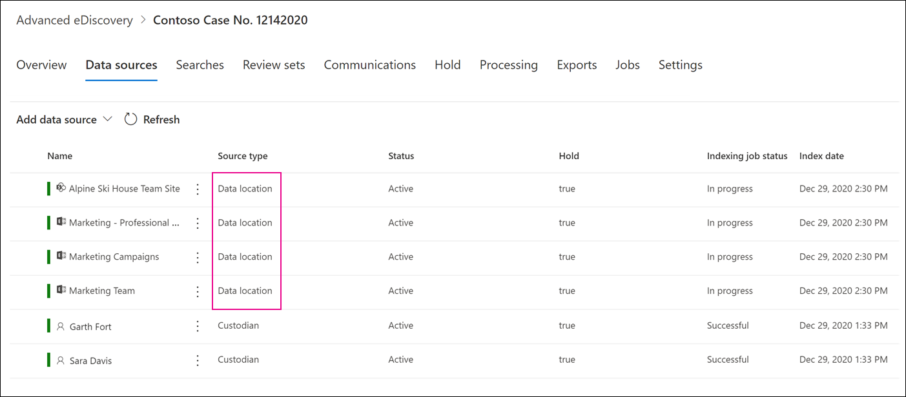

# Hinzufügen von Datenquellen ohne Freiheitsentzug zu einem erweiterten eDiscovery-FallAdd non-custodial data sources to an Advanced eDiscovery case

In erweiterten eDiscovery-Fällen erfüllt es nicht immer Ihre Anforderungen, um eine Microsoft 365-Datenquelle mit einer Depotbank in dem Fall zuzuordnen.In Advanced eDiscovery cases, it doesn't always meet your needs to associate a Microsoft 365 data source with a custodian in the case. Möglicherweise müssen Sie diese Daten aber dennoch einem Fall zuordnen, damit Sie Sie durchsuchen, zu einem Überprüfungs Satzes hinzufügen und analysieren und überprüfen können.But you may still need to associate that data with a case so that you can search it, add it to a review set, and analyze and review it. Das Feature in Advanced eDiscovery wird als *nicht-Freiheits Zeichen-Datenquellen* bezeichnet und ermöglicht es Ihnen, einem Fall Daten hinzuzufügen, ohne ihn einer Depotbank zuordnen zu müssen.The feature in Advanced eDiscovery is called *non-custodial data sources* and lets you add data to a case without having to associate it to a custodian. Sie wendet auch die gleiche erweiterte eDiscovery-Funktionalität auf nicht-Freiheitsentzug-Daten an, die für mit der Depotbank verbundene Daten verfügbar sind.It also applies the same Advanced eDiscovery functionality to non-custodial data that's available for data associated with custodian. Zwei der nützlichsten Dinge, die Sie auf Daten ohne Freiheitsentzug anwenden können, sind das aufbewahren und das verarbeiten mit der [erweiterten Indizierung](indexing-custodian-data.md).Two of the most useful things that you can apply to non-custodial data is placing it on hold and processing it using [Advanced indexing](indexing-custodian-data.md).

## Hinzufügen einer Datenquelle ohne FreiheitsentzugAdd a non-custodial data source

Führen Sie die folgenden Schritte aus, um Datenquellen ohne Freiheitsentzug in einem erweiterten eDiscovery-Fall hinzuzufügen und zu verwalten.Follow these steps to add and manage non-custodial data sources in an Advanced eDiscovery case.

1. Klicken Sie auf der Seite für die **Erweiterte eDiscovery** -Homepage auf den Fall, dem Sie die Daten hinzufügen möchten.On the **Advanced eDiscovery** home page, click the case that you want to add the data to.

2. Klicken Sie auf die Registerkarte **Datenquellen** , und klicken Sie dann auf Daten **Quelle** Hinzufügen von  >  **Datenspeicherorten**.Click the **Data sources** tab and then click **Add data source** > **Add data locations**.

3. Wählen Sie auf der Seite Neues Flyout für **Datenspeicherorte ohne Freiheits** Zeichen die Datenquellen aus, die Sie der Anfrage hinzufügen möchten.On the **New non-custodial data locations** flyout page, choose the data sources that you want to add to the case. Sie können mehrere Postfächer und Websites hinzufügen, indem Sie die **SharePoint** -oder **Exchange** -Abschnitte erweitern und dann auf **Bearbeiten** klicken.You can add multiple mailboxes and sites by expanding the **SharePoint** or **Exchange** sections and then clicking **Edit**.

   

   - **SharePoint** – klicken Sie auf **Bearbeiten** , um Websites hinzuzufügen.**SharePoint** - Click **Edit** to add sites. Wählen Sie eine Website in der Liste aus, oder suchen Sie nach einer Website, indem Sie die URL der Website in die Suchleiste eingeben.Select a site in the list or you can search for a site by typing the URL of the site in the search bar. Wählen Sie die Websites aus, die Sie als nicht-Depotbank-Datenquellen hinzufügen möchten, und klicken Sie auf **Hinzufügen**.Select the sites that you want to add as non-custodian data sources and click **Add**.

   - **Exchange** – klicken Sie auf **Bearbeiten** , um Postfächer hinzuzufügen.**Exchange** - Click **Edit** to add mailboxes. Geben Sie einen Namen oder einen Alias (mindestens drei Zeichen) für Postfächer oder Verteilergruppen in das Suchfeld ein.Type a name or alias (a minimum of three characters) in the search box for mailboxes or distribution groups. Wählen Sie die Postfächer aus, die Sie als nicht-Depotbank-Datenquellen hinzufügen möchten, und klicken Sie auf **Hinzufügen**.Select the mailboxes that you want to add as non-custodian data sources and click **Add**.

   > [!NOTE]
   > Sie können die **SharePoint** -und **Exchange** -Abschnitte zum Hinzufügen von Websites und Postfächern verwenden, die einem Team oder einer Gruppe "jammern" als Datenquellen ohne Freiheitsentzug zugeordnet sind.You can use the **SharePoint** and **Exchange** sections to add sites and mailboxes associated with a Team or Yammer group as non-custodial data sources. Sie müssen das Postfach und die Website, die einem Team oder einer Gruppe von jammern zugeordnet sind, separat hinzufügen.You have to separately add the mailbox and site associated with a Team or Yammer group.

4. Nachdem Sie Datenquellen ohne Freiheitsentzug hinzugefügt haben, haben Sie die Möglichkeit, diese Speicherorte in der Warteschleife zu platzieren oder nicht.After you add non-custodial data sources, you have the option to place those locations on hold or not. Aktivieren oder deaktivieren Sie das Kontrollkästchen **halten** neben der Datenquelle, um es in die Warteschleife zu versetzen.Select or unselect the **Hold** checkbox next to the data source to place it on hold.

5. Klicken Sie unten auf der Flyout-Seite für **neue Datenspeicherorte ohne Freiheitsentzug** auf **Hinzufügen** , um die Datenquellen dem Fall hinzuzufügen.Click **Add** at the bottom of the **New non-custodial data locations** flyout page to add the data sources to the case.

   Jede Datenquelle ohne Freiheits Schutz, die Sie hinzugefügt haben, wird auf der Seite **Datenquellen** aufgeführt.Each non-custodial data source that you added is listed on the **Data sources** page. Datenquellen ohne Freiheitsentzug werden durch den Wert **Datenspeicherort** in der Spalte **Quelltyp** identifiziert.Non-custodial data sources are identified by the **Data location** value in the **Source type** column.

   

Nachdem Sie dem Fall Datenquellen ohne Freiheitsentzug hinzugefügt haben, wird ein Auftrag mit dem Namen " *Neuindizieren von nicht-Freiheitsentzug-Daten* " erstellt und auf der Registerkarte " **Aufträge** " der Groß-/Kleinschreibung angezeigt.After you add non-custodial data sources to the case, a job named *Reindexing non-custodial data* is created and displayed on the **Jobs** tab of the case. Nachdem der Auftrag erstellt wurde, wird der erweiterte Indizierungsprozess in initiiert und die Datenquellen neu indiziert.After the job is created, the Advanced indexing process in initiated and the data sources are reindexed.

## Verwalten der Aufbewahrungszeit für Datenquellen ohne FreiheitsentzugManage the hold for non-custodial data sources

Nachdem Sie eine Datenquelle ohne Freiheitsentzug gespeichert haben, wird automatisch eine Aufbewahrungsrichtlinie erstellt, die die Datenquellen ohne Freiheits Schutz für den Fall enthält.After you place a hold on a non-custodial data source, a hold policy that contains the non-custodial data sources for the case is automatically created. Wenn Sie andere Datenquellen ohne Freiheitsentzug in die Warteschleife setzen, werden Sie dieser Aufbewahrungsrichtlinie hinzugefügt.When you place other non-custodial data sources on hold, they are added to this hold policy.

1. Öffnen Sie den erweiterten eDiscovery-Fall, und wählen Sie die Registerkarte **halten** aus.Open the Advanced eDiscovery case and select the **Hold** tab.

2. Klicken Sie auf **NCDSHold- \<GUID\>**, wobei der GUID-Wert für den Fall eindeutig ist.Click **NCDSHold-\<GUID\>**, where the GUID value is unique to the case.

   Auf der Flyout-Seite werden Informationen und Statistiken zu den nicht-Freiheits geschützten Datenquellen in der Warteschleife angezeigt.The flyout page display information and statistics about the non-custodial data sources on hold.

   

3. Klicken Sie auf Speicher **Bearbeiten** , um die Datenquellen ohne Freiheitsentzug anzuzeigen, die in der Warteschleife gespeichert sind, und führen Sie die folgenden Verwaltungsaufgaben aus:Click **Edit hold** to view the non-custodial data sources placed on hold and perform the following management tasks:

   - Auf der Seite **Speicherorte** können Sie eine Datenquelle ohne Freiheitsentzug freigeben, indem Sie Sie aus dem Haltestatus entfernen.On the **Locations** page, you can release a non-custodial data source by removing it from the hold. Durch das Freigeben einer Datenquelle wird nicht die Datenquelle ohne Freiheitsentzug aus dem Fall entfernt.Releasing a data source doesn't remove the non-custodial data source from the case. Es entfernt nur den Haltebereich, der in der Datenquelle eingefügt wurde.It only removes the hold that was placed on the data source.

   - Auf der Seite **Abfrage** können Sie den Haltebereich bearbeiten, um einen abfragebasierten Haltebereich zu erstellen, der auf alle Tha-nicht-Freiheits Zeichen-Datenquellen in dem Fall angewendet wird.On the **Query** page, you can edit the hold to create a query-based hold that is applied to all tha non-custodial data sources in the case.
