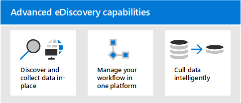

# Übersicht über Microsoft 365 Advanced eDiscoveryOverview of Microsoft 365 Advanced eDiscovery

Die Advanced eDiscovery-Lösung in Microsoft 365 baut auf den vorhandenen Microsoft eDiscovery- und Analysefunktionen auf.The Advanced eDiscovery solution in Microsoft 365 builds on the existing Microsoft eDiscovery and analytics capabilities. Advanced eDiscovery bietet einen End-to-End-Workflow zum Aufbewahren, Sammeln, Analysieren, Überprüfen und Exportieren von Inhalten, die für interne und externe Untersuchungen Ihrer Organisation relevant sind.Advanced eDiscovery provides an end-to-end workflow to preserve, collect, analyze, review, and export content that's responsive to your organization's internal and external investigations. Außerdem können Rechtsteams den gesamten Benachrichtigungs-Workflow einsehen, der für juristische Zwecke aufbewahrt wurde, und so mit den an einem Fall beteiligten Verwahrern kommunizieren.It also lets legal teams manage the entire legal hold notification workflow to communicate with custodians involved in a case.

## Advanced eDiscovery-FunktionenAdvanced eDiscovery capabilities

Advanced eDiscovery können Ihrer Organisation helfen, auf Rechtliches oder interne Untersuchungen zu reagieren, indem sie Daten ermitteln, wo sie sich befinden.Advanced eDiscovery can help your organization respond to legal matters or internal investigations by discovering data where it lives. Sie können eDiscovery-Workflows nahtlos verwalten, indem Sie Personen identifizieren, die von Interesse sind, und deren Datenquellen identifizieren, nahtlos Haltebereiche anwenden, um Daten zu speichern, und dann den Prozess der rechtlichen Aufbewahrung verwalten.You can seamlessly manage eDiscovery workflows by identifying persons of interest and their data sources, seamlessly apply holds to preserve data, and then manage the legal hold communication process. Durch das Sammeln von Daten aus der Quelle können Sie die Live-Microsoft 365-Plattform durchsuchen, um schnell zu finden, was Sie benötigen.By collecting data from the source, you can search the live Microsoft 365 platform to quickly find what you need. Intelligente Machine Learning-Funktionen wie tiefe Indizierung, E-Mail-Threading und Erkennung von Nahezu-Duplikaten helfen Ihnen auch dabei, große Datenmengen auf einen relevanten Datensatz zu reduzieren.Intelligent, machine learning capabilities such as deep indexing, email threading, and near duplicate detection also help you reduce large volumes of data to a relevant data set.

In den folgenden Abschnitten wird beschrieben, wie diese Advanced eDiscovery Funktionen Ihrer Organisation helfen können.The following sections describe how these Advanced eDiscovery capabilities can help your organization.

### Ermitteln und Sammeln von Daten an Ort und StelleDiscover and collect data in-place

Organisationen, die auf mehrere eDiscovery-Lösungen von Drittanbietern angewiesen sind, müssen traditionell große Datenmengen aus Microsoft 365 kopieren, um doppelte Daten zu verarbeiten und hosten zu müssen.Traditionally, organizations that rely on multiple third-party eDiscovery solutions require copying large volumes of data out of Microsoft 365 to process and having to host duplicate data. Diese Notwendigkeit erhöht die Zeit für die Suche nach relevanten Daten sowie das Risiko, die Kosten und die Komplexität der Verwaltung mehrerer Lösungen.This necessity increases the time to find relevant data and the risk, cost, and complexity of managing multiple solutions.

Advanced eDiscovery in Microsoft 365 können Sie Daten an der Quelle ermitteln und innerhalb Ihrer Microsoft 365 Sicherheits- und Compliance-Grenze bleiben.Advanced eDiscovery in Microsoft 365 lets you discover data at the source and staying within your Microsoft 365 security and compliance boundary.  Durch die direkte Erfassung von Daten aus dem Live-System reduziert Advanced eDiscovery die Reiberei des Zurückkehrens zur Quelle und reduziert unnötige Arbeit beim Auffinden fehlender Inhalte, was häufig bei Journalverzögerungen in herkömmlichen eDiscovery-Lösungen geschieht.By collecting data in-place from the live system, Advanced eDiscovery reduces the friction of going back to the source and reduces unnecessary work of having to find missing content, which often happens when journaling lags in traditional eDiscovery solutions.

Systemeigene Such- und Sammlungsfunktionen für Daten in Teams, Yammer, SharePoint Online, OneDrive for Business und Exchange Online verbessern die Datenermittlung weiter.Native search and collection capabilities for data in Teams, Yammer, SharePoint Online, OneDrive for Business, and Exchange Online further enhances data discovery. Beispiel: Advanced eDiscovery:For example,  Advanced eDiscovery:

- Rekonstruiert Teams Unterhaltungen (anstatt einzelne Nachrichten aus Unterhaltungen zurückzugeben).Reconstructs Teams conversations (instead of returning individual messages from conversations).

- Sammelt cloudbasierte Inhalte, die für Benutzer über Links oder moderne Anlagen in E-Mail-Nachrichten und Teams Chats freigegeben wurden.Collects cloud-based content shared with users by use of links or modern attachments in email message and Teams chats.

- Bietet integrierte Unterstützung für Hunderte von Nicht-Microsoft 365-Dateitypen.Has built-in support for hundreds of non-Microsoft 365 file types.

- Sammelt Daten aus Drittanbieterquellen (z. B. Bloomberg, Facebook, Slack und Zoom-Besprechungen), die in Microsoft 365 von [Datenconnectors](archiving-third-party-data.md)importiert und archiviert werden.Collects data from third-party sources (such as Bloomberg, Facebook, Slack, and Zoom Meetings) that's imported and archived in Microsoft 365 by [data connectors](archiving-third-party-data.md).

### Verwalten von eDiscovery-Workflows auf einer PlattformManage eDiscovery workflow in one platform

Advanced eDiscovery können Ihnen helfen, die Anzahl der eDiscovery-Lösungen zu reduzieren, auf die Sie sich verlassen müssen.Advanced eDiscovery can help you reduce the number of eDiscovery solutions you need to rely on. Es bietet einen optimierten End-to-End-Workflow, der alle innerhalb Microsoft 365 erfolgt.It provides a streamlined, end-to-end workflow, all which occurs within Microsoft 365. Advanced eDiscovery trägt dazu bei, die Reibungslose Identifizierung und Sammlung potenzieller Quellen relevanter Informationen zu verringern, indem eindeutige und freigegebene Datenquellen automatisch der Person zugeordnet werden, die von Interesse ist (auch als *Verwahrer* bezeichnet), und indem Berichte und Analysen zu potenziell relevanten Daten bereitgestellt werden, bevor sie zur Analyse und Überprüfung gesammelt werden.Advanced eDiscovery helps reduce the friction of identifying and collecting potential sources of relevant information by automatically mapping unique and shared data sources to the person of interest (known as a *custodian*), and by providing reporting and analytics on potentially relevant data prior to collecting it for analysis and review.

Darüber hinaus können Microsoft Graph-APIs Ihnen helfen, den eDiscovery-Workflow zu automatisieren und Advanced eDiscovery für benutzerdefinierte Lösungen zu erweitern.Additionally, Microsoft Graph APIs can help you automate the eDiscovery workflow and extend Advanced eDiscovery for custom solutions.

### Intelligentes Cullieren von DatenCull data intelligently

Intelligente Machine Learning-Funktionen in Advanced eDiscovery ihnen dabei helfen, die Menge der zu überprüfenden Daten zu reduzieren.Intelligent, machine learning capabilities in Advanced eDiscovery help you reduce the amount of data to review. Diese intelligenten Funktionen helfen Ihnen, große Datenmengen zu reduzieren und in einen relevanten Satz zu überstürzten.These intelligent capabilities help you reduce and cull large volumes of data to a relevant set. Beispielsweise hilft eine integrierte Prüfdateisatzabfrage, nur nach eindeutigen Inhalten zu filtern, indem nahezu Doppelte identifiziert werden.For example, a built-in review set query helps filter only for unique content by identifying near duplicates. Diese Funktion kann die Menge der zu überprüfenden Daten erheblich reduzieren.This capability can substantially reduce the amount of data to review.

Zusätzliche Machine Learning-Funktionen können relevante Daten mithilfe von Smarttags und technologieunterstützten Prüftools wie den Relevanzmodulen weiter verfeinern und identifizieren.Additional machine learning capabilities can further refine and identify relevant data using smart tags and technology assisted review tools like the Relevance modules.

## Advanced eDiscovery Ausrichtung an dem Electronic Discovery-ReferenzmodellAdvanced eDiscovery alignment with the Electronic Discovery Reference Model

Der integrierte Workflow von Advanced eDiscovery in Microsoft 365 entspricht dem eDiscovery-Prozess, der vom Electronic Discovery Reference Model (EDRM) beschrieben wird.The built-in workflow of Advanced eDiscovery in Microsoft 365 aligns with the eDiscovery process outlined by the Electronic Discovery Reference Model (EDRM).

(Bildquelle mit freundlicher Genehmigung von edrm.net.(Image source courtesy of edrm.net. Das Quellbild wurde unter der nicht portierbaren Lizenz von Creative Commons-Namensnennung 3.0 bereitgestellt.)The source image was made available under Creative Commons Attribution 3.0 Unported License.)

So unterstützt Advanced eDiscovery den EDRM-Workflow auf hohem Niveau:At a high level, here's how Advanced eDiscovery supports the EDRM workflow:

- **Erkennen.****Identification.** Nachdem Sie potenzielle Personen von Interesse in einer Ermittlung identifiziert haben, können Sie diese als Verwahrer (auch *Datenverwahrer* genannt, da sie möglicherweise über Informationen verfügen, die für die Ermittlung relevant sind) zu einem Advanced eDiscovery-Fall hinzufügen.After you identify potential persons of interest in an investigation, you can add them as custodians (also called *data custodians*, because they may possess information that's relevant to the investigation) to an Advanced eDiscovery case. Nachdem Benutzer als Verwahrer hinzugefügt wurden, ist es einfach, die Dokumente des Verwahrers beizubehalten, zu sammeln und zu überprüfen.After users are added as custodians, it's easy to preserve, collect, and review custodian documents.

- **Beibehaltung.****Preservation.** Um Daten, die für eine Ermittlung relevant sind, zu erhalten und zu schützen, können Sie mit Advanced eDiscovery die Datenquellen, die mit den Verwahrern eines Falles in Verbindung stehen, im Aufbewahrung für juristische Zwecke setzen.To preserve and protect data that's relevant to an investigation, Advanced eDiscovery lets you place a legal hold on the data sources associated with the custodians in a case. Sie können auch nicht-verwahrte Daten im Haltebereich setzen.You can also place non-custodial data on hold. Advanced eDiscovery verfügt auch über einen integrierten Kommunikations-Workflow, so dass Sie Benachrichtigungen per Aufbewahrung für juristische Zwecke an Verwahrer senden und deren Bestätigungen verfolgen können.Advanced eDiscovery also has a built-in communications workflow so you can send legal hold notifications to custodians and track their acknowledgments.

- **Sammlung.****Collection.** Nachdem Sie die für die Ermittlung relevanten Datenquellen identifiziert (und aufbewahrt) haben, können Sie mit dem integrierten Suchtool in Advanced eDiscovery nach den für den Fall möglicherweise relevanten Datenquellen (und ggf. nicht-verwahrten Datenquellen) suchen und Live-Daten aus diesen Quellen sammeln.After you identified (and preserved) the data sources relevant to the investigation, you can use the built-in search tool in Advanced eDiscovery search for and collect live data from the custodial data sources (and non-custodial data sources, if applicable) that may be relevant to the case.

- **Verarbeitung.****Processing.** Nachdem Sie alle für den Fall relevanten Daten gesammelt haben, werden diese im nächsten Schritt zur weiteren Prüfung und Analyse aufbereitet.After you've collected all data relevant to the case, the next step is process it for further review and analysis. Bei Advanced eDiscovery werden die von Ihnen in der Sammelphase identifizierten lokalen Daten an einen Azure-Speicherort (als *Prüfdateisatz* bezeichnet) kopiert, der Ihnen eine statische Ansicht der Falldaten bietet.In Advanced eDiscovery, the in-place data that you identified in the collection phase is copied to an Azure Storage location (called a *review set*), which provides you with a static view of the case data. 

- **Prüfung.****Review.** Nachdem Daten zu einem Prüfdateisatz hinzugefügt wurden, können Sie bestimmte Dokumente anzeigen und zusätzliche Abfragen ausführen, um die Daten auf das zu reduzieren, was für den Fall am relevantesten ist.After data has been added to a review set, you can view specific documents and run additional queries to reduce the data to what is most relevant to the case. Außerdem können bestimmte Dokumente mit Anmerkungen und Tags versehen werden.Also, can annotate and tag specific documents.

- **Analyse.****Analysis.** Advanced eDiscovery bietet ein integriertes Analyse-Tool, das Sie bei der weiteren Aussortierung von Daten aus dem Prüfdateisatz unterstützt, die Ihrer Meinung nach für die Ermittlung nicht relevant sind.Advanced eDiscovery provides integrated analytics tool that helps you further cull data from the review set that you determine isn't relevant to the investigation. Advance eDiscovery reduziert nicht nur das Volumen relevanter Daten, sondern hilft Ihnen auch, Kosten für rechtliche Prüfungen einzusparen, da Sie Inhalte so organisieren können, dass der Prüfungsprozess einfacher und effizienter wird.In addition to reducing the volume of relevant data, Advance eDiscovery also helps you save legal review costs by letting you organize content to make the review process easier and more efficient.

- **Erstellung** und **Präsentation.****Production** and **Presentation.** Wenn Sie so weit sind, können Sie Dokumente aus einem Prüfdateisatz zur rechtlichen Prüfung exportieren.When you're ready, you can export documents from a review set for legal review. Sie können Dokumente in ihrem nativen Format oder in einem EDRM-spezifizierten Format exportieren, damit sie in Prüfanwendungen von Drittanbietern importiert werden können.You can export documents in their native format or in an EDRM-specified format so they can be imported into third-party review applications.

## Abonnements und LizenzierungSubscriptions and licensing

Die Lizenzierung für Advanced eDiscovery erfordert das entsprechende Organisationsabonnement und eine Lizenzierung pro Benutzer.Licensing for Advanced eDiscovery requires the appropriate organization subscription and per-user licensing.

- **Organisationsabonnement:** Um auf Advanced eDiscovery im Microsoft 365 Compliance Center zugreifen zu können, muss Ihre Organisation über eine der folgenden Komponenten verfügen:**Organization subscription:** To access Advanced eDiscovery in the Microsoft 365 compliance center, your organization must have one of the following:

  - Microsoft 365 E5- oder Office 365 E5-AbonnementMicrosoft 365 E5 or Office 365 E5 subscription
  
  - Microsoft 365 E3-Abonnement mit E5-Compliance-Add-OnMicrosoft 365 E3 subscription with E5 Compliance add-on

  - Microsoft 365 E3 Abonnement mit E5 eDiscovery und Audit-Add-OnMicrosoft 365 E3 subscription with E5 eDiscovery and Audit add-on

  - Microsoft 365 Education A5- oder Office 365 Education A5-AbonnementMicrosoft 365 Education A5 or Office 365 Education A5 subscription

   Wenn Sie keinen vorhandenen Microsoft 365 E5 Plan haben und Advanced eDiscovery testen möchten, können Sie Ihrem vorhandenen Abonnement [Microsoft 365 hinzufügen](https://docs.microsoft.com/office365/admin/try-or-buy-microsoft-365) oder sich für eine Testversion von Microsoft 365 E5 [registrieren.](https://www.microsoft.com/microsoft-365/enterprise)If you don't have an existing Microsoft 365 E5 plan and want to try Advanced eDiscovery, you can [add Microsoft 365](https://docs.microsoft.com/office365/admin/try-or-buy-microsoft-365) to your existing subscription or [sign up for a trial](https://www.microsoft.com/microsoft-365/enterprise) of Microsoft 365 E5.

- **Lizenzierung pro Benutzer:** Um einen Benutzer als Verwahrer in einem Advance eDiscovery-Fall hinzuzufügen, muss diesem Benutzer je nach Organisationsabonnement eine der folgenden Lizenzen zugewiesen werden:**Per-user licensing:** To add a user as a custodian in an Advance eDiscovery case, that user must be assigned one of the following licenses, depending on your organization subscription:

  - Microsoft 365: Benutzern muss eine Microsoft 365 E5 Lizenz, eine E5 Compliance-Add-On-Lizenz oder eine E5 eDiscovery- und Überwachungs-Add-On-Lizenz zugewiesen werden.Microsoft 365: Users must be assigned a Microsoft 365 E5 license, an E5 Compliance add-on license, or an E5 eDiscovery and Audit add-on license. Microsoft 365 Education Benutzern muss eine A5-Lizenz zugewiesen werden.Microsoft 365 Education users must be assigned an A5 license.

  - Office 365: Benutzern muss eine Office 365 E5- oder Office 365 Education A5-Lizenz zugewiesen werden.Office 365: Users must be assigned an Office 365 E5 or Office 365 Education A5 license.

   Informationen zum Zuweisen von Lizenzen finden Sie unter [Zuweisen von Lizenzen zu Benutzern.](https://docs.microsoft.com/microsoft-365/admin/manage/assign-licenses-to-users)For information about how to assign licenses, see [Assign licenses to users](https://docs.microsoft.com/microsoft-365/admin/manage/assign-licenses-to-users).

> [!NOTE]
> Benutzer benötigen nur eine E5- oder A5-Lizenz (oder die entsprechende Add-On-Lizenz), um einem Advanced eDiscovery Fall als Verwahrer hinzugefügt zu werden.Users only need an E5 or A5 license (or the appropriate add-on license) to be added as custodians to an Advanced eDiscovery case. IT-Administratoren, eDiscovery-Manager, Führungskräfte, Paralegale oder Ermittler, die Advanced eDiscovery verwenden, um Fälle zu verwalten und Falldaten zu überprüfen, benötigen keine E5-, A5- oder Add-On-Lizenz.IT admins, eDiscovery managers, lawyers, paralegals, or investigators who use Advanced eDiscovery to manage cases and review case data don't need an E5, A5, or add-on license.

## Erste Schritte mit Advanced eDiscoveryGet started with Advanced eDiscovery

Es gibt zwei schnelle und einfache Schritte, um mit Advanced eDiscovery zu beginnen.There are two quick and easy steps to get started with Advanced eDiscovery.

|SchritteSteps  |BeschreibungDescription  |
|:---------|:---------|
|[Einrichten von Advanced eDiscoverySet up Advanced eDiscovery](get-started-with-advanced-ediscovery.md)| Nachdem Sie die Abonnement- und Lizenzierungsanforderungen überprüft haben, können Sie Berechtigungen zuweisen und organisationsweite Einstellungen konfigurieren, um mit Advanced eDiscovery zu beginnen.After verifying the subscription and licensing requirements, you can assign permissions and configure organization-wide settings to get started using Advanced eDiscovery.|
|[Erstellen und Verwalten von FällenCreate and manage cases](create-and-manage-advanced-ediscoveryv2-case.md) | Erstellen Sie Fälle, um den Advanced eDiscovery-Workflow für alle rechtlichen und anderen Arten von Untersuchungen in Ihrer Organisation zu verwalten.Create cases to manage the Advanced eDiscovery workflow for all legal and other types of investigations in your organization.|
|||

## architektur Advanced eDiscoveryAdvanced eDiscovery architecture

Hier ist ein Advanced eDiscovery Architekturdiagramm, das den End-to-End-Workflow in einer einzelnen Geo-Umgebung und in einer Multi-Geo-Umgebung sowie den End-to-End-Datenfluss zeigt, der am [EDRM](#advanced-ediscovery-alignment-with-the-electronic-discovery-reference-model)ausgerichtet ist.Here's an Advanced eDiscovery architecture diagram that shows the end-to-end workflow in a single-geo environment and in a multi-geo environment, and the end-to-end data flow that's aligned with the [EDRM](#advanced-ediscovery-alignment-with-the-electronic-discovery-reference-model).

[Als Bild anzeigenView as an image](../media/solutions-architecture-center/m365-advanced-ediscovery-architecture.png)

[Als PDF-Datei herunterladenDownload as a PDF file](https://download.microsoft.com/download/d/1/c/d1ce536d-9bcf-4d31-b75b-fcf0dc560665/m365-advanced-ediscovery-architecture.pdf)

[Als Visio Datei herunterladenDownload as a Visio file](https://download.microsoft.com/download/d/1/c/d1ce536d-9bcf-4d31-b75b-fcf0dc560665/m365-advanced-ediscovery-architecture.vsdx)
