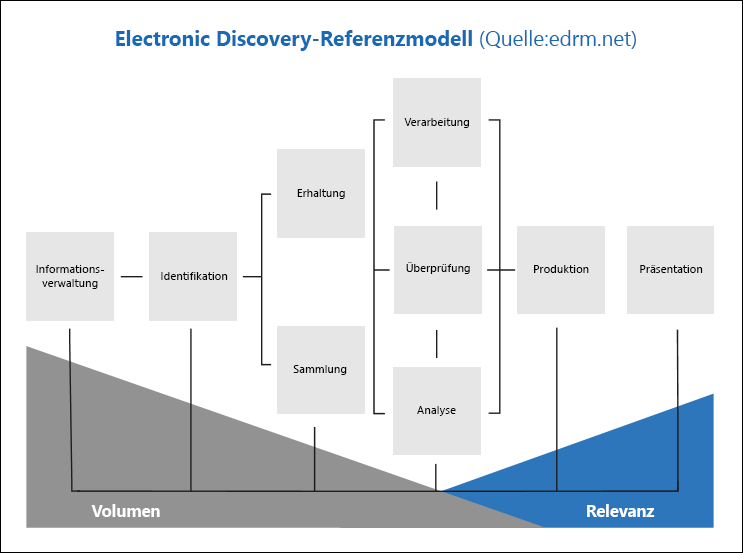

# Übersicht über die Advanced eDiscovery-Lösung in Microsoft 365

Die Advanced eDiscovery-Lösung in Microsoft 365 basiert auf den vorhandenen eDiscovery- und Analysefunktionen in Office 365. Diese neue Lösung mit dem Namen *Advanced eDiscovery* bietet einen End-to-End-Workflow zum Beibehalten, Sammeln, Überprüfen, Analysieren und Exportieren von Inhalten, die auf die internen und externen Ermittlungen Ihrer Organisation abgestimmt sind. Außerdem können Rechtsteams den gesamten Benachrichtigungs-Workflow einsehen, der für juristische Zwecke aufbewahrt wurde, und so mit den an einem Fall beteiligten Verwahrern kommunizieren. 

> [!NOTE]
> Für Advanced eDiscovery ist ein Abonnement für Office 365 oder Microsoft 365 E5 Enterprise erforderlich. Weitere Informationen zur erweiterten eDiscovery-Lizenzierung finden Sie unter [Microsoft 365 Licensing Guidance for Security & Compliance](https://docs.microsoft.com/office365/servicedescriptions/microsoft-365-service-descriptions/microsoft-365-tenantlevel-services-licensing-guidance/microsoft-365-security-compliance-licensing-guidance#advanced-ediscovery).

## Angepasste EDRM

Der integrierte Arbeitsablauf von Advanced eDiscovery stimmt mit dem eDiscovery-Prozess überein, der durch das EDRM (Electronic Discovery Reference Model) beschrieben wird. 

(Bildquelle mit freundlicher Genehmigung von edrm.net. Das Quellbild wurde unter der nicht portierbaren Lizenz von Creative Commons-Namensnennung 3.0 bereitgestellt.)

So unterstützt Advanced eDiscovery den EDRM-Workflow auf hohem Niveau:

- **Erkennen.** Nachdem Sie potenzielle Personen von Interesse in einer Ermittlung identifiziert haben, können Sie diese als Verwahrer (auch *Datenverwahrer* genannt, da sie möglicherweise über Informationen verfügen, die für die Ermittlung relevant sind) zu einem Advanced eDiscovery-Fall hinzufügen. Nachdem Benutzer als Verwahrer hinzugefügt wurden, ist es einfach, die Dokumente des Verwahrers beizubehalten, zu sammeln und zu überprüfen.

- **Beibehaltung.** Um Daten, die für eine Ermittlung relevant sind, zu erhalten und zu schützen, können Sie mit Advanced eDiscovery die Datenquellen, die mit den Verwahrern eines Falles in Verbindung stehen, im Aufbewahrung für juristische Zwecke setzen. Sie können auch nicht-verwahrte Daten im Haltebereich setzen. Advanced eDiscovery verfügt auch über einen integrierten Kommunikations-Workflow, so dass Sie Benachrichtigungen per Aufbewahrung für juristische Zwecke an Verwahrer senden und deren Bestätigungen verfolgen können.

- **Sammlung.** Nachdem Sie die für die Ermittlung relevanten Datenquellen identifiziert (und aufbewahrt) haben, können Sie mit dem integrierten Suchtool in Advanced eDiscovery nach den für den Fall möglicherweise relevanten Datenquellen (und ggf. nicht-verwahrten Datenquellen) suchen und Live-Daten aus diesen Quellen sammeln.

- **Verarbeitung.** Nachdem Sie alle für den Fall relevanten Daten gesammelt haben, werden diese im nächsten Schritt zur weiteren Prüfung und Analyse aufbereitet. Bei Advanced eDiscovery werden die von Ihnen in der Sammelphase identifizierten lokalen Daten an einen Azure-Speicherort (als *Prüfdateisatz* bezeichnet) kopiert, der Ihnen eine statische Ansicht der Falldaten bietet. 
 
- **Prüfung.** Nachdem Daten zu einem Prüfdateisatz hinzugefügt wurden, können Sie bestimmte Dokumente anzeigen und weitere Abfragen durchführen, um die Daten auf die für den Fall relevantesten zu reduzieren. Außerdem können bestimmte Dokumente mit Anmerkungen und Tags versehen werden.
 
- **Analyse.** Advanced eDiscovery bietet ein integriertes Analyse-Tool, das Sie bei der weiteren Aussortierung von Daten aus dem Prüfdateisatz unterstützt, die Ihrer Meinung nach für die Ermittlung nicht relevant sind. Advance eDiscovery reduziert nicht nur das Volumen relevanter Daten, sondern hilft Ihnen auch, Kosten für rechtliche Prüfungen einzusparen, da Sie Inhalte so organisieren können, dass der Prüfungsprozess einfacher und effizienter wird.

- **Erstellung** und **Präsentation.** Wenn Sie so weit sind, können Sie Dokumente aus einem Prüfdateisatz zur rechtlichen Prüfung exportieren. Sie können Dokumente in ihrem nativen Format oder in einem EDRM-spezifizierten Format exportieren, damit sie in Prüfanwendungen von Drittanbietern importiert werden können.

## Advanced eDiscovery-Workflow

Die folgenden Abschnitte beschreiben jeden Schritt des integrierten Workflows in Advanced eDiscovery. Der folgende Screenshot zeigt die Registerkarte **Startseite** eines Falls mit dem Namen *Produkthaftung 2019002*. Beachten Sie, dass die Workflow-Registerkarten oben auf der Seite in einer Reihenfolge angeordnet sind, die dem EDRM-Prozess entspricht. 

Weitere Informationen über den End-to-End-Workflow in Advanced eDiscovery finden Sie in diesem [Microsoft Mechanics-Video](https://go.microsoft.com/fwlink/?linkid=2066133).

## Verwalten von Depotbanken und Datenquellen ohne Freiheitsentzug

Verwenden Sie die Registerkarte **Quellen** , um Personen hinzuzufügen und zu verwalten, die Sie im Fall als interessierte Personen identifiziert haben, und andere Datenquellen, die möglicherweise nicht einer Depotbank zugeordnet sind. Wenn Sie Verwalter oder Datenquellen ohne Freiheitsentzug hinzufügen, können Sie schnell Aktionen durchführen, wie das Aufbewahren einer Aufbewahrungspflicht für Depotbank-und nicht-Freiheitsentzug-Datenquellen, die Kommunikation mit den Verwaltern und das Durchsuchen von Depotbank-und nicht-Freiheitsentzug-Datenquellen, um relevante Inhalte für den Fall zu sammeln. Wenn der Fall fortschreitet, können Sie ganz einfach neue Depotstellen oder Datenquellen ohne Freiheitsentzug hinzufügen oder aus dem Fall freigeben. Weitere Informationen finden Sie unter [Arbeiten mit Verwahrern in Advanced eDiscovery](managing-custodians.md).

## Verwaltung von Benachrichtigungen über Aufbewahrung für juristische Zwecke

Verwenden Sie die Registerkarte **Kommunikation**, um den Prozess der Kommunikation mit den Verwahrern des Falls zu verwalten. Eine Mitteilung zum Aufbewahrung für juristische Zwecke weist die Verwahrer an, alle Inhalte, die für den Fall relevant sind, aufzubewahren. Die Rechtsteams müssen in der Lage sein, die Mitteilungen zu verfolgen, die eingegangen sind, gelesen und von den Verwahrern bestätigt wurden. Der Kommunikations-Workflow in Advanced eDiscovery ermöglicht es Ihnen, Erstbenachrichtigungen, Erinnerungen, Freigabebescheide und Eskalationen zu erstellen und zu versenden, wenn die Verwahrer eine Hold-Benachrichtigung nicht bestätigen. Weitere Informationen finden Sie unter [Arbeiten mit Kommunikationen in Advanced eDiscovery](managing-custodian-communications.md).

## Verwaltung der Beibehaltung von Inhalten

Wenn Sie einen Verwahrer zu einem Fall hinzufügen, können Sie die Verwahrungsdaten im Haltebereich setzen. Verwenden Sie die Registerkarte **Haltebereiche**, um den Haltebereich zu verwalten, der beim Hinzufügen von Verwahrern erstellt wird, und um andere Aufbewahrung für juristische Zwecke zu verwalten, die mit dem Fall in Verbindung stehen; so können Sie beispielsweise nicht-verwahrte Datenquellen identifizieren und im Haltebereich setzen. Sie können auch jeden Haltebereich in dem Fall bearbeiten und ihn zu einem abfragebasierten Haltebereich machen, um nur den Inhalt zu erhalten, der der Abfrage entspricht. Sie könnten beispielsweise einen Datumsbereich zum Haltebereich hinzufügen, so dass nur Inhalte, die innerhalb eines bestimmten Datums erstellt wurden, erhalten bleiben. Sie können auch Statistiken über Inhalte im Haltebereich abrufen, den Haltebereich entfernen, nachdem er für den Fall nicht mehr relevant ist, oder ihn löschen. Weitere Informationen finden Sie unter [Verwalten von Haltebereichen in Advanced eDiscovery](managing-holds.md).

## Indizierung von Verwahrungsdaten

Wenn Sie einen Verwahrer und die entsprechenden Verwahrungsdatenquellen zu einem Fall hinzufügen, wird jedes teilweise indizierte Element aus einer Verwahrungsdatenquelle durch einen Prozess namens *Erweiterte Indizierung* neu indiziert. Dadurch können Verwahrungsinhalte wie Bilder, nicht unterstützte Dateitypen und andere potenziell nicht indizierte Inhalte vollständig durchsuchbar sein, wenn Sie Suchvorgänge durchführen, um Daten für den Fall zu sammeln. Verwenden Sie die Registerkarte **Verarbeitung**, um den Status der erweiterten Indizierung zu überwachen und Verarbeitungsfehler mit Hilfe eines Prozesses namens *Fehlerbehebung* zu beheben. Weitere Informationen finden Sie unter [Fehlerbehebung von Verarbeitungsfehlern in Advanced eDiscovery](processing-data-for-case.md).

## Erfassen von Falldaten

Verwenden Sie die Registerkarte **Suchvorgänge**, um Suchvorgänge zu erstellen, mit denen die lokalen und nicht-verwahrten Datenquellen nach für den Fall relevanten Inhalten durchsucht werden können. Sie können abfragebasierte Suchvorgänge (unter Verwendung von Stichwörtern und Bedingungen) erstellen und ausführen, um eine Reihe von E-Mail-Nachrichten und Dokumenten zu identifizieren, die für den Fall relevant sind und die Sie in den nachfolgenden Schritten des eDiscovery-Workflows weiter prüfen und analysieren möchten. Sie können eine oder mehrere Suchvorgänge im Zusammenhang mit dem Fall erstellen. Sie können das Suchtool auch zur Vorschau von Beispieldokumenten und zur Anzeige von Suchstatistiken verwenden, um die Suchergebnisse zu verfeinern und zu verbessern. Nachdem Sie sich davon überzeugt haben, dass die Suchergebnisse alle für den Fall relevanten Daten enthalten, fügen Sie die Suchergebnisse einem Prüfdateisatz zur weiteren Prüfung, Analyse und Aussonderung hinzu. Weitere Informationen finden Sie unter [Sammeln von Daten für einen Fall in Advanced eDiscovery](collecting-data-for-ediscovery.md).

## Prüfen und Analysieren von Falldaten

Verwenden Sie die Registerkarte **Prüfdateisätze**, um die Inhalte zu prüfen und zu analysieren, die Sie aus dem Live-System gesammelt und einem Prüfdateisatz hinzugefügt haben. Ein *Prüfdateisatz* ist eine statische Sammlung dieser Daten (d. h. eine Offline-Kopie der Daten) von Verwahrungsdaten (und ggf. von nicht-verwahrten Daten), die Sie in der vorherigen Phase des eDiscovery-Workflows erfasst haben. Wenn Sie Suchergebnisse zu einem Prüfdateisatz hinzufügen, wird ein Prozess ausgelöst, der Dateien aus Containern extrahiert, Metadaten extrahiert und Text extrahiert. Wenn dieser Prozess abgeschlossen ist, erstellt das System einen neuen Index aller von den Verwahrern gesammelten Daten und fügt sie dem Prüfdateisatz hinzu. Nachdem die Daten dem Prüfdateisatz hinzugefügt wurden, können Sie weitere Abfragen ausführen, um die Falldaten einzugrenzen, Daten als Text oder im nativen Dateiformat anzuzeigen und Dokumente im Prüfdateisatz zu kommentieren, zu redigieren und zu bezeichnen. Sie können auch erweiterte Analysen durchführen, wie z. B. die Identifizierung von Dokumentenduplikaten, E-Mail-Threading und Designs. Nachdem Sie die Daten nur auf die für den Fall relevanten Daten selektiert haben, können Sie die Dokumente entweder direkt herunterladen oder zusammen mit Dateimetadaten, Anmerkungen und beliebigen Tags exportieren. Weitere Informationen finden Sie unter:

- [Anzeigen von Dokumenten in einem Prüfdateisatz](view-documents-in-review-set.md)

- [Abfragen der Daten in einem Prüfdateisatz](review-set-search.md)

- [Markieren von Dokumenten in einem Prüfdateisatz](tagging-documents.md)

- [Analysieren von Daten in einem Prüfdateisatz](analyzing-data-in-review-set.md)

## Exportieren von Daten für die Prüfung und Präsentation

Nachdem Sie die Daten aus einem Prüfdateisatz exportiert haben, verwenden Sie die Registerkarte **Exporte**, um einen Exportauftrag zu verwalten und Daten aus einem Prüfdateisatz herunterzuladen. Wenn Sie einen Prüfdateisatz exportieren, werden die Daten in einen von Microsoft bereitgestellten Azure-Speicherort (oder einen von Ihrer Organisation verwalteten Azure-Speicherort) hochgeladen. Nachdem er auf Azure hochgeladen wurde, steht er dann zum Download auf einen lokalen Computer zur Verfügung. Den zum Herunterladen der exportierten Daten erforderlichen Speicherbewertungsschlüssel erhalten Sie auf der Registerkarte **Exporte**. Weitere Informationen finden Sie unter [Exportieren von Falldaten in Advanced eDiscovery](exporting-data-ediscover20.md).

## Verwalten der Aufträge

Verwenden Sie die Registerkarte **Aufträge**, um lang andauernde Prozesse für fallbezogene Aufgaben, die Sie initiiert haben, zu überwachen. Beispiele für Aufträge sind solche, die sich auf das erneute Indizieren, Suche und den Export von Falldaten beziehen. Wenn Sie z. B. auf der Registerkarte **Suchvorgänge** eine Suche erstellen, die viele Datenquellen umfasst, wird der Status dieses Suchvorgangs auf der Registerkarte **Aufträge** angezeigt. Weitere Informationen finden Sie unter [Verwalten von Aufträgen in Advanced eDiscovery](managing-jobs-ediscovery20.md).

## Konfigurieren von Falleinstellungen

Verwenden Sie die Registerkarte **Einstellungen**, um fallweite Einstellungen zu konfigurieren. Dazu gehören das Hinzufügen von Mitgliedern zu einem Fall, das Schließen oder Löschen eines Falls und die Konfiguration von Such- und Analyseeinstellungen.
