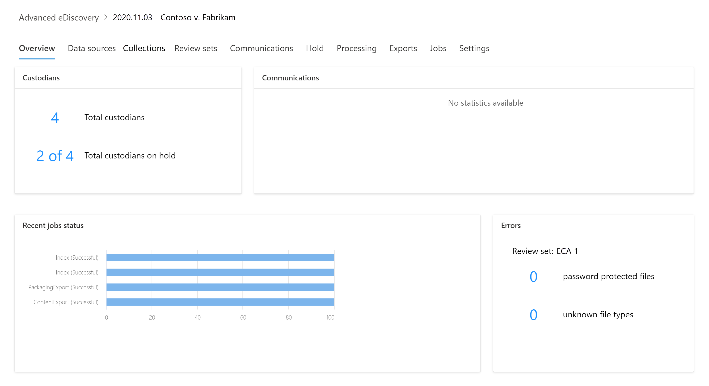

# Übersicht über Microsoft 365 Advanced eDiscovery

Die Advanced eDiscovery-Lösung in Microsoft 365 baut auf den vorhandenen Microsoft eDiscovery- und Analysefunktionen auf. Advanced eDiscovery bietet einen End-to-End-Workflow zum Beibehalten, Sammeln, Analysieren, Überprüfen, Analysieren und Exportieren von Inhalten, die auf interne und externe Untersuchungen Ihrer Organisation reagieren. Außerdem können Rechtsteams den gesamten Benachrichtigungs-Workflow einsehen, der für juristische Zwecke aufbewahrt wurde, und so mit den an einem Fall beteiligten Verwahrern kommunizieren.

Advanced eDiscovery kann Ihre Organisation dabei unterstützen, auf rechtliche Fragen oder interne Untersuchungen zu reagieren, indem daten dort ermittelt werden, wo sie sich leben. Sie können eDiscovery-Workflows nahtlos verwalten, indem Sie die von Interesse betroffenen Personen und deren Datenquellen identifizieren, datenaufbewahrte Daten nahtlos anwenden und dann den Kommunikationsprozess für die gesetzliche Aufbewahrerung verwalten. Durch das Sammeln von Daten aus der Quelle können Sie die Microsoft 365-Liveplattform durchsuchen, um schnell zu finden, was Sie benötigen. Intelligente, maschinelle Lernfunktionen wie tiefe Indizierung, E-Mail-Threading und Erkennung von nahezu doppelten Duplikaten helfen Ihnen auch, große Datenmengen auf eine relevante Datenmenge zu reduzieren.

In den folgenden Abschnitten wird beschrieben, wie diese Advanced eDiscovery-Funktionen Ihrer Organisation helfen können.

## Ermitteln und Sammeln von Daten

Organisationen, die auf mehrere eDiscovery-Lösungen von Drittanbietern angewiesen sind, müssen traditionell große Datenmengen aus Microsoft 365 kopieren, um doppelte Daten zu verarbeiten und zu hosten. Diese Notwendigkeit erhöht den Zeitaufwand für die Suche nach relevanten Daten sowie das Risiko, die Kosten und die Komplexität der Verwaltung mehrerer Lösungen.

Mit Advanced eDiscovery in Microsoft 365 können Sie Daten an der Quelle ermitteln und sich innerhalb Ihrer Microsoft 365-Sicherheits- und Compliancegrenze befinden.  Durch das sammeln von Daten aus dem Livesystem reduziert Advanced eDiscovery die Unterbrechung des Rückwegs zur Quelle und reduziert unnötigen Arbeitsaufwand bei der Suche nach fehlenden Inhalten, was häufig bei Journalverzögerungen in herkömmlichen eDiscovery-Lösungen geschieht.

Systemeigene Such- und Sammlungsfunktionen für Daten in Teams, Yammer, SharePoint Online, OneDrive for Business und Exchange Online verbessern die Datenermittlung weiter. Beispiel: Advanced eDiscovery:

- Rekonstruiert Teams-Unterhaltungen (anstatt einzelne Nachrichten aus Unterhaltungen zurück).

- Sammelt cloudbasierte Inhalte, die für Benutzer freigegeben wurden, indem Links oder moderne Anlagen in E-Mail-Nachrichten und Teams-Chats verwendet werden.

- Verfügt über integrierte Unterstützung für Hunderte von Nicht-Microsoft 365-Dateitypen.

- Sammelt Daten aus Drittanbieterquellen (z. B. Bloomberg, Facebook, Slack und Zoom-Besprechungen), die in Microsoft 365 von Datenconnectors importiert und [archiviert werden.](archiving-third-party-data.md)

## Verwalten von eDiscovery-Workflows auf einer Plattform

Advanced eDiscovery kann Ihnen helfen, die Anzahl der eDiscovery-Lösungen zu reduzieren, auf die Sie sich verlassen müssen. Es bietet einen optimierten End-to-End-Workflow, der in Microsoft 365 stattfindet. Advanced eDiscovery trägt dazu bei, die Unterbrechungen beim Identifizieren und Sammeln potenzieller Informationsquellen zu reduzieren, indem eindeutige und freigegebene Datenquellen automatisch der betreffenden Person zugeordnet werden (auch als Verwahrer *bezeichnet),* und indem Berichte und Analysen zu potenziell relevanten Daten vor der Erfassung zur Analyse und Überprüfung erstellt werden.

Darüber hinaus können Microsoft Graph-APIs Ihnen helfen, den eDiscovery-Workflow zu automatisieren und Advanced eDiscovery für benutzerdefinierte Lösungen zu erweitern.

## Intelligentes Ausspeichern von Daten

Intelligente Funktionen für maschinelles Lernen in Advanced eDiscovery helfen Ihnen, die zu überprüfende Datenmenge zu reduzieren. Diese intelligenten Funktionen helfen Ihnen, große Datenmengen zu reduzieren und auf einen relevanten Satz zu reduzieren. Beispielsweise kann eine integrierte Überprüfungssatzabfrage nur nach eindeutigen Inhalten filtern, indem nahezu doppelte Elemente identifiziert werden. Diese Funktion kann die zu überprüfende Datenmenge erheblich reduzieren.

Zusätzliche Machine Learning-Funktionen können relevante Daten mithilfe von Smarttags und technologiegestützten Überprüfungstools wie den Relevanzmodulen weiter verfeinern und identifizieren.

## Advanced eDiscovery-Architektur

Hier sehen Sie ein Diagramm der Advanced eDiscovery-Architektur, das den End-to-End-Workflow in einer Einzel-Geo-Umgebung und in einer Multi-Geo-Umgebung sowie den End-to-End-Datenfluss zeigt, der auf das [Electronic Discovery Reference Model](advanced-ediscovery-edrm.md) (EDRM) abgestimmt ist.

[Als Bild anzeigen](../media/solutions-architecture-center/m365-advanced-ediscovery-architecture.png)

[Herunterladen als PDF-Datei](https://download.microsoft.com/download/d/1/c/d1ce536d-9bcf-4d31-b75b-fcf0dc560665/m365-advanced-ediscovery-architecture.pdf)

[Herunterladen als Eine Visio-Datei](https://download.microsoft.com/download/d/1/c/d1ce536d-9bcf-4d31-b75b-fcf0dc560665/m365-advanced-ediscovery-architecture.vsdx)

Weitere Informationen über den End-to-End-Workflow in Advanced eDiscovery finden Sie in diesem [Microsoft Mechanics-Video](https://go.microsoft.com/fwlink/?linkid=2066133).

## Advanced eDiscovery-Workflow

In den folgenden Abschnitten werden die einzelnen Schritte im integrierten Workflow im Advanced eDiscovery-Tool im Microsoft 365 Compliance Center beschrieben. The following screenshot shows the **Overview** tab of a case named *2020.11.03 - Contoso v. Fabrikam*.

Ausführlichere Informationen finden Sie unter ["Verwalten des Advanced eDiscovery-Workflows".](create-and-manage-advanced-ediscoveryv2-case.md#manage-the-workflow)

### Verwalten von Verwahrern und Nicht-Verwahrer-Datenquellen

Verwenden Sie **die** Registerkarte "Datenquellen", um die Personen hinzuzufügen und zu verwalten, die Sie als personen identifiziert haben, die für den Fall von Interesse sind, und andere Datenquellen, die möglicherweise keinem Verwahrer zugeordnet sind. Wenn Sie Verwahrer oder Nicht-Verwahrer-Datenquellen hinzufügen, können Sie schnell Aktionen ausführen, z. B. die gesetzliche Haftierung von Datenquellen und Datenquellen ohne Verwahrer, die Kommunikation mit Verwahrern und das Durchsuchen von Datenquellen für Verwahrer und Nicht-Verwahrer, um Inhalte zu sammeln, die für den Fall relevant sind. Im Verlauf des Falls ist es ganz einfach, neue Verwahrer oder Datumsquellen ohne Verwahrer hinzuzufügen oder sie aus dem Fall frei zu lassen. Weitere Informationen finden Sie unter ["Arbeiten mit Verwahrern".](managing-custodians.md)

### Verwaltung von Benachrichtigungen über Aufbewahrung für juristische Zwecke

Verwenden Sie die Registerkarte **Kommunikation**, um den Prozess der Kommunikation mit den Verwahrern des Falls zu verwalten. Eine Mitteilung zum Aufbewahrung für juristische Zwecke weist die Verwahrer an, alle Inhalte, die für den Fall relevant sind, aufzubewahren. Die Rechtsteams müssen in der Lage sein, die Mitteilungen zu verfolgen, die eingegangen sind, gelesen und von den Verwahrern bestätigt wurden. Der Kommunikations-Workflow in Advanced eDiscovery ermöglicht es Ihnen, Erstbenachrichtigungen, Erinnerungen, Freigabebescheide und Eskalationen zu erstellen und zu versenden, wenn die Verwahrer eine Hold-Benachrichtigung nicht bestätigen. Weitere Informationen finden Sie unter ["Arbeiten mit Kommunikation".](managing-custodian-communications.md)

### Verwaltung der Beibehaltung von Inhalten

Wenn Sie einen Verwahrer zu einem Fall hinzufügen, können Sie die Verwahrungsdaten im Haltebereich setzen. Verwenden Sie die **Registerkarte** "Halte halte", um den Halteraum zu verwalten, der beim Hinzufügen von Verwahrern erstellt wurde, und um andere mit dem Fall verbundene rechtliche Halte halte zu verwalten. Sie können z. B. datenquellen, die keine Verwahrer sind, identifizieren und in einem Haltebewahrungsort platzieren. Sie können auch jeden Haltebereich in dem Fall bearbeiten und ihn zu einem abfragebasierten Haltebereich machen, um nur den Inhalt zu erhalten, der der Abfrage entspricht. Sie könnten beispielsweise einen Datumsbereich zum Haltebereich hinzufügen, so dass nur Inhalte, die innerhalb eines bestimmten Datums erstellt wurden, erhalten bleiben. Sie können auch Statistiken über Inhalte im Haltebereich abrufen, den Haltebereich entfernen, nachdem er für den Fall nicht mehr relevant ist, oder ihn löschen. Weitere Informationen finden Sie unter ["Verwalten von Halte halte".](managing-holds.md)

### Indizierung von Verwahrungsdaten

Wenn Sie einem Fall einen Verwahrer und die entsprechenden Verwahrerdatenquellen hinzufügen, wird jedes teilweise indizierte Element aus einer Verwaltungsdatenquelle durch einen Prozess namens Erweiterte Indizierung neu *indiziert.* Dadurch können Verwahrungsinhalte wie Bilder, nicht unterstützte Dateitypen und andere potenziell nicht indizierte Inhalte vollständig durchsuchbar sein, wenn Sie Suchvorgänge durchführen, um Daten für den Fall zu sammeln. Verwenden Sie die Registerkarte **Verarbeitung**, um den Status der erweiterten Indizierung zu überwachen und Verarbeitungsfehler mit Hilfe eines Prozesses namens *Fehlerbehebung* zu beheben. Weitere Informationen finden Sie unter [Beheben von Verarbeitungsfehlern.](processing-data-for-case.md)

### Erfassen von Falldaten

Verwenden Sie die Registerkarte **Suchvorgänge**, um Suchvorgänge zu erstellen, mit denen die lokalen und nicht-verwahrten Datenquellen nach für den Fall relevanten Inhalten durchsucht werden können. Sie können abfragebasierte Suchvorgänge (unter Verwendung von Stichwörtern und Bedingungen) erstellen und ausführen, um eine Reihe von E-Mail-Nachrichten und Dokumenten zu identifizieren, die für den Fall relevant sind und die Sie in den nachfolgenden Schritten des eDiscovery-Workflows weiter prüfen und analysieren möchten. Sie können eine oder mehrere Suchvorgänge im Zusammenhang mit dem Fall erstellen. Sie können das Suchtool auch zur Vorschau von Beispieldokumenten und zur Anzeige von Suchstatistiken verwenden, um die Suchergebnisse zu verfeinern und zu verbessern. Nachdem Sie sich davon überzeugt haben, dass die Suchergebnisse alle für den Fall relevanten Daten enthalten, fügen Sie die Suchergebnisse einem Prüfdateisatz zur weiteren Prüfung, Analyse und Aussonderung hinzu. Weitere Informationen finden Sie unter ["Sammeln von Daten für einen Fall".](collecting-data-for-ediscovery.md)

### Prüfen und Analysieren von Falldaten

Verwenden Sie die Registerkarte "Rezensionssätze", um die Inhalte zu überprüfen und zu analysieren, die Sie aus dem Livesystem gesammelt und einem Überprüfungssatz hinzugefügt haben.  Ein  Überprüfungssatz ist eine statische Sammlung dieser Daten (mit anderen Worten, eine Offlinekopie von Daten) von Verwahrerdaten (und gegebenenfalls nicht verwahrten Daten), die Sie in der vorherigen Phase des eDiscovery-Workflows erfasst haben. Wenn Sie einem Überprüfungssatz Suchergebnisse hinzufügen, wird ein Prozess ausgelöst, um Dateien aus Containern zu extrahieren, Metadaten zu extrahieren und Text zu extrahieren. Wenn dieser Prozess abgeschlossen ist, erstellt das System einen neuen Index aller von den Verwahrern gesammelten Daten und fügt sie dem Prüfdateisatz hinzu. Nachdem die Daten dem Prüfdateisatz hinzugefügt wurden, können Sie weitere Abfragen ausführen, um die Falldaten einzugrenzen, Daten als Text oder im nativen Dateiformat anzuzeigen und Dokumente im Prüfdateisatz zu kommentieren, zu redigieren und zu bezeichnen. Sie können auch erweiterte Analysen durchführen, z. B. das Identifizieren von Dokumentduplizierung, E-Mail-Threading und Designs. Nachdem Sie die Daten nur auf die für den Fall relevanten Daten selektiert haben, können Sie die Dokumente entweder direkt herunterladen oder zusammen mit Dateimetadaten, Anmerkungen und beliebigen Tags exportieren. Weitere Informationen finden Sie unter:

- [Anzeigen von Dokumenten in einem Prüfdateisatz](view-documents-in-review-set.md)

- [Abfragen der Daten in einem Prüfdateisatz](review-set-search.md)

- [Markieren von Dokumenten in einem Prüfdateisatz](tagging-documents.md)

- [Analysieren von Daten in einem Prüfdateisatz](analyzing-data-in-review-set.md)

### Exportieren von Daten für die Prüfung und Präsentation

Nachdem Sie die Daten aus einem Prüfdateisatz exportiert haben, verwenden Sie die Registerkarte **Exporte**, um einen Exportauftrag zu verwalten und Daten aus einem Prüfdateisatz herunterzuladen. Wenn Sie einen Prüfdateisatz exportieren, werden die Daten in einen von Microsoft bereitgestellten Azure-Speicherort (oder einen von Ihrer Organisation verwalteten Azure-Speicherort) hochgeladen. Nachdem er auf Azure hochgeladen wurde, steht er dann zum Download auf einen lokalen Computer zur Verfügung. Auf der Registerkarte "Exporte" erhalten Sie den Speicher-Bewertungsschlüssel, der zum Herunterladen der **exportierten Daten erforderlich** ist. Weitere Informationen finden Sie unter [Exportieren von Falldaten.](exporting-data-ediscover20.md)

### Verwalten der Aufträge

Verwenden Sie die Registerkarte **Aufträge**, um lang andauernde Prozesse für fallbezogene Aufgaben, die Sie initiiert haben, zu überwachen. Beispiele für Aufträge sind solche, die sich auf das erneute Indizieren, Suche und den Export von Falldaten beziehen. Wenn Sie beispielsweise eine Suche  auf der Registerkarte "Suchen" erstellen, die viele Datenquellen enthält, wird der Status dieses Suchvorgangs auf der Registerkarte **"Aufträge"** angezeigt. Weitere Informationen finden Sie unter ["Aufträge verwalten".](managing-jobs-ediscovery20.md)

### Konfigurieren von Falleinstellungen

Verwenden Sie die Registerkarte **Einstellungen**, um fallweite Einstellungen zu konfigurieren. Dazu gehören das Hinzufügen von Mitgliedern zu einem Fall, das Schließen oder Löschen eines Falls und die Konfiguration von Such- und Analyseeinstellungen. Weitere Informationen finden Sie unter:

- [Hinzufügen von Mitgliedern zu einem Fall](add-or-remove-members-from-a-case-in-advanced-ediscovery.md)

- [Schließen oder Löschen eines Falls](close-or-delete-case.md)

- [Konfigurieren der Such- und Analyseeinstellungen](configure-search-and-analytics-settings-in-advanced-ediscovery.md)
