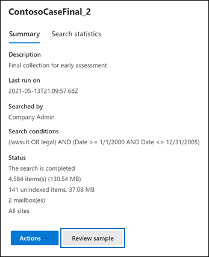

# Anzeigen einer Vorschau von eDiscovery-Suchergebnissen

Nachdem Sie eine Inhaltssuche oder eine mit einem Core eDiscovery-Fall zugeordnete Suche ausgeführt haben, können Sie eine Vorschau einer Stichprobe der von der Suche zurückgegebenen Ergebnisse anzeigen. Mit der Vorschau von Elementen, die von der Suchabfrage zurückgegeben wurden, können Sie bestimmen, ob die Suche die Ergebnisse zurückgesendet, die Sie möchten, oder ob Sie die Suchabfrage ändern müssen und die Suche erneut ausführen müssen.

So zeigen Sie eine Stichprobe der von einer Suche zurückgegeben Ergebnisse:

1. Wechseln Sie im Microsoft 365 Compliance Center zur Seite „Inhaltssuche“ oder zu einem Core eDiscovery-Fall.

2. Wählen Sie „Suche“ aus, um die Flyoutseite anzuzeigen.

3. Klicken Sie unten auf der Flyoutseite auf **Stichprobe überprüfen**.

   

   Es wird eine Seite mit einer Stichprobe der Suchergebnisse angezeigt.

4. Wählen Sie ein Element aus, um dessen Inhalt im Lesebereich anzuzeigen.

   

   Beachten Sie, dass im vorherigen Screenshot Schlüsselwörter aus der Suchabfrage hervorgehoben werden, wenn Sie eine Vorschau von Elementen anzeigen.

## So werden die Beispiele für Suchergebnisse ausgewählt

Zur Vorschau stehen maximal 1 000 zufällig ausgewählte Elemente zur Verfügung. Die für die Vorschau verfügbaren Elemente müssen nicht nur zufällig ausgewählt werden, sondern müssen auch die folgenden Kriterien erfüllen:

- Es können maximal 100 Elemente aus einem einzigen Inhaltsspeicherort (einem Postfach oder einer Website) in der Vorschau angezeigt werden. Dies bedeutet, dass möglicherweise weniger als 1 000 Elemente zur Vorschau zur Verfügung stehen. Wenn Sie beispielsweise vier Postfächer durchsuchen und die Suche 1 500 geschätzte Elemente zurückgibt, stehen nur 400 zur Vorschau zur Verfügung, da nur 100 Elemente aus jedem Postfach in der Vorschau angezeigt werden können.

- Bei Postfachelementen stehen nur E-Mail-Nachrichten zur Vorschau zur Verfügung. Elemente wie Aufgaben, Kalenderelemente und Kontakte können nicht in der Vorschau angezeigt werden.

- Bei Websiteelementen stehen nur Dokumente zur Vorschau zur Verfügung. Elemente wie Ordner, Listen oder Listenanlagen können nicht in der Vorschau angezeigt werden.

## Unterstützte Dateitypen beim Anzeigen der Suchergebnisse in der Vorschau

Unterstützte Dateitypen können im Vorschaufenster angezeigt werden. Wenn ein Dateityp nicht unterstützt wird, müssen Sie eine Kopie der Datei auf Ihren lokalen Computer herunterladen (indem Sie auf **Originalelement herunterladen** klicken). Bei ASPX-Webseiten ist die URL der Seite eingeschlossen, Sie haben möglicherweise jedoch keine Berechtigungen zum Zugriff auf die Seite. Nicht indizierte Elemente können nicht in der Vorschau angezeigt werden.

Die folgenden Dateitypen werden unterstützt und können im Suchergebnisbereich in einer Vorschau angezeigt werden.
  
- .TXT, .HTML, .MHTML

- .EML

- .DOC, .DOCX, .DOCM

- .PPTM, .PPTX

- .PDF

Darüber hinaus werden die folgenden Dateicontainertypen unterstützt. Eine Liste der Dateien in einem Container können Sie im Vorschaubereich anzeigen.
  
- .ZIP

- .GZIP